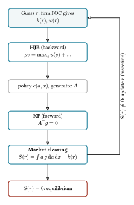
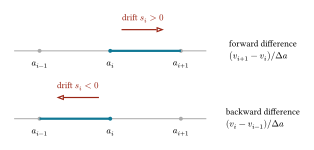
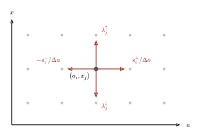

# Appendix B — 連続時間モデル

Code

- [Show All Code](javascript:void(0))

- [Hide All Code](javascript:void(0))

- 

  ------------------------------------------------------------------------

- [View Source](javascript:void(0))

``` julia
using LinearAlgebra
using SparseArrays
using Plots
using LaTeXStrings
using QuantEcon
using PrettyTables
```

本文の章はすべて離散時間でモデルを組んできましたが, 現代のマクロ経済学では連続時間の定式化も広く使われています. この章の前半では, 連続時間の確率過程 (ブラウン運動, 伊藤積分, OU 過程) と最大値原理 (HJB 方程式) という理論の道具を整えます. 後半では, その道具を使って Aiyagari モデルの連続時間版を**有限差分法** (finite difference method) で解きます ([Achdou et al. 2022](#ref-achdou2022)).

## B.1 確率過程

連続時間の確率過程は, 時間 \\t\\ に対してランダムな値をとる関数 \\x_t\\ の族 \\(x_t)\_{t \geq 0}\\ として定義されます. 連続時間の確率過程として基礎になるのは, 連続的なノイズを表すブラウン運動 (Brownian motion) です.

### B.1.1 ブラウン運動

> **NOTE:**
>
> \\b_0 = 0\\ を満たす確率過程 \\(b_t)\_{t \geq 0}\\ は次の性質を満たすとき, ブラウン運動と呼ばれる.
>
> - 独立増分: 任意の \\0 \leq t_1 \< t_2 \< \cdots \< t_n\\ に対して, \\b\_{t_2} - b\_{t_1}, b\_{t_3} - b\_{t_2}, \ldots, b\_{t_n} - b\_{t\_{n-1}}\\ は独立である.
> - 正規性: 任意の \\t\\ に対して, \\b_t \sim \mathcal{N}(\mu t, \sigma^2 t)\\
> - 連続パス: \\b_t\\ は \\t\\ の関数として連続である.
>
> 特に, \\\mu = 0, \sigma = 1\\ の場合を標準ブラウン運動と呼ぶ.

なお標準ブラウン運動 \\B_t\\ は明らかに \\B\_{t+1} - B_t \sim \mathcal{N}(0, 1)\\ を満たすので, 離散時間のホワイトノイズの連続時間版とみなすことができます.

後で伊藤積分や伊藤の補題で繰り返し使う \\(dB_t)^2 = dt\\ という計算規則は, ブラウン運動の二次変分 (quadratic variation) が時間 \\t\\ に等しいという性質に由来します.

**命題 B.1 (ブラウン運動の二次変分)** 標準ブラウン運動 \\B_t\\ に対して, 区間 \\\[0, t\]\\ の分割 \\0 = s_0 \< s_1 \< \cdots \< s_n = t\\ を考え, その幅 (メッシュ) を \\\\P\\ := \max_i (s\_{i+1} - s_i)\\ とする. メッシュを \\0\\ に近づけると, 増分の二乗和は \\t\\ に二乗平均収束する.

\\ \sum\_{i=0}^{n-1} \left(B\_{s\_{i+1}} - B\_{s_i}\right)^2 \\\xrightarrow{\\ L^2\\ }\\ t \qquad (\\P\\ \to 0). \\

これを微分の記法で略記したものが \\(dB_t)^2 = dt\\ である.

*Proof*. 二乗和を \\S := \sum\_{i=0}^{n-1} \Delta_i^2\\ (ただし \\\Delta_i := B\_{s\_{i+1}} - B\_{s_i}\\, 区間幅 \\\delta_i := s\_{i+1} - s_i\\) と書く. \\S\\ が \\t\\ に二乗平均収束 (\\L^2\\ 収束) するとは, 定義により

\\ \mathbb{E}\left\[(S - t)^2\right\] \longrightarrow 0 \qquad (\\P\\ \to 0) \\

が成り立つことである. これを示す. ブラウン運動の正規性と独立増分性から \\\Delta_i \sim \mathcal{N}(0, \delta_i)\\ で互いに独立である.

Step1: \\\mathbb{E}\[\Delta_i^2\] = \text{Var}(\Delta_i) = \delta_i\\ なので, 区間幅の総和が \\t\\ であることから

\\ \mathbb{E}\[S\] = \sum_i \delta_i = t. \\

Step2: \\\Delta_i^2\\ は独立なので分散は和になる. 正規分布 \\\mathcal{N}(0, \delta_i)\\ は \\\mathbb{E}\[\Delta_i^4\] = 3\delta_i^2\\ を満たすから, \\\text{Var}(\Delta_i^2) = 3\delta_i^2 - \delta_i^2 = 2\delta_i^2\\ であり,

\\ \text{Var}(S) = \sum_i 2\delta_i^2 \le 2 \left(\max_i \delta_i\right) \sum_i \delta_i = 2 t\\ \\P\\. \\

Step3: \\\mathbb{E}\[S\] = t\\ なので二乗平均誤差は分散に一致し,

\\ \mathbb{E}\left\[(S - t)^2\right\] = \text{Var}(S) \le 2 t\\ \\P\\ \xrightarrow{\\ \\P\\ \to 0\\ } 0. \\

よって \\S \xrightarrow{\\ L^2\\ } t\\ が成り立つ.

### B.1.2 伊藤積分

ここからブラウン運動を含む確率微分方程式を扱います. このとき, 伊藤積分を用います.

> **NOTE:**
>
> 過去の情報のみに依存する関数 \\f_s\\ と標準ブラウン運動 \\B_t\\ に対して, 伊藤積分 \\\int_0^t f_s\\ dB_s\\ を, 区間分割 \\0 = s_0 \< s_1 \< \cdots \< s_n = t\\ に沿った和の二乗平均極限として定義する.
>
> \\ \int_0^t f_s\\ dB_s := \lim\_{\max_i \|s\_{i+1} - s_i\| \to 0} \sum\_{i=0}^{n-1} f\_{s_i}\\\left(B\_{s\_{i+1}} - B\_{s_i}\right). \\
>
> このとき次の2つの性質が成り立つ.
>
> - 平均ゼロ: \\\displaystyle \mathbb{E}\left\[\int_0^t f_s\\ dB_s\right\] = 0\\
> - 伊藤の等長性 (Itô isometry): \\\displaystyle \mathbb{E}\left\[\left(\int_0^t f_s\\ dB_s\right)^2\right\] = \int_0^t \mathbb{E}\left\[f_s^2\right\]\\ ds\\

各増分 \\B\_{s\_{i+1}} - B\_{s_i}\\ を区間の左端 \\s_i\\ の値 \\f\_{s_i}\\ で評価する点が重要です. これにより, \\f\_{s_i}\\ は区間 \\\[s_i, s\_{i+1}\]\\ の将来の増分 \\B\_{s\_{i+1}} - B\_{s_i}\\ に依存しない (独立である) という性質が使えます. この独立性を踏まえると, 平均ゼロは直感的です.

\\ \mathbb{E}\left\[f\_{s_i} \Delta_i\right\] = \mathbb{E}\[f\_{s_i}\]\\ \mathbb{E}\[\Delta_i\] = 0. \\

等長性に関しては, 和の二乗を展開すると, 異なる区間の積 (\\i \neq j\\) は独立かつ平均ゼロより消え, 対角項だけが残ります. 各対角項は \\\mathbb{E}\[f\_{s_i}^2\\ \Delta_i^2\] = \mathbb{E}\[f\_{s_i}^2\]\\ \mathbb{E}\[\Delta_i^2\]\\ となるので, [命題 prp-bm-qv](#prp-bm-qv) の二次変分を使うと,

\\ \sum_i \mathbb{E}\[f\_{s_i}^2\\ \Delta_i^2\] = \sum_i \mathbb{E}\[f\_{s_i}^2\]\\ (s\_{i+1} - s_i) \xrightarrow{\\ n \to \infty\\ } \int_0^t \mathbb{E}\[f_s^2\]\\ ds. \\

微分の記法でいえば, \\\mathbb{E}\[dB_t\] = 0\\ が平均ゼロを, \\(dB_t)^2 = dt\\ が等長性を生んでいる, と見ることができます.

**命題 B.2 (伊藤積分の正規性)** 被積分関数 \\f_s\\ が決定論的な (\\B_s\\ に依存しない) とき, 伊藤積分は正規分布に従う.

\\ \int_0^t f_s\\ dB_s \\\sim\\ \mathcal{N}\left(0,\\ \int_0^t f_s^2\\ ds\right). \\

*Proof*. 伊藤積分は近似和 \\\sum_i f\_{s_i}\\ \Delta_i\\ (\\\Delta_i := B\_{s\_{i+1}} - B\_{s_i}\\) の \\L^2\\ 極限である. \\f_s\\ が決定論的なら \\f\_{s_i}\\ は定数なので, 各項は \\f\_{s_i}\\ \Delta_i \sim \mathcal{N}\left(0,\\ f\_{s_i}^2 (s\_{i+1} - s_i)\right)\\ で正規である. さらにブラウン運動の独立増分性から \\\Delta_i\\ は互いに独立なので, 独立な正規確率変数の和である近似和もまた正規分布に従う.

\\ \sum_i f\_{s_i}\\ \Delta_i \\\sim\\ \mathcal{N}\left(0,\\ \sum_i f\_{s_i}^2 (s\_{i+1} - s_i)\right). \\

この近似和は \\\\P\\ \to 0\\ で伊藤積分に \\L^2\\ 収束し, その分散は \\\sum_i f\_{s_i}^2 (s\_{i+1} - s_i) \to \int_0^t f_s^2\\ ds\\ に収束する. 正規分布の族は分布収束に関して閉じている[^1] ので, 平均ゼロ性と合わせて, 極限である伊藤積分も正規分布 \\\mathcal{N}\left(0,\\ \int_0^t f_s^2\\ ds\right)\\ に従う.

### B.1.3 Orstein-Uhlenbeck 過程

AR(1) 過程の連続時間版として, Orstein-Uhlenbeck (OU) 過程を考えます. OU過程は以下の確率微分方程式で定義されます.

> **NOTE:**
>
> OU過程 \\x_t\\ は以下の確率微分方程式で定義される.
>
> \\ dx_t = -\gamma (x_t - \mu) dt + \sigma dB_t. \\
>
> ここで \\B_t\\ は標準ブラウン運動.

**命題 B.3 (OU過程の解)** OU過程 \\x_t\\ は次のように陽に解ける.

\\ x_t = \mu + (x_0 - \mu) e^{-\gamma t} + \sigma \int_0^t e^{-\gamma (t - s)}\\ dB_s. \tag{B.1}\\

*Proof*. 確率微分方程式を積分因子 (integrating factor) \\e^{\gamma t}\\ を用いて解く. 積分因子は決定論的なので, 通常の積の微分法則が使えて

\\ d\left(e^{\gamma t}(x_t - \mu)\right) = \gamma e^{\gamma t}(x_t - \mu)\\ dt + e^{\gamma t}\\ dx_t. \\

ここに \\dx_t = -\gamma (x_t - \mu)\\ dt + \sigma\\ dB_t\\ を代入するとドリフト項が打ち消し合い,

\\ d\left(e^{\gamma t}(x_t - \mu)\right) = e^{\gamma t}\\ \sigma\\ dB_t. \\

両辺を \\0\\ から \\t\\ まで積分する. 左辺は微分を積分した増分 \\\left\[e^{\gamma s}(x_s - \mu)\right\]\_0^t\\ なので,

\\ e^{\gamma t}(x_t - \mu) - (x_0 - \mu) = \sigma \int_0^t e^{\gamma s}\\ dB_s. \\

両辺を \\e^{\gamma t}\\ で割ると, 解が陽に求まる.

\\ x_t = \mu + (x_0 - \mu)\\ e^{-\gamma t} + \sigma \int_0^t e^{-\gamma (t - s)}\\ dB_s. \\

**命題 B.4 (OU過程の平均と分散)** \\ \mathbb{E}\[x_t\] = \mu + (x_0 - \mu)e^{-\gamma t}, \quad \text{Var}(x_t) = \frac{\sigma^2}{2\gamma} \left(1 - e^{-2\gamma t}\right). \\

また, \\t \to \infty\\ のとき, \\x_t\\ は平均 \\\mu\\, 分散 \\\frac{\sigma^2}{2\gamma}\\ の正規分布に収束する.

*Proof*. Step1: [式 eq-ou-solution](#eq-ou-solution) の期待値をとる. 右辺第3項は伊藤積分なので平均ゼロであり,

\\ \mathbb{E}\[x_t\] = \mu + (x_0 - \mu)\\ e^{-\gamma t}. \\

Step2: [式 eq-ou-solution](#eq-ou-solution) より \\x_t - \mathbb{E}\[x_t\] = \sigma \int_0^t e^{-\gamma (t - s)}\\ dB_s\\ である. 被積分関数 \\e^{-\gamma(t-s)}\\ は決定論的なので, 伊藤の等長性を用いると

\\ \text{Var}(x_t) = \sigma^2\\ \mathbb{E}\left\[\left(\int_0^t e^{-\gamma (t - s)}\\ dB_s\right)^{2}\right\] = \sigma^2 \int_0^t e^{-2\gamma (t - s)}\\ ds. \\

\\\tau = t - s\\ と置換すると \\\displaystyle \int_0^t e^{-2\gamma (t - s)}\\ ds = \int_0^t e^{-2\gamma \tau}\\ d\tau = \frac{1 - e^{-2\gamma t}}{2\gamma}\\ なので,

\\ \text{Var}(x_t) = \frac{\sigma^2}{2\gamma}\left(1 - e^{-2\gamma t}\right). \\

Step 3: 決定論的な被積分関数に対する伊藤積分は正規分布に従うので, [式 eq-ou-solution](#eq-ou-solution) より \\x_t\\ も正規分布である. \\t \to \infty\\ で平均は \\\mu\\, 分散は \\\dfrac{\sigma^2}{2\gamma}\\ に収束するから, \\x_t\\ は定常分布 \\\mathcal{N}\left(\mu,\\ \dfrac{\sigma^2}{2\gamma}\right)\\ に収束する.

## B.2 最大値原理

### B.2.1 HJB方程式 (Deterministic)

復習として, ノイズのない決定論的な最適制御問題の Hamilton-Jacobi-Bellman (HJB) 方程式を導きます.

> **NOTE:**
>
> 状態 \\x_t\\ が制御 \\u_t\\ のもとで
>
> \\ \dot{x}\_t = g(x_t, u_t) \\
>
> に従い, 意思決定者は割引率 \\\rho\\ で
>
> \\ V(x_0) = \max\_{\\u_t\\} \int_0^{\infty} e^{-\rho t} f(x_t, u_t)\\ dt \\
>
> を最大化するとする. このとき, 最適価値関数 \\V(x)\\ は次のHJB方程式を満たす.
>
> \\ \rho V(x) = \max\_{u}\left\\ f(x, u) + V'(x)\\ g(x, u) \right\\. \tag{B.2}\\

*Proof*. 微小区間 \\\[t, t + dt\]\\ に最適性原理 (principle of optimality) を適用する. いま \\dt\\ だけ制御 \\u\\ を選び, 以降を最適に続けると

\\ V(x) = \max\_{u}\left\\ f(x, u)\\ dt + e^{-\rho\\ dt}\\ V(x\_{t+dt}) \right\\. \\

決定論的なので \\x\_{t+dt} = x + g(x, u)\\ dt + o(dt)\\ であり, テイラー展開より

\\ V(x\_{t+dt}) = V(x) + V'(x)\\ g(x, u)\\ dt + o(dt). \\ これに \\e^{-\rho\\ dt} \approx 1 - \rho\\ dt\\ を代入し, \\dt\\ の1次まで残すと

\\ V(x) = \max\_{u}\left\\ V(x) + \left(f(x, u) + V'(x)\\ g(x, u) - \rho V(x)\right) dt \right\\ + o(dt). \\

両辺から \\V(x)\\ を引いて \\dt\\ で割り, \\dt \to 0\\ とすると [式 eq-hjb-det](#eq-hjb-det) を得る.

ここに確率的なノイズを加えた場合, HJB方程式を導くには伊藤の補題が必要になります.

### B.2.2 伊藤の補題

> **NOTE:**
>
> \\x_t\\ が確率微分方程式 \\dx_t = g_t\\ dt + \sigma_t\\ dB_t\\ (\\g_t\\ はドリフト, \\\sigma_t\\ は拡散係数で, ともに時刻 \\t\\ までの情報に依存してよい) に従うとき, 2階連続微分可能な関数 \\\phi\\ に対して
>
> \\ \begin{aligned} d\phi(x_t) &= \phi'(x_t)\\ dx_t + \frac{1}{2}\phi''(x_t)\\ (dx_t)^2 \\ &= \left\[\phi'(x_t)\\ g_t + \frac{1}{2}\phi''(x_t)\\ \sigma_t^2\right\] dt + \phi'(x_t)\\ \sigma_t\\ dB_t. \end{aligned} \\

*Proof*. \\\phi(x_t)\\ の微小時間 \\\[t, t + dt\]\\ での変化をテイラー展開し, 2次の項まで残すと

\\ \phi(x\_{t+dt}) - \phi(x_t) = \phi'(x_t)\\ dx_t + \frac{1}{2}\phi''(x_t)\\ (dx_t)^2 + o\left((dx_t)^2\right). \\

ここに \\dx_t = g_t\\ dt + \sigma_t\\ dB_t\\ を代入すると

\\ (dx_t)^2 = g_t^2 (dt)^2 + 2 g_t \sigma_t\\ dt\\ dB_t + \sigma_t^2 (dB_t)^2. \\

[命題 prp-bm-qv](#prp-bm-qv) の二次変分 \\(dB_t)^2 = dt\\ を用い, より高次の \\(dt)^2\\ と \\dt\\ dB_t\\ を \\o(dt)\\ として落とすと \\(dx_t)^2 = \sigma_t^2\\ dt\\ となる. これを代入すると

\\ \begin{aligned} d\phi(x_t) &= \phi'(x_t)\\ dx_t + \frac{1}{2}\phi''(x_t)\\ \sigma_t^2\\ dt \\ &= \left\[\phi'(x_t)\\ g_t + \frac{1}{2}\phi''(x_t)\\ \sigma_t^2\right\] dt + \phi'(x_t)\\ \sigma_t\\ dB_t. \end{aligned} \\

### B.2.3 HJB方程式 (Stochastic)

状態が確率微分方程式 \\dx_t = g(x_t, u_t)\\ dt + \sigma(x_t, u_t)\\ dB_t\\ に従い, 割引率 \\\rho\\ で

\\ V(x_0) = \max\_{\\u_t\\} \mathbb{E}\_0 \int_0^{\infty} e^{-\rho t} f(x_t, u_t)\\ dt \\

を最大化する確率的な問題を考えます. \\V(x)\\ を最適価値関数と呼びます. 伊藤の補題を使うと, 決定論的な [式 eq-hjb-det](#eq-hjb-det) が次のように拡張されます.

> **NOTE:**
>
> 状態が \\dx_t = g(x_t, u_t)\\ dt + \sigma(x_t, u_t)\\ dB_t\\ に従うとき, 最適価値関数 \\V\\ は次の Hamilton-Jacobi-Bellman (HJB) 方程式を満たす.
>
> \\ \rho V(x) = \max\_{u}\left\\ f(x, u) + V'(x)\\ g(x, u) + \frac{1}{2}\\\sigma(x, u)^2\\ V''(x) \right\\. \\

*Proof*. 微小区間 \\\[t, t + dt\]\\ に最適性原理 (principle of optimality) を適用する. いま \\dt\\ だけ制御 \\u\\ を選び以降を最適に続けると, 状態が確率的なので将来の価値は期待値で評価される.

\\ V(x) = \max\_{u}\left\\ f(x, u)\\ dt + e^{-\rho\\ dt}\\ \mathbb{E}\left\[V(x\_{t+dt}) \mid x_t = x\right\] \right\\. \\

伊藤の補題より \\dV = \left\[V'(x)\\ g(x, u) + \tfrac{1}{2}\sigma(x, u)^2\\ V''(x)\right\] dt + V'(x)\\ \sigma(x, u)\\ dB_t\\ であり, 伊藤積分の項は平均ゼロなので,

\\ \mathbb{E}\left\[V(x\_{t+dt}) \mid x_t = x\right\] = V(x) + \left\[V'(x)\\ g(x, u) + \tfrac{1}{2}\sigma(x, u)^2\\ V''(x)\right\] dt. \\

これと \\e^{-\rho\\ dt} \approx 1 - \rho\\ dt\\ を代入し, \\dt\\ の1次まで残すと

\\ V(x) = \max\_{u}\left\\ V(x) + \left(f(x, u) + V'(x)\\ g(x, u) + \tfrac{1}{2}\sigma(x, u)^2\\ V''(x) - \rho V(x)\right) dt \right\\ + o(dt). \\

両辺から \\V(x)\\ を引いて \\dt\\ で割り, \\dt \to 0\\ とすると命題の HJB 方程式を得る.

## B.3 連続時間の Aiyagari モデル

ここからは, 上で整えた道具を使って, 連続時間の異質エージェントモデルを実際に解きます. 題材は Aiyagari モデル ([sec-dp-hetero](#sec-dp-hetero) 節) の連続時間版です. 生産性の対数を OU 過程でモデル化するので, HJB 方程式には伊藤の補題が生む2階微分の項がそのまま現れます. 数値解法は Achdou et al. ([2022](#ref-achdou2022)) の有限差分法です. 離散時間版と比べながら, 連続時間の数値計算がなぜ速く, なぜ頑健なのかを見ていきます.

### B.3.1 設定

家計は割引率 \\\rho\\ で期待生涯効用 \\\mathbb{E}\_0 \int_0^\infty e^{-\rho t} u\left(c_t\right) dt\\ を最大化します. 資産 \\a\\ は資本で, 予算制約と借入制約は

\\ \dot{a}\_t = w z_t + r a_t - c_t, \qquad a_t \geq 0 \\

です. 労働生産性 \\z_t = e^{x_t}\\ の対数は OU 過程

\\ dx_t = -\theta x_t\\ dt + \sigma\\ dB_t \\

に従います ([命題 prp-ou-solution](#prp-ou-solution) の記法で \\\gamma = \theta\\, \\\mu = 0\\ とし, 平均回帰の速さを CRRA 係数と区別して \\\theta\\ と書きます). OU 過程は AR(1) の連続時間版なので, 離散時間の章との対応は明快です. 1年間隔で観測すると自己相関 \\e^{-\theta}\\, 定常分散 \\\sigma^2 / \left(2\theta\right)\\ の AR(1) になるので ([命題 prp-ou-moment](#prp-ou-moment)), 動的計画法の章のカリブレーション \\\left(\rho_z, \sigma\_\varepsilon\right) = \left(0.9, 0.2\right)\\ をそのまま

\\ \theta = -\log 0.9, \qquad \frac{\sigma^2}{2\theta} = \frac{\sigma\_\varepsilon^2}{1 - \rho_z^2} \\

で写し取れます. 割引率も同様に \\\rho = -\log \beta = -\log 0.96\\ とします. 企業は Cobb-Douglas 生産関数 \\K^\alpha L^{1-\alpha}\\ を持ち, \\k = K / L\\ として \\r = \alpha k^{\alpha - 1} - \delta\\, \\w = \left(1 - \alpha\right) k^{\alpha}\\ が成り立ちます. 労働供給は非弾力的で, \\\mathbb{E}\left\[z\right\] = 1\\ に基準化すれば \\L = 1\\ です.

> **NOTE:**
>
> 定常均衡は, 価値関数 \\v\left(a, x\right)\\, 密度 \\g\left(a, x\right)\\, 価格 \\\left(r, w\right)\\ の組であって次を満たすものである.
>
> **HJB 方程式**:
>
> \\ \rho v = \max\_{c}\\ u\left(c\right) + \partial_a v \left(w e^x + ra - c\right) - \theta x\\ \partial_x v + \frac{\sigma^2}{2} \partial\_{xx} v. \tag{B.3}\\
>
> **Kolmogorov Forward (KF) 方程式** (定常):
>
> \\ 0 = -\partial_a \left\[s\left(a, x\right) g\right\] + \partial_x \left\[\theta x\\ g\right\] + \frac{\sigma^2}{2} \partial\_{xx} g, \tag{B.4}\\
>
> ここで \\s\left(a, x\right) = w e^x + ra - c\left(a, x\right)\\ は貯蓄関数, \\c\left(a, x\right) = \left(u'\right)^{-1}\left(\partial_a v\right)\\.
>
> **資本市場の清算**:
>
> \\ \iint a\\ g\left(a, x\right)\\ da\\ dx = K, \qquad r = \alpha \left(K / L\right)^{\alpha - 1} - \delta. \tag{B.5}\\

HJB 方程式が価値関数を「後ろ向き」に決め, その政策関数のもとで KF 方程式が分布を「前向き」に決め, 分布が価格 \\r\\ を決めて HJB に戻る, というループ構造です.[^2] アルゴリズムの全体像を先に図で示しておきます ([図 fig-hact-loop](#fig-hact-loop)). 以下の数値解法の節は, この図の各ブロックを上から順に実装していきます.

[](../../static/cetz/hact_loop.svg "図 B.1: Equilibrium loop of the finite difference method")

図 B.1: Equilibrium loop of the finite difference method

**借入制約の入り方**が離散時間と決定的に違います. 連続時間では制約は内点で決して binding にならないため, 一階条件 \\u'\left(c\left(a, x\right)\right) = \partial_a v\left(a, x\right)\\ が \\a \> 0\\ の**すべての点で等号で**成り立ちます. 制約は HJB 方程式そのものではなく, 境界条件

\\ \partial_a v\left(0, x\right) \geq u'\left(w e^x\right) \tag{B.6}\\

として入ります. これは一階条件を通じて \\s\left(0, x\right) \geq 0\\ を含意するので, 制約が破られることはありません. KF 方程式には境界条件すら不要です. 最適政策が制約を尊重している限り, 分布は自動的に \\\left\[0, \infty\right)\\ に収まるからです. \\x\\ 方向はグリッドを定常標準偏差の \\\pm 3\\ 倍で打ち切り, 端では反射壁 (reflecting barrier) を仮定します. OU 過程のドリフトは端では常に内側を向くので, この打ち切りの影響はわずかです.

## B.4 有限差分法

### B.4.1 Upwind スキーム

資産グリッド \\a_1 = 0 \< a_2 \< \cdots \< a\_{N_a}\\ (等間隔, 幅 \\\Delta a\\) を取り, \\x\\ を固定して資産方向の微分を前方差分と後方差分で近似します.

\\ \partial_a v\_{i, F} = \frac{v\_{i+1} - v_i}{\Delta a}, \qquad \partial_a v\_{i, B} = \frac{v_i - v\_{i-1}}{\Delta a}. \\

どちらを使うべきでしょうか. 答えは「**状態が動く向きに合わせる**」です. 貯蓄 (ドリフト) が正なら前方差分, 負なら後方差分を使う. これが upwind スキームで, \\s_i^{+} = \max\left\\s_i, 0\right\\\\, \\s_i^{-} = \min\left\\s_i, 0\right\\\\ として HJB 方程式の資産方向を

\\ \frac{v\_{i+1} - v_i}{\Delta a}\\ s_i^{+} + \frac{v_i - v\_{i-1}}{\Delta a}\\ s_i^{-} \tag{B.7}\\

と離散化します ([図 fig-upwind](#fig-upwind)).

[](../../static/cetz/upwind_scheme.svg "図 B.2: Upwind scheme: the difference follows the drift")

図 B.2: Upwind scheme: the difference follows the drift

有限差分スキームが真の解 (粘性解) に収束するための Barles–Souganidis の十分条件は単調性・整合性・安定性の3つで, このうち非自明なのが単調性です. Upwind は, まさに単調性を保証するための差分の選び方になっています ([Achdou et al. 2022, sec. 5.3](#ref-achdou2022)).

実装上は, まず前方差分で仮の貯蓄 \\s\_{i,F} = w e^{x} + r a_i - \left(u'\right)^{-1}\left(\partial_a v\_{i,F}\right)\\ を, 後方差分で \\s\_{i,B}\\ を計算し,

- \\s\_{i,F} \> 0\\ なら前方差分を採用する
- \\s\_{i,B} \< 0\\ なら後方差分を採用する
- どちらでもない場合 (\\s\_{i,F} \leq 0 \leq s\_{i,B}\\) はその点を**定常点**とみなして \\s_i = 0\\, \\c_i = w e^{x} + r a_i\\ とする

という規則にします.[^3]

境界条件の扱いは驚くほど簡単です. 下端 \\a_1 = 0\\ では**後方差分だけ**に状態制約の境界条件 [式 eq-state-constraint](#eq-state-constraint) を等号で課します: \\\partial_a v\_{1, B} = u'\left(w e^{x}\right)\\. 前方差分は普通に計算し, どちらを使うかは upwind に選ばせます. 貯蓄が正なら境界条件は使われず, 負になりそうなときだけ発動して \\s = 0\\ で止める, という仕掛けです. 上端では貯蓄が負になるので前方差分は使われず, 境界条件は実質不要です.

### B.4.2 生産性方向の離散化

OU 過程の項 \\-\theta x\\ \partial_x v + \frac{\sigma^2}{2} \partial\_{xx} v\\ も同じ発想で離散化します. ドリフト \\-\theta x\\ は upwind (符号に応じて片側差分), 拡散項は中心差分です. グリッド \\x_1 \< \cdots \< x\_{N_x}\\ (幅 \\\Delta x\\) 上の点 \\j\\ について, 隣へ移る「強度」をまとめると

\\ \lambda_j^{\downarrow} = \frac{\sigma^2}{2 \Delta x^2} + \frac{\max\left\\\theta x_j, 0\right\\}{\Delta x}, \qquad \lambda_j^{\uparrow} = \frac{\sigma^2}{2 \Delta x^2} + \frac{\max\left\\-\theta x_j, 0\right\\}{\Delta x} \tag{B.8}\\

となります (\\x_j \> 0\\ なら平均回帰のドリフトは下向きに働く, という形です). 端のグリッドでは外向きの強度を落とします. これが反射壁にあたります. できあがる三重対角行列 \\B_x\\ は各行の和がゼロの**強度行列** (連続時間マルコフ連鎖の生成作用素) です. つまりこの離散化は, AR(1) を有限状態マルコフ連鎖で近似した Tauchen 法・Rouwenhorst 法 ([sec-discretization](#sec-discretization) 節) の連続時間版です.[^4]

### B.4.3 遷移行列 \\A\\

以上を合わせると, 離散化された HJB 方程式は

\\ \rho v = u + A\left(v\right) v \tag{B.9}\\

という形になります. \\A\\ は \\N_a N_x \times N_a N_x\\ の疎行列で, 資産方向の upwind 部分 (三重対角) と生産性方向の \\B_x\\ (帯2本) の和です. 重要な性質が2つあります.

- **各行の和はゼロ**: \\A\\ は全体として連続時間マルコフ連鎖の強度行列である
- 有限差分法は, 富と生産性の連続な動きを「隣のグリッド点へのポアソンジャンプ」で近似していると解釈できる. 離散時間で遷移確率行列を作ったことの, 連続時間版にあたる

[図 fig-fd-stencil](#fig-fd-stencil) がこのジャンプの解釈を図解しています. 状態 \\\left(a_i, x_j\right)\\ から確率的に移れる先は, **上下左右の隣接グリッドの4点だけ**です. 資産方向は upwind が選んだ片側 (実際に正の強度を持つのは矢印2本のうち1本), 生産性方向は [式 eq-ou-intensity](#eq-ou-intensity) の2本です.

[](../../static/cetz/fd_stencil.svg "図 B.3: Poisson-jump interpretation of the generator")

図 B.3: Poisson-jump interpretation of the generator

この「隣にしか跳べない」構造が, そのまま \\A\\ の疎パターンになります. [図 fig-hact-sparsity](#fig-hact-sparsity) は小さいグリッド (\\N_a = 12\\, \\N_x = 4\\) で \\A\\ の非ゼロ要素の位置を描いたものです. 資産方向のジャンプは各ブロック内の**三重対角** (対角とその上下1本ずつ), 生産性方向のジャンプはブロックを跨ぐ \\\pm N_a\\ の位置の**帯2本**として現れ, \\A\\ の各行の非ゼロ要素は高々5個です.

Code

``` julia
Nad, Nxd = 12, 4
Ta = spdiagm(-1 => ones(Nad - 1), 0 => fill(2.0, Nad), 1 => ones(Nad - 1))
Bd = spdiagm(-1 => ones(Nxd - 1), 0 => fill(2.0, Nxd), 1 => ones(Nxd - 1))
Ad = blockdiag((Ta for _ in 1:Nxd)...) + kron(Bd, sparse(I, Nad, Nad))
nzrows, nzcols, _ = findnz(Ad)
scatter(nzcols, nzrows, yflip=true, aspect_ratio=1, markersize=2.5, color=:black,
    markerstrokewidth=0, legend=false, xlabel="Column", ylabel="Row",
    xlims=(0, Nad * Nxd + 1), ylims=(0, Nad * Nxd + 1), size=(380, 380))
vline!(collect(Nad:Nad:(Nad*(Nxd-1))) .+ 0.5, color=:gray, ls=:dash, alpha=0.6)
hline!(collect(Nad:Nad:(Nad*(Nxd-1))) .+ 0.5, color=:gray, ls=:dash, alpha=0.6)
```

![](data:image/svg+xml;base64,PHN2ZyB4bWxucz0iaHR0cDovL3d3dy53My5vcmcvMjAwMC9zdmciIHhsaW5rPSJodHRwOi8vd3d3LnczLm9yZy8xOTk5L3hsaW5rIiB3aWR0aD0iMzgwIiBoZWlnaHQ9IjM4MCIgdmlld2JveD0iMCAwIDE1MjAgMTUyMCI+CjxkZWZzPgogIDxjbGlwcGF0aCBpZD0iY2xpcDA1MCI+CiAgICA8cmVjdCB4PSIwIiB5PSIwIiB3aWR0aD0iMTUyMCIgaGVpZ2h0PSIxNTIwIiAvPgogIDwvY2xpcHBhdGg+CjwvZGVmcz4KPHBhdGggY2xpcC1wYXRoPSJ1cmwoI2NsaXAwNTApIiBkPSJNMCAxNTIwIEwxNTIwIDE1MjAgTDE1MjAgMCBMMCAwICBaIiBmaWxsPSIjZmZmZmZmIiBmaWxsLXJ1bGU9ImV2ZW5vZGQiIGZpbGwtb3BhY2l0eT0iMSIgLz4KPGRlZnM+CiAgPGNsaXBwYXRoIGlkPSJjbGlwMDUxIj4KICAgIDxyZWN0IHg9IjMwNCIgeT0iMTUxIiB3aWR0aD0iMTA2NSIgaGVpZ2h0PSIxMDY1IiAvPgogIDwvY2xpcHBhdGg+CjwvZGVmcz4KPHBhdGggY2xpcC1wYXRoPSJ1cmwoI2NsaXAwNTApIiBkPSJNMjIwLjA4MSAxMzAxLjQzIEwxNDcyLjc2IDEzMDEuNDMgTDE0NzIuNzYgNDguNzU0NSBMMjIwLjA4MSA0OC43NTQ1ICBaIiBmaWxsPSIjZmZmZmZmIiBmaWxsLXJ1bGU9ImV2ZW5vZGQiIGZpbGwtb3BhY2l0eT0iMSIgLz4KPGRlZnM+CiAgPGNsaXBwYXRoIGlkPSJjbGlwMDUyIj4KICAgIDxyZWN0IHg9IjIyMCIgeT0iNDgiIHdpZHRoPSIxMjU0IiBoZWlnaHQ9IjEyNTQiIC8+CiAgPC9jbGlwcGF0aD4KPC9kZWZzPgo8cG9seWxpbmUgY2xpcC1wYXRoPSJ1cmwoI2NsaXAwNTApIiBzdHlsZT0ic3Ryb2tlOiMwMDAwMDA7IHN0cm9rZS1saW5lY2FwOnJvdW5kOyBzdHJva2UtbGluZWpvaW46cm91bmQ7IHN0cm9rZS13aWR0aDo0OyBzdHJva2Utb3BhY2l0eToxOyBmaWxsOm5vbmUiIHBvaW50cz0iMjIwLjA4MSwxMzAxLjQzIDE0NzIuNzYsMTMwMS40MyAiPjwvcG9seWxpbmU+Cjxwb2x5bGluZSBjbGlwLXBhdGg9InVybCgjY2xpcDA1MCkiIHN0eWxlPSJzdHJva2U6IzAwMDAwMDsgc3Ryb2tlLWxpbmVjYXA6cm91bmQ7IHN0cm9rZS1saW5lam9pbjpyb3VuZDsgc3Ryb2tlLXdpZHRoOjQ7IHN0cm9rZS1vcGFjaXR5OjE7IGZpbGw6bm9uZSIgcG9pbnRzPSIyMjAuMDgxLDEzMDEuNDMgMjIwLjA4MSwxMjgyLjU4ICI+PC9wb2x5bGluZT4KPHBvbHlsaW5lIGNsaXAtcGF0aD0idXJsKCNjbGlwMDUwKSIgc3R5bGU9InN0cm9rZTojMDAwMDAwOyBzdHJva2UtbGluZWNhcDpyb3VuZDsgc3Ryb2tlLWxpbmVqb2luOnJvdW5kOyBzdHJva2Utd2lkdGg6NDsgc3Ryb2tlLW9wYWNpdHk6MTsgZmlsbDpub25lIiBwb2ludHM9IjQ3NS43MjksMTMwMS40MyA0NzUuNzI5LDEyODIuNTggIj48L3BvbHlsaW5lPgo8cG9seWxpbmUgY2xpcC1wYXRoPSJ1cmwoI2NsaXAwNTApIiBzdHlsZT0ic3Ryb2tlOiMwMDAwMDA7IHN0cm9rZS1saW5lY2FwOnJvdW5kOyBzdHJva2UtbGluZWpvaW46cm91bmQ7IHN0cm9rZS13aWR0aDo0OyBzdHJva2Utb3BhY2l0eToxOyBmaWxsOm5vbmUiIHBvaW50cz0iNzMxLjM3NywxMzAxLjQzIDczMS4zNzcsMTI4Mi41OCAiPjwvcG9seWxpbmU+Cjxwb2x5bGluZSBjbGlwLXBhdGg9InVybCgjY2xpcDA1MCkiIHN0eWxlPSJzdHJva2U6IzAwMDAwMDsgc3Ryb2tlLWxpbmVjYXA6cm91bmQ7IHN0cm9rZS1saW5lam9pbjpyb3VuZDsgc3Ryb2tlLXdpZHRoOjQ7IHN0cm9rZS1vcGFjaXR5OjE7IGZpbGw6bm9uZSIgcG9pbnRzPSI5ODcuMDI1LDEzMDEuNDMgOTg3LjAyNSwxMjgyLjU4ICI+PC9wb2x5bGluZT4KPHBvbHlsaW5lIGNsaXAtcGF0aD0idXJsKCNjbGlwMDUwKSIgc3R5bGU9InN0cm9rZTojMDAwMDAwOyBzdHJva2UtbGluZWNhcDpyb3VuZDsgc3Ryb2tlLWxpbmVqb2luOnJvdW5kOyBzdHJva2Utd2lkdGg6NDsgc3Ryb2tlLW9wYWNpdHk6MTsgZmlsbDpub25lIiBwb2ludHM9IjEyNDIuNjcsMTMwMS40MyAxMjQyLjY3LDEyODIuNTggIj48L3BvbHlsaW5lPgo8cGF0aCBjbGlwLXBhdGg9InVybCgjY2xpcDA1MCkiIGQ9Ik0yMjAuMDgxIDEzMjUuMzEgUTIxNi40NyAxMzI1LjMxIDIxNC42NDEgMTMyOC44NyBRMjEyLjgzNiAxMzMyLjQxIDIxMi44MzYgMTMzOS41NCBRMjEyLjgzNiAxMzQ2LjY1IDIxNC42NDEgMTM1MC4yMiBRMjE2LjQ3IDEzNTMuNzYgMjIwLjA4MSAxMzUzLjc2IFEyMjMuNzE1IDEzNTMuNzYgMjI1LjUyMSAxMzUwLjIyIFEyMjcuMzQ5IDEzNDYuNjUgMjI3LjM0OSAxMzM5LjU0IFEyMjcuMzQ5IDEzMzIuNDEgMjI1LjUyMSAxMzI4Ljg3IFEyMjMuNzE1IDEzMjUuMzEgMjIwLjA4MSAxMzI1LjMxIE0yMjAuMDgxIDEzMjEuNiBRMjI1Ljg5MSAxMzIxLjYgMjI4Ljk0NyAxMzI2LjIxIFEyMzIuMDI1IDEzMzAuNzkgMjMyLjAyNSAxMzM5LjU0IFEyMzIuMDI1IDEzNDguMjcgMjI4Ljk0NyAxMzUyLjg4IFEyMjUuODkxIDEzNTcuNDYgMjIwLjA4MSAxMzU3LjQ2IFEyMTQuMjcxIDEzNTcuNDYgMjExLjE5MiAxMzUyLjg4IFEyMDguMTM3IDEzNDguMjcgMjA4LjEzNyAxMzM5LjU0IFEyMDguMTM3IDEzMzAuNzkgMjExLjE5MiAxMzI2LjIxIFEyMTQuMjcxIDEzMjEuNiAyMjAuMDgxIDEzMjEuNiBaIiBmaWxsPSIjMDAwMDAwIiBmaWxsLXJ1bGU9Im5vbnplcm8iIGZpbGwtb3BhY2l0eT0iMSIgLz48cGF0aCBjbGlwLXBhdGg9InVybCgjY2xpcDA1MCkiIGQ9Ik00NTAuNDE3IDEzNTIuODUgTDQ1OC4wNTUgMTM1Mi44NSBMNDU4LjA1NSAxMzI2LjQ5IEw0NDkuNzQ1IDEzMjguMTYgTDQ0OS43NDUgMTMyMy45IEw0NTguMDA5IDEzMjIuMjMgTDQ2Mi42ODUgMTMyMi4yMyBMNDYyLjY4NSAxMzUyLjg1IEw0NzAuMzI0IDEzNTIuODUgTDQ3MC4zMjQgMTM1Ni43OSBMNDUwLjQxNyAxMzU2Ljc5IEw0NTAuNDE3IDEzNTIuODUgWiIgZmlsbD0iIzAwMDAwMCIgZmlsbC1ydWxlPSJub256ZXJvIiBmaWxsLW9wYWNpdHk9IjEiIC8+PHBhdGggY2xpcC1wYXRoPSJ1cmwoI2NsaXAwNTApIiBkPSJNNDg5Ljc2OCAxMzI1LjMxIFE0ODYuMTU3IDEzMjUuMzEgNDg0LjMyOCAxMzI4Ljg3IFE0ODIuNTIzIDEzMzIuNDEgNDgyLjUyMyAxMzM5LjU0IFE0ODIuNTIzIDEzNDYuNjUgNDg0LjMyOCAxMzUwLjIyIFE0ODYuMTU3IDEzNTMuNzYgNDg5Ljc2OCAxMzUzLjc2IFE0OTMuNDAyIDEzNTMuNzYgNDk1LjIwOCAxMzUwLjIyIFE0OTcuMDM3IDEzNDYuNjUgNDk3LjAzNyAxMzM5LjU0IFE0OTcuMDM3IDEzMzIuNDEgNDk1LjIwOCAxMzI4Ljg3IFE0OTMuNDAyIDEzMjUuMzEgNDg5Ljc2OCAxMzI1LjMxIE00ODkuNzY4IDEzMjEuNiBRNDk1LjU3OCAxMzIxLjYgNDk4LjYzNCAxMzI2LjIxIFE1MDEuNzEzIDEzMzAuNzkgNTAxLjcxMyAxMzM5LjU0IFE1MDEuNzEzIDEzNDguMjcgNDk4LjYzNCAxMzUyLjg4IFE0OTUuNTc4IDEzNTcuNDYgNDg5Ljc2OCAxMzU3LjQ2IFE0ODMuOTU4IDEzNTcuNDYgNDgwLjg3OSAxMzUyLjg4IFE0NzcuODI0IDEzNDguMjcgNDc3LjgyNCAxMzM5LjU0IFE0NzcuODI0IDEzMzAuNzkgNDgwLjg3OSAxMzI2LjIxIFE0ODMuOTU4IDEzMjEuNiA0ODkuNzY4IDEzMjEuNiBaIiBmaWxsPSIjMDAwMDAwIiBmaWxsLXJ1bGU9Im5vbnplcm8iIGZpbGwtb3BhY2l0eT0iMSIgLz48cGF0aCBjbGlwLXBhdGg9InVybCgjY2xpcDA1MCkiIGQ9Ik03MTAuMTUgMTM1Mi44NSBMNzI2LjQ2OSAxMzUyLjg1IEw3MjYuNDY5IDEzNTYuNzkgTDcwNC41MjUgMTM1Ni43OSBMNzA0LjUyNSAxMzUyLjg1IFE3MDcuMTg3IDEzNTAuMSA3MTEuNzcgMTM0NS40NyBRNzE2LjM3NyAxMzQwLjgyIDcxNy41NTcgMTMzOS40NyBRNzE5LjgwMyAxMzM2Ljk1IDcyMC42ODIgMTMzNS4yMiBRNzIxLjU4NSAxMzMzLjQ2IDcyMS41ODUgMTMzMS43NyBRNzIxLjU4NSAxMzI5LjAxIDcxOS42NDEgMTMyNy4yOCBRNzE3LjcyIDEzMjUuNTQgNzE0LjYxOCAxMzI1LjU0IFE3MTIuNDE5IDEzMjUuNTQgNzA5Ljk2NSAxMzI2LjMgUTcwNy41MzQgMTMyNy4wNyA3MDQuNzU3IDEzMjguNjIgTDcwNC43NTcgMTMyMy45IFE3MDcuNTgxIDEzMjIuNzYgNzEwLjAzNCAxMzIyLjE4IFE3MTIuNDg4IDEzMjEuNiA3MTQuNTI1IDEzMjEuNiBRNzE5Ljg5NSAxMzIxLjYgNzIzLjA5IDEzMjQuMjkgUTcyNi4yODQgMTMyNi45NyA3MjYuMjg0IDEzMzEuNDcgUTcyNi4yODQgMTMzMy42IDcyNS40NzQgMTMzNS41MiBRNzI0LjY4NyAxMzM3LjQxIDcyMi41ODEgMTM0MC4wMSBRNzIyLjAwMiAxMzQwLjY4IDcxOC45IDEzNDMuOSBRNzE1Ljc5OCAxMzQ3LjA5IDcxMC4xNSAxMzUyLjg1IFoiIGZpbGw9IiMwMDAwMDAiIGZpbGwtcnVsZT0ibm9uemVybyIgZmlsbC1vcGFjaXR5PSIxIiAvPjxwYXRoIGNsaXAtcGF0aD0idXJsKCNjbGlwMDUwKSIgZD0iTTc0Ni4yODQgMTMyNS4zMSBRNzQyLjY3MyAxMzI1LjMxIDc0MC44NDQgMTMyOC44NyBRNzM5LjAzOSAxMzMyLjQxIDczOS4wMzkgMTMzOS41NCBRNzM5LjAzOSAxMzQ2LjY1IDc0MC44NDQgMTM1MC4yMiBRNzQyLjY3MyAxMzUzLjc2IDc0Ni4yODQgMTM1My43NiBRNzQ5LjkxOCAxMzUzLjc2IDc1MS43MjQgMTM1MC4yMiBRNzUzLjU1MyAxMzQ2LjY1IDc1My41NTMgMTMzOS41NCBRNzUzLjU1MyAxMzMyLjQxIDc1MS43MjQgMTMyOC44NyBRNzQ5LjkxOCAxMzI1LjMxIDc0Ni4yODQgMTMyNS4zMSBNNzQ2LjI4NCAxMzIxLjYgUTc1Mi4wOTQgMTMyMS42IDc1NS4xNSAxMzI2LjIxIFE3NTguMjI5IDEzMzAuNzkgNzU4LjIyOSAxMzM5LjU0IFE3NTguMjI5IDEzNDguMjcgNzU1LjE1IDEzNTIuODggUTc1Mi4wOTQgMTM1Ny40NiA3NDYuMjg0IDEzNTcuNDYgUTc0MC40NzQgMTM1Ny40NiA3MzcuMzk1IDEzNTIuODggUTczNC4zNCAxMzQ4LjI3IDczNC4zNCAxMzM5LjU0IFE3MzQuMzQgMTMzMC43OSA3MzcuMzk1IDEzMjYuMjEgUTc0MC40NzQgMTMyMS42IDc0Ni4yODQgMTMyMS42IFoiIGZpbGw9IiMwMDAwMDAiIGZpbGwtcnVsZT0ibm9uemVybyIgZmlsbC1vcGFjaXR5PSIxIiAvPjxwYXRoIGNsaXAtcGF0aD0idXJsKCNjbGlwMDUwKSIgZD0iTTk3NS44NjcgMTMzOC4xNiBROTc5LjIyNCAxMzM4Ljg3IDk4MS4wOTkgMTM0MS4xNCBROTgyLjk5NyAxMzQzLjQxIDk4Mi45OTcgMTM0Ni43NCBROTgyLjk5NyAxMzUxLjg2IDk3OS40NzkgMTM1NC42NiBROTc1Ljk2IDEzNTcuNDYgOTY5LjQ3OSAxMzU3LjQ2IFE5NjcuMzAzIDEzNTcuNDYgOTY0Ljk4OCAxMzU3LjAyIFE5NjIuNjk2IDEzNTYuNiA5NjAuMjQzIDEzNTUuNzUgTDk2MC4yNDMgMTM1MS4yMyBROTYyLjE4NyAxMzUyLjM3IDk2NC41MDIgMTM1Mi45NSBROTY2LjgxNyAxMzUzLjUzIDk2OS4zNCAxMzUzLjUzIFE5NzMuNzM4IDEzNTMuNTMgOTc2LjAyOSAxMzUxLjc5IFE5NzguMzQ0IDEzNTAuMDUgOTc4LjM0NCAxMzQ2Ljc0IFE5NzguMzQ0IDEzNDMuNjkgOTc2LjE5MiAxMzQxLjk3IFE5NzQuMDYyIDEzNDAuMjQgOTcwLjI0MiAxMzQwLjI0IEw5NjYuMjE1IDEzNDAuMjQgTDk2Ni4yMTUgMTMzNi40IEw5NzAuNDI4IDEzMzYuNCBROTczLjg3NyAxMzM2LjQgOTc1LjcwNSAxMzM1LjAzIFE5NzcuNTM0IDEzMzMuNjQgOTc3LjUzNCAxMzMxLjA1IFE5NzcuNTM0IDEzMjguMzkgOTc1LjYzNiAxMzI2Ljk3IFE5NzMuNzYxIDEzMjUuNTQgOTcwLjI0MiAxMzI1LjU0IFE5NjguMzIxIDEzMjUuNTQgOTY2LjEyMiAxMzI1Ljk2IFE5NjMuOTIzIDEzMjYuMzcgOTYxLjI4NCAxMzI3LjI1IEw5NjEuMjg0IDEzMjMuMDkgUTk2My45NDYgMTMyMi4zNSA5NjYuMjYxIDEzMjEuOTcgUTk2OC41OTkgMTMyMS42IDk3MC42NTkgMTMyMS42IFE5NzUuOTgzIDEzMjEuNiA5NzkuMDg1IDEzMjQuMDMgUTk4Mi4xODcgMTMyNi40NCA5ODIuMTg3IDEzMzAuNTYgUTk4Mi4xODcgMTMzMy40MyA5ODAuNTQzIDEzMzUuNDIgUTk3OC45IDEzMzcuMzkgOTc1Ljg2NyAxMzM4LjE2IFoiIGZpbGw9IiMwMDAwMDAiIGZpbGwtcnVsZT0ibm9uemVybyIgZmlsbC1vcGFjaXR5PSIxIiAvPjxwYXRoIGNsaXAtcGF0aD0idXJsKCNjbGlwMDUwKSIgZD0iTTEwMDEuODYgMTMyNS4zMSBROTk4LjI1MiAxMzI1LjMxIDk5Ni40MjMgMTMyOC44NyBROTk0LjYxNyAxMzMyLjQxIDk5NC42MTcgMTMzOS41NCBROTk0LjYxNyAxMzQ2LjY1IDk5Ni40MjMgMTM1MC4yMiBROTk4LjI1MiAxMzUzLjc2IDEwMDEuODYgMTM1My43NiBRMTAwNS41IDEzNTMuNzYgMTAwNy4zIDEzNTAuMjIgUTEwMDkuMTMgMTM0Ni42NSAxMDA5LjEzIDEzMzkuNTQgUTEwMDkuMTMgMTMzMi40MSAxMDA3LjMgMTMyOC44NyBRMTAwNS41IDEzMjUuMzEgMTAwMS44NiAxMzI1LjMxIE0xMDAxLjg2IDEzMjEuNiBRMTAwNy42NyAxMzIxLjYgMTAxMC43MyAxMzI2LjIxIFExMDEzLjgxIDEzMzAuNzkgMTAxMy44MSAxMzM5LjU0IFExMDEzLjgxIDEzNDguMjcgMTAxMC43MyAxMzUyLjg4IFExMDA3LjY3IDEzNTcuNDYgMTAwMS44NiAxMzU3LjQ2IFE5OTYuMDUzIDEzNTcuNDYgOTkyLjk3NCAxMzUyLjg4IFE5ODkuOTE4IDEzNDguMjcgOTg5LjkxOCAxMzM5LjU0IFE5ODkuOTE4IDEzMzAuNzkgOTkyLjk3NCAxMzI2LjIxIFE5OTYuMDUzIDEzMjEuNiAxMDAxLjg2IDEzMjEuNiBaIiBmaWxsPSIjMDAwMDAwIiBmaWxsLXJ1bGU9Im5vbnplcm8iIGZpbGwtb3BhY2l0eT0iMSIgLz48cGF0aCBjbGlwLXBhdGg9InVybCgjY2xpcDA1MCkiIGQ9Ik0xMjMwLjg0IDEzMjYuMyBMMTIxOS4wNCAxMzQ0Ljc1IEwxMjMwLjg0IDEzNDQuNzUgTDEyMzAuODQgMTMyNi4zIE0xMjI5LjYyIDEzMjIuMjMgTDEyMzUuNSAxMzIyLjIzIEwxMjM1LjUgMTM0NC43NSBMMTI0MC40MyAxMzQ0Ljc1IEwxMjQwLjQzIDEzNDguNjQgTDEyMzUuNSAxMzQ4LjY0IEwxMjM1LjUgMTM1Ni43OSBMMTIzMC44NCAxMzU2Ljc5IEwxMjMwLjg0IDEzNDguNjQgTDEyMTUuMjQgMTM0OC42NCBMMTIxNS4yNCAxMzQ0LjEzIEwxMjI5LjYyIDEzMjIuMjMgWiIgZmlsbD0iIzAwMDAwMCIgZmlsbC1ydWxlPSJub256ZXJvIiBmaWxsLW9wYWNpdHk9IjEiIC8+PHBhdGggY2xpcC1wYXRoPSJ1cmwoI2NsaXAwNTApIiBkPSJNMTI1OC4xNiAxMzI1LjMxIFExMjU0LjU1IDEzMjUuMzEgMTI1Mi43MiAxMzI4Ljg3IFExMjUwLjkxIDEzMzIuNDEgMTI1MC45MSAxMzM5LjU0IFExMjUwLjkxIDEzNDYuNjUgMTI1Mi43MiAxMzUwLjIyIFExMjU0LjU1IDEzNTMuNzYgMTI1OC4xNiAxMzUzLjc2IFExMjYxLjc5IDEzNTMuNzYgMTI2My42IDEzNTAuMjIgUTEyNjUuNDMgMTM0Ni42NSAxMjY1LjQzIDEzMzkuNTQgUTEyNjUuNDMgMTMzMi40MSAxMjYzLjYgMTMyOC44NyBRMTI2MS43OSAxMzI1LjMxIDEyNTguMTYgMTMyNS4zMSBNMTI1OC4xNiAxMzIxLjYgUTEyNjMuOTcgMTMyMS42IDEyNjcuMDIgMTMyNi4yMSBRMTI3MC4xIDEzMzAuNzkgMTI3MC4xIDEzMzkuNTQgUTEyNzAuMSAxMzQ4LjI3IDEyNjcuMDIgMTM1Mi44OCBRMTI2My45NyAxMzU3LjQ2IDEyNTguMTYgMTM1Ny40NiBRMTI1Mi4zNSAxMzU3LjQ2IDEyNDkuMjcgMTM1Mi44OCBRMTI0Ni4yMSAxMzQ4LjI3IDEyNDYuMjEgMTMzOS41NCBRMTI0Ni4yMSAxMzMwLjc5IDEyNDkuMjcgMTMyNi4yMSBRMTI1Mi4zNSAxMzIxLjYgMTI1OC4xNiAxMzIxLjYgWiIgZmlsbD0iIzAwMDAwMCIgZmlsbC1ydWxlPSJub256ZXJvIiBmaWxsLW9wYWNpdHk9IjEiIC8+PHBhdGggY2xpcC1wYXRoPSJ1cmwoI2NsaXAwNTApIiBkPSJNNzY0LjUyNCAxMzg5LjIzIEw3NjQuNTI0IDEzOTYuMDEgUTc2MS4yNzcgMTM5Mi45OSA3NTcuNTg1IDEzOTEuNDkgUTc1My45MjUgMTM5MCA3NDkuNzg3IDEzOTAgUTc0MS42MzkgMTM5MCA3MzcuMzEgMTM5NC45OSBRNzMyLjk4MiAxMzk5Ljk2IDczMi45ODIgMTQwOS4zOCBRNzMyLjk4MiAxNDE4Ljc3IDczNy4zMSAxNDIzLjc3IFE3NDEuNjM5IDE0MjguNzMgNzQ5Ljc4NyAxNDI4LjczIFE3NTMuOTI1IDE0MjguNzMgNzU3LjU4NSAxNDI3LjI0IFE3NjEuMjc3IDE0MjUuNzQgNzY0LjUyNCAxNDIyLjcyIEw3NjQuNTI0IDE0MjkuNDMgUTc2MS4xNSAxNDMxLjcyIDc1Ny4zNjIgMTQzMi44NyBRNzUzLjYwNiAxNDM0LjAyIDc0OS40MDUgMTQzNC4wMiBRNzM4LjYxNSAxNDM0LjAyIDczMi40MDkgMTQyNy40MyBRNzI2LjIwMiAxNDIwLjgxIDcyNi4yMDIgMTQwOS4zOCBRNzI2LjIwMiAxMzk3LjkyIDczMi40MDkgMTM5MS4zMyBRNzM4LjYxNSAxMzg0LjcxIDc0OS40MDUgMTM4NC43MSBRNzUzLjY3IDEzODQuNzEgNzU3LjQyNiAxMzg1Ljg2IFE3NjEuMjEzIDEzODYuOTcgNzY0LjUyNCAxMzg5LjIzIFoiIGZpbGw9IiMwMDAwMDAiIGZpbGwtcnVsZT0ibm9uemVybyIgZmlsbC1vcGFjaXR5PSIxIiAvPjxwYXRoIGNsaXAtcGF0aD0idXJsKCNjbGlwMDUwKSIgZD0iTTc4OC4wMTMgMTQwMS41NSBRNzgzLjMwMiAxNDAxLjU1IDc4MC41NjUgMTQwNS4yNCBRNzc3LjgyOCAxNDA4LjkgNzc3LjgyOCAxNDE1LjMgUTc3Ny44MjggMTQyMS43IDc4MC41MzMgMTQyNS4zOSBRNzgzLjI3MSAxNDI5LjA1IDc4OC4wMTMgMTQyOS4wNSBRNzkyLjY5MiAxNDI5LjA1IDc5NS40MjkgMTQyNS4zNiBRNzk4LjE2NiAxNDIxLjY3IDc5OC4xNjYgMTQxNS4zIFE3OTguMTY2IDE0MDguOTcgNzk1LjQyOSAxNDA1LjI4IFE3OTIuNjkyIDE0MDEuNTUgNzg4LjAxMyAxNDAxLjU1IE03ODguMDEzIDEzOTYuNTkgUTc5NS42NTIgMTM5Ni41OSA4MDAuMDEyIDE0MDEuNTUgUTgwNC4zNzMgMTQwNi41MiA4MDQuMzczIDE0MTUuMyBRODA0LjM3MyAxNDI0LjA1IDgwMC4wMTIgMTQyOS4wNSBRNzk1LjY1MiAxNDM0LjAyIDc4OC4wMTMgMTQzNC4wMiBRNzgwLjM0MiAxNDM0LjAyIDc3NS45ODIgMTQyOS4wNSBRNzcxLjY1MyAxNDI0LjA1IDc3MS42NTMgMTQxNS4zIFE3NzEuNjUzIDE0MDYuNTIgNzc1Ljk4MiAxNDAxLjU1IFE3ODAuMzQyIDEzOTYuNTkgNzg4LjAxMyAxMzk2LjU5IFoiIGZpbGw9IiMwMDAwMDAiIGZpbGwtcnVsZT0ibm9uemVybyIgZmlsbC1vcGFjaXR5PSIxIiAvPjxwYXRoIGNsaXAtcGF0aD0idXJsKCNjbGlwMDUwKSIgZD0iTTgxNC4wODEgMTM4My41NyBMODE5LjkzNyAxMzgzLjU3IEw4MTkuOTM3IDE0MzMuMDkgTDgxNC4wODEgMTQzMy4wOSBMODE0LjA4MSAxMzgzLjU3IFoiIGZpbGw9IiMwMDAwMDAiIGZpbGwtcnVsZT0ibm9uemVybyIgZmlsbC1vcGFjaXR5PSIxIiAvPjxwYXRoIGNsaXAtcGF0aD0idXJsKCNjbGlwMDUwKSIgZD0iTTgzMS41ODYgMTQxOS4wMyBMODMxLjU4NiAxMzk3LjQ1IEw4MzcuNDQzIDEzOTcuNDUgTDgzNy40NDMgMTQxOC44IFE4MzcuNDQzIDE0MjMuODYgODM5LjQxNiAxNDI2LjQxIFE4NDEuMzkgMTQyOC45MiA4NDUuMzM2IDE0MjguOTIgUTg1MC4wNzkgMTQyOC45MiA4NTIuODE2IDE0MjUuOSBRODU1LjU4NSAxNDIyLjg4IDg1NS41ODUgMTQxNy42NiBMODU1LjU4NSAxMzk3LjQ1IEw4NjEuNDQyIDEzOTcuNDUgTDg2MS40NDIgMTQzMy4wOSBMODU1LjU4NSAxNDMzLjA5IEw4NTUuNTg1IDE0MjcuNjIgUTg1My40NTMgMTQzMC44NyA4NTAuNjIgMTQzMi40NiBRODQ3LjgxOSAxNDM0LjAyIDg0NC4wOTUgMTQzNC4wMiBRODM3Ljk1MiAxNDM0LjAyIDgzNC43NjkgMTQzMC4yIFE4MzEuNTg2IDE0MjYuMzggODMxLjU4NiAxNDE5LjAzIE04NDYuMzIzIDEzOTYuNTkgTDg0Ni4zMjMgMTM5Ni41OSBaIiBmaWxsPSIjMDAwMDAwIiBmaWxsLXJ1bGU9Im5vbnplcm8iIGZpbGwtb3BhY2l0eT0iMSIgLz48cGF0aCBjbGlwLXBhdGg9InVybCgjY2xpcDA1MCkiIGQ9Ik05MDEuMjU5IDE0MDQuMjkgUTkwMy40NTUgMTQwMC4zNCA5MDYuNTExIDEzOTguNDYgUTkwOS41NjYgMTM5Ni41OSA5MTMuNzA0IDEzOTYuNTkgUTkxOS4yNzQgMTM5Ni41OSA5MjIuMjk4IDE0MDAuNSBROTI1LjMyMSAxNDA0LjM4IDkyNS4zMjEgMTQxMS41OCBMOTI1LjMyMSAxNDMzLjA5IEw5MTkuNDMzIDE0MzMuMDkgTDkxOS40MzMgMTQxMS43NyBROTE5LjQzMyAxNDA2LjY0IDkxNy42MTkgMTQwNC4xNiBROTE1LjgwNSAxNDAxLjY4IDkxMi4wODEgMTQwMS42OCBROTA3LjUyOSAxNDAxLjY4IDkwNC44ODcgMTQwNC43IFE5MDIuMjQ2IDE0MDcuNzMgOTAyLjI0NiAxNDEyLjk1IEw5MDIuMjQ2IDE0MzMuMDkgTDg5Ni4zNTcgMTQzMy4wOSBMODk2LjM1NyAxNDExLjc3IFE4OTYuMzU3IDE0MDYuNjEgODk0LjU0MyAxNDA0LjE2IFE4OTIuNzI5IDE0MDEuNjggODg4Ljk0MSAxNDAxLjY4IFE4ODQuNDU0IDE0MDEuNjggODgxLjgxMiAxNDA0LjczIFE4NzkuMTcgMTQwNy43NiA4NzkuMTcgMTQxMi45NSBMODc5LjE3IDE0MzMuMDkgTDg3My4yODIgMTQzMy4wOSBMODczLjI4MiAxMzk3LjQ1IEw4NzkuMTcgMTM5Ny40NSBMODc5LjE3IDE0MDIuOTggUTg4MS4xNzUgMTM5OS43MSA4ODMuOTc2IDEzOTguMTUgUTg4Ni43NzcgMTM5Ni41OSA4OTAuNjI4IDEzOTYuNTkgUTg5NC41MTEgMTM5Ni41OSA4OTcuMjE3IDEzOTguNTYgUTg5OS45NTQgMTQwMC41MyA5MDEuMjU5IDE0MDQuMjkgWiIgZmlsbD0iIzAwMDAwMCIgZmlsbC1ydWxlPSJub256ZXJvIiBmaWxsLW9wYWNpdHk9IjEiIC8+PHBhdGggY2xpcC1wYXRoPSJ1cmwoI2NsaXAwNTApIiBkPSJNOTY2LjYzNSAxNDExLjU4IEw5NjYuNjM1IDE0MzMuMDkgTDk2MC43NzggMTQzMy4wOSBMOTYwLjc3OCAxNDExLjc3IFE5NjAuNzc4IDE0MDYuNzEgOTU4LjgwNSAxNDA0LjE5IFE5NTYuODMyIDE0MDEuNjggOTUyLjg4NSAxNDAxLjY4IFE5NDguMTQyIDE0MDEuNjggOTQ1LjQwNSAxNDA0LjcgUTk0Mi42NjggMTQwNy43MyA5NDIuNjY4IDE0MTIuOTUgTDk0Mi42NjggMTQzMy4wOSBMOTM2Ljc4IDE0MzMuMDkgTDkzNi43OCAxMzk3LjQ1IEw5NDIuNjY4IDEzOTcuNDUgTDk0Mi42NjggMTQwMi45OCBROTQ0Ljc2OSAxMzk5Ljc3IDk0Ny42MDEgMTM5OC4xOCBROTUwLjQ2NiAxMzk2LjU5IDk1NC4xOSAxMzk2LjU5IFE5NjAuMzMzIDEzOTYuNTkgOTYzLjQ4NCAxNDAwLjQxIFE5NjYuNjM1IDE0MDQuMTkgOTY2LjYzNSAxNDExLjU4IFoiIGZpbGw9IiMwMDAwMDAiIGZpbGwtcnVsZT0ibm9uemVybyIgZmlsbC1vcGFjaXR5PSIxIiAvPjxwb2x5bGluZSBjbGlwLXBhdGg9InVybCgjY2xpcDA1MCkiIHN0eWxlPSJzdHJva2U6IzAwMDAwMDsgc3Ryb2tlLWxpbmVjYXA6cm91bmQ7IHN0cm9rZS1saW5lam9pbjpyb3VuZDsgc3Ryb2tlLXdpZHRoOjQ7IHN0cm9rZS1vcGFjaXR5OjE7IGZpbGw6bm9uZSIgcG9pbnRzPSIyMjAuMDgxLDQ4Ljc1NDUgMjIwLjA4MSwxMzAxLjQzICI+PC9wb2x5bGluZT4KPHBvbHlsaW5lIGNsaXAtcGF0aD0idXJsKCNjbGlwMDUwKSIgc3R5bGU9InN0cm9rZTojMDAwMDAwOyBzdHJva2UtbGluZWNhcDpyb3VuZDsgc3Ryb2tlLWxpbmVqb2luOnJvdW5kOyBzdHJva2Utd2lkdGg6NDsgc3Ryb2tlLW9wYWNpdHk6MTsgZmlsbDpub25lIiBwb2ludHM9IjIyMC4wODEsNDguNzU0NSAyMzguOTc5LDQ4Ljc1NDUgIj48L3BvbHlsaW5lPgo8cG9seWxpbmUgY2xpcC1wYXRoPSJ1cmwoI2NsaXAwNTApIiBzdHlsZT0ic3Ryb2tlOiMwMDAwMDA7IHN0cm9rZS1saW5lY2FwOnJvdW5kOyBzdHJva2UtbGluZWpvaW46cm91bmQ7IHN0cm9rZS13aWR0aDo0OyBzdHJva2Utb3BhY2l0eToxOyBmaWxsOm5vbmUiIHBvaW50cz0iMjIwLjA4MSwzMDQuNDAyIDIzOC45NzksMzA0LjQwMiAiPjwvcG9seWxpbmU+Cjxwb2x5bGluZSBjbGlwLXBhdGg9InVybCgjY2xpcDA1MCkiIHN0eWxlPSJzdHJva2U6IzAwMDAwMDsgc3Ryb2tlLWxpbmVjYXA6cm91bmQ7IHN0cm9rZS1saW5lam9pbjpyb3VuZDsgc3Ryb2tlLXdpZHRoOjQ7IHN0cm9rZS1vcGFjaXR5OjE7IGZpbGw6bm9uZSIgcG9pbnRzPSIyMjAuMDgxLDU2MC4wNSAyMzguOTc5LDU2MC4wNSAiPjwvcG9seWxpbmU+Cjxwb2x5bGluZSBjbGlwLXBhdGg9InVybCgjY2xpcDA1MCkiIHN0eWxlPSJzdHJva2U6IzAwMDAwMDsgc3Ryb2tlLWxpbmVjYXA6cm91bmQ7IHN0cm9rZS1saW5lam9pbjpyb3VuZDsgc3Ryb2tlLXdpZHRoOjQ7IHN0cm9rZS1vcGFjaXR5OjE7IGZpbGw6bm9uZSIgcG9pbnRzPSIyMjAuMDgxLDgxNS42OTggMjM4Ljk3OSw4MTUuNjk4ICI+PC9wb2x5bGluZT4KPHBvbHlsaW5lIGNsaXAtcGF0aD0idXJsKCNjbGlwMDUwKSIgc3R5bGU9InN0cm9rZTojMDAwMDAwOyBzdHJva2UtbGluZWNhcDpyb3VuZDsgc3Ryb2tlLWxpbmVqb2luOnJvdW5kOyBzdHJva2Utd2lkdGg6NDsgc3Ryb2tlLW9wYWNpdHk6MTsgZmlsbDpub25lIiBwb2ludHM9IjIyMC4wODEsMTA3MS4zNSAyMzguOTc5LDEwNzEuMzUgIj48L3BvbHlsaW5lPgo8cGF0aCBjbGlwLXBhdGg9InVybCgjY2xpcDA1MCkiIGQ9Ik0xODUuMzM3IDM0LjU1MzIgUTE4MS43MjYgMzQuNTUzMiAxNzkuODk3IDM4LjExOCBRMTc4LjA5MSA0MS42NTk2IDE3OC4wOTEgNDguNzg5MiBRMTc4LjA5MSA1NS44OTU3IDE3OS44OTcgNTkuNDYwNSBRMTgxLjcyNiA2My4wMDIxIDE4NS4zMzcgNjMuMDAyMSBRMTg4Ljk3MSA2My4wMDIxIDE5MC43NzYgNTkuNDYwNSBRMTkyLjYwNSA1NS44OTU3IDE5Mi42MDUgNDguNzg5MiBRMTkyLjYwNSA0MS42NTk2IDE5MC43NzYgMzguMTE4IFExODguOTcxIDM0LjU1MzIgMTg1LjMzNyAzNC41NTMyIE0xODUuMzM3IDMwLjg0OTUgUTE5MS4xNDcgMzAuODQ5NSAxOTQuMjAyIDM1LjQ1NiBRMTk3LjI4MSA0MC4wMzkzIDE5Ny4yODEgNDguNzg5MiBRMTk3LjI4MSA1Ny41MTYgMTk0LjIwMiA2Mi4xMjI1IFExOTEuMTQ3IDY2LjcwNTggMTg1LjMzNyA2Ni43MDU4IFExNzkuNTI2IDY2LjcwNTggMTc2LjQ0OCA2Mi4xMjI1IFExNzMuMzkyIDU3LjUxNiAxNzMuMzkyIDQ4Ljc4OTIgUTE3My4zOTIgNDAuMDM5MyAxNzYuNDQ4IDM1LjQ1NiBRMTc5LjUyNiAzMC44NDk1IDE4NS4zMzcgMzAuODQ5NSBaIiBmaWxsPSIjMDAwMDAwIiBmaWxsLXJ1bGU9Im5vbnplcm8iIGZpbGwtb3BhY2l0eT0iMSIgLz48cGF0aCBjbGlwLXBhdGg9InVybCgjY2xpcDA1MCkiIGQ9Ik0xNDUuOTg1IDMxNy43NDcgTDE1My42MjQgMzE3Ljc0NyBMMTUzLjYyNCAyOTEuMzgyIEwxNDUuMzE0IDI5My4wNDggTDE0NS4zMTQgMjg4Ljc4OSBMMTUzLjU3OCAyODcuMTIyIEwxNTguMjUzIDI4Ny4xMjIgTDE1OC4yNTMgMzE3Ljc0NyBMMTY1Ljg5MiAzMTcuNzQ3IEwxNjUuODkyIDMyMS42ODIgTDE0NS45ODUgMzIxLjY4MiBMMTQ1Ljk4NSAzMTcuNzQ3IFoiIGZpbGw9IiMwMDAwMDAiIGZpbGwtcnVsZT0ibm9uemVybyIgZmlsbC1vcGFjaXR5PSIxIiAvPjxwYXRoIGNsaXAtcGF0aD0idXJsKCNjbGlwMDUwKSIgZD0iTTE4NS4zMzcgMjkwLjIwMSBRMTgxLjcyNiAyOTAuMjAxIDE3OS44OTcgMjkzLjc2NiBRMTc4LjA5MSAyOTcuMzA4IDE3OC4wOTEgMzA0LjQzNyBRMTc4LjA5MSAzMTEuNTQ0IDE3OS44OTcgMzE1LjEwOCBRMTgxLjcyNiAzMTguNjUgMTg1LjMzNyAzMTguNjUgUTE4OC45NzEgMzE4LjY1IDE5MC43NzYgMzE1LjEwOCBRMTkyLjYwNSAzMTEuNTQ0IDE5Mi42MDUgMzA0LjQzNyBRMTkyLjYwNSAyOTcuMzA4IDE5MC43NzYgMjkzLjc2NiBRMTg4Ljk3MSAyOTAuMjAxIDE4NS4zMzcgMjkwLjIwMSBNMTg1LjMzNyAyODYuNDk3IFExOTEuMTQ3IDI4Ni40OTcgMTk0LjIwMiAyOTEuMTA0IFExOTcuMjgxIDI5NS42ODcgMTk3LjI4MSAzMDQuNDM3IFExOTcuMjgxIDMxMy4xNjQgMTk0LjIwMiAzMTcuNzcgUTE5MS4xNDcgMzIyLjM1NCAxODUuMzM3IDMyMi4zNTQgUTE3OS41MjYgMzIyLjM1NCAxNzYuNDQ4IDMxNy43NyBRMTczLjM5MiAzMTMuMTY0IDE3My4zOTIgMzA0LjQzNyBRMTczLjM5MiAyOTUuNjg3IDE3Ni40NDggMjkxLjEwNCBRMTc5LjUyNiAyODYuNDk3IDE4NS4zMzcgMjg2LjQ5NyBaIiBmaWxsPSIjMDAwMDAwIiBmaWxsLXJ1bGU9Im5vbnplcm8iIGZpbGwtb3BhY2l0eT0iMSIgLz48cGF0aCBjbGlwLXBhdGg9InVybCgjY2xpcDA1MCkiIGQ9Ik0xNDkuMjAzIDU3My4zOTUgTDE2NS41MjIgNTczLjM5NSBMMTY1LjUyMiA1NzcuMzMgTDE0My41NzggNTc3LjMzIEwxNDMuNTc4IDU3My4zOTUgUTE0Ni4yNCA1NzAuNjQxIDE1MC44MjMgNTY2LjAxMSBRMTU1LjQyOSA1NjEuMzU4IDE1Ni42MSA1NjAuMDE2IFExNTguODU1IDU1Ny40OTMgMTU5LjczNSA1NTUuNzU2IFExNjAuNjM4IDU1My45OTcgMTYwLjYzOCA1NTIuMzA3IFExNjAuNjM4IDU0OS41NTMgMTU4LjY5MyA1NDcuODE3IFExNTYuNzcyIDU0Ni4wODEgMTUzLjY3IDU0Ni4wODEgUTE1MS40NzEgNTQ2LjA4MSAxNDkuMDE3IDU0Ni44NDQgUTE0Ni41ODcgNTQ3LjYwOCAxNDMuODA5IDU0OS4xNTkgTDE0My44MDkgNTQ0LjQzNyBRMTQ2LjYzMyA1NDMuMzAzIDE0OS4wODcgNTQyLjcyNCBRMTUxLjU0IDU0Mi4xNDUgMTUzLjU3OCA1NDIuMTQ1IFExNTguOTQ4IDU0Mi4xNDUgMTYyLjE0MiA1NDQuODMxIFExNjUuMzM3IDU0Ny41MTYgMTY1LjMzNyA1NTIuMDA2IFExNjUuMzM3IDU1NC4xMzYgMTY0LjUyNyA1NTYuMDU3IFExNjMuNzM5IDU1Ny45NTUgMTYxLjYzMyA1NjAuNTQ4IFExNjEuMDU0IDU2MS4yMTkgMTU3Ljk1MiA1NjQuNDM3IFExNTQuODUxIDU2Ny42MzEgMTQ5LjIwMyA1NzMuMzk1IFoiIGZpbGw9IiMwMDAwMDAiIGZpbGwtcnVsZT0ibm9uemVybyIgZmlsbC1vcGFjaXR5PSIxIiAvPjxwYXRoIGNsaXAtcGF0aD0idXJsKCNjbGlwMDUwKSIgZD0iTTE4NS4zMzcgNTQ1Ljg0OSBRMTgxLjcyNiA1NDUuODQ5IDE3OS44OTcgNTQ5LjQxNCBRMTc4LjA5MSA1NTIuOTU2IDE3OC4wOTEgNTYwLjA4NSBRMTc4LjA5MSA1NjcuMTkyIDE3OS44OTcgNTcwLjc1NiBRMTgxLjcyNiA1NzQuMjk4IDE4NS4zMzcgNTc0LjI5OCBRMTg4Ljk3MSA1NzQuMjk4IDE5MC43NzYgNTcwLjc1NiBRMTkyLjYwNSA1NjcuMTkyIDE5Mi42MDUgNTYwLjA4NSBRMTkyLjYwNSA1NTIuOTU2IDE5MC43NzYgNTQ5LjQxNCBRMTg4Ljk3MSA1NDUuODQ5IDE4NS4zMzcgNTQ1Ljg0OSBNMTg1LjMzNyA1NDIuMTQ1IFExOTEuMTQ3IDU0Mi4xNDUgMTk0LjIwMiA1NDYuNzUyIFExOTcuMjgxIDU1MS4zMzUgMTk3LjI4MSA1NjAuMDg1IFExOTcuMjgxIDU2OC44MTIgMTk0LjIwMiA1NzMuNDE4IFExOTEuMTQ3IDU3OC4wMDIgMTg1LjMzNyA1NzguMDAyIFExNzkuNTI2IDU3OC4wMDIgMTc2LjQ0OCA1NzMuNDE4IFExNzMuMzkyIDU2OC44MTIgMTczLjM5MiA1NjAuMDg1IFExNzMuMzkyIDU1MS4zMzUgMTc2LjQ0OCA1NDYuNzUyIFExNzkuNTI2IDU0Mi4xNDUgMTg1LjMzNyA1NDIuMTQ1IFoiIGZpbGw9IiMwMDAwMDAiIGZpbGwtcnVsZT0ibm9uemVybyIgZmlsbC1vcGFjaXR5PSIxIiAvPjxwYXRoIGNsaXAtcGF0aD0idXJsKCNjbGlwMDUwKSIgZD0iTTE1OS4zNDEgODE0LjM0NCBRMTYyLjY5OCA4MTUuMDYyIDE2NC41NzMgODE3LjMzIFExNjYuNDcxIDgxOS41OTkgMTY2LjQ3MSA4MjIuOTMyIFExNjYuNDcxIDgyOC4wNDggMTYyLjk1MiA4MzAuODQ5IFExNTkuNDM0IDgzMy42NSAxNTIuOTUzIDgzMy42NSBRMTUwLjc3NyA4MzMuNjUgMTQ4LjQ2MiA4MzMuMjEgUTE0Ni4xNyA4MzIuNzkzIDE0My43MTYgODMxLjkzNyBMMTQzLjcxNiA4MjcuNDIzIFExNDUuNjYxIDgyOC41NTcgMTQ3Ljk3NiA4MjkuMTM2IFExNTAuMjkgODI5LjcxNCAxNTIuODE0IDgyOS43MTQgUTE1Ny4yMTIgODI5LjcxNCAxNTkuNTAzIDgyNy45NzggUTE2MS44MTggODI2LjI0MiAxNjEuODE4IDgyMi45MzIgUTE2MS44MTggODE5Ljg3NyAxNTkuNjY1IDgxOC4xNjQgUTE1Ny41MzYgODE2LjQyOCAxNTMuNzE2IDgxNi40MjggTDE0OS42ODkgODE2LjQyOCBMMTQ5LjY4OSA4MTIuNTg1IEwxNTMuOTAyIDgxMi41ODUgUTE1Ny4zNTEgODEyLjU4NSAxNTkuMTc5IDgxMS4yMTkgUTE2MS4wMDggODA5LjgzIDE2MS4wMDggODA3LjIzOCBRMTYxLjAwOCA4MDQuNTc2IDE1OS4xMSA4MDMuMTY0IFExNTcuMjM1IDgwMS43MjkgMTUzLjcxNiA4MDEuNzI5IFExNTEuNzk1IDgwMS43MjkgMTQ5LjU5NiA4MDIuMTQ1IFExNDcuMzk3IDgwMi41NjIgMTQ0Ljc1OCA4MDMuNDQxIEwxNDQuNzU4IDc5OS4yNzUgUTE0Ny40MiA3OTguNTM0IDE0OS43MzUgNzk4LjE2NCBRMTUyLjA3MyA3OTcuNzkzIDE1NC4xMzMgNzk3Ljc5MyBRMTU5LjQ1NyA3OTcuNzkzIDE2Mi41NTkgODAwLjIyNCBRMTY1LjY2MSA4MDIuNjMxIDE2NS42NjEgODA2Ljc1MiBRMTY1LjY2MSA4MDkuNjIyIDE2NC4wMTcgODExLjYxMyBRMTYyLjM3NCA4MTMuNTggMTU5LjM0MSA4MTQuMzQ0IFoiIGZpbGw9IiMwMDAwMDAiIGZpbGwtcnVsZT0ibm9uemVybyIgZmlsbC1vcGFjaXR5PSIxIiAvPjxwYXRoIGNsaXAtcGF0aD0idXJsKCNjbGlwMDUwKSIgZD0iTTE4NS4zMzcgODAxLjQ5NyBRMTgxLjcyNiA4MDEuNDk3IDE3OS44OTcgODA1LjA2MiBRMTc4LjA5MSA4MDguNjAzIDE3OC4wOTEgODE1LjczMyBRMTc4LjA5MSA4MjIuODQgMTc5Ljg5NyA4MjYuNDA0IFExODEuNzI2IDgyOS45NDYgMTg1LjMzNyA4MjkuOTQ2IFExODguOTcxIDgyOS45NDYgMTkwLjc3NiA4MjYuNDA0IFExOTIuNjA1IDgyMi44NCAxOTIuNjA1IDgxNS43MzMgUTE5Mi42MDUgODA4LjYwMyAxOTAuNzc2IDgwNS4wNjIgUTE4OC45NzEgODAxLjQ5NyAxODUuMzM3IDgwMS40OTcgTTE4NS4zMzcgNzk3Ljc5MyBRMTkxLjE0NyA3OTcuNzkzIDE5NC4yMDIgODAyLjQgUTE5Ny4yODEgODA2Ljk4MyAxOTcuMjgxIDgxNS43MzMgUTE5Ny4yODEgODI0LjQ2IDE5NC4yMDIgODI5LjA2NiBRMTkxLjE0NyA4MzMuNjUgMTg1LjMzNyA4MzMuNjUgUTE3OS41MjYgODMzLjY1IDE3Ni40NDggODI5LjA2NiBRMTczLjM5MiA4MjQuNDYgMTczLjM5MiA4MTUuNzMzIFExNzMuMzkyIDgwNi45ODMgMTc2LjQ0OCA4MDIuNCBRMTc5LjUyNiA3OTcuNzkzIDE4NS4zMzcgNzk3Ljc5MyBaIiBmaWxsPSIjMDAwMDAwIiBmaWxsLXJ1bGU9Im5vbnplcm8iIGZpbGwtb3BhY2l0eT0iMSIgLz48cGF0aCBjbGlwLXBhdGg9InVybCgjY2xpcDA1MCkiIGQ9Ik0xNTguMDIyIDEwNTguMTQgTDE0Ni4yMTYgMTA3Ni41OSBMMTU4LjAyMiAxMDc2LjU5IEwxNTguMDIyIDEwNTguMTQgTTE1Ni43OTUgMTA1NC4wNyBMMTYyLjY3NSAxMDU0LjA3IEwxNjIuNjc1IDEwNzYuNTkgTDE2Ny42MDUgMTA3Ni41OSBMMTY3LjYwNSAxMDgwLjQ4IEwxNjIuNjc1IDEwODAuNDggTDE2Mi42NzUgMTA4OC42MyBMMTU4LjAyMiAxMDg4LjYzIEwxNTguMDIyIDEwODAuNDggTDE0Mi40MiAxMDgwLjQ4IEwxNDIuNDIgMTA3NS45NiBMMTU2Ljc5NSAxMDU0LjA3IFoiIGZpbGw9IiMwMDAwMDAiIGZpbGwtcnVsZT0ibm9uemVybyIgZmlsbC1vcGFjaXR5PSIxIiAvPjxwYXRoIGNsaXAtcGF0aD0idXJsKCNjbGlwMDUwKSIgZD0iTTE4NS4zMzcgMTA1Ny4xNCBRMTgxLjcyNiAxMDU3LjE0IDE3OS44OTcgMTA2MC43MSBRMTc4LjA5MSAxMDY0LjI1IDE3OC4wOTEgMTA3MS4zOCBRMTc4LjA5MSAxMDc4LjQ5IDE3OS44OTcgMTA4Mi4wNSBRMTgxLjcyNiAxMDg1LjU5IDE4NS4zMzcgMTA4NS41OSBRMTg4Ljk3MSAxMDg1LjU5IDE5MC43NzYgMTA4Mi4wNSBRMTkyLjYwNSAxMDc4LjQ5IDE5Mi42MDUgMTA3MS4zOCBRMTkyLjYwNSAxMDY0LjI1IDE5MC43NzYgMTA2MC43MSBRMTg4Ljk3MSAxMDU3LjE0IDE4NS4zMzcgMTA1Ny4xNCBNMTg1LjMzNyAxMDUzLjQ0IFExOTEuMTQ3IDEwNTMuNDQgMTk0LjIwMiAxMDU4LjA1IFExOTcuMjgxIDEwNjIuNjMgMTk3LjI4MSAxMDcxLjM4IFExOTcuMjgxIDEwODAuMTEgMTk0LjIwMiAxMDg0LjcxIFExOTEuMTQ3IDEwODkuMyAxODUuMzM3IDEwODkuMyBRMTc5LjUyNiAxMDg5LjMgMTc2LjQ0OCAxMDg0LjcxIFExNzMuMzkyIDEwODAuMTEgMTczLjM5MiAxMDcxLjM4IFExNzMuMzkyIDEwNjIuNjMgMTc2LjQ0OCAxMDU4LjA1IFExNzkuNTI2IDEwNTMuNDQgMTg1LjMzNyAxMDUzLjQ0IFoiIGZpbGw9IiMwMDAwMDAiIGZpbGwtcnVsZT0ibm9uemVybyIgZmlsbC1vcGFjaXR5PSIxIiAvPjxwYXRoIGNsaXAtcGF0aD0idXJsKCNjbGlwMDUwKSIgZD0iTTgzLjA4NDIgNzE1Ljc2OSBRODMuNzg0NCA3MTMuNyA4Ni4wNzYxIDcxMS43NTggUTg4LjM2NzcgNzA5Ljc4NSA5Mi4zNzgxIDcwNy44MTIgTDEwNS4zNjQgNzAxLjI4NyBMMTA1LjM2NCA3MDguMTk0IEw5My4xNzM4IDcxNC4yNzMgUTg4LjM5OTUgNzE2LjYyOCA4Ni44NCA3MTguODU2IFE4NS4yODA0IDcyMS4wNTIgODUuMjgwNCA3MjQuODcyIEw4NS4yODA0IDczMS44NzQgTDEwNS4zNjQgNzMxLjg3NCBMMTA1LjM2NCA3MzguMzAzIEw1Ny44NDQyIDczOC4zMDMgTDU3Ljg0NDIgNzIzLjc5IFE1Ny44NDQyIDcxNS42NDIgNjEuMjQ5OCA3MTEuNjMxIFE2NC42NTU1IDcwNy42MjEgNzEuNTMwNCA3MDcuNjIxIFE3Ni4wMTgyIDcwNy42MjEgNzguOTc4MyA3MDkuNzIxIFE4MS45Mzg0IDcxMS43OSA4My4wODQyIDcxNS43NjkgTTYzLjEyNzcgNzMxLjg3NCBMNzkuOTk2OCA3MzEuODc0IEw3OS45OTY4IDcyMy43OSBRNzkuOTk2OCA3MTkuMTQzIDc3Ljg2NDMgNzE2Ljc4NyBRNzUuNyA3MTQuNCA3MS41MzA0IDcxNC40IFE2Ny4zNjA5IDcxNC40IDY1LjI2MDIgNzE2Ljc4NyBRNjMuMTI3NyA3MTkuMTQzIDYzLjEyNzcgNzIzLjc5IEw2My4xMjc3IDczMS44NzQgWiIgZmlsbD0iIzAwMDAwMCIgZmlsbC1ydWxlPSJub256ZXJvIiBmaWxsLW9wYWNpdHk9IjEiIC8+PHBhdGggY2xpcC1wYXRoPSJ1cmwoI2NsaXAwNTApIiBkPSJNNzMuODIyMSA2ODIuMzgxIFE3My44MjIxIDY4Ny4wOTEgNzcuNTE0MiA2ODkuODI5IFE4MS4xNzQ1IDY5Mi41NjYgODcuNTcyIDY5Mi41NjYgUTkzLjk2OTUgNjkyLjU2NiA5Ny42NjE3IDY4OS44NiBRMTAxLjMyMiA2ODcuMTIzIDEwMS4zMjIgNjgyLjM4MSBRMTAxLjMyMiA2NzcuNzAyIDk3LjYyOTggNjc0Ljk2NSBROTMuOTM3NyA2NzIuMjI3IDg3LjU3MiA2NzIuMjI3IFE4MS4yMzgxIDY3Mi4yMjcgNzcuNTQ2IDY3NC45NjUgUTczLjgyMjEgNjc3LjcwMiA3My44MjIxIDY4Mi4zODEgTTY4Ljg1NjggNjgyLjM4MSBRNjguODU2OCA2NzQuNzQyIDczLjgyMjEgNjcwLjM4MSBRNzguNzg3MyA2NjYuMDIxIDg3LjU3MiA2NjYuMDIxIFE5Ni4zMjQ5IDY2Ni4wMjEgMTAxLjMyMiA2NzAuMzgxIFExMDYuMjg3IDY3NC43NDIgMTA2LjI4NyA2ODIuMzgxIFExMDYuMjg3IDY5MC4wNTEgMTAxLjMyMiA2OTQuNDEyIFE5Ni4zMjQ5IDY5OC43NDEgODcuNTcyIDY5OC43NDEgUTc4Ljc4NzMgNjk4Ljc0MSA3My44MjIxIDY5NC40MTIgUTY4Ljg1NjggNjkwLjA1MSA2OC44NTY4IDY4Mi4zODEgWiIgZmlsbD0iIzAwMDAwMCIgZmlsbC1ydWxlPSJub256ZXJvIiBmaWxsLW9wYWNpdHk9IjEiIC8+PHBhdGggY2xpcC1wYXRoPSJ1cmwoI2NsaXAwNTApIiBkPSJNNjkuNzE2MiA2NTkuNzE5IEw2OS43MTYyIDY1My44NjIgTDk3LjUzNDMgNjQ2LjU0MiBMNjkuNzE2MiA2MzkuMjUzIEw2OS43MTYyIDYzMi4zNDYgTDk3LjUzNDMgNjI1LjAyNiBMNjkuNzE2MiA2MTcuNzM3IEw2OS43MTYyIDYxMS44ODEgTDEwNS4zNjQgNjIxLjIwNiBMMTA1LjM2NCA2MjguMTEzIEw3Ni4xNDU2IDYzNS43ODQgTDEwNS4zNjQgNjQzLjQ4NiBMMTA1LjM2NCA2NTAuMzkzIEw2OS43MTYyIDY1OS43MTkgWiIgZmlsbD0iIzAwMDAwMCIgZmlsbC1ydWxlPSJub256ZXJvIiBmaWxsLW9wYWNpdHk9IjEiIC8+PGNpcmNsZSBjbGlwLXBhdGg9InVybCgjY2xpcDA1MikiIGN4PSIyNDUuNjQ2IiBjeT0iNzQuMzE5MyIgcj0iOSIgZmlsbD0iIzAwMDAwMCIgZmlsbC1ydWxlPSJldmVub2RkIiBmaWxsLW9wYWNpdHk9IjEiIHN0cm9rZT0ibm9uZSI+PC9jaXJjbGU+CjxjaXJjbGUgY2xpcC1wYXRoPSJ1cmwoI2NsaXAwNTIpIiBjeD0iMjQ1LjY0NiIgY3k9Ijk5Ljg4NDEiIHI9IjkiIGZpbGw9IiMwMDAwMDAiIGZpbGwtcnVsZT0iZXZlbm9kZCIgZmlsbC1vcGFjaXR5PSIxIiBzdHJva2U9Im5vbmUiPjwvY2lyY2xlPgo8Y2lyY2xlIGNsaXAtcGF0aD0idXJsKCNjbGlwMDUyKSIgY3g9IjI0NS42NDYiIGN5PSIzODEuMDk3IiByPSI5IiBmaWxsPSIjMDAwMDAwIiBmaWxsLXJ1bGU9ImV2ZW5vZGQiIGZpbGwtb3BhY2l0eT0iMSIgc3Ryb2tlPSJub25lIj48L2NpcmNsZT4KPGNpcmNsZSBjbGlwLXBhdGg9InVybCgjY2xpcDA1MikiIGN4PSIyNzEuMjExIiBjeT0iNzQuMzE5MyIgcj0iOSIgZmlsbD0iIzAwMDAwMCIgZmlsbC1ydWxlPSJldmVub2RkIiBmaWxsLW9wYWNpdHk9IjEiIHN0cm9rZT0ibm9uZSI+PC9jaXJjbGU+CjxjaXJjbGUgY2xpcC1wYXRoPSJ1cmwoI2NsaXAwNTIpIiBjeD0iMjcxLjIxMSIgY3k9Ijk5Ljg4NDEiIHI9IjkiIGZpbGw9IiMwMDAwMDAiIGZpbGwtcnVsZT0iZXZlbm9kZCIgZmlsbC1vcGFjaXR5PSIxIiBzdHJva2U9Im5vbmUiPjwvY2lyY2xlPgo8Y2lyY2xlIGNsaXAtcGF0aD0idXJsKCNjbGlwMDUyKSIgY3g9IjI3MS4yMTEiIGN5PSIxMjUuNDQ5IiByPSI5IiBmaWxsPSIjMDAwMDAwIiBmaWxsLXJ1bGU9ImV2ZW5vZGQiIGZpbGwtb3BhY2l0eT0iMSIgc3Ryb2tlPSJub25lIj48L2NpcmNsZT4KPGNpcmNsZSBjbGlwLXBhdGg9InVybCgjY2xpcDA1MikiIGN4PSIyNzEuMjExIiBjeT0iNDA2LjY2MiIgcj0iOSIgZmlsbD0iIzAwMDAwMCIgZmlsbC1ydWxlPSJldmVub2RkIiBmaWxsLW9wYWNpdHk9IjEiIHN0cm9rZT0ibm9uZSI+PC9jaXJjbGU+CjxjaXJjbGUgY2xpcC1wYXRoPSJ1cmwoI2NsaXAwNTIpIiBjeD0iMjk2Ljc3NSIgY3k9Ijk5Ljg4NDEiIHI9IjkiIGZpbGw9IiMwMDAwMDAiIGZpbGwtcnVsZT0iZXZlbm9kZCIgZmlsbC1vcGFjaXR5PSIxIiBzdHJva2U9Im5vbmUiPjwvY2lyY2xlPgo8Y2lyY2xlIGNsaXAtcGF0aD0idXJsKCNjbGlwMDUyKSIgY3g9IjI5Ni43NzUiIGN5PSIxMjUuNDQ5IiByPSI5IiBmaWxsPSIjMDAwMDAwIiBmaWxsLXJ1bGU9ImV2ZW5vZGQiIGZpbGwtb3BhY2l0eT0iMSIgc3Ryb2tlPSJub25lIj48L2NpcmNsZT4KPGNpcmNsZSBjbGlwLXBhdGg9InVybCgjY2xpcDA1MikiIGN4PSIyOTYuNzc1IiBjeT0iMTUxLjAxNCIgcj0iOSIgZmlsbD0iIzAwMDAwMCIgZmlsbC1ydWxlPSJldmVub2RkIiBmaWxsLW9wYWNpdHk9IjEiIHN0cm9rZT0ibm9uZSI+PC9jaXJjbGU+CjxjaXJjbGUgY2xpcC1wYXRoPSJ1cmwoI2NsaXAwNTIpIiBjeD0iMjk2Ljc3NSIgY3k9IjQzMi4yMjYiIHI9IjkiIGZpbGw9IiMwMDAwMDAiIGZpbGwtcnVsZT0iZXZlbm9kZCIgZmlsbC1vcGFjaXR5PSIxIiBzdHJva2U9Im5vbmUiPjwvY2lyY2xlPgo8Y2lyY2xlIGNsaXAtcGF0aD0idXJsKCNjbGlwMDUyKSIgY3g9IjMyMi4zNCIgY3k9IjEyNS40NDkiIHI9IjkiIGZpbGw9IiMwMDAwMDAiIGZpbGwtcnVsZT0iZXZlbm9kZCIgZmlsbC1vcGFjaXR5PSIxIiBzdHJva2U9Im5vbmUiPjwvY2lyY2xlPgo8Y2lyY2xlIGNsaXAtcGF0aD0idXJsKCNjbGlwMDUyKSIgY3g9IjMyMi4zNCIgY3k9IjE1MS4wMTQiIHI9IjkiIGZpbGw9IiMwMDAwMDAiIGZpbGwtcnVsZT0iZXZlbm9kZCIgZmlsbC1vcGFjaXR5PSIxIiBzdHJva2U9Im5vbmUiPjwvY2lyY2xlPgo8Y2lyY2xlIGNsaXAtcGF0aD0idXJsKCNjbGlwMDUyKSIgY3g9IjMyMi4zNCIgY3k9IjE3Ni41NzgiIHI9IjkiIGZpbGw9IiMwMDAwMDAiIGZpbGwtcnVsZT0iZXZlbm9kZCIgZmlsbC1vcGFjaXR5PSIxIiBzdHJva2U9Im5vbmUiPjwvY2lyY2xlPgo8Y2lyY2xlIGNsaXAtcGF0aD0idXJsKCNjbGlwMDUyKSIgY3g9IjMyMi4zNCIgY3k9IjQ1Ny43OTEiIHI9IjkiIGZpbGw9IiMwMDAwMDAiIGZpbGwtcnVsZT0iZXZlbm9kZCIgZmlsbC1vcGFjaXR5PSIxIiBzdHJva2U9Im5vbmUiPjwvY2lyY2xlPgo8Y2lyY2xlIGNsaXAtcGF0aD0idXJsKCNjbGlwMDUyKSIgY3g9IjM0Ny45MDUiIGN5PSIxNTEuMDE0IiByPSI5IiBmaWxsPSIjMDAwMDAwIiBmaWxsLXJ1bGU9ImV2ZW5vZGQiIGZpbGwtb3BhY2l0eT0iMSIgc3Ryb2tlPSJub25lIj48L2NpcmNsZT4KPGNpcmNsZSBjbGlwLXBhdGg9InVybCgjY2xpcDA1MikiIGN4PSIzNDcuOTA1IiBjeT0iMTc2LjU3OCIgcj0iOSIgZmlsbD0iIzAwMDAwMCIgZmlsbC1ydWxlPSJldmVub2RkIiBmaWxsLW9wYWNpdHk9IjEiIHN0cm9rZT0ibm9uZSI+PC9jaXJjbGU+CjxjaXJjbGUgY2xpcC1wYXRoPSJ1cmwoI2NsaXAwNTIpIiBjeD0iMzQ3LjkwNSIgY3k9IjIwMi4xNDMiIHI9IjkiIGZpbGw9IiMwMDAwMDAiIGZpbGwtcnVsZT0iZXZlbm9kZCIgZmlsbC1vcGFjaXR5PSIxIiBzdHJva2U9Im5vbmUiPjwvY2lyY2xlPgo8Y2lyY2xlIGNsaXAtcGF0aD0idXJsKCNjbGlwMDUyKSIgY3g9IjM0Ny45MDUiIGN5PSI0ODMuMzU2IiByPSI5IiBmaWxsPSIjMDAwMDAwIiBmaWxsLXJ1bGU9ImV2ZW5vZGQiIGZpbGwtb3BhY2l0eT0iMSIgc3Ryb2tlPSJub25lIj48L2NpcmNsZT4KPGNpcmNsZSBjbGlwLXBhdGg9InVybCgjY2xpcDA1MikiIGN4PSIzNzMuNDciIGN5PSIxNzYuNTc4IiByPSI5IiBmaWxsPSIjMDAwMDAwIiBmaWxsLXJ1bGU9ImV2ZW5vZGQiIGZpbGwtb3BhY2l0eT0iMSIgc3Ryb2tlPSJub25lIj48L2NpcmNsZT4KPGNpcmNsZSBjbGlwLXBhdGg9InVybCgjY2xpcDA1MikiIGN4PSIzNzMuNDciIGN5PSIyMDIuMTQzIiByPSI5IiBmaWxsPSIjMDAwMDAwIiBmaWxsLXJ1bGU9ImV2ZW5vZGQiIGZpbGwtb3BhY2l0eT0iMSIgc3Ryb2tlPSJub25lIj48L2NpcmNsZT4KPGNpcmNsZSBjbGlwLXBhdGg9InVybCgjY2xpcDA1MikiIGN4PSIzNzMuNDciIGN5PSIyMjcuNzA4IiByPSI5IiBmaWxsPSIjMDAwMDAwIiBmaWxsLXJ1bGU9ImV2ZW5vZGQiIGZpbGwtb3BhY2l0eT0iMSIgc3Ryb2tlPSJub25lIj48L2NpcmNsZT4KPGNpcmNsZSBjbGlwLXBhdGg9InVybCgjY2xpcDA1MikiIGN4PSIzNzMuNDciIGN5PSI1MDguOTIxIiByPSI5IiBmaWxsPSIjMDAwMDAwIiBmaWxsLXJ1bGU9ImV2ZW5vZGQiIGZpbGwtb3BhY2l0eT0iMSIgc3Ryb2tlPSJub25lIj48L2NpcmNsZT4KPGNpcmNsZSBjbGlwLXBhdGg9InVybCgjY2xpcDA1MikiIGN4PSIzOTkuMDM1IiBjeT0iMjAyLjE0MyIgcj0iOSIgZmlsbD0iIzAwMDAwMCIgZmlsbC1ydWxlPSJldmVub2RkIiBmaWxsLW9wYWNpdHk9IjEiIHN0cm9rZT0ibm9uZSI+PC9jaXJjbGU+CjxjaXJjbGUgY2xpcC1wYXRoPSJ1cmwoI2NsaXAwNTIpIiBjeD0iMzk5LjAzNSIgY3k9IjIyNy43MDgiIHI9IjkiIGZpbGw9IiMwMDAwMDAiIGZpbGwtcnVsZT0iZXZlbm9kZCIgZmlsbC1vcGFjaXR5PSIxIiBzdHJva2U9Im5vbmUiPjwvY2lyY2xlPgo8Y2lyY2xlIGNsaXAtcGF0aD0idXJsKCNjbGlwMDUyKSIgY3g9IjM5OS4wMzUiIGN5PSIyNTMuMjczIiByPSI5IiBmaWxsPSIjMDAwMDAwIiBmaWxsLXJ1bGU9ImV2ZW5vZGQiIGZpbGwtb3BhY2l0eT0iMSIgc3Ryb2tlPSJub25lIj48L2NpcmNsZT4KPGNpcmNsZSBjbGlwLXBhdGg9InVybCgjY2xpcDA1MikiIGN4PSIzOTkuMDM1IiBjeT0iNTM0LjQ4NiIgcj0iOSIgZmlsbD0iIzAwMDAwMCIgZmlsbC1ydWxlPSJldmVub2RkIiBmaWxsLW9wYWNpdHk9IjEiIHN0cm9rZT0ibm9uZSI+PC9jaXJjbGU+CjxjaXJjbGUgY2xpcC1wYXRoPSJ1cmwoI2NsaXAwNTIpIiBjeD0iNDI0LjU5OSIgY3k9IjIyNy43MDgiIHI9IjkiIGZpbGw9IiMwMDAwMDAiIGZpbGwtcnVsZT0iZXZlbm9kZCIgZmlsbC1vcGFjaXR5PSIxIiBzdHJva2U9Im5vbmUiPjwvY2lyY2xlPgo8Y2lyY2xlIGNsaXAtcGF0aD0idXJsKCNjbGlwMDUyKSIgY3g9IjQyNC41OTkiIGN5PSIyNTMuMjczIiByPSI5IiBmaWxsPSIjMDAwMDAwIiBmaWxsLXJ1bGU9ImV2ZW5vZGQiIGZpbGwtb3BhY2l0eT0iMSIgc3Ryb2tlPSJub25lIj48L2NpcmNsZT4KPGNpcmNsZSBjbGlwLXBhdGg9InVybCgjY2xpcDA1MikiIGN4PSI0MjQuNTk5IiBjeT0iMjc4LjgzOCIgcj0iOSIgZmlsbD0iIzAwMDAwMCIgZmlsbC1ydWxlPSJldmVub2RkIiBmaWxsLW9wYWNpdHk9IjEiIHN0cm9rZT0ibm9uZSI+PC9jaXJjbGU+CjxjaXJjbGUgY2xpcC1wYXRoPSJ1cmwoI2NsaXAwNTIpIiBjeD0iNDI0LjU5OSIgY3k9IjU2MC4wNSIgcj0iOSIgZmlsbD0iIzAwMDAwMCIgZmlsbC1ydWxlPSJldmVub2RkIiBmaWxsLW9wYWNpdHk9IjEiIHN0cm9rZT0ibm9uZSI+PC9jaXJjbGU+CjxjaXJjbGUgY2xpcC1wYXRoPSJ1cmwoI2NsaXAwNTIpIiBjeD0iNDUwLjE2NCIgY3k9IjI1My4yNzMiIHI9IjkiIGZpbGw9IiMwMDAwMDAiIGZpbGwtcnVsZT0iZXZlbm9kZCIgZmlsbC1vcGFjaXR5PSIxIiBzdHJva2U9Im5vbmUiPjwvY2lyY2xlPgo8Y2lyY2xlIGNsaXAtcGF0aD0idXJsKCNjbGlwMDUyKSIgY3g9IjQ1MC4xNjQiIGN5PSIyNzguODM4IiByPSI5IiBmaWxsPSIjMDAwMDAwIiBmaWxsLXJ1bGU9ImV2ZW5vZGQiIGZpbGwtb3BhY2l0eT0iMSIgc3Ryb2tlPSJub25lIj48L2NpcmNsZT4KPGNpcmNsZSBjbGlwLXBhdGg9InVybCgjY2xpcDA1MikiIGN4PSI0NTAuMTY0IiBjeT0iMzA0LjQwMiIgcj0iOSIgZmlsbD0iIzAwMDAwMCIgZmlsbC1ydWxlPSJldmVub2RkIiBmaWxsLW9wYWNpdHk9IjEiIHN0cm9rZT0ibm9uZSI+PC9jaXJjbGU+CjxjaXJjbGUgY2xpcC1wYXRoPSJ1cmwoI2NsaXAwNTIpIiBjeD0iNDUwLjE2NCIgY3k9IjU4NS42MTUiIHI9IjkiIGZpbGw9IiMwMDAwMDAiIGZpbGwtcnVsZT0iZXZlbm9kZCIgZmlsbC1vcGFjaXR5PSIxIiBzdHJva2U9Im5vbmUiPjwvY2lyY2xlPgo8Y2lyY2xlIGNsaXAtcGF0aD0idXJsKCNjbGlwMDUyKSIgY3g9IjQ3NS43MjkiIGN5PSIyNzguODM4IiByPSI5IiBmaWxsPSIjMDAwMDAwIiBmaWxsLXJ1bGU9ImV2ZW5vZGQiIGZpbGwtb3BhY2l0eT0iMSIgc3Ryb2tlPSJub25lIj48L2NpcmNsZT4KPGNpcmNsZSBjbGlwLXBhdGg9InVybCgjY2xpcDA1MikiIGN4PSI0NzUuNzI5IiBjeT0iMzA0LjQwMiIgcj0iOSIgZmlsbD0iIzAwMDAwMCIgZmlsbC1ydWxlPSJldmVub2RkIiBmaWxsLW9wYWNpdHk9IjEiIHN0cm9rZT0ibm9uZSI+PC9jaXJjbGU+CjxjaXJjbGUgY2xpcC1wYXRoPSJ1cmwoI2NsaXAwNTIpIiBjeD0iNDc1LjcyOSIgY3k9IjMyOS45NjciIHI9IjkiIGZpbGw9IiMwMDAwMDAiIGZpbGwtcnVsZT0iZXZlbm9kZCIgZmlsbC1vcGFjaXR5PSIxIiBzdHJva2U9Im5vbmUiPjwvY2lyY2xlPgo8Y2lyY2xlIGNsaXAtcGF0aD0idXJsKCNjbGlwMDUyKSIgY3g9IjQ3NS43MjkiIGN5PSI2MTEuMTgiIHI9IjkiIGZpbGw9IiMwMDAwMDAiIGZpbGwtcnVsZT0iZXZlbm9kZCIgZmlsbC1vcGFjaXR5PSIxIiBzdHJva2U9Im5vbmUiPjwvY2lyY2xlPgo8Y2lyY2xlIGNsaXAtcGF0aD0idXJsKCNjbGlwMDUyKSIgY3g9IjUwMS4yOTQiIGN5PSIzMDQuNDAyIiByPSI5IiBmaWxsPSIjMDAwMDAwIiBmaWxsLXJ1bGU9ImV2ZW5vZGQiIGZpbGwtb3BhY2l0eT0iMSIgc3Ryb2tlPSJub25lIj48L2NpcmNsZT4KPGNpcmNsZSBjbGlwLXBhdGg9InVybCgjY2xpcDA1MikiIGN4PSI1MDEuMjk0IiBjeT0iMzI5Ljk2NyIgcj0iOSIgZmlsbD0iIzAwMDAwMCIgZmlsbC1ydWxlPSJldmVub2RkIiBmaWxsLW9wYWNpdHk9IjEiIHN0cm9rZT0ibm9uZSI+PC9jaXJjbGU+CjxjaXJjbGUgY2xpcC1wYXRoPSJ1cmwoI2NsaXAwNTIpIiBjeD0iNTAxLjI5NCIgY3k9IjM1NS41MzIiIHI9IjkiIGZpbGw9IiMwMDAwMDAiIGZpbGwtcnVsZT0iZXZlbm9kZCIgZmlsbC1vcGFjaXR5PSIxIiBzdHJva2U9Im5vbmUiPjwvY2lyY2xlPgo8Y2lyY2xlIGNsaXAtcGF0aD0idXJsKCNjbGlwMDUyKSIgY3g9IjUwMS4yOTQiIGN5PSI2MzYuNzQ1IiByPSI5IiBmaWxsPSIjMDAwMDAwIiBmaWxsLXJ1bGU9ImV2ZW5vZGQiIGZpbGwtb3BhY2l0eT0iMSIgc3Ryb2tlPSJub25lIj48L2NpcmNsZT4KPGNpcmNsZSBjbGlwLXBhdGg9InVybCgjY2xpcDA1MikiIGN4PSI1MjYuODU5IiBjeT0iMzI5Ljk2NyIgcj0iOSIgZmlsbD0iIzAwMDAwMCIgZmlsbC1ydWxlPSJldmVub2RkIiBmaWxsLW9wYWNpdHk9IjEiIHN0cm9rZT0ibm9uZSI+PC9jaXJjbGU+CjxjaXJjbGUgY2xpcC1wYXRoPSJ1cmwoI2NsaXAwNTIpIiBjeD0iNTI2Ljg1OSIgY3k9IjM1NS41MzIiIHI9IjkiIGZpbGw9IiMwMDAwMDAiIGZpbGwtcnVsZT0iZXZlbm9kZCIgZmlsbC1vcGFjaXR5PSIxIiBzdHJva2U9Im5vbmUiPjwvY2lyY2xlPgo8Y2lyY2xlIGNsaXAtcGF0aD0idXJsKCNjbGlwMDUyKSIgY3g9IjUyNi44NTkiIGN5PSI2NjIuMzEiIHI9IjkiIGZpbGw9IiMwMDAwMDAiIGZpbGwtcnVsZT0iZXZlbm9kZCIgZmlsbC1vcGFjaXR5PSIxIiBzdHJva2U9Im5vbmUiPjwvY2lyY2xlPgo8Y2lyY2xlIGNsaXAtcGF0aD0idXJsKCNjbGlwMDUyKSIgY3g9IjU1Mi40MjMiIGN5PSI3NC4zMTkzIiByPSI5IiBmaWxsPSIjMDAwMDAwIiBmaWxsLXJ1bGU9ImV2ZW5vZGQiIGZpbGwtb3BhY2l0eT0iMSIgc3Ryb2tlPSJub25lIj48L2NpcmNsZT4KPGNpcmNsZSBjbGlwLXBhdGg9InVybCgjY2xpcDA1MikiIGN4PSI1NTIuNDIzIiBjeT0iMzgxLjA5NyIgcj0iOSIgZmlsbD0iIzAwMDAwMCIgZmlsbC1ydWxlPSJldmVub2RkIiBmaWxsLW9wYWNpdHk9IjEiIHN0cm9rZT0ibm9uZSI+PC9jaXJjbGU+CjxjaXJjbGUgY2xpcC1wYXRoPSJ1cmwoI2NsaXAwNTIpIiBjeD0iNTUyLjQyMyIgY3k9IjQwNi42NjIiIHI9IjkiIGZpbGw9IiMwMDAwMDAiIGZpbGwtcnVsZT0iZXZlbm9kZCIgZmlsbC1vcGFjaXR5PSIxIiBzdHJva2U9Im5vbmUiPjwvY2lyY2xlPgo8Y2lyY2xlIGNsaXAtcGF0aD0idXJsKCNjbGlwMDUyKSIgY3g9IjU1Mi40MjMiIGN5PSI2ODcuODc0IiByPSI5IiBmaWxsPSIjMDAwMDAwIiBmaWxsLXJ1bGU9ImV2ZW5vZGQiIGZpbGwtb3BhY2l0eT0iMSIgc3Ryb2tlPSJub25lIj48L2NpcmNsZT4KPGNpcmNsZSBjbGlwLXBhdGg9InVybCgjY2xpcDA1MikiIGN4PSI1NzcuOTg4IiBjeT0iOTkuODg0MSIgcj0iOSIgZmlsbD0iIzAwMDAwMCIgZmlsbC1ydWxlPSJldmVub2RkIiBmaWxsLW9wYWNpdHk9IjEiIHN0cm9rZT0ibm9uZSI+PC9jaXJjbGU+CjxjaXJjbGUgY2xpcC1wYXRoPSJ1cmwoI2NsaXAwNTIpIiBjeD0iNTc3Ljk4OCIgY3k9IjM4MS4wOTciIHI9IjkiIGZpbGw9IiMwMDAwMDAiIGZpbGwtcnVsZT0iZXZlbm9kZCIgZmlsbC1vcGFjaXR5PSIxIiBzdHJva2U9Im5vbmUiPjwvY2lyY2xlPgo8Y2lyY2xlIGNsaXAtcGF0aD0idXJsKCNjbGlwMDUyKSIgY3g9IjU3Ny45ODgiIGN5PSI0MDYuNjYyIiByPSI5IiBmaWxsPSIjMDAwMDAwIiBmaWxsLXJ1bGU9ImV2ZW5vZGQiIGZpbGwtb3BhY2l0eT0iMSIgc3Ryb2tlPSJub25lIj48L2NpcmNsZT4KPGNpcmNsZSBjbGlwLXBhdGg9InVybCgjY2xpcDA1MikiIGN4PSI1NzcuOTg4IiBjeT0iNDMyLjIyNiIgcj0iOSIgZmlsbD0iIzAwMDAwMCIgZmlsbC1ydWxlPSJldmVub2RkIiBmaWxsLW9wYWNpdHk9IjEiIHN0cm9rZT0ibm9uZSI+PC9jaXJjbGU+CjxjaXJjbGUgY2xpcC1wYXRoPSJ1cmwoI2NsaXAwNTIpIiBjeD0iNTc3Ljk4OCIgY3k9IjcxMy40MzkiIHI9IjkiIGZpbGw9IiMwMDAwMDAiIGZpbGwtcnVsZT0iZXZlbm9kZCIgZmlsbC1vcGFjaXR5PSIxIiBzdHJva2U9Im5vbmUiPjwvY2lyY2xlPgo8Y2lyY2xlIGNsaXAtcGF0aD0idXJsKCNjbGlwMDUyKSIgY3g9IjYwMy41NTMiIGN5PSIxMjUuNDQ5IiByPSI5IiBmaWxsPSIjMDAwMDAwIiBmaWxsLXJ1bGU9ImV2ZW5vZGQiIGZpbGwtb3BhY2l0eT0iMSIgc3Ryb2tlPSJub25lIj48L2NpcmNsZT4KPGNpcmNsZSBjbGlwLXBhdGg9InVybCgjY2xpcDA1MikiIGN4PSI2MDMuNTUzIiBjeT0iNDA2LjY2MiIgcj0iOSIgZmlsbD0iIzAwMDAwMCIgZmlsbC1ydWxlPSJldmVub2RkIiBmaWxsLW9wYWNpdHk9IjEiIHN0cm9rZT0ibm9uZSI+PC9jaXJjbGU+CjxjaXJjbGUgY2xpcC1wYXRoPSJ1cmwoI2NsaXAwNTIpIiBjeD0iNjAzLjU1MyIgY3k9IjQzMi4yMjYiIHI9IjkiIGZpbGw9IiMwMDAwMDAiIGZpbGwtcnVsZT0iZXZlbm9kZCIgZmlsbC1vcGFjaXR5PSIxIiBzdHJva2U9Im5vbmUiPjwvY2lyY2xlPgo8Y2lyY2xlIGNsaXAtcGF0aD0idXJsKCNjbGlwMDUyKSIgY3g9IjYwMy41NTMiIGN5PSI0NTcuNzkxIiByPSI5IiBmaWxsPSIjMDAwMDAwIiBmaWxsLXJ1bGU9ImV2ZW5vZGQiIGZpbGwtb3BhY2l0eT0iMSIgc3Ryb2tlPSJub25lIj48L2NpcmNsZT4KPGNpcmNsZSBjbGlwLXBhdGg9InVybCgjY2xpcDA1MikiIGN4PSI2MDMuNTUzIiBjeT0iNzM5LjAwNCIgcj0iOSIgZmlsbD0iIzAwMDAwMCIgZmlsbC1ydWxlPSJldmVub2RkIiBmaWxsLW9wYWNpdHk9IjEiIHN0cm9rZT0ibm9uZSI+PC9jaXJjbGU+CjxjaXJjbGUgY2xpcC1wYXRoPSJ1cmwoI2NsaXAwNTIpIiBjeD0iNjI5LjExOCIgY3k9IjE1MS4wMTQiIHI9IjkiIGZpbGw9IiMwMDAwMDAiIGZpbGwtcnVsZT0iZXZlbm9kZCIgZmlsbC1vcGFjaXR5PSIxIiBzdHJva2U9Im5vbmUiPjwvY2lyY2xlPgo8Y2lyY2xlIGNsaXAtcGF0aD0idXJsKCNjbGlwMDUyKSIgY3g9IjYyOS4xMTgiIGN5PSI0MzIuMjI2IiByPSI5IiBmaWxsPSIjMDAwMDAwIiBmaWxsLXJ1bGU9ImV2ZW5vZGQiIGZpbGwtb3BhY2l0eT0iMSIgc3Ryb2tlPSJub25lIj48L2NpcmNsZT4KPGNpcmNsZSBjbGlwLXBhdGg9InVybCgjY2xpcDA1MikiIGN4PSI2MjkuMTE4IiBjeT0iNDU3Ljc5MSIgcj0iOSIgZmlsbD0iIzAwMDAwMCIgZmlsbC1ydWxlPSJldmVub2RkIiBmaWxsLW9wYWNpdHk9IjEiIHN0cm9rZT0ibm9uZSI+PC9jaXJjbGU+CjxjaXJjbGUgY2xpcC1wYXRoPSJ1cmwoI2NsaXAwNTIpIiBjeD0iNjI5LjExOCIgY3k9IjQ4My4zNTYiIHI9IjkiIGZpbGw9IiMwMDAwMDAiIGZpbGwtcnVsZT0iZXZlbm9kZCIgZmlsbC1vcGFjaXR5PSIxIiBzdHJva2U9Im5vbmUiPjwvY2lyY2xlPgo8Y2lyY2xlIGNsaXAtcGF0aD0idXJsKCNjbGlwMDUyKSIgY3g9IjYyOS4xMTgiIGN5PSI3NjQuNTY5IiByPSI5IiBmaWxsPSIjMDAwMDAwIiBmaWxsLXJ1bGU9ImV2ZW5vZGQiIGZpbGwtb3BhY2l0eT0iMSIgc3Ryb2tlPSJub25lIj48L2NpcmNsZT4KPGNpcmNsZSBjbGlwLXBhdGg9InVybCgjY2xpcDA1MikiIGN4PSI2NTQuNjgyIiBjeT0iMTc2LjU3OCIgcj0iOSIgZmlsbD0iIzAwMDAwMCIgZmlsbC1ydWxlPSJldmVub2RkIiBmaWxsLW9wYWNpdHk9IjEiIHN0cm9rZT0ibm9uZSI+PC9jaXJjbGU+CjxjaXJjbGUgY2xpcC1wYXRoPSJ1cmwoI2NsaXAwNTIpIiBjeD0iNjU0LjY4MiIgY3k9IjQ1Ny43OTEiIHI9IjkiIGZpbGw9IiMwMDAwMDAiIGZpbGwtcnVsZT0iZXZlbm9kZCIgZmlsbC1vcGFjaXR5PSIxIiBzdHJva2U9Im5vbmUiPjwvY2lyY2xlPgo8Y2lyY2xlIGNsaXAtcGF0aD0idXJsKCNjbGlwMDUyKSIgY3g9IjY1NC42ODIiIGN5PSI0ODMuMzU2IiByPSI5IiBmaWxsPSIjMDAwMDAwIiBmaWxsLXJ1bGU9ImV2ZW5vZGQiIGZpbGwtb3BhY2l0eT0iMSIgc3Ryb2tlPSJub25lIj48L2NpcmNsZT4KPGNpcmNsZSBjbGlwLXBhdGg9InVybCgjY2xpcDA1MikiIGN4PSI2NTQuNjgyIiBjeT0iNTA4LjkyMSIgcj0iOSIgZmlsbD0iIzAwMDAwMCIgZmlsbC1ydWxlPSJldmVub2RkIiBmaWxsLW9wYWNpdHk9IjEiIHN0cm9rZT0ibm9uZSI+PC9jaXJjbGU+CjxjaXJjbGUgY2xpcC1wYXRoPSJ1cmwoI2NsaXAwNTIpIiBjeD0iNjU0LjY4MiIgY3k9Ijc5MC4xMzQiIHI9IjkiIGZpbGw9IiMwMDAwMDAiIGZpbGwtcnVsZT0iZXZlbm9kZCIgZmlsbC1vcGFjaXR5PSIxIiBzdHJva2U9Im5vbmUiPjwvY2lyY2xlPgo8Y2lyY2xlIGNsaXAtcGF0aD0idXJsKCNjbGlwMDUyKSIgY3g9IjY4MC4yNDciIGN5PSIyMDIuMTQzIiByPSI5IiBmaWxsPSIjMDAwMDAwIiBmaWxsLXJ1bGU9ImV2ZW5vZGQiIGZpbGwtb3BhY2l0eT0iMSIgc3Ryb2tlPSJub25lIj48L2NpcmNsZT4KPGNpcmNsZSBjbGlwLXBhdGg9InVybCgjY2xpcDA1MikiIGN4PSI2ODAuMjQ3IiBjeT0iNDgzLjM1NiIgcj0iOSIgZmlsbD0iIzAwMDAwMCIgZmlsbC1ydWxlPSJldmVub2RkIiBmaWxsLW9wYWNpdHk9IjEiIHN0cm9rZT0ibm9uZSI+PC9jaXJjbGU+CjxjaXJjbGUgY2xpcC1wYXRoPSJ1cmwoI2NsaXAwNTIpIiBjeD0iNjgwLjI0NyIgY3k9IjUwOC45MjEiIHI9IjkiIGZpbGw9IiMwMDAwMDAiIGZpbGwtcnVsZT0iZXZlbm9kZCIgZmlsbC1vcGFjaXR5PSIxIiBzdHJva2U9Im5vbmUiPjwvY2lyY2xlPgo8Y2lyY2xlIGNsaXAtcGF0aD0idXJsKCNjbGlwMDUyKSIgY3g9IjY4MC4yNDciIGN5PSI1MzQuNDg2IiByPSI5IiBmaWxsPSIjMDAwMDAwIiBmaWxsLXJ1bGU9ImV2ZW5vZGQiIGZpbGwtb3BhY2l0eT0iMSIgc3Ryb2tlPSJub25lIj48L2NpcmNsZT4KPGNpcmNsZSBjbGlwLXBhdGg9InVybCgjY2xpcDA1MikiIGN4PSI2ODAuMjQ3IiBjeT0iODE1LjY5OCIgcj0iOSIgZmlsbD0iIzAwMDAwMCIgZmlsbC1ydWxlPSJldmVub2RkIiBmaWxsLW9wYWNpdHk9IjEiIHN0cm9rZT0ibm9uZSI+PC9jaXJjbGU+CjxjaXJjbGUgY2xpcC1wYXRoPSJ1cmwoI2NsaXAwNTIpIiBjeD0iNzA1LjgxMiIgY3k9IjIyNy43MDgiIHI9IjkiIGZpbGw9IiMwMDAwMDAiIGZpbGwtcnVsZT0iZXZlbm9kZCIgZmlsbC1vcGFjaXR5PSIxIiBzdHJva2U9Im5vbmUiPjwvY2lyY2xlPgo8Y2lyY2xlIGNsaXAtcGF0aD0idXJsKCNjbGlwMDUyKSIgY3g9IjcwNS44MTIiIGN5PSI1MDguOTIxIiByPSI5IiBmaWxsPSIjMDAwMDAwIiBmaWxsLXJ1bGU9ImV2ZW5vZGQiIGZpbGwtb3BhY2l0eT0iMSIgc3Ryb2tlPSJub25lIj48L2NpcmNsZT4KPGNpcmNsZSBjbGlwLXBhdGg9InVybCgjY2xpcDA1MikiIGN4PSI3MDUuODEyIiBjeT0iNTM0LjQ4NiIgcj0iOSIgZmlsbD0iIzAwMDAwMCIgZmlsbC1ydWxlPSJldmVub2RkIiBmaWxsLW9wYWNpdHk9IjEiIHN0cm9rZT0ibm9uZSI+PC9jaXJjbGU+CjxjaXJjbGUgY2xpcC1wYXRoPSJ1cmwoI2NsaXAwNTIpIiBjeD0iNzA1LjgxMiIgY3k9IjU2MC4wNSIgcj0iOSIgZmlsbD0iIzAwMDAwMCIgZmlsbC1ydWxlPSJldmVub2RkIiBmaWxsLW9wYWNpdHk9IjEiIHN0cm9rZT0ibm9uZSI+PC9jaXJjbGU+CjxjaXJjbGUgY2xpcC1wYXRoPSJ1cmwoI2NsaXAwNTIpIiBjeD0iNzA1LjgxMiIgY3k9Ijg0MS4yNjMiIHI9IjkiIGZpbGw9IiMwMDAwMDAiIGZpbGwtcnVsZT0iZXZlbm9kZCIgZmlsbC1vcGFjaXR5PSIxIiBzdHJva2U9Im5vbmUiPjwvY2lyY2xlPgo8Y2lyY2xlIGNsaXAtcGF0aD0idXJsKCNjbGlwMDUyKSIgY3g9IjczMS4zNzciIGN5PSIyNTMuMjczIiByPSI5IiBmaWxsPSIjMDAwMDAwIiBmaWxsLXJ1bGU9ImV2ZW5vZGQiIGZpbGwtb3BhY2l0eT0iMSIgc3Ryb2tlPSJub25lIj48L2NpcmNsZT4KPGNpcmNsZSBjbGlwLXBhdGg9InVybCgjY2xpcDA1MikiIGN4PSI3MzEuMzc3IiBjeT0iNTM0LjQ4NiIgcj0iOSIgZmlsbD0iIzAwMDAwMCIgZmlsbC1ydWxlPSJldmVub2RkIiBmaWxsLW9wYWNpdHk9IjEiIHN0cm9rZT0ibm9uZSI+PC9jaXJjbGU+CjxjaXJjbGUgY2xpcC1wYXRoPSJ1cmwoI2NsaXAwNTIpIiBjeD0iNzMxLjM3NyIgY3k9IjU2MC4wNSIgcj0iOSIgZmlsbD0iIzAwMDAwMCIgZmlsbC1ydWxlPSJldmVub2RkIiBmaWxsLW9wYWNpdHk9IjEiIHN0cm9rZT0ibm9uZSI+PC9jaXJjbGU+CjxjaXJjbGUgY2xpcC1wYXRoPSJ1cmwoI2NsaXAwNTIpIiBjeD0iNzMxLjM3NyIgY3k9IjU4NS42MTUiIHI9IjkiIGZpbGw9IiMwMDAwMDAiIGZpbGwtcnVsZT0iZXZlbm9kZCIgZmlsbC1vcGFjaXR5PSIxIiBzdHJva2U9Im5vbmUiPjwvY2lyY2xlPgo8Y2lyY2xlIGNsaXAtcGF0aD0idXJsKCNjbGlwMDUyKSIgY3g9IjczMS4zNzciIGN5PSI4NjYuODI4IiByPSI5IiBmaWxsPSIjMDAwMDAwIiBmaWxsLXJ1bGU9ImV2ZW5vZGQiIGZpbGwtb3BhY2l0eT0iMSIgc3Ryb2tlPSJub25lIj48L2NpcmNsZT4KPGNpcmNsZSBjbGlwLXBhdGg9InVybCgjY2xpcDA1MikiIGN4PSI3NTYuOTQyIiBjeT0iMjc4LjgzOCIgcj0iOSIgZmlsbD0iIzAwMDAwMCIgZmlsbC1ydWxlPSJldmVub2RkIiBmaWxsLW9wYWNpdHk9IjEiIHN0cm9rZT0ibm9uZSI+PC9jaXJjbGU+CjxjaXJjbGUgY2xpcC1wYXRoPSJ1cmwoI2NsaXAwNTIpIiBjeD0iNzU2Ljk0MiIgY3k9IjU2MC4wNSIgcj0iOSIgZmlsbD0iIzAwMDAwMCIgZmlsbC1ydWxlPSJldmVub2RkIiBmaWxsLW9wYWNpdHk9IjEiIHN0cm9rZT0ibm9uZSI+PC9jaXJjbGU+CjxjaXJjbGUgY2xpcC1wYXRoPSJ1cmwoI2NsaXAwNTIpIiBjeD0iNzU2Ljk0MiIgY3k9IjU4NS42MTUiIHI9IjkiIGZpbGw9IiMwMDAwMDAiIGZpbGwtcnVsZT0iZXZlbm9kZCIgZmlsbC1vcGFjaXR5PSIxIiBzdHJva2U9Im5vbmUiPjwvY2lyY2xlPgo8Y2lyY2xlIGNsaXAtcGF0aD0idXJsKCNjbGlwMDUyKSIgY3g9Ijc1Ni45NDIiIGN5PSI2MTEuMTgiIHI9IjkiIGZpbGw9IiMwMDAwMDAiIGZpbGwtcnVsZT0iZXZlbm9kZCIgZmlsbC1vcGFjaXR5PSIxIiBzdHJva2U9Im5vbmUiPjwvY2lyY2xlPgo8Y2lyY2xlIGNsaXAtcGF0aD0idXJsKCNjbGlwMDUyKSIgY3g9Ijc1Ni45NDIiIGN5PSI4OTIuMzkzIiByPSI5IiBmaWxsPSIjMDAwMDAwIiBmaWxsLXJ1bGU9ImV2ZW5vZGQiIGZpbGwtb3BhY2l0eT0iMSIgc3Ryb2tlPSJub25lIj48L2NpcmNsZT4KPGNpcmNsZSBjbGlwLXBhdGg9InVybCgjY2xpcDA1MikiIGN4PSI3ODIuNTA2IiBjeT0iMzA0LjQwMiIgcj0iOSIgZmlsbD0iIzAwMDAwMCIgZmlsbC1ydWxlPSJldmVub2RkIiBmaWxsLW9wYWNpdHk9IjEiIHN0cm9rZT0ibm9uZSI+PC9jaXJjbGU+CjxjaXJjbGUgY2xpcC1wYXRoPSJ1cmwoI2NsaXAwNTIpIiBjeD0iNzgyLjUwNiIgY3k9IjU4NS42MTUiIHI9IjkiIGZpbGw9IiMwMDAwMDAiIGZpbGwtcnVsZT0iZXZlbm9kZCIgZmlsbC1vcGFjaXR5PSIxIiBzdHJva2U9Im5vbmUiPjwvY2lyY2xlPgo8Y2lyY2xlIGNsaXAtcGF0aD0idXJsKCNjbGlwMDUyKSIgY3g9Ijc4Mi41MDYiIGN5PSI2MTEuMTgiIHI9IjkiIGZpbGw9IiMwMDAwMDAiIGZpbGwtcnVsZT0iZXZlbm9kZCIgZmlsbC1vcGFjaXR5PSIxIiBzdHJva2U9Im5vbmUiPjwvY2lyY2xlPgo8Y2lyY2xlIGNsaXAtcGF0aD0idXJsKCNjbGlwMDUyKSIgY3g9Ijc4Mi41MDYiIGN5PSI2MzYuNzQ1IiByPSI5IiBmaWxsPSIjMDAwMDAwIiBmaWxsLXJ1bGU9ImV2ZW5vZGQiIGZpbGwtb3BhY2l0eT0iMSIgc3Ryb2tlPSJub25lIj48L2NpcmNsZT4KPGNpcmNsZSBjbGlwLXBhdGg9InVybCgjY2xpcDA1MikiIGN4PSI3ODIuNTA2IiBjeT0iOTE3Ljk1OCIgcj0iOSIgZmlsbD0iIzAwMDAwMCIgZmlsbC1ydWxlPSJldmVub2RkIiBmaWxsLW9wYWNpdHk9IjEiIHN0cm9rZT0ibm9uZSI+PC9jaXJjbGU+CjxjaXJjbGUgY2xpcC1wYXRoPSJ1cmwoI2NsaXAwNTIpIiBjeD0iODA4LjA3MSIgY3k9IjMyOS45NjciIHI9IjkiIGZpbGw9IiMwMDAwMDAiIGZpbGwtcnVsZT0iZXZlbm9kZCIgZmlsbC1vcGFjaXR5PSIxIiBzdHJva2U9Im5vbmUiPjwvY2lyY2xlPgo8Y2lyY2xlIGNsaXAtcGF0aD0idXJsKCNjbGlwMDUyKSIgY3g9IjgwOC4wNzEiIGN5PSI2MTEuMTgiIHI9IjkiIGZpbGw9IiMwMDAwMDAiIGZpbGwtcnVsZT0iZXZlbm9kZCIgZmlsbC1vcGFjaXR5PSIxIiBzdHJva2U9Im5vbmUiPjwvY2lyY2xlPgo8Y2lyY2xlIGNsaXAtcGF0aD0idXJsKCNjbGlwMDUyKSIgY3g9IjgwOC4wNzEiIGN5PSI2MzYuNzQ1IiByPSI5IiBmaWxsPSIjMDAwMDAwIiBmaWxsLXJ1bGU9ImV2ZW5vZGQiIGZpbGwtb3BhY2l0eT0iMSIgc3Ryb2tlPSJub25lIj48L2NpcmNsZT4KPGNpcmNsZSBjbGlwLXBhdGg9InVybCgjY2xpcDA1MikiIGN4PSI4MDguMDcxIiBjeT0iNjYyLjMxIiByPSI5IiBmaWxsPSIjMDAwMDAwIiBmaWxsLXJ1bGU9ImV2ZW5vZGQiIGZpbGwtb3BhY2l0eT0iMSIgc3Ryb2tlPSJub25lIj48L2NpcmNsZT4KPGNpcmNsZSBjbGlwLXBhdGg9InVybCgjY2xpcDA1MikiIGN4PSI4MDguMDcxIiBjeT0iOTQzLjUyMiIgcj0iOSIgZmlsbD0iIzAwMDAwMCIgZmlsbC1ydWxlPSJldmVub2RkIiBmaWxsLW9wYWNpdHk9IjEiIHN0cm9rZT0ibm9uZSI+PC9jaXJjbGU+CjxjaXJjbGUgY2xpcC1wYXRoPSJ1cmwoI2NsaXAwNTIpIiBjeD0iODMzLjYzNiIgY3k9IjM1NS41MzIiIHI9IjkiIGZpbGw9IiMwMDAwMDAiIGZpbGwtcnVsZT0iZXZlbm9kZCIgZmlsbC1vcGFjaXR5PSIxIiBzdHJva2U9Im5vbmUiPjwvY2lyY2xlPgo8Y2lyY2xlIGNsaXAtcGF0aD0idXJsKCNjbGlwMDUyKSIgY3g9IjgzMy42MzYiIGN5PSI2MzYuNzQ1IiByPSI5IiBmaWxsPSIjMDAwMDAwIiBmaWxsLXJ1bGU9ImV2ZW5vZGQiIGZpbGwtb3BhY2l0eT0iMSIgc3Ryb2tlPSJub25lIj48L2NpcmNsZT4KPGNpcmNsZSBjbGlwLXBhdGg9InVybCgjY2xpcDA1MikiIGN4PSI4MzMuNjM2IiBjeT0iNjYyLjMxIiByPSI5IiBmaWxsPSIjMDAwMDAwIiBmaWxsLXJ1bGU9ImV2ZW5vZGQiIGZpbGwtb3BhY2l0eT0iMSIgc3Ryb2tlPSJub25lIj48L2NpcmNsZT4KPGNpcmNsZSBjbGlwLXBhdGg9InVybCgjY2xpcDA1MikiIGN4PSI4MzMuNjM2IiBjeT0iOTY5LjA4NyIgcj0iOSIgZmlsbD0iIzAwMDAwMCIgZmlsbC1ydWxlPSJldmVub2RkIiBmaWxsLW9wYWNpdHk9IjEiIHN0cm9rZT0ibm9uZSI+PC9jaXJjbGU+CjxjaXJjbGUgY2xpcC1wYXRoPSJ1cmwoI2NsaXAwNTIpIiBjeD0iODU5LjIwMSIgY3k9IjM4MS4wOTciIHI9IjkiIGZpbGw9IiMwMDAwMDAiIGZpbGwtcnVsZT0iZXZlbm9kZCIgZmlsbC1vcGFjaXR5PSIxIiBzdHJva2U9Im5vbmUiPjwvY2lyY2xlPgo8Y2lyY2xlIGNsaXAtcGF0aD0idXJsKCNjbGlwMDUyKSIgY3g9Ijg1OS4yMDEiIGN5PSI2ODcuODc0IiByPSI5IiBmaWxsPSIjMDAwMDAwIiBmaWxsLXJ1bGU9ImV2ZW5vZGQiIGZpbGwtb3BhY2l0eT0iMSIgc3Ryb2tlPSJub25lIj48L2NpcmNsZT4KPGNpcmNsZSBjbGlwLXBhdGg9InVybCgjY2xpcDA1MikiIGN4PSI4NTkuMjAxIiBjeT0iNzEzLjQzOSIgcj0iOSIgZmlsbD0iIzAwMDAwMCIgZmlsbC1ydWxlPSJldmVub2RkIiBmaWxsLW9wYWNpdHk9IjEiIHN0cm9rZT0ibm9uZSI+PC9jaXJjbGU+CjxjaXJjbGUgY2xpcC1wYXRoPSJ1cmwoI2NsaXAwNTIpIiBjeD0iODU5LjIwMSIgY3k9Ijk5NC42NTIiIHI9IjkiIGZpbGw9IiMwMDAwMDAiIGZpbGwtcnVsZT0iZXZlbm9kZCIgZmlsbC1vcGFjaXR5PSIxIiBzdHJva2U9Im5vbmUiPjwvY2lyY2xlPgo8Y2lyY2xlIGNsaXAtcGF0aD0idXJsKCNjbGlwMDUyKSIgY3g9Ijg4NC43NjYiIGN5PSI0MDYuNjYyIiByPSI5IiBmaWxsPSIjMDAwMDAwIiBmaWxsLXJ1bGU9ImV2ZW5vZGQiIGZpbGwtb3BhY2l0eT0iMSIgc3Ryb2tlPSJub25lIj48L2NpcmNsZT4KPGNpcmNsZSBjbGlwLXBhdGg9InVybCgjY2xpcDA1MikiIGN4PSI4ODQuNzY2IiBjeT0iNjg3Ljg3NCIgcj0iOSIgZmlsbD0iIzAwMDAwMCIgZmlsbC1ydWxlPSJldmVub2RkIiBmaWxsLW9wYWNpdHk9IjEiIHN0cm9rZT0ibm9uZSI+PC9jaXJjbGU+CjxjaXJjbGUgY2xpcC1wYXRoPSJ1cmwoI2NsaXAwNTIpIiBjeD0iODg0Ljc2NiIgY3k9IjcxMy40MzkiIHI9IjkiIGZpbGw9IiMwMDAwMDAiIGZpbGwtcnVsZT0iZXZlbm9kZCIgZmlsbC1vcGFjaXR5PSIxIiBzdHJva2U9Im5vbmUiPjwvY2lyY2xlPgo8Y2lyY2xlIGNsaXAtcGF0aD0idXJsKCNjbGlwMDUyKSIgY3g9Ijg4NC43NjYiIGN5PSI3MzkuMDA0IiByPSI5IiBmaWxsPSIjMDAwMDAwIiBmaWxsLXJ1bGU9ImV2ZW5vZGQiIGZpbGwtb3BhY2l0eT0iMSIgc3Ryb2tlPSJub25lIj48L2NpcmNsZT4KPGNpcmNsZSBjbGlwLXBhdGg9InVybCgjY2xpcDA1MikiIGN4PSI4ODQuNzY2IiBjeT0iMTAyMC4yMiIgcj0iOSIgZmlsbD0iIzAwMDAwMCIgZmlsbC1ydWxlPSJldmVub2RkIiBmaWxsLW9wYWNpdHk9IjEiIHN0cm9rZT0ibm9uZSI+PC9jaXJjbGU+CjxjaXJjbGUgY2xpcC1wYXRoPSJ1cmwoI2NsaXAwNTIpIiBjeD0iOTEwLjMzIiBjeT0iNDMyLjIyNiIgcj0iOSIgZmlsbD0iIzAwMDAwMCIgZmlsbC1ydWxlPSJldmVub2RkIiBmaWxsLW9wYWNpdHk9IjEiIHN0cm9rZT0ibm9uZSI+PC9jaXJjbGU+CjxjaXJjbGUgY2xpcC1wYXRoPSJ1cmwoI2NsaXAwNTIpIiBjeD0iOTEwLjMzIiBjeT0iNzEzLjQzOSIgcj0iOSIgZmlsbD0iIzAwMDAwMCIgZmlsbC1ydWxlPSJldmVub2RkIiBmaWxsLW9wYWNpdHk9IjEiIHN0cm9rZT0ibm9uZSI+PC9jaXJjbGU+CjxjaXJjbGUgY2xpcC1wYXRoPSJ1cmwoI2NsaXAwNTIpIiBjeD0iOTEwLjMzIiBjeT0iNzM5LjAwNCIgcj0iOSIgZmlsbD0iIzAwMDAwMCIgZmlsbC1ydWxlPSJldmVub2RkIiBmaWxsLW9wYWNpdHk9IjEiIHN0cm9rZT0ibm9uZSI+PC9jaXJjbGU+CjxjaXJjbGUgY2xpcC1wYXRoPSJ1cmwoI2NsaXAwNTIpIiBjeD0iOTEwLjMzIiBjeT0iNzY0LjU2OSIgcj0iOSIgZmlsbD0iIzAwMDAwMCIgZmlsbC1ydWxlPSJldmVub2RkIiBmaWxsLW9wYWNpdHk9IjEiIHN0cm9rZT0ibm9uZSI+PC9jaXJjbGU+CjxjaXJjbGUgY2xpcC1wYXRoPSJ1cmwoI2NsaXAwNTIpIiBjeD0iOTEwLjMzIiBjeT0iMTA0NS43OCIgcj0iOSIgZmlsbD0iIzAwMDAwMCIgZmlsbC1ydWxlPSJldmVub2RkIiBmaWxsLW9wYWNpdHk9IjEiIHN0cm9rZT0ibm9uZSI+PC9jaXJjbGU+CjxjaXJjbGUgY2xpcC1wYXRoPSJ1cmwoI2NsaXAwNTIpIiBjeD0iOTM1Ljg5NSIgY3k9IjQ1Ny43OTEiIHI9IjkiIGZpbGw9IiMwMDAwMDAiIGZpbGwtcnVsZT0iZXZlbm9kZCIgZmlsbC1vcGFjaXR5PSIxIiBzdHJva2U9Im5vbmUiPjwvY2lyY2xlPgo8Y2lyY2xlIGNsaXAtcGF0aD0idXJsKCNjbGlwMDUyKSIgY3g9IjkzNS44OTUiIGN5PSI3MzkuMDA0IiByPSI5IiBmaWxsPSIjMDAwMDAwIiBmaWxsLXJ1bGU9ImV2ZW5vZGQiIGZpbGwtb3BhY2l0eT0iMSIgc3Ryb2tlPSJub25lIj48L2NpcmNsZT4KPGNpcmNsZSBjbGlwLXBhdGg9InVybCgjY2xpcDA1MikiIGN4PSI5MzUuODk1IiBjeT0iNzY0LjU2OSIgcj0iOSIgZmlsbD0iIzAwMDAwMCIgZmlsbC1ydWxlPSJldmVub2RkIiBmaWxsLW9wYWNpdHk9IjEiIHN0cm9rZT0ibm9uZSI+PC9jaXJjbGU+CjxjaXJjbGUgY2xpcC1wYXRoPSJ1cmwoI2NsaXAwNTIpIiBjeD0iOTM1Ljg5NSIgY3k9Ijc5MC4xMzQiIHI9IjkiIGZpbGw9IiMwMDAwMDAiIGZpbGwtcnVsZT0iZXZlbm9kZCIgZmlsbC1vcGFjaXR5PSIxIiBzdHJva2U9Im5vbmUiPjwvY2lyY2xlPgo8Y2lyY2xlIGNsaXAtcGF0aD0idXJsKCNjbGlwMDUyKSIgY3g9IjkzNS44OTUiIGN5PSIxMDcxLjM1IiByPSI5IiBmaWxsPSIjMDAwMDAwIiBmaWxsLXJ1bGU9ImV2ZW5vZGQiIGZpbGwtb3BhY2l0eT0iMSIgc3Ryb2tlPSJub25lIj48L2NpcmNsZT4KPGNpcmNsZSBjbGlwLXBhdGg9InVybCgjY2xpcDA1MikiIGN4PSI5NjEuNDYiIGN5PSI0ODMuMzU2IiByPSI5IiBmaWxsPSIjMDAwMDAwIiBmaWxsLXJ1bGU9ImV2ZW5vZGQiIGZpbGwtb3BhY2l0eT0iMSIgc3Ryb2tlPSJub25lIj48L2NpcmNsZT4KPGNpcmNsZSBjbGlwLXBhdGg9InVybCgjY2xpcDA1MikiIGN4PSI5NjEuNDYiIGN5PSI3NjQuNTY5IiByPSI5IiBmaWxsPSIjMDAwMDAwIiBmaWxsLXJ1bGU9ImV2ZW5vZGQiIGZpbGwtb3BhY2l0eT0iMSIgc3Ryb2tlPSJub25lIj48L2NpcmNsZT4KPGNpcmNsZSBjbGlwLXBhdGg9InVybCgjY2xpcDA1MikiIGN4PSI5NjEuNDYiIGN5PSI3OTAuMTM0IiByPSI5IiBmaWxsPSIjMDAwMDAwIiBmaWxsLXJ1bGU9ImV2ZW5vZGQiIGZpbGwtb3BhY2l0eT0iMSIgc3Ryb2tlPSJub25lIj48L2NpcmNsZT4KPGNpcmNsZSBjbGlwLXBhdGg9InVybCgjY2xpcDA1MikiIGN4PSI5NjEuNDYiIGN5PSI4MTUuNjk4IiByPSI5IiBmaWxsPSIjMDAwMDAwIiBmaWxsLXJ1bGU9ImV2ZW5vZGQiIGZpbGwtb3BhY2l0eT0iMSIgc3Ryb2tlPSJub25lIj48L2NpcmNsZT4KPGNpcmNsZSBjbGlwLXBhdGg9InVybCgjY2xpcDA1MikiIGN4PSI5NjEuNDYiIGN5PSIxMDk2LjkxIiByPSI5IiBmaWxsPSIjMDAwMDAwIiBmaWxsLXJ1bGU9ImV2ZW5vZGQiIGZpbGwtb3BhY2l0eT0iMSIgc3Ryb2tlPSJub25lIj48L2NpcmNsZT4KPGNpcmNsZSBjbGlwLXBhdGg9InVybCgjY2xpcDA1MikiIGN4PSI5ODcuMDI1IiBjeT0iNTA4LjkyMSIgcj0iOSIgZmlsbD0iIzAwMDAwMCIgZmlsbC1ydWxlPSJldmVub2RkIiBmaWxsLW9wYWNpdHk9IjEiIHN0cm9rZT0ibm9uZSI+PC9jaXJjbGU+CjxjaXJjbGUgY2xpcC1wYXRoPSJ1cmwoI2NsaXAwNTIpIiBjeD0iOTg3LjAyNSIgY3k9Ijc5MC4xMzQiIHI9IjkiIGZpbGw9IiMwMDAwMDAiIGZpbGwtcnVsZT0iZXZlbm9kZCIgZmlsbC1vcGFjaXR5PSIxIiBzdHJva2U9Im5vbmUiPjwvY2lyY2xlPgo8Y2lyY2xlIGNsaXAtcGF0aD0idXJsKCNjbGlwMDUyKSIgY3g9Ijk4Ny4wMjUiIGN5PSI4MTUuNjk4IiByPSI5IiBmaWxsPSIjMDAwMDAwIiBmaWxsLXJ1bGU9ImV2ZW5vZGQiIGZpbGwtb3BhY2l0eT0iMSIgc3Ryb2tlPSJub25lIj48L2NpcmNsZT4KPGNpcmNsZSBjbGlwLXBhdGg9InVybCgjY2xpcDA1MikiIGN4PSI5ODcuMDI1IiBjeT0iODQxLjI2MyIgcj0iOSIgZmlsbD0iIzAwMDAwMCIgZmlsbC1ydWxlPSJldmVub2RkIiBmaWxsLW9wYWNpdHk9IjEiIHN0cm9rZT0ibm9uZSI+PC9jaXJjbGU+CjxjaXJjbGUgY2xpcC1wYXRoPSJ1cmwoI2NsaXAwNTIpIiBjeD0iOTg3LjAyNSIgY3k9IjExMjIuNDgiIHI9IjkiIGZpbGw9IiMwMDAwMDAiIGZpbGwtcnVsZT0iZXZlbm9kZCIgZmlsbC1vcGFjaXR5PSIxIiBzdHJva2U9Im5vbmUiPjwvY2lyY2xlPgo8Y2lyY2xlIGNsaXAtcGF0aD0idXJsKCNjbGlwMDUyKSIgY3g9IjEwMTIuNTkiIGN5PSI1MzQuNDg2IiByPSI5IiBmaWxsPSIjMDAwMDAwIiBmaWxsLXJ1bGU9ImV2ZW5vZGQiIGZpbGwtb3BhY2l0eT0iMSIgc3Ryb2tlPSJub25lIj48L2NpcmNsZT4KPGNpcmNsZSBjbGlwLXBhdGg9InVybCgjY2xpcDA1MikiIGN4PSIxMDEyLjU5IiBjeT0iODE1LjY5OCIgcj0iOSIgZmlsbD0iIzAwMDAwMCIgZmlsbC1ydWxlPSJldmVub2RkIiBmaWxsLW9wYWNpdHk9IjEiIHN0cm9rZT0ibm9uZSI+PC9jaXJjbGU+CjxjaXJjbGUgY2xpcC1wYXRoPSJ1cmwoI2NsaXAwNTIpIiBjeD0iMTAxMi41OSIgY3k9Ijg0MS4yNjMiIHI9IjkiIGZpbGw9IiMwMDAwMDAiIGZpbGwtcnVsZT0iZXZlbm9kZCIgZmlsbC1vcGFjaXR5PSIxIiBzdHJva2U9Im5vbmUiPjwvY2lyY2xlPgo8Y2lyY2xlIGNsaXAtcGF0aD0idXJsKCNjbGlwMDUyKSIgY3g9IjEwMTIuNTkiIGN5PSI4NjYuODI4IiByPSI5IiBmaWxsPSIjMDAwMDAwIiBmaWxsLXJ1bGU9ImV2ZW5vZGQiIGZpbGwtb3BhY2l0eT0iMSIgc3Ryb2tlPSJub25lIj48L2NpcmNsZT4KPGNpcmNsZSBjbGlwLXBhdGg9InVybCgjY2xpcDA1MikiIGN4PSIxMDEyLjU5IiBjeT0iMTE0OC4wNCIgcj0iOSIgZmlsbD0iIzAwMDAwMCIgZmlsbC1ydWxlPSJldmVub2RkIiBmaWxsLW9wYWNpdHk9IjEiIHN0cm9rZT0ibm9uZSI+PC9jaXJjbGU+CjxjaXJjbGUgY2xpcC1wYXRoPSJ1cmwoI2NsaXAwNTIpIiBjeD0iMTAzOC4xNSIgY3k9IjU2MC4wNSIgcj0iOSIgZmlsbD0iIzAwMDAwMCIgZmlsbC1ydWxlPSJldmVub2RkIiBmaWxsLW9wYWNpdHk9IjEiIHN0cm9rZT0ibm9uZSI+PC9jaXJjbGU+CjxjaXJjbGUgY2xpcC1wYXRoPSJ1cmwoI2NsaXAwNTIpIiBjeD0iMTAzOC4xNSIgY3k9Ijg0MS4yNjMiIHI9IjkiIGZpbGw9IiMwMDAwMDAiIGZpbGwtcnVsZT0iZXZlbm9kZCIgZmlsbC1vcGFjaXR5PSIxIiBzdHJva2U9Im5vbmUiPjwvY2lyY2xlPgo8Y2lyY2xlIGNsaXAtcGF0aD0idXJsKCNjbGlwMDUyKSIgY3g9IjEwMzguMTUiIGN5PSI4NjYuODI4IiByPSI5IiBmaWxsPSIjMDAwMDAwIiBmaWxsLXJ1bGU9ImV2ZW5vZGQiIGZpbGwtb3BhY2l0eT0iMSIgc3Ryb2tlPSJub25lIj48L2NpcmNsZT4KPGNpcmNsZSBjbGlwLXBhdGg9InVybCgjY2xpcDA1MikiIGN4PSIxMDM4LjE1IiBjeT0iODkyLjM5MyIgcj0iOSIgZmlsbD0iIzAwMDAwMCIgZmlsbC1ydWxlPSJldmVub2RkIiBmaWxsLW9wYWNpdHk9IjEiIHN0cm9rZT0ibm9uZSI+PC9jaXJjbGU+CjxjaXJjbGUgY2xpcC1wYXRoPSJ1cmwoI2NsaXAwNTIpIiBjeD0iMTAzOC4xNSIgY3k9IjExNzMuNjEiIHI9IjkiIGZpbGw9IiMwMDAwMDAiIGZpbGwtcnVsZT0iZXZlbm9kZCIgZmlsbC1vcGFjaXR5PSIxIiBzdHJva2U9Im5vbmUiPjwvY2lyY2xlPgo8Y2lyY2xlIGNsaXAtcGF0aD0idXJsKCNjbGlwMDUyKSIgY3g9IjEwNjMuNzIiIGN5PSI1ODUuNjE1IiByPSI5IiBmaWxsPSIjMDAwMDAwIiBmaWxsLXJ1bGU9ImV2ZW5vZGQiIGZpbGwtb3BhY2l0eT0iMSIgc3Ryb2tlPSJub25lIj48L2NpcmNsZT4KPGNpcmNsZSBjbGlwLXBhdGg9InVybCgjY2xpcDA1MikiIGN4PSIxMDYzLjcyIiBjeT0iODY2LjgyOCIgcj0iOSIgZmlsbD0iIzAwMDAwMCIgZmlsbC1ydWxlPSJldmVub2RkIiBmaWxsLW9wYWNpdHk9IjEiIHN0cm9rZT0ibm9uZSI+PC9jaXJjbGU+CjxjaXJjbGUgY2xpcC1wYXRoPSJ1cmwoI2NsaXAwNTIpIiBjeD0iMTA2My43MiIgY3k9Ijg5Mi4zOTMiIHI9IjkiIGZpbGw9IiMwMDAwMDAiIGZpbGwtcnVsZT0iZXZlbm9kZCIgZmlsbC1vcGFjaXR5PSIxIiBzdHJva2U9Im5vbmUiPjwvY2lyY2xlPgo8Y2lyY2xlIGNsaXAtcGF0aD0idXJsKCNjbGlwMDUyKSIgY3g9IjEwNjMuNzIiIGN5PSI5MTcuOTU4IiByPSI5IiBmaWxsPSIjMDAwMDAwIiBmaWxsLXJ1bGU9ImV2ZW5vZGQiIGZpbGwtb3BhY2l0eT0iMSIgc3Ryb2tlPSJub25lIj48L2NpcmNsZT4KPGNpcmNsZSBjbGlwLXBhdGg9InVybCgjY2xpcDA1MikiIGN4PSIxMDYzLjcyIiBjeT0iMTE5OS4xNyIgcj0iOSIgZmlsbD0iIzAwMDAwMCIgZmlsbC1ydWxlPSJldmVub2RkIiBmaWxsLW9wYWNpdHk9IjEiIHN0cm9rZT0ibm9uZSI+PC9jaXJjbGU+CjxjaXJjbGUgY2xpcC1wYXRoPSJ1cmwoI2NsaXAwNTIpIiBjeD0iMTA4OS4yOCIgY3k9IjYxMS4xOCIgcj0iOSIgZmlsbD0iIzAwMDAwMCIgZmlsbC1ydWxlPSJldmVub2RkIiBmaWxsLW9wYWNpdHk9IjEiIHN0cm9rZT0ibm9uZSI+PC9jaXJjbGU+CjxjaXJjbGUgY2xpcC1wYXRoPSJ1cmwoI2NsaXAwNTIpIiBjeD0iMTA4OS4yOCIgY3k9Ijg5Mi4zOTMiIHI9IjkiIGZpbGw9IiMwMDAwMDAiIGZpbGwtcnVsZT0iZXZlbm9kZCIgZmlsbC1vcGFjaXR5PSIxIiBzdHJva2U9Im5vbmUiPjwvY2lyY2xlPgo8Y2lyY2xlIGNsaXAtcGF0aD0idXJsKCNjbGlwMDUyKSIgY3g9IjEwODkuMjgiIGN5PSI5MTcuOTU4IiByPSI5IiBmaWxsPSIjMDAwMDAwIiBmaWxsLXJ1bGU9ImV2ZW5vZGQiIGZpbGwtb3BhY2l0eT0iMSIgc3Ryb2tlPSJub25lIj48L2NpcmNsZT4KPGNpcmNsZSBjbGlwLXBhdGg9InVybCgjY2xpcDA1MikiIGN4PSIxMDg5LjI4IiBjeT0iOTQzLjUyMiIgcj0iOSIgZmlsbD0iIzAwMDAwMCIgZmlsbC1ydWxlPSJldmVub2RkIiBmaWxsLW9wYWNpdHk9IjEiIHN0cm9rZT0ibm9uZSI+PC9jaXJjbGU+CjxjaXJjbGUgY2xpcC1wYXRoPSJ1cmwoI2NsaXAwNTIpIiBjeD0iMTA4OS4yOCIgY3k9IjEyMjQuNzQiIHI9IjkiIGZpbGw9IiMwMDAwMDAiIGZpbGwtcnVsZT0iZXZlbm9kZCIgZmlsbC1vcGFjaXR5PSIxIiBzdHJva2U9Im5vbmUiPjwvY2lyY2xlPgo8Y2lyY2xlIGNsaXAtcGF0aD0idXJsKCNjbGlwMDUyKSIgY3g9IjExMTQuODUiIGN5PSI2MzYuNzQ1IiByPSI5IiBmaWxsPSIjMDAwMDAwIiBmaWxsLXJ1bGU9ImV2ZW5vZGQiIGZpbGwtb3BhY2l0eT0iMSIgc3Ryb2tlPSJub25lIj48L2NpcmNsZT4KPGNpcmNsZSBjbGlwLXBhdGg9InVybCgjY2xpcDA1MikiIGN4PSIxMTE0Ljg1IiBjeT0iOTE3Ljk1OCIgcj0iOSIgZmlsbD0iIzAwMDAwMCIgZmlsbC1ydWxlPSJldmVub2RkIiBmaWxsLW9wYWNpdHk9IjEiIHN0cm9rZT0ibm9uZSI+PC9jaXJjbGU+CjxjaXJjbGUgY2xpcC1wYXRoPSJ1cmwoI2NsaXAwNTIpIiBjeD0iMTExNC44NSIgY3k9Ijk0My41MjIiIHI9IjkiIGZpbGw9IiMwMDAwMDAiIGZpbGwtcnVsZT0iZXZlbm9kZCIgZmlsbC1vcGFjaXR5PSIxIiBzdHJva2U9Im5vbmUiPjwvY2lyY2xlPgo8Y2lyY2xlIGNsaXAtcGF0aD0idXJsKCNjbGlwMDUyKSIgY3g9IjExMTQuODUiIGN5PSI5NjkuMDg3IiByPSI5IiBmaWxsPSIjMDAwMDAwIiBmaWxsLXJ1bGU9ImV2ZW5vZGQiIGZpbGwtb3BhY2l0eT0iMSIgc3Ryb2tlPSJub25lIj48L2NpcmNsZT4KPGNpcmNsZSBjbGlwLXBhdGg9InVybCgjY2xpcDA1MikiIGN4PSIxMTE0Ljg1IiBjeT0iMTI1MC4zIiByPSI5IiBmaWxsPSIjMDAwMDAwIiBmaWxsLXJ1bGU9ImV2ZW5vZGQiIGZpbGwtb3BhY2l0eT0iMSIgc3Ryb2tlPSJub25lIj48L2NpcmNsZT4KPGNpcmNsZSBjbGlwLXBhdGg9InVybCgjY2xpcDA1MikiIGN4PSIxMTQwLjQxIiBjeT0iNjYyLjMxIiByPSI5IiBmaWxsPSIjMDAwMDAwIiBmaWxsLXJ1bGU9ImV2ZW5vZGQiIGZpbGwtb3BhY2l0eT0iMSIgc3Ryb2tlPSJub25lIj48L2NpcmNsZT4KPGNpcmNsZSBjbGlwLXBhdGg9InVybCgjY2xpcDA1MikiIGN4PSIxMTQwLjQxIiBjeT0iOTQzLjUyMiIgcj0iOSIgZmlsbD0iIzAwMDAwMCIgZmlsbC1ydWxlPSJldmVub2RkIiBmaWxsLW9wYWNpdHk9IjEiIHN0cm9rZT0ibm9uZSI+PC9jaXJjbGU+CjxjaXJjbGUgY2xpcC1wYXRoPSJ1cmwoI2NsaXAwNTIpIiBjeD0iMTE0MC40MSIgY3k9Ijk2OS4wODciIHI9IjkiIGZpbGw9IiMwMDAwMDAiIGZpbGwtcnVsZT0iZXZlbm9kZCIgZmlsbC1vcGFjaXR5PSIxIiBzdHJva2U9Im5vbmUiPjwvY2lyY2xlPgo8Y2lyY2xlIGNsaXAtcGF0aD0idXJsKCNjbGlwMDUyKSIgY3g9IjExNDAuNDEiIGN5PSIxMjc1Ljg2IiByPSI5IiBmaWxsPSIjMDAwMDAwIiBmaWxsLXJ1bGU9ImV2ZW5vZGQiIGZpbGwtb3BhY2l0eT0iMSIgc3Ryb2tlPSJub25lIj48L2NpcmNsZT4KPGNpcmNsZSBjbGlwLXBhdGg9InVybCgjY2xpcDA1MikiIGN4PSIxMTY1Ljk4IiBjeT0iNjg3Ljg3NCIgcj0iOSIgZmlsbD0iIzAwMDAwMCIgZmlsbC1ydWxlPSJldmVub2RkIiBmaWxsLW9wYWNpdHk9IjEiIHN0cm9rZT0ibm9uZSI+PC9jaXJjbGU+CjxjaXJjbGUgY2xpcC1wYXRoPSJ1cmwoI2NsaXAwNTIpIiBjeD0iMTE2NS45OCIgY3k9Ijk5NC42NTIiIHI9IjkiIGZpbGw9IiMwMDAwMDAiIGZpbGwtcnVsZT0iZXZlbm9kZCIgZmlsbC1vcGFjaXR5PSIxIiBzdHJva2U9Im5vbmUiPjwvY2lyY2xlPgo8Y2lyY2xlIGNsaXAtcGF0aD0idXJsKCNjbGlwMDUyKSIgY3g9IjExNjUuOTgiIGN5PSIxMDIwLjIyIiByPSI5IiBmaWxsPSIjMDAwMDAwIiBmaWxsLXJ1bGU9ImV2ZW5vZGQiIGZpbGwtb3BhY2l0eT0iMSIgc3Ryb2tlPSJub25lIj48L2NpcmNsZT4KPGNpcmNsZSBjbGlwLXBhdGg9InVybCgjY2xpcDA1MikiIGN4PSIxMTkxLjU0IiBjeT0iNzEzLjQzOSIgcj0iOSIgZmlsbD0iIzAwMDAwMCIgZmlsbC1ydWxlPSJldmVub2RkIiBmaWxsLW9wYWNpdHk9IjEiIHN0cm9rZT0ibm9uZSI+PC9jaXJjbGU+CjxjaXJjbGUgY2xpcC1wYXRoPSJ1cmwoI2NsaXAwNTIpIiBjeD0iMTE5MS41NCIgY3k9Ijk5NC42NTIiIHI9IjkiIGZpbGw9IiMwMDAwMDAiIGZpbGwtcnVsZT0iZXZlbm9kZCIgZmlsbC1vcGFjaXR5PSIxIiBzdHJva2U9Im5vbmUiPjwvY2lyY2xlPgo8Y2lyY2xlIGNsaXAtcGF0aD0idXJsKCNjbGlwMDUyKSIgY3g9IjExOTEuNTQiIGN5PSIxMDIwLjIyIiByPSI5IiBmaWxsPSIjMDAwMDAwIiBmaWxsLXJ1bGU9ImV2ZW5vZGQiIGZpbGwtb3BhY2l0eT0iMSIgc3Ryb2tlPSJub25lIj48L2NpcmNsZT4KPGNpcmNsZSBjbGlwLXBhdGg9InVybCgjY2xpcDA1MikiIGN4PSIxMTkxLjU0IiBjeT0iMTA0NS43OCIgcj0iOSIgZmlsbD0iIzAwMDAwMCIgZmlsbC1ydWxlPSJldmVub2RkIiBmaWxsLW9wYWNpdHk9IjEiIHN0cm9rZT0ibm9uZSI+PC9jaXJjbGU+CjxjaXJjbGUgY2xpcC1wYXRoPSJ1cmwoI2NsaXAwNTIpIiBjeD0iMTIxNy4xMSIgY3k9IjczOS4wMDQiIHI9IjkiIGZpbGw9IiMwMDAwMDAiIGZpbGwtcnVsZT0iZXZlbm9kZCIgZmlsbC1vcGFjaXR5PSIxIiBzdHJva2U9Im5vbmUiPjwvY2lyY2xlPgo8Y2lyY2xlIGNsaXAtcGF0aD0idXJsKCNjbGlwMDUyKSIgY3g9IjEyMTcuMTEiIGN5PSIxMDIwLjIyIiByPSI5IiBmaWxsPSIjMDAwMDAwIiBmaWxsLXJ1bGU9ImV2ZW5vZGQiIGZpbGwtb3BhY2l0eT0iMSIgc3Ryb2tlPSJub25lIj48L2NpcmNsZT4KPGNpcmNsZSBjbGlwLXBhdGg9InVybCgjY2xpcDA1MikiIGN4PSIxMjE3LjExIiBjeT0iMTA0NS43OCIgcj0iOSIgZmlsbD0iIzAwMDAwMCIgZmlsbC1ydWxlPSJldmVub2RkIiBmaWxsLW9wYWNpdHk9IjEiIHN0cm9rZT0ibm9uZSI+PC9jaXJjbGU+CjxjaXJjbGUgY2xpcC1wYXRoPSJ1cmwoI2NsaXAwNTIpIiBjeD0iMTIxNy4xMSIgY3k9IjEwNzEuMzUiIHI9IjkiIGZpbGw9IiMwMDAwMDAiIGZpbGwtcnVsZT0iZXZlbm9kZCIgZmlsbC1vcGFjaXR5PSIxIiBzdHJva2U9Im5vbmUiPjwvY2lyY2xlPgo8Y2lyY2xlIGNsaXAtcGF0aD0idXJsKCNjbGlwMDUyKSIgY3g9IjEyNDIuNjciIGN5PSI3NjQuNTY5IiByPSI5IiBmaWxsPSIjMDAwMDAwIiBmaWxsLXJ1bGU9ImV2ZW5vZGQiIGZpbGwtb3BhY2l0eT0iMSIgc3Ryb2tlPSJub25lIj48L2NpcmNsZT4KPGNpcmNsZSBjbGlwLXBhdGg9InVybCgjY2xpcDA1MikiIGN4PSIxMjQyLjY3IiBjeT0iMTA0NS43OCIgcj0iOSIgZmlsbD0iIzAwMDAwMCIgZmlsbC1ydWxlPSJldmVub2RkIiBmaWxsLW9wYWNpdHk9IjEiIHN0cm9rZT0ibm9uZSI+PC9jaXJjbGU+CjxjaXJjbGUgY2xpcC1wYXRoPSJ1cmwoI2NsaXAwNTIpIiBjeD0iMTI0Mi42NyIgY3k9IjEwNzEuMzUiIHI9IjkiIGZpbGw9IiMwMDAwMDAiIGZpbGwtcnVsZT0iZXZlbm9kZCIgZmlsbC1vcGFjaXR5PSIxIiBzdHJva2U9Im5vbmUiPjwvY2lyY2xlPgo8Y2lyY2xlIGNsaXAtcGF0aD0idXJsKCNjbGlwMDUyKSIgY3g9IjEyNDIuNjciIGN5PSIxMDk2LjkxIiByPSI5IiBmaWxsPSIjMDAwMDAwIiBmaWxsLXJ1bGU9ImV2ZW5vZGQiIGZpbGwtb3BhY2l0eT0iMSIgc3Ryb2tlPSJub25lIj48L2NpcmNsZT4KPGNpcmNsZSBjbGlwLXBhdGg9InVybCgjY2xpcDA1MikiIGN4PSIxMjY4LjI0IiBjeT0iNzkwLjEzNCIgcj0iOSIgZmlsbD0iIzAwMDAwMCIgZmlsbC1ydWxlPSJldmVub2RkIiBmaWxsLW9wYWNpdHk9IjEiIHN0cm9rZT0ibm9uZSI+PC9jaXJjbGU+CjxjaXJjbGUgY2xpcC1wYXRoPSJ1cmwoI2NsaXAwNTIpIiBjeD0iMTI2OC4yNCIgY3k9IjEwNzEuMzUiIHI9IjkiIGZpbGw9IiMwMDAwMDAiIGZpbGwtcnVsZT0iZXZlbm9kZCIgZmlsbC1vcGFjaXR5PSIxIiBzdHJva2U9Im5vbmUiPjwvY2lyY2xlPgo8Y2lyY2xlIGNsaXAtcGF0aD0idXJsKCNjbGlwMDUyKSIgY3g9IjEyNjguMjQiIGN5PSIxMDk2LjkxIiByPSI5IiBmaWxsPSIjMDAwMDAwIiBmaWxsLXJ1bGU9ImV2ZW5vZGQiIGZpbGwtb3BhY2l0eT0iMSIgc3Ryb2tlPSJub25lIj48L2NpcmNsZT4KPGNpcmNsZSBjbGlwLXBhdGg9InVybCgjY2xpcDA1MikiIGN4PSIxMjY4LjI0IiBjeT0iMTEyMi40OCIgcj0iOSIgZmlsbD0iIzAwMDAwMCIgZmlsbC1ydWxlPSJldmVub2RkIiBmaWxsLW9wYWNpdHk9IjEiIHN0cm9rZT0ibm9uZSI+PC9jaXJjbGU+CjxjaXJjbGUgY2xpcC1wYXRoPSJ1cmwoI2NsaXAwNTIpIiBjeD0iMTI5My44IiBjeT0iODE1LjY5OCIgcj0iOSIgZmlsbD0iIzAwMDAwMCIgZmlsbC1ydWxlPSJldmVub2RkIiBmaWxsLW9wYWNpdHk9IjEiIHN0cm9rZT0ibm9uZSI+PC9jaXJjbGU+CjxjaXJjbGUgY2xpcC1wYXRoPSJ1cmwoI2NsaXAwNTIpIiBjeD0iMTI5My44IiBjeT0iMTA5Ni45MSIgcj0iOSIgZmlsbD0iIzAwMDAwMCIgZmlsbC1ydWxlPSJldmVub2RkIiBmaWxsLW9wYWNpdHk9IjEiIHN0cm9rZT0ibm9uZSI+PC9jaXJjbGU+CjxjaXJjbGUgY2xpcC1wYXRoPSJ1cmwoI2NsaXAwNTIpIiBjeD0iMTI5My44IiBjeT0iMTEyMi40OCIgcj0iOSIgZmlsbD0iIzAwMDAwMCIgZmlsbC1ydWxlPSJldmVub2RkIiBmaWxsLW9wYWNpdHk9IjEiIHN0cm9rZT0ibm9uZSI+PC9jaXJjbGU+CjxjaXJjbGUgY2xpcC1wYXRoPSJ1cmwoI2NsaXAwNTIpIiBjeD0iMTI5My44IiBjeT0iMTE0OC4wNCIgcj0iOSIgZmlsbD0iIzAwMDAwMCIgZmlsbC1ydWxlPSJldmVub2RkIiBmaWxsLW9wYWNpdHk9IjEiIHN0cm9rZT0ibm9uZSI+PC9jaXJjbGU+CjxjaXJjbGUgY2xpcC1wYXRoPSJ1cmwoI2NsaXAwNTIpIiBjeD0iMTMxOS4zNyIgY3k9Ijg0MS4yNjMiIHI9IjkiIGZpbGw9IiMwMDAwMDAiIGZpbGwtcnVsZT0iZXZlbm9kZCIgZmlsbC1vcGFjaXR5PSIxIiBzdHJva2U9Im5vbmUiPjwvY2lyY2xlPgo8Y2lyY2xlIGNsaXAtcGF0aD0idXJsKCNjbGlwMDUyKSIgY3g9IjEzMTkuMzciIGN5PSIxMTIyLjQ4IiByPSI5IiBmaWxsPSIjMDAwMDAwIiBmaWxsLXJ1bGU9ImV2ZW5vZGQiIGZpbGwtb3BhY2l0eT0iMSIgc3Ryb2tlPSJub25lIj48L2NpcmNsZT4KPGNpcmNsZSBjbGlwLXBhdGg9InVybCgjY2xpcDA1MikiIGN4PSIxMzE5LjM3IiBjeT0iMTE0OC4wNCIgcj0iOSIgZmlsbD0iIzAwMDAwMCIgZmlsbC1ydWxlPSJldmVub2RkIiBmaWxsLW9wYWNpdHk9IjEiIHN0cm9rZT0ibm9uZSI+PC9jaXJjbGU+CjxjaXJjbGUgY2xpcC1wYXRoPSJ1cmwoI2NsaXAwNTIpIiBjeD0iMTMxOS4zNyIgY3k9IjExNzMuNjEiIHI9IjkiIGZpbGw9IiMwMDAwMDAiIGZpbGwtcnVsZT0iZXZlbm9kZCIgZmlsbC1vcGFjaXR5PSIxIiBzdHJva2U9Im5vbmUiPjwvY2lyY2xlPgo8Y2lyY2xlIGNsaXAtcGF0aD0idXJsKCNjbGlwMDUyKSIgY3g9IjEzNDQuOTMiIGN5PSI4NjYuODI4IiByPSI5IiBmaWxsPSIjMDAwMDAwIiBmaWxsLXJ1bGU9ImV2ZW5vZGQiIGZpbGwtb3BhY2l0eT0iMSIgc3Ryb2tlPSJub25lIj48L2NpcmNsZT4KPGNpcmNsZSBjbGlwLXBhdGg9InVybCgjY2xpcDA1MikiIGN4PSIxMzQ0LjkzIiBjeT0iMTE0OC4wNCIgcj0iOSIgZmlsbD0iIzAwMDAwMCIgZmlsbC1ydWxlPSJldmVub2RkIiBmaWxsLW9wYWNpdHk9IjEiIHN0cm9rZT0ibm9uZSI+PC9jaXJjbGU+CjxjaXJjbGUgY2xpcC1wYXRoPSJ1cmwoI2NsaXAwNTIpIiBjeD0iMTM0NC45MyIgY3k9IjExNzMuNjEiIHI9IjkiIGZpbGw9IiMwMDAwMDAiIGZpbGwtcnVsZT0iZXZlbm9kZCIgZmlsbC1vcGFjaXR5PSIxIiBzdHJva2U9Im5vbmUiPjwvY2lyY2xlPgo8Y2lyY2xlIGNsaXAtcGF0aD0idXJsKCNjbGlwMDUyKSIgY3g9IjEzNDQuOTMiIGN5PSIxMTk5LjE3IiByPSI5IiBmaWxsPSIjMDAwMDAwIiBmaWxsLXJ1bGU9ImV2ZW5vZGQiIGZpbGwtb3BhY2l0eT0iMSIgc3Ryb2tlPSJub25lIj48L2NpcmNsZT4KPGNpcmNsZSBjbGlwLXBhdGg9InVybCgjY2xpcDA1MikiIGN4PSIxMzcwLjUiIGN5PSI4OTIuMzkzIiByPSI5IiBmaWxsPSIjMDAwMDAwIiBmaWxsLXJ1bGU9ImV2ZW5vZGQiIGZpbGwtb3BhY2l0eT0iMSIgc3Ryb2tlPSJub25lIj48L2NpcmNsZT4KPGNpcmNsZSBjbGlwLXBhdGg9InVybCgjY2xpcDA1MikiIGN4PSIxMzcwLjUiIGN5PSIxMTczLjYxIiByPSI5IiBmaWxsPSIjMDAwMDAwIiBmaWxsLXJ1bGU9ImV2ZW5vZGQiIGZpbGwtb3BhY2l0eT0iMSIgc3Ryb2tlPSJub25lIj48L2NpcmNsZT4KPGNpcmNsZSBjbGlwLXBhdGg9InVybCgjY2xpcDA1MikiIGN4PSIxMzcwLjUiIGN5PSIxMTk5LjE3IiByPSI5IiBmaWxsPSIjMDAwMDAwIiBmaWxsLXJ1bGU9ImV2ZW5vZGQiIGZpbGwtb3BhY2l0eT0iMSIgc3Ryb2tlPSJub25lIj48L2NpcmNsZT4KPGNpcmNsZSBjbGlwLXBhdGg9InVybCgjY2xpcDA1MikiIGN4PSIxMzcwLjUiIGN5PSIxMjI0Ljc0IiByPSI5IiBmaWxsPSIjMDAwMDAwIiBmaWxsLXJ1bGU9ImV2ZW5vZGQiIGZpbGwtb3BhY2l0eT0iMSIgc3Ryb2tlPSJub25lIj48L2NpcmNsZT4KPGNpcmNsZSBjbGlwLXBhdGg9InVybCgjY2xpcDA1MikiIGN4PSIxMzk2LjA2IiBjeT0iOTE3Ljk1OCIgcj0iOSIgZmlsbD0iIzAwMDAwMCIgZmlsbC1ydWxlPSJldmVub2RkIiBmaWxsLW9wYWNpdHk9IjEiIHN0cm9rZT0ibm9uZSI+PC9jaXJjbGU+CjxjaXJjbGUgY2xpcC1wYXRoPSJ1cmwoI2NsaXAwNTIpIiBjeD0iMTM5Ni4wNiIgY3k9IjExOTkuMTciIHI9IjkiIGZpbGw9IiMwMDAwMDAiIGZpbGwtcnVsZT0iZXZlbm9kZCIgZmlsbC1vcGFjaXR5PSIxIiBzdHJva2U9Im5vbmUiPjwvY2lyY2xlPgo8Y2lyY2xlIGNsaXAtcGF0aD0idXJsKCNjbGlwMDUyKSIgY3g9IjEzOTYuMDYiIGN5PSIxMjI0Ljc0IiByPSI5IiBmaWxsPSIjMDAwMDAwIiBmaWxsLXJ1bGU9ImV2ZW5vZGQiIGZpbGwtb3BhY2l0eT0iMSIgc3Ryb2tlPSJub25lIj48L2NpcmNsZT4KPGNpcmNsZSBjbGlwLXBhdGg9InVybCgjY2xpcDA1MikiIGN4PSIxMzk2LjA2IiBjeT0iMTI1MC4zIiByPSI5IiBmaWxsPSIjMDAwMDAwIiBmaWxsLXJ1bGU9ImV2ZW5vZGQiIGZpbGwtb3BhY2l0eT0iMSIgc3Ryb2tlPSJub25lIj48L2NpcmNsZT4KPGNpcmNsZSBjbGlwLXBhdGg9InVybCgjY2xpcDA1MikiIGN4PSIxNDIxLjYzIiBjeT0iOTQzLjUyMiIgcj0iOSIgZmlsbD0iIzAwMDAwMCIgZmlsbC1ydWxlPSJldmVub2RkIiBmaWxsLW9wYWNpdHk9IjEiIHN0cm9rZT0ibm9uZSI+PC9jaXJjbGU+CjxjaXJjbGUgY2xpcC1wYXRoPSJ1cmwoI2NsaXAwNTIpIiBjeD0iMTQyMS42MyIgY3k9IjEyMjQuNzQiIHI9IjkiIGZpbGw9IiMwMDAwMDAiIGZpbGwtcnVsZT0iZXZlbm9kZCIgZmlsbC1vcGFjaXR5PSIxIiBzdHJva2U9Im5vbmUiPjwvY2lyY2xlPgo8Y2lyY2xlIGNsaXAtcGF0aD0idXJsKCNjbGlwMDUyKSIgY3g9IjE0MjEuNjMiIGN5PSIxMjUwLjMiIHI9IjkiIGZpbGw9IiMwMDAwMDAiIGZpbGwtcnVsZT0iZXZlbm9kZCIgZmlsbC1vcGFjaXR5PSIxIiBzdHJva2U9Im5vbmUiPjwvY2lyY2xlPgo8Y2lyY2xlIGNsaXAtcGF0aD0idXJsKCNjbGlwMDUyKSIgY3g9IjE0MjEuNjMiIGN5PSIxMjc1Ljg2IiByPSI5IiBmaWxsPSIjMDAwMDAwIiBmaWxsLXJ1bGU9ImV2ZW5vZGQiIGZpbGwtb3BhY2l0eT0iMSIgc3Ryb2tlPSJub25lIj48L2NpcmNsZT4KPGNpcmNsZSBjbGlwLXBhdGg9InVybCgjY2xpcDA1MikiIGN4PSIxNDQ3LjE5IiBjeT0iOTY5LjA4NyIgcj0iOSIgZmlsbD0iIzAwMDAwMCIgZmlsbC1ydWxlPSJldmVub2RkIiBmaWxsLW9wYWNpdHk9IjEiIHN0cm9rZT0ibm9uZSI+PC9jaXJjbGU+CjxjaXJjbGUgY2xpcC1wYXRoPSJ1cmwoI2NsaXAwNTIpIiBjeD0iMTQ0Ny4xOSIgY3k9IjEyNTAuMyIgcj0iOSIgZmlsbD0iIzAwMDAwMCIgZmlsbC1ydWxlPSJldmVub2RkIiBmaWxsLW9wYWNpdHk9IjEiIHN0cm9rZT0ibm9uZSI+PC9jaXJjbGU+CjxjaXJjbGUgY2xpcC1wYXRoPSJ1cmwoI2NsaXAwNTIpIiBjeD0iMTQ0Ny4xOSIgY3k9IjEyNzUuODYiIHI9IjkiIGZpbGw9IiMwMDAwMDAiIGZpbGwtcnVsZT0iZXZlbm9kZCIgZmlsbC1vcGFjaXR5PSIxIiBzdHJva2U9Im5vbmUiPjwvY2lyY2xlPgo8cG9seWxpbmUgY2xpcC1wYXRoPSJ1cmwoI2NsaXAwNTIpIiBzdHlsZT0ic3Ryb2tlOiM4MDgwODA7IHN0cm9rZS1saW5lY2FwOnJvdW5kOyBzdHJva2UtbGluZWpvaW46cm91bmQ7IHN0cm9rZS13aWR0aDo0OyBzdHJva2Utb3BhY2l0eTowLjY7IGZpbGw6bm9uZSIgc3Ryb2tlLWRhc2hhcnJheT0iMTYsIDEwIiBwb2ludHM9IjUzOS42NDEsLTEyMDMuOTIgNTM5LjY0MSwyNTU0LjEgIj48L3BvbHlsaW5lPgo8cG9seWxpbmUgY2xpcC1wYXRoPSJ1cmwoI2NsaXAwNTIpIiBzdHlsZT0ic3Ryb2tlOiM4MDgwODA7IHN0cm9rZS1saW5lY2FwOnJvdW5kOyBzdHJva2UtbGluZWpvaW46cm91bmQ7IHN0cm9rZS13aWR0aDo0OyBzdHJva2Utb3BhY2l0eTowLjY7IGZpbGw6bm9uZSIgc3Ryb2tlLWRhc2hhcnJheT0iMTYsIDEwIiBwb2ludHM9Ijg0Ni40MTgsLTEyMDMuOTIgODQ2LjQxOCwyNTU0LjEgIj48L3BvbHlsaW5lPgo8cG9seWxpbmUgY2xpcC1wYXRoPSJ1cmwoI2NsaXAwNTIpIiBzdHlsZT0ic3Ryb2tlOiM4MDgwODA7IHN0cm9rZS1saW5lY2FwOnJvdW5kOyBzdHJva2UtbGluZWpvaW46cm91bmQ7IHN0cm9rZS13aWR0aDo0OyBzdHJva2Utb3BhY2l0eTowLjY7IGZpbGw6bm9uZSIgc3Ryb2tlLWRhc2hhcnJheT0iMTYsIDEwIiBwb2ludHM9IjExNTMuMiwtMTIwMy45MiAxMTUzLjIsMjU1NC4xICI+PC9wb2x5bGluZT4KPHBvbHlsaW5lIGNsaXAtcGF0aD0idXJsKCNjbGlwMDUyKSIgc3R5bGU9InN0cm9rZTojODA4MDgwOyBzdHJva2UtbGluZWNhcDpyb3VuZDsgc3Ryb2tlLWxpbmVqb2luOnJvdW5kOyBzdHJva2Utd2lkdGg6NDsgc3Ryb2tlLW9wYWNpdHk6MC42OyBmaWxsOm5vbmUiIHN0cm9rZS1kYXNoYXJyYXk9IjE2LCAxMCIgcG9pbnRzPSItMTAzMi41OSwzNjguMzE0IDI3MjUuNDMsMzY4LjMxNCAiPjwvcG9seWxpbmU+Cjxwb2x5bGluZSBjbGlwLXBhdGg9InVybCgjY2xpcDA1MikiIHN0eWxlPSJzdHJva2U6IzgwODA4MDsgc3Ryb2tlLWxpbmVjYXA6cm91bmQ7IHN0cm9rZS1saW5lam9pbjpyb3VuZDsgc3Ryb2tlLXdpZHRoOjQ7IHN0cm9rZS1vcGFjaXR5OjAuNjsgZmlsbDpub25lIiBzdHJva2UtZGFzaGFycmF5PSIxNiwgMTAiIHBvaW50cz0iLTEwMzIuNTksNjc1LjA5MiAyNzI1LjQzLDY3NS4wOTIgIj48L3BvbHlsaW5lPgo8cG9seWxpbmUgY2xpcC1wYXRoPSJ1cmwoI2NsaXAwNTIpIiBzdHlsZT0ic3Ryb2tlOiM4MDgwODA7IHN0cm9rZS1saW5lY2FwOnJvdW5kOyBzdHJva2UtbGluZWpvaW46cm91bmQ7IHN0cm9rZS13aWR0aDo0OyBzdHJva2Utb3BhY2l0eTowLjY7IGZpbGw6bm9uZSIgc3Ryb2tlLWRhc2hhcnJheT0iMTYsIDEwIiBwb2ludHM9Ii0xMDMyLjU5LDk4MS44NyAyNzI1LjQzLDk4MS44NyAiPjwvcG9seWxpbmU+Cjwvc3ZnPg==)

図 B.4: **Sparsity pattern of \\A\\** (\\N_a = 12\\, \\N_x = 4\\ for illustration).

行列のサイズは \\N_a N_x\\ の2乗で増えますが, 非ゼロ要素は \\5 N_a N_x\\ 程度にしか増えません. 疎行列ソルバはゼロでない要素だけを保存・計算するので, 後で出てくる連立一次方程式 (陰的スキームと KF 方程式) は巨大なグリッドでも一瞬で解けます. これが有限差分法の速さの核心です.

### B.4.4 陰的スキーム

[式 eq-hjb-discrete](#eq-hjb-discrete) は \\A\\ が \\v\\ に依存する非線形方程式なので, 反復で解きます. 擬似的な時間ステップ \\\Delta\\ を入れた**陰的スキーム** (implicit scheme) を使います.

\\ \frac{v^{n+1} - v^n}{\Delta} + \rho v^{n+1} = u\left(c^n\right) + A\left(v^n\right) v^{n+1} \quad \Longleftrightarrow \quad \left\[\left(\frac{1}{\Delta} + \rho\right) I - A^n\right\] v^{n+1} = u^n + \frac{v^n}{\Delta}. \tag{B.10}\\

各反復は疎な連立一次方程式を1回解くだけです. 陰的スキームは無条件に安定なので, \\\Delta\\ をいくらでも大きく取れます (\\\Delta = 1000\\ など). その結果, 反復は**数十回**で収束します. 素朴な価値関数反復が何百回もかかるのと比べると大きな違いです (離散時間との定量的な比較は実装のあとで行います).

### B.4.5 KF 方程式はタダで解ける

分布はどう求めるのでしょうか. ここが有限差分法の最も美しい部分です. KF 作用素は HJB に現れる生成作用素の**随伴** (adjoint) なので, 離散化すると [式 eq-kf](#eq-kf) は

\\ A^{\top} g = 0 \tag{B.11}\\

になります ([Achdou et al. 2022, sec. 5.4](#ref-achdou2022)). HJB を解いた時点で \\A\\ は手元にあるので, KF 方程式は**転置行列の連立一次方程式を1回解くだけ**です. 分布のシミュレーションも, 遷移行列の別途構築も要りません. [式 eq-kf-discrete](#eq-kf-discrete) は特異 (解が定数倍で不定) なので, 1つの成分を固定して解いてから, 密度の積分が1になるように正規化します. 借入制約に張り付く家計の質量は, 下端のグリッド点に立つ大きな値として現れます.

### B.4.6 均衡

利子率を与えると企業の一階条件から \\k\left(r\right) = \left(\alpha / \left(r + \delta\right)\right)^{1 / \left(1 - \alpha\right)}\\ と \\w\left(r\right)\\ が決まるので, 資本の超過供給関数

\\ S\left(r\right) = \iint a\\ g\\ da\\ dx - k\left(r\right) L \\

の二分法で均衡利子率を求めます. \\r\\ を与えて HJB → KF → \\S\left(r\right)\\ と計算し, 正なら \\r\\ を下げ, 負なら上げるだけです.

まとめると, この手法が速く頑健な理由は4つです ([Achdou et al. 2022, sec. 5.1](#ref-achdou2022)).

1.  借入制約は境界条件に封じ込められ, 内点の一階条件は常に等号で成り立つ (occasionally binding な場合分けが消える)
2.  一階条件が静学的で, \\c = \left(\partial_a v\right)^{-1/\gamma}\\ と手で解ける. 求根も期待値の計算も不要
3.  連続時間の過程はグリッド上を1点ずつしか動かないので, 行列が疎になる
4.  KF 方程式が HJB の転置としてタダで手に入る

## B.5 Julia 実装

カリブレーションは動的計画法の章の Aiyagari モデルを OU 過程に写したものです.

``` julia
const γ, ρ = 2.0, -log(0.96)      # CRRA, discount rate (= -log β)
const α, δ = 0.36, 0.08           # production
const θ = -log(0.9)               # OU mean reversion:  e^{-θ} = 0.9
const σx = 0.2 / sqrt(1 - 0.9^2)  # stationary sd of x (matches the AR(1))
const σ = σx * sqrt(2θ)           # OU diffusion coefficient

const amin, amax, Na = 0.0, 50.0, 2000
const a = range(amin, amax, length=Na)
const da = step(a)
const Nx = 31
const x = range(-3σx, 3σx, length=Nx)
const dx = step(x)

u(c) = c^(1 - γ) / (1 - γ)
u′(c) = c^(-γ)
u′inv(v) = max(v, 1e-10)^(-1 / γ)  # guard against negative slopes early on
```

まず生産性方向の生成作用素 \\B_x\\ を [式 eq-ou-intensity](#eq-ou-intensity) のとおり組み立てます. その定常分布を使って \\\mathbb{E}\left\[z\right\] = 1\\ に基準化し, 離散化が OU 過程の定常標準偏差を再現しているかも確認しておきます.

``` julia
function ou_generator()
    B = spzeros(Nx, Nx)
    for j in 1:Nx
        lo = σ^2 / (2dx^2) + max(θ * x[j], 0) / dx    # intensity of moving down
        hi = σ^2 / (2dx^2) + max(-θ * x[j], 0) / dx   # intensity of moving up
        if j > 1
            ;
            B[j, j-1] = lo;
            B[j, j] -= lo;
        end # boundary: drop the outward jump
        if j < Nx
            ;
            B[j, j+1] = hi;
            B[j, j] -= hi;
        end
    end
    return B
end
const Bx = ou_generator()

function stat_x(B)                              # stationary distribution over x
    BT = copy(sparse(transpose(B)))
    b = zeros(Nx);
    BT[1, :] .= 0;
    BT[1, 1] = 1.0;
    b[1] = 0.1
    ψ = BT \ b
    ψ ./ sum(ψ)
end
const ψ = stat_x(Bx)
const z = exp.(x) ./ dot(ψ, exp.(x))                  # normalize E[z] = 1
const Bswitch = kron(Bx, sparse(I, Na, Na))     # x-part on the full (a, x) grid
(sd_discretized=round(sqrt(dot(ψ, x .^ 2) - dot(ψ, x)^2), digits=4), sd_theory=round(σx, digits=4))
```

    (sd_discretized = 0.4669, sd_theory = 0.4588)

HJB 方程式のソルバは, upwind による政策の計算, 遷移行列 \\A\\ の構築, 陰的更新 [式 eq-implicit](#eq-implicit) の3ステップの反復です.

``` julia
function solve_hjb(r, w; Δ=1000.0, maxit=400, tol=1e-8)
    inc = w .* z' .+ r .* a                  # inc[i, j] = w z_j + r a_i
    v = u.(inc) ./ ρ
    dVf = similar(v);
    dVb = similar(v)
    A = spzeros(Na * Nx, Na * Nx);
    c = similar(v)
    for it in 1:maxit
        dVf[1:(end-1), :] = diff(v, dims=1) ./ da
        dVf[end, :] = u′.(inc[end, :])       # unused: saving is negative up top
        dVb[2:end, :] = diff(v, dims=1) ./ da
        dVb[1, :] = u′.(inc[1, :])         # state-constraint boundary condition
        cf = u′inv.(dVf);
        sf = inc .- cf     # saving under the forward difference
        cb = u′inv.(dVb);
        sb = inc .- cb     # saving under the backward difference
        If = sf .> 0
        Ib = (sb .< 0) .& .!If
        # where neither drift applies the household is at rest, so s = 0
        c = cf .* If .+ cb .* Ib .+ inc .* (.!If .& .!Ib)

        X = -min.(sb, 0) ./ da         # intensity of moving one grid point down
        Z = max.(sf, 0) ./ da            # intensity of moving one grid point up
        A = blockdiag(
            (spdiagm(-1 => X[2:end, j], 0 => -X[:, j] .- Z[:, j], 1 => Z[1:(end-1), j])
             for j in 1:Nx)...) + Bswitch

        B = (1 / Δ + ρ) * sparse(I, Na * Nx, Na * Nx) - A
        vnew = reshape(B \ (vec(u.(c)) .+ vec(v) ./ Δ), Na, Nx)
        maximum(abs.(vnew .- v)) < tol && return (v=vnew, c=c, s=inc .- c, A=A, iter=it)
        v = vnew
    end
    error("HJB did not converge")
end
```

KF 方程式は転置行列の連立一次方程式です. 特異性は1成分を固定して外し, 最後に密度として正規化します.

``` julia
function stationary_dist(A)
    AT = copy(sparse(transpose(A)))
    b = zeros(Na * Nx)
    AT[1, :] .= 0.0;
    AT[1, 1] = 1.0;
    b[1] = 0.1  # fix one entry of the singular system
    g = AT \ b
    g ./= sum(g) * da * dx                        # normalize to a density
    return reshape(g, Na, Nx)
end
```

最後に, 資本の超過供給に対する二分法で均衡利子率を求めます.

``` julia
prices(r) = (k=(α / (r + δ))^(1 / (1 - α)); (k=k, w=(1 - α) * k^α))

function excess_supply(r)
    (; k, w) = prices(r)
    sol = solve_hjb(r, w)
    g = stationary_dist(sol.A)
    return sum(g .* a) * da * dx - k, sol, g
end

function equilibrium(rlo, rhi; n=20)
    for _ in 1:n
        rm = (rlo + rhi) / 2
        first(excess_supply(rm)) > 0 ? (rhi = rm) : (rlo = rm)
    end
    return (rlo + rhi) / 2
end

r★ = equilibrium(0.005, ρ - 1e-4)
ex, sol, g = excess_supply(r★)
(r=round(r★, digits=4), K=round(prices(r★).k, digits=2), hjb_iter=sol.iter)
```

    (r = 0.0243, K = 6.93, hjb_iter = 43)

均衡利子率は割引率 \\\rho = -\log 0.96 \approx 0.041\\ を明確に下回ります. 予備的貯蓄による過剰な資本蓄積という Aiyagari モデルの中心的な結果が, 連続時間でもそのまま現れています. 離散時間の章で得た \\r^\* \approx 0.021\\ とはカリブレーションの写像や離散化の違いから小さなずれがありますが, 定性的な結論は同じです. そして, グリッドが \\N_a N_x = 62{,}000\\ 点あるにもかかわらず, HJB 方程式の反復が数十回, 均衡全体も二分法 20 回で数分以内に収まっていることに注目してください. 速さの源泉は [図 fig-hact-sparsity](#fig-hact-sparsity) で見た疎性です. 実際の \\A\\ は \\62{,}000 \times 62{,}000\\ ですが, 非ゼロ要素は全体の 0.01% にも遠く及びません.

``` julia
(nonzeros=nnz(sol.A), share_percent=round(100 * nnz(sol.A) / (Na * Nx)^2, sigdigits=2))
```

    (nonzeros = 243957, share_percent = 0.0063)

### B.5.1 政策関数

Code

``` julia
jmid = (Nx + 1) ÷ 2
idx = a .<= 10.0
plot(a[idx], sol.s[idx, 1], label=L"x = -3\sigma_x", lw=2)
plot!(a[idx], sol.s[idx, jmid], label=L"x = 0", lw=2, ls=:dash)
plot!(a[idx], sol.s[idx, Nx], label=L"x = 3\sigma_x", lw=2, ls=:dashdot)
hline!([0], color=:gray, ls=:dot, label=false)
plot!(xlabel=L"a", ylabel="Saving", legend=:topright)
```

![](data:image/svg+xml;base64,PHN2ZyB4bWxucz0iaHR0cDovL3d3dy53My5vcmcvMjAwMC9zdmciIHhsaW5rPSJodHRwOi8vd3d3LnczLm9yZy8xOTk5L3hsaW5rIiB3aWR0aD0iNTAwIiBoZWlnaHQ9IjMwOCIgdmlld2JveD0iMCAwIDIwMDAgMTIzMiI+CjxkZWZzPgogIDxjbGlwcGF0aCBpZD0iY2xpcDExMCI+CiAgICA8cmVjdCB4PSIwIiB5PSIwIiB3aWR0aD0iMjAwMCIgaGVpZ2h0PSIxMjMyIiAvPgogIDwvY2xpcHBhdGg+CjwvZGVmcz4KPHBhdGggY2xpcC1wYXRoPSJ1cmwoI2NsaXAxMTApIiBkPSJNMCAxMjMyIEwyMDAwIDEyMzIgTDIwMDAgMS41OTg3MmUtMTQgTDAgMS41OTg3MmUtMTQgIFoiIGZpbGw9IiNmZmZmZmYiIGZpbGwtcnVsZT0iZXZlbm9kZCIgZmlsbC1vcGFjaXR5PSIxIiAvPgo8ZGVmcz4KICA8Y2xpcHBhdGggaWQ9ImNsaXAxMTEiPgogICAgPHJlY3QgeD0iMjg5IiB5PSIwIiB3aWR0aD0iMTY0OSIgaGVpZ2h0PSIxMjMyIiAvPgogIDwvY2xpcHBhdGg+CjwvZGVmcz4KPHBhdGggY2xpcC1wYXRoPSJ1cmwoI2NsaXAxMTApIiBkPSJNMjQ4LjU5NyAxMDY1LjEgTDE5NTIuNzYgMTA2NS4xIEwxOTUyLjc2IDQ3LjI0NDEgTDI0OC41OTcgNDcuMjQ0MSAgWiIgZmlsbD0iI2ZmZmZmZiIgZmlsbC1ydWxlPSJldmVub2RkIiBmaWxsLW9wYWNpdHk9IjEiIC8+CjxkZWZzPgogIDxjbGlwcGF0aCBpZD0iY2xpcDExMiI+CiAgICA8cmVjdCB4PSIyNDgiIHk9IjQ3IiB3aWR0aD0iMTcwNSIgaGVpZ2h0PSIxMDE5IiAvPgogIDwvY2xpcHBhdGg+CjwvZGVmcz4KPHBvbHlsaW5lIGNsaXAtcGF0aD0idXJsKCNjbGlwMTEwKSIgc3R5bGU9InN0cm9rZTojMDAwMDAwOyBzdHJva2UtbGluZWNhcDpyb3VuZDsgc3Ryb2tlLWxpbmVqb2luOnJvdW5kOyBzdHJva2Utd2lkdGg6NDsgc3Ryb2tlLW9wYWNpdHk6MTsgZmlsbDpub25lIiBwb2ludHM9IjI0OC41OTcsMTA2NS4xIDE5NTIuNzYsMTA2NS4xICI+PC9wb2x5bGluZT4KPHBvbHlsaW5lIGNsaXAtcGF0aD0idXJsKCNjbGlwMTEwKSIgc3R5bGU9InN0cm9rZTojMDAwMDAwOyBzdHJva2UtbGluZWNhcDpyb3VuZDsgc3Ryb2tlLWxpbmVqb2luOnJvdW5kOyBzdHJva2Utd2lkdGg6NDsgc3Ryb2tlLW9wYWNpdHk6MTsgZmlsbDpub25lIiBwb2ludHM9IjI5Ni44MjgsMTA2NS4xIDI5Ni44MjgsMTA0Ni4yICI+PC9wb2x5bGluZT4KPHBvbHlsaW5lIGNsaXAtcGF0aD0idXJsKCNjbGlwMTEwKSIgc3R5bGU9InN0cm9rZTojMDAwMDAwOyBzdHJva2UtbGluZWNhcDpyb3VuZDsgc3Ryb2tlLWxpbmVqb2luOnJvdW5kOyBzdHJva2Utd2lkdGg6NDsgc3Ryb2tlLW9wYWNpdHk6MTsgZmlsbDpub25lIiBwb2ludHM9IjY5OS41NTgsMTA2NS4xIDY5OS41NTgsMTA0Ni4yICI+PC9wb2x5bGluZT4KPHBvbHlsaW5lIGNsaXAtcGF0aD0idXJsKCNjbGlwMTEwKSIgc3R5bGU9InN0cm9rZTojMDAwMDAwOyBzdHJva2UtbGluZWNhcDpyb3VuZDsgc3Ryb2tlLWxpbmVqb2luOnJvdW5kOyBzdHJva2Utd2lkdGg6NDsgc3Ryb2tlLW9wYWNpdHk6MTsgZmlsbDpub25lIiBwb2ludHM9IjExMDIuMjksMTA2NS4xIDExMDIuMjksMTA0Ni4yICI+PC9wb2x5bGluZT4KPHBvbHlsaW5lIGNsaXAtcGF0aD0idXJsKCNjbGlwMTEwKSIgc3R5bGU9InN0cm9rZTojMDAwMDAwOyBzdHJva2UtbGluZWNhcDpyb3VuZDsgc3Ryb2tlLWxpbmVqb2luOnJvdW5kOyBzdHJva2Utd2lkdGg6NDsgc3Ryb2tlLW9wYWNpdHk6MTsgZmlsbDpub25lIiBwb2ludHM9IjE1MDUuMDIsMTA2NS4xIDE1MDUuMDIsMTA0Ni4yICI+PC9wb2x5bGluZT4KPHBvbHlsaW5lIGNsaXAtcGF0aD0idXJsKCNjbGlwMTEwKSIgc3R5bGU9InN0cm9rZTojMDAwMDAwOyBzdHJva2UtbGluZWNhcDpyb3VuZDsgc3Ryb2tlLWxpbmVqb2luOnJvdW5kOyBzdHJva2Utd2lkdGg6NDsgc3Ryb2tlLW9wYWNpdHk6MTsgZmlsbDpub25lIiBwb2ludHM9IjE5MDcuNzUsMTA2NS4xIDE5MDcuNzUsMTA0Ni4yICI+PC9wb2x5bGluZT4KPHBhdGggY2xpcC1wYXRoPSJ1cmwoI2NsaXAxMTApIiBkPSJNMjc0LjIxMiAxMDkyLjgyIFEyNzAuNjAxIDEwOTIuODIgMjY4Ljc3MyAxMDk2LjM4IFEyNjYuOTY3IDEwOTkuOTIgMjY2Ljk2NyAxMTA3LjA1IFEyNjYuOTY3IDExMTQuMTYgMjY4Ljc3MyAxMTE3LjcyIFEyNzAuNjAxIDExMjEuMjcgMjc0LjIxMiAxMTIxLjI3IFEyNzcuODQ3IDExMjEuMjcgMjc5LjY1MiAxMTE3LjcyIFEyODEuNDgxIDExMTQuMTYgMjgxLjQ4MSAxMTA3LjA1IFEyODEuNDgxIDEwOTkuOTIgMjc5LjY1MiAxMDk2LjM4IFEyNzcuODQ3IDEwOTIuODIgMjc0LjIxMiAxMDkyLjgyIE0yNzQuMjEyIDEwODkuMTEgUTI4MC4wMjMgMTA4OS4xMSAyODMuMDc4IDEwOTMuNzIgUTI4Ni4xNTcgMTA5OC4zIDI4Ni4xNTcgMTEwNy4wNSBRMjg2LjE1NyAxMTE1Ljc4IDI4My4wNzggMTEyMC4zOSBRMjgwLjAyMyAxMTI0Ljk3IDI3NC4yMTIgMTEyNC45NyBRMjY4LjQwMiAxMTI0Ljk3IDI2NS4zMjQgMTEyMC4zOSBRMjYyLjI2OCAxMTE1Ljc4IDI2Mi4yNjggMTEwNy4wNSBRMjYyLjI2OCAxMDk4LjMgMjY1LjMyNCAxMDkzLjcyIFEyNjguNDAyIDEwODkuMTEgMjc0LjIxMiAxMDg5LjExIFoiIGZpbGw9IiMwMDAwMDAiIGZpbGwtcnVsZT0ibm9uemVybyIgZmlsbC1vcGFjaXR5PSIxIiAvPjxwYXRoIGNsaXAtcGF0aD0idXJsKCNjbGlwMTEwKSIgZD0iTTI5NC4zNzQgMTExOC40MiBMMjk5LjI1OSAxMTE4LjQyIEwyOTkuMjU5IDExMjQuMyBMMjk0LjM3NCAxMTI0LjMgTDI5NC4zNzQgMTExOC40MiBaIiBmaWxsPSIjMDAwMDAwIiBmaWxsLXJ1bGU9Im5vbnplcm8iIGZpbGwtb3BhY2l0eT0iMSIgLz48cGF0aCBjbGlwLXBhdGg9InVybCgjY2xpcDExMCkiIGQ9Ik0zMTkuNDQ0IDEwOTIuODIgUTMxNS44MzMgMTA5Mi44MiAzMTQuMDA0IDEwOTYuMzggUTMxMi4xOTggMTA5OS45MiAzMTIuMTk4IDExMDcuMDUgUTMxMi4xOTggMTExNC4xNiAzMTQuMDA0IDExMTcuNzIgUTMxNS44MzMgMTEyMS4yNyAzMTkuNDQ0IDExMjEuMjcgUTMyMy4wNzggMTEyMS4yNyAzMjQuODgzIDExMTcuNzIgUTMyNi43MTIgMTExNC4xNiAzMjYuNzEyIDExMDcuMDUgUTMyNi43MTIgMTA5OS45MiAzMjQuODgzIDEwOTYuMzggUTMyMy4wNzggMTA5Mi44MiAzMTkuNDQ0IDEwOTIuODIgTTMxOS40NDQgMTA4OS4xMSBRMzI1LjI1NCAxMDg5LjExIDMyOC4zMDkgMTA5My43MiBRMzMxLjM4OCAxMDk4LjMgMzMxLjM4OCAxMTA3LjA1IFEzMzEuMzg4IDExMTUuNzggMzI4LjMwOSAxMTIwLjM5IFEzMjUuMjU0IDExMjQuOTcgMzE5LjQ0NCAxMTI0Ljk3IFEzMTMuNjM0IDExMjQuOTcgMzEwLjU1NSAxMTIwLjM5IFEzMDcuNDk5IDExMTUuNzggMzA3LjQ5OSAxMTA3LjA1IFEzMDcuNDk5IDEwOTguMyAzMTAuNTU1IDEwOTMuNzIgUTMxMy42MzQgMTA4OS4xMSAzMTkuNDQ0IDEwODkuMTEgWiIgZmlsbD0iIzAwMDAwMCIgZmlsbC1ydWxlPSJub256ZXJvIiBmaWxsLW9wYWNpdHk9IjEiIC8+PHBhdGggY2xpcC1wYXRoPSJ1cmwoI2NsaXAxMTApIiBkPSJNNjcxLjI5NCAxMTIwLjM2IEw2ODcuNjE0IDExMjAuMzYgTDY4Ny42MTQgMTEyNC4zIEw2NjUuNjY5IDExMjQuMyBMNjY1LjY2OSAxMTIwLjM2IFE2NjguMzMxIDExMTcuNjEgNjcyLjkxNSAxMTEyLjk4IFE2NzcuNTIxIDExMDguMzMgNjc4LjcwMiAxMTA2Ljk4IFE2ODAuOTQ3IDExMDQuNDYgNjgxLjgyNyAxMTAyLjcyIFE2ODIuNzMgMTEwMC45NiA2ODIuNzMgMTA5OS4yNyBRNjgyLjczIDEwOTYuNTIgNjgwLjc4NSAxMDk0Ljc4IFE2NzguODY0IDEwOTMuMDUgNjc1Ljc2MiAxMDkzLjA1IFE2NzMuNTYzIDEwOTMuMDUgNjcxLjEwOSAxMDkzLjgxIFE2NjguNjc5IDEwOTQuNTggNjY1LjkwMSAxMDk2LjEzIEw2NjUuOTAxIDEwOTEuNCBRNjY4LjcyNSAxMDkwLjI3IDY3MS4xNzkgMTA4OS42OSBRNjczLjYzMiAxMDg5LjExIDY3NS42NjkgMTA4OS4xMSBRNjgxLjA0IDEwODkuMTEgNjg0LjIzNCAxMDkxLjggUTY4Ny40MjkgMTA5NC40OCA2ODcuNDI5IDEwOTguOTcgUTY4Ny40MjkgMTEwMS4xIDY4Ni42MTggMTEwMy4wMiBRNjg1LjgzMSAxMTA0LjkyIDY4My43MjUgMTEwNy41MiBRNjgzLjE0NiAxMTA4LjE5IDY4MC4wNDQgMTExMS40IFE2NzYuOTQzIDExMTQuNiA2NzEuMjk0IDExMjAuMzYgWiIgZmlsbD0iIzAwMDAwMCIgZmlsbC1ydWxlPSJub256ZXJvIiBmaWxsLW9wYWNpdHk9IjEiIC8+PHBhdGggY2xpcC1wYXRoPSJ1cmwoI2NsaXAxMTApIiBkPSJNNjk3LjQyOSAxMTE4LjQyIEw3MDIuMzEzIDExMTguNDIgTDcwMi4zMTMgMTEyNC4zIEw2OTcuNDI5IDExMjQuMyBMNjk3LjQyOSAxMTE4LjQyIFoiIGZpbGw9IiMwMDAwMDAiIGZpbGwtcnVsZT0ibm9uemVybyIgZmlsbC1vcGFjaXR5PSIxIiAvPjxwYXRoIGNsaXAtcGF0aD0idXJsKCNjbGlwMTEwKSIgZD0iTTcxMi41NDQgMTA4OS43NCBMNzMwLjkwMSAxMDg5Ljc0IEw3MzAuOTAxIDEwOTMuNjcgTDcxNi44MjcgMTA5My42NyBMNzE2LjgyNyAxMTAyLjE1IFE3MTcuODQ1IDExMDEuOCA3MTguODY0IDExMDEuNjQgUTcxOS44ODIgMTEwMS40NSA3MjAuOTAxIDExMDEuNDUgUTcyNi42ODggMTEwMS40NSA3MzAuMDY3IDExMDQuNjIgUTczMy40NDcgMTEwNy43OSA3MzMuNDQ3IDExMTMuMjEgUTczMy40NDcgMTExOC43OSA3MjkuOTc1IDExMjEuODkgUTcyNi41MDIgMTEyNC45NyA3MjAuMTgzIDExMjQuOTcgUTcxOC4wMDcgMTEyNC45NyA3MTUuNzM5IDExMjQuNiBRNzEzLjQ5MyAxMTI0LjIzIDcxMS4wODYgMTEyMy40OSBMNzExLjA4NiAxMTE4Ljc5IFE3MTMuMTY5IDExMTkuOTIgNzE1LjM5MSAxMTIwLjQ4IFE3MTcuNjE0IDExMjEuMDMgNzIwLjA5IDExMjEuMDMgUTcyNC4wOTUgMTEyMS4wMyA3MjYuNDMzIDExMTguOTMgUTcyOC43NzEgMTExNi44MiA3MjguNzcxIDExMTMuMjEgUTcyOC43NzEgMTEwOS42IDcyNi40MzMgMTEwNy40OSBRNzI0LjA5NSAxMTA1LjM5IDcyMC4wOSAxMTA1LjM5IFE3MTguMjE1IDExMDUuMzkgNzE2LjM0IDExMDUuOCBRNzE0LjQ4OSAxMTA2LjIyIDcxMi41NDQgMTEwNy4xIEw3MTIuNTQ0IDEwODkuNzQgWiIgZmlsbD0iIzAwMDAwMCIgZmlsbC1ydWxlPSJub256ZXJvIiBmaWxsLW9wYWNpdHk9IjEiIC8+PHBhdGggY2xpcC1wYXRoPSJ1cmwoI2NsaXAxMTApIiBkPSJNMTA2OS40NSAxMDg5Ljc0IEwxMDg3LjgxIDEwODkuNzQgTDEwODcuODEgMTA5My42NyBMMTA3My43NCAxMDkzLjY3IEwxMDczLjc0IDExMDIuMTUgUTEwNzQuNzUgMTEwMS44IDEwNzUuNzcgMTEwMS42NCBRMTA3Ni43OSAxMTAxLjQ1IDEwNzcuODEgMTEwMS40NSBRMTA4My42IDExMDEuNDUgMTA4Ni45OCAxMTA0LjYyIFExMDkwLjM2IDExMDcuNzkgMTA5MC4zNiAxMTEzLjIxIFExMDkwLjM2IDExMTguNzkgMTA4Ni44OCAxMTIxLjg5IFExMDgzLjQxIDExMjQuOTcgMTA3Ny4wOSAxMTI0Ljk3IFExMDc0LjkyIDExMjQuOTcgMTA3Mi42NSAxMTI0LjYgUTEwNzAuNCAxMTI0LjIzIDEwNjcuOTkgMTEyMy40OSBMMTA2Ny45OSAxMTE4Ljc5IFExMDcwLjA4IDExMTkuOTIgMTA3Mi4zIDExMjAuNDggUTEwNzQuNTIgMTEyMS4wMyAxMDc3IDExMjEuMDMgUTEwODEgMTEyMS4wMyAxMDgzLjM0IDExMTguOTMgUTEwODUuNjggMTExNi44MiAxMDg1LjY4IDExMTMuMjEgUTEwODUuNjggMTEwOS42IDEwODMuMzQgMTEwNy40OSBRMTA4MSAxMTA1LjM5IDEwNzcgMTEwNS4zOSBRMTA3NS4xMiAxMTA1LjM5IDEwNzMuMjUgMTEwNS44IFExMDcxLjQgMTEwNi4yMiAxMDY5LjQ1IDExMDcuMSBMMTA2OS40NSAxMDg5Ljc0IFoiIGZpbGw9IiMwMDAwMDAiIGZpbGwtcnVsZT0ibm9uemVybyIgZmlsbC1vcGFjaXR5PSIxIiAvPjxwYXRoIGNsaXAtcGF0aD0idXJsKCNjbGlwMTEwKSIgZD0iTTEwOTkuNTcgMTExOC40MiBMMTEwNC40NSAxMTE4LjQyIEwxMTA0LjQ1IDExMjQuMyBMMTA5OS41NyAxMTI0LjMgTDEwOTkuNTcgMTExOC40MiBaIiBmaWxsPSIjMDAwMDAwIiBmaWxsLXJ1bGU9Im5vbnplcm8iIGZpbGwtb3BhY2l0eT0iMSIgLz48cGF0aCBjbGlwLXBhdGg9InVybCgjY2xpcDExMCkiIGQ9Ik0xMTI0LjY0IDEwOTIuODIgUTExMjEuMDMgMTA5Mi44MiAxMTE5LjIgMTA5Ni4zOCBRMTExNy4zOSAxMDk5LjkyIDExMTcuMzkgMTEwNy4wNSBRMTExNy4zOSAxMTE0LjE2IDExMTkuMiAxMTE3LjcyIFExMTIxLjAzIDExMjEuMjcgMTEyNC42NCAxMTIxLjI3IFExMTI4LjI3IDExMjEuMjcgMTEzMC4wOCAxMTE3LjcyIFExMTMxLjkxIDExMTQuMTYgMTEzMS45MSAxMTA3LjA1IFExMTMxLjkxIDEwOTkuOTIgMTEzMC4wOCAxMDk2LjM4IFExMTI4LjI3IDEwOTIuODIgMTEyNC42NCAxMDkyLjgyIE0xMTI0LjY0IDEwODkuMTEgUTExMzAuNDUgMTA4OS4xMSAxMTMzLjUgMTA5My43MiBRMTEzNi41OCAxMDk4LjMgMTEzNi41OCAxMTA3LjA1IFExMTM2LjU4IDExMTUuNzggMTEzMy41IDExMjAuMzkgUTExMzAuNDUgMTEyNC45NyAxMTI0LjY0IDExMjQuOTcgUTExMTguODMgMTEyNC45NyAxMTE1Ljc1IDExMjAuMzkgUTExMTIuNjkgMTExNS43OCAxMTEyLjY5IDExMDcuMDUgUTExMTIuNjkgMTA5OC4zIDExMTUuNzUgMTA5My43MiBRMTExOC44MyAxMDg5LjExIDExMjQuNjQgMTA4OS4xMSBaIiBmaWxsPSIjMDAwMDAwIiBmaWxsLXJ1bGU9Im5vbnplcm8iIGZpbGwtb3BhY2l0eT0iMSIgLz48cGF0aCBjbGlwLXBhdGg9InVybCgjY2xpcDExMCkiIGQ9Ik0xNDcxLjM0IDEwODkuNzQgTDE0OTMuNTYgMTA4OS43NCBMMTQ5My41NiAxMDkxLjczIEwxNDgxLjAxIDExMjQuMyBMMTQ3Ni4xMyAxMTI0LjMgTDE0ODcuOTQgMTA5My42NyBMMTQ3MS4zNCAxMDkzLjY3IEwxNDcxLjM0IDEwODkuNzQgWiIgZmlsbD0iIzAwMDAwMCIgZmlsbC1ydWxlPSJub256ZXJvIiBmaWxsLW9wYWNpdHk9IjEiIC8+PHBhdGggY2xpcC1wYXRoPSJ1cmwoI2NsaXAxMTApIiBkPSJNMTUwMi42OCAxMTE4LjQyIEwxNTA3LjU2IDExMTguNDIgTDE1MDcuNTYgMTEyNC4zIEwxNTAyLjY4IDExMjQuMyBMMTUwMi42OCAxMTE4LjQyIFoiIGZpbGw9IiMwMDAwMDAiIGZpbGwtcnVsZT0ibm9uemVybyIgZmlsbC1vcGFjaXR5PSIxIiAvPjxwYXRoIGNsaXAtcGF0aD0idXJsKCNjbGlwMTEwKSIgZD0iTTE1MTcuOCAxMDg5Ljc0IEwxNTM2LjE1IDEwODkuNzQgTDE1MzYuMTUgMTA5My42NyBMMTUyMi4wOCAxMDkzLjY3IEwxNTIyLjA4IDExMDIuMTUgUTE1MjMuMSAxMTAxLjggMTUyNC4xMiAxMTAxLjY0IFExNTI1LjEzIDExMDEuNDUgMTUyNi4xNSAxMTAxLjQ1IFExNTMxLjk0IDExMDEuNDUgMTUzNS4zMiAxMTA0LjYyIFExNTM4LjcgMTEwNy43OSAxNTM4LjcgMTExMy4yMSBRMTUzOC43IDExMTguNzkgMTUzNS4yMyAxMTIxLjg5IFExNTMxLjc1IDExMjQuOTcgMTUyNS40MyAxMTI0Ljk3IFExNTIzLjI2IDExMjQuOTcgMTUyMC45OSAxMTI0LjYgUTE1MTguNzUgMTEyNC4yMyAxNTE2LjM0IDExMjMuNDkgTDE1MTYuMzQgMTExOC43OSBRMTUxOC40MiAxMTE5LjkyIDE1MjAuNjQgMTEyMC40OCBRMTUyMi44NyAxMTIxLjAzIDE1MjUuMzQgMTEyMS4wMyBRMTUyOS4zNSAxMTIxLjAzIDE1MzEuNjggMTExOC45MyBRMTUzNC4wMiAxMTE2LjgyIDE1MzQuMDIgMTExMy4yMSBRMTUzNC4wMiAxMTA5LjYgMTUzMS42OCAxMTA3LjQ5IFExNTI5LjM1IDExMDUuMzkgMTUyNS4zNCAxMTA1LjM5IFExNTIzLjQ3IDExMDUuMzkgMTUyMS41OSAxMTA1LjggUTE1MTkuNzQgMTEwNi4yMiAxNTE3LjggMTEwNy4xIEwxNTE3LjggMTA4OS43NCBaIiBmaWxsPSIjMDAwMDAwIiBmaWxsLXJ1bGU9Im5vbnplcm8iIGZpbGwtb3BhY2l0eT0iMSIgLz48cGF0aCBjbGlwLXBhdGg9InVybCgjY2xpcDExMCkiIGQ9Ik0xODU5LjgyIDExMjAuMzYgTDE4NjcuNDYgMTEyMC4zNiBMMTg2Ny40NiAxMDk0IEwxODU5LjE1IDEwOTUuNjYgTDE4NTkuMTUgMTA5MS40IEwxODY3LjQxIDEwODkuNzQgTDE4NzIuMDkgMTA4OS43NCBMMTg3Mi4wOSAxMTIwLjM2IEwxODc5LjczIDExMjAuMzYgTDE4NzkuNzMgMTEyNC4zIEwxODU5LjgyIDExMjQuMyBMMTg1OS44MiAxMTIwLjM2IFoiIGZpbGw9IiMwMDAwMDAiIGZpbGwtcnVsZT0ibm9uemVybyIgZmlsbC1vcGFjaXR5PSIxIiAvPjxwYXRoIGNsaXAtcGF0aD0idXJsKCNjbGlwMTEwKSIgZD0iTTE4OTkuMTcgMTA5Mi44MiBRMTg5NS41NiAxMDkyLjgyIDE4OTMuNzMgMTA5Ni4zOCBRMTg5MS45MyAxMDk5LjkyIDE4OTEuOTMgMTEwNy4wNSBRMTg5MS45MyAxMTE0LjE2IDE4OTMuNzMgMTExNy43MiBRMTg5NS41NiAxMTIxLjI3IDE4OTkuMTcgMTEyMS4yNyBRMTkwMi44MSAxMTIxLjI3IDE5MDQuNjEgMTExNy43MiBRMTkwNi40NCAxMTE0LjE2IDE5MDYuNDQgMTEwNy4wNSBRMTkwNi40NCAxMDk5LjkyIDE5MDQuNjEgMTA5Ni4zOCBRMTkwMi44MSAxMDkyLjgyIDE4OTkuMTcgMTA5Mi44MiBNMTg5OS4xNyAxMDg5LjExIFExOTA0Ljk4IDEwODkuMTEgMTkwOC4wNCAxMDkzLjcyIFExOTExLjEyIDEwOTguMyAxOTExLjEyIDExMDcuMDUgUTE5MTEuMTIgMTExNS43OCAxOTA4LjA0IDExMjAuMzkgUTE5MDQuOTggMTEyNC45NyAxODk5LjE3IDExMjQuOTcgUTE4OTMuMzYgMTEyNC45NyAxODkwLjI4IDExMjAuMzkgUTE4ODcuMjMgMTExNS43OCAxODg3LjIzIDExMDcuMDUgUTE4ODcuMjMgMTA5OC4zIDE4OTAuMjggMTA5My43MiBRMTg5My4zNiAxMDg5LjExIDE4OTkuMTcgMTA4OS4xMSBaIiBmaWxsPSIjMDAwMDAwIiBmaWxsLXJ1bGU9Im5vbnplcm8iIGZpbGwtb3BhY2l0eT0iMSIgLz48cGF0aCBjbGlwLXBhdGg9InVybCgjY2xpcDExMCkiIGQ9Ik0xOTE5LjMzIDExMTguNDIgTDE5MjQuMjIgMTExOC40MiBMMTkyNC4yMiAxMTI0LjMgTDE5MTkuMzMgMTEyNC4zIEwxOTE5LjMzIDExMTguNDIgWiIgZmlsbD0iIzAwMDAwMCIgZmlsbC1ydWxlPSJub256ZXJvIiBmaWxsLW9wYWNpdHk9IjEiIC8+PHBhdGggY2xpcC1wYXRoPSJ1cmwoI2NsaXAxMTApIiBkPSJNMTk0NC40IDEwOTIuODIgUTE5NDAuNzkgMTA5Mi44MiAxOTM4Ljk2IDEwOTYuMzggUTE5MzcuMTYgMTA5OS45MiAxOTM3LjE2IDExMDcuMDUgUTE5MzcuMTYgMTExNC4xNiAxOTM4Ljk2IDExMTcuNzIgUTE5NDAuNzkgMTEyMS4yNyAxOTQ0LjQgMTEyMS4yNyBRMTk0OC4wNCAxMTIxLjI3IDE5NDkuODQgMTExNy43MiBRMTk1MS42NyAxMTE0LjE2IDE5NTEuNjcgMTEwNy4wNSBRMTk1MS42NyAxMDk5LjkyIDE5NDkuODQgMTA5Ni4zOCBRMTk0OC4wNCAxMDkyLjgyIDE5NDQuNCAxMDkyLjgyIE0xOTQ0LjQgMTA4OS4xMSBRMTk1MC4yMSAxMDg5LjExIDE5NTMuMjcgMTA5My43MiBRMTk1Ni4zNSAxMDk4LjMgMTk1Ni4zNSAxMTA3LjA1IFExOTU2LjM1IDExMTUuNzggMTk1My4yNyAxMTIwLjM5IFExOTUwLjIxIDExMjQuOTcgMTk0NC40IDExMjQuOTcgUTE5MzguNTkgMTEyNC45NyAxOTM1LjUxIDExMjAuMzkgUTE5MzIuNDYgMTExNS43OCAxOTMyLjQ2IDExMDcuMDUgUTE5MzIuNDYgMTA5OC4zIDE5MzUuNTEgMTA5My43MiBRMTkzOC41OSAxMDg5LjExIDE5NDQuNCAxMDg5LjExIFoiIGZpbGw9IiMwMDAwMDAiIGZpbGwtcnVsZT0ibm9uemVybyIgZmlsbC1vcGFjaXR5PSIxIiAvPjxwYXRoIGNsaXAtcGF0aD0idXJsKCNjbGlwMTEwKSIgZD0iTTExMTMuNjEgMTE4MC4wOCBRMTExMi43NCAxMTg0LjI0IDExMTEuNjIgMTE4Ni42MiBRMTEwOS44MSAxMTkwLjI2IDExMDYuNzUgMTE5MC4yNiBRMTEwNC40MyAxMTkwLjI2IDExMDIuNzkgMTE4OC44NCBRMTEwMS4xNSAxMTg3LjQzIDExMDAuNzYgMTE4NS4zIFExMDk2LjU0IDExOTAuMjYgMTA5Mi4xNiAxMTkwLjI2IFExMDg4LjMgMTE5MC4yNiAxMDg1Ljg1IDExODcuMzMgUTEwODMuNCAxMTg0LjM3IDEwODMuNCAxMTc5LjcgUTEwODMuNCAxMTc0Ljk5IDEwODUuNzIgMTE3MC40OSBRMTA4OC4wNyAxMTY1Ljk4IDEwOTEuNzggMTE2My4xNyBRMTA5NS40OCAxMTYwLjM3IDEwOTkuMjggMTE2MC4zNyBRMTEwMy4zMSAxMTYwLjM3IDExMDUuMzcgMTE2NC41OSBRMTEwNS41MyAxMTYzLjQzIDExMDYuMjcgMTE2Mi41NiBRMTEwNy4wMSAxMTYxLjY5IDExMDguMTQgMTE2MS42OSBRMTEwOS4wMSAxMTYxLjY5IDExMDkuNTIgMTE2Mi4xOCBRMTExMC4wNCAxMTYyLjYzIDExMTAuMDQgMTE2My40NiBRMTExMC4wNCAxMTYzLjg4IDExMDkuNTkgMTE2NS43MiBMMTEwNy4yIDExNzQuOTMgTDExMDUuNzYgMTE4MC44OSBRMTEwNS4yMSAxMTgzLjA4IDExMDUuMDUgMTE4My44OCBRMTEwNC45MiAxMTg0LjY5IDExMDQuOTIgMTE4NS43NSBRMTEwNC45MiAxMTg4Ljc4IDExMDYuODggMTE4OC43OCBRMTEwNy44NSAxMTg4Ljc4IDExMDguNjIgMTE4OC4xNyBRMTEwOS4zOSAxMTg3LjU1IDExMTAuMDEgMTE4Ni4yNyBRMTExMC42MiAxMTg0Ljk4IDExMTEgMTE4My43OSBRMTExMS4zOSAxMTgyLjU2IDExMTEuOTEgMTE4MC42MyBRMTExMi4wNyAxMTc5Ljg2IDExMTIuMiAxMTc5LjY2IFExMTEyLjM2IDExNzkuNDQgMTExMi44MSAxMTc5LjQ0IFExMTEzLjYxIDExNzkuNDQgMTExMy42MSAxMTgwLjA4IE0xMTA0LjU2IDExNjcuNjIgUTExMDQuNTYgMTE2Ny4zMyAxMTA0LjM0IDExNjYuNTIgUTExMDQuMTEgMTE2NS43MiAxMTAzLjYgMTE2NC41OSBRMTEwMy4wOCAxMTYzLjQ2IDExMDEuOTUgMTE2Mi42NiBRMTEwMC44NiAxMTYxLjgyIDEwOTkuMzggMTE2MS44MiBRMTA5Ny4zOCAxMTYxLjgyIDEwOTUuMjkgMTE2My41MyBRMTA5My4yMyAxMTY1LjI0IDEwOTEuNzEgMTE2OC4xMyBRMTA5MC41NSAxMTcwLjQ1IDEwODkuMyAxMTc1LjMyIFExMDg4LjA3IDExODAuMTggMTA4OC4wNyAxMTgyLjU5IFExMDg4LjA3IDExODQuMDggMTA4OC40IDExODUuNCBRMTA4OC43NSAxMTg2LjY4IDEwODkuNzUgMTE4Ny43NSBRMTA5MC43NSAxMTg4Ljc4IDEwOTIuMjkgMTE4OC43OCBRMTA5Ni4wNiAxMTg4Ljc4IDEwOTkuNzYgMTE4NC4xMSBRMTEwMC40NyAxMTgzLjMgMTEwMC42MyAxMTgyLjk4IFExMTAwLjgzIDExODIuNjMgMTEwMS4wOSAxMTgxLjY2IEwxMTA0LjM3IDExNjguNzUgUTExMDQuNTYgMTE2Ny43OCAxMTA0LjU2IDExNjcuNjIgWiIgZmlsbD0iIzAwMDAwMCIgZmlsbC1ydWxlPSJub256ZXJvIiBmaWxsLW9wYWNpdHk9IjEiIC8+PHBvbHlsaW5lIGNsaXAtcGF0aD0idXJsKCNjbGlwMTEwKSIgc3R5bGU9InN0cm9rZTojMDAwMDAwOyBzdHJva2UtbGluZWNhcDpyb3VuZDsgc3Ryb2tlLWxpbmVqb2luOnJvdW5kOyBzdHJva2Utd2lkdGg6NDsgc3Ryb2tlLW9wYWNpdHk6MTsgZmlsbDpub25lIiBwb2ludHM9IjI0OC41OTcsMTA2NS4xIDI0OC41OTcsNDcuMjQ0MSAiPjwvcG9seWxpbmU+Cjxwb2x5bGluZSBjbGlwLXBhdGg9InVybCgjY2xpcDExMCkiIHN0eWxlPSJzdHJva2U6IzAwMDAwMDsgc3Ryb2tlLWxpbmVjYXA6cm91bmQ7IHN0cm9rZS1saW5lam9pbjpyb3VuZDsgc3Ryb2tlLXdpZHRoOjQ7IHN0cm9rZS1vcGFjaXR5OjE7IGZpbGw6bm9uZSIgcG9pbnRzPSIyNDguNTk3LDk2MC4zNjYgMjY3LjQ5NSw5NjAuMzY2ICI+PC9wb2x5bGluZT4KPHBvbHlsaW5lIGNsaXAtcGF0aD0idXJsKCNjbGlwMTEwKSIgc3R5bGU9InN0cm9rZTojMDAwMDAwOyBzdHJva2UtbGluZWNhcDpyb3VuZDsgc3Ryb2tlLWxpbmVqb2luOnJvdW5kOyBzdHJva2Utd2lkdGg6NDsgc3Ryb2tlLW9wYWNpdHk6MTsgZmlsbDpub25lIiBwb2ludHM9IjI0OC41OTcsODIyLjE1IDI2Ny40OTUsODIyLjE1ICI+PC9wb2x5bGluZT4KPHBvbHlsaW5lIGNsaXAtcGF0aD0idXJsKCNjbGlwMTEwKSIgc3R5bGU9InN0cm9rZTojMDAwMDAwOyBzdHJva2UtbGluZWNhcDpyb3VuZDsgc3Ryb2tlLWxpbmVqb2luOnJvdW5kOyBzdHJva2Utd2lkdGg6NDsgc3Ryb2tlLW9wYWNpdHk6MTsgZmlsbDpub25lIiBwb2ludHM9IjI0OC41OTcsNjgzLjkzNCAyNjcuNDk1LDY4My45MzQgIj48L3BvbHlsaW5lPgo8cG9seWxpbmUgY2xpcC1wYXRoPSJ1cmwoI2NsaXAxMTApIiBzdHlsZT0ic3Ryb2tlOiMwMDAwMDA7IHN0cm9rZS1saW5lY2FwOnJvdW5kOyBzdHJva2UtbGluZWpvaW46cm91bmQ7IHN0cm9rZS13aWR0aDo0OyBzdHJva2Utb3BhY2l0eToxOyBmaWxsOm5vbmUiIHBvaW50cz0iMjQ4LjU5Nyw1NDUuNzE4IDI2Ny40OTUsNTQ1LjcxOCAiPjwvcG9seWxpbmU+Cjxwb2x5bGluZSBjbGlwLXBhdGg9InVybCgjY2xpcDExMCkiIHN0eWxlPSJzdHJva2U6IzAwMDAwMDsgc3Ryb2tlLWxpbmVjYXA6cm91bmQ7IHN0cm9rZS1saW5lam9pbjpyb3VuZDsgc3Ryb2tlLXdpZHRoOjQ7IHN0cm9rZS1vcGFjaXR5OjE7IGZpbGw6bm9uZSIgcG9pbnRzPSIyNDguNTk3LDQwNy41MDEgMjY3LjQ5NSw0MDcuNTAxICI+PC9wb2x5bGluZT4KPHBvbHlsaW5lIGNsaXAtcGF0aD0idXJsKCNjbGlwMTEwKSIgc3R5bGU9InN0cm9rZTojMDAwMDAwOyBzdHJva2UtbGluZWNhcDpyb3VuZDsgc3Ryb2tlLWxpbmVqb2luOnJvdW5kOyBzdHJva2Utd2lkdGg6NDsgc3Ryb2tlLW9wYWNpdHk6MTsgZmlsbDpub25lIiBwb2ludHM9IjI0OC41OTcsMjY5LjI4NSAyNjcuNDk1LDI2OS4yODUgIj48L3BvbHlsaW5lPgo8cG9seWxpbmUgY2xpcC1wYXRoPSJ1cmwoI2NsaXAxMTApIiBzdHlsZT0ic3Ryb2tlOiMwMDAwMDA7IHN0cm9rZS1saW5lY2FwOnJvdW5kOyBzdHJva2UtbGluZWpvaW46cm91bmQ7IHN0cm9rZS13aWR0aDo0OyBzdHJva2Utb3BhY2l0eToxOyBmaWxsOm5vbmUiIHBvaW50cz0iMjQ4LjU5NywxMzEuMDY5IDI2Ny40OTUsMTMxLjA2OSAiPjwvcG9seWxpbmU+CjxwYXRoIGNsaXAtcGF0aD0idXJsKCNjbGlwMTEwKSIgZD0iTTExMi42NDkgOTYwLjgxOCBMMTQyLjMyNCA5NjAuODE4IEwxNDIuMzI0IDk2NC43NTMgTDExMi42NDkgOTY0Ljc1MyBMMTEyLjY0OSA5NjAuODE4IFoiIGZpbGw9IiMwMDAwMDAiIGZpbGwtcnVsZT0ibm9uemVybyIgZmlsbC1vcGFjaXR5PSIxIiAvPjxwYXRoIGNsaXAtcGF0aD0idXJsKCNjbGlwMTEwKSIgZD0iTTE2Mi40MTcgOTQ2LjE2NSBRMTU4LjgwNiA5NDYuMTY1IDE1Ni45NzcgOTQ5LjczIFExNTUuMTcyIDk1My4yNzEgMTU1LjE3MiA5NjAuNDAxIFExNTUuMTcyIDk2Ny41MDggMTU2Ljk3NyA5NzEuMDcyIFExNTguODA2IDk3NC42MTQgMTYyLjQxNyA5NzQuNjE0IFExNjYuMDUxIDk3NC42MTQgMTY3Ljg1NyA5NzEuMDcyIFExNjkuNjg1IDk2Ny41MDggMTY5LjY4NSA5NjAuNDAxIFExNjkuNjg1IDk1My4yNzEgMTY3Ljg1NyA5NDkuNzMgUTE2Ni4wNTEgOTQ2LjE2NSAxNjIuNDE3IDk0Ni4xNjUgTTE2Mi40MTcgOTQyLjQ2MSBRMTY4LjIyNyA5NDIuNDYxIDE3MS4yODMgOTQ3LjA2OCBRMTc0LjM2MSA5NTEuNjUxIDE3NC4zNjEgOTYwLjQwMSBRMTc0LjM2MSA5NjkuMTI4IDE3MS4yODMgOTczLjczNCBRMTY4LjIyNyA5NzguMzE4IDE2Mi40MTcgOTc4LjMxOCBRMTU2LjYwNyA5NzguMzE4IDE1My41MjggOTczLjczNCBRMTUwLjQ3MyA5NjkuMTI4IDE1MC40NzMgOTYwLjQwMSBRMTUwLjQ3MyA5NTEuNjUxIDE1My41MjggOTQ3LjA2OCBRMTU2LjYwNyA5NDIuNDYxIDE2Mi40MTcgOTQyLjQ2MSBaIiBmaWxsPSIjMDAwMDAwIiBmaWxsLXJ1bGU9Im5vbnplcm8iIGZpbGwtb3BhY2l0eT0iMSIgLz48cGF0aCBjbGlwLXBhdGg9InVybCgjY2xpcDExMCkiIGQ9Ik0xODIuNTc5IDk3MS43NjcgTDE4Ny40NjMgOTcxLjc2NyBMMTg3LjQ2MyA5NzcuNjQ2IEwxODIuNTc5IDk3Ny42NDYgTDE4Mi41NzkgOTcxLjc2NyBaIiBmaWxsPSIjMDAwMDAwIiBmaWxsLXJ1bGU9Im5vbnplcm8iIGZpbGwtb3BhY2l0eT0iMSIgLz48cGF0aCBjbGlwLXBhdGg9InVybCgjY2xpcDExMCkiIGQ9Ik0xOTcuNjk0IDk0My4wODYgTDIxNi4wNTEgOTQzLjA4NiBMMjE2LjA1MSA5NDcuMDIyIEwyMDEuOTc3IDk0Ny4wMjIgTDIwMS45NzcgOTU1LjQ5NCBRMjAyLjk5NSA5NTUuMTQ2IDIwNC4wMTQgOTU0Ljk4NCBRMjA1LjAzMiA5NTQuNzk5IDIwNi4wNTEgOTU0Ljc5OSBRMjExLjgzOCA5NTQuNzk5IDIxNS4yMTggOTU3Ljk3MSBRMjE4LjU5NyA5NjEuMTQyIDIxOC41OTcgOTY2LjU1OCBRMjE4LjU5NyA5NzIuMTM3IDIxNS4xMjUgOTc1LjIzOSBRMjExLjY1MyA5NzguMzE4IDIwNS4zMzMgOTc4LjMxOCBRMjAzLjE1NyA5NzguMzE4IDIwMC44ODkgOTc3Ljk0NyBRMTk4LjY0NCA5NzcuNTc3IDE5Ni4yMzYgOTc2LjgzNiBMMTk2LjIzNiA5NzIuMTM3IFExOTguMzE5IDk3My4yNzEgMjAwLjU0MiA5NzMuODI3IFEyMDIuNzY0IDk3NC4zODIgMjA1LjI0MSA5NzQuMzgyIFEyMDkuMjQ1IDk3NC4zODIgMjExLjU4MyA5NzIuMjc2IFEyMTMuOTIxIDk3MC4xNyAyMTMuOTIxIDk2Ni41NTggUTIxMy45MjEgOTYyLjk0NyAyMTEuNTgzIDk2MC44NDEgUTIwOS4yNDUgOTU4LjczNCAyMDUuMjQxIDk1OC43MzQgUTIwMy4zNjYgOTU4LjczNCAyMDEuNDkxIDk1OS4xNTEgUTE5OS42MzkgOTU5LjU2OCAxOTcuNjk0IDk2MC40NDcgTDE5Ny42OTQgOTQzLjA4NiBaIiBmaWxsPSIjMDAwMDAwIiBmaWxsLXJ1bGU9Im5vbnplcm8iIGZpbGwtb3BhY2l0eT0iMSIgLz48cGF0aCBjbGlwLXBhdGg9InVybCgjY2xpcDExMCkiIGQ9Ik0xNjEuNDIyIDgwNy45NDkgUTE1Ny44MSA4MDcuOTQ5IDE1NS45ODIgODExLjUxNCBRMTU0LjE3NiA4MTUuMDU1IDE1NC4xNzYgODIyLjE4NSBRMTU0LjE3NiA4MjkuMjkxIDE1NS45ODIgODMyLjg1NiBRMTU3LjgxIDgzNi4zOTggMTYxLjQyMiA4MzYuMzk4IFExNjUuMDU2IDgzNi4zOTggMTY2Ljg2MSA4MzIuODU2IFExNjguNjkgODI5LjI5MSAxNjguNjkgODIyLjE4NSBRMTY4LjY5IDgxNS4wNTUgMTY2Ljg2MSA4MTEuNTE0IFExNjUuMDU2IDgwNy45NDkgMTYxLjQyMiA4MDcuOTQ5IE0xNjEuNDIyIDgwNC4yNDUgUTE2Ny4yMzIgODA0LjI0NSAxNzAuMjg3IDgwOC44NTIgUTE3My4zNjYgODEzLjQzNSAxNzMuMzY2IDgyMi4xODUgUTE3My4zNjYgODMwLjkxMiAxNzAuMjg3IDgzNS41MTggUTE2Ny4yMzIgODQwLjEwMSAxNjEuNDIyIDg0MC4xMDEgUTE1NS42MTEgODQwLjEwMSAxNTIuNTMzIDgzNS41MTggUTE0OS40NzcgODMwLjkxMiAxNDkuNDc3IDgyMi4xODUgUTE0OS40NzcgODEzLjQzNSAxNTIuNTMzIDgwOC44NTIgUTE1NS42MTEgODA0LjI0NSAxNjEuNDIyIDgwNC4yNDUgWiIgZmlsbD0iIzAwMDAwMCIgZmlsbC1ydWxlPSJub256ZXJvIiBmaWxsLW9wYWNpdHk9IjEiIC8+PHBhdGggY2xpcC1wYXRoPSJ1cmwoI2NsaXAxMTApIiBkPSJNMTgxLjU4MyA4MzMuNTUgTDE4Ni40NjggODMzLjU1IEwxODYuNDY4IDgzOS40MyBMMTgxLjU4MyA4MzkuNDMgTDE4MS41ODMgODMzLjU1IFoiIGZpbGw9IiMwMDAwMDAiIGZpbGwtcnVsZT0ibm9uemVybyIgZmlsbC1vcGFjaXR5PSIxIiAvPjxwYXRoIGNsaXAtcGF0aD0idXJsKCNjbGlwMTEwKSIgZD0iTTIwNi42NTMgODA3Ljk0OSBRMjAzLjA0MiA4MDcuOTQ5IDIwMS4yMTMgODExLjUxNCBRMTk5LjQwNyA4MTUuMDU1IDE5OS40MDcgODIyLjE4NSBRMTk5LjQwNyA4MjkuMjkxIDIwMS4yMTMgODMyLjg1NiBRMjAzLjA0MiA4MzYuMzk4IDIwNi42NTMgODM2LjM5OCBRMjEwLjI4NyA4MzYuMzk4IDIxMi4wOTMgODMyLjg1NiBRMjEzLjkyMSA4MjkuMjkxIDIxMy45MjEgODIyLjE4NSBRMjEzLjkyMSA4MTUuMDU1IDIxMi4wOTMgODExLjUxNCBRMjEwLjI4NyA4MDcuOTQ5IDIwNi42NTMgODA3Ljk0OSBNMjA2LjY1MyA4MDQuMjQ1IFEyMTIuNDYzIDgwNC4yNDUgMjE1LjUxOCA4MDguODUyIFEyMTguNTk3IDgxMy40MzUgMjE4LjU5NyA4MjIuMTg1IFEyMTguNTk3IDgzMC45MTIgMjE1LjUxOCA4MzUuNTE4IFEyMTIuNDYzIDg0MC4xMDEgMjA2LjY1MyA4NDAuMTAxIFEyMDAuODQzIDg0MC4xMDEgMTk3Ljc2NCA4MzUuNTE4IFExOTQuNzA4IDgzMC45MTIgMTk0LjcwOCA4MjIuMTg1IFExOTQuNzA4IDgxMy40MzUgMTk3Ljc2NCA4MDguODUyIFEyMDAuODQzIDgwNC4yNDUgMjA2LjY1MyA4MDQuMjQ1IFoiIGZpbGw9IiMwMDAwMDAiIGZpbGwtcnVsZT0ibm9uemVybyIgZmlsbC1vcGFjaXR5PSIxIiAvPjxwYXRoIGNsaXAtcGF0aD0idXJsKCNjbGlwMTEwKSIgZD0iTTE2Mi40MTcgNjY5LjczMiBRMTU4LjgwNiA2NjkuNzMyIDE1Ni45NzcgNjczLjI5NyBRMTU1LjE3MiA2NzYuODM5IDE1NS4xNzIgNjgzLjk2OSBRMTU1LjE3MiA2OTEuMDc1IDE1Ni45NzcgNjk0LjY0IFExNTguODA2IDY5OC4xODEgMTYyLjQxNyA2OTguMTgxIFExNjYuMDUxIDY5OC4xODEgMTY3Ljg1NyA2OTQuNjQgUTE2OS42ODUgNjkxLjA3NSAxNjkuNjg1IDY4My45NjkgUTE2OS42ODUgNjc2LjgzOSAxNjcuODU3IDY3My4yOTcgUTE2Ni4wNTEgNjY5LjczMiAxNjIuNDE3IDY2OS43MzIgTTE2Mi40MTcgNjY2LjAyOSBRMTY4LjIyNyA2NjYuMDI5IDE3MS4yODMgNjcwLjYzNSBRMTc0LjM2MSA2NzUuMjE5IDE3NC4zNjEgNjgzLjk2OSBRMTc0LjM2MSA2OTIuNjk1IDE3MS4yODMgNjk3LjMwMiBRMTY4LjIyNyA3MDEuODg1IDE2Mi40MTcgNzAxLjg4NSBRMTU2LjYwNyA3MDEuODg1IDE1My41MjggNjk3LjMwMiBRMTUwLjQ3MyA2OTIuNjk1IDE1MC40NzMgNjgzLjk2OSBRMTUwLjQ3MyA2NzUuMjE5IDE1My41MjggNjcwLjYzNSBRMTU2LjYwNyA2NjYuMDI5IDE2Mi40MTcgNjY2LjAyOSBaIiBmaWxsPSIjMDAwMDAwIiBmaWxsLXJ1bGU9Im5vbnplcm8iIGZpbGwtb3BhY2l0eT0iMSIgLz48cGF0aCBjbGlwLXBhdGg9InVybCgjY2xpcDExMCkiIGQ9Ik0xODIuNTc5IDY5NS4zMzQgTDE4Ny40NjMgNjk1LjMzNCBMMTg3LjQ2MyA3MDEuMjE0IEwxODIuNTc5IDcwMS4yMTQgTDE4Mi41NzkgNjk1LjMzNCBaIiBmaWxsPSIjMDAwMDAwIiBmaWxsLXJ1bGU9Im5vbnplcm8iIGZpbGwtb3BhY2l0eT0iMSIgLz48cGF0aCBjbGlwLXBhdGg9InVybCgjY2xpcDExMCkiIGQ9Ik0xOTcuNjk0IDY2Ni42NTQgTDIxNi4wNTEgNjY2LjY1NCBMMjE2LjA1MSA2NzAuNTg5IEwyMDEuOTc3IDY3MC41ODkgTDIwMS45NzcgNjc5LjA2MSBRMjAyLjk5NSA2NzguNzE0IDIwNC4wMTQgNjc4LjU1MiBRMjA1LjAzMiA2NzguMzY3IDIwNi4wNTEgNjc4LjM2NyBRMjExLjgzOCA2NzguMzY3IDIxNS4yMTggNjgxLjUzOCBRMjE4LjU5NyA2ODQuNzA5IDIxOC41OTcgNjkwLjEyNiBRMjE4LjU5NyA2OTUuNzA1IDIxNS4xMjUgNjk4LjgwNiBRMjExLjY1MyA3MDEuODg1IDIwNS4zMzMgNzAxLjg4NSBRMjAzLjE1NyA3MDEuODg1IDIwMC44ODkgNzAxLjUxNSBRMTk4LjY0NCA3MDEuMTQ0IDE5Ni4yMzYgNzAwLjQwNCBMMTk2LjIzNiA2OTUuNzA1IFExOTguMzE5IDY5Ni44MzkgMjAwLjU0MiA2OTcuMzk0IFEyMDIuNzY0IDY5Ny45NSAyMDUuMjQxIDY5Ny45NSBRMjA5LjI0NSA2OTcuOTUgMjExLjU4MyA2OTUuODQzIFEyMTMuOTIxIDY5My43MzcgMjEzLjkyMSA2OTAuMTI2IFEyMTMuOTIxIDY4Ni41MTUgMjExLjU4MyA2ODQuNDA4IFEyMDkuMjQ1IDY4Mi4zMDIgMjA1LjI0MSA2ODIuMzAyIFEyMDMuMzY2IDY4Mi4zMDIgMjAxLjQ5MSA2ODIuNzE5IFExOTkuNjM5IDY4My4xMzUgMTk3LjY5NCA2ODQuMDE1IEwxOTcuNjk0IDY2Ni42NTQgWiIgZmlsbD0iIzAwMDAwMCIgZmlsbC1ydWxlPSJub256ZXJvIiBmaWxsLW9wYWNpdHk9IjEiIC8+PHBhdGggY2xpcC1wYXRoPSJ1cmwoI2NsaXAxMTApIiBkPSJNMTUyLjIzMiA1NTkuMDYyIEwxNTkuODcxIDU1OS4wNjIgTDE1OS44NzEgNTMyLjY5NyBMMTUxLjU2IDUzNC4zNjMgTDE1MS41NiA1MzAuMTA0IEwxNTkuODI0IDUyOC40MzggTDE2NC41IDUyOC40MzggTDE2NC41IDU1OS4wNjIgTDE3Mi4xMzkgNTU5LjA2MiBMMTcyLjEzOSA1NjIuOTk4IEwxNTIuMjMyIDU2Mi45OTggTDE1Mi4yMzIgNTU5LjA2MiBaIiBmaWxsPSIjMDAwMDAwIiBmaWxsLXJ1bGU9Im5vbnplcm8iIGZpbGwtb3BhY2l0eT0iMSIgLz48cGF0aCBjbGlwLXBhdGg9InVybCgjY2xpcDExMCkiIGQ9Ik0xODEuNTgzIDU1Ny4xMTggTDE4Ni40NjggNTU3LjExOCBMMTg2LjQ2OCA1NjIuOTk4IEwxODEuNTgzIDU2Mi45OTggTDE4MS41ODMgNTU3LjExOCBaIiBmaWxsPSIjMDAwMDAwIiBmaWxsLXJ1bGU9Im5vbnplcm8iIGZpbGwtb3BhY2l0eT0iMSIgLz48cGF0aCBjbGlwLXBhdGg9InVybCgjY2xpcDExMCkiIGQ9Ik0yMDYuNjUzIDUzMS41MTYgUTIwMy4wNDIgNTMxLjUxNiAyMDEuMjEzIDUzNS4wODEgUTE5OS40MDcgNTM4LjYyMyAxOTkuNDA3IDU0NS43NTIgUTE5OS40MDcgNTUyLjg1OSAyMDEuMjEzIDU1Ni40MjMgUTIwMy4wNDIgNTU5Ljk2NSAyMDYuNjUzIDU1OS45NjUgUTIxMC4yODcgNTU5Ljk2NSAyMTIuMDkzIDU1Ni40MjMgUTIxMy45MjEgNTUyLjg1OSAyMTMuOTIxIDU0NS43NTIgUTIxMy45MjEgNTM4LjYyMyAyMTIuMDkzIDUzNS4wODEgUTIxMC4yODcgNTMxLjUxNiAyMDYuNjUzIDUzMS41MTYgTTIwNi42NTMgNTI3LjgxMyBRMjEyLjQ2MyA1MjcuODEzIDIxNS41MTggNTMyLjQxOSBRMjE4LjU5NyA1MzcuMDAyIDIxOC41OTcgNTQ1Ljc1MiBRMjE4LjU5NyA1NTQuNDc5IDIxNS41MTggNTU5LjA4NSBRMjEyLjQ2MyA1NjMuNjY5IDIwNi42NTMgNTYzLjY2OSBRMjAwLjg0MyA1NjMuNjY5IDE5Ny43NjQgNTU5LjA4NSBRMTk0LjcwOCA1NTQuNDc5IDE5NC43MDggNTQ1Ljc1MiBRMTk0LjcwOCA1MzcuMDAyIDE5Ny43NjQgNTMyLjQxOSBRMjAwLjg0MyA1MjcuODEzIDIwNi42NTMgNTI3LjgxMyBaIiBmaWxsPSIjMDAwMDAwIiBmaWxsLXJ1bGU9Im5vbnplcm8iIGZpbGwtb3BhY2l0eT0iMSIgLz48cGF0aCBjbGlwLXBhdGg9InVybCgjY2xpcDExMCkiIGQ9Ik0xNTMuMjI3IDQyMC44NDYgTDE2MC44NjYgNDIwLjg0NiBMMTYwLjg2NiAzOTQuNDggTDE1Mi41NTYgMzk2LjE0NyBMMTUyLjU1NiAzOTEuODg4IEwxNjAuODIgMzkwLjIyMSBMMTY1LjQ5NiAzOTAuMjIxIEwxNjUuNDk2IDQyMC44NDYgTDE3My4xMzQgNDIwLjg0NiBMMTczLjEzNCA0MjQuNzgxIEwxNTMuMjI3IDQyNC43ODEgTDE1My4yMjcgNDIwLjg0NiBaIiBmaWxsPSIjMDAwMDAwIiBmaWxsLXJ1bGU9Im5vbnplcm8iIGZpbGwtb3BhY2l0eT0iMSIgLz48cGF0aCBjbGlwLXBhdGg9InVybCgjY2xpcDExMCkiIGQ9Ik0xODIuNTc5IDQxOC45MDIgTDE4Ny40NjMgNDE4LjkwMiBMMTg3LjQ2MyA0MjQuNzgxIEwxODIuNTc5IDQyNC43ODEgTDE4Mi41NzkgNDE4LjkwMiBaIiBmaWxsPSIjMDAwMDAwIiBmaWxsLXJ1bGU9Im5vbnplcm8iIGZpbGwtb3BhY2l0eT0iMSIgLz48cGF0aCBjbGlwLXBhdGg9InVybCgjY2xpcDExMCkiIGQ9Ik0xOTcuNjk0IDM5MC4yMjEgTDIxNi4wNTEgMzkwLjIyMSBMMjE2LjA1MSAzOTQuMTU2IEwyMDEuOTc3IDM5NC4xNTYgTDIwMS45NzcgNDAyLjYyOSBRMjAyLjk5NSA0MDIuMjgxIDIwNC4wMTQgNDAyLjExOSBRMjA1LjAzMiA0MDEuOTM0IDIwNi4wNTEgNDAxLjkzNCBRMjExLjgzOCA0MDEuOTM0IDIxNS4yMTggNDA1LjEwNSBRMjE4LjU5NyA0MDguMjc3IDIxOC41OTcgNDEzLjY5MyBRMjE4LjU5NyA0MTkuMjcyIDIxNS4xMjUgNDIyLjM3NCBRMjExLjY1MyA0MjUuNDUzIDIwNS4zMzMgNDI1LjQ1MyBRMjAzLjE1NyA0MjUuNDUzIDIwMC44ODkgNDI1LjA4MiBRMTk4LjY0NCA0MjQuNzEyIDE5Ni4yMzYgNDIzLjk3MSBMMTk2LjIzNiA0MTkuMjcyIFExOTguMzE5IDQyMC40MDYgMjAwLjU0MiA0MjAuOTYyIFEyMDIuNzY0IDQyMS41MTcgMjA1LjI0MSA0MjEuNTE3IFEyMDkuMjQ1IDQyMS41MTcgMjExLjU4MyA0MTkuNDExIFEyMTMuOTIxIDQxNy4zMDQgMjEzLjkyMSA0MTMuNjkzIFEyMTMuOTIxIDQxMC4wODIgMjExLjU4MyA0MDcuOTc2IFEyMDkuMjQ1IDQwNS44NjkgMjA1LjI0MSA0MDUuODY5IFEyMDMuMzY2IDQwNS44NjkgMjAxLjQ5MSA0MDYuMjg2IFExOTkuNjM5IDQwNi43MDMgMTk3LjY5NCA0MDcuNTgyIEwxOTcuNjk0IDM5MC4yMjEgWiIgZmlsbD0iIzAwMDAwMCIgZmlsbC1ydWxlPSJub256ZXJvIiBmaWxsLW9wYWNpdHk9IjEiIC8+PHBhdGggY2xpcC1wYXRoPSJ1cmwoI2NsaXAxMTApIiBkPSJNMTU1LjQ0OSAyODIuNjMgTDE3MS43NjkgMjgyLjYzIEwxNzEuNzY5IDI4Ni41NjUgTDE0OS44MjQgMjg2LjU2NSBMMTQ5LjgyNCAyODIuNjMgUTE1Mi40ODYgMjc5Ljg3NSAxNTcuMDcgMjc1LjI0NiBRMTYxLjY3NiAyNzAuNTkzIDE2Mi44NTcgMjY5LjI1IFExNjUuMTAyIDI2Ni43MjcgMTY1Ljk4MiAyNjQuOTkxIFExNjYuODg0IDI2My4yMzIgMTY2Ljg4NCAyNjEuNTQyIFExNjYuODg0IDI1OC43ODcgMTY0Ljk0IDI1Ny4wNTEgUTE2My4wMTkgMjU1LjMxNSAxNTkuOTE3IDI1NS4zMTUgUTE1Ny43MTggMjU1LjMxNSAxNTUuMjY0IDI1Ni4wNzkgUTE1Mi44MzQgMjU2Ljg0MyAxNTAuMDU2IDI1OC4zOTQgTDE1MC4wNTYgMjUzLjY3MiBRMTUyLjg4IDI1Mi41MzcgMTU1LjMzNCAyNTEuOTU5IFExNTcuNzg3IDI1MS4zOCAxNTkuODI0IDI1MS4zOCBRMTY1LjE5NSAyNTEuMzggMTY4LjM4OSAyNTQuMDY1IFExNzEuNTg0IDI1Ni43NSAxNzEuNTg0IDI2MS4yNDEgUTE3MS41ODQgMjYzLjM3MSAxNzAuNzczIDI2NS4yOTIgUTE2OS45ODYgMjY3LjE5IDE2Ny44OCAyNjkuNzgzIFExNjcuMzAxIDI3MC40NTQgMTY0LjE5OSAyNzMuNjcxIFExNjEuMDk3IDI3Ni44NjYgMTU1LjQ0OSAyODIuNjMgWiIgZmlsbD0iIzAwMDAwMCIgZmlsbC1ydWxlPSJub256ZXJvIiBmaWxsLW9wYWNpdHk9IjEiIC8+PHBhdGggY2xpcC1wYXRoPSJ1cmwoI2NsaXAxMTApIiBkPSJNMTgxLjU4MyAyODAuNjg1IEwxODYuNDY4IDI4MC42ODUgTDE4Ni40NjggMjg2LjU2NSBMMTgxLjU4MyAyODYuNTY1IEwxODEuNTgzIDI4MC42ODUgWiIgZmlsbD0iIzAwMDAwMCIgZmlsbC1ydWxlPSJub256ZXJvIiBmaWxsLW9wYWNpdHk9IjEiIC8+PHBhdGggY2xpcC1wYXRoPSJ1cmwoI2NsaXAxMTApIiBkPSJNMjA2LjY1MyAyNTUuMDg0IFEyMDMuMDQyIDI1NS4wODQgMjAxLjIxMyAyNTguNjQ4IFExOTkuNDA3IDI2Mi4xOSAxOTkuNDA3IDI2OS4zMiBRMTk5LjQwNyAyNzYuNDI2IDIwMS4yMTMgMjc5Ljk5MSBRMjAzLjA0MiAyODMuNTMzIDIwNi42NTMgMjgzLjUzMyBRMjEwLjI4NyAyODMuNTMzIDIxMi4wOTMgMjc5Ljk5MSBRMjEzLjkyMSAyNzYuNDI2IDIxMy45MjEgMjY5LjMyIFEyMTMuOTIxIDI2Mi4xOSAyMTIuMDkzIDI1OC42NDggUTIxMC4yODcgMjU1LjA4NCAyMDYuNjUzIDI1NS4wODQgTTIwNi42NTMgMjUxLjM4IFEyMTIuNDYzIDI1MS4zOCAyMTUuNTE4IDI1NS45ODYgUTIxOC41OTcgMjYwLjU3IDIxOC41OTcgMjY5LjMyIFEyMTguNTk3IDI3OC4wNDYgMjE1LjUxOCAyODIuNjUzIFEyMTIuNDYzIDI4Ny4yMzYgMjA2LjY1MyAyODcuMjM2IFEyMDAuODQzIDI4Ny4yMzYgMTk3Ljc2NCAyODIuNjUzIFExOTQuNzA4IDI3OC4wNDYgMTk0LjcwOCAyNjkuMzIgUTE5NC43MDggMjYwLjU3IDE5Ny43NjQgMjU1Ljk4NiBRMjAwLjg0MyAyNTEuMzggMjA2LjY1MyAyNTEuMzggWiIgZmlsbD0iIzAwMDAwMCIgZmlsbC1ydWxlPSJub256ZXJvIiBmaWxsLW9wYWNpdHk9IjEiIC8+PHBhdGggY2xpcC1wYXRoPSJ1cmwoI2NsaXAxMTApIiBkPSJNMTU2LjQ0NSAxNDQuNDEzIEwxNzIuNzY0IDE0NC40MTMgTDE3Mi43NjQgMTQ4LjM0OSBMMTUwLjgyIDE0OC4zNDkgTDE1MC44MiAxNDQuNDEzIFExNTMuNDgyIDE0MS42NTkgMTU4LjA2NSAxMzcuMDI5IFExNjIuNjcyIDEzMi4zNzcgMTYzLjg1MiAxMzEuMDM0IFExNjYuMDk3IDEyOC41MTEgMTY2Ljk3NyAxMjYuNzc1IFExNjcuODggMTI1LjAxNSAxNjcuODggMTIzLjMyNiBRMTY3Ljg4IDEyMC41NzEgMTY1LjkzNSAxMTguODM1IFExNjQuMDE0IDExNy4wOTkgMTYwLjkxMiAxMTcuMDk5IFExNTguNzEzIDExNy4wOTkgMTU2LjI2IDExNy44NjMgUTE1My44MjkgMTE4LjYyNyAxNTEuMDUxIDEyMC4xNzggTDE1MS4wNTEgMTE1LjQ1NSBRMTUzLjg3NSAxMTQuMzIxIDE1Ni4zMjkgMTEzLjc0MiBRMTU4Ljc4MyAxMTMuMTY0IDE2MC44MiAxMTMuMTY0IFExNjYuMTkgMTEzLjE2NCAxNjkuMzg0IDExNS44NDkgUTE3Mi41NzkgMTE4LjUzNCAxNzIuNTc5IDEyMy4wMjUgUTE3Mi41NzkgMTI1LjE1NCAxNzEuNzY5IDEyNy4wNzYgUTE3MC45ODIgMTI4Ljk3NCAxNjguODc1IDEzMS41NjYgUTE2OC4yOTYgMTMyLjIzOCAxNjUuMTk1IDEzNS40NTUgUTE2Mi4wOTMgMTM4LjY1IDE1Ni40NDUgMTQ0LjQxMyBaIiBmaWxsPSIjMDAwMDAwIiBmaWxsLXJ1bGU9Im5vbnplcm8iIGZpbGwtb3BhY2l0eT0iMSIgLz48cGF0aCBjbGlwLXBhdGg9InVybCgjY2xpcDExMCkiIGQ9Ik0xODIuNTc5IDE0Mi40NjkgTDE4Ny40NjMgMTQyLjQ2OSBMMTg3LjQ2MyAxNDguMzQ5IEwxODIuNTc5IDE0OC4zNDkgTDE4Mi41NzkgMTQyLjQ2OSBaIiBmaWxsPSIjMDAwMDAwIiBmaWxsLXJ1bGU9Im5vbnplcm8iIGZpbGwtb3BhY2l0eT0iMSIgLz48cGF0aCBjbGlwLXBhdGg9InVybCgjY2xpcDExMCkiIGQ9Ik0xOTcuNjk0IDExMy43ODkgTDIxNi4wNTEgMTEzLjc4OSBMMjE2LjA1MSAxMTcuNzI0IEwyMDEuOTc3IDExNy43MjQgTDIwMS45NzcgMTI2LjE5NiBRMjAyLjk5NSAxMjUuODQ5IDIwNC4wMTQgMTI1LjY4NyBRMjA1LjAzMiAxMjUuNTAyIDIwNi4wNTEgMTI1LjUwMiBRMjExLjgzOCAxMjUuNTAyIDIxNS4yMTggMTI4LjY3MyBRMjE4LjU5NyAxMzEuODQ0IDIxOC41OTcgMTM3LjI2MSBRMjE4LjU5NyAxNDIuODM5IDIxNS4xMjUgMTQ1Ljk0MSBRMjExLjY1MyAxNDkuMDIgMjA1LjMzMyAxNDkuMDIgUTIwMy4xNTcgMTQ5LjAyIDIwMC44ODkgMTQ4LjY1IFExOTguNjQ0IDE0OC4yNzkgMTk2LjIzNiAxNDcuNTM4IEwxOTYuMjM2IDE0Mi44MzkgUTE5OC4zMTkgMTQzLjk3NCAyMDAuNTQyIDE0NC41MjkgUTIwMi43NjQgMTQ1LjA4NSAyMDUuMjQxIDE0NS4wODUgUTIwOS4yNDUgMTQ1LjA4NSAyMTEuNTgzIDE0Mi45NzggUTIxMy45MjEgMTQwLjg3MiAyMTMuOTIxIDEzNy4yNjEgUTIxMy45MjEgMTMzLjY1IDIxMS41ODMgMTMxLjU0MyBRMjA5LjI0NSAxMjkuNDM3IDIwNS4yNDEgMTI5LjQzNyBRMjAzLjM2NiAxMjkuNDM3IDIwMS40OTEgMTI5Ljg1MyBRMTk5LjYzOSAxMzAuMjcgMTk3LjY5NCAxMzEuMTUgTDE5Ny42OTQgMTEzLjc4OSBaIiBmaWxsPSIjMDAwMDAwIiBmaWxsLXJ1bGU9Im5vbnplcm8iIGZpbGwtb3BhY2l0eT0iMSIgLz48cGF0aCBjbGlwLXBhdGg9InVybCgjY2xpcDExMCkiIGQ9Ik0yMi40MzIyIDYzMC44MjUgTDI4LjcwMjUgNjMwLjgyNSBRMjYuOTUxOSA2MzQuNDg1IDI2LjA5MjUgNjM3LjczMiBRMjUuMjMzMSA2NDAuOTc4IDI1LjIzMzEgNjQ0LjAwMiBRMjUuMjMzMSA2NDkuMjU0IDI3LjI3MDIgNjUyLjExOCBRMjkuMzA3MiA2NTQuOTUxIDMzLjA2MyA2NTQuOTUxIFEzNi4yMTQgNjU0Ljk1MSAzNy44MzcyIDY1My4wNzMgUTM5LjQyODcgNjUxLjE2MyA0MC40MTU0IDY0NS44OCBMNDEuMjExMSA2NDEuOTk3IFE0Mi41Nzk3IDYzNC44MDMgNDYuMDQ5IDYzMS4zOTggUTQ5LjQ4NjUgNjI3Ljk2IDU1LjI3OTMgNjI3Ljk2IFE2Mi4xODYxIDYyNy45NiA2NS43NTA5IDYzMi42MDcgUTY5LjMxNTcgNjM3LjIyMiA2OS4zMTU3IDY0Ni4xNjYgUTY5LjMxNTcgNjQ5LjU0IDY4LjU1MTggNjUzLjM1OSBRNjcuNzg3OSA2NTcuMTQ3IDY2LjI5MiA2NjEuMjIxIEw1OS42NzE2IDY2MS4yMjEgUTYxLjg2NzggNjU3LjMwNiA2Mi45ODE4IDY1My41NSBRNjQuMDk1OCA2NDkuNzk1IDY0LjA5NTggNjQ2LjE2NiBRNjQuMDk1OCA2NDAuNjYgNjEuOTMxNCA2MzcuNjY4IFE1OS43NjcxIDYzNC42NzYgNTUuNzU2NyA2MzQuNjc2IFE1Mi4yNTU2IDYzNC42NzYgNTAuMjgyMiA2MzYuODQgUTQ4LjMwODggNjM4Ljk3MyA0Ny4zMjIxIDY0My44NzUgTDQ2LjU1ODMgNjQ3Ljc4OSBRNDUuMTI2IDY1NC45ODMgNDIuMDcwNCA2NTguMTk3IFEzOS4wMTQ5IDY2MS40MTIgMzMuNTcyMiA2NjEuNDEyIFEyNy4yNzAyIDY2MS40MTIgMjMuNjQxNyA2NTYuOTg4IFEyMC4wMTMzIDY1Mi41MzIgMjAuMDEzMyA2NDQuNzM0IFEyMC4wMTMzIDY0MS4zOTIgMjAuNjE4IDYzNy45MjMgUTIxLjIyMjggNjM0LjQ1MyAyMi40MzIyIDYzMC44MjUgWiIgZmlsbD0iIzAwMDAwMCIgZmlsbC1ydWxlPSJub256ZXJvIiBmaWxsLW9wYWNpdHk9IjEiIC8+PHBhdGggY2xpcC1wYXRoPSJ1cmwoI2NsaXAxMTApIiBkPSJNNTAuNDczMiA2MDEuOTg4IFE1MC40NzMyIDYwOS4wODYgNTIuMDk2NCA2MTEuODIzIFE1My43MTk3IDYxNC41NiA1Ny42MzQ2IDYxNC41NiBRNjAuNzUzOCA2MTQuNTYgNjIuNTk5OCA2MTIuNTIzIFE2NC40MTQxIDYxMC40NTUgNjQuNDE0MSA2MDYuOTIyIFE2NC40MTQxIDYwMi4wNTIgNjAuOTc2NiA1OTkuMTI0IFE1Ny41MDczIDU5Ni4xNjQgNTEuNzc4MSA1OTYuMTY0IEw1MC40NzMyIDU5Ni4xNjQgTDUwLjQ3MzIgNjAxLjk4OCBNNDguMDU0MiA1OTAuMzA3IEw2OC4zOTI2IDU5MC4zMDcgTDY4LjM5MjYgNTk2LjE2NCBMNjIuOTgxOCA1OTYuMTY0IFE2Ni4yMjgzIDU5OC4xNjkgNjcuNzg3OSA2MDEuMTYxIFE2OS4zMTU3IDYwNC4xNTMgNjkuMzE1NyA2MDguNDgxIFE2OS4zMTU3IDYxMy45NTYgNjYuMjYwMSA2MTcuMjAyIFE2My4xNzI4IDYyMC40MTcgNTguMDE2NSA2MjAuNDE3IFE1Mi4wMDA5IDYyMC40MTcgNDguOTQ1NCA2MTYuNDA3IFE0NS44ODk5IDYxMi4zNjQgNDUuODg5OSA2MDQuMzc1IEw0NS44ODk5IDU5Ni4xNjQgTDQ1LjMxNyA1OTYuMTY0IFE0MS4yNzQ3IDU5Ni4xNjQgMzkuMDc4NiA1OTguODM3IFEzNi44NTA2IDYwMS40NzkgMzYuODUwNiA2MDYuMjg1IFEzNi44NTA2IDYwOS4zNDEgMzcuNTgyNiA2MTIuMjM3IFEzOC4zMTQ3IDYxNS4xMzMgMzkuNzc4OCA2MTcuODA3IEwzNC4zNjc5IDYxNy44MDcgUTMzLjEyNjYgNjE0LjU5MiAzMi41MjE5IDYxMS41NjkgUTMxLjg4NTMgNjA4LjU0NSAzMS44ODUzIDYwNS42OCBRMzEuODg1MyA1OTcuOTQ2IDM1Ljg5NTcgNTk0LjEyNyBRMzkuOTA2MSA1OTAuMzA3IDQ4LjA1NDIgNTkwLjMwNyBaIiBmaWxsPSIjMDAwMDAwIiBmaWxsLXJ1bGU9Im5vbnplcm8iIGZpbGwtb3BhY2l0eT0iMSIgLz48cGF0aCBjbGlwLXBhdGg9InVybCgjY2xpcDExMCkiIGQ9Ik0zMi43NDQ3IDU4Mi40NDUgTDMyLjc0NDcgNTc2LjIzOSBMNjIuNjYzNSA1NjUuMDk5IEwzMi43NDQ3IDU1My45NTkgTDMyLjc0NDcgNTQ3Ljc1MiBMNjguMzkyNiA1NjEuMTIgTDY4LjM5MjYgNTY5LjA3NyBMMzIuNzQ0NyA1ODIuNDQ1IFoiIGZpbGw9IiMwMDAwMDAiIGZpbGwtcnVsZT0ibm9uemVybyIgZmlsbC1vcGFjaXR5PSIxIiAvPjxwYXRoIGNsaXAtcGF0aD0idXJsKCNjbGlwMTEwKSIgZD0iTTMyLjc0NDcgNTM5LjY2OCBMMzIuNzQ0NyA1MzMuODExIEw2OC4zOTI2IDUzMy44MTEgTDY4LjM5MjYgNTM5LjY2OCBMMzIuNzQ0NyA1MzkuNjY4IE0xOC44Njc0IDUzOS42NjggTDE4Ljg2NzQgNTMzLjgxMSBMMjYuMjgzNSA1MzMuODExIEwyNi4yODM1IDUzOS42NjggTDE4Ljg2NzQgNTM5LjY2OCBaIiBmaWxsPSIjMDAwMDAwIiBmaWxsLXJ1bGU9Im5vbnplcm8iIGZpbGwtb3BhY2l0eT0iMSIgLz48cGF0aCBjbGlwLXBhdGg9InVybCgjY2xpcDExMCkiIGQ9Ik00Ni44NzY1IDQ5MS45MjUgTDY4LjM5MjYgNDkxLjkyNSBMNjguMzkyNiA0OTcuNzgyIEw0Ny4wNjc1IDQ5Ny43ODIgUTQyLjAwNjggNDk3Ljc4MiAzOS40OTIzIDQ5OS43NTUgUTM2Ljk3NzkgNTAxLjcyOCAzNi45Nzc5IDUwNS42NzUgUTM2Ljk3NzkgNTEwLjQxNyA0MC4wMDE2IDUxMy4xNTUgUTQzLjAyNTMgNTE1Ljg5MiA0OC4yNDUyIDUxNS44OTIgTDY4LjM5MjYgNTE1Ljg5MiBMNjguMzkyNiA1MjEuNzggTDMyLjc0NDcgNTIxLjc4IEwzMi43NDQ3IDUxNS44OTIgTDM4LjI4MjggNTE1Ljg5MiBRMzUuMDY4MiA1MTMuNzkxIDMzLjQ3NjcgNTEwLjk1OSBRMzEuODg1MyA1MDguMDk0IDMxLjg4NTMgNTA0LjM3IFEzMS44ODUzIDQ5OC4yMjcgMzUuNzA0NyA0OTUuMDc2IFEzOS40OTIzIDQ5MS45MjUgNDYuODc2NSA0OTEuOTI1IFoiIGZpbGw9IiMwMDAwMDAiIGZpbGwtcnVsZT0ibm9uemVybyIgZmlsbC1vcGFjaXR5PSIxIiAvPjxwYXRoIGNsaXAtcGF0aD0idXJsKCNjbGlwMTEwKSIgZD0iTTUwLjE1NDkgNDU2Ljc4NiBRNDMuNzg5MiA0NTYuNzg2IDQwLjI4OCA0NTkuNDI4IFEzNi43ODY5IDQ2Mi4wMzggMzYuNzg2OSA0NjYuNzgxIFEzNi43ODY5IDQ3MS40OTEgNDAuMjg4IDQ3NC4xMzMgUTQzLjc4OTIgNDc2Ljc0MyA1MC4xNTQ5IDQ3Ni43NDMgUTU2LjQ4ODggNDc2Ljc0MyA1OS45ODk5IDQ3NC4xMzMgUTYzLjQ5MSA0NzEuNDkxIDYzLjQ5MSA0NjYuNzgxIFE2My40OTEgNDYyLjAzOCA1OS45ODk5IDQ1OS40MjggUTU2LjQ4ODggNDU2Ljc4NiA1MC4xNTQ5IDQ1Ni43ODYgTTYzLjk2ODUgNDUwLjkzIFE3My4wNzE0IDQ1MC45MyA3Ny40OTU2IDQ1NC45NzIgUTgxLjk1MTYgNDU5LjAxNCA4MS45NTE2IDQ2Ny4zNTMgUTgxLjk1MTYgNDcwLjQ0MSA4MS40NzQyIDQ3My4xNzggUTgxLjAyODYgNDc1LjkxNSA4MC4wNzM3IDQ3OC40OTMgTDc0LjM3NjQgNDc4LjQ5MyBRNzUuNzc2OSA0NzUuOTE1IDc2LjQ0NTMgNDczLjQwMSBRNzcuMTEzNyA0NzAuODg2IDc3LjExMzcgNDY4LjI3NyBRNzcuMTEzNyA0NjIuNTE2IDc0LjA4OTkgNDU5LjY1MSBRNzEuMDk4MSA0NTYuNzg2IDY1LjAxODggNDU2Ljc4NiBMNjIuMTIyNCA0NTYuNzg2IFE2NS4yNzM0IDQ1OC42MDEgNjYuODMzIDQ2MS40MzMgUTY4LjM5MjYgNDY0LjI2NiA2OC4zOTI2IDQ2OC4yMTMgUTY4LjM5MjYgNDc0Ljc3IDYzLjM5NTYgNDc4Ljc4IFE1OC4zOTg1IDQ4Mi43OSA1MC4xNTQ5IDQ4Mi43OSBRNDEuODc5NSA0ODIuNzkgMzYuODgyNCA0NzguNzggUTMxLjg4NTMgNDc0Ljc3IDMxLjg4NTMgNDY4LjIxMyBRMzEuODg1MyA0NjQuMjY2IDMzLjQ0NDkgNDYxLjQzMyBRMzUuMDA0NSA0NTguNjAxIDM4LjE1NTUgNDU2Ljc4NiBMMzIuNzQ0NyA0NTYuNzg2IEwzMi43NDQ3IDQ1MC45MyBMNjMuOTY4NSA0NTAuOTMgWiIgZmlsbD0iIzAwMDAwMCIgZmlsbC1ydWxlPSJub256ZXJvIiBmaWxsLW9wYWNpdHk9IjEiIC8+PHBvbHlsaW5lIGNsaXAtcGF0aD0idXJsKCNjbGlwMTEyKSIgc3R5bGU9InN0cm9rZTojMGY2YTgxOyBzdHJva2UtbGluZWNhcDpyb3VuZDsgc3Ryb2tlLWxpbmVqb2luOnJvdW5kOyBzdHJva2Utd2lkdGg6ODsgc3Ryb2tlLW9wYWNpdHk6MTsgZmlsbDpub25lIiBwb2ludHM9IjI5Ni44MjgsODIyLjE1IDMwMC44NTcsODM3LjYzMSAzMDQuODg3LDg0My44NzMgMzA4LjkxNiw4NDguNDUyIDMxMi45NDUsODUyLjE4MiAzMTYuOTc1LDg1NS4zODMgMzIxLjAwNCw4NTguMjI0IDMyNS4wMzMsODYwLjc5OSAzMjkuMDYzLDg2My4xNjkgMzMzLjA5Miw4NjUuMzc3IDMzNy4xMjEsODY3LjQ1IDM0MS4xNTEsODY5LjQxIDM0NS4xOCw4NzEuMjczIDM0OS4yMDksODczLjA1MSAzNTMuMjM4LDg3NC43NTQgMzU3LjI2OCw4NzYuMzkxIDM2MS4yOTcsODc3Ljk2OCAzNjUuMzI2LDg3OS40OTEgMzY5LjM1Niw4ODAuOTY0IDM3My4zODUsODgyLjM5MiAzNzcuNDE0LDg4My43NzggMzgxLjQ0NCw4ODUuMTI1IDM4NS40NzMsODg2LjQzNyAzODkuNTAyLDg4Ny43MTUgMzkzLjUzMiw4ODguOTYyIDM5Ny41NjEsODkwLjE3OSA0MDEuNTksODkxLjM2OSA0MDUuNjIsODkyLjUzMyA0MDkuNjQ5LDg5My42NzIgNDEzLjY3OCw4OTQuNzg4IDQxNy43MDgsODk1Ljg4MiA0MjEuNzM3LDg5Ni45NTUgNDI1Ljc2Niw4OTguMDA4IDQyOS43OTUsODk5LjA0MiA0MzMuODI1LDkwMC4wNTcgNDM3Ljg1NCw5MDEuMDU2IDQ0MS44ODMsOTAyLjAzNyA0NDUuOTEzLDkwMy4wMDMgNDQ5Ljk0Miw5MDMuOTU0IDQ1My45NzEsOTA0Ljg5IDQ1OC4wMDEsOTA1LjgxMSA0NjIuMDMsOTA2LjcxOSA0NjYuMDU5LDkwNy42MTQgNDcwLjA4OSw5MDguNDk3IDQ3NC4xMTgsOTA5LjM2NyA0NzguMTQ3LDkxMC4yMjYgNDgyLjE3Nyw5MTEuMDczIDQ4Ni4yMDYsOTExLjkwOSA0OTAuMjM1LDkxMi43MzQgNDk0LjI2NSw5MTMuNTQ5IDQ5OC4yOTQsOTE0LjM1NSA1MDIuMzIzLDkxNS4xNSA1MDYuMzUyLDkxNS45MzYgNTEwLjM4Miw5MTYuNzEzIDUxNC40MTEsOTE3LjQ4MSA1MTguNDQsOTE4LjI0MSA1MjIuNDcsOTE4Ljk5MiA1MjYuNDk5LDkxOS43MzUgNTMwLjUyOCw5MjAuNDcgNTM0LjU1OCw5MjEuMTk3IDUzOC41ODcsOTIxLjkxNiA1NDIuNjE2LDkyMi42MjkgNTQ2LjY0Niw5MjMuMzM0IDU1MC42NzUsOTI0LjAzMiA1NTQuNzA0LDkyNC43MjQgNTU4LjczNCw5MjUuNDA4IDU2Mi43NjMsOTI2LjA4NyA1NjYuNzkyLDkyNi43NTggNTcwLjgyMiw5MjcuNDI0IDU3NC44NTEsOTI4LjA4NCA1NzguODgsOTI4LjczNyA1ODIuOTA5LDkyOS4zODUgNTg2LjkzOSw5MzAuMDI3IDU5MC45NjgsOTMwLjY2NCA1OTQuOTk3LDkzMS4yOTUgNTk5LjAyNyw5MzEuOTIxIDYwMy4wNTYsOTMyLjU0MiA2MDcuMDg1LDkzMy4xNTcgNjExLjExNSw5MzMuNzY4IDYxNS4xNDQsOTM0LjM3MyA2MTkuMTczLDkzNC45NzQgNjIzLjIwMyw5MzUuNTcgNjI3LjIzMiw5MzYuMTYxIDYzMS4yNjEsOTM2Ljc0OCA2MzUuMjkxLDkzNy4zMyA2MzkuMzIsOTM3LjkwOCA2NDMuMzQ5LDkzOC40ODIgNjQ3LjM3OSw5MzkuMDUxIDY1MS40MDgsOTM5LjYxNiA2NTUuNDM3LDk0MC4xNzcgNjU5LjQ2Niw5NDAuNzM1IDY2My40OTYsOTQxLjI4OCA2NjcuNTI1LDk0MS44MzcgNjcxLjU1NCw5NDIuMzgyIDY3NS41ODQsOTQyLjkyNCA2NzkuNjEzLDk0My40NjIgNjgzLjY0Miw5NDMuOTk2IDY4Ny42NzIsOTQ0LjUyNyA2OTEuNzAxLDk0NS4wNTQgNjk1LjczLDk0NS41NzggNjk5Ljc2LDk0Ni4wOTggNzAzLjc4OSw5NDYuNjE1IDcwNy44MTgsOTQ3LjEyOSA3MTEuODQ4LDk0Ny42MzkgNzE1Ljg3Nyw5NDguMTQ3IDcxOS45MDYsOTQ4LjY1MSA3MjMuOTM2LDk0OS4xNTIgNzI3Ljk2NSw5NDkuNjQ5IDczMS45OTQsOTUwLjE0NCA3MzYuMDIzLDk1MC42MzYgNzQwLjA1Myw5NTEuMTI1IDc0NC4wODIsOTUxLjYxMSA3NDguMTExLDk1Mi4wOTQgNzUyLjE0MSw5NTIuNTc1IDc1Ni4xNyw5NTMuMDUyIDc2MC4xOTksOTUzLjUyNyA3NjQuMjI5LDk1My45OTkgNzY4LjI1OCw5NTQuNDY4IDc3Mi4yODcsOTU0LjkzNSA3NzYuMzE3LDk1NS4zOTkgNzgwLjM0Niw5NTUuODYxIDc4NC4zNzUsOTU2LjMyIDc4OC40MDUsOTU2Ljc3NiA3OTIuNDM0LDk1Ny4yMzEgNzk2LjQ2Myw5NTcuNjgyIDgwMC40OTMsOTU4LjEzMSA4MDQuNTIyLDk1OC41NzggODA4LjU1MSw5NTkuMDIzIDgxMi41OCw5NTkuNDY1IDgxNi42MSw5NTkuOTA1IDgyMC42MzksOTYwLjM0MiA4MjQuNjY4LDk2MC43NzggODI4LjY5OCw5NjEuMjExIDgzMi43MjcsOTYxLjY0MiA4MzYuNzU2LDk2Mi4wNzEgODQwLjc4Niw5NjIuNDk4IDg0NC44MTUsOTYyLjkyMiA4NDguODQ0LDk2My4zNDUgODUyLjg3NCw5NjMuNzY1IDg1Ni45MDMsOTY0LjE4MyA4NjAuOTMyLDk2NC42IDg2NC45NjIsOTY1LjAxNCA4NjguOTkxLDk2NS40MjcgODczLjAyLDk2NS44MzcgODc3LjA1LDk2Ni4yNDYgODgxLjA3OSw5NjYuNjUyIDg4NS4xMDgsOTY3LjA1NyA4ODkuMTM3LDk2Ny40NiA4OTMuMTY3LDk2Ny44NjEgODk3LjE5Niw5NjguMjYgOTAxLjIyNSw5NjguNjU3IDkwNS4yNTUsOTY5LjA1MyA5MDkuMjg0LDk2OS40NDcgOTEzLjMxMyw5NjkuODM5IDkxNy4zNDMsOTcwLjIyOSA5MjEuMzcyLDk3MC42MTggOTI1LjQwMSw5NzEuMDA1IDkyOS40MzEsOTcxLjM5IDkzMy40Niw5NzEuNzczIDkzNy40ODksOTcyLjE1NSA5NDEuNTE5LDk3Mi41MzYgOTQ1LjU0OCw5NzIuOTE0IDk0OS41NzcsOTczLjI5MSA5NTMuNjA3LDk3My42NjcgOTU3LjYzNiw5NzQuMDQxIDk2MS42NjUsOTc0LjQxMyA5NjUuNjk0LDk3NC43ODQgOTY5LjcyNCw5NzUuMTUzIDk3My43NTMsOTc1LjUyMSA5NzcuNzgyLDk3NS44ODcgOTgxLjgxMiw5NzYuMjUyIDk4NS44NDEsOTc2LjYxNSA5ODkuODcsOTc2Ljk3NyA5OTMuOSw5NzcuMzM3IDk5Ny45MjksOTc3LjY5NiAxMDAxLjk2LDk3OC4wNTQgMTAwNS45OSw5NzguNDEgMTAxMC4wMiw5NzguNzY1IDEwMTQuMDUsOTc5LjExOCAxMDE4LjA4LDk3OS40NyAxMDIyLjEsOTc5LjgyMSAxMDI2LjEzLDk4MC4xNyAxMDMwLjE2LDk4MC41MTggMTAzNC4xOSw5ODAuODY1IDEwMzguMjIsOTgxLjIxIDEwNDIuMjUsOTgxLjU1NCAxMDQ2LjI4LDk4MS44OTcgMTA1MC4zMSw5ODIuMjM5IDEwNTQuMzQsOTgyLjU3OSAxMDU4LjM3LDk4Mi45MTggMTA2Mi40LDk4My4yNTYgMTA2Ni40Myw5ODMuNTkyIDEwNzAuNDYsOTgzLjkyNyAxMDc0LjQ5LDk4NC4yNjEgMTA3OC41Miw5ODQuNTk0IDEwODIuNTQsOTg0LjkyNiAxMDg2LjU3LDk4NS4yNTYgMTA5MC42LDk4NS41ODYgMTA5NC42Myw5ODUuOTE0IDEwOTguNjYsOTg2LjI0MSAxMTAyLjY5LDk4Ni41NjcgMTEwNi43Miw5ODYuODkyIDExMTAuNzUsOTg3LjIxNSAxMTE0Ljc4LDk4Ny41MzggMTExOC44MSw5ODcuODU5IDExMjIuODQsOTg4LjE3OSAxMTI2Ljg3LDk4OC40OTkgMTEzMC45LDk4OC44MTcgMTEzNC45Myw5ODkuMTM0IDExMzguOTYsOTg5LjQ1IDExNDIuOTgsOTg5Ljc2NSAxMTQ3LjAxLDk5MC4wNzggMTE1MS4wNCw5OTAuMzkxIDExNTUuMDcsOTkwLjcwMyAxMTU5LjEsOTkxLjAxNCAxMTYzLjEzLDk5MS4zMjMgMTE2Ny4xNiw5OTEuNjMyIDExNzEuMTksOTkxLjk0IDExNzUuMjIsOTkyLjI0NyAxMTc5LjI1LDk5Mi41NTIgMTE4My4yOCw5OTIuODU3IDExODcuMzEsOTkzLjE2MSAxMTkxLjM0LDk5My40NjQgMTE5NS4zNyw5OTMuNzY2IDExOTkuMzksOTk0LjA2NyAxMjAzLjQyLDk5NC4zNjYgMTIwNy40NSw5OTQuNjY1IDEyMTEuNDgsOTk0Ljk2NCAxMjE1LjUxLDk5NS4yNjEgMTIxOS41NCw5OTUuNTU3IDEyMjMuNTcsOTk1Ljg1MiAxMjI3LjYsOTk2LjE0NyAxMjMxLjYzLDk5Ni40NCAxMjM1LjY2LDk5Ni43MzMgMTIzOS42OSw5OTcuMDI1IDEyNDMuNzIsOTk3LjMxNSAxMjQ3Ljc1LDk5Ny42MDUgMTI1MS43OCw5OTcuODk1IDEyNTUuODEsOTk4LjE4MyAxMjU5LjgzLDk5OC40NyAxMjYzLjg2LDk5OC43NTcgMTI2Ny44OSw5OTkuMDQyIDEyNzEuOTIsOTk5LjMyNyAxMjc1Ljk1LDk5OS42MTEgMTI3OS45OCw5OTkuODk0IDEyODQuMDEsMTAwMC4xOCAxMjg4LjA0LDEwMDAuNDYgMTI5Mi4wNywxMDAwLjc0IDEyOTYuMSwxMDAxLjAyIDEzMDAuMTMsMTAwMS4zIDEzMDQuMTYsMTAwMS41OCAxMzA4LjE5LDEwMDEuODUgMTMxMi4yMiwxMDAyLjEzIDEzMTYuMjQsMTAwMi40MSAxMzIwLjI3LDEwMDIuNjggMTMyNC4zLDEwMDIuOTYgMTMyOC4zMywxMDAzLjIzIDEzMzIuMzYsMTAwMy41IDEzMzYuMzksMTAwMy43OCAxMzQwLjQyLDEwMDQuMDUgMTM0NC40NSwxMDA0LjMyIDEzNDguNDgsMTAwNC41OSAxMzUyLjUxLDEwMDQuODYgMTM1Ni41NCwxMDA1LjEyIDEzNjAuNTcsMTAwNS4zOSAxMzY0LjYsMTAwNS42NiAxMzY4LjYzLDEwMDUuOTMgMTM3Mi42NiwxMDA2LjE5IDEzNzYuNjgsMTAwNi40NiAxMzgwLjcxLDEwMDYuNzIgMTM4NC43NCwxMDA2Ljk4IDEzODguNzcsMTAwNy4yNSAxMzkyLjgsMTAwNy41MSAxMzk2LjgzLDEwMDcuNzcgMTQwMC44NiwxMDA4LjAzIDE0MDQuODksMTAwOC4yOSAxNDA4LjkyLDEwMDguNTUgMTQxMi45NSwxMDA4LjgxIDE0MTYuOTgsMTAwOS4wNyAxNDIxLjAxLDEwMDkuMzIgMTQyNS4wNCwxMDA5LjU4IDE0MjkuMDcsMTAwOS44NCAxNDMzLjEsMTAxMC4wOSAxNDM3LjEyLDEwMTAuMzUgMTQ0MS4xNSwxMDEwLjYgMTQ0NS4xOCwxMDEwLjg1IDE0NDkuMjEsMTAxMS4xMSAxNDUzLjI0LDEwMTEuMzYgMTQ1Ny4yNywxMDExLjYxIDE0NjEuMywxMDExLjg2IDE0NjUuMzMsMTAxMi4xMSAxNDY5LjM2LDEwMTIuMzYgMTQ3My4zOSwxMDEyLjYxIDE0NzcuNDIsMTAxMi44NiAxNDgxLjQ1LDEwMTMuMTEgMTQ4NS40OCwxMDEzLjM1IDE0ODkuNTEsMTAxMy42IDE0OTMuNTMsMTAxMy44NSAxNDk3LjU2LDEwMTQuMDkgMTUwMS41OSwxMDE0LjM0IDE1MDUuNjIsMTAxNC41OCAxNTA5LjY1LDEwMTQuODIgMTUxMy42OCwxMDE1LjA3IDE1MTcuNzEsMTAxNS4zMSAxNTIxLjc0LDEwMTUuNTUgMTUyNS43NywxMDE1Ljc5IDE1MjkuOCwxMDE2LjAzIDE1MzMuODMsMTAxNi4yNyAxNTM3Ljg2LDEwMTYuNTEgMTU0MS44OSwxMDE2Ljc1IDE1NDUuOTIsMTAxNi45OSAxNTQ5Ljk1LDEwMTcuMjMgMTU1My45NywxMDE3LjQ3IDE1NTgsMTAxNy43IDE1NjIuMDMsMTAxNy45NCAxNTY2LjA2LDEwMTguMTcgMTU3MC4wOSwxMDE4LjQxIDE1NzQuMTIsMTAxOC42NCAxNTc4LjE1LDEwMTguODggMTU4Mi4xOCwxMDE5LjExIDE1ODYuMjEsMTAxOS4zNCAxNTkwLjI0LDEwMTkuNTggMTU5NC4yNywxMDE5LjgxIDE1OTguMywxMDIwLjA0IDE2MDIuMzMsMTAyMC4yNyAxNjA2LjM2LDEwMjAuNSAxNjEwLjM4LDEwMjAuNzMgMTYxNC40MSwxMDIwLjk2IDE2MTguNDQsMTAyMS4xOSAxNjIyLjQ3LDEwMjEuNDIgMTYyNi41LDEwMjEuNjUgMTYzMC41MywxMDIxLjg3IDE2MzQuNTYsMTAyMi4xIDE2MzguNTksMTAyMi4zMyAxNjQyLjYyLDEwMjIuNTUgMTY0Ni42NSwxMDIyLjc4IDE2NTAuNjgsMTAyMyAxNjU0LjcxLDEwMjMuMjMgMTY1OC43NCwxMDIzLjQ1IDE2NjIuNzcsMTAyMy42OCAxNjY2LjgsMTAyMy45IDE2NzAuODIsMTAyNC4xMiAxNjc0Ljg1LDEwMjQuMzQgMTY3OC44OCwxMDI0LjU2IDE2ODIuOTEsMTAyNC43OSAxNjg2Ljk0LDEwMjUuMDEgMTY5MC45NywxMDI1LjIzIDE2OTUsMTAyNS40NSAxNjk5LjAzLDEwMjUuNjcgMTcwMy4wNiwxMDI1Ljg4IDE3MDcuMDksMTAyNi4xIDE3MTEuMTIsMTAyNi4zMiAxNzE1LjE1LDEwMjYuNTQgMTcxOS4xOCwxMDI2Ljc2IDE3MjMuMjEsMTAyNi45NyAxNzI3LjI0LDEwMjcuMTkgMTczMS4yNiwxMDI3LjQgMTczNS4yOSwxMDI3LjYyIDE3MzkuMzIsMTAyNy44MyAxNzQzLjM1LDEwMjguMDUgMTc0Ny4zOCwxMDI4LjI2IDE3NTEuNDEsMTAyOC40OCAxNzU1LjQ0LDEwMjguNjkgMTc1OS40NywxMDI4LjkgMTc2My41LDEwMjkuMTEgMTc2Ny41MywxMDI5LjMzIDE3NzEuNTYsMTAyOS41NCAxNzc1LjU5LDEwMjkuNzUgMTc3OS42MiwxMDI5Ljk2IDE3ODMuNjUsMTAzMC4xNyAxNzg3LjY3LDEwMzAuMzggMTc5MS43LDEwMzAuNTkgMTc5NS43MywxMDMwLjggMTc5OS43NiwxMDMxLjAxIDE4MDMuNzksMTAzMS4yMSAxODA3LjgyLDEwMzEuNDIgMTgxMS44NSwxMDMxLjYzIDE4MTUuODgsMTAzMS44NCAxODE5LjkxLDEwMzIuMDQgMTgyMy45NCwxMDMyLjI1IDE4MjcuOTcsMTAzMi40NSAxODMyLDEwMzIuNjYgMTgzNi4wMywxMDMyLjg2IDE4NDAuMDYsMTAzMy4wNyAxODQ0LjA5LDEwMzMuMjcgMTg0OC4xMSwxMDMzLjQ4IDE4NTIuMTQsMTAzMy42OCAxODU2LjE3LDEwMzMuODggMTg2MC4yLDEwMzQuMDkgMTg2NC4yMywxMDM0LjI5IDE4NjguMjYsMTAzNC40OSAxODcyLjI5LDEwMzQuNjkgMTg3Ni4zMiwxMDM0Ljg5IDE4ODAuMzUsMTAzNS4wOSAxODg0LjM4LDEwMzUuMjkgMTg4OC40MSwxMDM1LjQ5IDE4OTIuNDQsMTAzNS42OSAxODk2LjQ3LDEwMzUuODkgMTkwMC41LDEwMzYuMDkgMTkwNC41MiwxMDM2LjI5ICI+PC9wb2x5bGluZT4KPHBvbHlsaW5lIGNsaXAtcGF0aD0idXJsKCNjbGlwMTEyKSIgc3R5bGU9InN0cm9rZTojYzI2NzZkOyBzdHJva2UtbGluZWNhcDpyb3VuZDsgc3Ryb2tlLWxpbmVqb2luOnJvdW5kOyBzdHJva2Utd2lkdGg6ODsgc3Ryb2tlLW9wYWNpdHk6MTsgZmlsbDpub25lIiBzdHJva2UtZGFzaGFycmF5PSIzMiwgMjAiIHBvaW50cz0iMjk2LjgyOCw3ODQuOTc2IDMwMC44NTcsNzc3LjA1MiAzMDQuODg3LDc4Ny42OTcgMzA4LjkxNiw3ODguNTQ2IDMxMi45NDUsNzg5LjM0NiAzMTYuOTc1LDc5MC4xMTEgMzIxLjAwNCw3OTAuODQ4IDMyNS4wMzMsNzkxLjU1NiAzMjkuMDYzLDc5Mi4yNDIgMzMzLjA5Miw3OTIuOTEgMzM3LjEyMSw3OTMuNTYyIDM0MS4xNTEsNzk0LjE5OSAzNDUuMTgsNzk0LjgyNSAzNDkuMjA5LDc5NS40MzggMzUzLjIzOCw3OTYuMDQyIDM1Ny4yNjgsNzk2LjYzNiAzNjEuMjk3LDc5Ny4yMjEgMzY1LjMyNiw3OTcuNzk0IDM2OS4zNTYsNzk4LjM1NiAzNzMuMzg1LDc5OC45MDkgMzc3LjQxNCw3OTkuNDU1IDM4MS40NDQsNzk5Ljk5MyAzODUuNDczLDgwMC41MjQgMzg5LjUwMiw4MDEuMDQ4IDM5My41MzIsODAxLjU2NiAzOTcuNTYxLDgwMi4wNzggNDAxLjU5LDgwMi41ODQgNDA1LjYyLDgwMy4wODUgNDA5LjY0OSw4MDMuNTggNDEzLjY3OCw4MDQuMDcgNDE3LjcwOCw4MDQuNTU0IDQyMS43MzcsODA1LjAzNCA0MjUuNzY2LDgwNS41MSA0MjkuNzk1LDgwNS45ODEgNDMzLjgyNSw4MDYuNDQ4IDQzNy44NTQsODA2LjkxMSA0NDEuODgzLDgwNy4zNzIgNDQ1LjkxMyw4MDcuODMgNDQ5Ljk0Miw4MDguMjggNDUzLjk3MSw4MDguNzI1IDQ1OC4wMDEsODA5LjE2NiA0NjIuMDMsODA5LjYwMyA0NjYuMDU5LDgxMC4wMzcgNDcwLjA4OSw4MTAuNDY3IDQ3NC4xMTgsODEwLjg5MyA0NzguMTQ3LDgxMS4zMTYgNDgyLjE3Nyw4MTEuNzM2IDQ4Ni4yMDYsODEyLjE1MyA0OTAuMjM1LDgxMi41NjYgNDk0LjI2NSw4MTIuOTc3IDQ5OC4yOTQsODEzLjM4NCA1MDIuMzIzLDgxMy43ODkgNTA2LjM1Miw4MTQuMTkgNTEwLjM4Miw4MTQuNTg5IDUxNC40MTEsODE0Ljk4NSA1MTguNDQsODE1LjM3OSA1MjIuNDcsODE1Ljc3IDUyNi40OTksODE2LjE1OCA1MzAuNTI4LDgxNi41NDQgNTM0LjU1OCw4MTYuOTI3IDUzOC41ODcsODE3LjMwOCA1NDIuNjE2LDgxNy42ODYgNTQ2LjY0Niw4MTguMDYyIDU1MC42NzUsODE4LjQzNiA1NTQuNzA0LDgxOC44MDcgNTU4LjczNCw4MTkuMTc2IDU2Mi43NjMsODE5LjU0MyA1NjYuNzkyLDgxOS45MDggNTcwLjgyMiw4MjAuMjcxIDU3NC44NTEsODIwLjYzMiA1NzguODgsODIwLjk5MSA1ODIuOTA5LDgyMS4zNDggNTg2LjkzOSw4MjEuNzAzIDU5MC45NjgsODIyLjA1OCA1OTQuOTk3LDgyMi4xNSA1OTkuMDI3LDgyMi4yNDYgNjAzLjA1Niw4MjIuNTk3IDYwNy4wODUsODIyLjk0NCA2MTEuMTE1LDgyMy4yODkgNjE1LjE0NCw4MjMuNjMzIDYxOS4xNzMsODIzLjk3NCA2MjMuMjAzLDgyNC4zMTQgNjI3LjIzMiw4MjQuNjUxIDYzMS4yNjEsODI0Ljk4OCA2MzUuMjkxLDgyNS4zMjIgNjM5LjMyLDgyNS42NTQgNjQzLjM0OSw4MjUuOTg1IDY0Ny4zNzksODI2LjMxNSA2NTEuNDA4LDgyNi42NDIgNjU1LjQzNyw4MjYuOTY4IDY1OS40NjYsODI3LjI5MyA2NjMuNDk2LDgyNy42MTYgNjY3LjUyNSw4MjcuOTM3IDY3MS41NTQsODI4LjI1NyA2NzUuNTg0LDgyOC41NzYgNjc5LjYxMyw4MjguODkzIDY4My42NDIsODI5LjIwOCA2ODcuNjcyLDgyOS41MjIgNjkxLjcwMSw4MjkuODM1IDY5NS43Myw4MzAuMTQ2IDY5OS43Niw4MzAuNDU2IDcwMy43ODksODMwLjc2NSA3MDcuODE4LDgzMS4wNzIgNzExLjg0OCw4MzEuMzc4IDcxNS44NzcsODMxLjY4MyA3MTkuOTA2LDgzMS45ODYgNzIzLjkzNiw4MzIuMjg4IDcyNy45NjUsODMyLjU4OSA3MzEuOTk0LDgzMi44ODggNzM2LjAyMyw4MzMuMTg2IDc0MC4wNTMsODMzLjQ4MyA3NDQuMDgyLDgzMy43NzkgNzQ4LjExMSw4MzQuMDc0IDc1Mi4xNDEsODM0LjM2NyA3NTYuMTcsODM0LjY1OSA3NjAuMTk5LDgzNC45NTEgNzY0LjIyOSw4MzUuMjQgNzY4LjI1OCw4MzUuNTI5IDc3Mi4yODcsODM1LjgxNyA3NzYuMzE3LDgzNi4xMDMgNzgwLjM0Niw4MzYuMzg5IDc4NC4zNzUsODM2LjY3MyA3ODguNDA1LDgzNi45NTcgNzkyLjQzNCw4MzcuMjM5IDc5Ni40NjMsODM3LjUyIDgwMC40OTMsODM3LjggODA0LjUyMiw4MzguMDc5IDgwOC41NTEsODM4LjM1NyA4MTIuNTgsODM4LjYzNSA4MTYuNjEsODM4LjkxMSA4MjAuNjM5LDgzOS4xODYgODI0LjY2OCw4MzkuNDYgODI4LjY5OCw4MzkuNzMzIDgzMi43MjcsODQwLjAwNSA4MzYuNzU2LDg0MC4yNzYgODQwLjc4Niw4NDAuNTQ3IDg0NC44MTUsODQwLjgxNiA4NDguODQ0LDg0MS4wODUgODUyLjg3NCw4NDEuMzUzIDg1Ni45MDMsODQxLjYyMSA4NjAuOTMyLDg0MS44ODcgODY0Ljk2Miw4NDIuMTUyIDg2OC45OTEsODQyLjQxNyA4NzMuMDIsODQyLjY4IDg3Ny4wNSw4NDIuOTQyIDg4MS4wNzksODQzLjIwMyA4ODUuMTA4LDg0My40NjQgODg5LjEzNyw4NDMuNzIzIDg5My4xNjcsODQzLjk4MiA4OTcuMTk2LDg0NC4yNCA5MDEuMjI1LDg0NC40OTcgOTA1LjI1NSw4NDQuNzUzIDkwOS4yODQsODQ1LjAwOCA5MTMuMzEzLDg0NS4yNjMgOTE3LjM0Myw4NDUuNTE3IDkyMS4zNzIsODQ1Ljc3IDkyNS40MDEsODQ2LjAyMiA5MjkuNDMxLDg0Ni4yNzMgOTMzLjQ2LDg0Ni41MjQgOTM3LjQ4OSw4NDYuNzczIDk0MS41MTksODQ3LjAyMiA5NDUuNTQ4LDg0Ny4yNzEgOTQ5LjU3Nyw4NDcuNTE4IDk1My42MDcsODQ3Ljc2NSA5NTcuNjM2LDg0OC4wMTEgOTYxLjY2NSw4NDguMjU2IDk2NS42OTQsODQ4LjUwMSA5NjkuNzI0LDg0OC43NDQgOTczLjc1Myw4NDguOTg3IDk3Ny43ODIsODQ5LjIzIDk4MS44MTIsODQ5LjQ3MSA5ODUuODQxLDg0OS43MTIgOTg5Ljg3LDg0OS45NTMgOTkzLjksODUwLjE5MiA5OTcuOTI5LDg1MC40MzEgMTAwMS45Niw4NTAuNjY5IDEwMDUuOTksODUwLjkwNyAxMDEwLjAyLDg1MS4xNDQgMTAxNC4wNSw4NTEuMzggMTAxOC4wOCw4NTEuNjE1IDEwMjIuMSw4NTEuODUgMTAyNi4xMyw4NTIuMDg1IDEwMzAuMTYsODUyLjMxOCAxMDM0LjE5LDg1Mi41NTEgMTAzOC4yMiw4NTIuNzgzIDEwNDIuMjUsODUzLjAxNSAxMDQ2LjI4LDg1My4yNDYgMTA1MC4zMSw4NTMuNDc3IDEwNTQuMzQsODUzLjcwNiAxMDU4LjM3LDg1My45MzYgMTA2Mi40LDg1NC4xNjQgMTA2Ni40Myw4NTQuMzkyIDEwNzAuNDYsODU0LjYyIDEwNzQuNDksODU0Ljg0NiAxMDc4LjUyLDg1NS4wNzMgMTA4Mi41NCw4NTUuMjk4IDEwODYuNTcsODU1LjUyMyAxMDkwLjYsODU1Ljc0OCAxMDk0LjYzLDg1NS45NzEgMTA5OC42Niw4NTYuMTk1IDExMDIuNjksODU2LjQxNyAxMTA2LjcyLDg1Ni42NCAxMTEwLjc1LDg1Ni44NjEgMTExNC43OCw4NTcuMDgyIDExMTguODEsODU3LjMwMyAxMTIyLjg0LDg1Ny41MjMgMTEyNi44Nyw4NTcuNzQyIDExMzAuOSw4NTcuOTYxIDExMzQuOTMsODU4LjE3OSAxMTM4Ljk2LDg1OC4zOTcgMTE0Mi45OCw4NTguNjE0IDExNDcuMDEsODU4LjgzMSAxMTUxLjA0LDg1OS4wNDcgMTE1NS4wNyw4NTkuMjYzIDExNTkuMSw4NTkuNDc4IDExNjMuMTMsODU5LjY5MyAxMTY3LjE2LDg1OS45MDcgMTE3MS4xOSw4NjAuMTIgMTE3NS4yMiw4NjAuMzMzIDExNzkuMjUsODYwLjU0NiAxMTgzLjI4LDg2MC43NTggMTE4Ny4zMSw4NjAuOTcgMTE5MS4zNCw4NjEuMTgxIDExOTUuMzcsODYxLjM5MSAxMTk5LjM5LDg2MS42MDIgMTIwMy40Miw4NjEuODExIDEyMDcuNDUsODYyLjAyIDEyMTEuNDgsODYyLjIyOSAxMjE1LjUxLDg2Mi40MzcgMTIxOS41NCw4NjIuNjQ1IDEyMjMuNTcsODYyLjg1MiAxMjI3LjYsODYzLjA1OSAxMjMxLjYzLDg2My4yNjYgMTIzNS42Niw4NjMuNDcyIDEyMzkuNjksODYzLjY3NyAxMjQzLjcyLDg2My44ODIgMTI0Ny43NSw4NjQuMDg3IDEyNTEuNzgsODY0LjI5MSAxMjU1LjgxLDg2NC40OTQgMTI1OS44Myw4NjQuNjk3IDEyNjMuODYsODY0LjkgMTI2Ny44OSw4NjUuMTAzIDEyNzEuOTIsODY1LjMwNSAxMjc1Ljk1LDg2NS41MDYgMTI3OS45OCw4NjUuNzA4IDEyODQuMDEsODY1LjkwOCAxMjg4LjA0LDg2Ni4xMDkgMTI5Mi4wNyw4NjYuMzA5IDEyOTYuMSw4NjYuNTA4IDEzMDAuMTMsODY2LjcwNyAxMzA0LjE2LDg2Ni45MDYgMTMwOC4xOSw4NjcuMTA0IDEzMTIuMjIsODY3LjMwMSAxMzE2LjI0LDg2Ny40OTkgMTMyMC4yNyw4NjcuNjk1IDEzMjQuMyw4NjcuODkyIDEzMjguMzMsODY4LjA4OCAxMzMyLjM2LDg2OC4yODQgMTMzNi4zOSw4NjguNDc5IDEzNDAuNDIsODY4LjY3NCAxMzQ0LjQ1LDg2OC44NjggMTM0OC40OCw4NjkuMDYyIDEzNTIuNTEsODY5LjI1NiAxMzU2LjU0LDg2OS40NDkgMTM2MC41Nyw4NjkuNjQyIDEzNjQuNiw4NjkuODM0IDEzNjguNjMsODcwLjAyNiAxMzcyLjY2LDg3MC4yMTggMTM3Ni42OCw4NzAuNDA5IDEzODAuNzEsODcwLjYgMTM4NC43NCw4NzAuNzkxIDEzODguNzcsODcwLjk4MSAxMzkyLjgsODcxLjE3MSAxMzk2LjgzLDg3MS4zNiAxNDAwLjg2LDg3MS41NDkgMTQwNC44OSw4NzEuNzM4IDE0MDguOTIsODcxLjkyNiAxNDEyLjk1LDg3Mi4xMTQgMTQxNi45OCw4NzIuMzAyIDE0MjEuMDEsODcyLjQ4OSAxNDI1LjA0LDg3Mi42NzYgMTQyOS4wNyw4NzIuODYyIDE0MzMuMSw4NzMuMDQ5IDE0MzcuMTIsODczLjIzNCAxNDQxLjE1LDg3My40MiAxNDQ1LjE4LDg3My42MDUgMTQ0OS4yMSw4NzMuNzkgMTQ1My4yNCw4NzMuOTc0IDE0NTcuMjcsODc0LjE1OCAxNDYxLjMsODc0LjM0MiAxNDY1LjMzLDg3NC41MjYgMTQ2OS4zNiw4NzQuNzA5IDE0NzMuMzksODc0Ljg5MSAxNDc3LjQyLDg3NS4wNzQgMTQ4MS40NSw4NzUuMjU2IDE0ODUuNDgsODc1LjQzOCAxNDg5LjUxLDg3NS42MTkgMTQ5My41Myw4NzUuOCAxNDk3LjU2LDg3NS45ODEgMTUwMS41OSw4NzYuMTYxIDE1MDUuNjIsODc2LjM0MSAxNTA5LjY1LDg3Ni41MjEgMTUxMy42OCw4NzYuNzAxIDE1MTcuNzEsODc2Ljg4IDE1MjEuNzQsODc3LjA1OSAxNTI1Ljc3LDg3Ny4yMzcgMTUyOS44LDg3Ny40MTUgMTUzMy44Myw4NzcuNTkzIDE1MzcuODYsODc3Ljc3MSAxNTQxLjg5LDg3Ny45NDggMTU0NS45Miw4NzguMTI1IDE1NDkuOTUsODc4LjMwMiAxNTUzLjk3LDg3OC40NzggMTU1OCw4NzguNjU0IDE1NjIuMDMsODc4LjgzIDE1NjYuMDYsODc5LjAwNSAxNTcwLjA5LDg3OS4xODEgMTU3NC4xMiw4NzkuMzU1IDE1NzguMTUsODc5LjUzIDE1ODIuMTgsODc5LjcwNCAxNTg2LjIxLDg3OS44NzggMTU5MC4yNCw4ODAuMDUyIDE1OTQuMjcsODgwLjIyNSAxNTk4LjMsODgwLjM5OCAxNjAyLjMzLDg4MC41NzEgMTYwNi4zNiw4ODAuNzQ0IDE2MTAuMzgsODgwLjkxNiAxNjE0LjQxLDg4MS4wODggMTYxOC40NCw4ODEuMjU5IDE2MjIuNDcsODgxLjQzMSAxNjI2LjUsODgxLjYwMiAxNjMwLjUzLDg4MS43NzMgMTYzNC41Niw4ODEuOTQzIDE2MzguNTksODgyLjExNCAxNjQyLjYyLDg4Mi4yODQgMTY0Ni42NSw4ODIuNDUzIDE2NTAuNjgsODgyLjYyMyAxNjU0LjcxLDg4Mi43OTIgMTY1OC43NCw4ODIuOTYxIDE2NjIuNzcsODgzLjEyOSAxNjY2LjgsODgzLjI5OCAxNjcwLjgyLDg4My40NjYgMTY3NC44NSw4ODMuNjM0IDE2NzguODgsODgzLjgwMSAxNjgyLjkxLDg4My45NjggMTY4Ni45NCw4ODQuMTM1IDE2OTAuOTcsODg0LjMwMiAxNjk1LDg4NC40NjkgMTY5OS4wMyw4ODQuNjM1IDE3MDMuMDYsODg0LjgwMSAxNzA3LjA5LDg4NC45NjcgMTcxMS4xMiw4ODUuMTMyIDE3MTUuMTUsODg1LjI5NyAxNzE5LjE4LDg4NS40NjIgMTcyMy4yMSw4ODUuNjI3IDE3MjcuMjQsODg1Ljc5MiAxNzMxLjI2LDg4NS45NTYgMTczNS4yOSw4ODYuMTIgMTczOS4zMiw4ODYuMjgzIDE3NDMuMzUsODg2LjQ0NyAxNzQ3LjM4LDg4Ni42MSAxNzUxLjQxLDg4Ni43NzMgMTc1NS40NCw4ODYuOTM2IDE3NTkuNDcsODg3LjA5OCAxNzYzLjUsODg3LjI2MSAxNzY3LjUzLDg4Ny40MjMgMTc3MS41Niw4ODcuNTg0IDE3NzUuNTksODg3Ljc0NiAxNzc5LjYyLDg4Ny45MDcgMTc4My42NSw4ODguMDY4IDE3ODcuNjcsODg4LjIyOSAxNzkxLjcsODg4LjM4OSAxNzk1LjczLDg4OC41NSAxNzk5Ljc2LDg4OC43MSAxODAzLjc5LDg4OC44NyAxODA3LjgyLDg4OS4wMjkgMTgxMS44NSw4ODkuMTg5IDE4MTUuODgsODg5LjM0OCAxODE5LjkxLDg4OS41MDcgMTgyMy45NCw4ODkuNjY2IDE4MjcuOTcsODg5LjgyNCAxODMyLDg4OS45ODIgMTgzNi4wMyw4OTAuMTQgMTg0MC4wNiw4OTAuMjk4IDE4NDQuMDksODkwLjQ1NiAxODQ4LjExLDg5MC42MTMgMTg1Mi4xNCw4OTAuNzcgMTg1Ni4xNyw4OTAuOTI3IDE4NjAuMiw4OTEuMDg0IDE4NjQuMjMsODkxLjI0IDE4NjguMjYsODkxLjM5NyAxODcyLjI5LDg5MS41NTMgMTg3Ni4zMiw4OTEuNzA5IDE4ODAuMzUsODkxLjg2NCAxODg0LjM4LDg5Mi4wMiAxODg4LjQxLDg5Mi4xNzUgMTg5Mi40NCw4OTIuMzMgMTg5Ni40Nyw4OTIuNDg0IDE5MDAuNSw4OTIuNjM5IDE5MDQuNTIsODkyLjc5MyAiPjwvcG9seWxpbmU+Cjxwb2x5bGluZSBjbGlwLXBhdGg9InVybCgjY2xpcDExMikiIHN0eWxlPSJzdHJva2U6Izk5NTA0MTsgc3Ryb2tlLWxpbmVjYXA6cm91bmQ7IHN0cm9rZS1saW5lam9pbjpyb3VuZDsgc3Ryb2tlLXdpZHRoOjg7IHN0cm9rZS1vcGFjaXR5OjE7IGZpbGw6bm9uZSIgc3Ryb2tlLWRhc2hhcnJheT0iMzIsIDE2LCA0LCAxNiIgcG9pbnRzPSIyOTYuODI4LDc2LjA1MTMgMzAwLjg1Nyw3Ni4yMDY5IDMwNC44ODcsNzYuMzYyMiAzMDguOTE2LDc2LjUxNzMgMzEyLjk0NSw3Ni42NzIxIDMxNi45NzUsNzYuODI2NiAzMjEuMDA0LDc2Ljk4MDggMzI1LjAzMyw3Ny4xMzQ5IDMyOS4wNjMsNzcuMjg4NiAzMzMuMDkyLDc3LjQ0MjEgMzM3LjEyMSw3Ny41OTUzIDM0MS4xNTEsNzcuNzQ4MyAzNDUuMTgsNzcuOTAxIDM0OS4yMDksNzguMDUzNSAzNTMuMjM4LDc4LjIwNTcgMzU3LjI2OCw3OC4zNTc3IDM2MS4yOTcsNzguNTA5NCAzNjUuMzI2LDc4LjY2MDkgMzY5LjM1Niw3OC44MTIxIDM3My4zODUsNzguOTYzMSAzNzcuNDE0LDc5LjExMzkgMzgxLjQ0NCw3OS4yNjQ0IDM4NS40NzMsNzkuNDE0NiAzODkuNTAyLDc5LjU2NDcgMzkzLjUzMiw3OS43MTQ1IDM5Ny41NjEsNzkuODY0IDQwMS41OSw4MC4wMTM0IDQwNS42Miw4MC4xNjI1IDQwOS42NDksODAuMzExMyA0MTMuNjc4LDgwLjQ2IDQxNy43MDgsODAuNjA4NCA0MjEuNzM3LDgwLjc1NjUgNDI1Ljc2Niw4MC45MDQ1IDQyOS43OTUsODEuMDUyMiA0MzMuODI1LDgxLjE5OTcgNDM3Ljg1NCw4MS4zNDcgNDQxLjg4Myw4MS40OTQgNDQ1LjkxMyw4MS42NDA5IDQ0OS45NDIsODEuNzg3NSA0NTMuOTcxLDgxLjkzMzkgNDU4LjAwMSw4Mi4wODAxIDQ2Mi4wMyw4Mi4yMjYxIDQ2Ni4wNTksODIuMzcxOCA0NzAuMDg5LDgyLjUxNzMgNDc0LjExOCw4Mi42NjI3IDQ3OC4xNDcsODIuODA3OCA0ODIuMTc3LDgyLjk1MjcgNDg2LjIwNiw4My4wOTc0IDQ5MC4yMzUsODMuMjQxOSA0OTQuMjY1LDgzLjM4NjIgNDk4LjI5NCw4My41MzAyIDUwMi4zMjMsODMuNjc0MSA1MDYuMzUyLDgzLjgxNzggNTEwLjM4Miw4My45NjEyIDUxNC40MTEsODQuMTA0NSA1MTguNDQsODQuMjQ3NSA1MjIuNDcsODQuMzkwNCA1MjYuNDk5LDg0LjUzMzEgNTMwLjUyOCw4NC42NzU1IDUzNC41NTgsODQuODE3OCA1MzguNTg3LDg0Ljk1OTkgNTQyLjYxNiw4NS4xMDE3IDU0Ni42NDYsODUuMjQzNCA1NTAuNjc1LDg1LjM4NDkgNTU0LjcwNCw4NS41MjYyIDU1OC43MzQsODUuNjY3MyA1NjIuNzYzLDg1LjgwODIgNTY2Ljc5Miw4NS45NDg5IDU3MC44MjIsODYuMDg5NCA1NzQuODUxLDg2LjIyOTggNTc4Ljg4LDg2LjM2OTkgNTgyLjkwOSw4Ni41MDk5IDU4Ni45MzksODYuNjQ5NyA1OTAuOTY4LDg2Ljc4OTMgNTk0Ljk5Nyw4Ni45Mjg3IDU5OS4wMjcsODcuMDY3OSA2MDMuMDU2LDg3LjIwNyA2MDcuMDg1LDg3LjM0NTggNjExLjExNSw4Ny40ODQ1IDYxNS4xNDQsODcuNjIzIDYxOS4xNzMsODcuNzYxNCA2MjMuMjAzLDg3Ljg5OTUgNjI3LjIzMiw4OC4wMzc1IDYzMS4yNjEsODguMTc1MyA2MzUuMjkxLDg4LjMxMjkgNjM5LjMyLDg4LjQ1MDMgNjQzLjM0OSw4OC41ODc2IDY0Ny4zNzksODguNzI0NyA2NTEuNDA4LDg4Ljg2MTYgNjU1LjQzNyw4OC45OTg0IDY1OS40NjYsODkuMTM1IDY2My40OTYsODkuMjcxNCA2NjcuNTI1LDg5LjQwNzYgNjcxLjU1NCw4OS41NDM3IDY3NS41ODQsODkuNjc5NiA2NzkuNjEzLDg5LjgxNTMgNjgzLjY0Miw4OS45NTA5IDY4Ny42NzIsOTAuMDg2MyA2OTEuNzAxLDkwLjIyMTUgNjk1LjczLDkwLjM1NjYgNjk5Ljc2LDkwLjQ5MTUgNzAzLjc4OSw5MC42MjYzIDcwNy44MTgsOTAuNzYwOCA3MTEuODQ4LDkwLjg5NTMgNzE1Ljg3Nyw5MS4wMjk1IDcxOS45MDYsOTEuMTYzNiA3MjMuOTM2LDkxLjI5NzUgNzI3Ljk2NSw5MS40MzEzIDczMS45OTQsOTEuNTY0OSA3MzYuMDIzLDkxLjY5ODQgNzQwLjA1Myw5MS44MzE3IDc0NC4wODIsOTEuOTY0OCA3NDguMTExLDkyLjA5NzggNzUyLjE0MSw5Mi4yMzA3IDc1Ni4xNyw5Mi4zNjM0IDc2MC4xOTksOTIuNDk1OSA3NjQuMjI5LDkyLjYyODIgNzY4LjI1OCw5Mi43NjA1IDc3Mi4yODcsOTIuODkyNSA3NzYuMzE3LDkzLjAyNDQgNzgwLjM0Niw5My4xNTYyIDc4NC4zNzUsOTMuMjg3OCA3ODguNDA1LDkzLjQxOTMgNzkyLjQzNCw5My41NTA2IDc5Ni40NjMsOTMuNjgxNyA4MDAuNDkzLDkzLjgxMjggODA0LjUyMiw5My45NDM2IDgwOC41NTEsOTQuMDc0MyA4MTIuNTgsOTQuMjA0OSA4MTYuNjEsOTQuMzM1MyA4MjAuNjM5LDk0LjQ2NTYgODI0LjY2OCw5NC41OTU4IDgyOC42OTgsOTQuNzI1OCA4MzIuNzI3LDk0Ljg1NTYgODM2Ljc1Niw5NC45ODUzIDg0MC43ODYsOTUuMTE0OSA4NDQuODE1LDk1LjI0NDMgODQ4Ljg0NCw5NS4zNzM2IDg1Mi44NzQsOTUuNTAyNyA4NTYuOTAzLDk1LjYzMTcgODYwLjkzMiw5NS43NjA1IDg2NC45NjIsOTUuODg5MyA4NjguOTkxLDk2LjAxNzggODczLjAyLDk2LjE0NjMgODc3LjA1LDk2LjI3NDYgODgxLjA3OSw5Ni40MDI3IDg4NS4xMDgsOTYuNTMwOCA4ODkuMTM3LDk2LjY1ODcgODkzLjE2Nyw5Ni43ODY0IDg5Ny4xOTYsOTYuOTE0IDkwMS4yMjUsOTcuMDQxNSA5MDUuMjU1LDk3LjE2ODggOTA5LjI4NCw5Ny4yOTYxIDkxMy4zMTMsOTcuNDIzMSA5MTcuMzQzLDk3LjU1MDEgOTIxLjM3Miw5Ny42NzY5IDkyNS40MDEsOTcuODAzNiA5MjkuNDMxLDk3LjkzMDEgOTMzLjQ2LDk4LjA1NjYgOTM3LjQ4OSw5OC4xODI4IDk0MS41MTksOTguMzA5IDk0NS41NDgsOTguNDM1IDk0OS41NzcsOTguNTYwOSA5NTMuNjA3LDk4LjY4NjcgOTU3LjYzNiw5OC44MTIzIDk2MS42NjUsOTguOTM3OSA5NjUuNjk0LDk5LjA2MzIgOTY5LjcyNCw5OS4xODg1IDk3My43NTMsOTkuMzEzNiA5NzcuNzgyLDk5LjQzODYgOTgxLjgxMiw5OS41NjM1IDk4NS44NDEsOTkuNjg4MyA5ODkuODcsOTkuODEyOSA5OTMuOSw5OS45Mzc0IDk5Ny45MjksMTAwLjA2MiAxMDAxLjk2LDEwMC4xODYgMTAwNS45OSwxMDAuMzEgMTAxMC4wMiwxMDAuNDM0IDEwMTQuMDUsMTAwLjU1OCAxMDE4LjA4LDEwMC42ODIgMTAyMi4xLDEwMC44MDYgMTAyNi4xMywxMDAuOTI5IDEwMzAuMTYsMTAxLjA1MiAxMDM0LjE5LDEwMS4xNzYgMTAzOC4yMiwxMDEuMjk5IDEwNDIuMjUsMTAxLjQyMiAxMDQ2LjI4LDEwMS41NDUgMTA1MC4zMSwxMDEuNjY4IDEwNTQuMzQsMTAxLjc5IDEwNTguMzcsMTAxLjkxMyAxMDYyLjQsMTAyLjAzNSAxMDY2LjQzLDEwMi4xNTggMTA3MC40NiwxMDIuMjggMTA3NC40OSwxMDIuNDAyIDEwNzguNTIsMTAyLjUyNCAxMDgyLjU0LDEwMi42NDYgMTA4Ni41NywxMDIuNzY4IDEwOTAuNiwxMDIuODg5IDEwOTQuNjMsMTAzLjAxMSAxMDk4LjY2LDEwMy4xMzIgMTEwMi42OSwxMDMuMjU0IDExMDYuNzIsMTAzLjM3NSAxMTEwLjc1LDEwMy40OTYgMTExNC43OCwxMDMuNjE3IDExMTguODEsMTAzLjczOCAxMTIyLjg0LDEwMy44NTggMTEyNi44NywxMDMuOTc5IDExMzAuOSwxMDQuMSAxMTM0LjkzLDEwNC4yMiAxMTM4Ljk2LDEwNC4zNCAxMTQyLjk4LDEwNC40NjEgMTE0Ny4wMSwxMDQuNTgxIDExNTEuMDQsMTA0LjcwMSAxMTU1LjA3LDEwNC44MiAxMTU5LjEsMTA0Ljk0IDExNjMuMTMsMTA1LjA2IDExNjcuMTYsMTA1LjE3OSAxMTcxLjE5LDEwNS4yOTkgMTE3NS4yMiwxMDUuNDE4IDExNzkuMjUsMTA1LjUzNyAxMTgzLjI4LDEwNS42NTYgMTE4Ny4zMSwxMDUuNzc1IDExOTEuMzQsMTA1Ljg5NCAxMTk1LjM3LDEwNi4wMTMgMTE5OS4zOSwxMDYuMTMyIDEyMDMuNDIsMTA2LjI1IDEyMDcuNDUsMTA2LjM2OSAxMjExLjQ4LDEwNi40ODcgMTIxNS41MSwxMDYuNjA2IDEyMTkuNTQsMTA2LjcyNCAxMjIzLjU3LDEwNi44NDIgMTIyNy42LDEwNi45NiAxMjMxLjYzLDEwNy4wNzggMTIzNS42NiwxMDcuMTk1IDEyMzkuNjksMTA3LjMxMyAxMjQzLjcyLDEwNy40MzEgMTI0Ny43NSwxMDcuNTQ4IDEyNTEuNzgsMTA3LjY2NSAxMjU1LjgxLDEwNy43ODMgMTI1OS44MywxMDcuOSAxMjYzLjg2LDEwOC4wMTcgMTI2Ny44OSwxMDguMTM0IDEyNzEuOTIsMTA4LjI1MSAxMjc1Ljk1LDEwOC4zNjcgMTI3OS45OCwxMDguNDg0IDEyODQuMDEsMTA4LjYwMSAxMjg4LjA0LDEwOC43MTcgMTI5Mi4wNywxMDguODMzIDEyOTYuMSwxMDguOTUgMTMwMC4xMywxMDkuMDY2IDEzMDQuMTYsMTA5LjE4MiAxMzA4LjE5LDEwOS4yOTggMTMxMi4yMiwxMDkuNDE0IDEzMTYuMjQsMTA5LjUzIDEzMjAuMjcsMTA5LjY0NSAxMzI0LjMsMTA5Ljc2MSAxMzI4LjMzLDEwOS44NzYgMTMzMi4zNiwxMDkuOTkyIDEzMzYuMzksMTEwLjEwNyAxMzQwLjQyLDExMC4yMjIgMTM0NC40NSwxMTAuMzM3IDEzNDguNDgsMTEwLjQ1MiAxMzUyLjUxLDExMC41NjcgMTM1Ni41NCwxMTAuNjgyIDEzNjAuNTcsMTEwLjc5NyAxMzY0LjYsMTEwLjkxMSAxMzY4LjYzLDExMS4wMjYgMTM3Mi42NiwxMTEuMTQgMTM3Ni42OCwxMTEuMjU1IDEzODAuNzEsMTExLjM2OSAxMzg0Ljc0LDExMS40ODMgMTM4OC43NywxMTEuNTk3IDEzOTIuOCwxMTEuNzExIDEzOTYuODMsMTExLjgyNSAxNDAwLjg2LDExMS45MzkgMTQwNC44OSwxMTIuMDUzIDE0MDguOTIsMTEyLjE2NiAxNDEyLjk1LDExMi4yOCAxNDE2Ljk4LDExMi4zOTMgMTQyMS4wMSwxMTIuNTA3IDE0MjUuMDQsMTEyLjYyIDE0MjkuMDcsMTEyLjczMyAxNDMzLjEsMTEyLjg0NiAxNDM3LjEyLDExMi45NTkgMTQ0MS4xNSwxMTMuMDcyIDE0NDUuMTgsMTEzLjE4NSAxNDQ5LjIxLDExMy4yOTggMTQ1My4yNCwxMTMuNDExIDE0NTcuMjcsMTEzLjUyMyAxNDYxLjMsMTEzLjYzNiAxNDY1LjMzLDExMy43NDggMTQ2OS4zNiwxMTMuODYgMTQ3My4zOSwxMTMuOTczIDE0NzcuNDIsMTE0LjA4NSAxNDgxLjQ1LDExNC4xOTcgMTQ4NS40OCwxMTQuMzA5IDE0ODkuNTEsMTE0LjQyMSAxNDkzLjUzLDExNC41MzMgMTQ5Ny41NiwxMTQuNjQ0IDE1MDEuNTksMTE0Ljc1NiAxNTA1LjYyLDExNC44NjggMTUwOS42NSwxMTQuOTc5IDE1MTMuNjgsMTE1LjA5IDE1MTcuNzEsMTE1LjIwMiAxNTIxLjc0LDExNS4zMTMgMTUyNS43NywxMTUuNDI0IDE1MjkuOCwxMTUuNTM1IDE1MzMuODMsMTE1LjY0NiAxNTM3Ljg2LDExNS43NTcgMTU0MS44OSwxMTUuODY4IDE1NDUuOTIsMTE1Ljk3OCAxNTQ5Ljk1LDExNi4wODkgMTU1My45NywxMTYuMiAxNTU4LDExNi4zMSAxNTYyLjAzLDExNi40MjEgMTU2Ni4wNiwxMTYuNTMxIDE1NzAuMDksMTE2LjY0MSAxNTc0LjEyLDExNi43NTEgMTU3OC4xNSwxMTYuODYxIDE1ODIuMTgsMTE2Ljk3MSAxNTg2LjIxLDExNy4wODEgMTU5MC4yNCwxMTcuMTkxIDE1OTQuMjcsMTE3LjMwMSAxNTk4LjMsMTE3LjQxMSAxNjAyLjMzLDExNy41MiAxNjA2LjM2LDExNy42MyAxNjEwLjM4LDExNy43MzkgMTYxNC40MSwxMTcuODQ4IDE2MTguNDQsMTE3Ljk1OCAxNjIyLjQ3LDExOC4wNjcgMTYyNi41LDExOC4xNzYgMTYzMC41MywxMTguMjg1IDE2MzQuNTYsMTE4LjM5NCAxNjM4LjU5LDExOC41MDMgMTY0Mi42MiwxMTguNjEyIDE2NDYuNjUsMTE4LjcyMSAxNjUwLjY4LDExOC44MjkgMTY1NC43MSwxMTguOTM4IDE2NTguNzQsMTE5LjA0NiAxNjYyLjc3LDExOS4xNTUgMTY2Ni44LDExOS4yNjMgMTY3MC44MiwxMTkuMzcxIDE2NzQuODUsMTE5LjQ4IDE2NzguODgsMTE5LjU4OCAxNjgyLjkxLDExOS42OTYgMTY4Ni45NCwxMTkuODA0IDE2OTAuOTcsMTE5LjkxMiAxNjk1LDEyMC4wMiAxNjk5LjAzLDEyMC4xMjcgMTcwMy4wNiwxMjAuMjM1IDE3MDcuMDksMTIwLjM0MyAxNzExLjEyLDEyMC40NSAxNzE1LjE1LDEyMC41NTggMTcxOS4xOCwxMjAuNjY1IDE3MjMuMjEsMTIwLjc3MyAxNzI3LjI0LDEyMC44OCAxNzMxLjI2LDEyMC45ODcgMTczNS4yOSwxMjEuMDk0IDE3MzkuMzIsMTIxLjIwMSAxNzQzLjM1LDEyMS4zMDggMTc0Ny4zOCwxMjEuNDE1IDE3NTEuNDEsMTIxLjUyMiAxNzU1LjQ0LDEyMS42MjkgMTc1OS40NywxMjEuNzM1IDE3NjMuNSwxMjEuODQyIDE3NjcuNTMsMTIxLjk0OCAxNzcxLjU2LDEyMi4wNTUgMTc3NS41OSwxMjIuMTYxIDE3NzkuNjIsMTIyLjI2OCAxNzgzLjY1LDEyMi4zNzQgMTc4Ny42NywxMjIuNDggMTc5MS43LDEyMi41ODYgMTc5NS43MywxMjIuNjkyIDE3OTkuNzYsMTIyLjc5OCAxODAzLjc5LDEyMi45MDQgMTgwNy44MiwxMjMuMDEgMTgxMS44NSwxMjMuMTE2IDE4MTUuODgsMTIzLjIyMSAxODE5LjkxLDEyMy4zMjcgMTgyMy45NCwxMjMuNDMzIDE4MjcuOTcsMTIzLjUzOCAxODMyLDEyMy42NDQgMTgzNi4wMywxMjMuNzQ5IDE4NDAuMDYsMTIzLjg1NCAxODQ0LjA5LDEyMy45NTkgMTg0OC4xMSwxMjQuMDY1IDE4NTIuMTQsMTI0LjE3IDE4NTYuMTcsMTI0LjI3NSAxODYwLjIsMTI0LjM4IDE4NjQuMjMsMTI0LjQ4NSAxODY4LjI2LDEyNC41ODkgMTg3Mi4yOSwxMjQuNjk0IDE4NzYuMzIsMTI0Ljc5OSAxODgwLjM1LDEyNC45MDMgMTg4NC4zOCwxMjUuMDA4IDE4ODguNDEsMTI1LjExMyAxODkyLjQ0LDEyNS4yMTcgMTg5Ni40NywxMjUuMzIxIDE5MDAuNSwxMjUuNDI2IDE5MDQuNTIsMTI1LjUzICI+PC9wb2x5bGluZT4KPHBvbHlsaW5lIGNsaXAtcGF0aD0idXJsKCNjbGlwMTEyKSIgc3R5bGU9InN0cm9rZTojODA4MDgwOyBzdHJva2UtbGluZWNhcDpyb3VuZDsgc3Ryb2tlLWxpbmVqb2luOnJvdW5kOyBzdHJva2Utd2lkdGg6NDsgc3Ryb2tlLW9wYWNpdHk6MTsgZmlsbDpub25lIiBzdHJva2UtZGFzaGFycmF5PSIyLCA0IiBwb2ludHM9Ii0xNDU1LjU2LDgyMi4xNSAzNjU2LjkxLDgyMi4xNSAiPjwvcG9seWxpbmU+CjxwYXRoIGNsaXAtcGF0aD0idXJsKCNjbGlwMTEwKSIgZD0iTTE0OTUuNTMgMjg4LjUzMyBMMTg5NS45NSAyODguNTMzIEwxODk1Ljk1IDgxLjE3MjYgTDE0OTUuNTMgODEuMTcyNiAgWiIgZmlsbD0iI2ZmZmZmZiIgZmlsbC1ydWxlPSJldmVub2RkIiBmaWxsLW9wYWNpdHk9IjEiIC8+Cjxwb2x5bGluZSBjbGlwLXBhdGg9InVybCgjY2xpcDExMCkiIHN0eWxlPSJzdHJva2U6IzAwMDAwMDsgc3Ryb2tlLWxpbmVjYXA6cm91bmQ7IHN0cm9rZS1saW5lam9pbjpyb3VuZDsgc3Ryb2tlLXdpZHRoOjQ7IHN0cm9rZS1vcGFjaXR5OjA7IGZpbGw6bm9uZSIgcG9pbnRzPSIxNDk1LjUzLDI4OC41MzMgMTg5NS45NSwyODguNTMzIDE4OTUuOTUsODEuMTcyNiAxNDk1LjUzLDgxLjE3MjYgMTQ5NS41MywyODguNTMzICI+PC9wb2x5bGluZT4KPHBvbHlsaW5lIGNsaXAtcGF0aD0idXJsKCNjbGlwMTEwKSIgc3R5bGU9InN0cm9rZTojMGY2YTgxOyBzdHJva2UtbGluZWNhcDpyb3VuZDsgc3Ryb2tlLWxpbmVqb2luOnJvdW5kOyBzdHJva2Utd2lkdGg6ODsgc3Ryb2tlLW9wYWNpdHk6MTsgZmlsbDpub25lIiBwb2ludHM9IjE1MTQuNDcsMTMzLjAxMyAxNjI4LjA4LDEzMy4wMTMgIj48L3BvbHlsaW5lPgo8cGF0aCBjbGlwLXBhdGg9InVybCgjY2xpcDExMCkiIGQ9Ik0xNjcwLjkxIDEyNS45MzYgUTE2NzAuOTEgMTI3LjI0OCAxNjcwLjA5IDEyNy45OTcgUTE2NjkuMjcgMTI4LjcyMyAxNjY4LjMzIDEyOC43MjMgUTE2NjcuNDQgMTI4LjcyMyAxNjY2Ljk3IDEyOC4yMDggUTE2NjYuNSAxMjcuNjkzIDE2NjYuNSAxMjcuMDM3IFExNjY2LjUgMTI2LjE0NyAxNjY3LjE2IDEyNS4zNzQgUTE2NjcuODEgMTI0LjYwMSAxNjY4LjggMTI0LjQzNyBRMTY2Ny44NCAxMjMuODI4IDE2NjYuNDEgMTIzLjgyOCBRMTY2NS40NyAxMjMuODI4IDE2NjQuNjUgMTI0LjMyIFExNjYzLjg2IDEyNC44MTIgMTY2My4zNiAxMjUuNDQ0IFExNjYyLjg5IDEyNi4wNzcgMTY2Mi40NyAxMjYuOTkgUTE2NjIuMDggMTI3Ljg4IDE2NjEuOTEgMTI4LjQxOSBRMTY2MS43NyAxMjguOTM0IDE2NjEuNjUgMTI5LjQ5NiBMMTY2MC4wMSAxMzYuMDU0IFExNjU5LjIyIDEzOS4xNyAxNjU5LjIyIDE0MC4yNzEgUTE2NTkuMjIgMTQxLjYyOSAxNjU5Ljg3IDE0Mi41NDMgUTE2NjAuNTMgMTQzLjQzMyAxNjYxLjg0IDE0My40MzMgUTE2NjIuMzYgMTQzLjQzMyAxNjYyLjk0IDE0My4yOTIgUTE2NjMuNTMgMTQzLjEyOCAxNjY0LjI4IDE0Mi43MDYgUTE2NjUuMDUgMTQyLjI2MSAxNjY1LjczIDE0MS42MDYgUTE2NjYuNDMgMTQwLjkyNiAxNjY3LjExIDEzOS43NzkgUTE2NjcuNzkgMTM4LjYzMSAxNjY4LjI0IDEzNy4xNTUgUTE2NjguMzggMTM2LjY0IDE2NjguODQgMTM2LjY0IFExNjY5LjQzIDEzNi42NCAxNjY5LjQzIDEzNy4xMDkgUTE2NjkuNDMgMTM3LjUwNyAxNjY5LjEgMTM4LjM1IFExNjY4LjggMTM5LjE3IDE2NjguMTIgMTQwLjI0NyBRMTY2Ny40NiAxNDEuMzAxIDE2NjYuNiAxNDIuMjYxIFExNjY1LjczIDE0My4xOTggMTY2NC40NCAxNDMuODU0IFExNjYzLjE1IDE0NC41MSAxNjYxLjc1IDE0NC41MSBRMTY1OS43MyAxNDQuNTEgMTY1OC40IDE0My40MzMgUTE2NTcuMDYgMTQyLjM1NSAxNjU2LjU3IDE0MC44NTYgUTE2NTYuNDUgMTQxLjA2NyAxNjU2LjI5IDE0MS4zNDggUTE2NTYuMTMgMTQxLjYyOSAxNjU1LjYzIDE0Mi4yNjEgUTE2NTUuMTcgMTQyLjg3IDE2NTQuNjMgMTQzLjMzOSBRMTY1NC4wOSAxNDMuNzg0IDE2NTMuMjQgMTQ0LjEzNSBRMTY1Mi40MyAxNDQuNTEgMTY1MS41NCAxNDQuNTEgUTE2NTAuNDEgMTQ0LjUxIDE2NDkuNCAxNDQuMTgyIFExNjQ4LjQyIDE0My44NTQgMTY0Ny43MiAxNDMuMTA1IFExNjQ3LjAxIDE0Mi4zNTUgMTY0Ny4wMSAxNDEuMzI1IFExNjQ3LjAxIDE0MC4xNzcgMTY0Ny43OSAxMzkuMzggUTE2NDguNTggMTM4LjU2MSAxNjQ5LjY2IDEzOC41NjEgUTE2NTAuMzQgMTM4LjU2MSAxNjUwLjg4IDEzOC45NTkgUTE2NTEuNDQgMTM5LjM1NyAxNjUxLjQ0IDE0MC4yMjQgUTE2NTEuNDQgMTQxLjE4NCAxNjUwLjc5IDE0MS45MSBRMTY1MC4xMyAxNDIuNjM2IDE2NDkuMTkgMTQyLjgyNCBRMTY1MC4xNSAxNDMuNDMzIDE2NTEuNTggMTQzLjQzMyBRMTY1My4xMyAxNDMuNDMzIDE2NTQuMzUgMTQyLjA3NCBRMTY1NS41NiAxNDAuNzE2IDE2NTYuMTUgMTM4LjQ0NCBRMTY1Ny42IDEzMi45ODYgMTY1OC4xNiAxMzAuNTUgUTE2NTguNzMgMTI4LjA5MSAxNjU4LjczIDEyNy4wMzcgUTE2NTguNzMgMTI2LjA1MyAxNjU4LjQ3IDEyNS4zNzQgUTE2NTguMjEgMTI0LjY5NSAxNjU3Ljc3IDEyNC4zOSBRMTY1Ny4zNCAxMjQuMDYyIDE2NTYuOTUgMTIzLjk0NSBRMTY1Ni41NyAxMjMuODI4IDE2NTYuMTUgMTIzLjgyOCBRMTY1NS40NSAxMjMuODI4IDE2NTQuNjUgMTI0LjEwOSBRMTY1My44OCAxMjQuMzkgMTY1Mi45NCAxMjUuMDQ2IFExNjUyLjAzIDEyNS42NzggMTY1MS4xNiAxMjYuOTkgUTE2NTAuMjkgMTI4LjMwMiAxNjQ5LjcxIDEzMC4xMDUgUTE2NDkuNTkgMTMwLjY0NCAxNjQ5LjA4IDEzMC42NDQgUTE2NDguNTEgMTMwLjYyIDE2NDguNTEgMTMwLjE1MiBRMTY0OC41MSAxMjkuNzU0IDE2NDguODIgMTI4LjkzNCBRMTY0OS4xNSAxMjguMDkxIDE2NDkuOCAxMjcuMDM3IFExNjUwLjQ4IDEyNS45ODMgMTY1MS4zNSAxMjUuMDQ2IFExNjUyLjI0IDEyNC4wODYgMTY1My41MyAxMjMuNDMgUTE2NTQuODQgMTIyLjc3NCAxNjU2LjI0IDEyMi43NzQgUTE2NTYuODggMTIyLjc3NCAxNjU3LjQ4IDEyMi45MTUgUTE2NTguMTIgMTIzLjAzMiAxNjU4Ljg3IDEyMy4zODMgUTE2NTkuNjQgMTIzLjczNCAxNjYwLjMyIDEyNC41MDcgUTE2NjEgMTI1LjI4IDE2NjEuNDIgMTI2LjQwNCBRMTY2MS43IDEyNS44NjYgMTY2Mi4wOCAxMjUuMzUgUTE2NjIuNDcgMTI0LjgzNSAxNjYzLjA4IDEyNC4yMDMgUTE2NjMuNzEgMTIzLjU0NyAxNjY0LjU4IDEyMy4xNzIgUTE2NjUuNDcgMTIyLjc3NCAxNjY2LjQ2IDEyMi43NzQgUTE2NjcuNDIgMTIyLjc3NCAxNjY4LjM1IDEyMy4wMzIgUTE2NjkuMjkgMTIzLjI2NiAxNjcwLjA5IDEyNC4wMzkgUTE2NzAuOTEgMTI0Ljc4OCAxNjcwLjkxIDEyNS45MzYgWiIgZmlsbD0iIzAwMDAwMCIgZmlsbC1ydWxlPSJub256ZXJvIiBmaWxsLW9wYWNpdHk9IjEiIC8+PHBhdGggY2xpcC1wYXRoPSJ1cmwoI2NsaXAxMTApIiBkPSJNMTY4Ny40OSAxMzYuNjg3IFExNjg3LjU0IDEzNi4xMDEgMTY4OC40NSAxMzYuMTAxIEwxNzE3Ljg1IDEzNi4xMDEgUTE3MTkuMjMgMTM2LjEwMSAxNzE5LjI1IDEzNi42NCBRMTcxOS4yNSAxMzcuMjI2IDE3MTcuOTQgMTM3LjIwMiBMMTY4OC43OCAxMzcuMjAyIFExNjg3LjQ5IDEzNy4yMjYgMTY4Ny40OSAxMzYuNjg3IE0xNjg3LjQ5IDEyNy4zMTggUTE2ODcuNDkgMTI2LjczMiAxNjg4LjUgMTI2Ljc1NiBMMTcxNy44IDEyNi43NTYgUTE3MTkuMjMgMTI2Ljc1NiAxNzE5LjI1IDEyNy4zMTggUTE3MTkuMjUgMTI3Ljg1NyAxNzE4LjA0IDEyNy44NTcgTDE2ODguNDUgMTI3Ljg1NyBRMTY4Ny40OSAxMjcuODU3IDE2ODcuNDkgMTI3LjMxOCBaIiBmaWxsPSIjMDAwMDAwIiBmaWxsLXJ1bGU9Im5vbnplcm8iIGZpbGwtb3BhY2l0eT0iMSIgLz48cGF0aCBjbGlwLXBhdGg9InVybCgjY2xpcDExMCkiIGQ9Ik0xNzgyLjc0IDEzMS4zIFExNzgzLjAyIDEzMS41ODEgMTc4My4wMiAxMzEuOTc5IFExNzgzLjAyIDEzMi4zNzcgMTc4Mi43NCAxMzIuNjU4IFExNzgyLjQ2IDEzMi45MzkgMTc4Mi4wNiAxMzIuOTM5IEwxNzUyLjAzIDEzMi45MzkgUTE3NTEuNjMgMTMyLjkzOSAxNzUxLjM1IDEzMi42NTggUTE3NTEuMDcgMTMyLjM3NyAxNzUxLjA3IDEzMS45NzkgUTE3NTEuMDcgMTMxLjU4MSAxNzUxLjM1IDEzMS4zIFExNzUxLjYzIDEzMS4wMTkgMTc1Mi4wMyAxMzEuMDE5IEwxNzgyLjA2IDEzMS4wMTkgUTE3ODIuNDYgMTMxLjAxOSAxNzgyLjc0IDEzMS4zIFoiIGZpbGw9IiMwMDAwMDAiIGZpbGwtcnVsZT0ibm9uemVybyIgZmlsbC1vcGFjaXR5PSIxIiAvPjxwYXRoIGNsaXAtcGF0aD0idXJsKCNjbGlwMTEwKSIgZD0iTTE4MDEuMzQgMTM3LjUwNyBRMTgwMS4zNCAxMzYuMDc4IDE4MDIuMTYgMTM1LjM5OSBRMTgwMi45OCAxMzQuNzE5IDE4MDQuMDMgMTM0LjcxOSBRMTgwNS4xNCAxMzQuNzE5IDE4MDUuOTEgMTM1LjQ0NiBRMTgwNi43IDEzNi4xNDggMTgwNi43IDEzNy4zOSBRMTgwNi43IDEzOC43MjUgMTgwNS43NyAxMzkuNDc0IFExODA0Ljg1IDE0MC4yMjQgMTgwMy41NCAxNDAuMDM2IFExODA0LjY5IDE0MS45NTcgMTgwNi44IDE0Mi44MjQgUTE4MDguOTMgMTQzLjY5IDE4MTAuOSAxNDMuNjkgUTE4MTIuOTYgMTQzLjY5IDE4MTQuNjIgMTQxLjkxIFExODE2LjMxIDE0MC4xMyAxODE2LjMxIDEzNS43NzMgUTE4MTYuMzEgMTMyLjA3MyAxODE0Ljg2IDEyOS45NDEgUTE4MTMuNDMgMTI3LjgxIDE4MTAuNTkgMTI3LjgxIEwxODA4LjQ4IDEyNy44MSBRMTgwNy43NiAxMjcuODEgMTgwNy41NSAxMjcuNzQgUTE4MDcuMzQgMTI3LjY2OSAxODA3LjM0IDEyNy4yNzEgUTE4MDcuMzQgMTI2LjgwMyAxODA4LjA2IDEyNi43MDkgUTE4MDguNzkgMTI2LjcwOSAxODA5Ljk0IDEyNi41NjggUTE4MTIuNzIgMTI2LjQ3NSAxODE0LjIgMTI0LjA2MiBRMTgxNS41MyAxMjEuODE0IDE4MTUuNTMgMTE4LjYwNSBRMTgxNS41MyAxMTUuNjc3IDE4MTQuMTMgMTE0LjQ1OSBRMTgxMi43NSAxMTMuMjE4IDE4MTAuOTQgMTEzLjIxOCBRMTgwOS4yNiAxMTMuMjE4IDE4MDcuNDEgMTEzLjkyIFExODA1LjU2IDExNC42MjMgMTgwNC41NSAxMTYuMTkyIFExODA3LjUyIDExNi4xOTIgMTgwNy41MiAxMTguNjA1IFExODA3LjUyIDExOS42NTkgMTgwNi44NCAxMjAuMzYxIFExODA2LjE5IDEyMS4wNDEgMTgwNS4wOSAxMjEuMDQxIFExODA0LjAzIDEyMS4wNDEgMTgwMy4zMyAxMjAuMzg1IFExODAyLjYzIDExOS43MDYgMTgwMi42MyAxMTguNTU4IFExODAyLjYzIDExNS44MTggMTgwNS4wNiAxMTMuOTIgUTE4MDcuNTIgMTEyLjAyMyAxODExLjEzIDExMi4wMjMgUTE4MTQuNjkgMTEyLjAyMyAxODE3LjMxIDExMy44OTcgUTE4MTkuOTYgMTE1Ljc3MSAxODE5Ljk2IDExOC42NTIgUTE4MTkuOTYgMTIxLjQ4NiAxODE4LjA5IDEyMy44MDUgUTE4MTYuMjEgMTI2LjEyMyAxODEzLjI0IDEyNy4wODQgUTE4MTYuODkgMTI3LjgxIDE4MTkuMDcgMTMwLjI5MyBRMTgyMS4yNSAxMzIuNzUyIDE4MjEuMjUgMTM1Ljc3MyBRMTgyMS4yNSAxMzkuNTIxIDE4MTguMyAxNDIuMjg1IFExODE1LjM1IDE0NS4wMjUgMTgxMS4wNCAxNDUuMDI1IFExODA3LjA2IDE0NS4wMjUgMTgwNC4yIDE0Mi44NyBRMTgwMS4zNCAxNDAuNzE2IDE4MDEuMzQgMTM3LjUwNyBaIiBmaWxsPSIjMDAwMDAwIiBmaWxsLXJ1bGU9Im5vbnplcm8iIGZpbGwtb3BhY2l0eT0iMSIgLz48cGF0aCBjbGlwLXBhdGg9InVybCgjY2xpcDExMCkiIGQ9Ik0xODUwLjQ2IDEyNC40MzcgUTE4NTAuNDYgMTI2LjA3NyAxODQ4LjEyIDEyNi4wNzcgTDE4NDIuODUgMTI2LjA3NyBRMTg0NC4zMyAxMjguMTg1IDE4NDQuMzMgMTMxLjMgUTE4NDQuMzMgMTMzLjk3IDE4NDMuMjMgMTM2LjQ3NiBRMTg0Mi4xNSAxMzguOTU5IDE4NDAuNDIgMTQwLjY5MiBRMTgzOC43MSAxNDIuNDI1IDE4MzYuNTUgMTQzLjQ3OSBRMTgzNC40IDE0NC41MSAxODMyLjI5IDE0NC41MSBRMTgyOS4wOCAxNDQuNTEgMTgyNy4wOSAxNDIuMzMyIFExODI1LjEgMTQwLjE1MyAxODI1LjEgMTM2LjkyMSBRMTgyNS4xIDEzNS4yMTEgMTgyNS42OCAxMzMuMzE0IFExODI2LjI5IDEzMS40MTcgMTgyNy40NCAxMjkuNjYgUTE4MjguNTkgMTI3Ljg4IDE4MzAuMDkgMTI2LjQ1MSBRMTgzMS42MSAxMjUuMDIzIDE4MzMuNTggMTI0LjE1NiBRMTgzNS41NyAxMjMuMjg5IDE4MzcuNjUgMTIzLjI4OSBMMTg0OC41OSAxMjMuMjg5IFExODQ5LjE4IDEyMy4yODkgMTg0OS40OCAxMjMuMzM2IFExODQ5LjgxIDEyMy4zNiAxODUwLjE0IDEyMy42NDEgUTE4NTAuNDYgMTIzLjg5OCAxODUwLjQ2IDEyNC40MzcgTTE4NDEuMjYgMTMwLjczOCBRMTg0MS4yNiAxMzAuMTc1IDE4NDEuMTkgMTI5LjY4NCBRMTg0MS4xMiAxMjkuMTY4IDE4NDAuODYgMTI4LjQ4OSBRMTg0MC42IDEyNy43ODYgMTg0MC4xNiAxMjcuMjk0IFExODM5LjcxIDEyNi43NzkgMTgzOC44NSAxMjYuNDI4IFExODM4IDEyNi4wNzcgMTgzNi44NiAxMjYuMDc3IFExODM1LjI0IDEyNi4wNzcgMTgzMy40NiAxMjYuOTY3IFExODMxLjY4IDEyNy44NTcgMTgzMC4zMiAxMzAuMDU4IFExODI5LjIgMTMxLjkzMiAxODI4LjYzIDEzNC4zNjggUTE4MjguMDcgMTM2LjgwNCAxODI4LjA3IDEzOC4yNTYgUTE4MjguMDcgMTQwLjczOSAxODI5LjI3IDE0Mi4wOTcgUTE4MzAuNDggMTQzLjQzMyAxODMyLjMzIDE0My40MzMgUTE4MzMuODYgMTQzLjQzMyAxODM1LjU5IDE0Mi40MDIgUTE4MzcuMzIgMTQxLjM0OCAxODM4LjY2IDEzOS4zNTcgUTE4MzkuODMgMTM3LjYyNCAxODQwLjUzIDEzNS4wOTQgUTE4NDEuMjYgMTMyLjU2NSAxODQxLjI2IDEzMC43MzggWiIgZmlsbD0iIzAwMDAwMCIgZmlsbC1ydWxlPSJub256ZXJvIiBmaWxsLW9wYWNpdHk9IjEiIC8+PHBhdGggY2xpcC1wYXRoPSJ1cmwoI2NsaXAxMTApIiBkPSJNMTg3Mi4wNiAxNDAuNjk2IFExODcyLjA2IDE0MS42MTQgMTg3MS40OCAxNDIuMTM5IFExODcwLjkxIDE0Mi42NDcgMTg3MC4yNSAxNDIuNjQ3IFExODY5LjYzIDE0Mi42NDcgMTg2OS4zIDE0Mi4yODYgUTE4NjguOTggMTQxLjkyNiAxODY4Ljk4IDE0MS40NjcgUTE4NjguOTggMTQwLjg0NCAxODY5LjQzIDE0MC4zMDMgUTE4NjkuODkgMTM5Ljc2MiAxODcwLjU4IDEzOS42NDcgUTE4NjkuOTEgMTM5LjIyIDE4NjguOTEgMTM5LjIyIFExODY4LjI1IDEzOS4yMiAxODY3LjY4IDEzOS41NjUgUTE4NjcuMTIgMTM5LjkwOSAxODY2Ljc4IDE0MC4zNTIgUTE4NjYuNDUgMTQwLjc5NCAxODY2LjE2IDE0MS40MzQgUTE4NjUuODggMTQyLjA1NyAxODY1Ljc2IDE0Mi40MzQgUTE4NjUuNjYgMTQyLjc5NSAxODY1LjU4IDE0My4xODggTDE4NjQuNDMgMTQ3Ljc3OSBRMTg2My44OCAxNDkuOTYgMTg2My44OCAxNTAuNzMgUTE4NjMuODggMTUxLjY4MSAxODY0LjM0IDE1Mi4zMjEgUTE4NjQuNzkgMTUyLjk0NCAxODY1LjcxIDE1Mi45NDQgUTE4NjYuMDcgMTUyLjk0NCAxODY2LjQ4IDE1Mi44NDUgUTE4NjYuODkgMTUyLjczMSAxODY3LjQyIDE1Mi40MzUgUTE4NjcuOTYgMTUyLjEyNCAxODY4LjQzIDE1MS42NjUgUTE4NjguOTMgMTUxLjE4OSAxODY5LjQgMTUwLjM4NiBRMTg2OS44OCAxNDkuNTgzIDE4NzAuMTkgMTQ4LjU1IFExODcwLjI5IDE0OC4xODkgMTg3MC42MiAxNDguMTg5IFExODcxLjAzIDE0OC4xODkgMTg3MS4wMyAxNDguNTE3IFExODcxLjAzIDE0OC43OTYgMTg3MC44IDE0OS4zODYgUTE4NzAuNTggMTQ5Ljk2IDE4NzAuMTEgMTUwLjcxNCBRMTg2OS42NSAxNTEuNDUyIDE4NjkuMDQgMTUyLjEyNCBRMTg2OC40MyAxNTIuNzggMTg2Ny41MyAxNTMuMjM5IFExODY2LjYzIDE1My42OTggMTg2NS42NSAxNTMuNjk4IFExODY0LjI0IDE1My42OTggMTg2My4zIDE1Mi45NDQgUTE4NjIuMzcgMTUyLjE4OSAxODYyLjAyIDE1MS4xNCBRMTg2MS45NCAxNTEuMjg4IDE4NjEuODMgMTUxLjQ4NCBRMTg2MS43MSAxNTEuNjgxIDE4NjEuMzcgMTUyLjEyNCBRMTg2MS4wNCAxNTIuNTUgMTg2MC42NiAxNTIuODc4IFExODYwLjI5IDE1My4xOSAxODU5LjcgMTUzLjQzNiBRMTg1OS4xMiAxNTMuNjk4IDE4NTguNSAxNTMuNjk4IFExODU3LjcxIDE1My42OTggMTg1Ny4wMSAxNTMuNDY4IFExODU2LjMyIDE1My4yMzkgMTg1NS44MyAxNTIuNzE0IFExODU1LjMzIDE1Mi4xODkgMTg1NS4zMyAxNTEuNDY4IFExODU1LjMzIDE1MC42NjUgMTg1NS44OCAxNTAuMTA3IFExODU2LjQzIDE0OS41MzMgMTg1Ny4xOSAxNDkuNTMzIFExODU3LjY2IDE0OS41MzMgMTg1OC4wNCAxNDkuODEyIFExODU4LjQzIDE1MC4wOTEgMTg1OC40MyAxNTAuNjk3IFExODU4LjQzIDE1MS4zNyAxODU3Ljk3IDE1MS44NzggUTE4NTcuNTEgMTUyLjM4NiAxODU2Ljg2IDE1Mi41MTcgUTE4NTcuNTMgMTUyLjk0NCAxODU4LjUzIDE1Mi45NDQgUTE4NTkuNjEgMTUyLjk0NCAxODYwLjQ3IDE1MS45OTMgUTE4NjEuMzIgMTUxLjA0MiAxODYxLjczIDE0OS40NTEgUTE4NjIuNzUgMTQ1LjYzMSAxODYzLjE0IDE0My45MjYgUTE4NjMuNTMgMTQyLjIwNCAxODYzLjUzIDE0MS40NjcgUTE4NjMuNTMgMTQwLjc3OCAxODYzLjM1IDE0MC4zMDMgUTE4NjMuMTcgMTM5LjgyNyAxODYyLjg2IDEzOS42MTQgUTE4NjIuNTYgMTM5LjM4NCAxODYyLjI5IDEzOS4zMDIgUTE4NjIuMDIgMTM5LjIyIDE4NjEuNzMgMTM5LjIyIFExODYxLjI0IDEzOS4yMiAxODYwLjY4IDEzOS40MTcgUTE4NjAuMTQgMTM5LjYxNCAxODU5LjQ4IDE0MC4wNzMgUTE4NTguODQgMTQwLjUxNiAxODU4LjI0IDE0MS40MzQgUTE4NTcuNjMgMTQyLjM1MiAxODU3LjIyIDE0My42MTQgUTE4NTcuMTQgMTQzLjk5MiAxODU2Ljc4IDE0My45OTIgUTE4NTYuMzggMTQzLjk3NSAxODU2LjM4IDE0My42NDcgUTE4NTYuMzggMTQzLjM2OSAxODU2LjYgMTQyLjc5NSBRMTg1Ni44MyAxNDIuMjA0IDE4NTcuMjkgMTQxLjQ2NyBRMTg1Ny43NiAxNDAuNzI5IDE4NTguMzcgMTQwLjA3MyBRMTg1OC45OSAxMzkuNDAxIDE4NTkuODkgMTM4Ljk0MiBRMTg2MC44MSAxMzguNDgzIDE4NjEuNzkgMTM4LjQ4MyBRMTg2Mi4yNCAxMzguNDgzIDE4NjIuNjYgMTM4LjU4MSBRMTg2My4xMSAxMzguNjYzIDE4NjMuNjMgMTM4LjkwOSBRMTg2NC4xNyAxMzkuMTU1IDE4NjQuNjUgMTM5LjY5NiBRMTg2NS4xMiAxNDAuMjM3IDE4NjUuNDIgMTQxLjAyNCBRMTg2NS42MSAxNDAuNjQ3IDE4NjUuODggMTQwLjI4NiBRMTg2Ni4xNiAxMzkuOTI1IDE4NjYuNTggMTM5LjQ4MyBRMTg2Ny4wMiAxMzkuMDI0IDE4NjcuNjMgMTM4Ljc2MSBRMTg2OC4yNSAxMzguNDgzIDE4NjguOTQgMTM4LjQ4MyBRMTg2OS42MSAxMzguNDgzIDE4NzAuMjcgMTM4LjY2MyBRMTg3MC45MyAxMzguODI3IDE4NzEuNDggMTM5LjM2OCBRMTg3Mi4wNiAxMzkuODkzIDE4NzIuMDYgMTQwLjY5NiBaIiBmaWxsPSIjMDAwMDAwIiBmaWxsLXJ1bGU9Im5vbnplcm8iIGZpbGwtb3BhY2l0eT0iMSIgLz48cG9seWxpbmUgY2xpcC1wYXRoPSJ1cmwoI2NsaXAxMTApIiBzdHlsZT0ic3Ryb2tlOiNjMjY3NmQ7IHN0cm9rZS1saW5lY2FwOnJvdW5kOyBzdHJva2UtbGluZWpvaW46cm91bmQ7IHN0cm9rZS13aWR0aDo4OyBzdHJva2Utb3BhY2l0eToxOyBmaWxsOm5vbmUiIHN0cm9rZS1kYXNoYXJyYXk9IjMyLCAyMCIgcG9pbnRzPSIxNTE0LjQ3LDE4NC44NTMgMTYyOC4wOCwxODQuODUzICI+PC9wb2x5bGluZT4KPHBhdGggY2xpcC1wYXRoPSJ1cmwoI2NsaXAxMTApIiBkPSJNMTY3MC45MSAxODIuMTE3IFExNjcwLjkxIDE4My40MjggMTY3MC4wOSAxODQuMTc4IFExNjY5LjI3IDE4NC45MDQgMTY2OC4zMyAxODQuOTA0IFExNjY3LjQ0IDE4NC45MDQgMTY2Ni45NyAxODQuMzg5IFExNjY2LjUgMTgzLjg3MyAxNjY2LjUgMTgzLjIxOCBRMTY2Ni41IDE4Mi4zMjggMTY2Ny4xNiAxODEuNTU1IFExNjY3LjgxIDE4MC43ODIgMTY2OC44IDE4MC42MTggUTE2NjcuODQgMTgwLjAwOSAxNjY2LjQxIDE4MC4wMDkgUTE2NjUuNDcgMTgwLjAwOSAxNjY0LjY1IDE4MC41MDEgUTE2NjMuODYgMTgwLjk5MiAxNjYzLjM2IDE4MS42MjUgUTE2NjIuODkgMTgyLjI1NyAxNjYyLjQ3IDE4My4xNzEgUTE2NjIuMDggMTg0LjA2MSAxNjYxLjkxIDE4NC42IFExNjYxLjc3IDE4NS4xMTUgMTY2MS42NSAxODUuNjc3IEwxNjYwLjAxIDE5Mi4yMzUgUTE2NTkuMjIgMTk1LjM1IDE2NTkuMjIgMTk2LjQ1MSBRMTY1OS4yMiAxOTcuODEgMTY1OS44NyAxOTguNzIzIFExNjYwLjUzIDE5OS42MTMgMTY2MS44NCAxOTkuNjEzIFExNjYyLjM2IDE5OS42MTMgMTY2Mi45NCAxOTkuNDczIFExNjYzLjUzIDE5OS4zMDkgMTY2NC4yOCAxOTguODg3IFExNjY1LjA1IDE5OC40NDIgMTY2NS43MyAxOTcuNzg2IFExNjY2LjQzIDE5Ny4xMDcgMTY2Ny4xMSAxOTUuOTU5IFExNjY3Ljc5IDE5NC44MTIgMTY2OC4yNCAxOTMuMzM2IFExNjY4LjM4IDE5Mi44MjEgMTY2OC44NCAxOTIuODIxIFExNjY5LjQzIDE5Mi44MjEgMTY2OS40MyAxOTMuMjg5IFExNjY5LjQzIDE5My42ODcgMTY2OS4xIDE5NC41MzEgUTE2NjguOCAxOTUuMzUgMTY2OC4xMiAxOTYuNDI4IFExNjY3LjQ2IDE5Ny40ODIgMTY2Ni42IDE5OC40NDIgUTE2NjUuNzMgMTk5LjM3OSAxNjY0LjQ0IDIwMC4wMzUgUTE2NjMuMTUgMjAwLjY5MSAxNjYxLjc1IDIwMC42OTEgUTE2NTkuNzMgMjAwLjY5MSAxNjU4LjQgMTk5LjYxMyBRMTY1Ny4wNiAxOTguNTM2IDE2NTYuNTcgMTk3LjAzNyBRMTY1Ni40NSAxOTcuMjQ4IDE2NTYuMjkgMTk3LjUyOSBRMTY1Ni4xMyAxOTcuODEgMTY1NS42MyAxOTguNDQyIFExNjU1LjE3IDE5OS4wNTEgMTY1NC42MyAxOTkuNTIgUTE2NTQuMDkgMTk5Ljk2NSAxNjUzLjI0IDIwMC4zMTYgUTE2NTIuNDMgMjAwLjY5MSAxNjUxLjU0IDIwMC42OTEgUTE2NTAuNDEgMjAwLjY5MSAxNjQ5LjQgMjAwLjM2MyBRMTY0OC40MiAyMDAuMDM1IDE2NDcuNzIgMTk5LjI4NSBRMTY0Ny4wMSAxOTguNTM2IDE2NDcuMDEgMTk3LjUwNSBRMTY0Ny4wMSAxOTYuMzU4IDE2NDcuNzkgMTk1LjU2MSBRMTY0OC41OCAxOTQuNzQxIDE2NDkuNjYgMTk0Ljc0MSBRMTY1MC4zNCAxOTQuNzQxIDE2NTAuODggMTk1LjE0IFExNjUxLjQ0IDE5NS41MzggMTY1MS40NCAxOTYuNDA0IFExNjUxLjQ0IDE5Ny4zNjUgMTY1MC43OSAxOTguMDkxIFExNjUwLjEzIDE5OC44MTcgMTY0OS4xOSAxOTkuMDA0IFExNjUwLjE1IDE5OS42MTMgMTY1MS41OCAxOTkuNjEzIFExNjUzLjEzIDE5OS42MTMgMTY1NC4zNSAxOTguMjU1IFExNjU1LjU2IDE5Ni44OTYgMTY1Ni4xNSAxOTQuNjI0IFExNjU3LjYgMTg5LjE2NyAxNjU4LjE2IDE4Ni43MzEgUTE2NTguNzMgMTg0LjI3MiAxNjU4LjczIDE4My4yMTggUTE2NTguNzMgMTgyLjIzNCAxNjU4LjQ3IDE4MS41NTUgUTE2NTguMjEgMTgwLjg3NSAxNjU3Ljc3IDE4MC41NzEgUTE2NTcuMzQgMTgwLjI0MyAxNjU2Ljk1IDE4MC4xMjYgUTE2NTYuNTcgMTgwLjAwOSAxNjU2LjE1IDE4MC4wMDkgUTE2NTUuNDUgMTgwLjAwOSAxNjU0LjY1IDE4MC4yOSBRMTY1My44OCAxODAuNTcxIDE2NTIuOTQgMTgxLjIyNyBRMTY1Mi4wMyAxODEuODU5IDE2NTEuMTYgMTgzLjE3MSBRMTY1MC4yOSAxODQuNDgyIDE2NDkuNzEgMTg2LjI4NiBRMTY0OS41OSAxODYuODI1IDE2NDkuMDggMTg2LjgyNSBRMTY0OC41MSAxODYuODAxIDE2NDguNTEgMTg2LjMzMyBRMTY0OC41MSAxODUuOTM1IDE2NDguODIgMTg1LjExNSBRMTY0OS4xNSAxODQuMjcyIDE2NDkuOCAxODMuMjE4IFExNjUwLjQ4IDE4Mi4xNjQgMTY1MS4zNSAxODEuMjI3IFExNjUyLjI0IDE4MC4yNjYgMTY1My41MyAxNzkuNjExIFExNjU0Ljg0IDE3OC45NTUgMTY1Ni4yNCAxNzguOTU1IFExNjU2Ljg4IDE3OC45NTUgMTY1Ny40OCAxNzkuMDk1IFExNjU4LjEyIDE3OS4yMTIgMTY1OC44NyAxNzkuNTY0IFExNjU5LjY0IDE3OS45MTUgMTY2MC4zMiAxODAuNjg4IFExNjYxIDE4MS40NjEgMTY2MS40MiAxODIuNTg1IFExNjYxLjcgMTgyLjA0NiAxNjYyLjA4IDE4MS41MzEgUTE2NjIuNDcgMTgxLjAxNiAxNjYzLjA4IDE4MC4zODMgUTE2NjMuNzEgMTc5LjcyOCAxNjY0LjU4IDE3OS4zNTMgUTE2NjUuNDcgMTc4Ljk1NSAxNjY2LjQ2IDE3OC45NTUgUTE2NjcuNDIgMTc4Ljk1NSAxNjY4LjM1IDE3OS4yMTIgUTE2NjkuMjkgMTc5LjQ0NyAxNjcwLjA5IDE4MC4yMiBRMTY3MC45MSAxODAuOTY5IDE2NzAuOTEgMTgyLjExNyBaIiBmaWxsPSIjMDAwMDAwIiBmaWxsLXJ1bGU9Im5vbnplcm8iIGZpbGwtb3BhY2l0eT0iMSIgLz48cGF0aCBjbGlwLXBhdGg9InVybCgjY2xpcDExMCkiIGQ9Ik0xNjg3LjQ5IDE5Mi44NjggUTE2ODcuNTQgMTkyLjI4MiAxNjg4LjQ1IDE5Mi4yODIgTDE3MTcuODUgMTkyLjI4MiBRMTcxOS4yMyAxOTIuMjgyIDE3MTkuMjUgMTkyLjgyMSBRMTcxOS4yNSAxOTMuNDA2IDE3MTcuOTQgMTkzLjM4MyBMMTY4OC43OCAxOTMuMzgzIFExNjg3LjQ5IDE5My40MDYgMTY4Ny40OSAxOTIuODY4IE0xNjg3LjQ5IDE4My40OTkgUTE2ODcuNDkgMTgyLjkxMyAxNjg4LjUgMTgyLjkzNyBMMTcxNy44IDE4Mi45MzcgUTE3MTkuMjMgMTgyLjkzNyAxNzE5LjI1IDE4My40OTkgUTE3MTkuMjUgMTg0LjAzNyAxNzE4LjA0IDE4NC4wMzcgTDE2ODguNDUgMTg0LjAzNyBRMTY4Ny40OSAxODQuMDM3IDE2ODcuNDkgMTgzLjQ5OSBaIiBmaWxsPSIjMDAwMDAwIiBmaWxsLXJ1bGU9Im5vbnplcm8iIGZpbGwtb3BhY2l0eT0iMSIgLz48cGF0aCBjbGlwLXBhdGg9InVybCgjY2xpcDExMCkiIGQ9Ik0xNzM3Ljc2IDE4NC44MSBRMTczNy43NiAxNzcuNzYgMTczOS41NCAxNzMuOTE5IFExNzQyLjAyIDE2OC4yMDQgMTc0Ny44OCAxNjguMjA0IFExNzQ5LjEyIDE2OC4yMDQgMTc1MC40MSAxNjguNTU1IFExNzUxLjcyIDE2OC44ODMgMTc1My4zNiAxNzAuMTcxIFExNzU1LjAyIDE3MS40NiAxNzU2LjAzIDE3My41NjggUTE3NTcuOTUgMTc3LjY0MyAxNzU3Ljk1IDE4NC44MSBRMTc1Ny45NSAxOTEuODE0IDE3NTYuMTcgMTk1LjYzMiBRMTc1My41NyAyMDEuMjA2IDE3NDcuODMgMjAxLjIwNiBRMTc0NS42OCAyMDEuMjA2IDE3NDMuNDggMjAwLjEwNSBRMTc0MS4zIDE5OS4wMDQgMTczOS45MiAxOTYuMzU4IFExNzM3Ljc2IDE5Mi4zOTkgMTczNy43NiAxODQuODEgTTE3NDEuNzQgMTg0LjIyNSBRMTc0MS43NCAxOTEuNDYyIDE3NDIuMjYgMTk0LjM0MyBRMTc0Mi44NCAxOTcuNDU4IDE3NDQuNDQgMTk4LjgxNyBRMTc0Ni4wNSAyMDAuMTUyIDE3NDcuODMgMjAwLjE1MiBRMTc0OS43NSAyMDAuMTUyIDE3NTEuMzUgMTk4LjcyMyBRMTc1Mi45NiAxOTcuMjcxIDE3NTMuNDUgMTk0LjE1NiBRMTc1My45OSAxOTEuMDg4IDE3NTMuOTcgMTg0LjIyNSBRMTc1My45NyAxNzcuNTQ5IDE3NTMuNSAxNzQuODc5IFExNzUyLjg3IDE3MS43NjQgMTc1MS4xOCAxNzAuNTIzIFExNzQ5LjUyIDE2OS4yNTggMTc0Ny44MyAxNjkuMjU4IFExNzQ3LjIgMTY5LjI1OCAxNzQ2LjUyIDE2OS40NDUgUTE3NDUuODcgMTY5LjYzMyAxNzQ0LjkgMTcwLjE3MSBRMTc0My45NCAxNzAuNzEgMTc0My4yIDE3Mi4wNDUgUTE3NDIuNDcgMTczLjM4IDE3NDIuMTIgMTc1LjM5NSBRMTc0MS43NCAxNzcuOTk0IDE3NDEuNzQgMTg0LjIyNSBaIiBmaWxsPSIjMDAwMDAwIiBmaWxsLXJ1bGU9Im5vbnplcm8iIGZpbGwtb3BhY2l0eT0iMSIgLz48cG9seWxpbmUgY2xpcC1wYXRoPSJ1cmwoI2NsaXAxMTApIiBzdHlsZT0ic3Ryb2tlOiM5OTUwNDE7IHN0cm9rZS1saW5lY2FwOnJvdW5kOyBzdHJva2UtbGluZWpvaW46cm91bmQ7IHN0cm9rZS13aWR0aDo4OyBzdHJva2Utb3BhY2l0eToxOyBmaWxsOm5vbmUiIHN0cm9rZS1kYXNoYXJyYXk9IjMyLCAxNiwgNCwgMTYiIHBvaW50cz0iMTUxNC40NywyMzYuNjkzIDE2MjguMDgsMjM2LjY5MyAiPjwvcG9seWxpbmU+CjxwYXRoIGNsaXAtcGF0aD0idXJsKCNjbGlwMTEwKSIgZD0iTTE2NzAuOTEgMjI5LjYxNiBRMTY3MC45MSAyMzAuOTI4IDE2NzAuMDkgMjMxLjY3NyBRMTY2OS4yNyAyMzIuNDAzIDE2NjguMzMgMjMyLjQwMyBRMTY2Ny40NCAyMzIuNDAzIDE2NjYuOTcgMjMxLjg4OCBRMTY2Ni41IDIzMS4zNzMgMTY2Ni41IDIzMC43MTcgUTE2NjYuNSAyMjkuODI3IDE2NjcuMTYgMjI5LjA1NCBRMTY2Ny44MSAyMjguMjgxIDE2NjguOCAyMjguMTE3IFExNjY3Ljg0IDIyNy41MDggMTY2Ni40MSAyMjcuNTA4IFExNjY1LjQ3IDIyNy41MDggMTY2NC42NSAyMjggUTE2NjMuODYgMjI4LjQ5MiAxNjYzLjM2IDIyOS4xMjQgUTE2NjIuODkgMjI5Ljc1NyAxNjYyLjQ3IDIzMC42NyBRMTY2Mi4wOCAyMzEuNTYgMTY2MS45MSAyMzIuMDk5IFExNjYxLjc3IDIzMi42MTQgMTY2MS42NSAyMzMuMTc2IEwxNjYwLjAxIDIzOS43MzQgUTE2NTkuMjIgMjQyLjg1IDE2NTkuMjIgMjQzLjk1MSBRMTY1OS4yMiAyNDUuMzA5IDE2NTkuODcgMjQ2LjIyMyBRMTY2MC41MyAyNDcuMTEzIDE2NjEuODQgMjQ3LjExMyBRMTY2Mi4zNiAyNDcuMTEzIDE2NjIuOTQgMjQ2Ljk3MiBRMTY2My41MyAyNDYuODA4IDE2NjQuMjggMjQ2LjM4NiBRMTY2NS4wNSAyNDUuOTQxIDE2NjUuNzMgMjQ1LjI4NiBRMTY2Ni40MyAyNDQuNjA2IDE2NjcuMTEgMjQzLjQ1OSBRMTY2Ny43OSAyNDIuMzExIDE2NjguMjQgMjQwLjgzNSBRMTY2OC4zOCAyNDAuMzIgMTY2OC44NCAyNDAuMzIgUTE2NjkuNDMgMjQwLjMyIDE2NjkuNDMgMjQwLjc4OSBRMTY2OS40MyAyNDEuMTg3IDE2NjkuMSAyNDIuMDMgUTE2NjguOCAyNDIuODUgMTY2OC4xMiAyNDMuOTI3IFExNjY3LjQ2IDI0NC45ODEgMTY2Ni42IDI0NS45NDEgUTE2NjUuNzMgMjQ2Ljg3OCAxNjY0LjQ0IDI0Ny41MzQgUTE2NjMuMTUgMjQ4LjE5IDE2NjEuNzUgMjQ4LjE5IFExNjU5LjczIDI0OC4xOSAxNjU4LjQgMjQ3LjExMyBRMTY1Ny4wNiAyNDYuMDM1IDE2NTYuNTcgMjQ0LjUzNiBRMTY1Ni40NSAyNDQuNzQ3IDE2NTYuMjkgMjQ1LjAyOCBRMTY1Ni4xMyAyNDUuMzA5IDE2NTUuNjMgMjQ1Ljk0MSBRMTY1NS4xNyAyNDYuNTUgMTY1NC42MyAyNDcuMDE5IFExNjU0LjA5IDI0Ny40NjQgMTY1My4yNCAyNDcuODE1IFExNjUyLjQzIDI0OC4xOSAxNjUxLjU0IDI0OC4xOSBRMTY1MC40MSAyNDguMTkgMTY0OS40IDI0Ny44NjIgUTE2NDguNDIgMjQ3LjUzNCAxNjQ3LjcyIDI0Ni43ODUgUTE2NDcuMDEgMjQ2LjAzNSAxNjQ3LjAxIDI0NS4wMDUgUTE2NDcuMDEgMjQzLjg1NyAxNjQ3Ljc5IDI0My4wNiBRMTY0OC41OCAyNDIuMjQxIDE2NDkuNjYgMjQyLjI0MSBRMTY1MC4zNCAyNDIuMjQxIDE2NTAuODggMjQyLjYzOSBRMTY1MS40NCAyNDMuMDM3IDE2NTEuNDQgMjQzLjkwNCBRMTY1MS40NCAyNDQuODY0IDE2NTAuNzkgMjQ1LjU5IFExNjUwLjEzIDI0Ni4zMTYgMTY0OS4xOSAyNDYuNTA0IFExNjUwLjE1IDI0Ny4xMTMgMTY1MS41OCAyNDcuMTEzIFExNjUzLjEzIDI0Ny4xMTMgMTY1NC4zNSAyNDUuNzU0IFExNjU1LjU2IDI0NC4zOTYgMTY1Ni4xNSAyNDIuMTI0IFExNjU3LjYgMjM2LjY2NiAxNjU4LjE2IDIzNC4yMyBRMTY1OC43MyAyMzEuNzcxIDE2NTguNzMgMjMwLjcxNyBRMTY1OC43MyAyMjkuNzMzIDE2NTguNDcgMjI5LjA1NCBRMTY1OC4yMSAyMjguMzc1IDE2NTcuNzcgMjI4LjA3IFExNjU3LjM0IDIyNy43NDIgMTY1Ni45NSAyMjcuNjI1IFExNjU2LjU3IDIyNy41MDggMTY1Ni4xNSAyMjcuNTA4IFExNjU1LjQ1IDIyNy41MDggMTY1NC42NSAyMjcuNzg5IFExNjUzLjg4IDIyOC4wNyAxNjUyLjk0IDIyOC43MjYgUTE2NTIuMDMgMjI5LjM1OCAxNjUxLjE2IDIzMC42NyBRMTY1MC4yOSAyMzEuOTgyIDE2NDkuNzEgMjMzLjc4NSBRMTY0OS41OSAyMzQuMzI0IDE2NDkuMDggMjM0LjMyNCBRMTY0OC41MSAyMzQuMyAxNjQ4LjUxIDIzMy44MzIgUTE2NDguNTEgMjMzLjQzNCAxNjQ4LjgyIDIzMi42MTQgUTE2NDkuMTUgMjMxLjc3MSAxNjQ5LjggMjMwLjcxNyBRMTY1MC40OCAyMjkuNjYzIDE2NTEuMzUgMjI4LjcyNiBRMTY1Mi4yNCAyMjcuNzY2IDE2NTMuNTMgMjI3LjExIFExNjU0Ljg0IDIyNi40NTQgMTY1Ni4yNCAyMjYuNDU0IFExNjU2Ljg4IDIyNi40NTQgMTY1Ny40OCAyMjYuNTk1IFExNjU4LjEyIDIyNi43MTIgMTY1OC44NyAyMjcuMDYzIFExNjU5LjY0IDIyNy40MTQgMTY2MC4zMiAyMjguMTg3IFExNjYxIDIyOC45NiAxNjYxLjQyIDIzMC4wODQgUTE2NjEuNyAyMjkuNTQ2IDE2NjIuMDggMjI5LjAzIFExNjYyLjQ3IDIyOC41MTUgMTY2My4wOCAyMjcuODgzIFExNjYzLjcxIDIyNy4yMjcgMTY2NC41OCAyMjYuODUyIFExNjY1LjQ3IDIyNi40NTQgMTY2Ni40NiAyMjYuNDU0IFExNjY3LjQyIDIyNi40NTQgMTY2OC4zNSAyMjYuNzEyIFExNjY5LjI5IDIyNi45NDYgMTY3MC4wOSAyMjcuNzE5IFExNjcwLjkxIDIyOC40NjggMTY3MC45MSAyMjkuNjE2IFoiIGZpbGw9IiMwMDAwMDAiIGZpbGwtcnVsZT0ibm9uemVybyIgZmlsbC1vcGFjaXR5PSIxIiAvPjxwYXRoIGNsaXAtcGF0aD0idXJsKCNjbGlwMTEwKSIgZD0iTTE2ODcuNDkgMjQwLjM2NyBRMTY4Ny41NCAyMzkuNzgxIDE2ODguNDUgMjM5Ljc4MSBMMTcxNy44NSAyMzkuNzgxIFExNzE5LjIzIDIzOS43ODEgMTcxOS4yNSAyNDAuMzIgUTE3MTkuMjUgMjQwLjkwNiAxNzE3Ljk0IDI0MC44ODIgTDE2ODguNzggMjQwLjg4MiBRMTY4Ny40OSAyNDAuOTA2IDE2ODcuNDkgMjQwLjM2NyBNMTY4Ny40OSAyMzAuOTk4IFExNjg3LjQ5IDIzMC40MTIgMTY4OC41IDIzMC40MzYgTDE3MTcuOCAyMzAuNDM2IFExNzE5LjIzIDIzMC40MzYgMTcxOS4yNSAyMzAuOTk4IFExNzE5LjI1IDIzMS41MzcgMTcxOC4wNCAyMzEuNTM3IEwxNjg4LjQ1IDIzMS41MzcgUTE2ODcuNDkgMjMxLjUzNyAxNjg3LjQ5IDIzMC45OTggWiIgZmlsbD0iIzAwMDAwMCIgZmlsbC1ydWxlPSJub256ZXJvIiBmaWxsLW9wYWNpdHk9IjEiIC8+PHBhdGggY2xpcC1wYXRoPSJ1cmwoI2NsaXAxMTApIiBkPSJNMTczNy43NiAyNDEuMTg3IFExNzM3Ljc2IDIzOS43NTggMTczOC41OCAyMzkuMDc5IFExNzM5LjQgMjM4LjM5OSAxNzQwLjQ1IDIzOC4zOTkgUTE3NDEuNTYgMjM4LjM5OSAxNzQyLjMzIDIzOS4xMjYgUTE3NDMuMTIgMjM5LjgyOCAxNzQzLjEyIDI0MS4wNyBRMTc0My4xMiAyNDIuNDA1IDE3NDIuMTkgMjQzLjE1NCBRMTc0MS4yNyAyNDMuOTA0IDE3MzkuOTYgMjQzLjcxNiBRMTc0MS4xMSAyNDUuNjM3IDE3NDMuMjIgMjQ2LjUwNCBRMTc0NS4zNSAyNDcuMzcgMTc0Ny4zMiAyNDcuMzcgUTE3NDkuMzggMjQ3LjM3IDE3NTEuMDQgMjQ1LjU5IFExNzUyLjczIDI0My44MSAxNzUyLjczIDIzOS40NTMgUTE3NTIuNzMgMjM1Ljc1MyAxNzUxLjI4IDIzMy42MjEgUTE3NDkuODUgMjMxLjQ5IDE3NDcuMDEgMjMxLjQ5IEwxNzQ0LjkgMjMxLjQ5IFExNzQ0LjE4IDIzMS40OSAxNzQzLjk3IDIzMS40MiBRMTc0My43NiAyMzEuMzQ5IDE3NDMuNzYgMjMwLjk1MSBRMTc0My43NiAyMzAuNDgzIDE3NDQuNDggMjMwLjM4OSBRMTc0NS4yMSAyMzAuMzg5IDE3NDYuMzYgMjMwLjI0OCBRMTc0OS4xNCAyMzAuMTU1IDE3NTAuNjIgMjI3Ljc0MiBRMTc1MS45NiAyMjUuNDk0IDE3NTEuOTYgMjIyLjI4NSBRMTc1MS45NiAyMTkuMzU3IDE3NTAuNTUgMjE4LjEzOSBRMTc0OS4xNyAyMTYuODk4IDE3NDcuMzYgMjE2Ljg5OCBRMTc0NS42OCAyMTYuODk4IDE3NDMuODMgMjE3LjYgUTE3NDEuOTggMjE4LjMwMyAxNzQwLjk3IDIxOS44NzIgUTE3NDMuOTQgMjE5Ljg3MiAxNzQzLjk0IDIyMi4yODUgUTE3NDMuOTQgMjIzLjMzOSAxNzQzLjI3IDIyNC4wNDEgUTE3NDIuNjEgMjI0LjcyMSAxNzQxLjUxIDIyNC43MjEgUTE3NDAuNDUgMjI0LjcyMSAxNzM5Ljc1IDIyNC4wNjUgUTE3MzkuMDUgMjIzLjM4NiAxNzM5LjA1IDIyMi4yMzggUTE3MzkuMDUgMjE5LjQ5OCAxNzQxLjQ5IDIxNy42IFExNzQzLjk0IDIxNS43MDMgMTc0Ny41NSAyMTUuNzAzIFExNzUxLjExIDIxNS43MDMgMTc1My43NCAyMTcuNTc3IFExNzU2LjM4IDIxOS40NTEgMTc1Ni4zOCAyMjIuMzMyIFExNzU2LjM4IDIyNS4xNjYgMTc1NC41MSAyMjcuNDg1IFExNzUyLjYzIDIyOS44MDMgMTc0OS42NiAyMzAuNzY0IFExNzUzLjMxIDIzMS40OSAxNzU1LjQ5IDIzMy45NzMgUTE3NTcuNjcgMjM2LjQzMiAxNzU3LjY3IDIzOS40NTMgUTE3NTcuNjcgMjQzLjIwMSAxNzU0LjcyIDI0NS45NjUgUTE3NTEuNzcgMjQ4LjcwNSAxNzQ3LjQ2IDI0OC43MDUgUTE3NDMuNDggMjQ4LjcwNSAxNzQwLjYyIDI0Ni41NSBRMTczNy43NiAyNDQuMzk2IDE3MzcuNzYgMjQxLjE4NyBaIiBmaWxsPSIjMDAwMDAwIiBmaWxsLXJ1bGU9Im5vbnplcm8iIGZpbGwtb3BhY2l0eT0iMSIgLz48cGF0aCBjbGlwLXBhdGg9InVybCgjY2xpcDExMCkiIGQ9Ik0xNzg2Ljg4IDIyOC4xMTcgUTE3ODYuODggMjI5Ljc1NyAxNzg0LjU0IDIyOS43NTcgTDE3NzkuMjcgMjI5Ljc1NyBRMTc4MC43NSAyMzEuODY1IDE3ODAuNzUgMjM0Ljk4IFExNzgwLjc1IDIzNy42NSAxNzc5LjY1IDI0MC4xNTYgUTE3NzguNTcgMjQyLjYzOSAxNzc2Ljg0IDI0NC4zNzIgUTE3NzUuMTMgMjQ2LjEwNSAxNzcyLjk3IDI0Ny4xNTkgUTE3NzAuODIgMjQ4LjE5IDE3NjguNzEgMjQ4LjE5IFExNzY1LjUgMjQ4LjE5IDE3NjMuNTEgMjQ2LjAxMiBRMTc2MS41MiAyNDMuODMzIDE3NjEuNTIgMjQwLjYwMSBRMTc2MS41MiAyMzguODkxIDE3NjIuMSAyMzYuOTk0IFExNzYyLjcxIDIzNS4wOTcgMTc2My44NiAyMzMuMzQgUTE3NjUuMDEgMjMxLjU2IDE3NjYuNTEgMjMwLjEzMSBRMTc2OC4wMyAyMjguNzAzIDE3NzAgMjI3LjgzNiBRMTc3MS45OSAyMjYuOTY5IDE3NzQuMDcgMjI2Ljk2OSBMMTc4NS4wMSAyMjYuOTY5IFExNzg1LjYgMjI2Ljk2OSAxNzg1LjkgMjI3LjAxNiBRMTc4Ni4yMyAyMjcuMDQgMTc4Ni41NiAyMjcuMzIxIFExNzg2Ljg4IDIyNy41NzggMTc4Ni44OCAyMjguMTE3IE0xNzc3LjY4IDIzNC40MTggUTE3NzcuNjggMjMzLjg1NSAxNzc3LjYxIDIzMy4zNjQgUTE3NzcuNTQgMjMyLjg0OCAxNzc3LjI4IDIzMi4xNjkgUTE3NzcuMDIgMjMxLjQ2NiAxNzc2LjU4IDIzMC45NzQgUTE3NzYuMTMgMjMwLjQ1OSAxNzc1LjI3IDIzMC4xMDggUTE3NzQuNDIgMjI5Ljc1NyAxNzczLjI4IDIyOS43NTcgUTE3NzEuNjYgMjI5Ljc1NyAxNzY5Ljg4IDIzMC42NDcgUTE3NjguMSAyMzEuNTM3IDE3NjYuNzQgMjMzLjczOCBRMTc2NS42MiAyMzUuNjEyIDE3NjUuMDUgMjM4LjA0OCBRMTc2NC40OSAyNDAuNDg0IDE3NjQuNDkgMjQxLjkzNiBRMTc2NC40OSAyNDQuNDE5IDE3NjUuNjkgMjQ1Ljc3NyBRMTc2Ni45IDI0Ny4xMTMgMTc2OC43NiAyNDcuMTEzIFExNzcwLjI4IDI0Ny4xMTMgMTc3Mi4wMSAyNDYuMDgyIFExNzczLjc0IDI0NS4wMjggMTc3NS4wOCAyNDMuMDM3IFExNzc2LjI1IDI0MS4zMDQgMTc3Ni45NSAyMzguNzc0IFExNzc3LjY4IDIzNi4yNDUgMTc3Ny42OCAyMzQuNDE4IFoiIGZpbGw9IiMwMDAwMDAiIGZpbGwtcnVsZT0ibm9uemVybyIgZmlsbC1vcGFjaXR5PSIxIiAvPjxwYXRoIGNsaXAtcGF0aD0idXJsKCNjbGlwMTEwKSIgZD0iTTE4MDguNDggMjQ0LjM3NiBRMTgwOC40OCAyNDUuMjk0IDE4MDcuOSAyNDUuODE5IFExODA3LjMzIDI0Ni4zMjcgMTgwNi42NyAyNDYuMzI3IFExODA2LjA1IDI0Ni4zMjcgMTgwNS43MiAyNDUuOTY2IFExODA1LjQgMjQ1LjYwNiAxODA1LjQgMjQ1LjE0NyBRMTgwNS40IDI0NC41MjQgMTgwNS44NiAyNDMuOTgzIFExODA2LjMxIDI0My40NDIgMTgwNyAyNDMuMzI3IFExODA2LjMzIDI0Mi45IDE4MDUuMzMgMjQyLjkgUTE4MDQuNjcgMjQyLjkgMTgwNC4xIDI0My4yNDUgUTE4MDMuNTQgMjQzLjU4OSAxODAzLjIgMjQ0LjAzMiBRMTgwMi44NyAyNDQuNDc0IDE4MDIuNTggMjQ1LjExNCBRMTgwMi4zIDI0NS43MzcgMTgwMi4xOCAyNDYuMTE0IFExODAyLjA4IDI0Ni40NzUgMTgwMiAyNDYuODY4IEwxODAwLjg1IDI1MS40NTkgUTE4MDAuMyAyNTMuNjQgMTgwMC4zIDI1NC40MSBRMTgwMC4zIDI1NS4zNjEgMTgwMC43NiAyNTYuMDAxIFExODAxLjIyIDI1Ni42MjQgMTgwMi4xMyAyNTYuNjI0IFExODAyLjQ5IDI1Ni42MjQgMTgwMi45IDI1Ni41MjUgUTE4MDMuMzEgMjU2LjQxMSAxODAzLjg0IDI1Ni4xMTUgUTE4MDQuMzggMjU1LjgwNCAxODA0Ljg1IDI1NS4zNDUgUTE4MDUuMzUgMjU0Ljg2OSAxODA1LjgyIDI1NC4wNjYgUTE4MDYuMyAyNTMuMjYzIDE4MDYuNjEgMjUyLjIzIFExODA2LjcxIDI1MS44NjkgMTgwNy4wNCAyNTEuODY5IFExODA3LjQ1IDI1MS44NjkgMTgwNy40NSAyNTIuMTk3IFExODA3LjQ1IDI1Mi40NzYgMTgwNy4yMiAyNTMuMDY2IFExODA3IDI1My42NCAxODA2LjUzIDI1NC4zOTQgUTE4MDYuMDcgMjU1LjEzMiAxODA1LjQ2IDI1NS44MDQgUTE4MDQuODUgMjU2LjQ2IDE4MDMuOTUgMjU2LjkxOSBRMTgwMy4wNSAyNTcuMzc4IDE4MDIuMDcgMjU3LjM3OCBRMTgwMC42NiAyNTcuMzc4IDE3OTkuNzIgMjU2LjYyNCBRMTc5OC43OSAyNTUuODY5IDE3OTguNDQgMjU0LjgyIFExNzk4LjM2IDI1NC45NjggMTc5OC4yNSAyNTUuMTY0IFExNzk4LjEzIDI1NS4zNjEgMTc5Ny43OSAyNTUuODA0IFExNzk3LjQ2IDI1Ni4yMyAxNzk3LjA4IDI1Ni41NTggUTE3OTYuNzEgMjU2Ljg3IDE3OTYuMTIgMjU3LjExNiBRMTc5NS41NCAyNTcuMzc4IDE3OTQuOTIgMjU3LjM3OCBRMTc5NC4xMyAyNTcuMzc4IDE3OTMuNDMgMjU3LjE0OCBRMTc5Mi43NCAyNTYuOTE5IDE3OTIuMjUgMjU2LjM5NCBRMTc5MS43NSAyNTUuODY5IDE3OTEuNzUgMjU1LjE0OCBRMTc5MS43NSAyNTQuMzQ1IDE3OTIuMyAyNTMuNzg3IFExNzkyLjg1IDI1My4yMTMgMTc5My42MSAyNTMuMjEzIFExNzk0LjA4IDI1My4yMTMgMTc5NC40NiAyNTMuNDkyIFExNzk0Ljg1IDI1My43NzEgMTc5NC44NSAyNTQuMzc3IFExNzk0Ljg1IDI1NS4wNSAxNzk0LjM5IDI1NS41NTggUTE3OTMuOTQgMjU2LjA2NiAxNzkzLjI4IDI1Ni4xOTcgUTE3OTMuOTUgMjU2LjYyNCAxNzk0Ljk1IDI1Ni42MjQgUTE3OTYuMDMgMjU2LjYyNCAxNzk2Ljg5IDI1NS42NzMgUTE3OTcuNzQgMjU0LjcyMiAxNzk4LjE1IDI1My4xMzEgUTE3OTkuMTcgMjQ5LjMxMSAxNzk5LjU2IDI0Ny42MDYgUTE3OTkuOTUgMjQ1Ljg4NCAxNzk5Ljk1IDI0NS4xNDcgUTE3OTkuOTUgMjQ0LjQ1OCAxNzk5Ljc3IDI0My45ODMgUTE3OTkuNTkgMjQzLjUwNyAxNzk5LjI4IDI0My4yOTQgUTE3OTguOTkgMjQzLjA2NCAxNzk4LjcxIDI0Mi45ODIgUTE3OTguNDQgMjQyLjkgMTc5OC4xNSAyNDIuOSBRMTc5Ny42NiAyNDIuOSAxNzk3LjEgMjQzLjA5NyBRMTc5Ni41NiAyNDMuMjk0IDE3OTUuOSAyNDMuNzUzIFExNzk1LjI2IDI0NC4xOTYgMTc5NC42NiAyNDUuMTE0IFExNzk0LjA1IDI0Ni4wMzIgMTc5My42NCAyNDcuMjk0IFExNzkzLjU2IDI0Ny42NzIgMTc5My4yIDI0Ny42NzIgUTE3OTIuOCAyNDcuNjU1IDE3OTIuOCAyNDcuMzI3IFExNzkyLjggMjQ3LjA0OSAxNzkzLjAyIDI0Ni40NzUgUTE3OTMuMjUgMjQ1Ljg4NCAxNzkzLjcxIDI0NS4xNDcgUTE3OTQuMTggMjQ0LjQwOSAxNzk0Ljc5IDI0My43NTMgUTE3OTUuNDEgMjQzLjA4MSAxNzk2LjMxIDI0Mi42MjIgUTE3OTcuMjMgMjQyLjE2MyAxNzk4LjIxIDI0Mi4xNjMgUTE3OTguNjYgMjQyLjE2MyAxNzk5LjA4IDI0Mi4yNjEgUTE3OTkuNTMgMjQyLjM0MyAxODAwLjA1IDI0Mi41ODkgUTE4MDAuNTkgMjQyLjgzNSAxODAxLjA3IDI0My4zNzYgUTE4MDEuNTQgMjQzLjkxNyAxODAxLjg0IDI0NC43MDQgUTE4MDIuMDMgMjQ0LjMyNyAxODAyLjMgMjQzLjk2NiBRMTgwMi41OCAyNDMuNjA1IDE4MDMgMjQzLjE2MyBRMTgwMy40NCAyNDIuNzA0IDE4MDQuMDUgMjQyLjQ0MSBRMTgwNC42NyAyNDIuMTYzIDE4MDUuMzYgMjQyLjE2MyBRMTgwNi4wNCAyNDIuMTYzIDE4MDYuNjkgMjQyLjM0MyBRMTgwNy4zNSAyNDIuNTA3IDE4MDcuOSAyNDMuMDQ4IFExODA4LjQ4IDI0My41NzMgMTgwOC40OCAyNDQuMzc2IFoiIGZpbGw9IiMwMDAwMDAiIGZpbGwtcnVsZT0ibm9uemVybyIgZmlsbC1vcGFjaXR5PSIxIiAvPjwvc3ZnPg==)

図 B.5: **Saving policy functions.** Low-productivity households at the constraint have \\s = 0\\.

生産性の低い家計は資産を取り崩しながら借入制約に向かって滑り落ち, 制約点でちょうど \\s = 0\\ になります. 内点で制約が binding にならない, という理論の構造がそのまま見えています. 生産性の高い家計は広い範囲で貯蓄を続けますが, 十分に資産を持つと (\\\rho \> r^\*\\ なので) やはり取り崩しに転じます.

### B.5.2 定常分布

Code

``` julia
ga = vec(sum(g, dims=2)) .* dx                # marginal density of assets
plot(a[2:end][a[2:end] .<= 30], ga[2:end][a[2:end] .<= 30],
    label=false, lw=2, xlabel=L"a", ylabel="Density")
```

![](data:image/svg+xml;base64,PHN2ZyB4bWxucz0iaHR0cDovL3d3dy53My5vcmcvMjAwMC9zdmciIHhsaW5rPSJodHRwOi8vd3d3LnczLm9yZy8xOTk5L3hsaW5rIiB3aWR0aD0iNTAwIiBoZWlnaHQ9IjMwOCIgdmlld2JveD0iMCAwIDIwMDAgMTIzMiI+CjxkZWZzPgogIDxjbGlwcGF0aCBpZD0iY2xpcDE3MCI+CiAgICA8cmVjdCB4PSIwIiB5PSIwIiB3aWR0aD0iMjAwMCIgaGVpZ2h0PSIxMjMyIiAvPgogIDwvY2xpcHBhdGg+CjwvZGVmcz4KPHBhdGggY2xpcC1wYXRoPSJ1cmwoI2NsaXAxNzApIiBkPSJNMCAxMjMyIEwyMDAwIDEyMzIgTDIwMDAgMS41OTg3MmUtMTQgTDAgMS41OTg3MmUtMTQgIFoiIGZpbGw9IiNmZmZmZmYiIGZpbGwtcnVsZT0iZXZlbm9kZCIgZmlsbC1vcGFjaXR5PSIxIiAvPgo8ZGVmcz4KICA8Y2xpcHBhdGggaWQ9ImNsaXAxNzEiPgogICAgPHJlY3QgeD0iMjQ4IiB5PSI0NyIgd2lkdGg9IjE3MDUiIGhlaWdodD0iMTAxOSIgLz4KICA8L2NsaXBwYXRoPgo8L2RlZnM+CjxwYXRoIGNsaXAtcGF0aD0idXJsKCNjbGlwMTcwKSIgZD0iTTIxMi4yNTUgMTA2NS4xIEwxOTUyLjc2IDEwNjUuMSBMMTk1Mi43NiA0Ny4yNDQxIEwyMTIuMjU1IDQ3LjI0NDEgIFoiIGZpbGw9IiNmZmZmZmYiIGZpbGwtcnVsZT0iZXZlbm9kZCIgZmlsbC1vcGFjaXR5PSIxIiAvPgo8ZGVmcz4KICA8Y2xpcHBhdGggaWQ9ImNsaXAxNzIiPgogICAgPHJlY3QgeD0iMjEyIiB5PSI0NyIgd2lkdGg9IjE3NDIiIGhlaWdodD0iMTAxOSIgLz4KICA8L2NsaXBwYXRoPgo8L2RlZnM+Cjxwb2x5bGluZSBjbGlwLXBhdGg9InVybCgjY2xpcDE3MCkiIHN0eWxlPSJzdHJva2U6IzAwMDAwMDsgc3Ryb2tlLWxpbmVjYXA6cm91bmQ7IHN0cm9rZS1saW5lam9pbjpyb3VuZDsgc3Ryb2tlLXdpZHRoOjQ7IHN0cm9rZS1vcGFjaXR5OjE7IGZpbGw6bm9uZSIgcG9pbnRzPSIyMTIuMjU1LDEwNjUuMSAxOTUyLjc2LDEwNjUuMSAiPjwvcG9seWxpbmU+Cjxwb2x5bGluZSBjbGlwLXBhdGg9InVybCgjY2xpcDE3MCkiIHN0eWxlPSJzdHJva2U6IzAwMDAwMDsgc3Ryb2tlLWxpbmVjYXA6cm91bmQ7IHN0cm9rZS1saW5lam9pbjpyb3VuZDsgc3Ryb2tlLXdpZHRoOjQ7IHN0cm9rZS1vcGFjaXR5OjE7IGZpbGw6bm9uZSIgcG9pbnRzPSIyNjAuMTQ0LDEwNjUuMSAyNjAuMTQ0LDEwNDYuMiAiPjwvcG9seWxpbmU+Cjxwb2x5bGluZSBjbGlwLXBhdGg9InVybCgjY2xpcDE3MCkiIHN0eWxlPSJzdHJva2U6IzAwMDAwMDsgc3Ryb2tlLWxpbmVjYXA6cm91bmQ7IHN0cm9rZS1saW5lam9pbjpyb3VuZDsgc3Ryb2tlLXdpZHRoOjQ7IHN0cm9rZS1vcGFjaXR5OjE7IGZpbGw6bm9uZSIgcG9pbnRzPSI4MDguMTExLDEwNjUuMSA4MDguMTExLDEwNDYuMiAiPjwvcG9seWxpbmU+Cjxwb2x5bGluZSBjbGlwLXBhdGg9InVybCgjY2xpcDE3MCkiIHN0eWxlPSJzdHJva2U6IzAwMDAwMDsgc3Ryb2tlLWxpbmVjYXA6cm91bmQ7IHN0cm9rZS1saW5lam9pbjpyb3VuZDsgc3Ryb2tlLXdpZHRoOjQ7IHN0cm9rZS1vcGFjaXR5OjE7IGZpbGw6bm9uZSIgcG9pbnRzPSIxMzU2LjA4LDEwNjUuMSAxMzU2LjA4LDEwNDYuMiAiPjwvcG9seWxpbmU+Cjxwb2x5bGluZSBjbGlwLXBhdGg9InVybCgjY2xpcDE3MCkiIHN0eWxlPSJzdHJva2U6IzAwMDAwMDsgc3Ryb2tlLWxpbmVjYXA6cm91bmQ7IHN0cm9rZS1saW5lam9pbjpyb3VuZDsgc3Ryb2tlLXdpZHRoOjQ7IHN0cm9rZS1vcGFjaXR5OjE7IGZpbGw6bm9uZSIgcG9pbnRzPSIxOTA0LjA0LDEwNjUuMSAxOTA0LjA0LDEwNDYuMiAiPjwvcG9seWxpbmU+CjxwYXRoIGNsaXAtcGF0aD0idXJsKCNjbGlwMTcwKSIgZD0iTTI2MC4xNDQgMTA5Mi44MiBRMjU2LjUzMyAxMDkyLjgyIDI1NC43MDQgMTA5Ni4zOCBRMjUyLjg5OCAxMDk5LjkyIDI1Mi44OTggMTEwNy4wNSBRMjUyLjg5OCAxMTE0LjE2IDI1NC43MDQgMTExNy43MiBRMjU2LjUzMyAxMTIxLjI3IDI2MC4xNDQgMTEyMS4yNyBRMjYzLjc3OCAxMTIxLjI3IDI2NS41ODMgMTExNy43MiBRMjY3LjQxMiAxMTE0LjE2IDI2Ny40MTIgMTEwNy4wNSBRMjY3LjQxMiAxMDk5LjkyIDI2NS41ODMgMTA5Ni4zOCBRMjYzLjc3OCAxMDkyLjgyIDI2MC4xNDQgMTA5Mi44MiBNMjYwLjE0NCAxMDg5LjExIFEyNjUuOTU0IDEwODkuMTEgMjY5LjAwOSAxMDkzLjcyIFEyNzIuMDg4IDEwOTguMyAyNzIuMDg4IDExMDcuMDUgUTI3Mi4wODggMTExNS43OCAyNjkuMDA5IDExMjAuMzkgUTI2NS45NTQgMTEyNC45NyAyNjAuMTQ0IDExMjQuOTcgUTI1NC4zMzMgMTEyNC45NyAyNTEuMjU1IDExMjAuMzkgUTI0OC4xOTkgMTExNS43OCAyNDguMTk5IDExMDcuMDUgUTI0OC4xOTkgMTA5OC4zIDI1MS4yNTUgMTA5My43MiBRMjU0LjMzMyAxMDg5LjExIDI2MC4xNDQgMTA4OS4xMSBaIiBmaWxsPSIjMDAwMDAwIiBmaWxsLXJ1bGU9Im5vbnplcm8iIGZpbGwtb3BhY2l0eT0iMSIgLz48cGF0aCBjbGlwLXBhdGg9InVybCgjY2xpcDE3MCkiIGQ9Ik03ODIuNzk4IDExMjAuMzYgTDc5MC40MzcgMTEyMC4zNiBMNzkwLjQzNyAxMDk0IEw3ODIuMTI3IDEwOTUuNjYgTDc4Mi4xMjcgMTA5MS40IEw3OTAuMzkxIDEwODkuNzQgTDc5NS4wNjcgMTA4OS43NCBMNzk1LjA2NyAxMTIwLjM2IEw4MDIuNzA2IDExMjAuMzYgTDgwMi43MDYgMTEyNC4zIEw3ODIuNzk4IDExMjQuMyBMNzgyLjc5OCAxMTIwLjM2IFoiIGZpbGw9IiMwMDAwMDAiIGZpbGwtcnVsZT0ibm9uemVybyIgZmlsbC1vcGFjaXR5PSIxIiAvPjxwYXRoIGNsaXAtcGF0aD0idXJsKCNjbGlwMTcwKSIgZD0iTTgyMi4xNSAxMDkyLjgyIFE4MTguNTM5IDEwOTIuODIgODE2LjcxIDEwOTYuMzggUTgxNC45MDUgMTA5OS45MiA4MTQuOTA1IDExMDcuMDUgUTgxNC45MDUgMTExNC4xNiA4MTYuNzEgMTExNy43MiBRODE4LjUzOSAxMTIxLjI3IDgyMi4xNSAxMTIxLjI3IFE4MjUuNzg0IDExMjEuMjcgODI3LjU5IDExMTcuNzIgUTgyOS40MTggMTExNC4xNiA4MjkuNDE4IDExMDcuMDUgUTgyOS40MTggMTA5OS45MiA4MjcuNTkgMTA5Ni4zOCBRODI1Ljc4NCAxMDkyLjgyIDgyMi4xNSAxMDkyLjgyIE04MjIuMTUgMTA4OS4xMSBRODI3Ljk2IDEwODkuMTEgODMxLjAxNiAxMDkzLjcyIFE4MzQuMDk0IDEwOTguMyA4MzQuMDk0IDExMDcuMDUgUTgzNC4wOTQgMTExNS43OCA4MzEuMDE2IDExMjAuMzkgUTgyNy45NiAxMTI0Ljk3IDgyMi4xNSAxMTI0Ljk3IFE4MTYuMzQgMTEyNC45NyA4MTMuMjYxIDExMjAuMzkgUTgxMC4yMDYgMTExNS43OCA4MTAuMjA2IDExMDcuMDUgUTgxMC4yMDYgMTA5OC4zIDgxMy4yNjEgMTA5My43MiBRODE2LjM0IDEwODkuMTEgODIyLjE1IDEwODkuMTEgWiIgZmlsbD0iIzAwMDAwMCIgZmlsbC1ydWxlPSJub256ZXJvIiBmaWxsLW9wYWNpdHk9IjEiIC8+PHBhdGggY2xpcC1wYXRoPSJ1cmwoI2NsaXAxNzApIiBkPSJNMTMzNC44NSAxMTIwLjM2IEwxMzUxLjE3IDExMjAuMzYgTDEzNTEuMTcgMTEyNC4zIEwxMzI5LjIzIDExMjQuMyBMMTMyOS4yMyAxMTIwLjM2IFExMzMxLjg5IDExMTcuNjEgMTMzNi40NyAxMTEyLjk4IFExMzQxLjA4IDExMDguMzMgMTM0Mi4yNiAxMTA2Ljk4IFExMzQ0LjUgMTEwNC40NiAxMzQ1LjM4IDExMDIuNzIgUTEzNDYuMjkgMTEwMC45NiAxMzQ2LjI5IDEwOTkuMjcgUTEzNDYuMjkgMTA5Ni41MiAxMzQ0LjM0IDEwOTQuNzggUTEzNDIuNDIgMTA5My4wNSAxMzM5LjMyIDEwOTMuMDUgUTEzMzcuMTIgMTA5My4wNSAxMzM0LjY3IDEwOTMuODEgUTEzMzIuMjQgMTA5NC41OCAxMzI5LjQ2IDEwOTYuMTMgTDEzMjkuNDYgMTA5MS40IFExMzMyLjI4IDEwOTAuMjcgMTMzNC43NCAxMDg5LjY5IFExMzM3LjE5IDEwODkuMTEgMTMzOS4yMyAxMDg5LjExIFExMzQ0LjYgMTA4OS4xMSAxMzQ3Ljc5IDEwOTEuOCBRMTM1MC45OSAxMDk0LjQ4IDEzNTAuOTkgMTA5OC45NyBRMTM1MC45OSAxMTAxLjEgMTM1MC4xNyAxMTAzLjAyIFExMzQ5LjM5IDExMDQuOTIgMTM0Ny4yOCAxMTA3LjUyIFExMzQ2LjcgMTEwOC4xOSAxMzQzLjYgMTExMS40IFExMzQwLjUgMTExNC42IDEzMzQuODUgMTEyMC4zNiBaIiBmaWxsPSIjMDAwMDAwIiBmaWxsLXJ1bGU9Im5vbnplcm8iIGZpbGwtb3BhY2l0eT0iMSIgLz48cGF0aCBjbGlwLXBhdGg9InVybCgjY2xpcDE3MCkiIGQ9Ik0xMzcwLjk4IDEwOTIuODIgUTEzNjcuMzcgMTA5Mi44MiAxMzY1LjU1IDEwOTYuMzggUTEzNjMuNzQgMTA5OS45MiAxMzYzLjc0IDExMDcuMDUgUTEzNjMuNzQgMTExNC4xNiAxMzY1LjU1IDExMTcuNzIgUTEzNjcuMzcgMTEyMS4yNyAxMzcwLjk4IDExMjEuMjcgUTEzNzQuNjIgMTEyMS4yNyAxMzc2LjQyIDExMTcuNzIgUTEzNzguMjUgMTExNC4xNiAxMzc4LjI1IDExMDcuMDUgUTEzNzguMjUgMTA5OS45MiAxMzc2LjQyIDEwOTYuMzggUTEzNzQuNjIgMTA5Mi44MiAxMzcwLjk4IDEwOTIuODIgTTEzNzAuOTggMTA4OS4xMSBRMTM3Ni44IDEwODkuMTEgMTM3OS44NSAxMDkzLjcyIFExMzgyLjkzIDEwOTguMyAxMzgyLjkzIDExMDcuMDUgUTEzODIuOTMgMTExNS43OCAxMzc5Ljg1IDExMjAuMzkgUTEzNzYuOCAxMTI0Ljk3IDEzNzAuOTggMTEyNC45NyBRMTM2NS4xNyAxMTI0Ljk3IDEzNjIuMSAxMTIwLjM5IFExMzU5LjA0IDExMTUuNzggMTM1OS4wNCAxMTA3LjA1IFExMzU5LjA0IDEwOTguMyAxMzYyLjEgMTA5My43MiBRMTM2NS4xNyAxMDg5LjExIDEzNzAuOTggMTA4OS4xMSBaIiBmaWxsPSIjMDAwMDAwIiBmaWxsLXJ1bGU9Im5vbnplcm8iIGZpbGwtb3BhY2l0eT0iMSIgLz48cGF0aCBjbGlwLXBhdGg9InVybCgjY2xpcDE3MCkiIGQ9Ik0xODkyLjg5IDExMDUuNjYgUTE4OTYuMjQgMTEwNi4zOCAxODk4LjEyIDExMDguNjUgUTE5MDAuMDIgMTExMC45MiAxOTAwLjAyIDExMTQuMjUgUTE5MDAuMDIgMTExOS4zNyAxODk2LjUgMTEyMi4xNyBRMTg5Mi45OCAxMTI0Ljk3IDE4ODYuNSAxMTI0Ljk3IFExODg0LjMyIDExMjQuOTcgMTg4Mi4wMSAxMTI0LjUzIFExODc5LjcyIDExMjQuMTEgMTg3Ny4yNiAxMTIzLjI2IEwxODc3LjI2IDExMTguNzQgUTE4NzkuMjEgMTExOS44OCAxODgxLjUyIDExMjAuNDYgUTE4ODMuODQgMTEyMS4wMyAxODg2LjM2IDExMjEuMDMgUTE4OTAuNzYgMTEyMS4wMyAxODkzLjA1IDExMTkuMyBRMTg5NS4zNiAxMTE3LjU2IDE4OTUuMzYgMTExNC4yNSBRMTg5NS4zNiAxMTExLjIgMTg5My4yMSAxMTA5LjQ4IFExODkxLjA4IDExMDcuNzUgMTg4Ny4yNiAxMTA3Ljc1IEwxODgzLjIzIDExMDcuNzUgTDE4ODMuMjMgMTEwMy45IEwxODg3LjQ1IDExMDMuOSBRMTg5MC45IDExMDMuOSAxODkyLjczIDExMDIuNTQgUTE4OTQuNTUgMTEwMS4xNSAxODk0LjU1IDEwOTguNTYgUTE4OTQuNTUgMTA5NS45IDE4OTIuNjYgMTA5NC40OCBRMTg5MC43OCAxMDkzLjA1IDE4ODcuMjYgMTA5My4wNSBRMTg4NS4zNCAxMDkzLjA1IDE4ODMuMTQgMTA5My40NiBRMTg4MC45NCAxMDkzLjg4IDE4NzguMyAxMDk0Ljc2IEwxODc4LjMgMTA5MC41OSBRMTg4MC45NyAxMDg5Ljg1IDE4ODMuMjggMTA4OS40OCBRMTg4NS42MiAxMDg5LjExIDE4ODcuNjggMTA4OS4xMSBRMTg5MyAxMDg5LjExIDE4OTYuMSAxMDkxLjU0IFExODk5LjIxIDEwOTMuOTUgMTg5OS4yMSAxMDk4LjA3IFExODk5LjIxIDExMDAuOTQgMTg5Ny41NiAxMTAyLjkzIFExODk1LjkyIDExMDQuOSAxODkyLjg5IDExMDUuNjYgWiIgZmlsbD0iIzAwMDAwMCIgZmlsbC1ydWxlPSJub256ZXJvIiBmaWxsLW9wYWNpdHk9IjEiIC8+PHBhdGggY2xpcC1wYXRoPSJ1cmwoI2NsaXAxNzApIiBkPSJNMTkxOC44OCAxMDkyLjgyIFExOTE1LjI3IDEwOTIuODIgMTkxMy40NCAxMDk2LjM4IFExOTExLjY0IDEwOTkuOTIgMTkxMS42NCAxMTA3LjA1IFExOTExLjY0IDExMTQuMTYgMTkxMy40NCAxMTE3LjcyIFExOTE1LjI3IDExMjEuMjcgMTkxOC44OCAxMTIxLjI3IFExOTIyLjUyIDExMjEuMjcgMTkyNC4zMiAxMTE3LjcyIFExOTI2LjE1IDExMTQuMTYgMTkyNi4xNSAxMTA3LjA1IFExOTI2LjE1IDEwOTkuOTIgMTkyNC4zMiAxMDk2LjM4IFExOTIyLjUyIDEwOTIuODIgMTkxOC44OCAxMDkyLjgyIE0xOTE4Ljg4IDEwODkuMTEgUTE5MjQuNjkgMTA4OS4xMSAxOTI3Ljc1IDEwOTMuNzIgUTE5MzAuODMgMTA5OC4zIDE5MzAuODMgMTEwNy4wNSBRMTkzMC44MyAxMTE1Ljc4IDE5MjcuNzUgMTEyMC4zOSBRMTkyNC42OSAxMTI0Ljk3IDE5MTguODggMTEyNC45NyBRMTkxMy4wNyAxMTI0Ljk3IDE5MDkuOTkgMTEyMC4zOSBRMTkwNi45NCAxMTE1Ljc4IDE5MDYuOTQgMTEwNy4wNSBRMTkwNi45NCAxMDk4LjMgMTkwOS45OSAxMDkzLjcyIFExOTEzLjA3IDEwODkuMTEgMTkxOC44OCAxMDg5LjExIFoiIGZpbGw9IiMwMDAwMDAiIGZpbGwtcnVsZT0ibm9uemVybyIgZmlsbC1vcGFjaXR5PSIxIiAvPjxwYXRoIGNsaXAtcGF0aD0idXJsKCNjbGlwMTcwKSIgZD0iTTEwOTUuNDQgMTE4MC4wOCBRMTA5NC41NyAxMTg0LjI0IDEwOTMuNDUgMTE4Ni42MiBRMTA5MS42NCAxMTkwLjI2IDEwODguNTggMTE5MC4yNiBRMTA4Ni4yNiAxMTkwLjI2IDEwODQuNjIgMTE4OC44NCBRMTA4Mi45OCAxMTg3LjQzIDEwODIuNTkgMTE4NS4zIFExMDc4LjM3IDExOTAuMjYgMTA3My45OSAxMTkwLjI2IFExMDcwLjEzIDExOTAuMjYgMTA2Ny42OCAxMTg3LjMzIFExMDY1LjIzIDExODQuMzcgMTA2NS4yMyAxMTc5LjcgUTEwNjUuMjMgMTE3NC45OSAxMDY3LjU1IDExNzAuNDkgUTEwNjkuOSAxMTY1Ljk4IDEwNzMuNjEgMTE2My4xNyBRMTA3Ny4zMSAxMTYwLjM3IDEwODEuMTEgMTE2MC4zNyBRMTA4NS4xNCAxMTYwLjM3IDEwODcuMiAxMTY0LjU5IFExMDg3LjM2IDExNjMuNDMgMTA4OC4xIDExNjIuNTYgUTEwODguODQgMTE2MS42OSAxMDg5Ljk3IDExNjEuNjkgUTEwOTAuODQgMTE2MS42OSAxMDkxLjM1IDExNjIuMTggUTEwOTEuODcgMTE2Mi42MyAxMDkxLjg3IDExNjMuNDYgUTEwOTEuODcgMTE2My44OCAxMDkxLjQyIDExNjUuNzIgTDEwODkuMDMgMTE3NC45MyBMMTA4Ny41OCAxMTgwLjg5IFExMDg3LjA0IDExODMuMDggMTA4Ni44OCAxMTgzLjg4IFExMDg2Ljc1IDExODQuNjkgMTA4Ni43NSAxMTg1Ljc1IFExMDg2Ljc1IDExODguNzggMTA4OC43MSAxMTg4Ljc4IFExMDg5LjY4IDExODguNzggMTA5MC40NSAxMTg4LjE3IFExMDkxLjIyIDExODcuNTUgMTA5MS44NCAxMTg2LjI3IFExMDkyLjQ1IDExODQuOTggMTA5Mi44MyAxMTgzLjc5IFExMDkzLjIyIDExODIuNTYgMTA5My43NCAxMTgwLjYzIFExMDkzLjkgMTE3OS44NiAxMDk0LjAzIDExNzkuNjYgUTEwOTQuMTkgMTE3OS40NCAxMDk0LjY0IDExNzkuNDQgUTEwOTUuNDQgMTE3OS40NCAxMDk1LjQ0IDExODAuMDggTTEwODYuMzkgMTE2Ny42MiBRMTA4Ni4zOSAxMTY3LjMzIDEwODYuMTcgMTE2Ni41MiBRMTA4NS45NCAxMTY1LjcyIDEwODUuNDMgMTE2NC41OSBRMTA4NC45MSAxMTYzLjQ2IDEwODMuNzggMTE2Mi42NiBRMTA4Mi42OSAxMTYxLjgyIDEwODEuMjEgMTE2MS44MiBRMTA3OS4yMSAxMTYxLjgyIDEwNzcuMTIgMTE2My41MyBRMTA3NS4wNiAxMTY1LjI0IDEwNzMuNTQgMTE2OC4xMyBRMTA3Mi4zOCAxMTcwLjQ1IDEwNzEuMTMgMTE3NS4zMiBRMTA2OS45IDExODAuMTggMTA2OS45IDExODIuNTkgUTEwNjkuOSAxMTg0LjA4IDEwNzAuMjIgMTE4NS40IFExMDcwLjU4IDExODYuNjggMTA3MS41OCAxMTg3Ljc1IFExMDcyLjU4IDExODguNzggMTA3NC4xMiAxMTg4Ljc4IFExMDc3Ljg5IDExODguNzggMTA4MS41OSAxMTg0LjExIFExMDgyLjMgMTE4My4zIDEwODIuNDYgMTE4Mi45OCBRMTA4Mi42NiAxMTgyLjYzIDEwODIuOTEgMTE4MS42NiBMMTA4Ni4yIDExNjguNzUgUTEwODYuMzkgMTE2Ny43OCAxMDg2LjM5IDExNjcuNjIgWiIgZmlsbD0iIzAwMDAwMCIgZmlsbC1ydWxlPSJub256ZXJvIiBmaWxsLW9wYWNpdHk9IjEiIC8+PHBvbHlsaW5lIGNsaXAtcGF0aD0idXJsKCNjbGlwMTcwKSIgc3R5bGU9InN0cm9rZTojMDAwMDAwOyBzdHJva2UtbGluZWNhcDpyb3VuZDsgc3Ryb2tlLWxpbmVqb2luOnJvdW5kOyBzdHJva2Utd2lkdGg6NDsgc3Ryb2tlLW9wYWNpdHk6MTsgZmlsbDpub25lIiBwb2ludHM9IjIxMi4yNTUsMTA2NS4xIDIxMi4yNTUsNDcuMjQ0MSAiPjwvcG9seWxpbmU+Cjxwb2x5bGluZSBjbGlwLXBhdGg9InVybCgjY2xpcDE3MCkiIHN0eWxlPSJzdHJva2U6IzAwMDAwMDsgc3Ryb2tlLWxpbmVjYXA6cm91bmQ7IHN0cm9rZS1saW5lam9pbjpyb3VuZDsgc3Ryb2tlLXdpZHRoOjQ7IHN0cm9rZS1vcGFjaXR5OjE7IGZpbGw6bm9uZSIgcG9pbnRzPSIyMTIuMjU1LDEwNDAuOTcgMjMxLjE1MiwxMDQwLjk3ICI+PC9wb2x5bGluZT4KPHBvbHlsaW5lIGNsaXAtcGF0aD0idXJsKCNjbGlwMTcwKSIgc3R5bGU9InN0cm9rZTojMDAwMDAwOyBzdHJva2UtbGluZWNhcDpyb3VuZDsgc3Ryb2tlLWxpbmVqb2luOnJvdW5kOyBzdHJva2Utd2lkdGg6NDsgc3Ryb2tlLW9wYWNpdHk6MTsgZmlsbDpub25lIiBwb2ludHM9IjIxMi4yNTUsODI3LjE0OCAyMzEuMTUyLDgyNy4xNDggIj48L3BvbHlsaW5lPgo8cG9seWxpbmUgY2xpcC1wYXRoPSJ1cmwoI2NsaXAxNzApIiBzdHlsZT0ic3Ryb2tlOiMwMDAwMDA7IHN0cm9rZS1saW5lY2FwOnJvdW5kOyBzdHJva2UtbGluZWpvaW46cm91bmQ7IHN0cm9rZS13aWR0aDo0OyBzdHJva2Utb3BhY2l0eToxOyBmaWxsOm5vbmUiIHBvaW50cz0iMjEyLjI1NSw2MTMuMzIxIDIzMS4xNTIsNjEzLjMyMSAiPjwvcG9seWxpbmU+Cjxwb2x5bGluZSBjbGlwLXBhdGg9InVybCgjY2xpcDE3MCkiIHN0eWxlPSJzdHJva2U6IzAwMDAwMDsgc3Ryb2tlLWxpbmVjYXA6cm91bmQ7IHN0cm9rZS1saW5lam9pbjpyb3VuZDsgc3Ryb2tlLXdpZHRoOjQ7IHN0cm9rZS1vcGFjaXR5OjE7IGZpbGw6bm9uZSIgcG9pbnRzPSIyMTIuMjU1LDM5OS40OTQgMjMxLjE1MiwzOTkuNDk0ICI+PC9wb2x5bGluZT4KPHBvbHlsaW5lIGNsaXAtcGF0aD0idXJsKCNjbGlwMTcwKSIgc3R5bGU9InN0cm9rZTojMDAwMDAwOyBzdHJva2UtbGluZWNhcDpyb3VuZDsgc3Ryb2tlLWxpbmVqb2luOnJvdW5kOyBzdHJva2Utd2lkdGg6NDsgc3Ryb2tlLW9wYWNpdHk6MTsgZmlsbDpub25lIiBwb2ludHM9IjIxMi4yNTUsMTg1LjY2NyAyMzEuMTUyLDE4NS42NjcgIj48L3BvbHlsaW5lPgo8cGF0aCBjbGlwLXBhdGg9InVybCgjY2xpcDE3MCkiIGQ9Ik0xMjUuMDc5IDEwMjYuNzcgUTEyMS40NjggMTAyNi43NyAxMTkuNjM5IDEwMzAuMzQgUTExNy44MzQgMTAzMy44OCAxMTcuODM0IDEwNDEuMDEgUTExNy44MzQgMTA0OC4xMiAxMTkuNjM5IDEwNTEuNjggUTEyMS40NjggMTA1NS4yMiAxMjUuMDc5IDEwNTUuMjIgUTEyOC43MTMgMTA1NS4yMiAxMzAuNTE5IDEwNTEuNjggUTEzMi4zNDggMTA0OC4xMiAxMzIuMzQ4IDEwNDEuMDEgUTEzMi4zNDggMTAzMy44OCAxMzAuNTE5IDEwMzAuMzQgUTEyOC43MTMgMTAyNi43NyAxMjUuMDc5IDEwMjYuNzcgTTEyNS4wNzkgMTAyMy4wNyBRMTMwLjg4OSAxMDIzLjA3IDEzMy45NDUgMTAyNy42OCBRMTM3LjAyNCAxMDMyLjI2IDEzNy4wMjQgMTA0MS4wMSBRMTM3LjAyNCAxMDQ5Ljc0IDEzMy45NDUgMTA1NC4zNCBRMTMwLjg4OSAxMDU4LjkzIDEyNS4wNzkgMTA1OC45MyBRMTE5LjI2OSAxMDU4LjkzIDExNi4xOSAxMDU0LjM0IFExMTMuMTM1IDEwNDkuNzQgMTEzLjEzNSAxMDQxLjAxIFExMTMuMTM1IDEwMzIuMjYgMTE2LjE5IDEwMjcuNjggUTExOS4yNjkgMTAyMy4wNyAxMjUuMDc5IDEwMjMuMDcgWiIgZmlsbD0iIzAwMDAwMCIgZmlsbC1ydWxlPSJub256ZXJvIiBmaWxsLW9wYWNpdHk9IjEiIC8+PHBhdGggY2xpcC1wYXRoPSJ1cmwoI2NsaXAxNzApIiBkPSJNMTQ1LjI0MSAxMDUyLjM4IEwxNTAuMTI1IDEwNTIuMzggTDE1MC4xMjUgMTA1OC4yNSBMMTQ1LjI0MSAxMDU4LjI1IEwxNDUuMjQxIDEwNTIuMzggWiIgZmlsbD0iIzAwMDAwMCIgZmlsbC1ydWxlPSJub256ZXJvIiBmaWxsLW9wYWNpdHk9IjEiIC8+PHBhdGggY2xpcC1wYXRoPSJ1cmwoI2NsaXAxNzApIiBkPSJNMTcwLjMxIDEwMjYuNzcgUTE2Ni42OTkgMTAyNi43NyAxNjQuODcxIDEwMzAuMzQgUTE2My4wNjUgMTAzMy44OCAxNjMuMDY1IDEwNDEuMDEgUTE2My4wNjUgMTA0OC4xMiAxNjQuODcxIDEwNTEuNjggUTE2Ni42OTkgMTA1NS4yMiAxNzAuMzEgMTA1NS4yMiBRMTczLjk0NSAxMDU1LjIyIDE3NS43NSAxMDUxLjY4IFExNzcuNTc5IDEwNDguMTIgMTc3LjU3OSAxMDQxLjAxIFExNzcuNTc5IDEwMzMuODggMTc1Ljc1IDEwMzAuMzQgUTE3My45NDUgMTAyNi43NyAxNzAuMzEgMTAyNi43NyBNMTcwLjMxIDEwMjMuMDcgUTE3Ni4xMjEgMTAyMy4wNyAxNzkuMTc2IDEwMjcuNjggUTE4Mi4yNTUgMTAzMi4yNiAxODIuMjU1IDEwNDEuMDEgUTE4Mi4yNTUgMTA0OS43NCAxNzkuMTc2IDEwNTQuMzQgUTE3Ni4xMjEgMTA1OC45MyAxNzAuMzEgMTA1OC45MyBRMTY0LjUgMTA1OC45MyAxNjEuNDIyIDEwNTQuMzQgUTE1OC4zNjYgMTA0OS43NCAxNTguMzY2IDEwNDEuMDEgUTE1OC4zNjYgMTAzMi4yNiAxNjEuNDIyIDEwMjcuNjggUTE2NC41IDEwMjMuMDcgMTcwLjMxIDEwMjMuMDcgWiIgZmlsbD0iIzAwMDAwMCIgZmlsbC1ydWxlPSJub256ZXJvIiBmaWxsLW9wYWNpdHk9IjEiIC8+PHBhdGggY2xpcC1wYXRoPSJ1cmwoI2NsaXAxNzApIiBkPSJNMTI2LjMwNiA4MTIuOTQ3IFExMjIuNjk1IDgxMi45NDcgMTIwLjg2NiA4MTYuNTExIFExMTkuMDYxIDgyMC4wNTMgMTE5LjA2MSA4MjcuMTgzIFExMTkuMDYxIDgzNC4yODkgMTIwLjg2NiA4MzcuODU0IFExMjIuNjk1IDg0MS4zOTYgMTI2LjMwNiA4NDEuMzk2IFExMjkuOTQgODQxLjM5NiAxMzEuNzQ2IDgzNy44NTQgUTEzMy41NzQgODM0LjI4OSAxMzMuNTc0IDgyNy4xODMgUTEzMy41NzQgODIwLjA1MyAxMzEuNzQ2IDgxNi41MTEgUTEyOS45NCA4MTIuOTQ3IDEyNi4zMDYgODEyLjk0NyBNMTI2LjMwNiA4MDkuMjQzIFExMzIuMTE2IDgwOS4yNDMgMTM1LjE3MiA4MTMuODQ5IFExMzguMjUgODE4LjQzMyAxMzguMjUgODI3LjE4MyBRMTM4LjI1IDgzNS45MDkgMTM1LjE3MiA4NDAuNTE2IFExMzIuMTE2IDg0NS4wOTkgMTI2LjMwNiA4NDUuMDk5IFExMjAuNDk2IDg0NS4wOTkgMTE3LjQxNyA4NDAuNTE2IFExMTQuMzYyIDgzNS45MDkgMTE0LjM2MiA4MjcuMTgzIFExMTQuMzYyIDgxOC40MzMgMTE3LjQxNyA4MTMuODQ5IFExMjAuNDk2IDgwOS4yNDMgMTI2LjMwNiA4MDkuMjQzIFoiIGZpbGw9IiMwMDAwMDAiIGZpbGwtcnVsZT0ibm9uemVybyIgZmlsbC1vcGFjaXR5PSIxIiAvPjxwYXRoIGNsaXAtcGF0aD0idXJsKCNjbGlwMTcwKSIgZD0iTTE0Ni40NjggODM4LjU0OCBMMTUxLjM1MiA4MzguNTQ4IEwxNTEuMzUyIDg0NC40MjggTDE0Ni40NjggODQ0LjQyOCBMMTQ2LjQ2OCA4MzguNTQ4IFoiIGZpbGw9IiMwMDAwMDAiIGZpbGwtcnVsZT0ibm9uemVybyIgZmlsbC1vcGFjaXR5PSIxIiAvPjxwYXRoIGNsaXAtcGF0aD0idXJsKCNjbGlwMTcwKSIgZD0iTTE2Mi4zNDcgODQwLjQ5MyBMMTY5Ljk4NiA4NDAuNDkzIEwxNjkuOTg2IDgxNC4xMjcgTDE2MS42NzYgODE1Ljc5NCBMMTYxLjY3NiA4MTEuNTM1IEwxNjkuOTQgODA5Ljg2OCBMMTc0LjYxNiA4MDkuODY4IEwxNzQuNjE2IDg0MC40OTMgTDE4Mi4yNTUgODQwLjQ5MyBMMTgyLjI1NSA4NDQuNDI4IEwxNjIuMzQ3IDg0NC40MjggTDE2Mi4zNDcgODQwLjQ5MyBaIiBmaWxsPSIjMDAwMDAwIiBmaWxsLXJ1bGU9Im5vbnplcm8iIGZpbGwtb3BhY2l0eT0iMSIgLz48cGF0aCBjbGlwLXBhdGg9InVybCgjY2xpcDE3MCkiIGQ9Ik0xMjYuNjc2IDU5OS4xMiBRMTIzLjA2NSA1OTkuMTIgMTIxLjIzNyA2MDIuNjg1IFExMTkuNDMxIDYwNi4yMjYgMTE5LjQzMSA2MTMuMzU2IFExMTkuNDMxIDYyMC40NjIgMTIxLjIzNyA2MjQuMDI3IFExMjMuMDY1IDYyNy41NjkgMTI2LjY3NiA2MjcuNTY5IFExMzAuMzExIDYyNy41NjkgMTMyLjExNiA2MjQuMDI3IFExMzMuOTQ1IDYyMC40NjIgMTMzLjk0NSA2MTMuMzU2IFExMzMuOTQ1IDYwNi4yMjYgMTMyLjExNiA2MDIuNjg1IFExMzAuMzExIDU5OS4xMiAxMjYuNjc2IDU5OS4xMiBNMTI2LjY3NiA1OTUuNDE2IFExMzIuNDg2IDU5NS40MTYgMTM1LjU0MiA2MDAuMDIyIFExMzguNjIxIDYwNC42MDYgMTM4LjYyMSA2MTMuMzU2IFExMzguNjIxIDYyMi4wODMgMTM1LjU0MiA2MjYuNjg5IFExMzIuNDg2IDYzMS4yNzIgMTI2LjY3NiA2MzEuMjcyIFExMjAuODY2IDYzMS4yNzIgMTE3Ljc4NyA2MjYuNjg5IFExMTQuNzMyIDYyMi4wODMgMTE0LjczMiA2MTMuMzU2IFExMTQuNzMyIDYwNC42MDYgMTE3Ljc4NyA2MDAuMDIyIFExMjAuODY2IDU5NS40MTYgMTI2LjY3NiA1OTUuNDE2IFoiIGZpbGw9IiMwMDAwMDAiIGZpbGwtcnVsZT0ibm9uemVybyIgZmlsbC1vcGFjaXR5PSIxIiAvPjxwYXRoIGNsaXAtcGF0aD0idXJsKCNjbGlwMTcwKSIgZD0iTTE0Ni44MzggNjI0LjcyMSBMMTUxLjcyMyA2MjQuNzIxIEwxNTEuNzIzIDYzMC42MDEgTDE0Ni44MzggNjMwLjYwMSBMMTQ2LjgzOCA2MjQuNzIxIFoiIGZpbGw9IiMwMDAwMDAiIGZpbGwtcnVsZT0ibm9uemVybyIgZmlsbC1vcGFjaXR5PSIxIiAvPjxwYXRoIGNsaXAtcGF0aD0idXJsKCNjbGlwMTcwKSIgZD0iTTE2NS45MzUgNjI2LjY2NiBMMTgyLjI1NSA2MjYuNjY2IEwxODIuMjU1IDYzMC42MDEgTDE2MC4zMSA2MzAuNjAxIEwxNjAuMzEgNjI2LjY2NiBRMTYyLjk3MiA2MjMuOTExIDE2Ny41NTYgNjE5LjI4MiBRMTcyLjE2MiA2MTQuNjI5IDE3My4zNDMgNjEzLjI4NiBRMTc1LjU4OCA2MTAuNzYzIDE3Ni40NjggNjA5LjAyNyBRMTc3LjM3MSA2MDcuMjY4IDE3Ny4zNzEgNjA1LjU3OCBRMTc3LjM3MSA2MDIuODIzIDE3NS40MjYgNjAxLjA4NyBRMTczLjUwNSA1OTkuMzUxIDE3MC40MDMgNTk5LjM1MSBRMTY4LjIwNCA1OTkuMzUxIDE2NS43NSA2MDAuMTE1IFExNjMuMzIgNjAwLjg3OSAxNjAuNTQyIDYwMi40MyBMMTYwLjU0MiA1OTcuNzA4IFExNjMuMzY2IDU5Ni41NzMgMTY1LjgyIDU5NS45OTUgUTE2OC4yNzMgNTk1LjQxNiAxNzAuMzEgNTk1LjQxNiBRMTc1LjY4MSA1OTUuNDE2IDE3OC44NzUgNTk4LjEwMSBRMTgyLjA3IDYwMC43ODYgMTgyLjA3IDYwNS4yNzcgUTE4Mi4wNyA2MDcuNDA3IDE4MS4yNTkgNjA5LjMyOCBRMTgwLjQ3MiA2MTEuMjI2IDE3OC4zNjYgNjEzLjgxOSBRMTc3Ljc4NyA2MTQuNDkgMTc0LjY4NSA2MTcuNzA4IFExNzEuNTg0IDYyMC45MDIgMTY1LjkzNSA2MjYuNjY2IFoiIGZpbGw9IiMwMDAwMDAiIGZpbGwtcnVsZT0ibm9uemVybyIgZmlsbC1vcGFjaXR5PSIxIiAvPjxwYXRoIGNsaXAtcGF0aD0idXJsKCNjbGlwMTcwKSIgZD0iTTEyNS43MjcgMzg1LjI5MyBRMTIyLjExNiAzODUuMjkzIDEyMC4yODcgMzg4Ljg1OCBRMTE4LjQ4MiAzOTIuMzk5IDExOC40ODIgMzk5LjUyOSBRMTE4LjQ4MiA0MDYuNjM1IDEyMC4yODcgNDEwLjIgUTEyMi4xMTYgNDEzLjc0MiAxMjUuNzI3IDQxMy43NDIgUTEyOS4zNjIgNDEzLjc0MiAxMzEuMTY3IDQxMC4yIFExMzIuOTk2IDQwNi42MzUgMTMyLjk5NiAzOTkuNTI5IFExMzIuOTk2IDM5Mi4zOTkgMTMxLjE2NyAzODguODU4IFExMjkuMzYyIDM4NS4yOTMgMTI1LjcyNyAzODUuMjkzIE0xMjUuNzI3IDM4MS41ODkgUTEzMS41MzcgMzgxLjU4OSAxMzQuNTkzIDM4Ni4xOTYgUTEzNy42NzIgMzkwLjc3OSAxMzcuNjcyIDM5OS41MjkgUTEzNy42NzIgNDA4LjI1NiAxMzQuNTkzIDQxMi44NjIgUTEzMS41MzcgNDE3LjQ0NSAxMjUuNzI3IDQxNy40NDUgUTExOS45MTcgNDE3LjQ0NSAxMTYuODM4IDQxMi44NjIgUTExMy43ODMgNDA4LjI1NiAxMTMuNzgzIDM5OS41MjkgUTExMy43ODMgMzkwLjc3OSAxMTYuODM4IDM4Ni4xOTYgUTExOS45MTcgMzgxLjU4OSAxMjUuNzI3IDM4MS41ODkgWiIgZmlsbD0iIzAwMDAwMCIgZmlsbC1ydWxlPSJub256ZXJvIiBmaWxsLW9wYWNpdHk9IjEiIC8+PHBhdGggY2xpcC1wYXRoPSJ1cmwoI2NsaXAxNzApIiBkPSJNMTQ1Ljg4OSA0MTAuODk1IEwxNTAuNzczIDQxMC44OTUgTDE1MC43NzMgNDE2Ljc3NCBMMTQ1Ljg4OSA0MTYuNzc0IEwxNDUuODg5IDQxMC44OTUgWiIgZmlsbD0iIzAwMDAwMCIgZmlsbC1ydWxlPSJub256ZXJvIiBmaWxsLW9wYWNpdHk9IjEiIC8+PHBhdGggY2xpcC1wYXRoPSJ1cmwoI2NsaXAxNzApIiBkPSJNMTc1LjEyNSAzOTguMTQgUTE3OC40ODIgMzk4Ljg1OCAxODAuMzU3IDQwMS4xMjYgUTE4Mi4yNTUgNDAzLjM5NSAxODIuMjU1IDQwNi43MjggUTE4Mi4yNTUgNDExLjg0NCAxNzguNzM2IDQxNC42NDUgUTE3NS4yMTggNDE3LjQ0NSAxNjguNzM2IDQxNy40NDUgUTE2Ni41NiA0MTcuNDQ1IDE2NC4yNDYgNDE3LjAwNiBRMTYxLjk1NCA0MTYuNTg5IDE1OS41IDQxNS43MzIgTDE1OS41IDQxMS4yMTkgUTE2MS40NDUgNDEyLjM1MyAxNjMuNzU5IDQxMi45MzIgUTE2Ni4wNzQgNDEzLjUxIDE2OC41OTcgNDEzLjUxIFExNzIuOTk2IDQxMy41MSAxNzUuMjg3IDQxMS43NzQgUTE3Ny42MDIgNDEwLjAzOCAxNzcuNjAyIDQwNi43MjggUTE3Ny42MDIgNDAzLjY3MiAxNzUuNDQ5IDQwMS45NTkgUTE3My4zMiA0MDAuMjIzIDE2OS41IDQwMC4yMjMgTDE2NS40NzIgNDAwLjIyMyBMMTY1LjQ3MiAzOTYuMzgxIEwxNjkuNjg1IDM5Ni4zODEgUTE3My4xMzQgMzk2LjM4MSAxNzQuOTYzIDM5NS4wMTUgUTE3Ni43OTIgMzkzLjYyNiAxNzYuNzkyIDM5MS4wMzQgUTE3Ni43OTIgMzg4LjM3MiAxNzQuODk0IDM4Ni45NTkgUTE3My4wMTkgMzg1LjUyNCAxNjkuNSAzODUuNTI0IFExNjcuNTc5IDM4NS41MjQgMTY1LjM4IDM4NS45NDEgUTE2My4xODEgMzg2LjM1OCAxNjAuNTQyIDM4Ny4yMzcgTDE2MC41NDIgMzgzLjA3MSBRMTYzLjIwNCAzODIuMzMgMTY1LjUxOSAzODEuOTYgUTE2Ny44NTcgMzgxLjU4OSAxNjkuOTE3IDM4MS41ODkgUTE3NS4yNDEgMzgxLjU4OSAxNzguMzQzIDM4NC4wMiBRMTgxLjQ0NSAzODYuNDI3IDE4MS40NDUgMzkwLjU0NyBRMTgxLjQ0NSAzOTMuNDE4IDE3OS44MDEgMzk1LjQwOSBRMTc4LjE1OCAzOTcuMzc2IDE3NS4xMjUgMzk4LjE0IFoiIGZpbGw9IiMwMDAwMDAiIGZpbGwtcnVsZT0ibm9uemVybyIgZmlsbC1vcGFjaXR5PSIxIiAvPjxwYXRoIGNsaXAtcGF0aD0idXJsKCNjbGlwMTcwKSIgZD0iTTEyNC41OTMgMTcxLjQ2NiBRMTIwLjk4MiAxNzEuNDY2IDExOS4xNTMgMTc1LjAzMSBRMTE3LjM0OCAxNzguNTcyIDExNy4zNDggMTg1LjcwMiBRMTE3LjM0OCAxOTIuODA4IDExOS4xNTMgMTk2LjM3MyBRMTIwLjk4MiAxOTkuOTE1IDEyNC41OTMgMTk5LjkxNSBRMTI4LjIyNyAxOTkuOTE1IDEzMC4wMzMgMTk2LjM3MyBRMTMxLjg2MSAxOTIuODA4IDEzMS44NjEgMTg1LjcwMiBRMTMxLjg2MSAxNzguNTcyIDEzMC4wMzMgMTc1LjAzMSBRMTI4LjIyNyAxNzEuNDY2IDEyNC41OTMgMTcxLjQ2NiBNMTI0LjU5MyAxNjcuNzYyIFExMzAuNDAzIDE2Ny43NjIgMTMzLjQ1OSAxNzIuMzY5IFExMzYuNTM3IDE3Ni45NTIgMTM2LjUzNyAxODUuNzAyIFExMzYuNTM3IDE5NC40MjkgMTMzLjQ1OSAxOTkuMDM1IFExMzAuNDAzIDIwMy42MTkgMTI0LjU5MyAyMDMuNjE5IFExMTguNzgzIDIwMy42MTkgMTE1LjcwNCAxOTkuMDM1IFExMTIuNjQ5IDE5NC40MjkgMTEyLjY0OSAxODUuNzAyIFExMTIuNjQ5IDE3Ni45NTIgMTE1LjcwNCAxNzIuMzY5IFExMTguNzgzIDE2Ny43NjIgMTI0LjU5MyAxNjcuNzYyIFoiIGZpbGw9IiMwMDAwMDAiIGZpbGwtcnVsZT0ibm9uemVybyIgZmlsbC1vcGFjaXR5PSIxIiAvPjxwYXRoIGNsaXAtcGF0aD0idXJsKCNjbGlwMTcwKSIgZD0iTTE0NC43NTUgMTk3LjA2OCBMMTQ5LjYzOSAxOTcuMDY4IEwxNDkuNjM5IDIwMi45NDcgTDE0NC43NTUgMjAyLjk0NyBMMTQ0Ljc1NSAxOTcuMDY4IFoiIGZpbGw9IiMwMDAwMDAiIGZpbGwtcnVsZT0ibm9uemVybyIgZmlsbC1vcGFjaXR5PSIxIiAvPjxwYXRoIGNsaXAtcGF0aD0idXJsKCNjbGlwMTcwKSIgZD0iTTE3Mi42NzEgMTcyLjQ2MSBMMTYwLjg2NiAxOTAuOTEgTDE3Mi42NzEgMTkwLjkxIEwxNzIuNjcxIDE3Mi40NjEgTTE3MS40NDUgMTY4LjM4NyBMMTc3LjMyNCAxNjguMzg3IEwxNzcuMzI0IDE5MC45MSBMMTgyLjI1NSAxOTAuOTEgTDE4Mi4yNTUgMTk0Ljc5OSBMMTc3LjMyNCAxOTQuNzk5IEwxNzcuMzI0IDIwMi45NDcgTDE3Mi42NzEgMjAyLjk0NyBMMTcyLjY3MSAxOTQuNzk5IEwxNTcuMDcgMTk0Ljc5OSBMMTU3LjA3IDE5MC4yODUgTDE3MS40NDUgMTY4LjM4NyBaIiBmaWxsPSIjMDAwMDAwIiBmaWxsLXJ1bGU9Im5vbnplcm8iIGZpbGwtb3BhY2l0eT0iMSIgLz48cGF0aCBjbGlwLXBhdGg9InVybCgjY2xpcDE3MCkiIGQ9Ik0yNi4xNTYyIDY2OS40ODEgTDYzLjEwOTEgNjY5LjQ4MSBMNjMuMTA5MSA2NjEuNzE0IFE2My4xMDkxIDY1MS44NzkgNTguNjUzMSA2NDcuMzI4IFE1NC4xOTcxIDY0Mi43NDUgNDQuNTg0OSA2NDIuNzQ1IFEzNS4wMzYzIDY0Mi43NDUgMzAuNjEyMiA2NDcuMzI4IFEyNi4xNTYyIDY1MS44NzkgMjYuMTU2MiA2NjEuNzE0IEwyNi4xNTYyIDY2OS40ODEgTTIwLjg3MjYgNjc1LjkxIEwyMC44NzI2IDY2Mi43MDEgUTIwLjg3MjYgNjQ4Ljg4OCAyNi42MzM2IDY0Mi40MjYgUTMyLjM2MjcgNjM1Ljk2NSA0NC41ODQ5IDYzNS45NjUgUTU2Ljg3MDcgNjM1Ljk2NSA2Mi42MzE3IDY0Mi40NTggUTY4LjM5MjYgNjQ4Ljk1MSA2OC4zOTI2IDY2Mi43MDEgTDY4LjM5MjYgNjc1LjkxIEwyMC44NzI2IDY3NS45MSBaIiBmaWxsPSIjMDAwMDAwIiBmaWxsLXJ1bGU9Im5vbnplcm8iIGZpbGwtb3BhY2l0eT0iMSIgLz48cGF0aCBjbGlwLXBhdGg9InVybCgjY2xpcDE3MCkiIGQ9Ik00OS4xMDQ1IDU5NS40NzkgTDUxLjk2OTEgNTk1LjQ3OSBMNTEuOTY5MSA2MjIuNDA2IFE1OC4wMTY1IDYyMi4wMjQgNjEuMTk5NCA2MTguNzc4IFE2NC4zNTA0IDYxNS40OTkgNjQuMzUwNCA2MDkuNjc1IFE2NC4zNTA0IDYwNi4zMDEgNjMuNTIyOSA2MDMuMTUgUTYyLjY5NTMgNTk5Ljk2NyA2MS4wNDAyIDU5Ni44NDggTDY2LjU3ODQgNTk2Ljg0OCBRNjcuOTE1MiA1OTkuOTk5IDY4LjYxNTQgNjAzLjMwOSBRNjkuMzE1NyA2MDYuNjE5IDY5LjMxNTcgNjEwLjAyNSBRNjkuMzE1NyA2MTguNTU1IDY0LjM1MDQgNjIzLjU1MiBRNTkuMzg1MiA2MjguNTE3IDUwLjkxODggNjI4LjUxNyBRNDIuMTY1OSA2MjguNTE3IDM3LjA0MTUgNjIzLjgwNyBRMzEuODg1MyA2MTkuMDY0IDMxLjg4NTMgNjExLjA0MyBRMzEuODg1MyA2MDMuODUgMzYuNTMyMyA1OTkuNjgxIFE0MS4xNDc0IDU5NS40NzkgNDkuMTA0NSA1OTUuNDc5IE00Ny4zODU4IDYwMS4zMzYgUTQyLjU3OTcgNjAxLjM5OSAzOS43MTUxIDYwNC4wNDEgUTM2Ljg1MDYgNjA2LjY1MSAzNi44NTA2IDYxMC45OCBRMzYuODUwNiA2MTUuODgxIDM5LjYxOTYgNjE4Ljg0MSBRNDIuMzg4NyA2MjEuNzcgNDcuNDE3NiA2MjIuMjE1IEw0Ny4zODU4IDYwMS4zMzYgWiIgZmlsbD0iIzAwMDAwMCIgZmlsbC1ydWxlPSJub256ZXJvIiBmaWxsLW9wYWNpdHk9IjEiIC8+PHBhdGggY2xpcC1wYXRoPSJ1cmwoI2NsaXAxNzApIiBkPSJNNDYuODc2NSA1NTYuMjM1IEw2OC4zOTI2IDU1Ni4yMzUgTDY4LjM5MjYgNTYyLjA5MSBMNDcuMDY3NSA1NjIuMDkxIFE0Mi4wMDY4IDU2Mi4wOTEgMzkuNDkyMyA1NjQuMDY0IFEzNi45Nzc5IDU2Ni4wMzggMzYuOTc3OSA1NjkuOTg1IFEzNi45Nzc5IDU3NC43MjcgNDAuMDAxNiA1NzcuNDY0IFE0My4wMjUzIDU4MC4yMDIgNDguMjQ1MiA1ODAuMjAyIEw2OC4zOTI2IDU4MC4yMDIgTDY4LjM5MjYgNTg2LjA5IEwzMi43NDQ3IDU4Ni4wOSBMMzIuNzQ0NyA1ODAuMjAyIEwzOC4yODI4IDU4MC4yMDIgUTM1LjA2ODIgNTc4LjEwMSAzMy40NzY3IDU3NS4yNjggUTMxLjg4NTMgNTcyLjQwNCAzMS44ODUzIDU2OC42OCBRMzEuODg1MyA1NjIuNTM3IDM1LjcwNDcgNTU5LjM4NiBRMzkuNDkyMyA1NTYuMjM1IDQ2Ljg3NjUgNTU2LjIzNSBaIiBmaWxsPSIjMDAwMDAwIiBmaWxsLXJ1bGU9Im5vbnplcm8iIGZpbGwtb3BhY2l0eT0iMSIgLz48cGF0aCBjbGlwLXBhdGg9InVybCgjY2xpcDE3MCkiIGQ9Ik0zMy43OTUgNTIxLjgyOCBMMzkuMzMzMiA1MjEuODI4IFEzOC4wNiA1MjQuMzExIDM3LjQyMzUgNTI2Ljk4NCBRMzYuNzg2OSA1MjkuNjU4IDM2Ljc4NjkgNTMyLjUyMiBRMzYuNzg2OSA1MzYuODgzIDM4LjEyMzcgNTM5LjA3OSBRMzkuNDYwNSA1NDEuMjQzIDQyLjEzNDEgNTQxLjI0MyBRNDQuMTcxMSA1NDEuMjQzIDQ1LjM0ODggNTM5LjY4NCBRNDYuNDk0NiA1MzguMTI0IDQ3LjU0NDkgNTMzLjQxNCBMNDcuOTkwNSA1MzEuNDA4IFE0OS4zMjczIDUyNS4xNyA1MS43NzgxIDUyMi41NiBRNTQuMTk3MSA1MTkuOTE4IDU4LjU1NzYgNTE5LjkxOCBRNjMuNTIyOSA1MTkuOTE4IDY2LjQxOTMgNTIzLjg2NSBRNjkuMzE1NyA1MjcuNzggNjkuMzE1NyA1MzQuNjU1IFE2OS4zMTU3IDUzNy41MTkgNjguNzQyOCA1NDAuNjM5IFE2OC4yMDE3IDU0My43MjYgNjcuMDg3NyA1NDcuMTY0IEw2MS4wNDAyIDU0Ny4xNjQgUTYyLjcyNzIgNTQzLjkxNyA2My41ODY1IDU0MC43NjYgUTY0LjQxNDEgNTM3LjYxNSA2NC40MTQxIDUzNC41MjggUTY0LjQxNDEgNTMwLjM5IDYzLjAxMzYgNTI4LjE2MiBRNjEuNTgxMyA1MjUuOTM0IDU5LjAwMzIgNTI1LjkzNCBRNTYuNjE2MSA1MjUuOTM0IDU1LjM0MjkgNTI3LjU1NyBRNTQuMDY5OCA1MjkuMTQ5IDUyLjg5MjEgNTM0LjU5MSBMNTIuNDE0NyA1MzYuNjI4IFE1MS4yNjg5IDU0Mi4wNzEgNDguOTEzNiA1NDQuNDkgUTQ2LjUyNjQgNTQ2LjkwOSA0Mi4zODg3IDU0Ni45MDkgUTM3LjM1OTggNTQ2LjkwOSAzNC42MjI2IDU0My4zNDQgUTMxLjg4NTMgNTM5Ljc3OSAzMS44ODUzIDUzMy4yMjMgUTMxLjg4NTMgNTI5Ljk3NiAzMi4zNjI3IDUyNy4xMTIgUTMyLjg0MDIgNTI0LjI0NyAzMy43OTUgNTIxLjgyOCBaIiBmaWxsPSIjMDAwMDAwIiBmaWxsLXJ1bGU9Im5vbnplcm8iIGZpbGwtb3BhY2l0eT0iMSIgLz48cGF0aCBjbGlwLXBhdGg9InVybCgjY2xpcDE3MCkiIGQ9Ik0zMi43NDQ3IDUxMC41OTMgTDMyLjc0NDcgNTA0LjczNiBMNjguMzkyNiA1MDQuNzM2IEw2OC4zOTI2IDUxMC41OTMgTDMyLjc0NDcgNTEwLjU5MyBNMTguODY3NCA1MTAuNTkzIEwxOC44Njc0IDUwNC43MzYgTDI2LjI4MzUgNTA0LjczNiBMMjYuMjgzNSA1MTAuNTkzIEwxOC44Njc0IDUxMC41OTMgWiIgZmlsbD0iIzAwMDAwMCIgZmlsbC1ydWxlPSJub256ZXJvIiBmaWxsLW9wYWNpdHk9IjEiIC8+PHBhdGggY2xpcC1wYXRoPSJ1cmwoI2NsaXAxNzApIiBkPSJNMjIuNjIzMiA0ODYuNjg5IEwzMi43NDQ3IDQ4Ni42ODkgTDMyLjc0NDcgNDc0LjYyNiBMMzcuMjk2MiA0NzQuNjI2IEwzNy4yOTYyIDQ4Ni42ODkgTDU2LjY0NzkgNDg2LjY4OSBRNjEuMDA4NCA0ODYuNjg5IDYyLjI0OTcgNDg1LjUxMiBRNjMuNDkxIDQ4NC4zMDIgNjMuNDkxIDQ4MC42NDIgTDYzLjQ5MSA0NzQuNjI2IEw2OC4zOTI2IDQ3NC42MjYgTDY4LjM5MjYgNDgwLjY0MiBRNjguMzkyNiA0ODcuNDIxIDY1Ljg3ODIgNDg5Ljk5OSBRNjMuMzMxOSA0OTIuNTc4IDU2LjY0NzkgNDkyLjU3OCBMMzcuMjk2MiA0OTIuNTc4IEwzNy4yOTYyIDQ5Ni44NzQgTDMyLjc0NDcgNDk2Ljg3NCBMMzIuNzQ0NyA0OTIuNTc4IEwyMi42MjMyIDQ5Mi41NzggTDIyLjYyMzIgNDg2LjY4OSBaIiBmaWxsPSIjMDAwMDAwIiBmaWxsLXJ1bGU9Im5vbnplcm8iIGZpbGwtb3BhY2l0eT0iMSIgLz48cGF0aCBjbGlwLXBhdGg9InVybCgjY2xpcDE3MCkiIGQ9Ik03MS43MDI4IDQ1Mi4wOTIgUTc4LjA2ODUgNDU0LjU3NCA4MC4wMTAxIDQ1Ni45MyBRODEuOTUxNiA0NTkuMjg1IDgxLjk1MTYgNDYzLjIzMiBMODEuOTUxNiA0NjcuOTEgTDc3LjA1IDQ2Ny45MSBMNzcuMDUgNDY0LjQ3MyBRNzcuMDUgNDYyLjA1NCA3NS45MDQyIDQ2MC43MTcgUTc0Ljc1ODMgNDU5LjM4IDcwLjQ5MzMgNDU3Ljc1NyBMNjcuODE5NyA0NTYuNzA3IEwzMi43NDQ3IDQ3MS4xMjUgTDMyLjc0NDcgNDY0LjkxOSBMNjAuNjI2NSA0NTMuNzc5IEwzMi43NDQ3IDQ0Mi42MzkgTDMyLjc0NDcgNDM2LjQzMiBMNzEuNzAyOCA0NTIuMDkyIFoiIGZpbGw9IiMwMDAwMDAiIGZpbGwtcnVsZT0ibm9uemVybyIgZmlsbC1vcGFjaXR5PSIxIiAvPjxwb2x5bGluZSBjbGlwLXBhdGg9InVybCgjY2xpcDE3MikiIHN0eWxlPSJzdHJva2U6IzBmNmE4MTsgc3Ryb2tlLWxpbmVjYXA6cm91bmQ7IHN0cm9rZS1saW5lam9pbjpyb3VuZDsgc3Ryb2tlLXdpZHRoOjg7IHN0cm9rZS1vcGFjaXR5OjE7IGZpbGw6bm9uZSIgcG9pbnRzPSIyNjEuNTE0LDk0Ni44NzYgMjYyLjg4NSw3Ni4wNTEzIDI2NC4yNTUsNTI0Ljc2MSAyNjUuNjI2LDU4Ni42NjIgMjY2Ljk5Nyw2MjEuMjczIDI2OC4zNjcsNjQ1Ljc3NiAyNjkuNzM4LDY2My41NSAyNzEuMTA4LDY3OC4wNzggMjcyLjQ3OSw2ODkuODEgMjczLjg1LDY5OS42MjIgMjc1LjIyLDcwOC4wMDkgMjc2LjU5MSw3MTUuMyAyNzcuOTYxLDcyMS43MjYgMjc5LjMzMiw3MjcuNDYxIDI4MC43MDMsNzMyLjY0NSAyODIuMDczLDczNy43MzQgMjgzLjQ0NCw3NDEuNTc0IDI4NC44MTQsNzQ1LjUxMyAyODYuMTg1LDc0OS4xMzcgMjg3LjU1Niw3NTIuNTAyIDI4OC45MjYsNzU1LjY0MSAyOTAuMjk3LDc1OC41ODIgMjkxLjY2Nyw3NjEuMzQ5IDI5My4wMzgsNzYzLjk2MSAyOTQuNDA5LDc2Ni40MzYgMjk1Ljc3OSw3NjguNzg3IDI5Ny4xNSw3NzEuMDI4IDI5OC41Miw3NzMuMTY4IDI5OS44OTEsNzc1LjIxNyAzMDEuMjYyLDc3Ny4xODQgMzAyLjYzMiw3NzkuMDc2IDMwNC4wMDMsNzgwLjkgMzA1LjM3NCw3ODIuNjYyIDMwNi43NDQsNzg0LjM2OSAzMDguMTE1LDc4Ni4wMjggMzA5LjQ4NSw3ODcuNjQ5IDMxMC44NTYsNzg5LjUyMyAzMTIuMjI3LDc5MC43MTggMzEzLjU5Nyw3OTIuMTUgMzE0Ljk2OCw3OTMuNTU5IDMxNi4zMzgsNzk0LjkzOCAzMTcuNzA5LDc5Ni4yODcgMzE5LjA4LDc5Ny42MDYgMzIwLjQ1LDc5OC44OTYgMzIxLjgyMSw4MDAuMTYgMzIzLjE5MSw4MDEuMzk3IDMyNC41NjIsODAyLjYxMSAzMjUuOTMzLDgwMy44MDEgMzI3LjMwMyw4MDQuOTY5IDMyOC42NzQsODA2LjExNyAzMzAuMDQ0LDgwNy4yNDQgMzMxLjQxNSw4MDguMzUzIDMzMi43ODYsODA5LjQ0NSAzMzQuMTU2LDgxMC41MTkgMzM1LjUyNyw4MTEuNTc3IDMzNi44OTcsODEyLjYxOSAzMzguMjY4LDgxMy42NDcgMzM5LjYzOSw4MTQuNjYxIDM0MS4wMDksODE1LjY2MSAzNDIuMzgsODE2LjY0OCAzNDMuNzUsODE3LjYyMyAzNDUuMTIxLDgxOC41ODYgMzQ2LjQ5Miw4MTkuNTM4IDM0Ny44NjIsODIwLjQ3OSAzNDkuMjMzLDgyMS40MDkgMzUwLjYwMyw4MjIuMzMgMzUxLjk3NCw4MjMuMjQxIDM1My4zNDUsODI0LjE0NCAzNTQuNzE1LDgyNS4wMzggMzU2LjA4Niw4MjUuOTI1IDM1Ny40NTYsODI2LjgwNyAzNTguODI3LDgyNy42ODUgMzYwLjE5OCw4MjguNTY3IDM2MS41NjgsODI5LjY0NyAzNjIuOTM5LDgzMC4yNSAzNjQuMzA5LDgzMS4wNTggMzY1LjY4LDgzMS44NyAzNjcuMDUxLDgzMi42NzkgMzY4LjQyMSw4MzMuNDg1IDM2OS43OTIsODM0LjI4NSAzNzEuMTYyLDgzNS4wOCAzNzIuNTMzLDgzNS44NjkgMzczLjkwNCw4MzYuNjUzIDM3NS4yNzQsODM3LjQzMSAzNzYuNjQ1LDgzOC4yMDQgMzc4LjAxNSw4MzguOTcxIDM3OS4zODYsODM5LjczMyAzODAuNzU3LDg0MC40ODkgMzgyLjEyNyw4NDEuMjQxIDM4My40OTgsODQxLjk4NyAzODQuODY4LDg0Mi43MjggMzg2LjIzOSw4NDMuNDY1IDM4Ny42MSw4NDQuMTk3IDM4OC45OCw4NDQuOTI0IDM5MC4zNTEsODQ1LjY0NiAzOTEuNzIxLDg0Ni4zNjQgMzkzLjA5Miw4NDcuMDc4IDM5NC40NjMsODQ3Ljc4NyAzOTUuODMzLDg0OC40OTMgMzk3LjIwNCw4NDkuMTkzIDM5OC41NzQsODQ5Ljg5IDM5OS45NDUsODUwLjU4MyA0MDEuMzE2LDg1MS4yNzIgNDAyLjY4Niw4NTEuOTU3IDQwNC4wNTcsODUyLjYzOCA0MDUuNDI4LDg1My4zMTYgNDA2Ljc5OCw4NTMuOTkgNDA4LjE2OSw4NTQuNjYgNDA5LjUzOSw4NTUuMzI2IDQxMC45MSw4NTUuOTkgNDEyLjI4MSw4NTYuNjQ5IDQxMy42NTEsODU3LjMwNSA0MTUuMDIyLDg1Ny45NTggNDE2LjM5Miw4NTguNjA4IDQxNy43NjMsODU5LjI1NCA0MTkuMTM0LDg1OS44OTggNDIwLjUwNCw4NjAuNTM4IDQyMS44NzUsODYxLjE3NCA0MjMuMjQ1LDg2MS44MDggNDI0LjYxNiw4NjIuNDM5IDQyNS45ODcsODYzLjA2NyA0MjcuMzU3LDg2My42OTIgNDI4LjcyOCw4NjQuMzE0IDQzMC4wOTgsODY0LjkzMyA0MzEuNDY5LDg2NS41NSA0MzIuODQsODY2LjE2NCA0MzQuMjEsODY2Ljc3NSA0MzUuNTgxLDg2Ny4zODMgNDM2Ljk1MSw4NjcuOTg5IDQzOC4zMjIsODY4LjU5MyA0MzkuNjkzLDg2OS4xOTUgNDQxLjA2Myw4NjkuNzk0IDQ0Mi40MzQsODcwLjM5MiA0NDMuODA0LDg3MC45ODggNDQ1LjE3NSw4NzEuNTg1IDQ0Ni41NDYsODcyLjE4NSA0NDcuOTE2LDg3Mi44NDcgNDQ5LjI4Nyw4NzMuNDM4IDQ1MC42NTcsODczLjkyMiA0NTIuMDI4LDg3NC40ODMgNDUzLjM5OSw4NzUuMDQ4IDQ1NC43NjksODc1LjYxMiA0NTYuMTQsODc2LjE3NyA0NTcuNTEsODc2LjczOSA0NTguODgxLDg3Ny4zIDQ2MC4yNTIsODc3Ljg1OSA0NjEuNjIyLDg3OC40MTYgNDYyLjk5Myw4NzguOTcxIDQ2NC4zNjMsODc5LjUyNCA0NjUuNzM0LDg4MC4wNzUgNDY3LjEwNSw4ODAuNjI0IDQ2OC40NzUsODgxLjE3IDQ2OS44NDYsODgxLjcxNSA0NzEuMjE2LDg4Mi4yNTcgNDcyLjU4Nyw4ODIuNzk3IDQ3My45NTgsODgzLjMzNiA0NzUuMzI4LDg4My44NzIgNDc2LjY5OSw4ODQuNDA1IDQ3OC4wNjksODg0LjkzNyA0NzkuNDQsODg1LjQ2NyA0ODAuODExLDg4NS45OTUgNDgyLjE4MSw4ODYuNTIgNDgzLjU1Miw4ODcuMDQ0IDQ4NC45MjIsODg3LjU2NiA0ODYuMjkzLDg4OC4wODUgNDg3LjY2NCw4ODguNjAzIDQ4OS4wMzQsODg5LjExOCA0OTAuNDA1LDg4OS42MzIgNDkxLjc3NSw4OTAuMTQ0IDQ5My4xNDYsODkwLjY1MyA0OTQuNTE3LDg5MS4xNjEgNDk1Ljg4Nyw4OTEuNjY3IDQ5Ny4yNTgsODkyLjE3MSA0OTguNjI5LDg5Mi42NzMgNDk5Ljk5OSw4OTMuMTczIDUwMS4zNyw4OTMuNjcxIDUwMi43NCw4OTQuMTY4IDUwNC4xMTEsODk0LjY2MiA1MDUuNDgyLDg5NS4xNTUgNTA2Ljg1Miw4OTUuNjQ2IDUwOC4yMjMsODk2LjEzNCA1MDkuNTkzLDg5Ni42MjIgNTEwLjk2NCw4OTcuMTA3IDUxMi4zMzUsODk3LjU5IDUxMy43MDUsODk4LjA3MiA1MTUuMDc2LDg5OC41NTIgNTE2LjQ0Niw4OTkuMDMgNTE3LjgxNyw4OTkuNTA3IDUxOS4xODgsODk5Ljk4MSA1MjAuNTU4LDkwMC40NTQgNTIxLjkyOSw5MDAuOTI2IDUyMy4yOTksOTAxLjM5NSA1MjQuNjcsOTAxLjg2MyA1MjYuMDQxLDkwMi4zMjkgNTI3LjQxMSw5MDIuNzkzIDUyOC43ODIsOTAzLjI1NiA1MzAuMTUyLDkwMy43MTcgNTMxLjUyMyw5MDQuMTc2IDUzMi44OTQsOTA0LjYzNCA1MzQuMjY0LDkwNS4wOSA1MzUuNjM1LDkwNS41NDQgNTM3LjAwNSw5MDUuOTk3IDUzOC4zNzYsOTA2LjQ0OCA1MzkuNzQ3LDkwNi44OTcgNTQxLjExNyw5MDcuMzQ1IDU0Mi40ODgsOTA3Ljc5MSA1NDMuODU4LDkwOC4yMzYgNTQ1LjIyOSw5MDguNjc5IDU0Ni42LDkwOS4xMiA1NDcuOTcsOTA5LjU2IDU0OS4zNDEsOTA5Ljk5OCA1NTAuNzExLDkxMC40MzUgNTUyLjA4Miw5MTAuODcgNTUzLjQ1Myw5MTEuMzA0IDU1NC44MjMsOTExLjczNiA1NTYuMTk0LDkxMi4xNjcgNTU3LjU2NCw5MTIuNTk2IDU1OC45MzUsOTEzLjAyMyA1NjAuMzA2LDkxMy40NDkgNTYxLjY3Niw5MTMuODc0IDU2My4wNDcsOTE0LjI5NyA1NjQuNDE3LDkxNC43MTkgNTY1Ljc4OCw5MTUuMTM5IDU2Ny4xNTksOTE1LjU1NyA1NjguNTI5LDkxNS45NzUgNTY5LjksOTE2LjM5MSA1NzEuMjcsOTE2LjgwNSA1NzIuNjQxLDkxNy4yMTggNTc0LjAxMiw5MTcuNjMgNTc1LjM4Miw5MTguMDQgNTc2Ljc1Myw5MTguNDQ5IDU3OC4xMjMsOTE4Ljg1NyA1NzkuNDk0LDkxOS4yNjMgNTgwLjg2NSw5MTkuNjY4IDU4Mi4yMzUsOTIwLjA3MyA1ODMuNjA2LDkyMC40NzYgNTg0Ljk3Niw5MjAuODc5IDU4Ni4zNDcsOTIxLjI4MSA1ODcuNzE4LDkyMS42ODYgNTg5LjA4OCw5MjIuMTE1IDU5MC40NTksOTIyLjU0NiA1OTEuODMsOTIyLjg2NiA1OTMuMiw5MjMuMjQ4IDU5NC41NzEsOTIzLjYzMiA1OTUuOTQxLDkyNC4wMTYgNTk3LjMxMiw5MjQuNCA1OTguNjgzLDkyNC43ODQgNjAwLjA1Myw5MjUuMTY2IDYwMS40MjQsOTI1LjU0OCA2MDIuNzk0LDkyNS45MjggNjA0LjE2NSw5MjYuMzA3IDYwNS41MzYsOTI2LjY4NSA2MDYuOTA2LDkyNy4wNjIgNjA4LjI3Nyw5MjcuNDM4IDYwOS42NDcsOTI3LjgxMiA2MTEuMDE4LDkyOC4xODUgNjEyLjM4OSw5MjguNTU3IDYxMy43NTksOTI4LjkyNyA2MTUuMTMsOTI5LjI5NyA2MTYuNSw5MjkuNjY1IDYxNy44NzEsOTMwLjAzMSA2MTkuMjQyLDkzMC4zOTcgNjIwLjYxMiw5MzAuNzYxIDYyMS45ODMsOTMxLjEyNCA2MjMuMzUzLDkzMS40ODYgNjI0LjcyNCw5MzEuODQ3IDYyNi4wOTUsOTMyLjIwNiA2MjcuNDY1LDkzMi41NjQgNjI4LjgzNiw5MzIuOTIxIDYzMC4yMDYsOTMzLjI3NyA2MzEuNTc3LDkzMy42MzEgNjMyLjk0OCw5MzMuOTg0IDYzNC4zMTgsOTM0LjMzNiA2MzUuNjg5LDkzNC42ODcgNjM3LjA1OSw5MzUuMDM2IDYzOC40Myw5MzUuMzg1IDYzOS44MDEsOTM1LjczMiA2NDEuMTcxLDkzNi4wNzggNjQyLjU0Miw5MzYuNDIzIDY0My45MTIsOTM2Ljc2NiA2NDUuMjgzLDkzNy4xMDkgNjQ2LjY1NCw5MzcuNDUgNjQ4LjAyNCw5MzcuNzkgNjQ5LjM5NSw5MzguMTI5IDY1MC43NjUsOTM4LjQ2NiA2NTIuMTM2LDkzOC44MDMgNjUzLjUwNyw5MzkuMTM4IDY1NC44NzcsOTM5LjQ3MiA2NTYuMjQ4LDkzOS44MDYgNjU3LjYxOCw5NDAuMTM3IDY1OC45ODksOTQwLjQ2OCA2NjAuMzYsOTQwLjc5OCA2NjEuNzMsOTQxLjEyNiA2NjMuMTAxLDk0MS40NTQgNjY0LjQ3MSw5NDEuNzggNjY1Ljg0Miw5NDIuMTA1IDY2Ny4yMTMsOTQyLjQyOSA2NjguNTgzLDk0Mi43NTIgNjY5Ljk1NCw5NDMuMDc0IDY3MS4zMjQsOTQzLjM5NSA2NzIuNjk1LDk0My43MTQgNjc0LjA2Niw5NDQuMDMzIDY3NS40MzYsOTQ0LjM1IDY3Ni44MDcsOTQ0LjY2NiA2NzguMTc3LDk0NC45ODIgNjc5LjU0OCw5NDUuMjk2IDY4MC45MTksOTQ1LjYwOSA2ODIuMjg5LDk0NS45MjEgNjgzLjY2LDk0Ni4yMzIgNjg1LjAzLDk0Ni41NDIgNjg2LjQwMSw5NDYuODUgNjg3Ljc3Miw5NDcuMTU4IDY4OS4xNDIsOTQ3LjQ2NSA2OTAuNTEzLDk0Ny43NyA2OTEuODg0LDk0OC4wNzUgNjkzLjI1NCw5NDguMzc5IDY5NC42MjUsOTQ4LjY4MSA2OTUuOTk1LDk0OC45ODMgNjk3LjM2Niw5NDkuMjgzIDY5OC43MzcsOTQ5LjU4MiA3MDAuMTA3LDk0OS44ODEgNzAxLjQ3OCw5NTAuMTc4IDcwMi44NDgsOTUwLjQ3NSA3MDQuMjE5LDk1MC43NyA3MDUuNTksOTUxLjA2NCA3MDYuOTYsOTUxLjM1NyA3MDguMzMxLDk1MS42NSA3MDkuNzAxLDk1MS45NDEgNzExLjA3Miw5NTIuMjMxIDcxMi40NDMsOTUyLjUyMSA3MTMuODEzLDk1Mi44MDkgNzE1LjE4NCw5NTMuMDk2IDcxNi41NTQsOTUzLjM4MyA3MTcuOTI1LDk1My42NjggNzE5LjI5Niw5NTMuOTUzIDcyMC42NjYsOTU0LjIzNiA3MjIuMDM3LDk1NC41MTkgNzIzLjQwNyw5NTQuOCA3MjQuNzc4LDk1NS4wODEgNzI2LjE0OSw5NTUuMzYgNzI3LjUxOSw5NTUuNjM5IDcyOC44OSw5NTUuOTE3IDczMC4yNiw5NTYuMTk0IDczMS42MzEsOTU2LjQ2OSA3MzMuMDAyLDk1Ni43NDQgNzM0LjM3Miw5NTcuMDE4IDczNS43NDMsOTU3LjI5MSA3MzcuMTEzLDk1Ny41NjMgNzM4LjQ4NCw5NTcuODM1IDczOS44NTUsOTU4LjEwNSA3NDEuMjI1LDk1OC4zNzQgNzQyLjU5Niw5NTguNjQzIDc0My45NjYsOTU4LjkxIDc0NS4zMzcsOTU5LjE3NyA3NDYuNzA4LDk1OS40NDIgNzQ4LjA3OCw5NTkuNzA3IDc0OS40NDksOTU5Ljk3MSA3NTAuODE5LDk2MC4yMzQgNzUyLjE5LDk2MC40OTYgNzUzLjU2MSw5NjAuNzU3IDc1NC45MzEsOTYxLjAxOCA3NTYuMzAyLDk2MS4yNzcgNzU3LjY3Miw5NjEuNTM2IDc1OS4wNDMsOTYxLjc5NCA3NjAuNDE0LDk2Mi4wNSA3NjEuNzg0LDk2Mi4zMDYgNzYzLjE1NSw5NjIuNTYxIDc2NC41MjUsOTYyLjgxNiA3NjUuODk2LDk2My4wNjkgNzY3LjI2Nyw5NjMuMzIyIDc2OC42MzcsOTYzLjU3MyA3NzAuMDA4LDk2My44MjQgNzcxLjM3OCw5NjQuMDc0IDc3Mi43NDksOTY0LjMyMyA3NzQuMTIsOTY0LjU3MiA3NzUuNDksOTY0LjgxOSA3NzYuODYxLDk2NS4wNjYgNzc4LjIzMSw5NjUuMzEyIDc3OS42MDIsOTY1LjU1NyA3ODAuOTczLDk2NS44MDEgNzgyLjM0Myw5NjYuMDQ0IDc4My43MTQsOTY2LjI4NyA3ODUuMDg1LDk2Ni41MjkgNzg2LjQ1NSw5NjYuNzcgNzg3LjgyNiw5NjcuMDEgNzg5LjE5Niw5NjcuMjUgNzkwLjU2Nyw5NjcuNDg4IDc5MS45MzgsOTY3LjcyNiA3OTMuMzA4LDk2Ny45NjMgNzk0LjY3OSw5NjguMiA3OTYuMDQ5LDk2OC40MzUgNzk3LjQyLDk2OC42NyA3OTguNzkxLDk2OC45MDQgODAwLjE2MSw5NjkuMTM4IDgwMS41MzIsOTY5LjM3MSA4MDIuOTAyLDk2OS42MDMgODA0LjI3Myw5NjkuODM1IDgwNS42NDQsOTcwLjA2NyA4MDcuMDE0LDk3MC4yOTkgODA4LjM4NSw5NzAuNTM1IDgwOS43NTUsOTcwLjggODExLjEyNiw5NzAuOTg2IDgxMi40OTcsOTcxLjIwNCA4MTMuODY3LDk3MS40MjUgODE1LjIzOCw5NzEuNjQ4IDgxNi42MDgsOTcxLjg3IDgxNy45NzksOTcyLjA5MSA4MTkuMzUsOTcyLjMxMiA4MjAuNzIsOTcyLjUzMyA4MjIuMDkxLDk3Mi43NTMgODIzLjQ2MSw5NzIuOTcyIDgyNC44MzIsOTczLjE5IDgyNi4yMDMsOTczLjQwOCA4MjcuNTczLDk3My42MjYgODI4Ljk0NCw5NzMuODQyIDgzMC4zMTQsOTc0LjA1OCA4MzEuNjg1LDk3NC4yNzMgODMzLjA1Niw5NzQuNDg4IDgzNC40MjYsOTc0LjcwMSA4MzUuNzk3LDk3NC45MTQgODM3LjE2Nyw5NzUuMTI3IDgzOC41MzgsOTc1LjMzOSA4MzkuOTA5LDk3NS41NSA4NDEuMjc5LDk3NS43NiA4NDIuNjUsOTc1Ljk3IDg0NC4wMiw5NzYuMTc4IDg0NS4zOTEsOTc2LjM4NyA4NDYuNzYyLDk3Ni41OTQgODQ4LjEzMiw5NzYuODAxIDg0OS41MDMsOTc3LjAwNyA4NTAuODczLDk3Ny4yMTMgODUyLjI0NCw5NzcuNDE4IDg1My42MTUsOTc3LjYyMiA4NTQuOTg1LDk3Ny44MjUgODU2LjM1Niw5NzguMDI4IDg1Ny43MjYsOTc4LjIzIDg1OS4wOTcsOTc4LjQzMiA4NjAuNDY4LDk3OC42MzMgODYxLjgzOCw5NzguODMzIDg2My4yMDksOTc5LjAzMiA4NjQuNTc5LDk3OS4yMzEgODY1Ljk1LDk3OS40MjkgODY3LjMyMSw5NzkuNjI3IDg2OC42OTEsOTc5LjgyNCA4NzAuMDYyLDk4MC4wMiA4NzEuNDMyLDk4MC4yMTUgODcyLjgwMyw5ODAuNDEgODc0LjE3NCw5ODAuNjA1IDg3NS41NDQsOTgwLjc5OCA4NzYuOTE1LDk4MC45OTEgODc4LjI4NSw5ODEuMTg0IDg3OS42NTYsOTgxLjM3NSA4ODEuMDI3LDk4MS41NjcgODgyLjM5Nyw5ODEuNzU3IDg4My43NjgsOTgxLjk0NyA4ODUuMTM5LDk4Mi4xMzYgODg2LjUwOSw5ODIuMzI1IDg4Ny44OCw5ODIuNTEzIDg4OS4yNSw5ODIuNyA4OTAuNjIxLDk4Mi44ODcgODkxLjk5Miw5ODMuMDczIDg5My4zNjIsOTgzLjI1OSA4OTQuNzMzLDk4My40NDQgODk2LjEwMyw5ODMuNjI4IDg5Ny40NzQsOTgzLjgxMiA4OTguODQ1LDk4My45OTUgOTAwLjIxNSw5ODQuMTc3IDkwMS41ODYsOTg0LjM1OSA5MDIuOTU2LDk4NC41NDEgOTA0LjMyNyw5ODQuNzIxIDkwNS42OTgsOTg0LjkwMiA5MDcuMDY4LDk4NS4wODEgOTA4LjQzOSw5ODUuMjYgOTA5LjgwOSw5ODUuNDM4IDkxMS4xOCw5ODUuNjE2IDkxMi41NTEsOTg1Ljc5MyA5MTMuOTIxLDk4NS45NyA5MTUuMjkyLDk4Ni4xNDYgOTE2LjY2Miw5ODYuMzIyIDkxOC4wMzMsOTg2LjQ5NyA5MTkuNDA0LDk4Ni42NzEgOTIwLjc3NCw5ODYuODQ1IDkyMi4xNDUsOTg3LjAxOCA5MjMuNTE1LDk4Ny4xOTEgOTI0Ljg4Niw5ODcuMzYzIDkyNi4yNTcsOTg3LjUzNCA5MjcuNjI3LDk4Ny43MDUgOTI4Ljk5OCw5ODcuODc2IDkzMC4zNjgsOTg4LjA0NiA5MzEuNzM5LDk4OC4yMTUgOTMzLjExLDk4OC4zODQgOTM0LjQ4LDk4OC41NTIgOTM1Ljg1MSw5ODguNzIgOTM3LjIyMSw5ODguODg3IDkzOC41OTIsOTg5LjA1MyA5MzkuOTYzLDk4OS4yMTkgOTQxLjMzMyw5ODkuMzg1IDk0Mi43MDQsOTg5LjU1IDk0NC4wNzQsOTg5LjcxNCA5NDUuNDQ1LDk4OS44NzggOTQ2LjgxNiw5OTAuMDQyIDk0OC4xODYsOTkwLjIwNSA5NDkuNTU3LDk5MC4zNjcgOTUwLjkyNyw5OTAuNTI5IDk1Mi4yOTgsOTkwLjY5IDk1My42NjksOTkwLjg1MSA5NTUuMDM5LDk5MS4wMTEgOTU2LjQxLDk5MS4xNzEgOTU3Ljc4LDk5MS4zMyA5NTkuMTUxLDk5MS40ODkgOTYwLjUyMiw5OTEuNjQ3IDk2MS44OTIsOTkxLjgwNSA5NjMuMjYzLDk5MS45NjIgOTY0LjYzMyw5OTIuMTE5IDk2Ni4wMDQsOTkyLjI3NSA5NjcuMzc1LDk5Mi40MyA5NjguNzQ1LDk5Mi41ODYgOTcwLjExNiw5OTIuNzQgOTcxLjQ4Niw5OTIuODk0IDk3Mi44NTcsOTkzLjA0OCA5NzQuMjI4LDk5My4yMDEgOTc1LjU5OCw5OTMuMzU0IDk3Ni45NjksOTkzLjUwNiA5NzguMzQsOTkzLjY1OCA5NzkuNzEsOTkzLjgwOSA5ODEuMDgxLDk5My45NiA5ODIuNDUxLDk5NC4xMSA5ODMuODIyLDk5NC4yNiA5ODUuMTkzLDk5NC40MDkgOTg2LjU2Myw5OTQuNTU4IDk4Ny45MzQsOTk0LjcwNyA5ODkuMzA0LDk5NC44NTQgOTkwLjY3NSw5OTUuMDAyIDk5Mi4wNDYsOTk1LjE0OSA5OTMuNDE2LDk5NS4yOTUgOTk0Ljc4Nyw5OTUuNDQxIDk5Ni4xNTcsOTk1LjU4NyA5OTcuNTI4LDk5NS43MzIgOTk4Ljg5OSw5OTUuODc3IDEwMDAuMjcsOTk2LjAyMSAxMDAxLjY0LDk5Ni4xNjQgMTAwMy4wMSw5OTYuMzA4IDEwMDQuMzgsOTk2LjQ1IDEwMDUuNzUsOTk2LjU5MyAxMDA3LjEyLDk5Ni43MzUgMTAwOC40OSw5OTYuODc2IDEwMDkuODYsOTk3LjAxNyAxMDExLjIzLDk5Ny4xNTggMTAxMi42LDk5Ny4yOTggMTAxMy45OCw5OTcuNDM3IDEwMTUuMzUsOTk3LjU3NyAxMDE2LjcyLDk5Ny43MTUgMTAxOC4wOSw5OTcuODU0IDEwMTkuNDYsOTk3Ljk5MSAxMDIwLjgzLDk5OC4xMjkgMTAyMi4yLDk5OC4yNjYgMTAyMy41Nyw5OTguNDAzIDEwMjQuOTQsOTk4LjUzOSAxMDI2LjMxLDk5OC42NzQgMTAyNy42OCw5OTguODEgMTAyOS4wNSw5OTguOTQ1IDEwMzAuNDIsOTk5LjA3OSAxMDMxLjc5LDk5OS4yMTMgMTAzMy4xNiw5OTkuMzQ3IDEwMzQuNTMsOTk5LjQ4IDEwMzUuOSw5OTkuNjEzIDEwMzcuMjgsOTk5Ljc0NSAxMDM4LjY1LDk5OS44NzcgMTA0MC4wMiwxMDAwLjAxIDEwNDEuMzksMTAwMC4xNCAxMDQyLjc2LDEwMDAuMjcgMTA0NC4xMywxMDAwLjQgMTA0NS41LDEwMDAuNTMgMTA0Ni44NywxMDAwLjY2IDEwNDguMjQsMTAwMC43OSAxMDQ5LjYxLDEwMDAuOTIgMTA1MC45OCwxMDAxLjA1IDEwNTIuMzUsMTAwMS4xNyAxMDUzLjcyLDEwMDEuMyAxMDU1LjA5LDEwMDEuNDMgMTA1Ni40NiwxMDAxLjU1IDEwNTcuODMsMTAwMS42OCAxMDU5LjIxLDEwMDEuODEgMTA2MC41OCwxMDAxLjkzIDEwNjEuOTUsMTAwMi4wNiAxMDYzLjMyLDEwMDIuMTggMTA2NC42OSwxMDAyLjMxIDEwNjYuMDYsMTAwMi40MyAxMDY3LjQzLDEwMDIuNTUgMTA2OC44LDEwMDIuNjggMTA3MC4xNywxMDAyLjggMTA3MS41NCwxMDAyLjkyIDEwNzIuOTEsMTAwMy4wNCAxMDc0LjI4LDEwMDMuMTcgMTA3NS42NSwxMDAzLjI5IDEwNzcuMDIsMTAwMy40MSAxMDc4LjM5LDEwMDMuNTMgMTA3OS43NiwxMDAzLjY1IDEwODEuMTMsMTAwMy43NyAxMDgyLjUxLDEwMDMuODkgMTA4My44OCwxMDA0LjAxIDEwODUuMjUsMTAwNC4xMiAxMDg2LjYyLDEwMDQuMjQgMTA4Ny45OSwxMDA0LjM2IDEwODkuMzYsMTAwNC40OCAxMDkwLjczLDEwMDQuNTkgMTA5Mi4xLDEwMDQuNzEgMTA5My40NywxMDA0LjgzIDEwOTQuODQsMTAwNC45NCAxMDk2LjIxLDEwMDUuMDYgMTA5Ny41OCwxMDA1LjE4IDEwOTguOTUsMTAwNS4yOSAxMTAwLjMyLDEwMDUuNCAxMTAxLjY5LDEwMDUuNTIgMTEwMy4wNiwxMDA1LjYzIDExMDQuNDMsMTAwNS43NSAxMTA1LjgxLDEwMDUuODYgMTEwNy4xOCwxMDA1Ljk3IDExMDguNTUsMTAwNi4wOSAxMTA5LjkyLDEwMDYuMiAxMTExLjI5LDEwMDYuMzEgMTExMi42NiwxMDA2LjQyIDExMTQuMDMsMTAwNi41MyAxMTE1LjQsMTAwNi42NCAxMTE2Ljc3LDEwMDYuNzUgMTExOC4xNCwxMDA2Ljg2IDExMTkuNTEsMTAwNi45NyAxMTIwLjg4LDEwMDcuMDggMTEyMi4yNSwxMDA3LjE5IDExMjMuNjIsMTAwNy4zIDExMjQuOTksMTAwNy40MSAxMTI2LjM2LDEwMDcuNTIgMTEyNy43NCwxMDA3LjYzIDExMjkuMTEsMTAwNy43MyAxMTMwLjQ4LDEwMDcuODQgMTEzMS44NSwxMDA3Ljk1IDExMzMuMjIsMTAwOC4wNiAxMTM0LjU5LDEwMDguMTYgMTEzNS45NiwxMDA4LjI4IDExMzcuMzMsMTAwOC4zOCAxMTM4LjcsMTAwOC40OCAxMTQwLjA3LDEwMDguNTggMTE0MS40NCwxMDA4LjY4IDExNDIuODEsMTAwOC43OSAxMTQ0LjE4LDEwMDguODkgMTE0NS41NSwxMDA4Ljk5IDExNDYuOTIsMTAwOS4xIDExNDguMjksMTAwOS4yIDExNDkuNjYsMTAwOS4zIDExNTEuMDQsMTAwOS40IDExNTIuNDEsMTAwOS41IDExNTMuNzgsMTAwOS42MSAxMTU1LjE1LDEwMDkuNzEgMTE1Ni41MiwxMDA5LjgxIDExNTcuODksMTAwOS45MSAxMTU5LjI2LDEwMTAuMDEgMTE2MC42MywxMDEwLjExIDExNjIsMTAxMC4yMSAxMTYzLjM3LDEwMTAuMzEgMTE2NC43NCwxMDEwLjQxIDExNjYuMTEsMTAxMC41IDExNjcuNDgsMTAxMC42IDExNjguODUsMTAxMC43IDExNzAuMjIsMTAxMC44IDExNzEuNTksMTAxMC45IDExNzIuOTcsMTAxMC45OSAxMTc0LjM0LDEwMTEuMDkgMTE3NS43MSwxMDExLjE5IDExNzcuMDgsMTAxMS4yOCAxMTc4LjQ1LDEwMTEuMzggMTE3OS44MiwxMDExLjQ3IDExODEuMTksMTAxMS41NyAxMTgyLjU2LDEwMTEuNjcgMTE4My45MywxMDExLjc2IDExODUuMywxMDExLjg1IDExODYuNjcsMTAxMS45NSAxMTg4LjA0LDEwMTIuMDQgMTE4OS40MSwxMDEyLjE0IDExOTAuNzgsMTAxMi4yMyAxMTkyLjE1LDEwMTIuMzIgMTE5My41MiwxMDEyLjQyIDExOTQuODksMTAxMi41MSAxMTk2LjI3LDEwMTIuNiAxMTk3LjY0LDEwMTIuNjkgMTE5OS4wMSwxMDEyLjc4IDEyMDAuMzgsMTAxMi44OCAxMjAxLjc1LDEwMTIuOTcgMTIwMy4xMiwxMDEzLjA2IDEyMDQuNDksMTAxMy4xNSAxMjA1Ljg2LDEwMTMuMjQgMTIwNy4yMywxMDEzLjMzIDEyMDguNiwxMDEzLjQyIDEyMDkuOTcsMTAxMy41MSAxMjExLjM0LDEwMTMuNiAxMjEyLjcxLDEwMTMuNjkgMTIxNC4wOCwxMDEzLjc4IDEyMTUuNDUsMTAxMy44NiAxMjE2LjgyLDEwMTMuOTUgMTIxOC4yLDEwMTQuMDQgMTIxOS41NywxMDE0LjEzIDEyMjAuOTQsMTAxNC4yMSAxMjIyLjMxLDEwMTQuMyAxMjIzLjY4LDEwMTQuMzkgMTIyNS4wNSwxMDE0LjQ3IDEyMjYuNDIsMTAxNC41NiAxMjI3Ljc5LDEwMTQuNjUgMTIyOS4xNiwxMDE0LjczIDEyMzAuNTMsMTAxNC44MiAxMjMxLjksMTAxNC45IDEyMzMuMjcsMTAxNC45OSAxMjM0LjY0LDEwMTUuMDcgMTIzNi4wMSwxMDE1LjE2IDEyMzcuMzgsMTAxNS4yNCAxMjM4Ljc1LDEwMTUuMzMgMTI0MC4xMiwxMDE1LjQxIDEyNDEuNSwxMDE1LjQ5IDEyNDIuODcsMTAxNS41OCAxMjQ0LjI0LDEwMTUuNjYgMTI0NS42MSwxMDE1Ljc0IDEyNDYuOTgsMTAxNS44MiAxMjQ4LjM1LDEwMTUuOTEgMTI0OS43MiwxMDE1Ljk5IDEyNTEuMDksMTAxNi4wNyAxMjUyLjQ2LDEwMTYuMTUgMTI1My44MywxMDE2LjIzIDEyNTUuMiwxMDE2LjMxIDEyNTYuNTcsMTAxNi4zOSAxMjU3Ljk0LDEwMTYuNDcgMTI1OS4zMSwxMDE2LjU1IDEyNjAuNjgsMTAxNi42MyAxMjYyLjA1LDEwMTYuNzEgMTI2My40MiwxMDE2Ljc5IDEyNjQuOCwxMDE2Ljg3IDEyNjYuMTcsMTAxNi45NSAxMjY3LjU0LDEwMTcuMDMgMTI2OC45MSwxMDE3LjExIDEyNzAuMjgsMTAxNy4xOSAxMjcxLjY1LDEwMTcuMjYgMTI3My4wMiwxMDE3LjM0IDEyNzQuMzksMTAxNy40MiAxMjc1Ljc2LDEwMTcuNSAxMjc3LjEzLDEwMTcuNTcgMTI3OC41LDEwMTcuNjUgMTI3OS44NywxMDE3LjczIDEyODEuMjQsMTAxNy44IDEyODIuNjEsMTAxNy44OCAxMjgzLjk4LDEwMTcuOTYgMTI4NS4zNSwxMDE4LjAzIDEyODYuNzMsMTAxOC4xMSAxMjg4LjEsMTAxOC4xOCAxMjg5LjQ3LDEwMTguMjYgMTI5MC44NCwxMDE4LjMzIDEyOTIuMjEsMTAxOC40MSAxMjkzLjU4LDEwMTguNDggMTI5NC45NSwxMDE4LjU1IDEyOTYuMzIsMTAxOC42MyAxMjk3LjY5LDEwMTguNyAxMjk5LjA2LDEwMTguNzggMTMwMC40MywxMDE4Ljg1IDEzMDEuOCwxMDE4LjkyIDEzMDMuMTcsMTAxOC45OSAxMzA0LjU0LDEwMTkuMDcgMTMwNS45MSwxMDE5LjE0IDEzMDcuMjgsMTAxOS4yMSAxMzA4LjY1LDEwMTkuMjggMTMxMC4wMywxMDE5LjM1IDEzMTEuNCwxMDE5LjQzIDEzMTIuNzcsMTAxOS41IDEzMTQuMTQsMTAxOS41NyAxMzE1LjUxLDEwMTkuNjQgMTMxNi44OCwxMDE5LjcxIDEzMTguMjUsMTAxOS43OCAxMzE5LjYyLDEwMTkuODUgMTMyMC45OSwxMDE5LjkyIDEzMjIuMzYsMTAxOS45OSAxMzIzLjczLDEwMjAuMDYgMTMyNS4xLDEwMjAuMTMgMTMyNi40NywxMDIwLjIgMTMyNy44NCwxMDIwLjI3IDEzMjkuMjEsMTAyMC4zMyAxMzMwLjU4LDEwMjAuNCAxMzMxLjk2LDEwMjAuNDcgMTMzMy4zMywxMDIwLjU0IDEzMzQuNywxMDIwLjYxIDEzMzYuMDcsMTAyMC42NyAxMzM3LjQ0LDEwMjAuNzQgMTMzOC44MSwxMDIwLjgxIDEzNDAuMTgsMTAyMC44NyAxMzQxLjU1LDEwMjAuOTQgMTM0Mi45MiwxMDIxLjAxIDEzNDQuMjksMTAyMS4wNyAxMzQ1LjY2LDEwMjEuMTQgMTM0Ny4wMywxMDIxLjIxIDEzNDguNCwxMDIxLjI3IDEzNDkuNzcsMTAyMS4zNCAxMzUxLjE0LDEwMjEuNCAxMzUyLjUxLDEwMjEuNDcgMTM1My44OCwxMDIxLjUzIDEzNTUuMjYsMTAyMS42IDEzNTYuNjMsMTAyMS42NiAxMzU4LDEwMjEuNzMgMTM1OS4zNywxMDIxLjc5IDEzNjAuNzQsMTAyMS44NSAxMzYyLjExLDEwMjEuOTIgMTM2My40OCwxMDIxLjk4IDEzNjQuODUsMTAyMi4wNSAxMzY2LjIyLDEwMjIuMTEgMTM2Ny41OSwxMDIyLjE3IDEzNjguOTYsMTAyMi4yMyAxMzcwLjMzLDEwMjIuMyAxMzcxLjcsMTAyMi4zNiAxMzczLjA3LDEwMjIuNDIgMTM3NC40NCwxMDIyLjQ4IDEzNzUuODEsMTAyMi41NCAxMzc3LjE4LDEwMjIuNjEgMTM3OC41NiwxMDIyLjY3IDEzNzkuOTMsMTAyMi43MyAxMzgxLjMsMTAyMi43OSAxMzgyLjY3LDEwMjIuODUgMTM4NC4wNCwxMDIyLjkxIDEzODUuNDEsMTAyMi45NyAxMzg2Ljc4LDEwMjMuMDMgMTM4OC4xNSwxMDIzLjA5IDEzODkuNTIsMTAyMy4xNSAxMzkwLjg5LDEwMjMuMjEgMTM5Mi4yNiwxMDIzLjI3IDEzOTMuNjMsMTAyMy4zMyAxMzk1LDEwMjMuMzkgMTM5Ni4zNywxMDIzLjQ1IDEzOTcuNzQsMTAyMy41MSAxMzk5LjExLDEwMjMuNTcgMTQwMC40OSwxMDIzLjYzIDE0MDEuODYsMTAyMy42OCAxNDAzLjIzLDEwMjMuNzQgMTQwNC42LDEwMjMuOCAxNDA1Ljk3LDEwMjMuODYgMTQwNy4zNCwxMDIzLjkyIDE0MDguNzEsMTAyMy45NyAxNDEwLjA4LDEwMjQuMDMgMTQxMS40NSwxMDI0LjA5IDE0MTIuODIsMTAyNC4xNCAxNDE0LjE5LDEwMjQuMiAxNDE1LjU2LDEwMjQuMjYgMTQxNi45MywxMDI0LjMxIDE0MTguMywxMDI0LjM3IDE0MTkuNjcsMTAyNC40MyAxNDIxLjA0LDEwMjQuNDggMTQyMi40MSwxMDI0LjU0IDE0MjMuNzksMTAyNC41OSAxNDI1LjE2LDEwMjQuNjUgMTQyNi41MywxMDI0LjcgMTQyNy45LDEwMjQuNzYgMTQyOS4yNywxMDI0LjgxIDE0MzAuNjQsMTAyNC44NyAxNDMyLjAxLDEwMjQuOTIgMTQzMy4zOCwxMDI0Ljk4IDE0MzQuNzUsMTAyNS4wMyAxNDM2LjEyLDEwMjUuMDggMTQzNy40OSwxMDI1LjE0IDE0MzguODYsMTAyNS4xOSAxNDQwLjIzLDEwMjUuMjQgMTQ0MS42LDEwMjUuMyAxNDQyLjk3LDEwMjUuMzUgMTQ0NC4zNCwxMDI1LjQgMTQ0NS43MiwxMDI1LjQ2IDE0NDcuMDksMTAyNS41MSAxNDQ4LjQ2LDEwMjUuNTYgMTQ0OS44MywxMDI1LjYxIDE0NTEuMiwxMDI1LjY3IDE0NTIuNTcsMTAyNS43MiAxNDUzLjk0LDEwMjUuNzcgMTQ1NS4zMSwxMDI1LjgyIDE0NTYuNjgsMTAyNS44NyAxNDU4LjA1LDEwMjUuOTMgMTQ1OS40MiwxMDI1Ljk4IDE0NjAuNzksMTAyNi4wMyAxNDYyLjE2LDEwMjYuMDggMTQ2My41MywxMDI2LjEzIDE0NjQuOSwxMDI2LjE4IDE0NjYuMjcsMTAyNi4yMyAxNDY3LjY0LDEwMjYuMjggMTQ2OS4wMiwxMDI2LjMzIDE0NzAuMzksMTAyNi4zOCAxNDcxLjc2LDEwMjYuNDMgMTQ3My4xMywxMDI2LjQ4IDE0NzQuNSwxMDI2LjUzIDE0NzUuODcsMTAyNi41OCAxNDc3LjI0LDEwMjYuNjMgMTQ3OC42MSwxMDI2LjY4IDE0NzkuOTgsMTAyNi43MyAxNDgxLjM1LDEwMjYuNzcgMTQ4Mi43MiwxMDI2LjgyIDE0ODQuMDksMTAyNi44NyAxNDg1LjQ2LDEwMjYuOTIgMTQ4Ni44MywxMDI2Ljk3IDE0ODguMiwxMDI3LjAyIDE0ODkuNTcsMTAyNy4wNiAxNDkwLjk0LDEwMjcuMTEgMTQ5Mi4zMiwxMDI3LjE2IDE0OTMuNjksMTAyNy4yMSAxNDk1LjA2LDEwMjcuMjUgMTQ5Ni40MywxMDI3LjMgMTQ5Ny44LDEwMjcuMzUgMTQ5OS4xNywxMDI3LjM5IDE1MDAuNTQsMTAyNy40NCAxNTAxLjkxLDEwMjcuNDkgMTUwMy4yOCwxMDI3LjUzIDE1MDQuNjUsMTAyNy41OCAxNTA2LjAyLDEwMjcuNjMgMTUwNy4zOSwxMDI3LjY3IDE1MDguNzYsMTAyNy43MiAxNTEwLjEzLDEwMjcuNzYgMTUxMS41LDEwMjcuODEgMTUxMi44NywxMDI3Ljg1IDE1MTQuMjUsMTAyNy45IDE1MTUuNjIsMTAyNy45NCAxNTE2Ljk5LDEwMjcuOTkgMTUxOC4zNiwxMDI4LjAzIDE1MTkuNzMsMTAyOC4wOCAxNTIxLjEsMTAyOC4xMiAxNTIyLjQ3LDEwMjguMTcgMTUyMy44NCwxMDI4LjIxIDE1MjUuMjEsMTAyOC4yNSAxNTI2LjU4LDEwMjguMyAxNTI3Ljk1LDEwMjguMzQgMTUyOS4zMiwxMDI4LjM5IDE1MzAuNjksMTAyOC40MyAxNTMyLjA2LDEwMjguNDcgMTUzMy40MywxMDI4LjUyIDE1MzQuOCwxMDI4LjU2IDE1MzYuMTcsMTAyOC42IDE1MzcuNTUsMTAyOC42NSAxNTM4LjkyLDEwMjguNjkgMTU0MC4yOSwxMDI4LjczIDE1NDEuNjYsMTAyOC43NyAxNTQzLjAzLDEwMjguODIgMTU0NC40LDEwMjguODYgMTU0NS43NywxMDI4LjkgMTU0Ny4xNCwxMDI4Ljk0IDE1NDguNTEsMTAyOC45OCAxNTQ5Ljg4LDEwMjkuMDIgMTU1MS4yNSwxMDI5LjA3IDE1NTIuNjIsMTAyOS4xMSAxNTUzLjk5LDEwMjkuMTUgMTU1NS4zNiwxMDI5LjE5IDE1NTYuNzMsMTAyOS4yMyAxNTU4LjEsMTAyOS4yNyAxNTU5LjQ4LDEwMjkuMzEgMTU2MC44NSwxMDI5LjM1IDE1NjIuMjIsMTAyOS4zOSAxNTYzLjU5LDEwMjkuNDMgMTU2NC45NiwxMDI5LjQ3IDE1NjYuMzMsMTAyOS41MSAxNTY3LjcsMTAyOS41NSAxNTY5LjA3LDEwMjkuNTkgMTU3MC40NCwxMDI5LjYzIDE1NzEuODEsMTAyOS42NyAxNTczLjE4LDEwMjkuNzEgMTU3NC41NSwxMDI5Ljc1IDE1NzUuOTIsMTAyOS43OSAxNTc3LjI5LDEwMjkuODMgMTU3OC42NiwxMDI5Ljg3IDE1ODAuMDMsMTAyOS45MSAxNTgxLjQsMTAyOS45NSAxNTgyLjc4LDEwMjkuOTkgMTU4NC4xNSwxMDMwLjAyIDE1ODUuNTIsMTAzMC4wNiAxNTg2Ljg5LDEwMzAuMSAxNTg4LjI2LDEwMzAuMTQgMTU4OS42MywxMDMwLjE4IDE1OTEsMTAzMC4yMiAxNTkyLjM3LDEwMzAuMjUgMTU5My43NCwxMDMwLjI5IDE1OTUuMTEsMTAzMC4zMyAxNTk2LjQ4LDEwMzAuMzcgMTU5Ny44NSwxMDMwLjQxIDE1OTkuMjIsMTAzMC40NCAxNjAwLjU5LDEwMzAuNDggMTYwMS45NiwxMDMwLjUxIDE2MDMuMzMsMTAzMC41NSAxNjA0LjcxLDEwMzAuNTkgMTYwNi4wOCwxMDMwLjYyIDE2MDcuNDUsMTAzMC42NiAxNjA4LjgyLDEwMzAuNyAxNjEwLjE5LDEwMzAuNzMgMTYxMS41NiwxMDMwLjc3IDE2MTIuOTMsMTAzMC44IDE2MTQuMywxMDMwLjg0IDE2MTUuNjcsMTAzMC44OCAxNjE3LjA0LDEwMzAuOTEgMTYxOC40MSwxMDMwLjk1IDE2MTkuNzgsMTAzMC45OCAxNjIxLjE1LDEwMzEuMDIgMTYyMi41MiwxMDMxLjA1IDE2MjMuODksMTAzMS4wOSAxNjI1LjI2LDEwMzEuMTIgMTYyNi42MywxMDMxLjE2IDE2MjguMDEsMTAzMS4xOSAxNjI5LjM4LDEwMzEuMjMgMTYzMC43NSwxMDMxLjI2IDE2MzIuMTIsMTAzMS4zIDE2MzMuNDksMTAzMS4zMyAxNjM0Ljg2LDEwMzEuMzYgMTYzNi4yMywxMDMxLjQgMTYzNy42LDEwMzEuNDMgMTYzOC45NywxMDMxLjQ3IDE2NDAuMzQsMTAzMS41IDE2NDEuNzEsMTAzMS41MyAxNjQzLjA4LDEwMzEuNTcgMTY0NC40NSwxMDMxLjYgMTY0NS44MiwxMDMxLjYzIDE2NDcuMTksMTAzMS42NyAxNjQ4LjU2LDEwMzEuNyAxNjQ5LjkzLDEwMzEuNzMgMTY1MS4zMSwxMDMxLjc2IDE2NTIuNjgsMTAzMS44IDE2NTQuMDUsMTAzMS44MyAxNjU1LjQyLDEwMzEuODYgMTY1Ni43OSwxMDMxLjkgMTY1OC4xNiwxMDMxLjkzIDE2NTkuNTMsMTAzMS45NiAxNjYwLjksMTAzMS45OSAxNjYyLjI3LDEwMzIuMDIgMTY2My42NCwxMDMyLjA2IDE2NjUuMDEsMTAzMi4wOSAxNjY2LjM4LDEwMzIuMTIgMTY2Ny43NSwxMDMyLjE1IDE2NjkuMTIsMTAzMi4xOCAxNjcwLjQ5LDEwMzIuMjEgMTY3MS44NiwxMDMyLjI1IDE2NzMuMjQsMTAzMi4yOCAxNjc0LjYxLDEwMzIuMzEgMTY3NS45OCwxMDMyLjM0IDE2NzcuMzUsMTAzMi4zNyAxNjc4LjcyLDEwMzIuNCAxNjgwLjA5LDEwMzIuNDMgMTY4MS40NiwxMDMyLjQ2IDE2ODIuODMsMTAzMi40OSAxNjg0LjIsMTAzMi41MiAxNjg1LjU3LDEwMzIuNTUgMTY4Ni45NCwxMDMyLjU4IDE2ODguMzEsMTAzMi42MSAxNjg5LjY4LDEwMzIuNjQgMTY5MS4wNSwxMDMyLjY3IDE2OTIuNDIsMTAzMi43IDE2OTMuNzksMTAzMi43MyAxNjk1LjE2LDEwMzIuNzYgMTY5Ni41NCwxMDMyLjc5IDE2OTcuOTEsMTAzMi44MiAxNjk5LjI4LDEwMzIuODUgMTcwMC42NSwxMDMyLjg4IDE3MDIuMDIsMTAzMi45MSAxNzAzLjM5LDEwMzIuOTQgMTcwNC43NiwxMDMyLjk3IDE3MDYuMTMsMTAzMyAxNzA3LjUsMTAzMy4wMiAxNzA4Ljg3LDEwMzMuMDUgMTcxMC4yNCwxMDMzLjA4IDE3MTEuNjEsMTAzMy4xMSAxNzEyLjk4LDEwMzMuMTQgMTcxNC4zNSwxMDMzLjE3IDE3MTUuNzIsMTAzMy4xOSAxNzE3LjA5LDEwMzMuMjIgMTcxOC40NywxMDMzLjI1IDE3MTkuODQsMTAzMy4yOCAxNzIxLjIxLDEwMzMuMzEgMTcyMi41OCwxMDMzLjMzIDE3MjMuOTUsMTAzMy4zNiAxNzI1LjMyLDEwMzMuMzkgMTcyNi42OSwxMDMzLjQyIDE3MjguMDYsMTAzMy40NCAxNzI5LjQzLDEwMzMuNDcgMTczMC44LDEwMzMuNSAxNzMyLjE3LDEwMzMuNTMgMTczMy41NCwxMDMzLjU1IDE3MzQuOTEsMTAzMy41OCAxNzM2LjI4LDEwMzMuNjEgMTczNy42NSwxMDMzLjYzIDE3MzkuMDIsMTAzMy42NiAxNzQwLjM5LDEwMzMuNjkgMTc0MS43NywxMDMzLjcxIDE3NDMuMTQsMTAzMy43NCAxNzQ0LjUxLDEwMzMuNzcgMTc0NS44OCwxMDMzLjc5IDE3NDcuMjUsMTAzMy44MiAxNzQ4LjYyLDEwMzMuODQgMTc0OS45OSwxMDMzLjg3IDE3NTEuMzYsMTAzMy45IDE3NTIuNzMsMTAzMy45MiAxNzU0LjEsMTAzMy45NSAxNzU1LjQ3LDEwMzMuOTcgMTc1Ni44NCwxMDM0IDE3NTguMjEsMTAzNC4wMiAxNzU5LjU4LDEwMzQuMDUgMTc2MC45NSwxMDM0LjA4IDE3NjIuMzIsMTAzNC4xIDE3NjMuNjksMTAzNC4xMyAxNzY1LjA3LDEwMzQuMTUgMTc2Ni40NCwxMDM0LjE4IDE3NjcuODEsMTAzNC4yIDE3NjkuMTgsMTAzNC4yMyAxNzcwLjU1LDEwMzQuMjUgMTc3MS45MiwxMDM0LjI3IDE3NzMuMjksMTAzNC4zIDE3NzQuNjYsMTAzNC4zMiAxNzc2LjAzLDEwMzQuMzUgMTc3Ny40LDEwMzQuMzcgMTc3OC43NywxMDM0LjQgMTc4MC4xNCwxMDM0LjQyIDE3ODEuNTEsMTAzNC40NCAxNzgyLjg4LDEwMzQuNDcgMTc4NC4yNSwxMDM0LjQ5IDE3ODUuNjIsMTAzNC41MiAxNzg3LDEwMzQuNTQgMTc4OC4zNywxMDM0LjU2IDE3ODkuNzQsMTAzNC41OSAxNzkxLjExLDEwMzQuNjEgMTc5Mi40OCwxMDM0LjYzIDE3OTMuODUsMTAzNC42NiAxNzk1LjIyLDEwMzQuNjggMTc5Ni41OSwxMDM0LjcgMTc5Ny45NiwxMDM0LjczIDE3OTkuMzMsMTAzNC43NSAxODAwLjcsMTAzNC43NyAxODAyLjA3LDEwMzQuOCAxODAzLjQ0LDEwMzQuODIgMTgwNC44MSwxMDM0Ljg0IDE4MDYuMTgsMTAzNC44NiAxODA3LjU1LDEwMzQuODkgMTgwOC45MiwxMDM0LjkxIDE4MTAuMywxMDM0LjkzIDE4MTEuNjcsMTAzNC45NSAxODEzLjA0LDEwMzQuOTggMTgxNC40MSwxMDM1IDE4MTUuNzgsMTAzNS4wMiAxODE3LjE1LDEwMzUuMDQgMTgxOC41MiwxMDM1LjA2IDE4MTkuODksMTAzNS4wOSAxODIxLjI2LDEwMzUuMTEgMTgyMi42MywxMDM1LjEzIDE4MjQsMTAzNS4xNSAxODI1LjM3LDEwMzUuMTcgMTgyNi43NCwxMDM1LjE5IDE4MjguMTEsMTAzNS4yMiAxODI5LjQ4LDEwMzUuMjQgMTgzMC44NSwxMDM1LjI2IDE4MzIuMjMsMTAzNS4yOCAxODMzLjYsMTAzNS4zIDE4MzQuOTcsMTAzNS4zMiAxODM2LjM0LDEwMzUuMzQgMTgzNy43MSwxMDM1LjM2IDE4MzkuMDgsMTAzNS4zOSAxODQwLjQ1LDEwMzUuNDEgMTg0MS44MiwxMDM1LjQzIDE4NDMuMTksMTAzNS40NSAxODQ0LjU2LDEwMzUuNDcgMTg0NS45MywxMDM1LjQ5IDE4NDcuMywxMDM1LjUxIDE4NDguNjcsMTAzNS41MyAxODUwLjA0LDEwMzUuNTUgMTg1MS40MSwxMDM1LjU3IDE4NTIuNzgsMTAzNS41OSAxODU0LjE1LDEwMzUuNjEgMTg1NS41MywxMDM1LjYzIDE4NTYuOSwxMDM1LjY1IDE4NTguMjcsMTAzNS42NyAxODU5LjY0LDEwMzUuNjkgMTg2MS4wMSwxMDM1LjcxIDE4NjIuMzgsMTAzNS43MyAxODYzLjc1LDEwMzUuNzUgMTg2NS4xMiwxMDM1Ljc3IDE4NjYuNDksMTAzNS43OSAxODY3Ljg2LDEwMzUuODEgMTg2OS4yMywxMDM1LjgzIDE4NzAuNiwxMDM1Ljg1IDE4NzEuOTcsMTAzNS44NyAxODczLjM0LDEwMzUuODkgMTg3NC43MSwxMDM1LjkgMTg3Ni4wOCwxMDM1LjkyIDE4NzcuNDUsMTAzNS45NCAxODc4LjgzLDEwMzUuOTYgMTg4MC4yLDEwMzUuOTggMTg4MS41NywxMDM2IDE4ODIuOTQsMTAzNi4wMiAxODg0LjMxLDEwMzYuMDQgMTg4NS42OCwxMDM2LjA1IDE4ODcuMDUsMTAzNi4wNyAxODg4LjQyLDEwMzYuMDkgMTg4OS43OSwxMDM2LjExIDE4OTEuMTYsMTAzNi4xMyAxODkyLjUzLDEwMzYuMTUgMTg5My45LDEwMzYuMTYgMTg5NS4yNywxMDM2LjE4IDE4OTYuNjQsMTAzNi4yIDE4OTguMDEsMTAzNi4yMiAxODk5LjM4LDEwMzYuMjQgMTkwMC43NiwxMDM2LjI2IDE5MDIuMTMsMTAzNi4yNyAxOTAzLjUsMTAzNi4yOSAiPjwvcG9seWxpbmU+Cjwvc3ZnPg==)

図 B.6: **Stationary asset distribution.** The point mass at the constraint is omitted.

``` julia
println("mass at the borrowing constraint: ", round(sum(g[1, :]) * da * dx, sigdigits=3))
```

    mass at the borrowing constraint: 0.0322

離散時間版と同じく, 借入制約の近くに密度が集中し, 制約点そのものには質量が立ちます (図では質量を除いた密度部分を描いています). KF 方程式に一切の境界条件を与えていないのに, 質量まで含めて正しい分布が「転置を解くだけ」で出てくるのが, この手法の強みです.

### B.5.3 離散時間モデルとの比較

連続時間版が本当に離散時間の Aiyagari モデルを再現しているのか, 同じカリブレーションの離散時間モデルを解いて確かめます. 実装は動的計画法の章と同じ, 単調性を利用したグリッドサーチの VFI に Howard の改善を加えたものです. 所得過程の離散化には Rouwenhorst 法を使います. Tauchen 法は少ない状態数で分散を過大評価するため ([sec-discretization](#sec-discretization) 節), 比較がその分だけ歪んでしまうからです. Rouwenhorst 法は AR(1) の2次モーメントを厳密に再現するので, 離散時間の所得過程は連続時間の OU 過程と (2次モーメントの意味で) 完全に揃います.

Code

``` julia
const β = exp(-ρ)                        # discrete-time discount factor

function dt_setup(; na, nz, uniform=false)
    mc = rouwenhorst(nz, 0.9, 0.2)
    Π = mc.p
    zdt = exp.(collect(mc.state_values))
    zdt ./= dot(vcat(stationary_distributions(mc)...), zdt)   # E[z] = 1
    ag = uniform ? collect(range(0, amax, length=na)) :
         collect(range(0, 1, length=na)) .^ 2 .* amax
    (; Π, zdt, ag, na, nz)
end

function dt_vfi(r, w, m; howard=50, tol=1e-6, maxit=1000)
    (; Π, zdt, ag, na, nz) = m
    V = [u(w * zdt[iz] + r * ag[ia] + 1e-10) / (1 - β) for ia in 1:na, iz in 1:nz]
    pol = ones(Int, na, nz)
    iters = 0
    for it in 1:maxit
        iters = it
        EV = β .* (V * Π')
        Vnew = similar(V)
        for iz in 1:nz
            lo = 1
            for ia in 1:na
                res = w * zdt[iz] + (1 + r) * ag[ia]
                best = -Inf
                besti = lo
                for ja in lo:na                       # monotone grid search
                    c = res - ag[ja]
                    c <= 0 && break
                    val = u(c) + EV[ja, iz]
                    if val > best
                        best = val
                        besti = ja
                    else
                        break                       # concavity: passed the peak
                    end
                end
                Vnew[ia, iz] = best
                pol[ia, iz] = besti
                lo = besti
            end
        end
        for _ in 1:howard                             # Howard improvement
            EVh = β .* (Vnew * Π')
            for iz in 1:nz, ia in 1:na
                c = w * zdt[iz] + (1 + r) * ag[ia] - ag[pol[ia, iz]]
                Vnew[ia, iz] = u(c) + EVh[pol[ia, iz], iz]
            end
        end
        if maximum(abs.(Vnew .- V)) < tol
            V = Vnew
            break
        end
        V = Vnew
    end
    return V, pol, iters
end

function dt_dist(pol, m; tol=1e-10, maxit=100_000)
    (; Π, na, nz) = m
    n = na * nz
    Is = Int[];
    Js = Int[];
    Vs = Float64[]
    for iz in 1:nz, ia in 1:na
        row = ia + (iz - 1) * na
        for jz in 1:nz
            push!(Is, row)
            push!(Js, pol[ia, iz] + (jz - 1) * na)
            push!(Vs, Π[iz, jz])
        end
    end
    Tt = sparse(Js, Is, Vs, n, n)                 # transposed transition matrix
    λ = fill(1 / n, n)
    iters = 0
    for it in 1:maxit
        iters = it
        λn = Tt * λ
        if maximum(abs.(λn .- λ)) < tol
            λ = λn
            break
        end
        λ = λn
    end
    return reshape(λ, na, nz), iters
end

dt_assets(λ, m) = sum(λ .* m.ag)
```

まず, 資本の需要曲線と供給曲線を両方のモデルで重ねてみます ([図 fig-hact-vs-dt](#fig-hact-vs-dt)).

Code

``` julia
mdt = dt_setup(na=200, nz=7)

function dt_supply(r)
    w = prices(r).w
    _, pol, _ = dt_vfi(r, w, mdt)
    dt_assets(first(dt_dist(pol, mdt)), mdt)
end
ct_supply(r) = first(excess_supply(r)) + prices(r).k

rvals = range(0.005, 0.033, length=8)
A_dt = dt_supply.(rvals)
A_ct = ct_supply.(rvals)

rfine = range(0.005, 0.033, length=100)
plot(map(r -> prices(r).k, rfine), rfine, label=L"Demand $k(r)$",
    color=:gray, ls=:dot, lw=2)
plot!(A_ct, rvals, label="Supply (continuous time)", lw=2, marker=:circle)
plot!(A_dt, rvals, label="Supply (discrete time)", lw=2, ls=:dash, marker=:square)
plot!(xlabel="Assets / capital", ylabel=L"r", legend=:bottomright)
```

![](data:image/svg+xml;base64,PHN2ZyB4bWxucz0iaHR0cDovL3d3dy53My5vcmcvMjAwMC9zdmciIHhsaW5rPSJodHRwOi8vd3d3LnczLm9yZy8xOTk5L3hsaW5rIiB3aWR0aD0iNTAwIiBoZWlnaHQ9IjMwOCIgdmlld2JveD0iMCAwIDIwMDAgMTIzMiI+CjxkZWZzPgogIDxjbGlwcGF0aCBpZD0iY2xpcDIzMCI+CiAgICA8cmVjdCB4PSIwIiB5PSIwIiB3aWR0aD0iMjAwMCIgaGVpZ2h0PSIxMjMyIiAvPgogIDwvY2xpcHBhdGg+CjwvZGVmcz4KPHBhdGggY2xpcC1wYXRoPSJ1cmwoI2NsaXAyMzApIiBkPSJNMCAxMjMyIEwyMDAwIDEyMzIgTDIwMDAgMS41OTg3MmUtMTQgTDAgMS41OTg3MmUtMTQgIFoiIGZpbGw9IiNmZmZmZmYiIGZpbGwtcnVsZT0iZXZlbm9kZCIgZmlsbC1vcGFjaXR5PSIxIiAvPgo8ZGVmcz4KICA8Y2xpcHBhdGggaWQ9ImNsaXAyMzEiPgogICAgPHJlY3QgeD0iMjEyIiB5PSI0NyIgd2lkdGg9IjE3NDIiIGhlaWdodD0iMTAxOSIgLz4KICA8L2NsaXBwYXRoPgo8L2RlZnM+CjxwYXRoIGNsaXAtcGF0aD0idXJsKCNjbGlwMjMwKSIgZD0iTTI3Mi4wOTIgMTA2NS4xIEwxOTUyLjc2IDEwNjUuMSBMMTk1Mi43NiA0Ny4yNDQxIEwyNzIuMDkyIDQ3LjI0NDEgIFoiIGZpbGw9IiNmZmZmZmYiIGZpbGwtcnVsZT0iZXZlbm9kZCIgZmlsbC1vcGFjaXR5PSIxIiAvPgo8ZGVmcz4KICA8Y2xpcHBhdGggaWQ9ImNsaXAyMzIiPgogICAgPHJlY3QgeD0iMjcyIiB5PSI0NyIgd2lkdGg9IjE2ODIiIGhlaWdodD0iMTAxOSIgLz4KICA8L2NsaXBwYXRoPgo8L2RlZnM+Cjxwb2x5bGluZSBjbGlwLXBhdGg9InVybCgjY2xpcDIzMCkiIHN0eWxlPSJzdHJva2U6IzAwMDAwMDsgc3Ryb2tlLWxpbmVjYXA6cm91bmQ7IHN0cm9rZS1saW5lam9pbjpyb3VuZDsgc3Ryb2tlLXdpZHRoOjQ7IHN0cm9rZS1vcGFjaXR5OjE7IGZpbGw6bm9uZSIgcG9pbnRzPSIyNzIuMDkyLDEwNjUuMSAxOTUyLjc2LDEwNjUuMSAiPjwvcG9seWxpbmU+Cjxwb2x5bGluZSBjbGlwLXBhdGg9InVybCgjY2xpcDIzMCkiIHN0eWxlPSJzdHJva2U6IzAwMDAwMDsgc3Ryb2tlLWxpbmVjYXA6cm91bmQ7IHN0cm9rZS1saW5lam9pbjpyb3VuZDsgc3Ryb2tlLXdpZHRoOjQ7IHN0cm9rZS1vcGFjaXR5OjE7IGZpbGw6bm9uZSIgcG9pbnRzPSIyNzguNTA0LDEwNjUuMSAyNzguNTA0LDEwNDYuMiAiPjwvcG9seWxpbmU+Cjxwb2x5bGluZSBjbGlwLXBhdGg9InVybCgjY2xpcDIzMCkiIHN0eWxlPSJzdHJva2U6IzAwMDAwMDsgc3Ryb2tlLWxpbmVjYXA6cm91bmQ7IHN0cm9rZS1saW5lam9pbjpyb3VuZDsgc3Ryb2tlLXdpZHRoOjQ7IHN0cm9rZS1vcGFjaXR5OjE7IGZpbGw6bm9uZSIgcG9pbnRzPSI2MzguNTE2LDEwNjUuMSA2MzguNTE2LDEwNDYuMiAiPjwvcG9seWxpbmU+Cjxwb2x5bGluZSBjbGlwLXBhdGg9InVybCgjY2xpcDIzMCkiIHN0eWxlPSJzdHJva2U6IzAwMDAwMDsgc3Ryb2tlLWxpbmVjYXA6cm91bmQ7IHN0cm9rZS1saW5lam9pbjpyb3VuZDsgc3Ryb2tlLXdpZHRoOjQ7IHN0cm9rZS1vcGFjaXR5OjE7IGZpbGw6bm9uZSIgcG9pbnRzPSI5OTguNTI3LDEwNjUuMSA5OTguNTI3LDEwNDYuMiAiPjwvcG9seWxpbmU+Cjxwb2x5bGluZSBjbGlwLXBhdGg9InVybCgjY2xpcDIzMCkiIHN0eWxlPSJzdHJva2U6IzAwMDAwMDsgc3Ryb2tlLWxpbmVjYXA6cm91bmQ7IHN0cm9rZS1saW5lam9pbjpyb3VuZDsgc3Ryb2tlLXdpZHRoOjQ7IHN0cm9rZS1vcGFjaXR5OjE7IGZpbGw6bm9uZSIgcG9pbnRzPSIxMzU4LjU0LDEwNjUuMSAxMzU4LjU0LDEwNDYuMiAiPjwvcG9seWxpbmU+Cjxwb2x5bGluZSBjbGlwLXBhdGg9InVybCgjY2xpcDIzMCkiIHN0eWxlPSJzdHJva2U6IzAwMDAwMDsgc3Ryb2tlLWxpbmVjYXA6cm91bmQ7IHN0cm9rZS1saW5lam9pbjpyb3VuZDsgc3Ryb2tlLXdpZHRoOjQ7IHN0cm9rZS1vcGFjaXR5OjE7IGZpbGw6bm9uZSIgcG9pbnRzPSIxNzE4LjU1LDEwNjUuMSAxNzE4LjU1LDEwNDYuMiAiPjwvcG9seWxpbmU+CjxwYXRoIGNsaXAtcGF0aD0idXJsKCNjbGlwMjMwKSIgZD0iTTI1MC4yNCAxMTIwLjM2IEwyNjYuNTYgMTEyMC4zNiBMMjY2LjU2IDExMjQuMyBMMjQ0LjYxNSAxMTI0LjMgTDI0NC42MTUgMTEyMC4zNiBRMjQ3LjI3OCAxMTE3LjYxIDI1MS44NjEgMTExMi45OCBRMjU2LjQ2NyAxMTA4LjMzIDI1Ny42NDggMTEwNi45OCBRMjU5Ljg5MyAxMTA0LjQ2IDI2MC43NzMgMTEwMi43MiBRMjYxLjY3NiAxMTAwLjk2IDI2MS42NzYgMTA5OS4yNyBRMjYxLjY3NiAxMDk2LjUyIDI1OS43MzEgMTA5NC43OCBRMjU3LjgxIDEwOTMuMDUgMjU0LjcwOCAxMDkzLjA1IFEyNTIuNTA5IDEwOTMuMDUgMjUwLjA1NSAxMDkzLjgxIFEyNDcuNjI1IDEwOTQuNTggMjQ0Ljg0NyAxMDk2LjEzIEwyNDQuODQ3IDEwOTEuNCBRMjQ3LjY3MSAxMDkwLjI3IDI1MC4xMjUgMTA4OS42OSBRMjUyLjU3OCAxMDg5LjExIDI1NC42MTUgMTA4OS4xMSBRMjU5Ljk4NiAxMDg5LjExIDI2My4xOCAxMDkxLjggUTI2Ni4zNzUgMTA5NC40OCAyNjYuMzc1IDEwOTguOTcgUTI2Ni4zNzUgMTEwMS4xIDI2NS41NjQgMTEwMy4wMiBRMjY0Ljc3NyAxMTA0LjkyIDI2Mi42NzEgMTEwNy41MiBRMjYyLjA5MiAxMTA4LjE5IDI1OC45OSAxMTExLjQgUTI1NS44ODkgMTExNC42IDI1MC4yNCAxMTIwLjM2IFoiIGZpbGw9IiMwMDAwMDAiIGZpbGwtcnVsZT0ibm9uemVybyIgZmlsbC1vcGFjaXR5PSIxIiAvPjxwYXRoIGNsaXAtcGF0aD0idXJsKCNjbGlwMjMwKSIgZD0iTTI3Ni4zNzUgMTExOC40MiBMMjgxLjI1OSAxMTE4LjQyIEwyODEuMjU5IDExMjQuMyBMMjc2LjM3NSAxMTI0LjMgTDI3Ni4zNzUgMTExOC40MiBaIiBmaWxsPSIjMDAwMDAwIiBmaWxsLXJ1bGU9Im5vbnplcm8iIGZpbGwtb3BhY2l0eT0iMSIgLz48cGF0aCBjbGlwLXBhdGg9InVybCgjY2xpcDIzMCkiIGQ9Ik0yOTEuNDkgMTA4OS43NCBMMzA5Ljg0NyAxMDg5Ljc0IEwzMDkuODQ3IDEwOTMuNjcgTDI5NS43NzMgMTA5My42NyBMMjk1Ljc3MyAxMTAyLjE1IFEyOTYuNzkxIDExMDEuOCAyOTcuODEgMTEwMS42NCBRMjk4LjgyOCAxMTAxLjQ1IDI5OS44NDcgMTEwMS40NSBRMzA1LjYzNCAxMTAxLjQ1IDMwOS4wMTMgMTEwNC42MiBRMzEyLjM5MyAxMTA3Ljc5IDMxMi4zOTMgMTExMy4yMSBRMzEyLjM5MyAxMTE4Ljc5IDMwOC45MjEgMTEyMS44OSBRMzA1LjQ0OCAxMTI0Ljk3IDI5OS4xMjkgMTEyNC45NyBRMjk2Ljk1MyAxMTI0Ljk3IDI5NC42ODUgMTEyNC42IFEyOTIuNDM5IDExMjQuMjMgMjkwLjAzMiAxMTIzLjQ5IEwyOTAuMDMyIDExMTguNzkgUTI5Mi4xMTUgMTExOS45MiAyOTQuMzM3IDExMjAuNDggUTI5Ni41NiAxMTIxLjAzIDI5OS4wMzYgMTEyMS4wMyBRMzAzLjA0MSAxMTIxLjAzIDMwNS4zNzkgMTExOC45MyBRMzA3LjcxNyAxMTE2LjgyIDMwNy43MTcgMTExMy4yMSBRMzA3LjcxNyAxMTA5LjYgMzA1LjM3OSAxMTA3LjQ5IFEzMDMuMDQxIDExMDUuMzkgMjk5LjAzNiAxMTA1LjM5IFEyOTcuMTYyIDExMDUuMzkgMjk1LjI4NyAxMTA1LjggUTI5My40MzUgMTEwNi4yMiAyOTEuNDkgMTEwNy4xIEwyOTEuNDkgMTA4OS43NCBaIiBmaWxsPSIjMDAwMDAwIiBmaWxsLXJ1bGU9Im5vbnplcm8iIGZpbGwtb3BhY2l0eT0iMSIgLz48cGF0aCBjbGlwLXBhdGg9InVybCgjY2xpcDIzMCkiIGQ9Ik02MDUuNjggMTA4OS43NCBMNjI0LjAzNiAxMDg5Ljc0IEw2MjQuMDM2IDEwOTMuNjcgTDYwOS45NjIgMTA5My42NyBMNjA5Ljk2MiAxMTAyLjE1IFE2MTAuOTgxIDExMDEuOCA2MTEuOTk5IDExMDEuNjQgUTYxMy4wMTggMTEwMS40NSA2MTQuMDM2IDExMDEuNDUgUTYxOS44MjMgMTEwMS40NSA2MjMuMjAzIDExMDQuNjIgUTYyNi41ODMgMTEwNy43OSA2MjYuNTgzIDExMTMuMjEgUTYyNi41ODMgMTExOC43OSA2MjMuMTExIDExMjEuODkgUTYxOS42MzggMTEyNC45NyA2MTMuMzE5IDExMjQuOTcgUTYxMS4xNDMgMTEyNC45NyA2MDguODc0IDExMjQuNiBRNjA2LjYyOSAxMTI0LjIzIDYwNC4yMjIgMTEyMy40OSBMNjA0LjIyMiAxMTE4Ljc5IFE2MDYuMzA1IDExMTkuOTIgNjA4LjUyNyAxMTIwLjQ4IFE2MTAuNzQ5IDExMjEuMDMgNjEzLjIyNiAxMTIxLjAzIFE2MTcuMjMxIDExMjEuMDMgNjE5LjU2OSAxMTE4LjkzIFE2MjEuOTA3IDExMTYuODIgNjIxLjkwNyAxMTEzLjIxIFE2MjEuOTA3IDExMDkuNiA2MTkuNTY5IDExMDcuNDkgUTYxNy4yMzEgMTEwNS4zOSA2MTMuMjI2IDExMDUuMzkgUTYxMS4zNTEgMTEwNS4zOSA2MDkuNDc2IDExMDUuOCBRNjA3LjYyNCAxMTA2LjIyIDYwNS42OCAxMTA3LjEgTDYwNS42OCAxMDg5Ljc0IFoiIGZpbGw9IiMwMDAwMDAiIGZpbGwtcnVsZT0ibm9uemVybyIgZmlsbC1vcGFjaXR5PSIxIiAvPjxwYXRoIGNsaXAtcGF0aD0idXJsKCNjbGlwMjMwKSIgZD0iTTYzNS43OTYgMTExOC40MiBMNjQwLjY4IDExMTguNDIgTDY0MC42OCAxMTI0LjMgTDYzNS43OTYgMTEyNC4zIEw2MzUuNzk2IDExMTguNDIgWiIgZmlsbD0iIzAwMDAwMCIgZmlsbC1ydWxlPSJub256ZXJvIiBmaWxsLW9wYWNpdHk9IjEiIC8+PHBhdGggY2xpcC1wYXRoPSJ1cmwoI2NsaXAyMzApIiBkPSJNNjYwLjg2NSAxMDkyLjgyIFE2NTcuMjU0IDEwOTIuODIgNjU1LjQyNSAxMDk2LjM4IFE2NTMuNjIgMTA5OS45MiA2NTMuNjIgMTEwNy4wNSBRNjUzLjYyIDExMTQuMTYgNjU1LjQyNSAxMTE3LjcyIFE2NTcuMjU0IDExMjEuMjcgNjYwLjg2NSAxMTIxLjI3IFE2NjQuNDk5IDExMjEuMjcgNjY2LjMwNSAxMTE3LjcyIFE2NjguMTMzIDExMTQuMTYgNjY4LjEzMyAxMTA3LjA1IFE2NjguMTMzIDEwOTkuOTIgNjY2LjMwNSAxMDk2LjM4IFE2NjQuNDk5IDEwOTIuODIgNjYwLjg2NSAxMDkyLjgyIE02NjAuODY1IDEwODkuMTEgUTY2Ni42NzUgMTA4OS4xMSA2NjkuNzMxIDEwOTMuNzIgUTY3Mi44MDkgMTA5OC4zIDY3Mi44MDkgMTEwNy4wNSBRNjcyLjgwOSAxMTE1Ljc4IDY2OS43MzEgMTEyMC4zOSBRNjY2LjY3NSAxMTI0Ljk3IDY2MC44NjUgMTEyNC45NyBRNjU1LjA1NSAxMTI0Ljk3IDY1MS45NzYgMTEyMC4zOSBRNjQ4LjkyMSAxMTE1Ljc4IDY0OC45MjEgMTEwNy4wNSBRNjQ4LjkyMSAxMDk4LjMgNjUxLjk3NiAxMDkzLjcyIFE2NTUuMDU1IDEwODkuMTEgNjYwLjg2NSAxMDg5LjExIFoiIGZpbGw9IiMwMDAwMDAiIGZpbGwtcnVsZT0ibm9uemVybyIgZmlsbC1vcGFjaXR5PSIxIiAvPjxwYXRoIGNsaXAtcGF0aD0idXJsKCNjbGlwMjMwKSIgZD0iTTk2NC44NDYgMTA4OS43NCBMOTg3LjA2OSAxMDg5Ljc0IEw5ODcuMDY5IDEwOTEuNzMgTDk3NC41MjIgMTEyNC4zIEw5NjkuNjM4IDExMjQuMyBMOTgxLjQ0NCAxMDkzLjY3IEw5NjQuODQ2IDEwOTMuNjcgTDk2NC44NDYgMTA4OS43NCBaIiBmaWxsPSIjMDAwMDAwIiBmaWxsLXJ1bGU9Im5vbnplcm8iIGZpbGwtb3BhY2l0eT0iMSIgLz48cGF0aCBjbGlwLXBhdGg9InVybCgjY2xpcDIzMCkiIGQ9Ik05OTYuMTg5IDExMTguNDIgTDEwMDEuMDcgMTExOC40MiBMMTAwMS4wNyAxMTI0LjMgTDk5Ni4xODkgMTEyNC4zIEw5OTYuMTg5IDExMTguNDIgWiIgZmlsbD0iIzAwMDAwMCIgZmlsbC1ydWxlPSJub256ZXJvIiBmaWxsLW9wYWNpdHk9IjEiIC8+PHBhdGggY2xpcC1wYXRoPSJ1cmwoI2NsaXAyMzApIiBkPSJNMTAxMS4zIDEwODkuNzQgTDEwMjkuNjYgMTA4OS43NCBMMTAyOS42NiAxMDkzLjY3IEwxMDE1LjU5IDEwOTMuNjcgTDEwMTUuNTkgMTEwMi4xNSBRMTAxNi42MSAxMTAxLjggMTAxNy42MiAxMTAxLjY0IFExMDE4LjY0IDExMDEuNDUgMTAxOS42NiAxMTAxLjQ1IFExMDI1LjQ1IDExMDEuNDUgMTAyOC44MyAxMTA0LjYyIFExMDMyLjIxIDExMDcuNzkgMTAzMi4yMSAxMTEzLjIxIFExMDMyLjIxIDExMTguNzkgMTAyOC43NCAxMTIxLjg5IFExMDI1LjI2IDExMjQuOTcgMTAxOC45NCAxMTI0Ljk3IFExMDE2Ljc3IDExMjQuOTcgMTAxNC41IDExMjQuNiBRMTAxMi4yNSAxMTI0LjIzIDEwMDkuODUgMTEyMy40OSBMMTAwOS44NSAxMTE4Ljc5IFExMDExLjkzIDExMTkuOTIgMTAxNC4xNSAxMTIwLjQ4IFExMDE2LjM3IDExMjEuMDMgMTAxOC44NSAxMTIxLjAzIFExMDIyLjg2IDExMjEuMDMgMTAyNS4xOSAxMTE4LjkzIFExMDI3LjUzIDExMTYuODIgMTAyNy41MyAxMTEzLjIxIFExMDI3LjUzIDExMDkuNiAxMDI1LjE5IDExMDcuNDkgUTEwMjIuODYgMTEwNS4zOSAxMDE4Ljg1IDExMDUuMzkgUTEwMTYuOTggMTEwNS4zOSAxMDE1LjEgMTEwNS44IFExMDEzLjI1IDExMDYuMjIgMTAxMS4zIDExMDcuMSBMMTAxMS4zIDEwODkuNzQgWiIgZmlsbD0iIzAwMDAwMCIgZmlsbC1ydWxlPSJub256ZXJvIiBmaWxsLW9wYWNpdHk9IjEiIC8+PHBhdGggY2xpcC1wYXRoPSJ1cmwoI2NsaXAyMzApIiBkPSJNMTMxMC42MSAxMTIwLjM2IEwxMzE4LjI1IDExMjAuMzYgTDEzMTguMjUgMTA5NCBMMTMwOS45NCAxMDk1LjY2IEwxMzA5Ljk0IDEwOTEuNCBMMTMxOC4yIDEwODkuNzQgTDEzMjIuODggMTA4OS43NCBMMTMyMi44OCAxMTIwLjM2IEwxMzMwLjUyIDExMjAuMzYgTDEzMzAuNTIgMTEyNC4zIEwxMzEwLjYxIDExMjQuMyBMMTMxMC42MSAxMTIwLjM2IFoiIGZpbGw9IiMwMDAwMDAiIGZpbGwtcnVsZT0ibm9uemVybyIgZmlsbC1vcGFjaXR5PSIxIiAvPjxwYXRoIGNsaXAtcGF0aD0idXJsKCNjbGlwMjMwKSIgZD0iTTEzNDkuOTYgMTA5Mi44MiBRMTM0Ni4zNSAxMDkyLjgyIDEzNDQuNTIgMTA5Ni4zOCBRMTM0Mi43MiAxMDk5LjkyIDEzNDIuNzIgMTEwNy4wNSBRMTM0Mi43MiAxMTE0LjE2IDEzNDQuNTIgMTExNy43MiBRMTM0Ni4zNSAxMTIxLjI3IDEzNDkuOTYgMTEyMS4yNyBRMTM1My42IDExMjEuMjcgMTM1NS40IDExMTcuNzIgUTEzNTcuMjMgMTExNC4xNiAxMzU3LjIzIDExMDcuMDUgUTEzNTcuMjMgMTA5OS45MiAxMzU1LjQgMTA5Ni4zOCBRMTM1My42IDEwOTIuODIgMTM0OS45NiAxMDkyLjgyIE0xMzQ5Ljk2IDEwODkuMTEgUTEzNTUuNzcgMTA4OS4xMSAxMzU4LjgzIDEwOTMuNzIgUTEzNjEuOTEgMTA5OC4zIDEzNjEuOTEgMTEwNy4wNSBRMTM2MS45MSAxMTE1Ljc4IDEzNTguODMgMTEyMC4zOSBRMTM1NS43NyAxMTI0Ljk3IDEzNDkuOTYgMTEyNC45NyBRMTM0NC4xNSAxMTI0Ljk3IDEzNDEuMDcgMTEyMC4zOSBRMTMzOC4wMiAxMTE1Ljc4IDEzMzguMDIgMTEwNy4wNSBRMTMzOC4wMiAxMDk4LjMgMTM0MS4wNyAxMDkzLjcyIFExMzQ0LjE1IDEwODkuMTEgMTM0OS45NiAxMDg5LjExIFoiIGZpbGw9IiMwMDAwMDAiIGZpbGwtcnVsZT0ibm9uemVybyIgZmlsbC1vcGFjaXR5PSIxIiAvPjxwYXRoIGNsaXAtcGF0aD0idXJsKCNjbGlwMjMwKSIgZD0iTTEzNzAuMTIgMTExOC40MiBMMTM3NS4wMSAxMTE4LjQyIEwxMzc1LjAxIDExMjQuMyBMMTM3MC4xMiAxMTI0LjMgTDEzNzAuMTIgMTExOC40MiBaIiBmaWxsPSIjMDAwMDAwIiBmaWxsLXJ1bGU9Im5vbnplcm8iIGZpbGwtb3BhY2l0eT0iMSIgLz48cGF0aCBjbGlwLXBhdGg9InVybCgjY2xpcDIzMCkiIGQ9Ik0xMzk1LjE5IDEwOTIuODIgUTEzOTEuNTggMTA5Mi44MiAxMzg5Ljc1IDEwOTYuMzggUTEzODcuOTUgMTA5OS45MiAxMzg3Ljk1IDExMDcuMDUgUTEzODcuOTUgMTExNC4xNiAxMzg5Ljc1IDExMTcuNzIgUTEzOTEuNTggMTEyMS4yNyAxMzk1LjE5IDExMjEuMjcgUTEzOTguODMgMTEyMS4yNyAxNDAwLjYzIDExMTcuNzIgUTE0MDIuNDYgMTExNC4xNiAxNDAyLjQ2IDExMDcuMDUgUTE0MDIuNDYgMTA5OS45MiAxNDAwLjYzIDEwOTYuMzggUTEzOTguODMgMTA5Mi44MiAxMzk1LjE5IDEwOTIuODIgTTEzOTUuMTkgMTA4OS4xMSBRMTQwMSAxMDg5LjExIDE0MDQuMDYgMTA5My43MiBRMTQwNy4xNCAxMDk4LjMgMTQwNy4xNCAxMTA3LjA1IFExNDA3LjE0IDExMTUuNzggMTQwNC4wNiAxMTIwLjM5IFExNDAxIDExMjQuOTcgMTM5NS4xOSAxMTI0Ljk3IFExMzg5LjM4IDExMjQuOTcgMTM4Ni4zIDExMjAuMzkgUTEzODMuMjUgMTExNS43OCAxMzgzLjI1IDExMDcuMDUgUTEzODMuMjUgMTA5OC4zIDEzODYuMyAxMDkzLjcyIFExMzg5LjM4IDEwODkuMTEgMTM5NS4xOSAxMDg5LjExIFoiIGZpbGw9IiMwMDAwMDAiIGZpbGwtcnVsZT0ibm9uemVybyIgZmlsbC1vcGFjaXR5PSIxIiAvPjxwYXRoIGNsaXAtcGF0aD0idXJsKCNjbGlwMjMwKSIgZD0iTTE2NzEuMTIgMTEyMC4zNiBMMTY3OC43NiAxMTIwLjM2IEwxNjc4Ljc2IDEwOTQgTDE2NzAuNDUgMTA5NS42NiBMMTY3MC40NSAxMDkxLjQgTDE2NzguNzEgMTA4OS43NCBMMTY4My4zOSAxMDg5Ljc0IEwxNjgzLjM5IDExMjAuMzYgTDE2OTEuMDMgMTEyMC4zNiBMMTY5MS4wMyAxMTI0LjMgTDE2NzEuMTIgMTEyNC4zIEwxNjcxLjEyIDExMjAuMzYgWiIgZmlsbD0iIzAwMDAwMCIgZmlsbC1ydWxlPSJub256ZXJvIiBmaWxsLW9wYWNpdHk9IjEiIC8+PHBhdGggY2xpcC1wYXRoPSJ1cmwoI2NsaXAyMzApIiBkPSJNMTcwNC41IDExMjAuMzYgTDE3MjAuODIgMTEyMC4zNiBMMTcyMC44MiAxMTI0LjMgTDE2OTguODcgMTEyNC4zIEwxNjk4Ljg3IDExMjAuMzYgUTE3MDEuNTQgMTExNy42MSAxNzA2LjEyIDExMTIuOTggUTE3MTAuNzMgMTEwOC4zMyAxNzExLjkxIDExMDYuOTggUTE3MTQuMTUgMTEwNC40NiAxNzE1LjAzIDExMDIuNzIgUTE3MTUuOTMgMTEwMC45NiAxNzE1LjkzIDEwOTkuMjcgUTE3MTUuOTMgMTA5Ni41MiAxNzEzLjk5IDEwOTQuNzggUTE3MTIuMDcgMTA5My4wNSAxNzA4Ljk3IDEwOTMuMDUgUTE3MDYuNzcgMTA5My4wNSAxNzA0LjMxIDEwOTMuODEgUTE3MDEuODggMTA5NC41OCAxNjk5LjExIDEwOTYuMTMgTDE2OTkuMTEgMTA5MS40IFExNzAxLjkzIDEwOTAuMjcgMTcwNC4zOCAxMDg5LjY5IFExNzA2Ljg0IDEwODkuMTEgMTcwOC44NyAxMDg5LjExIFExNzE0LjI0IDEwODkuMTEgMTcxNy40NCAxMDkxLjggUTE3MjAuNjMgMTA5NC40OCAxNzIwLjYzIDEwOTguOTcgUTE3MjAuNjMgMTEwMS4xIDE3MTkuODIgMTEwMy4wMiBRMTcxOS4wNCAxMTA0LjkyIDE3MTYuOTMgMTEwNy41MiBRMTcxNi4zNSAxMTA4LjE5IDE3MTMuMjUgMTExMS40IFExNzEwLjE1IDExMTQuNiAxNzA0LjUgMTEyMC4zNiBaIiBmaWxsPSIjMDAwMDAwIiBmaWxsLXJ1bGU9Im5vbnplcm8iIGZpbGwtb3BhY2l0eT0iMSIgLz48cGF0aCBjbGlwLXBhdGg9InVybCgjY2xpcDIzMCkiIGQ9Ik0xNzMwLjYzIDExMTguNDIgTDE3MzUuNTIgMTExOC40MiBMMTczNS41MiAxMTI0LjMgTDE3MzAuNjMgMTEyNC4zIEwxNzMwLjYzIDExMTguNDIgWiIgZmlsbD0iIzAwMDAwMCIgZmlsbC1ydWxlPSJub256ZXJvIiBmaWxsLW9wYWNpdHk9IjEiIC8+PHBhdGggY2xpcC1wYXRoPSJ1cmwoI2NsaXAyMzApIiBkPSJNMTc0NS43NSAxMDg5Ljc0IEwxNzY0LjEgMTA4OS43NCBMMTc2NC4xIDEwOTMuNjcgTDE3NTAuMDMgMTA5My42NyBMMTc1MC4wMyAxMTAyLjE1IFExNzUxLjA1IDExMDEuOCAxNzUyLjA3IDExMDEuNjQgUTE3NTMuMDkgMTEwMS40NSAxNzU0LjEgMTEwMS40NSBRMTc1OS44OSAxMTAxLjQ1IDE3NjMuMjcgMTEwNC42MiBRMTc2Ni42NSAxMTA3Ljc5IDE3NjYuNjUgMTExMy4yMSBRMTc2Ni42NSAxMTE4Ljc5IDE3NjMuMTggMTEyMS44OSBRMTc1OS43MSAxMTI0Ljk3IDE3NTMuMzkgMTEyNC45NyBRMTc1MS4yMSAxMTI0Ljk3IDE3NDguOTQgMTEyNC42IFExNzQ2LjcgMTEyNC4yMyAxNzQ0LjI5IDExMjMuNDkgTDE3NDQuMjkgMTExOC43OSBRMTc0Ni4zNyAxMTE5LjkyIDE3NDguNiAxMTIwLjQ4IFExNzUwLjgyIDExMjEuMDMgMTc1My4yOSAxMTIxLjAzIFExNzU3LjMgMTEyMS4wMyAxNzU5LjY0IDExMTguOTMgUTE3NjEuOTggMTExNi44MiAxNzYxLjk4IDExMTMuMjEgUTE3NjEuOTggMTEwOS42IDE3NTkuNjQgMTEwNy40OSBRMTc1Ny4zIDExMDUuMzkgMTc1My4yOSAxMTA1LjM5IFExNzUxLjQyIDExMDUuMzkgMTc0OS41NCAxMTA1LjggUTE3NDcuNjkgMTEwNi4yMiAxNzQ1Ljc1IDExMDcuMSBMMTc0NS43NSAxMDg5Ljc0IFoiIGZpbGw9IiMwMDAwMDAiIGZpbGwtcnVsZT0ibm9uemVybyIgZmlsbC1vcGFjaXR5PSIxIiAvPjxwYXRoIGNsaXAtcGF0aD0idXJsKCNjbGlwMjMwKSIgZD0iTTg5MC4yOTMgMTE2Mi43OCBMODgxLjU3MiAxMTg2LjQyIEw4OTkuMDQ2IDExODYuNDIgTDg5MC4yOTMgMTE2Mi43OCBNODg2LjY2NCAxMTU2LjQ0IEw4OTMuOTUzIDExNTYuNDQgTDkxMi4wNjQgMTIwMy45NiBMOTA1LjM4IDEyMDMuOTYgTDkwMS4wNTEgMTE5MS43NyBMODc5LjYzIDExOTEuNzcgTDg3NS4zMDIgMTIwMy45NiBMODY4LjUyMiAxMjAzLjk2IEw4ODYuNjY0IDExNTYuNDQgWiIgZmlsbD0iIzAwMDAwMCIgZmlsbC1ydWxlPSJub256ZXJvIiBmaWxsLW9wYWNpdHk9IjEiIC8+PHBhdGggY2xpcC1wYXRoPSJ1cmwoI2NsaXAyMzApIiBkPSJNOTQxLjQ3MyAxMTY5LjM2IEw5NDEuNDczIDExNzQuOSBROTM4Ljk5IDExNzMuNjMgOTM2LjMxNyAxMTcyLjk5IFE5MzMuNjQzIDExNzIuMzYgOTMwLjc3OSAxMTcyLjM2IFE5MjYuNDE4IDExNzIuMzYgOTI0LjIyMiAxMTczLjY5IFE5MjIuMDU4IDExNzUuMDMgOTIyLjA1OCAxMTc3LjcgUTkyMi4wNTggMTE3OS43NCA5MjMuNjE3IDExODAuOTIgUTkyNS4xNzcgMTE4Mi4wNiA5MjkuODg4IDExODMuMTEgTDkzMS44OTMgMTE4My41NiBROTM4LjEzMSAxMTg0LjkgOTQwLjc0MSAxMTg3LjM1IFE5NDMuMzgzIDExODkuNzcgOTQzLjM4MyAxMTk0LjEzIFE5NDMuMzgzIDExOTkuMDkgOTM5LjQzNiAxMjAxLjk5IFE5MzUuNTIxIDEyMDQuODggOTI4LjY0NiAxMjA0Ljg4IFE5MjUuNzgyIDEyMDQuODggOTIyLjY2MiAxMjA0LjMxIFE5MTkuNTc1IDEyMDMuNzcgOTE2LjEzOCAxMjAyLjY2IEw5MTYuMTM4IDExOTYuNjEgUTkxOS4zODQgMTE5OC4zIDkyMi41MzUgMTE5OS4xNiBROTI1LjY4NiAxMTk5Ljk4IDkyOC43NzQgMTE5OS45OCBROTMyLjkxMSAxMTk5Ljk4IDkzNS4xMzkgMTE5OC41OCBROTM3LjM2NyAxMTk3LjE1IDkzNy4zNjcgMTE5NC41NyBROTM3LjM2NyAxMTkyLjE5IDkzNS43NDQgMTE5MC45MSBROTM0LjE1MyAxMTg5LjY0IDkyOC43MSAxMTg4LjQ2IEw5MjYuNjczIDExODcuOTggUTkyMS4yMyAxMTg2Ljg0IDkxOC44MTEgMTE4NC40OCBROTE2LjM5MiAxMTgyLjEgOTE2LjM5MiAxMTc3Ljk2IFE5MTYuMzkyIDExNzIuOTMgOTE5Ljk1NyAxMTcwLjE5IFE5MjMuNTIyIDExNjcuNDUgOTMwLjA3OCAxMTY3LjQ1IFE5MzMuMzI1IDExNjcuNDUgOTM2LjE5IDExNjcuOTMgUTkzOS4wNTQgMTE2OC40MSA5NDEuNDczIDExNjkuMzYgWiIgZmlsbD0iIzAwMDAwMCIgZmlsbC1ydWxlPSJub256ZXJvIiBmaWxsLW9wYWNpdHk9IjEiIC8+PHBhdGggY2xpcC1wYXRoPSJ1cmwoI2NsaXAyMzApIiBkPSJNOTc1LjQzNCAxMTY5LjM2IEw5NzUuNDM0IDExNzQuOSBROTcyLjk1MiAxMTczLjYzIDk3MC4yNzggMTE3Mi45OSBROTY3LjYwNCAxMTcyLjM2IDk2NC43NCAxMTcyLjM2IFE5NjAuMzc5IDExNzIuMzYgOTU4LjE4MyAxMTczLjY5IFE5NTYuMDE5IDExNzUuMDMgOTU2LjAxOSAxMTc3LjcgUTk1Ni4wMTkgMTE3OS43NCA5NTcuNTc4IDExODAuOTIgUTk1OS4xMzggMTE4Mi4wNiA5NjMuODQ5IDExODMuMTEgTDk2NS44NTQgMTE4My41NiBROTcyLjA5MiAxMTg0LjkgOTc0LjcwMiAxMTg3LjM1IFE5NzcuMzQ0IDExODkuNzcgOTc3LjM0NCAxMTk0LjEzIFE5NzcuMzQ0IDExOTkuMDkgOTczLjM5NyAxMjAxLjk5IFE5NjkuNDgyIDEyMDQuODggOTYyLjYwNyAxMjA0Ljg4IFE5NTkuNzQzIDEyMDQuODggOTU2LjYyMyAxMjA0LjMxIFE5NTMuNTM2IDEyMDMuNzcgOTUwLjA5OSAxMjAyLjY2IEw5NTAuMDk5IDExOTYuNjEgUTk1My4zNDUgMTE5OC4zIDk1Ni40OTYgMTE5OS4xNiBROTU5LjY0NyAxMTk5Ljk4IDk2Mi43MzUgMTE5OS45OCBROTY2Ljg3MiAxMTk5Ljk4IDk2OS4xIDExOTguNTggUTk3MS4zMjggMTE5Ny4xNSA5NzEuMzI4IDExOTQuNTcgUTk3MS4zMjggMTE5Mi4xOSA5NjkuNzA1IDExOTAuOTEgUTk2OC4xMTQgMTE4OS42NCA5NjIuNjcxIDExODguNDYgTDk2MC42MzQgMTE4Ny45OCBROTU1LjE5MSAxMTg2Ljg0IDk1Mi43NzIgMTE4NC40OCBROTUwLjM1MyAxMTgyLjEgOTUwLjM1MyAxMTc3Ljk2IFE5NTAuMzUzIDExNzIuOTMgOTUzLjkxOCAxMTcwLjE5IFE5NTcuNDgzIDExNjcuNDUgOTY0LjA0IDExNjcuNDUgUTk2Ny4yODYgMTE2Ny40NSA5NzAuMTUxIDExNjcuOTMgUTk3My4wMTUgMTE2OC40MSA5NzUuNDM0IDExNjkuMzYgWiIgZmlsbD0iIzAwMDAwMCIgZmlsbC1ydWxlPSJub256ZXJvIiBmaWxsLW9wYWNpdHk9IjEiIC8+PHBhdGggY2xpcC1wYXRoPSJ1cmwoI2NsaXAyMzApIiBkPSJNMTAxNy4xNiAxMTg0LjY3IEwxMDE3LjE2IDExODcuNTQgTDk5MC4yMzQgMTE4Ny41NCBROTkwLjYxNiAxMTkzLjU5IDk5My44NjMgMTE5Ni43NyBROTk3LjE0MSAxMTk5LjkyIDEwMDIuOTcgMTE5OS45MiBRMTAwNi4zNCAxMTk5LjkyIDEwMDkuNDkgMTE5OS4wOSBRMTAxMi42NyAxMTk4LjI2IDEwMTUuNzkgMTE5Ni42MSBMMTAxNS43OSAxMjAyLjE1IFExMDEyLjY0IDEyMDMuNDggMTAwOS4zMyAxMjA0LjE4IFExMDA2LjAyIDEyMDQuODggMTAwMi42MiAxMjA0Ljg4IFE5OTQuMDg2IDEyMDQuODggOTg5LjA4OSAxMTk5LjkyIFE5ODQuMTIzIDExOTQuOTUgOTg0LjEyMyAxMTg2LjQ5IFE5ODQuMTIzIDExNzcuNzQgOTg4LjgzNCAxMTcyLjYxIFE5OTMuNTc2IDExNjcuNDUgMTAwMS42IDExNjcuNDUgUTEwMDguNzkgMTE2Ny40NSAxMDEyLjk2IDExNzIuMSBRMTAxNy4xNiAxMTc2LjcyIDEwMTcuMTYgMTE4NC42NyBNMTAxMS4zIDExODIuOTYgUTEwMTEuMjQgMTE3OC4xNSAxMDA4LjYgMTE3NS4yOCBRMTAwNS45OSAxMTcyLjQyIDEwMDEuNjYgMTE3Mi40MiBROTk2Ljc1OSAxMTcyLjQyIDk5My43OTkgMTE3NS4xOSBROTkwLjg3MSAxMTc3Ljk2IDk5MC40MjUgMTE4Mi45OSBMMTAxMS4zIDExODIuOTYgWiIgZmlsbD0iIzAwMDAwMCIgZmlsbC1ydWxlPSJub256ZXJvIiBmaWxsLW9wYWNpdHk9IjEiIC8+PHBhdGggY2xpcC1wYXRoPSJ1cmwoI2NsaXAyMzApIiBkPSJNMTAzMi41NyAxMTU4LjE5IEwxMDMyLjU3IDExNjguMzEgTDEwNDQuNjMgMTE2OC4zMSBMMTA0NC42MyAxMTcyLjg3IEwxMDMyLjU3IDExNzIuODcgTDEwMzIuNTcgMTE5Mi4yMiBRMTAzMi41NyAxMTk2LjU4IDEwMzMuNzQgMTE5Ny44MiBRMTAzNC45NSAxMTk5LjA2IDEwMzguNjEgMTE5OS4wNiBMMTA0NC42MyAxMTk5LjA2IEwxMDQ0LjYzIDEyMDMuOTYgTDEwMzguNjEgMTIwMy45NiBRMTAzMS44MyAxMjAzLjk2IDEwMjkuMjYgMTIwMS40NSBRMTAyNi42OCAxMTk4LjkgMTAyNi42OCAxMTkyLjIyIEwxMDI2LjY4IDExNzIuODcgTDEwMjIuMzggMTE3Mi44NyBMMTAyMi4zOCAxMTY4LjMxIEwxMDI2LjY4IDExNjguMzEgTDEwMjYuNjggMTE1OC4xOSBMMTAzMi41NyAxMTU4LjE5IFoiIGZpbGw9IiMwMDAwMDAiIGZpbGwtcnVsZT0ibm9uemVybyIgZmlsbC1vcGFjaXR5PSIxIiAvPjxwYXRoIGNsaXAtcGF0aD0idXJsKCNjbGlwMjMwKSIgZD0iTTEwNzUuMDYgMTE2OS4zNiBMMTA3NS4wNiAxMTc0LjkgUTEwNzIuNTcgMTE3My42MyAxMDY5LjkgMTE3Mi45OSBRMTA2Ny4yMyAxMTcyLjM2IDEwNjQuMzYgMTE3Mi4zNiBRMTA2MCAxMTcyLjM2IDEwNTcuODEgMTE3My42OSBRMTA1NS42NCAxMTc1LjAzIDEwNTUuNjQgMTE3Ny43IFExMDU1LjY0IDExNzkuNzQgMTA1Ny4yIDExODAuOTIgUTEwNTguNzYgMTE4Mi4wNiAxMDYzLjQ3IDExODMuMTEgTDEwNjUuNDggMTE4My41NiBRMTA3MS43MiAxMTg0LjkgMTA3NC4zMyAxMTg3LjM1IFExMDc2Ljk3IDExODkuNzcgMTA3Ni45NyAxMTk0LjEzIFExMDc2Ljk3IDExOTkuMDkgMTA3My4wMiAxMjAxLjk5IFExMDY5LjExIDEyMDQuODggMTA2Mi4yMyAxMjA0Ljg4IFExMDU5LjM3IDEyMDQuODggMTA1Ni4yNSAxMjA0LjMxIFExMDUzLjE2IDEyMDMuNzcgMTA0OS43MiAxMjAyLjY2IEwxMDQ5LjcyIDExOTYuNjEgUTEwNTIuOTcgMTE5OC4zIDEwNTYuMTIgMTE5OS4xNiBRMTA1OS4yNyAxMTk5Ljk4IDEwNjIuMzYgMTE5OS45OCBRMTA2Ni41IDExOTkuOTggMTA2OC43MiAxMTk4LjU4IFExMDcwLjk1IDExOTcuMTUgMTA3MC45NSAxMTk0LjU3IFExMDcwLjk1IDExOTIuMTkgMTA2OS4zMyAxMTkwLjkxIFExMDY3Ljc0IDExODkuNjQgMTA2Mi4yOSAxMTg4LjQ2IEwxMDYwLjI2IDExODcuOTggUTEwNTQuODEgMTE4Ni44NCAxMDUyLjQgMTE4NC40OCBRMTA0OS45OCAxMTgyLjEgMTA0OS45OCAxMTc3Ljk2IFExMDQ5Ljk4IDExNzIuOTMgMTA1My41NCAxMTcwLjE5IFExMDU3LjExIDExNjcuNDUgMTA2My42NiAxMTY3LjQ1IFExMDY2LjkxIDExNjcuNDUgMTA2OS43NyAxMTY3LjkzIFExMDcyLjY0IDExNjguNDEgMTA3NS4wNiAxMTY5LjM2IFoiIGZpbGw9IiMwMDAwMDAiIGZpbGwtcnVsZT0ibm9uemVybyIgZmlsbC1vcGFjaXR5PSIxIiAvPjxwYXRoIGNsaXAtcGF0aD0idXJsKCNjbGlwMjMwKSIgZD0iTTExMTcuNDIgMTE1Ni40NCBMMTEyMi44MyAxMTU2LjQ0IEwxMTA2LjI4IDEyMTAuMDEgTDExMDAuODcgMTIxMC4wMSBMMTExNy40MiAxMTU2LjQ0IFoiIGZpbGw9IiMwMDAwMDAiIGZpbGwtcnVsZT0ibm9uemVybyIgZmlsbC1vcGFjaXR5PSIxIiAvPjxwYXRoIGNsaXAtcGF0aD0idXJsKCNjbGlwMjMwKSIgZD0iTTExNzUuMzUgMTE2OS42OCBMMTE3NS4zNSAxMTc1LjE2IFExMTcyLjg3IDExNzMuNzkgMTE3MC4zNSAxMTczLjEyIFExMTY3Ljg3IDExNzIuNDIgMTE2NS4zMiAxMTcyLjQyIFExMTU5LjYzIDExNzIuNDIgMTE1Ni40NyAxMTc2LjA1IFExMTUzLjMyIDExNzkuNjQgMTE1My4zMiAxMTg2LjE3IFExMTUzLjMyIDExOTIuNjkgMTE1Ni40NyAxMTk2LjMyIFExMTU5LjYzIDExOTkuOTIgMTE2NS4zMiAxMTk5LjkyIFExMTY3Ljg3IDExOTkuOTIgMTE3MC4zNSAxMTk5LjI1IFExMTcyLjg3IDExOTguNTUgMTE3NS4zNSAxMTk3LjE4IEwxMTc1LjM1IDEyMDIuNTkgUTExNzIuOSAxMjAzLjc0IDExNzAuMjYgMTIwNC4zMSBRMTE2Ny42NSAxMjA0Ljg4IDExNjQuNjkgMTIwNC44OCBRMTE1Ni42MyAxMjA0Ljg4IDExNTEuODkgMTE5OS44MiBRMTE0Ny4xNSAxMTk0Ljc2IDExNDcuMTUgMTE4Ni4xNyBRMTE0Ny4xNSAxMTc3LjQ1IDExNTEuOTIgMTE3Mi40NSBRMTE1Ni43MyAxMTY3LjQ1IDExNjUuMDcgMTE2Ny40NSBRMTE2Ny43NyAxMTY3LjQ1IDExNzAuMzUgMTE2OC4wMyBRMTE3Mi45MyAxMTY4LjU3IDExNzUuMzUgMTE2OS42OCBaIiBmaWxsPSIjMDAwMDAwIiBmaWxsLXJ1bGU9Im5vbnplcm8iIGZpbGwtb3BhY2l0eT0iMSIgLz48cGF0aCBjbGlwLXBhdGg9InVybCgjY2xpcDIzMCkiIGQ9Ik0xMjAxLjc0IDExODYuMDQgUTExOTQuNjQgMTE4Ni4wNCAxMTkxLjkgMTE4Ny42NyBRMTE4OS4xNiAxMTg5LjI5IDExODkuMTYgMTE5My4yIFExMTg5LjE2IDExOTYuMzIgMTE5MS4yIDExOTguMTcgUTExOTMuMjcgMTE5OS45OCAxMTk2LjggMTE5OS45OCBRMTIwMS42NyAxMTk5Ljk4IDEyMDQuNiAxMTk2LjU1IFExMjA3LjU2IDExOTMuMDggMTIwNy41NiAxMTg3LjM1IEwxMjA3LjU2IDExODYuMDQgTDEyMDEuNzQgMTE4Ni4wNCBNMTIxMy40MiAxMTgzLjYyIEwxMjEzLjQyIDEyMDMuOTYgTDEyMDcuNTYgMTIwMy45NiBMMTIwNy41NiAxMTk4LjU1IFExMjA1LjU1IDEyMDEuOCAxMjAyLjU2IDEyMDMuMzYgUTExOTkuNTcgMTIwNC44OCAxMTk1LjI0IDEyMDQuODggUTExODkuNzcgMTIwNC44OCAxMTg2LjUyIDEyMDEuODMgUTExODMuMzEgMTE5OC43NCAxMTgzLjMxIDExOTMuNTkgUTExODMuMzEgMTE4Ny41NyAxMTg3LjMyIDExODQuNTEgUTExOTEuMzYgMTE4MS40NiAxMTk5LjM1IDExODEuNDYgTDEyMDcuNTYgMTE4MS40NiBMMTIwNy41NiAxMTgwLjg5IFExMjA3LjU2IDExNzYuODQgMTIwNC44OSAxMTc0LjY1IFExMjAyLjI0IDExNzIuNDIgMTE5Ny40NCAxMTcyLjQyIFExMTk0LjM4IDExNzIuNDIgMTE5MS40OSAxMTczLjE1IFExMTg4LjU5IDExNzMuODggMTE4NS45MiAxMTc1LjM1IEwxMTg1LjkyIDExNjkuOTQgUTExODkuMTMgMTE2OC43IDExOTIuMTUgMTE2OC4wOSBRMTE5NS4xOCAxMTY3LjQ1IDExOTguMDQgMTE2Ny40NSBRMTIwNS43OCAxMTY3LjQ1IDEyMDkuNiAxMTcxLjQ2IFExMjEzLjQyIDExNzUuNDggMTIxMy40MiAxMTgzLjYyIFoiIGZpbGw9IiMwMDAwMDAiIGZpbGwtcnVsZT0ibm9uemVybyIgZmlsbC1vcGFjaXR5PSIxIiAvPjxwYXRoIGNsaXAtcGF0aD0idXJsKCNjbGlwMjMwKSIgZD0iTTEyMzEuMTQgMTE5OC42MSBMMTIzMS4xNCAxMjE3LjUyIEwxMjI1LjI2IDEyMTcuNTIgTDEyMjUuMjYgMTE2OC4zMSBMMTIzMS4xNCAxMTY4LjMxIEwxMjMxLjE0IDExNzMuNzIgUTEyMzIuOTkgMTE3MC41NCAxMjM1Ljc5IDExNjkuMDEgUTEyMzguNjIgMTE2Ny40NSAxMjQyLjU0IDExNjcuNDUgUTEyNDkuMDMgMTE2Ny40NSAxMjUzLjA3IDExNzIuNjEgUTEyNTcuMTUgMTE3Ny43NyAxMjU3LjE1IDExODYuMTcgUTEyNTcuMTUgMTE5NC41NyAxMjUzLjA3IDExOTkuNzMgUTEyNDkuMDMgMTIwNC44OCAxMjQyLjU0IDEyMDQuODggUTEyMzguNjIgMTIwNC44OCAxMjM1Ljc5IDEyMDMuMzYgUTEyMzIuOTkgMTIwMS44IDEyMzEuMTQgMTE5OC42MSBNMTI1MS4wNyAxMTg2LjE3IFExMjUxLjA3IDExNzkuNzEgMTI0OC40IDExNzYuMDUgUTEyNDUuNzUgMTE3Mi4zNiAxMjQxLjExIDExNzIuMzYgUTEyMzYuNDYgMTE3Mi4zNiAxMjMzLjc5IDExNzYuMDUgUTEyMzEuMTQgMTE3OS43MSAxMjMxLjE0IDExODYuMTcgUTEyMzEuMTQgMTE5Mi42MyAxMjMzLjc5IDExOTYuMzIgUTEyMzYuNDYgMTE5OS45OCAxMjQxLjExIDExOTkuOTggUTEyNDUuNzUgMTE5OS45OCAxMjQ4LjQgMTE5Ni4zMiBRMTI1MS4wNyAxMTkyLjYzIDEyNTEuMDcgMTE4Ni4xNyBaIiBmaWxsPSIjMDAwMDAwIiBmaWxsLXJ1bGU9Im5vbnplcm8iIGZpbGwtb3BhY2l0eT0iMSIgLz48cGF0aCBjbGlwLXBhdGg9InVybCgjY2xpcDIzMCkiIGQ9Ik0xMjY2Ljg2IDExNjguMzEgTDEyNzIuNzEgMTE2OC4zMSBMMTI3Mi43MSAxMjAzLjk2IEwxMjY2Ljg2IDEyMDMuOTYgTDEyNjYuODYgMTE2OC4zMSBNMTI2Ni44NiAxMTU0LjQ0IEwxMjcyLjcxIDExNTQuNDQgTDEyNzIuNzEgMTE2MS44NSBMMTI2Ni44NiAxMTYxLjg1IEwxMjY2Ljg2IDExNTQuNDQgWiIgZmlsbD0iIzAwMDAwMCIgZmlsbC1ydWxlPSJub256ZXJvIiBmaWxsLW9wYWNpdHk9IjEiIC8+PHBhdGggY2xpcC1wYXRoPSJ1cmwoI2NsaXAyMzApIiBkPSJNMTI5MC43NiAxMTU4LjE5IEwxMjkwLjc2IDExNjguMzEgTDEzMDIuODIgMTE2OC4zMSBMMTMwMi44MiAxMTcyLjg3IEwxMjkwLjc2IDExNzIuODcgTDEyOTAuNzYgMTE5Mi4yMiBRMTI5MC43NiAxMTk2LjU4IDEyOTEuOTQgMTE5Ny44MiBRMTI5My4xNSAxMTk5LjA2IDEyOTYuODEgMTE5OS4wNiBMMTMwMi44MiAxMTk5LjA2IEwxMzAyLjgyIDEyMDMuOTYgTDEyOTYuODEgMTIwMy45NiBRMTI5MC4wMyAxMjAzLjk2IDEyODcuNDUgMTIwMS40NSBRMTI4NC44NyAxMTk4LjkgMTI4NC44NyAxMTkyLjIyIEwxMjg0Ljg3IDExNzIuODcgTDEyODAuNTcgMTE3Mi44NyBMMTI4MC41NyAxMTY4LjMxIEwxMjg0Ljg3IDExNjguMzEgTDEyODQuODcgMTE1OC4xOSBMMTI5MC43NiAxMTU4LjE5IFoiIGZpbGw9IiMwMDAwMDAiIGZpbGwtcnVsZT0ibm9uemVybyIgZmlsbC1vcGFjaXR5PSIxIiAvPjxwYXRoIGNsaXAtcGF0aD0idXJsKCNjbGlwMjMwKSIgZD0iTTEzMjYuNzMgMTE4Ni4wNCBRMTMxOS42MyAxMTg2LjA0IDEzMTYuODkgMTE4Ny42NyBRMTMxNC4xNSAxMTg5LjI5IDEzMTQuMTUgMTE5My4yIFExMzE0LjE1IDExOTYuMzIgMTMxNi4xOSAxMTk4LjE3IFExMzE4LjI2IDExOTkuOTggMTMyMS43OSAxMTk5Ljk4IFExMzI2LjY2IDExOTkuOTggMTMyOS41OSAxMTk2LjU1IFExMzMyLjU1IDExOTMuMDggMTMzMi41NSAxMTg3LjM1IEwxMzMyLjU1IDExODYuMDQgTDEzMjYuNzMgMTE4Ni4wNCBNMTMzOC40MSAxMTgzLjYyIEwxMzM4LjQxIDEyMDMuOTYgTDEzMzIuNTUgMTIwMy45NiBMMTMzMi41NSAxMTk4LjU1IFExMzMwLjU1IDEyMDEuOCAxMzI3LjU1IDEyMDMuMzYgUTEzMjQuNTYgMTIwNC44OCAxMzIwLjIzIDEyMDQuODggUTEzMTQuNzYgMTIwNC44OCAxMzExLjUxIDEyMDEuODMgUTEzMDguMyAxMTk4Ljc0IDEzMDguMyAxMTkzLjU5IFExMzA4LjMgMTE4Ny41NyAxMzEyLjMxIDExODQuNTEgUTEzMTYuMzUgMTE4MS40NiAxMzI0LjM0IDExODEuNDYgTDEzMzIuNTUgMTE4MS40NiBMMTMzMi41NSAxMTgwLjg5IFExMzMyLjU1IDExNzYuODQgMTMyOS44OCAxMTc0LjY1IFExMzI3LjIzIDExNzIuNDIgMTMyMi40MyAxMTcyLjQyIFExMzE5LjM3IDExNzIuNDIgMTMxNi40OCAxMTczLjE1IFExMzEzLjU4IDExNzMuODggMTMxMC45MSAxMTc1LjM1IEwxMzEwLjkxIDExNjkuOTQgUTEzMTQuMTIgMTE2OC43IDEzMTcuMTUgMTE2OC4wOSBRMTMyMC4xNyAxMTY3LjQ1IDEzMjMuMDMgMTE2Ny40NSBRMTMzMC43NyAxMTY3LjQ1IDEzMzQuNTkgMTE3MS40NiBRMTMzOC40MSAxMTc1LjQ4IDEzMzguNDEgMTE4My42MiBaIiBmaWxsPSIjMDAwMDAwIiBmaWxsLXJ1bGU9Im5vbnplcm8iIGZpbGwtb3BhY2l0eT0iMSIgLz48cGF0aCBjbGlwLXBhdGg9InVybCgjY2xpcDIzMCkiIGQ9Ik0xMzUwLjQ3IDExNTQuNDQgTDEzNTYuMzMgMTE1NC40NCBMMTM1Ni4zMyAxMjAzLjk2IEwxMzUwLjQ3IDEyMDMuOTYgTDEzNTAuNDcgMTE1NC40NCBaIiBmaWxsPSIjMDAwMDAwIiBmaWxsLXJ1bGU9Im5vbnplcm8iIGZpbGwtb3BhY2l0eT0iMSIgLz48cG9seWxpbmUgY2xpcC1wYXRoPSJ1cmwoI2NsaXAyMzApIiBzdHlsZT0ic3Ryb2tlOiMwMDAwMDA7IHN0cm9rZS1saW5lY2FwOnJvdW5kOyBzdHJva2UtbGluZWpvaW46cm91bmQ7IHN0cm9rZS13aWR0aDo0OyBzdHJva2Utb3BhY2l0eToxOyBmaWxsOm5vbmUiIHBvaW50cz0iMjcyLjA5MiwxMDY1LjEgMjcyLjA5Miw0Ny4yNDQxICI+PC9wb2x5bGluZT4KPHBvbHlsaW5lIGNsaXAtcGF0aD0idXJsKCNjbGlwMjMwKSIgc3R5bGU9InN0cm9rZTojMDAwMDAwOyBzdHJva2UtbGluZWNhcDpyb3VuZDsgc3Ryb2tlLWxpbmVqb2luOnJvdW5kOyBzdHJva2Utd2lkdGg6NDsgc3Ryb2tlLW9wYWNpdHk6MTsgZmlsbDpub25lIiBwb2ludHM9IjI3Mi4wOTIsMTAzNi4yOSAyOTAuOTksMTAzNi4yOSAiPjwvcG9seWxpbmU+Cjxwb2x5bGluZSBjbGlwLXBhdGg9InVybCgjY2xpcDIzMCkiIHN0eWxlPSJzdHJva2U6IzAwMDAwMDsgc3Ryb2tlLWxpbmVjYXA6cm91bmQ7IHN0cm9rZS1saW5lam9pbjpyb3VuZDsgc3Ryb2tlLXdpZHRoOjQ7IHN0cm9rZS1vcGFjaXR5OjE7IGZpbGw6bm9uZSIgcG9pbnRzPSIyNzIuMDkyLDg2NC44MTkgMjkwLjk5LDg2NC44MTkgIj48L3BvbHlsaW5lPgo8cG9seWxpbmUgY2xpcC1wYXRoPSJ1cmwoI2NsaXAyMzApIiBzdHlsZT0ic3Ryb2tlOiMwMDAwMDA7IHN0cm9rZS1saW5lY2FwOnJvdW5kOyBzdHJva2UtbGluZWpvaW46cm91bmQ7IHN0cm9rZS13aWR0aDo0OyBzdHJva2Utb3BhY2l0eToxOyBmaWxsOm5vbmUiIHBvaW50cz0iMjcyLjA5Miw2OTMuMzQ4IDI5MC45OSw2OTMuMzQ4ICI+PC9wb2x5bGluZT4KPHBvbHlsaW5lIGNsaXAtcGF0aD0idXJsKCNjbGlwMjMwKSIgc3R5bGU9InN0cm9rZTojMDAwMDAwOyBzdHJva2UtbGluZWNhcDpyb3VuZDsgc3Ryb2tlLWxpbmVqb2luOnJvdW5kOyBzdHJva2Utd2lkdGg6NDsgc3Ryb2tlLW9wYWNpdHk6MTsgZmlsbDpub25lIiBwb2ludHM9IjI3Mi4wOTIsNTIxLjg3NyAyOTAuOTksNTIxLjg3NyAiPjwvcG9seWxpbmU+Cjxwb2x5bGluZSBjbGlwLXBhdGg9InVybCgjY2xpcDIzMCkiIHN0eWxlPSJzdHJva2U6IzAwMDAwMDsgc3Ryb2tlLWxpbmVjYXA6cm91bmQ7IHN0cm9rZS1saW5lam9pbjpyb3VuZDsgc3Ryb2tlLXdpZHRoOjQ7IHN0cm9rZS1vcGFjaXR5OjE7IGZpbGw6bm9uZSIgcG9pbnRzPSIyNzIuMDkyLDM1MC40MDUgMjkwLjk5LDM1MC40MDUgIj48L3BvbHlsaW5lPgo8cG9seWxpbmUgY2xpcC1wYXRoPSJ1cmwoI2NsaXAyMzApIiBzdHlsZT0ic3Ryb2tlOiMwMDAwMDA7IHN0cm9rZS1saW5lY2FwOnJvdW5kOyBzdHJva2UtbGluZWpvaW46cm91bmQ7IHN0cm9rZS13aWR0aDo0OyBzdHJva2Utb3BhY2l0eToxOyBmaWxsOm5vbmUiIHBvaW50cz0iMjcyLjA5MiwxNzguOTM0IDI5MC45OSwxNzguOTM0ICI+PC9wb2x5bGluZT4KPHBhdGggY2xpcC1wYXRoPSJ1cmwoI2NsaXAyMzApIiBkPSJNMTI1LjU4OCAxMDIyLjA5IFExMjEuOTc3IDEwMjIuMDkgMTIwLjE0OSAxMDI1LjY1IFExMTguMzQzIDEwMjkuMiAxMTguMzQzIDEwMzYuMzMgUTExOC4zNDMgMTA0My40MyAxMjAuMTQ5IDEwNDcgUTEyMS45NzcgMTA1MC41NCAxMjUuNTg4IDEwNTAuNTQgUTEyOS4yMjMgMTA1MC41NCAxMzEuMDI4IDEwNDcgUTEzMi44NTcgMTA0My40MyAxMzIuODU3IDEwMzYuMzMgUTEzMi44NTcgMTAyOS4yIDEzMS4wMjggMTAyNS42NSBRMTI5LjIyMyAxMDIyLjA5IDEyNS41ODggMTAyMi4wOSBNMTI1LjU4OCAxMDE4LjM5IFExMzEuMzk5IDEwMTguMzkgMTM0LjQ1NCAxMDIyLjk5IFExMzcuNTMzIDEwMjcuNTggMTM3LjUzMyAxMDM2LjMzIFExMzcuNTMzIDEwNDUuMDUgMTM0LjQ1NCAxMDQ5LjY2IFExMzEuMzk5IDEwNTQuMjQgMTI1LjU4OCAxMDU0LjI0IFExMTkuNzc4IDEwNTQuMjQgMTE2LjcgMTA0OS42NiBRMTEzLjY0NCAxMDQ1LjA1IDExMy42NDQgMTAzNi4zMyBRMTEzLjY0NCAxMDI3LjU4IDExNi43IDEwMjIuOTkgUTExOS43NzggMTAxOC4zOSAxMjUuNTg4IDEwMTguMzkgWiIgZmlsbD0iIzAwMDAwMCIgZmlsbC1ydWxlPSJub256ZXJvIiBmaWxsLW9wYWNpdHk9IjEiIC8+PHBhdGggY2xpcC1wYXRoPSJ1cmwoI2NsaXAyMzApIiBkPSJNMTQ1Ljc1IDEwNDcuNjkgTDE1MC42MzUgMTA0Ny42OSBMMTUwLjYzNSAxMDUzLjU3IEwxNDUuNzUgMTA1My41NyBMMTQ1Ljc1IDEwNDcuNjkgWiIgZmlsbD0iIzAwMDAwMCIgZmlsbC1ydWxlPSJub256ZXJvIiBmaWxsLW9wYWNpdHk9IjEiIC8+PHBhdGggY2xpcC1wYXRoPSJ1cmwoI2NsaXAyMzApIiBkPSJNMTcwLjgyIDEwMjIuMDkgUTE2Ny4yMDkgMTAyMi4wOSAxNjUuMzggMTAyNS42NSBRMTYzLjU3NCAxMDI5LjIgMTYzLjU3NCAxMDM2LjMzIFExNjMuNTc0IDEwNDMuNDMgMTY1LjM4IDEwNDcgUTE2Ny4yMDkgMTA1MC41NCAxNzAuODIgMTA1MC41NCBRMTc0LjQ1NCAxMDUwLjU0IDE3Ni4yNTkgMTA0NyBRMTc4LjA4OCAxMDQzLjQzIDE3OC4wODggMTAzNi4zMyBRMTc4LjA4OCAxMDI5LjIgMTc2LjI1OSAxMDI1LjY1IFExNzQuNDU0IDEwMjIuMDkgMTcwLjgyIDEwMjIuMDkgTTE3MC44MiAxMDE4LjM5IFExNzYuNjMgMTAxOC4zOSAxNzkuNjg1IDEwMjIuOTkgUTE4Mi43NjQgMTAyNy41OCAxODIuNzY0IDEwMzYuMzMgUTE4Mi43NjQgMTA0NS4wNSAxNzkuNjg1IDEwNDkuNjYgUTE3Ni42MyAxMDU0LjI0IDE3MC44MiAxMDU0LjI0IFExNjUuMDA5IDEwNTQuMjQgMTYxLjkzMSAxMDQ5LjY2IFExNTguODc1IDEwNDUuMDUgMTU4Ljg3NSAxMDM2LjMzIFExNTguODc1IDEwMjcuNTggMTYxLjkzMSAxMDIyLjk5IFExNjUuMDA5IDEwMTguMzkgMTcwLjgyIDEwMTguMzkgWiIgZmlsbD0iIzAwMDAwMCIgZmlsbC1ydWxlPSJub256ZXJvIiBmaWxsLW9wYWNpdHk9IjEiIC8+PHBhdGggY2xpcC1wYXRoPSJ1cmwoI2NsaXAyMzApIiBkPSJNMjAwLjk4MSAxMDIyLjA5IFExOTcuMzcgMTAyMi4wOSAxOTUuNTQyIDEwMjUuNjUgUTE5My43MzYgMTAyOS4yIDE5My43MzYgMTAzNi4zMyBRMTkzLjczNiAxMDQzLjQzIDE5NS41NDIgMTA0NyBRMTk3LjM3IDEwNTAuNTQgMjAwLjk4MSAxMDUwLjU0IFEyMDQuNjE2IDEwNTAuNTQgMjA2LjQyMSAxMDQ3IFEyMDguMjUgMTA0My40MyAyMDguMjUgMTAzNi4zMyBRMjA4LjI1IDEwMjkuMiAyMDYuNDIxIDEwMjUuNjUgUTIwNC42MTYgMTAyMi4wOSAyMDAuOTgxIDEwMjIuMDkgTTIwMC45ODEgMTAxOC4zOSBRMjA2Ljc5MiAxMDE4LjM5IDIwOS44NDcgMTAyMi45OSBRMjEyLjkyNiAxMDI3LjU4IDIxMi45MjYgMTAzNi4zMyBRMjEyLjkyNiAxMDQ1LjA1IDIwOS44NDcgMTA0OS42NiBRMjA2Ljc5MiAxMDU0LjI0IDIwMC45ODEgMTA1NC4yNCBRMTk1LjE3MSAxMDU0LjI0IDE5Mi4wOTMgMTA0OS42NiBRMTg5LjAzNyAxMDQ1LjA1IDE4OS4wMzcgMTAzNi4zMyBRMTg5LjAzNyAxMDI3LjU4IDE5Mi4wOTMgMTAyMi45OSBRMTk1LjE3MSAxMDE4LjM5IDIwMC45ODEgMTAxOC4zOSBaIiBmaWxsPSIjMDAwMDAwIiBmaWxsLXJ1bGU9Im5vbnplcm8iIGZpbGwtb3BhY2l0eT0iMSIgLz48cGF0aCBjbGlwLXBhdGg9InVybCgjY2xpcDIzMCkiIGQ9Ik0yMjEuMTkgMTAxOS4wMSBMMjM5LjU0NiAxMDE5LjAxIEwyMzkuNTQ2IDEwMjIuOTUgTDIyNS40NzIgMTAyMi45NSBMMjI1LjQ3MiAxMDMxLjQyIFEyMjYuNDkxIDEwMzEuMDcgMjI3LjUwOSAxMDMwLjkxIFEyMjguNTI4IDEwMzAuNzIgMjI5LjU0NiAxMDMwLjcyIFEyMzUuMzMzIDEwMzAuNzIgMjM4LjcxMyAxMDMzLjg5IFEyNDIuMDkyIDEwMzcuMDcgMjQyLjA5MiAxMDQyLjQ4IFEyNDIuMDkyIDEwNDguMDYgMjM4LjYyIDEwNTEuMTYgUTIzNS4xNDggMTA1NC4yNCAyMjguODI5IDEwNTQuMjQgUTIyNi42NTMgMTA1NC4yNCAyMjQuMzg0IDEwNTMuODcgUTIyMi4xMzkgMTA1My41IDIxOS43MzEgMTA1Mi43NiBMMjE5LjczMSAxMDQ4LjA2IFEyMjEuODE1IDEwNDkuMiAyMjQuMDM3IDEwNDkuNzUgUTIyNi4yNTkgMTA1MC4zMSAyMjguNzM2IDEwNTAuMzEgUTIzMi43NDEgMTA1MC4zMSAyMzUuMDc5IDEwNDguMiBRMjM3LjQxNiAxMDQ2LjA5IDIzNy40MTYgMTA0Mi40OCBRMjM3LjQxNiAxMDM4Ljg3IDIzNS4wNzkgMTAzNi43NyBRMjMyLjc0MSAxMDM0LjY2IDIyOC43MzYgMTAzNC42NiBRMjI2Ljg2MSAxMDM0LjY2IDIyNC45ODYgMTAzNS4wOCBRMjIzLjEzNCAxMDM1LjQ5IDIyMS4xOSAxMDM2LjM3IEwyMjEuMTkgMTAxOS4wMSBaIiBmaWxsPSIjMDAwMDAwIiBmaWxsLXJ1bGU9Im5vbnplcm8iIGZpbGwtb3BhY2l0eT0iMSIgLz48cGF0aCBjbGlwLXBhdGg9InVybCgjY2xpcDIzMCkiIGQ9Ik0xMjQuNTkzIDg1MC42MTggUTEyMC45ODIgODUwLjYxOCAxMTkuMTUzIDg1NC4xODMgUTExNy4zNDggODU3LjcyNSAxMTcuMzQ4IDg2NC44NTQgUTExNy4zNDggODcxLjk2MSAxMTkuMTUzIDg3NS41MjUgUTEyMC45ODIgODc5LjA2NyAxMjQuNTkzIDg3OS4wNjcgUTEyOC4yMjcgODc5LjA2NyAxMzAuMDMzIDg3NS41MjUgUTEzMS44NjEgODcxLjk2MSAxMzEuODYxIDg2NC44NTQgUTEzMS44NjEgODU3LjcyNSAxMzAuMDMzIDg1NC4xODMgUTEyOC4yMjcgODUwLjYxOCAxMjQuNTkzIDg1MC42MTggTTEyNC41OTMgODQ2LjkxNCBRMTMwLjQwMyA4NDYuOTE0IDEzMy40NTkgODUxLjUyMSBRMTM2LjUzNyA4NTYuMTA0IDEzNi41MzcgODY0Ljg1NCBRMTM2LjUzNyA4NzMuNTgxIDEzMy40NTkgODc4LjE4NyBRMTMwLjQwMyA4ODIuNzcxIDEyNC41OTMgODgyLjc3MSBRMTE4Ljc4MyA4ODIuNzcxIDExNS43MDQgODc4LjE4NyBRMTEyLjY0OSA4NzMuNTgxIDExMi42NDkgODY0Ljg1NCBRMTEyLjY0OSA4NTYuMTA0IDExNS43MDQgODUxLjUyMSBRMTE4Ljc4MyA4NDYuOTE0IDEyNC41OTMgODQ2LjkxNCBaIiBmaWxsPSIjMDAwMDAwIiBmaWxsLXJ1bGU9Im5vbnplcm8iIGZpbGwtb3BhY2l0eT0iMSIgLz48cGF0aCBjbGlwLXBhdGg9InVybCgjY2xpcDIzMCkiIGQ9Ik0xNDQuNzU1IDg3Ni4yMiBMMTQ5LjYzOSA4NzYuMjIgTDE0OS42MzkgODgyLjA5OSBMMTQ0Ljc1NSA4ODIuMDk5IEwxNDQuNzU1IDg3Ni4yMiBaIiBmaWxsPSIjMDAwMDAwIiBmaWxsLXJ1bGU9Im5vbnplcm8iIGZpbGwtb3BhY2l0eT0iMSIgLz48cGF0aCBjbGlwLXBhdGg9InVybCgjY2xpcDIzMCkiIGQ9Ik0xNjkuODI0IDg1MC42MTggUTE2Ni4yMTMgODUwLjYxOCAxNjQuMzg0IDg1NC4xODMgUTE2Mi41NzkgODU3LjcyNSAxNjIuNTc5IDg2NC44NTQgUTE2Mi41NzkgODcxLjk2MSAxNjQuMzg0IDg3NS41MjUgUTE2Ni4yMTMgODc5LjA2NyAxNjkuODI0IDg3OS4wNjcgUTE3My40NTggODc5LjA2NyAxNzUuMjY0IDg3NS41MjUgUTE3Ny4wOTMgODcxLjk2MSAxNzcuMDkzIDg2NC44NTQgUTE3Ny4wOTMgODU3LjcyNSAxNzUuMjY0IDg1NC4xODMgUTE3My40NTggODUwLjYxOCAxNjkuODI0IDg1MC42MTggTTE2OS44MjQgODQ2LjkxNCBRMTc1LjYzNCA4NDYuOTE0IDE3OC42OSA4NTEuNTIxIFExODEuNzY5IDg1Ni4xMDQgMTgxLjc2OSA4NjQuODU0IFExODEuNzY5IDg3My41ODEgMTc4LjY5IDg3OC4xODcgUTE3NS42MzQgODgyLjc3MSAxNjkuODI0IDg4Mi43NzEgUTE2NC4wMTQgODgyLjc3MSAxNjAuOTM1IDg3OC4xODcgUTE1Ny44OCA4NzMuNTgxIDE1Ny44OCA4NjQuODU0IFExNTcuODggODU2LjEwNCAxNjAuOTM1IDg1MS41MjEgUTE2NC4wMTQgODQ2LjkxNCAxNjkuODI0IDg0Ni45MTQgWiIgZmlsbD0iIzAwMDAwMCIgZmlsbC1ydWxlPSJub256ZXJvIiBmaWxsLW9wYWNpdHk9IjEiIC8+PHBhdGggY2xpcC1wYXRoPSJ1cmwoI2NsaXAyMzApIiBkPSJNMTkwLjc5NiA4NzguMTY0IEwxOTguNDM1IDg3OC4xNjQgTDE5OC40MzUgODUxLjc5OSBMMTkwLjEyNSA4NTMuNDY1IEwxOTAuMTI1IDg0OS4yMDYgTDE5OC4zODkgODQ3LjUzOSBMMjAzLjA2NSA4NDcuNTM5IEwyMDMuMDY1IDg3OC4xNjQgTDIxMC43MDQgODc4LjE2NCBMMjEwLjcwNCA4ODIuMDk5IEwxOTAuNzk2IDg4Mi4wOTkgTDE5MC43OTYgODc4LjE2NCBaIiBmaWxsPSIjMDAwMDAwIiBmaWxsLXJ1bGU9Im5vbnplcm8iIGZpbGwtb3BhY2l0eT0iMSIgLz48cGF0aCBjbGlwLXBhdGg9InVybCgjY2xpcDIzMCkiIGQ9Ik0yMzAuMTQ4IDg1MC42MTggUTIyNi41MzcgODUwLjYxOCAyMjQuNzA4IDg1NC4xODMgUTIyMi45MDMgODU3LjcyNSAyMjIuOTAzIDg2NC44NTQgUTIyMi45MDMgODcxLjk2MSAyMjQuNzA4IDg3NS41MjUgUTIyNi41MzcgODc5LjA2NyAyMzAuMTQ4IDg3OS4wNjcgUTIzMy43ODIgODc5LjA2NyAyMzUuNTg4IDg3NS41MjUgUTIzNy40MTYgODcxLjk2MSAyMzcuNDE2IDg2NC44NTQgUTIzNy40MTYgODU3LjcyNSAyMzUuNTg4IDg1NC4xODMgUTIzMy43ODIgODUwLjYxOCAyMzAuMTQ4IDg1MC42MTggTTIzMC4xNDggODQ2LjkxNCBRMjM1Ljk1OCA4NDYuOTE0IDIzOS4wMTQgODUxLjUyMSBRMjQyLjA5MiA4NTYuMTA0IDI0Mi4wOTIgODY0Ljg1NCBRMjQyLjA5MiA4NzMuNTgxIDIzOS4wMTQgODc4LjE4NyBRMjM1Ljk1OCA4ODIuNzcxIDIzMC4xNDggODgyLjc3MSBRMjI0LjMzOCA4ODIuNzcxIDIyMS4yNTkgODc4LjE4NyBRMjE4LjIwNCA4NzMuNTgxIDIxOC4yMDQgODY0Ljg1NCBRMjE4LjIwNCA4NTYuMTA0IDIyMS4yNTkgODUxLjUyMSBRMjI0LjMzOCA4NDYuOTE0IDIzMC4xNDggODQ2LjkxNCBaIiBmaWxsPSIjMDAwMDAwIiBmaWxsLXJ1bGU9Im5vbnplcm8iIGZpbGwtb3BhY2l0eT0iMSIgLz48cGF0aCBjbGlwLXBhdGg9InVybCgjY2xpcDIzMCkiIGQ9Ik0xMjUuNTg4IDY3OS4xNDcgUTEyMS45NzcgNjc5LjE0NyAxMjAuMTQ5IDY4Mi43MTIgUTExOC4zNDMgNjg2LjI1MyAxMTguMzQzIDY5My4zODMgUTExOC4zNDMgNzAwLjQ4OSAxMjAuMTQ5IDcwNC4wNTQgUTEyMS45NzcgNzA3LjU5NiAxMjUuNTg4IDcwNy41OTYgUTEyOS4yMjMgNzA3LjU5NiAxMzEuMDI4IDcwNC4wNTQgUTEzMi44NTcgNzAwLjQ4OSAxMzIuODU3IDY5My4zODMgUTEzMi44NTcgNjg2LjI1MyAxMzEuMDI4IDY4Mi43MTIgUTEyOS4yMjMgNjc5LjE0NyAxMjUuNTg4IDY3OS4xNDcgTTEyNS41ODggNjc1LjQ0MyBRMTMxLjM5OSA2NzUuNDQzIDEzNC40NTQgNjgwLjA1IFExMzcuNTMzIDY4NC42MzMgMTM3LjUzMyA2OTMuMzgzIFExMzcuNTMzIDcwMi4xMSAxMzQuNDU0IDcwNi43MTYgUTEzMS4zOTkgNzExLjI5OSAxMjUuNTg4IDcxMS4yOTkgUTExOS43NzggNzExLjI5OSAxMTYuNyA3MDYuNzE2IFExMTMuNjQ0IDcwMi4xMSAxMTMuNjQ0IDY5My4zODMgUTExMy42NDQgNjg0LjYzMyAxMTYuNyA2ODAuMDUgUTExOS43NzggNjc1LjQ0MyAxMjUuNTg4IDY3NS40NDMgWiIgZmlsbD0iIzAwMDAwMCIgZmlsbC1ydWxlPSJub256ZXJvIiBmaWxsLW9wYWNpdHk9IjEiIC8+PHBhdGggY2xpcC1wYXRoPSJ1cmwoI2NsaXAyMzApIiBkPSJNMTQ1Ljc1IDcwNC43NDggTDE1MC42MzUgNzA0Ljc0OCBMMTUwLjYzNSA3MTAuNjI4IEwxNDUuNzUgNzEwLjYyOCBMMTQ1Ljc1IDcwNC43NDggWiIgZmlsbD0iIzAwMDAwMCIgZmlsbC1ydWxlPSJub256ZXJvIiBmaWxsLW9wYWNpdHk9IjEiIC8+PHBhdGggY2xpcC1wYXRoPSJ1cmwoI2NsaXAyMzApIiBkPSJNMTcwLjgyIDY3OS4xNDcgUTE2Ny4yMDkgNjc5LjE0NyAxNjUuMzggNjgyLjcxMiBRMTYzLjU3NCA2ODYuMjUzIDE2My41NzQgNjkzLjM4MyBRMTYzLjU3NCA3MDAuNDg5IDE2NS4zOCA3MDQuMDU0IFExNjcuMjA5IDcwNy41OTYgMTcwLjgyIDcwNy41OTYgUTE3NC40NTQgNzA3LjU5NiAxNzYuMjU5IDcwNC4wNTQgUTE3OC4wODggNzAwLjQ4OSAxNzguMDg4IDY5My4zODMgUTE3OC4wODggNjg2LjI1MyAxNzYuMjU5IDY4Mi43MTIgUTE3NC40NTQgNjc5LjE0NyAxNzAuODIgNjc5LjE0NyBNMTcwLjgyIDY3NS40NDMgUTE3Ni42MyA2NzUuNDQzIDE3OS42ODUgNjgwLjA1IFExODIuNzY0IDY4NC42MzMgMTgyLjc2NCA2OTMuMzgzIFExODIuNzY0IDcwMi4xMSAxNzkuNjg1IDcwNi43MTYgUTE3Ni42MyA3MTEuMjk5IDE3MC44MiA3MTEuMjk5IFExNjUuMDA5IDcxMS4yOTkgMTYxLjkzMSA3MDYuNzE2IFExNTguODc1IDcwMi4xMSAxNTguODc1IDY5My4zODMgUTE1OC44NzUgNjg0LjYzMyAxNjEuOTMxIDY4MC4wNSBRMTY1LjAwOSA2NzUuNDQzIDE3MC44MiA2NzUuNDQzIFoiIGZpbGw9IiMwMDAwMDAiIGZpbGwtcnVsZT0ibm9uemVybyIgZmlsbC1vcGFjaXR5PSIxIiAvPjxwYXRoIGNsaXAtcGF0aD0idXJsKCNjbGlwMjMwKSIgZD0iTTE5MS43OTIgNzA2LjY5MyBMMTk5LjQzMSA3MDYuNjkzIEwxOTkuNDMxIDY4MC4zMjcgTDE5MS4xMiA2ODEuOTk0IEwxOTEuMTIgNjc3LjczNSBMMTk5LjM4NCA2NzYuMDY4IEwyMDQuMDYgNjc2LjA2OCBMMjA0LjA2IDcwNi42OTMgTDIxMS42OTkgNzA2LjY5MyBMMjExLjY5OSA3MTAuNjI4IEwxOTEuNzkyIDcxMC42MjggTDE5MS43OTIgNzA2LjY5MyBaIiBmaWxsPSIjMDAwMDAwIiBmaWxsLXJ1bGU9Im5vbnplcm8iIGZpbGwtb3BhY2l0eT0iMSIgLz48cGF0aCBjbGlwLXBhdGg9InVybCgjY2xpcDIzMCkiIGQ9Ik0yMjEuMTkgNjc2LjA2OCBMMjM5LjU0NiA2NzYuMDY4IEwyMzkuNTQ2IDY4MC4wMDMgTDIyNS40NzIgNjgwLjAwMyBMMjI1LjQ3MiA2ODguNDc1IFEyMjYuNDkxIDY4OC4xMjggMjI3LjUwOSA2ODcuOTY2IFEyMjguNTI4IDY4Ny43ODEgMjI5LjU0NiA2ODcuNzgxIFEyMzUuMzMzIDY4Ny43ODEgMjM4LjcxMyA2OTAuOTUyIFEyNDIuMDkyIDY5NC4xMjQgMjQyLjA5MiA2OTkuNTQgUTI0Mi4wOTIgNzA1LjExOSAyMzguNjIgNzA4LjIyMSBRMjM1LjE0OCA3MTEuMjk5IDIyOC44MjkgNzExLjI5OSBRMjI2LjY1MyA3MTEuMjk5IDIyNC4zODQgNzEwLjkyOSBRMjIyLjEzOSA3MTAuNTU5IDIxOS43MzEgNzA5LjgxOCBMMjE5LjczMSA3MDUuMTE5IFEyMjEuODE1IDcwNi4yNTMgMjI0LjAzNyA3MDYuODA5IFEyMjYuMjU5IDcwNy4zNjQgMjI4LjczNiA3MDcuMzY0IFEyMzIuNzQxIDcwNy4zNjQgMjM1LjA3OSA3MDUuMjU4IFEyMzcuNDE2IDcwMy4xNTEgMjM3LjQxNiA2OTkuNTQgUTIzNy40MTYgNjk1LjkyOSAyMzUuMDc5IDY5My44MjMgUTIzMi43NDEgNjkxLjcxNiAyMjguNzM2IDY5MS43MTYgUTIyNi44NjEgNjkxLjcxNiAyMjQuOTg2IDY5Mi4xMzMgUTIyMy4xMzQgNjkyLjU0OSAyMjEuMTkgNjkzLjQyOSBMMjIxLjE5IDY3Ni4wNjggWiIgZmlsbD0iIzAwMDAwMCIgZmlsbC1ydWxlPSJub256ZXJvIiBmaWxsLW9wYWNpdHk9IjEiIC8+PHBhdGggY2xpcC1wYXRoPSJ1cmwoI2NsaXAyMzApIiBkPSJNMTI0LjU5MyA1MDcuNjc1IFExMjAuOTgyIDUwNy42NzUgMTE5LjE1MyA1MTEuMjQgUTExNy4zNDggNTE0Ljc4MiAxMTcuMzQ4IDUyMS45MTEgUTExNy4zNDggNTI5LjAxOCAxMTkuMTUzIDUzMi41ODMgUTEyMC45ODIgNTM2LjEyNCAxMjQuNTkzIDUzNi4xMjQgUTEyOC4yMjcgNTM2LjEyNCAxMzAuMDMzIDUzMi41ODMgUTEzMS44NjEgNTI5LjAxOCAxMzEuODYxIDUyMS45MTEgUTEzMS44NjEgNTE0Ljc4MiAxMzAuMDMzIDUxMS4yNCBRMTI4LjIyNyA1MDcuNjc1IDEyNC41OTMgNTA3LjY3NSBNMTI0LjU5MyA1MDMuOTcyIFExMzAuNDAzIDUwMy45NzIgMTMzLjQ1OSA1MDguNTc4IFExMzYuNTM3IDUxMy4xNjIgMTM2LjUzNyA1MjEuOTExIFExMzYuNTM3IDUzMC42MzggMTMzLjQ1OSA1MzUuMjQ1IFExMzAuNDAzIDUzOS44MjggMTI0LjU5MyA1MzkuODI4IFExMTguNzgzIDUzOS44MjggMTE1LjcwNCA1MzUuMjQ1IFExMTIuNjQ5IDUzMC42MzggMTEyLjY0OSA1MjEuOTExIFExMTIuNjQ5IDUxMy4xNjIgMTE1LjcwNCA1MDguNTc4IFExMTguNzgzIDUwMy45NzIgMTI0LjU5MyA1MDMuOTcyIFoiIGZpbGw9IiMwMDAwMDAiIGZpbGwtcnVsZT0ibm9uemVybyIgZmlsbC1vcGFjaXR5PSIxIiAvPjxwYXRoIGNsaXAtcGF0aD0idXJsKCNjbGlwMjMwKSIgZD0iTTE0NC43NTUgNTMzLjI3NyBMMTQ5LjYzOSA1MzMuMjc3IEwxNDkuNjM5IDUzOS4xNTcgTDE0NC43NTUgNTM5LjE1NyBMMTQ0Ljc1NSA1MzMuMjc3IFoiIGZpbGw9IiMwMDAwMDAiIGZpbGwtcnVsZT0ibm9uemVybyIgZmlsbC1vcGFjaXR5PSIxIiAvPjxwYXRoIGNsaXAtcGF0aD0idXJsKCNjbGlwMjMwKSIgZD0iTTE2OS44MjQgNTA3LjY3NSBRMTY2LjIxMyA1MDcuNjc1IDE2NC4zODQgNTExLjI0IFExNjIuNTc5IDUxNC43ODIgMTYyLjU3OSA1MjEuOTExIFExNjIuNTc5IDUyOS4wMTggMTY0LjM4NCA1MzIuNTgzIFExNjYuMjEzIDUzNi4xMjQgMTY5LjgyNCA1MzYuMTI0IFExNzMuNDU4IDUzNi4xMjQgMTc1LjI2NCA1MzIuNTgzIFExNzcuMDkzIDUyOS4wMTggMTc3LjA5MyA1MjEuOTExIFExNzcuMDkzIDUxNC43ODIgMTc1LjI2NCA1MTEuMjQgUTE3My40NTggNTA3LjY3NSAxNjkuODI0IDUwNy42NzUgTTE2OS44MjQgNTAzLjk3MiBRMTc1LjYzNCA1MDMuOTcyIDE3OC42OSA1MDguNTc4IFExODEuNzY5IDUxMy4xNjIgMTgxLjc2OSA1MjEuOTExIFExODEuNzY5IDUzMC42MzggMTc4LjY5IDUzNS4yNDUgUTE3NS42MzQgNTM5LjgyOCAxNjkuODI0IDUzOS44MjggUTE2NC4wMTQgNTM5LjgyOCAxNjAuOTM1IDUzNS4yNDUgUTE1Ny44OCA1MzAuNjM4IDE1Ny44OCA1MjEuOTExIFExNTcuODggNTEzLjE2MiAxNjAuOTM1IDUwOC41NzggUTE2NC4wMTQgNTAzLjk3MiAxNjkuODI0IDUwMy45NzIgWiIgZmlsbD0iIzAwMDAwMCIgZmlsbC1ydWxlPSJub256ZXJvIiBmaWxsLW9wYWNpdHk9IjEiIC8+PHBhdGggY2xpcC1wYXRoPSJ1cmwoI2NsaXAyMzApIiBkPSJNMTk0LjAxNCA1MzUuMjIyIEwyMTAuMzMzIDUzNS4yMjIgTDIxMC4zMzMgNTM5LjE1NyBMMTg4LjM4OSA1MzkuMTU3IEwxODguMzg5IDUzNS4yMjIgUTE5MS4wNTEgNTMyLjQ2NyAxOTUuNjM0IDUyNy44MzcgUTIwMC4yNDEgNTIzLjE4NSAyMDEuNDIxIDUyMS44NDIgUTIwMy42NjcgNTE5LjMxOSAyMDQuNTQ2IDUxNy41ODMgUTIwNS40NDkgNTE1LjgyNCAyMDUuNDQ5IDUxNC4xMzQgUTIwNS40NDkgNTExLjM3OSAyMDMuNTA1IDUwOS42NDMgUTIwMS41ODMgNTA3LjkwNyAxOTguNDgyIDUwNy45MDcgUTE5Ni4yODIgNTA3LjkwNyAxOTMuODI5IDUwOC42NzEgUTE5MS4zOTggNTA5LjQzNSAxODguNjIgNTEwLjk4NiBMMTg4LjYyIDUwNi4yNjMgUTE5MS40NDUgNTA1LjEyOSAxOTMuODk4IDUwNC41NSBRMTk2LjM1MiA1MDMuOTcyIDE5OC4zODkgNTAzLjk3MiBRMjAzLjc1OSA1MDMuOTcyIDIwNi45NTQgNTA2LjY1NyBRMjEwLjE0OCA1MDkuMzQyIDIxMC4xNDggNTEzLjgzMyBRMjEwLjE0OCA1MTUuOTYyIDIwOS4zMzggNTE3Ljg4NCBRMjA4LjU1MSA1MTkuNzgyIDIwNi40NDQgNTIyLjM3NCBRMjA1Ljg2NiA1MjMuMDQ2IDIwMi43NjQgNTI2LjI2MyBRMTk5LjY2MiA1MjkuNDU4IDE5NC4wMTQgNTM1LjIyMiBaIiBmaWxsPSIjMDAwMDAwIiBmaWxsLXJ1bGU9Im5vbnplcm8iIGZpbGwtb3BhY2l0eT0iMSIgLz48cGF0aCBjbGlwLXBhdGg9InVybCgjY2xpcDIzMCkiIGQ9Ik0yMzAuMTQ4IDUwNy42NzUgUTIyNi41MzcgNTA3LjY3NSAyMjQuNzA4IDUxMS4yNCBRMjIyLjkwMyA1MTQuNzgyIDIyMi45MDMgNTIxLjkxMSBRMjIyLjkwMyA1MjkuMDE4IDIyNC43MDggNTMyLjU4MyBRMjI2LjUzNyA1MzYuMTI0IDIzMC4xNDggNTM2LjEyNCBRMjMzLjc4MiA1MzYuMTI0IDIzNS41ODggNTMyLjU4MyBRMjM3LjQxNiA1MjkuMDE4IDIzNy40MTYgNTIxLjkxMSBRMjM3LjQxNiA1MTQuNzgyIDIzNS41ODggNTExLjI0IFEyMzMuNzgyIDUwNy42NzUgMjMwLjE0OCA1MDcuNjc1IE0yMzAuMTQ4IDUwMy45NzIgUTIzNS45NTggNTAzLjk3MiAyMzkuMDE0IDUwOC41NzggUTI0Mi4wOTIgNTEzLjE2MiAyNDIuMDkyIDUyMS45MTEgUTI0Mi4wOTIgNTMwLjYzOCAyMzkuMDE0IDUzNS4yNDUgUTIzNS45NTggNTM5LjgyOCAyMzAuMTQ4IDUzOS44MjggUTIyNC4zMzggNTM5LjgyOCAyMjEuMjU5IDUzNS4yNDUgUTIxOC4yMDQgNTMwLjYzOCAyMTguMjA0IDUyMS45MTEgUTIxOC4yMDQgNTEzLjE2MiAyMjEuMjU5IDUwOC41NzggUTIyNC4zMzggNTAzLjk3MiAyMzAuMTQ4IDUwMy45NzIgWiIgZmlsbD0iIzAwMDAwMCIgZmlsbC1ydWxlPSJub256ZXJvIiBmaWxsLW9wYWNpdHk9IjEiIC8+PHBhdGggY2xpcC1wYXRoPSJ1cmwoI2NsaXAyMzApIiBkPSJNMTI1LjU4OCAzMzYuMjA0IFExMjEuOTc3IDMzNi4yMDQgMTIwLjE0OSAzMzkuNzY5IFExMTguMzQzIDM0My4zMTEgMTE4LjM0MyAzNTAuNDQgUTExOC4zNDMgMzU3LjU0NyAxMjAuMTQ5IDM2MS4xMTEgUTEyMS45NzcgMzY0LjY1MyAxMjUuNTg4IDM2NC42NTMgUTEyOS4yMjMgMzY0LjY1MyAxMzEuMDI4IDM2MS4xMTEgUTEzMi44NTcgMzU3LjU0NyAxMzIuODU3IDM1MC40NCBRMTMyLjg1NyAzNDMuMzExIDEzMS4wMjggMzM5Ljc2OSBRMTI5LjIyMyAzMzYuMjA0IDEyNS41ODggMzM2LjIwNCBNMTI1LjU4OCAzMzIuNSBRMTMxLjM5OSAzMzIuNSAxMzQuNDU0IDMzNy4xMDcgUTEzNy41MzMgMzQxLjY5IDEzNy41MzMgMzUwLjQ0IFExMzcuNTMzIDM1OS4xNjcgMTM0LjQ1NCAzNjMuNzczIFExMzEuMzk5IDM2OC4zNTcgMTI1LjU4OCAzNjguMzU3IFExMTkuNzc4IDM2OC4zNTcgMTE2LjcgMzYzLjc3MyBRMTEzLjY0NCAzNTkuMTY3IDExMy42NDQgMzUwLjQ0IFExMTMuNjQ0IDM0MS42OSAxMTYuNyAzMzcuMTA3IFExMTkuNzc4IDMzMi41IDEyNS41ODggMzMyLjUgWiIgZmlsbD0iIzAwMDAwMCIgZmlsbC1ydWxlPSJub256ZXJvIiBmaWxsLW9wYWNpdHk9IjEiIC8+PHBhdGggY2xpcC1wYXRoPSJ1cmwoI2NsaXAyMzApIiBkPSJNMTQ1Ljc1IDM2MS44MDYgTDE1MC42MzUgMzYxLjgwNiBMMTUwLjYzNSAzNjcuNjg1IEwxNDUuNzUgMzY3LjY4NSBMMTQ1Ljc1IDM2MS44MDYgWiIgZmlsbD0iIzAwMDAwMCIgZmlsbC1ydWxlPSJub256ZXJvIiBmaWxsLW9wYWNpdHk9IjEiIC8+PHBhdGggY2xpcC1wYXRoPSJ1cmwoI2NsaXAyMzApIiBkPSJNMTcwLjgyIDMzNi4yMDQgUTE2Ny4yMDkgMzM2LjIwNCAxNjUuMzggMzM5Ljc2OSBRMTYzLjU3NCAzNDMuMzExIDE2My41NzQgMzUwLjQ0IFExNjMuNTc0IDM1Ny41NDcgMTY1LjM4IDM2MS4xMTEgUTE2Ny4yMDkgMzY0LjY1MyAxNzAuODIgMzY0LjY1MyBRMTc0LjQ1NCAzNjQuNjUzIDE3Ni4yNTkgMzYxLjExMSBRMTc4LjA4OCAzNTcuNTQ3IDE3OC4wODggMzUwLjQ0IFExNzguMDg4IDM0My4zMTEgMTc2LjI1OSAzMzkuNzY5IFExNzQuNDU0IDMzNi4yMDQgMTcwLjgyIDMzNi4yMDQgTTE3MC44MiAzMzIuNSBRMTc2LjYzIDMzMi41IDE3OS42ODUgMzM3LjEwNyBRMTgyLjc2NCAzNDEuNjkgMTgyLjc2NCAzNTAuNDQgUTE4Mi43NjQgMzU5LjE2NyAxNzkuNjg1IDM2My43NzMgUTE3Ni42MyAzNjguMzU3IDE3MC44MiAzNjguMzU3IFExNjUuMDA5IDM2OC4zNTcgMTYxLjkzMSAzNjMuNzczIFExNTguODc1IDM1OS4xNjcgMTU4Ljg3NSAzNTAuNDQgUTE1OC44NzUgMzQxLjY5IDE2MS45MzEgMzM3LjEwNyBRMTY1LjAwOSAzMzIuNSAxNzAuODIgMzMyLjUgWiIgZmlsbD0iIzAwMDAwMCIgZmlsbC1ydWxlPSJub256ZXJvIiBmaWxsLW9wYWNpdHk9IjEiIC8+PHBhdGggY2xpcC1wYXRoPSJ1cmwoI2NsaXAyMzApIiBkPSJNMTk1LjAwOSAzNjMuNzUgTDIxMS4zMjkgMzYzLjc1IEwyMTEuMzI5IDM2Ny42ODUgTDE4OS4zODQgMzY3LjY4NSBMMTg5LjM4NCAzNjMuNzUgUTE5Mi4wNDYgMzYwLjk5NiAxOTYuNjMgMzU2LjM2NiBRMjAxLjIzNiAzNTEuNzEzIDIwMi40MTcgMzUwLjM3MSBRMjA0LjY2MiAzNDcuODQ4IDIwNS41NDIgMzQ2LjExMSBRMjA2LjQ0NCAzNDQuMzUyIDIwNi40NDQgMzQyLjY2MiBRMjA2LjQ0NCAzMzkuOTA4IDIwNC41IDMzOC4xNzIgUTIwMi41NzkgMzM2LjQzNiAxOTkuNDc3IDMzNi40MzYgUTE5Ny4yNzggMzM2LjQzNiAxOTQuODI0IDMzNy4xOTkgUTE5Mi4zOTQgMzM3Ljk2MyAxODkuNjE2IDMzOS41MTQgTDE4OS42MTYgMzM0Ljc5MiBRMTkyLjQ0IDMzMy42NTggMTk0Ljg5NCAzMzMuMDc5IFExOTcuMzQ3IDMzMi41IDE5OS4zODQgMzMyLjUgUTIwNC43NTUgMzMyLjUgMjA3Ljk0OSAzMzUuMTg2IFEyMTEuMTQzIDMzNy44NzEgMjExLjE0MyAzNDIuMzYxIFEyMTEuMTQzIDM0NC40OTEgMjEwLjMzMyAzNDYuNDEyIFEyMDkuNTQ2IDM0OC4zMTEgMjA3LjQ0IDM1MC45MDMgUTIwNi44NjEgMzUxLjU3NCAyMDMuNzU5IDM1NC43OTIgUTIwMC42NTcgMzU3Ljk4NiAxOTUuMDA5IDM2My43NSBaIiBmaWxsPSIjMDAwMDAwIiBmaWxsLXJ1bGU9Im5vbnplcm8iIGZpbGwtb3BhY2l0eT0iMSIgLz48cGF0aCBjbGlwLXBhdGg9InVybCgjY2xpcDIzMCkiIGQ9Ik0yMjEuMTkgMzMzLjEyNSBMMjM5LjU0NiAzMzMuMTI1IEwyMzkuNTQ2IDMzNy4wNjEgTDIyNS40NzIgMzM3LjA2MSBMMjI1LjQ3MiAzNDUuNTMzIFEyMjYuNDkxIDM0NS4xODYgMjI3LjUwOSAzNDUuMDIzIFEyMjguNTI4IDM0NC44MzggMjI5LjU0NiAzNDQuODM4IFEyMzUuMzMzIDM0NC44MzggMjM4LjcxMyAzNDguMDEgUTI0Mi4wOTIgMzUxLjE4MSAyNDIuMDkyIDM1Ni41OTggUTI0Mi4wOTIgMzYyLjE3NiAyMzguNjIgMzY1LjI3OCBRMjM1LjE0OCAzNjguMzU3IDIyOC44MjkgMzY4LjM1NyBRMjI2LjY1MyAzNjguMzU3IDIyNC4zODQgMzY3Ljk4NiBRMjIyLjEzOSAzNjcuNjE2IDIxOS43MzEgMzY2Ljg3NSBMMjE5LjczMSAzNjIuMTc2IFEyMjEuODE1IDM2My4zMSAyMjQuMDM3IDM2My44NjYgUTIyNi4yNTkgMzY0LjQyMiAyMjguNzM2IDM2NC40MjIgUTIzMi43NDEgMzY0LjQyMiAyMzUuMDc5IDM2Mi4zMTUgUTIzNy40MTYgMzYwLjIwOSAyMzcuNDE2IDM1Ni41OTggUTIzNy40MTYgMzUyLjk4NiAyMzUuMDc5IDM1MC44OCBRMjMyLjc0MSAzNDguNzczIDIyOC43MzYgMzQ4Ljc3MyBRMjI2Ljg2MSAzNDguNzczIDIyNC45ODYgMzQ5LjE5IFEyMjMuMTM0IDM0OS42MDcgMjIxLjE5IDM1MC40ODYgTDIyMS4xOSAzMzMuMTI1IFoiIGZpbGw9IiMwMDAwMDAiIGZpbGwtcnVsZT0ibm9uemVybyIgZmlsbC1vcGFjaXR5PSIxIiAvPjxwYXRoIGNsaXAtcGF0aD0idXJsKCNjbGlwMjMwKSIgZD0iTTEyNC41OTMgMTY0LjczMyBRMTIwLjk4MiAxNjQuNzMzIDExOS4xNTMgMTY4LjI5OCBRMTE3LjM0OCAxNzEuODM5IDExNy4zNDggMTc4Ljk2OSBRMTE3LjM0OCAxODYuMDc1IDExOS4xNTMgMTg5LjY0IFExMjAuOTgyIDE5My4xODIgMTI0LjU5MyAxOTMuMTgyIFExMjguMjI3IDE5My4xODIgMTMwLjAzMyAxODkuNjQgUTEzMS44NjEgMTg2LjA3NSAxMzEuODYxIDE3OC45NjkgUTEzMS44NjEgMTcxLjgzOSAxMzAuMDMzIDE2OC4yOTggUTEyOC4yMjcgMTY0LjczMyAxMjQuNTkzIDE2NC43MzMgTTEyNC41OTMgMTYxLjAyOSBRMTMwLjQwMyAxNjEuMDI5IDEzMy40NTkgMTY1LjYzNiBRMTM2LjUzNyAxNzAuMjE5IDEzNi41MzcgMTc4Ljk2OSBRMTM2LjUzNyAxODcuNjk2IDEzMy40NTkgMTkyLjMwMiBRMTMwLjQwMyAxOTYuODg1IDEyNC41OTMgMTk2Ljg4NSBRMTE4Ljc4MyAxOTYuODg1IDExNS43MDQgMTkyLjMwMiBRMTEyLjY0OSAxODcuNjk2IDExMi42NDkgMTc4Ljk2OSBRMTEyLjY0OSAxNzAuMjE5IDExNS43MDQgMTY1LjYzNiBRMTE4Ljc4MyAxNjEuMDI5IDEyNC41OTMgMTYxLjAyOSBaIiBmaWxsPSIjMDAwMDAwIiBmaWxsLXJ1bGU9Im5vbnplcm8iIGZpbGwtb3BhY2l0eT0iMSIgLz48cGF0aCBjbGlwLXBhdGg9InVybCgjY2xpcDIzMCkiIGQ9Ik0xNDQuNzU1IDE5MC4zMzQgTDE0OS42MzkgMTkwLjMzNCBMMTQ5LjYzOSAxOTYuMjE0IEwxNDQuNzU1IDE5Ni4yMTQgTDE0NC43NTUgMTkwLjMzNCBaIiBmaWxsPSIjMDAwMDAwIiBmaWxsLXJ1bGU9Im5vbnplcm8iIGZpbGwtb3BhY2l0eT0iMSIgLz48cGF0aCBjbGlwLXBhdGg9InVybCgjY2xpcDIzMCkiIGQ9Ik0xNjkuODI0IDE2NC43MzMgUTE2Ni4yMTMgMTY0LjczMyAxNjQuMzg0IDE2OC4yOTggUTE2Mi41NzkgMTcxLjgzOSAxNjIuNTc5IDE3OC45NjkgUTE2Mi41NzkgMTg2LjA3NSAxNjQuMzg0IDE4OS42NCBRMTY2LjIxMyAxOTMuMTgyIDE2OS44MjQgMTkzLjE4MiBRMTczLjQ1OCAxOTMuMTgyIDE3NS4yNjQgMTg5LjY0IFExNzcuMDkzIDE4Ni4wNzUgMTc3LjA5MyAxNzguOTY5IFExNzcuMDkzIDE3MS44MzkgMTc1LjI2NCAxNjguMjk4IFExNzMuNDU4IDE2NC43MzMgMTY5LjgyNCAxNjQuNzMzIE0xNjkuODI0IDE2MS4wMjkgUTE3NS42MzQgMTYxLjAyOSAxNzguNjkgMTY1LjYzNiBRMTgxLjc2OSAxNzAuMjE5IDE4MS43NjkgMTc4Ljk2OSBRMTgxLjc2OSAxODcuNjk2IDE3OC42OSAxOTIuMzAyIFExNzUuNjM0IDE5Ni44ODUgMTY5LjgyNCAxOTYuODg1IFExNjQuMDE0IDE5Ni44ODUgMTYwLjkzNSAxOTIuMzAyIFExNTcuODggMTg3LjY5NiAxNTcuODggMTc4Ljk2OSBRMTU3Ljg4IDE3MC4yMTkgMTYwLjkzNSAxNjUuNjM2IFExNjQuMDE0IDE2MS4wMjkgMTY5LjgyNCAxNjEuMDI5IFoiIGZpbGw9IiMwMDAwMDAiIGZpbGwtcnVsZT0ibm9uemVybyIgZmlsbC1vcGFjaXR5PSIxIiAvPjxwYXRoIGNsaXAtcGF0aD0idXJsKCNjbGlwMjMwKSIgZD0iTTIwNC4xNTMgMTc3LjU4IFEyMDcuNTA5IDE3OC4yOTggMjA5LjM4NCAxODAuNTY2IFEyMTEuMjgyIDE4Mi44MzUgMjExLjI4MiAxODYuMTY4IFEyMTEuMjgyIDE5MS4yODQgMjA3Ljc2NCAxOTQuMDg0IFEyMDQuMjQ1IDE5Ni44ODUgMTk3Ljc2NCAxOTYuODg1IFExOTUuNTg4IDE5Ni44ODUgMTkzLjI3MyAxOTYuNDQ2IFExOTAuOTgyIDE5Ni4wMjkgMTg4LjUyOCAxOTUuMTcyIEwxODguNTI4IDE5MC42NTkgUTE5MC40NzIgMTkxLjc5MyAxOTIuNzg3IDE5Mi4zNzIgUTE5NS4xMDIgMTkyLjk1IDE5Ny42MjUgMTkyLjk1IFEyMDIuMDIzIDE5Mi45NSAyMDQuMzE1IDE5MS4yMTQgUTIwNi42MyAxODkuNDc4IDIwNi42MyAxODYuMTY4IFEyMDYuNjMgMTgzLjExMiAyMDQuNDc3IDE4MS4zOTkgUTIwMi4zNDcgMTc5LjY2MyAxOTguNTI4IDE3OS42NjMgTDE5NC41IDE3OS42NjMgTDE5NC41IDE3NS44MjEgTDE5OC43MTMgMTc1LjgyMSBRMjAyLjE2MiAxNzUuODIxIDIwMy45OTEgMTc0LjQ1NSBRMjA1LjgxOSAxNzMuMDY2IDIwNS44MTkgMTcwLjQ3MyBRMjA1LjgxOSAxNjcuODExIDIwMy45MjEgMTY2LjM5OSBRMjAyLjA0NiAxNjQuOTY0IDE5OC41MjggMTY0Ljk2NCBRMTk2LjYwNyAxNjQuOTY0IDE5NC40MDcgMTY1LjM4MSBRMTkyLjIwOCAxNjUuNzk4IDE4OS41NyAxNjYuNjc3IEwxODkuNTcgMTYyLjUxMSBRMTkyLjIzMiAxNjEuNzcgMTk0LjU0NiAxNjEuMzk5IFExOTYuODg0IDE2MS4wMjkgMTk4Ljk0NCAxNjEuMDI5IFEyMDQuMjY5IDE2MS4wMjkgMjA3LjM3IDE2My40NiBRMjEwLjQ3MiAxNjUuODY3IDIxMC40NzIgMTY5Ljk4NyBRMjEwLjQ3MiAxNzIuODU4IDIwOC44MjkgMTc0Ljg0OCBRMjA3LjE4NSAxNzYuODE2IDIwNC4xNTMgMTc3LjU4IFoiIGZpbGw9IiMwMDAwMDAiIGZpbGwtcnVsZT0ibm9uemVybyIgZmlsbC1vcGFjaXR5PSIxIiAvPjxwYXRoIGNsaXAtcGF0aD0idXJsKCNjbGlwMjMwKSIgZD0iTTIzMC4xNDggMTY0LjczMyBRMjI2LjUzNyAxNjQuNzMzIDIyNC43MDggMTY4LjI5OCBRMjIyLjkwMyAxNzEuODM5IDIyMi45MDMgMTc4Ljk2OSBRMjIyLjkwMyAxODYuMDc1IDIyNC43MDggMTg5LjY0IFEyMjYuNTM3IDE5My4xODIgMjMwLjE0OCAxOTMuMTgyIFEyMzMuNzgyIDE5My4xODIgMjM1LjU4OCAxODkuNjQgUTIzNy40MTYgMTg2LjA3NSAyMzcuNDE2IDE3OC45NjkgUTIzNy40MTYgMTcxLjgzOSAyMzUuNTg4IDE2OC4yOTggUTIzMy43ODIgMTY0LjczMyAyMzAuMTQ4IDE2NC43MzMgTTIzMC4xNDggMTYxLjAyOSBRMjM1Ljk1OCAxNjEuMDI5IDIzOS4wMTQgMTY1LjYzNiBRMjQyLjA5MiAxNzAuMjE5IDI0Mi4wOTIgMTc4Ljk2OSBRMjQyLjA5MiAxODcuNjk2IDIzOS4wMTQgMTkyLjMwMiBRMjM1Ljk1OCAxOTYuODg1IDIzMC4xNDggMTk2Ljg4NSBRMjI0LjMzOCAxOTYuODg1IDIyMS4yNTkgMTkyLjMwMiBRMjE4LjIwNCAxODcuNjk2IDIxOC4yMDQgMTc4Ljk2OSBRMjE4LjIwNCAxNzAuMjE5IDIyMS4yNTkgMTY1LjYzNiBRMjI0LjMzOCAxNjEuMDI5IDIzMC4xNDggMTYxLjAyOSBaIiBmaWxsPSIjMDAwMDAwIiBmaWxsLXJ1bGU9Im5vbnplcm8iIGZpbGwtb3BhY2l0eT0iMSIgLz48cGF0aCBjbGlwLXBhdGg9InVybCgjY2xpcDIzMCkiIGQ9Ik00My4zNDI3IDU0NC4wMzIgUTQ1LjA0OTYgNTQ0LjAzMiA0Ni4xNDQ2IDU0NS4xNTkgUTQ3LjIzOTYgNTQ2LjI1NCA0Ny4yMzk2IDU0Ny42NzEgUTQ3LjIzOTYgNTQ4Ljg5NSA0Ni41MzExIDU0OS41MzkgUTQ1LjgyMjYgNTUwLjE4MyA0NC45MjA4IDU1MC4xODMgUTQzLjYzMjYgNTUwLjE4MyA0Mi41Njk4IDU0OS4xODUgUTQxLjUwNyA1NDguMTg2IDQxLjI4MTUgNTQ2LjczNyBRNDAuNTA4NiA1NDcuOCA0MC41MDg2IDU0OS41MDcgUTQwLjUwODYgNTUyLjMwOSA0Mi42NjY0IDU1NC43ODkgUTQzLjY2NDggNTU1Ljg4NCA0NS41MDA1IDU1Ny4wNzUgUTQ3LjMwNCA1NTguMjY3IDQ4LjA3NyA1NTguNDkyIEw1Ni42NzU5IDU2MC41ODYgUTU3LjY0MjEgNTYwLjc3OSA2Mi4yNzk4IDU2MS45NzEgUTY2Ljg4NTIgNTYzLjEzIDY3LjA3ODQgNTYzLjIyNyBRNjcuOTgwMiA1NjMuNTQ5IDY4LjQ2MzMgNTY0LjI1NyBRNjguOTQ2NCA1NjQuOTY2IDY4Ljk0NjQgNTY1LjY3NCBRNjguOTQ2NCA1NjYuNDc5IDY4LjQ2MzMgNTY3LjAyNyBRNjcuOTgwMiA1NjcuNTc0IDY3LjE0MjkgNTY3LjU3NCBRNjcuMDE0IDU2Ny41NzQgNjYuNTMwOSA1NjcuNDc4IFE2Ni4wNDc5IDU2Ny4zODEgNjUuMzcxNSA1NjcuMjIgUTY0LjY5NTIgNTY3LjA1OSA2NC4zMDg3IDU2Ni45OTUgTDQ5LjA3NTQgNTYzLjE2MiBRNDYuMzA1NyA1NjIuNDU0IDQ1LjQzNjEgNTYyLjI5MyBRNDQuNTM0MyA1NjIuMDk5IDQzLjUzNiA1NjIuMDk5IFE0MS43OTY4IDU2Mi4wOTkgNDEuMTUyNyA1NjIuNjQ3IFE0MC41MDg2IDU2My4xOTQgNDAuNTA4NiA1NjQuMTYxIFE0MC41MDg2IDU2NS44MzUgNDIuNTA1NCA1NjYuOTMgUTQ0LjUwMjEgNTY4LjAyNSA0OC4zNjY4IDU2OC45NTkgUTQ5LjQyOTYgNTY5LjI0OSA0OS42NTUxIDU2OS40NDIgUTQ5Ljg4MDUgNTY5LjYwMyA0OS44ODA1IDU3MC4wODYgUTQ5Ljg0ODMgNTcwLjg5MiA0OS4yMDQyIDU3MC44OTIgUTQ5LjA0MzIgNTcwLjg5MiA0OC4wMTI2IDU3MC42MzQgUTQ2Ljk0OTggNTcwLjM3NiA0NS40MDM5IDU2OS44OTMgUTQzLjgyNTggNTY5LjM3OCA0Mi44Mjc0IDU2OC44MyBRNDIuMTUxMSA1NjguNTA4IDQxLjcwMDIgNTY4LjIxOCBRNDEuMjQ5MyA1NjcuOTI5IDQwLjU0MDggNTY3LjM0OSBRMzkuODMyMyA1NjYuNzY5IDM5LjQ0NTggNTY1LjkgUTM5LjA1OTMgNTY1LjAzIDM5LjA1OTMgNTYzLjk2NyBRMzkuMDU5MyA1NjEuNjQ4IDQwLjQ3NjQgNTYwLjAwNiBRNDEuODkzNSA1NTguMzMxIDQ0LjExNTcgNTU3Ljk0NSBRNDIuOTU2MyA1NTcuMTQgNDEuOTU3OSA1NTYuMTQxIFE0MC45MjczIDU1NS4xNDMgMzkuOTkzMyA1NTMuMzA3IFEzOS4wNTkzIDU1MS40NzEgMzkuMDU5MyA1NDkuNTA3IFEzOS4wNTkzIDU0Ny4wNTkgNDAuMzE1NCA1NDUuNTQ2IFE0MS41MzkyIDU0NC4wMzIgNDMuMzQyNyA1NDQuMDMyIFoiIGZpbGw9IiMwMDAwMDAiIGZpbGwtcnVsZT0ibm9uemVybyIgZmlsbC1vcGFjaXR5PSIxIiAvPjxwb2x5bGluZSBjbGlwLXBhdGg9InVybCgjY2xpcDIzMikiIHN0eWxlPSJzdHJva2U6IzgwODA4MDsgc3Ryb2tlLWxpbmVjYXA6cm91bmQ7IHN0cm9rZS1saW5lam9pbjpyb3VuZDsgc3Ryb2tlLXdpZHRoOjg7IHN0cm9rZS1vcGFjaXR5OjE7IGZpbGw6bm9uZSIgc3Ryb2tlLWRhc2hhcnJheT0iNCwgOCIgcG9pbnRzPSIxMjkyLjE2LDEwMzYuMjkgMTI4NS4wNSwxMDI2LjU5IDEyNzgsMTAxNi44OSAxMjcxLjAxLDEwMDcuMTkgMTI2NC4wNyw5OTcuNDkzIDEyNTcuMiw5ODcuNzk0IDEyNTAuMzgsOTc4LjA5NCAxMjQzLjYyLDk2OC4zOTUgMTIzNi45Miw5NTguNjk2IDEyMzAuMjcsOTQ4Ljk5NiAxMjIzLjY3LDkzOS4yOTcgMTIxNy4xMyw5MjkuNTk3IDEyMTAuNjUsOTE5Ljg5OCAxMjA0LjIxLDkxMC4xOTkgMTE5Ny44Myw5MDAuNDk5IDExOTEuNSw4OTAuOCAxMTg1LjIyLDg4MS4xMDEgMTE3OC45OSw4NzEuNDAxIDExNzIuODIsODYxLjcwMiAxMTY2LjY5LDg1Mi4wMDIgMTE2MC42MSw4NDIuMzAzIDExNTQuNTgsODMyLjYwNCAxMTQ4LjYsODIyLjkwNCAxMTQyLjY2LDgxMy4yMDUgMTEzNi43Nyw4MDMuNTA1IDExMzAuOTMsNzkzLjgwNiAxMTI1LjEzLDc4NC4xMDcgMTExOS4zOCw3NzQuNDA3IDExMTMuNjcsNzY0LjcwOCAxMTA4LjAxLDc1NS4wMDggMTEwMi4zOSw3NDUuMzA5IDEwOTYuODIsNzM1LjYxIDEwOTEuMjksNzI1LjkxIDEwODUuOCw3MTYuMjExIDEwODAuMzUsNzA2LjUxMiAxMDc0Ljk0LDY5Ni44MTIgMTA2OS41OCw2ODcuMTEzIDEwNjQuMjYsNjc3LjQxMyAxMDU4Ljk3LDY2Ny43MTQgMTA1My43Myw2NTguMDE1IDEwNDguNTIsNjQ4LjMxNSAxMDQzLjM2LDYzOC42MTYgMTAzOC4yMyw2MjguOTE2IDEwMzMuMTQsNjE5LjIxNyAxMDI4LjA5LDYwOS41MTggMTAyMy4wOCw1OTkuODE4IDEwMTguMSw1OTAuMTE5IDEwMTMuMTYsNTgwLjQxOSAxMDA4LjI2LDU3MC43MiAxMDAzLjM5LDU2MS4wMjEgOTk4LjU1OSw1NTEuMzIxIDk5My43NjIsNTQxLjYyMiA5ODksNTMxLjkyMyA5ODQuMjcyLDUyMi4yMjMgOTc5LjU3OSw1MTIuNTI0IDk3NC45MTksNTAyLjgyNCA5NzAuMjkzLDQ5My4xMjUgOTY1LjcsNDgzLjQyNiA5NjEuMTQsNDczLjcyNiA5NTYuNjEzLDQ2NC4wMjcgOTUyLjExNyw0NTQuMzI3IDk0Ny42NTMsNDQ0LjYyOCA5NDMuMjIxLDQzNC45MjkgOTM4LjgyLDQyNS4yMjkgOTM0LjQ1LDQxNS41MyA5MzAuMTExLDQwNS44MyA5MjUuODAyLDM5Ni4xMzEgOTIxLjUyMywzODYuNDMyIDkxNy4yNzMsMzc2LjczMiA5MTMuMDUzLDM2Ny4wMzMgOTA4Ljg2MywzNTcuMzM0IDkwNC43MDEsMzQ3LjYzNCA5MDAuNTY4LDMzNy45MzUgODk2LjQ2MywzMjguMjM1IDg5Mi4zODYsMzE4LjUzNiA4ODguMzM3LDMwOC44MzcgODg0LjMxNSwyOTkuMTM3IDg4MC4zMjEsMjg5LjQzOCA4NzYuMzU0LDI3OS43MzggODcyLjQxMywyNzAuMDM5IDg2OC40OTksMjYwLjM0IDg2NC42MTIsMjUwLjY0IDg2MC43NSwyNDAuOTQxIDg1Ni45MTQsMjMxLjI0MSA4NTMuMTA0LDIyMS41NDIgODQ5LjMxOSwyMTEuODQzIDg0NS41NTksMjAyLjE0MyA4NDEuODI0LDE5Mi40NDQgODM4LjExMywxODIuNzQ1IDgzNC40MjcsMTczLjA0NSA4MzAuNzY1LDE2My4zNDYgODI3LjEyNywxNTMuNjQ2IDgyMy41MTMsMTQzLjk0NyA4MTkuOTIyLDEzNC4yNDggODE2LjM1NSwxMjQuNTQ4IDgxMi44MSwxMTQuODQ5IDgwOS4yODksMTA1LjE0OSA4MDUuNzksOTUuNDUwMSA4MDIuMzE0LDg1Ljc1MDcgNzk4Ljg2LDc2LjA1MTMgIj48L3BvbHlsaW5lPgo8cG9seWxpbmUgY2xpcC1wYXRoPSJ1cmwoI2NsaXAyMzIpIiBzdHlsZT0ic3Ryb2tlOiNjMjY3NmQ7IHN0cm9rZS1saW5lY2FwOnJvdW5kOyBzdHJva2UtbGluZWpvaW46cm91bmQ7IHN0cm9rZS13aWR0aDo4OyBzdHJva2Utb3BhY2l0eToxOyBmaWxsOm5vbmUiIHBvaW50cz0iMzU1LjQ4OCwxMDM2LjI5IDQxOC4wMTgsODk5LjExNCA0OTcuNTMyLDc2MS45MzcgNjAyLjU3Myw2MjQuNzYgNzQ3LjQwNSw0ODcuNTgyIDk2MC43MDUsMzUwLjQwNSAxMjk5Ljc5LDIxMy4yMjggMTkwNS4xOSw3Ni4wNTEzICI+PC9wb2x5bGluZT4KPGNpcmNsZSBjbGlwLXBhdGg9InVybCgjY2xpcDIzMikiIGN4PSIzNTUuNDg4IiBjeT0iMTAzNi4yOSIgcj0iMTQuNCIgZmlsbD0iI2MyNjc2ZCIgZmlsbC1ydWxlPSJldmVub2RkIiBmaWxsLW9wYWNpdHk9IjEiIHN0cm9rZT0iIzAwMDAwMCIgc3Ryb2tlLW9wYWNpdHk9IjEiIHN0cm9rZS13aWR0aD0iMi40NjQiPjwvY2lyY2xlPgo8Y2lyY2xlIGNsaXAtcGF0aD0idXJsKCNjbGlwMjMyKSIgY3g9IjQxOC4wMTgiIGN5PSI4OTkuMTE0IiByPSIxNC40IiBmaWxsPSIjYzI2NzZkIiBmaWxsLXJ1bGU9ImV2ZW5vZGQiIGZpbGwtb3BhY2l0eT0iMSIgc3Ryb2tlPSIjMDAwMDAwIiBzdHJva2Utb3BhY2l0eT0iMSIgc3Ryb2tlLXdpZHRoPSIyLjQ2NCI+PC9jaXJjbGU+CjxjaXJjbGUgY2xpcC1wYXRoPSJ1cmwoI2NsaXAyMzIpIiBjeD0iNDk3LjUzMiIgY3k9Ijc2MS45MzciIHI9IjE0LjQiIGZpbGw9IiNjMjY3NmQiIGZpbGwtcnVsZT0iZXZlbm9kZCIgZmlsbC1vcGFjaXR5PSIxIiBzdHJva2U9IiMwMDAwMDAiIHN0cm9rZS1vcGFjaXR5PSIxIiBzdHJva2Utd2lkdGg9IjIuNDY0Ij48L2NpcmNsZT4KPGNpcmNsZSBjbGlwLXBhdGg9InVybCgjY2xpcDIzMikiIGN4PSI2MDIuNTczIiBjeT0iNjI0Ljc2IiByPSIxNC40IiBmaWxsPSIjYzI2NzZkIiBmaWxsLXJ1bGU9ImV2ZW5vZGQiIGZpbGwtb3BhY2l0eT0iMSIgc3Ryb2tlPSIjMDAwMDAwIiBzdHJva2Utb3BhY2l0eT0iMSIgc3Ryb2tlLXdpZHRoPSIyLjQ2NCI+PC9jaXJjbGU+CjxjaXJjbGUgY2xpcC1wYXRoPSJ1cmwoI2NsaXAyMzIpIiBjeD0iNzQ3LjQwNSIgY3k9IjQ4Ny41ODIiIHI9IjE0LjQiIGZpbGw9IiNjMjY3NmQiIGZpbGwtcnVsZT0iZXZlbm9kZCIgZmlsbC1vcGFjaXR5PSIxIiBzdHJva2U9IiMwMDAwMDAiIHN0cm9rZS1vcGFjaXR5PSIxIiBzdHJva2Utd2lkdGg9IjIuNDY0Ij48L2NpcmNsZT4KPGNpcmNsZSBjbGlwLXBhdGg9InVybCgjY2xpcDIzMikiIGN4PSI5NjAuNzA1IiBjeT0iMzUwLjQwNSIgcj0iMTQuNCIgZmlsbD0iI2MyNjc2ZCIgZmlsbC1ydWxlPSJldmVub2RkIiBmaWxsLW9wYWNpdHk9IjEiIHN0cm9rZT0iIzAwMDAwMCIgc3Ryb2tlLW9wYWNpdHk9IjEiIHN0cm9rZS13aWR0aD0iMi40NjQiPjwvY2lyY2xlPgo8Y2lyY2xlIGNsaXAtcGF0aD0idXJsKCNjbGlwMjMyKSIgY3g9IjEyOTkuNzkiIGN5PSIyMTMuMjI4IiByPSIxNC40IiBmaWxsPSIjYzI2NzZkIiBmaWxsLXJ1bGU9ImV2ZW5vZGQiIGZpbGwtb3BhY2l0eT0iMSIgc3Ryb2tlPSIjMDAwMDAwIiBzdHJva2Utb3BhY2l0eT0iMSIgc3Ryb2tlLXdpZHRoPSIyLjQ2NCI+PC9jaXJjbGU+CjxjaXJjbGUgY2xpcC1wYXRoPSJ1cmwoI2NsaXAyMzIpIiBjeD0iMTkwNS4xOSIgY3k9Ijc2LjA1MTMiIHI9IjE0LjQiIGZpbGw9IiNjMjY3NmQiIGZpbGwtcnVsZT0iZXZlbm9kZCIgZmlsbC1vcGFjaXR5PSIxIiBzdHJva2U9IiMwMDAwMDAiIHN0cm9rZS1vcGFjaXR5PSIxIiBzdHJva2Utd2lkdGg9IjIuNDY0Ij48L2NpcmNsZT4KPHBvbHlsaW5lIGNsaXAtcGF0aD0idXJsKCNjbGlwMjMyKSIgc3R5bGU9InN0cm9rZTojOTk1MDQxOyBzdHJva2UtbGluZWNhcDpyb3VuZDsgc3Ryb2tlLWxpbmVqb2luOnJvdW5kOyBzdHJva2Utd2lkdGg6ODsgc3Ryb2tlLW9wYWNpdHk6MTsgZmlsbDpub25lIiBzdHJva2UtZGFzaGFycmF5PSIzMiwgMjAiIHBvaW50cz0iMzE5LjY1OCwxMDM2LjI5IDM3OC4yOTcsODk5LjExNCA0NDguNTAyLDc2MS45MzcgNTM1LjUyMyw2MjQuNzYgNzAyLjg4Nyw0ODcuNTgyIDkwNi4wOCwzNTAuNDA1IDEwOTguMzksMjEzLjIyOCAxNTI5LjM2LDc2LjA1MTMgIj48L3BvbHlsaW5lPgo8cGF0aCBjbGlwLXBhdGg9InVybCgjY2xpcDIzMikiIGQ9Ik0zMDMuNjU4IDEwMjAuMjkgTDMwMy42NTggMTA1Mi4yOSBMMzM1LjY1OCAxMDUyLjI5IEwzMzUuNjU4IDEwMjAuMjkgTDMwMy42NTggMTAyMC4yOSBaIiBmaWxsPSIjOTk1MDQxIiBmaWxsLXJ1bGU9ImV2ZW5vZGQiIGZpbGwtb3BhY2l0eT0iMSIgc3Ryb2tlPSIjMDAwMDAwIiBzdHJva2Utb3BhY2l0eT0iMSIgc3Ryb2tlLXdpZHRoPSIyLjQ2NCIgLz4KPHBhdGggY2xpcC1wYXRoPSJ1cmwoI2NsaXAyMzIpIiBkPSJNMzYyLjI5NyA4ODMuMTE0IEwzNjIuMjk3IDkxNS4xMTQgTDM5NC4yOTcgOTE1LjExNCBMMzk0LjI5NyA4ODMuMTE0IEwzNjIuMjk3IDg4My4xMTQgWiIgZmlsbD0iIzk5NTA0MSIgZmlsbC1ydWxlPSJldmVub2RkIiBmaWxsLW9wYWNpdHk9IjEiIHN0cm9rZT0iIzAwMDAwMCIgc3Ryb2tlLW9wYWNpdHk9IjEiIHN0cm9rZS13aWR0aD0iMi40NjQiIC8+CjxwYXRoIGNsaXAtcGF0aD0idXJsKCNjbGlwMjMyKSIgZD0iTTQzMi41MDIgNzQ1LjkzNyBMNDMyLjUwMiA3NzcuOTM3IEw0NjQuNTAyIDc3Ny45MzcgTDQ2NC41MDIgNzQ1LjkzNyBMNDMyLjUwMiA3NDUuOTM3IFoiIGZpbGw9IiM5OTUwNDEiIGZpbGwtcnVsZT0iZXZlbm9kZCIgZmlsbC1vcGFjaXR5PSIxIiBzdHJva2U9IiMwMDAwMDAiIHN0cm9rZS1vcGFjaXR5PSIxIiBzdHJva2Utd2lkdGg9IjIuNDY0IiAvPgo8cGF0aCBjbGlwLXBhdGg9InVybCgjY2xpcDIzMikiIGQ9Ik01MTkuNTIzIDYwOC43NiBMNTE5LjUyMyA2NDAuNzYgTDU1MS41MjMgNjQwLjc2IEw1NTEuNTIzIDYwOC43NiBMNTE5LjUyMyA2MDguNzYgWiIgZmlsbD0iIzk5NTA0MSIgZmlsbC1ydWxlPSJldmVub2RkIiBmaWxsLW9wYWNpdHk9IjEiIHN0cm9rZT0iIzAwMDAwMCIgc3Ryb2tlLW9wYWNpdHk9IjEiIHN0cm9rZS13aWR0aD0iMi40NjQiIC8+CjxwYXRoIGNsaXAtcGF0aD0idXJsKCNjbGlwMjMyKSIgZD0iTTY4Ni44ODcgNDcxLjU4MiBMNjg2Ljg4NyA1MDMuNTgyIEw3MTguODg3IDUwMy41ODIgTDcxOC44ODcgNDcxLjU4MiBMNjg2Ljg4NyA0NzEuNTgyIFoiIGZpbGw9IiM5OTUwNDEiIGZpbGwtcnVsZT0iZXZlbm9kZCIgZmlsbC1vcGFjaXR5PSIxIiBzdHJva2U9IiMwMDAwMDAiIHN0cm9rZS1vcGFjaXR5PSIxIiBzdHJva2Utd2lkdGg9IjIuNDY0IiAvPgo8cGF0aCBjbGlwLXBhdGg9InVybCgjY2xpcDIzMikiIGQ9Ik04OTAuMDggMzM0LjQwNSBMODkwLjA4IDM2Ni40MDUgTDkyMi4wOCAzNjYuNDA1IEw5MjIuMDggMzM0LjQwNSBMODkwLjA4IDMzNC40MDUgWiIgZmlsbD0iIzk5NTA0MSIgZmlsbC1ydWxlPSJldmVub2RkIiBmaWxsLW9wYWNpdHk9IjEiIHN0cm9rZT0iIzAwMDAwMCIgc3Ryb2tlLW9wYWNpdHk9IjEiIHN0cm9rZS13aWR0aD0iMi40NjQiIC8+CjxwYXRoIGNsaXAtcGF0aD0idXJsKCNjbGlwMjMyKSIgZD0iTTEwODIuMzkgMTk3LjIyOCBMMTA4Mi4zOSAyMjkuMjI4IEwxMTE0LjM5IDIyOS4yMjggTDExMTQuMzkgMTk3LjIyOCBMMTA4Mi4zOSAxOTcuMjI4IFoiIGZpbGw9IiM5OTUwNDEiIGZpbGwtcnVsZT0iZXZlbm9kZCIgZmlsbC1vcGFjaXR5PSIxIiBzdHJva2U9IiMwMDAwMDAiIHN0cm9rZS1vcGFjaXR5PSIxIiBzdHJva2Utd2lkdGg9IjIuNDY0IiAvPgo8cGF0aCBjbGlwLXBhdGg9InVybCgjY2xpcDIzMikiIGQ9Ik0xNTEzLjM2IDYwLjA1MTMgTDE1MTMuMzYgOTIuMDUxMyBMMTU0NS4zNiA5Mi4wNTEzIEwxNTQ1LjM2IDYwLjA1MTMgTDE1MTMuMzYgNjAuMDUxMyBaIiBmaWxsPSIjOTk1MDQxIiBmaWxsLXJ1bGU9ImV2ZW5vZGQiIGZpbGwtb3BhY2l0eT0iMSIgc3Ryb2tlPSIjMDAwMDAwIiBzdHJva2Utb3BhY2l0eT0iMSIgc3Ryb2tlLXdpZHRoPSIyLjQ2NCIgLz4KPHBhdGggY2xpcC1wYXRoPSJ1cmwoI2NsaXAyMzApIiBkPSJNMTEzOS4zNyAxMDMxLjE3IEwxODk2LjczIDEwMzEuMTcgTDE4OTYuNzMgODIzLjgwOSBMMTEzOS4zNyA4MjMuODA5ICBaIiBmaWxsPSIjZmZmZmZmIiBmaWxsLXJ1bGU9ImV2ZW5vZGQiIGZpbGwtb3BhY2l0eT0iMSIgLz4KPHBvbHlsaW5lIGNsaXAtcGF0aD0idXJsKCNjbGlwMjMwKSIgc3R5bGU9InN0cm9rZTojMDAwMDAwOyBzdHJva2UtbGluZWNhcDpyb3VuZDsgc3Ryb2tlLWxpbmVqb2luOnJvdW5kOyBzdHJva2Utd2lkdGg6NDsgc3Ryb2tlLW9wYWNpdHk6MDsgZmlsbDpub25lIiBwb2ludHM9IjExMzkuMzcsMTAzMS4xNyAxODk2LjczLDEwMzEuMTcgMTg5Ni43Myw4MjMuODA5IDExMzkuMzcsODIzLjgwOSAxMTM5LjM3LDEwMzEuMTcgIj48L3BvbHlsaW5lPgo8cG9seWxpbmUgY2xpcC1wYXRoPSJ1cmwoI2NsaXAyMzApIiBzdHlsZT0ic3Ryb2tlOiM4MDgwODA7IHN0cm9rZS1saW5lY2FwOnJvdW5kOyBzdHJva2UtbGluZWpvaW46cm91bmQ7IHN0cm9rZS13aWR0aDo4OyBzdHJva2Utb3BhY2l0eToxOyBmaWxsOm5vbmUiIHN0cm9rZS1kYXNoYXJyYXk9IjQsIDgiIHBvaW50cz0iMTE1OC4wNCw4NzUuNjQ5IDEyNzAuMDgsODc1LjY0OSAiPjwvcG9seWxpbmU+CjxwYXRoIGNsaXAtcGF0aD0idXJsKCNjbGlwMjMwKSIgZD0iTTEyOTMuNDMgODU2LjgxNCBMMTI5My40MyA4ODMuNjg4IEwxMjk5LjA4IDg4My42ODggUTEzMDYuMjMgODgzLjY4OCAxMzA5LjU0IDg4MC40NDggUTEzMTIuODggODc3LjIwNyAxMzEyLjg4IDg3MC4yMTYgUTEzMTIuODggODYzLjI3MiAxMzA5LjU0IDg2MC4wNTQgUTEzMDYuMjMgODU2LjgxNCAxMjk5LjA4IDg1Ni44MTQgTDEyOTMuNDMgODU2LjgxNCBNMTI4OC43NiA4NTIuOTcxIEwxMjk4LjM2IDg1Mi45NzEgUTEzMDguNDEgODUyLjk3MSAxMzEzLjExIDg1Ny4xNjEgUTEzMTcuODEgODYxLjMyNyAxMzE3LjgxIDg3MC4yMTYgUTEzMTcuODEgODc5LjE1MSAxMzEzLjA5IDg4My4zNDEgUTEzMDguMzYgODg3LjUzMSAxMjk4LjM2IDg4Ny41MzEgTDEyODguNzYgODg3LjUzMSBMMTI4OC43NiA4NTIuOTcxIFoiIGZpbGw9IiMwMDAwMDAiIGZpbGwtcnVsZT0ibm9uemVybyIgZmlsbC1vcGFjaXR5PSIxIiAvPjxwYXRoIGNsaXAtcGF0aD0idXJsKCNjbGlwMjMwKSIgZD0iTTEzNDcuMjUgODczLjUwMyBMMTM0Ny4yNSA4NzUuNTg3IEwxMzI3LjY3IDg3NS41ODcgUTEzMjcuOTUgODc5Ljk4NSAxMzMwLjMxIDg4Mi4zIFExMzMyLjY5IDg4NC41OTEgMTMzNi45MyA4ODQuNTkxIFExMzM5LjM4IDg4NC41OTEgMTM0MS42NyA4ODMuOTg5IFExMzQzLjk5IDg4My4zODcgMTM0Ni4yNiA4ODIuMTg0IEwxMzQ2LjI2IDg4Ni4yMTIgUTEzNDMuOTcgODg3LjE4NCAxMzQxLjU2IDg4Ny42OTMgUTEzMzkuMTUgODg4LjIwMiAxMzM2LjY3IDg4OC4yMDIgUTEzMzAuNDcgODg4LjIwMiAxMzI2Ljg0IDg4NC41OTEgUTEzMjMuMjIgODgwLjk4IDEzMjMuMjIgODc0LjgyMyBRMTMyMy4yMiA4NjguNDU3IDEzMjYuNjUgODY0LjczIFExMzMwLjEgODYwLjk4IDEzMzUuOTMgODYwLjk4IFExMzQxLjE2IDg2MC45OCAxMzQ0LjIgODY0LjM2IFExMzQ3LjI1IDg2Ny43MTYgMTM0Ny4yNSA4NzMuNTAzIE0xMzQyLjk5IDg3Mi4yNTMgUTEzNDIuOTUgODY4Ljc1OCAxMzQxLjAzIDg2Ni42NzUgUTEzMzkuMTMgODY0LjU5MSAxMzM1Ljk4IDg2NC41OTEgUTEzMzIuNDEgODY0LjU5MSAxMzMwLjI2IDg2Ni42MDUgUTEzMjguMTMgODY4LjYxOSAxMzI3LjgxIDg3Mi4yNzYgTDEzNDIuOTkgODcyLjI1MyBaIiBmaWxsPSIjMDAwMDAwIiBmaWxsLXJ1bGU9Im5vbnplcm8iIGZpbGwtb3BhY2l0eT0iMSIgLz48cGF0aCBjbGlwLXBhdGg9InVybCgjY2xpcDIzMCkiIGQ9Ik0xMzc0LjQzIDg2Ni41ODIgUTEzNzYuMDMgODYzLjcxMiAxMzc4LjI1IDg2Mi4zNDYgUTEzODAuNDcgODYwLjk4IDEzODMuNDggODYwLjk4IFExMzg3LjUzIDg2MC45OCAxMzg5LjczIDg2My44MjcgUTEzOTEuOTMgODY2LjY1MSAxMzkxLjkzIDg3MS44ODMgTDEzOTEuOTMgODg3LjUzMSBMMTM4Ny42NSA4ODcuNTMxIEwxMzg3LjY1IDg3Mi4wMjIgUTEzODcuNjUgODY4LjI5NSAxMzg2LjMzIDg2Ni40ODkgUTEzODUuMDEgODY0LjY4NCAxMzgyLjMgODY0LjY4NCBRMTM3OC45OSA4NjQuNjg0IDEzNzcuMDcgODY2Ljg4MyBRMTM3NS4xNSA4NjkuMDgyIDEzNzUuMTUgODcyLjg3OCBMMTM3NS4xNSA4ODcuNTMxIEwxMzcwLjg2IDg4Ny41MzEgTDEzNzAuODYgODcyLjAyMiBRMTM3MC44NiA4NjguMjcyIDEzNjkuNTQgODY2LjQ4OSBRMTM2OC4yMiA4NjQuNjg0IDEzNjUuNDcgODY0LjY4NCBRMTM2Mi4yMSA4NjQuNjg0IDEzNjAuMjggODY2LjkwNiBRMTM1OC4zNiA4NjkuMTA1IDEzNTguMzYgODcyLjg3OCBMMTM1OC4zNiA4ODcuNTMxIEwxMzU0LjA4IDg4Ny41MzEgTDEzNTQuMDggODYxLjYwNSBMMTM1OC4zNiA4NjEuNjA1IEwxMzU4LjM2IDg2NS42MzMgUTEzNTkuODIgODYzLjI0OSAxMzYxLjg2IDg2Mi4xMTQgUTEzNjMuOSA4NjAuOTggMTM2Ni43IDg2MC45OCBRMTM2OS41MiA4NjAuOTggMTM3MS40OSA4NjIuNDE1IFExMzczLjQ4IDg2My44NTEgMTM3NC40MyA4NjYuNTgyIFoiIGZpbGw9IiMwMDAwMDAiIGZpbGwtcnVsZT0ibm9uemVybyIgZmlsbC1vcGFjaXR5PSIxIiAvPjxwYXRoIGNsaXAtcGF0aD0idXJsKCNjbGlwMjMwKSIgZD0iTTE0MTIuMjEgODc0LjQ5OSBRMTQwNy4wNCA4NzQuNDk5IDE0MDUuMDUgODc1LjY3OSBRMTQwMy4wNiA4NzYuODYgMTQwMy4wNiA4NzkuNzA3IFExNDAzLjA2IDg4MS45NzUgMTQwNC41NCA4ODMuMzE4IFExNDA2LjA1IDg4NC42MzcgMTQwOC42MiA4ODQuNjM3IFExNDEyLjE2IDg4NC42MzcgMTQxNC4yOSA4ODIuMTM3IFExNDE2LjQ0IDg3OS42MTQgMTQxNi40NCA4NzUuNDQ4IEwxNDE2LjQ0IDg3NC40OTkgTDE0MTIuMjEgODc0LjQ5OSBNMTQyMC43IDg3Mi43MzkgTDE0MjAuNyA4ODcuNTMxIEwxNDE2LjQ0IDg4Ny41MzEgTDE0MTYuNDQgODgzLjU5NiBRMTQxNC45OCA4ODUuOTU3IDE0MTIuODEgODg3LjA5MSBRMTQxMC42MyA4ODguMjAyIDE0MDcuNDggODg4LjIwMiBRMTQwMy41IDg4OC4yMDIgMTQwMS4xNCA4ODUuOTggUTEzOTguOCA4ODMuNzM1IDEzOTguOCA4NzkuOTg1IFExMzk4LjggODc1LjYxIDE0MDEuNzIgODczLjM4OCBRMTQwNC42NiA4NzEuMTY1IDE0MTAuNDcgODcxLjE2NSBMMTQxNi40NCA4NzEuMTY1IEwxNDE2LjQ0IDg3MC43NDkgUTE0MTYuNDQgODY3LjgwOSAxNDE0LjUgODY2LjIxMiBRMTQxMi41OCA4NjQuNTkxIDE0MDkuMDggODY0LjU5MSBRMTQwNi44NiA4NjQuNTkxIDE0MDQuNzUgODY1LjEyNCBRMTQwMi42NSA4NjUuNjU2IDE0MDAuNyA4NjYuNzIxIEwxNDAwLjcgODYyLjc4NiBRMTQwMy4wNCA4NjEuODgzIDE0MDUuMjQgODYxLjQ0MyBRMTQwNy40NCA4NjAuOTggMTQwOS41MiA4NjAuOTggUTE0MTUuMTUgODYwLjk4IDE0MTcuOTIgODYzLjg5NyBRMTQyMC43IDg2Ni44MTMgMTQyMC43IDg3Mi43MzkgWiIgZmlsbD0iIzAwMDAwMCIgZmlsbC1ydWxlPSJub256ZXJvIiBmaWxsLW9wYWNpdHk9IjEiIC8+PHBhdGggY2xpcC1wYXRoPSJ1cmwoI2NsaXAyMzApIiBkPSJNMTQ1MS4wMyA4NzEuODgzIEwxNDUxLjAzIDg4Ny41MzEgTDE0NDYuNzcgODg3LjUzMSBMMTQ0Ni43NyA4NzIuMDIyIFExNDQ2Ljc3IDg2OC4zNDEgMTQ0NS4zMyA4NjYuNTEzIFExNDQzLjkgODY0LjY4NCAxNDQxLjAzIDg2NC42ODQgUTE0MzcuNTggODY0LjY4NCAxNDM1LjU5IDg2Ni44ODMgUTE0MzMuNTkgODY5LjA4MiAxNDMzLjU5IDg3Mi44NzggTDE0MzMuNTkgODg3LjUzMSBMMTQyOS4zMSA4ODcuNTMxIEwxNDI5LjMxIDg2MS42MDUgTDE0MzMuNTkgODYxLjYwNSBMMTQzMy41OSA4NjUuNjMzIFExNDM1LjEyIDg2My4yOTUgMTQzNy4xOCA4NjIuMTM4IFExNDM5LjI3IDg2MC45OCAxNDQxLjk3IDg2MC45OCBRMTQ0Ni40NCA4NjAuOTggMTQ0OC43MyA4NjMuNzU4IFExNDUxLjAzIDg2Ni41MTMgMTQ1MS4wMyA4NzEuODgzIFoiIGZpbGw9IiMwMDAwMDAiIGZpbGwtcnVsZT0ibm9uemVybyIgZmlsbC1vcGFjaXR5PSIxIiAvPjxwYXRoIGNsaXAtcGF0aD0idXJsKCNjbGlwMjMwKSIgZD0iTTE0NzYuNTggODY1LjU0IEwxNDc2LjU4IDg1MS41MTMgTDE0ODAuODQgODUxLjUxMyBMMTQ4MC44NCA4ODcuNTMxIEwxNDc2LjU4IDg4Ny41MzEgTDE0NzYuNTggODgzLjY0MiBRMTQ3NS4yNCA4ODUuOTU3IDE0NzMuMTggODg3LjA5MSBRMTQ3MS4xNCA4ODguMjAyIDE0NjguMjcgODg4LjIwMiBRMTQ2My41NyA4ODguMjAyIDE0NjAuNjEgODg0LjQ1MiBRMTQ1Ny42NyA4ODAuNzAyIDE0NTcuNjcgODc0LjU5MSBRMTQ1Ny42NyA4NjguNDggMTQ2MC42MSA4NjQuNzMgUTE0NjMuNTcgODYwLjk4IDE0NjguMjcgODYwLjk4IFExNDcxLjE0IDg2MC45OCAxNDczLjE4IDg2Mi4xMTQgUTE0NzUuMjQgODYzLjIyNiAxNDc2LjU4IDg2NS41NCBNMTQ2Mi4wNyA4NzQuNTkxIFExNDYyLjA3IDg3OS4yOSAxNDYzLjk5IDg4MS45NzUgUTE0NjUuOTMgODg0LjYzNyAxNDY5LjMxIDg4NC42MzcgUTE0NzIuNjkgODg0LjYzNyAxNDc0LjY0IDg4MS45NzUgUTE0NzYuNTggODc5LjI5IDE0NzYuNTggODc0LjU5MSBRMTQ3Ni41OCA4NjkuODkyIDE0NzQuNjQgODY3LjIzIFExNDcyLjY5IDg2NC41NDUgMTQ2OS4zMSA4NjQuNTQ1IFExNDY1LjkzIDg2NC41NDUgMTQ2My45OSA4NjcuMjMgUTE0NjIuMDcgODY5Ljg5MiAxNDYyLjA3IDg3NC41OTEgWiIgZmlsbD0iIzAwMDAwMCIgZmlsbC1ydWxlPSJub256ZXJvIiBmaWxsLW9wYWNpdHk9IjEiIC8+PHBhdGggY2xpcC1wYXRoPSJ1cmwoI2NsaXAyMzApIiBkPSJNMTUyMS45MyA4NjkuMzU1IFExNTIxLjkzIDg3MC42OSAxNTIxLjExIDg3MS40ODcgUTE1MjAuMzEgODcyLjI4MyAxNTE5LjMgODcyLjI4MyBRMTUxOC40MSA4NzIuMjgzIDE1MTcuOTUgODcxLjc2OCBRMTUxNy40OCA4NzEuMjUyIDE1MTcuNDggODcwLjU5NyBRMTUxNy40OCA4NzAuMzE1IDE1MTcuNTkgODY5Ljk2NCBRMTUxNy43MSA4NjkuNTg5IDE1MTcuOTcgODY5LjE0NCBRMTUxOC4yNSA4NjguNjk5IDE1MTguODQgODY4LjM3MSBRMTUxOS40MiA4NjguMDQzIDE1MjAuMjIgODY3Ljk5NyBRMTUyMC4wNSA4NjcuODMzIDE1MjAuMDEgODY3LjgwOSBRMTUxOS42NiA4NjcuNTI4IDE1MTkgODY3LjQzNSBRMTUxOC45MSA4NjcuMzg4IDE1MTguNTggODY3LjM4OCBRMTUxNi45NiA4NjcuMzg4IDE1MTUuMzIgODY4LjU4MiBRMTUxMy43MSA4NjkuNzUzIDE1MTEuNzEgODcxLjk3OCBRMTUwOS4yMSA4NzQuNTc4IDE1MDcuNTkgODc1LjUzOSBRMTUxNC42OSA4NzYuNDc2IDE1MTQuNjkgODgwLjU3NSBRMTUxNC42OSA4ODEuMjU0IDE1MTQuNSA4ODIuMDc0IFExNTE0LjEzIDg4My42MTkgMTUxNC4xMyA4ODQuNzQ0IFExNTE0LjEzIDg4Ni45OTIgMTUxNS42NSA4ODYuOTkyIFExNTE3LjEzIDg4Ni45OTIgMTUxOC4wNiA4ODUuNDkzIFExNTE5LjAyIDg4My45OTQgMTUxOS44MiA4ODEuMDY2IFExNTE5Ljk0IDg4MC41MjggMTUyMC4wNSA4ODAuMzY0IFExNTIwLjE3IDg4MC4yIDE1MjAuNSA4ODAuMiBRMTUyMS4wOCA4ODAuMiAxNTIxLjA4IDg4MC42NjggUTE1MjAuNTUgODgzLjQwOSAxNTE5LjM1IDg4NS41MTcgUTE1MTcuODMgODg4LjA3IDE1MTUuNTYgODg4LjA3IFExNTEzLjY2IDg4OC4wNyAxNTEyLjM5IDg4Ni43NTggUTE1MTEuMTUgODg1LjQyMyAxNTExLjE1IDg4My4zMTUgUTE1MTEuMTUgODgyLjggMTUxMS4zNCA4ODEuNjI5IFExNTExLjQ4IDg4MS4xNiAxNTExLjQ4IDg4MC42MjEgUTE1MTEuNDggODc5LjUyIDE1MTAuODcgODc4LjcwMSBRMTUxMC4yNiA4NzcuODU4IDE1MDkuMjggODc3LjQzNiBRMTUwOC4zIDg3Ny4wMTQgMTUwNy40OCA4NzYuODI3IFExNTA2LjY4IDg3Ni42MTYgMTUwNS45MSA4NzYuNTQ2IFExNTAzLjU2IDg4Ni40NTQgMTUwMy4yNCA4ODcuMDYzIFExNTAzLjAzIDg4Ny40ODQgMTUwMi41NiA4ODcuNzY1IFExNTAyLjA5IDg4OC4wNyAxNTAxLjYgODg4LjA3IFExNTAxLjEzIDg4OC4wNyAxNTAwLjY2IDg4Ny43NDIgUTE1MDAuMjEgODg3LjQzNyAxNTAwLjIxIDg4Ni43MTEgUTE1MDAuMjEgODg2LjMzNiAxNTAwLjQgODg1LjY1NyBMMTUwNy4zNiA4NTguMDE5IEwxNTA3LjUgODU3LjA4MiBRMTUwNy41IDg1Ni44MDEgMTUwNy4zOCA4NTYuNjYgUTE1MDcuMjkgODU2LjQ5NiAxNTA2LjczIDg1Ni4zNzkgUTE1MDYuMTkgODU2LjI2MiAxNTA1LjExIDg1Ni4yNjIgUTE1MDQuNjYgODU2LjI2MiAxNTA0LjQ1IDg1Ni4yMzkgUTE1MDQuMjcgODU2LjIxNSAxNTA0LjEgODU2LjA5OCBRMTUwMy45NCA4NTUuOTU4IDE1MDMuOTQgODU1LjY3NiBRMTUwMy45NCA4NTUuMjc4IDE1MDQuMSA4NTUuMDY3IFExNTA0LjI5IDg1NC44MzMgMTUwNC40MyA4NTQuNzg2IFExNTA0LjU3IDg1NC43NCAxNTA0Ljg1IDg1NC43MTYgUTE1MDUuMjUgODU0LjY5MyAxNTA2LjU5IDg1NC41NzYgUTE1MDcuOTIgODU0LjQzNSAxNTA5LjA3IDg1NC4zNDEgUTE1MTAuMjIgODU0LjI0OCAxNTEwLjcxIDg1NC4yNDggUTE1MTAuOTkgODU0LjI0OCAxNTExLjEzIDg1NC4zODggUTE1MTEuMjkgODU0LjUwNSAxNTExLjMyIDg1NC42NDYgTDE1MTEuMzQgODU0Ljc2MyBMMTUwNi4zNSA4NzUgUTE1MDguNDEgODc0LjE4IDE1MTEuNjcgODcwLjU1IFExNTE1LjQ0IDg2Ni4zMzQgMTUxOC42NyA4NjYuMzM0IFExNTIwLjE5IDg2Ni4zMzQgMTUyMS4wNiA4NjcuMjcxIFExNTIxLjkzIDg2OC4xODQgMTUyMS45MyA4NjkuMzU1IFoiIGZpbGw9IiMwMDAwMDAiIGZpbGwtcnVsZT0ibm9uemVybyIgZmlsbC1vcGFjaXR5PSIxIiAvPjxwYXRoIGNsaXAtcGF0aD0idXJsKCNjbGlwMjMwKSIgZD0iTTE1MjguODEgODc1LjUzOSBRMTUyOC44MSA4NjcuNDM1IDE1MzEuODMgODYwLjkgUTE1MzMuMTIgODU4LjE1OSAxNTM0LjkyIDg1NS44NjQgUTE1MzYuNzMgODUzLjU2OCAxNTM3LjkyIDg1Mi41NjEgUTE1MzkuMTEgODUxLjU1NCAxNTM5LjQ0IDg1MS41NTQgUTE1MzkuOTEgODUxLjU1NCAxNTM5LjkzIDg1Mi4wMjMgUTE1MzkuOTMgODUyLjI1NyAxNTM5LjMgODUyLjg0MiBRMTUzMS41NyA4NjAuNzEyIDE1MzEuNiA4NzUuNTM5IFExNTMxLjYgODkwLjQxMiAxNTM5LjExIDg5Ny45NzcgUTE1MzkuOTMgODk4Ljc5NyAxNTM5LjkzIDg5OS4wNTUgUTE1MzkuOTMgODk5LjUyMyAxNTM5LjQ0IDg5OS41MjMgUTE1MzkuMTEgODk5LjUyMyAxNTM3Ljk3IDg5OC41NjMgUTE1MzYuODIgODk3LjYwMyAxNTM1LjA0IDg5NS40MDEgUTE1MzMuMjYgODkzLjE5OSAxNTMxLjk3IDg5MC41MDYgUTE1MjguODEgODgzLjk3MSAxNTI4LjgxIDg3NS41MzkgWiIgZmlsbD0iIzAwMDAwMCIgZmlsbC1ydWxlPSJub256ZXJvIiBmaWxsLW9wYWNpdHk9IjEiIC8+PHBhdGggY2xpcC1wYXRoPSJ1cmwoI2NsaXAyMzApIiBkPSJNMTU2My4xMiA4NjkuNDQ5IFExNTYzLjEyIDg3MC42OSAxNTYyLjMgODcxLjQ4NyBRMTU2MS41IDg3Mi4yODMgMTU2MC40NyA4NzIuMjgzIFExNTU5LjU4IDg3Mi4yODMgMTU1OS4xMSA4NzEuNzY4IFExNTU4LjY0IDg3MS4yNTIgMTU1OC42NCA4NzAuNTk3IFExNTU4LjY0IDg2OS42NiAxNTU5LjM3IDg2OC44ODcgUTE1NjAuMDkgODY4LjExNCAxNTYxLjE1IDg2Ny45NSBRMTU2MC4zOCA4NjcuMzg4IDE1NTkuMTMgODY3LjM4OCBRMTU1Ny4xIDg2Ny4zODggMTU1NS4yOSA4NjguOTU3IFExNTU0LjUgODY5LjY4MyAxNTUzLjYzIDg3MS4wMTggUTE1NTIuNzYgODcyLjMzIDE1NTIuNiA4NzIuODkyIEwxNTUxLjA4IDg3OS4xNDYgUTE1NTAuOTQgODc5Ljg0OCAxNTUwLjA3IDg4My4yMjEgUTE1NDkuMjMgODg2LjU3MSAxNTQ5LjE2IDg4Ni43MTEgUTE1NDguOTIgODg3LjM2NyAxNTQ4LjQxIDg4Ny43MTggUTE1NDcuODkgODg4LjA3IDE1NDcuMzggODg4LjA3IFExNTQ2Ljc5IDg4OC4wNyAxNTQ2LjM5IDg4Ny43MTggUTE1NDUuOTkgODg3LjM2NyAxNTQ1Ljk5IDg4Ni43NTggUTE1NDUuOTkgODg2LjY2NCAxNTQ2LjA2IDg4Ni4zMTMgUTE1NDYuMTMgODg1Ljk2MiAxNTQ2LjI1IDg4NS40NyBRMTU0Ni4zNyA4ODQuOTc4IDE1NDYuNDIgODg0LjY5NyBMMTU0OS4yIDg3My42MTggUTE1NDkuNzIgODcxLjYwNCAxNTQ5Ljg0IDg3MC45NzEgUTE1NDkuOTggODcwLjMxNSAxNTQ5Ljk4IDg2OS41ODkgUTE1NDkuOTggODY4LjMyNSAxNTQ5LjU4IDg2Ny44NTYgUTE1NDkuMTggODY3LjM4OCAxNTQ4LjQ4IDg2Ny4zODggUTE1NDcuMjYgODY3LjM4OCAxNTQ2LjQ2IDg2OC44NCBRMTU0NS42NyA4NzAuMjkyIDE1NDQuOTkgODczLjEwMyBRMTU0NC43OCA4NzMuODc2IDE1NDQuNjQgODc0LjA0IFExNTQ0LjUyIDg3NC4yMDQgMTU0NC4xNyA4NzQuMjA0IFExNTQzLjU4IDg3NC4xOCAxNTQzLjU4IDg3My43MTIgUTE1NDMuNTggODczLjU5NSAxNTQzLjc3IDg3Mi44NDUgUTE1NDMuOTYgODcyLjA3MiAxNTQ0LjMxIDg3MC45NDggUTE1NDQuNjggODY5LjggMTU0NS4wOCA4NjkuMDc0IFExNTQ1LjMxIDg2OC41ODIgMTU0NS41MyA4NjguMjU0IFExNTQ1Ljc0IDg2Ny45MjYgMTU0Ni4xNiA4NjcuNDExIFExNTQ2LjU4IDg2Ni44OTYgMTU0Ny4yMSA4NjYuNjE1IFExNTQ3Ljg0IDg2Ni4zMzQgMTU0OC42MiA4NjYuMzM0IFExNTUwLjMgODY2LjMzNCAxNTUxLjUgODY3LjM2NCBRMTU1Mi43MiA4NjguMzk1IDE1NTMgODcwLjAxMSBRMTU1My41OCA4NjkuMTY4IDE1NTQuMzEgODY4LjQ0MiBRMTU1NS4wMyA4NjcuNjkyIDE1NTYuMzcgODY3LjAxMyBRMTU1Ny43IDg2Ni4zMzQgMTU1OS4xMyA4NjYuMzM0IFExNTYwLjkxIDg2Ni4zMzQgMTU2Mi4wMSA4NjcuMjQ3IFExNTYzLjEyIDg2OC4xMzcgMTU2My4xMiA4NjkuNDQ5IFoiIGZpbGw9IiMwMDAwMDAiIGZpbGwtcnVsZT0ibm9uemVybyIgZmlsbC1vcGFjaXR5PSIxIiAvPjxwYXRoIGNsaXAtcGF0aD0idXJsKCNjbGlwMjMwKSIgZD0iTTE1NjcuNDkgODk5LjA1NSBRMTU2Ny40OSA4OTguODIxIDE1NjguMSA4OTguMjM1IFExNTc1LjgzIDg5MC4zNjUgMTU3NS44MyA4NzUuNTM5IFExNTc1LjgzIDg2MC42NjUgMTU2OC40IDg1My4xNDcgUTE1NjcuNDkgODUyLjI4IDE1NjcuNDkgODUyLjAyMyBRMTU2Ny40OSA4NTEuNTU0IDE1NjcuOTYgODUxLjU1NCBRMTU2OC4yOSA4NTEuNTU0IDE1NjkuNDMgODUyLjUxNCBRMTU3MC42MSA4NTMuNDc1IDE1NzIuMzYgODU1LjY3NiBRMTU3NC4xNCA4NTcuODc4IDE1NzUuNDUgODYwLjU3MiBRMTU3OC42MiA4NjcuMTA3IDE1NzguNjIgODc1LjUzOSBRMTU3OC42MiA4ODMuNjQzIDE1NzUuNTkgODkwLjE3OCBRMTU3NC4zMSA4OTIuOTE4IDE1NzIuNSA4OTUuMjE0IFExNTcwLjcgODk3LjUwOSAxNTY5LjUgODk4LjUxNiBRMTU2OC4zMSA4OTkuNTIzIDE1NjcuOTYgODk5LjUyMyBRMTU2Ny40OSA4OTkuNTIzIDE1NjcuNDkgODk5LjA1NSBaIiBmaWxsPSIjMDAwMDAwIiBmaWxsLXJ1bGU9Im5vbnplcm8iIGZpbGwtb3BhY2l0eT0iMSIgLz48cG9seWxpbmUgY2xpcC1wYXRoPSJ1cmwoI2NsaXAyMzApIiBzdHlsZT0ic3Ryb2tlOiNjMjY3NmQ7IHN0cm9rZS1saW5lY2FwOnJvdW5kOyBzdHJva2UtbGluZWpvaW46cm91bmQ7IHN0cm9rZS13aWR0aDo4OyBzdHJva2Utb3BhY2l0eToxOyBmaWxsOm5vbmUiIHBvaW50cz0iMTE1OC4wNCw5MjcuNDg5IDEyNzAuMDgsOTI3LjQ4OSAiPjwvcG9seWxpbmU+CjxjaXJjbGUgY2xpcC1wYXRoPSJ1cmwoI2NsaXAyMzApIiBjeD0iMTIxNC4wNiIgY3k9IjkyNy40ODkiIHI9IjE1LjU2MTciIGZpbGw9IiNjMjY3NmQiIGZpbGwtcnVsZT0iZXZlbm9kZCIgZmlsbC1vcGFjaXR5PSIxIiBzdHJva2U9IiMwMDAwMDAiIHN0cm9rZS1vcGFjaXR5PSIxIiBzdHJva2Utd2lkdGg9IjMuNTA0MzYiPjwvY2lyY2xlPgo8cGF0aCBjbGlwLXBhdGg9InVybCgjY2xpcDIzMCkiIGQ9Ik0xMzExIDkxMS4zNDQgTDEzMTEgOTE1LjkwNCBRMTMwOC4zNCA5MTQuNjMxIDEzMDUuOTggOTE0LjAwNiBRMTMwMy42MiA5MTMuMzgxIDEzMDEuNDIgOTEzLjM4MSBRMTI5Ny42IDkxMy4zODEgMTI5NS41MiA5MTQuODYyIFExMjkzLjQ2IDkxNi4zNDQgMTI5My40NiA5MTkuMDc1IFExMjkzLjQ2IDkyMS4zNjcgMTI5NC44MiA5MjIuNTQ3IFExMjk2LjIxIDkyMy43MDUgMTMwMC4wNSA5MjQuNDIyIEwxMzAyLjg4IDkyNS4wMDEgUTEzMDguMTEgOTI1Ljk5NiAxMzEwLjU5IDkyOC41MiBRMTMxMy4wOSA5MzEuMDIgMTMxMy4wOSA5MzUuMjMyIFExMzEzLjA5IDk0MC4yNTYgMTMwOS43MSA5NDIuODQ4IFExMzA2LjM1IDk0NS40NDEgMTI5OS44NSA5NDUuNDQxIFExMjk3LjM5IDk0NS40NDEgMTI5NC42MSA5NDQuODg1IFExMjkxLjg2IDk0NC4zMyAxMjg4LjkgOTQzLjI0MiBMMTI4OC45IDkzOC40MjcgUTEyOTEuNzQgOTQwLjAyNCAxMjk0LjQ3IDk0MC44MzQgUTEyOTcuMjEgOTQxLjY0NCAxMjk5Ljg1IDk0MS42NDQgUTEzMDMuODUgOTQxLjY0NCAxMzA2LjAzIDk0MC4wNyBRMTMwOC4yIDkzOC40OTYgMTMwOC4yIDkzNS41OCBRMTMwOC4yIDkzMy4wMzMgMTMwNi42MyA5MzEuNTk4IFExMzA1LjA4IDkzMC4xNjMgMTMwMS41MSA5MjkuNDQ1IEwxMjk4LjY2IDkyOC44OSBRMTI5My40MyA5MjcuODQ4IDEyOTEuMSA5MjUuNjI2IFExMjg4Ljc2IDkyMy40MDQgMTI4OC43NiA5MTkuNDQ2IFExMjg4Ljc2IDkxNC44NjIgMTI5MS45NyA5MTIuMjIzIFExMjk1LjIyIDkwOS41ODQgMTMwMC44OSA5MDkuNTg0IFExMzAzLjMyIDkwOS41ODQgMTMwNS44NCA5MTAuMDI0IFExMzA4LjM2IDkxMC40NjQgMTMxMSA5MTEuMzQ0IFoiIGZpbGw9IiMwMDAwMDAiIGZpbGwtcnVsZT0ibm9uemVybyIgZmlsbC1vcGFjaXR5PSIxIiAvPjxwYXRoIGNsaXAtcGF0aD0idXJsKCNjbGlwMjMwKSIgZD0iTTEzMTkuNzUgOTM0LjUzOCBMMTMxOS43NSA5MTguODQ0IEwxMzI0LjAxIDkxOC44NDQgTDEzMjQuMDEgOTM0LjM3NiBRMTMyNC4wMSA5MzguMDU3IDEzMjUuNDUgOTM5LjkwOCBRMTMyNi44OCA5NDEuNzM3IDEzMjkuNzUgOTQxLjczNyBRMTMzMy4yIDk0MS43MzcgMTMzNS4xOSA5MzkuNTM4IFExMzM3LjIxIDkzNy4zMzkgMTMzNy4yMSA5MzMuNTQzIEwxMzM3LjIxIDkxOC44NDQgTDEzNDEuNDcgOTE4Ljg0NCBMMTM0MS40NyA5NDQuNzY5IEwxMzM3LjIxIDk0NC43NjkgTDEzMzcuMjEgOTQwLjc4OCBRMTMzNS42NiA5NDMuMTQ5IDEzMzMuNiA5NDQuMzA3IFExMzMxLjU2IDk0NS40NDEgMTMyOC44NSA5NDUuNDQxIFExMzI0LjM4IDk0NS40NDEgMTMyMi4wNyA5NDIuNjYzIFExMzE5Ljc1IDkzOS44ODUgMTMxOS43NSA5MzQuNTM4IE0xMzMwLjQ3IDkxOC4yMTkgTDEzMzAuNDcgOTE4LjIxOSBaIiBmaWxsPSIjMDAwMDAwIiBmaWxsLXJ1bGU9Im5vbnplcm8iIGZpbGwtb3BhY2l0eT0iMSIgLz48cGF0aCBjbGlwLXBhdGg9InVybCgjY2xpcDIzMCkiIGQ9Ik0xMzU0LjM2IDk0MC44ODEgTDEzNTQuMzYgOTU0LjYzMSBMMTM1MC4wOCA5NTQuNjMxIEwxMzUwLjA4IDkxOC44NDQgTDEzNTQuMzYgOTE4Ljg0NCBMMTM1NC4zNiA5MjIuNzc5IFExMzU1LjcgOTIwLjQ2NCAxMzU3Ljc0IDkxOS4zNTMgUTEzNTkuOCA5MTguMjE5IDEzNjIuNjUgOTE4LjIxOSBRMTM2Ny4zNyA5MTguMjE5IDEzNzAuMzEgOTIxLjk2OSBRMTM3My4yNyA5MjUuNzE5IDEzNzMuMjcgOTMxLjgzIFExMzczLjI3IDkzNy45NDEgMTM3MC4zMSA5NDEuNjkxIFExMzY3LjM3IDk0NS40NDEgMTM2Mi42NSA5NDUuNDQxIFExMzU5LjggOTQ1LjQ0MSAxMzU3Ljc0IDk0NC4zMyBRMTM1NS43IDk0My4xOTUgMTM1NC4zNiA5NDAuODgxIE0xMzY4Ljg1IDkzMS44MyBRMTM2OC44NSA5MjcuMTMxIDEzNjYuOTEgOTI0LjQ2OSBRMTM2NC45OCA5MjEuNzgzIDEzNjEuNiA5MjEuNzgzIFExMzU4LjIyIDkyMS43ODMgMTM1Ni4yOCA5MjQuNDY5IFExMzU0LjM2IDkyNy4xMzEgMTM1NC4zNiA5MzEuODMgUTEzNTQuMzYgOTM2LjUyOSAxMzU2LjI4IDkzOS4yMTQgUTEzNTguMjIgOTQxLjg3NiAxMzYxLjYgOTQxLjg3NiBRMTM2NC45OCA5NDEuODc2IDEzNjYuOTEgOTM5LjIxNCBRMTM2OC44NSA5MzYuNTI5IDEzNjguODUgOTMxLjgzIFoiIGZpbGw9IiMwMDAwMDAiIGZpbGwtcnVsZT0ibm9uemVybyIgZmlsbC1vcGFjaXR5PSIxIiAvPjxwYXRoIGNsaXAtcGF0aD0idXJsKCNjbGlwMjMwKSIgZD0iTTEzODQuNDUgOTQwLjg4MSBMMTM4NC40NSA5NTQuNjMxIEwxMzgwLjE3IDk1NC42MzEgTDEzODAuMTcgOTE4Ljg0NCBMMTM4NC40NSA5MTguODQ0IEwxMzg0LjQ1IDkyMi43NzkgUTEzODUuNzkgOTIwLjQ2NCAxMzg3LjgzIDkxOS4zNTMgUTEzODkuODkgOTE4LjIxOSAxMzkyLjc0IDkxOC4yMTkgUTEzOTcuNDYgOTE4LjIxOSAxNDAwLjQgOTIxLjk2OSBRMTQwMy4zNiA5MjUuNzE5IDE0MDMuMzYgOTMxLjgzIFExNDAzLjM2IDkzNy45NDEgMTQwMC40IDk0MS42OTEgUTEzOTcuNDYgOTQ1LjQ0MSAxMzkyLjc0IDk0NS40NDEgUTEzODkuODkgOTQ1LjQ0MSAxMzg3LjgzIDk0NC4zMyBRMTM4NS43OSA5NDMuMTk1IDEzODQuNDUgOTQwLjg4MSBNMTM5OC45NCA5MzEuODMgUTEzOTguOTQgOTI3LjEzMSAxMzk3IDkyNC40NjkgUTEzOTUuMDggOTIxLjc4MyAxMzkxLjcgOTIxLjc4MyBRMTM4OC4zMiA5MjEuNzgzIDEzODYuMzcgOTI0LjQ2OSBRMTM4NC40NSA5MjcuMTMxIDEzODQuNDUgOTMxLjgzIFExMzg0LjQ1IDkzNi41MjkgMTM4Ni4zNyA5MzkuMjE0IFExMzg4LjMyIDk0MS44NzYgMTM5MS43IDk0MS44NzYgUTEzOTUuMDggOTQxLjg3NiAxMzk3IDkzOS4yMTQgUTEzOTguOTQgOTM2LjUyOSAxMzk4Ljk0IDkzMS44MyBaIiBmaWxsPSIjMDAwMDAwIiBmaWxsLXJ1bGU9Im5vbnplcm8iIGZpbGwtb3BhY2l0eT0iMSIgLz48cGF0aCBjbGlwLXBhdGg9InVybCgjY2xpcDIzMCkiIGQ9Ik0xNDEwLjQyIDkwOC43NTEgTDE0MTQuNjggOTA4Ljc1MSBMMTQxNC42OCA5NDQuNzY5IEwxNDEwLjQyIDk0NC43NjkgTDE0MTAuNDIgOTA4Ljc1MSBaIiBmaWxsPSIjMDAwMDAwIiBmaWxsLXJ1bGU9Im5vbnplcm8iIGZpbGwtb3BhY2l0eT0iMSIgLz48cGF0aCBjbGlwLXBhdGg9InVybCgjY2xpcDIzMCkiIGQ9Ik0xNDM0LjM4IDk0Ny4xNzcgUTE0MzIuNTggOTUxLjgwNiAxNDMwLjg2IDk1My4yMTggUTE0MjkuMTUgOTU0LjYzMSAxNDI2LjI4IDk1NC42MzEgTDE0MjIuODggOTU0LjYzMSBMMTQyMi44OCA5NTEuMDY2IEwxNDI1LjM4IDk1MS4wNjYgUTE0MjcuMTQgOTUxLjA2NiAxNDI4LjExIDk1MC4yMzIgUTE0MjkuMDggOTQ5LjM5OSAxNDMwLjI2IDk0Ni4yOTcgTDE0MzEuMDMgOTQ0LjM1MyBMMTQyMC41NCA5MTguODQ0IEwxNDI1LjA1IDkxOC44NDQgTDE0MzMuMTUgOTM5LjEyMSBMMTQ0MS4yNiA5MTguODQ0IEwxNDQ1Ljc3IDkxOC44NDQgTDE0MzQuMzggOTQ3LjE3NyBaIiBmaWxsPSIjMDAwMDAwIiBmaWxsLXJ1bGU9Im5vbnplcm8iIGZpbGwtb3BhY2l0eT0iMSIgLz48cGF0aCBjbGlwLXBhdGg9InVybCgjY2xpcDIzMCkiIGQ9Ik0xNDc2Ljk1IDkwOC43OTcgUTE0NzMuODUgOTE0LjEyMSAxNDcyLjM0IDkxOS4zMyBRMTQ3MC44NCA5MjQuNTM4IDE0NzAuODQgOTI5Ljg4NSBRMTQ3MC44NCA5MzUuMjMyIDE0NzIuMzQgOTQwLjQ4NyBRMTQ3My44NyA5NDUuNzE5IDE0NzYuOTUgOTUxLjAxOSBMMTQ3My4yNSA5NTEuMDE5IFExNDY5Ljc3IDk0NS41OCAxNDY4LjA0IDk0MC4zMjUgUTE0NjYuMzMgOTM1LjA3IDE0NjYuMzMgOTI5Ljg4NSBRMTQ2Ni4zMyA5MjQuNzIzIDE0NjguMDQgOTE5LjQ5MiBRMTQ2OS43NSA5MTQuMjYgMTQ3My4yNSA5MDguNzk3IEwxNDc2Ljk1IDkwOC43OTcgWiIgZmlsbD0iIzAwMDAwMCIgZmlsbC1ydWxlPSJub256ZXJvIiBmaWxsLW9wYWNpdHk9IjEiIC8+PHBhdGggY2xpcC1wYXRoPSJ1cmwoI2NsaXAyMzApIiBkPSJNMTUwMy44NyA5MTkuODM5IEwxNTAzLjg3IDkyMy44MiBRMTUwMi4wNyA5MjIuODI1IDE1MDAuMjQgOTIyLjMzOSBRMTQ5OC40MyA5MjEuODMgMTQ5Ni41OCA5MjEuODMgUTE0OTIuNDQgOTIxLjgzIDE0OTAuMTUgOTI0LjQ2OSBRMTQ4Ny44NSA5MjcuMDg0IDE0ODcuODUgOTMxLjgzIFExNDg3Ljg1IDkzNi41NzUgMTQ5MC4xNSA5MzkuMjE0IFExNDkyLjQ0IDk0MS44MyAxNDk2LjU4IDk0MS44MyBRMTQ5OC40MyA5NDEuODMgMTUwMC4yNCA5NDEuMzQ0IFExNTAyLjA3IDk0MC44MzQgMTUwMy44NyA5MzkuODM5IEwxNTAzLjg3IDk0My43NzQgUTE1MDIuMDkgOTQ0LjYwNyAxNTAwLjE3IDk0NS4wMjQgUTE0OTguMjcgOTQ1LjQ0MSAxNDk2LjEyIDk0NS40NDEgUTE0OTAuMjYgOTQ1LjQ0MSAxNDg2LjgxIDk0MS43NiBRMTQ4My4zNiA5MzguMDggMTQ4My4zNiA5MzEuODMgUTE0ODMuMzYgOTI1LjQ4NyAxNDg2LjgzIDkyMS44NTMgUTE0OTAuMzMgOTE4LjIxOSAxNDk2LjQgOTE4LjIxOSBRMTQ5OC4zNiA5MTguMjE5IDE1MDAuMjQgOTE4LjYzNSBRMTUwMi4xMSA5MTkuMDI5IDE1MDMuODcgOTE5LjgzOSBaIiBmaWxsPSIjMDAwMDAwIiBmaWxsLXJ1bGU9Im5vbnplcm8iIGZpbGwtb3BhY2l0eT0iMSIgLz48cGF0aCBjbGlwLXBhdGg9InVybCgjY2xpcDIzMCkiIGQ9Ik0xNTIxLjMzIDkyMS44MyBRMTUxNy45IDkyMS44MyAxNTE1LjkxIDkyNC41MTUgUTE1MTMuOTIgOTI3LjE3NyAxNTEzLjkyIDkzMS44MyBRMTUxMy45MiA5MzYuNDgyIDE1MTUuODkgOTM5LjE2OCBRMTUxNy44OCA5NDEuODMgMTUyMS4zMyA5NDEuODMgUTE1MjQuNzMgOTQxLjgzIDE1MjYuNzIgOTM5LjE0NCBRMTUyOC43MSA5MzYuNDU5IDE1MjguNzEgOTMxLjgzIFExNTI4LjcxIDkyNy4yMjMgMTUyNi43MiA5MjQuNTM4IFExNTI0LjczIDkyMS44MyAxNTIxLjMzIDkyMS44MyBNMTUyMS4zMyA5MTguMjE5IFExNTI2Ljg4IDkxOC4yMTkgMTUzMC4wNSA5MjEuODMgUTE1MzMuMjIgOTI1LjQ0MSAxNTMzLjIyIDkzMS44MyBRMTUzMy4yMiA5MzguMTk1IDE1MzAuMDUgOTQxLjgzIFExNTI2Ljg4IDk0NS40NDEgMTUyMS4zMyA5NDUuNDQxIFExNTE1Ljc1IDk0NS40NDEgMTUxMi41OCA5NDEuODMgUTE1MDkuNDMgOTM4LjE5NSAxNTA5LjQzIDkzMS44MyBRMTUwOS40MyA5MjUuNDQxIDE1MTIuNTggOTIxLjgzIFExNTE1Ljc1IDkxOC4yMTkgMTUyMS4zMyA5MTguMjE5IFoiIGZpbGw9IiMwMDAwMDAiIGZpbGwtcnVsZT0ibm9uemVybyIgZmlsbC1vcGFjaXR5PSIxIiAvPjxwYXRoIGNsaXAtcGF0aD0idXJsKCNjbGlwMjMwKSIgZD0iTTE1NjEuODMgOTI5LjEyMSBMMTU2MS44MyA5NDQuNzY5IEwxNTU3LjU4IDk0NC43NjkgTDE1NTcuNTggOTI5LjI2IFExNTU3LjU4IDkyNS41OCAxNTU2LjE0IDkyMy43NTEgUTE1NTQuNzEgOTIxLjkyMiAxNTUxLjgzIDkyMS45MjIgUTE1NDguMzkgOTIxLjkyMiAxNTQ2LjM5IDkyNC4xMjEgUTE1NDQuNCA5MjYuMzIgMTU0NC40IDkzMC4xMTcgTDE1NDQuNCA5NDQuNzY5IEwxNTQwLjEyIDk0NC43NjkgTDE1NDAuMTIgOTE4Ljg0NCBMMTU0NC40IDkxOC44NDQgTDE1NDQuNCA5MjIuODcxIFExNTQ1LjkzIDkyMC41MzMgMTU0Ny45OSA5MTkuMzc2IFExNTUwLjA4IDkxOC4yMTkgMTU1Mi43OCA5MTguMjE5IFExNTU3LjI1IDkxOC4yMTkgMTU1OS41NCA5MjAuOTk2IFExNTYxLjgzIDkyMy43NTEgMTU2MS44MyA5MjkuMTIxIFoiIGZpbGw9IiMwMDAwMDAiIGZpbGwtcnVsZT0ibm9uemVybyIgZmlsbC1vcGFjaXR5PSIxIiAvPjxwYXRoIGNsaXAtcGF0aD0idXJsKCNjbGlwMjMwKSIgZD0iTTE1NzQuNTQgOTExLjQ4MyBMMTU3NC41NCA5MTguODQ0IEwxNTgzLjMyIDkxOC44NDQgTDE1ODMuMzIgOTIyLjE1NCBMMTU3NC41NCA5MjIuMTU0IEwxNTc0LjU0IDkzNi4yMjggUTE1NzQuNTQgOTM5LjM5OSAxNTc1LjQgOTQwLjMwMiBRMTU3Ni4yOCA5NDEuMjA1IDE1NzguOTQgOTQxLjIwNSBMMTU4My4zMiA5NDEuMjA1IEwxNTgzLjMyIDk0NC43NjkgTDE1NzguOTQgOTQ0Ljc2OSBRMTU3NC4wMSA5NDQuNzY5IDE1NzIuMTQgOTQyLjk0MSBRMTU3MC4yNiA5NDEuMDg5IDE1NzAuMjYgOTM2LjIyOCBMMTU3MC4yNiA5MjIuMTU0IEwxNTY3LjE0IDkyMi4xNTQgTDE1NjcuMTQgOTE4Ljg0NCBMMTU3MC4yNiA5MTguODQ0IEwxNTcwLjI2IDkxMS40ODMgTDE1NzQuNTQgOTExLjQ4MyBaIiBmaWxsPSIjMDAwMDAwIiBmaWxsLXJ1bGU9Im5vbnplcm8iIGZpbGwtb3BhY2l0eT0iMSIgLz48cGF0aCBjbGlwLXBhdGg9InVybCgjY2xpcDIzMCkiIGQ9Ik0xNTg4LjkyIDkxOC44NDQgTDE1OTMuMTggOTE4Ljg0NCBMMTU5My4xOCA5NDQuNzY5IEwxNTg4LjkyIDk0NC43NjkgTDE1ODguOTIgOTE4Ljg0NCBNMTU4OC45MiA5MDguNzUxIEwxNTkzLjE4IDkwOC43NTEgTDE1OTMuMTggOTE0LjE0NSBMMTU4OC45MiA5MTQuMTQ1IEwxNTg4LjkyIDkwOC43NTEgWiIgZmlsbD0iIzAwMDAwMCIgZmlsbC1ydWxlPSJub256ZXJvIiBmaWxsLW9wYWNpdHk9IjEiIC8+PHBhdGggY2xpcC1wYXRoPSJ1cmwoI2NsaXAyMzApIiBkPSJNMTYyMy42NCA5MjkuMTIxIEwxNjIzLjY0IDk0NC43NjkgTDE2MTkuMzggOTQ0Ljc2OSBMMTYxOS4zOCA5MjkuMjYgUTE2MTkuMzggOTI1LjU4IDE2MTcuOTUgOTIzLjc1MSBRMTYxNi41MSA5MjEuOTIyIDE2MTMuNjQgOTIxLjkyMiBRMTYxMC4xOSA5MjEuOTIyIDE2MDguMiA5MjQuMTIxIFExNjA2LjIxIDkyNi4zMiAxNjA2LjIxIDkzMC4xMTcgTDE2MDYuMjEgOTQ0Ljc2OSBMMTYwMS45MyA5NDQuNzY5IEwxNjAxLjkzIDkxOC44NDQgTDE2MDYuMjEgOTE4Ljg0NCBMMTYwNi4yMSA5MjIuODcxIFExNjA3Ljc0IDkyMC41MzMgMTYwOS44IDkxOS4zNzYgUTE2MTEuODggOTE4LjIxOSAxNjE0LjU5IDkxOC4yMTkgUTE2MTkuMDYgOTE4LjIxOSAxNjIxLjM1IDkyMC45OTYgUTE2MjMuNjQgOTIzLjc1MSAxNjIzLjY0IDkyOS4xMjEgWiIgZmlsbD0iIzAwMDAwMCIgZmlsbC1ydWxlPSJub256ZXJvIiBmaWxsLW9wYWNpdHk9IjEiIC8+PHBhdGggY2xpcC1wYXRoPSJ1cmwoI2NsaXAyMzApIiBkPSJNMTYzMS43IDkzNC41MzggTDE2MzEuNyA5MTguODQ0IEwxNjM1Ljk1IDkxOC44NDQgTDE2MzUuOTUgOTM0LjM3NiBRMTYzNS45NSA5MzguMDU3IDE2MzcuMzkgOTM5LjkwOCBRMTYzOC44MiA5NDEuNzM3IDE2NDEuNyA5NDEuNzM3IFExNjQ1LjE0IDk0MS43MzcgMTY0Ny4xNCA5MzkuNTM4IFExNjQ5LjE1IDkzNy4zMzkgMTY0OS4xNSA5MzMuNTQzIEwxNjQ5LjE1IDkxOC44NDQgTDE2NTMuNDEgOTE4Ljg0NCBMMTY1My40MSA5NDQuNzY5IEwxNjQ5LjE1IDk0NC43NjkgTDE2NDkuMTUgOTQwLjc4OCBRMTY0Ny42IDk0My4xNDkgMTY0NS41NCA5NDQuMzA3IFExNjQzLjUgOTQ1LjQ0MSAxNjQwLjc5IDk0NS40NDEgUTE2MzYuMzIgOTQ1LjQ0MSAxNjM0LjAxIDk0Mi42NjMgUTE2MzEuNyA5MzkuODg1IDE2MzEuNyA5MzQuNTM4IE0xNjQyLjQxIDkxOC4yMTkgTDE2NDIuNDEgOTE4LjIxOSBaIiBmaWxsPSIjMDAwMDAwIiBmaWxsLXJ1bGU9Im5vbnplcm8iIGZpbGwtb3BhY2l0eT0iMSIgLz48cGF0aCBjbGlwLXBhdGg9InVybCgjY2xpcDIzMCkiIGQ9Ik0xNjcyLjIzIDkyMS44MyBRMTY2OC44IDkyMS44MyAxNjY2LjgxIDkyNC41MTUgUTE2NjQuODIgOTI3LjE3NyAxNjY0LjgyIDkzMS44MyBRMTY2NC44MiA5MzYuNDgyIDE2NjYuNzkgOTM5LjE2OCBRMTY2OC43OCA5NDEuODMgMTY3Mi4yMyA5NDEuODMgUTE2NzUuNjMgOTQxLjgzIDE2NzcuNjIgOTM5LjE0NCBRMTY3OS42MSA5MzYuNDU5IDE2NzkuNjEgOTMxLjgzIFExNjc5LjYxIDkyNy4yMjMgMTY3Ny42MiA5MjQuNTM4IFExNjc1LjYzIDkyMS44MyAxNjcyLjIzIDkyMS44MyBNMTY3Mi4yMyA5MTguMjE5IFExNjc3Ljc4IDkxOC4yMTkgMTY4MC45NSA5MjEuODMgUTE2ODQuMTMgOTI1LjQ0MSAxNjg0LjEzIDkzMS44MyBRMTY4NC4xMyA5MzguMTk1IDE2ODAuOTUgOTQxLjgzIFExNjc3Ljc4IDk0NS40NDEgMTY3Mi4yMyA5NDUuNDQxIFExNjY2LjY1IDk0NS40NDEgMTY2My40OCA5NDEuODMgUTE2NjAuMzMgOTM4LjE5NSAxNjYwLjMzIDkzMS44MyBRMTY2MC4zMyA5MjUuNDQxIDE2NjMuNDggOTIxLjgzIFExNjY2LjY1IDkxOC4yMTkgMTY3Mi4yMyA5MTguMjE5IFoiIGZpbGw9IiMwMDAwMDAiIGZpbGwtcnVsZT0ibm9uemVybyIgZmlsbC1vcGFjaXR5PSIxIiAvPjxwYXRoIGNsaXAtcGF0aD0idXJsKCNjbGlwMjMwKSIgZD0iTTE2OTAuNzUgOTM0LjUzOCBMMTY5MC43NSA5MTguODQ0IEwxNjk1LjAxIDkxOC44NDQgTDE2OTUuMDEgOTM0LjM3NiBRMTY5NS4wMSA5MzguMDU3IDE2OTYuNDQgOTM5LjkwOCBRMTY5Ny44OCA5NDEuNzM3IDE3MDAuNzUgOTQxLjczNyBRMTcwNC4xOSA5NDEuNzM3IDE3MDYuMTkgOTM5LjUzOCBRMTcwOC4yIDkzNy4zMzkgMTcwOC4yIDkzMy41NDMgTDE3MDguMiA5MTguODQ0IEwxNzEyLjQ2IDkxOC44NDQgTDE3MTIuNDYgOTQ0Ljc2OSBMMTcwOC4yIDk0NC43NjkgTDE3MDguMiA5NDAuNzg4IFExNzA2LjY1IDk0My4xNDkgMTcwNC41OSA5NDQuMzA3IFExNzAyLjU1IDk0NS40NDEgMTY5OS44NCA5NDUuNDQxIFExNjk1LjM4IDk0NS40NDEgMTY5My4wNiA5NDIuNjYzIFExNjkwLjc1IDkzOS44ODUgMTY5MC43NSA5MzQuNTM4IE0xNzAxLjQ2IDkxOC4yMTkgTDE3MDEuNDYgOTE4LjIxOSBaIiBmaWxsPSIjMDAwMDAwIiBmaWxsLXJ1bGU9Im5vbnplcm8iIGZpbGwtb3BhY2l0eT0iMSIgLz48cGF0aCBjbGlwLXBhdGg9InVybCgjY2xpcDIzMCkiIGQ9Ik0xNzM3Ljc2IDkxOS42MDggTDE3MzcuNzYgOTIzLjYzNSBRMTczNS45NSA5MjIuNzA5IDE3MzQuMDEgOTIyLjI0NiBRMTczMi4wNyA5MjEuNzgzIDE3MjkuOTggOTIxLjc4MyBRMTcyNi44MSA5MjEuNzgzIDE3MjUuMjEgOTIyLjc1NiBRMTcyMy42NCA5MjMuNzI4IDE3MjMuNjQgOTI1LjY3MiBRMTcyMy42NCA5MjcuMTU0IDE3MjQuNzcgOTI4LjAxIFExNzI1LjkxIDkyOC44NDQgMTcyOS4zMyA5MjkuNjA4IEwxNzMwLjc5IDkyOS45MzIgUTE3MzUuMzMgOTMwLjkwNCAxNzM3LjIzIDkzMi42ODYgUTE3MzkuMTUgOTM0LjQ0NSAxNzM5LjE1IDkzNy42MTcgUTE3MzkuMTUgOTQxLjIyOCAxNzM2LjI4IDk0My4zMzQgUTE3MzMuNDMgOTQ1LjQ0MSAxNzI4LjQzIDk0NS40NDEgUTE3MjYuMzUgOTQ1LjQ0MSAxNzI0LjA4IDk0NS4wMjQgUTE3MjEuODMgOTQ0LjYzMSAxNzE5LjMzIDk0My44MiBMMTcxOS4zMyA5MzkuNDIyIFExNzIxLjY5IDk0MC42NDkgMTcyMy45OSA5NDEuMjc0IFExNzI2LjI4IDk0MS44NzYgMTcyOC41MiA5NDEuODc2IFExNzMxLjUzIDk0MS44NzYgMTczMy4xNSA5NDAuODU3IFExNzM0Ljc3IDkzOS44MTYgMTczNC43NyA5MzcuOTQxIFExNzM0Ljc3IDkzNi4yMDUgMTczMy41OSA5MzUuMjc5IFExNzMyLjQ0IDkzNC4zNTMgMTcyOC40OCA5MzMuNDk2IEwxNzI3IDkzMy4xNDkgUTE3MjMuMDQgOTMyLjMxNiAxNzIxLjI4IDkzMC42MDMgUTE3MTkuNTIgOTI4Ljg2NyAxNzE5LjUyIDkyNS44NTggUTE3MTkuNTIgOTIyLjIgMTcyMi4xMSA5MjAuMjA5IFExNzI0LjcgOTE4LjIxOSAxNzI5LjQ3IDkxOC4yMTkgUTE3MzEuODMgOTE4LjIxOSAxNzMzLjkyIDkxOC41NjYgUTE3MzYgOTE4LjkxMyAxNzM3Ljc2IDkxOS42MDggWiIgZmlsbD0iIzAwMDAwMCIgZmlsbC1ydWxlPSJub256ZXJvIiBmaWxsLW9wYWNpdHk9IjEiIC8+PHBhdGggY2xpcC1wYXRoPSJ1cmwoI2NsaXAyMzApIiBkPSJNMTc2NS4yMSA5MTEuNDgzIEwxNzY1LjIxIDkxOC44NDQgTDE3NzMuOTkgOTE4Ljg0NCBMMTc3My45OSA5MjIuMTU0IEwxNzY1LjIxIDkyMi4xNTQgTDE3NjUuMjEgOTM2LjIyOCBRMTc2NS4yMSA5MzkuMzk5IDE3NjYuMDcgOTQwLjMwMiBRMTc2Ni45NSA5NDEuMjA1IDE3NjkuNjEgOTQxLjIwNSBMMTc3My45OSA5NDEuMjA1IEwxNzczLjk5IDk0NC43NjkgTDE3NjkuNjEgOTQ0Ljc2OSBRMTc2NC42OCA5NDQuNzY5IDE3NjIuODEgOTQyLjk0MSBRMTc2MC45MyA5NDEuMDg5IDE3NjAuOTMgOTM2LjIyOCBMMTc2MC45MyA5MjIuMTU0IEwxNzU3LjgxIDkyMi4xNTQgTDE3NTcuODEgOTE4Ljg0NCBMMTc2MC45MyA5MTguODQ0IEwxNzYwLjkzIDkxMS40ODMgTDE3NjUuMjEgOTExLjQ4MyBaIiBmaWxsPSIjMDAwMDAwIiBmaWxsLXJ1bGU9Im5vbnplcm8iIGZpbGwtb3BhY2l0eT0iMSIgLz48cGF0aCBjbGlwLXBhdGg9InVybCgjY2xpcDIzMCkiIGQ9Ik0xNzc5LjU5IDkxOC44NDQgTDE3ODMuODUgOTE4Ljg0NCBMMTc4My44NSA5NDQuNzY5IEwxNzc5LjU5IDk0NC43NjkgTDE3NzkuNTkgOTE4Ljg0NCBNMTc3OS41OSA5MDguNzUxIEwxNzgzLjg1IDkwOC43NTEgTDE3ODMuODUgOTE0LjE0NSBMMTc3OS41OSA5MTQuMTQ1IEwxNzc5LjU5IDkwOC43NTEgWiIgZmlsbD0iIzAwMDAwMCIgZmlsbC1ydWxlPSJub256ZXJvIiBmaWxsLW9wYWNpdHk9IjEiIC8+PHBhdGggY2xpcC1wYXRoPSJ1cmwoI2NsaXAyMzApIiBkPSJNMTgxMi45NCA5MjMuODIgUTE4MTQuNTQgOTIwLjk1IDE4MTYuNzYgOTE5LjU4NCBRMTgxOC45OSA5MTguMjE5IDE4MjIgOTE4LjIxOSBRMTgyNi4wNSA5MTguMjE5IDE4MjguMjUgOTIxLjA2NiBRMTgzMC40NCA5MjMuODkgMTgzMC40NCA5MjkuMTIxIEwxODMwLjQ0IDk0NC43NjkgTDE4MjYuMTYgOTQ0Ljc2OSBMMTgyNi4xNiA5MjkuMjYgUTE4MjYuMTYgOTI1LjUzMyAxODI0Ljg0IDkyMy43MjggUTE4MjMuNTIgOTIxLjkyMiAxODIwLjgxIDkyMS45MjIgUTE4MTcuNSA5MjEuOTIyIDE4MTUuNTggOTI0LjEyMSBRMTgxMy42NiA5MjYuMzIgMTgxMy42NiA5MzAuMTE3IEwxODEzLjY2IDk0NC43NjkgTDE4MDkuMzggOTQ0Ljc2OSBMMTgwOS4zOCA5MjkuMjYgUTE4MDkuMzggOTI1LjUxIDE4MDguMDYgOTIzLjcyOCBRMTgwNi43NCA5MjEuOTIyIDE4MDMuOTkgOTIxLjkyMiBRMTgwMC43MiA5MjEuOTIyIDE3OTguOCA5MjQuMTQ1IFExNzk2Ljg4IDkyNi4zNDQgMTc5Ni44OCA5MzAuMTE3IEwxNzk2Ljg4IDk0NC43NjkgTDE3OTIuNiA5NDQuNzY5IEwxNzkyLjYgOTE4Ljg0NCBMMTc5Ni44OCA5MTguODQ0IEwxNzk2Ljg4IDkyMi44NzEgUTE3OTguMzQgOTIwLjQ4NyAxODAwLjM3IDkxOS4zNTMgUTE4MDIuNDEgOTE4LjIxOSAxODA1LjIxIDkxOC4yMTkgUTE4MDguMDQgOTE4LjIxOSAxODEwIDkxOS42NTQgUTE4MTIgOTIxLjA4OSAxODEyLjk0IDkyMy44MiBaIiBmaWxsPSIjMDAwMDAwIiBmaWxsLXJ1bGU9Im5vbnplcm8iIGZpbGwtb3BhY2l0eT0iMSIgLz48cGF0aCBjbGlwLXBhdGg9InVybCgjY2xpcDIzMCkiIGQ9Ik0xODYxLjEyIDkzMC43NDIgTDE4NjEuMTIgOTMyLjgyNSBMMTg0MS41MyA5MzIuODI1IFExODQxLjgxIDkzNy4yMjMgMTg0NC4xNyA5MzkuNTM4IFExODQ2LjU2IDk0MS44MyAxODUwLjc5IDk0MS44MyBRMTg1My4yNSA5NDEuODMgMTg1NS41NCA5NDEuMjI4IFExODU3Ljg1IDk0MC42MjYgMTg2MC4xMiA5MzkuNDIyIEwxODYwLjEyIDk0My40NSBRMTg1Ny44MyA5NDQuNDIyIDE4NTUuNDIgOTQ0LjkzMSBRMTg1My4wMSA5NDUuNDQxIDE4NTAuNTQgOTQ1LjQ0MSBRMTg0NC4zMyA5NDUuNDQxIDE4NDAuNyA5NDEuODMgUTE4MzcuMDkgOTM4LjIxOSAxODM3LjA5IDkzMi4wNjEgUTE4MzcuMDkgOTI1LjY5NSAxODQwLjUxIDkyMS45NjkgUTE4NDMuOTYgOTE4LjIxOSAxODQ5LjggOTE4LjIxOSBRMTg1NS4wMyA5MTguMjE5IDE4NTguMDYgOTIxLjU5OCBRMTg2MS4xMiA5MjQuOTU1IDE4NjEuMTIgOTMwLjc0MiBNMTg1Ni44NiA5MjkuNDkyIFExODU2LjgxIDkyNS45OTYgMTg1NC44OSA5MjMuOTEzIFExODUyLjk5IDkyMS44MyAxODQ5Ljg0IDkyMS44MyBRMTg0Ni4yOCA5MjEuODMgMTg0NC4xMiA5MjMuODQ0IFExODQyIDkyNS44NTggMTg0MS42NyA5MjkuNTE1IEwxODU2Ljg2IDkyOS40OTIgWiIgZmlsbD0iIzAwMDAwMCIgZmlsbC1ydWxlPSJub256ZXJvIiBmaWxsLW9wYWNpdHk9IjEiIC8+PHBhdGggY2xpcC1wYXRoPSJ1cmwoI2NsaXAyMzApIiBkPSJNMTg2Ny40MyA5MDguNzk3IEwxODcxLjE0IDkwOC43OTcgUTE4NzQuNjEgOTE0LjI2IDE4NzYuMzIgOTE5LjQ5MiBRMTg3OC4wNiA5MjQuNzIzIDE4NzguMDYgOTI5Ljg4NSBRMTg3OC4wNiA5MzUuMDcgMTg3Ni4zMiA5NDAuMzI1IFExODc0LjYxIDk0NS41OCAxODcxLjE0IDk1MS4wMTkgTDE4NjcuNDMgOTUxLjAxOSBRMTg3MC41MSA5NDUuNzE5IDE4NzIuMDIgOTQwLjQ4NyBRMTg3My41NSA5MzUuMjMyIDE4NzMuNTUgOTI5Ljg4NSBRMTg3My41NSA5MjQuNTM4IDE4NzIuMDIgOTE5LjMzIFExODcwLjUxIDkxNC4xMjEgMTg2Ny40MyA5MDguNzk3IFoiIGZpbGw9IiMwMDAwMDAiIGZpbGwtcnVsZT0ibm9uemVybyIgZmlsbC1vcGFjaXR5PSIxIiAvPjxwb2x5bGluZSBjbGlwLXBhdGg9InVybCgjY2xpcDIzMCkiIHN0eWxlPSJzdHJva2U6Izk5NTA0MTsgc3Ryb2tlLWxpbmVjYXA6cm91bmQ7IHN0cm9rZS1saW5lam9pbjpyb3VuZDsgc3Ryb2tlLXdpZHRoOjg7IHN0cm9rZS1vcGFjaXR5OjE7IGZpbGw6bm9uZSIgc3Ryb2tlLWRhc2hhcnJheT0iMzIsIDIwIiBwb2ludHM9IjExNTguMDQsOTc5LjMyOSAxMjcwLjA4LDk3OS4zMjkgIj48L3BvbHlsaW5lPgo8cGF0aCBjbGlwLXBhdGg9InVybCgjY2xpcDIzMCkiIGQ9Ik0xMTk2Ljc3IDk2Mi4wMzkgTDExOTYuNzcgOTk2LjYyIEwxMjMxLjM1IDk5Ni42MiBMMTIzMS4zNSA5NjIuMDM5IEwxMTk2Ljc3IDk2Mi4wMzkgWiIgZmlsbD0iIzk5NTA0MSIgZmlsbC1ydWxlPSJldmVub2RkIiBmaWxsLW9wYWNpdHk9IjEiIHN0cm9rZT0iIzAwMDAwMCIgc3Ryb2tlLW9wYWNpdHk9IjEiIHN0cm9rZS13aWR0aD0iMy41MDQzNiIgLz4KPHBhdGggY2xpcC1wYXRoPSJ1cmwoI2NsaXAyMzApIiBkPSJNMTMxMSA5NjMuMTg0IEwxMzExIDk2Ny43NDQgUTEzMDguMzQgOTY2LjQ3MSAxMzA1Ljk4IDk2NS44NDYgUTEzMDMuNjIgOTY1LjIyMSAxMzAxLjQyIDk2NS4yMjEgUTEyOTcuNiA5NjUuMjIxIDEyOTUuNTIgOTY2LjcwMiBRMTI5My40NiA5NjguMTg0IDEyOTMuNDYgOTcwLjkxNSBRMTI5My40NiA5NzMuMjA3IDEyOTQuODIgOTc0LjM4NyBRMTI5Ni4yMSA5NzUuNTQ1IDEzMDAuMDUgOTc2LjI2MiBMMTMwMi44OCA5NzYuODQxIFExMzA4LjExIDk3Ny44MzYgMTMxMC41OSA5ODAuMzYgUTEzMTMuMDkgOTgyLjg2IDEzMTMuMDkgOTg3LjA3MiBRMTMxMy4wOSA5OTIuMDk2IDEzMDkuNzEgOTk0LjY4OCBRMTMwNi4zNSA5OTcuMjgxIDEyOTkuODUgOTk3LjI4MSBRMTI5Ny4zOSA5OTcuMjgxIDEyOTQuNjEgOTk2LjcyNSBRMTI5MS44NiA5OTYuMTcgMTI4OC45IDk5NS4wODIgTDEyODguOSA5OTAuMjY3IFExMjkxLjc0IDk5MS44NjQgMTI5NC40NyA5OTIuNjc0IFExMjk3LjIxIDk5My40ODQgMTI5OS44NSA5OTMuNDg0IFExMzAzLjg1IDk5My40ODQgMTMwNi4wMyA5OTEuOTEgUTEzMDguMiA5OTAuMzM2IDEzMDguMiA5ODcuNDIgUTEzMDguMiA5ODQuODczIDEzMDYuNjMgOTgzLjQzOCBRMTMwNS4wOCA5ODIuMDAzIDEzMDEuNTEgOTgxLjI4NSBMMTI5OC42NiA5ODAuNzMgUTEyOTMuNDMgOTc5LjY4OCAxMjkxLjEgOTc3LjQ2NiBRMTI4OC43NiA5NzUuMjQ0IDEyODguNzYgOTcxLjI4NiBRMTI4OC43NiA5NjYuNzAyIDEyOTEuOTcgOTY0LjA2MyBRMTI5NS4yMiA5NjEuNDI0IDEzMDAuODkgOTYxLjQyNCBRMTMwMy4zMiA5NjEuNDI0IDEzMDUuODQgOTYxLjg2NCBRMTMwOC4zNiA5NjIuMzA0IDEzMTEgOTYzLjE4NCBaIiBmaWxsPSIjMDAwMDAwIiBmaWxsLXJ1bGU9Im5vbnplcm8iIGZpbGwtb3BhY2l0eT0iMSIgLz48cGF0aCBjbGlwLXBhdGg9InVybCgjY2xpcDIzMCkiIGQ9Ik0xMzE5Ljc1IDk4Ni4zNzggTDEzMTkuNzUgOTcwLjY4NCBMMTMyNC4wMSA5NzAuNjg0IEwxMzI0LjAxIDk4Ni4yMTYgUTEzMjQuMDEgOTg5Ljg5NyAxMzI1LjQ1IDk5MS43NDggUTEzMjYuODggOTkzLjU3NyAxMzI5Ljc1IDk5My41NzcgUTEzMzMuMiA5OTMuNTc3IDEzMzUuMTkgOTkxLjM3OCBRMTMzNy4yMSA5ODkuMTc5IDEzMzcuMjEgOTg1LjM4MyBMMTMzNy4yMSA5NzAuNjg0IEwxMzQxLjQ3IDk3MC42ODQgTDEzNDEuNDcgOTk2LjYwOSBMMTMzNy4yMSA5OTYuNjA5IEwxMzM3LjIxIDk5Mi42MjggUTEzMzUuNjYgOTk0Ljk4OSAxMzMzLjYgOTk2LjE0NyBRMTMzMS41NiA5OTcuMjgxIDEzMjguODUgOTk3LjI4MSBRMTMyNC4zOCA5OTcuMjgxIDEzMjIuMDcgOTk0LjUwMyBRMTMxOS43NSA5OTEuNzI1IDEzMTkuNzUgOTg2LjM3OCBNMTMzMC40NyA5NzAuMDU5IEwxMzMwLjQ3IDk3MC4wNTkgWiIgZmlsbD0iIzAwMDAwMCIgZmlsbC1ydWxlPSJub256ZXJvIiBmaWxsLW9wYWNpdHk9IjEiIC8+PHBhdGggY2xpcC1wYXRoPSJ1cmwoI2NsaXAyMzApIiBkPSJNMTM1NC4zNiA5OTIuNzIxIEwxMzU0LjM2IDEwMDYuNDcgTDEzNTAuMDggMTAwNi40NyBMMTM1MC4wOCA5NzAuNjg0IEwxMzU0LjM2IDk3MC42ODQgTDEzNTQuMzYgOTc0LjYxOSBRMTM1NS43IDk3Mi4zMDQgMTM1Ny43NCA5NzEuMTkzIFExMzU5LjggOTcwLjA1OSAxMzYyLjY1IDk3MC4wNTkgUTEzNjcuMzcgOTcwLjA1OSAxMzcwLjMxIDk3My44MDkgUTEzNzMuMjcgOTc3LjU1OSAxMzczLjI3IDk4My42NyBRMTM3My4yNyA5ODkuNzgxIDEzNzAuMzEgOTkzLjUzMSBRMTM2Ny4zNyA5OTcuMjgxIDEzNjIuNjUgOTk3LjI4MSBRMTM1OS44IDk5Ny4yODEgMTM1Ny43NCA5OTYuMTcgUTEzNTUuNyA5OTUuMDM1IDEzNTQuMzYgOTkyLjcyMSBNMTM2OC44NSA5ODMuNjcgUTEzNjguODUgOTc4Ljk3MSAxMzY2LjkxIDk3Ni4zMDkgUTEzNjQuOTggOTczLjYyMyAxMzYxLjYgOTczLjYyMyBRMTM1OC4yMiA5NzMuNjIzIDEzNTYuMjggOTc2LjMwOSBRMTM1NC4zNiA5NzguOTcxIDEzNTQuMzYgOTgzLjY3IFExMzU0LjM2IDk4OC4zNjkgMTM1Ni4yOCA5OTEuMDU0IFExMzU4LjIyIDk5My43MTYgMTM2MS42IDk5My43MTYgUTEzNjQuOTggOTkzLjcxNiAxMzY2LjkxIDk5MS4wNTQgUTEzNjguODUgOTg4LjM2OSAxMzY4Ljg1IDk4My42NyBaIiBmaWxsPSIjMDAwMDAwIiBmaWxsLXJ1bGU9Im5vbnplcm8iIGZpbGwtb3BhY2l0eT0iMSIgLz48cGF0aCBjbGlwLXBhdGg9InVybCgjY2xpcDIzMCkiIGQ9Ik0xMzg0LjQ1IDk5Mi43MjEgTDEzODQuNDUgMTAwNi40NyBMMTM4MC4xNyAxMDA2LjQ3IEwxMzgwLjE3IDk3MC42ODQgTDEzODQuNDUgOTcwLjY4NCBMMTM4NC40NSA5NzQuNjE5IFExMzg1Ljc5IDk3Mi4zMDQgMTM4Ny44MyA5NzEuMTkzIFExMzg5Ljg5IDk3MC4wNTkgMTM5Mi43NCA5NzAuMDU5IFExMzk3LjQ2IDk3MC4wNTkgMTQwMC40IDk3My44MDkgUTE0MDMuMzYgOTc3LjU1OSAxNDAzLjM2IDk4My42NyBRMTQwMy4zNiA5ODkuNzgxIDE0MDAuNCA5OTMuNTMxIFExMzk3LjQ2IDk5Ny4yODEgMTM5Mi43NCA5OTcuMjgxIFExMzg5Ljg5IDk5Ny4yODEgMTM4Ny44MyA5OTYuMTcgUTEzODUuNzkgOTk1LjAzNSAxMzg0LjQ1IDk5Mi43MjEgTTEzOTguOTQgOTgzLjY3IFExMzk4Ljk0IDk3OC45NzEgMTM5NyA5NzYuMzA5IFExMzk1LjA4IDk3My42MjMgMTM5MS43IDk3My42MjMgUTEzODguMzIgOTczLjYyMyAxMzg2LjM3IDk3Ni4zMDkgUTEzODQuNDUgOTc4Ljk3MSAxMzg0LjQ1IDk4My42NyBRMTM4NC40NSA5ODguMzY5IDEzODYuMzcgOTkxLjA1NCBRMTM4OC4zMiA5OTMuNzE2IDEzOTEuNyA5OTMuNzE2IFExMzk1LjA4IDk5My43MTYgMTM5NyA5OTEuMDU0IFExMzk4Ljk0IDk4OC4zNjkgMTM5OC45NCA5ODMuNjcgWiIgZmlsbD0iIzAwMDAwMCIgZmlsbC1ydWxlPSJub256ZXJvIiBmaWxsLW9wYWNpdHk9IjEiIC8+PHBhdGggY2xpcC1wYXRoPSJ1cmwoI2NsaXAyMzApIiBkPSJNMTQxMC40MiA5NjAuNTkxIEwxNDE0LjY4IDk2MC41OTEgTDE0MTQuNjggOTk2LjYwOSBMMTQxMC40MiA5OTYuNjA5IEwxNDEwLjQyIDk2MC41OTEgWiIgZmlsbD0iIzAwMDAwMCIgZmlsbC1ydWxlPSJub256ZXJvIiBmaWxsLW9wYWNpdHk9IjEiIC8+PHBhdGggY2xpcC1wYXRoPSJ1cmwoI2NsaXAyMzApIiBkPSJNMTQzNC4zOCA5OTkuMDE3IFExNDMyLjU4IDEwMDMuNjUgMTQzMC44NiAxMDA1LjA2IFExNDI5LjE1IDEwMDYuNDcgMTQyNi4yOCAxMDA2LjQ3IEwxNDIyLjg4IDEwMDYuNDcgTDE0MjIuODggMTAwMi45MSBMMTQyNS4zOCAxMDAyLjkxIFExNDI3LjE0IDEwMDIuOTEgMTQyOC4xMSAxMDAyLjA3IFExNDI5LjA4IDEwMDEuMjQgMTQzMC4yNiA5OTguMTM3IEwxNDMxLjAzIDk5Ni4xOTMgTDE0MjAuNTQgOTcwLjY4NCBMMTQyNS4wNSA5NzAuNjg0IEwxNDMzLjE1IDk5MC45NjEgTDE0NDEuMjYgOTcwLjY4NCBMMTQ0NS43NyA5NzAuNjg0IEwxNDM0LjM4IDk5OS4wMTcgWiIgZmlsbD0iIzAwMDAwMCIgZmlsbC1ydWxlPSJub256ZXJvIiBmaWxsLW9wYWNpdHk9IjEiIC8+PHBhdGggY2xpcC1wYXRoPSJ1cmwoI2NsaXAyMzApIiBkPSJNMTQ3Ni45NSA5NjAuNjM3IFExNDczLjg1IDk2NS45NjEgMTQ3Mi4zNCA5NzEuMTcgUTE0NzAuODQgOTc2LjM3OCAxNDcwLjg0IDk4MS43MjUgUTE0NzAuODQgOTg3LjA3MiAxNDcyLjM0IDk5Mi4zMjcgUTE0NzMuODcgOTk3LjU1OSAxNDc2Ljk1IDEwMDIuODYgTDE0NzMuMjUgMTAwMi44NiBRMTQ2OS43NyA5OTcuNDIgMTQ2OC4wNCA5OTIuMTY1IFExNDY2LjMzIDk4Ni45MSAxNDY2LjMzIDk4MS43MjUgUTE0NjYuMzMgOTc2LjU2MyAxNDY4LjA0IDk3MS4zMzIgUTE0NjkuNzUgOTY2LjEgMTQ3My4yNSA5NjAuNjM3IEwxNDc2Ljk1IDk2MC42MzcgWiIgZmlsbD0iIzAwMDAwMCIgZmlsbC1ydWxlPSJub256ZXJvIiBmaWxsLW9wYWNpdHk9IjEiIC8+PHBhdGggY2xpcC1wYXRoPSJ1cmwoI2NsaXAyMzApIiBkPSJNMTUwMi4yNyA5NzQuNjE5IEwxNTAyLjI3IDk2MC41OTEgTDE1MDYuNTMgOTYwLjU5MSBMMTUwNi41MyA5OTYuNjA5IEwxNTAyLjI3IDk5Ni42MDkgTDE1MDIuMjcgOTkyLjcyMSBRMTUwMC45MyA5OTUuMDM1IDE0OTguODcgOTk2LjE3IFExNDk2LjgzIDk5Ny4yODEgMTQ5My45NiA5OTcuMjgxIFExNDg5LjI3IDk5Ny4yODEgMTQ4Ni4zIDk5My41MzEgUTE0ODMuMzYgOTg5Ljc4MSAxNDgzLjM2IDk4My42NyBRMTQ4My4zNiA5NzcuNTU5IDE0ODYuMyA5NzMuODA5IFExNDg5LjI3IDk3MC4wNTkgMTQ5My45NiA5NzAuMDU5IFExNDk2LjgzIDk3MC4wNTkgMTQ5OC44NyA5NzEuMTkzIFExNTAwLjkzIDk3Mi4zMDQgMTUwMi4yNyA5NzQuNjE5IE0xNDg3Ljc2IDk4My42NyBRMTQ4Ny43NiA5ODguMzY5IDE0ODkuNjggOTkxLjA1NCBRMTQ5MS42MyA5OTMuNzE2IDE0OTUuMDEgOTkzLjcxNiBRMTQ5OC4zOSA5OTMuNzE2IDE1MDAuMzMgOTkxLjA1NCBRMTUwMi4yNyA5ODguMzY5IDE1MDIuMjcgOTgzLjY3IFExNTAyLjI3IDk3OC45NzEgMTUwMC4zMyA5NzYuMzA5IFExNDk4LjM5IDk3My42MjMgMTQ5NS4wMSA5NzMuNjIzIFExNDkxLjYzIDk3My42MjMgMTQ4OS42OCA5NzYuMzA5IFExNDg3Ljc2IDk3OC45NzEgMTQ4Ny43NiA5ODMuNjcgWiIgZmlsbD0iIzAwMDAwMCIgZmlsbC1ydWxlPSJub256ZXJvIiBmaWxsLW9wYWNpdHk9IjEiIC8+PHBhdGggY2xpcC1wYXRoPSJ1cmwoI2NsaXAyMzApIiBkPSJNMTUxNS4zMSA5NzAuNjg0IEwxNTE5LjU3IDk3MC42ODQgTDE1MTkuNTcgOTk2LjYwOSBMMTUxNS4zMSA5OTYuNjA5IEwxNTE1LjMxIDk3MC42ODQgTTE1MTUuMzEgOTYwLjU5MSBMMTUxOS41NyA5NjAuNTkxIEwxNTE5LjU3IDk2NS45ODUgTDE1MTUuMzEgOTY1Ljk4NSBMMTUxNS4zMSA5NjAuNTkxIFoiIGZpbGw9IiMwMDAwMDAiIGZpbGwtcnVsZT0ibm9uemVybyIgZmlsbC1vcGFjaXR5PSIxIiAvPjxwYXRoIGNsaXAtcGF0aD0idXJsKCNjbGlwMjMwKSIgZD0iTTE1NDUuMDEgOTcxLjQ0OCBMMTU0NS4wMSA5NzUuNDc1IFExNTQzLjIgOTc0LjU0OSAxNTQxLjI2IDk3NC4wODYgUTE1MzkuMzEgOTczLjYyMyAxNTM3LjIzIDk3My42MjMgUTE1MzQuMDYgOTczLjYyMyAxNTMyLjQ2IDk3NC41OTYgUTE1MzAuODkgOTc1LjU2OCAxNTMwLjg5IDk3Ny41MTIgUTE1MzAuODkgOTc4Ljk5NCAxNTMyLjAyIDk3OS44NSBRMTUzMy4xNSA5ODAuNjg0IDE1MzYuNTggOTgxLjQ0OCBMMTUzOC4wNCA5ODEuNzcyIFExNTQyLjU4IDk4Mi43NDQgMTU0NC40NyA5ODQuNTI2IFExNTQ2LjM5IDk4Ni4yODUgMTU0Ni4zOSA5ODkuNDU3IFExNTQ2LjM5IDk5My4wNjggMTU0My41MiA5OTUuMTc0IFExNTQwLjY4IDk5Ny4yODEgMTUzNS42OCA5OTcuMjgxIFExNTMzLjU5IDk5Ny4yODEgMTUzMS4zMyA5OTYuODY0IFExNTI5LjA4IDk5Ni40NzEgMTUyNi41OCA5OTUuNjYgTDE1MjYuNTggOTkxLjI2MiBRMTUyOC45NCA5OTIuNDg5IDE1MzEuMjMgOTkzLjExNCBRMTUzMy41MiA5OTMuNzE2IDE1MzUuNzcgOTkzLjcxNiBRMTUzOC43OCA5OTMuNzE2IDE1NDAuNCA5OTIuNjk3IFExNTQyLjAyIDk5MS42NTYgMTU0Mi4wMiA5ODkuNzgxIFExNTQyLjAyIDk4OC4wNDUgMTU0MC44NCA5ODcuMTE5IFExNTM5LjY4IDk4Ni4xOTMgMTUzNS43MiA5ODUuMzM2IEwxNTM0LjI0IDk4NC45ODkgUTE1MzAuMjggOTg0LjE1NiAxNTI4LjUyIDk4Mi40NDMgUTE1MjYuNzcgOTgwLjcwNyAxNTI2Ljc3IDk3Ny42OTggUTE1MjYuNzcgOTc0LjA0IDE1MjkuMzYgOTcyLjA0OSBRMTUzMS45NSA5NzAuMDU5IDE1MzYuNzIgOTcwLjA1OSBRMTUzOS4wOCA5NzAuMDU5IDE1NDEuMTYgOTcwLjQwNiBRMTU0My4yNSA5NzAuNzUzIDE1NDUuMDEgOTcxLjQ0OCBaIiBmaWxsPSIjMDAwMDAwIiBmaWxsLXJ1bGU9Im5vbnplcm8iIGZpbGwtb3BhY2l0eT0iMSIgLz48cGF0aCBjbGlwLXBhdGg9InVybCgjY2xpcDIzMCkiIGQ9Ik0xNTcxLjgzIDk3MS42NzkgTDE1NzEuODMgOTc1LjY2IFExNTcwLjAzIDk3NC42NjUgMTU2OC4yIDk3NC4xNzkgUTE1NjYuMzkgOTczLjY3IDE1NjQuNTQgOTczLjY3IFExNTYwLjQgOTczLjY3IDE1NTguMTEgOTc2LjMwOSBRMTU1NS44MiA5NzguOTI0IDE1NTUuODIgOTgzLjY3IFExNTU1LjgyIDk4OC40MTUgMTU1OC4xMSA5OTEuMDU0IFExNTYwLjQgOTkzLjY3IDE1NjQuNTQgOTkzLjY3IFExNTY2LjM5IDk5My42NyAxNTY4LjIgOTkzLjE4NCBRMTU3MC4wMyA5OTIuNjc0IDE1NzEuODMgOTkxLjY3OSBMMTU3MS44MyA5OTUuNjE0IFExNTcwLjA1IDk5Ni40NDcgMTU2OC4xMyA5OTYuODY0IFExNTY2LjIzIDk5Ny4yODEgMTU2NC4wOCA5OTcuMjgxIFExNTU4LjIyIDk5Ny4yODEgMTU1NC43NyA5OTMuNiBRMTU1MS4zMyA5ODkuOTIgMTU1MS4zMyA5ODMuNjcgUTE1NTEuMzMgOTc3LjMyNyAxNTU0LjggOTczLjY5MyBRMTU1OC4yOSA5NzAuMDU5IDE1NjQuMzYgOTcwLjA1OSBRMTU2Ni4zMyA5NzAuMDU5IDE1NjguMiA5NzAuNDc1IFExNTcwLjA4IDk3MC44NjkgMTU3MS44MyA5NzEuNjc5IFoiIGZpbGw9IiMwMDAwMDAiIGZpbGwtcnVsZT0ibm9uemVybyIgZmlsbC1vcGFjaXR5PSIxIiAvPjxwYXRoIGNsaXAtcGF0aD0idXJsKCNjbGlwMjMwKSIgZD0iTTE1OTQuMjYgOTc0LjY2NSBRMTU5My41NSA5NzQuMjQ4IDE1OTIuNjkgOTc0LjA2MyBRMTU5MS44NiA5NzMuODU1IDE1OTAuODQgOTczLjg1NSBRMTU4Ny4yMyA5NzMuODU1IDE1ODUuMjggOTc2LjIxNiBRMTU4My4zNiA5NzguNTU0IDE1ODMuMzYgOTgyLjk1MiBMMTU4My4zNiA5OTYuNjA5IEwxNTc5LjA4IDk5Ni42MDkgTDE1NzkuMDggOTcwLjY4NCBMMTU4My4zNiA5NzAuNjg0IEwxNTgzLjM2IDk3NC43MTEgUTE1ODQuNyA5NzIuMzUgMTU4Ni44NiA5NzEuMjE2IFExNTg5LjAxIDk3MC4wNTkgMTU5Mi4wOSA5NzAuMDU5IFExNTkyLjUzIDk3MC4wNTkgMTU5My4wNiA5NzAuMTI4IFExNTkzLjU5IDk3MC4xNzQgMTU5NC4yNCA5NzAuMjkgTDE1OTQuMjYgOTc0LjY2NSBaIiBmaWxsPSIjMDAwMDAwIiBmaWxsLXJ1bGU9Im5vbnplcm8iIGZpbGwtb3BhY2l0eT0iMSIgLz48cGF0aCBjbGlwLXBhdGg9InVybCgjY2xpcDIzMCkiIGQ9Ik0xNjE5Ljg3IDk4Mi41ODIgTDE2MTkuODcgOTg0LjY2NSBMMTYwMC4yOCA5ODQuNjY1IFExNjAwLjU2IDk4OS4wNjMgMTYwMi45MiA5OTEuMzc4IFExNjA1LjMxIDk5My42NyAxNjA5LjU0IDk5My42NyBRMTYxMiA5OTMuNjcgMTYxNC4yOSA5OTMuMDY4IFExNjE2LjYgOTkyLjQ2NiAxNjE4Ljg3IDk5MS4yNjIgTDE2MTguODcgOTk1LjI5IFExNjE2LjU4IDk5Ni4yNjIgMTYxNC4xNyA5OTYuNzcxIFExNjExLjc2IDk5Ny4yODEgMTYwOS4yOSA5OTcuMjgxIFExNjAzLjA4IDk5Ny4yODEgMTU5OS40NSA5OTMuNjcgUTE1OTUuODQgOTkwLjA1OSAxNTk1Ljg0IDk4My45MDEgUTE1OTUuODQgOTc3LjUzNSAxNTk5LjI2IDk3My44MDkgUTE2MDIuNzEgOTcwLjA1OSAxNjA4LjU1IDk3MC4wNTkgUTE2MTMuNzggOTcwLjA1OSAxNjE2LjgxIDk3My40MzggUTE2MTkuODcgOTc2Ljc5NSAxNjE5Ljg3IDk4Mi41ODIgTTE2MTUuNjEgOTgxLjMzMiBRMTYxNS41NiA5NzcuODM2IDE2MTMuNjQgOTc1Ljc1MyBRMTYxMS43NCA5NzMuNjcgMTYwOC41OSA5NzMuNjcgUTE2MDUuMDMgOTczLjY3IDE2MDIuODggOTc1LjY4NCBRMTYwMC43NSA5NzcuNjk4IDE2MDAuNDIgOTgxLjM1NSBMMTYxNS42MSA5ODEuMzMyIFoiIGZpbGw9IiMwMDAwMDAiIGZpbGwtcnVsZT0ibm9uemVybyIgZmlsbC1vcGFjaXR5PSIxIiAvPjxwYXRoIGNsaXAtcGF0aD0idXJsKCNjbGlwMjMwKSIgZD0iTTE2MzEuMDcgOTYzLjMyMyBMMTYzMS4wNyA5NzAuNjg0IEwxNjM5Ljg0IDk3MC42ODQgTDE2MzkuODQgOTczLjk5NCBMMTYzMS4wNyA5NzMuOTk0IEwxNjMxLjA3IDk4OC4wNjggUTE2MzEuMDcgOTkxLjIzOSAxNjMxLjkzIDk5Mi4xNDIgUTE2MzIuODEgOTkzLjA0NSAxNjM1LjQ3IDk5My4wNDUgTDE2MzkuODQgOTkzLjA0NSBMMTYzOS44NCA5OTYuNjA5IEwxNjM1LjQ3IDk5Ni42MDkgUTE2MzAuNTQgOTk2LjYwOSAxNjI4LjY2IDk5NC43ODEgUTE2MjYuNzkgOTkyLjkyOSAxNjI2Ljc5IDk4OC4wNjggTDE2MjYuNzkgOTczLjk5NCBMMTYyMy42NiA5NzMuOTk0IEwxNjIzLjY2IDk3MC42ODQgTDE2MjYuNzkgOTcwLjY4NCBMMTYyNi43OSA5NjMuMzIzIEwxNjMxLjA3IDk2My4zMjMgWiIgZmlsbD0iIzAwMDAwMCIgZmlsbC1ydWxlPSJub256ZXJvIiBmaWxsLW9wYWNpdHk9IjEiIC8+PHBhdGggY2xpcC1wYXRoPSJ1cmwoI2NsaXAyMzApIiBkPSJNMTY2Ny42MiA5ODIuNTgyIEwxNjY3LjYyIDk4NC42NjUgTDE2NDguMDQgOTg0LjY2NSBRMTY0OC4zMiA5ODkuMDYzIDE2NTAuNjggOTkxLjM3OCBRMTY1My4wNiA5OTMuNjcgMTY1Ny4zIDk5My42NyBRMTY1OS43NSA5OTMuNjcgMTY2Mi4wNCA5OTMuMDY4IFExNjY0LjM2IDk5Mi40NjYgMTY2Ni42MyA5OTEuMjYyIEwxNjY2LjYzIDk5NS4yOSBRMTY2NC4zMyA5OTYuMjYyIDE2NjEuOTMgOTk2Ljc3MSBRMTY1OS41MiA5OTcuMjgxIDE2NTcuMDQgOTk3LjI4MSBRMTY1MC44NCA5OTcuMjgxIDE2NDcuMiA5OTMuNjcgUTE2NDMuNTkgOTkwLjA1OSAxNjQzLjU5IDk4My45MDEgUTE2NDMuNTkgOTc3LjUzNSAxNjQ3LjAyIDk3My44MDkgUTE2NTAuNDcgOTcwLjA1OSAxNjU2LjMgOTcwLjA1OSBRMTY2MS41MyA5NzAuMDU5IDE2NjQuNTcgOTczLjQzOCBRMTY2Ny42MiA5NzYuNzk1IDE2NjcuNjIgOTgyLjU4MiBNMTY2My4zNiA5ODEuMzMyIFExNjYzLjMyIDk3Ny44MzYgMTY2MS4zOSA5NzUuNzUzIFExNjU5LjUgOTczLjY3IDE2NTYuMzUgOTczLjY3IFExNjUyLjc4IDk3My42NyAxNjUwLjYzIDk3NS42ODQgUTE2NDguNSA5NzcuNjk4IDE2NDguMTggOTgxLjM1NSBMMTY2My4zNiA5ODEuMzMyIFoiIGZpbGw9IiMwMDAwMDAiIGZpbGwtcnVsZT0ibm9uemVybyIgZmlsbC1vcGFjaXR5PSIxIiAvPjxwYXRoIGNsaXAtcGF0aD0idXJsKCNjbGlwMjMwKSIgZD0iTTE2OTMuODkgOTYzLjMyMyBMMTY5My44OSA5NzAuNjg0IEwxNzAyLjY3IDk3MC42ODQgTDE3MDIuNjcgOTczLjk5NCBMMTY5My44OSA5NzMuOTk0IEwxNjkzLjg5IDk4OC4wNjggUTE2OTMuODkgOTkxLjIzOSAxNjk0Ljc1IDk5Mi4xNDIgUTE2OTUuNjMgOTkzLjA0NSAxNjk4LjI5IDk5My4wNDUgTDE3MDIuNjcgOTkzLjA0NSBMMTcwMi42NyA5OTYuNjA5IEwxNjk4LjI5IDk5Ni42MDkgUTE2OTMuMzYgOTk2LjYwOSAxNjkxLjQ5IDk5NC43ODEgUTE2ODkuNjEgOTkyLjkyOSAxNjg5LjYxIDk4OC4wNjggTDE2ODkuNjEgOTczLjk5NCBMMTY4Ni40OSA5NzMuOTk0IEwxNjg2LjQ5IDk3MC42ODQgTDE2ODkuNjEgOTcwLjY4NCBMMTY4OS42MSA5NjMuMzIzIEwxNjkzLjg5IDk2My4zMjMgWiIgZmlsbD0iIzAwMDAwMCIgZmlsbC1ydWxlPSJub256ZXJvIiBmaWxsLW9wYWNpdHk9IjEiIC8+PHBhdGggY2xpcC1wYXRoPSJ1cmwoI2NsaXAyMzApIiBkPSJNMTcwOC4yNyA5NzAuNjg0IEwxNzEyLjUzIDk3MC42ODQgTDE3MTIuNTMgOTk2LjYwOSBMMTcwOC4yNyA5OTYuNjA5IEwxNzA4LjI3IDk3MC42ODQgTTE3MDguMjcgOTYwLjU5MSBMMTcxMi41MyA5NjAuNTkxIEwxNzEyLjUzIDk2NS45ODUgTDE3MDguMjcgOTY1Ljk4NSBMMTcwOC4yNyA5NjAuNTkxIFoiIGZpbGw9IiMwMDAwMDAiIGZpbGwtcnVsZT0ibm9uemVybyIgZmlsbC1vcGFjaXR5PSIxIiAvPjxwYXRoIGNsaXAtcGF0aD0idXJsKCNjbGlwMjMwKSIgZD0iTTE3NDEuNjMgOTc1LjY2IFExNzQzLjIyIDk3Mi43OSAxNzQ1LjQ0IDk3MS40MjQgUTE3NDcuNjcgOTcwLjA1OSAxNzUwLjY4IDk3MC4wNTkgUTE3NTQuNzMgOTcwLjA1OSAxNzU2LjkzIDk3Mi45MDYgUTE3NTkuMTMgOTc1LjczIDE3NTkuMTMgOTgwLjk2MSBMMTc1OS4xMyA5OTYuNjA5IEwxNzU0Ljg0IDk5Ni42MDkgTDE3NTQuODQgOTgxLjEgUTE3NTQuODQgOTc3LjM3MyAxNzUzLjUyIDk3NS41NjggUTE3NTIuMiA5NzMuNzYyIDE3NDkuNSA5NzMuNzYyIFExNzQ2LjE5IDk3My43NjIgMTc0NC4yNiA5NzUuOTYxIFExNzQyLjM0IDk3OC4xNiAxNzQyLjM0IDk4MS45NTcgTDE3NDIuMzQgOTk2LjYwOSBMMTczOC4wNiA5OTYuNjA5IEwxNzM4LjA2IDk4MS4xIFExNzM4LjA2IDk3Ny4zNSAxNzM2Ljc0IDk3NS41NjggUTE3MzUuNDIgOTczLjc2MiAxNzMyLjY3IDk3My43NjIgUTE3MjkuNCA5NzMuNzYyIDE3MjcuNDggOTc1Ljk4NSBRMTcyNS41NiA5NzguMTg0IDE3MjUuNTYgOTgxLjk1NyBMMTcyNS41NiA5OTYuNjA5IEwxNzIxLjI4IDk5Ni42MDkgTDE3MjEuMjggOTcwLjY4NCBMMTcyNS41NiA5NzAuNjg0IEwxNzI1LjU2IDk3NC43MTEgUTE3MjcuMDIgOTcyLjMyNyAxNzI5LjA2IDk3MS4xOTMgUTE3MzEuMDkgOTcwLjA1OSAxNzMzLjg5IDk3MC4wNTkgUTE3MzYuNzIgOTcwLjA1OSAxNzM4LjY5IDk3MS40OTQgUTE3NDAuNjggOTcyLjkyOSAxNzQxLjYzIDk3NS42NiBaIiBmaWxsPSIjMDAwMDAwIiBmaWxsLXJ1bGU9Im5vbnplcm8iIGZpbGwtb3BhY2l0eT0iMSIgLz48cGF0aCBjbGlwLXBhdGg9InVybCgjY2xpcDIzMCkiIGQ9Ik0xNzg5LjggOTgyLjU4MiBMMTc4OS44IDk4NC42NjUgTDE3NzAuMjEgOTg0LjY2NSBRMTc3MC40OSA5ODkuMDYzIDE3NzIuODUgOTkxLjM3OCBRMTc3NS4yNCA5OTMuNjcgMTc3OS40NyA5OTMuNjcgUTE3ODEuOTMgOTkzLjY3IDE3ODQuMjIgOTkzLjA2OCBRMTc4Ni41MyA5OTIuNDY2IDE3ODguOCA5OTEuMjYyIEwxNzg4LjggOTk1LjI5IFExNzg2LjUxIDk5Ni4yNjIgMTc4NC4xIDk5Ni43NzEgUTE3ODEuNjkgOTk3LjI4MSAxNzc5LjIyIDk5Ny4yODEgUTE3NzMuMDEgOTk3LjI4MSAxNzY5LjM4IDk5My42NyBRMTc2NS43NyA5OTAuMDU5IDE3NjUuNzcgOTgzLjkwMSBRMTc2NS43NyA5NzcuNTM1IDE3NjkuMTkgOTczLjgwOSBRMTc3Mi42NCA5NzAuMDU5IDE3NzguNDggOTcwLjA1OSBRMTc4My43MSA5NzAuMDU5IDE3ODYuNzQgOTczLjQzOCBRMTc4OS44IDk3Ni43OTUgMTc4OS44IDk4Mi41ODIgTTE3ODUuNTQgOTgxLjMzMiBRMTc4NS40OSA5NzcuODM2IDE3ODMuNTcgOTc1Ljc1MyBRMTc4MS42NyA5NzMuNjcgMTc3OC41MiA5NzMuNjcgUTE3NzQuOTYgOTczLjY3IDE3NzIuODEgOTc1LjY4NCBRMTc3MC42OCA5NzcuNjk4IDE3NzAuMzUgOTgxLjM1NSBMMTc4NS41NCA5ODEuMzMyIFoiIGZpbGw9IiMwMDAwMDAiIGZpbGwtcnVsZT0ibm9uemVybyIgZmlsbC1vcGFjaXR5PSIxIiAvPjxwYXRoIGNsaXAtcGF0aD0idXJsKCNjbGlwMjMwKSIgZD0iTTE3OTYuMTIgOTYwLjYzNyBMMTc5OS44MiA5NjAuNjM3IFExODAzLjI5IDk2Ni4xIDE4MDUgOTcxLjMzMiBRMTgwNi43NCA5NzYuNTYzIDE4MDYuNzQgOTgxLjcyNSBRMTgwNi43NCA5ODYuOTEgMTgwNSA5OTIuMTY1IFExODAzLjI5IDk5Ny40MiAxNzk5LjgyIDEwMDIuODYgTDE3OTYuMTIgMTAwMi44NiBRMTc5OS4xOSA5OTcuNTU5IDE4MDAuNyA5OTIuMzI3IFExODAyLjIzIDk4Ny4wNzIgMTgwMi4yMyA5ODEuNzI1IFExODAyLjIzIDk3Ni4zNzggMTgwMC43IDk3MS4xNyBRMTc5OS4xOSA5NjUuOTYxIDE3OTYuMTIgOTYwLjYzNyBaIiBmaWxsPSIjMDAwMDAwIiBmaWxsLXJ1bGU9Im5vbnplcm8iIGZpbGwtb3BhY2l0eT0iMSIgLz48L3N2Zz4=)

図 B.7: **Capital demand and supply.** Continuous vs. discrete time, same calibration.

供給曲線はほぼ重なり, 需要曲線との交点 (均衡利子率) も互いに近い位置にあります.

``` julia
function dt_equilibrium(rlo, rhi; n=20)
    for _ in 1:n
        rm = (rlo + rhi) / 2
        dt_supply(rm) > prices(rm).k ? (rhi = rm) : (rlo = rm)
    end
    return (rlo + rhi) / 2
end
(r_discrete=round(dt_equilibrium(0.005, 0.035), digits=4), r_continuous=round(r★, digits=4))
```

    (r_discrete = 0.025, r_continuous = 0.0243)

残る小さな差は, 意思決定のタイミング (離散時間では1年分まとめて意思決定する) と離散化そのものの違いによるものです. 連続時間版は離散時間の Aiyagari モデルの答えを再現しつつ, 滑らかな政策関数と分布を返している, と言ってよいでしょう.

次に計算時間です. 同じ均衡価格のもとで, 家計問題と定常分布の計算をそれぞれ計測します (収束判定はどちらも \\\max \left\|\Delta v\right\| \< 10^{-6}\\).

``` julia
mdt31 = dt_setup(na=Na, nz=Nx, uniform=true)   # same grid as continuous time
w★ = prices(r★).w
dt_vfi(r★, w★, mdt31)                                 # warmup

t_vfi7 = @elapsed ((_, pol7, it7) = dt_vfi(r★, w★, mdt))
t_dist7 = @elapsed ((λ7, itd7) = dt_dist(pol7, mdt))
t_vfi31 = @elapsed ((_, pol31, it31) = dt_vfi(r★, w★, mdt31))
t_dist31 = @elapsed ((λ31, itd31) = dt_dist(pol31, mdt31))
t_hjb = @elapsed (solb = solve_hjb(r★, w★; tol=1e-6))
t_kf = @elapsed stationary_dist(solb.A)

cell(t, n, unit) = string(round(t, digits=2), " 秒 / ", n, " ", unit)
```

``` julia
benchrows = [
    "離散時間 VFI + Howard" raw"$200 \times 7$" cell(t_vfi7, it7, "反復") cell(t_dist7, itd7, "反復");
    "離散時間 VFI + Howard" raw"$2{,}000 \times 31$" cell(t_vfi31, it31, "反復") cell(t_dist31, itd31, "反復");
    "連続時間 有限差分" raw"$2{,}000 \times 31$" cell(t_hjb, solb.iter, "反復") cell(t_kf, 1, "回の求解")
]
pretty_table(benchrows;
    column_labels=["手法", raw"状態数 $N_a \times N_z$", "家計問題", "定常分布"],
    backend=:markdown, allow_markdown_in_cells=true)
```

| **手法** | **状態数 \\N_a \times N_z\\** | **家計問題** | **定常分布** |
|---:|---:|---:|---:|
| 離散時間 VFI + Howard | \\200 \times 7\\ | 0.01 秒 / 13 反復 | 0.01 秒 / 616 反復 |
| 離散時間 VFI + Howard | \\2{,}000 \times 31\\ | 0.4 秒 / 17 反復 | 0.77 秒 / 591 反復 |
| 連続時間 有限差分 | \\2{,}000 \times 31\\ | 3.64 秒 / 31 反復 | 0.09 秒 / 1 回の求解 |

表 B.1: 家計問題と定常分布の計算時間

結果は一見すると意外かもしれません. **家計問題単体では, チューニングされた離散時間の VFI も十分に速い**のです. これは選択変数が1次元で, 政策の単調性と価値関数の凹性を使うとグリッドサーチがほぼ線形時間で済むという, この問題に固有の事情によります. 連続時間の優位がはっきり出るのは**定常分布**です. 離散時間では遷移行列の反復 (べき乗法) を数百回まわす必要があるのに対し, 連続時間では HJB の副産物 \\A\\ の転置を1回解くだけで済みます.

より本質的な違いは, 表の数字の外にあります.

- 離散時間の速さは「1次元の選択を単調なグリッドサーチで解ける」ことに依存する. 選択変数が増える (ポートフォリオ選択, 耐久財など) と最大化のコストが急速に増すのに対し, 連続時間の一階条件は静学的なまま変わらない
- 連続時間の政策関数はグリッドへの丸めがなく滑らかで, 借入制約もちょうど1点で処理される. 推定 ([sec-md](#sec-md) 節) のように解を何千回も呼ぶ用途では, この滑らかさが目的関数の滑らかさに直結する

## B.6 まとめと拡張

この章のアルゴリズムをまとめると次のとおりです.

1.  \\r\\ を所与として企業の一階条件から \\\left(k, w\right)\\ を求め, upwind + 陰的スキームで HJB 方程式 [式 eq-hjb-discrete](#eq-hjb-discrete) を解く (反復数十回)
2.  遷移行列の転置から KF 方程式 [式 eq-kf-discrete](#eq-kf-discrete) を1発で解き, 定常分布を得る
3.  資本市場の超過供給を見て \\r\\ を二分法で更新する

同じ骨格が, ほとんど変更なしに広いクラスのモデルへ拡張できます ([Achdou et al. 2022, sec. 7](#ref-achdou2022)).

- **より単純な所得過程**: 所得を2状態のポアソン過程に落とすと2階微分の項が消えて HJB は常微分方程式になり, Achdou et al. ([2022](#ref-achdou2022)) の本文で解析される Huggett モデルになる. 借入制約近傍の貯蓄関数や資産分布の質量について, 鋭い理論的特徴づけが得られる
- **移行動学**: 時間依存の HJB を終端条件から**後ろ向き**に, KF を初期分布から**前向き**に解き, 価格の経路を収束するまで更新する. MIT ショックの分析がそのまま可能
- **非凸性・停止問題**: 住宅のような不可分性や, デフォルトのような停止問題も, 粘性解の枠組みのもとで同じ離散化で扱える

離散時間の動的計画法 (第 [sec-dynamic-programming](#sec-dynamic-programming) 章) と対をなす計算技術として, この有限差分法は現代の異質エージェント・マクロの標準的な道具になっています. 実装のバリエーションは Achdou et al. ([2022](#ref-achdou2022)) の公開コードが網羅しており, この章のコードはその最小構成にあたります.

Achdou, Yves, Jiequn Han, Jean-Michel Lasry, Pierre-Louis Lions, and Benjamin Moll. 2022. “Income and Wealth Distribution in Macroeconomics: A Continuous-Time Approach.” *Review of Economic Studies* 89 (1): 45–86. <https://doi.org/10.1093/restud/rdab002>.

[^1]: \\L^2\\ 収束は分布収束を含意する. \\\mathcal{N}(0, v_n)\\ の特性関数 \\e^{-v_n u^2 / 2}\\ は \\v_n \to v\\ より \\\mathcal{N}(0, v)\\ の特性関数 \\e^{-v u^2 / 2}\\ に各点収束するので, レヴィの連続性定理 (Lévy’s continuity theorem) により極限は \\\mathcal{N}(0, v)\\ に従う.

[^2]: この「後ろ向きの HJB + 前向きの KF」という連立系は, 平均場ゲーム (Mean Field Game) の定常系そのものです. Achdou et al. ([2022](#ref-achdou2022)) の枠組みは, Lasry と Lions の MFG 理論を異質エージェント・マクロに持ち込んだものといえます.

[^3]: なお Achdou et al. ([2022](#ref-achdou2022)) の本文はスキームの詳細を数値付録に委ねているため, この規則と後述の陰的スキームは, 公開されている数値付録と実装コードに従っています.

[^4]: upwind のドリフト近似は分散をわずかに水増しします. Tauchen 法で見た「升目への丸めが余分な分散を生む」現象と同種のもので, \\\Delta x \to 0\\ で消えます. 下の実装では離散化された定常分布の標準偏差を理論値と比べて確認します.
