# 7  Marriage and Fertility

Code

所得と出生率の関係は, 家族の経済学で最も古いパズルのひとつです. 子どもが正常財なら, 所得が上がれば子どもの数は増えるはずです. しかし人口転換 (demographic transition) 以降, 国の間でも, 時系列でも, 家計の間でも, 所得と子どもの数には負の相関が観察されてきました. この章の前半では, 出生の経済学のサーベイである Doepke et al. ([2023](#ref-doepke2023)) に沿って, このパズルに答えた2つの古典的なアイディアを学び, さらに21世紀の高所得国では, それらが説明してきた関係そのものが弱まり, 逆転したことを見ます. 後半では, 古典的な出生理論を時間配分・家庭内生産・結婚市場と組み合わせて, 過去140年のアメリカの構造変化として定量化した Greenwood et al. ([2023](#ref-greenwood2023)) を読みます.

## 7.1 Doepke et al. ([2023](#ref-doepke2023))

出生行動を経済学的に説明しようという試みは Becker ([1960](#ref-becker1960)) に始まり, その後の数十年で大きく発展しました. まずはその成果を Doepke et al. ([2023](#ref-doepke2023)) の整理を通してみてみましょう.

### 7.1.1 Old Facts

[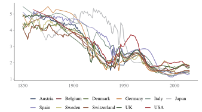](../../static/img/article/doepke2023/fig1.svg "図 7.1: Total Fertility Rates since 1850. Figure 1 of @doepke2023")

図 7.1: Total Fertility Rates since 1850. Figure 1 of Doepke et al. ([2023](#ref-doepke2023))

[図 fig-doepke2023-fig1](#fig-doepke2023-fig1) の国々の合計特殊出生率は, 19世紀のほとんどの期間を通じて女性1人あたり4人から5人の間にありました. 20世紀に入る頃から急速に低下し, 第一次世界大戦の前にはほとんどの国で4人を大きく下回ります. 戦後のベビーブームで一時的に回復したのち再び低下し, 20世紀後半からは1.4から2.1の間で落ち着いています.

出生率の指標には2つの定義があるので, ここで整理しておきます.

> **NOTE:**
>
> **Total Fertility Rate** (TFR, 合計特殊出生率):
>
> \\ TFR = \sum\_{x=15}^{49} \frac{\text{\\ of births to women aged } x}{\text{\\ of women aged } x}. \\
>
> 年齢別の出生行動が変わらないと仮定したとき, 女性が一生に産む子どもの数を表す. 晩産化のような年齢別の出生行動の変化が起きると, 一時的に大きく動くことに注意.
>
> **Complete Cohort Fertility** (CCF, 完結コーホート出生率):
>
> \\ CCF = \frac{\text{\\ of children to women born at year } b}{\text{\\ of women born at year } b}. \\
>
> ある年に生まれた女性が実際に一生に産んだ子どもの数を表す. 通常は50歳になるまで確定しない (Human Fertility Database は「少なくとも44歳」の定義を採用).

**Total Fertility Rate** (TFR)

[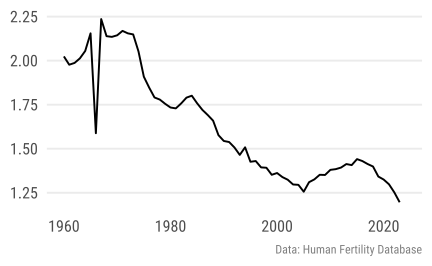](../../static/img/lecture/tfr.svg "図 7.2: 日本の合計特殊出生率 (TFR) と完結コーホート出生率 (CCF) の推移.")

**Complete Cohort Fertility** (CCF)

[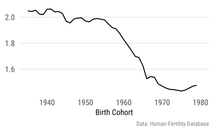](../../static/img/lecture/ccf.svg "図 7.2: 日本の合計特殊出生率 (TFR) と完結コーホート出生率 (CCF) の推移.")

図 7.2: 日本の合計特殊出生率 (TFR) と完結コーホート出生率 (CCF) の推移.

[図 fig-japan-tfr-ccf](#fig-japan-tfr-ccf) では, 日本の TFR と CCF の推移を示しています. 1966年の TFR の急落は[丙午](https://ja.wikipedia.org/wiki/%E4%B8%99%E5%8D%88)によるもので, 出産を回避する行動が実際に観察されました (今年, 2026年は丙午年です). CCF は TFR より滑らかに動いており, 2つの指標の違いがよく現れています.

[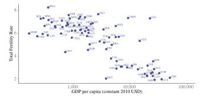](../../static/img/article/doepke2023/fig3.svg "図 7.3: Fertility and Income Across Countries. Figure 3 of @doepke2023")

図 7.3: Fertility and Income Across Countries. Figure 3 of Doepke et al. ([2023](#ref-doepke2023))

人口転換の結果, 所得と出生率の関係は, 国の中の時系列でも, 発展段階の異なる国の間でもはっきりと負になりました. 1970年の国別データ ([図 fig-doepke2023-fig3](#fig-doepke2023-fig3)) では, 発展段階の全域にわたって強い負の相関が見られます. 1人あたりGDPが1,000ドル (2010年価格) 未満の最貧国のほとんどは女性1人あたり5人を超える出生率を持ち, 20,000ドルを超える国の多くは3人を下回っていました. 同じ負の関係は1つの国の家計の間にもあり, 豊かで教育水準の高い家計ほど子どもが少ない傾向がありました.

注意したいのは, この負の相関が「所得そのものの増加が出生を減らす」ことを意味しない点です. 因果効果を推定する実証研究では, 妻の賃金や子育ての費用などを一定にして男性の所得だけが外生的に増えると, 出生はむしろ増える傾向が見られます. 純粋な所得効果が正であることと, 無条件の相関が負であることは矛盾しません. この2つを両立させるのが, 以下の2つのアイディアです.

### 7.1.2 Quantity-Quality Tradeoff

「豊かになると子どもが減る」という事実は, 一見すると経済学的な説明と矛盾するように思えます. 豊かになれば, 人は普通あらゆるものを多く消費するからです. 出生の低下は, 経済学の外にある文化や規範の変化で子どもへの「好み」が薄れたことを反映しているだけかもしれません. これに対する Gary Becker の答えが, 出生の経済学の第1の big idea である quantity-quality トレードオフです.

出発点は, 親は子どもの**数** (quantity) だけでなく, 一人あたりにかける資源, すなわち**質** (quality) も選ぶ, という観察です. ここでの「質」は価値判断ではなく, 教育・健康など子ども一人あたりへの投資を指します. Becker and Lewis ([1973](#ref-becker1973)) が定式化したように, 質への支出が所得とともに増えるなら, 豊かな親にとって子どもは高くつきます. したがって質の需要が所得に対して十分に弾力的なら, 子どもの数は所得とともに減りえます.

[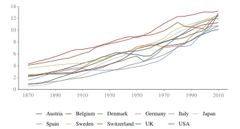](../../static/img/article/doepke2023/fig4.svg "図 7.4: Average years of schooling since 1870. Figure 4 of @doepke2023")

図 7.4: Average years of schooling since 1870. Figure 4 of Doepke et al. ([2023](#ref-doepke2023))

質のなかで最も注目されてきたのは教育です. 子どもへの支出の大きな部分を占めるうえ, 学費が無料でも, 学校に通う子どもは働けないという大きな機会費用があるからです. 大衆教育が広がる以前は, 子どもの労働が多くの家計の所得の相当部分を担っていました. [図 fig-doepke2023-fig4](#fig-doepke2023-fig4) のように, 1人あたり所得が急成長した19世紀後半から20世紀にかけて教育水準も急上昇しており, 出生率の低下と同時に進んだこの動きは quantity-quality トレードオフと整合的です.

子の質を高める親のインセンティブのモデル化には, 2つの伝統があります.

- **Warm glow**: 子どもの数や人的資本そのものから親が直接効用を得る. 以下のモデルはこの型で, de la Croix and Doepke ([2003](#ref-delacroix2003)) の定式化に従う
- **利他主義 (altruism)**: 子どもの生涯効用そのものが親の効用関数に入る. Becker and Barro ([1988](#ref-becker1988)) に始まる定式化. 子の人的資本が子の生活を良くする限り親の効用はその増加関数になるので, 人的資本の水準だけでなく, 子の人生におけるそのリターンも質への関心を左右する. 以下のモデルの \\\gamma\\ は, このリターンの誘導形と読める

#### A Toy Model

まず, 閉形式で解ける warm glow 型のシンプルなモデルでトレードオフの仕組みを見ます. 親は消費 \\c\\, 子どもの数 \\n\\, 子ども1人あたりの人的資本 \\h\\ から効用を得ます.

\\ \max\_{c, n, e}\\ \log c + \delta \log \left(n\\ h\left(\theta, e\right)\right) \quad \text{s.t.} \quad c + p e n \leq \left(1 - \phi n\right) w. \\

- \\e\\: 子ども1人あたりの教育時間. 価格 \\p\\ は教師の賃金
- \\\phi\\: 子ども1人あたりの子育て時間. 親自身の時間を使うため, 機会費用は \\\phi w\\
- \\\theta\\: 子どもの生来の人的資本
- 人的資本の生産関数は \\h = \left(\theta + e\right)^{\gamma}\\, \\0 \< \gamma \< 1\\

**命題 7.1 (閉形式解と賃金の効果)** 内点解 (\\\gamma \phi w \> p \theta\\) において, 最適な子どもの数と教育時間は

\\ n = \frac{\delta}{1 + \delta} \cdot \frac{1-\gamma}{\phi - \frac{p}{w}\theta}, \qquad e = \frac{\gamma \phi w - p\theta}{p \left(1-\gamma\right)}. \\

したがって賃金 \\w\\ の上昇は, 子どもの数 \\n\\ を減らし, 1人あたりの教育時間 \\e\\ を増やす.

証明は[付録](../../lesson/appendix/proof.llms.md#prf-qq-simple)にあります

直感はこうです. 子どもの「数」の費用の中心は親の子育て時間 \\\phi\\ であり, その機会費用 \\\phi w\\ は親の賃金に比例して上がります. 一方, 「質」の費用 \\p\\ は市場で決まる外生的な価格です. 賃金が上がると, 数は高くなり質は相対的に安くなるので, 親は数から質へ投資を振り替えます. 先進国の少子化と教育水準の上昇という組み合わせが, 賃金の上昇ひとつから出てくるわけです.

このモデルでも子どもは正常財です. 賃金ではなく資産が外生的に増えれば (純粋な所得効果), 出生は増えます. しかし家計の間の所得の違いの多くは, 資産ではなく稼得能力 \\w\\ の違いです. \\w\\ の変化には正の所得効果と負の代替効果が伴い, 代替効果には2つの成分があります. 第1に, 子どもは時間を使うので, \\w\\ が上がると子どもは消費に比べて高くなります. 第2に, \\w\\ が上がると質 \\h\\ が数 \\n\\ に比べて安くなります. この2つを合わせると代替効果が所得効果を上回り, 出生は \\w\\ とともに減ります.

ただし, この結果を国の間の比較や1つの国の時系列に当てはめるときは注意が必要です. 教育の価格 \\p\\ は主に教師の賃金なので, 経済全体の賃金水準が上がれば \\p\\ も \\w\\ に比例して上がるはずです. \\p = \tilde{p}\\ w\\ と置くと

\\ n = \frac{\delta}{1 + \delta} \cdot \frac{1-\gamma}{\phi - \tilde{p}\theta}, \qquad e = \frac{\gamma \phi - \tilde{p}\theta}{\tilde{p} \left(1-\gamma\right)} \\

となり, 賃金水準は出生にも教育にも影響しません. 集計レベルで負の相関を生むのは, 教育のリターン \\\gamma\\ です. \\n\\ は \\\gamma\\ の減少関数, \\e\\ は増加関数なので, 経済成長が人的資本のリターンの上昇によって駆動されているなら, 1人あたり所得の上昇と出生の低下が同時に起こります. 人的資本のリターンの上昇が成長を生む, という性質は成長理論の多くのベンチマークモデルが持っています.

### 7.1.3 女性の機会費用

[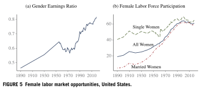](../../static/img/article/doepke2023/fig5.svg "図 7.5: Female labor market opportunities, United States. Figure 5 of @doepke2023")

図 7.5: Female labor market opportunities, United States. Figure 5 of Doepke et al. ([2023](#ref-doepke2023))

Quantity-quality の文献は家計全体の意思決定を考え, 父親と母親を区別しません. しかし実際には, 子育てで両親が担う役割は異なります. 工業化以前は家族が農場や工房で一緒に働いており, 両親とも子育てにある程度関わっていました. 工業化は職場と家庭を分け, 父親は工場や事務所で働き, 母親は家で家事と子育てを担うようになります. その結果, 子育ての時間費用は主に母親の時間費用になりました. 女性の労働参加が上昇し始めると, 子育てと仕事は女性の時間をめぐって競合するようになります.

[図 fig-doepke2023-fig5](#fig-doepke2023-fig5) はアメリカの例です. 既婚女性の労働参加率は20世紀初めには低く, 1930年代から1940年代に緩やかに, 第二次世界大戦後には急速に上昇しました (右). 女性のフルタイム労働者の賃金は, 1950年代から1970年代の一時的な落ち込みを除いて1世紀にわたって上昇し, 男性の賃金の50%未満から約80%になりました (左). 女性の賃金と労働参加の上昇は出生率の大きな低下と同時に起きており, 時系列で女性の労働参加と出生の間にはっきりとした負の関係が現れます. 1つの国のクロスセクションでも, フルタイムで働く女性は専業主婦より子どもが少なく, パートタイムの女性はその中間です. 国の間でも, 1980年代までは女性の労働参加率が低い国ほど出生率が高い傾向がありました.

この事実が, 出生の経済学の第2の big idea を生みました. 子育ての多くを女性が担うなら, 子どもの時間費用を決めるのは平均的な賃金ではなく**女性の賃金**です. モデルを夫婦に拡張して確かめます. 夫婦の賃金を \\w_m, w_f\\ とし, 子育て時間はすべて妻が担うとします. 子育てが夫婦間で完全に代替可能で \\w_m \> w_f\\ なら, 子育て時間の合計が妻の時間を超えない限り, これが最適な分業です.

\\ \max\_{c, n, e}\\ \log c + \delta \log \left(n\\ h\left(\theta, e\right)\right) \quad \text{s.t.} \quad c + p e n = w_m + \left(1 - \phi n\right) w_f. \\

[命題 prp-qq-simple](#prp-qq-simple) とまったく同じ計算で,

\\ n = \frac{\delta}{1+\delta} \cdot \frac{\left(w_m + w_f\right)\left(1-\gamma\right)}{\phi w_f - p\theta}, \qquad e = \frac{\gamma \phi w_f - p\theta}{p\left(1-\gamma\right)} \\

が得られます. 対数を取って女性の賃金 \\w_f\\ で微分すると,

\\ \frac{\partial \log n}{\partial w_f} = \frac{1}{w_m + w_f} - \frac{\phi}{\phi w_f - p\theta} = \frac{-p\theta - \phi w_m}{\left(w_m + w_f\right)\left(\phi w_f - p\theta\right)} \< 0. \\

第1項は所得効果 (家計のフルインカムが増える), 第2項は価格効果 (子育ての機会費用が上がる) です. 子育て時間の費用が女性の賃金だけに比例するため, 価格効果が必ず所得効果に勝ち, 女性の賃金上昇は出生を減らします. 一方で教育時間 \\e\\ は \\w_f\\ とともに増えるので, ここでも数から質への振り替えが起きています. 男性の賃金 \\w_m\\ の上昇は, 対照的に所得効果しか持たないので出生を増やします. 「誰の賃金が上がるか」が出生の予測を分ける, というのがこのモデルの核心です.

Doepke et al. ([2023](#ref-doepke2023)) は男女の賃金格差の役割に焦点を当てるため, 教育のリターンをゼロ (\\\gamma = 0\\) と置いています. このとき教育投資はゼロ (\\e = 0\\) になり,

\\ n = \frac{\delta}{1+\delta} \cdot \frac{1}{\phi} \left(1 + \frac{w_m}{w_f}\right) \\

が得られます. 出生率を決めるのは男女の賃金比 \\w_m / w_f\\ であり, 男女の賃金格差が縮まると出生は下がります. 男性の賃金の上昇が純粋な所得効果なのに対し, 女性の賃金の上昇には所得効果と代替効果の両方が伴います. 家計所得の大部分が男性の稼ぎである限り所得効果は小さく, 代替効果が勝ちます. このモデルは国内のクロスセクションにも含意を持ちます. 賃金の主な決定要因は教育なので, 夫婦の学歴が完全には相関しない限り, 女性の学歴と出生はクロスセクションで負に相関するはずです.

同じ考え方を一般均衡に持ち込んだのが Galor and Weil ([1996](#ref-galor1996)) です. 物理資本は肉体労働を代替し, 女性の労働と補完的なので, 資本蓄積は男女の賃金格差を縮め, 女性の労働参加を増やします. 女性の労働参加の上昇は出生を下げ, 出生の低下は1人あたり資本の蓄積を速めます. この相互作用が人口転換と成長の加速を同時に生みます.

ここまでをまとめると, 古い事実と古いモデルは次のように対応しています.

- **古い事実**: 20世紀を通じて高所得国の出生率は低下し, 国の間でも家計の間でも所得と出生は負に相関した. 同じ時期に教育水準と女性の賃金・労働参加率が上昇した
- **Quantity-quality トレードオフ**: 賃金や教育のリターンが高いと, 親は子どもの質に投資し, 数を減らす
- **女性の時間の機会費用**: 女性の賃金が高いと子育ての機会費用が高く, 子どもの数が減る

### 7.1.4 関係の逆転 と原因

Doepke et al. ([2023](#ref-doepke2023)) の基本的な主張は, 出生の経済学が新しい時代に入ったということです. そのきっかけは理論の進歩ではなく, 出生行動そのものの変化です. 人口転換から20世紀後半まで出生を特徴づけていた基本的な関係は, 高所得国の最近のデータでは成り立たなくなっています.

[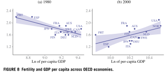](../../static/img/article/doepke2023/fig8.svg "図 7.6: Fertility and GDP per capita across OECD economies. Figure 8 of @doepke2023")

図 7.6: Fertility and GDP per capita across OECD economies. Figure 8 of Doepke et al. ([2023](#ref-doepke2023))

**所得と出生.** 世界の最も豊かな国と最も貧しい国を比べれば, 所得と出生の負の関係は今も残っています. サハラ以南のアフリカなど所得の最も低い国々は人口転換の途中にあり, 出生率は高いままです. しかし高所得国の中では, この関係はほぼ消えました. 高所得国の出生率の低下は1980年代半ばまでにほぼ終わり, その後は1人あたり所得が伸び続けても, 出生率は横ばいかわずかに上昇しています. OECD 諸国のクロスセクション ([図 fig-doepke2023-fig8](#fig-doepke2023-fig8)) を見ると, 1980年にはまだはっきりと負の関係があり, 所得の最も低いポルトガルやスペインで出生率が最も高くなっていました. 2000年にはこの関係が逆転し, 豊かな国の方がわずかに出生率が高くなっています. 国の間の相関係数は1970年代から1980年代前半まで負で, 1987年に正に転じ, その後も正のままです. 所得と出生の関係が U 字型で, 高所得国の多くがその右側の上昇部分に入った, と読むこともできます. いずれにせよ, これを説明するには所得と出生が単調に負の関係にならないモデルが必要です.

[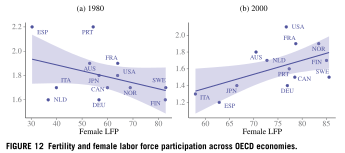](../../static/img/article/doepke2023/fig12.svg "図 7.7: Fertility and female labor force participation across OECD economies. Figure 12 of @doepke2023")

図 7.7: Fertility and female labor force participation across OECD economies. Figure 12 of Doepke et al. ([2023](#ref-doepke2023))

**女性の労働参加と出生.** 女性の労働参加率が高い国ほど出生率が低い, という関係も高所得国では逆転しました. 1980年の負の関係は, 2000年には正の関係になっています ([図 fig-doepke2023-fig12](#fig-doepke2023-fig12)). 女性の労働参加率と出生率の国の間の相関係数は, 1980年の \\-0.5\\ から10年ほどで約 \\0.75\\ まで上昇し, 1990年以降はやや下がったものの正のまま推移しています ([Ahn and Mira 2002](#ref-ahn2002)).

**女性の学歴と出生.** アメリカの女性の学歴別の出生率を見ると, 1980年代には学歴の全域で負だった関係が, 1990年には上端で平らになり (大学院卒と大卒の出生率がほぼ同じ), 直近の2時点では最上位の学歴で出生が上昇しています. この上端での上昇は白人女性ではっきりしている一方, 黒人女性では今も学歴とともに単調に下がります. ヨーロッパでもフランスやドイツでは最上位の学歴で出生が上昇しており, イタリアやスペインでは上昇は見られないものの, 高卒以上では関係がほぼ平らです.

Doepke et al. ([2023](#ref-doepke2023)) の見方では, quantity-quality トレードオフや女性の時間の機会費用という考え方自体は今も有効ですが, 高所得国の経済環境の変化がそれらの力を弱めました. 論文は4つの要因を挙げています. 公教育と児童労働法, 子育ての市場化, キャリアと出産のタイミング, 避妊と不妊治療です. ここでは最初の2つを見ます.

#### 公教育と児童労働法

人口転換の時期には, 教育の拡大が親に強い金銭的なトレードオフを課していました. 学校が有料なら教育の1年ごとに支出がかかり, さらに重要なことに, 学費が無料でも学校に通う子どもは働けません. 児童労働の所得を失うことが教育の大きな機会費用になり, 強い quantity-quality トレードオフを生んでいました. 狭い意味での児童労働 (14歳までの労働) が消えた後も, 15歳や16歳で学校を離れて働き, 家計に所得の一部を入れる子どもは高所得国でも少し前まで珍しくありませんでした.

高所得国では, このトレードオフの多くが力を失っています. 公教育は子ども時代のほぼ全体をカバーするようになり, 多くの子どもが少なくとも12年間学校にとどまって18歳以上で卒業します. 大学や大学院に進むかといった教育の意思決定は子どもが成人した後に来るので, その費用 (放棄所得や学生ローン) を負うのは親よりも子ども自身です. 親が大学の費用を支えることは今もありますが, 程度の問題として, 教育と出生の意思決定の相互作用は弱まり, quantity-quality トレードオフの力も弱まりました.

実証研究もこの解釈と整合的です. 双子の出生を出生数の外生的な増加として使う研究は, インドや中国では子どもの教育の低下を見出す一方, 質の高い公教育があるノルウェーやイスラエルでは, 出生順位を制御すると教育への影響はほとんど見られません. Liu ([2015](#ref-liu2015)) のサーベイも, quantity-quality トレードオフが今では主に低所得国で見られることを示しています.

#### 子育ての市場化

第2の big idea は, 子どもを増やすには女性が市場労働を減らさなければならない, という前提に立っていました. しかし子育てのサービスを市場で買えるなら, このトレードオフは弱まります. 子育てを外部化すると, 子どもの時間費用が金銭的な費用に変わるので, 女性の時間の機会費用の重要性が下がるからです. 2つ目の big idea のモデルを拡張して確かめます.

> **NOTE:**
>
> 夫婦は消費 \\c\\ と子どもの数 \\n\\ を選ぶ (子どもの質は捨象する). 子ども1人あたり, 時間費用 \\\phi\\ に加えて, 食費や衣服などの金銭的な費用 \\\psi\\ がかかる. 子育て時間のうち割合 \\s \in \left\[0, \bar{s}\right\]\\ を市場から価格 \\p_s\\ で買うことができ, 残りの \\\left(1 - s\right)\\ は妻が担う. \\\bar{s}\\ は外部化できる子育ての上限である.
>
> \\ \max\_{c, n, s}\\ \log c + \delta \log n \quad \text{s.t.} \quad c + \psi n + s p_s n \phi = w_m + w_f \left(1 - \left(1 - s\right) n \phi\right). \\

予算制約を整理すると \\c + \pi\left(s\right) n = w_m + w_f\\ となります. ここで

\\ \pi\left(s\right) = \psi + \left(s p_s + \left(1 - s\right) w_f\right) \phi \\

は子ども1人の完全価格 (full price) で, 金銭的費用と, 子育て時間を市場で買う分と妻が担う分の費用を合わせたものです. \\s\\ を所与とすると, 対数効用なので支出の割合は一定 (\\c = \left(w_m + w_f\right) / \left(1 + \delta\right)\\) で,

\\ n = \frac{\delta}{1 + \delta} \cdot \frac{w_m + w_f}{\psi + \left(s p_s + \left(1 - s\right) w_f\right) \phi} \tag{7.1}\\

となります. これを目的関数に代入すると, 効用は \\\pi\left(s\right)\\ の減少関数です. \\\pi\left(s\right)\\ は \\s\\ について傾き \\\phi \left(p_s - w_f\right)\\ の線形関数なので, 最適な \\s\\ は端点になります. 妻の賃金が子育ての市場価格より低い (\\w_f \< p_s\\) 夫婦は自分たちで子育てをし (\\s = 0\\), 高い (\\w_f \> p_s\\) 夫婦は買えるだけ買います (\\s = \bar{s}\\). 高賃金の女性は働き続け, 低賃金の女性は子育てに時間を使って労働供給を減らします.

**命題 7.2 (女性の賃金と出生)** \\s\\ を所与とすると,

\\ \frac{\partial n}{\partial w_f} = \frac{\delta}{1 + \delta} \cdot \frac{\psi + \left(s p_s - \left(1 - s\right) w_m\right) \phi}{\pi\left(s\right)^2}. \\

子どもの金銭的費用が時間費用に比べて小さい (\\\psi \< w_m \phi\\) とき, これは \\s \< s^\*\\ なら負, \\s = s^\*\\ ならゼロ, \\s \> s^\*\\ なら正である. ただし

\\ s^\* = \frac{w_m \phi - \psi}{\left(p_s + w_m\right) \phi} \in \left(0, 1\right). \\

証明は[付録](../../lesson/appendix/proof.llms.md#prf-outsource)に示す.

子育てを外部化する割合が大きいほど, 妻の賃金の上昇は子どもの限界費用をあまり押し上げず, 所得効果だけが残ります. 最適な \\s\\ と組み合わせると, 市場化の上限 \\\bar{s}\\ が女性の賃金と出生の関係をどう変えるかが分かります.

- 市場化ができない (\\\bar{s} = 0\\) なら, すべての女性が \\s = 0\\ を選び, 出生は女性の賃金の減少関数になる (古いモデル)
- \\w_f \< p_s\\ の女性は \\s = 0\\ を選ぶので, \\\bar{s}\\ に関係なく出生は \\w_f\\ の減少関数である
- \\\bar{s}\\ が上がると, \\w_f \geq p_s\\ の女性での出生と賃金の関係は平らになっていき, \\\bar{s} = s^\*\\ でちょうど平らになる
- \\\bar{s} = 1\\ (完全な市場化) なら, 出生は女性の賃金について U 字型になる. 賃金分布の下側では賃金の上昇が子育ての機会費用を上げて出生を下げ, 上側では子どもの限界費用は変わらず, 所得効果だけが出生を上げる

\\w_f = p_s\\ では \\\pi\left(s\right)\\ が \\s\\ に依存しないので, 出生は \\w_f\\ について連続で, \\w_f = p_s\\ で屈折します. [図 fig-outsource](#fig-outsource) はその数値例です (パラメータは図の注). この数値例では, 妻の子育て時間 \\\left(1 - s\right) n \phi\\ はどの \\w_f\\ でも妻の時間 (1) を下回ります.

[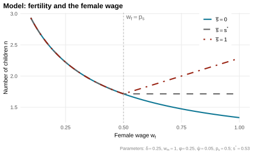](../../static/img/lecture/fertility_outsource.svg "図 7.8: 子育ての市場化と女性の賃金・出生の関係 (モデルの数値例).")

図 7.8: 子育ての市場化と女性の賃金・出生の関係 (モデルの数値例).

現実には市場化には限界があり, 高賃金の親も子育てに相当の時間を使っています. それでも市場化は, 女性の労働供給と出生の歴史的な関係を弱めた一因と考えられます. 子育ての費用を機会費用から金銭的な費用に変えることで, 市場化は所得と出生の関係も弱めます. 豊かな夫婦ほど子育てを買う資源を持つからです. 子育ての市場化の役割は Ahn and Mira ([2002](#ref-ahn2002)) などが強調しており, 因果的な証拠もあります. アメリカでは低技能の移民の流入が家事や子育てのサービスの価格を下げました. 低技能の移民の流入が大きい都市では, 子育てを外部化しやすい高学歴の女性で仕事と子どものトレードオフが弱まり, 出生率が上がっています.

子育ての市場化は, 家庭内労働時間の減少と家庭内生産の市場化という, より一般的な流れの一部です. 20世紀の家電の普及は料理・掃除・洗濯にかかる時間を減らし, 女性の労働参加と余暇の増加を後押ししました. サービス経済の拡大も, 食事・ケア・掃除を市場で買えるようにしました. この家庭内の技術進歩を, 出生・女性の就業・教育・結婚の長期的な変化と1つのモデルで結びつけたのが, 後半で読む Greenwood et al. ([2023](#ref-greenwood2023)) です.

## 7.2 Greenwood et al. ([2023](#ref-greenwood2023))

Greenwood et al. ([2023](#ref-greenwood2023)) は Kuznets ([1957](#ref-kuznets1957)) に着想を得て, 過去140年ほどの間にアメリカの家族に起こった大きな変化を, 家族経済学者にとっての「Kuznets facts」として次の6つにまとめています.

1.  (家事) 労働時間の減少
2.  出生率の減少
3.  結婚の減少
4.  世帯サイズの縮小
5.  高学歴者の増加
6.  ブルーカラーからホワイトカラーへの転換

この論文の目的は, これら6つの変化を1つのモデルと少数の駆動力で説明することです. 近年の少子化を念頭においた理論というよりは, 古典的な出生理論 (この章の前半で学んだ quantity-quality トレードオフ) を洗練させ, 長期の構造変化に正面から当てはめたものと位置づけられます.

### 7.2.1 6つの Kuznets facts

論文はアメリカを念頭に置いていますが, 日本を含む多くの先進国で同様の傾向が観察されます. モデルに入る前に, 6つの事実を駆け足で見ておきましょう.

#### ① (家事) 労働時間の減少

[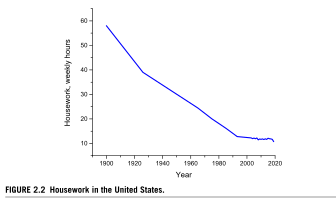](../../static/img/article/greenwood2023/fig2_2.svg "図 7.9: Housework in the United States. Figure 2.2 of @greenwood2023")

図 7.9: Housework in the United States. Figure 2.2 of Greenwood et al. ([2023](#ref-greenwood2023))

[図 fig-greenwood2023-fig2-2](#fig-greenwood2023-fig2-2) のように, 20世紀は家事労働時間が減少し続けた時代でした. 洗濯機・冷蔵庫・電子レンジといった家電の普及がその背景にあります.

[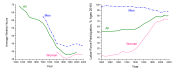](../../static/img/article/greenwood2023/fig2_1.svg "図 7.10: Average weekly hours and labor-force participation in the United States. Figure 2.1 of @greenwood2023")

図 7.10: Average weekly hours and labor-force participation in the United States. Figure 2.1 of Greenwood et al. ([2023](#ref-greenwood2023))

市場労働の時間も第二次世界大戦までは減少傾向にありました ([図 fig-greenwood2023-fig2-1](#fig-greenwood2023-fig2-1)). 一方で女性の労働参加率は大きく上昇しており, 家事負担の減少がその一因と考えられます.

#### ② 出生率の減少

[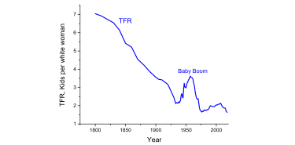](../../static/img/article/greenwood2023/fig2_6.svg "図 7.11: Fertility in the United States. Figure 2.6 of @greenwood2023")

図 7.11: Fertility in the United States. Figure 2.6 of Greenwood et al. ([2023](#ref-greenwood2023))

ベビーブームという例外を挟みつつ, 出生率は長期的に減少傾向にあります ([図 fig-greenwood2023-fig2-6](#fig-greenwood2023-fig2-6)). TFR と CCF の定義と日本の推移は, [sec-old-facts](#sec-old-facts) で見ました.

図 7.12: The cross-country decline in fertility. Figure 2.7 of Greenwood et al. ([2023](#ref-greenwood2023))

国ごとのパネルデータ ([図 fig-greenwood2023-fig2-7](#fig-greenwood2023-fig2-7)) を見ると, GDP per capita と TFR の間には負の相関があります. Doepke et al. ([2023](#ref-doepke2023)) でみたように, これこそ第1世代の出生モデルが説明しようとした古い事実です.

#### ③ 結婚の減少

[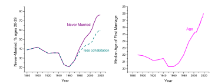](../../static/img/article/greenwood2023/fig2_8.svg "図 7.13: Marriage in the United States. Figure 2.8 of @greenwood2023")

図 7.13: Marriage in the United States. Figure 2.8 of Greenwood et al. ([2023](#ref-greenwood2023))

1960年以降, 未婚化と晩婚化が進行しています ([図 fig-greenwood2023-fig2-8](#fig-greenwood2023-fig2-8)). 法律婚によらない関係 (同居, cohabitation) を考慮しても, 減少傾向は変わりません.

図 7.14: The cross-country relationship between per-capita GDP and marriage. Figure 2.10 of Greenwood et al. ([2023](#ref-greenwood2023))

未婚化・晩婚化は所得と正の相関を持ちます ([図 fig-greenwood2023-fig2-10](#fig-greenwood2023-fig2-10)). 家事労働の減少や女性の労働参加によって「独身でいることの価値」が上昇した, というのが以下のモデルの見方です.

**Share of Never-married** at Age 45-54

[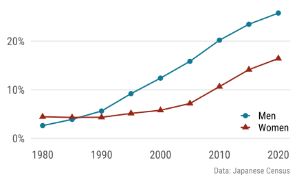](../../static/img/lecture/share_nmarried.svg "図 7.15: 日本の45-54歳の未婚率と初婚年齢の推移.")

**Age at First Marriage**

[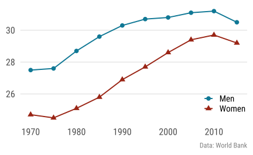](../../static/img/lecture/age_firstmarriage.svg "図 7.15: 日本の45-54歳の未婚率と初婚年齢の推移.")

図 7.15: 日本の45-54歳の未婚率と初婚年齢の推移.

[図 fig-japan-marriage](#fig-japan-marriage) のように, 未婚化・晩婚化は日本でも進行しています. ただし日本は婚外子の割合が欧米諸国と比べて極めて低い (2020年で2.4%) ため, 結婚の減少が出生の減少に直結しやすいという特徴があります.

#### ④ 世帯サイズの縮小

図 7.16: Household size in the United States and across countries. Figure 2.11 of Greenwood et al. ([2023](#ref-greenwood2023))

世帯サイズは縮小傾向にあり, 所得と負の相関を持ちます ([図 fig-greenwood2023-fig2-11](#fig-greenwood2023-fig2-11)). 少子化の影響に加えて, 3世代同居の減少も所得と負の相関を持っています.

#### ⑤ 高学歴者の増加

[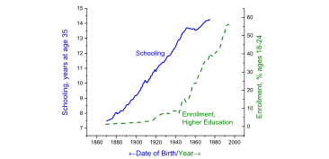](../../static/img/article/greenwood2023/fig2_12.svg "図 7.17: Educational attainment in the United States. Figure 2.12 of @greenwood2023")

図 7.17: Educational attainment in the United States. Figure 2.12 of Greenwood et al. ([2023](#ref-greenwood2023))

[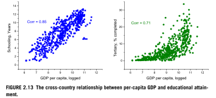](../../static/img/article/greenwood2023/fig2_13.svg "図 7.18: The cross-country relationship between per-capita GDP and educational attainment. Figure 2.13 of @greenwood2023")

図 7.18: The cross-country relationship between per-capita GDP and educational attainment. Figure 2.13 of Greenwood et al. ([2023](#ref-greenwood2023))

高学歴化は進行しており ([図 fig-greenwood2023-fig2-12](#fig-greenwood2023-fig2-12)), 所得と正の相関を持ちます ([図 fig-greenwood2023-fig2-13](#fig-greenwood2023-fig2-13)). 供給側の要因は親の教育投資の増加であり, この章の前半で学んだ子どもの数と質のトレードオフ (quantity-quality trade-off) がその理論です. 需要側の要因は高学歴者への賃金プレミアムの上昇で, 次の事実⑥と表裏一体です.

#### ⑥ ブルーカラーからホワイトカラーへの転換

[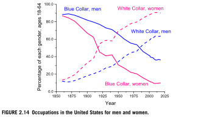](../../static/img/article/greenwood2023/fig2_14.svg "図 7.19: Occupations in the United States for men and women. Figure 2.14 of @greenwood2023")

図 7.19: Occupations in the United States for men and women. Figure 2.14 of Greenwood et al. ([2023](#ref-greenwood2023))

図 7.20: The cross-country relationship between per-capita GDP and white-collar jobs. Figure 2.15 of Greenwood et al. ([2023](#ref-greenwood2023))

ホワイトカラーの割合は上昇しており ([図 fig-greenwood2023-fig2-14](#fig-greenwood2023-fig2-14)), 所得とも正の相関を持ちます ([図 fig-greenwood2023-fig2-15](#fig-greenwood2023-fig2-15)). 背景にあるのはスキル偏向的な技術進歩 (skill-biased technological change) です ([Acemoglu and Autor 2011](#ref-acemoglu2011a)). 以下では, これら6つの事実を1つのモデルで説明する Greenwood et al. ([2023](#ref-greenwood2023)) の定量分析を読みます.

### 7.2.2 Model

モデルは静学で, 各エージェントは人生を1回の意思決定として選びます. 家計は性別のない独身者と有配偶者からなります. 独身者は1単位の時間を持ち, 家事労働 \\h\\ (household labor), 余暇 \\l\\ (leisure), 市場労働 \\t\\ (toiling in the market) に配分します (\\h + l + t = 1\\). 有配偶者は2人分の2単位の時間を持ち, これに加えて \\k\\ 人の子どもに対する基礎的な子育て \\b\\ (basic childcare) と教育 \\e\\ (education) の時間を使います (\\h + l + t + bk + ek = 2\\).

**賃金.** スキルには合計が1になる *brain* と *brawn* の2種類があり, 賃金はそのポートフォリオで決まります.

\\ w = s v + \left(1 - s\right) u. \\

\\s \in \left\[0, 1\right\]\\ は brain スキルの割合, \\v\\ と \\u\\ はそれぞれ brain と brawn のリターンで, \\v \> u\\ を仮定します. 比率 \\q = v/u\\ が大卒プレミアムに対応します.

**家庭内生産.** 家事の成果 \\n\\ は, 家庭内生産用の耐久財 \\d\\ (価格 \\p\\) と家事労働 \\\texttt{h}\\ の CES 集計で作られます.

\\ n = \left(\theta d^\sigma + \left(1 - \theta\right) \texttt{h}^\sigma\right)^{1/\sigma}. \\

ここで家事労働の投入 \\\texttt{h}\\ には子どもも寄与します. 独身者では \\\texttt{h} = h\\ ですが, 有配偶者では子ども1人あたり生産性 \\\chi\\ で家事を手伝い, \\\texttt{h} = h + \chi k\\ となります. かつての子どもは農場や家庭内で立派な労働力でした. 児童労働の消滅は, この \\\chi\\ の低下として表現されます.

**子どもの教育.** 親は子どもの brain スキル割合 \\s\\ を選べますが, そのためには子ども1人あたり \\e = \gamma s\\ の教育時間がかかります. 子どもを「高スキルに育てる」ことが親の時間を食う, という形で quantity-quality トレードオフが入っています.

**効用関数.** 独身者は消費 \\c\\, 家事の成果 \\n\\, 余暇 \\l\\ から効用を得ます.

\\ u^S\left(c, n, l\right) = \alpha \frac{c^{1-\rho} - 1}{1-\rho} + \beta \frac{n^{1-\nu} - 1}{1 - \nu} + \left(1 - \alpha - \beta\right) \frac{l^{1-\lambda} - 1}{1 - \lambda}. \\

有配偶者はこれに加えて, 子どもの数 \\k\\ と子どものスキル水準 \\sv + \left(1-s\right)u\\ からも効用を得ます.

\\ \begin{aligned} u^M\left(c, n, l, k, s\right) &= \alpha \frac{\left(\varepsilon c\right)^{1-\rho} - 1}{1-\rho} + \beta \frac{\left(\varepsilon n\right)^{1-\nu} - 1}{1 - \nu} + \delta \frac{l^{1-\lambda} - 1}{1 - \lambda} \\ &+ \psi \frac{k^{1-\kappa} - 1}{1 - \kappa} + \xi \frac{\left(sv + \left(1-s\right)u\right)^{1-\zeta}-1}{1-\zeta}. \end{aligned} \\

\\\varepsilon \in \left\[0.5, 1.0\right\]\\ は世帯の等価尺度 (equivalence scale) で, 2人で暮らすことの規模の経済を表します. 子どものスキルからの効用は, この章の前半の言葉で言えば warm glow 型 (子の効用ではなく属性から直接効用を得る) の質への選好です.

**家計の問題.** 独身者と有配偶者の価値はそれぞれ

\\ \begin{aligned} S &= \max\_{d, h, l} u^S\left(c, n\left(d, h\right), l\right) &\text{ s.t. } c + pd = w\left(1 - h - l\right), \\ M &= \max\_{d, h, l, k, s} u^M\left(c, n\left(d, h\right), l, k, s\right) &\text{ s.t. } c + pd = w\left(2 - h - l - bk - ek\right) \end{aligned} \\

で与えられます.

**結婚の決定.** 独身者は人生の初めに他の独身者とマッチし, 結婚生活の joy shock \\j\\ を引きます. 結婚するのは \\M + j \geq S\\ のときです. \\j\\ は位置 \\\texttt{a}\\, スケール \\\texttt{d}\\ のガンベル分布

\\ G\left(j\right) = \exp\left(-\exp\left(-\frac{j-\texttt{a}}{\texttt{d}}\right)\right) \\

に従うとします (frictionless marriage の章で学んだ第一種極値分布です). 婚姻率を \\\texttt{m}\\ とすると, 独身者の割合は

\\ 1 - \texttt{m} = \Pr\left(M + j \< S\right) = G\left(S - M\right) \\

と閉じた形で書けます.

### 7.2.3 Calibration

#### データに基づくパラメータ

カリブレーションの第一歩は, モデルの外から測れるものを測ってしまうことです.

- **価格**: \\w\_{1880} = 1\\ に基準化. 賃金は年率1.7%で上昇したと推定され \\w\_{2020} = 11.3\\ (1880–1988年は Williamson ([1995](#ref-williamson1995)), 1989年以降は FRED の実質報酬を総労働時間で割って推定). 耐久財価格は \\p\_{1880} = 100\\ に基準化し, 年率約5%の下落 ([Greenwood et al. 2016](#ref-greenwood2016)) から \\p\_{2020} = 0.108\\. 大卒プレミアム \\q\_{2020} = 1.81\\ は Current Population Survey (2018年) より
- **家庭内生産**: \\\theta = 0.206\\, \\\sigma = 0.282\\ は McGrattan et al. ([1997](#ref-mcgrattan1997)) より. \\0 \< \sigma \< 1\\ なので耐久財と家事労働は代替的で, 「安くなった耐久財が家事時間を置き換える」経路が開いている
- **相対的リスク回避度**: \\\rho = 1.25\\ (文献の標準的な値)
- **等価尺度**: OECD modified scale (\\1 + 0.5\\) より \\\varepsilon = 1 / 1.5 \simeq 0.667\\
- **子育て時間**: American Time Use Survey (ATUS) と Gershuny and Harms ([2016](#ref-gershuny2016)) から, 基礎的な子育て時間の平均 (1920, 1965, 2019) として \\b = 0.030\\
- **教育時間**: \\\gamma = e / s\\ の関係を使い, ホワイトカラーの割合 \\s_t\\ と家庭での教育時間 \\e_t\\ から推定 (ATUS, American Heritage Time Use Study, Gershuny and Harms ([2016](#ref-gershuny2016))). 平均して \\\gamma = 0.026\\
- **子どもの家事労働 \\\chi\\**: 児童の労働時間と生産性の積として推定. 生産性は Lebergott ([1964](#ref-lebergott1964)) に基づき, 1880年の児童の労働時間は途上国のデータ ([Webbink et al. 2012](#ref-webbink2012)), 2020年は Hofferth and Sandberg ([2001](#ref-hofferth2001)) を用いる

#### SMM: 2つのループ

残りのパラメータは SMM で推定しますが, その実装に工夫があります. 推定を外側と内側の2つのループに分けるのです.

- **外側のループ**: \\\left(\alpha, q\_{1880}\right)\\ だけを数値的に探索する
- **内側のループ**: 残りの選好パラメータ \\\Lambda\left(\alpha, q\_{1880}\right) = \left(\beta, \nu, \delta, \lambda, \psi, \kappa, \xi, \zeta\right)\\ は, \\\left(\alpha, q\_{1880}\right)\\ を所与とすると一階条件から解析的に決まる
- ガンベル分布のパラメータ \\\left(\texttt{a}, \texttt{d}\right)\\ は, 他のすべてが決まった後に婚姻率から決まる

数値的に探索するパラメータが実質2個まで減るので, 推定は非常に軽くなります. 内側のループの仕掛けは, どの一階条件も「曲率パラメータはデータの2時点比から, ウェイトパラメータは水準から」という形で逐次的に解けることです. 順番に見ていきます.

**Step 1–2 (\\\lambda\\, \\\delta\\): 余暇.** 余暇 \\l\\ の一階条件は

\\ \delta l^{-\lambda} = \alpha \varepsilon^{1-\rho}\left(w\left(2 - b k - \gamma s k - h - l\right) - pd\right)^{-\rho}w. \tag{7.2}\\

2020年と1880年でこの式の比を取ると \\\delta\\ が消え,

\\ \left(\frac{l\_{2020}}{l\_{1880}}\right)^{-\lambda} = \left(\frac{w\_{2020}\left(2 - b k\_{2020} - \gamma s\_{2020} k\_{2020} - h\_{2020} - l\_{2020}\right) - p\_{2020}d\_{2020}}{w\_{1880}\left(2 - b k\_{1880} - \gamma s\_{1880} k\_{1880} - h\_{1880} - l\_{1880}\right) - p\_{1880}d\_{1880}}\right)^{-\rho}\frac{w\_{2020}}{w\_{1880}} \\

から \\\lambda\\ が求まります. \\\lambda\\ が分かれば, [式 eq-greenwood2023-foc-l](#eq-greenwood2023-foc-l) を2020年の水準で評価して \\\delta\\ が求まります.

**Step 3–4 (\\\kappa\\, \\\psi\\): 子どもの数.** 子どもの数 \\k\\ の一階条件は

\\ \psi k^{-\kappa} = \delta l^{-\lambda} \left(b + \gamma s - \chi\right). \tag{7.3}\\

右辺の括弧は子ども1人の純時間費用 (子育て + 教育 \\-\\ 家事の手伝い) です. やはり2時点の比

\\ \left(\frac{k\_{2020}}{k\_{1880}}\right)^{-\kappa} = \left(\frac{l\_{2020}}{l\_{1880}}\right)^{-\lambda} \frac{b + \gamma s\_{2020} - \chi\_{2020}}{b + \gamma s\_{1880} - \chi\_{1880}} \\

から \\\kappa\\ が, 水準から \\\psi\\ が求まります.

**Step 5–6 (\\\zeta\\, \\\xi\\): 子どもの質.** 子どものスキル \\s\\ の一階条件は

\\ \xi \left(s v + \left(1-s\right) u\right)^{-\zeta} \left(v - u\right) = \delta l^{-\lambda} \gamma k. \tag{7.4}\\

左辺は brain スキルを増やす限界便益, 右辺はその時間費用 (子ども全員分の教育時間) です. 2時点の比

\\ \left(\frac{s\_{2020} v\_{2020} + \left(1 - s\_{2020}\right) u\_{2020}}{s\_{1880} v\_{1880} + \left(1 - s\_{1880}\right) u\_{1880}}\right)^{-\zeta} \frac{v\_{2020} - u\_{2020}}{v\_{1880} - u\_{1880}} = \left(\frac{l\_{2020}}{l\_{1880}}\right)^{-\lambda} \frac{k\_{2020}}{k\_{1880}} \\

から \\\zeta\\ が, 水準から \\\xi\\ が求まります.

**Step 7–8 (\\\nu\\, \\\beta\\): 家事.** 家事労働 \\h\\ の一階条件は

\\ \beta \varepsilon^{1-\nu} \left(1-\theta\right)\left(\theta d^{\sigma} + \left(1-\theta\right)\left(h + \chi k\right)^{\sigma}\right)^{\frac{1-\nu-\sigma}{\sigma}} \left(h + \chi k\right)^{\sigma - 1} = \delta l^{-\lambda}. \tag{7.5}\\

2時点の比

\\ \left(\frac{\theta d\_{2020}^\sigma + \left(1 - \theta\right)\left(h\_{2020} + \chi\_{2020} k\_{2020}\right)^{\sigma}}{\theta d\_{1880}^{\sigma} + \left(1 - \theta\right)\left(h\_{1880} + \chi\_{1880} k\_{1880}\right)^{\sigma}}\right)^{\frac{1-\nu-\sigma}{\sigma}} \left(\frac{h\_{2020} + \chi\_{2020} k\_{2020}}{h\_{1880} + \chi\_{1880} k\_{1880}}\right)^{\sigma - 1} = \left(\frac{l\_{2020}}{l\_{1880}}\right)^{-\lambda} \\

から \\\nu\\ が, 1880年の水準から \\\beta\\ が求まります.

**外側のループ.** 残った \\\left(\alpha, q\_{1880}\right)\\ は, 独身者の市場労働時間と家事労働時間 (1880, 2020) をターゲットに

\\ \min\_{\alpha, q\_{1880}} \sum\_{i} \left(\frac{\mathcal{D}\_i - \mathcal{M}\_{i}\left(\alpha, q\_{1880}\right)}{\mathcal{D}\_i}\right) \\

を最小化して決めます. 有配偶者側のモーメント (出生率, 教育, 時間配分) は内側のループの構成上, データと完全に一致します ([表 tbl-greenwood2023-table5-3](#tbl-greenwood2023-table5-3)).

[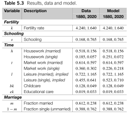](../../static/img/article/greenwood2023/table5_3.svg "表 7.1: Results, data and model. Table 5.3 of @greenwood2023")

表 7.1: Results, data and model. Table 5.3 of Greenwood et al. ([2023](#ref-greenwood2023))

**結婚のパラメータ.** すべての選好パラメータが決まると \\S\\ と \\M\\ が計算できます. 独身者の割合 \\\texttt{s} = 1 - \texttt{m}\\ はガンベル分布から

\\ \log \left(-\log \texttt{s}\right) = - \left(S - M - \texttt{a}\right)/\texttt{d} \tag{7.6}\\

を満たすので, 2時点の比

\\ \frac{\log \left(-\log \texttt{s}\_{2020}\right)}{\log \left(-\log \texttt{s}\_{1880}\right)} = \frac{S\_{2020} - M\_{2020} - \texttt{a}}{S\_{1880} - M\_{1880} - \texttt{a}} \\

から \\\texttt{a}\\ が, [式 eq-greenwood2023-gumbel](#eq-greenwood2023-gumbel) の水準から \\\texttt{d}\\ が求まります. 推定されたパラメータは [表 tbl-greenwood2023-table5-2](#tbl-greenwood2023-table5-2) のとおりです.

[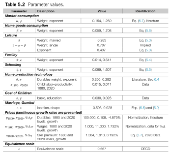](../../static/img/article/greenwood2023/table5_2.svg "表 7.2: Parameter values. Table 5.2 of @greenwood2023")

表 7.2: Parameter values. Table 5.2 of Greenwood et al. ([2023](#ref-greenwood2023))

### 7.2.4 Great Transition

1880年から2020年への変化を駆動する力として, 論文は3つに注目します.

1.  全体的な技術革新 (neutral technological progress, \\\mathbf{z}\\)
2.  スキル偏向的な技術革新 (skill-biased technological progress, \\\mathbf{x}\\)
3.  家庭内生産用耐久財の価格低下 (\\p\\)

技術革新をモデル化するため, brawn 労働 \\\mathbf{u}\\ と brain 労働 \\\mathbf{v}\\ を CES で束ねる代表的企業を導入します.

\\ \max\_{\mathbf{u}, \mathbf{v}} \mathbf{z}\left(\left(1-\omega\right)\mathbf{u}^{\iota} + \omega \mathbf{x}\mathbf{v}^{\iota}\right)^{\frac{1}{\iota}} - u\mathbf{u} - v\mathbf{v}. \\

一階条件から, 大卒プレミアム \\q\\ は

\\ q = \frac{v}{u} = \frac{\omega \mathbf{x}}{1-\omega} \left(\frac{\mathbf{v}}{\mathbf{u}}\right)^{\iota-1} = \frac{\omega \mathbf{x}}{1-\omega} \left(\frac{s}{1-s}\right)^{\iota-1} \tag{7.7}\\

と書けます (最後の等式は, 総労働時間を \\\mathbf{t}\\ として \\\mathbf{u} = \left(1 - s\right)\mathbf{t}\\, \\\mathbf{v} = s\mathbf{t}\\ を代入したものです). CES のパラメータ \\\left(\omega, \iota\right)\\ は Acemoglu and Autor ([2011](#ref-acemoglu2011a)) の値を使い, [式 eq-college-premium](#eq-college-premium) から各時点の \\\mathbf{x}\\ が, brawn 労働の一階条件から \\\mathbf{z}\\ が逆算できます ([表 tbl-greenwood2023-table6-1](#tbl-greenwood2023-table6-1)).

[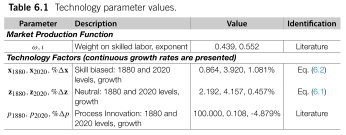](../../static/img/article/greenwood2023/table6_1.svg "表 7.3: Technology parameter values. Table 6.1 of @greenwood2023")

表 7.3: Technology parameter values. Table 6.1 of Greenwood et al. ([2023](#ref-greenwood2023))

3つの駆動力を \\\mathbf{z}\_t = \mathbf{z}\_{1880} e^{\Delta\mathbf{z}\left(t-1880\right)}\\, \\\mathbf{x}\_t = \mathbf{x}\_{1880} e^{\Delta\mathbf{x}\left(t-1880\right)}\\, \\p_t = p\_{1880} e^{\Delta p\left(t-1880\right)}\\ と指数的に動かし, モデルに1880年から2020年までの移行経路を生成させます.

[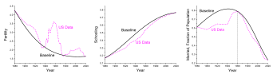](../../static/img/article/greenwood2023/fig6_1.svg "図 7.21: Transitional dynamics: fertility, schooling, and marriage. Figure 6.1 of @greenwood2023")

図 7.21: Transitional dynamics: fertility, schooling, and marriage. Figure 6.1 of Greenwood et al. ([2023](#ref-greenwood2023))

[図 fig-greenwood2023-fig6-1](#fig-greenwood2023-fig6-1) のように, 2時点 (1880, 2020) しかターゲットにしていないにもかかわらず, 途中の経路もよく再現できています. 特に注目すべきは, 婚姻率が20世紀半ばに向けて上昇してから低下するという \\\cap\\ 字型を再現している点です.

では, どの駆動力がどの事実を担っているのでしょうか. 反実仮想で1つずつ止めてみます.

**スキル偏向的な技術革新 \\\mathbf{x}\\ を止めると.**

[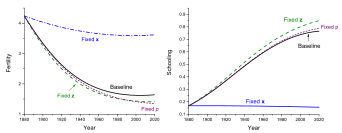](../../static/img/article/greenwood2023/fig6_2.svg "図 7.22: Comparative dynamics: fertility and schooling. Figure 6.2 of @greenwood2023")

図 7.22: Comparative dynamics: fertility and schooling. Figure 6.2 of Greenwood et al. ([2023](#ref-greenwood2023))

大卒プレミアムが上昇しない世界 ([図 fig-greenwood2023-fig6-2](#fig-greenwood2023-fig6-2)) では, 出生率は高止まりし, 大卒者の割合も増えません. 教育のリターンが低いままなので, 親は子どもの「質」ではなく「数」に投資し続けるからです. 出生率の低下と教育の拡大が, quantity-quality トレードオフを通じて同じ1つの力 (\\\mathbf{x}\\) から出ていることが分かります.

**耐久財価格 \\p\\ の低下を止めると.**

[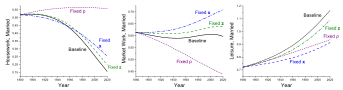](../../static/img/article/greenwood2023/fig6_3.svg "図 7.23: Comparative dynamics: housework, market work, and leisure. Figure 6.3 of @greenwood2023")

図 7.23: Comparative dynamics: housework, market work, and leisure. Figure 6.3 of Greenwood et al. ([2023](#ref-greenwood2023))

洗濯機や冷蔵庫が安くならない世界 ([図 fig-greenwood2023-fig6-3](#fig-greenwood2023-fig6-3)) では, 家事労働時間は減らず, 代わりに市場労働時間が減ります. そしてもうひとつ, 意外な変化が起きます. 婚姻率が上昇し続けるのです ([図 fig-greenwood2023-fig6-4](#fig-greenwood2023-fig6-4)).

[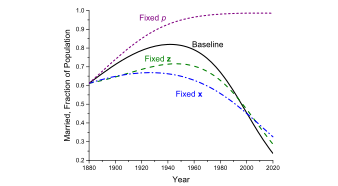](../../static/img/article/greenwood2023/fig6_4.svg "図 7.24: Comparative dynamics: marriage. Figure 6.4 of @greenwood2023")

図 7.24: Comparative dynamics: marriage. Figure 6.4 of Greenwood et al. ([2023](#ref-greenwood2023))

婚姻率の \\\cap\\ 字型は, 2つの力の綱引きで生まれていました. 前半は大卒プレミアムの上昇が子ども (とその教育) の価値を高め, 結婚を魅力的にします. 後半は耐久財の価格低下が家事の規模の経済という結婚の古典的なメリットを侵食し, 独身の生活コストを下げます. 1960年頃を境に後者が優勢になった, というのがこのモデルの読み方です.

#### まとめ

6つの Kuznets facts は, 実質的に2つの駆動力に整理されます.

**スキル偏向的な技術革新** (\\\mathbf{x}\\: 大卒プレミアムの上昇)

- 高学歴者の増加 (⑤) とホワイトカラーへの転換 (⑥) を直接駆動する
- Quantity-quality トレードオフを通じて, 出生率の低下 (②) と世帯サイズの縮小 (④) を駆動する

**家庭内生産用耐久財の価格低下** (\\p\\)

- 家事の機械化により家事労働時間の減少 (①) を駆動する
- 家事の規模の経済という結婚のメリットを縮小させ, 結婚の減少 (③) を駆動する

この章の前半で学んだ quantity-quality の静学的なメカニズムが, 時間配分・家庭内生産・結婚市場と組み合わさって140年の構造変化を説明する, という構成になっています. 一方で, 前半で見たように, この枠組みはあくまで「古い事実」のための理論です. 21世紀の高所得国で起きた, 所得や女性の労働参加と出生率の関係の逆転を説明するには, 子育ての市場化やキャリアと家族の両立のしやすさといった新しい要素が必要になります ([Doepke et al. 2023](#ref-doepke2023)).

Acemoglu, Daron, and David Autor. 2011. “Skills, Tasks and Technologies: Implications for Employment and Earnings.” In *Handbook of Labor Economics*, vol. 4. Elsevier. <https://doi.org/10.1016/S0169-7218(11)02410-5>.

Ahn, Namkee, and Pedro Mira. 2002. “A Note on the Changing Relationship Between Fertility and Female Employment Rates in Developed Countries.” *Journal of Population Economics* 15 (4): 667–82. <https://doi.org/10.1007/s001480100078>.

Becker, Gary S. 1960. “An Economic Analysis of Fertility.” In *Demographic and Economic Change in Developed Countries*. Columbia University Press.

Becker, Gary S., and Robert J. Barro. 1988. “A Reformulation of the Economic Theory of Fertility.” *The Quarterly Journal of Economics* 103 (1): 1–26. <https://doi.org/10.2307/1882640>.

Becker, Gary S., and H. Gregg Lewis. 1973. “On the Interaction Between the Quantity and Quality of Children.” *Journal of Political Economy* 81 (2, Part 2): S279–88. <https://doi.org/10.1086/260166>.

de la Croix, David, and Matthias Doepke. 2003. “Inequality and Growth: Why Differential Fertility Matters.” *American Economic Review* 93 (4): 1091–113. <https://doi.org/10.1257/000282803769206214>.

Doepke, Matthias, Anne Hannusch, Fabian Kindermann, and Michèle Tertilt. 2023. “The Economics of Fertility: A New Era.” In *Handbook of the Economics of the Family*, vol. 1. Elsevier. <https://doi.org/10.1016/bs.hefam.2023.01.003>.

Galor, Oded, and David N. Weil. 1996. “The Gender Gap, Fertility, and Growth.” *American Economic Review* 86 (3): 374–87. <https://www.jstor.org/stable/2118202>.

Gershuny, Jonathan, and Teresa Atttracta Harms. 2016. “Housework Now Takes Much Less Time: 85 Years of US Rural Women’s Time Use.” *Social Forces* 95 (2): 503–24. <https://doi.org/10.1093/sf/sow073>.

Greenwood, Jeremy, Nezih Guner, Georgi Kocharkov, and Cezar Santos. 2016. “Technology and the Changing Family: A Unified Model of Marriage, Divorce, Educational Attainment, and Married Female Labor-Force Participation.” *American Economic Journal: Macroeconomics* 8 (1): 1–41. <https://doi.org/10.1257/mac.20130156>.

Greenwood, Jeremy, Nezih Guner, and Ricardo Marto. 2023. “The Great Transition: Kuznets Facts for Family-Economists.” In *Handbook of the Economics of the Family*, edited by Shelly Lundberg and Alessandra Voena, vol. 1. Handbook of the Economics of the Family, Volume 1. North-Holland. <https://doi.org/10.1016/bs.hefam.2023.01.006>.

Hofferth, Sandra L., and John F. Sandberg. 2001. “How American Children Spend Their Time.” *Journal Of Marriage And The Family* 63 (2): 295–308. <https://doi.org/10.1111/j.1741-3737.2001.00295.x>.

Kuznets, Simon. 1957. “Quantitative Aspects of the Economic Growth of Nations: II. Industrial Distribution of National Product and Labor Force.” *Economic Development and Cultural Change* 5 (S4): 1–111. <https://doi.org/10.1086/449740>.

Lebergott, Stanley. 1964. *Manpower in Economic Growth; the American Record Since 1800*. New York, McGraw-Hill.

Liu, Haoming. 2015. “The Quantity–Quality Fertility–Education Trade-Off.” *IZA World of Labor*, 1–10. <https://doi.org/10.15185/izawol.143>.

McGrattan, Ellen R., Richard Rogerson, and Randall Wright. 1997. “An Equilibrium Model of the Business Cycle with Household Production and Fiscal Policy.” *International Economic Review* 38 (2): 267–90. <https://doi.org/10.2307/2527375>.

Webbink, Ellen, Jeroen Smits, and Eelke De Jong. 2012. “Hidden Child Labor: Determinants of Housework and Family Business Work of Children in 16 Developing Countries.” *World Development* 40 (3): 631–42. <https://doi.org/10.1016/j.worlddev.2011.07.005>.

Williamson, Jeffrey G. 1995. “The Evolution of Global Labor Markets Since 1830: Background Evidence and Hypotheses.” *Explorations in Economic History* 32 (2): 141–96. <https://doi.org/10.1006/exeh.1995.1006>.
