# 8  摩擦のない市場

Code

第[sec-search-matching](#sec-search-matching)章のサーチモデルでは, 独身者は毎期ランダムに相手と出会い, その相手と結婚するか, 次の出会いを待つかを選びました. この章で扱う摩擦のない結婚市場のモデルでは, 出会いに時間はかかりません. 初期時点ですべての独身者が結婚市場に参加し, すべての潜在的な相手と出会うことができ, 相手の特徴も完全に知ったうえで, 結婚するかどうか, 誰と結婚するかを選びます. 「摩擦がない」とはこの意味です. 結婚市場の描写が簡単なぶん, 結婚した後の家計の意思決定は, 静学的なモデルでもライフサイクルの動学的なモデルでも詳しく組み込めます.

道具立ては, これまでの2つの章を組み合わせたものです. 個人の相手選びは, 相手のタイプについての離散選択として定式化されます. 夫婦の間でどう効用を分けられるかは第[sec-matching](#sec-matching)章の交渉可能集合と距離関数で表され, 結婚市場の均衡がその分け方, すなわち家計内の Pareto ウェイト ([sec-allocation](#sec-allocation)節) を決めます. この章の前半では, まず離散選択の一般的な枠組みである確率効用モデルとロジットモデルを Train ([2009](#ref-train2009)) に基づいて準備し, それをマッチング理論と組み合わせた ITU-logit のモデルを Galichon et al. ([2019](#ref-galichon2019)) と Galichon and Weber ([2024](#ref-galichon2024)) にしたがって学びます. ITU-logit は Choo and Siow ([2006](#ref-choo2006)) の TU のモデルと Gale and Shapley ([1962](#ref-gale1962)) の NTU のモデルを両極として含み, 推定可能なマッチング関数を与えます.

後半では, この枠組みを使った2本の研究を読みます. Ciscato ([2025](#ref-ciscato2025)) は, 同類婚が似た者同士の余剰の補完性によるのか, 似た者同士ばかりが出会う出会いの分断によるのかを, 交際の持続時間のデータを使って分解します. Reynoso ([2024](#ref-reynoso2024)) は, 結婚市場の均衡にライフサイクルの collective model を組み込み, 米国で協議離婚から単意離婚への移行が, 誰と誰が結婚するかをどう変えたかを分析します. 単意離婚のもとでの家計は, [sec-allocation-commitment](#sec-allocation-commitment)節の限定コミットメントのモデルになります.

## 8.1 離散選択

### 8.1.1 確率効用モデル

意思決定者 \\n\\ が \\J\\ 個の選択肢から1つを選ぶ状況を考えます. 意思決定者自身は各選択肢の効用を知って選んでいますが, 研究者はその一部しか観察できません. そこで, 効用を研究者が観察・特定できる部分と, できない部分に分解します.

**定義 8.1 (確率効用モデル (Random Utility Model))** 意思決定者 \\n\\ は選択肢 \\j = 1, \ldots, J\\ のうち, 効用 \\U\_{nj}\\ が最大になるものを選ぶ. 効用を \\ U\_{nj} = V\_{nj} + \varepsilon\_{nj} \\ と分解する. \\V\_{nj}\\ は研究者が観察できる属性から特定する部分 (代表効用, representative utility), \\\varepsilon\_{nj}\\ はその残差である. \\\varepsilon_n = \left(\varepsilon\_{n1}, \ldots, \varepsilon\_{nJ}\right)\\ が同時密度 \\f\left(\varepsilon_n\right)\\ に従うとき, 選択肢 \\i\\ が選ばれる確率は \\ \begin{aligned} P\_{ni} &= \text{Pr}\left(V\_{ni} + \varepsilon\_{ni} \> V\_{nj} + \varepsilon\_{nj} \quad \forall j \neq i\right) \\ &= \int \mathbb{1}\left(\varepsilon\_{nj} - \varepsilon\_{ni} \< V\_{ni} - V\_{nj} \quad \forall j \neq i\right) f\left(\varepsilon_n\right)\\ d\varepsilon_n. \end{aligned} \tag{8.1}\\ ここで \\\mathbb{1}\left(\cdot\right)\\ は指示関数.

重要なのは, \\\varepsilon\_{nj}\\ が「選択そのものに内在するランダムネス」ではなく, 研究者の特定した \\V\_{nj}\\ に対して定義される残差だという点です. どの分布を \\\varepsilon_n\\ に仮定するかは, \\V\_{nj}\\ をどれだけうまく特定できたかに依存する, 研究者側のモデリング上の選択です. \\P\_{ni}\\ は「観察可能な部分が同じ人々の集団のうち, 選択肢 \\i\\ を選ぶ人の割合」と解釈できます.

[式 eq-rum-prob](#eq-rum-prob) の密度 \\f\left(\varepsilon_n\right)\\ の仮定を変えることで, さまざまな離散選択モデルが得られます.

- IID の第一種極値分布: ロジット (閉形式)
- 一般化極値 (GEV) 分布: 入れ子ロジットなど (閉形式)
- 多変量正規分布: プロビット (シミュレーションが必要)
- 任意の分布と極値分布の混合: 混合ロジット (シミュレーションが必要)

分布の仮定に入る前に, どんな分布のもとでも成り立つ, 識別に関する2つの性質を確認します.

#### 1. 効用の差のみが識別可能

[式 eq-rum-prob](#eq-rum-prob) から明らかなように, 選択確率は効用の差 \\U\_{ni} - U\_{nj}\\ のみに依存します. したがって次のようなモデルを考えると識別できるのは \\k_j - k_l\\ だけになります. \\ V\_{nj} = x\_{nj}^{\top} \beta + k_j. \\ したがって, 定数項は高々 \\J-1\\ 個しか入れられず, 1つを \\0\\ に基準化する必要があります.

#### 2. 効用のスケールは任意

\\\lambda \> 0\\ に対して, \\U\_{nj} = V\_{nj} + \varepsilon\_{nj}\\ と \\\lambda U\_{nj} = \lambda V\_{nj} + \lambda \varepsilon\_{nj}\\ は同じ行動を意味します. したがって, 効用のスケールを固定する基準化が必要で, 慣習的には誤差項の分散を固定します. 例えば \\\operatorname{Var}(\varepsilon\_{nj}) = \sigma^2\\, かつ \\V\_{nj} = x\_{nj}' \beta\\ のモデルの分散を1に基準化すると, \\ U\_{nj} = x\_{nj}^{\top} \left(\frac{\beta}{\sigma}\right) + \frac{\varepsilon\_{nj}}{\sigma}. \\ 隣, 推定されるのは \\\beta / \sigma\\ になります.

### 8.1.2 ロジットモデル

ロジットモデルは, \\\varepsilon\_{nj}\\ が独立同一に第一種極値分布に従うと仮定します.

**定義 8.2 (第一種極値分布 (Gumbel 分布))** 確率変数 \\\varepsilon\\ が第一種極値分布 (type I extreme value, Gumbel) に従うとは, 分布関数と密度関数が \\ F\left(\varepsilon\right) = e^{-e^{-\varepsilon}}, \qquad f\left(\varepsilon\right) = e^{-\varepsilon} e^{-e^{-\varepsilon}} \\ で与えられることをいう. 平均はオイラー・マスケローニ定数 \\\gamma \approx 0.5772\\, 分散は \\\pi^2 / 6\\ である.

分散を \\\pi^2 / 6\\ に固定していることが, 前節で述べた効用のスケールの基準化に対応します. 平均が \\0\\ でないことは問題になりません. 効用の差だけが重要であり, 共通の平均は差をとると消えるからです. なお, 2つの独立な第一種極値分布の差はロジスティック分布に従います. これが「ロジット」という名前の由来です.

#### 選択確率

第一種極値分布の仮定のもとで, 選択確率は閉形式で求まります.

**命題 8.1 (ロジットの選択確率)** \\\varepsilon\_{nj}\\ が iid で第一種極値分布に従うとき, \\ P\_{ni} = \frac{e^{V\_{ni}}}{\sum\_{j=1}^{J} e^{V\_{nj}}}. \tag{8.2}\\

証明は第一種極値分布の分布関数を使った素直な積分の計算で, 付録 ([sec-apdx-logit](#sec-apdx-logit)節) にあります.

[式 eq-logit](#eq-logit) はいくつかの望ましい性質を持ちます. 選択確率は必ず \\0 \< P\_{ni} \< 1\\ の範囲に収まり, 全選択肢について足すと \\1\\ になります. また \\P\_{ni}\\ は \\V\_{ni}\\ の増加に対してシグモイド型に変化し, \\P\_{ni} = 1/2\\ の付近で限界効果が最大になります. 線形の特定 \\V\_{nj} = x\_{nj}' \beta\\ のもとでは対数尤度が \\\beta\\ について大域的に凹になることが知られており, 最尤推定が数値的に安定するのもロジットの利点です ([Train 2009, sec. 3.1](#ref-train2009)).

#### 対数和と期待効用

ロジットのもう1つの強力な性質は, 効用の最大値の分布と期待値が閉形式で求まることです.

**命題 8.2 (最大効用の分布)** \\U_j = V_j + \varepsilon_j\\ (\\j = 1, \ldots, J\\) で \\\varepsilon_j\\ が iid の第一種極値分布に従うとき, 最大値 \\\max_j U_j\\ は位置パラメータ \\\ln \sum_j e^{V_j}\\ の第一種極値分布に従う. \\ \text{Prob}\left(\max_j U_j \leq x\right) = \exp\left(-e^{-\left(x - \ln \sum_j e^{V_j}\right)}\right). \\

つまり, 第一種極値分布は最大値をとる操作に関して閉じており, 位置パラメータが対数和 (log-sum) \\\ln \sum_j e^{V_j}\\ にずれるだけです. これが「極値分布」という名前の由来でもあります. 期待値をとると, 次の対数和公式が得られます.

**命題 8.3 (期待最大効用 (対数和公式))** [命題 prp-gumbel-max](#prp-gumbel-max) と同じ仮定のもとで, \\ \mathbb{E}\left\[\max_j U_j\right\] = \ln \sum\_{j=1}^{J} e^{V_j} + \gamma. \tag{8.3}\\ ここで \\\gamma \approx 0.5772\\ はオイラー・マスケローニ定数.

2つの命題の証明も付録 ([sec-apdx-logit](#sec-apdx-logit)節) にあります. 対数和 \\\ln \sum_j e^{V_j}\\ は [式 eq-logit](#eq-logit) の分母の対数にほかなりません. この量はそのまま厚生分析の道具になります. 選択環境の変化の厚生効果 (選択肢の質の変化はもちろん, 選択肢の追加・削除も) は, 変化前後の対数和の差で測れるからです ([Train 2009, sec. 3.5](#ref-train2009)). 効用の水準が測れないことに対応する定数 (\\\gamma\\ を含む) は, 差をとると消えます.

#### 無関係な選択肢からの独立 (IIA)

[式 eq-logit](#eq-logit) から, 2つの選択肢 \\i, k\\ の選択確率の比は \\ \frac{P\_{ni}}{P\_{nk}} = \frac{e^{V\_{ni}}}{e^{V\_{nk}}} = e^{V\_{ni} - V\_{nk}} \\ となり, 他の選択肢の存在や質に一切依存しません. この性質を無関係な選択肢からの独立 (independence from irrelevant alternatives, IIA) と呼びます. IIA は便利な性質でもあり (選択肢の一部だけを使った推定が一致性を持つ), 深刻な制約でもあります. 制約としての側面を示すのが, 有名な赤バス・青バスの例です ([Train 2009, sec. 3.3.2](#ref-train2009)).

**例 8.1 (赤バス・青バス問題)** 通勤手段として車と青いバスがあり, 選択確率がそれぞれ \\1/2\\ だとする. ここに, 色以外は青いバスと同一の赤いバスが導入されたとする. 現実には, 色以外は同一のバスなので, バスを使う人が2つのバスに割れるだけで \\P\_{\text{car}} = 1/2\\, \\P\_{\text{blue}} = P\_{\text{red}} = 1/4\\ となるはずである.

しかしロジットでは, バス同士の比は \\P\_{\text{red}} / P\_{\text{blue}} = 1\\ である一方, IIA より車と青バスの比 \\P\_{\text{car}} / P\_{\text{blue}} = 1\\ も維持されなければならない. その結果, 予測は \\P\_{\text{car}} = P\_{\text{blue}} = P\_{\text{red}} = 1/3\\ となり, バスの利用が過大に, 車の利用が過小に予測される.

この赤バス・青バス問題が起きてしまう理由は, 「代替性」の観点が欠けているからです. これを克服するためには入れ子ロジットなどの拡張が必要ですが, Train ([2009](#ref-train2009)) に譲ります. この章のマッチングモデルにとって重要なのは, 選択確率 [式 eq-logit](#eq-logit) と対数和 [式 eq-logsum](#eq-logsum) です.

## 8.2 ITU-logit Model

この節では, Galichon and Weber ([2024](#ref-galichon2024)) の枠組みにしたがって, Frictionless marriage market における ITU-logit Model を扱います. 第[sec-matching](#sec-matching)章で扱った一般の ITU モデルに, 第一種極値分布のショックおよびロジットの関数形を入れたものです. これにより, マッチング関数が閉形式で得られ, 均衡は独身者数についての方程式系に帰着し, 効率的なアルゴリズムで計算できるようになります.

記号は第[sec-matching](#sec-matching)章で使ったものと同じです. タイプ \\\left(x, y\right)\\ の夫婦の質量を \\\mu\_{xy}\\, 独身者の質量を \\\mu\_{x0}, \mu\_{0y}\\ と書き, 独身の系統的効用は \\U\_{x0} = V\_{0y} = 0\\ と基準化します. 距離関数の性質 ([補題 lem-dist-props](#lem-dist-props)), 特に平行移動不変性 [式 eq-dist-translation](#eq-dist-translation) を繰り返し使います.

### 8.2.1 擬似需要と擬似供給

分離可能性のもとで, 各人の問題は相手の**タイプ**についての離散選択になり, 集計均衡の市場清算は \\\mu = \nabla G\left(U\right) = \nabla H\left(V\right)\\ でした ([sec-matching-aggregate](#sec-matching-aggregate)節). ショックが第一種極値分布なら, この \\\nabla G\\, \\\nabla H\\ は [命題 prp-logit](#prp-logit) のロジットの選択確率になります. タイプ \\x\\ の男性がタイプ \\y\\ の相手を望む質量を \\\mu^{d}\_{xy}\\ と書くと \\ \mu^{d}\_{xy} = n_x \frac{e^{U\_{xy}}}{\sum\_{y' \in \mathcal{Y}\_0} e^{U\_{xy'}}}, \qquad \mu\_{x0} = n_x \frac{1}{\sum\_{y' \in \mathcal{Y}\_0} e^{U\_{xy'}}} \\ であり, 比をとると分母が消えて, 次の擬似需要 (quasi-demand) が得られます. \\ \frac{\mu^{d}\_{xy}}{\mu\_{x0}} = e^{U\_{xy}} \qquad \text{(quasi-demand)} \\ 女性側も対称に, タイプ \\y\\ の女性がタイプ \\x\\ の相手を望む質量を \\\mu^{s}\_{xy}\\ として次の擬似供給 (quasi-supply) が得られます. \\ \frac{\mu^{s}\_{xy}}{\mu\_{0y}} = e^{V\_{xy}} \qquad \text{(quasi-supply)}. \\ 集計均衡の2つの条件は, ロジットのもとでは次のように書けます.

- **市場清算**: すべての \\\left(x, y\right)\\ について \\\mu^{d}\_{xy} = \mu^{s}\_{xy} = \mu\_{xy}\\
- **実行可能性**: 夫婦はフロンティア上にいる, すなわち \\D\_{xy}\left(U\_{xy}, V\_{xy}\right) = 0\\

市場清算を課すと系統的効用がマッチングから逆算できます. これはロジットの対数オッズ比にほかなりません. \\ U\_{xy} = \log\frac{\mu\_{xy}}{\mu\_{x0}}, \qquad V\_{xy} = \log\frac{\mu\_{xy}}{\mu\_{0y}}. \tag{8.4}\\

*注意* (均衡はどこに入ったか). [式 eq-log-odds](#eq-log-odds) の2つの式の左辺には同じ \\\mu\_{xy}\\ が現れます. ここが市場清算条件です. 男性側が望むペア数と女性側が望むペア数が一致して初めて, 1つの \\\mu\_{xy}\\ で両方を書けます. 一致していなければ \\\mu^{d}\_{xy} \neq \mu^{s}\_{xy}\\ のままで, 均衡ではありません.

TU の場合, quasi-demand と quasi-supply を足し合わせると移転 \\\tau\_{xy}\\ が相殺されて消えます. これが Choo and Siow ([2006](#ref-choo2006)) が最初に用いた議論で, 移転が観察できなくても推定できる理由でした. ITU では移転が消えないので, 代わりに距離関数を使うことになります.

### 8.2.2 マッチング関数

実行可能性の条件に [式 eq-log-odds](#eq-log-odds) を代入します. 平行移動不変性 [式 eq-dist-translation](#eq-dist-translation) を \\a = \log\mu\_{xy}\\ について使うと \\ 0 = D\_{xy}\left(\log\mu\_{xy} - \log\mu\_{x0},\\ \log\mu\_{xy} - \log\mu\_{0y}\right) = \log\mu\_{xy} + D\_{xy}\left(-\log\mu\_{x0},\\ -\log\mu\_{0y}\right) \\ となり, \\\mu\_{xy}\\ について解けてしまいます.

**命題 8.4 (ITU-logit のマッチング関数 ([Galichon et al. 2019](#ref-galichon2019)))** 第一種極値分布のもとで, 均衡のマッチ数は独身者数の関数として次のように書ける. \\ \mu\_{xy} = \mathcal{M}\_{xy}\left(\mu\_{x0}, \mu\_{0y}\right) = \exp\left(-D\_{xy}\left(-\log\mu\_{x0},\\ -\log\mu\_{0y}\right)\right). \tag{8.5}\\

[式 eq-mmf](#eq-mmf) がこの節の中心的な式です. モデルを1つ決めることは \\D\_{xy}\\ を1つ決めることであり, その瞬間にマッチング関数が閉形式で出ます. 交渉可能集合の幾何が, そのまま集計レベルのマッチング関数の関数形になる, という対応です.

\\\mathcal{M}\_{xy}\\ は距離関数の性質をそのまま受け継ぎます. 次の3つが, このあとの存在証明とアルゴリズムの前提になります.

**命題 8.5 (マッチング関数の性質)** [補題 lem-dist-props](#lem-dist-props) のもとで, \\\mathcal{M}\_{xy}\\ は正の象限上で

1.  連続
2.  2つの引数のそれぞれについて狭義増加
3.  1次同次: 任意の \\\lambda \> 0\\ について \\\mathcal{M}\_{xy}\left(\lambda a, \lambda b\right) = \lambda\\ \mathcal{M}\_{xy}\left(a, b\right)\\

証明はどれも1行です. 連続性は \\D\_{xy}\\ の連続性から従います. 単調性は, \\a\\ が増えると \\-\log a\\ が減り, \\D\_{xy}\\ が単調なので \\D\_{xy}\\ の値も減り, \\-D\_{xy}\\ が増えることからわかります. 1次同次性は平行移動不変性そのものです. \\ \begin{aligned} \mathcal{M}\_{xy}\left(\lambda a, \lambda b\right) &= \exp\left(-D\_{xy}\left(-\log\lambda - \log a,\\ -\log\lambda - \log b\right)\right) \\ &= \exp\left(\log\lambda - D\_{xy}\left(-\log a,\\ -\log b\right)\right) = \lambda\\ \mathcal{M}\_{xy}\left(a, b\right). \end{aligned} \\ 1次同次性は「人口を2倍すればマッチも独身も2倍になる」という規模効果の不在を意味します. Choo and Siow ([2006](#ref-choo2006)) のマッチング関数が持っていた性質が, どの \\D\_{xy}\\ を選んでも自動的に成り立つわけです.

#### TU の場合

[sec-matching-tu](#sec-matching-tu)節で見たように, \\D\_{xy}\left(u, v\right) = \frac{1}{2}\left(u + v - \Phi\_{xy}\right)\\ なので, マッチング関数は次のように書けます. \\ \mathcal{M}\_{xy}(\mu\_{x0}, \mu\_{0y}) = \sqrt{\mu\_{x0}\\\mu\_{0y}}\\ e^{\Phi\_{xy}/2}. \tag{8.6}\\ これが Choo and Siow ([2006](#ref-choo2006)) の TU-logit のマッチング関数です. 移転可能性が完全であることは, マッチング関数の形に現れます. つまり, データから \\\Phi\_{xy}\\ が推定することが可能ということです. \\ \hat{\Phi}\_{xy} = 2\log \mu\_{xy} - \log \mu\_{x0} - \log \mu\_{0y}. \\ ただし, 識別されるのは総余剰 \\\Phi\_{xy}\\ だけで, 男女への配分は識別されません ([Galichon and Salanié 2022](#ref-galichon2022)).

### 8.2.3 マッチング関数均衡

[式 eq-mmf](#eq-mmf) は \\\mu\_{xy}\\ を独身者数で表しますが, その独身者数自体は会計制約から決まります. 残った未知数は独身者数だけです.

**定義 8.3 (マッチング関数均衡 (matching function equilibrium) ([Galichon and Weber 2024](#ref-galichon2024)))** \\\left(\mu\_{xy}, \mu\_{x0}, \mu\_{0y}\right)\\ がマッチング関数均衡であるとは, [式 eq-mmf](#eq-mmf) が成り立ち, かつ \\ \mu\_{x0} + \sum\_{y \in \mathcal{Y}} \mathcal{M}\_{xy}\left(\mu\_{x0}, \mu\_{0y}\right) = n_x, \qquad \mu\_{0y} + \sum\_{x \in \mathcal{X}} \mathcal{M}\_{xy}\left(\mu\_{x0}, \mu\_{0y}\right) = m_y \tag{8.7}\\ がすべての \\x \in \mathcal{X}\\, \\y \in \mathcal{Y}\\ について満たされることをいう.

均衡を求めることは, \\\left\|\mathcal{X}\right\| + \left\|\mathcal{Y}\right\|\\ 本の非線形方程式系 [式 eq-mfe-system](#eq-mfe-system) を解くことに帰着します. 未知数は独身者数だけで, マッチ数 \\\left\|\mathcal{X}\right\| \times \left\|\mathcal{Y}\right\|\\ 個は [式 eq-mmf](#eq-mmf) から復元されます.

*注意* (安定性との関係). [定義 def-matching-function-equilibrium](#def-matching-function-equilibrium) は方程式系としての定義で, 個人レベルの安定性 (ブロッキングペアが存在しないこと) には言及していません. それでもマッチング関数均衡は, ロジットのもとでの集計均衡の言い換えにすぎず, [定理 thm-type-payoffs](#thm-type-payoffs) によって個人均衡と結びつきます. つまり, 方程式系を解いて得た均衡は, 個人レベルでも安定です.

なお, 内点性 (\\\mu\_{xy} \> 0\\) を条件として課す必要はありません. 第一種極値分布は実数全体に support を持つので, どのタイプの組にも「相手を極端に高く評価する個人」が存在し, 均衡ではすべてのセルが正になります.

#### 存在とアルゴリズム

存在は構成的に示せます. 鍵は [命題 prp-mmf-props](#prp-mmf-props) の単調性です. [式 eq-mfe-system](#eq-mfe-system) の第1式は, \\\left(\mu\_{0y}\right)\\ を固定すれば \\\mu\_{x0}\\ 1つだけの方程式であり, 左辺は \\\mu\_{x0}\\ について狭義増加で \\0\\ から \\+\infty\\ まで動くので, 解が一意に定まります. 第2式も同様です. そこで両者を交互に解く反復を回します.

**アルゴリズム 8.1 (均衡の計算 ([Galichon and Weber 2024](#ref-galichon2024), algorithm 2))** **Step 0.** \\\mu\_{0y}^{0} = m_y\\ とおく (女性は全員独身から出発する).

**Step \\2t+1\\.** \\\left(\mu\_{0y}^{2t}\right)\\ を固定し, 各 \\x \in \mathcal{X}\\ について \\ \mu\_{x0} + \sum\_{y} \mathcal{M}\_{xy}\left(\mu\_{x0}, \mu\_{0y}^{2t}\right) = n_x \\ を \\\mu\_{x0}\\ について解き, その解を \\\mu\_{x0}^{2t+1}\\ とする.

**Step \\2t+2\\.** \\\left(\mu\_{x0}^{2t+1}\right)\\ を固定し, 各 \\y \in \mathcal{Y}\\ について \\ \mu\_{0y} + \sum\_{x} \mathcal{M}\_{xy}\left(\mu\_{x0}^{2t+1}, \mu\_{0y}\right) = m_y \\ を \\\mu\_{0y}\\ について解き, その解を \\\mu\_{0y}^{2t+2}\\ とする.

\\\sup_y \left\|\mu\_{0y}^{2t+2} - \mu\_{0y}^{2t}\right\| \< \epsilon\\ となったら停止する.

**定理 8.1 (収束 ([Galichon and Weber 2024](#ref-galichon2024)))** [補題 lem-dist-props](#lem-dist-props) のもとで, 上のアルゴリズムが生成する \\\left(\mu\_{0y}^{t}\right)\\ は非増加, \\\left(\mu\_{x0}^{t}\right)\\ は非減少であり, 両者は収束する. その極限は [式 eq-mfe-system](#eq-mfe-system) の解である.

証明は短いです. \\\left(\mu\_{0y}^{t}\right)\\ は \\0\\ を下界とする非増加列なので収束し, したがって \\\left(\mu\_{x0}^{t}\right)\\ も収束します. \\\mathcal{M}\_{xy}\\ が連続なので, 極限は [式 eq-mfe-system](#eq-mfe-system) を満たします.

一意性は, マッチング理論の章で一般の関数形について示した [定理 thm-gkw-unique](#thm-gkw-unique) から従います. マッチング関数均衡は集計均衡の言い換えなので, [式 eq-mfe-system](#eq-mfe-system) の解も一意です. その根拠は, TU のような凸性ではなく総代替性です.

**計算上の注意が3つあります.**

第一に, 各ステップは1変数の求解です. タイプごとに独立なスカラー方程式を二分法か Newton 法で解くだけで, \\\left\|\mathcal{X}\right\| + \left\|\mathcal{Y}\right\|\\ 次元の連立非線形方程式を直接扱う必要はありません.

第二に, TU の場合は各ステップが閉形式で解けます. これが Galichon and Salanié ([2022](#ref-galichon2022)) の用いた IPFP (iterative proportional fitting procedure, Sinkhorn アルゴリズム) で, 最適輸送の数値計算で標準的な手法がそのまま使えます.

第三に, この反復には見逃せない解釈があります. 出発点で女性は全員独身であり, 反復に沿って男性の厚生は下がり続け, 女性の厚生は上がり続けます. これは Gale and Shapley ([1962](#ref-gale1962)) の deferred acceptance アルゴリズム (男性が提案側のとき) と同じ挙動で, このアルゴリズムはその連続版と見ることができます. NTU の安定マッチングと, ここでの ITU-logit 均衡は, 計算の仕方まで地続きだということです.

## 8.3 Ciscato ([2025](#ref-ciscato2025))

### 8.3.1 Motivation

学歴や人種の似た者同士の結婚, すなわち同類婚には, 観察上区別しにくい2つの説明があります. 1つは**補完性** (complementarities) で, 似た者同士のマッチほど結婚の余剰が大きいという, Becker ([1973](#ref-becker1973a)) 以来の説明です ([命題 prp-pam](#prp-pam)). 子どもの教育に夫婦で協力するなら両親とも高学歴の方が利得が大きく, 価値観を子どもに伝えたいなら文化的な背景が近い方が利得が大きい, という具合です. もう1つは**分断** (segmentation) で, 居住地・学校・職場・友人関係が同質的なために, そもそも似た者同士ばかりが出会うという説明です.

2つの説明は政策的な含意が大きく異なります. 補完性が原因なら, 同類婚は家計の技術を反映した効率的な組み合わせの結果です. 分断が原因なら, 同類婚は余剰を生まないまま格差や文化的な隔たりを強めていることになり, 出会いの構造を変える政策 (住宅・教育など) が意味を持ちます.

なお, Ciscato ([2025](#ref-ciscato2025)) の「マッチ」は交際の始まりであって, 結婚ではありません. 論文が考えているのは交際・同棲・結婚をひとまとめにしたパートナー関係の市場で, データにも同棲していない交際から法律婚の夫婦までが含まれます. 以下で「同類婚」や「新しいカップル」と言うときも, 新しく始まった交際関係を指します.

問題は, データで観察できるのが実現したマッチだけで, 誰が誰と出会ったかは分からないことです. [sec-itu-logit](#sec-itu-logit)節の TU-logit に, タイプ \\i\\ の男性とタイプ \\j\\ の女性が出会うためのコスト \\\Lambda\_{ij}\\ を加えると, マッチング関数は \\ MF\_{ij} = \exp\left(\frac{\bar{S}\_{ij} - \Lambda\_{ij}}{2}\right) \sqrt{c_i^m\\ c_j^f} \tag{8.8}\\ となります. ここで \\MF\_{ij}\\ は新しくできたカップルの数, \\\bar{S}\_{ij}\\ はマッチの期待余剰, \\c_i^m\\, \\c_j^f\\ は独身者の数です. TU-logit のマッチング関数 [式 eq-cs-mmf](#eq-cs-mmf) の総余剰 \\\Phi\_{xy}\\ が \\\bar{S}\_{ij} - \Lambda\_{ij}\\ に置き換わっただけなので, クロスセクションのマッチングデータから復元できるのは差 \\\bar{S}\_{ij} - \Lambda\_{ij}\\ だけで, 余剰と摩擦は分離できません. 同人種のカップルが多いという事実は, 同人種どうしの余剰が大きいことでも, 同人種どうしが出会いやすいことでも説明できるわけです. これは出会いの定式化によらない問題で, 第[sec-search-matching](#sec-search-matching)章のランダムサーチのモデルでも, マッチが多いのは出会いの頻度が高いからか余剰が大きいからかを, マッチ数だけから区別することはできません.

### 8.3.2 Identification

Ciscato ([2025](#ref-ciscato2025)) の解決策は, できたカップルがその後どれだけ続くかを使うことです. マッチが成立するかどうかは \\\bar{S}\_{ij} - \Lambda\_{ij}\\ で決まりますが, 一度出会ってしまえば出会いのコストはサンクコストなので, 関係を続けるか別れるかは余剰 \\\bar{S}\_{ij}\\ だけで決まります. したがって離別率から余剰が分かり, それをマッチング関数 [式 eq-ciscato-mmf](#eq-ciscato-mmf) に戻せば出会いのコストが分かります. ただし, 余剰を読み取れるのは**付き合い始めてからまだ同棲していないカップル**の離別率だけです. 同棲や結婚に進んだカップルは, 出会ったときとは別の余剰のもとで別れるかどうかを決めているからです (理由は後で詳しく述べます).

最も簡単な場合で確かめます ([Ciscato 2025](#ref-ciscato2025), lemma 1). 交際中のカップルは毎期, 平均 \\0\\ のショック \\z\\ を引き, 余剰 \\\bar{S}\_{ij} + z \> 0\\ なら関係を続けます. \\z\\ が標準ロジスティック分布に従うなら, 継続確率 \\\alpha\_{ij}\\ はロジットの形になり, 余剰について解けます. \\ \alpha\_{ij} = \frac{\exp\left(\bar{S}\_{ij}\right)}{1 + \exp\left(\bar{S}\_{ij}\right)} \quad \Longrightarrow \quad \bar{S}\_{ij} = \log\frac{\alpha\_{ij}}{1 - \alpha\_{ij}}. \\ 余剰が分かれば, [式 eq-ciscato-mmf](#eq-ciscato-mmf) の対数をとって出会いのコストが求まります. \\ \Lambda\_{ij} = \bar{S}\_{ij} + \log c_i^m + \log c_j^f - 2 \log MF\_{ij}. \\ 直感的には次のように読めます. 同学歴のカップルが多くでき, しかも別れにくいなら, その多さは余剰の大きさ (補完性) によるものです. 同人種のカップルが多くできるのに, 別れやすさが異人種のカップルと変わらないなら, 余剰は大きくなく, 出会いやすいだけ (分断) ということになります.

実際に使うには注意が2つあります. 第一に, 使えるのは関係の初期のカップルです. 同棲・結婚・出産・住宅の購入などでマッチ固有の資本が積み上がると, 関係から得る利得も別れたときの outside option も変わってしまい, 離別率はもはや出会ったときの余剰を反映しません. そこで余剰の識別には, 付き合い始めてからまだ同棲していないカップルの離別だけを使います. 同棲を始めたカップルは, 別れていなくてもこの集計から外れます.[^1] そのため, 同棲する前の交際の段階から観察できるデータが必要になります.

第二に, マッチの質に永続的な成分 \\k\\ があると, 質の低いカップルから先に別れていきます (動学的セレクション). [図 fig-ciscato2025-selection-a](#fig-ciscato2025-selection-a) はその数値例です. 簡単のため同棲への移行は無視し, カップルは毎年「続ける」か「別れる」かだけを選ぶとします. 付き合い始めた100組のうち半分は毎年関係を続ける確率 \\\alpha_k\\ が高く, 半分は低いとして, 年ごとに何組が残っているかを描いています. 質の低いカップルほど早く別れるので, 残っているカップルに占める質の高いカップルの割合は年々上がっていきます. そのため, どのカップルも自分の継続確率は毎年一定なのに, 残っているカップル全体で見た離別率は時間とともに下がります.

[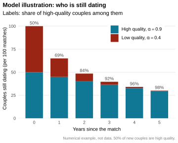](../../static/img/lecture/ciscato2025_survivors.svg "図 8.1 (a): Survivors by match quality")

\(a\) Survivors by match quality

[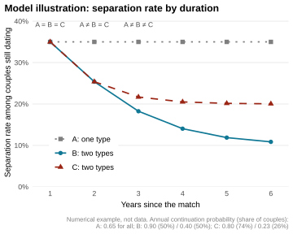](../../static/img/lecture/ciscato2025_hazard.svg "図 8.1 (b): Separation rate by duration")

\(b\) Separation rate by duration

図 8.1: Dynamic selection and identification (model illustration)

この離別率の下がり方が, 識別の手がかりになります. 簡単のため \\k\\ は高低の2つの値をとるとし, 質の高いカップルの割合を \\\pi\\, それぞれの1年ごとの継続確率を \\\alpha_H\\, \\\alpha_L\\ とします. 付き合い始めたカップルが \\d\\ 年後もまだ (同棲せずに) 交際を続けている確率は \\ p_d = \pi \alpha_H^d + \left(1 - \pi\right) \alpha_L^d \\ です. 未知数は \\\pi\\, \\\alpha_H\\, \\\alpha_L\\ の3つで, 観察する年数を1年延ばすごとに式が1本増えます. [図 fig-ciscato2025-selection-b](#fig-ciscato2025-selection-b) の3つの世界は, 1年目の離別率がすべて同じになるように選んであります. 1年分のデータでは, 全員が同じ質の世界 A と, 2つの質が混ざった世界 B, C を区別できません. 2年分あれば, 離別率が一定の A と, 離別率が下がっていく B, C を区別できます. ただし B と C は2年目まで一致するように選んであるので, まだ区別できません. 3年分あれば B と C も区別でき, 3つの未知数が決まります.

一般に \\k\\ が \\K\\ 個の値をとるなら, 未知数は \\K\\ 個の継続確率と \\K - 1\\ 個の割合で, 合わせて \\2K - 1\\ 個です. \\p_d\\ は継続確率の分布の \\d\\ 次のモーメントにあたり, \\K\\ 個の値をとる分布は最初の \\2K - 1\\ 個のモーメントで決まります. したがって, まだ同棲していないカップルの離別率を, 付き合い始めてから少なくとも \\2K - 1\\ 年目まで観察できれば, \\k\\ の分布ごと余剰を識別できます ([Ciscato 2025](#ref-ciscato2025), lemma 2). 論文の推定は \\K = 2\\ なので, 付き合い始めて1年目, 2年目, 3年目の離別率が必要になります. 実際のモデルでは, 同棲していないカップルは「別れる」「同棲せずに続ける」「同棲する」の3つから選ぶので, 同棲に移る確率も同じように使って識別します ([Ciscato 2025](#ref-ciscato2025), prop. 3).

### 8.3.3 モデル

モデルは離散時間で, 毎期, 若い世代が結婚市場に入ってくる定常な世代重複モデルです. 個人のタイプは年齢・人種・学歴の組で, 全員が独身から出発します. 独身者は毎期の結婚市場で相手を探し, 見つからなければ次の期にまた探します. 別れた人も独身者のプールに戻り, 再び相手を探せます.

**関係の継続.** 交際は同棲していない状態 (\\a = N\\) から始まり, 同棲 (\\a = C\\) に移るには費用 \\\kappa\\ がかかります. 出会った直後にカップルは永続的なマッチの質 \\k\\ を知り, その後は毎期, 標準ロジスティック分布に従うショック \\z\\ を引きます. 1期あたりの夫婦の余剰 (独身に対する上乗せ) は \\H\_{ij,a,k} + z\\ です. 効用は TU で, 余剰は Nash 交渉で分けます. Nash 交渉の男性の重み \\\theta\_{ij}\\ は交際を始めた時点で市場で決まり, その後は一定です. TU なので総余剰は \\\theta\_{ij}\\ に依存せず, 関係を続ける条件は「総余剰 \\S\_{ij,a,k} + z\\ が正であること」だけになります. [sec-matching-tu](#sec-matching-tu)節で見た, TU では効率的な選択が分配と切り離されるという性質の動学版です. 同棲中のカップルが関係を続ける確率は前節のロジットの式になり, 同棲していないカップルは「別れる」「同棲せずに続ける」「同棲する」の3つから選ぶ多項ロジットになります.

論文は, この識別の議論が ITU のモデルにも使えるものの, その場合は総余剰が Pareto ウェイトに依存するので, ウェイトを状態変数に含める必要があると注意しています ([Ciscato 2025](#ref-ciscato2025), fn. 8). 次に読む Reynoso ([2024](#ref-reynoso2024)) は, まさにそういう世界です.

**出会い.** 独身の男性 \\i\\ は, どのタイプの女性に声をかけるか, 独身にとどまるかを選びます. \\ \max\left\\\max\_{j \in \mathcal{J}} \left\\\theta\_{ij}\left(\bar{S}\_{ij} - \Lambda\_{ij}\right) + \varepsilon_j^m\right\\,\\ \varepsilon_0^m\right\\ \\ \\\theta\_{ij}\left(\bar{S}\_{ij} - \Lambda\_{ij}\right)\\ は, 出会いのコストを差し引いた期待余剰のうちの男性の取り分です. ショック \\\varepsilon^m\\ は第一種極値分布に従い, 出会いのコストのランダムな成分と解釈されます. 平均的には異なるタイプと出会うのが高くつくとしても, たまたま良い機会があれば声をかける, という偶然の要素です. 選択集合は制限されておらず, 誰でもどのタイプにも声をかけられます. 出会った相手を受け入れるか断るかだけを決めるランダムサーチのモデル (第[sec-search-matching](#sec-search-matching)章) と違い, すべてのタイプを同時に比較して選ぶ点が特徴です. 女性の側も対称です.

ショックが第一種極値分布なので, 毎期の結婚市場は Choo and Siow ([2006](#ref-choo2006)) の TU-logit そのものです. マッチング関数は [式 eq-ciscato-mmf](#eq-ciscato-mmf) で, 男性の取り分は \\ \theta\_{ij} = \frac{1}{2}\left(1 + \frac{\log c_j^f - \log c_i^m}{\bar{S}\_{ij} - \Lambda\_{ij}}\right) \\ で決まります ([Ciscato 2025](#ref-ciscato2025), prop. 2). この式は対数オッズ比 [式 eq-log-odds](#eq-log-odds) から直接出ます. 男性の系統的効用は \\U\_{ij} = \log\left(MF\_{ij} / c_i^m\right)\\ であり, [式 eq-ciscato-mmf](#eq-ciscato-mmf) を代入すると \\U\_{ij} = \theta\_{ij}\left(\bar{S}\_{ij} - \Lambda\_{ij}\right)\\ となるからです. 独身の女性 \\c_j^f\\ が多く独身の男性 \\c_i^m\\ が少ないほど, 男性の取り分は大きくなります. 稀少な側が有利になるという競争の力が, そのまま交渉力に表れています. 独身者の数 \\c_i^m\\, \\c_j^f\\ は [式 eq-mfe-system](#eq-mfe-system) と同じ会計制約から決まり, TU なので[sec-itu-logit](#sec-itu-logit)節の IPFP で速く解けます.

**定常均衡.** 期待余剰 \\\bar{S}\_{ij}\\ は, 別れた後にどんな相手と出会えるかという将来の見通しに依存し, その見通しは独身者のプールの大きさと構成に依存します. 独身者のプールはマッチと離別の結果として内生的に決まるので, 均衡は, 毎期の結婚市場の均衡, 価値関数, 人口の推移の3つが整合する定常状態として定義されます. 計算上は独身者の分布についての不動点問題です.

### 8.3.4 データと推定

**HCMST.** 推定には How Couples Meet and Stay Together (HCMST) を使います. 2009年に実施された米国の代表的な調査で, パートナーのいる回答者は関係が終わるまで毎年追跡され, 最後の追跡調査は2014年です. 同棲していない交際も含めて, 関係が始まった時期, 同棲を始めた時期, 相手の属性, そして2人がどこでどう出会ったかまで尋ねている点が, この研究にとって決定的に重要です. 推定標本は, 2009年時点で19歳から62歳の独身者545人と, 交際期間15年以下のカップル1,162組です.

[図 fig-ciscato2025-separation](#fig-ciscato2025-separation) は交際期間ごとの離別率です. 1年目にはおよそ4割のカップルが別れ, 離別率は急速に下がって10年後には5%前後で安定します. 推定されたモデルでは, この急な低下は, 質の低いカップルが最初の5年ほどでほとんど別れてしまう動学的セレクションで説明されます. 注目すべきは (b) と (c) の違いです. 同人種と異人種のカップルの離別率はほとんど同じなのに対し, 学歴の異なるカップルは最初の10年間, 学歴の同じカップルより別れやすくなっています. 前節の識別の議論に照らすと, モデルを推定する前から結論の輪郭が見えています.

[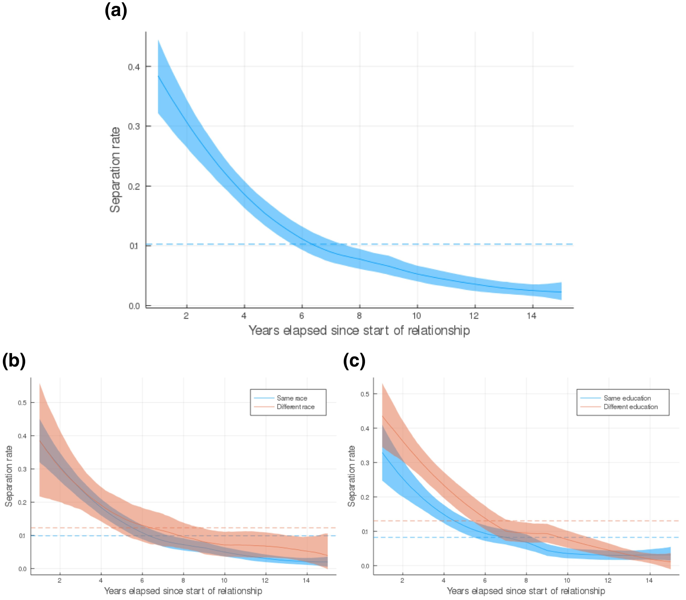](../../static/img/article/ciscato2025/fig1.jpeg "図 8.2: Separation rate by duration (Fig. 1)")

図 8.2: Separation rate by duration (Fig. 1)

**推定.** 1期は1年で, 割引因子は \\\beta = 0.95\\ に固定します. 出会いのコストと1期あたりの余剰はタイプの線形関数として \\ \Lambda\_{ij} = x\_{ij}^{\top} \lambda, \qquad H\_{ij,a,k} = x\_{ij}^{\top} \delta + \zeta_a + \eta_k \\ と特定し, \\x\_{ij}\\ には各人の年齢・人種・学歴に加えて, 同じ年齢層・同じ人種・同じ学歴かどうかを表す2人の属性の交差項を入れます. 交差項の係数が, 出会いのコストでは分断の, 余剰では補完性の強さを表します. マッチの質 \\k\\ は2つの値をとります. パラメータは, マッチ率と離別率 (全体と, 性別・学歴・人種別), 別れたときの平均年齢, 交際の平均期間をモーメントとする積率法で推定します. 基本の推定では人種を白人とそれ以外の2つ, 学歴を3つに分けます.

### 8.3.5 結果

")

図 8.3: Estimates of frictions and gains (Table 3)

[図 fig-ciscato2025-estimates](#fig-ciscato2025-estimates) が基本モデルの推定値です. 同人種であることは出会いのコストを \\3.75\\ (標準誤差 \\0.69\\) 下げますが, 1期あたりの余剰への効果は \\0.05\\ (標準誤差 \\0.06\\) で統計的に有意ではありません. 学歴はちょうど逆で, 同学歴であることの出会いのコストへの効果は \\-0.46\\ (標準誤差 \\0.53\\) で統計的に有意でない一方, 余剰は \\0.11\\ (標準誤差 \\0.04\\) 大きくなります. 年齢が近いことは, 出会いやすさと余剰の両方に効いています.

推定された \\\Lambda\_{ij}\\ が何を捉えているかは, 実際の出会いの経緯と突き合わせると具体的になります. 出会いの経緯を表すダミーを, 推定された出会いのコストと期待余剰に回帰すると, 同じ町や同じ高校の出身どうしは出会いのコストが低いものの期待余剰も低く, 同じ大学や友人の紹介で出会ったカップルはコストが低いうえに余剰も高い, という違いが出ます. オンラインやパーティでの出会いはコストが高いものの余剰も高く, 好みの相手を意図的に探す行動を反映していると解釈されます. 結婚市場は地理・教育機関・友人のネットワークで分断されていますが, どの分断も余剰の高いマッチを生むわけではない, ということです.

**分解.** 独身者のプールを固定したまま, 出会いのコストがなかったら新しいカップルの組み方がどう変わるかを計算したのが [図 fig-ciscato2025-decomp](#fig-ciscato2025-decomp) です.

")

図 8.4: Homogamy among new couples (Table 7)

新しいカップルのうち同人種の割合はデータで 88.2% ですが, 出会いのコストを取り除くと 55.5% まで下がり, ランダムに組んだ場合の 53.3% とほとんど変わりません. 人種の同類婚は, ほぼすべて出会いの分断で説明されます. 同学歴の割合はデータで 49.2% で, 出会いのコストを取り除くと 40.8%, ランダムなら 33.5% です. ランダムとの差のおよそ半分が分断, 残りの半分が補完性ということになります. 人種と学歴の区分を細かくしても結論は変わりません.

### 8.3.6 一般均衡の反実仮想

上の分解は独身者のプールを固定していました. しかし出会いの構造が変われば, 誰がいつ別れて独身者のプールに戻ってくるかも変わります. そこで論文は, 人種を4区分, 学歴を5区分にした拡張モデルで, 異人種どうしの出会いのコストを同人種と同じ水準まで下げた新しい定常均衡を計算します (Experiment I).

同人種のカップルの割合は 82.8% から 59.8% に下がります. 同時に, 摩擦が全体として弱まるので, 人々は満足できない関係を早く切り上げて次の相手を探すようになります. 離別率は 11.9% から 22.3% に上がり, パートナーのいる人の割合はむしろ下がります (男性は 63.1% から 56.5%, 女性は 60.2% から 54.0%).

分配への効果は一様ではありません ([図 fig-ciscato2025-exp1](#fig-ciscato2025-exp1)). 分断された市場では, 人種内の性比が不利なグループ, すなわち女性が多い黒人の女性と, 男性が多いヒスパニックの男性が, 同じ人種の相手の不足に苦しんでいました. 分断がなくなると彼らはより広い相手のプールにアクセスでき, 交渉力も上がります. パートナーのいる割合はヒスパニックの男性を除くすべてのグループで下がりますが, 黒人女性の低下は2ポイントにとどまります. その結果, 白人女性と黒人女性のパートナーのいる割合の差は 13.7 ポイントから 7.8 ポイントへ, 43.1% 縮まります. 分断は, 人種内の性比の不均衡を通じて交渉力の格差を生んでいたわけです.

[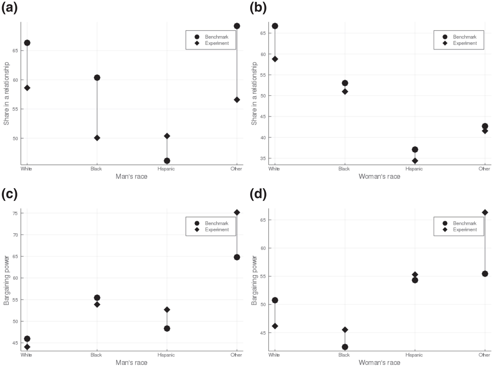](../../static/img/article/ciscato2025/fig3.jpeg "図 8.5: Experiment I: partnership and bargaining power (Fig. 3)")

図 8.5: Experiment I: partnership and bargaining power (Fig. 3)

### 8.3.7 まとめ

Ciscato ([2025](#ref-ciscato2025)) は, 摩擦のない結婚市場 (Choo–Siow の TU-logit) に出会いのコストを入れると, クロスセクションのマッチングデータでは余剰と摩擦が観察等価になることを示し, この識別問題を交際の持続時間のデータで解きました. 鍵は, 出会いのコストはマッチの成立にだけ効き, 関係の継続には効かないという非対称性です. ただし出会ったときの余剰を反映するのは, まだ同棲していないカップルの離別だけなので, 同棲する前の交際まで追える HCMST のようなデータが不可欠でした. 推定の結果, 人種の同類婚はほぼすべて分断で, 学歴の同類婚は分断と補完性が半分ずつで説明される, という非対称な結論が得られました.

枠組みとしては, サーチモデル (第[sec-search-matching](#sec-search-matching)章) と摩擦のないマッチング (この章) の中間に位置します. 毎期の市場は摩擦のない TU-logit ですが, 出会いのコストと離別・再マッチがあるので, 均衡は独身者のプールについての定常状態として決まります.

TU の仮定は識別の議論を見通しよくしています. 関係を続けるかどうかが分配に依存しないので, 離別率から余剰を直接読み取れたのでした. 次の Reynoso ([2024](#ref-reynoso2024)) では, 離婚後に夫婦が協力できないことから効用が移転可能でなくなり, 余剰の大きさと分け方が一緒に決まります.

## 8.4 Reynoso ([2024](#ref-reynoso2024))

### 8.4.1 協議離婚から単意離婚へ

米国では1960年代末から2010年までに, すべての州が離婚の制度を協議離婚 (mutual consent divorce, MCD) から単意離婚 (unilateral divorce, UD) に切り替えました. 協議離婚のもとでは, 夫婦の一方が離婚を望んでも, 相手の合意を得るか, 暴力や不貞といった相手の非を証明しなければ離婚できません. 単意離婚のもとでは, どちらか一方の意思だけで離婚できます.

経済学ではこの変化を財産権の移動としてとらえます. 協議離婚では結婚を続ける権利が守られているので, 離婚したい側が相手に補償して同意を買う必要があります. 単意離婚では離婚する権利が守られているので, 結婚を続けたい側が相手に補償して引き止める必要があります. 権利の配置が変わっても, 夫婦が交渉で効率的な結果に到達できるなら, 変わるのは分配だけで離婚するかどうかは変わらない, というのが Becker ([1991](#ref-becker1991)) に遡る Becker–Coase 定理です.

**定理 8.2 (Becker–Coase 定理とその条件 ([Chiappori et al. 2015](#ref-chiappori2015a)))** 離婚制度 (MCD か UD か) は離婚率に影響しない. ただしこの結論が成り立つには, 次の3つが必要である.

1.  結婚中に効用が移転可能 (TU) である
2.  離婚後にも効用が移転可能である
3.  2人の効用の交換レートが結婚中と離婚後で同じである. 特に, 1と2の TU が同じ基数化のもとで成り立つ

Chiappori et al. ([2015](#ref-chiappori2015a)) は, 夫婦が公共財 (典型的には子ども) を消費するとき, 離婚によって公共財の消費の仕方や評価が変われば, 3つ目の条件はごく特殊な選好を除いて成り立たないことを示しました. 効用の移転可能性 ([sec-matching-transfer](#sec-matching-transfer)節) は, 結婚中と離婚後で別々に成り立つだけでは足りず, 2つのフロンティアを同じ尺度で比べられなければならない, ということです. Becker–Coase 定理が成り立つなら, 単意離婚の導入は離婚率だけでなく, 誰が結婚するか, 誰と誰が結婚するか, 結婚中の投資にも影響しないはずです. Reynoso ([2024](#ref-reynoso2024)) はこれを2つの事実で検証します.

### 8.4.2 事実

**事実1: 単意離婚は契約できない投資を減らす.** 配偶者のキャリアや資格の取得を支える, 子どもの質に投資する, といった結婚中の投資は, 片方が管理し, 収益が将来 (離婚後かもしれない) に生まれ, しかも離婚時に第三者が確認して分けることが難しい投資です. 協議離婚なら, 離婚の合意を取りつける過程でこうした投資の将来の収益の分け方を交渉できますが, 単意離婚では投資の恩恵を受けた側がそのまま去ることができます. Stevenson ([2007](#ref-stevenson2007a)) は, 単意離婚の州で結婚した夫婦ほど配偶者の人的資本の蓄積を支えず, 自分の人的資本に投資しやすいことを示しました. 投資の収益を離婚時に分けられないことは, それ自体が TU の失敗です.

**事実2: 単意離婚は学歴の同類婚を強める.** 単意離婚の導入時期が州によって異なることを使い, 新婚夫婦 \\m\\ について次の式を推定します.[^2] \\ \text{Ed}\_{m}^{w} = \sum\_{k} \left(\beta_1^{k}\\ \text{UD}\_{t(m)g(m)}^k + \beta_2^k\\ \text{Ed}\_{m}^h \times \text{UD}\_{t(m)g(m)}^k\right) + \delta\_{g(m)} \times \text{Ed}\_m^h + \delta\_{t(m)} + \delta\_{g(m)} + \epsilon\_{m} \\ \\\text{Ed}\_m^w\\, \\\text{Ed}\_m^h\\ は妻と夫の結婚時の教育年数, \\t(m)\\ と \\g(m)\\ は結婚した年と州です. \\\text{UD}\_{tg}^k\\ は, 州 \\g\\ で単意離婚が \\k\\ 年前に導入されたことを示すダミーで, \\k\\ は \\-10\\ 年より前, \\\left(-9, -8\right)\\, \\\ldots\\, \\\left(-2, -1\right)\\, \\0\\, \\\left(1, 2\right)\\, \\\ldots\\, \\10\\ 年より後, という区間をとります. 州ごとの傾き \\\delta\_{g(m)}\\ が通常の同類婚の強さを, \\\beta_2^k\\ が単意離婚による上乗せを表します. データは PSID の 1968–92 年の, 初婚の新婚夫婦 (結婚から2年以内) です.

[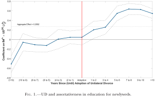](../../static/img/article/reynoso2024/fig1.svg "図 8.6: UD and assortativeness in education (Fig. 1)")

図 8.6: UD and assortativeness in education (Fig. 1)

[図 fig-reynoso2024-fig1](#fig-reynoso2024-fig1) が \\\beta_2^k\\ の推定値です. 基準となる同類婚の強さは, 夫の教育年数が1年長いと妻の教育年数が約0.25年長いという程度で, 単意離婚の州ではこれとほぼ同じ大きさの上乗せがあります. 導入から2年以内に結婚した夫婦でも, 夫婦の教育年数の結びつきは基準より 61.5% 強くなっています. 2年では結婚前の教育を変える時間はほとんどないので, この即時の効果は, 教育を所与とした相手の選び方の変化と解釈できます. 導入から年数がたつほど効果は大きくなり, こちらには結婚前の教育投資の変化も含まれていると考えられます. 導入前の係数は, 10年以上前の区間を除いて統計的に有意でなく, 事前のトレンドがないという仮定を支持しています.

どちらの事実も Becker–Coase 定理の予測と矛盾します.

### 8.4.3 モデル

Reynoso ([2024](#ref-reynoso2024)) のモデルは, 結婚市場の均衡と, 結婚後のライフサイクルの collective model を組み合わせたものです ([図 fig-reynoso2024-fig2](#fig-reynoso2024-fig2)). 女性 \\f\\ と男性 \\m\\ はそれぞれ連続体で, 学歴 \\s_i \in \mathcal{S} = \left\\\text{hs}, \text{sc}, \text{c+}\right\\\\ (高卒, 大学中退を含む some college, 大卒以上) を外生的に持ちます. \\t = 0\\ の結婚市場で, 各人は独身にとどまるか, どの学歴の相手と結婚するかを選びます. \\t = 1, \ldots, T\\ は家計のライフサイクルで, 夫婦は消費と妻の労働参加を, \\t \geq 2\\ では離婚するかどうかも決めます. 離婚制度 \\\mathcal{D} \in \left\\\text{MCD}, \text{UD}\right\\\\ は結婚時に観察され, その後も変わらないと予想されます. 貯蓄と再婚はありません.

[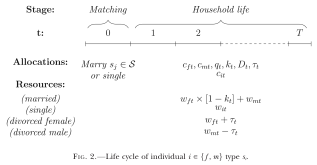](../../static/img/article/reynoso2024/fig2.svg "図 8.7: Life cycle of individuals (Fig. 2)")

図 8.7: Life cycle of individuals (Fig. 2)

**選好.** 結婚している妻と夫の1期の効用は \\ u_f^M\left(c\_{ft}, q_t, k_t\right) = \log\left(q_t\left(c\_{ft} + \alpha^{s_f s_m} k_t\right)\right) + \theta_t, \qquad u_m^M\left(c\_{mt}, q_t\right) = \log\left(q_t c\_{mt}\right) + \theta_t \\ です. \\c\_{it}\\ は私的財, \\q_t\\ は公共財 (子どもの厚生と解釈されます), \\k_t \in \left\\0, 1\right\\\\ は妻が家庭に入るかどうかで, \\\alpha^{s_f s_m}\\ は家庭に入ったときの妻の効用です. \\\theta_t\\ は夫婦に共通のマッチの質で, 夫婦のタイプごとの初期値 \\\bar{\theta}^{s_f s_m}\\ から出発するランダムウォーク \\\theta_t = \theta\_{t-1} + \epsilon_t\\, \\\epsilon_t \sim \mathcal{N}\left(0, \sigma\_{s_f s_m}^2\right)\\ に従います. 離婚すると子どもの親権は母親が持ち, 公共財への支出も元妻が決めます. 元夫は公共財を直接享受しにくいので, その評価は割り引かれます. \\ u_f^D\left(c\_{ft}, q_t\right) = \log\left(c\_{ft} q_t\right), \qquad u_m^D\left(c\_{mt}, q_t\right) = \log\left(c\_{mt} q_t^{\gamma}\right), \quad \gamma \< 1. \\ 結婚しなかった人は私的財だけを消費し, \\u_i^{\emptyset}\left(c\_{it}\right) = \log c\_{it}\\ です. 独身者と離婚者は規模の経済を享受できず, 支出 \\x\\ のうち \\c = \rho x\\ (\\\rho \< 1\\) しか消費になりません.

**所得.** 賃金は \\ \log w\_{it} = \log W_i\left(s_i\right) + a_1^{G_i}\left(s_i\right) \text{exper}\_{it} + a_2^{G_i}\left(s_i\right) \text{exper}\_{it}^2 + a_3\left(s_i\right) K_t\\ \mathbb{1}\left\\G_i = \mathcal{Y}\right\\ + \varepsilon\_{it} \\ に従います. \\W_i\left(s_i\right)\\ は学歴の市場価格, \\\text{exper}\_{it}\\ は労働市場での経験年数, \\K_t = \sum\_{r=1}^{t-1} k_r\\ は妻が家庭に入っていた期間, \\\varepsilon\_{it}\\ は恒常的な所得ショック (ランダムウォーク), \\G_i\\ は性別で \\\mathcal{Y}\\ が男性です. 鍵は \\a_3\\ です. 妻が家庭に入ると, 夫は長時間働いたり出張や転勤をしたりしやすくなり, 夫の人的資本が増えます. 逆に家庭に入った妻は経験年数が伸びないので, 賃金が下がります. どちらの効果も離婚後まで残ります. 夫の人的資本は離婚時に分けにくいので, \\a_3\\ と経験の収益が, 事実1の契約できない投資をモデルの中で表しています.

**家計の問題.** 結婚市場で, 各人は相手のタイプごとに, 相手が結婚の条件として要求する生涯効用 (効用価格) を所与とします. 学歴 \\s_f\\ の女性と結婚するには, 男性はその女性の効用価格 \\\bar{U}\_{\mathcal{X}}^{s_f s_m}\\ を保証しなければなりません. 夫婦は, 状態に応じた消費・労働参加・離婚・離婚後の送金の計画 \\\mathbf{a}\\ を collective に選びます. \\ \begin{aligned} \bar{U}\_{\mathcal{Y}}^{s_f s_m} = \max\_{\mathbf{a}}\\ & \mathbb{E}\_0 \sum\_{t=1}^{T} \delta^{t-1} \left(\left(1 - D_t\right) u_m^M\left(a_t\right) + D_t u_m^D\left(a_t\right)\right) \\ \text{s.t.}\\ & \mathbb{E}\_0 \sum\_{t=1}^{T} \delta^{t-1} \left(\left(1 - D_t\right) u_f^M\left(a_t\right) + D_t u_f^D\left(a_t\right)\right) \geq \bar{U}\_{\mathcal{X}}^{s_f s_m} \end{aligned} \tag{8.9}\\ \\D_t\\ は離婚したかどうかを表します. 予算制約は, 結婚中なら \\c\_{ft} + c\_{mt} + q_t = w\_{ft}\left(1 - k_t\right) + w\_{mt}\\, 離婚後なら元妻が \\x\_{ft} + q_t = w\_{ft} + \tau_t\\, 元夫が \\x\_{mt} = w\_{mt} - \tau_t\\ です. \\\tau_t \geq 0\\ は元夫から元妻への養育費です. 妻の参加制約の Lagrange 乗数 \\\lambda_0^{s_f s_m}\\ が, 結婚時の妻の Pareto ウェイトになります ([命題 prp-collective](#prp-collective)). 状態変数 \\\omega_t = \left(\lambda_t, K_t, \varepsilon\_{ft}, \varepsilon\_{mt}, \theta_t\right)\\ は, その期の Pareto ウェイト \\\lambda_t\\ を含みます.

**離婚後は協力しない.** 離婚した2人は非協力的な Stackelberg ゲームを行います. 元夫が養育費 \\\tau_t\\ を決め, 元妻はそれを所与として私的財と公共財に支出を配分します. 元夫は元妻が送金を何に使うかを確認できないので, 公共財への支出は効率的な水準を下回ります. さらに, 家庭に入った配偶者のおかげで人的資本を積んだ側は, 離婚後にその収益を分ける必要がありません. 結婚中の1期の配分は TU の性質を持ちますが, 離婚後は元夫婦の公共財の評価が異なるので, 協力したとしても TU になりません. こうして, 離婚後に協力できないことと結婚中の投資の収益を離婚時に分けられないことから, このモデルは ITU になります. Becker–Coase 定理の条件のうち, 離婚後の TU と交換レートの不変性がここで破れています.

**2つの離婚制度.** 離婚制度の違いは, 計画 \\\mathbf{a}\\ に課される制約の違いとして表れます. \\t\\ 期以降の生涯の期待効用を, 結婚を続けた場合 \\V\_{it}^M\\, 離婚した場合 \\V\_{it}^D\\ と書きます.

- **協議離婚**: 離婚には双方の合意が必要です. 2人とも離婚した方がよくなる配分 (\\V\_{ft}^D \geq V\_{ft}^M\\ かつ \\V\_{mt}^D \geq V\_{mt}^M\\) が存在するときだけ離婚します. 離婚した最初の期には, 2人は離婚の合意 (divorce settlement) のもとで効率的な配分を選び, 結婚を続けたかった側に補償します. その後は非協力になります. 結婚中の Pareto ウェイトは \\\lambda_t = \lambda_0\\ のまま変わりません.
- **単意離婚**: どちらか一方の意思で離婚できるので, 結婚を続けるには双方の合意が必要です. 毎期, どちらかが離婚したくなったら, その人の Pareto ウェイトを, 留まってもよいと思える最小の幅だけ引き上げて引き止めます. どうウェイトを動かしても2人とも結婚を続けた方がよいという配分 (\\V\_{ft}^M \geq V\_{ft}^D\\ かつ \\V\_{mt}^M \geq V\_{mt}^D\\) が作れないときに離婚します. 離婚の合意はなく, すぐに非協力になります.

協議離婚は, 離婚を内生的に選べる完全コミットメントです. 単意離婚は[sec-allocation-commitment](#sec-allocation-commitment)節の限定コミットメントそのもので, Pareto ウェイトは [式 eq-lc-weight](#eq-lc-weight) と同じく \\\lambda_t = \lambda\_{t-1} + \nu_t\\ と動きます. 単意離婚では, 自分の outside option が良くなったときに取り分を増やせる自由と引き換えに, 相手の outside option の変動にもさらされるので, 夫婦の間のリスクの共有が弱まります.

**結婚市場.** \\t = 0\\ の選択肢は \\\mathcal{S}\_0 = \left\\\emptyset, \text{hs}, \text{sc}, \text{c+}\right\\\\ で, 学歴 \\s_f\\ の女性 \\f\\ が選択肢 \\s\\ から得る効用は \\ U_f^{s_f s} = \bar{U}\_{\mathcal{X}}^{s_f s} + \beta_f^{s_f s} \\ です. \\\bar{U}\_{\mathcal{X}}^{s_f s}\\ はそのタイプの夫婦になる女性に共通の経済的な価値, \\\beta_f^{s_f s}\\ は個人的な好みのショックです. ショックは標準的な第一種極値分布に従い, 相手個人ではなく相手のタイプだけに依存します (Choo and Siow ([2006](#ref-choo2006)) の分離可能性). 男性も同様です. 独身の価値は \\ \bar{U}\_i^{\emptyset} = \mathbb{E}\_0 \sum\_{t=1}^{T} \delta^{t-1} u_i^{\emptyset}\left(\rho w\_{it}\right) + \bar{\theta}^{s_i} \\ で, \\\bar{\theta}^{s_i}\\ は独身でいることの非経済的な価値です.

Pareto ウェイト \\\lambda_0^{s_f s_m}\\ を動かすと, [式 eq-reynoso-household](#eq-reynoso-household) の解として妻と夫の生涯効用の組 \\\left(\bar{U}\_{\mathcal{X}}^{s_f s_m}\left(\lambda_0\right), \bar{U}\_{\mathcal{Y}}^{s_f s_m}\left(\lambda_0\right)\right)\\ が動き, 事前の Pareto フロンティア \\ \bar{U}\_{\mathcal{Y}}^{s_f s_m} = J^{s_f s_m}\left(\bar{U}\_{\mathcal{X}}^{s_f s_m}; \mathcal{D}\right) \\ が描かれます. TU のモデルなら, 適当な基数化のもとでこれは傾き \\-1\\ の直線になりますが, このモデルは ITU なので一般の曲線になり, その形は離婚制度 \\\mathcal{D}\\ に依存します.

**定義 8.4 (結婚市場の均衡 ([Reynoso 2024](#ref-reynoso2024), def. 1))** 女性と男性の効用価格の行列 \\\Upsilon = \left\\\left(\bar{U}\_{\mathcal{X}}^{s_f s_m}, \bar{U}\_{\mathcal{Y}}^{s_f s_m}\right)\right\\\_{\left(s_f, s_m\right) \in \mathcal{S}^2}\\ と女性のタイプと男性のタイプの割り当てが均衡であるとは, 次の2つが成り立つことをいう. ここで \\\mu\_{s_f \to s_m}\left(\Upsilon\right)\\ は, 価格 \\\Upsilon\\ のもとで学歴 \\s_m\\ の男性と結婚したい学歴 \\s_f\\ の女性の質量, \\\mu\_{s_f \leftarrow s_m}\left(\Upsilon\right)\\ は学歴 \\s_f\\ の女性と結婚したい学歴 \\s_m\\ の男性の質量である.

1.  すべての夫婦のタイプで市場が清算する. \\ \mu\_{s_f \to s_m}\left(\Upsilon\right) = \mu\_{s_f \leftarrow s_m}\left(\Upsilon\right) \qquad \forall \left(s_f, s_m\right) \in \mathcal{S}^2 \\
2.  各タイプの人口が既婚者と独身者の和に等しい. \\ \mu\_{s_f} = \mu\_{s_f \to \emptyset} + \sum\_{s_m \in \mathcal{S}} \mu\_{s_f \to s_m}\left(\Upsilon\right), \qquad \mu\_{s_m} = \mu\_{\emptyset \leftarrow s_m} + \sum\_{s_f \in \mathcal{S}} \mu\_{s_f \leftarrow s_m}\left(\Upsilon\right) \\

ある夫婦のタイプで男性からの需要が超過していれば, その女性の効用価格が上がります. ただし価格が変われば [式 eq-reynoso-household](#eq-reynoso-household) の解, つまり夫婦の働き方や離婚の仕方も変わり, それがまた結婚の価値と需要を動かします.

**ITU-logit との関係.** この結婚市場は, [sec-itu-logit](#sec-itu-logit)節の ITU-logit そのものです. 男性のタイプを \\x = s_m\\, 女性のタイプを \\y = s_f\\ とすると, 交渉可能集合 \\\mathcal{F}\_{xy}\\ は (独身の価値を基準にして測った) フロンティア \\J\\ の下側の集合で, 好みのショックは第一種極値分布に従います. 実際 Reynoso ([2024](#ref-reynoso2024)) は, このモデルが Galichon et al. ([2019](#ref-galichon2019)) の proper bargaining set の条件を満たすことを示し, 存在と一意性の定理 ([定理 thm-gkw-unique](#thm-gkw-unique)) を適用して, どちらの離婚制度のもとでも均衡が一意に存在することを導いています ([Reynoso 2024](#ref-reynoso2024), app. B). 違いは2つあります. 第一に, フロンティアを1次元でパラメトライズする変数として, wedge ([式 eq-wedge-param](#eq-wedge-param)) ではなく妻の Pareto ウェイト \\\lambda_0\\ を使います. どちらもフロンティア上の位置を指定する変数なので, 均衡を求める問題は「夫婦のタイプごとに市場を清算する \\\lambda_0\\ を探す問題」になります. 第二に, フロンティアは閉形式では書けず, \\\lambda_0\\ を1つ与えるたびにライフサイクルの問題 [式 eq-reynoso-household](#eq-reynoso-household) を数値的に解いて初めて分かります. 距離関数 \\D\_{xy}\\ も, 研究者が関数形を特定するのではなく, 家計の行動のモデルから導かれるわけです.

**予想される効果.** 単意離婚は同類婚を強める方向に働きます. 第一に, 単意離婚のもとでは離婚の合意を通じて家庭に入ったことの収益を分けてもらえないので, 家庭に入る機会費用の小さい低学歴の女性も家庭に入る誘因が弱まり, 高学歴の男性にとっての魅力が下がります. 第二に, 高学歴どうしの夫婦は2人の所得が補完的なので離婚のコストが大きく, 離婚しにくい組み合わせです. 離婚しやすくなるほど, 高学歴どうしが引き合います. ただし ITU のモデルでは, 学歴の分布が効用価格を通じて誰と誰が結婚するかに影響するので, 効果の大きさや向きは学歴の分布の異なる市場ごとに違いえます. 厚生への効果も曖昧です. 離婚の自由は厚生を高めうる一方, 単意離婚では配偶者の所得ショックによっても配分が組み替えられるので, 夫婦の間のリスクの共有が弱まります. どちらが勝つかは, 推定してみないと分かりません.

### 8.4.4 推定

**データと4つの結婚市場.** データは PSID の 1968–92 年で, 形成される時点から観察できる家計 (初婚の夫婦と, 40歳まで結婚しなかった独身者) を使います. 単意離婚の効果を後で模擬するために, 標本期間を通じて協議離婚だった19州の家計だけで推定します. 標本は 3,528 世帯 (夫婦 2,817 組, 独身女性 400 人, 独身男性 311 人) です. Gayle and Shephard ([2019](#ref-gayle2019)) にならい, 国勢調査の地域区分にもとづいて4つの結婚市場 (Northeast, Midwest and West, South Atlantic, South Central) を定義します. 市場によって学歴の分布が異なることが, 識別の鍵になります.

**推定の手順.** 1期を3年として \\T = 10\\ (25歳以下から50歳以上まで) とします. 第1段階で, モデルの外で識別されるパラメータ (割引因子 \\\delta\\, 元夫の公共財へのウェイト \\\gamma\\, 消費の規模 \\\rho\\, 恒常所得ショックの分散) を固定し, 好みのショックを標準的な第一種極値分布とします. 第2段階で, 残る54個のパラメータ \\\Pi\\ (妻が家庭に入ることの効用 9 個, マッチの質の平均 9 個と分散 9 個, 独身の非経済的な価値 6 個, 所得過程 21 個) を, 市場ごと・夫婦のタイプごとの初期 Pareto ウェイト \\\Lambda = \left\\\lambda\_{0g}^{s_f s_m}\right\\\\ (\\9 \times 4 = 36\\ 個) と同時に推定します.

**識別.** 識別の鍵は複数の結婚市場です. 選好と所得過程のパラメータは市場間で共通で, 市場間で異なるのは学歴の分布だけだと仮定します. すると学歴の分布の違いは, 選好にも予算にも入らず Pareto ウェイトにだけ効く distribution factor ([sec-allocation](#sec-allocation)節) として働き, Pareto ウェイトを選好とは別に識別します ([Galichon et al. 2019](#ref-galichon2019); [Gayle and Shephard 2019](#ref-gayle2019)). Pareto ウェイトが分かれば, 残りのパラメータは, それぞれが強く効く行動 (結婚のパターン, 妻の就業, 離婚) から識別されます. モーメントは, 市場ごとの学歴別の独身率 (24 個), 夫婦のタイプの頻度 (72 個), 夫婦のタイプ別の専業主婦の割合 (36 個) と離婚確率 (36 個), 学歴・性別の平均賃金 (24 個) と賃金の経験プロファイル (60 個) の計 252 個です.

**均衡制約つきの SMM.** パラメータは, 市場清算を制約とする simulated method of moments で推定します. \\ \begin{aligned} \left(\hat{\Pi}, \hat{\Lambda}\right) = \arg\min\_{\Pi, \Lambda}\\ & \left(\text{mom}^{\text{sim}}\left(\Pi, \Lambda\right) - \text{mom}^{\text{data}}\right)^{\top} V \left(\text{mom}^{\text{sim}}\left(\Pi, \Lambda\right) - \text{mom}^{\text{data}}\right) \\ \text{s.t.}\\ & \mu\_{s_f \to s_m}\left(\Pi, \Lambda\right) = \mu\_{s_f \leftarrow s_m}\left(\Pi, \Lambda\right) \qquad \forall \left(s_f, s_m\right) \in \mathcal{S}^2 \end{aligned} \\ \\V\\ はデータのモーメントの分散の逆数を対角に並べた重み行列です. Pareto ウェイト \\\Lambda\\ は, 本来ならパラメータ \\\Pi\\ を与えるごとに市場清算から決まる内生変数ですが, ここでは推定するパラメータに含め, 市場清算の条件を制約として課しています. これが次に見る MPEC の考え方です.

#### MPEC

[sec-gmm-micro](#sec-gmm-micro)節の家計モデルは, パラメータを与えれば配分が閉じた形で解けました. しかし Reynoso ([2024](#ref-reynoso2024)) のような一般均衡モデルの推定では, パラメータ \\\Pi\\ を与えるたびに均衡を解く内側のループが必要になります. ここでは結婚市場を清算する Pareto ウェイト (と期待価値の行列) が, Aiyagari モデルなら資産市場を清算する金利が, パラメータごとの不動点計算として挟まるわけです. この入れ子構造 (nested fixed point) は計算コストの大部分を占めがちで, 最適化の1ステップごとに高精度で均衡を解き直すのは大きな無駄になります.

Su and Judd ([2012](#ref-su2012)) が提案した **MPEC** (mathematical programming with equilibrium constraints) は, この入れ子を解消します. アイデアは単純で, 均衡条件を「パラメータごとに解いてから目的関数を評価する」のではなく, 内生変数を最適化の変数に昇格させ, 均衡条件を制約として最適化ソルバに渡すことです. 上の constrained SMM がまさにこの形で, 均衡価格にあたる \\\Lambda\\ が最適化の変数に昇格し, 結婚市場の清算条件 \\\mu\_{s_f \rightarrow s_m} = \mu\_{s_f \leftarrow s_m}\\ が制約として課されています.

最適化の途中では均衡が満たされていなくてよく, 収束時に満たされていればよい, というのが要点です. 制約付き最適化は[sec-constrained-opt](#sec-constrained-opt)節で学んだ手法 (内点法など) がそのまま使えます. 代表的な解き方のひとつが拡張ラグランジュ法です.

**アルゴリズム 8.2 (拡張ラグランジュ法 (Augmented Lagrangian method))** 制約付き最適化問題 \\ \min\_{\mathbf{x}} f\left(\mathbf{x}\right) \quad \text{s.t.} \quad c_i\left(\mathbf{x}\right) = 0 \quad \forall i \\ に対して, 乗数項とペナルティ項を加えた無制約問題 \\ \min\_{\mathbf{x}}\\ f\left(\mathbf{x}\right) + \sum\_{i} \nu_i c_i\left(\mathbf{x}\right) + \frac{\rho}{2} \sum\_{i} c_i\left(\mathbf{x}\right)^2 \\ を, 乗数 \\\nu_i\\ とペナルティの重み \\\rho\\ を更新しながら繰り返し解く.

\\\mathbf{x} = \left(\Pi, \Lambda\right)\\, \\f\\ を SMM の目的関数, \\c_i\\ を各市場の均衡条件とすれば, 実用上はターゲットが制約条件の数だけ増えた SMM とみなすことができます. Gayle and Shephard ([2019](#ref-gayle2019)) も, 結婚市場均衡を制約とするこの形の constrained SMM でモデルを推定しています.

### 8.4.5 推定結果

推定されたモデルは, 4つの市場すべてで夫婦のタイプの頻度, 独身率, 専業主婦の割合, 離婚確率をよく再現します. 女性の選択から計算した夫婦の頻度と男性の選択から計算した頻度も一致しており, 推定値のもとでモデルは均衡にあります.

選好のパラメータ (論文の Table 1) からは, 次のことが読み取れます. 妻が家庭に入ることの効用 \\\alpha^{s_f s_m}\\ は, 夫が高卒の家計で最も高く, 夫が大卒の家計で最も低く推定されます. 夫が大卒なら, 妻が家庭に入ることで夫の人的資本が最も大きく増えるので, 小さな \\\alpha\\ でも妻は家庭に入るからです. マッチの質の分散は大卒どうしの夫婦で最も小さく, 結婚が最も安定しています.

[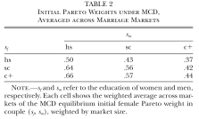](../../static/img/article/reynoso2024/table2.svg "図 8.8: Initial Pareto weights under MCD (Table 2)")

図 8.8: Initial Pareto weights under MCD (Table 2)

[図 fig-reynoso2024-weights](#fig-reynoso2024-weights) は, 協議離婚のもとで市場を清算する妻の初期 Pareto ウェイトを, 市場の大きさで加重平均したものです. ここでは2人のウェイトの和が1になるように \\\lambda = \lambda_0 / \left(1 + \lambda_0\right)\\ と変換しています. 妻のウェイトは妻の学歴とともに上がり, 結婚市場で女性の学歴が評価されていることを示しています. また, 自分より学歴の低い夫と結婚する女性ほどウェイトが高く, 学歴の差を家計内の取り分で補償されています. 市場ごとに見ると, 大卒女性が大卒男性に比べて過剰な South Central では, 大卒どうしの夫婦の妻のウェイトが4つの市場で最も低くなります. 学歴の分布が交渉力を動かすという, 識別に使った経路がここに表れています.

### 8.4.6 単意離婚の均衡効果

推定したモデルで, 学歴の分布とパラメータを固定したまま単意離婚を導入し, 新しい結婚市場の均衡を解きます. 均衡の計算には Galichon et al. ([2019](#ref-galichon2019)) と Gayle and Shephard ([2019](#ref-gayle2019)) のアルゴリズムを使います. メカニズムを調べるために, 単意離婚の2つの特徴を1つずつ取り除いた反実仮想も解きます. 「離婚の合意つき UD」では, 単意で離婚できるが, 協議離婚と同じく離婚時に合意を結べます. 「再交渉なし UD」では, 単意で離婚できるが, 結婚中は初期の Pareto ウェイトにコミットします.

**Pareto ウェイト.** 単意離婚の導入で, 妻の初期 Pareto ウェイトはすべての夫婦のタイプで下がり, 大卒女性で最も大きく下がります. 協議離婚のときの価格のままだと, 単意離婚のもとでは独身にとどまる男性が増え, すべての夫婦のタイプで女性が過剰になるからです. 単意離婚は男性に2つの点で不利に働きます. 第一に, 離婚しやすくなると, 親権を持たない男性は公共財 (子ども) を享受しにくくなります. 第二に, 結婚中の妻がより働くようになるので, 夫が積む人的資本が減り, 離婚後の価値も下がります. 男性を結婚に引き込むには, 女性の取り分を下げる必要があるわけです.

**同類婚.** 単意離婚の導入で, 学歴の同類婚は即座に強まります ([図 fig-reynoso2024-excess](#fig-reynoso2024-excess)). ランダムに組んだ場合と比べた同学歴の夫婦の超過割合は, 4つのうち3つの市場で増え, 事実2と整合的です. 学歴の高い市場ほど同類婚の程度もその増加も大きくなります. 例外は大卒女性が過剰な South Central で, 高卒どうしと大卒どうしの夫婦が減って同類婚が弱まります. 学歴の分布が効果の向きまで左右するという, ITU の均衡モデルならではの結果です.

[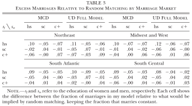](../../static/img/article/reynoso2024/table3.svg "図 8.9: Excess marriages relative to random matching (Table 3)")

図 8.9: Excess marriages relative to random matching (Table 3)

メカニズムを見るために, 同学歴の夫婦の割合をランダムに組んだ場合の割合で割った指標を4つのモデルで比べたのが [図 fig-reynoso2024-pam](#fig-reynoso2024-pam) です. 単意離婚に離婚の合意を戻すか, 結婚中のウェイトへのコミットメントを戻すと, どの市場でも同類婚の強まりは小さくなるか, 逆転します. 同類婚の強まりは, 単意離婚のもとで夫婦の協力とリスクの共有が弱まり, 学歴の異なる夫婦の低学歴側の保障が薄くなることから来ている, というのが論文の解釈です.

[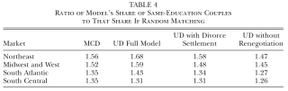](../../static/img/article/reynoso2024/table4.svg "図 8.10: Same-education share relative to random matching (Table 4)")

図 8.10: Same-education share relative to random matching (Table 4)

**専業主婦と離婚.** 単意離婚のもとで結婚した夫婦は, 妻が家庭に入りにくく, 離婚しやすくなります. 大卒男性のうち専業主婦の妻を持つ割合は, 平均で 6% 下がります ([図 fig-reynoso2024-sah](#fig-reynoso2024-sah)). 大卒男性が働き続ける大卒女性と結婚しやすくなることと, 単意離婚が妻を労働市場にとどめることの両方によるものです. 一方 some college の男性は, 南部の市場で家庭に入りやすい高卒女性と結婚する割合が増えるため, 平均では専業主婦の妻を持つ割合がむしろ上がります. 離婚確率はすべての夫婦のタイプで上がり, 上昇幅は妻が大卒の夫婦で最も大きくなりますが, その水準は依然として最も低いままです ([図 fig-reynoso2024-divorce](#fig-reynoso2024-divorce)). 離婚の合意を戻しても離婚確率は変わりません. 片方が離婚を望み, 結婚中の再交渉でも引き止められないという事情は, 合意の有無では変わらないからです. 逆に, 結婚中の再交渉を禁じると離婚は増えます.

[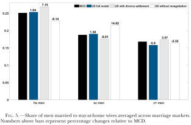](../../static/img/article/reynoso2024/fig5.svg "図 8.11: Share of men married to stay-at-home wives (Fig. 5)")

図 8.11: Share of men married to stay-at-home wives (Fig. 5)

[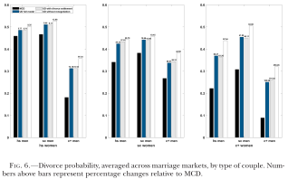](../../static/img/article/reynoso2024/fig6.svg "図 8.12: Divorce probability by couple type (Fig. 6)")

図 8.12: Divorce probability by couple type (Fig. 6)

**結婚の利益.** 最後に, 好みのショックが実現する前の段階で, 結婚という選択肢が独身に比べてどれだけ価値があるか (gains from marriage, GM) を見ます. ショックが第一種極値分布なので, 学歴 \\s_f\\ の女性の結婚の利益は対数和 ([式 eq-logsum](#eq-logsum)) で書けます. \\ GM\_{s_f} = \log \sum\_{s \in \mathcal{S}\_0} \exp\left(\bar{U}\_{\mathcal{X}}^{s_f s} - \bar{U}\_{\mathcal{X}}^{s_f \emptyset}\right) \\

[図 fig-reynoso2024-gm](#fig-reynoso2024-gm) は, 女性の結婚の利益と, 協議離婚と同じ厚生を保つのに必要な毎期の消費の変化率 (消費等価) です. 結婚の利益はどちらの制度でも正です. 単意離婚で得をするのは学歴が中位 (some college) の女性で, 協議離婚にとどめるには毎期の消費の 1.13% の補償が必要です. 主な理由は離婚の自由で, 結婚中の再交渉を禁じると, 利益は協議離婚のときより下がります. 損をするのは大卒女性で, 単意離婚を避けるためなら毎期の消費の 2.26% を手放してもよいほどです. 離婚の増加が最も大きいのがこのグループで, 離婚の合意を戻すと損失は和らぎます. 高卒女性は平均してわずかに得をしますが, 市場によって異なります. 論文全体としては, 多くのグループで結婚の利益が下がるという結論です.

[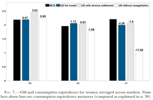](../../static/img/article/reynoso2024/fig7.svg "図 8.13: Gains from marriage for women (Fig. 7)")

図 8.13: Gains from marriage for women (Fig. 7)

推定に使っていない2つの効果, すなわち単意離婚が同類婚に与える効果 (事実2) と, すでに結婚している夫婦の行動に与える効果も, モデルはよく再現します ([Reynoso 2024](#ref-reynoso2024), app. D).

### 8.4.7 まとめ

Reynoso ([2024](#ref-reynoso2024)) は, 結婚市場の均衡モデルと, 離婚を内生的に選べるライフサイクルの collective model を組み合わせ, 単意離婚の導入が結婚市場の均衡をどう動かすかを定量化しました. 結婚中の投資の収益を離婚時に分けられないことと, 離婚後に協力できないことから, モデルは ITU になります. そのため Becker–Coase 定理は成り立たず, 離婚制度は誰と誰が結婚するかにまで影響します.

推定したモデルでは, 単意離婚によって学歴の同類婚が強まり, 妻が家庭に入る割合が下がり, 離婚が増え, 多くのグループで結婚の利益が下がります. 単意離婚に協議離婚の要素を戻すと効果が和らぐことから, 効果の大部分は結婚中の協力とリスクの共有が弱まることによるものです. 政策を評価するには, すでに結婚している夫婦への効果だけでなく, これから結婚市場に入る世代が直面する均衡の変化を考える必要がある, というのが論文の主張です.

手法の面では, [sec-itu-logit](#sec-itu-logit)節の ITU-logit の応用として読めます. 距離関数の関数形を特定する代わりに, 家計のライフサイクルのモデルからフロンティアを導いています. 均衡の存在と一意性は Galichon et al. ([2019](#ref-galichon2019)) の定理から, Pareto ウェイトの識別は複数の市場の学歴分布の違いから得ており, 推定は均衡を制約とする SMM (MPEC) で行っています.

Becker, Gary S. 1973. “A Theory of Marriage: Part I.” *Journal of Political Economy* 81 (4): 813–46. <https://doi.org/10.1086/260084>.

Becker, Gary S. 1991. *A Treatise on the Family*. Enl. Harvard University Press.

Chiappori, Pierre-Andre, Murat Iyigun, and Yoram Weiss. 2015. “The Becker–Coase Theorem Reconsidered.” *Journal of Demographic Economics* 81 (2): 157–77. <https://doi.org/10.1017/dem.2015.3>.

Choo, Eugene, and Aloysius Siow. 2006. “Who Marries Whom and Why.” *Journal of Political Economy* 114 (1): 175–201. <https://doi.org/10.1086/498585>.

Ciscato, Edoardo. 2025. “Assessing Racial and Educational Segmentation in Large Marriage Markets.” *Review of Economic Studies* 92 (6): 3788–839. <https://doi.org/10.1093/restud/rdae115>.

Gale, D., and L. S. Shapley. 1962. “College Admissions and the Stability of Marriage.” *American Mathematical Monthly* 69 (1): 9–15. <https://doi.org/10.2307/2312726>.

Galichon, Alfred, Scott Duke Kominers, and Simon Weber. 2019. “Costly Concessions: An Empirical Framework for Matching with Imperfectly Transferable Utility.” *Journal of Political Economy* 127 (6): 2875–925. <https://doi.org/10.1086/702020>.

Galichon, Alfred, and Bernard Salanié. 2022. “Cupid’s Invisible Hand: Social Surplus and Identification in Matching Models.” *Review of Economic Studies* 89 (5): 2600–2629. <https://doi.org/10.1093/restud/rdab090>.

Galichon, Alfred, and Simon Weber. 2024. “Matching Under Imperfectly Transferable Utility.” In *Handbook of the Economics of Matching*, vol. 1. Elsevier. <https://doi.org/10.1016/bs.hesmat.2024.10.002>.

Gayle, George-Levi, and Andrew Shephard. 2019. “Optimal Taxation, Marriage, Home Production, and Family Labor Supply.” *Econometrica* 87 (1): 291–326. <https://doi.org/10.3982/ECTA14528>.

Reynoso, Ana. 2024. “The Impact of Divorce Laws on the Equilibrium in the Marriage Market.” *Journal of Political Economy* 132 (12): 4155–204. <https://doi.org/10.1086/732532>.

Stevenson, Betsey. 2007. “The Impact of Divorce Laws on Marriage-Specific Capital.” *Journal of Labor Economics* 25 (1): 75–94. <https://doi.org/10.1086/508732>.

Su, Che-Lin, and Kenneth L. Judd. 2012. “Constrained Optimization Approaches to Estimation of Structural Models.” *Econometrica* 80 (5): 2213–30. <https://doi.org/10.3982/ECTA7925>.

Train, Kenneth E. 2009. *Discrete Choice Methods with Simulation*. 2nd ed. Cambridge university press.

[^1]: 厳密には, 年齢層が上がるなど2人のタイプが変わったカップルも, そのままでは比べられません. 論文はタイプの推移確率が \\k\\ に依存しないと仮定し, それで割り戻して調整しています ([Ciscato 2025](#ref-ciscato2025), app. A).

[^2]: 論文の式 (1) は添字 \\mtg\\ で書かれていますが, 各夫婦は結婚した年と州で1回だけ観察されるので, ここでは \\t(m)\\, \\g(m)\\ と書きました. 論文で \\\sum_g \beta_3^g \left(g \times \text{Ed}\_{mtg}^h\right)\\ と書かれている州ごとの傾きは \\\delta\_{g(m)} \times \text{Ed}\_m^h\\ と表し, 定数項は \\\delta\_{g(m)}\\ に含めています.
