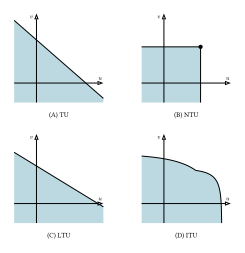
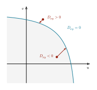
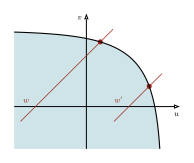

# 7  マッチング理論

Code

この章では, 結婚のマッチングをモデル化するための一般的な枠組みを Galichon and Weber ([2024](#ref-galichon2024)) にしたがって紹介します.

## 7.1 枠組み

### 7.1.1 集団とマッチング

男性は \\i \in \mathcal{I}\\, 女性は \\j \in \mathcal{J}\\ と番号をつけ, 男性はタイプ \\x_i \in \mathcal{X}\\, 女性はタイプ \\y_j \in \mathcal{Y}\\ を持つとします. タイプは年齢・学歴・所得など, 研究者に観察できる属性で, 有限個とします. タイプ \\x\\ の男性の人数を \\n_x\\, タイプ \\y\\ の女性の人数を \\m_y\\ と書きます. 独身でいる選択肢を表すダミーのタイプ \\0\\ を両側に付け加え, \\\mathcal{X}\_0 := \mathcal{X} \cup \left\\0\right\\\\, \\\mathcal{Y}\_0 := \mathcal{Y} \cup \left\\0\right\\\\ とします.

マッチングは2つの水準で記述します. **個人の水準**では, \\\mu\_{ij} \in \left\\0, 1\right\\\\ を男性 \\i\\ と女性 \\j\\ がマッチしているときに \\1\\, そうでないときに \\0\\ とし, 各人の相手は高々1人 (\\\sum_j \mu\_{ij} \leq 1\\, \\\sum_i \mu\_{ij} \leq 1\\) とします. **タイプの水準**では, タイプ \\x\\ の男性とタイプ \\y\\ の女性のマッチ数を \\\mu\_{xy}\\, 独身者数を \\\mu\_{x0}\\, \\\mu\_{0y}\\ と書きます. 実行可能なタイプ別マッチングの集合は次の通りです.

\\ \mathcal{M} := \left\\\mu \in \mathbb{R}\_{+}^{\mathcal{X} \times \mathcal{Y}} : \sum\_{y \in \mathcal{Y}} \mu\_{xy} \leq n_x,\\ \sum\_{x \in \mathcal{X}} \mu\_{xy} \leq m_y\right\\ \\

個人の水準の均衡概念が個人均衡 ([sec-matching-stability](#sec-matching-stability)), 同じタイプの中の観察できない異質性を入れてタイプの水準で書き直したものが**集計均衡** ([sec-matching-aggregate](#sec-matching-aggregate)) です.

### 7.1.2 交渉可能集合

男性 \\i\\ (タイプ \\x\\) と女性 \\j\\ (タイプ \\y\\) がマッチしたとき, 2人は実行可能な効用の組 \\\left(u, v\right) \in \mathcal{F}\_{xy}\\ の中から1点を選ぶとします. この集合に置く仮定は3つだけです.

> **NOTE:**
>
> 集合 \\\mathcal{F}\_{xy} \subset \mathbb{R}^2\\ が次の3条件を満たすとき, proper bargaining set と呼ぶ.
>
> 1.  **閉かつ非空**
> 2.  **Lower comprehensive**: \\u' \leq u\\, \\v' \leq v\\ かつ \\\left(u, v\right) \in \mathcal{F}\_{xy}\\ ならば \\\left(u', v'\right) \in \mathcal{F}\_{xy}\\
> 3.  **上に有界**: \\u_n \to +\infty\\ かつ \\v_n\\ が下に有界ならば, 十分大きな \\n\\ で \\\left(u_n, v_n\right) \notin \mathcal{F}\_{xy}\\. \\u_n\\ と \\v_n\\ を入れ替えても同様

条件1は効率的な配分が存在するために必要で, 条件2は自由処分 (free disposal), 条件3は「2人が同時にいくらでも高い効用を得ることはできない」という稀少性の要求です. 凸性を要求しないことがポイントです. 従来の枠組みでは凸な交渉フロンティアを考えることが多かったのですが, それは「効用の移転が可能である」ことを暗に仮定しているからです.

### 7.1.3 移転可能性による分類

夫婦の間で効用を「移転」する技術があるかどうか, あるとすればどんなレートで移転できるかで, マッチングモデルは3つに分類されます.

- **TU (transferable utility)**: うまく選んだ効用の基数化のもとで, 1単位の効用をちょうど1単位として相手に移転できる. 交渉可能集合は \\\mathcal{F}\_{xy} = \left\\u + v \leq \Phi\_{xy}\right\\\\ で, フロンティアは傾き \\-1\\ の直線. 余剰 \\\Phi\_{xy}\\ だけがモデルを定め, 分配は市場で内生的に決まる.
- **NTU (non-transferable utility)**: 移転の技術が存在しない. \\\mathcal{F}\_{xy} = \left\\u \leq \alpha\_{xy},\\ v \leq \gamma\_{xy}\right\\\\ で, マッチが実現したときの各自の利得は外生的に \\\left(\alpha\_{xy}, \gamma\_{xy}\right)\\ に固定される. 順序的な情報 (選好順位) だけが意味を持つ.
- **ITU (imperfectly transferable utility)**: 移転はできるが交換レートが一定でない. \\\mathcal{F}\_{xy}\\ は一般の proper bargaining set で, フロンティアは一般の減少曲線になる.

[図 fig-matching-frontiers](#fig-matching-frontiers) は, 典型的なフロンティアを並べたものです.

図 7.1: **移転可能性とフロンティア.** 影は交渉可能集合 \\\mathcal{F}\_{xy}\\, 黒線はそのフロンティア.

TUはフロンティアが傾き \\-1\\ の直線で, NTUは1点だけが効率的です. ITUは一般の減少曲線で, 内側にへこむこともあります. LTU (linearly transferable utility) は ITU の特殊ケースで, 交換レートは一定だが \\1\\ ではありません.

### 7.1.4 距離関数

集合 \\\mathcal{F}\_{xy}\\ を, その境界までの符号付き距離で表現します.

> **NOTE:**
>
> Proper bargaining set \\\mathcal{F}\_{xy}\\ の距離関数 \\D\_{xy} : \mathbb{R}^2 \to \mathbb{R}\\ を次のように定義する.
>
> \\ D\_{xy}\left(u, v\right) = \min\left\\z \in \mathbb{R} : \left(u - z, v - z\right) \in \mathcal{F}\_{xy}\right\\. \tag{7.1}\\

\\D\_{xy}\left(u, v\right)\\ は, 点 \\\left(u, v\right)\\ から45度線に沿ってフロンティアまで測った距離です (正確には \\\sqrt{2}\\ 倍を除いた符号付き距離). \\\left(u, v\right)\\ が実行可能集合の外にあれば正, 内部にあれば負, 境界上でちょうど \\0\\ になります. したがって

\\ \mathcal{F}\_{xy} = \left\\\left(u, v\right) : D\_{xy}\left(u, v\right) \leq 0\right\\ \\

であり, フロンティアは \\D\_{xy}\left(u, v\right) = 0\\ を満たす点の集合です.

図 7.2: **距離関数.** 各点から 45° の対角線に沿ってフロンティアまで測る. 集合の外の点では \\D\_{xy} \> 0\\, 内部の点では \\D\_{xy} \< 0\\, フロンティア上で \\D\_{xy} = 0\\. ([Galichon et al. 2019](#ref-galichon2019)) にもとづく.

#### 距離関数の性質

定義から, 距離関数は次の性質を持ちます ([Galichon et al. 2019](#ref-galichon2019)).

**補題 7.1 (距離関数の性質)** \\\mathcal{F}\_{xy}\\ を proper bargaining set, \\D\_{xy}\\ をその距離関数とすると, 次が成り立つ.

1.  \\\mathcal{F}\_{xy} = \left\\\left(u, v\right) : D\_{xy}\left(u, v\right) \leq 0\right\\\\ であり, \\D\_{xy}\left(u, v\right) = 0\\ となるのは \\\left(u, v\right)\\ がちょうどフロンティア上にあるときである.
2.  **単調性**: \\u \leq u'\\ かつ \\v \leq v'\\ ならば \\D\_{xy}\left(u, v\right) \leq D\_{xy}\left(u', v'\right)\\ である. さらに \\u \< u'\\ かつ \\v \< v'\\ ならば狭義の不等号が成り立つ.
3.  **平行移動不変性**: 任意の \\a \in \mathbb{R}\\ について \\ D\_{xy}\left(a + u, a + v\right) = a + D\_{xy}\left(u, v\right). \tag{7.2}\\
4.  **連続性**: 任意の2点について \\ \min\left\\u' - u, v' - v\right\\ \leq D\_{xy}\left(u', v'\right) - D\_{xy}\left(u, v\right) \leq \max\left\\u' - u, v' - v\right\\ \\ が成り立ち, 特に \\D\_{xy}\\ は連続である.

証明は[付録](../../lesson/appendix/proof.llms.md#prf-dist-props)にあります.

1つ目の性質により, 交渉可能集合はまるごと1つの関数の符号で表せます. 「夫婦がフロンティア上にいる」という条件は \\D\_{xy}\left(u, v\right) = 0\\ という1本の等式になるので, 実行可能性を均衡条件に方程式として入れられます. 2つ目は, 2人とも取り分を増やせば集合からより遠ざかる, という当たり前の性質です. 3つ目の平行移動不変性は, 点を対角線方向に \\a\\ だけ動かせば, フロンティアまでの対角線上の距離もちょうど \\a\\ だけ変わる, ということです. 両辺を \\a\\ で微分すれば, \\D\_{xy}\\ が微分可能な点では \\\partial_u D\_{xy} + \partial_v D\_{xy} = 1\\ も分かります. 図で見れば当たり前の性質ですが, 結婚の章でロジットのマッチング関数を閉形式で与え, その1次同次性を生む鍵になります. 4つ目は, 2人の取り分を動かしたときの \\D\_{xy}\\ の変化が, 2人の変化のうち小さい方と大きい方の間に収まることを表しています. どちらの取り分も高々 \\\varepsilon\\ しか動かなければ \\D\_{xy}\\ も高々 \\\varepsilon\\ しか動かないので, \\D\_{xy}\\ は連続です.

**命題 7.1 (和集合と共通部分, Galichon et al. ([2019](#ref-galichon2019)))** \\\mathcal{F}^1, \ldots, \mathcal{F}^K\\ を proper bargaining set とすると, \\\bigcup_k \mathcal{F}^k\\ と \\\bigcap_k \mathcal{F}^k\\ も proper bargaining set であり, その距離関数は

\\ D\_{\cup}\left(u, v\right) = \min_k D\_{\mathcal{F}^k}\left(u, v\right), \qquad D\_{\cap}\left(u, v\right) = \max_k D\_{\mathcal{F}^k}\left(u, v\right). \\

## 7.2 個人均衡と集計均衡

### 7.2.1 個人均衡

> **NOTE:**
>
> \\\left(\mu\_{ij}, u_i, v_j\right)\\ が個人均衡であるとは, 次の3条件が成り立つこと.
>
> 1.  \\\mu\_{ij} \in \left\\0, 1\right\\\\, \\\sum_j \mu\_{ij} \leq 1\\, \\\sum_i \mu\_{ij} \leq 1\\
> 2.  すべての \\i, j\\ について \\D\_{x_i y_j}\left(u_i, v_j\right) \geq 0\\. マッチしている (\\\mu\_{ij} = 1\\) ペアでは等号
> 3.  \\u_i \geq U\_{i0}\\, \\v_j \geq V\_{0j}\\. 独身ならそれぞれ等号

条件2の不等式が**ブロッキングペアの不在**です. もし \\D\_{x_i y_j}\left(u_i, v_j\right) \< 0\\ なら \\\left(u_i, v_j\right)\\ は \\\mathcal{F}\_{x_i y_j}\\ の内部にあるので, 自由処分により2人とも今より高い効用を得られる点が存在し, 組み替えたほうが得になってしまいます. 条件3は個人合理性です.

### 7.2.2 集計均衡

#### 未観測異質性と分離可能性

ここから集計モデルに移ります. 男性のタイプ \\x \in \mathcal{X}\\, 女性のタイプ \\y \in \mathcal{Y}\\ は有限個で研究者に観察できるとします. 各タイプの人口は十分大きく, 人数ではなく質量で数えます. タイプ \\x\\ の男性の質量を \\n_x\\, タイプ \\y\\ の女性の質量を \\m_y\\ とします. タイプ \\x\\ の男性とタイプ \\y\\ の女性の夫婦の質量を \\\mu\_{xy}\\, 独身者の質量を

\\ \mu\_{x0} = n_x - \sum\_{y \in \mathcal{Y}} \mu\_{xy}, \qquad \mu\_{0y} = m_y - \sum\_{x \in \mathcal{X}} \mu\_{xy} \\

と書き, \\\mu = \left(\mu\_{xy}\right)\\ をタイプの組ごとのマッチングと呼びます. 個人均衡の \\\mu\_{ij} \in \left\\0, 1\right\\\\ は「個人 \\i\\ と \\j\\ が結婚しているか」でしたが, \\\mu\_{xy}\\ は「タイプ \\\left(x, y\right)\\ の夫婦がどれだけいるか」を表します. 同じタイプの中で選好が異なることを次のように定式化します.

> **NOTE:**
>
> \\i\\ と \\j\\ がマッチするとき, ある \\\left(U_i, V_j\right) \in \mathcal{F}\_{x_i y_j}\\ が存在して
>
> \\ u_i = U_i + \varepsilon\_{i y_j}, \qquad v_j = V_j + \eta\_{x_i j}. \\
>
> 独身なら \\u_i = \varepsilon\_{i0}\\, \\v_j = \eta\_{0j}\\. ここで \\\left(\varepsilon\_{iy}\right)\_{y \in \mathcal{Y}\_0}\\ と \\\left(\eta\_{xj}\right)\_{x \in \mathcal{X}\_0}\\ は分布 \\P_x, Q_y\\ からの iid な引きで, \\P_x, Q_y\\ は \\\mathbb{R}^{\mathcal{Y}\_0}, \mathbb{R}^{\mathcal{X}\_0}\\ 上で密度が消えない.

ショック \\\varepsilon\_{iy}\\ は「\\i\\ が**タイプ \\y\\ の**女性と結婚することから得る個人的な魅力」であって, 特定の個人 \\j\\ に対するものではありません. これが Choo and Siow ([2006](#ref-choo2006)) が最初に用いた分離可能性の仮定で, TU の文脈では Galichon and Salanié ([2022](#ref-galichon2022)) が識別への含意を徹底的に調べています.

集計モデルでは, 均衡でのショック抜きの取り分 \\\left(U_i, V_j\right)\\ が個人ではなくタイプの組 \\\left(x, y\right)\\ だけで決まる, つまり \\U_i = U\_{x_i y_j}\\, \\V_j = V\_{x_i y_j}\\ となることを使います. 一見これは強い制限に見えますが, Galichon et al. ([2019](#ref-galichon2019)) が示したのは, これが**仮定ではなく結論**だということです.

理屈は「一物一価の法則」と同じです. タイプ \\y\\ の女性 \\j\\ から見ると, 同じタイプ \\x\\ の男性は誰と結婚しても同じです. 交渉可能集合 \\\mathcal{F}\_{xy}\\ はタイプだけで決まり, 彼女自身のショック \\\eta\_{xj}\\ も相手のタイプ \\x\\ にしか依存しないからです. 男性 \\i\\ のショック \\\varepsilon\_{iy}\\ は \\i\\ 自身の好みであって, 相手の女性が得るものには影響しません. そこで, もし同じタイプ \\x\\ の2人の男性がタイプ \\y\\ の女性に違う取り分 \\U_i\\ を求めていたら, 女性は控えめな方を選び, 欲張った方は相手を失います. 同じ品質の財は同じ価格でしか売れないのと同じで, 競争によって男性の取り分はタイプの組ごとに1つの値 \\U\_{xy}\\ にそろいます. 女性の側も同じです.

正確な主張は, 集計均衡を定義したあとで [定理 thm-type-payoffs](#thm-type-payoffs) として述べます.

#### 集計均衡の定義

分離可能性のもとで, 各人の問題は離散選択になります.

\\ u_i = \max\_{y \in \mathcal{Y}\_0}\left\\U\_{x_i y} + \varepsilon\_{iy}\right\\, \qquad v_j = \max\_{x \in \mathcal{X}\_0}\left\\V\_{x y_j} + \eta\_{xj}\right\\. \\

男女それぞれの期待最大効用の総和を

\\ G\left(U\right) = \sum\_{x} n_x\\ \mathbb{E}\left\[\max\_{y \in \mathcal{Y}\_0}\left\\U\_{xy} + \varepsilon\_{iy}\right\\\right\], \qquad H\left(V\right) = \sum\_{y} m_y\\ \mathbb{E}\left\[\max\_{x \in \mathcal{X}\_0}\left\\V\_{xy} + \eta\_{xj}\right\\\right\] \\

と定義します. Daly–Zachary–Williams の定理 ([Williams 1977](#ref-williams1977)) により, タイプ \\y\\ の相手を望むタイプ \\x\\ の男性の質量は \\\partial G / \partial U\_{xy}\\, その逆は \\\partial H / \partial V\_{xy}\\ です. ショックが第一種極値分布なら, \\G\\ は対数和 (log-sum) の形になり, それを \\U\_{xy}\\ で微分するとロジットの選択確率が得られます.

> **NOTE:**
>
> \\\left(\mu\_{xy}, U\_{xy}, V\_{xy}\right)\\ が集計均衡であるとは,
>
> 1.  \\\mu\\ が内点のマッチングである (\\\mu\_{xy} \> 0\\, \\\sum_y \mu\_{xy} \< n_x\\, \\\sum_x \mu\_{xy} \< m_y\\)
> 2.  **実行可能性**: すべての \\x, y\\ について \\D\_{xy}\left(U\_{xy}, V\_{xy}\right) = 0\\
> 3.  **市場清算**: \\\mu = \nabla G\left(U\right) = \nabla H\left(V\right)\\

条件2がフロンティア上にいることを, 条件3が需給の一致を要求しています.

集計均衡と個人均衡は次のように結びついています. ここでは \\U\_{x0} = V\_{0y} = 0\\ とします.

**定理 7.1 (取り分はタイプの組で決まる ([Galichon et al. 2019](#ref-galichon2019)))** 分離可能性を仮定する.

1.  \\\left(\mu, U, V\right)\\ を集計均衡とし, 各人の効用を \\ u_i = \max\_{y \in \mathcal{Y}\_0}\left\\U\_{x_i y} + \varepsilon\_{iy}\right\\, \qquad v_j = \max\_{x \in \mathcal{X}\_0}\left\\V\_{x y_j} + \eta\_{xj}\right\\ \\ と定める. このとき, \\\left(\mu\_{ij}, u_i, v_j\right)\\ が個人均衡になるような個人の間のマッチング \\\mu\_{ij}\\ が存在する.
2.  すべての \\D\_{xy}\\ が両方の引数について狭義増加 (フロンティアが狭義に右下がり) であるとし, \\\left(\mu\_{ij}, u_i, v_j\right)\\ を任意の個人均衡とする. \\ U\_{xy} = \min\_{i : x_i = x}\left(u_i - \varepsilon\_{iy}\right), \qquad V\_{xy} = \min\_{j : y_j = y}\left(v_j - \eta\_{xj}\right) \\ とおくと, 各人の効用は1の式で表され, \\\left(U, V\right)\\ とそれが定めるタイプの組ごとのマッチングは集計均衡になる. 特に, タイプ \\x\\ の男性 \\i\\ とタイプ \\y\\ の女性 \\j\\ がマッチしていれば \\u_i - \varepsilon\_{iy} = U\_{xy}\\, \\v_j - \eta\_{xj} = V\_{xy}\\ である.

証明は[付録](../../lesson/appendix/proof.llms.md#prf-type-payoffs)にあります.

1は「取り分がタイプの組で決まる個人均衡は常にある」, 2は「フロンティアが狭義に右下がりなら, 個人均衡はそれしかない」という主張です. 2の条件は「自分の取り分を下げれば, そのぶん相手の取り分が上がる」ことで, 一物一価の理屈に必要です. NTU のようにフロンティアに水平・垂直な部分があると, 取り分を下げても相手は得をしないので, 取り分がそろうとは限りません. 一方で, フロンティアが直線 (TU) か曲線 (ITU) かは関係なく, この点で TU と ITU に違いはありません.

#### 価格は wedge である

条件2 (\\D\_{xy}\left(U\_{xy}, V\_{xy}\right) = 0\\) はフロンティア上の1点を指定する条件なので, フロンティアを1次元でパラメトライズすればこの制約は自動的に満たせます. Galichon et al. ([2019](#ref-galichon2019)) はそのパラメータとして **wedge** \\W\_{xy} = U\_{xy} - V\_{xy}\\, すなわち夫婦の効用の差を使います. 実際, \\D\_{xy}\left(u, v\right) = 0\\ かつ \\u - v = w\\ を満たす \\\left(u, v\right)\\ は一意で,

\\ \mathcal{U}\_{xy}\left(w\right) = -D\_{xy}\left(0, -w\right), \qquad \mathcal{V}\_{xy}\left(w\right) = -D\_{xy}\left(w, 0\right) \tag{7.3}\\

と閉形式で書けます (\\\mathcal{U}\_{xy}\\ は非減少, \\\mathcal{V}\_{xy}\\ は非増加で, ともに 1-Lipschitz). 図で見ると, wedge \\w\\ を動かすことはフロンティア上を滑ることに対応し, \\w\\ が大きいほど男性に有利な点が選ばれます.

 が \left(\mathcal{U}_{xy}\left(w\right), \mathcal{V}_{xy}\left(w\right)\right) である. w' > w のように wedge を大きくすると, 男性に有利な点に移る. [@galichon2019] にもとづく.")

図 7.3: **wedge によるパラメトライズ.** 傾き \\1\\ の直線 \\v = u - w\\ とフロンティアの交点 (赤い点) が \\\left(\mathcal{U}\_{xy}\left(w\right), \mathcal{V}\_{xy}\left(w\right)\right)\\ である. \\w' \> w\\ のように wedge を大きくすると, 男性に有利な点に移る. ([Galichon et al. 2019](#ref-galichon2019)) にもとづく.

ここでカップルのタイプ \\xy\\ を1つの**財**とみなします. 男性が生産者, 女性が消費者で, \\W\_{xy}\\ がその財の**価格**です. 供給は \\\partial G\left(\mathcal{U}\left(W\right)\right)/\partial U\_{xy}\\, 需要は \\\partial H\left(\mathcal{V}\left(W\right)\right)/\partial V\_{xy}\\ で, 超過需要関数は

\\ Z\left(W\right) = \nabla H\left(\mathcal{V}\left(W\right)\right) - \nabla G\left(\mathcal{U}\left(W\right)\right) \tag{7.4}\\

です. \\W\_{xy}\\ が上がるとフロンティア上を男性に有利な方向に動くので, 財 \\xy\\ の供給は増え需要は減ります. さらに次が成り立ちます.

**命題 7.2 (総代替性 (gross substitutes) ([Galichon et al. 2019](#ref-galichon2019)))** \\W\_{xy}\\ だけを上げたとき,

1.  \\Z\_{xy}\left(W\right)\\ は減少する
2.  \\Z\_{x'y'}\left(W\right)\\ は, \\x = x'\\ か \\y = y'\\ のいずれか一方だけが成り立つとき増加する
3.  \\x \neq x'\\ かつ \\y \neq y'\\ なら \\Z\_{x'y'}\left(W\right)\\ は変化しない
4.  \\\sum\_{x'y'} Z\_{x'y'}\left(W\right)\\ は減少する

タイプ \\y\\ の女性にとって \\xy\\ の条件が悪化すれば他のタイプの男性 \\x'\\ が相対的に魅力的になり, \\Z\_{x'y}\\ が増える, という直感です. 自分のタイプが関わらない財の価格には反応しません. これは Kelso and Crawford ([1982](#ref-kelso1982)) の総代替性そのもので, ここから存在と一意性が出ます.

**定理 7.2 (均衡の存在と一意性 ([Galichon et al. 2019](#ref-galichon2019)))** 分離可能性と正則条件のもとで, \\Z\left(W\right) = 0\\ を満たす価格ベクトル \\W\\ が**一意に存在する**. 対応する集計均衡 \\\left(\mu, U, V\right)\\ も一意で, \\U\_{xy} = \mathcal{U}\_{xy}\left(W\_{xy}\right)\\, \\V\_{xy} = \mathcal{V}\_{xy}\left(W\_{xy}\right)\\, \\\mu = \nabla G\left(U\right) = \nabla H\left(V\right)\\ で与えられる.

証明の構造は2つに分かれます. **存在**は構成的で, 超過需要がすべて負になるほど高い初期価格から出発し, 各財の価格を「その財の超過需要をちょうど \\0\\ にする水準」まで1つずつ下げていく Jacobi 型の反復を回します. 総代替性が, 価格が単調に下がり続けかつ超過需要が負のままであることを保証し, 下に有界なので収束します. **一意性**は, 需要の可逆性に関する既知の結果を使って \\Z\\ が inverse isotone であること, すなわち \\Z\left(W\right) \leq Z\left(\tilde W\right)\\ ならば \\W \geq \tilde W\\ であることに帰着させます ([Galichon et al. 2019, sec. V.B.2](#ref-galichon2019)). \\Z\left(W\right) = Z\left(\tilde W\right) = 0\\ なら両向きの不等式が同時に成り立つので \\W = \tilde W\\ です.

Decker et al. ([2013](#ref-decker2013)) が Choo–Siow について凸最適化で示した存在・一意性は, この定理の TU の場合にあたります. ただし, 均衡を最適化問題の解として書けるのは TU に固有の性質です. 一般の ITU では均衡条件のヤコビ行列が対称にならないため, 均衡条件はどんな最適化問題の一階条件にもなりません ([Galichon and Weber 2024](#ref-galichon2024)). ITU で一意性を支えているのは, 凸性ではなく総代替性です.

## 7.3 TU の場合

ここまでは一般の ITU を扱ってきました. この節では, 最もよく使われる特殊ケースである TU を取り上げます. TU の距離関数は \\D\_{xy}\left(u, v\right) = \left(u + v - \Phi\_{xy}\right)/2\\ なので, 個人均衡の条件2 (ブロッキングペアの不在) は \\u_i + v_j \geq \Phi\_{x_i y_j}\\ という線形の条件になります. 逆に言えば, ITU の安定性は, TU の線形の安定性条件を非線形に置き換えたものです. TU ではこの線形性のおかげで, 安定性が余剰最大化と等価になり, 同類婚と分配についても鋭い結果が得られます. この節は主に Chiappori ([2017](#ref-chiappori2017a)) に基づきます. 同じ話題のより新しいサーベイとして Chiappori and Low ([2024](#ref-chiappori2024a)) があります.

### 7.3.1 安定性 = 余剰最大化

独身の効用を \\0\\ に基準化し, \\\Phi\_{ij} := \Phi\_{x_i y_j}\\ と略記して, TU の場合の個人均衡を改めて書き下します.

> **NOTE:**
>
> TU マッチングとは, マッチング \\\mu\_{ij}\\ と利得 \\u_i \geq 0\\, \\v_j \geq 0\\ の組 \\\left(\mu, u, v\right)\\ であって, マッチした組では \\u_i + v_j = \Phi\_{ij}\\, 独身者の利得は \\0\\ であるものをいう. これが安定であるとは,
>
> \\ u_i + v_j \geq \Phi\_{ij} \qquad \forall \left(i, j\right) \in \mathcal{I} \times \mathcal{J} \tag{7.5}\\
>
> が成り立つことをいう.

[式 eq-tu-stability](#eq-tu-stability) の意味は「ブロッキングペアの不在」です. もしある組で \\u_i + v_j \< \Phi\_{ij}\\ なら, \\i\\ と \\j\\ は駆け落ちして余剰 \\\Phi\_{ij}\\ を分け合い, 双方が現在の利得より多くを得られてしまいます. [式 eq-tu-stability](#eq-tu-stability) は次のようにも書けます.

\\ u_i = \max\left\\0,\\ \max\_{j \in \mathcal{J}}\left\\\Phi\_{ij} - v_j\right\\\right\\. \tag{7.6}\\

つまり \\v_j\\ は「女性 \\j\\ と結婚するための価格」であり, 各男性は価格表 \\v\\ を所与として最も得な相手を選びます (女性側も対称). マッチングモデルの背後にあるのは, 誰もがプライステイカーとして入札する完全競争市場です. 移転があるおかげで, どんな相手でも「十分高く入札すれば」獲得できます. 問題はその入札が割に合うかどうかであり, これが以下で見るように補完性の役割につながります.

TU マッチング理論の中心的な結果は, 分権的な均衡概念である安定性が, 集計的な最適化問題と正確に等価になることです.

**命題 7.3 (安定性と余剰最大化の双対性)** TU マッチング \\\left(\mu, u, v\right)\\ が安定であることは, 次の2条件と同値である.

- \\\mu\\ は総余剰の最大化問題 (主問題) \\ \max\_{\mu' \geq 0}\\ \sum\_{i, j} \mu'\_{ij}\\ \Phi\_{ij} \quad \text{s.t. } \sum\_{j} \mu'\_{ij} \leq 1,\\ \sum\_{i} \mu'\_{ij} \leq 1 \tag{7.7}\\ の解である.
- \\\left(u, v\right)\\ はその双対問題 \\ \min\_{u, v \geq 0}\\ \sum\_{i} u_i + \sum\_{j} v_j \quad \text{s.t. } u_i + v_j \geq \Phi\_{ij} \tag{7.8}\\ の解である.

特に, 安定マッチングは常に存在する.

証明は[付録](../../lesson/appendix/proof.llms.md#prf-tu-duality)にあります.

この定理は Koopmans and Beckmann ([1957](#ref-koopmans1957)), Shapley and Shubik ([1971](#ref-shapley1971)), Becker ([1973](#ref-becker1973a)) に遡るもので, 「TU マッチング理論の最も強力な結果」と呼ばれます. 分権的なゲーム理論的概念 (安定性) と中央集権的な規範的問題 (総余剰の最大化) の等価性という意味で, 厚生経済学の2つの基本定理の類似物になっています. タイプの水準で書けば, 主問題は \\\mathcal{M}\\ 上で \\\sum\_{x, y} \mu\_{xy}\Phi\_{xy}\\ を最大化する線形計画 (最適輸送問題) で, 双対変数はタイプごとの利得 \\u_x\\, \\v_y\\ です. 連続分布の場合も最適輸送の双対性により同じ結果が成り立ちます. また, 誰が誰とマッチするかは主問題の解として「一般に」一意に定まる一方, 有限人口では分配 \\\left(u, v\right)\\ は区間の幅でしか決まりません. 互いに完全な代替者がいないため, 交渉の余地が残るからです. 連続分布ではこの余地が消えることを後で見ます.

### 7.3.2 Becker の同類婚

余剰最大化との等価性から, 誰と誰が結婚するかについての予測が得られます. 特に関心があるのは, 第 [sec-search-matching](#sec-search-matching) 章で見た同類婚 (assortative mating), すなわち属性の似た者同士が結婚する傾向です. ここではその理論的な基準として, Becker ([1973](#ref-becker1973a)) の同類婚の条件を導きます. 以下ではタイプを1次元の実数とし, 余剰を \\\Phi\left(x, y\right)\\ と関数の形で書きます. 鍵になるのは余剰関数の補完性です.

> **NOTE:**
>
> 余剰関数 \\\Phi\\ が強い意味で優モジュラ (strictly supermodular) であるとは, 任意の \\x \< x'\\, \\y \< y'\\ に対して
>
> \\ \Phi\left(x', y'\right) + \Phi\left(x, y\right) \> \Phi\left(x', y\right) + \Phi\left(x, y'\right) \\
>
> が成り立つことをいう. \\\Phi\\ が \\C^2\\ なら, \\\partial^2 \Phi / \partial x \partial y \> 0\\ (Spence–Mirrlees 条件) が十分条件である. 不等号が逆のとき劣モジュラ (submodular) という.

優モジュラ性の経済的な意味は, 「より良い相手を得るために限界的に上乗せできる入札額が, 自分のタイプとともに増える」こと, すなわちタイプ同士が**補完的**であることです.

**命題 7.4 (Becker の同類婚定理)** \\\Phi\\ が強い意味で優モジュラなら, 安定マッチングは一意であり, 正の同類婚 (PAM) になる. すなわち, マッチした2組 \\\left(x, y\right)\\, \\\left(x', y'\right)\\ について \\x \< x'\\ ならば \\y \leq y'\\ である. 劣モジュラなら負の同類婚 (NAM) になる.

証明は[付録](../../lesson/appendix/proof.llms.md#prf-pam)にあります.

PAM のもとでは, 結婚している人々はタイプの順位で組みます. 男性のタイプの分布関数を \\F\\, 女性のそれを \\G\\ とすると, 結婚する人数が男女で等しいとき, タイプ \\x\\ の男性の相手 \\\varphi\left(x\right)\\ は \\1 - F\left(x\right) = 1 - G\left(\varphi\left(x\right)\right)\\ で決まります. 逆に言えば, 「誰が誰と組んでいるか」というマッチングパターンだけからは, \\\Phi\\ が優モジュラだという以上の情報は得られません. 余剰関数の識別には分配や独身率の情報が必要になります ([Chiappori and Salanié 2016](#ref-chiappori2016)).

補完性の源泉は家計のテクノロジーから読めます. 公共財が夫婦の時間投入だけで生産される「家事」型 (\\Q = t_W t_H\\) なら, 賃金の低い方が家事に特化する分業の利益が働き, 余剰は賃金について劣モジュラになります (Becker ([1991](#ref-becker1991)) の分業の論理, NAM). 一方, 公共財が「子どもの人的資本」型 (\\Q\\ が両親の人的資本と時間の積に依存) なら, 親の人的資本同士が補完的になり, 余剰は優モジュラになります (PAM). 20世紀後半に観察される同類婚の強まりは, 結婚の利益の源泉が分業から子どもへの共同投資に移った, という構造変化として読むことができます. この視点は第 [sec-search-matching](#sec-search-matching) 章で見た Greenwood et al. ([2016](#ref-greenwood2016)) の定量分析にもつながっています.

### 7.3.3 余剰の分配

TU マッチングの均衡は, 誰と誰が結婚するかだけでなく, 各夫婦の中での余剰の分配の仕方まで決めます. 家計内配分の章 ([sec-allocation](#sec-allocation) 節) では家計内の分配 (Pareto ウェイト) を所与としていましたが, ここではそれが結婚市場で決まります. これが2つの章をつなぐ最重要ポイントです.

**命題 7.5 (連続分布のもとでの分配)** タイプは1次元とし, 男女のタイプの分布は mass point を持たず, その support は区間であるとする. \\\Phi\\ は \\C^1\\ 級で強い意味で優モジュラとする. このとき [命題 prp-pam](#prp-pam) より安定マッチングは PAM であり, 既婚男性のタイプ \\x\\ に相手のタイプ \\\varphi\left(x\right)\\ を対応させる増加関数で表せる. 既婚男性のタイプの最小値を \\\underline{x}\\ とすると, 安定な利得 \\\left(u, v\right)\\ について \\u\\ は微分可能で

\\ u'\left(x\right) = \frac{\partial \Phi}{\partial x}\left(x, \varphi\left(x\right)\right) \tag{7.9}\\

を満たす. したがって \\K = u\left(\underline{x}\right)\\ として

\\ u\left(x\right) = K + \int\_{\underline{x}}^{x} \frac{\partial \Phi}{\partial x}\left(t, \varphi\left(t\right)\right) dt, \qquad v\left(\varphi\left(x\right)\right) = \Phi\left(x, \varphi\left(x\right)\right) - u\left(x\right) \\

と書ける. すなわち既婚者の利得は, 定数 \\K\\ の自由度を除いて一意に定まる.

証明は[付録](../../lesson/appendix/proof.llms.md#prf-share)にあります.

連続分布のもとでは, どの個人にも「ほぼ完全な代替者」が無数にいるため, 有限人口で残っていた交渉の余地が消え, 分配は定数1つを残して市場で決まってしまうわけです. 残った定数 \\K\\ も, 男女の人口が非対称なら決まります. たとえば女性側が過剰なら, 結婚できる最下位の女性 \\\underline{y}\\ のすぐ下に, 彼女とほぼ同じタイプの独身女性が存在します. その独身女性はわずかでも正の利得があれば \\\underline{y}\\ の夫を「安値で」奪えるので, 均衡では \\v\left(\underline{y}\right) = 0\\, すなわち限界的な夫婦では夫が余剰を総取りします. しかもこの効果は限界的な夫婦にとどまらず, 定数 \\K\\ を通じてすべての夫婦の分配を同じ方向にシフトさせます. 性比 (gender ratio) が家計内の交渉力を決める distribution factor になる, という実証研究の理論的基礎がここにあります.

#### 具体例

各人の効用関数を \\q_i Q\\ (\\q_i\\ は私的財, \\Q\\ は公共財, 価格はともに \\1\\) とします. 所得 \\x\\ の男性と所得 \\y\\ の女性の夫婦は, 次のように2人の効用の和を最大化します.

\\ \max\_{q_W, q_H, Q \geq 0} q_W Q + q_H Q \quad \text{ s.t. } q_W + q_H + Q = x + y. \\ この問題を解くと, \\Q = q_W + q_H = \frac{x+y}{2}\\ で, 効用の和の最大値は \\\frac{\left(x+y\right)^2}{4}\\ です. また, 独身者の問題は次のようになります.

\\ \max\_{q, Q \geq 0} qQ \quad \text{ s.t. } q + Q = x. \\ この問題を解くと, \\Q = q = \frac{x}{2}\\ で, 独身の効用は \\\frac{x^2}{4}\\ です. したがって結婚の余剰は,

\\ \Phi\left(x, y\right) = \frac{\left(x+y\right)^2}{4} - \frac{x^2}{4} - \frac{y^2}{4} = \frac{xy}{2}, \\ で, \\\frac{\partial^2 \Phi}{\partial x \partial y} = \frac{1}{2} \> 0\\ なので, 強い意味で優モジュラです. したがって [命題 prp-pam](#prp-pam) より, 安定マッチングは PAM になります.

次に人口を決めます. 男性の所得は \\\left\[1, 2\right\]\\ 上に密度 \\1\\ で一様に, 女性の所得は \\\left\[1 - \varepsilon, 2\right\]\\ 上に密度 \\1\\ で一様に分布するとします. 男性の人口は \\1\\, 女性の人口は \\1 + \varepsilon\\ で, 女性が \\\varepsilon \> 0\\ だけ多い状況です. 以下の \\u\left(x\right)\\, \\v\left(y\right)\\ はこれまでどおり結婚の利得, すなわち余剰 \\\Phi\\ のうちの取り分で, 独身の効用はすでに差し引いてあります. 安定な分配は次の3段階で求まります.

1.  誰が誰と結婚するか. 余剰は常に正なので, 少ない側の男性は全員結婚します. [命題 prp-pam](#prp-pam) より所得の順位で上から組むので, 結婚する女性は所得の高い方から決定するため, \\\left\[1, 2\right\]\\ の女性で, \\\varphi\left(x\right) = x\\ です. \\\left\[1 - \varepsilon, 1\right)\\ の女性は独身にとどまります.
2.  包絡線の式を積分する. \\\frac{\partial \Phi}{\partial x} = \frac{y}{2}\\, \\\varphi\left(x\right) = x\\ なので, [式 eq-envelope](#eq-envelope) より, \\ u'\left(x\right) = \frac{\partial \Phi}{\partial x}\left(x, \varphi\left(x\right)\right) = \frac{x}{2}. \\ 既婚男性の最低所得は \\\underline{x} = 1\\ なので, [命題 prp-share](#prp-share) の式は \\ u\left(x\right) = K + \frac{x^2 - 1}{4}, \qquad v\left(x\right) = \Phi\left(x, x\right) - u\left(x\right) = \frac{x^2 + 1}{4} - K \\ となります. ここで \\v\left(x\right)\\ は所得 \\x\\ の妻の利得です. ただし, 包絡線の式は「安定マッチングなら利得はこの形になる」という必要条件なので, この利得のもとでブロッキングペアが本当にないかを確かめます. [式 eq-tu-stability](#eq-tu-stability) の条件を代入すると \\ u\left(x\right) + v\left(y\right) - \Phi\left(x, y\right) = \frac{x^2 + y^2}{4} - \frac{xy}{2} = \frac{\left(x - y\right)^2}{4} \geq 0 \\ なので, 確かに成り立ちます. なお, この条件には \\K\\ が現れないので, 既婚者どうしの条件は \\K\\ を決めません. \\K\\ を決めるのは, 次のステップの独身者との条件です.
3.  \\K\\ を決める. 残るのは独身女性とのブロックです. 所得 \\y' \< 1\\ の独身女性の利得は \\0\\ なので, 男性 \\1\\ と彼女がブロッキングペアにならない条件は \\u\left(1\right) \geq \Phi\left(1, y'\right) = y'/2\\ です. \\y'\\ はいくらでも \\1\\ に近くとれるので \\u\left(1\right) \geq 1/2\\ が必要です. 一方, 夫婦 \\\left(1, 1\right)\\ では \\u\left(1\right) + v\left(1\right) = \Phi\left(1, 1\right) = 1/2\\ かつ \\v\left(1\right) \geq 0\\ です. よって \\K = u\left(1\right) = 1/2\\, \\v\left(1\right) = 0\\ で, 限界的な夫婦では夫が余剰を総取りします. このとき他の男性 \\x\\ についても \\u\left(x\right) - \Phi\left(x, y'\right) \geq \left(x - 1\right)^2/4 \geq 0\\ なので, 独身女性とのブロックは起きません.

独身のときの効用を足した総効用 \\\bar{u}\left(x\right) = u\left(x\right) + x^2/4\\, \\\bar{v}\left(y\right) = v\left(y\right) + y^2/4\\ で書くと, 結果は

\\ \bar{u}\left(x\right) = \frac{x^2}{2} + \frac{1}{4}, \qquad \bar{v}\left(y\right) = \frac{y^2}{2} - \frac{1}{4} \\

です.

比較のために, 男女が同数 (\\\varepsilon = 0\\) の場合を考えます. ステップ1と2はそのまま成り立ちますが, ステップ3の独身女性がいないので, \\K\\ への制約は \\u\left(1\right) = K \geq 0\\ と \\v\left(1\right) = 1/2 - K \geq 0\\ だけです. つまり \\K \in \left\[0, 1/2\right\]\\ のどれでも安定で, 総効用は \\\bar{u}\left(x\right) = x^2/2 + \left(K - 1/4\right)\\, \\\bar{v}\left(y\right) = y^2/2 - \left(K - 1/4\right)\\ です. 夫婦の所得は等しいので, \\K = 1/4\\ の等分 \\\bar{u} = \bar{v} = x^2/2\\ が自然な基準になります. 女性がわずかでも多いと \\K\\ はこの区間の上端 \\1/2\\ に決まり, 等分と比べてすべての夫が妻から \\1/4\\ の移転を受け取ります. この \\1/4\\ は \\\varepsilon\\ の大きさによりません. 女性側のごくわずかな超過が, すべての夫婦の分配を区間の端まで動かしたわけです.

さらにこの例は, 社会規範との緊張も教えてくれます. かりに「妻は私的財の割合 \\k\\ を受け取る」という外生的な分配ルール (規範) を課すとします. 私的財の合計を \\s = q_W + q_H\\ とすると, 妻の効用は \\k s Q\\, 夫の効用は \\\left(1 - k\right) s Q\\ で, どちらも \\sQ\\ に比例します. したがって規範のもとでも公共財は \\s = Q = \left(x + y\right)/2\\ に選ばれ, 所得 \\x\\ どうしの夫婦では妻の総効用が \\k x^2\\, 夫の総効用が \\\left(1 - k\right) x^2\\ になります. 安定な分配は上で求めた1つしかないので, 規範どおりの分配が安定であるためには, すべての \\y \in \left\[1, 2\right\]\\ で \\k y^2 = y^2/2 - 1/4\\ が成り立つ必要があります. そのような \\k\\ はないので, どんな \\k\\ に対しても, 規範を破って分け方を交渉し直せば双方が得をするペア (ブロッキングペア) が存在します. 男女が同数なら \\k = 1/2\\ は安定な分配の1つなので, ここでも女性のわずかな超過が効いています. 市場で決まる分配と整合しない規範は, 夫婦双方の合意による「再交渉」の圧力に常にさらされるということです.

最後に理論の限界にも触れておきます. 決定論的な摩擦なしマッチングでは, 性比が1をまたぐ瞬間に分配が不連続にジャンプするなど, 予測が鋭すぎる面があります. 同じタイプの中に観察できない選好のばらつきを入れると, この不連続性は滑らかになり, モデルはそのまま推定可能な形になります. [sec-matching-aggregate](#sec-matching-aggregate) 節の集計均衡は, まさにこのばらつきを入れたものでした. ショックを第一種極値分布にとった特殊ケースが Choo and Siow ([2006](#ref-choo2006)) と, その識別を一般化した Galichon and Salanié ([2022](#ref-galichon2022)) の枠組みです.

Becker, Gary S. 1973. “A Theory of Marriage: Part I.” *Journal of Political Economy* 81 (4): 813–46. <https://doi.org/10.1086/260084>.

Becker, Gary S. 1991. *A Treatise on the Family*. Enl. Harvard University Press.

Chiappori, Pierre-André. 2017. *Matching with Transfers: The Economics of Love and Marriage*. The Gorman Lectures in Economics. Princeton University Press.

Chiappori, Pierre-André, and Corinne Low. 2024. “Frictionless One-to-One Matching with Transfers: Theory.” In *Handbook of the Economics of Matching*, vol. 1. Elsevier. <https://doi.org/10.1016/bs.hesmat.2024.10.003>.

Chiappori, Pierre-André, and Bernard Salanié. 2016. “The Econometrics of Matching Models.” *Journal of Economic Literature* 54 (3): 832–61. <https://doi.org/10.1257/jel.20140917>.

Choo, Eugene, and Aloysius Siow. 2006. “Who Marries Whom and Why.” *Journal of Political Economy* 114 (1): 175–201. <https://doi.org/10.1086/498585>.

Decker, Colin, Elliott H. Lieb, Robert J. McCann, and Benjamin K. Stephens. 2013. “Unique Equilibria and Substitution Effects in a Stochastic Model of the Marriage Market.” *Journal of Economic Theory* 148 (2): 778–92. <https://doi.org/10.1016/j.jet.2012.12.005>.

Galichon, Alfred, Scott Duke Kominers, and Simon Weber. 2019. “Costly Concessions: An Empirical Framework for Matching with Imperfectly Transferable Utility.” *Journal of Political Economy* 127 (6): 2875–925. <https://doi.org/10.1086/702020>.

Galichon, Alfred, and Bernard Salanié. 2022. “Cupid’s Invisible Hand: Social Surplus and Identification in Matching Models.” *Review of Economic Studies* 89 (5): 2600–2629. <https://doi.org/10.1093/restud/rdab090>.

Galichon, Alfred, and Simon Weber. 2024. “Matching Under Imperfectly Transferable Utility.” In *Handbook of the Economics of Matching*, vol. 1. Elsevier. <https://doi.org/10.1016/bs.hesmat.2024.10.002>.

Greenwood, Jeremy, Nezih Guner, Georgi Kocharkov, and Cezar Santos. 2016. “Technology and the Changing Family: A Unified Model of Marriage, Divorce, Educational Attainment, and Married Female Labor-Force Participation.” *American Economic Journal: Macroeconomics* 8 (1): 1–41. <https://doi.org/10.1257/mac.20130156>.

Kelso, Alexander S., and Vincent P. Crawford. 1982. “Job Matching, Coalition Formation, and Gross Substitutes.” *Econometrica* 50 (6): 1483–504. <https://doi.org/10.2307/1913392>.

Koopmans, Tjalling C., and Martin Beckmann. 1957. “Assignment Problems and the Location of Economic Activities.” *Econometrica* 25 (1): 53–76. <https://doi.org/10.2307/1907742>.

Shapley, L. S., and M. Shubik. 1971. “The Assignment Game I: The Core.” *International Journal of Game Theory* 1 (1): 111–30. <https://doi.org/10.1007/BF01753437>.

Williams, H C W L. 1977. “On the Formation of Travel Demand Models and Economic Evaluation Measures of User Benefit.” *Environment and Planning A: Economy and Space* 9 (3): 285–344. <https://doi.org/10.1068/a090285>.
