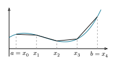
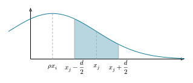

# 2  関数近似

Code

- [Show All Code](javascript:void(0))

- [Hide All Code](javascript:void(0))

- 

  ------------------------------------------------------------------------

- [View Source](javascript:void(0))

Function Approximation

``` julia
using ForwardDiff
using Plots
using LaTeXStrings
using LinearAlgebra
using Optim
using Interpolations
using SpecialFunctions
using Distributions
using QuantEcon
using PrettyTables
using QuasiMonteCarlo
using FastGaussQuadrature
using Roots

import Random
Random.seed!(1234)
```

経済モデルの数値計算では, 価値関数や政策関数のように, 一般形が分からない関数を扱います. これらは有限個のグリッド点の上でしか値を持たなかったり, ブラックボックスとしてしか評価できなかったりします. 本章では, そうした関数を扱う4つの基本操作を学びます. グリッド上の値から関数全体を復元する**補間** (interpolation), その導関数を数値的に求める**数値微分** (numerical differentiation), 期待値などの積分を有限個の評価点で近似する**数値積分** (numerical integration), そして連続な確率過程を有限状態で近似する**離散化** (discretization) です. いずれも, 後の第[sec-dynamic-programming](#sec-dynamic-programming)章をはじめ数値計算のあらゆる場面で使われます.

## 2.1 補間

未知なる関数 \\f(x)\\ の一般形は分からないが, 具体的な \\x\\ に関しては \\f(x)\\ の値が計算できる, という状況を考えます. 例えば第[sec-dynamic-programming](#sec-dynamic-programming)章の動的計画法では, 来期の資本 \\k'\\ が一般にグリッド点に一致しないため, グリッド上で求めた価値関数や政策関数をグリッド外で評価する必要があります. ちょっと極端な例を考えてみましょう. 次の効用最大化問題を考えます. \\ \max\_{n} \log c - v(n) \quad \text{s.t.} \quad c = w n. \\ ここで, 労働供給の不効用 \\v(n) = \phi \log (n!)\\ とします. この時の最適な \\n^\*\\ を求めてみましょう.

``` julia
v(n::Int; ϕ=0.1) = ϕ * sum(log(i) for i in 1:n)
u(n::Int; w=1.0) = log(n) - v(n)
```

### 2.1.1 グリッドサーチ

最も単純な方法は, \\n = 1, \dots, 10\\ ぐらいまで試してみて, 最も効用 \\u(c, n)\\ が大きくなる \\n\\ を選ぶ方法です. これをグリッドサーチと呼びます. 後の第[sec-dynamic-programming](#sec-dynamic-programming)章で扱う Value Function Iteration も, 本質的にはこのグリッドサーチを価値関数の最大化に用いています.

Code

``` julia
scatter(1:10, u, label=false, xlabel=L"n", ylabel=L"u(c, n)")
```

![](data:image/svg+xml;base64,PHN2ZyB4bWxucz0iaHR0cDovL3d3dy53My5vcmcvMjAwMC9zdmciIHhsaW5rPSJodHRwOi8vd3d3LnczLm9yZy8xOTk5L3hsaW5rIiB3aWR0aD0iNTAwIiBoZWlnaHQ9IjMwOCIgdmlld2JveD0iMCAwIDIwMDAgMTIzMiI+CjxkZWZzPgogIDxjbGlwcGF0aCBpZD0iY2xpcDYwMCI+CiAgICA8cmVjdCB4PSIwIiB5PSIwIiB3aWR0aD0iMjAwMCIgaGVpZ2h0PSIxMjMyIiAvPgogIDwvY2xpcHBhdGg+CjwvZGVmcz4KPHBhdGggY2xpcC1wYXRoPSJ1cmwoI2NsaXA2MDApIiBkPSJNMCAxMjMyIEwyMDAwIDEyMzIgTDIwMDAgMS41OTg3MmUtMTQgTDAgMS41OTg3MmUtMTQgIFoiIGZpbGw9IiNmZmZmZmYiIGZpbGwtcnVsZT0iZXZlbm9kZCIgZmlsbC1vcGFjaXR5PSIxIiAvPgo8ZGVmcz4KICA8Y2xpcHBhdGggaWQ9ImNsaXA2MDEiPgogICAgPHJlY3QgeD0iNDAwIiB5PSIwIiB3aWR0aD0iMTQwMSIgaGVpZ2h0PSIxMjMyIiAvPgogIDwvY2xpcHBhdGg+CjwvZGVmcz4KPHBhdGggY2xpcC1wYXRoPSJ1cmwoI2NsaXA2MDApIiBkPSJNMjQxLjkzMSAxMDY1LjEgTDE5NTIuNzYgMTA2NS4xIEwxOTUyLjc2IDQ3LjI0NDEgTDI0MS45MzEgNDcuMjQ0MSAgWiIgZmlsbD0iI2ZmZmZmZiIgZmlsbC1ydWxlPSJldmVub2RkIiBmaWxsLW9wYWNpdHk9IjEiIC8+CjxkZWZzPgogIDxjbGlwcGF0aCBpZD0iY2xpcDYwMiI+CiAgICA8cmVjdCB4PSIyNDEiIHk9IjQ3IiB3aWR0aD0iMTcxMiIgaGVpZ2h0PSIxMDE5IiAvPgogIDwvY2xpcHBhdGg+CjwvZGVmcz4KPHBvbHlsaW5lIGNsaXAtcGF0aD0idXJsKCNjbGlwNjAwKSIgc3R5bGU9InN0cm9rZTojMDAwMDAwOyBzdHJva2UtbGluZWNhcDpyb3VuZDsgc3Ryb2tlLWxpbmVqb2luOnJvdW5kOyBzdHJva2Utd2lkdGg6NDsgc3Ryb2tlLW9wYWNpdHk6MTsgZmlsbDpub25lIiBwb2ludHM9IjI0MS45MzEsMTA2NS4xIDE5NTIuNzYsMTA2NS4xICI+PC9wb2x5bGluZT4KPHBvbHlsaW5lIGNsaXAtcGF0aD0idXJsKCNjbGlwNjAwKSIgc3R5bGU9InN0cm9rZTojMDAwMDAwOyBzdHJva2UtbGluZWNhcDpyb3VuZDsgc3Ryb2tlLWxpbmVqb2luOnJvdW5kOyBzdHJva2Utd2lkdGg6NDsgc3Ryb2tlLW9wYWNpdHk6MTsgZmlsbDpub25lIiBwb2ludHM9IjQ2OS42ODIsMTA2NS4xIDQ2OS42ODIsMTA0Ni4yICI+PC9wb2x5bGluZT4KPHBvbHlsaW5lIGNsaXAtcGF0aD0idXJsKCNjbGlwNjAwKSIgc3R5bGU9InN0cm9rZTojMDAwMDAwOyBzdHJva2UtbGluZWNhcDpyb3VuZDsgc3Ryb2tlLWxpbmVqb2luOnJvdW5kOyBzdHJva2Utd2lkdGg6NDsgc3Ryb2tlLW9wYWNpdHk6MTsgZmlsbDpub25lIiBwb2ludHM9IjgyOC4zNDYsMTA2NS4xIDgyOC4zNDYsMTA0Ni4yICI+PC9wb2x5bGluZT4KPHBvbHlsaW5lIGNsaXAtcGF0aD0idXJsKCNjbGlwNjAwKSIgc3R5bGU9InN0cm9rZTojMDAwMDAwOyBzdHJva2UtbGluZWNhcDpyb3VuZDsgc3Ryb2tlLWxpbmVqb2luOnJvdW5kOyBzdHJva2Utd2lkdGg6NDsgc3Ryb2tlLW9wYWNpdHk6MTsgZmlsbDpub25lIiBwb2ludHM9IjExODcuMDEsMTA2NS4xIDExODcuMDEsMTA0Ni4yICI+PC9wb2x5bGluZT4KPHBvbHlsaW5lIGNsaXAtcGF0aD0idXJsKCNjbGlwNjAwKSIgc3R5bGU9InN0cm9rZTojMDAwMDAwOyBzdHJva2UtbGluZWNhcDpyb3VuZDsgc3Ryb2tlLWxpbmVqb2luOnJvdW5kOyBzdHJva2Utd2lkdGg6NDsgc3Ryb2tlLW9wYWNpdHk6MTsgZmlsbDpub25lIiBwb2ludHM9IjE1NDUuNjcsMTA2NS4xIDE1NDUuNjcsMTA0Ni4yICI+PC9wb2x5bGluZT4KPHBvbHlsaW5lIGNsaXAtcGF0aD0idXJsKCNjbGlwNjAwKSIgc3R5bGU9InN0cm9rZTojMDAwMDAwOyBzdHJva2UtbGluZWNhcDpyb3VuZDsgc3Ryb2tlLWxpbmVqb2luOnJvdW5kOyBzdHJva2Utd2lkdGg6NDsgc3Ryb2tlLW9wYWNpdHk6MTsgZmlsbDpub25lIiBwb2ludHM9IjE5MDQuMzQsMTA2NS4xIDE5MDQuMzQsMTA0Ni4yICI+PC9wb2x5bGluZT4KPHBhdGggY2xpcC1wYXRoPSJ1cmwoI2NsaXA2MDApIiBkPSJNNDY0LjMzNSAxMTIwLjM2IEw0ODAuNjU0IDExMjAuMzYgTDQ4MC42NTQgMTEyNC4zIEw0NTguNzEgMTEyNC4zIEw0NTguNzEgMTEyMC4zNiBRNDYxLjM3MiAxMTE3LjYxIDQ2NS45NTUgMTExMi45OCBRNDcwLjU2MiAxMTA4LjMzIDQ3MS43NDIgMTEwNi45OCBRNDczLjk4NyAxMTA0LjQ2IDQ3NC44NjcgMTEwMi43MiBRNDc1Ljc3IDExMDAuOTYgNDc1Ljc3IDEwOTkuMjcgUTQ3NS43NyAxMDk2LjUyIDQ3My44MjUgMTA5NC43OCBRNDcxLjkwNCAxMDkzLjA1IDQ2OC44MDIgMTA5My4wNSBRNDY2LjYwMyAxMDkzLjA1IDQ2NC4xNSAxMDkzLjgxIFE0NjEuNzE5IDEwOTQuNTggNDU4Ljk0MSAxMDk2LjEzIEw0NTguOTQxIDEwOTEuNCBRNDYxLjc2NSAxMDkwLjI3IDQ2NC4yMTkgMTA4OS42OSBRNDY2LjY3MyAxMDg5LjExIDQ2OC43MSAxMDg5LjExIFE0NzQuMDggMTA4OS4xMSA0NzcuMjc0IDEwOTEuOCBRNDgwLjQ2OSAxMDk0LjQ4IDQ4MC40NjkgMTA5OC45NyBRNDgwLjQ2OSAxMTAxLjEgNDc5LjY1OSAxMTAzLjAyIFE0NzguODcyIDExMDQuOTIgNDc2Ljc2NSAxMTA3LjUyIFE0NzYuMTg2IDExMDguMTkgNDczLjA4NSAxMTExLjQgUTQ2OS45ODMgMTExNC42IDQ2NC4zMzUgMTEyMC4zNiBaIiBmaWxsPSIjMDAwMDAwIiBmaWxsLXJ1bGU9Im5vbnplcm8iIGZpbGwtb3BhY2l0eT0iMSIgLz48cGF0aCBjbGlwLXBhdGg9InVybCgjY2xpcDYwMCkiIGQ9Ik04MzEuMzU1IDEwOTMuODEgTDgxOS41NDkgMTExMi4yNiBMODMxLjM1NSAxMTEyLjI2IEw4MzEuMzU1IDEwOTMuODEgTTgzMC4xMjggMTA4OS43NCBMODM2LjAwOCAxMDg5Ljc0IEw4MzYuMDA4IDExMTIuMjYgTDg0MC45MzggMTExMi4yNiBMODQwLjkzOCAxMTE2LjE1IEw4MzYuMDA4IDExMTYuMTUgTDgzNi4wMDggMTEyNC4zIEw4MzEuMzU1IDExMjQuMyBMODMxLjM1NSAxMTE2LjE1IEw4MTUuNzUzIDExMTYuMTUgTDgxNS43NTMgMTExMS42NCBMODMwLjEyOCAxMDg5Ljc0IFoiIGZpbGw9IiMwMDAwMDAiIGZpbGwtcnVsZT0ibm9uemVybyIgZmlsbC1vcGFjaXR5PSIxIiAvPjxwYXRoIGNsaXAtcGF0aD0idXJsKCNjbGlwNjAwKSIgZD0iTTExODcuNDEgMTEwNS4xNSBRMTE4NC4yNyAxMTA1LjE1IDExODIuNDEgMTEwNy4zMSBRMTE4MC41OSAxMTA5LjQ2IDExODAuNTkgMTExMy4yMSBRMTE4MC41OSAxMTE2Ljk0IDExODIuNDEgMTExOS4xMSBRMTE4NC4yNyAxMTIxLjI3IDExODcuNDEgMTEyMS4yNyBRMTE5MC41NiAxMTIxLjI3IDExOTIuMzkgMTExOS4xMSBRMTE5NC4yNCAxMTE2Ljk0IDExOTQuMjQgMTExMy4yMSBRMTE5NC4yNCAxMTA5LjQ2IDExOTIuMzkgMTEwNy4zMSBRMTE5MC41NiAxMTA1LjE1IDExODcuNDEgMTEwNS4xNSBNMTE5Ni43IDEwOTAuNSBMMTE5Ni43IDEwOTQuNzYgUTExOTQuOTQgMTA5My45MyAxMTkzLjEzIDEwOTMuNDkgUTExOTEuMzUgMTA5My4wNSAxMTg5LjU5IDEwOTMuMDUgUTExODQuOTYgMTA5My4wNSAxMTgyLjUxIDEwOTYuMTcgUTExODAuMDggMTA5OS4zIDExNzkuNzMgMTEwNS42MiBRMTE4MS4wOSAxMTAzLjYgMTE4My4xNSAxMTAyLjU0IFExMTg1LjIyIDExMDEuNDUgMTE4Ny42OSAxMTAxLjQ1IFExMTkyLjkgMTEwMS40NSAxMTk1LjkxIDExMDQuNjIgUTExOTguOTQgMTEwNy43NyAxMTk4Ljk0IDExMTMuMjEgUTExOTguOTQgMTExOC41MyAxMTk1Ljc5IDExMjEuNzUgUTExOTIuNjUgMTEyNC45NyAxMTg3LjQxIDExMjQuOTcgUTExODEuNDIgMTEyNC45NyAxMTc4LjI1IDExMjAuMzkgUTExNzUuMDggMTExNS43OCAxMTc1LjA4IDExMDcuMDUgUTExNzUuMDggMTA5OC44NiAxMTc4Ljk3IDEwOTQgUTExODIuODUgMTA4OS4xMSAxMTg5LjQgMTA4OS4xMSBRMTE5MS4xNiAxMDg5LjExIDExOTIuOTUgMTA4OS40NiBRMTE5NC43NSAxMDg5LjgxIDExOTYuNyAxMDkwLjUgWiIgZmlsbD0iIzAwMDAwMCIgZmlsbC1ydWxlPSJub256ZXJvIiBmaWxsLW9wYWNpdHk9IjEiIC8+PHBhdGggY2xpcC1wYXRoPSJ1cmwoI2NsaXA2MDApIiBkPSJNMTU0NS42NyAxMTA3Ljg5IFExNTQyLjM0IDExMDcuODkgMTU0MC40MiAxMTA5LjY3IFExNTM4LjUyIDExMTEuNDUgMTUzOC41MiAxMTE0LjU4IFExNTM4LjUyIDExMTcuNyAxNTQwLjQyIDExMTkuNDggUTE1NDIuMzQgMTEyMS4yNyAxNTQ1LjY3IDExMjEuMjcgUTE1NDkuMDEgMTEyMS4yNyAxNTUwLjkzIDExMTkuNDggUTE1NTIuODUgMTExNy42OCAxNTUyLjg1IDExMTQuNTggUTE1NTIuODUgMTExMS40NSAxNTUwLjkzIDExMDkuNjcgUTE1NDkuMDMgMTEwNy44OSAxNTQ1LjY3IDExMDcuODkgTTE1NDEgMTEwNS45IFExNTM3Ljk5IDExMDUuMTUgMTUzNi4zIDExMDMuMDkgUTE1MzQuNjMgMTEwMS4wMyAxNTM0LjYzIDEwOTguMDcgUTE1MzQuNjMgMTA5My45MyAxNTM3LjU3IDEwOTEuNTIgUTE1NDAuNTMgMTA4OS4xMSAxNTQ1LjY3IDEwODkuMTEgUTE1NTAuODMgMTA4OS4xMSAxNTUzLjc3IDEwOTEuNTIgUTE1NTYuNzEgMTA5My45MyAxNTU2LjcxIDEwOTguMDcgUTE1NTYuNzEgMTEwMS4wMyAxNTU1LjAyIDExMDMuMDkgUTE1NTMuMzYgMTEwNS4xNSAxNTUwLjM3IDExMDUuOSBRMTU1My43NSAxMTA2LjY4IDE1NTUuNjMgMTEwOC45NyBRMTU1Ny41MiAxMTExLjI3IDE1NTcuNTIgMTExNC41OCBRMTU1Ny41MiAxMTE5LjYgMTU1NC40NSAxMTIyLjI4IFExNTUxLjM5IDExMjQuOTcgMTU0NS42NyAxMTI0Ljk3IFExNTM5Ljk2IDExMjQuOTcgMTUzNi44OCAxMTIyLjI4IFExNTMzLjgyIDExMTkuNiAxNTMzLjgyIDExMTQuNTggUTE1MzMuODIgMTExMS4yNyAxNTM1LjcyIDExMDguOTcgUTE1MzcuNjIgMTEwNi42OCAxNTQxIDExMDUuOSBNMTUzOS4yOCAxMDk4LjUxIFExNTM5LjI4IDExMDEuMiAxNTQwLjk1IDExMDIuNyBRMTU0Mi42NCAxMTA0LjIxIDE1NDUuNjcgMTEwNC4yMSBRMTU0OC42OCAxMTA0LjIxIDE1NTAuMzcgMTEwMi43IFExNTUyLjA4IDExMDEuMiAxNTUyLjA4IDEwOTguNTEgUTE1NTIuMDggMTA5NS44MyAxNTUwLjM3IDEwOTQuMzIgUTE1NDguNjggMTA5Mi44MiAxNTQ1LjY3IDEwOTIuODIgUTE1NDIuNjQgMTA5Mi44MiAxNTQwLjk1IDEwOTQuMzIgUTE1MzkuMjggMTA5NS44MyAxNTM5LjI4IDEwOTguNTEgWiIgZmlsbD0iIzAwMDAwMCIgZmlsbC1ydWxlPSJub256ZXJvIiBmaWxsLW9wYWNpdHk9IjEiIC8+PHBhdGggY2xpcC1wYXRoPSJ1cmwoI2NsaXA2MDApIiBkPSJNMTg3OS4wMiAxMTIwLjM2IEwxODg2LjY2IDExMjAuMzYgTDE4ODYuNjYgMTA5NCBMMTg3OC4zNSAxMDk1LjY2IEwxODc4LjM1IDEwOTEuNCBMMTg4Ni42MiAxMDg5Ljc0IEwxODkxLjI5IDEwODkuNzQgTDE4OTEuMjkgMTEyMC4zNiBMMTg5OC45MyAxMTIwLjM2IEwxODk4LjkzIDExMjQuMyBMMTg3OS4wMiAxMTI0LjMgTDE4NzkuMDIgMTEyMC4zNiBaIiBmaWxsPSIjMDAwMDAwIiBmaWxsLXJ1bGU9Im5vbnplcm8iIGZpbGwtb3BhY2l0eT0iMSIgLz48cGF0aCBjbGlwLXBhdGg9InVybCgjY2xpcDYwMCkiIGQ9Ik0xOTE4LjM4IDEwOTIuODIgUTE5MTQuNzYgMTA5Mi44MiAxOTEyLjk0IDEwOTYuMzggUTE5MTEuMTMgMTA5OS45MiAxOTExLjEzIDExMDcuMDUgUTE5MTEuMTMgMTExNC4xNiAxOTEyLjk0IDExMTcuNzIgUTE5MTQuNzYgMTEyMS4yNyAxOTE4LjM4IDExMjEuMjcgUTE5MjIuMDEgMTEyMS4yNyAxOTIzLjgyIDExMTcuNzIgUTE5MjUuNjQgMTExNC4xNiAxOTI1LjY0IDExMDcuMDUgUTE5MjUuNjQgMTA5OS45MiAxOTIzLjgyIDEwOTYuMzggUTE5MjIuMDEgMTA5Mi44MiAxOTE4LjM4IDEwOTIuODIgTTE5MTguMzggMTA4OS4xMSBRMTkyNC4xOSAxMDg5LjExIDE5MjcuMjQgMTA5My43MiBRMTkzMC4zMiAxMDk4LjMgMTkzMC4zMiAxMTA3LjA1IFExOTMwLjMyIDExMTUuNzggMTkyNy4yNCAxMTIwLjM5IFExOTI0LjE5IDExMjQuOTcgMTkxOC4zOCAxMTI0Ljk3IFExOTEyLjU3IDExMjQuOTcgMTkwOS40OSAxMTIwLjM5IFExOTA2LjQzIDExMTUuNzggMTkwNi40MyAxMTA3LjA1IFExOTA2LjQzIDEwOTguMyAxOTA5LjQ5IDEwOTMuNzIgUTE5MTIuNTcgMTA4OS4xMSAxOTE4LjM4IDEwODkuMTEgWiIgZmlsbD0iIzAwMDAwMCIgZmlsbC1ydWxlPSJub256ZXJvIiBmaWxsLW9wYWNpdHk9IjEiIC8+PHBhdGggY2xpcC1wYXRoPSJ1cmwoI2NsaXA2MDApIiBkPSJNMTExMy41MSAxMTgwLjA4IFExMTEzLjUxIDExODAuMzQgMTExMy4yMiAxMTgxLjM0IFExMTEyLjkzIDExODIuMzQgMTExMi4yMiAxMTgzLjg4IFExMTExLjU0IDExODUuNDMgMTExMC42MSAxMTg2Ljg1IFExMTA5LjY3IDExODguMjMgMTEwOC4xMyAxMTg5LjI2IFExMTA2LjYxIDExOTAuMjYgMTEwNC44OCAxMTkwLjI2IFExMTAyLjU2IDExOTAuMjYgMTEwMS4wMSAxMTg4LjcxIFExMDk5LjQ3IDExODcuMTcgMTA5OS40NyAxMTg0Ljg1IFExMDk5LjQ3IDExODMuNTYgMTEwMC4xNCAxMTgxLjc5IFExMTA0LjQyIDExNzAuMzYgMTEwNC40MiAxMTY2LjQzIFExMTA0LjQyIDExNjEuODIgMTEwMC44NSAxMTYxLjgyIFExMDk5LjA4IDExNjEuODIgMTA5Ny40IDExNjIuNSBRMTA5NS43NiAxMTYzLjE0IDEwOTQuNjMgMTE2NC4wNCBRMTA5My41MSAxMTY0Ljk1IDEwOTIuNDggMTE2Ni4yIFExMDkxLjQ4IDExNjcuNDMgMTA5MC45NiAxMTY4LjI2IFExMDkwLjQ4IDExNjkuMDcgMTA5MC4wOSAxMTY5Ljg3IEwxMDg5LjI2IDExNzMuMTYgUTEwODkuMDYgMTE3NC4wNiAxMDg4LjEzIDExNzcuNTcgTDEwODYuNjggMTE4My41MyBRMTA4NS42NSAxMTg3Ljk3IDEwODUuNDIgMTE4OC4zOSBRMTA4NS4xIDExODkuMjkgMTA4NC4zOSAxMTg5Ljc4IFExMDgzLjY4IDExOTAuMjYgMTA4Mi45OCAxMTkwLjI2IFExMDgyLjE3IDExOTAuMjYgMTA4MS42MiAxMTg5Ljc4IFExMDgxLjA4IDExODkuMjkgMTA4MS4wOCAxMTg4LjQ2IFExMDgxLjA4IDExODguMzMgMTA4MS4xNyAxMTg3Ljg0IFExMDgxLjI3IDExODcuMzYgMTA4MS40MyAxMTg2LjY4IFExMDgxLjU5IDExODYuMDEgMTA4MS42NiAxMTg1LjYyIEwxMDg1LjQ5IDExNzAuMzkgUTEwODYuMiAxMTY3LjYyIDEwODYuMzYgMTE2Ni43NSBRMTA4Ni41NSAxMTY1Ljg1IDEwODYuNTUgMTE2NC44NSBRMTA4Ni41NSAxMTYxLjgyIDEwODQuNDkgMTE2MS44MiBRMTA4Mi44MSAxMTYxLjgyIDEwODEuNzIgMTE2My44MiBRMTA4MC42MiAxMTY1LjgyIDEwNzkuNjkgMTE2OS42OCBRMTA3OS40IDExNzAuNzQgMTA3OS4yMSAxMTcwLjk3IFExMDc5LjA1IDExNzEuMTkgMTA3OC41NiAxMTcxLjE5IFExMDc3Ljc2IDExNzEuMTYgMTA3Ny43NiAxMTcwLjUyIFExMDc3Ljc2IDExNzAuMzYgMTA3OC4wMiAxMTY5LjI5IFExMDc4LjI3IDExNjguMjMgMTA3OC43NiAxMTY2LjcyIFExMDc5LjI3IDExNjUuMTcgMTA3OS43NiAxMTY0LjE0IFExMDgwLjE3IDExNjMuMzcgMTA4MC40IDExNjMuMDEgUTEwODAuNjYgMTE2Mi42MyAxMDgxLjI3IDExNjEuODkgUTEwODEuOTEgMTE2MS4xMSAxMDgyLjc1IDExNjAuNzYgUTEwODMuNjIgMTE2MC4zNyAxMDg0LjY4IDExNjAuMzcgUTEwODcuMDcgMTE2MC4zNyAxMDg4LjggMTE2MS45MiBRMTA5MC41NCAxMTYzLjQzIDEwOTAuNzcgMTE2Ni4xMSBRMTA5NS4wNSAxMTYwLjM3IDExMDEuMDQgMTE2MC4zNyBRMTEwNC41OSAxMTYwLjM3IDExMDYuNjEgMTE2Mi4yNCBRMTEwOC42NCAxMTY0LjExIDExMDguNjQgMTE2Ny40MyBRMTEwOC42NCAxMTY4LjIgMTEwOC40OCAxMTY5LjIgUTExMDguMzUgMTE3MC4xNiAxMTA4LjAzIDExNzEuMzkgUTExMDcuNzQgMTE3Mi42MSAxMTA3LjQ4IDExNzMuNTQgUTExMDcuMjMgMTE3NC40OCAxMTA2LjcxIDExNzUuOTkgUTExMDYuMiAxMTc3LjQ3IDExMDUuOTcgMTE3OC4xMiBRMTEwNS43NSAxMTc4Ljc2IDExMDUuMiAxMTgwLjI4IFExMTA0LjY4IDExODEuNzYgMTEwNC42MiAxMTgxLjkyIFExMTAzLjQzIDExODQuOTEgMTEwMy40MyAxMTg2LjYyIFExMTAzLjQzIDExODcuNzUgMTEwMy43OCAxMTg4LjI2IFExMTA0LjE3IDExODguNzggMTEwNSAxMTg4Ljc4IFExMTA3LjI2IDExODguNzggMTEwOC45MyAxMTg2LjU2IFExMTEwLjY0IDExODQuMyAxMTExLjc0IDExODAuNjMgUTExMTEuOTkgMTE3OS44MiAxMTEyLjEyIDExNzkuNjMgUTExMTIuMjggMTE3OS40NCAxMTEyLjczIDExNzkuNDQgUTExMTMuNTEgMTE3OS40NCAxMTEzLjUxIDExODAuMDggWiIgZmlsbD0iIzAwMDAwMCIgZmlsbC1ydWxlPSJub256ZXJvIiBmaWxsLW9wYWNpdHk9IjEiIC8+PHBvbHlsaW5lIGNsaXAtcGF0aD0idXJsKCNjbGlwNjAwKSIgc3R5bGU9InN0cm9rZTojMDAwMDAwOyBzdHJva2UtbGluZWNhcDpyb3VuZDsgc3Ryb2tlLWxpbmVqb2luOnJvdW5kOyBzdHJva2Utd2lkdGg6NDsgc3Ryb2tlLW9wYWNpdHk6MTsgZmlsbDpub25lIiBwb2ludHM9IjI0MS45MzEsMTA2NS4xIDI0MS45MzEsNDcuMjQ0MSAiPjwvcG9seWxpbmU+Cjxwb2x5bGluZSBjbGlwLXBhdGg9InVybCgjY2xpcDYwMCkiIHN0eWxlPSJzdHJva2U6IzAwMDAwMDsgc3Ryb2tlLWxpbmVjYXA6cm91bmQ7IHN0cm9rZS1saW5lam9pbjpyb3VuZDsgc3Ryb2tlLXdpZHRoOjQ7IHN0cm9rZS1vcGFjaXR5OjE7IGZpbGw6bm9uZSIgcG9pbnRzPSIyNDEuOTMxLDEwMzYuMjkgMjYwLjgyOCwxMDM2LjI5ICI+PC9wb2x5bGluZT4KPHBvbHlsaW5lIGNsaXAtcGF0aD0idXJsKCNjbGlwNjAwKSIgc3R5bGU9InN0cm9rZTojMDAwMDAwOyBzdHJva2UtbGluZWNhcDpyb3VuZDsgc3Ryb2tlLWxpbmVqb2luOnJvdW5kOyBzdHJva2Utd2lkdGg6NDsgc3Ryb2tlLW9wYWNpdHk6MTsgZmlsbDpub25lIiBwb2ludHM9IjI0MS45MzEsODI0LjU2NyAyNjAuODI4LDgyNC41NjcgIj48L3BvbHlsaW5lPgo8cG9seWxpbmUgY2xpcC1wYXRoPSJ1cmwoI2NsaXA2MDApIiBzdHlsZT0ic3Ryb2tlOiMwMDAwMDA7IHN0cm9rZS1saW5lY2FwOnJvdW5kOyBzdHJva2UtbGluZWpvaW46cm91bmQ7IHN0cm9rZS13aWR0aDo0OyBzdHJva2Utb3BhY2l0eToxOyBmaWxsOm5vbmUiIHBvaW50cz0iMjQxLjkzMSw2MTIuODQzIDI2MC44MjgsNjEyLjg0MyAiPjwvcG9seWxpbmU+Cjxwb2x5bGluZSBjbGlwLXBhdGg9InVybCgjY2xpcDYwMCkiIHN0eWxlPSJzdHJva2U6IzAwMDAwMDsgc3Ryb2tlLWxpbmVjYXA6cm91bmQ7IHN0cm9rZS1saW5lam9pbjpyb3VuZDsgc3Ryb2tlLXdpZHRoOjQ7IHN0cm9rZS1vcGFjaXR5OjE7IGZpbGw6bm9uZSIgcG9pbnRzPSIyNDEuOTMxLDQwMS4xMTkgMjYwLjgyOCw0MDEuMTE5ICI+PC9wb2x5bGluZT4KPHBvbHlsaW5lIGNsaXAtcGF0aD0idXJsKCNjbGlwNjAwKSIgc3R5bGU9InN0cm9rZTojMDAwMDAwOyBzdHJva2UtbGluZWNhcDpyb3VuZDsgc3Ryb2tlLWxpbmVqb2luOnJvdW5kOyBzdHJva2Utd2lkdGg6NDsgc3Ryb2tlLW9wYWNpdHk6MTsgZmlsbDpub25lIiBwb2ludHM9IjI0MS45MzEsMTg5LjM5NSAyNjAuODI4LDE4OS4zOTUgIj48L3BvbHlsaW5lPgo8cGF0aCBjbGlwLXBhdGg9InVybCgjY2xpcDYwMCkiIGQ9Ik0xMjQuNTkzIDEwMjIuMDkgUTEyMC45ODIgMTAyMi4wOSAxMTkuMTUzIDEwMjUuNjUgUTExNy4zNDggMTAyOS4yIDExNy4zNDggMTAzNi4zMyBRMTE3LjM0OCAxMDQzLjQzIDExOS4xNTMgMTA0NyBRMTIwLjk4MiAxMDUwLjU0IDEyNC41OTMgMTA1MC41NCBRMTI4LjIyNyAxMDUwLjU0IDEzMC4wMzMgMTA0NyBRMTMxLjg2MSAxMDQzLjQzIDEzMS44NjEgMTAzNi4zMyBRMTMxLjg2MSAxMDI5LjIgMTMwLjAzMyAxMDI1LjY1IFExMjguMjI3IDEwMjIuMDkgMTI0LjU5MyAxMDIyLjA5IE0xMjQuNTkzIDEwMTguMzkgUTEzMC40MDMgMTAxOC4zOSAxMzMuNDU5IDEwMjIuOTkgUTEzNi41MzcgMTAyNy41OCAxMzYuNTM3IDEwMzYuMzMgUTEzNi41MzcgMTA0NS4wNSAxMzMuNDU5IDEwNDkuNjYgUTEzMC40MDMgMTA1NC4yNCAxMjQuNTkzIDEwNTQuMjQgUTExOC43ODMgMTA1NC4yNCAxMTUuNzA0IDEwNDkuNjYgUTExMi42NDkgMTA0NS4wNSAxMTIuNjQ5IDEwMzYuMzMgUTExMi42NDkgMTAyNy41OCAxMTUuNzA0IDEwMjIuOTkgUTExOC43ODMgMTAxOC4zOSAxMjQuNTkzIDEwMTguMzkgWiIgZmlsbD0iIzAwMDAwMCIgZmlsbC1ydWxlPSJub256ZXJvIiBmaWxsLW9wYWNpdHk9IjEiIC8+PHBhdGggY2xpcC1wYXRoPSJ1cmwoI2NsaXA2MDApIiBkPSJNMTQ0Ljc1NSAxMDQ3LjY5IEwxNDkuNjM5IDEwNDcuNjkgTDE0OS42MzkgMTA1My41NyBMMTQ0Ljc1NSAxMDUzLjU3IEwxNDQuNzU1IDEwNDcuNjkgWiIgZmlsbD0iIzAwMDAwMCIgZmlsbC1ydWxlPSJub256ZXJvIiBmaWxsLW9wYWNpdHk9IjEiIC8+PHBhdGggY2xpcC1wYXRoPSJ1cmwoI2NsaXA2MDApIiBkPSJNMTY5LjgyNCAxMDIyLjA5IFExNjYuMjEzIDEwMjIuMDkgMTY0LjM4NCAxMDI1LjY1IFExNjIuNTc5IDEwMjkuMiAxNjIuNTc5IDEwMzYuMzMgUTE2Mi41NzkgMTA0My40MyAxNjQuMzg0IDEwNDcgUTE2Ni4yMTMgMTA1MC41NCAxNjkuODI0IDEwNTAuNTQgUTE3My40NTggMTA1MC41NCAxNzUuMjY0IDEwNDcgUTE3Ny4wOTMgMTA0My40MyAxNzcuMDkzIDEwMzYuMzMgUTE3Ny4wOTMgMTAyOS4yIDE3NS4yNjQgMTAyNS42NSBRMTczLjQ1OCAxMDIyLjA5IDE2OS44MjQgMTAyMi4wOSBNMTY5LjgyNCAxMDE4LjM5IFExNzUuNjM0IDEwMTguMzkgMTc4LjY5IDEwMjIuOTkgUTE4MS43NjkgMTAyNy41OCAxODEuNzY5IDEwMzYuMzMgUTE4MS43NjkgMTA0NS4wNSAxNzguNjkgMTA0OS42NiBRMTc1LjYzNCAxMDU0LjI0IDE2OS44MjQgMTA1NC4yNCBRMTY0LjAxNCAxMDU0LjI0IDE2MC45MzUgMTA0OS42NiBRMTU3Ljg4IDEwNDUuMDUgMTU3Ljg4IDEwMzYuMzMgUTE1Ny44OCAxMDI3LjU4IDE2MC45MzUgMTAyMi45OSBRMTY0LjAxNCAxMDE4LjM5IDE2OS44MjQgMTAxOC4zOSBaIiBmaWxsPSIjMDAwMDAwIiBmaWxsLXJ1bGU9Im5vbnplcm8iIGZpbGwtb3BhY2l0eT0iMSIgLz48cGF0aCBjbGlwLXBhdGg9InVybCgjY2xpcDYwMCkiIGQ9Ik0xOTkuOTg2IDEwMjIuMDkgUTE5Ni4zNzUgMTAyMi4wOSAxOTQuNTQ2IDEwMjUuNjUgUTE5Mi43NDEgMTAyOS4yIDE5Mi43NDEgMTAzNi4zMyBRMTkyLjc0MSAxMDQzLjQzIDE5NC41NDYgMTA0NyBRMTk2LjM3NSAxMDUwLjU0IDE5OS45ODYgMTA1MC41NCBRMjAzLjYyIDEwNTAuNTQgMjA1LjQyNiAxMDQ3IFEyMDcuMjU1IDEwNDMuNDMgMjA3LjI1NSAxMDM2LjMzIFEyMDcuMjU1IDEwMjkuMiAyMDUuNDI2IDEwMjUuNjUgUTIwMy42MiAxMDIyLjA5IDE5OS45ODYgMTAyMi4wOSBNMTk5Ljk4NiAxMDE4LjM5IFEyMDUuNzk2IDEwMTguMzkgMjA4Ljg1MiAxMDIyLjk5IFEyMTEuOTMxIDEwMjcuNTggMjExLjkzMSAxMDM2LjMzIFEyMTEuOTMxIDEwNDUuMDUgMjA4Ljg1MiAxMDQ5LjY2IFEyMDUuNzk2IDEwNTQuMjQgMTk5Ljk4NiAxMDU0LjI0IFExOTQuMTc2IDEwNTQuMjQgMTkxLjA5NyAxMDQ5LjY2IFExODguMDQyIDEwNDUuMDUgMTg4LjA0MiAxMDM2LjMzIFExODguMDQyIDEwMjcuNTggMTkxLjA5NyAxMDIyLjk5IFExOTQuMTc2IDEwMTguMzkgMTk5Ljk4NiAxMDE4LjM5IFoiIGZpbGw9IiMwMDAwMDAiIGZpbGwtcnVsZT0ibm9uemVybyIgZmlsbC1vcGFjaXR5PSIxIiAvPjxwYXRoIGNsaXAtcGF0aD0idXJsKCNjbGlwNjAwKSIgZD0iTTEyNS41ODggODEwLjM2NSBRMTIxLjk3NyA4MTAuMzY1IDEyMC4xNDkgODEzLjkzIFExMTguMzQzIDgxNy40NzIgMTE4LjM0MyA4MjQuNjAyIFExMTguMzQzIDgzMS43MDggMTIwLjE0OSA4MzUuMjczIFExMjEuOTc3IDgzOC44MTQgMTI1LjU4OCA4MzguODE0IFExMjkuMjIzIDgzOC44MTQgMTMxLjAyOCA4MzUuMjczIFExMzIuODU3IDgzMS43MDggMTMyLjg1NyA4MjQuNjAyIFExMzIuODU3IDgxNy40NzIgMTMxLjAyOCA4MTMuOTMgUTEyOS4yMjMgODEwLjM2NSAxMjUuNTg4IDgxMC4zNjUgTTEyNS41ODggODA2LjY2MiBRMTMxLjM5OSA4MDYuNjYyIDEzNC40NTQgODExLjI2OCBRMTM3LjUzMyA4MTUuODUyIDEzNy41MzMgODI0LjYwMiBRMTM3LjUzMyA4MzMuMzI4IDEzNC40NTQgODM3LjkzNSBRMTMxLjM5OSA4NDIuNTE4IDEyNS41ODggODQyLjUxOCBRMTE5Ljc3OCA4NDIuNTE4IDExNi43IDgzNy45MzUgUTExMy42NDQgODMzLjMyOCAxMTMuNjQ0IDgyNC42MDIgUTExMy42NDQgODE1Ljg1MiAxMTYuNyA4MTEuMjY4IFExMTkuNzc4IDgwNi42NjIgMTI1LjU4OCA4MDYuNjYyIFoiIGZpbGw9IiMwMDAwMDAiIGZpbGwtcnVsZT0ibm9uemVybyIgZmlsbC1vcGFjaXR5PSIxIiAvPjxwYXRoIGNsaXAtcGF0aD0idXJsKCNjbGlwNjAwKSIgZD0iTTE0NS43NSA4MzUuOTY3IEwxNTAuNjM1IDgzNS45NjcgTDE1MC42MzUgODQxLjg0NyBMMTQ1Ljc1IDg0MS44NDcgTDE0NS43NSA4MzUuOTY3IFoiIGZpbGw9IiMwMDAwMDAiIGZpbGwtcnVsZT0ibm9uemVybyIgZmlsbC1vcGFjaXR5PSIxIiAvPjxwYXRoIGNsaXAtcGF0aD0idXJsKCNjbGlwNjAwKSIgZD0iTTE2NC44NDcgODM3LjkxMiBMMTgxLjE2NyA4MzcuOTEyIEwxODEuMTY3IDg0MS44NDcgTDE1OS4yMjIgODQxLjg0NyBMMTU5LjIyMiA4MzcuOTEyIFExNjEuODg0IDgzNS4xNTcgMTY2LjQ2OCA4MzAuNTI3IFExNzEuMDc0IDgyNS44NzUgMTcyLjI1NSA4MjQuNTMyIFExNzQuNSA4MjIuMDA5IDE3NS4zOCA4MjAuMjczIFExNzYuMjgzIDgxOC41MTQgMTc2LjI4MyA4MTYuODI0IFExNzYuMjgzIDgxNC4wNjkgMTc0LjMzOCA4MTIuMzMzIFExNzIuNDE3IDgxMC41OTcgMTY5LjMxNSA4MTAuNTk3IFExNjcuMTE2IDgxMC41OTcgMTY0LjY2MiA4MTEuMzYxIFExNjIuMjMyIDgxMi4xMjUgMTU5LjQ1NCA4MTMuNjc2IEwxNTkuNDU0IDgwOC45NTMgUTE2Mi4yNzggODA3LjgxOSAxNjQuNzMyIDgwNy4yNDEgUTE2Ny4xODUgODA2LjY2MiAxNjkuMjIyIDgwNi42NjIgUTE3NC41OTMgODA2LjY2MiAxNzcuNzg3IDgwOS4zNDcgUTE4MC45ODIgODEyLjAzMiAxODAuOTgyIDgxNi41MjMgUTE4MC45ODIgODE4LjY1MiAxODAuMTcxIDgyMC41NzQgUTE3OS4zODQgODIyLjQ3MiAxNzcuMjc4IDgyNS4wNjQgUTE3Ni42OTkgODI1LjczNiAxNzMuNTk3IDgyOC45NTMgUTE3MC40OTYgODMyLjE0OCAxNjQuODQ3IDgzNy45MTIgWiIgZmlsbD0iIzAwMDAwMCIgZmlsbC1ydWxlPSJub256ZXJvIiBmaWxsLW9wYWNpdHk9IjEiIC8+PHBhdGggY2xpcC1wYXRoPSJ1cmwoI2NsaXA2MDApIiBkPSJNMTkxLjAyOCA4MDcuMjg3IEwyMDkuMzg0IDgwNy4yODcgTDIwOS4zODQgODExLjIyMiBMMTk1LjMxIDgxMS4yMjIgTDE5NS4zMSA4MTkuNjk0IFExOTYuMzI5IDgxOS4zNDcgMTk3LjM0NyA4MTkuMTg1IFExOTguMzY2IDgxOSAxOTkuMzg0IDgxOSBRMjA1LjE3MSA4MTkgMjA4LjU1MSA4MjIuMTcxIFEyMTEuOTMxIDgyNS4zNDIgMjExLjkzMSA4MzAuNzU5IFEyMTEuOTMxIDgzNi4zMzggMjA4LjQ1OCA4MzkuNDM5IFEyMDQuOTg2IDg0Mi41MTggMTk4LjY2NyA4NDIuNTE4IFExOTYuNDkxIDg0Mi41MTggMTk0LjIyMiA4NDIuMTQ4IFExOTEuOTc3IDg0MS43NzcgMTg5LjU3IDg0MS4wMzcgTDE4OS41NyA4MzYuMzM4IFExOTEuNjUzIDgzNy40NzIgMTkzLjg3NSA4MzguMDI3IFExOTYuMDk3IDgzOC41ODMgMTk4LjU3NCA4MzguNTgzIFEyMDIuNTc5IDgzOC41ODMgMjA0LjkxNyA4MzYuNDc2IFEyMDcuMjU1IDgzNC4zNyAyMDcuMjU1IDgzMC43NTkgUTIwNy4yNTUgODI3LjE0OCAyMDQuOTE3IDgyNS4wNDEgUTIwMi41NzkgODIyLjkzNSAxOTguNTc0IDgyMi45MzUgUTE5Ni42OTkgODIyLjkzNSAxOTQuODI0IDgyMy4zNTIgUTE5Mi45NzIgODIzLjc2OCAxOTEuMDI4IDgyNC42NDggTDE5MS4wMjggODA3LjI4NyBaIiBmaWxsPSIjMDAwMDAwIiBmaWxsLXJ1bGU9Im5vbnplcm8iIGZpbGwtb3BhY2l0eT0iMSIgLz48cGF0aCBjbGlwLXBhdGg9InVybCgjY2xpcDYwMCkiIGQ9Ik0xMjQuNTkzIDU5OC42NDIgUTEyMC45ODIgNTk4LjY0MiAxMTkuMTUzIDYwMi4yMDYgUTExNy4zNDggNjA1Ljc0OCAxMTcuMzQ4IDYxMi44NzggUTExNy4zNDggNjE5Ljk4NCAxMTkuMTUzIDYyMy41NDkgUTEyMC45ODIgNjI3LjA5IDEyNC41OTMgNjI3LjA5IFExMjguMjI3IDYyNy4wOSAxMzAuMDMzIDYyMy41NDkgUTEzMS44NjEgNjE5Ljk4NCAxMzEuODYxIDYxMi44NzggUTEzMS44NjEgNjA1Ljc0OCAxMzAuMDMzIDYwMi4yMDYgUTEyOC4yMjcgNTk4LjY0MiAxMjQuNTkzIDU5OC42NDIgTTEyNC41OTMgNTk0LjkzOCBRMTMwLjQwMyA1OTQuOTM4IDEzMy40NTkgNTk5LjU0NCBRMTM2LjUzNyA2MDQuMTI4IDEzNi41MzcgNjEyLjg3OCBRMTM2LjUzNyA2MjEuNjA0IDEzMy40NTkgNjI2LjIxMSBRMTMwLjQwMyA2MzAuNzk0IDEyNC41OTMgNjMwLjc5NCBRMTE4Ljc4MyA2MzAuNzk0IDExNS43MDQgNjI2LjIxMSBRMTEyLjY0OSA2MjEuNjA0IDExMi42NDkgNjEyLjg3OCBRMTEyLjY0OSA2MDQuMTI4IDExNS43MDQgNTk5LjU0NCBRMTE4Ljc4MyA1OTQuOTM4IDEyNC41OTMgNTk0LjkzOCBaIiBmaWxsPSIjMDAwMDAwIiBmaWxsLXJ1bGU9Im5vbnplcm8iIGZpbGwtb3BhY2l0eT0iMSIgLz48cGF0aCBjbGlwLXBhdGg9InVybCgjY2xpcDYwMCkiIGQ9Ik0xNDQuNzU1IDYyNC4yNDMgTDE0OS42MzkgNjI0LjI0MyBMMTQ5LjYzOSA2MzAuMTIzIEwxNDQuNzU1IDYzMC4xMjMgTDE0NC43NTUgNjI0LjI0MyBaIiBmaWxsPSIjMDAwMDAwIiBmaWxsLXJ1bGU9Im5vbnplcm8iIGZpbGwtb3BhY2l0eT0iMSIgLz48cGF0aCBjbGlwLXBhdGg9InVybCgjY2xpcDYwMCkiIGQ9Ik0xNTkuODcxIDU5NS41NjMgTDE3OC4yMjcgNTk1LjU2MyBMMTc4LjIyNyA1OTkuNDk4IEwxNjQuMTUzIDU5OS40OTggTDE2NC4xNTMgNjA3Ljk3IFExNjUuMTcyIDYwNy42MjMgMTY2LjE5IDYwNy40NjEgUTE2Ny4yMDkgNjA3LjI3NiAxNjguMjI3IDYwNy4yNzYgUTE3NC4wMTQgNjA3LjI3NiAxNzcuMzk0IDYxMC40NDcgUTE4MC43NzMgNjEzLjYxOCAxODAuNzczIDYxOS4wMzUgUTE4MC43NzMgNjI0LjYxNCAxNzcuMzAxIDYyNy43MTUgUTE3My44MjkgNjMwLjc5NCAxNjcuNTA5IDYzMC43OTQgUTE2NS4zMzQgNjMwLjc5NCAxNjMuMDY1IDYzMC40MjQgUTE2MC44MiA2MzAuMDUzIDE1OC40MTIgNjI5LjMxMyBMMTU4LjQxMiA2MjQuNjE0IFExNjAuNDk2IDYyNS43NDggMTYyLjcxOCA2MjYuMzAzIFExNjQuOTQgNjI2Ljg1OSAxNjcuNDE3IDYyNi44NTkgUTE3MS40MjEgNjI2Ljg1OSAxNzMuNzU5IDYyNC43NTMgUTE3Ni4wOTcgNjIyLjY0NiAxNzYuMDk3IDYxOS4wMzUgUTE3Ni4wOTcgNjE1LjQyNCAxNzMuNzU5IDYxMy4zMTcgUTE3MS40MjEgNjExLjIxMSAxNjcuNDE3IDYxMS4yMTEgUTE2NS41NDIgNjExLjIxMSAxNjMuNjY3IDYxMS42MjggUTE2MS44MTUgNjEyLjA0NCAxNTkuODcxIDYxMi45MjQgTDE1OS44NzEgNTk1LjU2MyBaIiBmaWxsPSIjMDAwMDAwIiBmaWxsLXJ1bGU9Im5vbnplcm8iIGZpbGwtb3BhY2l0eT0iMSIgLz48cGF0aCBjbGlwLXBhdGg9InVybCgjY2xpcDYwMCkiIGQ9Ik0xOTkuOTg2IDU5OC42NDIgUTE5Ni4zNzUgNTk4LjY0MiAxOTQuNTQ2IDYwMi4yMDYgUTE5Mi43NDEgNjA1Ljc0OCAxOTIuNzQxIDYxMi44NzggUTE5Mi43NDEgNjE5Ljk4NCAxOTQuNTQ2IDYyMy41NDkgUTE5Ni4zNzUgNjI3LjA5IDE5OS45ODYgNjI3LjA5IFEyMDMuNjIgNjI3LjA5IDIwNS40MjYgNjIzLjU0OSBRMjA3LjI1NSA2MTkuOTg0IDIwNy4yNTUgNjEyLjg3OCBRMjA3LjI1NSA2MDUuNzQ4IDIwNS40MjYgNjAyLjIwNiBRMjAzLjYyIDU5OC42NDIgMTk5Ljk4NiA1OTguNjQyIE0xOTkuOTg2IDU5NC45MzggUTIwNS43OTYgNTk0LjkzOCAyMDguODUyIDU5OS41NDQgUTIxMS45MzEgNjA0LjEyOCAyMTEuOTMxIDYxMi44NzggUTIxMS45MzEgNjIxLjYwNCAyMDguODUyIDYyNi4yMTEgUTIwNS43OTYgNjMwLjc5NCAxOTkuOTg2IDYzMC43OTQgUTE5NC4xNzYgNjMwLjc5NCAxOTEuMDk3IDYyNi4yMTEgUTE4OC4wNDIgNjIxLjYwNCAxODguMDQyIDYxMi44NzggUTE4OC4wNDIgNjA0LjEyOCAxOTEuMDk3IDU5OS41NDQgUTE5NC4xNzYgNTk0LjkzOCAxOTkuOTg2IDU5NC45MzggWiIgZmlsbD0iIzAwMDAwMCIgZmlsbC1ydWxlPSJub256ZXJvIiBmaWxsLW9wYWNpdHk9IjEiIC8+PHBhdGggY2xpcC1wYXRoPSJ1cmwoI2NsaXA2MDApIiBkPSJNMTI1LjU4OCAzODYuOTE4IFExMjEuOTc3IDM4Ni45MTggMTIwLjE0OSAzOTAuNDgyIFExMTguMzQzIDM5NC4wMjQgMTE4LjM0MyA0MDEuMTU0IFExMTguMzQzIDQwOC4yNiAxMjAuMTQ5IDQxMS44MjUgUTEyMS45NzcgNDE1LjM2NyAxMjUuNTg4IDQxNS4zNjcgUTEyOS4yMjMgNDE1LjM2NyAxMzEuMDI4IDQxMS44MjUgUTEzMi44NTcgNDA4LjI2IDEzMi44NTcgNDAxLjE1NCBRMTMyLjg1NyAzOTQuMDI0IDEzMS4wMjggMzkwLjQ4MiBRMTI5LjIyMyAzODYuOTE4IDEyNS41ODggMzg2LjkxOCBNMTI1LjU4OCAzODMuMjE0IFExMzEuMzk5IDM4My4yMTQgMTM0LjQ1NCAzODcuODIgUTEzNy41MzMgMzkyLjQwNCAxMzcuNTMzIDQwMS4xNTQgUTEzNy41MzMgNDA5Ljg4IDEzNC40NTQgNDE0LjQ4NyBRMTMxLjM5OSA0MTkuMDcgMTI1LjU4OCA0MTkuMDcgUTExOS43NzggNDE5LjA3IDExNi43IDQxNC40ODcgUTExMy42NDQgNDA5Ljg4IDExMy42NDQgNDAxLjE1NCBRMTEzLjY0NCAzOTIuNDA0IDExNi43IDM4Ny44MiBRMTE5Ljc3OCAzODMuMjE0IDEyNS41ODggMzgzLjIxNCBaIiBmaWxsPSIjMDAwMDAwIiBmaWxsLXJ1bGU9Im5vbnplcm8iIGZpbGwtb3BhY2l0eT0iMSIgLz48cGF0aCBjbGlwLXBhdGg9InVybCgjY2xpcDYwMCkiIGQ9Ik0xNDUuNzUgNDEyLjUxOSBMMTUwLjYzNSA0MTIuNTE5IEwxNTAuNjM1IDQxOC4zOTkgTDE0NS43NSA0MTguMzk5IEwxNDUuNzUgNDEyLjUxOSBaIiBmaWxsPSIjMDAwMDAwIiBmaWxsLXJ1bGU9Im5vbnplcm8iIGZpbGwtb3BhY2l0eT0iMSIgLz48cGF0aCBjbGlwLXBhdGg9InVybCgjY2xpcDYwMCkiIGQ9Ik0xNTkuNjM5IDM4My44MzkgTDE4MS44NjEgMzgzLjgzOSBMMTgxLjg2MSAzODUuODMgTDE2OS4zMTUgNDE4LjM5OSBMMTY0LjQzMSA0MTguMzk5IEwxNzYuMjM2IDM4Ny43NzQgTDE1OS42MzkgMzg3Ljc3NCBMMTU5LjYzOSAzODMuODM5IFoiIGZpbGw9IiMwMDAwMDAiIGZpbGwtcnVsZT0ibm9uemVybyIgZmlsbC1vcGFjaXR5PSIxIiAvPjxwYXRoIGNsaXAtcGF0aD0idXJsKCNjbGlwNjAwKSIgZD0iTTE5MS4wMjggMzgzLjgzOSBMMjA5LjM4NCAzODMuODM5IEwyMDkuMzg0IDM4Ny43NzQgTDE5NS4zMSAzODcuNzc0IEwxOTUuMzEgMzk2LjI0NiBRMTk2LjMyOSAzOTUuODk5IDE5Ny4zNDcgMzk1LjczNyBRMTk4LjM2NiAzOTUuNTUyIDE5OS4zODQgMzk1LjU1MiBRMjA1LjE3MSAzOTUuNTUyIDIwOC41NTEgMzk4LjcyMyBRMjExLjkzMSA0MDEuODk0IDIxMS45MzEgNDA3LjMxMSBRMjExLjkzMSA0MTIuODkgMjA4LjQ1OCA0MTUuOTkyIFEyMDQuOTg2IDQxOS4wNyAxOTguNjY3IDQxOS4wNyBRMTk2LjQ5MSA0MTkuMDcgMTk0LjIyMiA0MTguNyBRMTkxLjk3NyA0MTguMzMgMTg5LjU3IDQxNy41ODkgTDE4OS41NyA0MTIuODkgUTE5MS42NTMgNDE0LjAyNCAxOTMuODc1IDQxNC41OCBRMTk2LjA5NyA0MTUuMTM1IDE5OC41NzQgNDE1LjEzNSBRMjAyLjU3OSA0MTUuMTM1IDIwNC45MTcgNDEzLjAyOSBRMjA3LjI1NSA0MTAuOTIyIDIwNy4yNTUgNDA3LjMxMSBRMjA3LjI1NSA0MDMuNyAyMDQuOTE3IDQwMS41OTMgUTIwMi41NzkgMzk5LjQ4NyAxOTguNTc0IDM5OS40ODcgUTE5Ni42OTkgMzk5LjQ4NyAxOTQuODI0IDM5OS45MDQgUTE5Mi45NzIgNDAwLjMyIDE5MS4wMjggNDAxLjIgTDE5MS4wMjggMzgzLjgzOSBaIiBmaWxsPSIjMDAwMDAwIiBmaWxsLXJ1bGU9Im5vbnplcm8iIGZpbGwtb3BhY2l0eT0iMSIgLz48cGF0aCBjbGlwLXBhdGg9InVybCgjY2xpcDYwMCkiIGQ9Ik0xMTUuNDAzIDIwMi43NCBMMTIzLjA0MiAyMDIuNzQgTDEyMy4wNDIgMTc2LjM3NCBMMTE0LjczMiAxNzguMDQxIEwxMTQuNzMyIDE3My43ODIgTDEyMi45OTYgMTcyLjExNSBMMTI3LjY3MiAxNzIuMTE1IEwxMjcuNjcyIDIwMi43NCBMMTM1LjMxMSAyMDIuNzQgTDEzNS4zMTEgMjA2LjY3NSBMMTE1LjQwMyAyMDYuNjc1IEwxMTUuNDAzIDIwMi43NCBaIiBmaWxsPSIjMDAwMDAwIiBmaWxsLXJ1bGU9Im5vbnplcm8iIGZpbGwtb3BhY2l0eT0iMSIgLz48cGF0aCBjbGlwLXBhdGg9InVybCgjY2xpcDYwMCkiIGQ9Ik0xNDQuNzU1IDIwMC43OTUgTDE0OS42MzkgMjAwLjc5NSBMMTQ5LjYzOSAyMDYuNjc1IEwxNDQuNzU1IDIwNi42NzUgTDE0NC43NTUgMjAwLjc5NSBaIiBmaWxsPSIjMDAwMDAwIiBmaWxsLXJ1bGU9Im5vbnplcm8iIGZpbGwtb3BhY2l0eT0iMSIgLz48cGF0aCBjbGlwLXBhdGg9InVybCgjY2xpcDYwMCkiIGQ9Ik0xNjkuODI0IDE3NS4xOTQgUTE2Ni4yMTMgMTc1LjE5NCAxNjQuMzg0IDE3OC43NTggUTE2Mi41NzkgMTgyLjMgMTYyLjU3OSAxODkuNDMgUTE2Mi41NzkgMTk2LjUzNiAxNjQuMzg0IDIwMC4xMDEgUTE2Ni4yMTMgMjAzLjY0MyAxNjkuODI0IDIwMy42NDMgUTE3My40NTggMjAzLjY0MyAxNzUuMjY0IDIwMC4xMDEgUTE3Ny4wOTMgMTk2LjUzNiAxNzcuMDkzIDE4OS40MyBRMTc3LjA5MyAxODIuMyAxNzUuMjY0IDE3OC43NTggUTE3My40NTggMTc1LjE5NCAxNjkuODI0IDE3NS4xOTQgTTE2OS44MjQgMTcxLjQ5IFExNzUuNjM0IDE3MS40OSAxNzguNjkgMTc2LjA5NiBRMTgxLjc2OSAxODAuNjggMTgxLjc2OSAxODkuNDMgUTE4MS43NjkgMTk4LjE1NyAxNzguNjkgMjAyLjc2MyBRMTc1LjYzNCAyMDcuMzQ2IDE2OS44MjQgMjA3LjM0NiBRMTY0LjAxNCAyMDcuMzQ2IDE2MC45MzUgMjAyLjc2MyBRMTU3Ljg4IDE5OC4xNTcgMTU3Ljg4IDE4OS40MyBRMTU3Ljg4IDE4MC42OCAxNjAuOTM1IDE3Ni4wOTYgUTE2NC4wMTQgMTcxLjQ5IDE2OS44MjQgMTcxLjQ5IFoiIGZpbGw9IiMwMDAwMDAiIGZpbGwtcnVsZT0ibm9uemVybyIgZmlsbC1vcGFjaXR5PSIxIiAvPjxwYXRoIGNsaXAtcGF0aD0idXJsKCNjbGlwNjAwKSIgZD0iTTE5OS45ODYgMTc1LjE5NCBRMTk2LjM3NSAxNzUuMTk0IDE5NC41NDYgMTc4Ljc1OCBRMTkyLjc0MSAxODIuMyAxOTIuNzQxIDE4OS40MyBRMTkyLjc0MSAxOTYuNTM2IDE5NC41NDYgMjAwLjEwMSBRMTk2LjM3NSAyMDMuNjQzIDE5OS45ODYgMjAzLjY0MyBRMjAzLjYyIDIwMy42NDMgMjA1LjQyNiAyMDAuMTAxIFEyMDcuMjU1IDE5Ni41MzYgMjA3LjI1NSAxODkuNDMgUTIwNy4yNTUgMTgyLjMgMjA1LjQyNiAxNzguNzU4IFEyMDMuNjIgMTc1LjE5NCAxOTkuOTg2IDE3NS4xOTQgTTE5OS45ODYgMTcxLjQ5IFEyMDUuNzk2IDE3MS40OSAyMDguODUyIDE3Ni4wOTYgUTIxMS45MzEgMTgwLjY4IDIxMS45MzEgMTg5LjQzIFEyMTEuOTMxIDE5OC4xNTcgMjA4Ljg1MiAyMDIuNzYzIFEyMDUuNzk2IDIwNy4zNDYgMTk5Ljk4NiAyMDcuMzQ2IFExOTQuMTc2IDIwNy4zNDYgMTkxLjA5NyAyMDIuNzYzIFExODguMDQyIDE5OC4xNTcgMTg4LjA0MiAxODkuNDMgUTE4OC4wNDIgMTgwLjY4IDE5MS4wOTcgMTc2LjA5NiBRMTk0LjE3NiAxNzEuNDkgMTk5Ljk4NiAxNzEuNDkgWiIgZmlsbD0iIzAwMDAwMCIgZmlsbC1ydWxlPSJub256ZXJvIiBmaWxsLW9wYWNpdHk9IjEiIC8+PHBhdGggY2xpcC1wYXRoPSJ1cmwoI2NsaXA2MDApIiBkPSJNNjEuMDM1IDYxNS45NjQgUTY1LjE4OTUgNjE2LjgwMSA2Ny41NzI3IDYxNy45MjggUTcxLjIxMiA2MTkuNzY0IDcxLjIxMiA2MjIuODIzIFE3MS4yMTIgNjI0Ljk0OSA3MC4wMjA0IDYyNi41NTkgUTY4Ljc5NjYgNjI4LjEzNyA2Ni43Njc2IDYyOC42ODUgUTY3LjU3MjcgNjI5LjI5NyA2OC4xMjAyIDYyOS44NDQgUTY4LjY2NzcgNjMwLjM2IDY5LjUwNTEgNjMxLjM1OCBRNzAuMzEwMiA2MzIuMzU2IDcwLjc2MTEgNjMzLjcwOSBRNzEuMjEyIDYzNS4wMjkgNzEuMjEyIDYzNi41NDMgUTcxLjIxMiA2MzcuNzAyIDcwLjk4NjYgNjM4Ljc2NSBRNzAuNzkzMyA2MzkuODI4IDcwLjI0NTggNjQwLjk1NSBRNjkuNjY2MSA2NDIuMDUgNjguNzk2NiA2NDIuODU1IFE2Ny45MjcgNjQzLjYyOCA2Ni41MSA2NDQuMTQ0IFE2NS4wOTI5IDY0NC42NTkgNjMuMjg5NCA2NDQuNjU5IFE2MS4wMzUgNjQ0LjY1OSA1Ny45NzU0IDY0My43ODkgUTU0LjkxNTggNjQyLjg4OCA0OS40NDA4IDY0MC44MjYgUTQ2LjU0MjMgNjM5LjY5OSA0NC45MzIgNjM5LjY5OSBRNDQuMTkxMyA2MzkuNjk5IDQzLjcwODIgNjM5Ljg2IFE0My4yMjUxIDY0MC4wMjEgNDMuMDY0MSA2NDAuMzQzIFE0Mi44NzA4IDY0MC42MzMgNDIuODM4NiA2NDAuODI2IFE0Mi43NzQyIDY0MS4wMiA0Mi43NzQyIDY0MS4zNDIgUTQyLjc3NDIgNjQzLjMzOSA0NC44MDMyIDY0NS4wNzggUTQ2LjgzMjIgNjQ2LjgxNyA1MC45NTQ1IDY0OC4wMDggUTUxLjc1OTcgNjQ4LjI2NiA1MS45NTI5IDY0OC40MjcgUTUyLjE0NjEgNjQ4LjU4OCA1Mi4xNDYxIDY0OS4wNzEgUTUyLjExMzkgNjQ5Ljg3NiA1MS40Njk4IDY0OS44NzYgUTUxLjIxMjIgNjQ5Ljg3NiA1MC4yMTM4IDY0OS41ODYgUTQ5LjE4MzIgNjQ5LjI5NyA0Ny42Njk1IDY0OC42MiBRNDYuMTIzNiA2NDcuOTEyIDQ0LjczODggNjQ2Ljk0NiBRNDMuMzIxNyA2NDUuOTc5IDQyLjMyMzQgNjQ0LjQ2NiBRNDEuMzI1IDY0Mi45MiA0MS4zMjUgNjQxLjE0OSBRNDEuMzI1IDYzOC43MzMgNDIuOTAzMSA2MzcuMjUyIFE0NC40NDg5IDYzNS43MzggNDYuNzM1NiA2MzUuNzM4IFE0OC4xNTI2IDYzNS43MzggNTAuODkwMSA2MzYuODY1IFE2MC4zOTA4IDY0MC40NCA2NC4zNTIyIDY0MC40NCBRNjkuNzMwNSA2NDAuNDQgNjkuNzMwNSA2MzYuMzUgUTY5LjczMDUgNjM0Ljk5NyA2OS4xODMgNjMzLjc0MSBRNjguNjM1NSA2MzIuNDUzIDY3Ljg2MjYgNjMxLjYxNiBRNjcuMDg5NyA2MzAuNzc4IDY2LjI1MjMgNjMwLjEzNCBRNjUuNDE1IDYyOS40NTggNjQuODY3NSA2MjkuMTY4IFE2NC4zMiA2MjguODQ2IDY0LjE5MTEgNjI4LjgxNCBMNDQuMzUyMyA2MjMuODg2IFE0My41Nzk0IDYyMy42OTMgNDMuMDY0MSA2MjMuMzM5IFE0Mi41MTY2IDYyMi45NTIgNDIuMzIzNCA2MjIuNTAxIFE0Mi4xMzAxIDYyMi4wNSA0Mi4wOTc5IDYyMS43OTMgUTQyLjAzMzUgNjIxLjUzNSA0Mi4wMzM1IDYyMS4zMSBRNDIuMDMzNSA2MjAuNTA1IDQyLjUxNjYgNjE5Ljk1NyBRNDIuOTk5NyA2MTkuMzc3IDQzLjgzNyA2MTkuMzc3IFE0My45OTgxIDYxOS4zNzcgNDQuNzcxIDYxOS41NzEgUTQ1LjUxMTcgNjE5LjczMiA0Ni42MDY3IDYxOS45ODkgUTQ3LjY2OTUgNjIwLjI0NyA0OC4yNDkyIDYyMC4zNzYgUTUyLjMwNzIgNjIxLjQwNiA1Mi43MjU4IDYyMS41MDMgTDU5Ljg0MzMgNjIzLjMzOSBRNjAuMjYyIDYyMy40MzUgNjEuNjE0NyA2MjMuNzU3IFE2Mi45NjczIDYyNC4wNDcgNjMuNjc1OCA2MjQuMjA4IFE2NC4zNTIyIDYyNC4zNjkgNjUuMjg2MSA2MjQuNTMgUTY2LjE4NzkgNjI0LjY1OSA2Ni43MDMyIDYyNC42NTkgUTY4LjMxMzUgNjI0LjY1OSA2OS4wMjIgNjI0LjE3NiBRNjkuNzMwNSA2MjMuNjkzIDY5LjczMDUgNjIyLjYzIFE2OS43MzA1IDYyMS42MzIgNjkuMDU0MiA2MjAuODU5IFE2OC4zNDU3IDYyMC4wNTQgNjYuOTkzIDYxOS40NDIgUTY1LjYwODIgNjE4LjgzIDY0LjQ4MSA2MTguNDc2IFE2My4zNTM4IDYxOC4xMjEgNjEuNTgyNSA2MTcuNjcgUTYwLjgwOTUgNjE3LjUwOSA2MC42MTYzIDYxNy4zODEgUTYwLjM5MDggNjE3LjIyIDYwLjM5MDggNjE2Ljc2OSBRNjAuMzkwOCA2MTUuOTY0IDYxLjAzNSA2MTUuOTY0IFoiIGZpbGw9IiMwMDAwMDAiIGZpbGwtcnVsZT0ibm9uemVybyIgZmlsbC1vcGFjaXR5PSIxIiAvPjxwYXRoIGNsaXAtcGF0aD0idXJsKCNjbGlwNjAwKSIgZD0iTTUzLjk4MTkgNjA4LjMwMSBRNDIuODM4NiA2MDguMzAxIDMzLjg1MzIgNjA0LjE0NiBRMzAuMDg1MSA2MDIuMzc1IDI2LjkyODkgNTk5Ljg5NSBRMjMuNzcyOCA1OTcuNDE1IDIyLjM4NzkgNTk1Ljc3MyBRMjEuMDAzMSA1OTQuMTMgMjEuMDAzMSA1OTMuNjc5IFEyMS4wMDMxIDU5My4wMzUgMjEuNjQ3MiA1OTMuMDAzIFEyMS45NjkyIDU5My4wMDMgMjIuNzc0NCA1OTMuODcyIFEzMy41OTU2IDYwNC41IDUzLjk4MTkgNjA0LjQ2OCBRNzQuNDMyNiA2MDQuNDY4IDg0LjgzNTEgNTk0LjEzIFE4NS45NjIzIDU5My4wMDMgODYuMzE2NiA1OTMuMDAzIFE4Ni45NjA3IDU5My4wMDMgODYuOTYwNyA1OTMuNjc5IFE4Ni45NjA3IDU5NC4xMyA4NS42NDAyIDU5NS43MDggUTg0LjMxOTggNTk3LjI4NiA4MS4yOTI0IDU5OS43MzQgUTc4LjI2NTEgNjAyLjE4MiA3NC41NjE0IDYwMy45NTMgUTY1LjU3NiA2MDguMzAxIDUzLjk4MTkgNjA4LjMwMSBaIiBmaWxsPSIjMDAwMDAwIiBmaWxsLXJ1bGU9Im5vbnplcm8iIGZpbGwtb3BhY2l0eT0iMSIgLz48cGF0aCBjbGlwLXBhdGg9InVybCgjY2xpcDYwMCkiIGQ9Ik02Mi44Mzg1IDU2MS4yNiBRNjMuMTI4MyA1NjEuMDAyIDYzLjQxODIgNTYxLjAwMiBRNjMuNzA4IDU2MS4wMDIgNjQuNTQ1NCA1NjEuNjQ2IFE2NS4zODI3IDU2Mi4yNTggNjYuNTEgNTYzLjU3OSBRNjcuNjM3MiA1NjQuODk5IDY4LjcgNTY2LjYwNiBRNjkuNzYyNyA1NjguMzEzIDcwLjQ3MTMgNTcwLjgyNSBRNzEuMjEyIDU3My4zMzcgNzEuMjEyIDU3NS45NzggUTcxLjIxMiA1ODAuOTA1IDY3Ljk1OTIgNTgzLjgwNCBRNjQuNzA2NCA1ODYuNjcgNjAuMDM2NiA1ODYuNjcgUTU1LjQ5NTUgNTg2LjY3IDUxLjE0NzggNTg0LjEyNiBRNDYuNzY3OCA1ODEuNTgyIDQ0LjA2MjUgNTc3LjQ1OSBRNDEuMzI1IDU3My4zMzcgNDEuMzI1IDU2OC45ODkgUTQxLjMyNSA1NjUuNTQzIDQyLjkzNTMgNTYzLjM4NSBRNDQuNTQ1NiA1NjEuMjI4IDQ2Ljk5MzIgNTYxLjIyOCBRNDguODkzMyA1NjEuMjI4IDUwLjA1MjggNTYyLjMyMyBRNTEuMjEyMiA1NjMuNDE4IDUxLjIxMjIgNTY0Ljg5OSBRNTEuMjEyMiA1NjUuOTMgNTAuNjMyNSA1NjYuNjM4IFE1MC4wMjA2IDU2Ny4zNDcgNDguODkzMyA1NjcuMzQ3IFE0Ny40NDQxIDU2Ny4zNDcgNDYuMzE2OSA1NjYuMTU1IFE0NS44NjYgNTY1LjcwNCA0NS42NzI4IDU2NS4xODkgUTQ1LjQ0NzMgNTY0LjY0MSA0NS40NDczIDU2NC4zMTkgUTQ1LjQxNTEgNTYzLjk5NyA0NS40MTUxIDU2My4yNTcgUTQ0LjE1OTEgNTYzLjkzMyA0My40ODI4IDU2NS41NDMgUTQyLjc3NDIgNTY3LjEyMSA0Mi43NzQyIDU2OC45MjUgUTQyLjc3NDIgNTcxLjU5OCA0NC42NDIyIDU3NC4xNDIgUTQ2LjQ3NzkgNTc2LjY4NiA0OS4zNzY0IDU3OC4yMzIgUTUyLjIxMDUgNTc5Ljc3OCA1Ni4yMzYzIDU4MC43NzcgUTYwLjIyOTggNTgxLjc3NSA2Mi41NDg2IDU4MS43NzUgUTY1LjczNyA1ODEuNzc1IDY3LjczMzggNTgwLjI5MyBRNjkuNzMwNSA1NzguODEyIDY5LjczMDUgNTc1Ljg0OSBRNjkuNzMwNSA1NzUuMjY5IDY5LjY5ODMgNTc0LjY1NyBRNjkuNjY2MSA1NzQuMDEzIDY5LjMxMTkgNTcyLjQwMyBRNjguOTU3NiA1NzAuNzYxIDY4LjM0NTcgNTY5LjMxMSBRNjcuNzMzOCA1NjcuODYyIDY2LjQxMzMgNTY2LjAyNiBRNjUuMDYwNyA1NjQuMTU4IDYzLjIyNSA1NjIuNjc3IFE2Mi41NDg2IDU2Mi4xNjIgNjIuNTQ4NiA1NjEuODA3IFE2Mi41NDg2IDU2MS41MTcgNjIuODM4NSA1NjEuMjYgWiIgZmlsbD0iIzAwMDAwMCIgZmlsbC1ydWxlPSJub256ZXJvIiBmaWxsLW9wYWNpdHk9IjEiIC8+PHBhdGggY2xpcC1wYXRoPSJ1cmwoI2NsaXA2MDApIiBkPSJNNjkuNDA4NSA1NTcuNDc1IFE2OC4zNDU3IDU1OC40MDkgNjYuOTYwOCA1NTguNDA5IFE2NS41NzYgNTU4LjQwOSA2NC41NDU0IDU1Ny41MDggUTYzLjQ4MjYgNTU2LjU3NCA2My40ODI2IDU1NC44OTkgUTYzLjQ4MjYgNTUyLjkzNCA2NS4zODI3IDU1MS44MDcgUTY3LjI1MDcgNTUwLjY4IDcwLjQwNjkgNTUwLjY4IFE3My44MjA3IDU1MC42OCA3Ni45NzY5IDU1Mi4wNjUgUTgwLjE2NTIgNTUzLjQ1IDgxLjY3ODkgNTU0LjgwMiBRODMuMTkyNiA1NTYuMTU1IDgzLjE5MjYgNTU2LjcwMiBRODMuMTkyNiA1NTcuMzQ3IDgyLjQ4NDEgNTU3LjM0NyBRODIuMjI2NCA1NTcuMzQ3IDgxLjc0MzMgNTU2Ljg5NiBRNzYuNjU0OCA1NTIuMTYxIDcwLjQwNjkgNTUyLjEyOSBRNjkuNDA4NSA1NTIuMTI5IDY5LjQwODUgNTUyLjI1OCBMNjkuNTM3MyA1NTIuNDE5IFE3MC40NzEzIDU1My41NDYgNzAuNDcxMyA1NTQuODk5IFE3MC40NzEzIDU1Ni41NDEgNjkuNDA4NSA1NTcuNDc1IFoiIGZpbGw9IiMwMDAwMDAiIGZpbGwtcnVsZT0ibm9uemVybyIgZmlsbC1vcGFjaXR5PSIxIiAvPjxwYXRoIGNsaXAtcGF0aD0idXJsKCNjbGlwNjAwKSIgZD0iTTYxLjAzNSA0OTQuMTE3IFE2MS4yOTI2IDQ5NC4xMTcgNjIuMjkxIDQ5NC40MDcgUTYzLjI4OTQgNDk0LjY5NyA2NC44MzUyIDQ5NS40MDYgUTY2LjM4MTEgNDk2LjA4MiA2Ny43OTgyIDQ5Ny4wMTYgUTY5LjE4MyA0OTcuOTUgNzAuMjEzNiA0OTkuNDk2IFE3MS4yMTIgNTAxLjAwOSA3MS4yMTIgNTAyLjc0OSBRNzEuMjEyIDUwNS4wNjcgNjkuNjY2MSA1MDYuNjEzIFE2OC4xMjAyIDUwOC4xNTkgNjUuODAxNCA1MDguMTU5IFE2NC41MTMyIDUwOC4xNTkgNjIuNzQxOSA1MDcuNDgzIFE1MS4zMDg4IDUwMy4xOTkgNDcuMzc5NyA1MDMuMTk5IFE0Mi43NzQyIDUwMy4xOTkgNDIuNzc0MiA1MDYuNzc0IFE0Mi43NzQyIDUwOC41NDYgNDMuNDUwNiA1MTAuMjIgUTQ0LjA5NDcgNTExLjg2MyA0NC45OTY0IDUxMi45OSBRNDUuODk4MiA1MTQuMTE3IDQ3LjE1NDIgNTE1LjE0OCBRNDguMzc4MSA1MTYuMTQ2IDQ5LjIxNTQgNTE2LjY2MiBRNTAuMDIwNiA1MTcuMTQ1IDUwLjgyNTcgNTE3LjUzMSBMNTQuMTEwNyA1MTguMzY4IFE1NS4wMTI1IDUxOC41NjIgNTguNTIyOSA1MTkuNDk2IEw2NC40ODEgNTIwLjk0NSBRNjguOTI1NCA1MjEuOTc1IDY5LjM0NDEgNTIyLjIwMSBRNzAuMjQ1OCA1MjIuNTIzIDcwLjcyODkgNTIzLjIzMiBRNzEuMjEyIDUyMy45NCA3MS4yMTIgNTI0LjY0OSBRNzEuMjEyIDUyNS40NTQgNzAuNzI4OSA1MjYuMDAxIFE3MC4yNDU4IDUyNi41NDkgNjkuNDA4NSA1MjYuNTQ5IFE2OS4yNzk3IDUyNi41NDkgNjguNzk2NiA1MjYuNDUyIFE2OC4zMTM1IDUyNi4zNTUgNjcuNjM3MiA1MjYuMTk0IFE2Ni45NjA4IDUyNi4wMzMgNjYuNTc0NCA1MjUuOTY5IEw1MS4zNDEgNTIyLjEzNyBRNDguNTcxMyA1MjEuNDI4IDQ3LjcwMTcgNTIxLjI2NyBRNDYuOCA1MjEuMDc0IDQ1LjgwMTYgNTIxLjA3NCBRNDIuNzc0MiA1MjEuMDc0IDQyLjc3NDIgNTIzLjEzNSBRNDIuNzc0MiA1MjQuODEgNDQuNzcxIDUyNS45MDUgUTQ2Ljc2NzggNTI3IDUwLjYzMjUgNTI3LjkzNCBRNTEuNjk1MyA1MjguMjIzIDUxLjkyMDcgNTI4LjQxNyBRNTIuMTQ2MSA1MjguNTc4IDUyLjE0NjEgNTI5LjA2MSBRNTIuMTEzOSA1MjkuODY2IDUxLjQ2OTggNTI5Ljg2NiBRNTEuMzA4OCA1MjkuODY2IDUwLjI0NiA1MjkuNjA4IFE0OS4xODMyIDUyOS4zNTEgNDcuNjY5NSA1MjguODY4IFE0Ni4xMjM2IDUyOC4zNTIgNDUuMDkzMSA1MjcuODY5IFE0NC4zMjAxIDUyNy40NSA0My45NjU4IDUyNy4yMjUgUTQzLjU3OTQgNTI2Ljk2NyA0Mi44Mzg2IDUyNi4zNTUgUTQyLjA2NTcgNTI1LjcxMSA0MS43MTE0IDUyNC44NzQgUTQxLjMyNSA1MjQuMDA0IDQxLjMyNSA1MjIuOTQyIFE0MS4zMjUgNTIwLjU1OCA0Mi44NzA4IDUxOC44MTkgUTQ0LjM4NDUgNTE3LjA4IDQ3LjA1NzYgNTE2Ljg1NSBRNDEuMzI1IDUxMi41NzEgNDEuMzI1IDUwNi41ODEgUTQxLjMyNSA1MDMuMDM4IDQzLjE5MjkgNTAxLjAwOSBRNDUuMDYwOCA0OTguOTggNDguMzc4MSA0OTguOTggUTQ5LjE1MSA0OTguOTggNTAuMTQ5NCA0OTkuMTQyIFE1MS4xMTU2IDQ5OS4yNyA1Mi4zMzk0IDQ5OS41OTIgUTUzLjU2MzIgNDk5Ljg4MiA1NC40OTcyIDUwMC4xNCBRNTUuNDMxMSA1MDAuMzk4IDU2Ljk0NDggNTAwLjkxMyBRNTguNDI2MyA1MDEuNDI4IDU5LjA3MDQgNTAxLjY1NCBRNTkuNzE0NSA1MDEuODc5IDYxLjIyODIgNTAyLjQyNyBRNjIuNzA5NyA1MDIuOTQyIDYyLjg3MDcgNTAzLjAwNiBRNjUuODY1OCA1MDQuMTk4IDY3LjU3MjcgNTA0LjE5OCBRNjguNyA1MDQuMTk4IDY5LjIxNTIgNTAzLjg0NCBRNjkuNzMwNSA1MDMuNDU3IDY5LjczMDUgNTAyLjYyIFE2OS43MzA1IDUwMC4zNjUgNjcuNTA4MyA0OTguNjkxIFE2NS4yNTM5IDQ5Ni45ODQgNjEuNTgyNSA0OTUuODg5IFE2MC43NzczIDQ5NS42MzEgNjAuNTg0MSA0OTUuNTAyIFE2MC4zOTA4IDQ5NS4zNDEgNjAuMzkwOCA0OTQuODkgUTYwLjM5MDggNDk0LjExNyA2MS4wMzUgNDk0LjExNyBaIiBmaWxsPSIjMDAwMDAwIiBmaWxsLXJ1bGU9Im5vbnplcm8iIGZpbGwtb3BhY2l0eT0iMSIgLz48cGF0aCBjbGlwLXBhdGg9InVybCgjY2xpcDYwMCkiIGQ9Ik04Ni4zMTY2IDQ4Ny43OTIgUTg1Ljk5NDUgNDg3Ljc5MiA4NS4xODk0IDQ4Ni45NTUgUTc0LjM2ODIgNDc2LjMyNyA1My45ODE5IDQ3Ni4zMjcgUTMzLjUzMTEgNDc2LjMyNyAyMy4xOTMxIDQ4Ni41MzYgUTIyLjAwMTUgNDg3Ljc5MiAyMS42NDcyIDQ4Ny43OTIgUTIxLjAwMzEgNDg3Ljc5MiAyMS4wMDMxIDQ4Ny4xNDggUTIxLjAwMzEgNDg2LjY5NyAyMi4zMjM1IDQ4NS4xMTkgUTIzLjY0NCA0ODMuNTA5IDI2LjY3MTMgNDgxLjA5MyBRMjkuNjk4NyA0NzguNjQ2IDMzLjQwMjMgNDc2Ljg0MiBRNDIuMzg3OCA0NzIuNDk0IDUzLjk4MTkgNDcyLjQ5NCBRNjUuMTI1MSA0NzIuNDk0IDc0LjExMDUgNDc2LjY0OSBRNzcuODc4NiA0NzguNDIgODEuMDM0OCA0ODAuOSBRODQuMTkxIDQ4My4zOCA4NS41NzU4IDQ4NS4wMjIgUTg2Ljk2MDcgNDg2LjY2NSA4Ni45NjA3IDQ4Ny4xNDggUTg2Ljk2MDcgNDg3Ljc5MiA4Ni4zMTY2IDQ4Ny43OTIgWiIgZmlsbD0iIzAwMDAwMCIgZmlsbC1ydWxlPSJub256ZXJvIiBmaWxsLW9wYWNpdHk9IjEiIC8+PGNpcmNsZSBjbGlwLXBhdGg9InVybCgjY2xpcDYwMikiIGN4PSIyOTAuMzUiIGN5PSIxMDM2LjI5IiByPSIxNC40IiBmaWxsPSIjMGY2YTgxIiBmaWxsLXJ1bGU9ImV2ZW5vZGQiIGZpbGwtb3BhY2l0eT0iMSIgc3Ryb2tlPSIjMDAwMDAwIiBzdHJva2Utb3BhY2l0eT0iMSIgc3Ryb2tlLXdpZHRoPSIyLjQ2NCI+PC9jaXJjbGU+CjxjaXJjbGUgY2xpcC1wYXRoPSJ1cmwoI2NsaXA2MDIpIiBjeD0iNDY5LjY4MiIgY3k9IjUwNy45NyIgcj0iMTQuNCIgZmlsbD0iIzBmNmE4MSIgZmlsbC1ydWxlPSJldmVub2RkIiBmaWxsLW9wYWNpdHk9IjEiIHN0cm9rZT0iIzAwMDAwMCIgc3Ryb2tlLW9wYWNpdHk9IjEiIHN0cm9rZS13aWR0aD0iMi40NjQiPjwvY2lyY2xlPgo8Y2lyY2xlIGNsaXAtcGF0aD0idXJsKCNjbGlwNjAyKSIgY3g9IjY0OS4wMTQiIGN5PSIyNTcuNjI0IiByPSIxNC40IiBmaWxsPSIjMGY2YTgxIiBmaWxsLXJ1bGU9ImV2ZW5vZGQiIGZpbGwtb3BhY2l0eT0iMSIgc3Ryb2tlPSIjMDAwMDAwIiBzdHJva2Utb3BhY2l0eT0iMSIgc3Ryb2tlLXdpZHRoPSIyLjQ2NCI+PC9jaXJjbGU+CjxjaXJjbGUgY2xpcC1wYXRoPSJ1cmwoI2NsaXA2MDIpIiBjeD0iODI4LjM0NiIgY3k9IjEzMS4zOTIiIHI9IjE0LjQiIGZpbGw9IiMwZjZhODEiIGZpbGwtcnVsZT0iZXZlbm9kZCIgZmlsbC1vcGFjaXR5PSIxIiBzdHJva2U9IiMwMDAwMDAiIHN0cm9rZS1vcGFjaXR5PSIxIiBzdHJva2Utd2lkdGg9IjIuNDY0Ij48L2NpcmNsZT4KPGNpcmNsZSBjbGlwLXBhdGg9InVybCgjY2xpcDYwMikiIGN4PSIxMDA3LjY4IiBjeT0iNzguNzE1MyIgcj0iMTQuNCIgZmlsbD0iIzBmNmE4MSIgZmlsbC1ydWxlPSJldmVub2RkIiBmaWxsLW9wYWNpdHk9IjEiIHN0cm9rZT0iIzAwMDAwMCIgc3Ryb2tlLW9wYWNpdHk9IjEiIHN0cm9rZS13aWR0aD0iMi40NjQiPjwvY2lyY2xlPgo8Y2lyY2xlIGNsaXAtcGF0aD0idXJsKCNjbGlwNjAyKSIgY3g9IjExODcuMDEiIGN5PSI3Ni4wNTEzIiByPSIxNC40IiBmaWxsPSIjMGY2YTgxIiBmaWxsLXJ1bGU9ImV2ZW5vZGQiIGZpbGwtb3BhY2l0eT0iMSIgc3Ryb2tlPSIjMDAwMDAwIiBzdHJva2Utb3BhY2l0eT0iMSIgc3Ryb2tlLXdpZHRoPSIyLjQ2NCI+PC9jaXJjbGU+CjxjaXJjbGUgY2xpcC1wYXRoPSJ1cmwoI2NsaXA2MDIpIiBjeD0iMTM2Ni4zNCIgY3k9IjExMC4zIiByPSIxNC40IiBmaWxsPSIjMGY2YTgxIiBmaWxsLXJ1bGU9ImV2ZW5vZGQiIGZpbGwtb3BhY2l0eT0iMSIgc3Ryb2tlPSIjMDAwMDAwIiBzdHJva2Utb3BhY2l0eT0iMSIgc3Ryb2tlLXdpZHRoPSIyLjQ2NCI+PC9jaXJjbGU+CjxjaXJjbGUgY2xpcC1wYXRoPSJ1cmwoI2NsaXA2MDIpIiBjeD0iMTU0NS42NyIgY3k9IjE3My4zMiIgcj0iMTQuNCIgZmlsbD0iIzBmNmE4MSIgZmlsbC1ydWxlPSJldmVub2RkIiBmaWxsLW9wYWNpdHk9IjEiIHN0cm9rZT0iIzAwMDAwMCIgc3Ryb2tlLW9wYWNpdHk9IjEiIHN0cm9rZS13aWR0aD0iMi40NjQiPjwvY2lyY2xlPgo8Y2lyY2xlIGNsaXAtcGF0aD0idXJsKCNjbGlwNjAyKSIgY3g9IjE3MjUiIGN5PSIyNTkuNjUyIiByPSIxNC40IiBmaWxsPSIjMGY2YTgxIiBmaWxsLXJ1bGU9ImV2ZW5vZGQiIGZpbGwtb3BhY2l0eT0iMSIgc3Ryb2tlPSIjMDAwMDAwIiBzdHJva2Utb3BhY2l0eT0iMSIgc3Ryb2tlLXdpZHRoPSIyLjQ2NCI+PC9jaXJjbGU+CjxjaXJjbGUgY2xpcC1wYXRoPSJ1cmwoI2NsaXA2MDIpIiBjeD0iMTkwNC4zNCIgY3k9IjM2NS40MjgiIHI9IjE0LjQiIGZpbGw9IiMwZjZhODEiIGZpbGwtcnVsZT0iZXZlbm9kZCIgZmlsbC1vcGFjaXR5PSIxIiBzdHJva2U9IiMwMDAwMDAiIHN0cm9rZS1vcGFjaXR5PSIxIiBzdHJva2Utd2lkdGg9IjIuNDY0Ij48L2NpcmNsZT4KPC9zdmc+)

図 2.1: Grid Search for Optimal n. \\\phi = 0.1\\.

``` julia
argmax(u, 1:10)
```

    6

### 2.1.2 区分線形補間と3次スプライン補間

これを実数の世界に拡張してみましょう. もし, \\n\\ が実数の時の \\v(n)\\ の値が計算できれば, 通常の一変数関数の最大化問題として解くことができます. そのために, \\v(n)\\ を補間 (interpolation) してみましょう. Juliaでは `Interpolations.jl` パッケージを用います.

``` julia
n_grid = 1:10
v_grid = v.(n_grid)
v_interp = linear_interpolation(n_grid, v_grid)
v_spline = Interpolations.scale(
    interpolate(v_grid, BSpline(Cubic(Line(OnGrid())))),
    n_grid
)
```

Code

``` julia
scatter(1:10, v, label="Grid Points", xlabel=L"n", ylabel=L"v(n)")
plot!(1:0.1:10, n -> v_interp(n), label="Linear Interpolation", legend=:topleft)
plot!(1:0.1:10, n -> v_spline(n), label="Cubic Spline", linestyle=:dash)
```

![](data:image/svg+xml;base64,PHN2ZyB4bWxucz0iaHR0cDovL3d3dy53My5vcmcvMjAwMC9zdmciIHhsaW5rPSJodHRwOi8vd3d3LnczLm9yZy8xOTk5L3hsaW5rIiB3aWR0aD0iNTAwIiBoZWlnaHQ9IjMwOCIgdmlld2JveD0iMCAwIDIwMDAgMTIzMiI+CjxkZWZzPgogIDxjbGlwcGF0aCBpZD0iY2xpcDY2MCI+CiAgICA8cmVjdCB4PSIwIiB5PSIwIiB3aWR0aD0iMjAwMCIgaGVpZ2h0PSIxMjMyIiAvPgogIDwvY2xpcHBhdGg+CjwvZGVmcz4KPHBhdGggY2xpcC1wYXRoPSJ1cmwoI2NsaXA2NjApIiBkPSJNMCAxMjMyIEwyMDAwIDEyMzIgTDIwMDAgMS41OTg3MmUtMTQgTDAgMS41OTg3MmUtMTQgIFoiIGZpbGw9IiNmZmZmZmYiIGZpbGwtcnVsZT0iZXZlbm9kZCIgZmlsbC1vcGFjaXR5PSIxIiAvPgo8ZGVmcz4KICA8Y2xpcHBhdGggaWQ9ImNsaXA2NjEiPgogICAgPHJlY3QgeD0iMjQxIiB5PSI0NyIgd2lkdGg9IjE3MTIiIGhlaWdodD0iMTAxOSIgLz4KICA8L2NsaXBwYXRoPgo8L2RlZnM+CjxwYXRoIGNsaXAtcGF0aD0idXJsKCNjbGlwNjYwKSIgZD0iTTIxMS43NjkgMTA2NS4xIEwxOTUyLjc2IDEwNjUuMSBMMTk1Mi43NiA0Ny4yNDQxIEwyMTEuNzY5IDQ3LjI0NDEgIFoiIGZpbGw9IiNmZmZmZmYiIGZpbGwtcnVsZT0iZXZlbm9kZCIgZmlsbC1vcGFjaXR5PSIxIiAvPgo8ZGVmcz4KICA8Y2xpcHBhdGggaWQ9ImNsaXA2NjIiPgogICAgPHJlY3QgeD0iMjExIiB5PSI0NyIgd2lkdGg9IjE3NDIiIGhlaWdodD0iMTAxOSIgLz4KICA8L2NsaXBwYXRoPgo8L2RlZnM+Cjxwb2x5bGluZSBjbGlwLXBhdGg9InVybCgjY2xpcDY2MCkiIHN0eWxlPSJzdHJva2U6IzAwMDAwMDsgc3Ryb2tlLWxpbmVjYXA6cm91bmQ7IHN0cm9rZS1saW5lam9pbjpyb3VuZDsgc3Ryb2tlLXdpZHRoOjQ7IHN0cm9rZS1vcGFjaXR5OjE7IGZpbGw6bm9uZSIgcG9pbnRzPSIyMTEuNzY5LDEwNjUuMSAxOTUyLjc2LDEwNjUuMSAiPjwvcG9seWxpbmU+Cjxwb2x5bGluZSBjbGlwLXBhdGg9InVybCgjY2xpcDY2MCkiIHN0eWxlPSJzdHJva2U6IzAwMDAwMDsgc3Ryb2tlLWxpbmVjYXA6cm91bmQ7IHN0cm9rZS1saW5lam9pbjpyb3VuZDsgc3Ryb2tlLXdpZHRoOjQ7IHN0cm9rZS1vcGFjaXR5OjE7IGZpbGw6bm9uZSIgcG9pbnRzPSI0NDMuNTM1LDEwNjUuMSA0NDMuNTM1LDEwNDYuMiAiPjwvcG9seWxpbmU+Cjxwb2x5bGluZSBjbGlwLXBhdGg9InVybCgjY2xpcDY2MCkiIHN0eWxlPSJzdHJva2U6IzAwMDAwMDsgc3Ryb2tlLWxpbmVjYXA6cm91bmQ7IHN0cm9rZS1saW5lam9pbjpyb3VuZDsgc3Ryb2tlLXdpZHRoOjQ7IHN0cm9rZS1vcGFjaXR5OjE7IGZpbGw6bm9uZSIgcG9pbnRzPSI4MDguNTIyLDEwNjUuMSA4MDguNTIyLDEwNDYuMiAiPjwvcG9seWxpbmU+Cjxwb2x5bGluZSBjbGlwLXBhdGg9InVybCgjY2xpcDY2MCkiIHN0eWxlPSJzdHJva2U6IzAwMDAwMDsgc3Ryb2tlLWxpbmVjYXA6cm91bmQ7IHN0cm9rZS1saW5lam9pbjpyb3VuZDsgc3Ryb2tlLXdpZHRoOjQ7IHN0cm9rZS1vcGFjaXR5OjE7IGZpbGw6bm9uZSIgcG9pbnRzPSIxMTczLjUxLDEwNjUuMSAxMTczLjUxLDEwNDYuMiAiPjwvcG9seWxpbmU+Cjxwb2x5bGluZSBjbGlwLXBhdGg9InVybCgjY2xpcDY2MCkiIHN0eWxlPSJzdHJva2U6IzAwMDAwMDsgc3Ryb2tlLWxpbmVjYXA6cm91bmQ7IHN0cm9rZS1saW5lam9pbjpyb3VuZDsgc3Ryb2tlLXdpZHRoOjQ7IHN0cm9rZS1vcGFjaXR5OjE7IGZpbGw6bm9uZSIgcG9pbnRzPSIxNTM4LjUsMTA2NS4xIDE1MzguNSwxMDQ2LjIgIj48L3BvbHlsaW5lPgo8cG9seWxpbmUgY2xpcC1wYXRoPSJ1cmwoI2NsaXA2NjApIiBzdHlsZT0ic3Ryb2tlOiMwMDAwMDA7IHN0cm9rZS1saW5lY2FwOnJvdW5kOyBzdHJva2UtbGluZWpvaW46cm91bmQ7IHN0cm9rZS13aWR0aDo0OyBzdHJva2Utb3BhY2l0eToxOyBmaWxsOm5vbmUiIHBvaW50cz0iMTkwMy40OCwxMDY1LjEgMTkwMy40OCwxMDQ2LjIgIj48L3BvbHlsaW5lPgo8cGF0aCBjbGlwLXBhdGg9InVybCgjY2xpcDY2MCkiIGQ9Ik00MzguMTg4IDExMjAuMzYgTDQ1NC41MDcgMTEyMC4zNiBMNDU0LjUwNyAxMTI0LjMgTDQzMi41NjMgMTEyNC4zIEw0MzIuNTYzIDExMjAuMzYgUTQzNS4yMjUgMTExNy42MSA0MzkuODA4IDExMTIuOTggUTQ0NC40MTUgMTEwOC4zMyA0NDUuNTk1IDExMDYuOTggUTQ0Ny44NDEgMTEwNC40NiA0NDguNzIgMTEwMi43MiBRNDQ5LjYyMyAxMTAwLjk2IDQ0OS42MjMgMTA5OS4yNyBRNDQ5LjYyMyAxMDk2LjUyIDQ0Ny42NzkgMTA5NC43OCBRNDQ1Ljc1NyAxMDkzLjA1IDQ0Mi42NTYgMTA5My4wNSBRNDQwLjQ1NyAxMDkzLjA1IDQzOC4wMDMgMTA5My44MSBRNDM1LjU3MiAxMDk0LjU4IDQzMi43OTUgMTA5Ni4xMyBMNDMyLjc5NSAxMDkxLjQgUTQzNS42MTkgMTA5MC4yNyA0MzguMDcyIDEwODkuNjkgUTQ0MC41MjYgMTA4OS4xMSA0NDIuNTYzIDEwODkuMTEgUTQ0Ny45MzMgMTA4OS4xMSA0NTEuMTI4IDEwOTEuOCBRNDU0LjMyMiAxMDk0LjQ4IDQ1NC4zMjIgMTA5OC45NyBRNDU0LjMyMiAxMTAxLjEgNDUzLjUxMiAxMTAzLjAyIFE0NTIuNzI1IDExMDQuOTIgNDUwLjYxOSAxMTA3LjUyIFE0NTAuMDQgMTEwOC4xOSA0NDYuOTM4IDExMTEuNCBRNDQzLjgzNiAxMTE0LjYgNDM4LjE4OCAxMTIwLjM2IFoiIGZpbGw9IiMwMDAwMDAiIGZpbGwtcnVsZT0ibm9uemVybyIgZmlsbC1vcGFjaXR5PSIxIiAvPjxwYXRoIGNsaXAtcGF0aD0idXJsKCNjbGlwNjYwKSIgZD0iTTgxMS41MzEgMTA5My44MSBMNzk5LjcyNiAxMTEyLjI2IEw4MTEuNTMxIDExMTIuMjYgTDgxMS41MzEgMTA5My44MSBNODEwLjMwNSAxMDg5Ljc0IEw4MTYuMTg0IDEwODkuNzQgTDgxNi4xODQgMTExMi4yNiBMODIxLjExNSAxMTEyLjI2IEw4MjEuMTE1IDExMTYuMTUgTDgxNi4xODQgMTExNi4xNSBMODE2LjE4NCAxMTI0LjMgTDgxMS41MzEgMTEyNC4zIEw4MTEuNTMxIDExMTYuMTUgTDc5NS45MyAxMTE2LjE1IEw3OTUuOTMgMTExMS42NCBMODEwLjMwNSAxMDg5Ljc0IFoiIGZpbGw9IiMwMDAwMDAiIGZpbGwtcnVsZT0ibm9uemVybyIgZmlsbC1vcGFjaXR5PSIxIiAvPjxwYXRoIGNsaXAtcGF0aD0idXJsKCNjbGlwNjYwKSIgZD0iTTExNzMuOTEgMTEwNS4xNSBRMTE3MC43NyAxMTA1LjE1IDExNjguOTEgMTEwNy4zMSBRMTE2Ny4wOSAxMTA5LjQ2IDExNjcuMDkgMTExMy4yMSBRMTE2Ny4wOSAxMTE2Ljk0IDExNjguOTEgMTExOS4xMSBRMTE3MC43NyAxMTIxLjI3IDExNzMuOTEgMTEyMS4yNyBRMTE3Ny4wNiAxMTIxLjI3IDExNzguODkgMTExOS4xMSBRMTE4MC43NCAxMTE2Ljk0IDExODAuNzQgMTExMy4yMSBRMTE4MC43NCAxMTA5LjQ2IDExNzguODkgMTEwNy4zMSBRMTE3Ny4wNiAxMTA1LjE1IDExNzMuOTEgMTEwNS4xNSBNMTE4My4yIDEwOTAuNSBMMTE4My4yIDEwOTQuNzYgUTExODEuNDQgMTA5My45MyAxMTc5LjYzIDEwOTMuNDkgUTExNzcuODUgMTA5My4wNSAxMTc2LjA5IDEwOTMuMDUgUTExNzEuNDYgMTA5My4wNSAxMTY5LjAxIDEwOTYuMTcgUTExNjYuNTggMTA5OS4zIDExNjYuMjMgMTEwNS42MiBRMTE2Ny41OSAxMTAzLjYgMTE2OS42NSAxMTAyLjU0IFExMTcxLjcyIDExMDEuNDUgMTE3NC4xOSAxMTAxLjQ1IFExMTc5LjQgMTEwMS40NSAxMTgyLjQxIDExMDQuNjIgUTExODUuNDQgMTEwNy43NyAxMTg1LjQ0IDExMTMuMjEgUTExODUuNDQgMTExOC41MyAxMTgyLjI5IDExMjEuNzUgUTExNzkuMTUgMTEyNC45NyAxMTczLjkxIDExMjQuOTcgUTExNjcuOTIgMTEyNC45NyAxMTY0Ljc1IDExMjAuMzkgUTExNjEuNTggMTExNS43OCAxMTYxLjU4IDExMDcuMDUgUTExNjEuNTggMTA5OC44NiAxMTY1LjQ3IDEwOTQgUTExNjkuMzUgMTA4OS4xMSAxMTc1LjkgMTA4OS4xMSBRMTE3Ny42NiAxMDg5LjExIDExNzkuNDUgMTA4OS40NiBRMTE4MS4yNSAxMDg5LjgxIDExODMuMiAxMDkwLjUgWiIgZmlsbD0iIzAwMDAwMCIgZmlsbC1ydWxlPSJub256ZXJvIiBmaWxsLW9wYWNpdHk9IjEiIC8+PHBhdGggY2xpcC1wYXRoPSJ1cmwoI2NsaXA2NjApIiBkPSJNMTUzOC41IDExMDcuODkgUTE1MzUuMTYgMTEwNy44OSAxNTMzLjI0IDExMDkuNjcgUTE1MzEuMzQgMTExMS40NSAxNTMxLjM0IDExMTQuNTggUTE1MzEuMzQgMTExNy43IDE1MzMuMjQgMTExOS40OCBRMTUzNS4xNiAxMTIxLjI3IDE1MzguNSAxMTIxLjI3IFExNTQxLjgzIDExMjEuMjcgMTU0My43NSAxMTE5LjQ4IFExNTQ1LjY3IDExMTcuNjggMTU0NS42NyAxMTE0LjU4IFExNTQ1LjY3IDExMTEuNDUgMTU0My43NSAxMTA5LjY3IFExNTQxLjg1IDExMDcuODkgMTUzOC41IDExMDcuODkgTTE1MzMuODIgMTEwNS45IFExNTMwLjgxIDExMDUuMTUgMTUyOS4xMiAxMTAzLjA5IFExNTI3LjQ1IDExMDEuMDMgMTUyNy40NSAxMDk4LjA3IFExNTI3LjQ1IDEwOTMuOTMgMTUzMC4zOSAxMDkxLjUyIFExNTMzLjM2IDEwODkuMTEgMTUzOC41IDEwODkuMTEgUTE1NDMuNjYgMTA4OS4xMSAxNTQ2LjYgMTA5MS41MiBRMTU0OS41NCAxMDkzLjkzIDE1NDkuNTQgMTA5OC4wNyBRMTU0OS41NCAxMTAxLjAzIDE1NDcuODUgMTEwMy4wOSBRMTU0Ni4xOCAxMTA1LjE1IDE1NDMuMTkgMTEwNS45IFExNTQ2LjU3IDExMDYuNjggMTU0OC40NSAxMTA4Ljk3IFExNTUwLjM1IDExMTEuMjcgMTU1MC4zNSAxMTE0LjU4IFExNTUwLjM1IDExMTkuNiAxNTQ3LjI3IDExMjIuMjggUTE1NDQuMjEgMTEyNC45NyAxNTM4LjUgMTEyNC45NyBRMTUzMi43OCAxMTI0Ljk3IDE1MjkuNyAxMTIyLjI4IFExNTI2LjY0IDExMTkuNiAxNTI2LjY0IDExMTQuNTggUTE1MjYuNjQgMTExMS4yNyAxNTI4LjU0IDExMDguOTcgUTE1MzAuNDQgMTEwNi42OCAxNTMzLjgyIDExMDUuOSBNMTUzMi4xMSAxMDk4LjUxIFExNTMyLjExIDExMDEuMiAxNTMzLjc3IDExMDIuNyBRMTUzNS40NiAxMTA0LjIxIDE1MzguNSAxMTA0LjIxIFExNTQxLjUxIDExMDQuMjEgMTU0My4xOSAxMTAyLjcgUTE1NDQuOTEgMTEwMS4yIDE1NDQuOTEgMTA5OC41MSBRMTU0NC45MSAxMDk1LjgzIDE1NDMuMTkgMTA5NC4zMiBRMTU0MS41MSAxMDkyLjgyIDE1MzguNSAxMDkyLjgyIFExNTM1LjQ2IDEwOTIuODIgMTUzMy43NyAxMDk0LjMyIFExNTMyLjExIDEwOTUuODMgMTUzMi4xMSAxMDk4LjUxIFoiIGZpbGw9IiMwMDAwMDAiIGZpbGwtcnVsZT0ibm9uemVybyIgZmlsbC1vcGFjaXR5PSIxIiAvPjxwYXRoIGNsaXAtcGF0aD0idXJsKCNjbGlwNjYwKSIgZD0iTTE4NzguMTcgMTEyMC4zNiBMMTg4NS44MSAxMTIwLjM2IEwxODg1LjgxIDEwOTQgTDE4NzcuNSAxMDk1LjY2IEwxODc3LjUgMTA5MS40IEwxODg1Ljc2IDEwODkuNzQgTDE4OTAuNDQgMTA4OS43NCBMMTg5MC40NCAxMTIwLjM2IEwxODk4LjA4IDExMjAuMzYgTDE4OTguMDggMTEyNC4zIEwxODc4LjE3IDExMjQuMyBMMTg3OC4xNyAxMTIwLjM2IFoiIGZpbGw9IiMwMDAwMDAiIGZpbGwtcnVsZT0ibm9uemVybyIgZmlsbC1vcGFjaXR5PSIxIiAvPjxwYXRoIGNsaXAtcGF0aD0idXJsKCNjbGlwNjYwKSIgZD0iTTE5MTcuNTIgMTA5Mi44MiBRMTkxMy45MSAxMDkyLjgyIDE5MTIuMDggMTA5Ni4zOCBRMTkxMC4yOCAxMDk5LjkyIDE5MTAuMjggMTEwNy4wNSBRMTkxMC4yOCAxMTE0LjE2IDE5MTIuMDggMTExNy43MiBRMTkxMy45MSAxMTIxLjI3IDE5MTcuNTIgMTEyMS4yNyBRMTkyMS4xNiAxMTIxLjI3IDE5MjIuOTYgMTExNy43MiBRMTkyNC43OSAxMTE0LjE2IDE5MjQuNzkgMTEwNy4wNSBRMTkyNC43OSAxMDk5LjkyIDE5MjIuOTYgMTA5Ni4zOCBRMTkyMS4xNiAxMDkyLjgyIDE5MTcuNTIgMTA5Mi44MiBNMTkxNy41MiAxMDg5LjExIFExOTIzLjMzIDEwODkuMTEgMTkyNi4zOSAxMDkzLjcyIFExOTI5LjQ3IDEwOTguMyAxOTI5LjQ3IDExMDcuMDUgUTE5MjkuNDcgMTExNS43OCAxOTI2LjM5IDExMjAuMzkgUTE5MjMuMzMgMTEyNC45NyAxOTE3LjUyIDExMjQuOTcgUTE5MTEuNzEgMTEyNC45NyAxOTA4LjYzIDExMjAuMzkgUTE5MDUuNTggMTExNS43OCAxOTA1LjU4IDExMDcuMDUgUTE5MDUuNTggMTA5OC4zIDE5MDguNjMgMTA5My43MiBRMTkxMS43MSAxMDg5LjExIDE5MTcuNTIgMTA4OS4xMSBaIiBmaWxsPSIjMDAwMDAwIiBmaWxsLXJ1bGU9Im5vbnplcm8iIGZpbGwtb3BhY2l0eT0iMSIgLz48cGF0aCBjbGlwLXBhdGg9InVybCgjY2xpcDY2MCkiIGQ9Ik0xMDk4LjQzIDExODAuMDggUTEwOTguNDMgMTE4MC4zNCAxMDk4LjE0IDExODEuMzQgUTEwOTcuODUgMTE4Mi4zNCAxMDk3LjE0IDExODMuODggUTEwOTYuNDYgMTE4NS40MyAxMDk1LjUzIDExODYuODUgUTEwOTQuNTkgMTE4OC4yMyAxMDkzLjA1IDExODkuMjYgUTEwOTEuNTMgMTE5MC4yNiAxMDg5Ljc5IDExOTAuMjYgUTEwODcuNDggMTE5MC4yNiAxMDg1LjkzIDExODguNzEgUTEwODQuMzggMTE4Ny4xNyAxMDg0LjM4IDExODQuODUgUTEwODQuMzggMTE4My41NiAxMDg1LjA2IDExODEuNzkgUTEwODkuMzQgMTE3MC4zNiAxMDg5LjM0IDExNjYuNDMgUTEwODkuMzQgMTE2MS44MiAxMDg1Ljc3IDExNjEuODIgUTEwODQgMTE2MS44MiAxMDgyLjMyIDExNjIuNSBRMTA4MC42OCAxMTYzLjE0IDEwNzkuNTUgMTE2NC4wNCBRMTA3OC40MyAxMTY0Ljk1IDEwNzcuNCAxMTY2LjIgUTEwNzYuNCAxMTY3LjQzIDEwNzUuODggMTE2OC4yNiBRMTA3NS40IDExNjkuMDcgMTA3NS4wMSAxMTY5Ljg3IEwxMDc0LjE3IDExNzMuMTYgUTEwNzMuOTggMTE3NC4wNiAxMDczLjA1IDExNzcuNTcgTDEwNzEuNiAxMTgzLjUzIFExMDcwLjU3IDExODcuOTcgMTA3MC4zNCAxMTg4LjM5IFExMDcwLjAyIDExODkuMjkgMTA2OS4zMSAxMTg5Ljc4IFExMDY4LjYgMTE5MC4yNiAxMDY3Ljg5IDExOTAuMjYgUTEwNjcuMDkgMTE5MC4yNiAxMDY2LjU0IDExODkuNzggUTEwNjUuOTkgMTE4OS4yOSAxMDY1Ljk5IDExODguNDYgUTEwNjUuOTkgMTE4OC4zMyAxMDY2LjA5IDExODcuODQgUTEwNjYuMTkgMTE4Ny4zNiAxMDY2LjM1IDExODYuNjggUTEwNjYuNTEgMTE4Ni4wMSAxMDY2LjU3IDExODUuNjIgTDEwNzAuNDEgMTE3MC4zOSBRMTA3MS4xMiAxMTY3LjYyIDEwNzEuMjggMTE2Ni43NSBRMTA3MS40NyAxMTY1Ljg1IDEwNzEuNDcgMTE2NC44NSBRMTA3MS40NyAxMTYxLjgyIDEwNjkuNDEgMTE2MS44MiBRMTA2Ny43MyAxMTYxLjgyIDEwNjYuNjQgMTE2My44MiBRMTA2NS41NCAxMTY1LjgyIDEwNjQuNjEgMTE2OS42OCBRMTA2NC4zMiAxMTcwLjc0IDEwNjQuMTMgMTE3MC45NyBRMTA2My45NyAxMTcxLjE5IDEwNjMuNDggMTE3MS4xOSBRMTA2Mi42OCAxMTcxLjE2IDEwNjIuNjggMTE3MC41MiBRMTA2Mi42OCAxMTcwLjM2IDEwNjIuOTQgMTE2OS4yOSBRMTA2My4xOSAxMTY4LjIzIDEwNjMuNjggMTE2Ni43MiBRMTA2NC4xOSAxMTY1LjE3IDEwNjQuNjcgMTE2NC4xNCBRMTA2NS4wOSAxMTYzLjM3IDEwNjUuMzIgMTE2My4wMSBRMTA2NS41OCAxMTYyLjYzIDEwNjYuMTkgMTE2MS44OSBRMTA2Ni44MyAxMTYxLjExIDEwNjcuNjcgMTE2MC43NiBRMTA2OC41NCAxMTYwLjM3IDEwNjkuNiAxMTYwLjM3IFExMDcxLjk4IDExNjAuMzcgMTA3My43MiAxMTYxLjkyIFExMDc1LjQ2IDExNjMuNDMgMTA3NS42OSAxMTY2LjExIFExMDc5Ljk3IDExNjAuMzcgMTA4NS45NiAxMTYwLjM3IFExMDg5LjUgMTE2MC4zNyAxMDkxLjUzIDExNjIuMjQgUTEwOTMuNTYgMTE2NC4xMSAxMDkzLjU2IDExNjcuNDMgUTEwOTMuNTYgMTE2OC4yIDEwOTMuNCAxMTY5LjIgUTEwOTMuMjcgMTE3MC4xNiAxMDkyLjk1IDExNzEuMzkgUTEwOTIuNjYgMTE3Mi42MSAxMDkyLjQgMTE3My41NCBRMTA5Mi4xNSAxMTc0LjQ4IDEwOTEuNjMgMTE3NS45OSBRMTA5MS4xMiAxMTc3LjQ3IDEwOTAuODkgMTE3OC4xMiBRMTA5MC42NiAxMTc4Ljc2IDEwOTAuMTIgMTE4MC4yOCBRMTA4OS42IDExODEuNzYgMTA4OS41NCAxMTgxLjkyIFExMDg4LjM1IDExODQuOTEgMTA4OC4zNSAxMTg2LjYyIFExMDg4LjM1IDExODcuNzUgMTA4OC43IDExODguMjYgUTEwODkuMDkgMTE4OC43OCAxMDg5LjkyIDExODguNzggUTEwOTIuMTggMTE4OC43OCAxMDkzLjg1IDExODYuNTYgUTEwOTUuNTYgMTE4NC4zIDEwOTYuNjUgMTE4MC42MyBRMTA5Ni45MSAxMTc5LjgyIDEwOTcuMDQgMTE3OS42MyBRMTA5Ny4yIDExNzkuNDQgMTA5Ny42NSAxMTc5LjQ0IFExMDk4LjQzIDExNzkuNDQgMTA5OC40MyAxMTgwLjA4IFoiIGZpbGw9IiMwMDAwMDAiIGZpbGwtcnVsZT0ibm9uemVybyIgZmlsbC1vcGFjaXR5PSIxIiAvPjxwb2x5bGluZSBjbGlwLXBhdGg9InVybCgjY2xpcDY2MCkiIHN0eWxlPSJzdHJva2U6IzAwMDAwMDsgc3Ryb2tlLWxpbmVjYXA6cm91bmQ7IHN0cm9rZS1saW5lam9pbjpyb3VuZDsgc3Ryb2tlLXdpZHRoOjQ7IHN0cm9rZS1vcGFjaXR5OjE7IGZpbGw6bm9uZSIgcG9pbnRzPSIyMTEuNzY5LDEwNjUuMSAyMTEuNzY5LDQ3LjI0NDEgIj48L3BvbHlsaW5lPgo8cG9seWxpbmUgY2xpcC1wYXRoPSJ1cmwoI2NsaXA2NjApIiBzdHlsZT0ic3Ryb2tlOiMwMDAwMDA7IHN0cm9rZS1saW5lY2FwOnJvdW5kOyBzdHJva2UtbGluZWpvaW46cm91bmQ7IHN0cm9rZS13aWR0aDo0OyBzdHJva2Utb3BhY2l0eToxOyBmaWxsOm5vbmUiIHBvaW50cz0iMjExLjc2OSwxMDM2LjI5IDIzMC42NjYsMTAzNi4yOSAiPjwvcG9seWxpbmU+Cjxwb2x5bGluZSBjbGlwLXBhdGg9InVybCgjY2xpcDY2MCkiIHN0eWxlPSJzdHJva2U6IzAwMDAwMDsgc3Ryb2tlLWxpbmVjYXA6cm91bmQ7IHN0cm9rZS1saW5lam9pbjpyb3VuZDsgc3Ryb2tlLXdpZHRoOjQ7IHN0cm9rZS1vcGFjaXR5OjE7IGZpbGw6bm9uZSIgcG9pbnRzPSIyMTEuNzY5LDcxOC40MjQgMjMwLjY2Niw3MTguNDI0ICI+PC9wb2x5bGluZT4KPHBvbHlsaW5lIGNsaXAtcGF0aD0idXJsKCNjbGlwNjYwKSIgc3R5bGU9InN0cm9rZTojMDAwMDAwOyBzdHJva2UtbGluZWNhcDpyb3VuZDsgc3Ryb2tlLWxpbmVqb2luOnJvdW5kOyBzdHJva2Utd2lkdGg6NDsgc3Ryb2tlLW9wYWNpdHk6MTsgZmlsbDpub25lIiBwb2ludHM9IjIxMS43NjksNDAwLjU1NiAyMzAuNjY2LDQwMC41NTYgIj48L3BvbHlsaW5lPgo8cG9seWxpbmUgY2xpcC1wYXRoPSJ1cmwoI2NsaXA2NjApIiBzdHlsZT0ic3Ryb2tlOiMwMDAwMDA7IHN0cm9rZS1saW5lY2FwOnJvdW5kOyBzdHJva2UtbGluZWpvaW46cm91bmQ7IHN0cm9rZS13aWR0aDo0OyBzdHJva2Utb3BhY2l0eToxOyBmaWxsOm5vbmUiIHBvaW50cz0iMjExLjc2OSw4Mi42ODkxIDIzMC42NjYsODIuNjg5MSAiPjwvcG9seWxpbmU+CjxwYXRoIGNsaXAtcGF0aD0idXJsKCNjbGlwNjYwKSIgZD0iTTEyNC41OTMgMTAyMi4wOSBRMTIwLjk4MiAxMDIyLjA5IDExOS4xNTMgMTAyNS42NSBRMTE3LjM0OCAxMDI5LjIgMTE3LjM0OCAxMDM2LjMzIFExMTcuMzQ4IDEwNDMuNDMgMTE5LjE1MyAxMDQ3IFExMjAuOTgyIDEwNTAuNTQgMTI0LjU5MyAxMDUwLjU0IFExMjguMjI3IDEwNTAuNTQgMTMwLjAzMyAxMDQ3IFExMzEuODYxIDEwNDMuNDMgMTMxLjg2MSAxMDM2LjMzIFExMzEuODYxIDEwMjkuMiAxMzAuMDMzIDEwMjUuNjUgUTEyOC4yMjcgMTAyMi4wOSAxMjQuNTkzIDEwMjIuMDkgTTEyNC41OTMgMTAxOC4zOSBRMTMwLjQwMyAxMDE4LjM5IDEzMy40NTkgMTAyMi45OSBRMTM2LjUzNyAxMDI3LjU4IDEzNi41MzcgMTAzNi4zMyBRMTM2LjUzNyAxMDQ1LjA1IDEzMy40NTkgMTA0OS42NiBRMTMwLjQwMyAxMDU0LjI0IDEyNC41OTMgMTA1NC4yNCBRMTE4Ljc4MyAxMDU0LjI0IDExNS43MDQgMTA0OS42NiBRMTEyLjY0OSAxMDQ1LjA1IDExMi42NDkgMTAzNi4zMyBRMTEyLjY0OSAxMDI3LjU4IDExNS43MDQgMTAyMi45OSBRMTE4Ljc4MyAxMDE4LjM5IDEyNC41OTMgMTAxOC4zOSBaIiBmaWxsPSIjMDAwMDAwIiBmaWxsLXJ1bGU9Im5vbnplcm8iIGZpbGwtb3BhY2l0eT0iMSIgLz48cGF0aCBjbGlwLXBhdGg9InVybCgjY2xpcDY2MCkiIGQ9Ik0xNDQuNzU1IDEwNDcuNjkgTDE0OS42MzkgMTA0Ny42OSBMMTQ5LjYzOSAxMDUzLjU3IEwxNDQuNzU1IDEwNTMuNTcgTDE0NC43NTUgMTA0Ny42OSBaIiBmaWxsPSIjMDAwMDAwIiBmaWxsLXJ1bGU9Im5vbnplcm8iIGZpbGwtb3BhY2l0eT0iMSIgLz48cGF0aCBjbGlwLXBhdGg9InVybCgjY2xpcDY2MCkiIGQ9Ik0xNjkuODI0IDEwMjIuMDkgUTE2Ni4yMTMgMTAyMi4wOSAxNjQuMzg0IDEwMjUuNjUgUTE2Mi41NzkgMTAyOS4yIDE2Mi41NzkgMTAzNi4zMyBRMTYyLjU3OSAxMDQzLjQzIDE2NC4zODQgMTA0NyBRMTY2LjIxMyAxMDUwLjU0IDE2OS44MjQgMTA1MC41NCBRMTczLjQ1OCAxMDUwLjU0IDE3NS4yNjQgMTA0NyBRMTc3LjA5MyAxMDQzLjQzIDE3Ny4wOTMgMTAzNi4zMyBRMTc3LjA5MyAxMDI5LjIgMTc1LjI2NCAxMDI1LjY1IFExNzMuNDU4IDEwMjIuMDkgMTY5LjgyNCAxMDIyLjA5IE0xNjkuODI0IDEwMTguMzkgUTE3NS42MzQgMTAxOC4zOSAxNzguNjkgMTAyMi45OSBRMTgxLjc2OSAxMDI3LjU4IDE4MS43NjkgMTAzNi4zMyBRMTgxLjc2OSAxMDQ1LjA1IDE3OC42OSAxMDQ5LjY2IFExNzUuNjM0IDEwNTQuMjQgMTY5LjgyNCAxMDU0LjI0IFExNjQuMDE0IDEwNTQuMjQgMTYwLjkzNSAxMDQ5LjY2IFExNTcuODggMTA0NS4wNSAxNTcuODggMTAzNi4zMyBRMTU3Ljg4IDEwMjcuNTggMTYwLjkzNSAxMDIyLjk5IFExNjQuMDE0IDEwMTguMzkgMTY5LjgyNCAxMDE4LjM5IFoiIGZpbGw9IiMwMDAwMDAiIGZpbGwtcnVsZT0ibm9uemVybyIgZmlsbC1vcGFjaXR5PSIxIiAvPjxwYXRoIGNsaXAtcGF0aD0idXJsKCNjbGlwNjYwKSIgZD0iTTEyNS41ODggNzA0LjIyMiBRMTIxLjk3NyA3MDQuMjIyIDEyMC4xNDkgNzA3Ljc4NyBRMTE4LjM0MyA3MTEuMzI5IDExOC4zNDMgNzE4LjQ1OCBRMTE4LjM0MyA3MjUuNTY1IDEyMC4xNDkgNzI5LjEzIFExMjEuOTc3IDczMi42NzEgMTI1LjU4OCA3MzIuNjcxIFExMjkuMjIzIDczMi42NzEgMTMxLjAyOCA3MjkuMTMgUTEzMi44NTcgNzI1LjU2NSAxMzIuODU3IDcxOC40NTggUTEzMi44NTcgNzExLjMyOSAxMzEuMDI4IDcwNy43ODcgUTEyOS4yMjMgNzA0LjIyMiAxMjUuNTg4IDcwNC4yMjIgTTEyNS41ODggNzAwLjUxOSBRMTMxLjM5OSA3MDAuNTE5IDEzNC40NTQgNzA1LjEyNSBRMTM3LjUzMyA3MDkuNzA4IDEzNy41MzMgNzE4LjQ1OCBRMTM3LjUzMyA3MjcuMTg1IDEzNC40NTQgNzMxLjc5MiBRMTMxLjM5OSA3MzYuMzc1IDEyNS41ODggNzM2LjM3NSBRMTE5Ljc3OCA3MzYuMzc1IDExNi43IDczMS43OTIgUTExMy42NDQgNzI3LjE4NSAxMTMuNjQ0IDcxOC40NTggUTExMy42NDQgNzA5LjcwOCAxMTYuNyA3MDUuMTI1IFExMTkuNzc4IDcwMC41MTkgMTI1LjU4OCA3MDAuNTE5IFoiIGZpbGw9IiMwMDAwMDAiIGZpbGwtcnVsZT0ibm9uemVybyIgZmlsbC1vcGFjaXR5PSIxIiAvPjxwYXRoIGNsaXAtcGF0aD0idXJsKCNjbGlwNjYwKSIgZD0iTTE0NS43NSA3MjkuODI0IEwxNTAuNjM1IDcyOS44MjQgTDE1MC42MzUgNzM1LjcwNCBMMTQ1Ljc1IDczNS43MDQgTDE0NS43NSA3MjkuODI0IFoiIGZpbGw9IiMwMDAwMDAiIGZpbGwtcnVsZT0ibm9uemVybyIgZmlsbC1vcGFjaXR5PSIxIiAvPjxwYXRoIGNsaXAtcGF0aD0idXJsKCNjbGlwNjYwKSIgZD0iTTE2MC44NjYgNzAxLjE0NCBMMTc5LjIyMiA3MDEuMTQ0IEwxNzkuMjIyIDcwNS4wNzkgTDE2NS4xNDggNzA1LjA3OSBMMTY1LjE0OCA3MTMuNTUxIFExNjYuMTY3IDcxMy4yMDQgMTY3LjE4NSA3MTMuMDQyIFExNjguMjA0IDcxMi44NTYgMTY5LjIyMiA3MTIuODU2IFExNzUuMDA5IDcxMi44NTYgMTc4LjM4OSA3MTYuMDI4IFExODEuNzY5IDcxOS4xOTkgMTgxLjc2OSA3MjQuNjE2IFExODEuNzY5IDczMC4xOTQgMTc4LjI5NiA3MzMuMjk2IFExNzQuODI0IDczNi4zNzUgMTY4LjUwNSA3MzYuMzc1IFExNjYuMzI5IDczNi4zNzUgMTY0LjA2IDczNi4wMDQgUTE2MS44MTUgNzM1LjYzNCAxNTkuNDA4IDczNC44OTMgTDE1OS40MDggNzMwLjE5NCBRMTYxLjQ5MSA3MzEuMzI5IDE2My43MTMgNzMxLjg4NCBRMTY1LjkzNSA3MzIuNDQgMTY4LjQxMiA3MzIuNDQgUTE3Mi40MTcgNzMyLjQ0IDE3NC43NTUgNzMwLjMzMyBRMTc3LjA5MyA3MjguMjI3IDE3Ny4wOTMgNzI0LjYxNiBRMTc3LjA5MyA3MjEuMDA1IDE3NC43NTUgNzE4Ljg5OCBRMTcyLjQxNyA3MTYuNzkyIDE2OC40MTIgNzE2Ljc5MiBRMTY2LjUzNyA3MTYuNzkyIDE2NC42NjIgNzE3LjIwOCBRMTYyLjgxIDcxNy42MjUgMTYwLjg2NiA3MTguNTA1IEwxNjAuODY2IDcwMS4xNDQgWiIgZmlsbD0iIzAwMDAwMCIgZmlsbC1ydWxlPSJub256ZXJvIiBmaWxsLW9wYWNpdHk9IjEiIC8+PHBhdGggY2xpcC1wYXRoPSJ1cmwoI2NsaXA2NjApIiBkPSJNMTE1LjQwMyA0MTMuOTAxIEwxMjMuMDQyIDQxMy45MDEgTDEyMy4wNDIgMzg3LjUzNiBMMTE0LjczMiAzODkuMjAyIEwxMTQuNzMyIDM4NC45NDMgTDEyMi45OTYgMzgzLjI3NiBMMTI3LjY3MiAzODMuMjc2IEwxMjcuNjcyIDQxMy45MDEgTDEzNS4zMTEgNDEzLjkwMSBMMTM1LjMxMSA0MTcuODM2IEwxMTUuNDAzIDQxNy44MzYgTDExNS40MDMgNDEzLjkwMSBaIiBmaWxsPSIjMDAwMDAwIiBmaWxsLXJ1bGU9Im5vbnplcm8iIGZpbGwtb3BhY2l0eT0iMSIgLz48cGF0aCBjbGlwLXBhdGg9InVybCgjY2xpcDY2MCkiIGQ9Ik0xNDQuNzU1IDQxMS45NTcgTDE0OS42MzkgNDExLjk1NyBMMTQ5LjYzOSA0MTcuODM2IEwxNDQuNzU1IDQxNy44MzYgTDE0NC43NTUgNDExLjk1NyBaIiBmaWxsPSIjMDAwMDAwIiBmaWxsLXJ1bGU9Im5vbnplcm8iIGZpbGwtb3BhY2l0eT0iMSIgLz48cGF0aCBjbGlwLXBhdGg9InVybCgjY2xpcDY2MCkiIGQ9Ik0xNjkuODI0IDM4Ni4zNTUgUTE2Ni4yMTMgMzg2LjM1NSAxNjQuMzg0IDM4OS45MiBRMTYyLjU3OSAzOTMuNDYxIDE2Mi41NzkgNDAwLjU5MSBRMTYyLjU3OSA0MDcuNjk4IDE2NC4zODQgNDExLjI2MiBRMTY2LjIxMyA0MTQuODA0IDE2OS44MjQgNDE0LjgwNCBRMTczLjQ1OCA0MTQuODA0IDE3NS4yNjQgNDExLjI2MiBRMTc3LjA5MyA0MDcuNjk4IDE3Ny4wOTMgNDAwLjU5MSBRMTc3LjA5MyAzOTMuNDYxIDE3NS4yNjQgMzg5LjkyIFExNzMuNDU4IDM4Ni4zNTUgMTY5LjgyNCAzODYuMzU1IE0xNjkuODI0IDM4Mi42NTEgUTE3NS42MzQgMzgyLjY1MSAxNzguNjkgMzg3LjI1OCBRMTgxLjc2OSAzOTEuODQxIDE4MS43NjkgNDAwLjU5MSBRMTgxLjc2OSA0MDkuMzE4IDE3OC42OSA0MTMuOTI0IFExNzUuNjM0IDQxOC41MDggMTY5LjgyNCA0MTguNTA4IFExNjQuMDE0IDQxOC41MDggMTYwLjkzNSA0MTMuOTI0IFExNTcuODggNDA5LjMxOCAxNTcuODggNDAwLjU5MSBRMTU3Ljg4IDM5MS44NDEgMTYwLjkzNSAzODcuMjU4IFExNjQuMDE0IDM4Mi42NTEgMTY5LjgyNCAzODIuNjUxIFoiIGZpbGw9IiMwMDAwMDAiIGZpbGwtcnVsZT0ibm9uemVybyIgZmlsbC1vcGFjaXR5PSIxIiAvPjxwYXRoIGNsaXAtcGF0aD0idXJsKCNjbGlwNjYwKSIgZD0iTTExNi4zOTkgOTYuMDM0IEwxMjQuMDM3IDk2LjAzNCBMMTI0LjAzNyA2OS42Njg0IEwxMTUuNzI3IDcxLjMzNSBMMTE1LjcyNyA2Ny4wNzU4IEwxMjMuOTkxIDY1LjQwOTEgTDEyOC42NjcgNjUuNDA5MSBMMTI4LjY2NyA5Ni4wMzQgTDEzNi4zMDYgOTYuMDM0IEwxMzYuMzA2IDk5Ljk2OTEgTDExNi4zOTkgOTkuOTY5MSBMMTE2LjM5OSA5Ni4wMzQgWiIgZmlsbD0iIzAwMDAwMCIgZmlsbC1ydWxlPSJub256ZXJvIiBmaWxsLW9wYWNpdHk9IjEiIC8+PHBhdGggY2xpcC1wYXRoPSJ1cmwoI2NsaXA2NjApIiBkPSJNMTQ1Ljc1IDk0LjA4OTUgTDE1MC42MzUgOTQuMDg5NSBMMTUwLjYzNSA5OS45NjkxIEwxNDUuNzUgOTkuOTY5MSBMMTQ1Ljc1IDk0LjA4OTUgWiIgZmlsbD0iIzAwMDAwMCIgZmlsbC1ydWxlPSJub256ZXJvIiBmaWxsLW9wYWNpdHk9IjEiIC8+PHBhdGggY2xpcC1wYXRoPSJ1cmwoI2NsaXA2NjApIiBkPSJNMTYwLjg2NiA2NS40MDkxIEwxNzkuMjIyIDY1LjQwOTEgTDE3OS4yMjIgNjkuMzQ0MyBMMTY1LjE0OCA2OS4zNDQzIEwxNjUuMTQ4IDc3LjgxNjUgUTE2Ni4xNjcgNzcuNDY5MyAxNjcuMTg1IDc3LjMwNzIgUTE2OC4yMDQgNzcuMTIyIDE2OS4yMjIgNzcuMTIyIFExNzUuMDA5IDc3LjEyMiAxNzguMzg5IDgwLjI5MzMgUTE4MS43NjkgODMuNDY0NiAxODEuNzY5IDg4Ljg4MTIgUTE4MS43NjkgOTQuNDU5OSAxNzguMjk2IDk3LjU2MTggUTE3NC44MjQgMTAwLjY0IDE2OC41MDUgMTAwLjY0IFExNjYuMzI5IDEwMC42NCAxNjQuMDYgMTAwLjI3IFExNjEuODE1IDk5Ljg5OTcgMTU5LjQwOCA5OS4xNTkgTDE1OS40MDggOTQuNDU5OSBRMTYxLjQ5MSA5NS41OTQyIDE2My43MTMgOTYuMTQ5NyBRMTY1LjkzNSA5Ni43MDUzIDE2OC40MTIgOTYuNzA1MyBRMTcyLjQxNyA5Ni43MDUzIDE3NC43NTUgOTQuNTk4OCBRMTc3LjA5MyA5Mi40OTIzIDE3Ny4wOTMgODguODgxMiBRMTc3LjA5MyA4NS4yNzAxIDE3NC43NTUgODMuMTYzNyBRMTcyLjQxNyA4MS4wNTcyIDE2OC40MTIgODEuMDU3MiBRMTY2LjUzNyA4MS4wNTcyIDE2NC42NjIgODEuNDczOSBRMTYyLjgxIDgxLjg5MDUgMTYwLjg2NiA4Mi43NzAyIEwxNjAuODY2IDY1LjQwOTEgWiIgZmlsbD0iIzAwMDAwMCIgZmlsbC1ydWxlPSJub256ZXJvIiBmaWxsLW9wYWNpdHk9IjEiIC8+PHBhdGggY2xpcC1wYXRoPSJ1cmwoI2NsaXA2NjApIiBkPSJNNDUuOTMwNCA1ODkuOTQ2IFE0Ni43Njc4IDU4OS45NDYgNDguNDEwMyA1OTAuMTcyIFE1MC4wNTI4IDU5MC4zOTcgNTIuNDM2IDU5MC45NDUgUTU0LjgxOTIgNTkxLjQ5MiA1Ny4zMzEzIDU5Mi4yOTcgUTU5Ljg0MzMgNTkzLjA3IDYyLjM1NTQgNTk0LjI5NCBRNjQuODM1MiA1OTUuNTE4IDY2Ljc5OTggNTk2Ljk2NyBRNjguNzY0NCA1OTguNDE2IDY5Ljk4ODIgNjAwLjQ0NSBRNzEuMjEyIDYwMi40NzQgNzEuMjEyIDYwNC43NjEgUTcxLjIxMiA2MDUuODI0IDcxLjA1MSA2MDYuODU0IFE3MC44ODk5IDYwNy44ODUgNzAuMzc0NyA2MDkuMTczIFE2OS44NTk0IDYxMC40NjEgNjkuMDIyIDYxMS4zOTUgUTY4LjE1MjUgNjEyLjMyOSA2Ni42MDY2IDYxMi45NzMgUTY1LjA2MDcgNjEzLjYxOCA2My4wMzE3IDYxMy42MTggUTYwLjkzODMgNjEzLjYxOCA1OC4xMzY0IDYxMi44NDUgUTU1LjMwMjMgNjEyLjAzOSA0OS41MDUzIDYwOS44NDkgUTQ2LjUxMDEgNjA4LjcyMiA0NC44Njc2IDYwOC43MjIgUTQ0LjEyNjkgNjA4LjcyMiA0My42NzYgNjA4Ljg4MyBRNDMuMTkyOSA2MDkuMDQ0IDQzLjAzMTkgNjA5LjM2NiBRNDIuODM4NiA2MDkuNjg4IDQyLjgwNjQgNjA5Ljg4MiBRNDIuNzc0MiA2MTAuMDQzIDQyLjc3NDIgNjEwLjM2NSBRNDIuNzc0MiA2MTIuMTM2IDQ0LjYxIDYxMy45NCBRNDYuNDQ1NyA2MTUuNzQzIDUwLjk1NDUgNjE3LjAzMSBRNTEuNzU5NyA2MTcuMjg5IDUxLjk1MjkgNjE3LjQ1IFE1Mi4xNDYxIDYxNy42MTEgNTIuMTQ2MSA2MTguMDk0IFE1Mi4xMTM5IDYxOC44OTkgNTEuNDY5OCA2MTguODk5IFE1MS4yNzY2IDYxOC44OTkgNTAuNTM1OCA2MTguNjc0IFE0OS43NjI5IDYxOC40NDggNDguNjAzNSA2MTguMDMgUTQ3LjQxMTkgNjE3LjYxMSA0Ni4xODgxIDYxNi44NyBRNDQuOTMyIDYxNi4xMyA0My44MzcgNjE1LjIyOCBRNDIuNzQyIDYxNC4yOTQgNDIuMDMzNSA2MTIuOTczIFE0MS4zMjUgNjExLjY1MyA0MS4zMjUgNjEwLjE3MSBRNDEuMzI1IDYwNy43NTYgNDIuOTAzMSA2MDYuMjc1IFE0NC40NDg5IDYwNC43NjEgNDYuNzM1NiA2MDQuNzYxIFE0Ny45OTE2IDYwNC43NjEgNTAuMDIwNiA2MDUuNTY2IFE1My42OTIgNjA2LjkxOSA1NS40NjMzIDYwNy41MzEgUTU3LjIzNDcgNjA4LjE0MyA1OS43NDY3IDYwOC43ODcgUTYyLjI1ODggNjA5LjM5OSA2My45OTc5IDYwOS4zOTkgUTY2LjYzODggNjA5LjM5OSA2OC4xODQ3IDYwOC4xNzUgUTY5LjczMDUgNjA2Ljk1MSA2OS43MzA1IDYwNC41MDMgUTY5LjczMDUgNjAyLjMxMyA2OC4xNTI1IDYwMC4zNDkgUTY2LjU0MjIgNTk4LjM1MiA2NC4yNTU1IDU5Ny4wMzEgUTYxLjkzNjcgNTk1LjcxMSA1OS4zNjAzIDU5NC43MTMgUTU2Ljc1MTYgNTkzLjcxNCA1NC43ODcgNTkzLjI2MyBRNTIuNzkwMyA1OTIuNzggNTEuODU2MyA1OTIuNzggUTQ4LjYwMzUgNTkyLjc4IDQ2LjQ3NzkgNTk1LjAwMyBRNDUuODY2IDU5NS42MTQgNDUuNDc5NSA1OTUuODQgUTQ1LjA5MzEgNTk2LjA2NSA0NC40ODExIDU5Ni4wNjUgUTQzLjM1MzkgNTk2LjA2NSA0Mi4zNTU2IDU5NS4wNjcgUTQxLjMyNSA1OTQuMDM2IDQxLjMyNSA1OTIuODQ1IFE0MS4zMjUgNTkxLjc1IDQyLjQyIDU5MC44NDggUTQzLjUxNSA1ODkuOTQ2IDQ1LjkzMDQgNTg5Ljk0NiBaIiBmaWxsPSIjMDAwMDAwIiBmaWxsLXJ1bGU9Im5vbnplcm8iIGZpbGwtb3BhY2l0eT0iMSIgLz48cGF0aCBjbGlwLXBhdGg9InVybCgjY2xpcDY2MCkiIGQ9Ik01My45ODE5IDU4MC44ODkgUTQyLjgzODYgNTgwLjg4OSAzMy44NTMyIDU3Ni43MzUgUTMwLjA4NTEgNTc0Ljk2MyAyNi45Mjg5IDU3Mi40ODQgUTIzLjc3MjggNTcwLjAwNCAyMi4zODc5IDU2OC4zNjEgUTIxLjAwMzEgNTY2LjcxOSAyMS4wMDMxIDU2Ni4yNjggUTIxLjAwMzEgNTY1LjYyNCAyMS42NDcyIDU2NS41OTIgUTIxLjk2OTIgNTY1LjU5MiAyMi43NzQ0IDU2Ni40NjEgUTMzLjU5NTYgNTc3LjA4OSA1My45ODE5IDU3Ny4wNTcgUTc0LjQzMjYgNTc3LjA1NyA4NC44MzUxIDU2Ni43MTkgUTg1Ljk2MjMgNTY1LjU5MiA4Ni4zMTY2IDU2NS41OTIgUTg2Ljk2MDcgNTY1LjU5MiA4Ni45NjA3IDU2Ni4yNjggUTg2Ljk2MDcgNTY2LjcxOSA4NS42NDAyIDU2OC4yOTcgUTg0LjMxOTggNTY5Ljg3NSA4MS4yOTI0IDU3Mi4zMjMgUTc4LjI2NTEgNTc0Ljc3IDc0LjU2MTQgNTc2LjU0MiBRNjUuNTc2IDU4MC44ODkgNTMuOTgxOSA1ODAuODg5IFoiIGZpbGw9IiMwMDAwMDAiIGZpbGwtcnVsZT0ibm9uemVybyIgZmlsbC1vcGFjaXR5PSIxIiAvPjxwYXRoIGNsaXAtcGF0aD0idXJsKCNjbGlwNjYwKSIgZD0iTTYxLjAzNSA1MjUuMDk0IFE2MS4yOTI2IDUyNS4wOTQgNjIuMjkxIDUyNS4zODQgUTYzLjI4OTQgNTI1LjY3NCA2NC44MzUyIDUyNi4zODMgUTY2LjM4MTEgNTI3LjA1OSA2Ny43OTgyIDUyNy45OTMgUTY5LjE4MyA1MjguOTI3IDcwLjIxMzYgNTMwLjQ3MyBRNzEuMjEyIDUzMS45ODYgNzEuMjEyIDUzMy43MjYgUTcxLjIxMiA1MzYuMDQ0IDY5LjY2NjEgNTM3LjU5IFE2OC4xMjAyIDUzOS4xMzYgNjUuODAxNCA1MzkuMTM2IFE2NC41MTMyIDUzOS4xMzYgNjIuNzQxOSA1MzguNDYgUTUxLjMwODggNTM0LjE3NiA0Ny4zNzk3IDUzNC4xNzYgUTQyLjc3NDIgNTM0LjE3NiA0Mi43NzQyIDUzNy43NTEgUTQyLjc3NDIgNTM5LjUyMyA0My40NTA2IDU0MS4xOTcgUTQ0LjA5NDcgNTQyLjg0IDQ0Ljk5NjQgNTQzLjk2NyBRNDUuODk4MiA1NDUuMDk0IDQ3LjE1NDIgNTQ2LjEyNSBRNDguMzc4MSA1NDcuMTIzIDQ5LjIxNTQgNTQ3LjYzOSBRNTAuMDIwNiA1NDguMTIyIDUwLjgyNTcgNTQ4LjUwOCBMNTQuMTEwNyA1NDkuMzQ1IFE1NS4wMTI1IDU0OS41MzkgNTguNTIyOSA1NTAuNDczIEw2NC40ODEgNTUxLjkyMiBRNjguOTI1NCA1NTIuOTUyIDY5LjM0NDEgNTUzLjE3OCBRNzAuMjQ1OCA1NTMuNSA3MC43Mjg5IDU1NC4yMDkgUTcxLjIxMiA1NTQuOTE3IDcxLjIxMiA1NTUuNjI2IFE3MS4yMTIgNTU2LjQzMSA3MC43Mjg5IDU1Ni45NzggUTcwLjI0NTggNTU3LjUyNiA2OS40MDg1IDU1Ny41MjYgUTY5LjI3OTcgNTU3LjUyNiA2OC43OTY2IDU1Ny40MjkgUTY4LjMxMzUgNTU3LjMzMiA2Ny42MzcyIDU1Ny4xNzEgUTY2Ljk2MDggNTU3LjAxIDY2LjU3NDQgNTU2Ljk0NiBMNTEuMzQxIDU1My4xMTQgUTQ4LjU3MTMgNTUyLjQwNSA0Ny43MDE3IDU1Mi4yNDQgUTQ2LjggNTUyLjA1MSA0NS44MDE2IDU1Mi4wNTEgUTQyLjc3NDIgNTUyLjA1MSA0Mi43NzQyIDU1NC4xMTIgUTQyLjc3NDIgNTU1Ljc4NyA0NC43NzEgNTU2Ljg4MiBRNDYuNzY3OCA1NTcuOTc3IDUwLjYzMjUgNTU4LjkxMSBRNTEuNjk1MyA1NTkuMiA1MS45MjA3IDU1OS4zOTQgUTUyLjE0NjEgNTU5LjU1NSA1Mi4xNDYxIDU2MC4wMzggUTUyLjExMzkgNTYwLjg0MyA1MS40Njk4IDU2MC44NDMgUTUxLjMwODggNTYwLjg0MyA1MC4yNDYgNTYwLjU4NSBRNDkuMTgzMiA1NjAuMzI4IDQ3LjY2OTUgNTU5Ljg0NSBRNDYuMTIzNiA1NTkuMzI5IDQ1LjA5MzEgNTU4Ljg0NiBRNDQuMzIwMSA1NTguNDI3IDQzLjk2NTggNTU4LjIwMiBRNDMuNTc5NCA1NTcuOTQ0IDQyLjgzODYgNTU3LjMzMiBRNDIuMDY1NyA1NTYuNjg4IDQxLjcxMTQgNTU1Ljg1MSBRNDEuMzI1IDU1NC45ODEgNDEuMzI1IDU1My45MTkgUTQxLjMyNSA1NTEuNTM1IDQyLjg3MDggNTQ5Ljc5NiBRNDQuMzg0NSA1NDguMDU3IDQ3LjA1NzYgNTQ3LjgzMiBRNDEuMzI1IDU0My41NDggNDEuMzI1IDUzNy41NTggUTQxLjMyNSA1MzQuMDE1IDQzLjE5MjkgNTMxLjk4NiBRNDUuMDYwOCA1MjkuOTU4IDQ4LjM3ODEgNTI5Ljk1OCBRNDkuMTUxIDUyOS45NTggNTAuMTQ5NCA1MzAuMTE5IFE1MS4xMTU2IDUzMC4yNDcgNTIuMzM5NCA1MzAuNTY5IFE1My41NjMyIDUzMC44NTkgNTQuNDk3MiA1MzEuMTE3IFE1NS40MzExIDUzMS4zNzUgNTYuOTQ0OCA1MzEuODkgUTU4LjQyNjMgNTMyLjQwNSA1OS4wNzA0IDUzMi42MzEgUTU5LjcxNDUgNTMyLjg1NiA2MS4yMjgyIDUzMy40MDQgUTYyLjcwOTcgNTMzLjkxOSA2Mi44NzA3IDUzMy45ODMgUTY1Ljg2NTggNTM1LjE3NSA2Ny41NzI3IDUzNS4xNzUgUTY4LjcgNTM1LjE3NSA2OS4yMTUyIDUzNC44MjEgUTY5LjczMDUgNTM0LjQzNCA2OS43MzA1IDUzMy41OTcgUTY5LjczMDUgNTMxLjM0MiA2Ny41MDgzIDUyOS42NjggUTY1LjI1MzkgNTI3Ljk2MSA2MS41ODI1IDUyNi44NjYgUTYwLjc3NzMgNTI2LjYwOCA2MC41ODQxIDUyNi40NzkgUTYwLjM5MDggNTI2LjMxOCA2MC4zOTA4IDUyNS44NjcgUTYwLjM5MDggNTI1LjA5NCA2MS4wMzUgNTI1LjA5NCBaIiBmaWxsPSIjMDAwMDAwIiBmaWxsLXJ1bGU9Im5vbnplcm8iIGZpbGwtb3BhY2l0eT0iMSIgLz48cGF0aCBjbGlwLXBhdGg9InVybCgjY2xpcDY2MCkiIGQ9Ik04Ni4zMTY2IDUxOC43NjkgUTg1Ljk5NDUgNTE4Ljc2OSA4NS4xODk0IDUxNy45MzIgUTc0LjM2ODIgNTA3LjMwNCA1My45ODE5IDUwNy4zMDQgUTMzLjUzMTEgNTA3LjMwNCAyMy4xOTMxIDUxNy41MTMgUTIyLjAwMTUgNTE4Ljc2OSAyMS42NDcyIDUxOC43NjkgUTIxLjAwMzEgNTE4Ljc2OSAyMS4wMDMxIDUxOC4xMjUgUTIxLjAwMzEgNTE3LjY3NCAyMi4zMjM1IDUxNi4wOTYgUTIzLjY0NCA1MTQuNDg2IDI2LjY3MTMgNTEyLjA3IFEyOS42OTg3IDUwOS42MjMgMzMuNDAyMyA1MDcuODE5IFE0Mi4zODc4IDUwMy40NzEgNTMuOTgxOSA1MDMuNDcxIFE2NS4xMjUxIDUwMy40NzEgNzQuMTEwNSA1MDcuNjI2IFE3Ny44Nzg2IDUwOS4zOTcgODEuMDM0OCA1MTEuODc3IFE4NC4xOTEgNTE0LjM1NyA4NS41NzU4IDUxNS45OTkgUTg2Ljk2MDcgNTE3LjY0MiA4Ni45NjA3IDUxOC4xMjUgUTg2Ljk2MDcgNTE4Ljc2OSA4Ni4zMTY2IDUxOC43NjkgWiIgZmlsbD0iIzAwMDAwMCIgZmlsbC1ydWxlPSJub256ZXJvIiBmaWxsLW9wYWNpdHk9IjEiIC8+PGNpcmNsZSBjbGlwLXBhdGg9InVybCgjY2xpcDY2MikiIGN4PSIyNjEuMDQyIiBjeT0iMTAzNi4yOSIgcj0iMTQuNCIgZmlsbD0iIzBmNmE4MSIgZmlsbC1ydWxlPSJldmVub2RkIiBmaWxsLW9wYWNpdHk9IjEiIHN0cm9rZT0iIzAwMDAwMCIgc3Ryb2tlLW9wYWNpdHk9IjEiIHN0cm9rZS13aWR0aD0iMi40NjQiPjwvY2lyY2xlPgo8Y2lyY2xlIGNsaXAtcGF0aD0idXJsKCNjbGlwNjYyKSIgY3g9IjQ0My41MzUiIGN5PSI5OTIuMjI1IiByPSIxNC40IiBmaWxsPSIjMGY2YTgxIiBmaWxsLXJ1bGU9ImV2ZW5vZGQiIGZpbGwtb3BhY2l0eT0iMSIgc3Ryb2tlPSIjMDAwMDAwIiBzdHJva2Utb3BhY2l0eT0iMSIgc3Ryb2tlLXdpZHRoPSIyLjQ2NCI+PC9jaXJjbGU+CjxjaXJjbGUgY2xpcC1wYXRoPSJ1cmwoI2NsaXA2NjIpIiBjeD0iNjI2LjAyOSIgY3k9IjkyMi4zODIiIHI9IjE0LjQiIGZpbGw9IiMwZjZhODEiIGZpbGwtcnVsZT0iZXZlbm9kZCIgZmlsbC1vcGFjaXR5PSIxIiBzdHJva2U9IiMwMDAwMDAiIHN0cm9rZS1vcGFjaXR5PSIxIiBzdHJva2Utd2lkdGg9IjIuNDY0Ij48L2NpcmNsZT4KPGNpcmNsZSBjbGlwLXBhdGg9InVybCgjY2xpcDY2MikiIGN4PSI4MDguNTIyIiBjeT0iODM0LjI1MSIgcj0iMTQuNCIgZmlsbD0iIzBmNmE4MSIgZmlsbC1ydWxlPSJldmVub2RkIiBmaWxsLW9wYWNpdHk9IjEiIHN0cm9rZT0iIzAwMDAwMCIgc3Ryb2tlLW9wYWNpdHk9IjEiIHN0cm9rZS13aWR0aD0iMi40NjQiPjwvY2lyY2xlPgo8Y2lyY2xlIGNsaXAtcGF0aD0idXJsKCNjbGlwNjYyKSIgY3g9Ijk5MS4wMTYiIGN5PSI3MzEuOTMzIiByPSIxNC40IiBmaWxsPSIjMGY2YTgxIiBmaWxsLXJ1bGU9ImV2ZW5vZGQiIGZpbGwtb3BhY2l0eT0iMSIgc3Ryb2tlPSIjMDAwMDAwIiBzdHJva2Utb3BhY2l0eT0iMSIgc3Ryb2tlLXdpZHRoPSIyLjQ2NCI+PC9jaXJjbGU+CjxjaXJjbGUgY2xpcC1wYXRoPSJ1cmwoI2NsaXA2NjIpIiBjeD0iMTE3My41MSIgY3k9IjYxOC4wMjUiIHI9IjE0LjQiIGZpbGw9IiMwZjZhODEiIGZpbGwtcnVsZT0iZXZlbm9kZCIgZmlsbC1vcGFjaXR5PSIxIiBzdHJva2U9IiMwMDAwMDAiIHN0cm9rZS1vcGFjaXR5PSIxIiBzdHJva2Utd2lkdGg9IjIuNDY0Ij48L2NpcmNsZT4KPGNpcmNsZSBjbGlwLXBhdGg9InVybCgjY2xpcDY2MikiIGN4PSIxMzU2IiBjeT0iNDk0LjMxNyIgcj0iMTQuNCIgZmlsbD0iIzBmNmE4MSIgZmlsbC1ydWxlPSJldmVub2RkIiBmaWxsLW9wYWNpdHk9IjEiIHN0cm9rZT0iIzAwMDAwMCIgc3Ryb2tlLW9wYWNpdHk9IjEiIHN0cm9rZS13aWR0aD0iMi40NjQiPjwvY2lyY2xlPgo8Y2lyY2xlIGNsaXAtcGF0aD0idXJsKCNjbGlwNjYyKSIgY3g9IjE1MzguNSIgY3k9IjM2Mi4xMiIgcj0iMTQuNCIgZmlsbD0iIzBmNmE4MSIgZmlsbC1ydWxlPSJldmVub2RkIiBmaWxsLW9wYWNpdHk9IjEiIHN0cm9rZT0iIzAwMDAwMCIgc3Ryb2tlLW9wYWNpdHk9IjEiIHN0cm9rZS13aWR0aD0iMi40NjQiPjwvY2lyY2xlPgo8Y2lyY2xlIGNsaXAtcGF0aD0idXJsKCNjbGlwNjYyKSIgY3g9IjE3MjAuOTkiIGN5PSIyMjIuNDM1IiByPSIxNC40IiBmaWxsPSIjMGY2YTgxIiBmaWxsLXJ1bGU9ImV2ZW5vZGQiIGZpbGwtb3BhY2l0eT0iMSIgc3Ryb2tlPSIjMDAwMDAwIiBzdHJva2Utb3BhY2l0eT0iMSIgc3Ryb2tlLXdpZHRoPSIyLjQ2NCI+PC9jaXJjbGU+CjxjaXJjbGUgY2xpcC1wYXRoPSJ1cmwoI2NsaXA2NjIpIiBjeD0iMTkwMy40OCIgY3k9Ijc2LjA1MTMiIHI9IjE0LjQiIGZpbGw9IiMwZjZhODEiIGZpbGwtcnVsZT0iZXZlbm9kZCIgZmlsbC1vcGFjaXR5PSIxIiBzdHJva2U9IiMwMDAwMDAiIHN0cm9rZS1vcGFjaXR5PSIxIiBzdHJva2Utd2lkdGg9IjIuNDY0Ij48L2NpcmNsZT4KPHBvbHlsaW5lIGNsaXAtcGF0aD0idXJsKCNjbGlwNjYyKSIgc3R5bGU9InN0cm9rZTojYzI2NzZkOyBzdHJva2UtbGluZWNhcDpyb3VuZDsgc3Ryb2tlLWxpbmVqb2luOnJvdW5kOyBzdHJva2Utd2lkdGg6NDsgc3Ryb2tlLW9wYWNpdHk6MTsgZmlsbDpub25lIiBwb2ludHM9IjI2MS4wNDIsMTAzNi4yOSAyNzkuMjkxLDEwMzEuODggMjk3LjU0MSwxMDI3LjQ4IDMxNS43OSwxMDIzLjA3IDMzNC4wMzksMTAxOC42NiAzNTIuMjg5LDEwMTQuMjYgMzcwLjUzOCwxMDA5Ljg1IDM4OC43ODcsMTAwNS40NCA0MDcuMDM3LDEwMDEuMDQgNDI1LjI4Niw5OTYuNjMyIDQ0My41MzUsOTkyLjIyNSA0NjEuNzg1LDk4NS4yNDEgNDgwLjAzNCw5NzguMjU2IDQ5OC4yODMsOTcxLjI3MiA1MTYuNTMzLDk2NC4yODggNTM0Ljc4Miw5NTcuMzA0IDU1My4wMzEsOTUwLjMxOSA1NzEuMjgxLDk0My4zMzUgNTg5LjUzLDkzNi4zNTEgNjA3Ljc3OSw5MjkuMzY3IDYyNi4wMjksOTIyLjM4MiA2NDQuMjc4LDkxMy41NjkgNjYyLjUyNyw5MDQuNzU2IDY4MC43NzcsODk1Ljk0MyA2OTkuMDI2LDg4Ny4xMyA3MTcuMjc1LDg3OC4zMTcgNzM1LjUyNSw4NjkuNTA0IDc1My43NzQsODYwLjY5IDc3Mi4wMjMsODUxLjg3NyA3OTAuMjczLDg0My4wNjQgODA4LjUyMiw4MzQuMjUxIDgyNi43NzEsODI0LjAxOSA4NDUuMDIxLDgxMy43ODcgODYzLjI3LDgwMy41NTYgODgxLjUyLDc5My4zMjQgODk5Ljc2OSw3ODMuMDkyIDkxOC4wMTgsNzcyLjg2IDkzNi4yNjgsNzYyLjYyOSA5NTQuNTE3LDc1Mi4zOTcgOTcyLjc2Niw3NDIuMTY1IDk5MS4wMTYsNzMxLjkzMyAxMDA5LjI2LDcyMC41NDMgMTAyNy41MSw3MDkuMTUyIDEwNDUuNzYsNjk3Ljc2MSAxMDY0LjAxLDY4Ni4zNyAxMDgyLjI2LDY3NC45NzkgMTEwMC41MSw2NjMuNTg4IDExMTguNzYsNjUyLjE5OCAxMTM3LjAxLDY0MC44MDcgMTE1NS4yNiw2MjkuNDE2IDExNzMuNTEsNjE4LjAyNSAxMTkxLjc2LDYwNS42NTQgMTIxMC4wMSw1OTMuMjgzIDEyMjguMjYsNTgwLjkxMyAxMjQ2LjUxLDU2OC41NDIgMTI2NC43Niw1NTYuMTcxIDEyODMuMDEsNTQzLjggMTMwMS4yNSw1MzEuNDI5IDEzMTkuNSw1MTkuMDU5IDEzMzcuNzUsNTA2LjY4OCAxMzU2LDQ5NC4zMTcgMTM3NC4yNSw0ODEuMDk3IDEzOTIuNSw0NjcuODc3IDE0MTAuNzUsNDU0LjY1OCAxNDI5LDQ0MS40MzggMTQ0Ny4yNSw0MjguMjE4IDE0NjUuNSw0MTQuOTk5IDE0ODMuNzUsNDAxLjc3OSAxNTAyLDM4OC41NTkgMTUyMC4yNSwzNzUuMzM5IDE1MzguNSwzNjIuMTIgMTU1Ni43NSwzNDguMTUxIDE1NzQuOTksMzM0LjE4MyAxNTkzLjI0LDMyMC4yMTQgMTYxMS40OSwzMDYuMjQ2IDE2MjkuNzQsMjkyLjI3NyAxNjQ3Ljk5LDI3OC4zMDkgMTY2Ni4yNCwyNjQuMzQgMTY4NC40OSwyNTAuMzcyIDE3MDIuNzQsMjM2LjQwMyAxNzIwLjk5LDIyMi40MzUgMTczOS4yNCwyMDcuNzk2IDE3NTcuNDksMTkzLjE1OCAxNzc1Ljc0LDE3OC41MiAxNzkzLjk5LDE2My44ODEgMTgxMi4yNCwxNDkuMjQzIDE4MzAuNDksMTM0LjYwNSAxODQ4LjczLDExOS45NjYgMTg2Ni45OCwxMDUuMzI4IDE4ODUuMjMsOTAuNjg5NiAxOTAzLjQ4LDc2LjA1MTMgIj48L3BvbHlsaW5lPgo8cG9seWxpbmUgY2xpcC1wYXRoPSJ1cmwoI2NsaXA2NjIpIiBzdHlsZT0ic3Ryb2tlOiM5OTUwNDE7IHN0cm9rZS1saW5lY2FwOnJvdW5kOyBzdHJva2UtbGluZWpvaW46cm91bmQ7IHN0cm9rZS13aWR0aDo0OyBzdHJva2Utb3BhY2l0eToxOyBmaWxsOm5vbmUiIHN0cm9rZS1kYXNoYXJyYXk9IjE2LCAxMCIgcG9pbnRzPSIyNjEuMDQyLDEwMzYuMjkgMjc5LjI5MSwxMDMyLjQ2IDI5Ny41NDEsMTAyOC41OSAzMTUuNzksMTAyNC42NiAzMzQuMDM5LDEwMjAuNjIgMzUyLjI4OSwxMDE2LjQ0IDM3MC41MzgsMTAxMi4wOSAzODguNzg3LDEwMDcuNTIgNDA3LjAzNywxMDAyLjcxIDQyNS4yODYsOTk3LjYyNiA0NDMuNTM1LDk5Mi4yMjUgNDYxLjc4NSw5ODYuNDg0IDQ4MC4wMzQsOTgwLjQxMyA0OTguMjgzLDk3NC4wMzMgNTE2LjUzMyw5NjcuMzY0IDUzNC43ODIsOTYwLjQyNSA1NTMuMDMxLDk1My4yMzYgNTcxLjI4MSw5NDUuODE4IDU4OS41Myw5MzguMTg5IDYwNy43NzksOTMwLjM3MSA2MjYuMDI5LDkyMi4zODIgNjQ0LjI3OCw5MTQuMjQgNjYyLjUyNyw5MDUuOTQ4IDY4MC43NzcsODk3LjUwNiA2OTkuMDI2LDg4OC45MTUgNzE3LjI3NSw4ODAuMTc1IDczNS41MjUsODcxLjI4NiA3NTMuNzc0LDg2Mi4yNDkgNzcyLjAyMyw4NTMuMDY0IDc5MC4yNzMsODQzLjczMSA4MDguNTIyLDgzNC4yNTEgODI2Ljc3MSw4MjQuNjI0IDg0NS4wMjEsODE0Ljg1NCA4NjMuMjcsODA0Ljk0MyA4ODEuNTIsNzk0Ljg5NiA4OTkuNzY5LDc4NC43MTYgOTE4LjAxOCw3NzQuNDA1IDkzNi4yNjgsNzYzLjk2OCA5NTQuNTE3LDc1My40MDkgOTcyLjc2Niw3NDIuNzI5IDk5MS4wMTYsNzMxLjkzMyAxMDA5LjI2LDcyMS4wMjUgMTAyNy41MSw3MTAuMDA1IDEwNDUuNzYsNjk4Ljg3NSAxMDY0LjAxLDY4Ny42MzcgMTA4Mi4yNiw2NzYuMjkzIDExMDAuNTEsNjY0Ljg0NCAxMTE4Ljc2LDY1My4yOSAxMTM3LjAxLDY0MS42MzUgMTE1NS4yNiw2MjkuODggMTE3My41MSw2MTguMDI1IDExOTEuNzYsNjA2LjA3MyAxMjEwLjAxLDU5NC4wMjUgMTIyOC4yNiw1ODEuODgxIDEyNDYuNTEsNTY5LjY0NCAxMjY0Ljc2LDU1Ny4zMTQgMTI4My4wMSw1NDQuODkzIDEzMDEuMjUsNTMyLjM4MSAxMzE5LjUsNTE5Ljc4IDEzMzcuNzUsNTA3LjA5MiAxMzU2LDQ5NC4zMTcgMTM3NC4yNSw0ODEuNDU2IDEzOTIuNSw0NjguNTEyIDE0MTAuNzUsNDU1LjQ4NiAxNDI5LDQ0Mi4zNzggMTQ0Ny4yNSw0MjkuMTkxIDE0NjUuNSw0MTUuOTI2IDE0ODMuNzUsNDAyLjU4NSAxNTAyLDM4OS4xNyAxNTIwLjI1LDM3NS42OCAxNTM4LjUsMzYyLjEyIDE1NTYuNzUsMzQ4LjQ4OCAxNTc0Ljk5LDMzNC43ODUgMTU5My4yNCwzMjEuMDA5IDE2MTEuNDksMzA3LjE1OSAxNjI5Ljc0LDI5My4yMzQgMTY0Ny45OSwyNzkuMjMzIDE2NjYuMjQsMjY1LjE1MyAxNjg0LjQ5LDI1MC45OTQgMTcwMi43NCwyMzYuNzU1IDE3MjAuOTksMjIyLjQzNSAxNzM5LjI0LDIwOC4wMzMgMTc1Ny40OSwxOTMuNTU2IDE3NzUuNzQsMTc5LjAxMyAxNzkzLjk5LDE2NC40MTIgMTgxMi4yNCwxNDkuNzYxIDE4MzAuNDksMTM1LjA2OSAxODQ4LjczLDEyMC4zNDQgMTg2Ni45OCwxMDUuNTkzIDE4ODUuMjMsOTAuODI2NCAxOTAzLjQ4LDc2LjA1MTMgIj48L3BvbHlsaW5lPgo8cGF0aCBjbGlwLXBhdGg9InVybCgjY2xpcDY2MCkiIGQ9Ik0yNjkuODAyIDI4OC41MzMgTDkwMS4wMjcgMjg4LjUzMyBMOTAxLjAyNyA4MS4xNzI2IEwyNjkuODAyIDgxLjE3MjYgIFoiIGZpbGw9IiNmZmZmZmYiIGZpbGwtcnVsZT0iZXZlbm9kZCIgZmlsbC1vcGFjaXR5PSIxIiAvPgo8cG9seWxpbmUgY2xpcC1wYXRoPSJ1cmwoI2NsaXA2NjApIiBzdHlsZT0ic3Ryb2tlOiMwMDAwMDA7IHN0cm9rZS1saW5lY2FwOnJvdW5kOyBzdHJva2UtbGluZWpvaW46cm91bmQ7IHN0cm9rZS13aWR0aDo0OyBzdHJva2Utb3BhY2l0eTowOyBmaWxsOm5vbmUiIHBvaW50cz0iMjY5LjgwMiwyODguNTMzIDkwMS4wMjcsMjg4LjUzMyA5MDEuMDI3LDgxLjE3MjYgMjY5LjgwMiw4MS4xNzI2IDI2OS44MDIsMjg4LjUzMyAiPjwvcG9seWxpbmU+CjxjaXJjbGUgY2xpcC1wYXRoPSJ1cmwoI2NsaXA2NjApIiBjeD0iMzQ3LjE3OSIgY3k9IjEzMy4wMTMiIHI9IjIwLjQ4IiBmaWxsPSIjMGY2YTgxIiBmaWxsLXJ1bGU9ImV2ZW5vZGQiIGZpbGwtb3BhY2l0eT0iMSIgc3Ryb2tlPSIjMDAwMDAwIiBzdHJva2Utb3BhY2l0eT0iMSIgc3Ryb2tlLXdpZHRoPSIzLjUwNDM2Ij48L2NpcmNsZT4KPHBhdGggY2xpcC1wYXRoPSJ1cmwoI2NsaXA2NjApIiBkPSJNNDUwLjExMSAxNDUuMzYyIEw0NTAuMTExIDEzNi4wOCBMNDQyLjQ3MyAxMzYuMDggTDQ0Mi40NzMgMTMyLjIzNyBMNDU0Ljc0MSAxMzIuMjM3IEw0NTQuNzQxIDE0Ny4wNzUgUTQ1Mi4wMzMgMTQ4Ljk5NiA0NDguNzY5IDE0OS45OTIgUTQ0NS41MDUgMTUwLjk2NCA0NDEuODAxIDE1MC45NjQgUTQzMy42OTkgMTUwLjk2NCA0MjkuMTE2IDE0Ni4yNDIgUTQyNC41NTYgMTQxLjQ5NiA0MjQuNTU2IDEzMy4wNDcgUTQyNC41NTYgMTI0LjU3NSA0MjkuMTE2IDExOS44NTMgUTQzMy42OTkgMTE1LjEwOCA0NDEuODAxIDExNS4xMDggUTQ0NS4xODEgMTE1LjEwOCA0NDguMjEzIDExNS45NDEgUTQ1MS4yNjkgMTE2Ljc3NCA0NTMuODM4IDExOC4zOTUgTDQ1My44MzggMTIzLjM3MSBRNDUxLjI0NiAxMjEuMTcyIDQ0OC4zMjkgMTIwLjA2MSBRNDQ1LjQxMiAxMTguOTUgNDQyLjE5NSAxMTguOTUgUTQzNS44NTIgMTE4Ljk1IDQzMi42NTggMTIyLjQ5MiBRNDI5LjQ4NiAxMjYuMDMzIDQyOS40ODYgMTMzLjA0NyBRNDI5LjQ4NiAxNDAuMDM4IDQzMi42NTggMTQzLjU4IFE0MzUuODUyIDE0Ny4xMjEgNDQyLjE5NSAxNDcuMTIxIFE0NDQuNjcyIDE0Ny4xMjEgNDQ2LjYxNiAxNDYuNzA1IFE0NDguNTYgMTQ2LjI2NSA0NTAuMTExIDE0NS4zNjIgWiIgZmlsbD0iIzAwMDAwMCIgZmlsbC1ydWxlPSJub256ZXJvIiBmaWxsLW9wYWNpdHk9IjEiIC8+PHBhdGggY2xpcC1wYXRoPSJ1cmwoI2NsaXA2NjApIiBkPSJNNDc4LjEyIDEyOC4zNDggUTQ3Ny40MDMgMTI3LjkzMiA0NzYuNTQ2IDEyNy43NDYgUTQ3NS43MTMgMTI3LjUzOCA0NzQuNjk1IDEyNy41MzggUTQ3MS4wODMgMTI3LjUzOCA0NjkuMTM5IDEyOS44OTkgUTQ2Ny4yMTggMTMyLjIzNyA0NjcuMjE4IDEzNi42MzUgTDQ2Ny4yMTggMTUwLjI5MyBMNDYyLjkzNSAxNTAuMjkzIEw0NjIuOTM1IDEyNC4zNjcgTDQ2Ny4yMTggMTI0LjM2NyBMNDY3LjIxOCAxMjguMzk1IFE0NjguNTYgMTI2LjAzMyA0NzAuNzEzIDEyNC44OTkgUTQ3Mi44NjYgMTIzLjc0MiA0NzUuOTQ1IDEyMy43NDIgUTQ3Ni4zODQgMTIzLjc0MiA0NzYuOTE3IDEyMy44MTEgUTQ3Ny40NDkgMTIzLjg1OCA0NzguMDk3IDEyMy45NzMgTDQ3OC4xMiAxMjguMzQ4IFoiIGZpbGw9IiMwMDAwMDAiIGZpbGwtcnVsZT0ibm9uemVybyIgZmlsbC1vcGFjaXR5PSIxIiAvPjxwYXRoIGNsaXAtcGF0aD0idXJsKCNjbGlwNjYwKSIgZD0iTTQ4Mi41ODggMTI0LjM2NyBMNDg2Ljg0NyAxMjQuMzY3IEw0ODYuODQ3IDE1MC4yOTMgTDQ4Mi41ODggMTUwLjI5MyBMNDgyLjU4OCAxMjQuMzY3IE00ODIuNTg4IDExNC4yNzQgTDQ4Ni44NDcgMTE0LjI3NCBMNDg2Ljg0NyAxMTkuNjY4IEw0ODIuNTg4IDExOS42NjggTDQ4Mi41ODggMTE0LjI3NCBaIiBmaWxsPSIjMDAwMDAwIiBmaWxsLXJ1bGU9Im5vbnplcm8iIGZpbGwtb3BhY2l0eT0iMSIgLz48cGF0aCBjbGlwLXBhdGg9InVybCgjY2xpcDY2MCkiIGQ9Ik01MTIuODE5IDEyOC4zMDIgTDUxMi44MTkgMTE0LjI3NCBMNTE3LjA3OSAxMTQuMjc0IEw1MTcuMDc5IDE1MC4yOTMgTDUxMi44MTkgMTUwLjI5MyBMNTEyLjgxOSAxNDYuNDA0IFE1MTEuNDc3IDE0OC43MTggNTA5LjQxNyAxNDkuODUzIFE1MDcuMzggMTUwLjk2NCA1MDQuNTA5IDE1MC45NjQgUTQ5OS44MSAxNTAuOTY0IDQ5Ni44NDcgMTQ3LjIxNCBRNDkzLjkwNyAxNDMuNDY0IDQ5My45MDcgMTM3LjM1MyBRNDkzLjkwNyAxMzEuMjQyIDQ5Ni44NDcgMTI3LjQ5MiBRNDk5LjgxIDEyMy43NDIgNTA0LjUwOSAxMjMuNzQyIFE1MDcuMzggMTIzLjc0MiA1MDkuNDE3IDEyNC44NzYgUTUxMS40NzcgMTI1Ljk4NyA1MTIuODE5IDEyOC4zMDIgTTQ5OC4zMDYgMTM3LjM1MyBRNDk4LjMwNiAxNDIuMDUyIDUwMC4yMjcgMTQ0LjczNyBRNTAyLjE3MSAxNDcuMzk5IDUwNS41NTEgMTQ3LjM5OSBRNTA4LjkzMSAxNDcuMzk5IDUxMC44NzUgMTQ0LjczNyBRNTEyLjgxOSAxNDIuMDUyIDUxMi44MTkgMTM3LjM1MyBRNTEyLjgxOSAxMzIuNjU0IDUxMC44NzUgMTI5Ljk5MiBRNTA4LjkzMSAxMjcuMzA3IDUwNS41NTEgMTI3LjMwNyBRNTAyLjE3MSAxMjcuMzA3IDUwMC4yMjcgMTI5Ljk5MiBRNDk4LjMwNiAxMzIuNjU0IDQ5OC4zMDYgMTM3LjM1MyBaIiBmaWxsPSIjMDAwMDAwIiBmaWxsLXJ1bGU9Im5vbnplcm8iIGZpbGwtb3BhY2l0eT0iMSIgLz48cGF0aCBjbGlwLXBhdGg9InVybCgjY2xpcDY2MCkiIGQ9Ik01NDUuNzgyIDExOS41NzUgTDU0NS43ODIgMTMyLjU2MSBMNTUxLjY2MiAxMzIuNTYxIFE1NTQuOTI2IDEzMi41NjEgNTU2LjcwOCAxMzAuODcxIFE1NTguNDkgMTI5LjE4MiA1NTguNDkgMTI2LjA1NyBRNTU4LjQ5IDEyMi45NTUgNTU2LjcwOCAxMjEuMjY1IFE1NTQuOTI2IDExOS41NzUgNTUxLjY2MiAxMTkuNTc1IEw1NDUuNzgyIDExOS41NzUgTTU0MS4xMDYgMTE1LjczMyBMNTUxLjY2MiAxMTUuNzMzIFE1NTcuNDcyIDExNS43MzMgNTYwLjQzNSAxMTguMzcxIFE1NjMuNDIxIDEyMC45ODcgNTYzLjQyMSAxMjYuMDU3IFE1NjMuNDIxIDEzMS4xNzIgNTYwLjQzNSAxMzMuNzg4IFE1NTcuNDcyIDEzNi40MDQgNTUxLjY2MiAxMzYuNDA0IEw1NDUuNzgyIDEzNi40MDQgTDU0NS43ODIgMTUwLjI5MyBMNTQxLjEwNiAxNTAuMjkzIEw1NDEuMTA2IDExNS43MzMgWiIgZmlsbD0iIzAwMDAwMCIgZmlsbC1ydWxlPSJub256ZXJvIiBmaWxsLW9wYWNpdHk9IjEiIC8+PHBhdGggY2xpcC1wYXRoPSJ1cmwoI2NsaXA2NjApIiBkPSJNNTc3Ljg2NSAxMjcuMzUzIFE1NzQuNDM5IDEyNy4zNTMgNTcyLjQ0OSAxMzAuMDM4IFE1NzAuNDU4IDEzMi43IDU3MC40NTggMTM3LjM1MyBRNTcwLjQ1OCAxNDIuMDA2IDU3Mi40MjYgMTQ0LjY5MSBRNTc0LjQxNiAxNDcuMzUzIDU3Ny44NjUgMTQ3LjM1MyBRNTgxLjI2OCAxNDcuMzUzIDU4My4yNTkgMTQ0LjY2OCBRNTg1LjI1IDE0MS45ODIgNTg1LjI1IDEzNy4zNTMgUTU4NS4yNSAxMzIuNzQ2IDU4My4yNTkgMTMwLjA2MSBRNTgxLjI2OCAxMjcuMzUzIDU3Ny44NjUgMTI3LjM1MyBNNTc3Ljg2NSAxMjMuNzQyIFE1ODMuNDIxIDEyMy43NDIgNTg2LjU5MiAxMjcuMzUzIFE1ODkuNzYzIDEzMC45NjQgNTg5Ljc2MyAxMzcuMzUzIFE1ODkuNzYzIDE0My43MTkgNTg2LjU5MiAxNDcuMzUzIFE1ODMuNDIxIDE1MC45NjQgNTc3Ljg2NSAxNTAuOTY0IFE1NzIuMjg3IDE1MC45NjQgNTY5LjExNSAxNDcuMzUzIFE1NjUuOTY3IDE0My43MTkgNTY1Ljk2NyAxMzcuMzUzIFE1NjUuOTY3IDEzMC45NjQgNTY5LjExNSAxMjcuMzUzIFE1NzIuMjg3IDEyMy43NDIgNTc3Ljg2NSAxMjMuNzQyIFoiIGZpbGw9IiMwMDAwMDAiIGZpbGwtcnVsZT0ibm9uemVybyIgZmlsbC1vcGFjaXR5PSIxIiAvPjxwYXRoIGNsaXAtcGF0aD0idXJsKCNjbGlwNjYwKSIgZD0iTTU5Ni44MjQgMTI0LjM2NyBMNjAxLjA4MyAxMjQuMzY3IEw2MDEuMDgzIDE1MC4yOTMgTDU5Ni44MjQgMTUwLjI5MyBMNTk2LjgyNCAxMjQuMzY3IE01OTYuODI0IDExNC4yNzQgTDYwMS4wODMgMTE0LjI3NCBMNjAxLjA4MyAxMTkuNjY4IEw1OTYuODI0IDExOS42NjggTDU5Ni44MjQgMTE0LjI3NCBaIiBmaWxsPSIjMDAwMDAwIiBmaWxsLXJ1bGU9Im5vbnplcm8iIGZpbGwtb3BhY2l0eT0iMSIgLz48cGF0aCBjbGlwLXBhdGg9InVybCgjY2xpcDY2MCkiIGQ9Ik02MzEuNTQ2IDEzNC42NDQgTDYzMS41NDYgMTUwLjI5MyBMNjI3LjI4NiAxNTAuMjkzIEw2MjcuMjg2IDEzNC43ODMgUTYyNy4yODYgMTMxLjEwMyA2MjUuODUxIDEyOS4yNzQgUTYyNC40MTYgMTI3LjQ0NSA2MjEuNTQ2IDEyNy40NDUgUTYxOC4wOTcgMTI3LjQ0NSA2MTYuMTA2IDEyOS42NDUgUTYxNC4xMTUgMTMxLjg0NCA2MTQuMTE1IDEzNS42NCBMNjE0LjExNSAxNTAuMjkzIEw2MDkuODMzIDE1MC4yOTMgTDYwOS44MzMgMTI0LjM2NyBMNjE0LjExNSAxMjQuMzY3IEw2MTQuMTE1IDEyOC4zOTUgUTYxNS42NDMgMTI2LjA1NyA2MTcuNzAzIDEyNC44OTkgUTYxOS43ODYgMTIzLjc0MiA2MjIuNDk1IDEyMy43NDIgUTYyNi45NjIgMTIzLjc0MiA2MjkuMjU0IDEyNi41MiBRNjMxLjU0NiAxMjkuMjc0IDYzMS41NDYgMTM0LjY0NCBaIiBmaWxsPSIjMDAwMDAwIiBmaWxsLXJ1bGU9Im5vbnplcm8iIGZpbGwtb3BhY2l0eT0iMSIgLz48cGF0aCBjbGlwLXBhdGg9InVybCgjY2xpcDY2MCkiIGQ9Ik02NDQuMjU0IDExNy4wMDYgTDY0NC4yNTQgMTI0LjM2NyBMNjUzLjAyNyAxMjQuMzY3IEw2NTMuMDI3IDEyNy42NzcgTDY0NC4yNTQgMTI3LjY3NyBMNjQ0LjI1NCAxNDEuNzUxIFE2NDQuMjU0IDE0NC45MjIgNjQ1LjExIDE0NS44MjUgUTY0NS45OSAxNDYuNzI4IDY0OC42NTIgMTQ2LjcyOCBMNjUzLjAyNyAxNDYuNzI4IEw2NTMuMDI3IDE1MC4yOTMgTDY0OC42NTIgMTUwLjI5MyBRNjQzLjcyMSAxNTAuMjkzIDY0MS44NDYgMTQ4LjQ2NCBRNjM5Ljk3MSAxNDYuNjEyIDYzOS45NzEgMTQxLjc1MSBMNjM5Ljk3MSAxMjcuNjc3IEw2MzYuODQ2IDEyNy42NzcgTDYzNi44NDYgMTI0LjM2NyBMNjM5Ljk3MSAxMjQuMzY3IEw2MzkuOTcxIDExNy4wMDYgTDY0NC4yNTQgMTE3LjAwNiBaIiBmaWxsPSIjMDAwMDAwIiBmaWxsLXJ1bGU9Im5vbnplcm8iIGZpbGwtb3BhY2l0eT0iMSIgLz48cGF0aCBjbGlwLXBhdGg9InVybCgjY2xpcDY2MCkiIGQ9Ik02NzUuMTU2IDEyNS4xMzEgTDY3NS4xNTYgMTI5LjE1OCBRNjczLjM1MSAxMjguMjMyIDY3MS40MDYgMTI3Ljc3IFE2NjkuNDYyIDEyNy4zMDcgNjY3LjM3OSAxMjcuMzA3IFE2NjQuMjA3IDEyNy4zMDcgNjYyLjYxIDEyOC4yNzkgUTY2MS4wMzYgMTI5LjI1MSA2NjEuMDM2IDEzMS4xOTUgUTY2MS4wMzYgMTMyLjY3NyA2NjIuMTcgMTMzLjUzMyBRNjYzLjMwNSAxMzQuMzY3IDY2Ni43MzEgMTM1LjEzMSBMNjY4LjE4OSAxMzUuNDU1IFE2NzIuNzI2IDEzNi40MjcgNjc0LjYyNCAxMzguMjA5IFE2NzYuNTQ1IDEzOS45NjkgNjc2LjU0NSAxNDMuMTQgUTY3Ni41NDUgMTQ2Ljc1MSA2NzMuNjc1IDE0OC44NTcgUTY3MC44MjggMTUwLjk2NCA2NjUuODI4IDE1MC45NjQgUTY2My43NDUgMTUwLjk2NCA2NjEuNDc2IDE1MC41NDcgUTY1OS4yMzEgMTUwLjE1NCA2NTYuNzMxIDE0OS4zNDMgTDY1Ni43MzEgMTQ0Ljk0NSBRNjU5LjA5MiAxNDYuMTcyIDY2MS4zODMgMTQ2Ljc5NyBRNjYzLjY3NSAxNDcuMzk5IDY2NS45MiAxNDcuMzk5IFE2NjguOTMgMTQ3LjM5OSA2NzAuNTUgMTQ2LjM4MSBRNjcyLjE3IDE0NS4zMzkgNjcyLjE3IDE0My40NjQgUTY3Mi4xNyAxNDEuNzI4IDY3MC45OSAxNDAuODAyIFE2NjkuODMyIDEzOS44NzYgNjY1Ljg3NCAxMzkuMDE5IEw2NjQuMzkzIDEzOC42NzIgUTY2MC40MzQgMTM3LjgzOSA2NTguNjc1IDEzNi4xMjYgUTY1Ni45MTYgMTM0LjM5IDY1Ni45MTYgMTMxLjM4MSBRNjU2LjkxNiAxMjcuNzIzIDY1OS41MDggMTI1LjczMyBRNjYyLjEwMSAxMjMuNzQyIDY2Ni44NjkgMTIzLjc0MiBRNjY5LjIzMSAxMjMuNzQyIDY3MS4zMTQgMTI0LjA4OSBRNjczLjM5NyAxMjQuNDM2IDY3NS4xNTYgMTI1LjEzMSBaIiBmaWxsPSIjMDAwMDAwIiBmaWxsLXJ1bGU9Im5vbnplcm8iIGZpbGwtb3BhY2l0eT0iMSIgLz48cG9seWxpbmUgY2xpcC1wYXRoPSJ1cmwoI2NsaXA2NjApIiBzdHlsZT0ic3Ryb2tlOiNjMjY3NmQ7IHN0cm9rZS1saW5lY2FwOnJvdW5kOyBzdHJva2UtbGluZWpvaW46cm91bmQ7IHN0cm9rZS13aWR0aDo0OyBzdHJva2Utb3BhY2l0eToxOyBmaWxsOm5vbmUiIHBvaW50cz0iMjg5LjE0NiwxODQuODUzIDQwNS4yMTIsMTg0Ljg1MyAiPjwvcG9seWxpbmU+CjxwYXRoIGNsaXAtcGF0aD0idXJsKCNjbGlwNjYwKSIgZD0iTTQyNC41NTYgMTY3LjU3MyBMNDI5LjIzMiAxNjcuNTczIEw0MjkuMjMyIDE5OC4xOTcgTDQ0Ni4wNiAxOTguMTk3IEw0NDYuMDYgMjAyLjEzMyBMNDI0LjU1NiAyMDIuMTMzIEw0MjQuNTU2IDE2Ny41NzMgWiIgZmlsbD0iIzAwMDAwMCIgZmlsbC1ydWxlPSJub256ZXJvIiBmaWxsLW9wYWNpdHk9IjEiIC8+PHBhdGggY2xpcC1wYXRoPSJ1cmwoI2NsaXA2NjApIiBkPSJNNDUwLjc4MyAxNzYuMjA3IEw0NTUuMDQyIDE3Ni4yMDcgTDQ1NS4wNDIgMjAyLjEzMyBMNDUwLjc4MyAyMDIuMTMzIEw0NTAuNzgzIDE3Ni4yMDcgTTQ1MC43ODMgMTY2LjExNCBMNDU1LjA0MiAxNjYuMTE0IEw0NTUuMDQyIDE3MS41MDggTDQ1MC43ODMgMTcxLjUwOCBMNDUwLjc4MyAxNjYuMTE0IFoiIGZpbGw9IiMwMDAwMDAiIGZpbGwtcnVsZT0ibm9uemVybyIgZmlsbC1vcGFjaXR5PSIxIiAvPjxwYXRoIGNsaXAtcGF0aD0idXJsKCNjbGlwNjYwKSIgZD0iTTQ4NS41MDUgMTg2LjQ4NCBMNDg1LjUwNSAyMDIuMTMzIEw0ODEuMjQ1IDIwMi4xMzMgTDQ4MS4yNDUgMTg2LjYyMyBRNDgxLjI0NSAxODIuOTQzIDQ3OS44MSAxODEuMTE0IFE0NzguMzc1IDE3OS4yODUgNDc1LjUwNSAxNzkuMjg1IFE0NzIuMDU2IDE3OS4yODUgNDcwLjA2NSAxODEuNDg1IFE0NjguMDc0IDE4My42ODQgNDY4LjA3NCAxODcuNDggTDQ2OC4wNzQgMjAyLjEzMyBMNDYzLjc5MiAyMDIuMTMzIEw0NjMuNzkyIDE3Ni4yMDcgTDQ2OC4wNzQgMTc2LjIwNyBMNDY4LjA3NCAxODAuMjM1IFE0NjkuNjAyIDE3Ny44OTcgNDcxLjY2MiAxNzYuNzM5IFE0NzMuNzQ2IDE3NS41ODIgNDc2LjQ1NCAxNzUuNTgyIFE0ODAuOTIxIDE3NS41ODIgNDgzLjIxMyAxNzguMzYgUTQ4NS41MDUgMTgxLjExNCA0ODUuNTA1IDE4Ni40ODQgWiIgZmlsbD0iIzAwMDAwMCIgZmlsbC1ydWxlPSJub256ZXJvIiBmaWxsLW9wYWNpdHk9IjEiIC8+PHBhdGggY2xpcC1wYXRoPSJ1cmwoI2NsaXA2NjApIiBkPSJNNTE2LjE3NiAxODguMTA1IEw1MTYuMTc2IDE5MC4xODggTDQ5Ni41OTMgMTkwLjE4OCBRNDk2Ljg3IDE5NC41ODYgNDk5LjIzMSAxOTYuOTAxIFE1MDEuNjE2IDE5OS4xOTMgNTA1Ljg1MiAxOTkuMTkzIFE1MDguMzA2IDE5OS4xOTMgNTEwLjU5NyAxOTguNTkxIFE1MTIuOTEyIDE5Ny45ODkgNTE1LjE4IDE5Ni43ODUgTDUxNS4xOCAyMDAuODEzIFE1MTIuODg5IDIwMS43ODUgNTEwLjQ4MSAyMDIuMjk1IFE1MDguMDc0IDIwMi44MDQgNTA1LjU5NyAyMDIuODA0IFE0OTkuMzk0IDIwMi44MDQgNDk1Ljc1OSAxOTkuMTkzIFE0OTIuMTQ4IDE5NS41ODIgNDkyLjE0OCAxODkuNDI0IFE0OTIuMTQ4IDE4My4wNTkgNDk1LjU3NCAxNzkuMzMyIFE0OTkuMDIzIDE3NS41ODIgNTA0Ljg1NiAxNzUuNTgyIFE1MTAuMDg4IDE3NS41ODIgNTEzLjEyIDE3OC45NjEgUTUxNi4xNzYgMTgyLjMxOCA1MTYuMTc2IDE4OC4xMDUgTTUxMS45MTcgMTg2Ljg1NSBRNTExLjg3IDE4My4zNiA1MDkuOTQ5IDE4MS4yNzYgUTUwOC4wNTEgMTc5LjE5MyA1MDQuOTAzIDE3OS4xOTMgUTUwMS4zMzggMTc5LjE5MyA0OTkuMTg1IDE4MS4yMDcgUTQ5Ny4wNTYgMTgzLjIyMSA0OTYuNzMyIDE4Ni44NzggTDUxMS45MTcgMTg2Ljg1NSBaIiBmaWxsPSIjMDAwMDAwIiBmaWxsLXJ1bGU9Im5vbnplcm8iIGZpbGwtb3BhY2l0eT0iMSIgLz48cGF0aCBjbGlwLXBhdGg9InVybCgjY2xpcDY2MCkiIGQ9Ik01MzQuOTQ5IDE4OS4xIFE1MjkuNzg3IDE4OS4xIDUyNy43OTYgMTkwLjI4MSBRNTI1LjgwNSAxOTEuNDYxIDUyNS44MDUgMTk0LjMwOSBRNTI1LjgwNSAxOTYuNTc3IDUyNy4yODcgMTk3LjkyIFE1MjguNzkyIDE5OS4yMzkgNTMxLjM2MSAxOTkuMjM5IFE1MzQuOTAzIDE5OS4yMzkgNTM3LjAzMiAxOTYuNzM5IFE1MzkuMTg1IDE5NC4yMTYgNTM5LjE4NSAxOTAuMDQ5IEw1MzkuMTg1IDE4OS4xIEw1MzQuOTQ5IDE4OS4xIE01NDMuNDQ0IDE4Ny4zNDEgTDU0My40NDQgMjAyLjEzMyBMNTM5LjE4NSAyMDIuMTMzIEw1MzkuMTg1IDE5OC4xOTcgUTUzNy43MjcgMjAwLjU1OCA1MzUuNTUxIDIwMS42OTMgUTUzMy4zNzUgMjAyLjgwNCA1MzAuMjI3IDIwMi44MDQgUTUyNi4yNDUgMjAyLjgwNCA1MjMuODg0IDIwMC41ODIgUTUyMS41NDYgMTk4LjMzNiA1MjEuNTQ2IDE5NC41ODYgUTUyMS41NDYgMTkwLjIxMSA1MjQuNDYzIDE4Ny45ODkgUTUyNy40MDMgMTg1Ljc2NyA1MzMuMjEzIDE4NS43NjcgTDUzOS4xODUgMTg1Ljc2NyBMNTM5LjE4NSAxODUuMzUgUTUzOS4xODUgMTgyLjQxIDUzNy4yNDEgMTgwLjgxMyBRNTM1LjMxOSAxNzkuMTkzIDUzMS44MjQgMTc5LjE5MyBRNTI5LjYwMiAxNzkuMTkzIDUyNy40OTUgMTc5LjcyNSBRNTI1LjM4OSAxODAuMjU4IDUyMy40NDQgMTgxLjMyMiBMNTIzLjQ0NCAxNzcuMzg3IFE1MjUuNzgyIDE3Ni40ODUgNTI3Ljk4MSAxNzYuMDQ1IFE1MzAuMTggMTc1LjU4MiA1MzIuMjY0IDE3NS41ODIgUTUzNy44ODkgMTc1LjU4MiA1NDAuNjY2IDE3OC40OTggUTU0My40NDQgMTgxLjQxNSA1NDMuNDQ0IDE4Ny4zNDEgWiIgZmlsbD0iIzAwMDAwMCIgZmlsbC1ydWxlPSJub256ZXJvIiBmaWxsLW9wYWNpdHk9IjEiIC8+PHBhdGggY2xpcC1wYXRoPSJ1cmwoI2NsaXA2NjApIiBkPSJNNTY3LjI0IDE4MC4xODggUTU2Ni41MjMgMTc5Ljc3MiA1NjUuNjY2IDE3OS41ODYgUTU2NC44MzMgMTc5LjM3OCA1NjMuODE0IDE3OS4zNzggUTU2MC4yMDMgMTc5LjM3OCA1NTguMjU5IDE4MS43MzkgUTU1Ni4zMzggMTg0LjA3NyA1NTYuMzM4IDE4OC40NzUgTDU1Ni4zMzggMjAyLjEzMyBMNTUyLjA1NSAyMDIuMTMzIEw1NTIuMDU1IDE3Ni4yMDcgTDU1Ni4zMzggMTc2LjIwNyBMNTU2LjMzOCAxODAuMjM1IFE1NTcuNjggMTc3Ljg3MyA1NTkuODMzIDE3Ni43MzkgUTU2MS45ODYgMTc1LjU4MiA1NjUuMDY0IDE3NS41ODIgUTU2NS41MDQgMTc1LjU4MiA1NjYuMDM3IDE3NS42NTEgUTU2Ni41NjkgMTc1LjY5OCA1NjcuMjE3IDE3NS44MTMgTDU2Ny4yNCAxODAuMTg4IFoiIGZpbGw9IiMwMDAwMDAiIGZpbGwtcnVsZT0ibm9uemVybyIgZmlsbC1vcGFjaXR5PSIxIiAvPjxwYXRoIGNsaXAtcGF0aD0idXJsKCNjbGlwNjYwKSIgZD0iTTU4Ni45NjMgMTY3LjU3MyBMNTkxLjYzOCAxNjcuNTczIEw1OTEuNjM4IDIwMi4xMzMgTDU4Ni45NjMgMjAyLjEzMyBMNTg2Ljk2MyAxNjcuNTczIFoiIGZpbGw9IiMwMDAwMDAiIGZpbGwtcnVsZT0ibm9uemVybyIgZmlsbC1vcGFjaXR5PSIxIiAvPjxwYXRoIGNsaXAtcGF0aD0idXJsKCNjbGlwNjYwKSIgZD0iTTYyMi4zMSAxODYuNDg0IEw2MjIuMzEgMjAyLjEzMyBMNjE4LjA1IDIwMi4xMzMgTDYxOC4wNSAxODYuNjIzIFE2MTguMDUgMTgyLjk0MyA2MTYuNjE1IDE4MS4xMTQgUTYxNS4xOCAxNzkuMjg1IDYxMi4zMSAxNzkuMjg1IFE2MDguODYxIDE3OS4yODUgNjA2Ljg3IDE4MS40ODUgUTYwNC44NzkgMTgzLjY4NCA2MDQuODc5IDE4Ny40OCBMNjA0Ljg3OSAyMDIuMTMzIEw2MDAuNTk3IDIwMi4xMzMgTDYwMC41OTcgMTc2LjIwNyBMNjA0Ljg3OSAxNzYuMjA3IEw2MDQuODc5IDE4MC4yMzUgUTYwNi40MDcgMTc3Ljg5NyA2MDguNDY3IDE3Ni43MzkgUTYxMC41NSAxNzUuNTgyIDYxMy4yNTkgMTc1LjU4MiBRNjE3LjcyNiAxNzUuNTgyIDYyMC4wMTggMTc4LjM2IFE2MjIuMzEgMTgxLjExNCA2MjIuMzEgMTg2LjQ4NCBaIiBmaWxsPSIjMDAwMDAwIiBmaWxsLXJ1bGU9Im5vbnplcm8iIGZpbGwtb3BhY2l0eT0iMSIgLz48cGF0aCBjbGlwLXBhdGg9InVybCgjY2xpcDY2MCkiIGQ9Ik02MzUuMDE4IDE2OC44NDYgTDYzNS4wMTggMTc2LjIwNyBMNjQzLjc5MSAxNzYuMjA3IEw2NDMuNzkxIDE3OS41MTcgTDYzNS4wMTggMTc5LjUxNyBMNjM1LjAxOCAxOTMuNTkxIFE2MzUuMDE4IDE5Ni43NjIgNjM1Ljg3NCAxOTcuNjY1IFE2MzYuNzU0IDE5OC41NjggNjM5LjQxNiAxOTguNTY4IEw2NDMuNzkxIDE5OC41NjggTDY0My43OTEgMjAyLjEzMyBMNjM5LjQxNiAyMDIuMTMzIFE2MzQuNDg1IDIwMi4xMzMgNjMyLjYxIDIwMC4zMDQgUTYzMC43MzUgMTk4LjQ1MiA2MzAuNzM1IDE5My41OTEgTDYzMC43MzUgMTc5LjUxNyBMNjI3LjYxIDE3OS41MTcgTDYyNy42MSAxNzYuMjA3IEw2MzAuNzM1IDE3Ni4yMDcgTDYzMC43MzUgMTY4Ljg0NiBMNjM1LjAxOCAxNjguODQ2IFoiIGZpbGw9IiMwMDAwMDAiIGZpbGwtcnVsZT0ibm9uemVybyIgZmlsbC1vcGFjaXR5PSIxIiAvPjxwYXRoIGNsaXAtcGF0aD0idXJsKCNjbGlwNjYwKSIgZD0iTTY3MS41NjkgMTg4LjEwNSBMNjcxLjU2OSAxOTAuMTg4IEw2NTEuOTg1IDE5MC4xODggUTY1Mi4yNjMgMTk0LjU4NiA2NTQuNjI0IDE5Ni45MDEgUTY1Ny4wMDggMTk5LjE5MyA2NjEuMjQ1IDE5OS4xOTMgUTY2My42OTggMTk5LjE5MyA2NjUuOTkgMTk4LjU5MSBRNjY4LjMwNSAxOTcuOTg5IDY3MC41NzMgMTk2Ljc4NSBMNjcwLjU3MyAyMDAuODEzIFE2NjguMjgyIDIwMS43ODUgNjY1Ljg3NCAyMDIuMjk1IFE2NjMuNDY3IDIwMi44MDQgNjYwLjk5IDIwMi44MDQgUTY1NC43ODYgMjAyLjgwNCA2NTEuMTUyIDE5OS4xOTMgUTY0Ny41NDEgMTk1LjU4MiA2NDcuNTQxIDE4OS40MjQgUTY0Ny41NDEgMTgzLjA1OSA2NTAuOTY3IDE3OS4zMzIgUTY1NC40MTYgMTc1LjU4MiA2NjAuMjQ5IDE3NS41ODIgUTY2NS40ODEgMTc1LjU4MiA2NjguNTEzIDE3OC45NjEgUTY3MS41NjkgMTgyLjMxOCA2NzEuNTY5IDE4OC4xMDUgTTY2Ny4zMDkgMTg2Ljg1NSBRNjY3LjI2MyAxODMuMzYgNjY1LjM0MiAxODEuMjc2IFE2NjMuNDQ0IDE3OS4xOTMgNjYwLjI5NSAxNzkuMTkzIFE2NTYuNzMxIDE3OS4xOTMgNjU0LjU3OCAxODEuMjA3IFE2NTIuNDQ4IDE4My4yMjEgNjUyLjEyNCAxODYuODc4IEw2NjcuMzA5IDE4Ni44NTUgWiIgZmlsbD0iIzAwMDAwMCIgZmlsbC1ydWxlPSJub256ZXJvIiBmaWxsLW9wYWNpdHk9IjEiIC8+PHBhdGggY2xpcC1wYXRoPSJ1cmwoI2NsaXA2NjApIiBkPSJNNjkzLjU4MiAxODAuMTg4IFE2OTIuODY1IDE3OS43NzIgNjkyLjAwOCAxNzkuNTg2IFE2OTEuMTc1IDE3OS4zNzggNjkwLjE1NiAxNzkuMzc4IFE2ODYuNTQ1IDE3OS4zNzggNjg0LjYwMSAxODEuNzM5IFE2ODIuNjggMTg0LjA3NyA2ODIuNjggMTg4LjQ3NSBMNjgyLjY4IDIwMi4xMzMgTDY3OC4zOTcgMjAyLjEzMyBMNjc4LjM5NyAxNzYuMjA3IEw2ODIuNjggMTc2LjIwNyBMNjgyLjY4IDE4MC4yMzUgUTY4NC4wMjIgMTc3Ljg3MyA2ODYuMTc1IDE3Ni43MzkgUTY4OC4zMjggMTc1LjU4MiA2OTEuNDA2IDE3NS41ODIgUTY5MS44NDYgMTc1LjU4MiA2OTIuMzc5IDE3NS42NTEgUTY5Mi45MTEgMTc1LjY5OCA2OTMuNTU5IDE3NS44MTMgTDY5My41ODIgMTgwLjE4OCBaIiBmaWxsPSIjMDAwMDAwIiBmaWxsLXJ1bGU9Im5vbnplcm8iIGZpbGwtb3BhY2l0eT0iMSIgLz48cGF0aCBjbGlwLXBhdGg9InVybCgjY2xpcDY2MCkiIGQ9Ik03MDIuMTcgMTk4LjI0NCBMNzAyLjE3IDIxMS45OTQgTDY5Ny44ODggMjExLjk5NCBMNjk3Ljg4OCAxNzYuMjA3IEw3MDIuMTcgMTc2LjIwNyBMNzAyLjE3IDE4MC4xNDIgUTcwMy41MTMgMTc3LjgyNyA3MDUuNTUgMTc2LjcxNiBRNzA3LjYxIDE3NS41ODIgNzEwLjQ1NyAxNzUuNTgyIFE3MTUuMTc5IDE3NS41ODIgNzE4LjExOSAxNzkuMzMyIFE3MjEuMDgyIDE4My4wODIgNzIxLjA4MiAxODkuMTkzIFE3MjEuMDgyIDE5NS4zMDQgNzE4LjExOSAxOTkuMDU0IFE3MTUuMTc5IDIwMi44MDQgNzEwLjQ1NyAyMDIuODA0IFE3MDcuNjEgMjAyLjgwNCA3MDUuNTUgMjAxLjY5MyBRNzAzLjUxMyAyMDAuNTU4IDcwMi4xNyAxOTguMjQ0IE03MTYuNjYxIDE4OS4xOTMgUTcxNi42NjEgMTg0LjQ5NCA3MTQuNzE2IDE4MS44MzIgUTcxMi43OTUgMTc5LjE0NyA3MDkuNDE2IDE3OS4xNDcgUTcwNi4wMzYgMTc5LjE0NyA3MDQuMDkyIDE4MS44MzIgUTcwMi4xNyAxODQuNDk0IDcwMi4xNyAxODkuMTkzIFE3MDIuMTcgMTkzLjg5MiA3MDQuMDkyIDE5Ni41NzcgUTcwNi4wMzYgMTk5LjIzOSA3MDkuNDE2IDE5OS4yMzkgUTcxMi43OTUgMTk5LjIzOSA3MTQuNzE2IDE5Ni41NzcgUTcxNi42NjEgMTkzLjg5MiA3MTYuNjYxIDE4OS4xOTMgWiIgZmlsbD0iIzAwMDAwMCIgZmlsbC1ydWxlPSJub256ZXJvIiBmaWxsLW9wYWNpdHk9IjEiIC8+PHBhdGggY2xpcC1wYXRoPSJ1cmwoI2NsaXA2NjApIiBkPSJNNzM4LjE4OSAxNzkuMTkzIFE3MzQuNzYzIDE3OS4xOTMgNzMyLjc3MiAxODEuODc4IFE3MzAuNzgxIDE4NC41NCA3MzAuNzgxIDE4OS4xOTMgUTczMC43ODEgMTkzLjg0NiA3MzIuNzQ5IDE5Ni41MzEgUTczNC43MzkgMTk5LjE5MyA3MzguMTg5IDE5OS4xOTMgUTc0MS41OTEgMTk5LjE5MyA3NDMuNTgyIDE5Ni41MDggUTc0NS41NzMgMTkzLjgyMiA3NDUuNTczIDE4OS4xOTMgUTc0NS41NzMgMTg0LjU4NiA3NDMuNTgyIDE4MS45MDEgUTc0MS41OTEgMTc5LjE5MyA3MzguMTg5IDE3OS4xOTMgTTczOC4xODkgMTc1LjU4MiBRNzQzLjc0NCAxNzUuNTgyIDc0Ni45MTUgMTc5LjE5MyBRNzUwLjA4NyAxODIuODA0IDc1MC4wODcgMTg5LjE5MyBRNzUwLjA4NyAxOTUuNTU5IDc0Ni45MTUgMTk5LjE5MyBRNzQzLjc0NCAyMDIuODA0IDczOC4xODkgMjAyLjgwNCBRNzMyLjYxIDIwMi44MDQgNzI5LjQzOSAxOTkuMTkzIFE3MjYuMjkgMTk1LjU1OSA3MjYuMjkgMTg5LjE5MyBRNzI2LjI5IDE4Mi44MDQgNzI5LjQzOSAxNzkuMTkzIFE3MzIuNjEgMTc1LjU4MiA3MzguMTg5IDE3NS41ODIgWiIgZmlsbD0iIzAwMDAwMCIgZmlsbC1ydWxlPSJub256ZXJvIiBmaWxsLW9wYWNpdHk9IjEiIC8+PHBhdGggY2xpcC1wYXRoPSJ1cmwoI2NsaXA2NjApIiBkPSJNNzU3LjE0NyAxNjYuMTE0IEw3NjEuNDA2IDE2Ni4xMTQgTDc2MS40MDYgMjAyLjEzMyBMNzU3LjE0NyAyMDIuMTMzIEw3NTcuMTQ3IDE2Ni4xMTQgWiIgZmlsbD0iIzAwMDAwMCIgZmlsbC1ydWxlPSJub256ZXJvIiBmaWxsLW9wYWNpdHk9IjEiIC8+PHBhdGggY2xpcC1wYXRoPSJ1cmwoI2NsaXA2NjApIiBkPSJNNzgyLjEgMTg5LjEgUTc3Ni45MzggMTg5LjEgNzc0Ljk0OCAxOTAuMjgxIFE3NzIuOTU3IDE5MS40NjEgNzcyLjk1NyAxOTQuMzA5IFE3NzIuOTU3IDE5Ni41NzcgNzc0LjQzOCAxOTcuOTIgUTc3NS45NDMgMTk5LjIzOSA3NzguNTEyIDE5OS4yMzkgUTc4Mi4wNTQgMTk5LjIzOSA3ODQuMTg0IDE5Ni43MzkgUTc4Ni4zMzYgMTk0LjIxNiA3ODYuMzM2IDE5MC4wNDkgTDc4Ni4zMzYgMTg5LjEgTDc4Mi4xIDE4OS4xIE03OTAuNTk2IDE4Ny4zNDEgTDc5MC41OTYgMjAyLjEzMyBMNzg2LjMzNiAyMDIuMTMzIEw3ODYuMzM2IDE5OC4xOTcgUTc4NC44NzggMjAwLjU1OCA3ODIuNzAyIDIwMS42OTMgUTc4MC41MjYgMjAyLjgwNCA3NzcuMzc4IDIwMi44MDQgUTc3My4zOTcgMjAyLjgwNCA3NzEuMDM2IDIwMC41ODIgUTc2OC42OTggMTk4LjMzNiA3NjguNjk4IDE5NC41ODYgUTc2OC42OTggMTkwLjIxMSA3NzEuNjE0IDE4Ny45ODkgUTc3NC41NTQgMTg1Ljc2NyA3ODAuMzY0IDE4NS43NjcgTDc4Ni4zMzYgMTg1Ljc2NyBMNzg2LjMzNiAxODUuMzUgUTc4Ni4zMzYgMTgyLjQxIDc4NC4zOTIgMTgwLjgxMyBRNzgyLjQ3MSAxNzkuMTkzIDc3OC45NzUgMTc5LjE5MyBRNzc2Ljc1MyAxNzkuMTkzIDc3NC42NDcgMTc5LjcyNSBRNzcyLjU0IDE4MC4yNTggNzcwLjU5NiAxODEuMzIyIEw3NzAuNTk2IDE3Ny4zODcgUTc3Mi45MzQgMTc2LjQ4NSA3NzUuMTMzIDE3Ni4wNDUgUTc3Ny4zMzIgMTc1LjU4MiA3NzkuNDE1IDE3NS41ODIgUTc4NS4wNCAxNzUuNTgyIDc4Ny44MTggMTc4LjQ5OCBRNzkwLjU5NiAxODEuNDE1IDc5MC41OTYgMTg3LjM0MSBaIiBmaWxsPSIjMDAwMDAwIiBmaWxsLXJ1bGU9Im5vbnplcm8iIGZpbGwtb3BhY2l0eT0iMSIgLz48cGF0aCBjbGlwLXBhdGg9InVybCgjY2xpcDY2MCkiIGQ9Ik04MDMuNTgyIDE2OC44NDYgTDgwMy41ODIgMTc2LjIwNyBMODEyLjM1NSAxNzYuMjA3IEw4MTIuMzU1IDE3OS41MTcgTDgwMy41ODIgMTc5LjUxNyBMODAzLjU4MiAxOTMuNTkxIFE4MDMuNTgyIDE5Ni43NjIgODA0LjQzOCAxOTcuNjY1IFE4MDUuMzE4IDE5OC41NjggODA3Ljk4IDE5OC41NjggTDgxMi4zNTUgMTk4LjU2OCBMODEyLjM1NSAyMDIuMTMzIEw4MDcuOTggMjAyLjEzMyBRODAzLjA0OSAyMDIuMTMzIDgwMS4xNzQgMjAwLjMwNCBRNzk5LjI5OSAxOTguNDUyIDc5OS4yOTkgMTkzLjU5MSBMNzk5LjI5OSAxNzkuNTE3IEw3OTYuMTc0IDE3OS41MTcgTDc5Ni4xNzQgMTc2LjIwNyBMNzk5LjI5OSAxNzYuMjA3IEw3OTkuMjk5IDE2OC44NDYgTDgwMy41ODIgMTY4Ljg0NiBaIiBmaWxsPSIjMDAwMDAwIiBmaWxsLXJ1bGU9Im5vbnplcm8iIGZpbGwtb3BhY2l0eT0iMSIgLz48cGF0aCBjbGlwLXBhdGg9InVybCgjY2xpcDY2MCkiIGQ9Ik04MTcuOTU3IDE3Ni4yMDcgTDgyMi4yMTYgMTc2LjIwNyBMODIyLjIxNiAyMDIuMTMzIEw4MTcuOTU3IDIwMi4xMzMgTDgxNy45NTcgMTc2LjIwNyBNODE3Ljk1NyAxNjYuMTE0IEw4MjIuMjE2IDE2Ni4xMTQgTDgyMi4yMTYgMTcxLjUwOCBMODE3Ljk1NyAxNzEuNTA4IEw4MTcuOTU3IDE2Ni4xMTQgWiIgZmlsbD0iIzAwMDAwMCIgZmlsbC1ydWxlPSJub256ZXJvIiBmaWxsLW9wYWNpdHk9IjEiIC8+PHBhdGggY2xpcC1wYXRoPSJ1cmwoI2NsaXA2NjApIiBkPSJNODQxLjE3NCAxNzkuMTkzIFE4MzcuNzQ4IDE3OS4xOTMgODM1Ljc1NyAxODEuODc4IFE4MzMuNzY3IDE4NC41NCA4MzMuNzY3IDE4OS4xOTMgUTgzMy43NjcgMTkzLjg0NiA4MzUuNzM0IDE5Ni41MzEgUTgzNy43MjUgMTk5LjE5MyA4NDEuMTc0IDE5OS4xOTMgUTg0NC41NzcgMTk5LjE5MyA4NDYuNTY4IDE5Ni41MDggUTg0OC41NTggMTkzLjgyMiA4NDguNTU4IDE4OS4xOTMgUTg0OC41NTggMTg0LjU4NiA4NDYuNTY4IDE4MS45MDEgUTg0NC41NzcgMTc5LjE5MyA4NDEuMTc0IDE3OS4xOTMgTTg0MS4xNzQgMTc1LjU4MiBRODQ2LjczIDE3NS41ODIgODQ5LjkwMSAxNzkuMTkzIFE4NTMuMDcyIDE4Mi44MDQgODUzLjA3MiAxODkuMTkzIFE4NTMuMDcyIDE5NS41NTkgODQ5LjkwMSAxOTkuMTkzIFE4NDYuNzMgMjAyLjgwNCA4NDEuMTc0IDIwMi44MDQgUTgzNS41OTUgMjAyLjgwNCA4MzIuNDI0IDE5OS4xOTMgUTgyOS4yNzYgMTk1LjU1OSA4MjkuMjc2IDE4OS4xOTMgUTgyOS4yNzYgMTgyLjgwNCA4MzIuNDI0IDE3OS4xOTMgUTgzNS41OTUgMTc1LjU4MiA4NDEuMTc0IDE3NS41ODIgWiIgZmlsbD0iIzAwMDAwMCIgZmlsbC1ydWxlPSJub256ZXJvIiBmaWxsLW9wYWNpdHk9IjEiIC8+PHBhdGggY2xpcC1wYXRoPSJ1cmwoI2NsaXA2NjApIiBkPSJNODgxLjY4MyAxODYuNDg0IEw4ODEuNjgzIDIwMi4xMzMgTDg3Ny40MjQgMjAyLjEzMyBMODc3LjQyNCAxODYuNjIzIFE4NzcuNDI0IDE4Mi45NDMgODc1Ljk4OSAxODEuMTE0IFE4NzQuNTU0IDE3OS4yODUgODcxLjY4MyAxNzkuMjg1IFE4NjguMjM0IDE3OS4yODUgODY2LjI0MyAxODEuNDg1IFE4NjQuMjUzIDE4My42ODQgODY0LjI1MyAxODcuNDggTDg2NC4yNTMgMjAyLjEzMyBMODU5Ljk3IDIwMi4xMzMgTDg1OS45NyAxNzYuMjA3IEw4NjQuMjUzIDE3Ni4yMDcgTDg2NC4yNTMgMTgwLjIzNSBRODY1Ljc4IDE3Ny44OTcgODY3Ljg0MSAxNzYuNzM5IFE4NjkuOTI0IDE3NS41ODIgODcyLjYzMiAxNzUuNTgyIFE4NzcuMSAxNzUuNTgyIDg3OS4zOTEgMTc4LjM2IFE4ODEuNjgzIDE4MS4xMTQgODgxLjY4MyAxODYuNDg0IFoiIGZpbGw9IiMwMDAwMDAiIGZpbGwtcnVsZT0ibm9uemVybyIgZmlsbC1vcGFjaXR5PSIxIiAvPjxwb2x5bGluZSBjbGlwLXBhdGg9InVybCgjY2xpcDY2MCkiIHN0eWxlPSJzdHJva2U6Izk5NTA0MTsgc3Ryb2tlLWxpbmVjYXA6cm91bmQ7IHN0cm9rZS1saW5lam9pbjpyb3VuZDsgc3Ryb2tlLXdpZHRoOjQ7IHN0cm9rZS1vcGFjaXR5OjE7IGZpbGw6bm9uZSIgc3Ryb2tlLWRhc2hhcnJheT0iMTYsIDEwIiBwb2ludHM9IjI4OS4xNDYsMjM2LjY5MyA0MDUuMjEyLDIzNi42OTMgIj48L3BvbHlsaW5lPgo8cGF0aCBjbGlwLXBhdGg9InVybCgjY2xpcDY2MCkiIGQ9Ik00NTIuNDI2IDIyMi4wNzUgTDQ1Mi40MjYgMjI3LjAwNSBRNDUwLjA2NSAyMjQuODA2IDQ0Ny4zOCAyMjMuNzE4IFE0NDQuNzE4IDIyMi42MyA0NDEuNzA5IDIyMi42MyBRNDM1Ljc4MyAyMjIuNjMgNDMyLjYzNSAyMjYuMjY0IFE0MjkuNDg2IDIyOS44NzUgNDI5LjQ4NiAyMzYuNzI3IFE0MjkuNDg2IDI0My41NTYgNDMyLjYzNSAyNDcuMTkgUTQzNS43ODMgMjUwLjgwMSA0NDEuNzA5IDI1MC44MDEgUTQ0NC43MTggMjUwLjgwMSA0NDcuMzggMjQ5LjcxMyBRNDUwLjA2NSAyNDguNjI1IDQ1Mi40MjYgMjQ2LjQyNiBMNDUyLjQyNiAyNTEuMzExIFE0NDkuOTczIDI1Mi45NzcgNDQ3LjIxOCAyNTMuODExIFE0NDQuNDg2IDI1NC42NDQgNDQxLjQzMSAyNTQuNjQ0IFE0MzMuNTg0IDI1NC42NDQgNDI5LjA3IDI0OS44NTIgUTQyNC41NTYgMjQ1LjAzNyA0MjQuNTU2IDIzNi43MjcgUTQyNC41NTYgMjI4LjM5NCA0MjkuMDcgMjIzLjYwMiBRNDMzLjU4NCAyMTguNzg4IDQ0MS40MzEgMjE4Ljc4OCBRNDQ0LjUzMyAyMTguNzg4IDQ0Ny4yNjQgMjE5LjYyMSBRNDUwLjAxOSAyMjAuNDMxIDQ1Mi40MjYgMjIyLjA3NSBaIiBmaWxsPSIjMDAwMDAwIiBmaWxsLXJ1bGU9Im5vbnplcm8iIGZpbGwtb3BhY2l0eT0iMSIgLz48cGF0aCBjbGlwLXBhdGg9InVybCgjY2xpcDY2MCkiIGQ9Ik00NTkuMDIzIDI0My43NDEgTDQ1OS4wMjMgMjI4LjA0NyBMNDYzLjI4MyAyMjguMDQ3IEw0NjMuMjgzIDI0My41NzkgUTQ2My4yODMgMjQ3LjI2IDQ2NC43MTggMjQ5LjExMSBRNDY2LjE1MyAyNTAuOTQgNDY5LjAyMyAyNTAuOTQgUTQ3Mi40NzIgMjUwLjk0IDQ3NC40NjMgMjQ4Ljc0MSBRNDc2LjQ3NyAyNDYuNTQyIDQ3Ni40NzcgMjQyLjc0NiBMNDc2LjQ3NyAyMjguMDQ3IEw0ODAuNzM2IDIyOC4wNDcgTDQ4MC43MzYgMjUzLjk3MyBMNDc2LjQ3NyAyNTMuOTczIEw0NzYuNDc3IDI0OS45OTEgUTQ3NC45MjYgMjUyLjM1MiA0NzIuODY2IDI1My41MSBRNDcwLjgyOSAyNTQuNjQ0IDQ2OC4xMjEgMjU0LjY0NCBRNDYzLjY1MyAyNTQuNjQ0IDQ2MS4zMzggMjUxLjg2NiBRNDU5LjAyMyAyNDkuMDg4IDQ1OS4wMjMgMjQzLjc0MSBNNDY5Ljc0MSAyMjcuNDIyIEw0NjkuNzQxIDIyNy40MjIgWiIgZmlsbD0iIzAwMDAwMCIgZmlsbC1ydWxlPSJub256ZXJvIiBmaWxsLW9wYWNpdHk9IjEiIC8+PHBhdGggY2xpcC1wYXRoPSJ1cmwoI2NsaXA2NjApIiBkPSJNNTA4LjEyIDI0MS4wMzMgUTUwOC4xMiAyMzYuMzM0IDUwNi4xNzYgMjMzLjY3MiBRNTA0LjI1NSAyMzAuOTg3IDUwMC44NzUgMjMwLjk4NyBRNDk3LjQ5NSAyMzAuOTg3IDQ5NS41NTEgMjMzLjY3MiBRNDkzLjYzIDIzNi4zMzQgNDkzLjYzIDI0MS4wMzMgUTQ5My42MyAyNDUuNzMyIDQ5NS41NTEgMjQ4LjQxNyBRNDk3LjQ5NSAyNTEuMDc5IDUwMC44NzUgMjUxLjA3OSBRNTA0LjI1NSAyNTEuMDc5IDUwNi4xNzYgMjQ4LjQxNyBRNTA4LjEyIDI0NS43MzIgNTA4LjEyIDI0MS4wMzMgTTQ5My42MyAyMzEuOTgyIFE0OTQuOTcyIDIyOS42NjcgNDk3LjAwOSAyMjguNTU2IFE0OTkuMDY5IDIyNy40MjIgNTAxLjkxNyAyMjcuNDIyIFE1MDYuNjM5IDIyNy40MjIgNTA5LjU3OSAyMzEuMTcyIFE1MTIuNTQyIDIzNC45MjIgNTEyLjU0MiAyNDEuMDMzIFE1MTIuNTQyIDI0Ny4xNDQgNTA5LjU3OSAyNTAuODk0IFE1MDYuNjM5IDI1NC42NDQgNTAxLjkxNyAyNTQuNjQ0IFE0OTkuMDY5IDI1NC42NDQgNDk3LjAwOSAyNTMuNTMzIFE0OTQuOTcyIDI1Mi4zOTggNDkzLjYzIDI1MC4wODQgTDQ5My42MyAyNTMuOTczIEw0ODkuMzQ3IDI1My45NzMgTDQ4OS4zNDcgMjE3Ljk1NCBMNDkzLjYzIDIxNy45NTQgTDQ5My42MyAyMzEuOTgyIFoiIGZpbGw9IiMwMDAwMDAiIGZpbGwtcnVsZT0ibm9uemVybyIgZmlsbC1vcGFjaXR5PSIxIiAvPjxwYXRoIGNsaXAtcGF0aD0idXJsKCNjbGlwNjYwKSIgZD0iTTUxOS42MDIgMjI4LjA0NyBMNTIzLjg2MSAyMjguMDQ3IEw1MjMuODYxIDI1My45NzMgTDUxOS42MDIgMjUzLjk3MyBMNTE5LjYwMiAyMjguMDQ3IE01MTkuNjAyIDIxNy45NTQgTDUyMy44NjEgMjE3Ljk1NCBMNTIzLjg2MSAyMjMuMzQ4IEw1MTkuNjAyIDIyMy4zNDggTDUxOS42MDIgMjE3Ljk1NCBaIiBmaWxsPSIjMDAwMDAwIiBmaWxsLXJ1bGU9Im5vbnplcm8iIGZpbGwtb3BhY2l0eT0iMSIgLz48cGF0aCBjbGlwLXBhdGg9InVybCgjY2xpcDY2MCkiIGQ9Ik01NTEuNDMgMjI5LjA0MiBMNTUxLjQzIDIzMy4wMjQgUTU0OS42MjUgMjMyLjAyOCA1NDcuNzk2IDIzMS41NDIgUTU0NS45OTEgMjMxLjAzMyA1NDQuMTM5IDIzMS4wMzMgUTUzOS45OTUgMjMxLjAzMyA1MzcuNzA0IDIzMy42NzIgUTUzNS40MTIgMjM2LjI4NyA1MzUuNDEyIDI0MS4wMzMgUTUzNS40MTIgMjQ1Ljc3OCA1MzcuNzA0IDI0OC40MTcgUTUzOS45OTUgMjUxLjAzMyA1NDQuMTM5IDI1MS4wMzMgUTU0NS45OTEgMjUxLjAzMyA1NDcuNzk2IDI1MC41NDcgUTU0OS42MjUgMjUwLjAzNyA1NTEuNDMgMjQ5LjA0MiBMNTUxLjQzIDI1Mi45NzcgUTU0OS42NDggMjUzLjgxMSA1NDcuNzI3IDI1NC4yMjcgUTU0NS44MjggMjU0LjY0NCA1NDMuNjc2IDI1NC42NDQgUTUzNy44MTkgMjU0LjY0NCA1MzQuMzcgMjUwLjk2MyBRNTMwLjkyMSAyNDcuMjgzIDUzMC45MjEgMjQxLjAzMyBRNTMwLjkyMSAyMzQuNjkgNTM0LjM5MyAyMzEuMDU2IFE1MzcuODg5IDIyNy40MjIgNTQzLjk1MyAyMjcuNDIyIFE1NDUuOTIxIDIyNy40MjIgNTQ3Ljc5NiAyMjcuODM4IFE1NDkuNjcxIDIyOC4yMzIgNTUxLjQzIDIyOS4wNDIgWiIgZmlsbD0iIzAwMDAwMCIgZmlsbC1ydWxlPSJub256ZXJvIiBmaWxsLW9wYWNpdHk9IjEiIC8+PHBhdGggY2xpcC1wYXRoPSJ1cmwoI2NsaXA2NjApIiBkPSJNNTk0LjgxIDIyMC41NDcgTDU5NC44MSAyMjUuMTA3IFE1OTIuMTQ4IDIyMy44MzQgNTg5Ljc4NyAyMjMuMjA5IFE1ODcuNDI1IDIyMi41ODQgNTg1LjIyNiAyMjIuNTg0IFE1ODEuNDA3IDIyMi41ODQgNTc5LjMyNCAyMjQuMDY1IFE1NzcuMjYzIDIyNS41NDcgNTc3LjI2MyAyMjguMjc4IFE1NzcuMjYzIDIzMC41NyA1NzguNjI5IDIzMS43NSBRNTgwLjAxOCAyMzIuOTA4IDU4My44NjEgMjMzLjYyNSBMNTg2LjY4NSAyMzQuMjA0IFE1OTEuOTE2IDIzNS4yIDU5NC4zOTMgMjM3LjcyMyBRNTk2Ljg5MyAyNDAuMjIzIDU5Ni44OTMgMjQ0LjQzNiBRNTk2Ljg5MyAyNDkuNDU5IDU5My41MTMgMjUyLjA1MSBRNTkwLjE1NyAyNTQuNjQ0IDU4My42NTIgMjU0LjY0NCBRNTgxLjE5OSAyNTQuNjQ0IDU3OC40MjEgMjU0LjA4OCBRNTc1LjY2NiAyNTMuNTMzIDU3Mi43MDMgMjUyLjQ0NSBMNTcyLjcwMyAyNDcuNjMgUTU3NS41NTEgMjQ5LjIyNyA1NzguMjgyIDI1MC4wMzcgUTU4MS4wMTMgMjUwLjg0OCA1ODMuNjUyIDI1MC44NDggUTU4Ny42NTcgMjUwLjg0OCA1ODkuODMzIDI0OS4yNzQgUTU5Mi4wMDkgMjQ3LjY5OSA1OTIuMDA5IDI0NC43ODMgUTU5Mi4wMDkgMjQyLjIzNyA1OTAuNDM1IDI0MC44MDEgUTU4OC44ODQgMjM5LjM2NiA1ODUuMzE5IDIzOC42NDkgTDU4Mi40NzIgMjM4LjA5MyBRNTc3LjI0IDIzNy4wNTEgNTc0LjkwMiAyMzQuODI5IFE1NzIuNTY0IDIzMi42MDcgNTcyLjU2NCAyMjguNjQ5IFE1NzIuNTY0IDIyNC4wNjUgNTc1Ljc4MiAyMjEuNDI2IFE1NzkuMDIzIDIxOC43ODggNTg0LjY5NCAyMTguNzg4IFE1ODcuMTI1IDIxOC43ODggNTg5LjY0OCAyMTkuMjI3IFE1OTIuMTcxIDIxOS42NjcgNTk0LjgxIDIyMC41NDcgWiIgZmlsbD0iIzAwMDAwMCIgZmlsbC1ydWxlPSJub256ZXJvIiBmaWxsLW9wYWNpdHk9IjEiIC8+PHBhdGggY2xpcC1wYXRoPSJ1cmwoI2NsaXA2NjApIiBkPSJNNjA4LjEyIDI1MC4wODQgTDYwOC4xMiAyNjMuODM0IEw2MDMuODM3IDI2My44MzQgTDYwMy44MzcgMjI4LjA0NyBMNjA4LjEyIDIyOC4wNDcgTDYwOC4xMiAyMzEuOTgyIFE2MDkuNDYyIDIyOS42NjcgNjExLjQ5OSAyMjguNTU2IFE2MTMuNTYgMjI3LjQyMiA2MTYuNDA3IDIyNy40MjIgUTYyMS4xMjkgMjI3LjQyMiA2MjQuMDY5IDIzMS4xNzIgUTYyNy4wMzIgMjM0LjkyMiA2MjcuMDMyIDI0MS4wMzMgUTYyNy4wMzIgMjQ3LjE0NCA2MjQuMDY5IDI1MC44OTQgUTYyMS4xMjkgMjU0LjY0NCA2MTYuNDA3IDI1NC42NDQgUTYxMy41NiAyNTQuNjQ0IDYxMS40OTkgMjUzLjUzMyBRNjA5LjQ2MiAyNTIuMzk4IDYwOC4xMiAyNTAuMDg0IE02MjIuNjEgMjQxLjAzMyBRNjIyLjYxIDIzNi4zMzQgNjIwLjY2NiAyMzMuNjcyIFE2MTguNzQ1IDIzMC45ODcgNjE1LjM2NSAyMzAuOTg3IFE2MTEuOTg2IDIzMC45ODcgNjEwLjA0MSAyMzMuNjcyIFE2MDguMTIgMjM2LjMzNCA2MDguMTIgMjQxLjAzMyBRNjA4LjEyIDI0NS43MzIgNjEwLjA0MSAyNDguNDE3IFE2MTEuOTg2IDI1MS4wNzkgNjE1LjM2NSAyNTEuMDc5IFE2MTguNzQ1IDI1MS4wNzkgNjIwLjY2NiAyNDguNDE3IFE2MjIuNjEgMjQ1LjczMiA2MjIuNjEgMjQxLjAzMyBaIiBmaWxsPSIjMDAwMDAwIiBmaWxsLXJ1bGU9Im5vbnplcm8iIGZpbGwtb3BhY2l0eT0iMSIgLz48cGF0aCBjbGlwLXBhdGg9InVybCgjY2xpcDY2MCkiIGQ9Ik02MzQuMDkyIDIxNy45NTQgTDYzOC4zNTEgMjE3Ljk1NCBMNjM4LjM1MSAyNTMuOTczIEw2MzQuMDkyIDI1My45NzMgTDYzNC4wOTIgMjE3Ljk1NCBaIiBmaWxsPSIjMDAwMDAwIiBmaWxsLXJ1bGU9Im5vbnplcm8iIGZpbGwtb3BhY2l0eT0iMSIgLz48cGF0aCBjbGlwLXBhdGg9InVybCgjY2xpcDY2MCkiIGQ9Ik02NDcuMjYzIDIyOC4wNDcgTDY1MS41MjIgMjI4LjA0NyBMNjUxLjUyMiAyNTMuOTczIEw2NDcuMjYzIDI1My45NzMgTDY0Ny4yNjMgMjI4LjA0NyBNNjQ3LjI2MyAyMTcuOTU0IEw2NTEuNTIyIDIxNy45NTQgTDY1MS41MjIgMjIzLjM0OCBMNjQ3LjI2MyAyMjMuMzQ4IEw2NDcuMjYzIDIxNy45NTQgWiIgZmlsbD0iIzAwMDAwMCIgZmlsbC1ydWxlPSJub256ZXJvIiBmaWxsLW9wYWNpdHk9IjEiIC8+PHBhdGggY2xpcC1wYXRoPSJ1cmwoI2NsaXA2NjApIiBkPSJNNjgxLjk4NSAyMzguMzI0IEw2ODEuOTg1IDI1My45NzMgTDY3Ny43MjYgMjUzLjk3MyBMNjc3LjcyNiAyMzguNDYzIFE2NzcuNzI2IDIzNC43ODMgNjc2LjI5MSAyMzIuOTU0IFE2NzQuODU2IDIzMS4xMjUgNjcxLjk4NSAyMzEuMTI1IFE2NjguNTM2IDIzMS4xMjUgNjY2LjU0NSAyMzMuMzI1IFE2NjQuNTU1IDIzNS41MjQgNjY0LjU1NSAyMzkuMzIgTDY2NC41NTUgMjUzLjk3MyBMNjYwLjI3MiAyNTMuOTczIEw2NjAuMjcyIDIyOC4wNDcgTDY2NC41NTUgMjI4LjA0NyBMNjY0LjU1NSAyMzIuMDc1IFE2NjYuMDgyIDIyOS43MzcgNjY4LjE0MyAyMjguNTc5IFE2NzAuMjI2IDIyNy40MjIgNjcyLjkzNCAyMjcuNDIyIFE2NzcuNDAyIDIyNy40MjIgNjc5LjY5MyAyMzAuMiBRNjgxLjk4NSAyMzIuOTU0IDY4MS45ODUgMjM4LjMyNCBaIiBmaWxsPSIjMDAwMDAwIiBmaWxsLXJ1bGU9Im5vbnplcm8iIGZpbGwtb3BhY2l0eT0iMSIgLz48cGF0aCBjbGlwLXBhdGg9InVybCgjY2xpcDY2MCkiIGQ9Ik03MTIuNjU2IDIzOS45NDUgTDcxMi42NTYgMjQyLjAyOCBMNjkzLjA3MyAyNDIuMDI4IFE2OTMuMzUxIDI0Ni40MjYgNjk1LjcxMiAyNDguNzQxIFE2OTguMDk2IDI1MS4wMzMgNzAyLjMzMiAyNTEuMDMzIFE3MDQuNzg2IDI1MS4wMzMgNzA3LjA3OCAyNTAuNDMxIFE3MDkuMzkyIDI0OS44MjkgNzExLjY2MSAyNDguNjI1IEw3MTEuNjYxIDI1Mi42NTMgUTcwOS4zNjkgMjUzLjYyNSA3MDYuOTYyIDI1NC4xMzUgUTcwNC41NTQgMjU0LjY0NCA3MDIuMDc4IDI1NC42NDQgUTY5NS44NzQgMjU0LjY0NCA2OTIuMjQgMjUxLjAzMyBRNjg4LjYyOSAyNDcuNDIyIDY4OC42MjkgMjQxLjI2NCBRNjg4LjYyOSAyMzQuODk5IDY5Mi4wNTUgMjMxLjE3MiBRNjk1LjUwNCAyMjcuNDIyIDcwMS4zMzcgMjI3LjQyMiBRNzA2LjU2OCAyMjcuNDIyIDcwOS42MDEgMjMwLjgwMSBRNzEyLjY1NiAyMzQuMTU4IDcxMi42NTYgMjM5Ljk0NSBNNzA4LjM5NyAyMzguNjk1IFE3MDguMzUxIDIzNS4yIDcwNi40MjkgMjMzLjExNiBRNzA0LjUzMSAyMzEuMDMzIDcwMS4zODMgMjMxLjAzMyBRNjk3LjgxOCAyMzEuMDMzIDY5NS42NjYgMjMzLjA0NyBRNjkzLjUzNiAyMzUuMDYxIDY5My4yMTIgMjM4LjcxOCBMNzA4LjM5NyAyMzguNjk1IFoiIGZpbGw9IiMwMDAwMDAiIGZpbGwtcnVsZT0ibm9uemVybyIgZmlsbC1vcGFjaXR5PSIxIiAvPjwvc3ZnPg==)

図 2.2: Linear and Spline Interpolation of Cost Function \\v(n)\\.

ここでは線形補間 (linear interpolation) と3次スプライン補間 (cubic spline interpolation) の両方を定義しました. 線形補間は2点間を直線で結ぶだけですが, スプライン補間はより滑らかな曲線で補間します. スプライン補間がこの「滑らかさ」の意味で最良の補間となる理由は[sec-apdx-spline](#sec-apdx-spline)節で証明します.

このように実数上に定義された関数を用いれば, 通常の最適化問題のように解くことができます.[^1]

``` julia
u_interp(n) = log(n) - v_interp(n)
u_spline(n) = log(n) - v_spline(n)

sol_interp = optimize(n -> -u_interp(n), 1.0, 10.0)
sol_spline = optimize(n -> -u_spline(n), 1.0, 10.0)

println("Linear Interpolation: n = $(round(sol_interp.minimizer, digits=4))")
println("Cubic Spline: n = $(round(sol_spline.minimizer, digits=4))")
```

    Linear Interpolation: n = 5.5811
    Cubic Spline: n = 5.5516

今回の例では, 階乗は[ガンマ関数](https://ja.wikipedia.org/wiki/%E3%82%AC%E3%83%B3%E3%83%9E%E9%96%A2%E6%95%B0) を用いて実数に拡張できるので, より厳密な解を求めることもできます.

Code

``` julia
v(n::Real; ϕ=0.1) = ϕ * loggamma(n + 1)
u_exact(n) = log(n) - v(n)
sol_exact = optimize(n -> -u_exact(n), 1.0, 10.0)
println("Exact Solution: n = $(round(sol_exact.minimizer, digits=4))")
```

    Exact Solution: n = 5.5512

## 2.2 数値微分

補間がグリッド上の値から関数そのものを復元するのに対し, ここではその**導関数**を数値的に求めます. 第[sec-nonlinear-opt](#sec-nonlinear-opt)章では, ニュートン法がヤコビアンを, 準ニュートン法が勾配やヘッセ行列を用いました. 解析的に導関数が求まればそれを渡すのが最も高速で正確ですが, 関数が複雑で微分が面倒な場合や, ブラックボックスとして与えられる場合には, 導関数を数値的に求める必要があります. ここでは有限差分から始め, その弱点を複素ステップ微分と自動微分がどう克服するかを見ていきます.

### 2.2.1 有限差分

微分の定義 \\f'(x) = \lim\_{h \to 0} \frac{f(x+h) - f(x)}{h}\\ の極限を, 有限の \\h \> 0\\ で打ち切ったものが有限差分 (finite difference) です.

**定義 2.1 (有限差分)** 十分小さい \\h \> 0\\ に対して, 導関数を次のように近似する. \\ \begin{aligned} \text{Forward:} \quad f'(x) &\approx \frac{f(x+h) - f(x)}{h},\\ \text{Central:} \quad f'(x) &\approx \frac{f(x+h) - f(x-h)}{2h}. \end{aligned} \\

近似の精度はテイラー展開から分かります. \\ f(x \pm h) = f(x) \pm h f'(x) + \frac{h^2}{2} f''(x) \pm \frac{h^3}{6} f'''(x) + \cdots \\ を代入すると, \\ \begin{aligned} \frac{f(x+h) - f(x)}{h} &= f'(x) + \frac{h}{2} f''(x) + O(h^2), \\ \frac{f(x+h) - f(x-h)}{2h} &= f'(x) + \frac{h^2}{6} f'''(x) + O(h^4) \end{aligned} \\ となり, 前進差分の打ち切り誤差は \\O(h)\\, 中心差分では2次の項が打ち消し合って \\O(h^2)\\ です. したがって中心差分の方が高精度です.

**刻み幅のトレードオフ.** それならば \\h\\ を限りなく小さくすればよいかというと, そうではありません. \\h\\ を小さくすると打ち切り誤差は減りますが, 分子が非常に近い2数の差になるため**桁落ち** (subtractive cancellation) が起き, 丸め誤差が増大します. この丸め誤差と打ち切り誤差のトレードオフにより, 誤差は \\h\\ の大きさによって下に凸な形を描き, 最適な \\h\\ の大きさが存在します.

実際に \\f(x) = e^x\\ の \\x = 0.5\\ での微分 (\\f'(0.5) = e^{0.5}\\) を, 刻み幅 \\h\\ を変えて計算してみましょう.

Code

``` julia
f(x) = exp(x)
df_exact = exp(0.5)
x0 = 0.5
hs = 10.0 .^ range(-16, -1, length=61)

err_fwd = [abs((f(x0 + h) - f(x0)) / h - df_exact) for h in hs]
err_ctr = [abs((f(x0 + h) - f(x0 - h)) / (2h) - df_exact) for h in hs]
err_cpx = [max(abs(imag(f(x0 + im * h)) / h - df_exact), 1e-17) for h in hs]

plot(hs, err_fwd, xscale=:log10, yscale=:log10, lw=2,
    label="Forward diff.", xlabel=L"h", ylabel="absolute error", legend=:bottomright)
plot!(hs, err_ctr, lw=2, label="Central diff.")
plot!(hs, err_cpx, lw=2, label="Complex step")
```

![](data:image/svg+xml;base64,PHN2ZyB4bWxucz0iaHR0cDovL3d3dy53My5vcmcvMjAwMC9zdmciIHhsaW5rPSJodHRwOi8vd3d3LnczLm9yZy8xOTk5L3hsaW5rIiB3aWR0aD0iNTAwIiBoZWlnaHQ9IjMwOCIgdmlld2JveD0iMCAwIDIwMDAgMTIzMiI+CjxkZWZzPgogIDxjbGlwcGF0aCBpZD0iY2xpcDcyMCI+CiAgICA8cmVjdCB4PSIwIiB5PSIwIiB3aWR0aD0iMjAwMCIgaGVpZ2h0PSIxMjMyIiAvPgogIDwvY2xpcHBhdGg+CjwvZGVmcz4KPHBhdGggY2xpcC1wYXRoPSJ1cmwoI2NsaXA3MjApIiBkPSJNMCAxMjMyIEwyMDAwIDEyMzIgTDIwMDAgMS41OTg3MmUtMTQgTDAgMS41OTg3MmUtMTQgIFoiIGZpbGw9IiNmZmZmZmYiIGZpbGwtcnVsZT0iZXZlbm9kZCIgZmlsbC1vcGFjaXR5PSIxIiAvPgo8ZGVmcz4KICA8Y2xpcHBhdGggaWQ9ImNsaXA3MjEiPgogICAgPHJlY3QgeD0iMjExIiB5PSI0NyIgd2lkdGg9IjE3NDIiIGhlaWdodD0iMTAxOSIgLz4KICA8L2NsaXBwYXRoPgo8L2RlZnM+CjxwYXRoIGNsaXAtcGF0aD0idXJsKCNjbGlwNzIwKSIgZD0iTTI2OS4yNjQgMTA1My43NSBMMTk1Mi43NiAxMDUzLjc1IEwxOTUyLjc2IDQ3LjI0NDEgTDI2OS4yNjQgNDcuMjQ0MSAgWiIgZmlsbD0iI2ZmZmZmZiIgZmlsbC1ydWxlPSJldmVub2RkIiBmaWxsLW9wYWNpdHk9IjEiIC8+CjxkZWZzPgogIDxjbGlwcGF0aCBpZD0iY2xpcDcyMiI+CiAgICA8cmVjdCB4PSIyNjkiIHk9IjQ3IiB3aWR0aD0iMTY4NCIgaGVpZ2h0PSIxMDA4IiAvPgogIDwvY2xpcHBhdGg+CjwvZGVmcz4KPHBvbHlsaW5lIGNsaXAtcGF0aD0idXJsKCNjbGlwNzIwKSIgc3R5bGU9InN0cm9rZTojMDAwMDAwOyBzdHJva2UtbGluZWNhcDpyb3VuZDsgc3Ryb2tlLWxpbmVqb2luOnJvdW5kOyBzdHJva2Utd2lkdGg6NDsgc3Ryb2tlLW9wYWNpdHk6MTsgZmlsbDpub25lIiBwb2ludHM9IjI2OS4yNjQsMTA1My43NSAxOTUyLjc2LDEwNTMuNzUgIj48L3BvbHlsaW5lPgo8cG9seWxpbmUgY2xpcC1wYXRoPSJ1cmwoI2NsaXA3MjApIiBzdHlsZT0ic3Ryb2tlOiMwMDAwMDA7IHN0cm9rZS1saW5lY2FwOnJvdW5kOyBzdHJva2UtbGluZWpvaW46cm91bmQ7IHN0cm9rZS13aWR0aDo0OyBzdHJva2Utb3BhY2l0eToxOyBmaWxsOm5vbmUiIHBvaW50cz0iNDIyLjc5LDEwNTMuNzUgNDIyLjc5LDEwMzQuODUgIj48L3BvbHlsaW5lPgo8cG9seWxpbmUgY2xpcC1wYXRoPSJ1cmwoI2NsaXA3MjApIiBzdHlsZT0ic3Ryb2tlOiMwMDAwMDA7IHN0cm9rZS1saW5lY2FwOnJvdW5kOyBzdHJva2UtbGluZWpvaW46cm91bmQ7IHN0cm9rZS13aWR0aDo0OyBzdHJva2Utb3BhY2l0eToxOyBmaWxsOm5vbmUiIHBvaW50cz0iOTUyLjE5LDEwNTMuNzUgOTUyLjE5LDEwMzQuODUgIj48L3BvbHlsaW5lPgo8cG9seWxpbmUgY2xpcC1wYXRoPSJ1cmwoI2NsaXA3MjApIiBzdHlsZT0ic3Ryb2tlOiMwMDAwMDA7IHN0cm9rZS1saW5lY2FwOnJvdW5kOyBzdHJva2UtbGluZWpvaW46cm91bmQ7IHN0cm9rZS13aWR0aDo0OyBzdHJva2Utb3BhY2l0eToxOyBmaWxsOm5vbmUiIHBvaW50cz0iMTQ4MS41OSwxMDUzLjc1IDE0ODEuNTksMTAzNC44NSAiPjwvcG9seWxpbmU+CjxwYXRoIGNsaXAtcGF0aD0idXJsKCNjbGlwNzIwKSIgZD0iTTM2MC41NTggMTEyNC42NyBMMzY4LjE5NyAxMTI0LjY3IEwzNjguMTk3IDEwOTguMzEgTDM1OS44ODcgMTA5OS45NyBMMzU5Ljg4NyAxMDk1LjcxIEwzNjguMTUxIDEwOTQuMDUgTDM3Mi44MjYgMTA5NC4wNSBMMzcyLjgyNiAxMTI0LjY3IEwzODAuNDY1IDExMjQuNjcgTDM4MC40NjUgMTEyOC42MSBMMzYwLjU1OCAxMTI4LjYxIEwzNjAuNTU4IDExMjQuNjcgWiIgZmlsbD0iIzAwMDAwMCIgZmlsbC1ydWxlPSJub256ZXJvIiBmaWxsLW9wYWNpdHk9IjEiIC8+PHBhdGggY2xpcC1wYXRoPSJ1cmwoI2NsaXA3MjApIiBkPSJNMzk5LjkxIDEwOTcuMTMgUTM5Ni4yOTkgMTA5Ny4xMyAzOTQuNDcgMTEwMC42OSBRMzkyLjY2NCAxMTA0LjIzIDM5Mi42NjQgMTExMS4zNiBRMzkyLjY2NCAxMTE4LjQ3IDM5NC40NyAxMTIyLjAzIFEzOTYuMjk5IDExMjUuNTggMzk5LjkxIDExMjUuNTggUTQwMy41NDQgMTEyNS41OCA0MDUuMzQ5IDExMjIuMDMgUTQwNy4xNzggMTExOC40NyA0MDcuMTc4IDExMTEuMzYgUTQwNy4xNzggMTEwNC4yMyA0MDUuMzQ5IDExMDAuNjkgUTQwMy41NDQgMTA5Ny4xMyAzOTkuOTEgMTA5Ny4xMyBNMzk5LjkxIDEwOTMuNDIgUTQwNS43MiAxMDkzLjQyIDQwOC43NzUgMTA5OC4wMyBRNDExLjg1NCAxMTAyLjYxIDQxMS44NTQgMTExMS4zNiBRNDExLjg1NCAxMTIwLjA5IDQwOC43NzUgMTEyNC43IFE0MDUuNzIgMTEyOS4yOCAzOTkuOTEgMTEyOS4yOCBRMzk0LjA5OSAxMTI5LjI4IDM5MS4wMjEgMTEyNC43IFEzODcuOTY1IDExMjAuMDkgMzg3Ljk2NSAxMTExLjM2IFEzODcuOTY1IDExMDIuNjEgMzkxLjAyMSAxMDk4LjAzIFEzOTQuMDk5IDEwOTMuNDIgMzk5LjkxIDEwOTMuNDIgWiIgZmlsbD0iIzAwMDAwMCIgZmlsbC1ydWxlPSJub256ZXJvIiBmaWxsLW9wYWNpdHk9IjEiIC8+PHBhdGggY2xpcC1wYXRoPSJ1cmwoI2NsaXA3MjApIiBkPSJNNDExLjg1NCAxMDg3LjUyIEw0MzUuOTY2IDEwODcuNTIgTDQzNS45NjYgMTA5MC43MiBMNDExLjg1NCAxMDkwLjcyIEw0MTEuODU0IDEwODcuNTIgWiIgZmlsbD0iIzAwMDAwMCIgZmlsbC1ydWxlPSJub256ZXJvIiBmaWxsLW9wYWNpdHk9IjEiIC8+PHBhdGggY2xpcC1wYXRoPSJ1cmwoI2NsaXA3MjApIiBkPSJNNDQ0LjgyNCAxMDk4IEw0NTEuMDMxIDEwOTggTDQ1MS4wMzEgMTA3Ni41OCBMNDQ0LjI3OSAxMDc3LjkzIEw0NDQuMjc5IDEwNzQuNDcgTDQ1MC45OTMgMTA3My4xMiBMNDU0Ljc5MiAxMDczLjEyIEw0NTQuNzkyIDEwOTggTDQ2MC45OTkgMTA5OCBMNDYwLjk5OSAxMTAxLjIgTDQ0NC44MjQgMTEwMS4yIEw0NDQuODI0IDEwOTggWiIgZmlsbD0iIzAwMDAwMCIgZmlsbC1ydWxlPSJub256ZXJvIiBmaWxsLW9wYWNpdHk9IjEiIC8+PHBhdGggY2xpcC1wYXRoPSJ1cmwoI2NsaXA3MjApIiBkPSJNNDY4LjcxIDEwNzMuMTIgTDQ4My42MjQgMTA3My4xMiBMNDgzLjYyNCAxMDc2LjMyIEw0NzIuMTg5IDEwNzYuMzIgTDQ3Mi4xODkgMTA4My4yIFE0NzMuMDE3IDEwODIuOTIgNDczLjg0NCAxMDgyLjc5IFE0NzQuNjcyIDEwODIuNjMgNDc1LjQ5OSAxMDgyLjYzIFE0ODAuMjAxIDEwODIuNjMgNDgyLjk0NyAxMDg1LjIxIFE0ODUuNjkzIDEwODcuNzkgNDg1LjY5MyAxMDkyLjE5IFE0ODUuNjkzIDEwOTYuNzIgNDgyLjg3MiAxMDk5LjI0IFE0ODAuMDUxIDExMDEuNzQgNDc0LjkxNiAxMTAxLjc0IFE0NzMuMTQ5IDExMDEuNzQgNDcxLjMwNSAxMTAxLjQ0IFE0NjkuNDgxIDExMDEuMTQgNDY3LjUyNSAxMTAwLjU0IEw0NjcuNTI1IDEwOTYuNzIgUTQ2OS4yMTggMTA5Ny42NCA0NzEuMDIzIDEwOTguMDkgUTQ3Mi44MjkgMTA5OC41NSA0NzQuODQxIDEwOTguNTUgUTQ3OC4wOTUgMTA5OC41NSA0NzkuOTk1IDEwOTYuODMgUTQ4MS44OTQgMTA5NS4xMiA0ODEuODk0IDEwOTIuMTkgUTQ4MS44OTQgMTA4OS4yNSA0NzkuOTk1IDEwODcuNTQgUTQ3OC4wOTUgMTA4NS44MyA0NzQuODQxIDEwODUuODMgUTQ3My4zMTggMTA4NS44MyA0NzEuNzk0IDEwODYuMTcgUTQ3MC4yOSAxMDg2LjUxIDQ2OC43MSAxMDg3LjIyIEw0NjguNzEgMTA3My4xMiBaIiBmaWxsPSIjMDAwMDAwIiBmaWxsLXJ1bGU9Im5vbnplcm8iIGZpbGwtb3BhY2l0eT0iMSIgLz48cGF0aCBjbGlwLXBhdGg9InVybCgjY2xpcDcyMCkiIGQ9Ik04ODkuNTU0IDExMjQuNjcgTDg5Ny4xOTIgMTEyNC42NyBMODk3LjE5MiAxMDk4LjMxIEw4ODguODgyIDEwOTkuOTcgTDg4OC44ODIgMTA5NS43MSBMODk3LjE0NiAxMDk0LjA1IEw5MDEuODIyIDEwOTQuMDUgTDkwMS44MjIgMTEyNC42NyBMOTA5LjQ2MSAxMTI0LjY3IEw5MDkuNDYxIDExMjguNjEgTDg4OS41NTQgMTEyOC42MSBMODg5LjU1NCAxMTI0LjY3IFoiIGZpbGw9IiMwMDAwMDAiIGZpbGwtcnVsZT0ibm9uemVybyIgZmlsbC1vcGFjaXR5PSIxIiAvPjxwYXRoIGNsaXAtcGF0aD0idXJsKCNjbGlwNzIwKSIgZD0iTTkyOC45MDUgMTA5Ny4xMyBROTI1LjI5NCAxMDk3LjEzIDkyMy40NjUgMTEwMC42OSBROTIxLjY2IDExMDQuMjMgOTIxLjY2IDExMTEuMzYgUTkyMS42NiAxMTE4LjQ3IDkyMy40NjUgMTEyMi4wMyBROTI1LjI5NCAxMTI1LjU4IDkyOC45MDUgMTEyNS41OCBROTMyLjUzOSAxMTI1LjU4IDkzNC4zNDUgMTEyMi4wMyBROTM2LjE3NCAxMTE4LjQ3IDkzNi4xNzQgMTExMS4zNiBROTM2LjE3NCAxMTA0LjIzIDkzNC4zNDUgMTEwMC42OSBROTMyLjUzOSAxMDk3LjEzIDkyOC45MDUgMTA5Ny4xMyBNOTI4LjkwNSAxMDkzLjQyIFE5MzQuNzE1IDEwOTMuNDIgOTM3Ljc3MSAxMDk4LjAzIFE5NDAuODUgMTEwMi42MSA5NDAuODUgMTExMS4zNiBROTQwLjg1IDExMjAuMDkgOTM3Ljc3MSAxMTI0LjcgUTkzNC43MTUgMTEyOS4yOCA5MjguOTA1IDExMjkuMjggUTkyMy4wOTUgMTEyOS4yOCA5MjAuMDE2IDExMjQuNyBROTE2Ljk2MSAxMTIwLjA5IDkxNi45NjEgMTExMS4zNiBROTE2Ljk2MSAxMTAyLjYxIDkyMC4wMTYgMTA5OC4wMyBROTIzLjA5NSAxMDkzLjQyIDkyOC45MDUgMTA5My40MiBaIiBmaWxsPSIjMDAwMDAwIiBmaWxsLXJ1bGU9Im5vbnplcm8iIGZpbGwtb3BhY2l0eT0iMSIgLz48cGF0aCBjbGlwLXBhdGg9InVybCgjY2xpcDcyMCkiIGQ9Ik05NDAuODUgMTA4Ny41MiBMOTY0Ljk2MSAxMDg3LjUyIEw5NjQuOTYxIDEwOTAuNzIgTDk0MC44NSAxMDkwLjcyIEw5NDAuODUgMTA4Ny41MiBaIiBmaWxsPSIjMDAwMDAwIiBmaWxsLXJ1bGU9Im5vbnplcm8iIGZpbGwtb3BhY2l0eT0iMSIgLz48cGF0aCBjbGlwLXBhdGg9InVybCgjY2xpcDcyMCkiIGQ9Ik05NzMuODIgMTA5OCBMOTgwLjAyNiAxMDk4IEw5ODAuMDI2IDEwNzYuNTggTDk3My4yNzQgMTA3Ny45MyBMOTczLjI3NCAxMDc0LjQ3IEw5NzkuOTg5IDEwNzMuMTIgTDk4My43ODggMTA3My4xMiBMOTgzLjc4OCAxMDk4IEw5ODkuOTk0IDEwOTggTDk4OS45OTQgMTEwMS4yIEw5NzMuODIgMTEwMS4yIEw5NzMuODIgMTA5OCBaIiBmaWxsPSIjMDAwMDAwIiBmaWxsLXJ1bGU9Im5vbnplcm8iIGZpbGwtb3BhY2l0eT0iMSIgLz48cGF0aCBjbGlwLXBhdGg9InVybCgjY2xpcDcyMCkiIGQ9Ik0xMDA1Ljc5IDEwNzUuNjIgUTEwMDIuODYgMTA3NS42MiAxMDAxLjM3IDEwNzguNTIgUTk5OS45MDYgMTA4MS4zOSA5OTkuOTA2IDEwODcuMTkgUTk5OS45MDYgMTA5Mi45NiAxMDAxLjM3IDEwOTUuODYgUTEwMDIuODYgMTA5OC43MyAxMDA1Ljc5IDEwOTguNzMgUTEwMDguNzUgMTA5OC43MyAxMDEwLjIxIDEwOTUuODYgUTEwMTEuNyAxMDkyLjk2IDEwMTEuNyAxMDg3LjE5IFExMDExLjcgMTA4MS4zOSAxMDEwLjIxIDEwNzguNTIgUTEwMDguNzUgMTA3NS42MiAxMDA1Ljc5IDEwNzUuNjIgTTEwMDUuNzkgMTA3Mi42MSBRMTAxMC41MSAxMDcyLjYxIDEwMTMgMTA3Ni4zNSBRMTAxNS41IDEwODAuMDggMTAxNS41IDEwODcuMTkgUTEwMTUuNSAxMDk0LjI4IDEwMTMgMTA5OC4wMiBRMTAxMC41MSAxMTAxLjc0IDEwMDUuNzkgMTEwMS43NCBRMTAwMS4wNyAxMTAxLjc0IDk5OC41NzEgMTA5OC4wMiBROTk2LjA4OCAxMDk0LjI4IDk5Ni4wODggMTA4Ny4xOSBROTk2LjA4OCAxMDgwLjA4IDk5OC41NzEgMTA3Ni4zNSBRMTAwMS4wNyAxMDcyLjYxIDEwMDUuNzkgMTA3Mi42MSBaIiBmaWxsPSIjMDAwMDAwIiBmaWxsLXJ1bGU9Im5vbnplcm8iIGZpbGwtb3BhY2l0eT0iMSIgLz48cGF0aCBjbGlwLXBhdGg9InVybCgjY2xpcDcyMCkiIGQ9Ik0xNDMxLjYxIDExMjQuNjcgTDE0MzkuMjUgMTEyNC42NyBMMTQzOS4yNSAxMDk4LjMxIEwxNDMwLjk0IDEwOTkuOTcgTDE0MzAuOTQgMTA5NS43MSBMMTQzOS4yIDEwOTQuMDUgTDE0NDMuODggMTA5NC4wNSBMMTQ0My44OCAxMTI0LjY3IEwxNDUxLjUyIDExMjQuNjcgTDE0NTEuNTIgMTEyOC42MSBMMTQzMS42MSAxMTI4LjYxIEwxNDMxLjYxIDExMjQuNjcgWiIgZmlsbD0iIzAwMDAwMCIgZmlsbC1ydWxlPSJub256ZXJvIiBmaWxsLW9wYWNpdHk9IjEiIC8+PHBhdGggY2xpcC1wYXRoPSJ1cmwoI2NsaXA3MjApIiBkPSJNMTQ3MC45NiAxMDk3LjEzIFExNDY3LjM1IDEwOTcuMTMgMTQ2NS41MiAxMTAwLjY5IFExNDYzLjcyIDExMDQuMjMgMTQ2My43MiAxMTExLjM2IFExNDYzLjcyIDExMTguNDcgMTQ2NS41MiAxMTIyLjAzIFExNDY3LjM1IDExMjUuNTggMTQ3MC45NiAxMTI1LjU4IFExNDc0LjYgMTEyNS41OCAxNDc2LjQgMTEyMi4wMyBRMTQ3OC4yMyAxMTE4LjQ3IDE0NzguMjMgMTExMS4zNiBRMTQ3OC4yMyAxMTA0LjIzIDE0NzYuNCAxMTAwLjY5IFExNDc0LjYgMTA5Ny4xMyAxNDcwLjk2IDEwOTcuMTMgTTE0NzAuOTYgMTA5My40MiBRMTQ3Ni43NyAxMDkzLjQyIDE0NzkuODMgMTA5OC4wMyBRMTQ4Mi45MSAxMTAyLjYxIDE0ODIuOTEgMTExMS4zNiBRMTQ4Mi45MSAxMTIwLjA5IDE0NzkuODMgMTEyNC43IFExNDc2Ljc3IDExMjkuMjggMTQ3MC45NiAxMTI5LjI4IFExNDY1LjE1IDExMjkuMjggMTQ2Mi4wNyAxMTI0LjcgUTE0NTkuMDIgMTEyMC4wOSAxNDU5LjAyIDExMTEuMzYgUTE0NTkuMDIgMTEwMi42MSAxNDYyLjA3IDEwOTguMDMgUTE0NjUuMTUgMTA5My40MiAxNDcwLjk2IDEwOTMuNDIgWiIgZmlsbD0iIzAwMDAwMCIgZmlsbC1ydWxlPSJub256ZXJvIiBmaWxsLW9wYWNpdHk9IjEiIC8+PHBhdGggY2xpcC1wYXRoPSJ1cmwoI2NsaXA3MjApIiBkPSJNMTQ4Mi45MSAxMDg3LjUyIEwxNTA3LjAyIDEwODcuNTIgTDE1MDcuMDIgMTA5MC43MiBMMTQ4Mi45MSAxMDkwLjcyIEwxNDgyLjkxIDEwODcuNTIgWiIgZmlsbD0iIzAwMDAwMCIgZmlsbC1ydWxlPSJub256ZXJvIiBmaWxsLW9wYWNpdHk9IjEiIC8+PHBhdGggY2xpcC1wYXRoPSJ1cmwoI2NsaXA3MjApIiBkPSJNMTUxNS4yNiAxMDczLjEyIEwxNTMwLjE3IDEwNzMuMTIgTDE1MzAuMTcgMTA3Ni4zMiBMMTUxOC43NCAxMDc2LjMyIEwxNTE4Ljc0IDEwODMuMiBRMTUxOS41NiAxMDgyLjkyIDE1MjAuMzkgMTA4Mi43OSBRMTUyMS4yMiAxMDgyLjYzIDE1MjIuMDUgMTA4Mi42MyBRMTUyNi43NSAxMDgyLjYzIDE1MjkuNDkgMTA4NS4yMSBRMTUzMi4yNCAxMDg3Ljc5IDE1MzIuMjQgMTA5Mi4xOSBRMTUzMi4yNCAxMDk2LjcyIDE1MjkuNDIgMTA5OS4yNCBRMTUyNi42IDExMDEuNzQgMTUyMS40NiAxMTAxLjc0IFExNTE5LjcgMTEwMS43NCAxNTE3Ljg1IDExMDEuNDQgUTE1MTYuMDMgMTEwMS4xNCAxNTE0LjA3IDExMDAuNTQgTDE1MTQuMDcgMTA5Ni43MiBRMTUxNS43NiAxMDk3LjY0IDE1MTcuNTcgMTA5OC4wOSBRMTUxOS4zOCAxMDk4LjU1IDE1MjEuMzkgMTA5OC41NSBRMTUyNC42NCAxMDk4LjU1IDE1MjYuNTQgMTA5Ni44MyBRMTUyOC40NCAxMDk1LjEyIDE1MjguNDQgMTA5Mi4xOSBRMTUyOC40NCAxMDg5LjI1IDE1MjYuNTQgMTA4Ny41NCBRMTUyNC42NCAxMDg1LjgzIDE1MjEuMzkgMTA4NS44MyBRMTUxOS44NiAxMDg1LjgzIDE1MTguMzQgMTA4Ni4xNyBRMTUxNi44NCAxMDg2LjUxIDE1MTUuMjYgMTA4Ny4yMiBMMTUxNS4yNiAxMDczLjEyIFoiIGZpbGw9IiMwMDAwMDAiIGZpbGwtcnVsZT0ibm9uemVybyIgZmlsbC1vcGFjaXR5PSIxIiAvPjxwYXRoIGNsaXAtcGF0aD0idXJsKCNjbGlwNzIwKSIgZD0iTTExMjQuNTcgMTE5NS4zOSBRMTEyNC41NyAxMTk1LjY0IDExMjQuMjggMTE5Ni42NCBRMTEyMy45OSAxMTk3LjY0IDExMjMuMjkgMTE5OS4xOSBRMTEyMi42MSAxMjAwLjczIDExMjEuNjcgMTIwMi4xNSBRMTEyMC43NCAxMjAzLjUzIDExMTkuMiAxMjA0LjU3IFExMTE3LjY4IDEyMDUuNTYgMTExNS45NCAxMjA1LjU2IFExMTEzLjYyIDEyMDUuNTYgMTExMi4wOCAxMjA0LjAyIFExMTEwLjUzIDEyMDIuNDcgMTExMC41MyAxMjAwLjE1IFExMTEwLjUzIDExOTkuODMgMTExMC41NiAxMTk5LjUxIFExMTEwLjYgMTE5OS4xOSAxMTEwLjYzIDExOTguOTkgUTExMTAuNjYgMTE5OC43NyAxMTEwLjc2IDExOTguNDEgUTExMTAuODkgMTE5OC4wMyAxMTEwLjkyIDExOTcuODcgUTExMTAuOTggMTE5Ny43MSAxMTExLjE0IDExOTcuMjIgUTExMTEuMzQgMTE5Ni43MSAxMTExLjQgMTE5Ni41MSBRMTExNS40OSAxMTg2LjA4IDExMTUuNDkgMTE4MS43MyBRMTExNS40OSAxMTc3LjEzIDExMTEuOTIgMTE3Ny4xMyBRMTEwOC43MyAxMTc3LjEzIDExMDUuNTcgMTE3OS40NSBRMTEwNC4xMiAxMTgwLjYgMTEwMi43NCAxMTgyLjY3IFExMTAxLjM1IDExODQuNzMgMTEwMS4xIDExODUuNSBRMTEwMC44MSAxMTg3LjE3IDExMDAuMzkgMTE4OC40NiBRMTEwMC4xOSAxMTg5LjM2IDEwOTkuMjYgMTE5Mi44NyBMMTA5Ny44MSAxMTk4LjgzIEwxMDk2LjU1IDEyMDMuODIgUTEwOTYuMyAxMjA0LjUzIDEwOTUuNTkgMTIwNS4wNSBRMTA5NC44OCAxMjA1LjU2IDEwOTQuMTEgMTIwNS41NiBRMTA5My40NiAxMjA1LjU2IDEwOTIuODIgMTIwNS4xMSBRMTA5Mi4yMSAxMjA0LjY5IDEwOTIuMjEgMTIwMy43IFExMDkyLjIxIDEyMDMuMTggMTA5Mi40NiAxMjAyLjI1IEwxMTAyLjAzIDExNjQuMjQgTDExMDIuMjIgMTE2Mi45NiBRMTEwMi4yMiAxMTYyLjU3IDExMDIuMDYgMTE2Mi4zOCBRMTEwMS45MyAxMTYyLjE1IDExMDEuMTYgMTE2MS45OSBRMTEwMC40MiAxMTYxLjgzIDEwOTguOTQgMTE2MS44MyBRMTA5OC4zMyAxMTYxLjgzIDEwOTguMDQgMTE2MS44IFExMDk3Ljc4IDExNjEuNzYgMTA5Ny41NSAxMTYxLjYgUTEwOTcuMzMgMTE2MS40MSAxMDk3LjMzIDExNjEuMDIgUTEwOTcuMzMgMTE2MC40OCAxMDk3LjU1IDExNjAuMTkgUTEwOTcuODEgMTE1OS44NiAxMDk4IDExNTkuOCBRMTA5OC4yIDExNTkuNzQgMTA5OC41OCAxMTU5LjcgUTEwOTkuMTMgMTE1OS42NyAxMTAwLjk3IDExNTkuNTEgUTExMDIuOCAxMTU5LjMyIDExMDQuMzggMTE1OS4xOSBRMTEwNS45NiAxMTU5LjA2IDExMDYuNjMgMTE1OS4wNiBRMTEwNy4wMiAxMTU5LjA2IDExMDcuMjEgMTE1OS4yNSBRMTEwNy40NCAxMTU5LjQxIDExMDcuNDcgMTE1OS42MSBMMTEwNy41IDExNTkuNzcgTDExMDIuMzUgMTE4MC43MyBRMTEwNi40NCAxMTc1LjY4IDExMTIuMTEgMTE3NS42OCBRMTExNS43OCAxMTc1LjY4IDExMTcuNzUgMTE3Ny41OCBRMTExOS43MSAxMTc5LjQ1IDExMTkuNzEgMTE4Mi43MyBRMTExOS43MSAxMTg2LjUgMTExNS42OCAxMTk3LjIyIFExMTE0LjQ5IDEyMDAuMjIgMTExNC40OSAxMjAxLjkyIFExMTE0LjQ5IDEyMDMuMDUgMTExNC44NSAxMjAzLjU3IFExMTE1LjIzIDEyMDQuMDggMTExNi4wNyAxMjA0LjA4IFExMTE3LjM2IDEyMDQuMDggMTExOC40OSAxMjAzLjM0IFExMTE5LjY1IDEyMDIuNTcgMTEyMC40NSAxMjAxLjMxIFExMTIxLjI2IDEyMDAuMDIgMTEyMS44IDExOTguNzQgUTExMjIuMzggMTE5Ny40MiAxMTIyLjggMTE5NS45MyBRMTEyMy4wNiAxMTk1LjEzIDExMjMuMTkgMTE5NC45NCBRMTEyMy4zNSAxMTk0Ljc0IDExMjMuOCAxMTk0Ljc0IFExMTI0LjU3IDExOTQuNzQgMTEyNC41NyAxMTk1LjM5IFoiIGZpbGw9IiMwMDAwMDAiIGZpbGwtcnVsZT0ibm9uemVybyIgZmlsbC1vcGFjaXR5PSIxIiAvPjxwb2x5bGluZSBjbGlwLXBhdGg9InVybCgjY2xpcDcyMCkiIHN0eWxlPSJzdHJva2U6IzAwMDAwMDsgc3Ryb2tlLWxpbmVjYXA6cm91bmQ7IHN0cm9rZS1saW5lam9pbjpyb3VuZDsgc3Ryb2tlLXdpZHRoOjQ7IHN0cm9rZS1vcGFjaXR5OjE7IGZpbGw6bm9uZSIgcG9pbnRzPSIyNjkuMjY0LDEwNTMuNzUgMjY5LjI2NCw0Ny4yNDQxICI+PC9wb2x5bGluZT4KPHBvbHlsaW5lIGNsaXAtcGF0aD0idXJsKCNjbGlwNzIwKSIgc3R5bGU9InN0cm9rZTojMDAwMDAwOyBzdHJva2UtbGluZWNhcDpyb3VuZDsgc3Ryb2tlLWxpbmVqb2luOnJvdW5kOyBzdHJva2Utd2lkdGg6NDsgc3Ryb2tlLW9wYWNpdHk6MTsgZmlsbDpub25lIiBwb2ludHM9IjI2OS4yNjQsNjI4LjYxMyAyODguMTYyLDYyOC42MTMgIj48L3BvbHlsaW5lPgo8cG9seWxpbmUgY2xpcC1wYXRoPSJ1cmwoI2NsaXA3MjApIiBzdHlsZT0ic3Ryb2tlOiMwMDAwMDA7IHN0cm9rZS1saW5lY2FwOnJvdW5kOyBzdHJva2UtbGluZWpvaW46cm91bmQ7IHN0cm9rZS13aWR0aDo0OyBzdHJva2Utb3BhY2l0eToxOyBmaWxsOm5vbmUiIHBvaW50cz0iMjY5LjI2NCw2MS45NzEzIDI4OC4xNjIsNjEuOTcxMyAiPjwvcG9seWxpbmU+CjxwYXRoIGNsaXAtcGF0aD0idXJsKCNjbGlwNzIwKSIgZD0iTTExMy4zMiA2NDguNDA1IEwxMjAuOTU5IDY0OC40MDUgTDEyMC45NTkgNjIyLjA0IEwxMTIuNjQ5IDYyMy43MDcgTDExMi42NDkgNjE5LjQ0NyBMMTIwLjkxMiA2MTcuNzgxIEwxMjUuNTg4IDYxNy43ODEgTDEyNS41ODggNjQ4LjQwNSBMMTMzLjIyNyA2NDguNDA1IEwxMzMuMjI3IDY1Mi4zNDEgTDExMy4zMiA2NTIuMzQxIEwxMTMuMzIgNjQ4LjQwNSBaIiBmaWxsPSIjMDAwMDAwIiBmaWxsLXJ1bGU9Im5vbnplcm8iIGZpbGwtb3BhY2l0eT0iMSIgLz48cGF0aCBjbGlwLXBhdGg9InVybCgjY2xpcDcyMCkiIGQ9Ik0xNTIuNjcyIDYyMC44NTkgUTE0OS4wNiA2MjAuODU5IDE0Ny4yMzIgNjI0LjQyNCBRMTQ1LjQyNiA2MjcuOTY2IDE0NS40MjYgNjM1LjA5NSBRMTQ1LjQyNiA2NDIuMjAyIDE0Ny4yMzIgNjQ1Ljc2NyBRMTQ5LjA2IDY0OS4zMDggMTUyLjY3MiA2NDkuMzA4IFExNTYuMzA2IDY0OS4zMDggMTU4LjExMSA2NDUuNzY3IFExNTkuOTQgNjQyLjIwMiAxNTkuOTQgNjM1LjA5NSBRMTU5Ljk0IDYyNy45NjYgMTU4LjExMSA2MjQuNDI0IFExNTYuMzA2IDYyMC44NTkgMTUyLjY3MiA2MjAuODU5IE0xNTIuNjcyIDYxNy4xNTYgUTE1OC40ODIgNjE3LjE1NiAxNjEuNTM3IDYyMS43NjIgUTE2NC42MTYgNjI2LjM0NSAxNjQuNjE2IDYzNS4wOTUgUTE2NC42MTYgNjQzLjgyMiAxNjEuNTM3IDY0OC40MjkgUTE1OC40ODIgNjUzLjAxMiAxNTIuNjcyIDY1My4wMTIgUTE0Ni44NjEgNjUzLjAxMiAxNDMuNzgzIDY0OC40MjkgUTE0MC43MjcgNjQzLjgyMiAxNDAuNzI3IDYzNS4wOTUgUTE0MC43MjcgNjI2LjM0NSAxNDMuNzgzIDYyMS43NjIgUTE0Ni44NjEgNjE3LjE1NiAxNTIuNjcyIDYxNy4xNTYgWiIgZmlsbD0iIzAwMDAwMCIgZmlsbC1ydWxlPSJub256ZXJvIiBmaWxsLW9wYWNpdHk9IjEiIC8+PHBhdGggY2xpcC1wYXRoPSJ1cmwoI2NsaXA3MjApIiBkPSJNMTY0LjYxNiA2MTEuMjU3IEwxODguNzI4IDYxMS4yNTcgTDE4OC43MjggNjE0LjQ1NCBMMTY0LjYxNiA2MTQuNDU0IEwxNjQuNjE2IDYxMS4yNTcgWiIgZmlsbD0iIzAwMDAwMCIgZmlsbC1ydWxlPSJub256ZXJvIiBmaWxsLW9wYWNpdHk9IjEiIC8+PHBhdGggY2xpcC1wYXRoPSJ1cmwoI2NsaXA3MjApIiBkPSJNMTk3LjU4NiA2MjEuNzMzIEwyMDMuNzkzIDYyMS43MzMgTDIwMy43OTMgNjAwLjMxMSBMMTk3LjA0MSA2MDEuNjY1IEwxOTcuMDQxIDU5OC4yMDQgTDIwMy43NTUgNTk2Ljg1IEwyMDcuNTU0IDU5Ni44NSBMMjA3LjU1NCA2MjEuNzMzIEwyMTMuNzYxIDYyMS43MzMgTDIxMy43NjEgNjI0LjkzIEwxOTcuNTg2IDYyNC45MyBMMTk3LjU4NiA2MjEuNzMzIFoiIGZpbGw9IiMwMDAwMDAiIGZpbGwtcnVsZT0ibm9uemVybyIgZmlsbC1vcGFjaXR5PSIxIiAvPjxwYXRoIGNsaXAtcGF0aD0idXJsKCNjbGlwNzIwKSIgZD0iTTIyOS41NTkgNTk5LjM1MiBRMjI2LjYyNSA1OTkuMzUyIDIyNS4xMzkgNjAyLjI0OCBRMjIzLjY3MiA2MDUuMTI2IDIyMy42NzIgNjEwLjkxOCBRMjIzLjY3MiA2MTYuNjkyIDIyNS4xMzkgNjE5LjU4OSBRMjI2LjYyNSA2MjIuNDY2IDIyOS41NTkgNjIyLjQ2NiBRMjMyLjUxMiA2MjIuNDY2IDIzMy45NzkgNjE5LjU4OSBRMjM1LjQ2NSA2MTYuNjkyIDIzNS40NjUgNjEwLjkxOCBRMjM1LjQ2NSA2MDUuMTI2IDIzMy45NzkgNjAyLjI0OCBRMjMyLjUxMiA1OTkuMzUyIDIyOS41NTkgNTk5LjM1MiBNMjI5LjU1OSA1OTYuMzQyIFEyMzQuMjggNTk2LjM0MiAyMzYuNzYzIDYwMC4wODUgUTIzOS4yNjQgNjAzLjgwOSAyMzkuMjY0IDYxMC45MTggUTIzOS4yNjQgNjE4LjAwOSAyMzYuNzYzIDYyMS43NTIgUTIzNC4yOCA2MjUuNDc2IDIyOS41NTkgNjI1LjQ3NiBRMjI0LjgzOCA2MjUuNDc2IDIyMi4zMzcgNjIxLjc1MiBRMjE5Ljg1NCA2MTguMDA5IDIxOS44NTQgNjEwLjkxOCBRMjE5Ljg1NCA2MDMuODA5IDIyMi4zMzcgNjAwLjA4NSBRMjI0LjgzOCA1OTYuMzQyIDIyOS41NTkgNTk2LjM0MiBaIiBmaWxsPSIjMDAwMDAwIiBmaWxsLXJ1bGU9Im5vbnplcm8iIGZpbGwtb3BhY2l0eT0iMSIgLz48cGF0aCBjbGlwLXBhdGg9InVybCgjY2xpcDcyMCkiIGQ9Ik0xNjguNTU4IDgxLjc2MzcgTDE3Ni4xOTcgODEuNzYzNyBMMTc2LjE5NyA1NS4zOTgxIEwxNjcuODg3IDU3LjA2NDggTDE2Ny44ODcgNTIuODA1NSBMMTc2LjE1MSA1MS4xMzg5IEwxODAuODI3IDUxLjEzODkgTDE4MC44MjcgODEuNzYzNyBMMTg4LjQ2NiA4MS43NjM3IEwxODguNDY2IDg1LjY5ODkgTDE2OC41NTggODUuNjk4OSBMMTY4LjU1OCA4MS43NjM3IFoiIGZpbGw9IiMwMDAwMDAiIGZpbGwtcnVsZT0ibm9uemVybyIgZmlsbC1vcGFjaXR5PSIxIiAvPjxwYXRoIGNsaXAtcGF0aD0idXJsKCNjbGlwNzIwKSIgZD0iTTIwNy45MSA1NC4yMTc2IFEyMDQuMjk5IDU0LjIxNzYgMjAyLjQ3IDU3Ljc4MjMgUTIwMC42NjUgNjEuMzI0IDIwMC42NjUgNjguNDUzNiBRMjAwLjY2NSA3NS41NiAyMDIuNDcgNzkuMTI0OCBRMjA0LjI5OSA4Mi42NjY1IDIwNy45MSA4Mi42NjY1IFEyMTEuNTQ0IDgyLjY2NjUgMjEzLjM1IDc5LjEyNDggUTIxNS4xNzggNzUuNTYgMjE1LjE3OCA2OC40NTM2IFEyMTUuMTc4IDYxLjMyNCAyMTMuMzUgNTcuNzgyMyBRMjExLjU0NCA1NC4yMTc2IDIwNy45MSA1NC4yMTc2IE0yMDcuOTEgNTAuNTEzOSBRMjEzLjcyIDUwLjUxMzkgMjE2Ljc3NiA1NS4xMjAzIFEyMTkuODU0IDU5LjcwMzYgMjE5Ljg1NCA2OC40NTM2IFEyMTkuODU0IDc3LjE4MDQgMjE2Ljc3NiA4MS43ODY4IFEyMTMuNzIgODYuMzcwMiAyMDcuOTEgODYuMzcwMiBRMjAyLjEgODYuMzcwMiAxOTkuMDIxIDgxLjc4NjggUTE5NS45NjYgNzcuMTgwNCAxOTUuOTY2IDY4LjQ1MzYgUTE5NS45NjYgNTkuNzAzNiAxOTkuMDIxIDU1LjEyMDMgUTIwMi4xIDUwLjUxMzkgMjA3LjkxIDUwLjUxMzkgWiIgZmlsbD0iIzAwMDAwMCIgZmlsbC1ydWxlPSJub256ZXJvIiBmaWxsLW9wYWNpdHk9IjEiIC8+PHBhdGggY2xpcC1wYXRoPSJ1cmwoI2NsaXA3MjApIiBkPSJNMjI5LjU1OSAzMi43MDk5IFEyMjYuNjI1IDMyLjcwOTkgMjI1LjEzOSAzNS42MDYzIFEyMjMuNjcyIDM4LjQ4MzkgMjIzLjY3MiA0NC4yNzY3IFEyMjMuNjcyIDUwLjA1MDcgMjI1LjEzOSA1Mi45NDcxIFEyMjYuNjI1IDU1LjgyNDYgMjI5LjU1OSA1NS44MjQ2IFEyMzIuNTEyIDU1LjgyNDYgMjMzLjk3OSA1Mi45NDcxIFEyMzUuNDY1IDUwLjA1MDcgMjM1LjQ2NSA0NC4yNzY3IFEyMzUuNDY1IDM4LjQ4MzkgMjMzLjk3OSAzNS42MDYzIFEyMzIuNTEyIDMyLjcwOTkgMjI5LjU1OSAzMi43MDk5IE0yMjkuNTU5IDI5LjcwMDcgUTIzNC4yOCAyOS43MDA3IDIzNi43NjMgMzMuNDQzNCBRMjM5LjI2NCAzNy4xNjczIDIzOS4yNjQgNDQuMjc2NyBRMjM5LjI2NCA1MS4zNjcyIDIzNi43NjMgNTUuMTA5OSBRMjM0LjI4IDU4LjgzMzkgMjI5LjU1OSA1OC44MzM5IFEyMjQuODM4IDU4LjgzMzkgMjIyLjMzNyA1NS4xMDk5IFEyMTkuODU0IDUxLjM2NzIgMjE5Ljg1NCA0NC4yNzY3IFEyMTkuODU0IDM3LjE2NzMgMjIyLjMzNyAzMy40NDM0IFEyMjQuODM4IDI5LjcwMDcgMjI5LjU1OSAyOS43MDA3IFoiIGZpbGw9IiMwMDAwMDAiIGZpbGwtcnVsZT0ibm9uemVybyIgZmlsbC1vcGFjaXR5PSIxIiAvPjxwYXRoIGNsaXAtcGF0aD0idXJsKCNjbGlwNzIwKSIgZD0iTTUwLjQ3MzIgNzU5LjQ5OCBRNTAuNDczMiA3NjYuNTk2IDUyLjA5NjQgNzY5LjMzMyBRNTMuNzE5NyA3NzIuMDcxIDU3LjYzNDYgNzcyLjA3MSBRNjAuNzUzOCA3NzIuMDcxIDYyLjU5OTggNzcwLjAzMyBRNjQuNDE0MSA3NjcuOTY1IDY0LjQxNDEgNzY0LjQzMiBRNjQuNDE0MSA3NTkuNTYyIDYwLjk3NjYgNzU2LjYzNCBRNTcuNTA3MyA3NTMuNjc0IDUxLjc3ODEgNzUzLjY3NCBMNTAuNDczMiA3NTMuNjc0IEw1MC40NzMyIDc1OS40OTggTTQ4LjA1NDIgNzQ3LjgxNyBMNjguMzkyNiA3NDcuODE3IEw2OC4zOTI2IDc1My42NzQgTDYyLjk4MTggNzUzLjY3NCBRNjYuMjI4MyA3NTUuNjc5IDY3Ljc4NzkgNzU4LjY3MSBRNjkuMzE1NyA3NjEuNjYzIDY5LjMxNTcgNzY1Ljk5MSBRNjkuMzE1NyA3NzEuNDY2IDY2LjI2MDEgNzc0LjcxMiBRNjMuMTcyOCA3NzcuOTI3IDU4LjAxNjUgNzc3LjkyNyBRNTIuMDAwOSA3NzcuOTI3IDQ4Ljk0NTQgNzczLjkxNyBRNDUuODg5OSA3NjkuODc0IDQ1Ljg4OTkgNzYxLjg4NSBMNDUuODg5OSA3NTMuNjc0IEw0NS4zMTcgNzUzLjY3NCBRNDEuMjc0NyA3NTMuNjc0IDM5LjA3ODYgNzU2LjM0NyBRMzYuODUwNiA3NTguOTg5IDM2Ljg1MDYgNzYzLjc5NSBRMzYuODUwNiA3NjYuODUxIDM3LjU4MjYgNzY5Ljc0NyBRMzguMzE0NyA3NzIuNjQzIDM5Ljc3ODggNzc1LjMxNyBMMzQuMzY3OSA3NzUuMzE3IFEzMy4xMjY2IDc3Mi4xMDIgMzIuNTIxOSA3NjkuMDc5IFEzMS44ODUzIDc2Ni4wNTUgMzEuODg1MyA3NjMuMTkgUTMxLjg4NTMgNzU1LjQ1NiAzNS44OTU3IDc1MS42MzcgUTM5LjkwNjEgNzQ3LjgxNyA0OC4wNTQyIDc0Ny44MTcgWiIgZmlsbD0iIzAwMDAwMCIgZmlsbC1ydWxlPSJub256ZXJvIiBmaWxsLW9wYWNpdHk9IjEiIC8+PHBhdGggY2xpcC1wYXRoPSJ1cmwoI2NsaXA3MjApIiBkPSJNNTAuNjAwNSA3MTAuMTY0IFE0NC4xMzkzIDcxMC4xNjQgNDAuNDc5IDcxMi44MzggUTM2Ljc4NjkgNzE1LjQ3OSAzNi43ODY5IDcyMC4xMjYgUTM2Ljc4NjkgNzI0Ljc3MyA0MC40NzkgNzI3LjQ0NyBRNDQuMTM5MyA3MzAuMDg5IDUwLjYwMDUgNzMwLjA4OSBRNTcuMDYxNyA3MzAuMDg5IDYwLjc1MzggNzI3LjQ0NyBRNjQuNDE0MSA3MjQuNzczIDY0LjQxNDEgNzIwLjEyNiBRNjQuNDE0MSA3MTUuNDc5IDYwLjc1MzggNzEyLjgzOCBRNTcuMDYxNyA3MTAuMTY0IDUwLjYwMDUgNzEwLjE2NCBNMzguMTU1NSA3MzAuMDg5IFEzNC45NzI3IDcyOC4yNDMgMzMuNDQ0OSA3MjUuNDQyIFEzMS44ODUzIDcyMi42MDkgMzEuODg1MyA3MTguNjk0IFEzMS44ODUzIDcxMi4yMDEgMzcuMDQxNSA3MDguMTU5IFE0Mi4xOTc4IDcwNC4wODUgNTAuNjAwNSA3MDQuMDg1IFE1OS4wMDMyIDcwNC4wODUgNjQuMTU5NCA3MDguMTU5IFE2OS4zMTU3IDcxMi4yMDEgNjkuMzE1NyA3MTguNjk0IFE2OS4zMTU3IDcyMi42MDkgNjcuNzg3OSA3MjUuNDQyIFE2Ni4yMjgzIDcyOC4yNDMgNjMuMDQ1NCA3MzAuMDg5IEw2OC4zOTI2IDczMC4wODkgTDY4LjM5MjYgNzM1Ljk3NyBMMTguODY3NCA3MzUuOTc3IEwxOC44Njc0IDczMC4wODkgTDM4LjE1NTUgNzMwLjA4OSBaIiBmaWxsPSIjMDAwMDAwIiBmaWxsLXJ1bGU9Im5vbnplcm8iIGZpbGwtb3BhY2l0eT0iMSIgLz48cGF0aCBjbGlwLXBhdGg9InVybCgjY2xpcDcyMCkiIGQ9Ik0zMy43OTUgNjcxLjY1MSBMMzkuMzMzMiA2NzEuNjUxIFEzOC4wNiA2NzQuMTM0IDM3LjQyMzUgNjc2LjgwOCBRMzYuNzg2OSA2NzkuNDgxIDM2Ljc4NjkgNjgyLjM0NiBRMzYuNzg2OSA2ODYuNzA2IDM4LjEyMzcgNjg4LjkwMyBRMzkuNDYwNSA2OTEuMDY3IDQyLjEzNDEgNjkxLjA2NyBRNDQuMTcxMSA2OTEuMDY3IDQ1LjM0ODggNjg5LjUwNyBRNDYuNDk0NiA2ODcuOTQ4IDQ3LjU0NDkgNjgzLjIzNyBMNDcuOTkwNSA2ODEuMjMyIFE0OS4zMjczIDY3NC45OTMgNTEuNzc4MSA2NzIuMzg0IFE1NC4xOTcxIDY2OS43NDIgNTguNTU3NiA2NjkuNzQyIFE2My41MjI5IDY2OS43NDIgNjYuNDE5MyA2NzMuNjg5IFE2OS4zMTU3IDY3Ny42MDMgNjkuMzE1NyA2ODQuNDc4IFE2OS4zMTU3IDY4Ny4zNDMgNjguNzQyOCA2OTAuNDYyIFE2OC4yMDE3IDY5My41NSA2Ny4wODc3IDY5Ni45ODcgTDYxLjA0MDIgNjk2Ljk4NyBRNjIuNzI3MiA2OTMuNzQgNjMuNTg2NSA2OTAuNTg5IFE2NC40MTQxIDY4Ny40MzggNjQuNDE0MSA2ODQuMzUxIFE2NC40MTQxIDY4MC4yMTMgNjMuMDEzNiA2NzcuOTg1IFE2MS41ODEzIDY3NS43NTcgNTkuMDAzMiA2NzUuNzU3IFE1Ni42MTYxIDY3NS43NTcgNTUuMzQyOSA2NzcuMzgxIFE1NC4wNjk4IDY3OC45NzIgNTIuODkyMSA2ODQuNDE1IEw1Mi40MTQ3IDY4Ni40NTIgUTUxLjI2ODkgNjkxLjg5NCA0OC45MTM2IDY5NC4zMTMgUTQ2LjUyNjQgNjk2LjczMiA0Mi4zODg3IDY5Ni43MzIgUTM3LjM1OTggNjk2LjczMiAzNC42MjI2IDY5My4xNjggUTMxLjg4NTMgNjg5LjYwMyAzMS44ODUzIDY4My4wNDYgUTMxLjg4NTMgNjc5LjggMzIuMzYyNyA2NzYuOTM1IFEzMi44NDAyIDY3NC4wNyAzMy43OTUgNjcxLjY1MSBaIiBmaWxsPSIjMDAwMDAwIiBmaWxsLXJ1bGU9Im5vbnplcm8iIGZpbGwtb3BhY2l0eT0iMSIgLz48cGF0aCBjbGlwLXBhdGg9InVybCgjY2xpcDcyMCkiIGQ9Ik0zNi44NTA2IDY0Ni42MDIgUTM2Ljg1MDYgNjUxLjMxMyA0MC41NDI3IDY1NC4wNSBRNDQuMjAzIDY1Ni43ODggNTAuNjAwNSA2NTYuNzg4IFE1Ni45OTggNjU2Ljc4OCA2MC42OTAxIDY1NC4wODIgUTY0LjM1MDQgNjUxLjM0NSA2NC4zNTA0IDY0Ni42MDIgUTY0LjM1MDQgNjQxLjkyNCA2MC42NTgzIDYzOS4xODYgUTU2Ljk2NjIgNjM2LjQ0OSA1MC42MDA1IDYzNi40NDkgUTQ0LjI2NjYgNjM2LjQ0OSA0MC41NzQ1IDYzOS4xODYgUTM2Ljg1MDYgNjQxLjkyNCAzNi44NTA2IDY0Ni42MDIgTTMxLjg4NTMgNjQ2LjYwMiBRMzEuODg1MyA2MzguOTY0IDM2Ljg1MDYgNjM0LjYwMyBRNDEuODE1OCA2MzAuMjQzIDUwLjYwMDUgNjMwLjI0MyBRNTkuMzUzMyA2MzAuMjQzIDY0LjM1MDQgNjM0LjYwMyBRNjkuMzE1NyA2MzguOTY0IDY5LjMxNTcgNjQ2LjYwMiBRNjkuMzE1NyA2NTQuMjczIDY0LjM1MDQgNjU4LjYzNCBRNTkuMzUzMyA2NjIuOTYyIDUwLjYwMDUgNjYyLjk2MiBRNDEuODE1OCA2NjIuOTYyIDM2Ljg1MDYgNjU4LjYzNCBRMzEuODg1MyA2NTQuMjczIDMxLjg4NTMgNjQ2LjYwMiBaIiBmaWxsPSIjMDAwMDAwIiBmaWxsLXJ1bGU9Im5vbnplcm8iIGZpbGwtb3BhY2l0eT0iMSIgLz48cGF0aCBjbGlwLXBhdGg9InVybCgjY2xpcDcyMCkiIGQ9Ik0xOC44Njc0IDYyMC41MzUgTDE4Ljg2NzQgNjE0LjY3OCBMNjguMzkyNiA2MTQuNjc4IEw2OC4zOTI2IDYyMC41MzUgTDE4Ljg2NzQgNjIwLjUzNSBaIiBmaWxsPSIjMDAwMDAwIiBmaWxsLXJ1bGU9Im5vbnplcm8iIGZpbGwtb3BhY2l0eT0iMSIgLz48cGF0aCBjbGlwLXBhdGg9InVybCgjY2xpcDcyMCkiIGQ9Ik01NC4zMjQ0IDYwMy4wMjkgTDMyLjc0NDcgNjAzLjAyOSBMMzIuNzQ0NyA1OTcuMTczIEw1NC4xMDE2IDU5Ny4xNzMgUTU5LjE2MjQgNTk3LjE3MyA2MS43MDg2IDU5NS4xOTkgUTY0LjIyMzEgNTkzLjIyNiA2NC4yMjMxIDU4OS4yNzkgUTY0LjIyMzEgNTg0LjUzNyA2MS4xOTk0IDU4MS44IFE1OC4xNzU3IDU3OS4wMyA1Mi45NTU4IDU3OS4wMyBMMzIuNzQ0NyA1NzkuMDMgTDMyLjc0NDcgNTczLjE3NCBMNjguMzkyNiA1NzMuMTc0IEw2OC4zOTI2IDU3OS4wMyBMNjIuOTE4MSA1NzkuMDMgUTY2LjE2NDYgNTgxLjE2MyA2Ny43NTYxIDU4My45OTYgUTY5LjMxNTcgNTg2Ljc5NyA2OS4zMTU3IDU5MC41MjEgUTY5LjMxNTcgNTk2LjY2MyA2NS40OTYyIDU5OS44NDYgUTYxLjY3NjggNjAzLjAyOSA1NC4zMjQ0IDYwMy4wMjkgTTMxLjg4NTMgNTg4LjI5MyBMMzEuODg1MyA1ODguMjkzIFoiIGZpbGw9IiMwMDAwMDAiIGZpbGwtcnVsZT0ibm9uemVybyIgZmlsbC1vcGFjaXR5PSIxIiAvPjxwYXRoIGNsaXAtcGF0aD0idXJsKCNjbGlwNzIwKSIgZD0iTTIyLjYyMzIgNTU1LjMxOCBMMzIuNzQ0NyA1NTUuMzE4IEwzMi43NDQ3IDU0My4yNTUgTDM3LjI5NjIgNTQzLjI1NSBMMzcuMjk2MiA1NTUuMzE4IEw1Ni42NDc5IDU1NS4zMTggUTYxLjAwODQgNTU1LjMxOCA2Mi4yNDk3IDU1NC4xNDEgUTYzLjQ5MSA1NTIuOTMxIDYzLjQ5MSA1NDkuMjcxIEw2My40OTEgNTQzLjI1NSBMNjguMzkyNiA1NDMuMjU1IEw2OC4zOTI2IDU0OS4yNzEgUTY4LjM5MjYgNTU2LjA1IDY1Ljg3ODIgNTU4LjYyOCBRNjMuMzMxOSA1NjEuMjA2IDU2LjY0NzkgNTYxLjIwNiBMMzcuMjk2MiA1NjEuMjA2IEwzNy4yOTYyIDU2NS41MDMgTDMyLjc0NDcgNTY1LjUwMyBMMzIuNzQ0NyA1NjEuMjA2IEwyMi42MjMyIDU2MS4yMDYgTDIyLjYyMzIgNTU1LjMxOCBaIiBmaWxsPSIjMDAwMDAwIiBmaWxsLXJ1bGU9Im5vbnplcm8iIGZpbGwtb3BhY2l0eT0iMSIgLz48cGF0aCBjbGlwLXBhdGg9InVybCgjY2xpcDcyMCkiIGQ9Ik00OS4xMDQ1IDUwNS4wNjEgTDUxLjk2OTEgNTA1LjA2MSBMNTEuOTY5MSA1MzEuOTg4IFE1OC4wMTY1IDUzMS42MDYgNjEuMTk5NCA1MjguMzU5IFE2NC4zNTA0IDUyNS4wODEgNjQuMzUwNCA1MTkuMjU2IFE2NC4zNTA0IDUxNS44ODMgNjMuNTIyOSA1MTIuNzMyIFE2Mi42OTUzIDUwOS41NDkgNjEuMDQwMiA1MDYuNDMgTDY2LjU3ODQgNTA2LjQzIFE2Ny45MTUyIDUwOS41ODEgNjguNjE1NCA1MTIuODkxIFE2OS4zMTU3IDUxNi4yMDEgNjkuMzE1NyA1MTkuNjA3IFE2OS4zMTU3IDUyOC4xMzcgNjQuMzUwNCA1MzMuMTM0IFE1OS4zODUyIDUzOC4wOTkgNTAuOTE4OCA1MzguMDk5IFE0Mi4xNjU5IDUzOC4wOTkgMzcuMDQxNSA1MzMuMzg4IFEzMS44ODUzIDUyOC42NDYgMzEuODg1MyA1MjAuNjI1IFEzMS44ODUzIDUxMy40MzIgMzYuNTMyMyA1MDkuMjYyIFE0MS4xNDc0IDUwNS4wNjEgNDkuMTA0NSA1MDUuMDYxIE00Ny4zODU4IDUxMC45MTcgUTQyLjU3OTcgNTEwLjk4MSAzOS43MTUxIDUxMy42MjMgUTM2Ljg1MDYgNTE2LjIzMyAzNi44NTA2IDUyMC41NjEgUTM2Ljg1MDYgNTI1LjQ2MyAzOS42MTk2IDUyOC40MjMgUTQyLjM4ODcgNTMxLjM1MSA0Ny40MTc2IDUzMS43OTcgTDQ3LjM4NTggNTEwLjkxNyBaIiBmaWxsPSIjMDAwMDAwIiBmaWxsLXJ1bGU9Im5vbnplcm8iIGZpbGwtb3BhY2l0eT0iMSIgLz48cGF0aCBjbGlwLXBhdGg9InVybCgjY2xpcDcyMCkiIGQ9Ik00OS4xMDQ1IDQ0NC4yMzcgTDUxLjk2OTEgNDQ0LjIzNyBMNTEuOTY5MSA0NzEuMTY0IFE1OC4wMTY1IDQ3MC43ODIgNjEuMTk5NCA0NjcuNTM1IFE2NC4zNTA0IDQ2NC4yNTcgNjQuMzUwNCA0NTguNDMyIFE2NC4zNTA0IDQ1NS4wNTggNjMuNTIyOSA0NTEuOTA3IFE2Mi42OTUzIDQ0OC43MjQgNjEuMDQwMiA0NDUuNjA1IEw2Ni41Nzg0IDQ0NS42MDUgUTY3LjkxNTIgNDQ4Ljc1NiA2OC42MTU0IDQ1Mi4wNjYgUTY5LjMxNTcgNDU1LjM3NyA2OS4zMTU3IDQ1OC43ODIgUTY5LjMxNTcgNDY3LjMxMiA2NC4zNTA0IDQ3Mi4zMDkgUTU5LjM4NTIgNDc3LjI3NSA1MC45MTg4IDQ3Ny4yNzUgUTQyLjE2NTkgNDc3LjI3NSAzNy4wNDE1IDQ3Mi41NjQgUTMxLjg4NTMgNDY3LjgyMiAzMS44ODUzIDQ1OS44MDEgUTMxLjg4NTMgNDUyLjYwOCAzNi41MzIzIDQ0OC40MzggUTQxLjE0NzQgNDQ0LjIzNyA0OS4xMDQ1IDQ0NC4yMzcgTTQ3LjM4NTggNDUwLjA5MyBRNDIuNTc5NyA0NTAuMTU3IDM5LjcxNTEgNDUyLjc5OCBRMzYuODUwNiA0NTUuNDA4IDM2Ljg1MDYgNDU5LjczNyBRMzYuODUwNiA0NjQuNjM5IDM5LjYxOTYgNDY3LjU5OSBRNDIuMzg4NyA0NzAuNTI3IDQ3LjQxNzYgNDcwLjk3MyBMNDcuMzg1OCA0NTAuMDkzIFoiIGZpbGw9IiMwMDAwMDAiIGZpbGwtcnVsZT0ibm9uemVybyIgZmlsbC1vcGFjaXR5PSIxIiAvPjxwYXRoIGNsaXAtcGF0aD0idXJsKCNjbGlwNzIwKSIgZD0iTTM4LjIxOTIgNDEzLjk2OCBRMzcuNjQ2MyA0MTQuOTU0IDM3LjM5MTYgNDE2LjEzMiBRMzcuMTA1MiA0MTcuMjc4IDM3LjEwNTIgNDE4LjY3OCBRMzcuMTA1MiA0MjMuNjQ0IDQwLjM1MTcgNDI2LjMxNyBRNDMuNTY2NCA0MjguOTU5IDQ5LjYxMzggNDI4Ljk1OSBMNjguMzkyNiA0MjguOTU5IEw2OC4zOTI2IDQzNC44NDcgTDMyLjc0NDcgNDM0Ljg0NyBMMzIuNzQ0NyA0MjguOTU5IEwzOC4yODI4IDQyOC45NTkgUTM1LjAzNjMgNDI3LjExMyAzMy40NzY3IDQyNC4xNTMgUTMxLjg4NTMgNDIxLjE5MyAzMS44ODUzIDQxNi45NiBRMzEuODg1MyA0MTYuMzU1IDMxLjk4MDggNDE1LjYyMyBRMzIuMDQ0NSA0MTQuODkxIDMyLjIwMzYgNDE0IEwzOC4yMTkyIDQxMy45NjggWiIgZmlsbD0iIzAwMDAwMCIgZmlsbC1ydWxlPSJub256ZXJvIiBmaWxsLW9wYWNpdHk9IjEiIC8+PHBhdGggY2xpcC1wYXRoPSJ1cmwoI2NsaXA3MjApIiBkPSJNMzguMjE5MiAzODguMzE0IFEzNy42NDYzIDM4OS4zMDEgMzcuMzkxNiAzOTAuNDc4IFEzNy4xMDUyIDM5MS42MjQgMzcuMTA1MiAzOTMuMDI1IFEzNy4xMDUyIDM5Ny45OSA0MC4zNTE3IDQwMC42NjMgUTQzLjU2NjQgNDAzLjMwNSA0OS42MTM4IDQwMy4zMDUgTDY4LjM5MjYgNDAzLjMwNSBMNjguMzkyNiA0MDkuMTkzIEwzMi43NDQ3IDQwOS4xOTMgTDMyLjc0NDcgNDAzLjMwNSBMMzguMjgyOCA0MDMuMzA1IFEzNS4wMzYzIDQwMS40NTkgMzMuNDc2NyAzOTguNDk5IFEzMS44ODUzIDM5NS41MzkgMzEuODg1MyAzOTEuMzA2IFEzMS44ODUzIDM5MC43MDEgMzEuOTgwOCAzODkuOTY5IFEzMi4wNDQ1IDM4OS4yMzcgMzIuMjAzNiAzODguMzQ2IEwzOC4yMTkyIDM4OC4zMTQgWiIgZmlsbD0iIzAwMDAwMCIgZmlsbC1ydWxlPSJub256ZXJvIiBmaWxsLW9wYWNpdHk9IjEiIC8+PHBhdGggY2xpcC1wYXRoPSJ1cmwoI2NsaXA3MjApIiBkPSJNMzYuODUwNiAzNjkuNzkgUTM2Ljg1MDYgMzc0LjUgNDAuNTQyNyAzNzcuMjM4IFE0NC4yMDMgMzc5Ljk3NSA1MC42MDA1IDM3OS45NzUgUTU2Ljk5OCAzNzkuOTc1IDYwLjY5MDEgMzc3LjI2OSBRNjQuMzUwNCAzNzQuNTMyIDY0LjM1MDQgMzY5Ljc5IFE2NC4zNTA0IDM2NS4xMTEgNjAuNjU4MyAzNjIuMzc0IFE1Ni45NjYyIDM1OS42MzYgNTAuNjAwNSAzNTkuNjM2IFE0NC4yNjY2IDM1OS42MzYgNDAuNTc0NSAzNjIuMzc0IFEzNi44NTA2IDM2NS4xMTEgMzYuODUwNiAzNjkuNzkgTTMxLjg4NTMgMzY5Ljc5IFEzMS44ODUzIDM2Mi4xNTEgMzYuODUwNiAzNTcuNzkgUTQxLjgxNTggMzUzLjQzIDUwLjYwMDUgMzUzLjQzIFE1OS4zNTMzIDM1My40MyA2NC4zNTA0IDM1Ny43OSBRNjkuMzE1NyAzNjIuMTUxIDY5LjMxNTcgMzY5Ljc5IFE2OS4zMTU3IDM3Ny40NiA2NC4zNTA0IDM4MS44MjEgUTU5LjM1MzMgMzg2LjE1IDUwLjYwMDUgMzg2LjE1IFE0MS44MTU4IDM4Ni4xNSAzNi44NTA2IDM4MS44MjEgUTMxLjg4NTMgMzc3LjQ2IDMxLjg4NTMgMzY5Ljc5IFoiIGZpbGw9IiMwMDAwMDAiIGZpbGwtcnVsZT0ibm9uemVybyIgZmlsbC1vcGFjaXR5PSIxIiAvPjxwYXRoIGNsaXAtcGF0aD0idXJsKCNjbGlwNzIwKSIgZD0iTTM4LjIxOTIgMzIzLjA2NSBRMzcuNjQ2MyAzMjQuMDUyIDM3LjM5MTYgMzI1LjIzIFEzNy4xMDUyIDMyNi4zNzYgMzcuMTA1MiAzMjcuNzc2IFEzNy4xMDUyIDMzMi43NDEgNDAuMzUxNyAzMzUuNDE1IFE0My41NjY0IDMzOC4wNTcgNDkuNjEzOCAzMzguMDU3IEw2OC4zOTI2IDMzOC4wNTcgTDY4LjM5MjYgMzQzLjk0NSBMMzIuNzQ0NyAzNDMuOTQ1IEwzMi43NDQ3IDMzOC4wNTcgTDM4LjI4MjggMzM4LjA1NyBRMzUuMDM2MyAzMzYuMjExIDMzLjQ3NjcgMzMzLjI1MSBRMzEuODg1MyAzMzAuMjkgMzEuODg1MyAzMjYuMDU3IFEzMS44ODUzIDMyNS40NTMgMzEuOTgwOCAzMjQuNzIgUTMyLjA0NDUgMzIzLjk4OCAzMi4yMDM2IDMyMy4wOTcgTDM4LjIxOTIgMzIzLjA2NSBaIiBmaWxsPSIjMDAwMDAwIiBmaWxsLXJ1bGU9Im5vbnplcm8iIGZpbGwtb3BhY2l0eT0iMSIgLz48cG9seWxpbmUgY2xpcC1wYXRoPSJ1cmwoI2NsaXA3MjIpIiBzdHlsZT0ic3Ryb2tlOiMwZjZhODE7IHN0cm9rZS1saW5lY2FwOnJvdW5kOyBzdHJva2UtbGluZWpvaW46cm91bmQ7IHN0cm9rZS13aWR0aDo4OyBzdHJva2Utb3BhY2l0eToxOyBmaWxsOm5vbmUiIHBvaW50cz0iMzE2LjkxLDc1LjczMDEgMzQzLjM4LDg0LjUxNTcgMzY5Ljg1LDk2LjY0NTIgMzk2LjMyLDEyNy42NjMgNDIyLjc5LDEyMC4wNTEgNDQ5LjI2LDE1Mi4yODQgNDc1LjczLDE0NS4zNzQgNTAyLjIsMTc2LjEwMSA1MjguNjcsMTg5LjYwNyA1NTUuMTQsMjQ4Ljc2OSA1ODEuNjEsMjI0LjIwOCA2MDguMDgsMjE3Ljc0IDYzNC41NSwyMzAuMjk1IDY2MS4wMiwyNDguNzY5IDY4Ny40OSwzMTUuMjY4IDcxMy45NiwyNzIuNTk2IDc0MC40MywzMTEuMTI4IDc2Ni45LDM1OS4xNTIgNzkzLjM3LDMxNS4yNjggODE5Ljg0LDMxNS4yNTIgODQ2LjMxLDM2NS44OTEgODcyLjc4LDM1OS4xNTIgODk5LjI1LDM5Ni43NzIgOTI1LjcyLDM4MS4zODYgOTUyLjE5LDQ1Ni4wMyA5NzguNjYsNDE2LjY5MyAxMDA1LjEzLDQ0NS41ODMgMTAzMS42LDQyOS4wNDYgMTA1OC4wNyw0NTYuMDMgMTA4NC41NCw0NjUuNzQyIDExMTEuMDEsNDg4LjcyOCAxMTM3LjQ4LDQ5NS4wNDMgMTE2My45NSw0OTUuNzQzIDExOTAuNDIsNTA5LjcyNiAxMjE2Ljg5LDQ5MS4wNjkgMTI0My4zNiw0NzcuNDg4IDEyNjkuODMsNDYzLjQ4MSAxMjk2LjMsNDQ5LjI4NCAxMzIyLjc3LDQzNS4wNTIgMTM0OS4yNCw0MjAuODgzIDEzNzUuNzEsNDA2LjcwOSAxNDAyLjE4LDM5Mi41NDMgMTQyOC42NSwzNzguMzc3IDE0NTUuMTIsMzY0LjIxMSAxNDgxLjU5LDM1MC4wNDUgMTUwOC4wNiwzMzUuODc5IDE1MzQuNTMsMzIxLjcxMyAxNTYxLDMwNy41NDcgMTU4Ny40NywyOTMuMzggMTYxMy45NCwyNzkuMjE0IDE2NDAuNDEsMjY1LjA0NiAxNjY2Ljg4LDI1MC44NzggMTY5My4zNSwyMzYuNzA5IDE3MTkuODIsMjIyLjUzNiAxNzQ2LjI5LDIwOC4zNTkgMTc3Mi43NiwxOTQuMTczIDE3OTkuMjMsMTc5Ljk3MSAxODI1LjcsMTY1Ljc0MSAxODUyLjE3LDE1MS40NjEgMTg3OC42NCwxMzcuMDkxIDE5MDUuMTEsMTIyLjU2MSAiPjwvcG9seWxpbmU+Cjxwb2x5bGluZSBjbGlwLXBhdGg9InVybCgjY2xpcDcyMikiIHN0eWxlPSJzdHJva2U6I2MyNjc2ZDsgc3Ryb2tlLWxpbmVjYXA6cm91bmQ7IHN0cm9rZS1saW5lam9pbjpyb3VuZDsgc3Ryb2tlLXdpZHRoOjg7IHN0cm9rZS1vcGFjaXR5OjE7IGZpbGw6bm9uZSIgcG9pbnRzPSIzMTYuOTEsNzUuNzMwMSAzNDMuMzgsODQuNTE1NyAzNjkuODUsMTE3LjA0MSAzOTYuMzIsMTI3LjY2MyA0MjIuNzksMTYyLjgwOCA0NDkuMjYsMTUyLjI4NCA0NzUuNzMsMjI0LjIwOCA1MDIuMiwxNzYuMTAxIDUyOC42NywxODkuNjA3IDU1NS4xNCwyNDguNzY5IDU4MS42MSwyMjQuMjA4IDYwOC4wOCwyMTcuNzQgNjM0LjU1LDIzMC4yOTUgNjYxLjAyLDI0OC43NjkgNjg3LjQ5LDMxNS4yNjggNzEzLjk2LDM1OS42MDQgNzQwLjQzLDMxMS4xMjggNzY2LjksMzU5LjE1MiA3OTMuMzcsMzk2Ljc3MiA4MTkuODQsMzM2Ljc0NSA4NDYuMzEsMzY1Ljg5MSA4NzIuNzgsNDE2LjY5MyA4OTkuMjUsMzk2Ljc3MiA5MjUuNzIsNDI5LjA0NiA5NTIuMTksNDU2LjAzIDk3OC42Niw0MTYuNjkzIDEwMDUuMTMsNDQ1LjU4MyAxMDMxLjYsNDUxLjIwMiAxMDU4LjA3LDYzMy45MjYgMTA4NC41NCw1MDkuOTE0IDExMTEuMDEsNTI5LjE3NiAxMTM3LjQ4LDU0NC43NDkgMTE2My45NSw1MTIuODkxIDExOTAuNDIsNjQ2LjgyMiAxMjE2Ljg5LDU1Mi44MiAxMjQzLjM2LDU3MC44NDggMTI2OS44Myw2MzMuOTI2IDEyOTYuMyw2NDYuODIyIDEzMjIuNzcsNjM3LjY5OSAxMzQ5LjI0LDYyMC41MzggMTM3NS43MSw2NTcuODgzIDE0MDIuMTgsNjQ2LjgyMiAxNDI4LjY1LDczOS44NyAxNDU1LjEyLDc1Mi45NzggMTQ4MS41OSw2NjkuMDQ4IDE1MDguMDYsNjMyLjU2MiAxNTM0LjUzLDYwMy42MDUgMTU2MSw1NzUuNDMxIDE1ODcuNDcsNTQ3LjA4IDE2MTMuOTQsNTE4Ljc0MSAxNjQwLjQxLDQ5MC40MDkgMTY2Ni44OCw0NjIuMDc3IDE2OTMuMzUsNDMzLjc0NSAxNzE5LjgyLDQwNS40MTMgMTc0Ni4yOSwzNzcuMDgxIDE3NzIuNzYsMzQ4Ljc0OSAxNzk5LjIzLDMyMC40MTcgMTgyNS43LDI5Mi4wODQgMTg1Mi4xNywyNjMuNzUxIDE4NzguNjQsMjM1LjQxNyAxOTA1LjExLDIwNy4wNzYgIj48L3BvbHlsaW5lPgo8cG9seWxpbmUgY2xpcC1wYXRoPSJ1cmwoI2NsaXA3MjIpIiBzdHlsZT0ic3Ryb2tlOiM5OTUwNDE7IHN0cm9rZS1saW5lY2FwOnJvdW5kOyBzdHJva2UtbGluZWpvaW46cm91bmQ7IHN0cm9rZS13aWR0aDo4OyBzdHJva2Utb3BhY2l0eToxOyBmaWxsOm5vbmUiIHBvaW50cz0iMzE2LjkxLDEwMjUuMjYgMzQzLjM4LDEwMjUuMjYgMzY5Ljg1LDEwMjUuMjYgMzk2LjMyLDEwMjUuMjYgNDIyLjc5LDEwMjUuMjYgNDQ5LjI2LDEwMjUuMjYgNDc1LjczLDEwMjUuMjYgNTAyLjIsMTAyNS4yNiA1MjguNjcsOTQ4Ljk2NyA1NTUuMTQsMTAyNS4yNiA1ODEuNjEsMTAyNS4yNiA2MDguMDgsMTAyNS4yNiA2MzQuNTUsMTAyNS4yNiA2NjEuMDIsOTQ4Ljk2NyA2ODcuNDksMTAyNS4yNiA3MTMuOTYsOTQ4Ljk2NyA3NDAuNDMsMTAyNS4yNiA3NjYuOSwxMDI1LjI2IDc5My4zNywxMDI1LjI2IDgxOS44NCwxMDI1LjI2IDg0Ni4zMSw5NDguOTY3IDg3Mi43OCwxMDI1LjI2IDg5OS4yNSwxMDI1LjI2IDkyNS43MiwxMDI1LjI2IDk1Mi4xOSw5NDguOTY3IDk3OC42Niw5NDguOTY3IDEwMDUuMTMsMTAyNS4yNiAxMDMxLjYsMTAyNS4yNiAxMDU4LjA3LDEwMjUuMjYgMTA4NC41NCwxMDI1LjI2IDExMTEuMDEsMTAyNS4yNiAxMTM3LjQ4LDEwMjUuMjYgMTE2My45NSw5NDguOTY3IDExOTAuNDIsMTAyNS4yNiAxMjE2Ljg5LDk0OC45NjcgMTI0My4zNiw5MjEuOTMyIDEyNjkuODMsODg1Ljg0NyAxMjk2LjMsODU4LjgxMSAxMzIyLjc3LDgzMC4xNDggMTM0OS4yNCw4MDIuMDg0IDEzNzUuNzEsNzczLjc0MSAxNDAyLjE4LDc0NS4zOTQgMTQyOC42NSw3MTcuMDY1IDE0NTUuMTIsNjg4LjczNCAxNDgxLjU5LDY2MC40MDIgMTUwOC4wNiw2MzIuMDcgMTUzNC41Myw2MDMuNzM4IDE1NjEsNTc1LjQwNiAxNTg3LjQ3LDU0Ny4wNzQgMTYxMy45NCw1MTguNzQxIDE2NDAuNDEsNDkwLjQwOSAxNjY2Ljg4LDQ2Mi4wNzcgMTY5My4zNSw0MzMuNzQ1IDE3MTkuODIsNDA1LjQxMyAxNzQ2LjI5LDM3Ny4wODEgMTc3Mi43NiwzNDguNzQ5IDE3OTkuMjMsMzIwLjQxNyAxODI1LjcsMjkyLjA4NSAxODUyLjE3LDI2My43NTQgMTg3OC42NCwyMzUuNDI0IDE5MDUuMTEsMjA3LjEwMSAiPjwvcG9seWxpbmU+CjxwYXRoIGNsaXAtcGF0aD0idXJsKCNjbGlwNzIwKSIgZD0iTTE0MDcuOTkgMTAyMC4yIEwxODk2LjY0IDEwMjAuMiBMMTg5Ni42NCA4MTIuODM4IEwxNDA3Ljk5IDgxMi44MzggIFoiIGZpbGw9IiNmZmZmZmYiIGZpbGwtcnVsZT0iZXZlbm9kZCIgZmlsbC1vcGFjaXR5PSIxIiAvPgo8cG9seWxpbmUgY2xpcC1wYXRoPSJ1cmwoI2NsaXA3MjApIiBzdHlsZT0ic3Ryb2tlOiMwMDAwMDA7IHN0cm9rZS1saW5lY2FwOnJvdW5kOyBzdHJva2UtbGluZWpvaW46cm91bmQ7IHN0cm9rZS13aWR0aDo0OyBzdHJva2Utb3BhY2l0eTowOyBmaWxsOm5vbmUiIHBvaW50cz0iMTQwNy45OSwxMDIwLjIgMTg5Ni42NCwxMDIwLjIgMTg5Ni42NCw4MTIuODM4IDE0MDcuOTksODEyLjgzOCAxNDA3Ljk5LDEwMjAuMiAiPjwvcG9seWxpbmU+Cjxwb2x5bGluZSBjbGlwLXBhdGg9InVybCgjY2xpcDcyMCkiIHN0eWxlPSJzdHJva2U6IzBmNmE4MTsgc3Ryb2tlLWxpbmVjYXA6cm91bmQ7IHN0cm9rZS1saW5lam9pbjpyb3VuZDsgc3Ryb2tlLXdpZHRoOjg7IHN0cm9rZS1vcGFjaXR5OjE7IGZpbGw6bm9uZSIgcG9pbnRzPSIxNDI2LjcsODY0LjY3OCAxNTM4LjkzLDg2NC42NzggIj48L3BvbHlsaW5lPgo8cGF0aCBjbGlwLXBhdGg9InVybCgjY2xpcDcyMCkiIGQ9Ik0xNTU3LjYzIDg0Ny4zOTggTDE1NzcuNSA4NDcuMzk4IEwxNTc3LjUgODUxLjMzMyBMMTU2Mi4zMSA4NTEuMzMzIEwxNTYyLjMxIDg2MS41MTggTDE1NzYuMDEgODYxLjUxOCBMMTU3Ni4wMSA4NjUuNDU0IEwxNTYyLjMxIDg2NS40NTQgTDE1NjIuMzEgODgxLjk1OCBMMTU1Ny42MyA4ODEuOTU4IEwxNTU3LjYzIDg0Ny4zOTggWiIgZmlsbD0iIzAwMDAwMCIgZmlsbC1ydWxlPSJub256ZXJvIiBmaWxsLW9wYWNpdHk9IjEiIC8+PHBhdGggY2xpcC1wYXRoPSJ1cmwoI2NsaXA3MjApIiBkPSJNMTU5My4wNyA4NTkuMDE4IFExNTg5LjY1IDg1OS4wMTggMTU4Ny42NiA4NjEuNzA0IFExNTg1LjY3IDg2NC4zNjYgMTU4NS42NyA4NjkuMDE4IFExNTg1LjY3IDg3My42NzEgMTU4Ny42MyA4NzYuMzU2IFExNTg5LjYzIDg3OS4wMTggMTU5My4wNyA4NzkuMDE4IFExNTk2LjQ4IDg3OS4wMTggMTU5OC40NyA4NzYuMzMzIFExNjAwLjQ2IDg3My42NDggMTYwMC40NiA4NjkuMDE4IFExNjAwLjQ2IDg2NC40MTIgMTU5OC40NyA4NjEuNzI3IFExNTk2LjQ4IDg1OS4wMTggMTU5My4wNyA4NTkuMDE4IE0xNTkzLjA3IDg1NS40MDcgUTE1OTguNjMgODU1LjQwNyAxNjAxLjggODU5LjAxOCBRMTYwNC45NyA4NjIuNjMgMTYwNC45NyA4NjkuMDE4IFExNjA0Ljk3IDg3NS4zODQgMTYwMS44IDg3OS4wMTggUTE1OTguNjMgODgyLjYyOSAxNTkzLjA3IDg4Mi42MjkgUTE1ODcuNSA4ODIuNjI5IDE1ODQuMzIgODc5LjAxOCBRMTU4MS4xOCA4NzUuMzg0IDE1ODEuMTggODY5LjAxOCBRMTU4MS4xOCA4NjIuNjMgMTU4NC4zMiA4NTkuMDE4IFExNTg3LjUgODU1LjQwNyAxNTkzLjA3IDg1NS40MDcgWiIgZmlsbD0iIzAwMDAwMCIgZmlsbC1ydWxlPSJub256ZXJvIiBmaWxsLW9wYWNpdHk9IjEiIC8+PHBhdGggY2xpcC1wYXRoPSJ1cmwoI2NsaXA3MjApIiBkPSJNMTYyNy4wNiA4NjAuMDE0IFExNjI2LjM0IDg1OS41OTcgMTYyNS40OCA4NTkuNDEyIFExNjI0LjY1IDg1OS4yMDQgMTYyMy42MyA4NTkuMjA0IFExNjIwLjAyIDg1OS4yMDQgMTYxOC4wNyA4NjEuNTY1IFExNjE2LjE1IDg2My45MDMgMTYxNi4xNSA4NjguMzAxIEwxNjE2LjE1IDg4MS45NTggTDE2MTEuODcgODgxLjk1OCBMMTYxMS44NyA4NTYuMDMyIEwxNjE2LjE1IDg1Ni4wMzIgTDE2MTYuMTUgODYwLjA2IFExNjE3LjUgODU3LjY5OSAxNjE5LjY1IDg1Ni41NjUgUTE2MjEuOCA4NTUuNDA3IDE2MjQuODggODU1LjQwNyBRMTYyNS4zMiA4NTUuNDA3IDE2MjUuODUgODU1LjQ3NyBRMTYyNi4zOCA4NTUuNTIzIDE2MjcuMDMgODU1LjYzOSBMMTYyNy4wNiA4NjAuMDE0IFoiIGZpbGw9IiMwMDAwMDAiIGZpbGwtcnVsZT0ibm9uemVybyIgZmlsbC1vcGFjaXR5PSIxIiAvPjxwYXRoIGNsaXAtcGF0aD0idXJsKCNjbGlwNzIwKSIgZD0iTTE2MjkuMDUgODU2LjAzMiBMMTYzMy4zMSA4NTYuMDMyIEwxNjM4LjYzIDg3Ni4yNjQgTDE2NDMuOTMgODU2LjAzMiBMMTY0OC45NSA4NTYuMDMyIEwxNjU0LjI4IDg3Ni4yNjQgTDE2NTkuNTggODU2LjAzMiBMMTY2My44NCA4NTYuMDMyIEwxNjU3LjA2IDg4MS45NTggTDE2NTIuMDMgODgxLjk1OCBMMTY0Ni40NSA4NjAuNzA4IEwxNjQwLjg1IDg4MS45NTggTDE2MzUuODMgODgxLjk1OCBMMTYyOS4wNSA4NTYuMDMyIFoiIGZpbGw9IiMwMDAwMDAiIGZpbGwtcnVsZT0ibm9uemVybyIgZmlsbC1vcGFjaXR5PSIxIiAvPjxwYXRoIGNsaXAtcGF0aD0idXJsKCNjbGlwNzIwKSIgZD0iTTE2ODIuMDggODY4LjkyNiBRMTY3Ni45MiA4NjguOTI2IDE2NzQuOTMgODcwLjEwNiBRMTY3Mi45NCA4NzEuMjg3IDE2NzIuOTQgODc0LjEzNCBRMTY3Mi45NCA4NzYuNDAzIDE2NzQuNDIgODc3Ljc0NSBRMTY3NS45MiA4NzkuMDY1IDE2NzguNDkgODc5LjA2NSBRMTY4Mi4wMyA4NzkuMDY1IDE2ODQuMTYgODc2LjU2NSBRMTY4Ni4zMSA4NzQuMDQxIDE2ODYuMzEgODY5Ljg3NSBMMTY4Ni4zMSA4NjguOTI2IEwxNjgyLjA4IDg2OC45MjYgTTE2OTAuNTcgODY3LjE2NyBMMTY5MC41NyA4ODEuOTU4IEwxNjg2LjMxIDg4MS45NTggTDE2ODYuMzEgODc4LjAyMyBRMTY4NC44NiA4ODAuMzg0IDE2ODIuNjggODgxLjUxOCBRMTY4MC41IDg4Mi42MjkgMTY3Ny4zNiA4ODIuNjI5IFExNjczLjM3IDg4Mi42MjkgMTY3MS4wMSA4ODAuNDA3IFExNjY4LjY4IDg3OC4xNjIgMTY2OC42OCA4NzQuNDEyIFExNjY4LjY4IDg3MC4wMzcgMTY3MS41OSA4NjcuODE1IFExNjc0LjUzIDg2NS41OTIgMTY4MC4zNCA4NjUuNTkyIEwxNjg2LjMxIDg2NS41OTIgTDE2ODYuMzEgODY1LjE3NiBRMTY4Ni4zMSA4NjIuMjM2IDE2ODQuMzcgODYwLjYzOSBRMTY4Mi40NSA4NTkuMDE4IDE2NzguOTUgODU5LjAxOCBRMTY3Ni43MyA4NTkuMDE4IDE2NzQuNjIgODU5LjU1MSBRMTY3Mi41MiA4NjAuMDgzIDE2NzAuNTcgODYxLjE0OCBMMTY3MC41NyA4NTcuMjEzIFExNjcyLjkxIDg1Ni4zMSAxNjc1LjExIDg1NS44NyBRMTY3Ny4zMSA4NTUuNDA3IDE2NzkuMzkgODU1LjQwNyBRMTY4NS4wMiA4NTUuNDA3IDE2ODcuOCA4NTguMzI0IFExNjkwLjU3IDg2MS4yNDEgMTY5MC41NyA4NjcuMTY3IFoiIGZpbGw9IiMwMDAwMDAiIGZpbGwtcnVsZT0ibm9uemVybyIgZmlsbC1vcGFjaXR5PSIxIiAvPjxwYXRoIGNsaXAtcGF0aD0idXJsKCNjbGlwNzIwKSIgZD0iTTE3MTQuMzcgODYwLjAxNCBRMTcxMy42NSA4NTkuNTk3IDE3MTIuOCA4NTkuNDEyIFExNzExLjk2IDg1OS4yMDQgMTcxMC45NCA4NTkuMjA0IFExNzA3LjMzIDg1OS4yMDQgMTcwNS4zOSA4NjEuNTY1IFExNzAzLjQ3IDg2My45MDMgMTcwMy40NyA4NjguMzAxIEwxNzAzLjQ3IDg4MS45NTggTDE2OTkuMTkgODgxLjk1OCBMMTY5OS4xOSA4NTYuMDMyIEwxNzAzLjQ3IDg1Ni4wMzIgTDE3MDMuNDcgODYwLjA2IFExNzA0LjgxIDg1Ny42OTkgMTcwNi45NiA4NTYuNTY1IFExNzA5LjEyIDg1NS40MDcgMTcxMi4xOSA4NTUuNDA3IFExNzEyLjYzIDg1NS40MDcgMTcxMy4xNyA4NTUuNDc3IFExNzEzLjcgODU1LjUyMyAxNzE0LjM1IDg1NS42MzkgTDE3MTQuMzcgODYwLjAxNCBaIiBmaWxsPSIjMDAwMDAwIiBmaWxsLXJ1bGU9Im5vbnplcm8iIGZpbGwtb3BhY2l0eT0iMSIgLz48cGF0aCBjbGlwLXBhdGg9InVybCgjY2xpcDcyMCkiIGQ9Ik0xNzM1LjA2IDg1OS45NjcgTDE3MzUuMDYgODQ1Ljk0IEwxNzM5LjMyIDg0NS45NCBMMTczOS4zMiA4ODEuOTU4IEwxNzM1LjA2IDg4MS45NTggTDE3MzUuMDYgODc4LjA2OSBRMTczMy43MiA4ODAuMzg0IDE3MzEuNjYgODgxLjUxOCBRMTcyOS42MiA4ODIuNjI5IDE3MjYuNzUgODgyLjYyOSBRMTcyMi4wNiA4ODIuNjI5IDE3MTkuMDkgODc4Ljg3OSBRMTcxNi4xNSA4NzUuMTI5IDE3MTYuMTUgODY5LjAxOCBRMTcxNi4xNSA4NjIuOTA3IDE3MTkuMDkgODU5LjE1NyBRMTcyMi4wNiA4NTUuNDA3IDE3MjYuNzUgODU1LjQwNyBRMTcyOS42MiA4NTUuNDA3IDE3MzEuNjYgODU2LjU0MiBRMTczMy43MiA4NTcuNjUzIDE3MzUuMDYgODU5Ljk2NyBNMTcyMC41NSA4NjkuMDE4IFExNzIwLjU1IDg3My43MTcgMTcyMi40NyA4NzYuNDAzIFExNzI0LjQyIDg3OS4wNjUgMTcyNy44IDg3OS4wNjUgUTE3MzEuMTggODc5LjA2NSAxNzMzLjEyIDg3Ni40MDMgUTE3MzUuMDYgODczLjcxNyAxNzM1LjA2IDg2OS4wMTggUTE3MzUuMDYgODY0LjMxOSAxNzMzLjEyIDg2MS42NTcgUTE3MzEuMTggODU4Ljk3MiAxNzI3LjggODU4Ljk3MiBRMTcyNC40MiA4NTguOTcyIDE3MjIuNDcgODYxLjY1NyBRMTcyMC41NSA4NjQuMzE5IDE3MjAuNTUgODY5LjAxOCBaIiBmaWxsPSIjMDAwMDAwIiBmaWxsLXJ1bGU9Im5vbnplcm8iIGZpbGwtb3BhY2l0eT0iMSIgLz48cGF0aCBjbGlwLXBhdGg9InVybCgjY2xpcDcyMCkiIGQ9Ik0xNzgwLjIzIDg1OS45NjcgTDE3ODAuMjMgODQ1Ljk0IEwxNzg0LjQ5IDg0NS45NCBMMTc4NC40OSA4ODEuOTU4IEwxNzgwLjIzIDg4MS45NTggTDE3ODAuMjMgODc4LjA2OSBRMTc3OC44OCA4ODAuMzg0IDE3NzYuODIgODgxLjUxOCBRMTc3NC43OSA4ODIuNjI5IDE3NzEuOTIgODgyLjYyOSBRMTc2Ny4yMiA4ODIuNjI5IDE3NjQuMjUgODc4Ljg3OSBRMTc2MS4zMSA4NzUuMTI5IDE3NjEuMzEgODY5LjAxOCBRMTc2MS4zMSA4NjIuOTA3IDE3NjQuMjUgODU5LjE1NyBRMTc2Ny4yMiA4NTUuNDA3IDE3NzEuOTIgODU1LjQwNyBRMTc3NC43OSA4NTUuNDA3IDE3NzYuODIgODU2LjU0MiBRMTc3OC44OCA4NTcuNjUzIDE3ODAuMjMgODU5Ljk2NyBNMTc2NS43MSA4NjkuMDE4IFExNzY1LjcxIDg3My43MTcgMTc2Ny42MyA4NzYuNDAzIFExNzY5LjU4IDg3OS4wNjUgMTc3Mi45NiA4NzkuMDY1IFExNzc2LjM0IDg3OS4wNjUgMTc3OC4yOCA4NzYuNDAzIFExNzgwLjIzIDg3My43MTcgMTc4MC4yMyA4NjkuMDE4IFExNzgwLjIzIDg2NC4zMTkgMTc3OC4yOCA4NjEuNjU3IFExNzc2LjM0IDg1OC45NzIgMTc3Mi45NiA4NTguOTcyIFExNzY5LjU4IDg1OC45NzIgMTc2Ny42MyA4NjEuNjU3IFExNzY1LjcxIDg2NC4zMTkgMTc2NS43MSA4NjkuMDE4IFoiIGZpbGw9IiMwMDAwMDAiIGZpbGwtcnVsZT0ibm9uemVybyIgZmlsbC1vcGFjaXR5PSIxIiAvPjxwYXRoIGNsaXAtcGF0aD0idXJsKCNjbGlwNzIwKSIgZD0iTTE3OTMuMjYgODU2LjAzMiBMMTc5Ny41MiA4NTYuMDMyIEwxNzk3LjUyIDg4MS45NTggTDE3OTMuMjYgODgxLjk1OCBMMTc5My4yNiA4NTYuMDMyIE0xNzkzLjI2IDg0NS45NCBMMTc5Ny41MiA4NDUuOTQgTDE3OTcuNTIgODUxLjMzMyBMMTc5My4yNiA4NTEuMzMzIEwxNzkzLjI2IDg0NS45NCBaIiBmaWxsPSIjMDAwMDAwIiBmaWxsLXJ1bGU9Im5vbnplcm8iIGZpbGwtb3BhY2l0eT0iMSIgLz48cGF0aCBjbGlwLXBhdGg9InVybCgjY2xpcDcyMCkiIGQ9Ik0xODE5LjU1IDg0NS45NCBMMTgxOS41NSA4NDkuNDgxIEwxODE1LjQ4IDg0OS40ODEgUTE4MTMuMTkgODQ5LjQ4MSAxODEyLjI5IDg1MC40MDcgUTE4MTEuNDEgODUxLjMzMyAxODExLjQxIDg1My43NDEgTDE4MTEuNDEgODU2LjAzMiBMMTgxOC40MiA4NTYuMDMyIEwxODE4LjQyIDg1OS4zNDIgTDE4MTEuNDEgODU5LjM0MiBMMTgxMS40MSA4ODEuOTU4IEwxODA3LjEyIDg4MS45NTggTDE4MDcuMTIgODU5LjM0MiBMMTgwMy4wNSA4NTkuMzQyIEwxODAzLjA1IDg1Ni4wMzIgTDE4MDcuMTIgODU2LjAzMiBMMTgwNy4xMiA4NTQuMjI3IFExODA3LjEyIDg0OS44OTggMTgwOS4xNCA4NDcuOTMxIFExODExLjE1IDg0NS45NCAxODE1LjUzIDg0NS45NCBMMTgxOS41NSA4NDUuOTQgWiIgZmlsbD0iIzAwMDAwMCIgZmlsbC1ydWxlPSJub256ZXJvIiBmaWxsLW9wYWNpdHk9IjEiIC8+PHBhdGggY2xpcC1wYXRoPSJ1cmwoI2NsaXA3MjApIiBkPSJNMTgzNi4yNCA4NDUuOTQgTDE4MzYuMjQgODQ5LjQ4MSBMMTgzMi4xNyA4NDkuNDgxIFExODI5Ljg4IDg0OS40ODEgMTgyOC45OCA4NTAuNDA3IFExODI4LjEgODUxLjMzMyAxODI4LjEgODUzLjc0MSBMMTgyOC4xIDg1Ni4wMzIgTDE4MzUuMTEgODU2LjAzMiBMMTgzNS4xMSA4NTkuMzQyIEwxODI4LjEgODU5LjM0MiBMMTgyOC4xIDg4MS45NTggTDE4MjMuODEgODgxLjk1OCBMMTgyMy44MSA4NTkuMzQyIEwxODE5Ljc0IDg1OS4zNDIgTDE4MTkuNzQgODU2LjAzMiBMMTgyMy44MSA4NTYuMDMyIEwxODIzLjgxIDg1NC4yMjcgUTE4MjMuODEgODQ5Ljg5OCAxODI1LjgzIDg0Ny45MzEgUTE4MjcuODQgODQ1Ljk0IDE4MzIuMjIgODQ1Ljk0IEwxODM2LjI0IDg0NS45NCBaIiBmaWxsPSIjMDAwMDAwIiBmaWxsLXJ1bGU9Im5vbnplcm8iIGZpbGwtb3BhY2l0eT0iMSIgLz48cGF0aCBjbGlwLXBhdGg9InVybCgjY2xpcDcyMCkiIGQ9Ik0xODM2Ljk2IDg3Ni4wNzkgTDE4NDEuODUgODc2LjA3OSBMMTg0MS44NSA4ODEuOTU4IEwxODM2Ljk2IDg4MS45NTggTDE4MzYuOTYgODc2LjA3OSBaIiBmaWxsPSIjMDAwMDAwIiBmaWxsLXJ1bGU9Im5vbnplcm8iIGZpbGwtb3BhY2l0eT0iMSIgLz48cG9seWxpbmUgY2xpcC1wYXRoPSJ1cmwoI2NsaXA3MjApIiBzdHlsZT0ic3Ryb2tlOiNjMjY3NmQ7IHN0cm9rZS1saW5lY2FwOnJvdW5kOyBzdHJva2UtbGluZWpvaW46cm91bmQ7IHN0cm9rZS13aWR0aDo4OyBzdHJva2Utb3BhY2l0eToxOyBmaWxsOm5vbmUiIHBvaW50cz0iMTQyNi43LDkxNi41MTggMTUzOC45Myw5MTYuNTE4ICI+PC9wb2x5bGluZT4KPHBhdGggY2xpcC1wYXRoPSJ1cmwoI2NsaXA3MjApIiBkPSJNMTU4NS41MSA5MDEuOSBMMTU4NS41MSA5MDYuODMxIFExNTgzLjE0IDkwNC42MzIgMTU4MC40NiA5MDMuNTQ0IFExNTc3LjggOTAyLjQ1NiAxNTc0Ljc5IDkwMi40NTYgUTE1NjguODYgOTAyLjQ1NiAxNTY1LjcxIDkwNi4wOSBRMTU2Mi41NyA5MDkuNzAxIDE1NjIuNTcgOTE2LjU1MyBRMTU2Mi41NyA5MjMuMzgxIDE1NjUuNzEgOTI3LjAxNiBRMTU2OC44NiA5MzAuNjI3IDE1NzQuNzkgOTMwLjYyNyBRMTU3Ny44IDkzMC42MjcgMTU4MC40NiA5MjkuNTM5IFExNTgzLjE0IDkyOC40NTEgMTU4NS41MSA5MjYuMjUyIEwxNTg1LjUxIDkzMS4xMzYgUTE1ODMuMDUgOTMyLjgwMyAxNTgwLjMgOTMzLjYzNiBRMTU3Ny41NyA5MzQuNDY5IDE1NzQuNTEgOTM0LjQ2OSBRMTU2Ni42NiA5MzQuNDY5IDE1NjIuMTUgOTI5LjY3OCBRMTU1Ny42MyA5MjQuODYzIDE1NTcuNjMgOTE2LjU1MyBRMTU1Ny42MyA5MDguMjIgMTU2Mi4xNSA5MDMuNDI4IFExNTY2LjY2IDg5OC42MTMgMTU3NC41MSA4OTguNjEzIFExNTc3LjYxIDg5OC42MTMgMTU4MC4zNCA4OTkuNDQ2IFExNTgzLjEgOTAwLjI1NyAxNTg1LjUxIDkwMS45IFoiIGZpbGw9IiMwMDAwMDAiIGZpbGwtcnVsZT0ibm9uemVybyIgZmlsbC1vcGFjaXR5PSIxIiAvPjxwYXRoIGNsaXAtcGF0aD0idXJsKCNjbGlwNzIwKSIgZD0iTTE2MTQuNzIgOTE5Ljc3IEwxNjE0LjcyIDkyMS44NTQgTDE1OTUuMTMgOTIxLjg1NCBRMTU5NS40MSA5MjYuMjUyIDE1OTcuNzcgOTI4LjU2NyBRMTYwMC4xNiA5MzAuODU4IDE2MDQuMzkgOTMwLjg1OCBRMTYwNi44NSA5MzAuODU4IDE2MDkuMTQgOTMwLjI1NiBRMTYxMS40NSA5MjkuNjU1IDE2MTMuNzIgOTI4LjQ1MSBMMTYxMy43MiA5MzIuNDc5IFExNjExLjQzIDkzMy40NTEgMTYwOS4wMiA5MzMuOTYgUTE2MDYuNjIgOTM0LjQ2OSAxNjA0LjE0IDkzNC40NjkgUTE1OTcuOTQgOTM0LjQ2OSAxNTk0LjMgOTMwLjg1OCBRMTU5MC42OSA5MjcuMjQ3IDE1OTAuNjkgOTIxLjA5IFExNTkwLjY5IDkxNC43MjQgMTU5NC4xMiA5MTAuOTk3IFExNTk3LjU3IDkwNy4yNDcgMTYwMy40IDkwNy4yNDcgUTE2MDguNjMgOTA3LjI0NyAxNjExLjY2IDkxMC42MjcgUTE2MTQuNzIgOTEzLjk4MyAxNjE0LjcyIDkxOS43NyBNMTYxMC40NiA5MTguNTIgUTE2MTAuNDEgOTE1LjAyNSAxNjA4LjQ5IDkxMi45NDIgUTE2MDYuNTkgOTEwLjg1OCAxNjAzLjQ0IDkxMC44NTggUTE1OTkuODggOTEwLjg1OCAxNTk3LjczIDkxMi44NzIgUTE1OTUuNiA5MTQuODg2IDE1OTUuMjcgOTE4LjU0NCBMMTYxMC40NiA5MTguNTIgWiIgZmlsbD0iIzAwMDAwMCIgZmlsbC1ydWxlPSJub256ZXJvIiBmaWxsLW9wYWNpdHk9IjEiIC8+PHBhdGggY2xpcC1wYXRoPSJ1cmwoI2NsaXA3MjApIiBkPSJNMTY0My4yNiA5MTguMTUgTDE2NDMuMjYgOTMzLjc5OCBMMTYzOSA5MzMuNzk4IEwxNjM5IDkxOC4yODkgUTE2MzkgOTE0LjYwOCAxNjM3LjU2IDkxMi43OCBRMTYzNi4xMyA5MTAuOTUxIDE2MzMuMjYgOTEwLjk1MSBRMTYyOS44MSA5MTAuOTUxIDE2MjcuODIgOTEzLjE1IFExNjI1LjgzIDkxNS4zNDkgMTYyNS44MyA5MTkuMTQ1IEwxNjI1LjgzIDkzMy43OTggTDE2MjEuNTUgOTMzLjc5OCBMMTYyMS41NSA5MDcuODcyIEwxNjI1LjgzIDkwNy44NzIgTDE2MjUuODMgOTExLjkgUTE2MjcuMzYgOTA5LjU2MiAxNjI5LjQyIDkwOC40MDUgUTE2MzEuNSA5MDcuMjQ3IDE2MzQuMjEgOTA3LjI0NyBRMTYzOC42OCA5MDcuMjQ3IDE2NDAuOTcgOTEwLjAyNSBRMTY0My4yNiA5MTIuNzggMTY0My4yNiA5MTguMTUgWiIgZmlsbD0iIzAwMDAwMCIgZmlsbC1ydWxlPSJub256ZXJvIiBmaWxsLW9wYWNpdHk9IjEiIC8+PHBhdGggY2xpcC1wYXRoPSJ1cmwoI2NsaXA3MjApIiBkPSJNMTY1NS45NyA5MDAuNTExIEwxNjU1Ljk3IDkwNy44NzIgTDE2NjQuNzQgOTA3Ljg3MiBMMTY2NC43NCA5MTEuMTgyIEwxNjU1Ljk3IDkxMS4xODIgTDE2NTUuOTcgOTI1LjI1NiBRMTY1NS45NyA5MjguNDI4IDE2NTYuODIgOTI5LjMzMSBRMTY1Ny43IDkzMC4yMzMgMTY2MC4zNyA5MzAuMjMzIEwxNjY0Ljc0IDkzMC4yMzMgTDE2NjQuNzQgOTMzLjc5OCBMMTY2MC4zNyA5MzMuNzk4IFExNjU1LjQ0IDkzMy43OTggMTY1My41NiA5MzEuOTY5IFExNjUxLjY5IDkzMC4xMTggMTY1MS42OSA5MjUuMjU2IEwxNjUxLjY5IDkxMS4xODIgTDE2NDguNTYgOTExLjE4MiBMMTY0OC41NiA5MDcuODcyIEwxNjUxLjY5IDkwNy44NzIgTDE2NTEuNjkgOTAwLjUxMSBMMTY1NS45NyA5MDAuNTExIFoiIGZpbGw9IiMwMDAwMDAiIGZpbGwtcnVsZT0ibm9uemVybyIgZmlsbC1vcGFjaXR5PSIxIiAvPjxwYXRoIGNsaXAtcGF0aD0idXJsKCNjbGlwNzIwKSIgZD0iTTE2ODUuMzcgOTExLjg1NCBRMTY4NC42NSA5MTEuNDM3IDE2ODMuNzkgOTExLjI1MiBRMTY4Mi45NiA5MTEuMDQ0IDE2ODEuOTQgOTExLjA0NCBRMTY3OC4zMyA5MTEuMDQ0IDE2NzYuMzggOTEzLjQwNSBRMTY3NC40NiA5MTUuNzQzIDE2NzQuNDYgOTIwLjE0MSBMMTY3NC40NiA5MzMuNzk4IEwxNjcwLjE4IDkzMy43OTggTDE2NzAuMTggOTA3Ljg3MiBMMTY3NC40NiA5MDcuODcyIEwxNjc0LjQ2IDkxMS45IFExNjc1LjgxIDkwOS41MzkgMTY3Ny45NiA5MDguNDA1IFExNjgwLjExIDkwNy4yNDcgMTY4My4xOSA5MDcuMjQ3IFExNjgzLjYzIDkwNy4yNDcgMTY4NC4xNiA5MDcuMzE3IFExNjg0LjY5IDkwNy4zNjMgMTY4NS4zNCA5MDcuNDc5IEwxNjg1LjM3IDkxMS44NTQgWiIgZmlsbD0iIzAwMDAwMCIgZmlsbC1ydWxlPSJub256ZXJvIiBmaWxsLW9wYWNpdHk9IjEiIC8+PHBhdGggY2xpcC1wYXRoPSJ1cmwoI2NsaXA3MjApIiBkPSJNMTcwMS42MiA5MjAuNzY2IFExNjk2LjQ1IDkyMC43NjYgMTY5NC40NiA5MjEuOTQ2IFExNjkyLjQ3IDkyMy4xMjcgMTY5Mi40NyA5MjUuOTc0IFExNjkyLjQ3IDkyOC4yNDMgMTY5My45NSA5MjkuNTg1IFExNjk1LjQ2IDkzMC45MDUgMTY5OC4wMyA5MzAuOTA1IFExNzAxLjU3IDkzMC45MDUgMTcwMy43IDkyOC40MDUgUTE3MDUuODUgOTI1Ljg4MSAxNzA1Ljg1IDkyMS43MTUgTDE3MDUuODUgOTIwLjc2NiBMMTcwMS42MiA5MjAuNzY2IE0xNzEwLjExIDkxOS4wMDcgTDE3MTAuMTEgOTMzLjc5OCBMMTcwNS44NSA5MzMuNzk4IEwxNzA1Ljg1IDkyOS44NjMgUTE3MDQuMzkgOTMyLjIyNCAxNzAyLjIyIDkzMy4zNTggUTE3MDAuMDQgOTM0LjQ2OSAxNjk2Ljg5IDkzNC40NjkgUTE2OTIuOTEgOTM0LjQ2OSAxNjkwLjU1IDkzMi4yNDcgUTE2ODguMjEgOTMwLjAwMiAxNjg4LjIxIDkyNi4yNTIgUTE2ODguMjEgOTIxLjg3NyAxNjkxLjEzIDkxOS42NTUgUTE2OTQuMDcgOTE3LjQzMiAxNjk5Ljg4IDkxNy40MzIgTDE3MDUuODUgOTE3LjQzMiBMMTcwNS44NSA5MTcuMDE2IFExNzA1Ljg1IDkxNC4wNzYgMTcwMy45MSA5MTIuNDc5IFExNzAxLjk5IDkxMC44NTggMTY5OC40OSA5MTAuODU4IFExNjk2LjI3IDkxMC44NTggMTY5NC4xNiA5MTEuMzkxIFExNjkyLjA2IDkxMS45MjMgMTY5MC4xMSA5MTIuOTg4IEwxNjkwLjExIDkwOS4wNTMgUTE2OTIuNDUgOTA4LjE1IDE2OTQuNjUgOTA3LjcxIFExNjk2Ljg1IDkwNy4yNDcgMTY5OC45MyA5MDcuMjQ3IFExNzA0LjU2IDkwNy4yNDcgMTcwNy4zMyA5MTAuMTY0IFExNzEwLjExIDkxMy4wODEgMTcxMC4xMSA5MTkuMDA3IFoiIGZpbGw9IiMwMDAwMDAiIGZpbGwtcnVsZT0ibm9uemVybyIgZmlsbC1vcGFjaXR5PSIxIiAvPjxwYXRoIGNsaXAtcGF0aD0idXJsKCNjbGlwNzIwKSIgZD0iTTE3MTguODggODk3Ljc4IEwxNzIzLjE0IDg5Ny43OCBMMTcyMy4xNCA5MzMuNzk4IEwxNzE4Ljg4IDkzMy43OTggTDE3MTguODggODk3Ljc4IFoiIGZpbGw9IiMwMDAwMDAiIGZpbGwtcnVsZT0ibm9uemVybyIgZmlsbC1vcGFjaXR5PSIxIiAvPjxwYXRoIGNsaXAtcGF0aD0idXJsKCNjbGlwNzIwKSIgZD0iTTE3NjQuMTggOTExLjgwNyBMMTc2NC4xOCA4OTcuNzggTDE3NjguNDQgODk3Ljc4IEwxNzY4LjQ0IDkzMy43OTggTDE3NjQuMTggOTMzLjc5OCBMMTc2NC4xOCA5MjkuOTA5IFExNzYyLjg0IDkzMi4yMjQgMTc2MC43OCA5MzMuMzU4IFExNzU4Ljc0IDkzNC40NjkgMTc1NS44NyA5MzQuNDY5IFExNzUxLjE4IDkzNC40NjkgMTc0OC4yMSA5MzAuNzE5IFExNzQ1LjI3IDkyNi45NjkgMTc0NS4yNyA5MjAuODU4IFExNzQ1LjI3IDkxNC43NDcgMTc0OC4yMSA5MTAuOTk3IFExNzUxLjE4IDkwNy4yNDcgMTc1NS44NyA5MDcuMjQ3IFExNzU4Ljc0IDkwNy4yNDcgMTc2MC43OCA5MDguMzgyIFExNzYyLjg0IDkwOS40OTMgMTc2NC4xOCA5MTEuODA3IE0xNzQ5LjY3IDkyMC44NTggUTE3NDkuNjcgOTI1LjU1NyAxNzUxLjU5IDkyOC4yNDMgUTE3NTMuNTQgOTMwLjkwNSAxNzU2LjkyIDkzMC45MDUgUTE3NjAuMyA5MzAuOTA1IDE3NjIuMjQgOTI4LjI0MyBRMTc2NC4xOCA5MjUuNTU3IDE3NjQuMTggOTIwLjg1OCBRMTc2NC4xOCA5MTYuMTU5IDE3NjIuMjQgOTEzLjQ5NyBRMTc2MC4zIDkxMC44MTIgMTc1Ni45MiA5MTAuODEyIFExNzUzLjU0IDkxMC44MTIgMTc1MS41OSA5MTMuNDk3IFExNzQ5LjY3IDkxNi4xNTkgMTc0OS42NyA5MjAuODU4IFoiIGZpbGw9IiMwMDAwMDAiIGZpbGwtcnVsZT0ibm9uemVybyIgZmlsbC1vcGFjaXR5PSIxIiAvPjxwYXRoIGNsaXAtcGF0aD0idXJsKCNjbGlwNzIwKSIgZD0iTTE3NzcuMjIgOTA3Ljg3MiBMMTc4MS40OCA5MDcuODcyIEwxNzgxLjQ4IDkzMy43OTggTDE3NzcuMjIgOTMzLjc5OCBMMTc3Ny4yMiA5MDcuODcyIE0xNzc3LjIyIDg5Ny43OCBMMTc4MS40OCA4OTcuNzggTDE3ODEuNDggOTAzLjE3MyBMMTc3Ny4yMiA5MDMuMTczIEwxNzc3LjIyIDg5Ny43OCBaIiBmaWxsPSIjMDAwMDAwIiBmaWxsLXJ1bGU9Im5vbnplcm8iIGZpbGwtb3BhY2l0eT0iMSIgLz48cGF0aCBjbGlwLXBhdGg9InVybCgjY2xpcDcyMCkiIGQ9Ik0xODAzLjUxIDg5Ny43OCBMMTgwMy41MSA5MDEuMzIxIEwxNzk5LjQ0IDkwMS4zMjEgUTE3OTcuMTUgOTAxLjMyMSAxNzk2LjI0IDkwMi4yNDcgUTE3OTUuMzcgOTAzLjE3MyAxNzk1LjM3IDkwNS41ODEgTDE3OTUuMzcgOTA3Ljg3MiBMMTgwMi4zOCA5MDcuODcyIEwxODAyLjM4IDkxMS4xODIgTDE3OTUuMzcgOTExLjE4MiBMMTc5NS4zNyA5MzMuNzk4IEwxNzkxLjA4IDkzMy43OTggTDE3OTEuMDggOTExLjE4MiBMMTc4Ny4wMSA5MTEuMTgyIEwxNzg3LjAxIDkwNy44NzIgTDE3OTEuMDggOTA3Ljg3MiBMMTc5MS4wOCA5MDYuMDY3IFExNzkxLjA4IDkwMS43MzggMTc5My4xIDg5OS43NzEgUTE3OTUuMTEgODk3Ljc4IDE3OTkuNDkgODk3Ljc4IEwxODAzLjUxIDg5Ny43OCBaIiBmaWxsPSIjMDAwMDAwIiBmaWxsLXJ1bGU9Im5vbnplcm8iIGZpbGwtb3BhY2l0eT0iMSIgLz48cGF0aCBjbGlwLXBhdGg9InVybCgjY2xpcDcyMCkiIGQ9Ik0xODIwLjIgODk3Ljc4IEwxODIwLjIgOTAxLjMyMSBMMTgxNi4xMyA5MDEuMzIxIFExODEzLjg0IDkwMS4zMjEgMTgxMi45MyA5MDIuMjQ3IFExODEyLjA1IDkwMy4xNzMgMTgxMi4wNSA5MDUuNTgxIEwxODEyLjA1IDkwNy44NzIgTDE4MTkuMDcgOTA3Ljg3MiBMMTgxOS4wNyA5MTEuMTgyIEwxODEyLjA1IDkxMS4xODIgTDE4MTIuMDUgOTMzLjc5OCBMMTgwNy43NyA5MzMuNzk4IEwxODA3Ljc3IDkxMS4xODIgTDE4MDMuNyA5MTEuMTgyIEwxODAzLjcgOTA3Ljg3MiBMMTgwNy43NyA5MDcuODcyIEwxODA3Ljc3IDkwNi4wNjcgUTE4MDcuNzcgOTAxLjczOCAxODA5Ljc5IDg5OS43NzEgUTE4MTEuOCA4OTcuNzggMTgxNi4xOCA4OTcuNzggTDE4MjAuMiA4OTcuNzggWiIgZmlsbD0iIzAwMDAwMCIgZmlsbC1ydWxlPSJub256ZXJvIiBmaWxsLW9wYWNpdHk9IjEiIC8+PHBhdGggY2xpcC1wYXRoPSJ1cmwoI2NsaXA3MjApIiBkPSJNMTgyMC45MiA5MjcuOTE5IEwxODI1LjggOTI3LjkxOSBMMTgyNS44IDkzMy43OTggTDE4MjAuOTIgOTMzLjc5OCBMMTgyMC45MiA5MjcuOTE5IFoiIGZpbGw9IiMwMDAwMDAiIGZpbGwtcnVsZT0ibm9uemVybyIgZmlsbC1vcGFjaXR5PSIxIiAvPjxwb2x5bGluZSBjbGlwLXBhdGg9InVybCgjY2xpcDcyMCkiIHN0eWxlPSJzdHJva2U6Izk5NTA0MTsgc3Ryb2tlLWxpbmVjYXA6cm91bmQ7IHN0cm9rZS1saW5lam9pbjpyb3VuZDsgc3Ryb2tlLXdpZHRoOjg7IHN0cm9rZS1vcGFjaXR5OjE7IGZpbGw6bm9uZSIgcG9pbnRzPSIxNDI2LjcsOTY4LjM1OCAxNTM4LjkzLDk2OC4zNTggIj48L3BvbHlsaW5lPgo8cGF0aCBjbGlwLXBhdGg9InVybCgjY2xpcDcyMCkiIGQ9Ik0xNTg1LjUxIDk1My43NCBMMTU4NS41MSA5NTguNjcxIFExNTgzLjE0IDk1Ni40NzIgMTU4MC40NiA5NTUuMzg0IFExNTc3LjggOTU0LjI5NiAxNTc0Ljc5IDk1NC4yOTYgUTE1NjguODYgOTU0LjI5NiAxNTY1LjcxIDk1Ny45MyBRMTU2Mi41NyA5NjEuNTQxIDE1NjIuNTcgOTY4LjM5MyBRMTU2Mi41NyA5NzUuMjIxIDE1NjUuNzEgOTc4Ljg1NiBRMTU2OC44NiA5ODIuNDY3IDE1NzQuNzkgOTgyLjQ2NyBRMTU3Ny44IDk4Mi40NjcgMTU4MC40NiA5ODEuMzc5IFExNTgzLjE0IDk4MC4yOTEgMTU4NS41MSA5NzguMDkyIEwxNTg1LjUxIDk4Mi45NzYgUTE1ODMuMDUgOTg0LjY0MyAxNTgwLjMgOTg1LjQ3NiBRMTU3Ny41NyA5ODYuMzA5IDE1NzQuNTEgOTg2LjMwOSBRMTU2Ni42NiA5ODYuMzA5IDE1NjIuMTUgOTgxLjUxOCBRMTU1Ny42MyA5NzYuNzAzIDE1NTcuNjMgOTY4LjM5MyBRMTU1Ny42MyA5NjAuMDYgMTU2Mi4xNSA5NTUuMjY4IFExNTY2LjY2IDk1MC40NTMgMTU3NC41MSA5NTAuNDUzIFExNTc3LjYxIDk1MC40NTMgMTU4MC4zNCA5NTEuMjg2IFExNTgzLjEgOTUyLjA5NyAxNTg1LjUxIDk1My43NCBaIiBmaWxsPSIjMDAwMDAwIiBmaWxsLXJ1bGU9Im5vbnplcm8iIGZpbGwtb3BhY2l0eT0iMSIgLz48cGF0aCBjbGlwLXBhdGg9InVybCgjY2xpcDcyMCkiIGQ9Ik0xNjAyLjU5IDk2Mi42OTggUTE1OTkuMTYgOTYyLjY5OCAxNTk3LjE3IDk2NS4zODQgUTE1OTUuMTggOTY4LjA0NiAxNTk1LjE4IDk3Mi42OTggUTE1OTUuMTggOTc3LjM1MSAxNTk3LjE1IDk4MC4wMzYgUTE1OTkuMTQgOTgyLjY5OCAxNjAyLjU5IDk4Mi42OTggUTE2MDUuOTkgOTgyLjY5OCAxNjA3Ljk4IDk4MC4wMTMgUTE2MDkuOTcgOTc3LjMyOCAxNjA5Ljk3IDk3Mi42OTggUTE2MDkuOTcgOTY4LjA5MiAxNjA3Ljk4IDk2NS40MDcgUTE2MDUuOTkgOTYyLjY5OCAxNjAyLjU5IDk2Mi42OTggTTE2MDIuNTkgOTU5LjA4NyBRMTYwOC4xNCA5NTkuMDg3IDE2MTEuMzIgOTYyLjY5OCBRMTYxNC40OSA5NjYuMzEgMTYxNC40OSA5NzIuNjk4IFExNjE0LjQ5IDk3OS4wNjQgMTYxMS4zMiA5ODIuNjk4IFExNjA4LjE0IDk4Ni4zMDkgMTYwMi41OSA5ODYuMzA5IFExNTk3LjAxIDk4Ni4zMDkgMTU5My44NCA5ODIuNjk4IFExNTkwLjY5IDk3OS4wNjQgMTU5MC42OSA5NzIuNjk4IFExNTkwLjY5IDk2Ni4zMSAxNTkzLjg0IDk2Mi42OTggUTE1OTcuMDEgOTU5LjA4NyAxNjAyLjU5IDk1OS4wODcgWiIgZmlsbD0iIzAwMDAwMCIgZmlsbC1ydWxlPSJub256ZXJvIiBmaWxsLW9wYWNpdHk9IjEiIC8+PHBhdGggY2xpcC1wYXRoPSJ1cmwoI2NsaXA3MjApIiBkPSJNMTY0MS43MyA5NjQuNjg5IFExNjQzLjMzIDk2MS44MTkgMTY0NS41NSA5NjAuNDUzIFExNjQ3Ljc3IDk1OS4wODcgMTY1MC43OCA5NTkuMDg3IFExNjU0LjgzIDk1OS4wODcgMTY1Ny4wMyA5NjEuOTM1IFExNjU5LjIzIDk2NC43NTkgMTY1OS4yMyA5NjkuOTkgTDE2NTkuMjMgOTg1LjYzOCBMMTY1NC45NSA5ODUuNjM4IEwxNjU0Ljk1IDk3MC4xMjkgUTE2NTQuOTUgOTY2LjQwMiAxNjUzLjYzIDk2NC41OTcgUTE2NTIuMzEgOTYyLjc5MSAxNjQ5LjYgOTYyLjc5MSBRMTY0Ni4yOSA5NjIuNzkxIDE2NDQuMzcgOTY0Ljk5IFExNjQyLjQ1IDk2Ny4xODkgMTY0Mi40NSA5NzAuOTg1IEwxNjQyLjQ1IDk4NS42MzggTDE2MzguMTcgOTg1LjYzOCBMMTYzOC4xNyA5NzAuMTI5IFExNjM4LjE3IDk2Ni4zNzkgMTYzNi44NSA5NjQuNTk3IFExNjM1LjUzIDk2Mi43OTEgMTYzMi43NyA5NjIuNzkxIFExNjI5LjUxIDk2Mi43OTEgMTYyNy41OSA5NjUuMDEzIFExNjI1LjY3IDk2Ny4yMTIgMTYyNS42NyA5NzAuOTg1IEwxNjI1LjY3IDk4NS42MzggTDE2MjEuMzggOTg1LjYzOCBMMTYyMS4zOCA5NTkuNzEyIEwxNjI1LjY3IDk1OS43MTIgTDE2MjUuNjcgOTYzLjc0IFExNjI3LjEzIDk2MS4zNTYgMTYyOS4xNiA5NjAuMjIyIFExNjMxLjIgOTU5LjA4NyAxNjM0IDk1OS4wODcgUTE2MzYuODIgOTU5LjA4NyAxNjM4Ljc5IDk2MC41MjMgUTE2NDAuNzggOTYxLjk1OCAxNjQxLjczIDk2NC42ODkgWiIgZmlsbD0iIzAwMDAwMCIgZmlsbC1ydWxlPSJub256ZXJvIiBmaWxsLW9wYWNpdHk9IjEiIC8+PHBhdGggY2xpcC1wYXRoPSJ1cmwoI2NsaXA3MjApIiBkPSJNMTY3MS44NSA5ODEuNzQ5IEwxNjcxLjg1IDk5NS40OTkgTDE2NjcuNTYgOTk1LjQ5OSBMMTY2Ny41NiA5NTkuNzEyIEwxNjcxLjg1IDk1OS43MTIgTDE2NzEuODUgOTYzLjY0NyBRMTY3My4xOSA5NjEuMzMzIDE2NzUuMjMgOTYwLjIyMiBRMTY3Ny4yOSA5NTkuMDg3IDE2ODAuMTMgOTU5LjA4NyBRMTY4NC44NiA5NTkuMDg3IDE2ODcuOCA5NjIuODM3IFExNjkwLjc2IDk2Ni41ODcgMTY5MC43NiA5NzIuNjk4IFExNjkwLjc2IDk3OC44MDkgMTY4Ny44IDk4Mi41NTkgUTE2ODQuODYgOTg2LjMwOSAxNjgwLjEzIDk4Ni4zMDkgUTE2NzcuMjkgOTg2LjMwOSAxNjc1LjIzIDk4NS4xOTggUTE2NzMuMTkgOTg0LjA2NCAxNjcxLjg1IDk4MS43NDkgTTE2ODYuMzQgOTcyLjY5OCBRMTY4Ni4zNCA5NjcuOTk5IDE2ODQuMzkgOTY1LjMzNyBRMTY4Mi40NyA5NjIuNjUyIDE2NzkuMDkgOTYyLjY1MiBRMTY3NS43MSA5NjIuNjUyIDE2NzMuNzcgOTY1LjMzNyBRMTY3MS44NSA5NjcuOTk5IDE2NzEuODUgOTcyLjY5OCBRMTY3MS44NSA5NzcuMzk3IDE2NzMuNzcgOTgwLjA4MyBRMTY3NS43MSA5ODIuNzQ1IDE2NzkuMDkgOTgyLjc0NSBRMTY4Mi40NyA5ODIuNzQ1IDE2ODQuMzkgOTgwLjA4MyBRMTY4Ni4zNCA5NzcuMzk3IDE2ODYuMzQgOTcyLjY5OCBaIiBmaWxsPSIjMDAwMDAwIiBmaWxsLXJ1bGU9Im5vbnplcm8iIGZpbGwtb3BhY2l0eT0iMSIgLz48cGF0aCBjbGlwLXBhdGg9InVybCgjY2xpcDcyMCkiIGQ9Ik0xNjk3LjgyIDk0OS42MiBMMTcwMi4wOCA5NDkuNjIgTDE3MDIuMDggOTg1LjYzOCBMMTY5Ny44MiA5ODUuNjM4IEwxNjk3LjgyIDk0OS42MiBaIiBmaWxsPSIjMDAwMDAwIiBmaWxsLXJ1bGU9Im5vbnplcm8iIGZpbGwtb3BhY2l0eT0iMSIgLz48cGF0aCBjbGlwLXBhdGg9InVybCgjY2xpcDcyMCkiIGQ9Ik0xNzMzLjE3IDk3MS42MSBMMTczMy4xNyA5NzMuNjk0IEwxNzEzLjU4IDk3My42OTQgUTE3MTMuODYgOTc4LjA5MiAxNzE2LjIyIDk4MC40MDcgUTE3MTguNjEgOTgyLjY5OCAxNzIyLjg0IDk4Mi42OTggUTE3MjUuMyA5ODIuNjk4IDE3MjcuNTkgOTgyLjA5NiBRMTcyOS45IDk4MS40OTUgMTczMi4xNyA5ODAuMjkxIEwxNzMyLjE3IDk4NC4zMTkgUTE3MjkuODggOTg1LjI5MSAxNzI3LjQ3IDk4NS44IFExNzI1LjA2IDk4Ni4zMDkgMTcyMi41OSA5ODYuMzA5IFExNzE2LjM4IDk4Ni4zMDkgMTcxMi43NSA5ODIuNjk4IFExNzA5LjE0IDk3OS4wODcgMTcwOS4xNCA5NzIuOTMgUTE3MDkuMTQgOTY2LjU2NCAxNzEyLjU2IDk2Mi44MzcgUTE3MTYuMDEgOTU5LjA4NyAxNzIxLjg1IDk1OS4wODcgUTE3MjcuMDggOTU5LjA4NyAxNzMwLjExIDk2Mi40NjcgUTE3MzMuMTcgOTY1LjgyMyAxNzMzLjE3IDk3MS42MSBNMTcyOC45MSA5NzAuMzYgUTE3MjguODYgOTY2Ljg2NSAxNzI2Ljk0IDk2NC43ODIgUTE3MjUuMDQgOTYyLjY5OCAxNzIxLjg5IDk2Mi42OTggUTE3MTguMzMgOTYyLjY5OCAxNzE2LjE4IDk2NC43MTIgUTE3MTQuMDUgOTY2LjcyNiAxNzEzLjcyIDk3MC4zODQgTDE3MjguOTEgOTcwLjM2IFoiIGZpbGw9IiMwMDAwMDAiIGZpbGwtcnVsZT0ibm9uemVybyIgZmlsbC1vcGFjaXR5PSIxIiAvPjxwYXRoIGNsaXAtcGF0aD0idXJsKCNjbGlwNzIwKSIgZD0iTTE3NjAuODcgOTU5LjcxMiBMMTc1MS41IDk3Mi4zMjggTDE3NjEuMzYgOTg1LjYzOCBMMTc1Ni4zNCA5ODUuNjM4IEwxNzQ4Ljc5IDk3NS40NTMgTDE3NDEuMjQgOTg1LjYzOCBMMTczNi4yMiA5ODUuNjM4IEwxNzQ2LjI5IDk3Mi4wNzMgTDE3MzcuMDggOTU5LjcxMiBMMTc0Mi4xIDk1OS43MTIgTDE3NDguOTggOTY4Ljk0OCBMMTc1NS44NSA5NTkuNzEyIEwxNzYwLjg3IDk1OS43MTIgWiIgZmlsbD0iIzAwMDAwMCIgZmlsbC1ydWxlPSJub256ZXJvIiBmaWxsLW9wYWNpdHk9IjEiIC8+PHBhdGggY2xpcC1wYXRoPSJ1cmwoI2NsaXA3MjApIiBkPSJNMTc5OC45OCA5NjAuNDc2IEwxNzk4Ljk4IDk2NC41MDQgUTE3OTcuMTcgOTYzLjU3OCAxNzk1LjIzIDk2My4xMTUgUTE3OTMuMjggOTYyLjY1MiAxNzkxLjIgOTYyLjY1MiBRMTc4OC4wMyA5NjIuNjUyIDE3ODYuNDMgOTYzLjYyNCBRMTc4NC44NiA5NjQuNTk3IDE3ODQuODYgOTY2LjU0MSBRMTc4NC44NiA5NjguMDIyIDE3ODUuOTkgOTY4Ljg3OSBRMTc4Ny4xMiA5NjkuNzEyIDE3OTAuNTUgOTcwLjQ3NiBMMTc5Mi4wMSA5NzAuOCBRMTc5Ni41NSA5NzEuNzcyIDE3OTguNDQgOTczLjU1NSBRMTgwMC4zNyA5NzUuMzE0IDE4MDAuMzcgOTc4LjQ4NSBRMTgwMC4zNyA5ODIuMDk2IDE3OTcuNDkgOTg0LjIwMyBRMTc5NC42NSA5ODYuMzA5IDE3ODkuNjUgOTg2LjMwOSBRMTc4Ny41NiA5ODYuMzA5IDE3ODUuMyA5ODUuODkzIFExNzgzLjA1IDk4NS40OTkgMTc4MC41NSA5ODQuNjg5IEwxNzgwLjU1IDk4MC4yOTEgUTE3ODIuOTEgOTgxLjUxOCAxNzg1LjIgOTgyLjE0MyBRMTc4Ny40OSA5ODIuNzQ1IDE3ODkuNzQgOTgyLjc0NSBRMTc5Mi43NSA5ODIuNzQ1IDE3OTQuMzcgOTgxLjcyNiBRMTc5NS45OSA5ODAuNjg0IDE3OTUuOTkgOTc4LjgwOSBRMTc5NS45OSA5NzcuMDczIDE3OTQuODEgOTc2LjE0NyBRMTc5My42NSA5NzUuMjIxIDE3ODkuNjkgOTc0LjM2NSBMMTc4OC4yMSA5NzQuMDE4IFExNzg0LjI1IDk3My4xODQgMTc4Mi40OSA5NzEuNDcyIFExNzgwLjc0IDk2OS43MzUgMTc4MC43NCA5NjYuNzI2IFExNzgwLjc0IDk2My4wNjkgMTc4My4zMyA5NjEuMDc4IFExNzg1LjkyIDk1OS4wODcgMTc5MC42OSA5NTkuMDg3IFExNzkzLjA1IDk1OS4wODcgMTc5NS4xMyA5NTkuNDM1IFExNzk3LjIyIDk1OS43ODIgMTc5OC45OCA5NjAuNDc2IFoiIGZpbGw9IiMwMDAwMDAiIGZpbGwtcnVsZT0ibm9uemVybyIgZmlsbC1vcGFjaXR5PSIxIiAvPjxwYXRoIGNsaXAtcGF0aD0idXJsKCNjbGlwNzIwKSIgZD0iTTE4MTEuMzYgOTUyLjM1MSBMMTgxMS4zNiA5NTkuNzEyIEwxODIwLjEzIDk1OS43MTIgTDE4MjAuMTMgOTYzLjAyMiBMMTgxMS4zNiA5NjMuMDIyIEwxODExLjM2IDk3Ny4wOTYgUTE4MTEuMzYgOTgwLjI2OCAxODEyLjIyIDk4MS4xNzEgUTE4MTMuMSA5ODIuMDczIDE4MTUuNzYgOTgyLjA3MyBMMTgyMC4xMyA5ODIuMDczIEwxODIwLjEzIDk4NS42MzggTDE4MTUuNzYgOTg1LjYzOCBRMTgxMC44MyA5ODUuNjM4IDE4MDguOTUgOTgzLjgwOSBRMTgwNy4wOCA5ODEuOTU4IDE4MDcuMDggOTc3LjA5NiBMMTgwNy4wOCA5NjMuMDIyIEwxODAzLjk1IDk2My4wMjIgTDE4MDMuOTUgOTU5LjcxMiBMMTgwNy4wOCA5NTkuNzEyIEwxODA3LjA4IDk1Mi4zNTEgTDE4MTEuMzYgOTUyLjM1MSBaIiBmaWxsPSIjMDAwMDAwIiBmaWxsLXJ1bGU9Im5vbnplcm8iIGZpbGwtb3BhY2l0eT0iMSIgLz48cGF0aCBjbGlwLXBhdGg9InVybCgjY2xpcDcyMCkiIGQ9Ik0xODQ3LjkxIDk3MS42MSBMMTg0Ny45MSA5NzMuNjk0IEwxODI4LjMzIDk3My42OTQgUTE4MjguNjEgOTc4LjA5MiAxODMwLjk3IDk4MC40MDcgUTE4MzMuMzUgOTgyLjY5OCAxODM3LjU5IDk4Mi42OTggUTE4NDAuMDQgOTgyLjY5OCAxODQyLjMzIDk4Mi4wOTYgUTE4NDQuNjUgOTgxLjQ5NSAxODQ2LjkyIDk4MC4yOTEgTDE4NDYuOTIgOTg0LjMxOSBRMTg0NC42MiA5ODUuMjkxIDE4NDIuMjIgOTg1LjggUTE4MzkuODEgOTg2LjMwOSAxODM3LjMzIDk4Ni4zMDkgUTE4MzEuMTMgOTg2LjMwOSAxODI3LjQ5IDk4Mi42OTggUTE4MjMuODggOTc5LjA4NyAxODIzLjg4IDk3Mi45MyBRMTgyMy44OCA5NjYuNTY0IDE4MjcuMzEgOTYyLjgzNyBRMTgzMC43NiA5NTkuMDg3IDE4MzYuNTkgOTU5LjA4NyBRMTg0MS44MiA5NTkuMDg3IDE4NDQuODYgOTYyLjQ2NyBRMTg0Ny45MSA5NjUuODIzIDE4NDcuOTEgOTcxLjYxIE0xODQzLjY1IDk3MC4zNiBRMTg0My42MSA5NjYuODY1IDE4NDEuNjggOTY0Ljc4MiBRMTgzOS43OSA5NjIuNjk4IDE4MzYuNjQgOTYyLjY5OCBRMTgzMy4wNyA5NjIuNjk4IDE4MzAuOTIgOTY0LjcxMiBRMTgyOC43OSA5NjYuNzI2IDE4MjguNDcgOTcwLjM4NCBMMTg0My42NSA5NzAuMzYgWiIgZmlsbD0iIzAwMDAwMCIgZmlsbC1ydWxlPSJub256ZXJvIiBmaWxsLW9wYWNpdHk9IjEiIC8+PHBhdGggY2xpcC1wYXRoPSJ1cmwoI2NsaXA3MjApIiBkPSJNMTg1OS4wMiA5ODEuNzQ5IEwxODU5LjAyIDk5NS40OTkgTDE4NTQuNzQgOTk1LjQ5OSBMMTg1NC43NCA5NTkuNzEyIEwxODU5LjAyIDk1OS43MTIgTDE4NTkuMDIgOTYzLjY0NyBRMTg2MC4zNiA5NjEuMzMzIDE4NjIuNCA5NjAuMjIyIFExODY0LjQ2IDk1OS4wODcgMTg2Ny4zMSA5NTkuMDg3IFExODcyLjAzIDk1OS4wODcgMTg3NC45NyA5NjIuODM3IFExODc3LjkzIDk2Ni41ODcgMTg3Ny45MyA5NzIuNjk4IFExODc3LjkzIDk3OC44MDkgMTg3NC45NyA5ODIuNTU5IFExODcyLjAzIDk4Ni4zMDkgMTg2Ny4zMSA5ODYuMzA5IFExODY0LjQ2IDk4Ni4zMDkgMTg2Mi40IDk4NS4xOTggUTE4NjAuMzYgOTg0LjA2NCAxODU5LjAyIDk4MS43NDkgTTE4NzMuNTEgOTcyLjY5OCBRMTg3My41MSA5NjcuOTk5IDE4NzEuNTcgOTY1LjMzNyBRMTg2OS42NSA5NjIuNjUyIDE4NjYuMjcgOTYyLjY1MiBRMTg2Mi44OSA5NjIuNjUyIDE4NjAuOTQgOTY1LjMzNyBRMTg1OS4wMiA5NjcuOTk5IDE4NTkuMDIgOTcyLjY5OCBRMTg1OS4wMiA5NzcuMzk3IDE4NjAuOTQgOTgwLjA4MyBRMTg2Mi44OSA5ODIuNzQ1IDE4NjYuMjcgOTgyLjc0NSBRMTg2OS42NSA5ODIuNzQ1IDE4NzEuNTcgOTgwLjA4MyBRMTg3My41MSA5NzcuMzk3IDE4NzMuNTEgOTcyLjY5OCBaIiBmaWxsPSIjMDAwMDAwIiBmaWxsLXJ1bGU9Im5vbnplcm8iIGZpbGwtb3BhY2l0eT0iMSIgLz48L3N2Zz4=)

図 2.3: **Accuracy of numerical derivatives.** Absolute error of \\f'(0.5)\\ for \\f(x) = e^x\\ as a function of the step size \\h\\.

[図 fig-fd-error](#fig-fd-error) の前進差分と中心差分はいずれも V 字（対数軸では下に凸）を描きます. 右側では打ち切り誤差が, 左側では桁落ちによる丸め誤差が支配的です. 中心差分の谷の方が前進差分より低く, かつ左寄りにあり, 精度が高いことが分かります.

### 2.2.2 複素ステップ微分

有限差分の弱点は, 分子の引き算で生じる桁落ちでした. これを回避するのが**複素ステップ微分** (complex-step differentiation) です. 実軸ではなく虚軸方向に微小変位を与えます.

\\f\\ が複素解析的なとき, \\f(x + ih)\\ をテイラー展開すると \\ f(x + ih) = f(x) + ih f'(x) - \frac{h^2}{2} f''(x) - i\frac{h^3}{6} f'''(x) + \cdots \\ なので, 虚部をとって \\h\\ で割ると導関数が得られます. \\ f'(x) \approx \frac{\operatorname{Im}\left(f(x + ih)\right)}{h}, \qquad \text{error } O(h^2). \\ この式には**近い2数の引き算が現れない**ため桁落ちが起きず, \\h\\ を \\10^{-200}\\ のように極端に小さくしても丸め誤差が増えません. [図 fig-fd-error](#fig-fd-error) の複素ステップの線が, \\h\\ を小さくしても機械精度 (\\\approx 10^{-16}\\) のまま平坦であることがそれを示しています.

``` julia
h = 1e-200
imag(f(x0 + im * h)) / h - df_exact
```

    0.0

ただし複素ステップ微分が使えるのは, \\f\\ が複素数に対しても解析的に評価できる場合に限られます. 絶対値や複素数向けに特別な分岐を持つ関数などには適用できません.

### 2.2.3 自動微分

有限差分も複素ステップも, あくまで微分の近似でした. **自動微分** (automatic differentiation, AD) は, プログラムが行う演算の連鎖に微分の連鎖律を適用し, 導関数を**機械精度で厳密に**求めます. 刻み幅 \\h\\ を選ぶ必要もありません.

前進モードの AD は**双対数** (dual number) \\x + \varepsilon\\ (\\\varepsilon^2 = 0\\) を用います. 関数に双対数を通すと, テイラー展開の1次で打ち切られて \\ f(x + \varepsilon) = f(x) + f'(x)\\ \varepsilon \\ となり, \\\varepsilon\\ の係数として導関数がそのまま取り出せます. Julia では `ForwardDiff.jl` がこれを実装しています.

``` julia
ForwardDiff.derivative(f, x0), df_exact
```

    (1.6487212707001282, 1.6487212707001282)

有限差分の最良ケースでも誤差は \\10^{-8}\\ 程度でしたが, 自動微分は厳密解と一致します. 多変数関数に対しては, 勾配やヘッセ行列も同様に求められます.

``` julia
g(x) = x[1]^2 * sin(x[2]) + exp(x[1] * x[2])
ForwardDiff.gradient(g, [1.0, 2.0])
```

    2-element Vector{Float64}:
     16.596707051512663
      6.972909262383508

``` julia
ForwardDiff.hessian(g, [1.0, 2.0])
```

    2×2 Matrix{Float64}:
     31.3748  21.3349
     21.3349   6.47976

第[sec-nonlinear-opt](#sec-nonlinear-opt)章で用いた `Roots.jl`, `Optim.jl`, `NonlinearSolve.jl` は, 内部でこの `ForwardDiff.jl` による自動微分を利用しています. 解析的な勾配を渡さなくても, これらのソルバーが機械精度の導関数を自動で計算してくれるため, 多くの場合はそのまま高速・高精度に解くことができます.

## 2.3 数値積分

以下の定積分を \\n\\ 個の区間に分割して近似的に計算することを考えます. \\ \int\_{a}^{b} f(x) \\dx \simeq \sum\_{i=1}^{n} w_i f(x_i) \\ ここで, \\w_i\\ は各区間の重み, \\x_i\\ は各区間の評価点です. この形の積分計算はいくつか方法がありますが, 最も基本的な台形則から紹介します.

### 2.3.1 台形則 (Trapezoidal Rule)

**アルゴリズム 2.1 (台形則 (Trapezoidal Rule))**

1.  区間 \\\[a, b\]\\ を \\n\\ 個の等間隔の区間に分割する. つまり, \\x_i = a + i \cdot \frac{b - a}{n}\\ とする.
2.  各区間を台形で近似する. よって近似式は以下のようになる. \\ \int\_{a}^{b} f(x) \\dx \simeq \sum\_{i=1}^{n} (x_i - x\_{i-1}) \frac{f(x\_{i-1}) + f(x_i)}{2} \\

[](../../static/cetz/trapezoid_rule.svg "図 2.4: Vizualization of Trapezoidal Rule")

図 2.4: Vizualization of Trapezoidal Rule

ここでは, \\f(x) = \sqrt{1 - x^2}\\ の \\\[0, 1\]\\ での積分を計算してみましょう. 単位円の1/4の面積であるため, 解析解は \\\pi / 4\\ です.

``` julia
function trapezoid_rule(f, a, b, n)
    xs = range(a, b, length=n)
    return sum((xs[i] - xs[i-1]) * (f(xs[i-1]) + f(xs[i])) / 2 for i in 2:n)
end

sol_tr100 = trapezoid_rule(x -> sqrt(1 - x^2), 0.0, 1.0, 100)
sol_tr1000 = trapezoid_rule(x -> sqrt(1 - x^2), 0.0, 1.0, 1000)

π / 4, sol_tr100, sol_tr1000
```

    (0.7853981633974483, 0.7850997945286542, 0.7853888527655861)

100個の評価点で少数第三位まで, 1000個の評価点で少数第四位までの精度が得られていることがわかります.

ここで, [式 eq-max-utility](#eq-max-utility) によって意思決定する人々の時間給 \\w\\ が次のような分布に従っているとします. \\ \log w \sim \mathcal{N}(\mu, \sigma). \\ この時, 平均労働時間を積分によって求めてみましょう. \\ \overline{h} = \int\_{0}^{\infty} h^\*(w) \\dF(w; \mu, \sigma). \\ ここで, \\h^\*(w)\\ は時給 \\w\\ の下での最適労働時間, \\F(w; \mu, \sigma)\\ は \\w\\ の累積分布関数です. 以下では, この積分をモンテカルロ法とガウス求積の2つの方法で計算します.

### 2.3.2 モンテカルロ法

**定義 2.2 (モンテカルロ法 (Monte Carlo Method))** 確率変数 \\X \sim F\\ に対する期待値 \\ \mathbb{E}\[f(X)\] = \int f(x) \\dF(x) \\ を, \\F\\ から独立に抽出した \\n\\ 個のサンプル \\x_1, \dots, x_n\\ を用いて \\ \mathbb{E}\[f(X)\] \simeq \frac{1}{n} \sum\_{i=1}^{n} f(x_i), \quad x_i \overset{\text{i.i.d.}}{\sim} F \\ と近似する. 大数の法則により, \\n \to \infty\\ で真の値に収束する. 収束レートは \\O(n^{-1/2})\\ である.

期待値を求める積分の場合, モンテカルロ法による近似も有効です. 速度は遅いですが, 実装が簡単であり, ガウス求積などの方法による積分の検算などにも利用できます.

``` julia
mc_hours(; γ_c=1.5, α_l=1.2, γ_l=1.5, μ=0.0, σ=0.5, n=10^6) = mean(
    hours_worked(rand(LogNormal(μ, σ)), γ_c=γ_c, α_l=α_l, γ_l=γ_l)
    for _ in 1:n
)

mc_hours()
```

    0.46987292630609967

#### 準モンテカルロ法

**定義 2.3 (準モンテカルロ法 (Quasi-Monte Carlo Method))** モンテカルロ法では擬似乱数を用いるのに対し, 準モンテカルロ法では**低食い違い量列** (low-discrepancy sequence) と呼ばれる決定的な点列を用いる. 代表的な低食い違い量列として, Halton 列, Sobol 列, Niederreiter 列などがある.

一様分布 \\U\[0, 1\]\\ 上の積分 \\ \int_0^1 f(x) \\dx \simeq \frac{1}{n} \sum\_{i=1}^{n} f(x_i) \\ において, \\x_1, \dots, x_n\\ を低食い違い量列とすると, 収束レートは \\O(n^{-1} (\log n)^d)\\ (\\d\\ は次元) となり, 通常のモンテカルロ法の \\O(n^{-1/2})\\ より高速に収束する.

低食い違い量列は空間をより均等に埋めるため, 同じサンプル数でもモンテカルロ法より精度の高い近似が得られます. 特に低次元の積分で効果的です. [図 fig-qmc-grid](#fig-qmc-grid) は, 単位正方形上の256点を擬似乱数と Sobol 列で比較したものです.

Code

``` julia
n_pts = 256
u_mc = rand(2, n_pts)
u_qmc = QuasiMonteCarlo.sample(n_pts, zeros(2), ones(2), SobolSample())
qmc_panels = map([("Pseudo-random", u_mc), ("Sobol sequence", u_qmc)]) do (t, u)
    scatter(u[1, :], u[2, :], ms=2.5, msw=0, label=false, title=t,
        xlabel=L"u_1", ylabel=L"u_2", aspect_ratio=1,
        xlims=(0, 1), ylims=(0, 1))
end
plot(qmc_panels..., layout=(1, 2), size=(640, 330))
```

![](data:image/svg+xml;base64,PHN2ZyB4bWxucz0iaHR0cDovL3d3dy53My5vcmcvMjAwMC9zdmciIHhsaW5rPSJodHRwOi8vd3d3LnczLm9yZy8xOTk5L3hsaW5rIiB3aWR0aD0iNjQwIiBoZWlnaHQ9IjMzMCIgdmlld2JveD0iMCAwIDI1NjAgMTMyMCI+CjxkZWZzPgogIDxjbGlwcGF0aCBpZD0iY2xpcDc4MCI+CiAgICA8cmVjdCB4PSIwIiB5PSIwIiB3aWR0aD0iMjU2MCIgaGVpZ2h0PSIxMzIwIiAvPgogIDwvY2xpcHBhdGg+CjwvZGVmcz4KPHBhdGggY2xpcC1wYXRoPSJ1cmwoI2NsaXA3ODApIiBkPSJNMCAxMzIwIEwyNTYwIDEzMjAgTDI1NjAgMCBMMCAwICBaIiBmaWxsPSIjZmZmZmZmIiBmaWxsLXJ1bGU9ImV2ZW5vZGQiIGZpbGwtb3BhY2l0eT0iMSIgLz4KPGRlZnM+CiAgPGNsaXBwYXRoIGlkPSJjbGlwNzgxIj4KICAgIDxyZWN0IHg9IjM0NCIgeT0iMCIgd2lkdGg9IjIxNTYiIGhlaWdodD0iMTI4OSIgLz4KICA8L2NsaXBwYXRoPgo8L2RlZnM+CjxwYXRoIGNsaXAtcGF0aD0idXJsKCNjbGlwNzgwKSIgZD0iTTIxMC43IDExNDEuNTIgTDEyMzIuNzYgMTE0MS41MiBMMTIzMi43NiAxMTkuNDYyIEwyMTAuNyAxMTkuNDYyICBaIiBmaWxsPSIjZmZmZmZmIiBmaWxsLXJ1bGU9ImV2ZW5vZGQiIGZpbGwtb3BhY2l0eT0iMSIgLz4KPGRlZnM+CiAgPGNsaXBwYXRoIGlkPSJjbGlwNzgyIj4KICAgIDxyZWN0IHg9IjIxMCIgeT0iMTE5IiB3aWR0aD0iMTAyMyIgaGVpZ2h0PSIxMDIzIiAvPgogIDwvY2xpcHBhdGg+CjwvZGVmcz4KPHBvbHlsaW5lIGNsaXAtcGF0aD0idXJsKCNjbGlwNzgwKSIgc3R5bGU9InN0cm9rZTojMDAwMDAwOyBzdHJva2UtbGluZWNhcDpyb3VuZDsgc3Ryb2tlLWxpbmVqb2luOnJvdW5kOyBzdHJva2Utd2lkdGg6NDsgc3Ryb2tlLW9wYWNpdHk6MTsgZmlsbDpub25lIiBwb2ludHM9IjIxMC43LDExNDEuNTIgMTIzMi43NiwxMTQxLjUyICI+PC9wb2x5bGluZT4KPHBvbHlsaW5lIGNsaXAtcGF0aD0idXJsKCNjbGlwNzgwKSIgc3R5bGU9InN0cm9rZTojMDAwMDAwOyBzdHJva2UtbGluZWNhcDpyb3VuZDsgc3Ryb2tlLWxpbmVqb2luOnJvdW5kOyBzdHJva2Utd2lkdGg6NDsgc3Ryb2tlLW9wYWNpdHk6MTsgZmlsbDpub25lIiBwb2ludHM9IjIxMC43LDExNDEuNTIgMjEwLjcsMTEyMy40NCAiPjwvcG9seWxpbmU+Cjxwb2x5bGluZSBjbGlwLXBhdGg9InVybCgjY2xpcDc4MCkiIHN0eWxlPSJzdHJva2U6IzAwMDAwMDsgc3Ryb2tlLWxpbmVjYXA6cm91bmQ7IHN0cm9rZS1saW5lam9pbjpyb3VuZDsgc3Ryb2tlLXdpZHRoOjQ7IHN0cm9rZS1vcGFjaXR5OjE7IGZpbGw6bm9uZSIgcG9pbnRzPSI0MTUuMTExLDExNDEuNTIgNDE1LjExMSwxMTIzLjQ0ICI+PC9wb2x5bGluZT4KPHBvbHlsaW5lIGNsaXAtcGF0aD0idXJsKCNjbGlwNzgwKSIgc3R5bGU9InN0cm9rZTojMDAwMDAwOyBzdHJva2UtbGluZWNhcDpyb3VuZDsgc3Ryb2tlLWxpbmVqb2luOnJvdW5kOyBzdHJva2Utd2lkdGg6NDsgc3Ryb2tlLW9wYWNpdHk6MTsgZmlsbDpub25lIiBwb2ludHM9IjYxOS41MjIsMTE0MS41MiA2MTkuNTIyLDExMjMuNDQgIj48L3BvbHlsaW5lPgo8cG9seWxpbmUgY2xpcC1wYXRoPSJ1cmwoI2NsaXA3ODApIiBzdHlsZT0ic3Ryb2tlOiMwMDAwMDA7IHN0cm9rZS1saW5lY2FwOnJvdW5kOyBzdHJva2UtbGluZWpvaW46cm91bmQ7IHN0cm9rZS13aWR0aDo0OyBzdHJva2Utb3BhY2l0eToxOyBmaWxsOm5vbmUiIHBvaW50cz0iODIzLjkzNCwxMTQxLjUyIDgyMy45MzQsMTEyMy40NCAiPjwvcG9seWxpbmU+Cjxwb2x5bGluZSBjbGlwLXBhdGg9InVybCgjY2xpcDc4MCkiIHN0eWxlPSJzdHJva2U6IzAwMDAwMDsgc3Ryb2tlLWxpbmVjYXA6cm91bmQ7IHN0cm9rZS1saW5lam9pbjpyb3VuZDsgc3Ryb2tlLXdpZHRoOjQ7IHN0cm9rZS1vcGFjaXR5OjE7IGZpbGw6bm9uZSIgcG9pbnRzPSIxMDI4LjM0LDExNDEuNTIgMTAyOC4zNCwxMTIzLjQ0ICI+PC9wb2x5bGluZT4KPHBvbHlsaW5lIGNsaXAtcGF0aD0idXJsKCNjbGlwNzgwKSIgc3R5bGU9InN0cm9rZTojMDAwMDAwOyBzdHJva2UtbGluZWNhcDpyb3VuZDsgc3Ryb2tlLWxpbmVqb2luOnJvdW5kOyBzdHJva2Utd2lkdGg6NDsgc3Ryb2tlLW9wYWNpdHk6MTsgZmlsbDpub25lIiBwb2ludHM9IjEyMzIuNzYsMTE0MS41MiAxMjMyLjc2LDExMjMuNDQgIj48L3BvbHlsaW5lPgo8cGF0aCBjbGlwLXBhdGg9InVybCgjY2xpcDc4MCkiIGQ9Ik0xODguMDg0IDExNzMuNzIgUTE4NC40NzMgMTE3My43MiAxODIuNjQ1IDExNzcuMjggUTE4MC44MzkgMTE4MC44MiAxODAuODM5IDExODcuOTUgUTE4MC44MzkgMTE5NS4wNiAxODIuNjQ1IDExOTguNjIgUTE4NC40NzMgMTIwMi4xNyAxODguMDg0IDEyMDIuMTcgUTE5MS43MTkgMTIwMi4xNyAxOTMuNTI0IDExOTguNjIgUTE5NS4zNTMgMTE5NS4wNiAxOTUuMzUzIDExODcuOTUgUTE5NS4zNTMgMTE4MC44MiAxOTMuNTI0IDExNzcuMjggUTE5MS43MTkgMTE3My43MiAxODguMDg0IDExNzMuNzIgTTE4OC4wODQgMTE3MC4wMSBRMTkzLjg5NSAxMTcwLjAxIDE5Ni45NSAxMTc0LjYyIFEyMDAuMDI5IDExNzkuMiAyMDAuMDI5IDExODcuOTUgUTIwMC4wMjkgMTE5Ni42OCAxOTYuOTUgMTIwMS4yOSBRMTkzLjg5NSAxMjA1Ljg3IDE4OC4wODQgMTIwNS44NyBRMTgyLjI3NCAxMjA1Ljg3IDE3OS4xOTYgMTIwMS4yOSBRMTc2LjE0IDExOTYuNjggMTc2LjE0IDExODcuOTUgUTE3Ni4xNCAxMTc5LjIgMTc5LjE5NiAxMTc0LjYyIFExODIuMjc0IDExNzAuMDEgMTg4LjA4NCAxMTcwLjAxIFoiIGZpbGw9IiMwMDAwMDAiIGZpbGwtcnVsZT0ibm9uemVybyIgZmlsbC1vcGFjaXR5PSIxIiAvPjxwYXRoIGNsaXAtcGF0aD0idXJsKCNjbGlwNzgwKSIgZD0iTTIwOC4yNDYgMTE5OS4zMiBMMjEzLjEzMSAxMTk5LjMyIEwyMTMuMTMxIDEyMDUuMiBMMjA4LjI0NiAxMjA1LjIgTDIwOC4yNDYgMTE5OS4zMiBaIiBmaWxsPSIjMDAwMDAwIiBmaWxsLXJ1bGU9Im5vbnplcm8iIGZpbGwtb3BhY2l0eT0iMSIgLz48cGF0aCBjbGlwLXBhdGg9InVybCgjY2xpcDc4MCkiIGQ9Ik0yMzMuMzE2IDExNzMuNzIgUTIyOS43MDUgMTE3My43MiAyMjcuODc2IDExNzcuMjggUTIyNi4wNyAxMTgwLjgyIDIyNi4wNyAxMTg3Ljk1IFEyMjYuMDcgMTE5NS4wNiAyMjcuODc2IDExOTguNjIgUTIyOS43MDUgMTIwMi4xNyAyMzMuMzE2IDEyMDIuMTcgUTIzNi45NSAxMjAyLjE3IDIzOC43NTUgMTE5OC42MiBRMjQwLjU4NCAxMTk1LjA2IDI0MC41ODQgMTE4Ny45NSBRMjQwLjU4NCAxMTgwLjgyIDIzOC43NTUgMTE3Ny4yOCBRMjM2Ljk1IDExNzMuNzIgMjMzLjMxNiAxMTczLjcyIE0yMzMuMzE2IDExNzAuMDEgUTIzOS4xMjYgMTE3MC4wMSAyNDIuMTgxIDExNzQuNjIgUTI0NS4yNiAxMTc5LjIgMjQ1LjI2IDExODcuOTUgUTI0NS4yNiAxMTk2LjY4IDI0Mi4xODEgMTIwMS4yOSBRMjM5LjEyNiAxMjA1Ljg3IDIzMy4zMTYgMTIwNS44NyBRMjI3LjUwNSAxMjA1Ljg3IDIyNC40MjcgMTIwMS4yOSBRMjIxLjM3MSAxMTk2LjY4IDIyMS4zNzEgMTE4Ny45NSBRMjIxLjM3MSAxMTc5LjIgMjI0LjQyNyAxMTc0LjYyIFEyMjcuNTA1IDExNzAuMDEgMjMzLjMxNiAxMTcwLjAxIFoiIGZpbGw9IiMwMDAwMDAiIGZpbGwtcnVsZT0ibm9uemVybyIgZmlsbC1vcGFjaXR5PSIxIiAvPjxwYXRoIGNsaXAtcGF0aD0idXJsKCNjbGlwNzgwKSIgZD0iTTM5My4yOTQgMTE3My43MiBRMzg5LjY4MyAxMTczLjcyIDM4Ny44NTQgMTE3Ny4yOCBRMzg2LjA0OSAxMTgwLjgyIDM4Ni4wNDkgMTE4Ny45NSBRMzg2LjA0OSAxMTk1LjA2IDM4Ny44NTQgMTE5OC42MiBRMzg5LjY4MyAxMjAyLjE3IDM5My4yOTQgMTIwMi4xNyBRMzk2LjkyOCAxMjAyLjE3IDM5OC43MzQgMTE5OC42MiBRNDAwLjU2MyAxMTk1LjA2IDQwMC41NjMgMTE4Ny45NSBRNDAwLjU2MyAxMTgwLjgyIDM5OC43MzQgMTE3Ny4yOCBRMzk2LjkyOCAxMTczLjcyIDM5My4yOTQgMTE3My43MiBNMzkzLjI5NCAxMTcwLjAxIFEzOTkuMTA0IDExNzAuMDEgNDAyLjE2IDExNzQuNjIgUTQwNS4yMzkgMTE3OS4yIDQwNS4yMzkgMTE4Ny45NSBRNDA1LjIzOSAxMTk2LjY4IDQwMi4xNiAxMjAxLjI5IFEzOTkuMTA0IDEyMDUuODcgMzkzLjI5NCAxMjA1Ljg3IFEzODcuNDg0IDEyMDUuODcgMzg0LjQwNSAxMjAxLjI5IFEzODEuMzUgMTE5Ni42OCAzODEuMzUgMTE4Ny45NSBRMzgxLjM1IDExNzkuMiAzODQuNDA1IDExNzQuNjIgUTM4Ny40ODQgMTE3MC4wMSAzOTMuMjk0IDExNzAuMDEgWiIgZmlsbD0iIzAwMDAwMCIgZmlsbC1ydWxlPSJub256ZXJvIiBmaWxsLW9wYWNpdHk9IjEiIC8+PHBhdGggY2xpcC1wYXRoPSJ1cmwoI2NsaXA3ODApIiBkPSJNNDEzLjQ1NiAxMTk5LjMyIEw0MTguMzQgMTE5OS4zMiBMNDE4LjM0IDEyMDUuMiBMNDEzLjQ1NiAxMjA1LjIgTDQxMy40NTYgMTE5OS4zMiBaIiBmaWxsPSIjMDAwMDAwIiBmaWxsLXJ1bGU9Im5vbnplcm8iIGZpbGwtb3BhY2l0eT0iMSIgLz48cGF0aCBjbGlwLXBhdGg9InVybCgjY2xpcDc4MCkiIGQ9Ik00MzIuNTUzIDEyMDEuMjYgTDQ0OC44NzMgMTIwMS4yNiBMNDQ4Ljg3MyAxMjA1LjIgTDQyNi45MjggMTIwNS4yIEw0MjYuOTI4IDEyMDEuMjYgUTQyOS41OSAxMTk4LjUxIDQzNC4xNzQgMTE5My44OCBRNDM4Ljc4IDExODkuMjMgNDM5Ljk2MSAxMTg3Ljg4IFE0NDIuMjA2IDExODUuMzYgNDQzLjA4NiAxMTgzLjYyIFE0NDMuOTg4IDExODEuODcgNDQzLjk4OCAxMTgwLjE4IFE0NDMuOTg4IDExNzcuNDIgNDQyLjA0NCAxMTc1LjY4IFE0NDAuMTIzIDExNzMuOTUgNDM3LjAyMSAxMTczLjk1IFE0MzQuODIyIDExNzMuOTUgNDMyLjM2OCAxMTc0LjcxIFE0MjkuOTM4IDExNzUuNDggNDI3LjE2IDExNzcuMDMgTDQyNy4xNiAxMTcyLjMgUTQyOS45ODQgMTE3MS4xNyA0MzIuNDM3IDExNzAuNTkgUTQzNC44OTEgMTE3MC4wMSA0MzYuOTI4IDExNzAuMDEgUTQ0Mi4yOTkgMTE3MC4wMSA0NDUuNDkzIDExNzIuNyBRNDQ4LjY4NyAxMTc1LjM4IDQ0OC42ODcgMTE3OS44NyBRNDQ4LjY4NyAxMTgyIDQ0Ny44NzcgMTE4My45MyBRNDQ3LjA5IDExODUuODIgNDQ0Ljk4NCAxMTg4LjQyIFE0NDQuNDA1IDExODkuMDkgNDQxLjMwMyAxMTkyLjMgUTQzOC4yMDEgMTE5NS41IDQzMi41NTMgMTIwMS4yNiBaIiBmaWxsPSIjMDAwMDAwIiBmaWxsLXJ1bGU9Im5vbnplcm8iIGZpbGwtb3BhY2l0eT0iMSIgLz48cGF0aCBjbGlwLXBhdGg9InVybCgjY2xpcDc4MCkiIGQ9Ik01OTYuNjY0IDExNzMuNzIgUTU5My4wNTMgMTE3My43MiA1OTEuMjI0IDExNzcuMjggUTU4OS40MTggMTE4MC44MiA1ODkuNDE4IDExODcuOTUgUTU4OS40MTggMTE5NS4wNiA1OTEuMjI0IDExOTguNjIgUTU5My4wNTMgMTIwMi4xNyA1OTYuNjY0IDEyMDIuMTcgUTYwMC4yOTggMTIwMi4xNyA2MDIuMTAzIDExOTguNjIgUTYwMy45MzIgMTE5NS4wNiA2MDMuOTMyIDExODcuOTUgUTYwMy45MzIgMTE4MC44MiA2MDIuMTAzIDExNzcuMjggUTYwMC4yOTggMTE3My43MiA1OTYuNjY0IDExNzMuNzIgTTU5Ni42NjQgMTE3MC4wMSBRNjAyLjQ3NCAxMTcwLjAxIDYwNS41MjkgMTE3NC42MiBRNjA4LjYwOCAxMTc5LjIgNjA4LjYwOCAxMTg3Ljk1IFE2MDguNjA4IDExOTYuNjggNjA1LjUyOSAxMjAxLjI5IFE2MDIuNDc0IDEyMDUuODcgNTk2LjY2NCAxMjA1Ljg3IFE1OTAuODU0IDEyMDUuODcgNTg3Ljc3NSAxMjAxLjI5IFE1ODQuNzE5IDExOTYuNjggNTg0LjcxOSAxMTg3Ljk1IFE1ODQuNzE5IDExNzkuMiA1ODcuNzc1IDExNzQuNjIgUTU5MC44NTQgMTE3MC4wMSA1OTYuNjY0IDExNzAuMDEgWiIgZmlsbD0iIzAwMDAwMCIgZmlsbC1ydWxlPSJub256ZXJvIiBmaWxsLW9wYWNpdHk9IjEiIC8+PHBhdGggY2xpcC1wYXRoPSJ1cmwoI2NsaXA3ODApIiBkPSJNNjE2LjgyNiAxMTk5LjMyIEw2MjEuNzEgMTE5OS4zMiBMNjIxLjcxIDEyMDUuMiBMNjE2LjgyNiAxMjA1LjIgTDYxNi44MjYgMTE5OS4zMiBaIiBmaWxsPSIjMDAwMDAwIiBmaWxsLXJ1bGU9Im5vbnplcm8iIGZpbGwtb3BhY2l0eT0iMSIgLz48cGF0aCBjbGlwLXBhdGg9InVybCgjY2xpcDc4MCkiIGQ9Ik02NDQuNzQyIDExNzQuNzEgTDYzMi45MzcgMTE5My4xNiBMNjQ0Ljc0MiAxMTkzLjE2IEw2NDQuNzQyIDExNzQuNzEgTTY0My41MTUgMTE3MC42NCBMNjQ5LjM5NSAxMTcwLjY0IEw2NDkuMzk1IDExOTMuMTYgTDY1NC4zMjUgMTE5My4xNiBMNjU0LjMyNSAxMTk3LjA1IEw2NDkuMzk1IDExOTcuMDUgTDY0OS4zOTUgMTIwNS4yIEw2NDQuNzQyIDEyMDUuMiBMNjQ0Ljc0MiAxMTk3LjA1IEw2MjkuMTQgMTE5Ny4wNSBMNjI5LjE0IDExOTIuNTQgTDY0My41MTUgMTE3MC42NCBaIiBmaWxsPSIjMDAwMDAwIiBmaWxsLXJ1bGU9Im5vbnplcm8iIGZpbGwtb3BhY2l0eT0iMSIgLz48cGF0aCBjbGlwLXBhdGg9InVybCgjY2xpcDc4MCkiIGQ9Ik04MDEuMjM3IDExNzMuNzIgUTc5Ny42MjYgMTE3My43MiA3OTUuNzk3IDExNzcuMjggUTc5My45OTIgMTE4MC44MiA3OTMuOTkyIDExODcuOTUgUTc5My45OTIgMTE5NS4wNiA3OTUuNzk3IDExOTguNjIgUTc5Ny42MjYgMTIwMi4xNyA4MDEuMjM3IDEyMDIuMTcgUTgwNC44NzEgMTIwMi4xNyA4MDYuNjc3IDExOTguNjIgUTgwOC41MDUgMTE5NS4wNiA4MDguNTA1IDExODcuOTUgUTgwOC41MDUgMTE4MC44MiA4MDYuNjc3IDExNzcuMjggUTgwNC44NzEgMTE3My43MiA4MDEuMjM3IDExNzMuNzIgTTgwMS4yMzcgMTE3MC4wMSBRODA3LjA0NyAxMTcwLjAxIDgxMC4xMDMgMTE3NC42MiBRODEzLjE4MSAxMTc5LjIgODEzLjE4MSAxMTg3Ljk1IFE4MTMuMTgxIDExOTYuNjggODEwLjEwMyAxMjAxLjI5IFE4MDcuMDQ3IDEyMDUuODcgODAxLjIzNyAxMjA1Ljg3IFE3OTUuNDI3IDEyMDUuODcgNzkyLjM0OCAxMjAxLjI5IFE3ODkuMjkzIDExOTYuNjggNzg5LjI5MyAxMTg3Ljk1IFE3ODkuMjkzIDExNzkuMiA3OTIuMzQ4IDExNzQuNjIgUTc5NS40MjcgMTE3MC4wMSA4MDEuMjM3IDExNzAuMDEgWiIgZmlsbD0iIzAwMDAwMCIgZmlsbC1ydWxlPSJub256ZXJvIiBmaWxsLW9wYWNpdHk9IjEiIC8+PHBhdGggY2xpcC1wYXRoPSJ1cmwoI2NsaXA3ODApIiBkPSJNODIxLjM5OSAxMTk5LjMyIEw4MjYuMjgzIDExOTkuMzIgTDgyNi4yODMgMTIwNS4yIEw4MjEuMzk5IDEyMDUuMiBMODIxLjM5OSAxMTk5LjMyIFoiIGZpbGw9IiMwMDAwMDAiIGZpbGwtcnVsZT0ibm9uemVybyIgZmlsbC1vcGFjaXR5PSIxIiAvPjxwYXRoIGNsaXAtcGF0aD0idXJsKCNjbGlwNzgwKSIgZD0iTTg0Ny4wNDcgMTE4Ni4wNSBRODQzLjg5OSAxMTg2LjA1IDg0Mi4wNDcgMTE4OC4yMSBRODQwLjIxOCAxMTkwLjM2IDg0MC4yMTggMTE5NC4xMSBRODQwLjIxOCAxMTk3Ljg0IDg0Mi4wNDcgMTIwMC4wMSBRODQzLjg5OSAxMjAyLjE3IDg0Ny4wNDcgMTIwMi4xNyBRODUwLjE5NSAxMjAyLjE3IDg1Mi4wMjQgMTIwMC4wMSBRODUzLjg3NiAxMTk3Ljg0IDg1My44NzYgMTE5NC4xMSBRODUzLjg3NiAxMTkwLjM2IDg1Mi4wMjQgMTE4OC4yMSBRODUwLjE5NSAxMTg2LjA1IDg0Ny4wNDcgMTE4Ni4wNSBNODU2LjMyOSAxMTcxLjQgTDg1Ni4zMjkgMTE3NS42NiBRODU0LjU3IDExNzQuODMgODUyLjc2NCAxMTc0LjM5IFE4NTAuOTgyIDExNzMuOTUgODQ5LjIyMyAxMTczLjk1IFE4NDQuNTkzIDExNzMuOTUgODQyLjEzOSAxMTc3LjA3IFE4MzkuNzA5IDExODAuMiA4MzkuMzYyIDExODYuNTIgUTg0MC43MjcgMTE4NC41IDg0Mi43ODggMTE4My40NCBRODQ0Ljg0OCAxMTgyLjM1IDg0Ny4zMjUgMTE4Mi4zNSBRODUyLjUzMyAxMTgyLjM1IDg1NS41NDIgMTE4NS41MiBRODU4LjU3NSAxMTg4LjY3IDg1OC41NzUgMTE5NC4xMSBRODU4LjU3NSAxMTk5LjQzIDg1NS40MjYgMTIwMi42NSBRODUyLjI3OCAxMjA1Ljg3IDg0Ny4wNDcgMTIwNS44NyBRODQxLjA1MiAxMjA1Ljg3IDgzNy44OCAxMjAxLjI5IFE4MzQuNzA5IDExOTYuNjggODM0LjcwOSAxMTg3Ljk1IFE4MzQuNzA5IDExNzkuNzYgODM4LjU5OCAxMTc0LjkgUTg0Mi40ODcgMTE3MC4wMSA4NDkuMDM4IDExNzAuMDEgUTg1MC43OTcgMTE3MC4wMSA4NTIuNTc5IDExNzAuMzYgUTg1NC4zODUgMTE3MC43MSA4NTYuMzI5IDExNzEuNCBaIiBmaWxsPSIjMDAwMDAwIiBmaWxsLXJ1bGU9Im5vbnplcm8iIGZpbGwtb3BhY2l0eT0iMSIgLz48cGF0aCBjbGlwLXBhdGg9InVybCgjY2xpcDc4MCkiIGQ9Ik0xMDA1Ljc4IDExNzMuNzIgUTEwMDIuMTYgMTE3My43MiAxMDAwLjM0IDExNzcuMjggUTk5OC41MyAxMTgwLjgyIDk5OC41MyAxMTg3Ljk1IFE5OTguNTMgMTE5NS4wNiAxMDAwLjM0IDExOTguNjIgUTEwMDIuMTYgMTIwMi4xNyAxMDA1Ljc4IDEyMDIuMTcgUTEwMDkuNDEgMTIwMi4xNyAxMDExLjIyIDExOTguNjIgUTEwMTMuMDQgMTE5NS4wNiAxMDEzLjA0IDExODcuOTUgUTEwMTMuMDQgMTE4MC44MiAxMDExLjIyIDExNzcuMjggUTEwMDkuNDEgMTE3My43MiAxMDA1Ljc4IDExNzMuNzIgTTEwMDUuNzggMTE3MC4wMSBRMTAxMS41OSAxMTcwLjAxIDEwMTQuNjQgMTE3NC42MiBRMTAxNy43MiAxMTc5LjIgMTAxNy43MiAxMTg3Ljk1IFExMDE3LjcyIDExOTYuNjggMTAxNC42NCAxMjAxLjI5IFExMDExLjU5IDEyMDUuODcgMTAwNS43OCAxMjA1Ljg3IFE5OTkuOTY1IDEyMDUuODcgOTk2Ljg4NyAxMjAxLjI5IFE5OTMuODMxIDExOTYuNjggOTkzLjgzMSAxMTg3Ljk1IFE5OTMuODMxIDExNzkuMiA5OTYuODg3IDExNzQuNjIgUTk5OS45NjUgMTE3MC4wMSAxMDA1Ljc4IDExNzAuMDEgWiIgZmlsbD0iIzAwMDAwMCIgZmlsbC1ydWxlPSJub256ZXJvIiBmaWxsLW9wYWNpdHk9IjEiIC8+PHBhdGggY2xpcC1wYXRoPSJ1cmwoI2NsaXA3ODApIiBkPSJNMTAyNS45NCAxMTk5LjMyIEwxMDMwLjgyIDExOTkuMzIgTDEwMzAuODIgMTIwNS4yIEwxMDI1Ljk0IDEyMDUuMiBMMTAyNS45NCAxMTk5LjMyIFoiIGZpbGw9IiMwMDAwMDAiIGZpbGwtcnVsZT0ibm9uemVybyIgZmlsbC1vcGFjaXR5PSIxIiAvPjxwYXRoIGNsaXAtcGF0aD0idXJsKCNjbGlwNzgwKSIgZD0iTTEwNTEuMDEgMTE4OC43OSBRMTA0Ny42NyAxMTg4Ljc5IDEwNDUuNzUgMTE5MC41NyBRMTA0My44NSAxMTkyLjM1IDEwNDMuODUgMTE5NS40OCBRMTA0My44NSAxMTk4LjYgMTA0NS43NSAxMjAwLjM4IFExMDQ3LjY3IDEyMDIuMTcgMTA1MS4wMSAxMjAyLjE3IFExMDU0LjM0IDEyMDIuMTcgMTA1Ni4yNiAxMjAwLjM4IFExMDU4LjE4IDExOTguNTggMTA1OC4xOCAxMTk1LjQ4IFExMDU4LjE4IDExOTIuMzUgMTA1Ni4yNiAxMTkwLjU3IFExMDU0LjM2IDExODguNzkgMTA1MS4wMSAxMTg4Ljc5IE0xMDQ2LjMzIDExODYuOCBRMTA0My4zMiAxMTg2LjA1IDEwNDEuNjMgMTE4My45OSBRMTAzOS45NyAxMTgxLjkzIDEwMzkuOTcgMTE3OC45NyBRMTAzOS45NyAxMTc0LjgzIDEwNDIuOSAxMTcyLjQyIFExMDQ1Ljg3IDExNzAuMDEgMTA1MS4wMSAxMTcwLjAxIFExMDU2LjE3IDExNzAuMDEgMTA1OS4xMSAxMTcyLjQyIFExMDYyLjA1IDExNzQuODMgMTA2Mi4wNSAxMTc4Ljk3IFExMDYyLjA1IDExODEuOTMgMTA2MC4zNiAxMTgzLjk5IFExMDU4LjY5IDExODYuMDUgMTA1NS43MSAxMTg2LjggUTEwNTkuMDkgMTE4Ny41OCAxMDYwLjk2IDExODkuODcgUTEwNjIuODYgMTE5Mi4xNyAxMDYyLjg2IDExOTUuNDggUTEwNjIuODYgMTIwMC41IDEwNTkuNzggMTIwMy4xOCBRMTA1Ni43MiAxMjA1Ljg3IDEwNTEuMDEgMTIwNS44NyBRMTA0NS4yOSAxMjA1Ljg3IDEwNDIuMjEgMTIwMy4xOCBRMTAzOS4xNSAxMjAwLjUgMTAzOS4xNSAxMTk1LjQ4IFExMDM5LjE1IDExOTIuMTcgMTA0MS4wNSAxMTg5Ljg3IFExMDQyLjk1IDExODcuNTggMTA0Ni4zMyAxMTg2LjggTTEwNDQuNjIgMTE3OS40MSBRMTA0NC42MiAxMTgyLjEgMTA0Ni4yOCAxMTgzLjYgUTEwNDcuOTcgMTE4NS4xMSAxMDUxLjAxIDExODUuMTEgUTEwNTQuMDIgMTE4NS4xMSAxMDU1LjcxIDExODMuNiBRMTA1Ny40MiAxMTgyLjEgMTA1Ny40MiAxMTc5LjQxIFExMDU3LjQyIDExNzYuNzMgMTA1NS43MSAxMTc1LjIyIFExMDU0LjAyIDExNzMuNzIgMTA1MS4wMSAxMTczLjcyIFExMDQ3Ljk3IDExNzMuNzIgMTA0Ni4yOCAxMTc1LjIyIFExMDQ0LjYyIDExNzYuNzMgMTA0NC42MiAxMTc5LjQxIFoiIGZpbGw9IiMwMDAwMDAiIGZpbGwtcnVsZT0ibm9uemVybyIgZmlsbC1vcGFjaXR5PSIxIiAvPjxwYXRoIGNsaXAtcGF0aD0idXJsKCNjbGlwNzgwKSIgZD0iTTExOTkuOTEgMTIwMS4yNiBMMTIwNy41NSAxMjAxLjI2IEwxMjA3LjU1IDExNzQuOSBMMTE5OS4yNCAxMTc2LjU2IEwxMTk5LjI0IDExNzIuMyBMMTIwNy41IDExNzAuNjQgTDEyMTIuMTggMTE3MC42NCBMMTIxMi4xOCAxMjAxLjI2IEwxMjE5LjgyIDEyMDEuMjYgTDEyMTkuODIgMTIwNS4yIEwxMTk5LjkxIDEyMDUuMiBMMTE5OS45MSAxMjAxLjI2IFoiIGZpbGw9IiMwMDAwMDAiIGZpbGwtcnVsZT0ibm9uemVybyIgZmlsbC1vcGFjaXR5PSIxIiAvPjxwYXRoIGNsaXAtcGF0aD0idXJsKCNjbGlwNzgwKSIgZD0iTTEyMjkuMjYgMTE5OS4zMiBMMTIzNC4xNCAxMTk5LjMyIEwxMjM0LjE0IDEyMDUuMiBMMTIyOS4yNiAxMjA1LjIgTDEyMjkuMjYgMTE5OS4zMiBaIiBmaWxsPSIjMDAwMDAwIiBmaWxsLXJ1bGU9Im5vbnplcm8iIGZpbGwtb3BhY2l0eT0iMSIgLz48cGF0aCBjbGlwLXBhdGg9InVybCgjY2xpcDc4MCkiIGQ9Ik0xMjU0LjMzIDExNzMuNzIgUTEyNTAuNzIgMTE3My43MiAxMjQ4Ljg5IDExNzcuMjggUTEyNDcuMDggMTE4MC44MiAxMjQ3LjA4IDExODcuOTUgUTEyNDcuMDggMTE5NS4wNiAxMjQ4Ljg5IDExOTguNjIgUTEyNTAuNzIgMTIwMi4xNyAxMjU0LjMzIDEyMDIuMTcgUTEyNTcuOTYgMTIwMi4xNyAxMjU5Ljc3IDExOTguNjIgUTEyNjEuNiAxMTk1LjA2IDEyNjEuNiAxMTg3Ljk1IFExMjYxLjYgMTE4MC44MiAxMjU5Ljc3IDExNzcuMjggUTEyNTcuOTYgMTE3My43MiAxMjU0LjMzIDExNzMuNzIgTTEyNTQuMzMgMTE3MC4wMSBRMTI2MC4xNCAxMTcwLjAxIDEyNjMuMiAxMTc0LjYyIFExMjY2LjI3IDExNzkuMiAxMjY2LjI3IDExODcuOTUgUTEyNjYuMjcgMTE5Ni42OCAxMjYzLjIgMTIwMS4yOSBRMTI2MC4xNCAxMjA1Ljg3IDEyNTQuMzMgMTIwNS44NyBRMTI0OC41MiAxMjA1Ljg3IDEyNDUuNDQgMTIwMS4yOSBRMTI0Mi4zOSAxMTk2LjY4IDEyNDIuMzkgMTE4Ny45NSBRMTI0Mi4zOSAxMTc5LjIgMTI0NS40NCAxMTc0LjYyIFExMjQ4LjUyIDExNzAuMDEgMTI1NC4zMyAxMTcwLjAxIFoiIGZpbGw9IiMwMDAwMDAiIGZpbGwtcnVsZT0ibm9uemVybyIgZmlsbC1vcGFjaXR5PSIxIiAvPjxwYXRoIGNsaXAtcGF0aD0idXJsKCNjbGlwNzgwKSIgZD0iTTcyNC4yNjcgMTI1NS43NyBRNzIzLjQyOSAxMjU5LjkyIDcyMi4zMDIgMTI2Mi4zIFE3MjAuNDY2IDEyNjUuOTQgNzE3LjQwNyAxMjY1Ljk0IFE3MTUuMjgxIDEyNjUuOTQgNzEzLjY3MSAxMjY0Ljc1IFE3MTIuMDkzIDEyNjMuNTMgNzExLjU0NSAxMjYxLjUgUTcxMC45MzMgMTI2Mi4zIDcxMC4zODYgMTI2Mi44NSBRNzA5Ljg3MSAxMjYzLjQgNzA4Ljg3MiAxMjY0LjI0IFE3MDcuODc0IDEyNjUuMDQgNzA2LjUyMSAxMjY1LjQ5IFE3MDUuMjAxIDEyNjUuOTQgNzAzLjY4NyAxMjY1Ljk0IFE3MDIuNTI4IDEyNjUuOTQgNzAxLjQ2NSAxMjY1LjcyIFE3MDAuNDAyIDEyNjUuNTIgNjk5LjI3NSAxMjY0Ljk4IFE2OTguMTggMTI2NC40IDY5Ny4zNzUgMTI2My41MyBRNjk2LjYwMiAxMjYyLjY2IDY5Ni4wODYgMTI2MS4yNCBRNjk1LjU3MSAxMjU5LjgyIDY5NS41NzEgMTI1OC4wMiBRNjk1LjU3MSAxMjU1Ljc3IDY5Ni40NDEgMTI1Mi43MSBRNjk3LjM0MiAxMjQ5LjY1IDY5OS40MDQgMTI0NC4xNyBRNzAwLjUzMSAxMjQxLjI3IDcwMC41MzEgMTIzOS42NiBRNzAwLjUzMSAxMjM4LjkyIDcwMC4zNyAxMjM4LjQ0IFE3MDAuMjA5IDEyMzcuOTYgNjk5Ljg4NyAxMjM3Ljc5IFE2OTkuNTk3IDEyMzcuNiA2OTkuNDA0IDEyMzcuNTcgUTY5OS4yMSAxMjM3LjUgNjk4Ljg4OCAxMjM3LjUgUTY5Ni44OTIgMTIzNy41IDY5NS4xNTIgMTIzOS41MyBRNjkzLjQxMyAxMjQxLjU2IDY5Mi4yMjIgMTI0NS42OSBRNjkxLjk2NCAxMjQ2LjQ5IDY5MS44MDMgMTI0Ni42OCBRNjkxLjY0MiAxMjQ2Ljg4IDY5MS4xNTkgMTI0Ni44OCBRNjkwLjM1NCAxMjQ2Ljg0IDY5MC4zNTQgMTI0Ni4yIFE2OTAuMzU0IDEyNDUuOTQgNjkwLjY0NCAxMjQ0Ljk0IFE2OTAuOTMzIDEyNDMuOTEgNjkxLjYxIDEyNDIuNCBRNjkyLjMxOCAxMjQwLjg1IDY5My4yODUgMTIzOS40NyBRNjk0LjI1MSAxMjM4LjA1IDY5NS43NjQgMTIzNy4wNSBRNjk3LjMxIDEyMzYuMDYgNjk5LjA4MiAxMjM2LjA2IFE3MDEuNDk3IDEyMzYuMDYgNzAyLjk3OCAxMjM3LjYzIFE3MDQuNDkyIDEyMzkuMTggNzA0LjQ5MiAxMjQxLjQ3IFE3MDQuNDkyIDEyNDIuODggNzAzLjM2NSAxMjQ1LjYyIFE2OTkuNzkgMTI1NS4xMiA2OTkuNzkgMTI1OS4wOCBRNjk5Ljc5IDEyNjQuNDYgNzAzLjg4IDEyNjQuNDYgUTcwNS4yMzMgMTI2NC40NiA3MDYuNDg5IDEyNjMuOTEgUTcwNy43NzcgMTI2My4zNyA3MDguNjE1IDEyNjIuNTkgUTcwOS40NTIgMTI2MS44MiA3MTAuMDk2IDEyNjAuOTggUTcxMC43NzIgMTI2MC4xNSA3MTEuMDYyIDEyNTkuNiBRNzExLjM4NCAxMjU5LjA1IDcxMS40MTYgMTI1OC45MiBMNzE2LjM0NCAxMjM5LjA4IFE3MTYuNTM3IDEyMzguMzEgNzE2Ljg5MSAxMjM3Ljc5IFE3MTcuMjc4IDEyMzcuMjUgNzE3LjcyOSAxMjM3LjA1IFE3MTguMTggMTIzNi44NiA3MTguNDM3IDEyMzYuODMgUTcxOC42OTUgMTIzNi43NiA3MTguOTIgMTIzNi43NiBRNzE5LjcyNiAxMjM2Ljc2IDcyMC4yNzMgMTIzNy4yNSBRNzIwLjg1MyAxMjM3LjczIDcyMC44NTMgMTIzOC41NyBRNzIwLjg1MyAxMjM4LjczIDcyMC42NiAxMjM5LjUgUTcyMC40OTggMTI0MC4yNCA3MjAuMjQxIDEyNDEuMzQgUTcxOS45ODMgMTI0Mi40IDcxOS44NTQgMTI0Mi45OCBRNzE4LjgyNCAxMjQ3LjA0IDcxOC43MjcgMTI0Ny40NiBMNzE2Ljg5MSAxMjU0LjU3IFE3MTYuNzk1IDEyNTQuOTkgNzE2LjQ3MyAxMjU2LjM1IFE3MTYuMTgzIDEyNTcuNyA3MTYuMDIyIDEyNTguNDEgUTcxNS44NjEgMTI1OS4wOCA3MTUuNyAxMjYwLjAyIFE3MTUuNTcxIDEyNjAuOTIgNzE1LjU3MSAxMjYxLjQzIFE3MTUuNTcxIDEyNjMuMDQgNzE2LjA1NCAxMjYzLjc1IFE3MTYuNTM3IDEyNjQuNDYgNzE3LjYgMTI2NC40NiBRNzE4LjU5OCAxMjY0LjQ2IDcxOS4zNzEgMTI2My43OCBRNzIwLjE3NiAxMjYzLjA4IDcyMC43ODggMTI2MS43MiBRNzIxLjQgMTI2MC4zNCA3MjEuNzU1IDEyNTkuMjEgUTcyMi4xMDkgMTI1OC4wOCA3MjIuNTYgMTI1Ni4zMSBRNzIyLjcyMSAxMjU1LjU0IDcyMi44NSAxMjU1LjM1IFE3MjMuMDExIDEyNTUuMTIgNzIzLjQ2MSAxMjU1LjEyIFE3MjQuMjY3IDEyNTUuMTIgNzI0LjI2NyAxMjU1Ljc3IFoiIGZpbGw9IiMwMDAwMDAiIGZpbGwtcnVsZT0ibm9uemVybyIgZmlsbC1vcGFjaXR5PSIxIiAvPjxwYXRoIGNsaXAtcGF0aD0idXJsKCNjbGlwNzgwKSIgZD0iTTczMC45NzcgMTI1Ny44NSBMNzMwLjk3NyAxMjU2LjQxIFE3MzYuNTIzIDEyNTYuNDEgNzM5LjM4NiAxMjUzLjQ2IFE3NDAuMTc1IDEyNTMuNDYgNzQwLjMxIDEyNTMuNjQgUTc0MC40NDYgMTI1My44MiA3NDAuNDQ2IDEyNTQuNjUgTDc0MC40NDYgMTI4MC41NSBRNzQwLjQ0NiAxMjgxLjkzIDc0MS4xMjIgMTI4Mi4zNiBRNzQxLjc5OCAxMjgyLjc5IDc0NC43NTIgMTI4Mi43OSBMNzQ2LjIxNyAxMjgyLjc5IEw3NDYuMjE3IDEyODQuMjEgUTc0NC41OTQgMTI4NC4wNyA3MzguNzMyIDEyODQuMDcgUTczMi44NzEgMTI4NC4wNyA3MzEuMjcgMTI4NC4yMSBMNzMxLjI3IDEyODIuNzkgTDczMi43MzYgMTI4Mi43OSBRNzM1LjY0NCAxMjgyLjc5IDczNi4zNDMgMTI4Mi4zOCBRNzM3LjA0MSAxMjgxLjk1IDczNy4wNDEgMTI4MC41NSBMNzM3LjA0MSAxMjU2LjYzIFE3MzQuNjI5IDEyNTcuODUgNzMwLjk3NyAxMjU3Ljg1IFoiIGZpbGw9IiMwMDAwMDAiIGZpbGwtcnVsZT0ibm9uemVybyIgZmlsbC1vcGFjaXR5PSIxIiAvPjxwb2x5bGluZSBjbGlwLXBhdGg9InVybCgjY2xpcDc4MCkiIHN0eWxlPSJzdHJva2U6IzAwMDAwMDsgc3Ryb2tlLWxpbmVjYXA6cm91bmQ7IHN0cm9rZS1saW5lam9pbjpyb3VuZDsgc3Ryb2tlLXdpZHRoOjQ7IHN0cm9rZS1vcGFjaXR5OjE7IGZpbGw6bm9uZSIgcG9pbnRzPSIyMTAuNywxMTQxLjUyIDIxMC43LDExOS40NjIgIj48L3BvbHlsaW5lPgo8cG9seWxpbmUgY2xpcC1wYXRoPSJ1cmwoI2NsaXA3ODApIiBzdHlsZT0ic3Ryb2tlOiMwMDAwMDA7IHN0cm9rZS1saW5lY2FwOnJvdW5kOyBzdHJva2UtbGluZWpvaW46cm91bmQ7IHN0cm9rZS13aWR0aDo0OyBzdHJva2Utb3BhY2l0eToxOyBmaWxsOm5vbmUiIHBvaW50cz0iMjEwLjcsMTE0MS41MiAyMjkuNTk4LDExNDEuNTIgIj48L3BvbHlsaW5lPgo8cG9seWxpbmUgY2xpcC1wYXRoPSJ1cmwoI2NsaXA3ODApIiBzdHlsZT0ic3Ryb2tlOiMwMDAwMDA7IHN0cm9rZS1saW5lY2FwOnJvdW5kOyBzdHJva2UtbGluZWpvaW46cm91bmQ7IHN0cm9rZS13aWR0aDo0OyBzdHJva2Utb3BhY2l0eToxOyBmaWxsOm5vbmUiIHBvaW50cz0iMjEwLjcsOTM3LjEwNyAyMjkuNTk4LDkzNy4xMDcgIj48L3BvbHlsaW5lPgo8cG9seWxpbmUgY2xpcC1wYXRoPSJ1cmwoI2NsaXA3ODApIiBzdHlsZT0ic3Ryb2tlOiMwMDAwMDA7IHN0cm9rZS1saW5lY2FwOnJvdW5kOyBzdHJva2UtbGluZWpvaW46cm91bmQ7IHN0cm9rZS13aWR0aDo0OyBzdHJva2Utb3BhY2l0eToxOyBmaWxsOm5vbmUiIHBvaW50cz0iMjEwLjcsNzMyLjY5NiAyMjkuNTk4LDczMi42OTYgIj48L3BvbHlsaW5lPgo8cG9seWxpbmUgY2xpcC1wYXRoPSJ1cmwoI2NsaXA3ODApIiBzdHlsZT0ic3Ryb2tlOiMwMDAwMDA7IHN0cm9rZS1saW5lY2FwOnJvdW5kOyBzdHJva2UtbGluZWpvaW46cm91bmQ7IHN0cm9rZS13aWR0aDo0OyBzdHJva2Utb3BhY2l0eToxOyBmaWxsOm5vbmUiIHBvaW50cz0iMjEwLjcsNTI4LjI4NSAyMjkuNTk4LDUyOC4yODUgIj48L3BvbHlsaW5lPgo8cG9seWxpbmUgY2xpcC1wYXRoPSJ1cmwoI2NsaXA3ODApIiBzdHlsZT0ic3Ryb2tlOiMwMDAwMDA7IHN0cm9rZS1saW5lY2FwOnJvdW5kOyBzdHJva2UtbGluZWpvaW46cm91bmQ7IHN0cm9rZS13aWR0aDo0OyBzdHJva2Utb3BhY2l0eToxOyBmaWxsOm5vbmUiIHBvaW50cz0iMjEwLjcsMzIzLjg3NCAyMjkuNTk4LDMyMy44NzQgIj48L3BvbHlsaW5lPgo8cG9seWxpbmUgY2xpcC1wYXRoPSJ1cmwoI2NsaXA3ODApIiBzdHlsZT0ic3Ryb2tlOiMwMDAwMDA7IHN0cm9rZS1saW5lY2FwOnJvdW5kOyBzdHJva2UtbGluZWpvaW46cm91bmQ7IHN0cm9rZS13aWR0aDo0OyBzdHJva2Utb3BhY2l0eToxOyBmaWxsOm5vbmUiIHBvaW50cz0iMjEwLjcsMTE5LjQ2MiAyMjkuNTk4LDExOS40NjIgIj48L3BvbHlsaW5lPgo8cGF0aCBjbGlwLXBhdGg9InVybCgjY2xpcDc4MCkiIGQ9Ik0xMTUuMTI0IDExMjcuMzIgUTExMS41MTMgMTEyNy4zMiAxMDkuNjg1IDExMzAuODggUTEwNy44NzkgMTEzNC40MiAxMDcuODc5IDExNDEuNTUgUTEwNy44NzkgMTE0OC42NiAxMDkuNjg1IDExNTIuMjIgUTExMS41MTMgMTE1NS43NyAxMTUuMTI0IDExNTUuNzcgUTExOC43NTkgMTE1NS43NyAxMjAuNTY0IDExNTIuMjIgUTEyMi4zOTMgMTE0OC42NiAxMjIuMzkzIDExNDEuNTUgUTEyMi4zOTMgMTEzNC40MiAxMjAuNTY0IDExMzAuODggUTExOC43NTkgMTEyNy4zMiAxMTUuMTI0IDExMjcuMzIgTTExNS4xMjQgMTEyMy42MSBRMTIwLjkzNSAxMTIzLjYxIDEyMy45OSAxMTI4LjIyIFExMjcuMDY5IDExMzIuOCAxMjcuMDY5IDExNDEuNTUgUTEyNy4wNjkgMTE1MC4yOCAxMjMuOTkgMTE1NC44OSBRMTIwLjkzNSAxMTU5LjQ3IDExNS4xMjQgMTE1OS40NyBRMTA5LjMxNCAxMTU5LjQ3IDEwNi4yMzYgMTE1NC44OSBRMTAzLjE4IDExNTAuMjggMTAzLjE4IDExNDEuNTUgUTEwMy4xOCAxMTMyLjggMTA2LjIzNiAxMTI4LjIyIFExMDkuMzE0IDExMjMuNjEgMTE1LjEyNCAxMTIzLjYxIFoiIGZpbGw9IiMwMDAwMDAiIGZpbGwtcnVsZT0ibm9uemVybyIgZmlsbC1vcGFjaXR5PSIxIiAvPjxwYXRoIGNsaXAtcGF0aD0idXJsKCNjbGlwNzgwKSIgZD0iTTEzNS4yODYgMTE1Mi45MiBMMTQwLjE3MSAxMTUyLjkyIEwxNDAuMTcxIDExNTguOCBMMTM1LjI4NiAxMTU4LjggTDEzNS4yODYgMTE1Mi45MiBaIiBmaWxsPSIjMDAwMDAwIiBmaWxsLXJ1bGU9Im5vbnplcm8iIGZpbGwtb3BhY2l0eT0iMSIgLz48cGF0aCBjbGlwLXBhdGg9InVybCgjY2xpcDc4MCkiIGQ9Ik0xNjAuMzU2IDExMjcuMzIgUTE1Ni43NDUgMTEyNy4zMiAxNTQuOTE2IDExMzAuODggUTE1My4xMSAxMTM0LjQyIDE1My4xMSAxMTQxLjU1IFExNTMuMTEgMTE0OC42NiAxNTQuOTE2IDExNTIuMjIgUTE1Ni43NDUgMTE1NS43NyAxNjAuMzU2IDExNTUuNzcgUTE2My45OSAxMTU1Ljc3IDE2NS43OTUgMTE1Mi4yMiBRMTY3LjYyNCAxMTQ4LjY2IDE2Ny42MjQgMTE0MS41NSBRMTY3LjYyNCAxMTM0LjQyIDE2NS43OTUgMTEzMC44OCBRMTYzLjk5IDExMjcuMzIgMTYwLjM1NiAxMTI3LjMyIE0xNjAuMzU2IDExMjMuNjEgUTE2Ni4xNjYgMTEyMy42MSAxNjkuMjIxIDExMjguMjIgUTE3Mi4zIDExMzIuOCAxNzIuMyAxMTQxLjU1IFExNzIuMyAxMTUwLjI4IDE2OS4yMjEgMTE1NC44OSBRMTY2LjE2NiAxMTU5LjQ3IDE2MC4zNTYgMTE1OS40NyBRMTU0LjU0NSAxMTU5LjQ3IDE1MS40NjcgMTE1NC44OSBRMTQ4LjQxMSAxMTUwLjI4IDE0OC40MTEgMTE0MS41NSBRMTQ4LjQxMSAxMTMyLjggMTUxLjQ2NyAxMTI4LjIyIFExNTQuNTQ1IDExMjMuNjEgMTYwLjM1NiAxMTIzLjYxIFoiIGZpbGw9IiMwMDAwMDAiIGZpbGwtcnVsZT0ibm9uemVybyIgZmlsbC1vcGFjaXR5PSIxIiAvPjxwYXRoIGNsaXAtcGF0aD0idXJsKCNjbGlwNzgwKSIgZD0iTTExNi43MjIgOTIyLjkwNiBRMTEzLjExMSA5MjIuOTA2IDExMS4yODIgOTI2LjQ3MSBRMTA5LjQ3NiA5MzAuMDEyIDEwOS40NzYgOTM3LjE0MiBRMTA5LjQ3NiA5NDQuMjQ4IDExMS4yODIgOTQ3LjgxMyBRMTEzLjExMSA5NTEuMzU1IDExNi43MjIgOTUxLjM1NSBRMTIwLjM1NiA5NTEuMzU1IDEyMi4xNjEgOTQ3LjgxMyBRMTIzLjk5IDk0NC4yNDggMTIzLjk5IDkzNy4xNDIgUTEyMy45OSA5MzAuMDEyIDEyMi4xNjEgOTI2LjQ3MSBRMTIwLjM1NiA5MjIuOTA2IDExNi43MjIgOTIyLjkwNiBNMTE2LjcyMiA5MTkuMjAyIFExMjIuNTMyIDkxOS4yMDIgMTI1LjU4NyA5MjMuODA5IFExMjguNjY2IDkyOC4zOTIgMTI4LjY2NiA5MzcuMTQyIFExMjguNjY2IDk0NS44NjkgMTI1LjU4NyA5NTAuNDc1IFExMjIuNTMyIDk1NS4wNTggMTE2LjcyMiA5NTUuMDU4IFExMTAuOTExIDk1NS4wNTggMTA3LjgzMyA5NTAuNDc1IFExMDQuNzc3IDk0NS44NjkgMTA0Ljc3NyA5MzcuMTQyIFExMDQuNzc3IDkyOC4zOTIgMTA3LjgzMyA5MjMuODA5IFExMTAuOTExIDkxOS4yMDIgMTE2LjcyMiA5MTkuMjAyIFoiIGZpbGw9IiMwMDAwMDAiIGZpbGwtcnVsZT0ibm9uemVybyIgZmlsbC1vcGFjaXR5PSIxIiAvPjxwYXRoIGNsaXAtcGF0aD0idXJsKCNjbGlwNzgwKSIgZD0iTTEzNi44ODQgOTQ4LjUwOCBMMTQxLjc2OCA5NDguNTA4IEwxNDEuNzY4IDk1NC4zODcgTDEzNi44ODQgOTU0LjM4NyBMMTM2Ljg4NCA5NDguNTA4IFoiIGZpbGw9IiMwMDAwMDAiIGZpbGwtcnVsZT0ibm9uemVybyIgZmlsbC1vcGFjaXR5PSIxIiAvPjxwYXRoIGNsaXAtcGF0aD0idXJsKCNjbGlwNzgwKSIgZD0iTTE1NS45ODEgOTUwLjQ1MiBMMTcyLjMgOTUwLjQ1MiBMMTcyLjMgOTU0LjM4NyBMMTUwLjM1NiA5NTQuMzg3IEwxNTAuMzU2IDk1MC40NTIgUTE1My4wMTggOTQ3LjY5NyAxNTcuNjAxIDk0My4wNjggUTE2Mi4yMDcgOTM4LjQxNSAxNjMuMzg4IDkzNy4wNzIgUTE2NS42MzMgOTM0LjU0OSAxNjYuNTEzIDkzMi44MTMgUTE2Ny40MTYgOTMxLjA1NCAxNjcuNDE2IDkyOS4zNjQgUTE2Ny40MTYgOTI2LjYwOSAxNjUuNDcxIDkyNC44NzMgUTE2My41NSA5MjMuMTM3IDE2MC40NDggOTIzLjEzNyBRMTU4LjI0OSA5MjMuMTM3IDE1NS43OTUgOTIzLjkwMSBRMTUzLjM2NSA5MjQuNjY1IDE1MC41ODcgOTI2LjIxNiBMMTUwLjU4NyA5MjEuNDk0IFExNTMuNDExIDkyMC4zNiAxNTUuODY1IDkxOS43ODEgUTE1OC4zMTkgOTE5LjIwMiAxNjAuMzU2IDkxOS4yMDIgUTE2NS43MjYgOTE5LjIwMiAxNjguOTIgOTIxLjg4NyBRMTcyLjExNSA5MjQuNTcyIDE3Mi4xMTUgOTI5LjA2MyBRMTcyLjExNSA5MzEuMTkzIDE3MS4zMDUgOTMzLjExNCBRMTcwLjUxOCA5MzUuMDEyIDE2OC40MTEgOTM3LjYwNSBRMTY3LjgzMiA5MzguMjc2IDE2NC43MzEgOTQxLjQ5NCBRMTYxLjYyOSA5NDQuNjg4IDE1NS45ODEgOTUwLjQ1MiBaIiBmaWxsPSIjMDAwMDAwIiBmaWxsLXJ1bGU9Im5vbnplcm8iIGZpbGwtb3BhY2l0eT0iMSIgLz48cGF0aCBjbGlwLXBhdGg9InVybCgjY2xpcDc4MCkiIGQ9Ik0xMTQuNjM4IDcxOC40OTUgUTExMS4wMjcgNzE4LjQ5NSAxMDkuMTk5IDcyMi4wNTkgUTEwNy4zOTMgNzI1LjYwMSAxMDcuMzkzIDczMi43MzEgUTEwNy4zOTMgNzM5LjgzNyAxMDkuMTk5IDc0My40MDIgUTExMS4wMjcgNzQ2Ljk0NCAxMTQuNjM4IDc0Ni45NDQgUTExOC4yNzMgNzQ2Ljk0NCAxMjAuMDc4IDc0My40MDIgUTEyMS45MDcgNzM5LjgzNyAxMjEuOTA3IDczMi43MzEgUTEyMS45MDcgNzI1LjYwMSAxMjAuMDc4IDcyMi4wNTkgUTExOC4yNzMgNzE4LjQ5NSAxMTQuNjM4IDcxOC40OTUgTTExNC42MzggNzE0Ljc5MSBRMTIwLjQ0OCA3MTQuNzkxIDEyMy41MDQgNzE5LjM5NyBRMTI2LjU4MyA3MjMuOTgxIDEyNi41ODMgNzMyLjczMSBRMTI2LjU4MyA3NDEuNDU3IDEyMy41MDQgNzQ2LjA2NCBRMTIwLjQ0OCA3NTAuNjQ3IDExNC42MzggNzUwLjY0NyBRMTA4LjgyOCA3NTAuNjQ3IDEwNS43NDkgNzQ2LjA2NCBRMTAyLjY5NCA3NDEuNDU3IDEwMi42OTQgNzMyLjczMSBRMTAyLjY5NCA3MjMuOTgxIDEwNS43NDkgNzE5LjM5NyBRMTA4LjgyOCA3MTQuNzkxIDExNC42MzggNzE0Ljc5MSBaIiBmaWxsPSIjMDAwMDAwIiBmaWxsLXJ1bGU9Im5vbnplcm8iIGZpbGwtb3BhY2l0eT0iMSIgLz48cGF0aCBjbGlwLXBhdGg9InVybCgjY2xpcDc4MCkiIGQ9Ik0xMzQuOCA3NDQuMDk2IEwxMzkuNjg0IDc0NC4wOTYgTDEzOS42ODQgNzQ5Ljk3NiBMMTM0LjggNzQ5Ljk3NiBMMTM0LjggNzQ0LjA5NiBaIiBmaWxsPSIjMDAwMDAwIiBmaWxsLXJ1bGU9Im5vbnplcm8iIGZpbGwtb3BhY2l0eT0iMSIgLz48cGF0aCBjbGlwLXBhdGg9InVybCgjY2xpcDc4MCkiIGQ9Ik0xNjIuNzE3IDcxOS40OSBMMTUwLjkxMSA3MzcuOTM5IEwxNjIuNzE3IDczNy45MzkgTDE2Mi43MTcgNzE5LjQ5IE0xNjEuNDkgNzE1LjQxNiBMMTY3LjM2OSA3MTUuNDE2IEwxNjcuMzY5IDczNy45MzkgTDE3Mi4zIDczNy45MzkgTDE3Mi4zIDc0MS44MjggTDE2Ny4zNjkgNzQxLjgyOCBMMTY3LjM2OSA3NDkuOTc2IEwxNjIuNzE3IDc0OS45NzYgTDE2Mi43MTcgNzQxLjgyOCBMMTQ3LjExNSA3NDEuODI4IEwxNDcuMTE1IDczNy4zMTQgTDE2MS40OSA3MTUuNDE2IFoiIGZpbGw9IiMwMDAwMDAiIGZpbGwtcnVsZT0ibm9uemVybyIgZmlsbC1vcGFjaXR5PSIxIiAvPjxwYXRoIGNsaXAtcGF0aD0idXJsKCNjbGlwNzgwKSIgZD0iTTExNC45NjIgNTE0LjA4MyBRMTExLjM1MSA1MTQuMDgzIDEwOS41MjMgNTE3LjY0OCBRMTA3LjcxNyA1MjEuMTkgMTA3LjcxNyA1MjguMzE5IFExMDcuNzE3IDUzNS40MjYgMTA5LjUyMyA1MzguOTkxIFExMTEuMzUxIDU0Mi41MzIgMTE0Ljk2MiA1NDIuNTMyIFExMTguNTk3IDU0Mi41MzIgMTIwLjQwMiA1MzguOTkxIFExMjIuMjMxIDUzNS40MjYgMTIyLjIzMSA1MjguMzE5IFExMjIuMjMxIDUyMS4xOSAxMjAuNDAyIDUxNy42NDggUTExOC41OTcgNTE0LjA4MyAxMTQuOTYyIDUxNC4wODMgTTExNC45NjIgNTEwLjM4IFExMjAuNzczIDUxMC4zOCAxMjMuODI4IDUxNC45ODYgUTEyNi45MDcgNTE5LjU3IDEyNi45MDcgNTI4LjMxOSBRMTI2LjkwNyA1MzcuMDQ2IDEyMy44MjggNTQxLjY1MyBRMTIwLjc3MyA1NDYuMjM2IDExNC45NjIgNTQ2LjIzNiBRMTA5LjE1MiA1NDYuMjM2IDEwNi4wNzQgNTQxLjY1MyBRMTAzLjAxOCA1MzcuMDQ2IDEwMy4wMTggNTI4LjMxOSBRMTAzLjAxOCA1MTkuNTcgMTA2LjA3NCA1MTQuOTg2IFExMDkuMTUyIDUxMC4zOCAxMTQuOTYyIDUxMC4zOCBaIiBmaWxsPSIjMDAwMDAwIiBmaWxsLXJ1bGU9Im5vbnplcm8iIGZpbGwtb3BhY2l0eT0iMSIgLz48cGF0aCBjbGlwLXBhdGg9InVybCgjY2xpcDc4MCkiIGQ9Ik0xMzUuMTI0IDUzOS42ODUgTDE0MC4wMDkgNTM5LjY4NSBMMTQwLjAwOSA1NDUuNTY1IEwxMzUuMTI0IDU0NS41NjUgTDEzNS4xMjQgNTM5LjY4NSBaIiBmaWxsPSIjMDAwMDAwIiBmaWxsLXJ1bGU9Im5vbnplcm8iIGZpbGwtb3BhY2l0eT0iMSIgLz48cGF0aCBjbGlwLXBhdGg9InVybCgjY2xpcDc4MCkiIGQ9Ik0xNjAuNzcyIDUyNi40MjEgUTE1Ny42MjQgNTI2LjQyMSAxNTUuNzcyIDUyOC41NzQgUTE1My45NDQgNTMwLjcyNyAxNTMuOTQ0IDUzNC40NzcgUTE1My45NDQgNTM4LjIwNCAxNTUuNzcyIDU0MC4zOCBRMTU3LjYyNCA1NDIuNTMyIDE2MC43NzIgNTQyLjUzMiBRMTYzLjkyIDU0Mi41MzIgMTY1Ljc0OSA1NDAuMzggUTE2Ny42MDEgNTM4LjIwNCAxNjcuNjAxIDUzNC40NzcgUTE2Ny42MDEgNTMwLjcyNyAxNjUuNzQ5IDUyOC41NzQgUTE2My45MiA1MjYuNDIxIDE2MC43NzIgNTI2LjQyMSBNMTcwLjA1NSA1MTEuNzY5IEwxNzAuMDU1IDUxNi4wMjggUTE2OC4yOTUgNTE1LjE5NSAxNjYuNDkgNTE0Ljc1NSBRMTY0LjcwNyA1MTQuMzE1IDE2Mi45NDggNTE0LjMxNSBRMTU4LjMxOSA1MTQuMzE1IDE1NS44NjUgNTE3LjQ0IFExNTMuNDM0IDUyMC41NjUgMTUzLjA4NyA1MjYuODg0IFExNTQuNDUzIDUyNC44NyAxNTYuNTEzIDUyMy44MDYgUTE1OC41NzMgNTIyLjcxOCAxNjEuMDUgNTIyLjcxOCBRMTY2LjI1OCA1MjIuNzE4IDE2OS4yNjggNTI1Ljg4OSBRMTcyLjMgNTI5LjAzNyAxNzIuMyA1MzQuNDc3IFExNzIuMyA1MzkuODAxIDE2OS4xNTIgNTQzLjAxOCBRMTY2LjAwNCA1NDYuMjM2IDE2MC43NzIgNTQ2LjIzNiBRMTU0Ljc3NyA1NDYuMjM2IDE1MS42MDYgNTQxLjY1MyBRMTQ4LjQzNCA1MzcuMDQ2IDE0OC40MzQgNTI4LjMxOSBRMTQ4LjQzNCA1MjAuMTI1IDE1Mi4zMjMgNTE1LjI2NCBRMTU2LjIxMiA1MTAuMzggMTYyLjc2MyA1MTAuMzggUTE2NC41MjIgNTEwLjM4IDE2Ni4zMDUgNTEwLjcyNyBRMTY4LjExIDUxMS4wNzQgMTcwLjA1NSA1MTEuNzY5IFoiIGZpbGw9IiMwMDAwMDAiIGZpbGwtcnVsZT0ibm9uemVybyIgZmlsbC1vcGFjaXR5PSIxIiAvPjxwYXRoIGNsaXAtcGF0aD0idXJsKCNjbGlwNzgwKSIgZD0iTTExNS4yMTcgMzA5LjY3MiBRMTExLjYwNiAzMDkuNjcyIDEwOS43NzcgMzEzLjIzNyBRMTA3Ljk3MiAzMTYuNzc5IDEwNy45NzIgMzIzLjkwOCBRMTA3Ljk3MiAzMzEuMDE1IDEwOS43NzcgMzM0LjU4IFExMTEuNjA2IDMzOC4xMjEgMTE1LjIxNyAzMzguMTIxIFExMTguODUxIDMzOC4xMjEgMTIwLjY1NyAzMzQuNTggUTEyMi40ODUgMzMxLjAxNSAxMjIuNDg1IDMyMy45MDggUTEyMi40ODUgMzE2Ljc3OSAxMjAuNjU3IDMxMy4yMzcgUTExOC44NTEgMzA5LjY3MiAxMTUuMjE3IDMwOS42NzIgTTExNS4yMTcgMzA1Ljk2OSBRMTIxLjAyNyAzMDUuOTY5IDEyNC4wODMgMzEwLjU3NSBRMTI3LjE2MSAzMTUuMTU4IDEyNy4xNjEgMzIzLjkwOCBRMTI3LjE2MSAzMzIuNjM1IDEyNC4wODMgMzM3LjI0MiBRMTIxLjAyNyAzNDEuODI1IDExNS4yMTcgMzQxLjgyNSBRMTA5LjQwNyAzNDEuODI1IDEwNi4zMjggMzM3LjI0MiBRMTAzLjI3MyAzMzIuNjM1IDEwMy4yNzMgMzIzLjkwOCBRMTAzLjI3MyAzMTUuMTU4IDEwNi4zMjggMzEwLjU3NSBRMTA5LjQwNyAzMDUuOTY5IDExNS4yMTcgMzA1Ljk2OSBaIiBmaWxsPSIjMDAwMDAwIiBmaWxsLXJ1bGU9Im5vbnplcm8iIGZpbGwtb3BhY2l0eT0iMSIgLz48cGF0aCBjbGlwLXBhdGg9InVybCgjY2xpcDc4MCkiIGQ9Ik0xMzUuMzc5IDMzNS4yNzQgTDE0MC4yNjMgMzM1LjI3NCBMMTQwLjI2MyAzNDEuMTU0IEwxMzUuMzc5IDM0MS4xNTQgTDEzNS4zNzkgMzM1LjI3NCBaIiBmaWxsPSIjMDAwMDAwIiBmaWxsLXJ1bGU9Im5vbnplcm8iIGZpbGwtb3BhY2l0eT0iMSIgLz48cGF0aCBjbGlwLXBhdGg9InVybCgjY2xpcDc4MCkiIGQ9Ik0xNjAuNDQ4IDMyNC43NDIgUTE1Ny4xMTUgMzI0Ljc0MiAxNTUuMTk0IDMyNi41MjQgUTE1My4yOTUgMzI4LjMwNiAxNTMuMjk1IDMzMS40MzEgUTE1My4yOTUgMzM0LjU1NiAxNTUuMTk0IDMzNi4zMzkgUTE1Ny4xMTUgMzM4LjEyMSAxNjAuNDQ4IDMzOC4xMjEgUTE2My43ODIgMzM4LjEyMSAxNjUuNzAzIDMzNi4zMzkgUTE2Ny42MjQgMzM0LjUzMyAxNjcuNjI0IDMzMS40MzEgUTE2Ny42MjQgMzI4LjMwNiAxNjUuNzAzIDMyNi41MjQgUTE2My44MDUgMzI0Ljc0MiAxNjAuNDQ4IDMyNC43NDIgTTE1NS43NzIgMzIyLjc1MSBRMTUyLjc2MyAzMjIuMDEgMTUxLjA3MyAzMTkuOTUgUTE0OS40MDcgMzE3Ljg5IDE0OS40MDcgMzE0LjkyNyBRMTQ5LjQwNyAzMTAuNzgzIDE1Mi4zNDYgMzA4LjM3NiBRMTU1LjMwOSAzMDUuOTY5IDE2MC40NDggMzA1Ljk2OSBRMTY1LjYxIDMwNS45NjkgMTY4LjU1IDMwOC4zNzYgUTE3MS40OSAzMTAuNzgzIDE3MS40OSAzMTQuOTI3IFExNzEuNDkgMzE3Ljg5IDE2OS44IDMxOS45NSBRMTY4LjEzMyAzMjIuMDEgMTY1LjE0NyAzMjIuNzUxIFExNjguNTI3IDMyMy41MzggMTcwLjQwMiAzMjUuODMgUTE3Mi4zIDMyOC4xMjEgMTcyLjMgMzMxLjQzMSBRMTcyLjMgMzM2LjQ1NSAxNjkuMjIxIDMzOS4xNCBRMTY2LjE2NiAzNDEuODI1IDE2MC40NDggMzQxLjgyNSBRMTU0LjczMSAzNDEuODI1IDE1MS42NTIgMzM5LjE0IFExNDguNTk2IDMzNi40NTUgMTQ4LjU5NiAzMzEuNDMxIFExNDguNTk2IDMyOC4xMjEgMTUwLjQ5NSAzMjUuODMgUTE1Mi4zOTMgMzIzLjUzOCAxNTUuNzcyIDMyMi43NTEgTTE1NC4wNTkgMzE1LjM2NyBRMTU0LjA1OSAzMTguMDUyIDE1NS43MjYgMzE5LjU1NiBRMTU3LjQxNiAzMjEuMDYxIDE2MC40NDggMzIxLjA2MSBRMTYzLjQ1NyAzMjEuMDYxIDE2NS4xNDcgMzE5LjU1NiBRMTY2Ljg2IDMxOC4wNTIgMTY2Ljg2IDMxNS4zNjcgUTE2Ni44NiAzMTIuNjgyIDE2NS4xNDcgMzExLjE3NyBRMTYzLjQ1NyAzMDkuNjcyIDE2MC40NDggMzA5LjY3MiBRMTU3LjQxNiAzMDkuNjcyIDE1NS43MjYgMzExLjE3NyBRMTU0LjA1OSAzMTIuNjgyIDE1NC4wNTkgMzE1LjM2NyBaIiBmaWxsPSIjMDAwMDAwIiBmaWxsLXJ1bGU9Im5vbnplcm8iIGZpbGwtb3BhY2l0eT0iMSIgLz48cGF0aCBjbGlwLXBhdGg9InVybCgjY2xpcDc4MCkiIGQ9Ik0xMDUuOTM1IDEzMi44MDcgTDExMy41NzMgMTMyLjgwNyBMMTEzLjU3MyAxMDYuNDQyIEwxMDUuMjYzIDEwOC4xMDggTDEwNS4yNjMgMTAzLjg0OSBMMTEzLjUyNyAxMDIuMTgyIEwxMTguMjAzIDEwMi4xODIgTDExOC4yMDMgMTMyLjgwNyBMMTI1Ljg0MiAxMzIuODA3IEwxMjUuODQyIDEzNi43NDIgTDEwNS45MzUgMTM2Ljc0MiBMMTA1LjkzNSAxMzIuODA3IFoiIGZpbGw9IiMwMDAwMDAiIGZpbGwtcnVsZT0ibm9uemVybyIgZmlsbC1vcGFjaXR5PSIxIiAvPjxwYXRoIGNsaXAtcGF0aD0idXJsKCNjbGlwNzgwKSIgZD0iTTEzNS4yODYgMTMwLjg2MyBMMTQwLjE3MSAxMzAuODYzIEwxNDAuMTcxIDEzNi43NDIgTDEzNS4yODYgMTM2Ljc0MiBMMTM1LjI4NiAxMzAuODYzIFoiIGZpbGw9IiMwMDAwMDAiIGZpbGwtcnVsZT0ibm9uemVybyIgZmlsbC1vcGFjaXR5PSIxIiAvPjxwYXRoIGNsaXAtcGF0aD0idXJsKCNjbGlwNzgwKSIgZD0iTTE2MC4zNTYgMTA1LjI2MSBRMTU2Ljc0NSAxMDUuMjYxIDE1NC45MTYgMTA4LjgyNiBRMTUzLjExIDExMi4zNjggMTUzLjExIDExOS40OTcgUTE1My4xMSAxMjYuNjA0IDE1NC45MTYgMTMwLjE2OCBRMTU2Ljc0NSAxMzMuNzEgMTYwLjM1NiAxMzMuNzEgUTE2My45OSAxMzMuNzEgMTY1Ljc5NSAxMzAuMTY4IFExNjcuNjI0IDEyNi42MDQgMTY3LjYyNCAxMTkuNDk3IFExNjcuNjI0IDExMi4zNjggMTY1Ljc5NSAxMDguODI2IFExNjMuOTkgMTA1LjI2MSAxNjAuMzU2IDEwNS4yNjEgTTE2MC4zNTYgMTAxLjU1NyBRMTY2LjE2NiAxMDEuNTU3IDE2OS4yMjEgMTA2LjE2NCBRMTcyLjMgMTEwLjc0NyAxNzIuMyAxMTkuNDk3IFExNzIuMyAxMjguMjI0IDE2OS4yMjEgMTMyLjgzIFExNjYuMTY2IDEzNy40MTQgMTYwLjM1NiAxMzcuNDE0IFExNTQuNTQ1IDEzNy40MTQgMTUxLjQ2NyAxMzIuODMgUTE0OC40MTEgMTI4LjIyNCAxNDguNDExIDExOS40OTcgUTE0OC40MTEgMTEwLjc0NyAxNTEuNDY3IDEwNi4xNjQgUTE1NC41NDUgMTAxLjU1NyAxNjAuMzU2IDEwMS41NTcgWiIgZmlsbD0iIzAwMDAwMCIgZmlsbC1ydWxlPSJub256ZXJvIiBmaWxsLW9wYWNpdHk9IjEiIC8+PHBhdGggY2xpcC1wYXRoPSJ1cmwoI2NsaXA3ODApIiBkPSJNMzEuMjc3MyA2MjkuNTM4IFEzNS40MzE4IDYzMC4zNzYgMzcuODE1IDYzMS41MDMgUTQxLjQ1NDMgNjMzLjMzOSA0MS40NTQzIDYzNi4zOTggUTQxLjQ1NDMgNjM4LjUyNCA0MC4yNjI3IDY0MC4xMzQgUTM5LjAzODkgNjQxLjcxMiAzNy4wMDk5IDY0Mi4yNiBRMzcuODE1IDY0Mi44NzIgMzguMzYyNSA2NDMuNDE5IFEzOC45MSA2NDMuOTM0IDM5Ljc0NzQgNjQ0LjkzMyBRNDAuNTUyNSA2NDUuOTMxIDQxLjAwMzQgNjQ3LjI4NCBRNDEuNDU0MyA2NDguNjA0IDQxLjQ1NDMgNjUwLjExOCBRNDEuNDU0MyA2NTEuMjc3IDQxLjIyODkgNjUyLjM0IFE0MS4wMzU2IDY1My40MDMgNDAuNDg4MSA2NTQuNTMgUTM5LjkwODQgNjU1LjYyNSAzOS4wMzg5IDY1Ni40MyBRMzguMTY5MyA2NTcuMjAzIDM2Ljc1MjMgNjU3LjcxOSBRMzUuMzM1MiA2NTguMjM0IDMzLjUzMTcgNjU4LjIzNCBRMzEuMjc3MyA2NTguMjM0IDI4LjIxNzcgNjU3LjM2NCBRMjUuMTU4MSA2NTYuNDYzIDE5LjY4MzEgNjU0LjQwMSBRMTYuNzg0NiA2NTMuMjc0IDE1LjE3NDMgNjUzLjI3NCBRMTQuNDMzNiA2NTMuMjc0IDEzLjk1MDUgNjUzLjQzNSBRMTMuNDY3NCA2NTMuNTk2IDEzLjMwNjQgNjUzLjkxOCBRMTMuMTEzMiA2NTQuMjA4IDEzLjA4MDkgNjU0LjQwMSBRMTMuMDE2NSA2NTQuNTk1IDEzLjAxNjUgNjU0LjkxNyBRMTMuMDE2NSA2NTYuOTEzIDE1LjA0NTUgNjU4LjY1MyBRMTcuMDc0NSA2NjAuMzkyIDIxLjE5NjggNjYxLjU4MyBRMjIuMDAyIDY2MS44NDEgMjIuMTk1MiA2NjIuMDAyIFEyMi4zODg0IDY2Mi4xNjMgMjIuMzg4NCA2NjIuNjQ2IFEyMi4zNTYyIDY2My40NTEgMjEuNzEyMSA2NjMuNDUxIFEyMS40NTQ1IDY2My40NTEgMjAuNDU2MSA2NjMuMTYxIFExOS40MjU1IDY2Mi44NzEgMTcuOTExOCA2NjIuMTk1IFExNi4zNjU5IDY2MS40ODcgMTQuOTgxMSA2NjAuNTIgUTEzLjU2NCA2NTkuNTU0IDEyLjU2NTcgNjU4LjA0MSBRMTEuNTY3MyA2NTYuNDk1IDExLjU2NzMgNjU0LjcyMyBRMTEuNTY3MyA2NTIuMzA4IDEzLjE0NTQgNjUwLjgyNiBRMTQuNjkxMiA2NDkuMzEzIDE2Ljk3NzkgNjQ5LjMxMyBRMTguMzk0OSA2NDkuMzEzIDIxLjEzMjQgNjUwLjQ0IFEzMC42MzMxIDY1NC4wMTUgMzQuNTk0NSA2NTQuMDE1IFEzOS45NzI4IDY1NC4wMTUgMzkuOTcyOCA2NDkuOTI1IFEzOS45NzI4IDY0OC41NzIgMzkuNDI1MyA2NDcuMzE2IFEzOC44Nzc4IDY0Ni4wMjggMzguMTA0OSA2NDUuMTkgUTM3LjMzMiA2NDQuMzUzIDM2LjQ5NDYgNjQzLjcwOSBRMzUuNjU3MyA2NDMuMDMzIDM1LjEwOTggNjQyLjc0MyBRMzQuNTYyMyA2NDIuNDIxIDM0LjQzMzQgNjQyLjM4OSBMMTQuNTk0NiA2MzcuNDYxIFExMy44MjE3IDYzNy4yNjggMTMuMzA2NCA2MzYuOTE0IFExMi43NTg5IDYzNi41MjcgMTIuNTY1NyA2MzYuMDc2IFExMi4zNzI0IDYzNS42MjUgMTIuMzQwMiA2MzUuMzY4IFExMi4yNzU4IDYzNS4xMSAxMi4yNzU4IDYzNC44ODUgUTEyLjI3NTggNjM0LjA3OSAxMi43NTg5IDYzMy41MzIgUTEzLjI0MiA2MzIuOTUyIDE0LjA3OTMgNjMyLjk1MiBRMTQuMjQwNCA2MzIuOTUyIDE1LjAxMzMgNjMzLjE0NSBRMTUuNzU0IDYzMy4zMDcgMTYuODQ5IDYzMy41NjQgUTE3LjkxMTggNjMzLjgyMiAxOC40OTE1IDYzMy45NTEgUTIyLjU0OTUgNjM0Ljk4MSAyMi45NjgxIDYzNS4wNzggTDMwLjA4NTYgNjM2LjkxNCBRMzAuNTA0MyA2MzcuMDEgMzEuODU3IDYzNy4zMzIgUTMzLjIwOTYgNjM3LjYyMiAzMy45MTgxIDYzNy43ODMgUTM0LjU5NDUgNjM3Ljk0NCAzNS41Mjg0IDYzOC4xMDUgUTM2LjQzMDIgNjM4LjIzNCAzNi45NDU1IDYzOC4yMzQgUTM4LjU1NTggNjM4LjIzNCAzOS4yNjQzIDYzNy43NTEgUTM5Ljk3MjggNjM3LjI2OCAzOS45NzI4IDYzNi4yMDUgUTM5Ljk3MjggNjM1LjIwNyAzOS4yOTY1IDYzNC40MzQgUTM4LjU4OCA2MzMuNjI5IDM3LjIzNTMgNjMzLjAxNyBRMzUuODUwNSA2MzIuNDA1IDM0LjcyMzMgNjMyLjA1IFEzMy41OTYxIDYzMS42OTYgMzEuODI0OCA2MzEuMjQ1IFEzMS4wNTE4IDYzMS4wODQgMzAuODU4NiA2MzAuOTU1IFEzMC42MzMxIDYzMC43OTQgMzAuNjMzMSA2MzAuMzQ0IFEzMC42MzMxIDYyOS41MzggMzEuMjc3MyA2MjkuNTM4IFoiIGZpbGw9IiMwMDAwMDAiIGZpbGwtcnVsZT0ibm9uemVybyIgZmlsbC1vcGFjaXR5PSIxIiAvPjxwYXRoIGNsaXAtcGF0aD0idXJsKCNjbGlwNzgwKSIgZD0iTTU5LjcxNjkgNjIyLjgyOCBRNTguODgyOCA2MjIuODI4IDU4LjYzNDggNjIyLjc2IFE1OC4zODY4IDYyMi42NyA1OC4wMDM2IDYyMi4zMDkgTDQ4LjEyOTIgNjEzLjQ1IFE0Mi42NzM2IDYwOC42MDMgMzcuOTE2OCA2MDguNjAzIFEzNC44MjgyIDYwOC42MDMgMzIuNjE4OSA2MTAuMjI2IFEzMC40MDk2IDYxMS44MjYgMzAuNDA5NiA2MTQuNzggUTMwLjQwOTYgNjE2LjgwOSAzMS42NDk1IDYxOC41MjIgUTMyLjg4OTQgNjIwLjIzNSAzNS4wOTg3IDYyMS4wMjQgUTM1LjA1MzcgNjIwLjg4OSAzNS4wNTM3IDYyMC40MTYgUTM1LjA1MzcgNjE5LjI2NiAzNS43NzUxIDYxOC42MzUgUTM2LjQ5NjUgNjE3Ljk4MSAzNy40NjU5IDYxNy45ODEgUTM4LjcwNTggNjE3Ljk4MSAzOS4zMTQ1IDYxOC43OTIgUTM5LjkwMDYgNjE5LjU4MiAzOS45MDA2IDYyMC4zNzEgUTM5LjkwMDYgNjIwLjY4NiAzOS44MzMgNjIxLjExNSBRMzkuNzY1NCA2MjEuNTIgMzkuMTM0MSA2MjIuMTc0IFEzOC40ODA0IDYyMi44MjggMzcuMzMwNiA2MjIuODI4IFEzNC4xMDY4IDYyMi44MjggMzEuNTM2OCA2MjAuMzkzIFEyOC45NjY4IDYxNy45MzYgMjguOTY2OCA2MTQuMTkzIFEyOC45NjY4IDYwOS45NTUgMzEuNDkxNyA2MDcuMTgyIFEzMy45OTQxIDYwNC4zODcgMzcuOTE2OCA2MDQuMzg3IFEzOS4yOTIgNjA0LjM4NyA0MC41NTQ0IDYwNC44MTUgUTQxLjc5NDMgNjA1LjIyMSA0Mi43NjM3IDYwNS43ODUgUTQzLjczMzEgNjA2LjMyNiA0NS4yODg3IDYwNy44MTMgUTQ2Ljg0NDIgNjA5LjMwMSA0Ny45NDg5IDYxMC40OTYgUTQ5LjA1MzUgNjExLjY5MSA1MS4zOTgxIDYxNC4zNzQgTDU2LjE1NDkgNjE5LjI2NiBMNTYuMTU0OSA2MTAuOTQ3IFE1Ni4xNTQ5IDYwNi44ODkgNTUuNzk0MiA2MDYuNTc0IFE1NS4xNDA1IDYwNi4xMjMgNTEuNjkxMiA2MDUuNTU5IEw1MS42OTEyIDYwNC4zODcgTDU5LjcxNjkgNjA1LjY5NCBMNTkuNzE2OSA2MjIuODI4IFoiIGZpbGw9IiMwMDAwMDAiIGZpbGwtcnVsZT0ibm9uemVybyIgZmlsbC1vcGFjaXR5PSIxIiAvPjxwYXRoIGNsaXAtcGF0aD0idXJsKCNjbGlwNzgwKSIgZD0iTTUwMC4xMTUgMTMuNDQzMiBMNTAwLjExNSAyOS42NzU4IEw1MDcuNDY0IDI5LjY3NTggUTUxMS41NDQgMjkuNjc1OCA1MTMuNzcyIDI3LjU2MzUgUTUxNiAyNS40NTEzIDUxNiAyMS41NDUgUTUxNiAxNy42Njc3IDUxMy43NzIgMTUuNTU1NSBRNTExLjU0NCAxMy40NDMyIDUwNy40NjQgMTMuNDQzMiBMNTAwLjExNSAxMy40NDMyIE00OTQuMjcgOC42NCBMNTA3LjQ2NCA4LjY0IFE1MTQuNzI3IDguNjQgNTE4LjQzIDExLjkzODYgUTUyMi4xNjMgMTUuMjA4MyA1MjIuMTYzIDIxLjU0NSBRNTIyLjE2MyAyNy45Mzk3IDUxOC40MyAzMS4yMDkzIFE1MTQuNzI3IDM0LjQ3OSA1MDcuNDY0IDM0LjQ3OSBMNTAwLjExNSAzNC40NzkgTDUwMC4xMTUgNTEuODQgTDQ5NC4yNyA1MS44NCBMNDk0LjI3IDguNjQgWiIgZmlsbD0iIzAwMDAwMCIgZmlsbC1ydWxlPSJub256ZXJvIiBmaWxsLW9wYWNpdHk9IjEiIC8+PHBhdGggY2xpcC1wYXRoPSJ1cmwoI2NsaXA3ODApIiBkPSJNNTQ5LjM5MSAyMC4zODc2IEw1NDkuMzkxIDI1LjQyMjMgUTU0Ny4xMzQgMjQuMjY0OSA1NDQuNzAzIDIzLjY4NjIgUTU0Mi4yNzMgMjMuMTA3NSA1MzkuNjY5IDIzLjEwNzUgUTUzNS43MDUgMjMuMTA3NSA1MzMuNzA4IDI0LjMyMjggUTUzMS43NDEgMjUuNTM4MSA1MzEuNzQxIDI3Ljk2ODYgUTUzMS43NDEgMjkuODIwNCA1MzMuMTU4IDMwLjg5MSBRNTM0LjU3NiAzMS45MzI3IDUzOC44NTkgMzIuODg3NiBMNTQwLjY4MSAzMy4yOTI2IFE1NDYuMzUzIDM0LjUwNzkgNTQ4LjcyNSAzNi43MzU5IFE1NTEuMTI3IDM4LjkzNSA1NTEuMTI3IDQyLjg5OTEgUTU1MS4xMjcgNDcuNDEyOSA1NDcuNTM5IDUwLjA0NiBRNTQzLjk4IDUyLjY3OTEgNTM3LjczIDUyLjY3OTEgUTUzNS4xMjYgNTIuNjc5MSA1MzIuMjkgNTIuMTU4MyBRNTI5LjQ4NCA1MS42NjY0IDUyNi4zNTkgNTAuNjUzNyBMNTI2LjM1OSA0NS4xNTYgUTUyOS4zMSA0Ni42ODk2IDUzMi4xNzUgNDcuNDcwOCBRNTM1LjAzOSA0OC4yMjMxIDUzNy44NDYgNDguMjIzMSBRNTQxLjYwNyA0OC4yMjMxIDU0My42MzMgNDYuOTUgUTU0NS42NTggNDUuNjQ3OSA1NDUuNjU4IDQzLjMwNDIgUTU0NS42NTggNDEuMTM0IDU0NC4xODMgMzkuOTc2NiBRNTQyLjczNiAzOC44MTkyIDUzNy43ODggMzcuNzQ4NiBMNTM1LjkzNiAzNy4zMTQ2IFE1MzAuOTg4IDM2LjI3MyA1MjguNzg5IDM0LjEzMTggUTUyNi41OSAzMS45NjE2IDUyNi41OSAyOC4yMDAxIFE1MjYuNTkgMjMuNjI4MyA1MjkuODMxIDIxLjEzOTkgUTUzMy4wNzIgMTguNjUxNSA1MzkuMDMyIDE4LjY1MTUgUTU0MS45ODQgMTguNjUxNSA1NDQuNTg4IDE5LjA4NTUgUTU0Ny4xOTIgMTkuNTE5NiA1NDkuMzkxIDIwLjM4NzYgWiIgZmlsbD0iIzAwMDAwMCIgZmlsbC1ydWxlPSJub256ZXJvIiBmaWxsLW9wYWNpdHk9IjEiIC8+PHBhdGggY2xpcC1wYXRoPSJ1cmwoI2NsaXA3ODApIiBkPSJNNTg3LjMyNSAzNC4zMDU0IEw1ODcuMzI1IDM2LjkwOTUgTDU2Mi44NDYgMzYuOTA5NSBRNTYzLjE5MyA0Mi40MDcyIDU2Ni4xNDQgNDUuMzAwNyBRNTY5LjEyNSA0OC4xNjUzIDU3NC40MiA0OC4xNjUzIFE1NzcuNDg3IDQ4LjE2NTMgNTgwLjM1MSA0Ny40MTI5IFE1ODMuMjQ1IDQ2LjY2MDYgNTg2LjA4MSA0NS4xNTYgTDU4Ni4wODEgNTAuMTkwNyBRNTgzLjIxNiA1MS40MDYgNTgwLjIwNyA1Mi4wNDI1IFE1NzcuMTk3IDUyLjY3OTEgNTc0LjEwMSA1Mi42NzkxIFE1NjYuMzQ3IDUyLjY3OTEgNTYxLjgwNCA0OC4xNjUzIFE1NTcuMjkgNDMuNjUxNCA1NTcuMjkgMzUuOTU0NyBRNTU3LjI5IDI3Ljk5NzUgNTYxLjU3MyAyMy4zMzkgUTU2NS44ODQgMTguNjUxNSA1NzMuMTc2IDE4LjY1MTUgUTU3OS43MTUgMTguNjUxNSA1ODMuNTA1IDIyLjg3NiBRNTg3LjMyNSAyNy4wNzE2IDU4Ny4zMjUgMzQuMzA1NCBNNTgyLjAwMSAzMi43NDI5IFE1ODEuOTQzIDI4LjM3MzcgNTc5LjU0MSAyNS43Njk1IFE1NzcuMTY5IDIzLjE2NTQgNTczLjIzMyAyMy4xNjU0IFE1NjguNzc3IDIzLjE2NTQgNTY2LjA4NiAyNS42ODI3IFE1NjMuNDI0IDI4LjIwMDEgNTYzLjAxOSAzMi43NzE4IEw1ODIuMDAxIDMyLjc0MjkgWiIgZmlsbD0iIzAwMDAwMCIgZmlsbC1ydWxlPSJub256ZXJvIiBmaWxsLW9wYWNpdHk9IjEiIC8+PHBhdGggY2xpcC1wYXRoPSJ1cmwoI2NsaXA3ODApIiBkPSJNNTk1LjUxMyAzOS4wNTA3IEw1OTUuNTEzIDE5LjQzMjggTDYwMC44MzcgMTkuNDMyOCBMNjAwLjgzNyAzOC44NDgyIFE2MDAuODM3IDQzLjQ0ODggNjAyLjYzMSA0NS43NjM2IFE2MDQuNDI1IDQ4LjA0OTUgNjA4LjAxMyA0OC4wNDk1IFE2MTIuMzI1IDQ4LjA0OTUgNjE0LjgxMyA0NS4zMDA3IFE2MTcuMzMgNDIuNTUxOSA2MTcuMzMgMzcuODA2NSBMNjE3LjMzIDE5LjQzMjggTDYyMi42NTQgMTkuNDMyOCBMNjIyLjY1NCA1MS44NCBMNjE3LjMzIDUxLjg0IEw2MTcuMzMgNDYuODYzMiBRNjE1LjM5MiA0OS44MTQ1IDYxMi44MTcgNTEuMjYxMyBRNjEwLjI3IDUyLjY3OTEgNjA2Ljg4NSA1Mi42NzkxIFE2MDEuMyA1Mi42NzkxIDU5OC40MDcgNDkuMjA2OSBRNTk1LjUxMyA0NS43MzQ3IDU5NS41MTMgMzkuMDUwNyBNNjA4LjkxIDE4LjY1MTUgTDYwOC45MSAxOC42NTE1IFoiIGZpbGw9IiMwMDAwMDAiIGZpbGwtcnVsZT0ibm9uemVybyIgZmlsbC1vcGFjaXR5PSIxIiAvPjxwYXRoIGNsaXAtcGF0aD0idXJsKCNjbGlwNzgwKSIgZD0iTTY1NC45NDYgMjQuMzUxNyBMNjU0Ljk0NiA2LjgxNzA5IEw2NjAuMjcgNi44MTcwOSBMNjYwLjI3IDUxLjg0IEw2NTQuOTQ2IDUxLjg0IEw2NTQuOTQ2IDQ2Ljk3ODkgUTY1My4yNjggNDkuODcyNCA2NTAuNjkyIDUxLjI5MDIgUTY0OC4xNDYgNTIuNjc5MSA2NDQuNTU4IDUyLjY3OTEgUTYzOC42ODQgNTIuNjc5MSA2MzQuOTgxIDQ3Ljk5MTYgUTYzMS4zMDYgNDMuMzA0MiA2MzEuMzA2IDM1LjY2NTMgUTYzMS4zMDYgMjguMDI2NSA2MzQuOTgxIDIzLjMzOSBRNjM4LjY4NCAxOC42NTE1IDY0NC41NTggMTguNjUxNSBRNjQ4LjE0NiAxOC42NTE1IDY1MC42OTIgMjAuMDY5MyBRNjUzLjI2OCAyMS40NTgyIDY1NC45NDYgMjQuMzUxNyBNNjM2LjgwNCAzNS42NjUzIFE2MzYuODA0IDQxLjUzOTEgNjM5LjIwNSA0NC44OTU2IFE2NDEuNjM2IDQ4LjIyMzEgNjQ1Ljg2IDQ4LjIyMzEgUTY1MC4wODUgNDguMjIzMSA2NTIuNTE1IDQ0Ljg5NTYgUTY1NC45NDYgNDEuNTM5MSA2NTQuOTQ2IDM1LjY2NTMgUTY1NC45NDYgMjkuNzkxNSA2NTIuNTE1IDI2LjQ2NCBRNjUwLjA4NSAyMy4xMDc1IDY0NS44NiAyMy4xMDc1IFE2NDEuNjM2IDIzLjEwNzUgNjM5LjIwNSAyNi40NjQgUTYzNi44MDQgMjkuNzkxNSA2MzYuODA0IDM1LjY2NTMgWiIgZmlsbD0iIzAwMDAwMCIgZmlsbC1ydWxlPSJub256ZXJvIiBmaWxsLW9wYWNpdHk9IjEiIC8+PHBhdGggY2xpcC1wYXRoPSJ1cmwoI2NsaXA3ODApIiBkPSJNNjgzLjc5NCAyMy4xNjU0IFE2NzkuNTEyIDIzLjE2NTQgNjc3LjAyMyAyNi41MjE4IFE2NzQuNTM1IDI5Ljg0OTQgNjc0LjUzNSAzNS42NjUzIFE2NzQuNTM1IDQxLjQ4MTMgNjc2Ljk5NCA0NC44Mzc3IFE2NzkuNDgzIDQ4LjE2NTMgNjgzLjc5NCA0OC4xNjUzIFE2ODguMDQ4IDQ4LjE2NTMgNjkwLjUzNiA0NC44MDg4IFE2OTMuMDI0IDQxLjQ1MjMgNjkzLjAyNCAzNS42NjUzIFE2OTMuMDI0IDI5LjkwNzIgNjkwLjUzNiAyNi41NTA4IFE2ODguMDQ4IDIzLjE2NTQgNjgzLjc5NCAyMy4xNjU0IE02ODMuNzk0IDE4LjY1MTUgUTY5MC43MzkgMTguNjUxNSA2OTQuNzAzIDIzLjE2NTQgUTY5OC42NjcgMjcuNjc5MiA2OTguNjY3IDM1LjY2NTMgUTY5OC42NjcgNDMuNjIyNSA2OTQuNzAzIDQ4LjE2NTMgUTY5MC43MzkgNTIuNjc5MSA2ODMuNzk0IDUyLjY3OTEgUTY3Ni44MjEgNTIuNjc5MSA2NzIuODU3IDQ4LjE2NTMgUTY2OC45MjIgNDMuNjIyNSA2NjguOTIyIDM1LjY2NTMgUTY2OC45MjIgMjcuNjc5MiA2NzIuODU3IDIzLjE2NTQgUTY3Ni44MjEgMTguNjUxNSA2ODMuNzk0IDE4LjY1MTUgWiIgZmlsbD0iIzAwMDAwMCIgZmlsbC1ydWxlPSJub256ZXJvIiBmaWxsLW9wYWNpdHk9IjEiIC8+PHBhdGggY2xpcC1wYXRoPSJ1cmwoI2NsaXA3ODApIiBkPSJNNzA1LjkgMzMuMjM0OCBMNzIxLjQ5NiAzMy4yMzQ4IEw3MjEuNDk2IDM3Ljk4MDEgTDcwNS45IDM3Ljk4MDEgTDcwNS45IDMzLjIzNDggWiIgZmlsbD0iIzAwMDAwMCIgZmlsbC1ydWxlPSJub256ZXJvIiBmaWxsLW9wYWNpdHk9IjEiIC8+PHBhdGggY2xpcC1wYXRoPSJ1cmwoI2NsaXA3ODApIiBkPSJNNzQ4Ljc1MyAyNC40MDk2IFE3NDcuODU2IDIzLjg4ODggNzQ2Ljc4NiAyMy42NTczIFE3NDUuNzQ0IDIzLjM5NjkgNzQ0LjQ3MSAyMy4zOTY5IFE3MzkuOTU3IDIzLjM5NjkgNzM3LjUyNiAyNi4zNDgyIFE3MzUuMTI1IDI5LjI3MDcgNzM1LjEyNSAzNC43NjgzIEw3MzUuMTI1IDUxLjg0IEw3MjkuNzcyIDUxLjg0IEw3MjkuNzcyIDE5LjQzMjggTDczNS4xMjUgMTkuNDMyOCBMNzM1LjEyNSAyNC40Njc1IFE3MzYuODAzIDIxLjUxNjEgNzM5LjQ5NCAyMC4wOTgzIFE3NDIuMTg1IDE4LjY1MTUgNzQ2LjAzMyAxOC42NTE1IFE3NDYuNTgzIDE4LjY1MTUgNzQ3LjI0OSAxOC43MzgzIFE3NDcuOTE0IDE4Ljc5NjIgNzQ4LjcyNCAxOC45NDA5IEw3NDguNzUzIDI0LjQwOTYgWiIgZmlsbD0iIzAwMDAwMCIgZmlsbC1ydWxlPSJub256ZXJvIiBmaWxsLW9wYWNpdHk9IjEiIC8+PHBhdGggY2xpcC1wYXRoPSJ1cmwoI2NsaXA3ODApIiBkPSJNNzY5LjA2NiAzNS41NDk2IFE3NjIuNjEzIDM1LjU0OTYgNzYwLjEyNSAzNy4wMjUzIFE3NTcuNjM2IDM4LjUwMSA3NTcuNjM2IDQyLjA2IFE3NTcuNjM2IDQ0Ljg5NTYgNzU5LjQ4OCA0Ni41NzM4IFE3NjEuMzY5IDQ4LjIyMzEgNzY0LjU4MSA0OC4yMjMxIFE3NjkuMDA4IDQ4LjIyMzEgNzcxLjY3IDQ1LjA5ODEgUTc3NC4zNjEgNDEuOTQ0MiA3NzQuMzYxIDM2LjczNTkgTDc3NC4zNjEgMzUuNTQ5NiBMNzY5LjA2NiAzNS41NDk2IE03NzkuNjg1IDMzLjM1MDUgTDc3OS42ODUgNTEuODQgTDc3NC4zNjEgNTEuODQgTDc3NC4zNjEgNDYuOTIxIFE3NzIuNTM4IDQ5Ljg3MjQgNzY5LjgxOCA1MS4yOTAyIFE3NjcuMDk4IDUyLjY3OTEgNzYzLjE2MyA1Mi42NzkxIFE3NTguMTg2IDUyLjY3OTEgNzU1LjIzNSA0OS45MDE0IFE3NTIuMzEyIDQ3LjA5NDcgNzUyLjMxMiA0Mi40MDcyIFE3NTIuMzEyIDM2LjkzODUgNzU1Ljk1OCAzNC4xNjA3IFE3NTkuNjMzIDMxLjM4MjkgNzY2Ljg5NiAzMS4zODI5IEw3NzQuMzYxIDMxLjM4MjkgTDc3NC4zNjEgMzAuODYyMSBRNzc0LjM2MSAyNy4xODc0IDc3MS45MyAyNS4xOTA4IFE3NjkuNTI5IDIzLjE2NTQgNzY1LjE1OSAyMy4xNjU0IFE3NjIuMzgyIDIzLjE2NTQgNzU5Ljc0OSAyMy44MzA5IFE3NTcuMTE2IDI0LjQ5NjQgNzU0LjY4NSAyNS44Mjc0IEw3NTQuNjg1IDIwLjkwODUgUTc1Ny42MDcgMTkuNzggNzYwLjM1NiAxOS4yMzAyIFE3NjMuMTA1IDE4LjY1MTUgNzY1LjcwOSAxOC42NTE1IFE3NzIuNzQgMTguNjUxNSA3NzYuMjEzIDIyLjI5NzMgUTc3OS42ODUgMjUuOTQzMSA3NzkuNjg1IDMzLjM1MDUgWiIgZmlsbD0iIzAwMDAwMCIgZmlsbC1ydWxlPSJub256ZXJvIiBmaWxsLW9wYWNpdHk9IjEiIC8+PHBhdGggY2xpcC1wYXRoPSJ1cmwoI2NsaXA3ODApIiBkPSJNODE3LjU5IDMyLjI3OTkgTDgxNy41OSA1MS44NCBMODEyLjI2NiA1MS44NCBMODEyLjI2NiAzMi40NTM1IFE4MTIuMjY2IDI3Ljg1MjkgODEwLjQ3MiAyNS41NjcgUTgwOC42NzggMjMuMjgxMSA4MDUuMDkgMjMuMjgxMSBRODAwLjc3OCAyMy4yODExIDc5OC4yOSAyNi4wMyBRNzk1LjgwMiAyOC43Nzg4IDc5NS44MDIgMzMuNTI0MSBMNzk1LjgwMiA1MS44NCBMNzkwLjQ0OSA1MS44NCBMNzkwLjQ0OSAxOS40MzI4IEw3OTUuODAyIDE5LjQzMjggTDc5NS44MDIgMjQuNDY3NSBRNzk3LjcxMSAyMS41NDUgODAwLjI4NyAyMC4wOTgzIFE4MDIuODkxIDE4LjY1MTUgODA2LjI3NiAxOC42NTE1IFE4MTEuODYxIDE4LjY1MTUgODE0LjcyNSAyMi4xMjM3IFE4MTcuNTkgMjUuNTY3IDgxNy41OSAzMi4yNzk5IFoiIGZpbGw9IiMwMDAwMDAiIGZpbGwtcnVsZT0ibm9uemVybyIgZmlsbC1vcGFjaXR5PSIxIiAvPjxwYXRoIGNsaXAtcGF0aD0idXJsKCNjbGlwNzgwKSIgZD0iTTg0OS41MzQgMjQuMzUxNyBMODQ5LjUzNCA2LjgxNzA5IEw4NTQuODU4IDYuODE3MDkgTDg1NC44NTggNTEuODQgTDg0OS41MzQgNTEuODQgTDg0OS41MzQgNDYuOTc4OSBRODQ3Ljg1NiA0OS44NzI0IDg0NS4yODEgNTEuMjkwMiBRODQyLjczNCA1Mi42NzkxIDgzOS4xNDYgNTIuNjc5MSBRODMzLjI3MyA1Mi42NzkxIDgyOS41NjkgNDcuOTkxNiBRODI1Ljg5NCA0My4zMDQyIDgyNS44OTQgMzUuNjY1MyBRODI1Ljg5NCAyOC4wMjY1IDgyOS41NjkgMjMuMzM5IFE4MzMuMjczIDE4LjY1MTUgODM5LjE0NiAxOC42NTE1IFE4NDIuNzM0IDE4LjY1MTUgODQ1LjI4MSAyMC4wNjkzIFE4NDcuODU2IDIxLjQ1ODIgODQ5LjUzNCAyNC4zNTE3IE04MzEuMzkyIDM1LjY2NTMgUTgzMS4zOTIgNDEuNTM5MSA4MzMuNzkzIDQ0Ljg5NTYgUTgzNi4yMjQgNDguMjIzMSA4NDAuNDQ4IDQ4LjIyMzEgUTg0NC42NzMgNDguMjIzMSA4NDcuMTAzIDQ0Ljg5NTYgUTg0OS41MzQgNDEuNTM5MSA4NDkuNTM0IDM1LjY2NTMgUTg0OS41MzQgMjkuNzkxNSA4NDcuMTAzIDI2LjQ2NCBRODQ0LjY3MyAyMy4xMDc1IDg0MC40NDggMjMuMTA3NSBRODM2LjIyNCAyMy4xMDc1IDgzMy43OTMgMjYuNDY0IFE4MzEuMzkyIDI5Ljc5MTUgODMxLjM5MiAzNS42NjUzIFoiIGZpbGw9IiMwMDAwMDAiIGZpbGwtcnVsZT0ibm9uemVybyIgZmlsbC1vcGFjaXR5PSIxIiAvPjxwYXRoIGNsaXAtcGF0aD0idXJsKCNjbGlwNzgwKSIgZD0iTTg3OC4zODIgMjMuMTY1NCBRODc0LjEgMjMuMTY1NCA4NzEuNjExIDI2LjUyMTggUTg2OS4xMjMgMjkuODQ5NCA4NjkuMTIzIDM1LjY2NTMgUTg2OS4xMjMgNDEuNDgxMyA4NzEuNTgyIDQ0LjgzNzcgUTg3NC4wNzEgNDguMTY1MyA4NzguMzgyIDQ4LjE2NTMgUTg4Mi42MzYgNDguMTY1MyA4ODUuMTI0IDQ0LjgwODggUTg4Ny42MTIgNDEuNDUyMyA4ODcuNjEyIDM1LjY2NTMgUTg4Ny42MTIgMjkuOTA3MiA4ODUuMTI0IDI2LjU1MDggUTg4Mi42MzYgMjMuMTY1NCA4NzguMzgyIDIzLjE2NTQgTTg3OC4zODIgMTguNjUxNSBRODg1LjMyNyAxOC42NTE1IDg4OS4yOTEgMjMuMTY1NCBRODkzLjI1NSAyNy42NzkyIDg5My4yNTUgMzUuNjY1MyBRODkzLjI1NSA0My42MjI1IDg4OS4yOTEgNDguMTY1MyBRODg1LjMyNyA1Mi42NzkxIDg3OC4zODIgNTIuNjc5MSBRODcxLjQwOSA1Mi42NzkxIDg2Ny40NDUgNDguMTY1MyBRODYzLjUxIDQzLjYyMjUgODYzLjUxIDM1LjY2NTMgUTg2My41MSAyNy42NzkyIDg2Ny40NDUgMjMuMTY1NCBRODcxLjQwOSAxOC42NTE1IDg3OC4zODIgMTguNjUxNSBaIiBmaWxsPSIjMDAwMDAwIiBmaWxsLXJ1bGU9Im5vbnplcm8iIGZpbGwtb3BhY2l0eT0iMSIgLz48cGF0aCBjbGlwLXBhdGg9InVybCgjY2xpcDc4MCkiIGQ9Ik05MjcuMzExIDI1LjY1MzggUTkyOS4zMDggMjIuMDY1OSA5MzIuMDg2IDIwLjM1ODcgUTkzNC44NjMgMTguNjUxNSA5MzguNjI1IDE4LjY1MTUgUTk0My42ODkgMTguNjUxNSA5NDYuNDM3IDIyLjIxMDUgUTk0OS4xODYgMjUuNzQwNiA5NDkuMTg2IDMyLjI3OTkgTDk0OS4xODYgNTEuODQgTDk0My44MzMgNTEuODQgTDk0My44MzMgMzIuNDUzNSBROTQzLjgzMyAyNy43OTUgOTQyLjE4NCAyNS41MzgxIFE5NDAuNTM1IDIzLjI4MTEgOTM3LjE0OSAyMy4yODExIFE5MzMuMDEyIDIzLjI4MTEgOTMwLjYxIDI2LjAzIFE5MjguMjA4IDI4Ljc3ODggOTI4LjIwOCAzMy41MjQxIEw5MjguMjA4IDUxLjg0IEw5MjIuODU1IDUxLjg0IEw5MjIuODU1IDMyLjQ1MzUgUTkyMi44NTUgMjcuNzY2MSA5MjEuMjA2IDI1LjUzODEgUTkxOS41NTcgMjMuMjgxMSA5MTYuMTEzIDIzLjI4MTEgUTkxMi4wMzQgMjMuMjgxMSA5MDkuNjMyIDI2LjA1ODkgUTkwNy4yMyAyOC44MDc3IDkwNy4yMyAzMy41MjQxIEw5MDcuMjMgNTEuODQgTDkwMS44NzcgNTEuODQgTDkwMS44NzcgMTkuNDMyOCBMOTA3LjIzIDE5LjQzMjggTDkwNy4yMyAyNC40Njc1IFE5MDkuMDUzIDIxLjQ4NzIgOTExLjYgMjAuMDY5MyBROTE0LjE0NiAxOC42NTE1IDkxNy42NDcgMTguNjUxNSBROTIxLjE3NyAxOC42NTE1IDkyMy42MzcgMjAuNDQ1NSBROTI2LjEyNSAyMi4yMzk1IDkyNy4zMTEgMjUuNjUzOCBaIiBmaWxsPSIjMDAwMDAwIiBmaWxsLXJ1bGU9Im5vbnplcm8iIGZpbGwtb3BhY2l0eT0iMSIgLz48Y2lyY2xlIGNsaXAtcGF0aD0idXJsKCNjbGlwNzgyKSIgY3g9IjY3NC40MDciIGN5PSIxMTA3LjYzIiByPSI5IiBmaWxsPSIjMGY2YTgxIiBmaWxsLXJ1bGU9ImV2ZW5vZGQiIGZpbGwtb3BhY2l0eT0iMSIgc3Ryb2tlPSJub25lIj48L2NpcmNsZT4KPGNpcmNsZSBjbGlwLXBhdGg9InVybCgjY2xpcDc4MikiIGN4PSIxMTk0Ljg4IiBjeT0iMTY4LjgwOSIgcj0iOSIgZmlsbD0iIzBmNmE4MSIgZmlsbC1ydWxlPSJldmVub2RkIiBmaWxsLW9wYWNpdHk9IjEiIHN0cm9rZT0ibm9uZSI+PC9jaXJjbGU+CjxjaXJjbGUgY2xpcC1wYXRoPSJ1cmwoI2NsaXA3ODIpIiBjeD0iODkzLjExOSIgY3k9IjcyNy40MTMiIHI9IjkiIGZpbGw9IiMwZjZhODEiIGZpbGwtcnVsZT0iZXZlbm9kZCIgZmlsbC1vcGFjaXR5PSIxIiBzdHJva2U9Im5vbmUiPjwvY2lyY2xlPgo8Y2lyY2xlIGNsaXAtcGF0aD0idXJsKCNjbGlwNzgyKSIgY3g9IjExNTAuNjEiIGN5PSI2MjkuMDI3IiByPSI5IiBmaWxsPSIjMGY2YTgxIiBmaWxsLXJ1bGU9ImV2ZW5vZGQiIGZpbGwtb3BhY2l0eT0iMSIgc3Ryb2tlPSJub25lIj48L2NpcmNsZT4KPGNpcmNsZSBjbGlwLXBhdGg9InVybCgjY2xpcDc4MikiIGN4PSI0NTQuNzMzIiBjeT0iMTA1MS45NyIgcj0iOSIgZmlsbD0iIzBmNmE4MSIgZmlsbC1ydWxlPSJldmVub2RkIiBmaWxsLW9wYWNpdHk9IjEiIHN0cm9rZT0ibm9uZSI+PC9jaXJjbGU+CjxjaXJjbGUgY2xpcC1wYXRoPSJ1cmwoI2NsaXA3ODIpIiBjeD0iNjUxLjYxMSIgY3k9IjU5My4yMDciIHI9IjkiIGZpbGw9IiMwZjZhODEiIGZpbGwtcnVsZT0iZXZlbm9kZCIgZmlsbC1vcGFjaXR5PSIxIiBzdHJva2U9Im5vbmUiPjwvY2lyY2xlPgo8Y2lyY2xlIGNsaXAtcGF0aD0idXJsKCNjbGlwNzgyKSIgY3g9Ijg2OS4wODciIGN5PSI2ODQuMDczIiByPSI5IiBmaWxsPSIjMGY2YTgxIiBmaWxsLXJ1bGU9ImV2ZW5vZGQiIGZpbGwtb3BhY2l0eT0iMSIgc3Ryb2tlPSJub25lIj48L2NpcmNsZT4KPGNpcmNsZSBjbGlwLXBhdGg9InVybCgjY2xpcDc4MikiIGN4PSI3OTkuMzc4IiBjeT0iMzMwLjUyNiIgcj0iOSIgZmlsbD0iIzBmNmE4MSIgZmlsbC1ydWxlPSJldmVub2RkIiBmaWxsLW9wYWNpdHk9IjEiIHN0cm9rZT0ibm9uZSI+PC9jaXJjbGU+CjxjaXJjbGUgY2xpcC1wYXRoPSJ1cmwoI2NsaXA3ODIpIiBjeD0iODM0LjczNCIgY3k9IjU1NC4xNDQiIHI9IjkiIGZpbGw9IiMwZjZhODEiIGZpbGwtcnVsZT0iZXZlbm9kZCIgZmlsbC1vcGFjaXR5PSIxIiBzdHJva2U9Im5vbmUiPjwvY2lyY2xlPgo8Y2lyY2xlIGNsaXAtcGF0aD0idXJsKCNjbGlwNzgyKSIgY3g9IjExNjYuMTYiIGN5PSIzMDQuMjU3IiByPSI5IiBmaWxsPSIjMGY2YTgxIiBmaWxsLXJ1bGU9ImV2ZW5vZGQiIGZpbGwtb3BhY2l0eT0iMSIgc3Ryb2tlPSJub25lIj48L2NpcmNsZT4KPGNpcmNsZSBjbGlwLXBhdGg9InVybCgjY2xpcDc4MikiIGN4PSI0NjUuNTc0IiBjeT0iOTEzLjEwNiIgcj0iOSIgZmlsbD0iIzBmNmE4MSIgZmlsbC1ydWxlPSJldmVub2RkIiBmaWxsLW9wYWNpdHk9IjEiIHN0cm9rZT0ibm9uZSI+PC9jaXJjbGU+CjxjaXJjbGUgY2xpcC1wYXRoPSJ1cmwoI2NsaXA3ODIpIiBjeD0iNzY1LjU0MiIgY3k9IjM0Mi4zMzgiIHI9IjkiIGZpbGw9IiMwZjZhODEiIGZpbGwtcnVsZT0iZXZlbm9kZCIgZmlsbC1vcGFjaXR5PSIxIiBzdHJva2U9Im5vbmUiPjwvY2lyY2xlPgo8Y2lyY2xlIGNsaXAtcGF0aD0idXJsKCNjbGlwNzgyKSIgY3g9IjY4OC44ODYiIGN5PSI5ODIuNTMzIiByPSI5IiBmaWxsPSIjMGY2YTgxIiBmaWxsLXJ1bGU9ImV2ZW5vZGQiIGZpbGwtb3BhY2l0eT0iMSIgc3Ryb2tlPSJub25lIj48L2NpcmNsZT4KPGNpcmNsZSBjbGlwLXBhdGg9InVybCgjY2xpcDc4MikiIGN4PSIxMTYyLjAzIiBjeT0iMjA1LjEyIiByPSI5IiBmaWxsPSIjMGY2YTgxIiBmaWxsLXJ1bGU9ImV2ZW5vZGQiIGZpbGwtb3BhY2l0eT0iMSIgc3Ryb2tlPSJub25lIj48L2NpcmNsZT4KPGNpcmNsZSBjbGlwLXBhdGg9InVybCgjY2xpcDc4MikiIGN4PSI1ODAuNzIyIiBjeT0iOTU2Ljk2NyIgcj0iOSIgZmlsbD0iIzBmNmE4MSIgZmlsbC1ydWxlPSJldmVub2RkIiBmaWxsLW9wYWNpdHk9IjEiIHN0cm9rZT0ibm9uZSI+PC9jaXJjbGU+CjxjaXJjbGUgY2xpcC1wYXRoPSJ1cmwoI2NsaXA3ODIpIiBjeD0iMzI3Ljc5NyIgY3k9IjkyOC4wNDMiIHI9IjkiIGZpbGw9IiMwZjZhODEiIGZpbGwtcnVsZT0iZXZlbm9kZCIgZmlsbC1vcGFjaXR5PSIxIiBzdHJva2U9Im5vbmUiPjwvY2lyY2xlPgo8Y2lyY2xlIGNsaXAtcGF0aD0idXJsKCNjbGlwNzgyKSIgY3g9IjExMDIuMTMiIGN5PSIzNjMuMTU2IiByPSI5IiBmaWxsPSIjMGY2YTgxIiBmaWxsLXJ1bGU9ImV2ZW5vZGQiIGZpbGwtb3BhY2l0eT0iMSIgc3Ryb2tlPSJub25lIj48L2NpcmNsZT4KPGNpcmNsZSBjbGlwLXBhdGg9InVybCgjY2xpcDc4MikiIGN4PSI3NTIuMDgiIGN5PSI3MjEuMzQiIHI9IjkiIGZpbGw9IiMwZjZhODEiIGZpbGwtcnVsZT0iZXZlbm9kZCIgZmlsbC1vcGFjaXR5PSIxIiBzdHJva2U9Im5vbmUiPjwvY2lyY2xlPgo8Y2lyY2xlIGNsaXAtcGF0aD0idXJsKCNjbGlwNzgyKSIgY3g9IjM4NS4xMjQiIGN5PSI5MjcuODk5IiByPSI5IiBmaWxsPSIjMGY2YTgxIiBmaWxsLXJ1bGU9ImV2ZW5vZGQiIGZpbGwtb3BhY2l0eT0iMSIgc3Ryb2tlPSJub25lIj48L2NpcmNsZT4KPGNpcmNsZSBjbGlwLXBhdGg9InVybCgjY2xpcDc4MikiIGN4PSI1NjkuMDk5IiBjeT0iMjE4Ljc0NCIgcj0iOSIgZmlsbD0iIzBmNmE4MSIgZmlsbC1ydWxlPSJldmVub2RkIiBmaWxsLW9wYWNpdHk9IjEiIHN0cm9rZT0ibm9uZSI+PC9jaXJjbGU+CjxjaXJjbGUgY2xpcC1wYXRoPSJ1cmwoI2NsaXA3ODIpIiBjeD0iMTA0My41MiIgY3k9IjI1My42MDEiIHI9IjkiIGZpbGw9IiMwZjZhODEiIGZpbGwtcnVsZT0iZXZlbm9kZCIgZmlsbC1vcGFjaXR5PSIxIiBzdHJva2U9Im5vbmUiPjwvY2lyY2xlPgo8Y2lyY2xlIGNsaXAtcGF0aD0idXJsKCNjbGlwNzgyKSIgY3g9IjEwMDEuMTMiIGN5PSIxMDMzLjQ5IiByPSI5IiBmaWxsPSIjMGY2YTgxIiBmaWxsLXJ1bGU9ImV2ZW5vZGQiIGZpbGwtb3BhY2l0eT0iMSIgc3Ryb2tlPSJub25lIj48L2NpcmNsZT4KPGNpcmNsZSBjbGlwLXBhdGg9InVybCgjY2xpcDc4MikiIGN4PSI1MDYuODQzIiBjeT0iMjI2LjU4MSIgcj0iOSIgZmlsbD0iIzBmNmE4MSIgZmlsbC1ydWxlPSJldmVub2RkIiBmaWxsLW9wYWNpdHk9IjEiIHN0cm9rZT0ibm9uZSI+PC9jaXJjbGU+CjxjaXJjbGUgY2xpcC1wYXRoPSJ1cmwoI2NsaXA3ODIpIiBjeD0iMTIzMC41NyIgY3k9IjgwNi42NDQiIHI9IjkiIGZpbGw9IiMwZjZhODEiIGZpbGwtcnVsZT0iZXZlbm9kZCIgZmlsbC1vcGFjaXR5PSIxIiBzdHJva2U9Im5vbmUiPjwvY2lyY2xlPgo8Y2lyY2xlIGNsaXAtcGF0aD0idXJsKCNjbGlwNzgyKSIgY3g9Ijk1Mi45NjgiIGN5PSI1MDEuMjY1IiByPSI5IiBmaWxsPSIjMGY2YTgxIiBmaWxsLXJ1bGU9ImV2ZW5vZGQiIGZpbGwtb3BhY2l0eT0iMSIgc3Ryb2tlPSJub25lIj48L2NpcmNsZT4KPGNpcmNsZSBjbGlwLXBhdGg9InVybCgjY2xpcDc4MikiIGN4PSIzODQuMDk3IiBjeT0iMTA2Ni4zNSIgcj0iOSIgZmlsbD0iIzBmNmE4MSIgZmlsbC1ydWxlPSJldmVub2RkIiBmaWxsLW9wYWNpdHk9IjEiIHN0cm9rZT0ibm9uZSI+PC9jaXJjbGU+CjxjaXJjbGUgY2xpcC1wYXRoPSJ1cmwoI2NsaXA3ODIpIiBjeD0iNjkxLjA3NSIgY3k9IjExMDAuMzMiIHI9IjkiIGZpbGw9IiMwZjZhODEiIGZpbGwtcnVsZT0iZXZlbm9kZCIgZmlsbC1vcGFjaXR5PSIxIiBzdHJva2U9Im5vbmUiPjwvY2lyY2xlPgo8Y2lyY2xlIGNsaXAtcGF0aD0idXJsKCNjbGlwNzgyKSIgY3g9IjExNzUuNCIgY3k9Ijk1Ni4zMTQiIHI9IjkiIGZpbGw9IiMwZjZhODEiIGZpbGwtcnVsZT0iZXZlbm9kZCIgZmlsbC1vcGFjaXR5PSIxIiBzdHJva2U9Im5vbmUiPjwvY2lyY2xlPgo8Y2lyY2xlIGNsaXAtcGF0aD0idXJsKCNjbGlwNzgyKSIgY3g9IjEwOTAuMzgiIGN5PSI0MTAuMjQ1IiByPSI5IiBmaWxsPSIjMGY2YTgxIiBmaWxsLXJ1bGU9ImV2ZW5vZGQiIGZpbGwtb3BhY2l0eT0iMSIgc3Ryb2tlPSJub25lIj48L2NpcmNsZT4KPGNpcmNsZSBjbGlwLXBhdGg9InVybCgjY2xpcDc4MikiIGN4PSIxMTAyLjkiIGN5PSI5NDYuMTM4IiByPSI5IiBmaWxsPSIjMGY2YTgxIiBmaWxsLXJ1bGU9ImV2ZW5vZGQiIGZpbGwtb3BhY2l0eT0iMSIgc3Ryb2tlPSJub25lIj48L2NpcmNsZT4KPGNpcmNsZSBjbGlwLXBhdGg9InVybCgjY2xpcDc4MikiIGN4PSI2NzIuNzAxIiBjeT0iMjI2Ljc2MiIgcj0iOSIgZmlsbD0iIzBmNmE4MSIgZmlsbC1ydWxlPSJldmVub2RkIiBmaWxsLW9wYWNpdHk9IjEiIHN0cm9rZT0ibm9uZSI+PC9jaXJjbGU+CjxjaXJjbGUgY2xpcC1wYXRoPSJ1cmwoI2NsaXA3ODIpIiBjeD0iMTAxMy44NSIgY3k9IjM1MC4wMTQiIHI9IjkiIGZpbGw9IiMwZjZhODEiIGZpbGwtcnVsZT0iZXZlbm9kZCIgZmlsbC1vcGFjaXR5PSIxIiBzdHJva2U9Im5vbmUiPjwvY2lyY2xlPgo8Y2lyY2xlIGNsaXAtcGF0aD0idXJsKCNjbGlwNzgyKSIgY3g9IjQ2Ny4zOTgiIGN5PSI1NTcuMjUyIiByPSI5IiBmaWxsPSIjMGY2YTgxIiBmaWxsLXJ1bGU9ImV2ZW5vZGQiIGZpbGwtb3BhY2l0eT0iMSIgc3Ryb2tlPSJub25lIj48L2NpcmNsZT4KPGNpcmNsZSBjbGlwLXBhdGg9InVybCgjY2xpcDc4MikiIGN4PSIzMjUuNzk5IiBjeT0iNTgyLjU3IiByPSI5IiBmaWxsPSIjMGY2YTgxIiBmaWxsLXJ1bGU9ImV2ZW5vZGQiIGZpbGwtb3BhY2l0eT0iMSIgc3Ryb2tlPSJub25lIj48L2NpcmNsZT4KPGNpcmNsZSBjbGlwLXBhdGg9InVybCgjY2xpcDc4MikiIGN4PSI0MTguNzEzIiBjeT0iODU1Ljk3MSIgcj0iOSIgZmlsbD0iIzBmNmE4MSIgZmlsbC1ydWxlPSJldmVub2RkIiBmaWxsLW9wYWNpdHk9IjEiIHN0cm9rZT0ibm9uZSI+PC9jaXJjbGU+CjxjaXJjbGUgY2xpcC1wYXRoPSJ1cmwoI2NsaXA3ODIpIiBjeD0iMzU2LjI0NCIgY3k9Ijc3OC4zNSIgcj0iOSIgZmlsbD0iIzBmNmE4MSIgZmlsbC1ydWxlPSJldmVub2RkIiBmaWxsLW9wYWNpdHk9IjEiIHN0cm9rZT0ibm9uZSI+PC9jaXJjbGU+CjxjaXJjbGUgY2xpcC1wYXRoPSJ1cmwoI2NsaXA3ODIpIiBjeD0iNTA5Ljc2OSIgY3k9IjIzOS4zMTciIHI9IjkiIGZpbGw9IiMwZjZhODEiIGZpbGwtcnVsZT0iZXZlbm9kZCIgZmlsbC1vcGFjaXR5PSIxIiBzdHJva2U9Im5vbmUiPjwvY2lyY2xlPgo8Y2lyY2xlIGNsaXAtcGF0aD0idXJsKCNjbGlwNzgyKSIgY3g9IjU0MS42NzUiIGN5PSIxMjguODM5IiByPSI5IiBmaWxsPSIjMGY2YTgxIiBmaWxsLXJ1bGU9ImV2ZW5vZGQiIGZpbGwtb3BhY2l0eT0iMSIgc3Ryb2tlPSJub25lIj48L2NpcmNsZT4KPGNpcmNsZSBjbGlwLXBhdGg9InVybCgjY2xpcDc4MikiIGN4PSIxMDI2LjgiIGN5PSI3MDEuMDc1IiByPSI5IiBmaWxsPSIjMGY2YTgxIiBmaWxsLXJ1bGU9ImV2ZW5vZGQiIGZpbGwtb3BhY2l0eT0iMSIgc3Ryb2tlPSJub25lIj48L2NpcmNsZT4KPGNpcmNsZSBjbGlwLXBhdGg9InVybCgjY2xpcDc4MikiIGN4PSI2ODEuMDY1IiBjeT0iNDUwLjI5MSIgcj0iOSIgZmlsbD0iIzBmNmE4MSIgZmlsbC1ydWxlPSJldmVub2RkIiBmaWxsLW9wYWNpdHk9IjEiIHN0cm9rZT0ibm9uZSI+PC9jaXJjbGU+CjxjaXJjbGUgY2xpcC1wYXRoPSJ1cmwoI2NsaXA3ODIpIiBjeD0iMzMzLjkwNyIgY3k9Ijk5Ni40NzUiIHI9IjkiIGZpbGw9IiMwZjZhODEiIGZpbGwtcnVsZT0iZXZlbm9kZCIgZmlsbC1vcGFjaXR5PSIxIiBzdHJva2U9Im5vbmUiPjwvY2lyY2xlPgo8Y2lyY2xlIGNsaXAtcGF0aD0idXJsKCNjbGlwNzgyKSIgY3g9IjY1MS4xMzkiIGN5PSIyNTMuMzQ4IiByPSI5IiBmaWxsPSIjMGY2YTgxIiBmaWxsLXJ1bGU9ImV2ZW5vZGQiIGZpbGwtb3BhY2l0eT0iMSIgc3Ryb2tlPSJub25lIj48L2NpcmNsZT4KPGNpcmNsZSBjbGlwLXBhdGg9InVybCgjY2xpcDc4MikiIGN4PSIxMDM2LjkxIiBjeT0iNzMyLjQ4MSIgcj0iOSIgZmlsbD0iIzBmNmE4MSIgZmlsbC1ydWxlPSJldmVub2RkIiBmaWxsLW9wYWNpdHk9IjEiIHN0cm9rZT0ibm9uZSI+PC9jaXJjbGU+CjxjaXJjbGUgY2xpcC1wYXRoPSJ1cmwoI2NsaXA3ODIpIiBjeD0iMTA5MS4xNyIgY3k9IjM4Ni44NzEiIHI9IjkiIGZpbGw9IiMwZjZhODEiIGZpbGwtcnVsZT0iZXZlbm9kZCIgZmlsbC1vcGFjaXR5PSIxIiBzdHJva2U9Im5vbmUiPjwvY2lyY2xlPgo8Y2lyY2xlIGNsaXAtcGF0aD0idXJsKCNjbGlwNzgyKSIgY3g9IjY0NC45NjkiIGN5PSIxMDQ0Ljg1IiByPSI5IiBmaWxsPSIjMGY2YTgxIiBmaWxsLXJ1bGU9ImV2ZW5vZGQiIGZpbGwtb3BhY2l0eT0iMSIgc3Ryb2tlPSJub25lIj48L2NpcmNsZT4KPGNpcmNsZSBjbGlwLXBhdGg9InVybCgjY2xpcDc4MikiIGN4PSIxMTE2LjA4IiBjeT0iMTAxOS44NCIgcj0iOSIgZmlsbD0iIzBmNmE4MSIgZmlsbC1ydWxlPSJldmVub2RkIiBmaWxsLW9wYWNpdHk9IjEiIHN0cm9rZT0ibm9uZSI+PC9jaXJjbGU+CjxjaXJjbGUgY2xpcC1wYXRoPSJ1cmwoI2NsaXA3ODIpIiBjeD0iNTc4Ljk5MiIgY3k9IjgxNC4xMzEiIHI9IjkiIGZpbGw9IiMwZjZhODEiIGZpbGwtcnVsZT0iZXZlbm9kZCIgZmlsbC1vcGFjaXR5PSIxIiBzdHJva2U9Im5vbmUiPjwvY2lyY2xlPgo8Y2lyY2xlIGNsaXAtcGF0aD0idXJsKCNjbGlwNzgyKSIgY3g9IjgzMy4xOSIgY3k9IjM3NC45OTciIHI9IjkiIGZpbGw9IiMwZjZhODEiIGZpbGwtcnVsZT0iZXZlbm9kZCIgZmlsbC1vcGFjaXR5PSIxIiBzdHJva2U9Im5vbmUiPjwvY2lyY2xlPgo8Y2lyY2xlIGNsaXAtcGF0aD0idXJsKCNjbGlwNzgyKSIgY3g9IjgxNS44NTkiIGN5PSI5OTMuNjA3IiByPSI5IiBmaWxsPSIjMGY2YTgxIiBmaWxsLXJ1bGU9ImV2ZW5vZGQiIGZpbGwtb3BhY2l0eT0iMSIgc3Ryb2tlPSJub25lIj48L2NpcmNsZT4KPGNpcmNsZSBjbGlwLXBhdGg9InVybCgjY2xpcDc4MikiIGN4PSIxMDM2Ljc2IiBjeT0iODc1LjAwNSIgcj0iOSIgZmlsbD0iIzBmNmE4MSIgZmlsbC1ydWxlPSJldmVub2RkIiBmaWxsLW9wYWNpdHk9IjEiIHN0cm9rZT0ibm9uZSI+PC9jaXJjbGU+CjxjaXJjbGUgY2xpcC1wYXRoPSJ1cmwoI2NsaXA3ODIpIiBjeD0iNzYyLjY0OSIgY3k9Ijk3Mi40OTUiIHI9IjkiIGZpbGw9IiMwZjZhODEiIGZpbGwtcnVsZT0iZXZlbm9kZCIgZmlsbC1vcGFjaXR5PSIxIiBzdHJva2U9Im5vbmUiPjwvY2lyY2xlPgo8Y2lyY2xlIGNsaXAtcGF0aD0idXJsKCNjbGlwNzgyKSIgY3g9IjIyOC40NjMiIGN5PSIzNTQuNDEzIiByPSI5IiBmaWxsPSIjMGY2YTgxIiBmaWxsLXJ1bGU9ImV2ZW5vZGQiIGZpbGwtb3BhY2l0eT0iMSIgc3Ryb2tlPSJub25lIj48L2NpcmNsZT4KPGNpcmNsZSBjbGlwLXBhdGg9InVybCgjY2xpcDc4MikiIGN4PSIzMzMuMjEyIiBjeT0iMTkxLjI3NSIgcj0iOSIgZmlsbD0iIzBmNmE4MSIgZmlsbC1ydWxlPSJldmVub2RkIiBmaWxsLW9wYWNpdHk9IjEiIHN0cm9rZT0ibm9uZSI+PC9jaXJjbGU+CjxjaXJjbGUgY2xpcC1wYXRoPSJ1cmwoI2NsaXA3ODIpIiBjeD0iNTg0LjUyMiIgY3k9Ijk3OS45OSIgcj0iOSIgZmlsbD0iIzBmNmE4MSIgZmlsbC1ydWxlPSJldmVub2RkIiBmaWxsLW9wYWNpdHk9IjEiIHN0cm9rZT0ibm9uZSI+PC9jaXJjbGU+CjxjaXJjbGUgY2xpcC1wYXRoPSJ1cmwoI2NsaXA3ODIpIiBjeD0iNTA1Ljg5NSIgY3k9IjI5OC4yODUiIHI9IjkiIGZpbGw9IiMwZjZhODEiIGZpbGwtcnVsZT0iZXZlbm9kZCIgZmlsbC1vcGFjaXR5PSIxIiBzdHJva2U9Im5vbmUiPjwvY2lyY2xlPgo8Y2lyY2xlIGNsaXAtcGF0aD0idXJsKCNjbGlwNzgyKSIgY3g9IjI5NC45MDUiIGN5PSI4OTMuMTkxIiByPSI5IiBmaWxsPSIjMGY2YTgxIiBmaWxsLXJ1bGU9ImV2ZW5vZGQiIGZpbGwtb3BhY2l0eT0iMSIgc3Ryb2tlPSJub25lIj48L2NpcmNsZT4KPGNpcmNsZSBjbGlwLXBhdGg9InVybCgjY2xpcDc4MikiIGN4PSI5ODUuODI0IiBjeT0iOTI2LjE2MyIgcj0iOSIgZmlsbD0iIzBmNmE4MSIgZmlsbC1ydWxlPSJldmVub2RkIiBmaWxsLW9wYWNpdHk9IjEiIHN0cm9rZT0ibm9uZSI+PC9jaXJjbGU+CjxjaXJjbGUgY2xpcC1wYXRoPSJ1cmwoI2NsaXA3ODIpIiBjeD0iOTc4Ljc0OSIgY3k9IjEwMjguOTkiIHI9IjkiIGZpbGw9IiMwZjZhODEiIGZpbGwtcnVsZT0iZXZlbm9kZCIgZmlsbC1vcGFjaXR5PSIxIiBzdHJva2U9Im5vbmUiPjwvY2lyY2xlPgo8Y2lyY2xlIGNsaXAtcGF0aD0idXJsKCNjbGlwNzgyKSIgY3g9Ijk1NS44NjEiIGN5PSI2MzYuNDk1IiByPSI5IiBmaWxsPSIjMGY2YTgxIiBmaWxsLXJ1bGU9ImV2ZW5vZGQiIGZpbGwtb3BhY2l0eT0iMSIgc3Ryb2tlPSJub25lIj48L2NpcmNsZT4KPGNpcmNsZSBjbGlwLXBhdGg9InVybCgjY2xpcDc4MikiIGN4PSI3MjcuNTE4IiBjeT0iMTAxNC4wOSIgcj0iOSIgZmlsbD0iIzBmNmE4MSIgZmlsbC1ydWxlPSJldmVub2RkIiBmaWxsLW9wYWNpdHk9IjEiIHN0cm9rZT0ibm9uZSI+PC9jaXJjbGU+CjxjaXJjbGUgY2xpcC1wYXRoPSJ1cmwoI2NsaXA3ODIpIiBjeD0iODkyLjM3NiIgY3k9IjEzNC4zNjEiIHI9IjkiIGZpbGw9IiMwZjZhODEiIGZpbGwtcnVsZT0iZXZlbm9kZCIgZmlsbC1vcGFjaXR5PSIxIiBzdHJva2U9Im5vbmUiPjwvY2lyY2xlPgo8Y2lyY2xlIGNsaXAtcGF0aD0idXJsKCNjbGlwNzgyKSIgY3g9IjYwNS42MDMiIGN5PSIxMDY5LjQ2IiByPSI5IiBmaWxsPSIjMGY2YTgxIiBmaWxsLXJ1bGU9ImV2ZW5vZGQiIGZpbGwtb3BhY2l0eT0iMSIgc3Ryb2tlPSJub25lIj48L2NpcmNsZT4KPGNpcmNsZSBjbGlwLXBhdGg9InVybCgjY2xpcDc4MikiIGN4PSIxMDY0LjQxIiBjeT0iNzA2LjY2NiIgcj0iOSIgZmlsbD0iIzBmNmE4MSIgZmlsbC1ydWxlPSJldmVub2RkIiBmaWxsLW9wYWNpdHk9IjEiIHN0cm9rZT0ibm9uZSI+PC9jaXJjbGU+CjxjaXJjbGUgY2xpcC1wYXRoPSJ1cmwoI2NsaXA3ODIpIiBjeD0iODQzLjM5NiIgY3k9IjYyNC40ODgiIHI9IjkiIGZpbGw9IiMwZjZhODEiIGZpbGwtcnVsZT0iZXZlbm9kZCIgZmlsbC1vcGFjaXR5PSIxIiBzdHJva2U9Im5vbmUiPjwvY2lyY2xlPgo8Y2lyY2xlIGNsaXAtcGF0aD0idXJsKCNjbGlwNzgyKSIgY3g9IjQ4NS42MTgiIGN5PSI1MzAuMzI4IiByPSI5IiBmaWxsPSIjMGY2YTgxIiBmaWxsLXJ1bGU9ImV2ZW5vZGQiIGZpbGwtb3BhY2l0eT0iMSIgc3Ryb2tlPSJub25lIj48L2NpcmNsZT4KPGNpcmNsZSBjbGlwLXBhdGg9InVybCgjY2xpcDc4MikiIGN4PSIxMDgxLjI1IiBjeT0iNzQ0LjQ0OCIgcj0iOSIgZmlsbD0iIzBmNmE4MSIgZmlsbC1ydWxlPSJldmVub2RkIiBmaWxsLW9wYWNpdHk9IjEiIHN0cm9rZT0ibm9uZSI+PC9jaXJjbGU+CjxjaXJjbGUgY2xpcC1wYXRoPSJ1cmwoI2NsaXA3ODIpIiBjeD0iNzgyLjM1MyIgY3k9Ijc3OC44NTIiIHI9IjkiIGZpbGw9IiMwZjZhODEiIGZpbGwtcnVsZT0iZXZlbm9kZCIgZmlsbC1vcGFjaXR5PSIxIiBzdHJva2U9Im5vbmUiPjwvY2lyY2xlPgo8Y2lyY2xlIGNsaXAtcGF0aD0idXJsKCNjbGlwNzgyKSIgY3g9IjcyNi44NDUiIGN5PSI1ODcuMDY0IiByPSI5IiBmaWxsPSIjMGY2YTgxIiBmaWxsLXJ1bGU9ImV2ZW5vZGQiIGZpbGwtb3BhY2l0eT0iMSIgc3Ryb2tlPSJub25lIj48L2NpcmNsZT4KPGNpcmNsZSBjbGlwLXBhdGg9InVybCgjY2xpcDc4MikiIGN4PSIzNzkuOTczIiBjeT0iNjEzLjczIiByPSI5IiBmaWxsPSIjMGY2YTgxIiBmaWxsLXJ1bGU9ImV2ZW5vZGQiIGZpbGwtb3BhY2l0eT0iMSIgc3Ryb2tlPSJub25lIj48L2NpcmNsZT4KPGNpcmNsZSBjbGlwLXBhdGg9InVybCgjY2xpcDc4MikiIGN4PSIyNjEuMDQ4IiBjeT0iMTEwMC40IiByPSI5IiBmaWxsPSIjMGY2YTgxIiBmaWxsLXJ1bGU9ImV2ZW5vZGQiIGZpbGwtb3BhY2l0eT0iMSIgc3Ryb2tlPSJub25lIj48L2NpcmNsZT4KPGNpcmNsZSBjbGlwLXBhdGg9InVybCgjY2xpcDc4MikiIGN4PSI0ODAuMTI2IiBjeT0iOTA5LjczOSIgcj0iOSIgZmlsbD0iIzBmNmE4MSIgZmlsbC1ydWxlPSJldmVub2RkIiBmaWxsLW9wYWNpdHk9IjEiIHN0cm9rZT0ibm9uZSI+PC9jaXJjbGU+CjxjaXJjbGUgY2xpcC1wYXRoPSJ1cmwoI2NsaXA3ODIpIiBjeD0iMTExMS4zOSIgY3k9Ijc4NC4zMDgiIHI9IjkiIGZpbGw9IiMwZjZhODEiIGZpbGwtcnVsZT0iZXZlbm9kZCIgZmlsbC1vcGFjaXR5PSIxIiBzdHJva2U9Im5vbmUiPjwvY2lyY2xlPgo8Y2lyY2xlIGNsaXAtcGF0aD0idXJsKCNjbGlwNzgyKSIgY3g9IjExMTcuMjgiIGN5PSIxMjkuOTEiIHI9IjkiIGZpbGw9IiMwZjZhODEiIGZpbGwtcnVsZT0iZXZlbm9kZCIgZmlsbC1vcGFjaXR5PSIxIiBzdHJva2U9Im5vbmUiPjwvY2lyY2xlPgo8Y2lyY2xlIGNsaXAtcGF0aD0idXJsKCNjbGlwNzgyKSIgY3g9IjI1Mi45OTEiIGN5PSI5MTMuODUzIiByPSI5IiBmaWxsPSIjMGY2YTgxIiBmaWxsLXJ1bGU9ImV2ZW5vZGQiIGZpbGwtb3BhY2l0eT0iMSIgc3Ryb2tlPSJub25lIj48L2NpcmNsZT4KPGNpcmNsZSBjbGlwLXBhdGg9InVybCgjY2xpcDc4MikiIGN4PSIxMTUyLjk2IiBjeT0iNzI1LjczNiIgcj0iOSIgZmlsbD0iIzBmNmE4MSIgZmlsbC1ydWxlPSJldmVub2RkIiBmaWxsLW9wYWNpdHk9IjEiIHN0cm9rZT0ibm9uZSI+PC9jaXJjbGU+CjxjaXJjbGUgY2xpcC1wYXRoPSJ1cmwoI2NsaXA3ODIpIiBjeD0iMTExOS45MiIgY3k9IjEyOC44NzUiIHI9IjkiIGZpbGw9IiMwZjZhODEiIGZpbGwtcnVsZT0iZXZlbm9kZCIgZmlsbC1vcGFjaXR5PSIxIiBzdHJva2U9Im5vbmUiPjwvY2lyY2xlPgo8Y2lyY2xlIGNsaXAtcGF0aD0idXJsKCNjbGlwNzgyKSIgY3g9IjQxMy43NjciIGN5PSIxNjEuODY4IiByPSI5IiBmaWxsPSIjMGY2YTgxIiBmaWxsLXJ1bGU9ImV2ZW5vZGQiIGZpbGwtb3BhY2l0eT0iMSIgc3Ryb2tlPSJub25lIj48L2NpcmNsZT4KPGNpcmNsZSBjbGlwLXBhdGg9InVybCgjY2xpcDc4MikiIGN4PSIxMTU4Ljc5IiBjeT0iMTAyOC44OSIgcj0iOSIgZmlsbD0iIzBmNmE4MSIgZmlsbC1ydWxlPSJldmVub2RkIiBmaWxsLW9wYWNpdHk9IjEiIHN0cm9rZT0ibm9uZSI+PC9jaXJjbGU+CjxjaXJjbGUgY2xpcC1wYXRoPSJ1cmwoI2NsaXA3ODIpIiBjeD0iNjA1LjAwMiIgY3k9IjE4Ni40NjciIHI9IjkiIGZpbGw9IiMwZjZhODEiIGZpbGwtcnVsZT0iZXZlbm9kZCIgZmlsbC1vcGFjaXR5PSIxIiBzdHJva2U9Im5vbmUiPjwvY2lyY2xlPgo8Y2lyY2xlIGNsaXAtcGF0aD0idXJsKCNjbGlwNzgyKSIgY3g9Ijg5OS44MTUiIGN5PSIyODAuNDk5IiByPSI5IiBmaWxsPSIjMGY2YTgxIiBmaWxsLXJ1bGU9ImV2ZW5vZGQiIGZpbGwtb3BhY2l0eT0iMSIgc3Ryb2tlPSJub25lIj48L2NpcmNsZT4KPGNpcmNsZSBjbGlwLXBhdGg9InVybCgjY2xpcDc4MikiIGN4PSI3MDAuMzI3IiBjeT0iODEwLjEwMyIgcj0iOSIgZmlsbD0iIzBmNmE4MSIgZmlsbC1ydWxlPSJldmVub2RkIiBmaWxsLW9wYWNpdHk9IjEiIHN0cm9rZT0ibm9uZSI+PC9jaXJjbGU+CjxjaXJjbGUgY2xpcC1wYXRoPSJ1cmwoI2NsaXA3ODIpIiBjeD0iNTIwLjk5OSIgY3k9IjMzMC4wOTkiIHI9IjkiIGZpbGw9IiMwZjZhODEiIGZpbGwtcnVsZT0iZXZlbm9kZCIgZmlsbC1vcGFjaXR5PSIxIiBzdHJva2U9Im5vbmUiPjwvY2lyY2xlPgo8Y2lyY2xlIGNsaXAtcGF0aD0idXJsKCNjbGlwNzgyKSIgY3g9IjM5NS4wNjciIGN5PSIxNDYuNjU1IiByPSI5IiBmaWxsPSIjMGY2YTgxIiBmaWxsLXJ1bGU9ImV2ZW5vZGQiIGZpbGwtb3BhY2l0eT0iMSIgc3Ryb2tlPSJub25lIj48L2NpcmNsZT4KPGNpcmNsZSBjbGlwLXBhdGg9InVybCgjY2xpcDc4MikiIGN4PSI3NjAuMTA3IiBjeT0iMzA1LjAwNSIgcj0iOSIgZmlsbD0iIzBmNmE4MSIgZmlsbC1ydWxlPSJldmVub2RkIiBmaWxsLW9wYWNpdHk9IjEiIHN0cm9rZT0ibm9uZSI+PC9jaXJjbGU+CjxjaXJjbGUgY2xpcC1wYXRoPSJ1cmwoI2NsaXA3ODIpIiBjeD0iNDI4LjM1NCIgY3k9IjExMzYuNzIiIHI9IjkiIGZpbGw9IiMwZjZhODEiIGZpbGwtcnVsZT0iZXZlbm9kZCIgZmlsbC1vcGFjaXR5PSIxIiBzdHJva2U9Im5vbmUiPjwvY2lyY2xlPgo8Y2lyY2xlIGNsaXAtcGF0aD0idXJsKCNjbGlwNzgyKSIgY3g9Ijg4NS4xNjkiIGN5PSIzMDUuNDA1IiByPSI5IiBmaWxsPSIjMGY2YTgxIiBmaWxsLXJ1bGU9ImV2ZW5vZGQiIGZpbGwtb3BhY2l0eT0iMSIgc3Ryb2tlPSJub25lIj48L2NpcmNsZT4KPGNpcmNsZSBjbGlwLXBhdGg9InVybCgjY2xpcDc4MikiIGN4PSI4MzQuNjc3IiBjeT0iNDA3LjQ3OCIgcj0iOSIgZmlsbD0iIzBmNmE4MSIgZmlsbC1ydWxlPSJldmVub2RkIiBmaWxsLW9wYWNpdHk9IjEiIHN0cm9rZT0ibm9uZSI+PC9jaXJjbGU+CjxjaXJjbGUgY2xpcC1wYXRoPSJ1cmwoI2NsaXA3ODIpIiBjeD0iNDY0LjAxNiIgY3k9IjQ1MC40MzQiIHI9IjkiIGZpbGw9IiMwZjZhODEiIGZpbGwtcnVsZT0iZXZlbm9kZCIgZmlsbC1vcGFjaXR5PSIxIiBzdHJva2U9Im5vbmUiPjwvY2lyY2xlPgo8Y2lyY2xlIGNsaXAtcGF0aD0idXJsKCNjbGlwNzgyKSIgY3g9IjExMTIuOTIiIGN5PSI2MDcuNDgyIiByPSI5IiBmaWxsPSIjMGY2YTgxIiBmaWxsLXJ1bGU9ImV2ZW5vZGQiIGZpbGwtb3BhY2l0eT0iMSIgc3Ryb2tlPSJub25lIj48L2NpcmNsZT4KPGNpcmNsZSBjbGlwLXBhdGg9InVybCgjY2xpcDc4MikiIGN4PSI5MTguNzkyIiBjeT0iNDcxLjkxNyIgcj0iOSIgZmlsbD0iIzBmNmE4MSIgZmlsbC1ydWxlPSJldmVub2RkIiBmaWxsLW9wYWNpdHk9IjEiIHN0cm9rZT0ibm9uZSI+PC9jaXJjbGU+CjxjaXJjbGUgY2xpcC1wYXRoPSJ1cmwoI2NsaXA3ODIpIiBjeD0iNTg5Ljg4NyIgY3k9IjgwOS40NTUiIHI9IjkiIGZpbGw9IiMwZjZhODEiIGZpbGwtcnVsZT0iZXZlbm9kZCIgZmlsbC1vcGFjaXR5PSIxIiBzdHJva2U9Im5vbmUiPjwvY2lyY2xlPgo8Y2lyY2xlIGNsaXAtcGF0aD0idXJsKCNjbGlwNzgyKSIgY3g9Ijc1MS4xOCIgY3k9Ijg4OS4yMDYiIHI9IjkiIGZpbGw9IiMwZjZhODEiIGZpbGwtcnVsZT0iZXZlbm9kZCIgZmlsbC1vcGFjaXR5PSIxIiBzdHJva2U9Im5vbmUiPjwvY2lyY2xlPgo8Y2lyY2xlIGNsaXAtcGF0aD0idXJsKCNjbGlwNzgyKSIgY3g9IjEwNDcuODQiIGN5PSI4NDUuODc1IiByPSI5IiBmaWxsPSIjMGY2YTgxIiBmaWxsLXJ1bGU9ImV2ZW5vZGQiIGZpbGwtb3BhY2l0eT0iMSIgc3Ryb2tlPSJub25lIj48L2NpcmNsZT4KPGNpcmNsZSBjbGlwLXBhdGg9InVybCgjY2xpcDc4MikiIGN4PSI3MTEuNjIyIiBjeT0iOTQ5LjkxMiIgcj0iOSIgZmlsbD0iIzBmNmE4MSIgZmlsbC1ydWxlPSJldmVub2RkIiBmaWxsLW9wYWNpdHk9IjEiIHN0cm9rZT0ibm9uZSI+PC9jaXJjbGU+CjxjaXJjbGUgY2xpcC1wYXRoPSJ1cmwoI2NsaXA3ODIpIiBjeD0iMTIwNy4xMyIgY3k9IjcxMS4wNzgiIHI9IjkiIGZpbGw9IiMwZjZhODEiIGZpbGwtcnVsZT0iZXZlbm9kZCIgZmlsbC1vcGFjaXR5PSIxIiBzdHJva2U9Im5vbmUiPjwvY2lyY2xlPgo8Y2lyY2xlIGNsaXAtcGF0aD0idXJsKCNjbGlwNzgyKSIgY3g9IjExNDYuNjEiIGN5PSIyODIuNTI3IiByPSI5IiBmaWxsPSIjMGY2YTgxIiBmaWxsLXJ1bGU9ImV2ZW5vZGQiIGZpbGwtb3BhY2l0eT0iMSIgc3Ryb2tlPSJub25lIj48L2NpcmNsZT4KPGNpcmNsZSBjbGlwLXBhdGg9InVybCgjY2xpcDc4MikiIGN4PSI2ODYuMzE2IiBjeT0iMTA0OC4xNiIgcj0iOSIgZmlsbD0iIzBmNmE4MSIgZmlsbC1ydWxlPSJldmVub2RkIiBmaWxsLW9wYWNpdHk9IjEiIHN0cm9rZT0ibm9uZSI+PC9jaXJjbGU+CjxjaXJjbGUgY2xpcC1wYXRoPSJ1cmwoI2NsaXA3ODIpIiBjeD0iMzk4LjExMSIgY3k9IjExMTYuMDMiIHI9IjkiIGZpbGw9IiMwZjZhODEiIGZpbGwtcnVsZT0iZXZlbm9kZCIgZmlsbC1vcGFjaXR5PSIxIiBzdHJva2U9Im5vbmUiPjwvY2lyY2xlPgo8Y2lyY2xlIGNsaXAtcGF0aD0idXJsKCNjbGlwNzgyKSIgY3g9IjQ1Ny4wMzIiIGN5PSI2MzAuMTM4IiByPSI5IiBmaWxsPSIjMGY2YTgxIiBmaWxsLXJ1bGU9ImV2ZW5vZGQiIGZpbGwtb3BhY2l0eT0iMSIgc3Ryb2tlPSJub25lIj48L2NpcmNsZT4KPGNpcmNsZSBjbGlwLXBhdGg9InVybCgjY2xpcDc4MikiIGN4PSI1MTYuNjUyIiBjeT0iOTQyLjI2MyIgcj0iOSIgZmlsbD0iIzBmNmE4MSIgZmlsbC1ydWxlPSJldmVub2RkIiBmaWxsLW9wYWNpdHk9IjEiIHN0cm9rZT0ibm9uZSI+PC9jaXJjbGU+CjxjaXJjbGUgY2xpcC1wYXRoPSJ1cmwoI2NsaXA3ODIpIiBjeD0iMjE2Ljc3NyIgY3k9IjQ1Ni45MSIgcj0iOSIgZmlsbD0iIzBmNmE4MSIgZmlsbC1ydWxlPSJldmVub2RkIiBmaWxsLW9wYWNpdHk9IjEiIHN0cm9rZT0ibm9uZSI+PC9jaXJjbGU+CjxjaXJjbGUgY2xpcC1wYXRoPSJ1cmwoI2NsaXA3ODIpIiBjeD0iMTE2OC4wMiIgY3k9IjM1MC4xNTYiIHI9IjkiIGZpbGw9IiMwZjZhODEiIGZpbGwtcnVsZT0iZXZlbm9kZCIgZmlsbC1vcGFjaXR5PSIxIiBzdHJva2U9Im5vbmUiPjwvY2lyY2xlPgo8Y2lyY2xlIGNsaXAtcGF0aD0idXJsKCNjbGlwNzgyKSIgY3g9IjU0Mi43NDYiIGN5PSI3MjkuODMxIiByPSI5IiBmaWxsPSIjMGY2YTgxIiBmaWxsLXJ1bGU9ImV2ZW5vZGQiIGZpbGwtb3BhY2l0eT0iMSIgc3Ryb2tlPSJub25lIj48L2NpcmNsZT4KPGNpcmNsZSBjbGlwLXBhdGg9InVybCgjY2xpcDc4MikiIGN4PSIxMDU1LjA0IiBjeT0iMjQ3Ljc5OSIgcj0iOSIgZmlsbD0iIzBmNmE4MSIgZmlsbC1ydWxlPSJldmVub2RkIiBmaWxsLW9wYWNpdHk9IjEiIHN0cm9rZT0ibm9uZSI+PC9jaXJjbGU+CjxjaXJjbGUgY2xpcC1wYXRoPSJ1cmwoI2NsaXA3ODIpIiBjeD0iMTE2Ny42NSIgY3k9Ijc3NS4xNTMiIHI9IjkiIGZpbGw9IiMwZjZhODEiIGZpbGwtcnVsZT0iZXZlbm9kZCIgZmlsbC1vcGFjaXR5PSIxIiBzdHJva2U9Im5vbmUiPjwvY2lyY2xlPgo8Y2lyY2xlIGNsaXAtcGF0aD0idXJsKCNjbGlwNzgyKSIgY3g9IjExMjYuOTEiIGN5PSIzMDUuNjU3IiByPSI5IiBmaWxsPSIjMGY2YTgxIiBmaWxsLXJ1bGU9ImV2ZW5vZGQiIGZpbGwtb3BhY2l0eT0iMSIgc3Ryb2tlPSJub25lIj48L2NpcmNsZT4KPGNpcmNsZSBjbGlwLXBhdGg9InVybCgjY2xpcDc4MikiIGN4PSI2ODguNTM5IiBjeT0iNDg2LjU2MiIgcj0iOSIgZmlsbD0iIzBmNmE4MSIgZmlsbC1ydWxlPSJldmVub2RkIiBmaWxsLW9wYWNpdHk9IjEiIHN0cm9rZT0ibm9uZSI+PC9jaXJjbGU+CjxjaXJjbGUgY2xpcC1wYXRoPSJ1cmwoI2NsaXA3ODIpIiBjeD0iMTAyMS45NSIgY3k9IjgyOC42OTciIHI9IjkiIGZpbGw9IiMwZjZhODEiIGZpbGwtcnVsZT0iZXZlbm9kZCIgZmlsbC1vcGFjaXR5PSIxIiBzdHJva2U9Im5vbmUiPjwvY2lyY2xlPgo8Y2lyY2xlIGNsaXAtcGF0aD0idXJsKCNjbGlwNzgyKSIgY3g9IjEyMTcuMzkiIGN5PSI5OTUuNjg5IiByPSI5IiBmaWxsPSIjMGY2YTgxIiBmaWxsLXJ1bGU9ImV2ZW5vZGQiIGZpbGwtb3BhY2l0eT0iMSIgc3Ryb2tlPSJub25lIj48L2NpcmNsZT4KPGNpcmNsZSBjbGlwLXBhdGg9InVybCgjY2xpcDc4MikiIGN4PSI3NjQuMjAyIiBjeT0iMTAwMC44OSIgcj0iOSIgZmlsbD0iIzBmNmE4MSIgZmlsbC1ydWxlPSJldmVub2RkIiBmaWxsLW9wYWNpdHk9IjEiIHN0cm9rZT0ibm9uZSI+PC9jaXJjbGU+CjxjaXJjbGUgY2xpcC1wYXRoPSJ1cmwoI2NsaXA3ODIpIiBjeD0iOTc3LjAyMSIgY3k9Ijg4OS4zOTYiIHI9IjkiIGZpbGw9IiMwZjZhODEiIGZpbGwtcnVsZT0iZXZlbm9kZCIgZmlsbC1vcGFjaXR5PSIxIiBzdHJva2U9Im5vbmUiPjwvY2lyY2xlPgo8Y2lyY2xlIGNsaXAtcGF0aD0idXJsKCNjbGlwNzgyKSIgY3g9IjEwMDQuMDgiIGN5PSIxMDUyLjA1IiByPSI5IiBmaWxsPSIjMGY2YTgxIiBmaWxsLXJ1bGU9ImV2ZW5vZGQiIGZpbGwtb3BhY2l0eT0iMSIgc3Ryb2tlPSJub25lIj48L2NpcmNsZT4KPGNpcmNsZSBjbGlwLXBhdGg9InVybCgjY2xpcDc4MikiIGN4PSI5ODkuNzMxIiBjeT0iMjE0LjM4OSIgcj0iOSIgZmlsbD0iIzBmNmE4MSIgZmlsbC1ydWxlPSJldmVub2RkIiBmaWxsLW9wYWNpdHk9IjEiIHN0cm9rZT0ibm9uZSI+PC9jaXJjbGU+CjxjaXJjbGUgY2xpcC1wYXRoPSJ1cmwoI2NsaXA3ODIpIiBjeD0iMTE5Ni44NSIgY3k9IjEwNDYuOCIgcj0iOSIgZmlsbD0iIzBmNmE4MSIgZmlsbC1ydWxlPSJldmVub2RkIiBmaWxsLW9wYWNpdHk9IjEiIHN0cm9rZT0ibm9uZSI+PC9jaXJjbGU+CjxjaXJjbGUgY2xpcC1wYXRoPSJ1cmwoI2NsaXA3ODIpIiBjeD0iMTAwNC40NiIgY3k9IjMzNi45OCIgcj0iOSIgZmlsbD0iIzBmNmE4MSIgZmlsbC1ydWxlPSJldmVub2RkIiBmaWxsLW9wYWNpdHk9IjEiIHN0cm9rZT0ibm9uZSI+PC9jaXJjbGU+CjxjaXJjbGUgY2xpcC1wYXRoPSJ1cmwoI2NsaXA3ODIpIiBjeD0iOTM1Ljk5MiIgY3k9IjgzNy41MDYiIHI9IjkiIGZpbGw9IiMwZjZhODEiIGZpbGwtcnVsZT0iZXZlbm9kZCIgZmlsbC1vcGFjaXR5PSIxIiBzdHJva2U9Im5vbmUiPjwvY2lyY2xlPgo8Y2lyY2xlIGNsaXAtcGF0aD0idXJsKCNjbGlwNzgyKSIgY3g9IjEwMDEuODYiIGN5PSIyMzUuOTY5IiByPSI5IiBmaWxsPSIjMGY2YTgxIiBmaWxsLXJ1bGU9ImV2ZW5vZGQiIGZpbGwtb3BhY2l0eT0iMSIgc3Ryb2tlPSJub25lIj48L2NpcmNsZT4KPGNpcmNsZSBjbGlwLXBhdGg9InVybCgjY2xpcDc4MikiIGN4PSI5OTkuNTE1IiBjeT0iNjI1LjExMiIgcj0iOSIgZmlsbD0iIzBmNmE4MSIgZmlsbC1ydWxlPSJldmVub2RkIiBmaWxsLW9wYWNpdHk9IjEiIHN0cm9rZT0ibm9uZSI+PC9jaXJjbGU+CjxjaXJjbGUgY2xpcC1wYXRoPSJ1cmwoI2NsaXA3ODIpIiBjeD0iMzEzLjMzOSIgY3k9IjExMDcuOTYiIHI9IjkiIGZpbGw9IiMwZjZhODEiIGZpbGwtcnVsZT0iZXZlbm9kZCIgZmlsbC1vcGFjaXR5PSIxIiBzdHJva2U9Im5vbmUiPjwvY2lyY2xlPgo8Y2lyY2xlIGNsaXAtcGF0aD0idXJsKCNjbGlwNzgyKSIgY3g9IjEwMzYuMDMiIGN5PSIxMDI3LjM2IiByPSI5IiBmaWxsPSIjMGY2YTgxIiBmaWxsLXJ1bGU9ImV2ZW5vZGQiIGZpbGwtb3BhY2l0eT0iMSIgc3Ryb2tlPSJub25lIj48L2NpcmNsZT4KPGNpcmNsZSBjbGlwLXBhdGg9InVybCgjY2xpcDc4MikiIGN4PSI5NTIuNzUiIGN5PSI5MzkuMzc1IiByPSI5IiBmaWxsPSIjMGY2YTgxIiBmaWxsLXJ1bGU9ImV2ZW5vZGQiIGZpbGwtb3BhY2l0eT0iMSIgc3Ryb2tlPSJub25lIj48L2NpcmNsZT4KPGNpcmNsZSBjbGlwLXBhdGg9InVybCgjY2xpcDc4MikiIGN4PSI4ODkuNjc4IiBjeT0iMjc4LjE3OSIgcj0iOSIgZmlsbD0iIzBmNmE4MSIgZmlsbC1ydWxlPSJldmVub2RkIiBmaWxsLW9wYWNpdHk9IjEiIHN0cm9rZT0ibm9uZSI+PC9jaXJjbGU+CjxjaXJjbGUgY2xpcC1wYXRoPSJ1cmwoI2NsaXA3ODIpIiBjeD0iNTgzLjA4NSIgY3k9IjEzOS43ODkiIHI9IjkiIGZpbGw9IiMwZjZhODEiIGZpbGwtcnVsZT0iZXZlbm9kZCIgZmlsbC1vcGFjaXR5PSIxIiBzdHJva2U9Im5vbmUiPjwvY2lyY2xlPgo8Y2lyY2xlIGNsaXAtcGF0aD0idXJsKCNjbGlwNzgyKSIgY3g9IjcyMi44MTMiIGN5PSIxNjkuMDI0IiByPSI5IiBmaWxsPSIjMGY2YTgxIiBmaWxsLXJ1bGU9ImV2ZW5vZGQiIGZpbGwtb3BhY2l0eT0iMSIgc3Ryb2tlPSJub25lIj48L2NpcmNsZT4KPGNpcmNsZSBjbGlwLXBhdGg9InVybCgjY2xpcDc4MikiIGN4PSIyOTIuNDA1IiBjeT0iMjQwLjM5OCIgcj0iOSIgZmlsbD0iIzBmNmE4MSIgZmlsbC1ydWxlPSJldmVub2RkIiBmaWxsLW9wYWNpdHk9IjEiIHN0cm9rZT0ibm9uZSI+PC9jaXJjbGU+CjxjaXJjbGUgY2xpcC1wYXRoPSJ1cmwoI2NsaXA3ODIpIiBjeD0iODQ1Ljg3NSIgY3k9IjExMjUuOTQiIHI9IjkiIGZpbGw9IiMwZjZhODEiIGZpbGwtcnVsZT0iZXZlbm9kZCIgZmlsbC1vcGFjaXR5PSIxIiBzdHJva2U9Im5vbmUiPjwvY2lyY2xlPgo8Y2lyY2xlIGNsaXAtcGF0aD0idXJsKCNjbGlwNzgyKSIgY3g9Ijk5MS41MzgiIGN5PSI0NjUuOTA4IiByPSI5IiBmaWxsPSIjMGY2YTgxIiBmaWxsLXJ1bGU9ImV2ZW5vZGQiIGZpbGwtb3BhY2l0eT0iMSIgc3Ryb2tlPSJub25lIj48L2NpcmNsZT4KPGNpcmNsZSBjbGlwLXBhdGg9InVybCgjY2xpcDc4MikiIGN4PSI5NjQuMjMyIiBjeT0iNTExLjI1NCIgcj0iOSIgZmlsbD0iIzBmNmE4MSIgZmlsbC1ydWxlPSJldmVub2RkIiBmaWxsLW9wYWNpdHk9IjEiIHN0cm9rZT0ibm9uZSI+PC9jaXJjbGU+CjxjaXJjbGUgY2xpcC1wYXRoPSJ1cmwoI2NsaXA3ODIpIiBjeD0iMTA0OC44NyIgY3k9IjI0MS42OTIiIHI9IjkiIGZpbGw9IiMwZjZhODEiIGZpbGwtcnVsZT0iZXZlbm9kZCIgZmlsbC1vcGFjaXR5PSIxIiBzdHJva2U9Im5vbmUiPjwvY2lyY2xlPgo8Y2lyY2xlIGNsaXAtcGF0aD0idXJsKCNjbGlwNzgyKSIgY3g9IjEwNjEuNTYiIGN5PSI3NDUuODUzIiByPSI5IiBmaWxsPSIjMGY2YTgxIiBmaWxsLXJ1bGU9ImV2ZW5vZGQiIGZpbGwtb3BhY2l0eT0iMSIgc3Ryb2tlPSJub25lIj48L2NpcmNsZT4KPGNpcmNsZSBjbGlwLXBhdGg9InVybCgjY2xpcDc4MikiIGN4PSIxMTk4LjU2IiBjeT0iMTEwMi40NCIgcj0iOSIgZmlsbD0iIzBmNmE4MSIgZmlsbC1ydWxlPSJldmVub2RkIiBmaWxsLW9wYWNpdHk9IjEiIHN0cm9rZT0ibm9uZSI+PC9jaXJjbGU+CjxjaXJjbGUgY2xpcC1wYXRoPSJ1cmwoI2NsaXA3ODIpIiBjeD0iNTg4LjgzNiIgY3k9IjEwMzkuOTciIHI9IjkiIGZpbGw9IiMwZjZhODEiIGZpbGwtcnVsZT0iZXZlbm9kZCIgZmlsbC1vcGFjaXR5PSIxIiBzdHJva2U9Im5vbmUiPjwvY2lyY2xlPgo8Y2lyY2xlIGNsaXAtcGF0aD0idXJsKCNjbGlwNzgyKSIgY3g9IjMxMy40NTgiIGN5PSI3MDYuNjkyIiByPSI5IiBmaWxsPSIjMGY2YTgxIiBmaWxsLXJ1bGU9ImV2ZW5vZGQiIGZpbGwtb3BhY2l0eT0iMSIgc3Ryb2tlPSJub25lIj48L2NpcmNsZT4KPGNpcmNsZSBjbGlwLXBhdGg9InVybCgjY2xpcDc4MikiIGN4PSI4MzYuOTg5IiBjeT0iODIxLjM4NiIgcj0iOSIgZmlsbD0iIzBmNmE4MSIgZmlsbC1ydWxlPSJldmVub2RkIiBmaWxsLW9wYWNpdHk9IjEiIHN0cm9rZT0ibm9uZSI+PC9jaXJjbGU+CjxjaXJjbGUgY2xpcC1wYXRoPSJ1cmwoI2NsaXA3ODIpIiBjeD0iOTEyLjYzMiIgY3k9IjkwNC41MDMiIHI9IjkiIGZpbGw9IiMwZjZhODEiIGZpbGwtcnVsZT0iZXZlbm9kZCIgZmlsbC1vcGFjaXR5PSIxIiBzdHJva2U9Im5vbmUiPjwvY2lyY2xlPgo8Y2lyY2xlIGNsaXAtcGF0aD0idXJsKCNjbGlwNzgyKSIgY3g9IjEwNzguOTQiIGN5PSIxMDM0Ljk5IiByPSI5IiBmaWxsPSIjMGY2YTgxIiBmaWxsLXJ1bGU9ImV2ZW5vZGQiIGZpbGwtb3BhY2l0eT0iMSIgc3Ryb2tlPSJub25lIj48L2NpcmNsZT4KPGNpcmNsZSBjbGlwLXBhdGg9InVybCgjY2xpcDc4MikiIGN4PSI3OTMuODgzIiBjeT0iNDUzLjExNCIgcj0iOSIgZmlsbD0iIzBmNmE4MSIgZmlsbC1ydWxlPSJldmVub2RkIiBmaWxsLW9wYWNpdHk9IjEiIHN0cm9rZT0ibm9uZSI+PC9jaXJjbGU+CjxjaXJjbGUgY2xpcC1wYXRoPSJ1cmwoI2NsaXA3ODIpIiBjeD0iMTE2Mi40MiIgY3k9IjExMzcuOTQiIHI9IjkiIGZpbGw9IiMwZjZhODEiIGZpbGwtcnVsZT0iZXZlbm9kZCIgZmlsbC1vcGFjaXR5PSIxIiBzdHJva2U9Im5vbmUiPjwvY2lyY2xlPgo8Y2lyY2xlIGNsaXAtcGF0aD0idXJsKCNjbGlwNzgyKSIgY3g9Ijc2Ni40ODQiIGN5PSI1NzEuMjA3IiByPSI5IiBmaWxsPSIjMGY2YTgxIiBmaWxsLXJ1bGU9ImV2ZW5vZGQiIGZpbGwtb3BhY2l0eT0iMSIgc3Ryb2tlPSJub25lIj48L2NpcmNsZT4KPGNpcmNsZSBjbGlwLXBhdGg9InVybCgjY2xpcDc4MikiIGN4PSI0NzguMzU0IiBjeT0iMjI5LjY2NiIgcj0iOSIgZmlsbD0iIzBmNmE4MSIgZmlsbC1ydWxlPSJldmVub2RkIiBmaWxsLW9wYWNpdHk9IjEiIHN0cm9rZT0ibm9uZSI+PC9jaXJjbGU+CjxjaXJjbGUgY2xpcC1wYXRoPSJ1cmwoI2NsaXA3ODIpIiBjeD0iMTIxNy45OCIgY3k9IjUxNy4zMTUiIHI9IjkiIGZpbGw9IiMwZjZhODEiIGZpbGwtcnVsZT0iZXZlbm9kZCIgZmlsbC1vcGFjaXR5PSIxIiBzdHJva2U9Im5vbmUiPjwvY2lyY2xlPgo8Y2lyY2xlIGNsaXAtcGF0aD0idXJsKCNjbGlwNzgyKSIgY3g9IjExODUuMSIgY3k9IjE4OC41NTciIHI9IjkiIGZpbGw9IiMwZjZhODEiIGZpbGwtcnVsZT0iZXZlbm9kZCIgZmlsbC1vcGFjaXR5PSIxIiBzdHJva2U9Im5vbmUiPjwvY2lyY2xlPgo8Y2lyY2xlIGNsaXAtcGF0aD0idXJsKCNjbGlwNzgyKSIgY3g9Ijg1OS4zIiBjeT0iNzk0LjAyMyIgcj0iOSIgZmlsbD0iIzBmNmE4MSIgZmlsbC1ydWxlPSJldmVub2RkIiBmaWxsLW9wYWNpdHk9IjEiIHN0cm9rZT0ibm9uZSI+PC9jaXJjbGU+CjxjaXJjbGUgY2xpcC1wYXRoPSJ1cmwoI2NsaXA3ODIpIiBjeD0iMTA2NS41NyIgY3k9IjIwMC41MzYiIHI9IjkiIGZpbGw9IiMwZjZhODEiIGZpbGwtcnVsZT0iZXZlbm9kZCIgZmlsbC1vcGFjaXR5PSIxIiBzdHJva2U9Im5vbmUiPjwvY2lyY2xlPgo8Y2lyY2xlIGNsaXAtcGF0aD0idXJsKCNjbGlwNzgyKSIgY3g9IjcwNi4xNDkiIGN5PSI4MTQuNDkzIiByPSI5IiBmaWxsPSIjMGY2YTgxIiBmaWxsLXJ1bGU9ImV2ZW5vZGQiIGZpbGwtb3BhY2l0eT0iMSIgc3Ryb2tlPSJub25lIj48L2NpcmNsZT4KPGNpcmNsZSBjbGlwLXBhdGg9InVybCgjY2xpcDc4MikiIGN4PSI4MjEuMDY5IiBjeT0iMjYwLjk3MyIgcj0iOSIgZmlsbD0iIzBmNmE4MSIgZmlsbC1ydWxlPSJldmVub2RkIiBmaWxsLW9wYWNpdHk9IjEiIHN0cm9rZT0ibm9uZSI+PC9jaXJjbGU+CjxjaXJjbGUgY2xpcC1wYXRoPSJ1cmwoI2NsaXA3ODIpIiBjeD0iMzk3LjM1MyIgY3k9IjU3MS4zNjEiIHI9IjkiIGZpbGw9IiMwZjZhODEiIGZpbGwtcnVsZT0iZXZlbm9kZCIgZmlsbC1vcGFjaXR5PSIxIiBzdHJva2U9Im5vbmUiPjwvY2lyY2xlPgo8Y2lyY2xlIGNsaXAtcGF0aD0idXJsKCNjbGlwNzgyKSIgY3g9IjEwNTMuNDIiIGN5PSIyNDcuODQ3IiByPSI5IiBmaWxsPSIjMGY2YTgxIiBmaWxsLXJ1bGU9ImV2ZW5vZGQiIGZpbGwtb3BhY2l0eT0iMSIgc3Ryb2tlPSJub25lIj48L2NpcmNsZT4KPGNpcmNsZSBjbGlwLXBhdGg9InVybCgjY2xpcDc4MikiIGN4PSI0ODguNjciIGN5PSIxNjguMDY1IiByPSI5IiBmaWxsPSIjMGY2YTgxIiBmaWxsLXJ1bGU9ImV2ZW5vZGQiIGZpbGwtb3BhY2l0eT0iMSIgc3Ryb2tlPSJub25lIj48L2NpcmNsZT4KPGNpcmNsZSBjbGlwLXBhdGg9InVybCgjY2xpcDc4MikiIGN4PSI3ODYuNDM1IiBjeT0iNDA3LjcxNSIgcj0iOSIgZmlsbD0iIzBmNmE4MSIgZmlsbC1ydWxlPSJldmVub2RkIiBmaWxsLW9wYWNpdHk9IjEiIHN0cm9rZT0ibm9uZSI+PC9jaXJjbGU+CjxjaXJjbGUgY2xpcC1wYXRoPSJ1cmwoI2NsaXA3ODIpIiBjeD0iMzc4LjYzNSIgY3k9IjcwMi4wNzYiIHI9IjkiIGZpbGw9IiMwZjZhODEiIGZpbGwtcnVsZT0iZXZlbm9kZCIgZmlsbC1vcGFjaXR5PSIxIiBzdHJva2U9Im5vbmUiPjwvY2lyY2xlPgo8Y2lyY2xlIGNsaXAtcGF0aD0idXJsKCNjbGlwNzgyKSIgY3g9IjI2OS42NzIiIGN5PSIyODguMDU4IiByPSI5IiBmaWxsPSIjMGY2YTgxIiBmaWxsLXJ1bGU9ImV2ZW5vZGQiIGZpbGwtb3BhY2l0eT0iMSIgc3Ryb2tlPSJub25lIj48L2NpcmNsZT4KPGNpcmNsZSBjbGlwLXBhdGg9InVybCgjY2xpcDc4MikiIGN4PSIxMTk0LjciIGN5PSIxMTI2LjIzIiByPSI5IiBmaWxsPSIjMGY2YTgxIiBmaWxsLXJ1bGU9ImV2ZW5vZGQiIGZpbGwtb3BhY2l0eT0iMSIgc3Ryb2tlPSJub25lIj48L2NpcmNsZT4KPGNpcmNsZSBjbGlwLXBhdGg9InVybCgjY2xpcDc4MikiIGN4PSI1NjUuODczIiBjeT0iMjA1LjY0NyIgcj0iOSIgZmlsbD0iIzBmNmE4MSIgZmlsbC1ydWxlPSJldmVub2RkIiBmaWxsLW9wYWNpdHk9IjEiIHN0cm9rZT0ibm9uZSI+PC9jaXJjbGU+CjxjaXJjbGUgY2xpcC1wYXRoPSJ1cmwoI2NsaXA3ODIpIiBjeD0iNjY1LjEwMSIgY3k9IjM2OC44OTgiIHI9IjkiIGZpbGw9IiMwZjZhODEiIGZpbGwtcnVsZT0iZXZlbm9kZCIgZmlsbC1vcGFjaXR5PSIxIiBzdHJva2U9Im5vbmUiPjwvY2lyY2xlPgo8Y2lyY2xlIGNsaXAtcGF0aD0idXJsKCNjbGlwNzgyKSIgY3g9IjEwOTAuNSIgY3k9IjIwNi40OTYiIHI9IjkiIGZpbGw9IiMwZjZhODEiIGZpbGwtcnVsZT0iZXZlbm9kZCIgZmlsbC1vcGFjaXR5PSIxIiBzdHJva2U9Im5vbmUiPjwvY2lyY2xlPgo8Y2lyY2xlIGNsaXAtcGF0aD0idXJsKCNjbGlwNzgyKSIgY3g9IjEwNTYuMTgiIGN5PSIxNTAuMTU4IiByPSI5IiBmaWxsPSIjMGY2YTgxIiBmaWxsLXJ1bGU9ImV2ZW5vZGQiIGZpbGwtb3BhY2l0eT0iMSIgc3Ryb2tlPSJub25lIj48L2NpcmNsZT4KPGNpcmNsZSBjbGlwLXBhdGg9InVybCgjY2xpcDc4MikiIGN4PSIxMDk0LjE4IiBjeT0iMjc1Ljk1NyIgcj0iOSIgZmlsbD0iIzBmNmE4MSIgZmlsbC1ydWxlPSJldmVub2RkIiBmaWxsLW9wYWNpdHk9IjEiIHN0cm9rZT0ibm9uZSI+PC9jaXJjbGU+CjxjaXJjbGUgY2xpcC1wYXRoPSJ1cmwoI2NsaXA3ODIpIiBjeD0iNjA4LjY3OSIgY3k9Ijg2Ny40NSIgcj0iOSIgZmlsbD0iIzBmNmE4MSIgZmlsbC1ydWxlPSJldmVub2RkIiBmaWxsLW9wYWNpdHk9IjEiIHN0cm9rZT0ibm9uZSI+PC9jaXJjbGU+CjxjaXJjbGUgY2xpcC1wYXRoPSJ1cmwoI2NsaXA3ODIpIiBjeD0iMTAyMS44MSIgY3k9IjQ3Ny40ODUiIHI9IjkiIGZpbGw9IiMwZjZhODEiIGZpbGwtcnVsZT0iZXZlbm9kZCIgZmlsbC1vcGFjaXR5PSIxIiBzdHJva2U9Im5vbmUiPjwvY2lyY2xlPgo8Y2lyY2xlIGNsaXAtcGF0aD0idXJsKCNjbGlwNzgyKSIgY3g9IjExMDUuOTYiIGN5PSIxMDc3LjA2IiByPSI5IiBmaWxsPSIjMGY2YTgxIiBmaWxsLXJ1bGU9ImV2ZW5vZGQiIGZpbGwtb3BhY2l0eT0iMSIgc3Ryb2tlPSJub25lIj48L2NpcmNsZT4KPGNpcmNsZSBjbGlwLXBhdGg9InVybCgjY2xpcDc4MikiIGN4PSIxMDgwLjQyIiBjeT0iNzA0LjQyOCIgcj0iOSIgZmlsbD0iIzBmNmE4MSIgZmlsbC1ydWxlPSJldmVub2RkIiBmaWxsLW9wYWNpdHk9IjEiIHN0cm9rZT0ibm9uZSI+PC9jaXJjbGU+CjxjaXJjbGUgY2xpcC1wYXRoPSJ1cmwoI2NsaXA3ODIpIiBjeD0iMTAzNS44IiBjeT0iMTU2Ljc1IiByPSI5IiBmaWxsPSIjMGY2YTgxIiBmaWxsLXJ1bGU9ImV2ZW5vZGQiIGZpbGwtb3BhY2l0eT0iMSIgc3Ryb2tlPSJub25lIj48L2NpcmNsZT4KPGNpcmNsZSBjbGlwLXBhdGg9InVybCgjY2xpcDc4MikiIGN4PSI3NTYuODAyIiBjeT0iMTA3Mi40NyIgcj0iOSIgZmlsbD0iIzBmNmE4MSIgZmlsbC1ydWxlPSJldmVub2RkIiBmaWxsLW9wYWNpdHk9IjEiIHN0cm9rZT0ibm9uZSI+PC9jaXJjbGU+CjxjaXJjbGUgY2xpcC1wYXRoPSJ1cmwoI2NsaXA3ODIpIiBjeD0iNTI4LjAzNiIgY3k9IjgzNy45NjkiIHI9IjkiIGZpbGw9IiMwZjZhODEiIGZpbGwtcnVsZT0iZXZlbm9kZCIgZmlsbC1vcGFjaXR5PSIxIiBzdHJva2U9Im5vbmUiPjwvY2lyY2xlPgo8Y2lyY2xlIGNsaXAtcGF0aD0idXJsKCNjbGlwNzgyKSIgY3g9Ijg4OS41NzgiIGN5PSIyOTIuOTYiIHI9IjkiIGZpbGw9IiMwZjZhODEiIGZpbGwtcnVsZT0iZXZlbm9kZCIgZmlsbC1vcGFjaXR5PSIxIiBzdHJva2U9Im5vbmUiPjwvY2lyY2xlPgo8Y2lyY2xlIGNsaXAtcGF0aD0idXJsKCNjbGlwNzgyKSIgY3g9IjkzMi4yNzEiIGN5PSI2OTMuNTkiIHI9IjkiIGZpbGw9IiMwZjZhODEiIGZpbGwtcnVsZT0iZXZlbm9kZCIgZmlsbC1vcGFjaXR5PSIxIiBzdHJva2U9Im5vbmUiPjwvY2lyY2xlPgo8Y2lyY2xlIGNsaXAtcGF0aD0idXJsKCNjbGlwNzgyKSIgY3g9Ijg4MS43MjUiIGN5PSI2NzMuMDUiIHI9IjkiIGZpbGw9IiMwZjZhODEiIGZpbGwtcnVsZT0iZXZlbm9kZCIgZmlsbC1vcGFjaXR5PSIxIiBzdHJva2U9Im5vbmUiPjwvY2lyY2xlPgo8Y2lyY2xlIGNsaXAtcGF0aD0idXJsKCNjbGlwNzgyKSIgY3g9IjkwNS42NiIgY3k9Ijg2OC44NDYiIHI9IjkiIGZpbGw9IiMwZjZhODEiIGZpbGwtcnVsZT0iZXZlbm9kZCIgZmlsbC1vcGFjaXR5PSIxIiBzdHJva2U9Im5vbmUiPjwvY2lyY2xlPgo8Y2lyY2xlIGNsaXAtcGF0aD0idXJsKCNjbGlwNzgyKSIgY3g9IjQxNC4yNzgiIGN5PSI1NzcuNDI5IiByPSI5IiBmaWxsPSIjMGY2YTgxIiBmaWxsLXJ1bGU9ImV2ZW5vZGQiIGZpbGwtb3BhY2l0eT0iMSIgc3Ryb2tlPSJub25lIj48L2NpcmNsZT4KPGNpcmNsZSBjbGlwLXBhdGg9InVybCgjY2xpcDc4MikiIGN4PSI2MTYuNTgyIiBjeT0iNjY4LjEyIiByPSI5IiBmaWxsPSIjMGY2YTgxIiBmaWxsLXJ1bGU9ImV2ZW5vZGQiIGZpbGwtb3BhY2l0eT0iMSIgc3Ryb2tlPSJub25lIj48L2NpcmNsZT4KPGNpcmNsZSBjbGlwLXBhdGg9InVybCgjY2xpcDc4MikiIGN4PSI5NjkuODkyIiBjeT0iMjM0LjAxNyIgcj0iOSIgZmlsbD0iIzBmNmE4MSIgZmlsbC1ydWxlPSJldmVub2RkIiBmaWxsLW9wYWNpdHk9IjEiIHN0cm9rZT0ibm9uZSI+PC9jaXJjbGU+CjxjaXJjbGUgY2xpcC1wYXRoPSJ1cmwoI2NsaXA3ODIpIiBjeD0iNjI0LjE3OCIgY3k9IjMwNS42NzEiIHI9IjkiIGZpbGw9IiMwZjZhODEiIGZpbGwtcnVsZT0iZXZlbm9kZCIgZmlsbC1vcGFjaXR5PSIxIiBzdHJva2U9Im5vbmUiPjwvY2lyY2xlPgo8Y2lyY2xlIGNsaXAtcGF0aD0idXJsKCNjbGlwNzgyKSIgY3g9IjY3Mi42OTgiIGN5PSIzMTIuMTU3IiByPSI5IiBmaWxsPSIjMGY2YTgxIiBmaWxsLXJ1bGU9ImV2ZW5vZGQiIGZpbGwtb3BhY2l0eT0iMSIgc3Ryb2tlPSJub25lIj48L2NpcmNsZT4KPGNpcmNsZSBjbGlwLXBhdGg9InVybCgjY2xpcDc4MikiIGN4PSIxMDQ2LjkyIiBjeT0iMTA2Ny44NCIgcj0iOSIgZmlsbD0iIzBmNmE4MSIgZmlsbC1ydWxlPSJldmVub2RkIiBmaWxsLW9wYWNpdHk9IjEiIHN0cm9rZT0ibm9uZSI+PC9jaXJjbGU+CjxjaXJjbGUgY2xpcC1wYXRoPSJ1cmwoI2NsaXA3ODIpIiBjeD0iMTA5NS4zOCIgY3k9IjExMDQuMDkiIHI9IjkiIGZpbGw9IiMwZjZhODEiIGZpbGwtcnVsZT0iZXZlbm9kZCIgZmlsbC1vcGFjaXR5PSIxIiBzdHJva2U9Im5vbmUiPjwvY2lyY2xlPgo8Y2lyY2xlIGNsaXAtcGF0aD0idXJsKCNjbGlwNzgyKSIgY3g9IjI4MS4xNzkiIGN5PSIzODMuMjU2IiByPSI5IiBmaWxsPSIjMGY2YTgxIiBmaWxsLXJ1bGU9ImV2ZW5vZGQiIGZpbGwtb3BhY2l0eT0iMSIgc3Ryb2tlPSJub25lIj48L2NpcmNsZT4KPGNpcmNsZSBjbGlwLXBhdGg9InVybCgjY2xpcDc4MikiIGN4PSI3NjQuMzU2IiBjeT0iNzM5LjM1IiByPSI5IiBmaWxsPSIjMGY2YTgxIiBmaWxsLXJ1bGU9ImV2ZW5vZGQiIGZpbGwtb3BhY2l0eT0iMSIgc3Ryb2tlPSJub25lIj48L2NpcmNsZT4KPGNpcmNsZSBjbGlwLXBhdGg9InVybCgjY2xpcDc4MikiIGN4PSIxMDg1LjM5IiBjeT0iNDU5LjgwNCIgcj0iOSIgZmlsbD0iIzBmNmE4MSIgZmlsbC1ydWxlPSJldmVub2RkIiBmaWxsLW9wYWNpdHk9IjEiIHN0cm9rZT0ibm9uZSI+PC9jaXJjbGU+CjxjaXJjbGUgY2xpcC1wYXRoPSJ1cmwoI2NsaXA3ODIpIiBjeD0iNTgzLjM2MSIgY3k9IjY1My44MDkiIHI9IjkiIGZpbGw9IiMwZjZhODEiIGZpbGwtcnVsZT0iZXZlbm9kZCIgZmlsbC1vcGFjaXR5PSIxIiBzdHJva2U9Im5vbmUiPjwvY2lyY2xlPgo8Y2lyY2xlIGNsaXAtcGF0aD0idXJsKCNjbGlwNzgyKSIgY3g9IjYyNy4xMTIiIGN5PSI4MDguNDYzIiByPSI5IiBmaWxsPSIjMGY2YTgxIiBmaWxsLXJ1bGU9ImV2ZW5vZGQiIGZpbGwtb3BhY2l0eT0iMSIgc3Ryb2tlPSJub25lIj48L2NpcmNsZT4KPGNpcmNsZSBjbGlwLXBhdGg9InVybCgjY2xpcDc4MikiIGN4PSI5NjEuOTU0IiBjeT0iNzM5LjE0NSIgcj0iOSIgZmlsbD0iIzBmNmE4MSIgZmlsbC1ydWxlPSJldmVub2RkIiBmaWxsLW9wYWNpdHk9IjEiIHN0cm9rZT0ibm9uZSI+PC9jaXJjbGU+CjxjaXJjbGUgY2xpcC1wYXRoPSJ1cmwoI2NsaXA3ODIpIiBjeD0iNDc4LjY0MSIgY3k9IjQyNS42MDQiIHI9IjkiIGZpbGw9IiMwZjZhODEiIGZpbGwtcnVsZT0iZXZlbm9kZCIgZmlsbC1vcGFjaXR5PSIxIiBzdHJva2U9Im5vbmUiPjwvY2lyY2xlPgo8Y2lyY2xlIGNsaXAtcGF0aD0idXJsKCNjbGlwNzgyKSIgY3g9IjI3Mi42OTUiIGN5PSIyMjMuMjE3IiByPSI5IiBmaWxsPSIjMGY2YTgxIiBmaWxsLXJ1bGU9ImV2ZW5vZGQiIGZpbGwtb3BhY2l0eT0iMSIgc3Ryb2tlPSJub25lIj48L2NpcmNsZT4KPGNpcmNsZSBjbGlwLXBhdGg9InVybCgjY2xpcDc4MikiIGN4PSIxMjE3LjQzIiBjeT0iMjc0LjMyOCIgcj0iOSIgZmlsbD0iIzBmNmE4MSIgZmlsbC1ydWxlPSJldmVub2RkIiBmaWxsLW9wYWNpdHk9IjEiIHN0cm9rZT0ibm9uZSI+PC9jaXJjbGU+CjxjaXJjbGUgY2xpcC1wYXRoPSJ1cmwoI2NsaXA3ODIpIiBjeD0iOTMwLjc1OSIgY3k9IjEzMi44ODYiIHI9IjkiIGZpbGw9IiMwZjZhODEiIGZpbGwtcnVsZT0iZXZlbm9kZCIgZmlsbC1vcGFjaXR5PSIxIiBzdHJva2U9Im5vbmUiPjwvY2lyY2xlPgo8Y2lyY2xlIGNsaXAtcGF0aD0idXJsKCNjbGlwNzgyKSIgY3g9IjI3MC45NiIgY3k9IjI4OC42MDMiIHI9IjkiIGZpbGw9IiMwZjZhODEiIGZpbGwtcnVsZT0iZXZlbm9kZCIgZmlsbC1vcGFjaXR5PSIxIiBzdHJva2U9Im5vbmUiPjwvY2lyY2xlPgo8Y2lyY2xlIGNsaXAtcGF0aD0idXJsKCNjbGlwNzgyKSIgY3g9IjQ0Ny40NjgiIGN5PSI2NzMuMzg2IiByPSI5IiBmaWxsPSIjMGY2YTgxIiBmaWxsLXJ1bGU9ImV2ZW5vZGQiIGZpbGwtb3BhY2l0eT0iMSIgc3Ryb2tlPSJub25lIj48L2NpcmNsZT4KPGNpcmNsZSBjbGlwLXBhdGg9InVybCgjY2xpcDc4MikiIGN4PSI1MjYuODg4IiBjeT0iMTgwLjY3NSIgcj0iOSIgZmlsbD0iIzBmNmE4MSIgZmlsbC1ydWxlPSJldmVub2RkIiBmaWxsLW9wYWNpdHk9IjEiIHN0cm9rZT0ibm9uZSI+PC9jaXJjbGU+CjxjaXJjbGUgY2xpcC1wYXRoPSJ1cmwoI2NsaXA3ODIpIiBjeD0iMzgzLjA1NyIgY3k9IjE3MS40ODkiIHI9IjkiIGZpbGw9IiMwZjZhODEiIGZpbGwtcnVsZT0iZXZlbm9kZCIgZmlsbC1vcGFjaXR5PSIxIiBzdHJva2U9Im5vbmUiPjwvY2lyY2xlPgo8Y2lyY2xlIGNsaXAtcGF0aD0idXJsKCNjbGlwNzgyKSIgY3g9IjI3OC42NDIiIGN5PSIxODYuMTY0IiByPSI5IiBmaWxsPSIjMGY2YTgxIiBmaWxsLXJ1bGU9ImV2ZW5vZGQiIGZpbGwtb3BhY2l0eT0iMSIgc3Ryb2tlPSJub25lIj48L2NpcmNsZT4KPGNpcmNsZSBjbGlwLXBhdGg9InVybCgjY2xpcDc4MikiIGN4PSIzOTkuMTIyIiBjeT0iMTExNi40OCIgcj0iOSIgZmlsbD0iIzBmNmE4MSIgZmlsbC1ydWxlPSJldmVub2RkIiBmaWxsLW9wYWNpdHk9IjEiIHN0cm9rZT0ibm9uZSI+PC9jaXJjbGU+CjxjaXJjbGUgY2xpcC1wYXRoPSJ1cmwoI2NsaXA3ODIpIiBjeD0iNzQ0LjQ2MiIgY3k9Ijk1OS42NjQiIHI9IjkiIGZpbGw9IiMwZjZhODEiIGZpbGwtcnVsZT0iZXZlbm9kZCIgZmlsbC1vcGFjaXR5PSIxIiBzdHJva2U9Im5vbmUiPjwvY2lyY2xlPgo8Y2lyY2xlIGNsaXAtcGF0aD0idXJsKCNjbGlwNzgyKSIgY3g9Ijc4MS4xMzgiIGN5PSIyMjUuNTI4IiByPSI5IiBmaWxsPSIjMGY2YTgxIiBmaWxsLXJ1bGU9ImV2ZW5vZGQiIGZpbGwtb3BhY2l0eT0iMSIgc3Ryb2tlPSJub25lIj48L2NpcmNsZT4KPGNpcmNsZSBjbGlwLXBhdGg9InVybCgjY2xpcDc4MikiIGN4PSIzNDcuODk0IiBjeT0iNTM4LjU3NiIgcj0iOSIgZmlsbD0iIzBmNmE4MSIgZmlsbC1ydWxlPSJldmVub2RkIiBmaWxsLW9wYWNpdHk9IjEiIHN0cm9rZT0ibm9uZSI+PC9jaXJjbGU+CjxjaXJjbGUgY2xpcC1wYXRoPSJ1cmwoI2NsaXA3ODIpIiBjeD0iMTA0Mi40NiIgY3k9IjExMTMuMDgiIHI9IjkiIGZpbGw9IiMwZjZhODEiIGZpbGwtcnVsZT0iZXZlbm9kZCIgZmlsbC1vcGFjaXR5PSIxIiBzdHJva2U9Im5vbmUiPjwvY2lyY2xlPgo8Y2lyY2xlIGNsaXAtcGF0aD0idXJsKCNjbGlwNzgyKSIgY3g9IjEwMTYuOTkiIGN5PSI3NjcuMTQ1IiByPSI5IiBmaWxsPSIjMGY2YTgxIiBmaWxsLXJ1bGU9ImV2ZW5vZGQiIGZpbGwtb3BhY2l0eT0iMSIgc3Ryb2tlPSJub25lIj48L2NpcmNsZT4KPGNpcmNsZSBjbGlwLXBhdGg9InVybCgjY2xpcDc4MikiIGN4PSI5MTQuNDQ4IiBjeT0iNzk2LjA3NCIgcj0iOSIgZmlsbD0iIzBmNmE4MSIgZmlsbC1ydWxlPSJldmVub2RkIiBmaWxsLW9wYWNpdHk9IjEiIHN0cm9rZT0ibm9uZSI+PC9jaXJjbGU+CjxjaXJjbGUgY2xpcC1wYXRoPSJ1cmwoI2NsaXA3ODIpIiBjeD0iMzc4LjA4IiBjeT0iMTMzLjc4MSIgcj0iOSIgZmlsbD0iIzBmNmE4MSIgZmlsbC1ydWxlPSJldmVub2RkIiBmaWxsLW9wYWNpdHk9IjEiIHN0cm9rZT0ibm9uZSI+PC9jaXJjbGU+CjxjaXJjbGUgY2xpcC1wYXRoPSJ1cmwoI2NsaXA3ODIpIiBjeD0iODM1Ljk4NSIgY3k9IjE1MC40MDIiIHI9IjkiIGZpbGw9IiMwZjZhODEiIGZpbGwtcnVsZT0iZXZlbm9kZCIgZmlsbC1vcGFjaXR5PSIxIiBzdHJva2U9Im5vbmUiPjwvY2lyY2xlPgo8Y2lyY2xlIGNsaXAtcGF0aD0idXJsKCNjbGlwNzgyKSIgY3g9IjExNDYuNDEiIGN5PSI3MDMuNzc5IiByPSI5IiBmaWxsPSIjMGY2YTgxIiBmaWxsLXJ1bGU9ImV2ZW5vZGQiIGZpbGwtb3BhY2l0eT0iMSIgc3Ryb2tlPSJub25lIj48L2NpcmNsZT4KPGNpcmNsZSBjbGlwLXBhdGg9InVybCgjY2xpcDc4MikiIGN4PSI1NDYuNDgiIGN5PSIyMzMuODgiIHI9IjkiIGZpbGw9IiMwZjZhODEiIGZpbGwtcnVsZT0iZXZlbm9kZCIgZmlsbC1vcGFjaXR5PSIxIiBzdHJva2U9Im5vbmUiPjwvY2lyY2xlPgo8Y2lyY2xlIGNsaXAtcGF0aD0idXJsKCNjbGlwNzgyKSIgY3g9IjEyMTQuMjkiIGN5PSI0NTguNjE3IiByPSI5IiBmaWxsPSIjMGY2YTgxIiBmaWxsLXJ1bGU9ImV2ZW5vZGQiIGZpbGwtb3BhY2l0eT0iMSIgc3Ryb2tlPSJub25lIj48L2NpcmNsZT4KPGNpcmNsZSBjbGlwLXBhdGg9InVybCgjY2xpcDc4MikiIGN4PSIzNjkuMjMxIiBjeT0iOTY3LjkyNiIgcj0iOSIgZmlsbD0iIzBmNmE4MSIgZmlsbC1ydWxlPSJldmVub2RkIiBmaWxsLW9wYWNpdHk9IjEiIHN0cm9rZT0ibm9uZSI+PC9jaXJjbGU+CjxjaXJjbGUgY2xpcC1wYXRoPSJ1cmwoI2NsaXA3ODIpIiBjeD0iNzgxLjE3MSIgY3k9IjM1NS4xOCIgcj0iOSIgZmlsbD0iIzBmNmE4MSIgZmlsbC1ydWxlPSJldmVub2RkIiBmaWxsLW9wYWNpdHk9IjEiIHN0cm9rZT0ibm9uZSI+PC9jaXJjbGU+CjxjaXJjbGUgY2xpcC1wYXRoPSJ1cmwoI2NsaXA3ODIpIiBjeD0iMjQ0LjMzOCIgY3k9Ijg5OC40ODEiIHI9IjkiIGZpbGw9IiMwZjZhODEiIGZpbGwtcnVsZT0iZXZlbm9kZCIgZmlsbC1vcGFjaXR5PSIxIiBzdHJva2U9Im5vbmUiPjwvY2lyY2xlPgo8Y2lyY2xlIGNsaXAtcGF0aD0idXJsKCNjbGlwNzgyKSIgY3g9IjY3My4xNzEiIGN5PSIzODEuNzMyIiByPSI5IiBmaWxsPSIjMGY2YTgxIiBmaWxsLXJ1bGU9ImV2ZW5vZGQiIGZpbGwtb3BhY2l0eT0iMSIgc3Ryb2tlPSJub25lIj48L2NpcmNsZT4KPGNpcmNsZSBjbGlwLXBhdGg9InVybCgjY2xpcDc4MikiIGN4PSI4NDIuOTQ2IiBjeT0iMjcxLjI2IiByPSI5IiBmaWxsPSIjMGY2YTgxIiBmaWxsLXJ1bGU9ImV2ZW5vZGQiIGZpbGwtb3BhY2l0eT0iMSIgc3Ryb2tlPSJub25lIj48L2NpcmNsZT4KPGNpcmNsZSBjbGlwLXBhdGg9InVybCgjY2xpcDc4MikiIGN4PSIyNzUuNDUzIiBjeT0iNzk2LjExMyIgcj0iOSIgZmlsbD0iIzBmNmE4MSIgZmlsbC1ydWxlPSJldmVub2RkIiBmaWxsLW9wYWNpdHk9IjEiIHN0cm9rZT0ibm9uZSI+PC9jaXJjbGU+CjxjaXJjbGUgY2xpcC1wYXRoPSJ1cmwoI2NsaXA3ODIpIiBjeD0iMTE4Ny41NCIgY3k9IjI0My40MDgiIHI9IjkiIGZpbGw9IiMwZjZhODEiIGZpbGwtcnVsZT0iZXZlbm9kZCIgZmlsbC1vcGFjaXR5PSIxIiBzdHJva2U9Im5vbmUiPjwvY2lyY2xlPgo8Y2lyY2xlIGNsaXAtcGF0aD0idXJsKCNjbGlwNzgyKSIgY3g9IjExNjQuNzYiIGN5PSIxMDg3LjYyIiByPSI5IiBmaWxsPSIjMGY2YTgxIiBmaWxsLXJ1bGU9ImV2ZW5vZGQiIGZpbGwtb3BhY2l0eT0iMSIgc3Ryb2tlPSJub25lIj48L2NpcmNsZT4KPGNpcmNsZSBjbGlwLXBhdGg9InVybCgjY2xpcDc4MikiIGN4PSI4MTguMDc3IiBjeT0iNDQyLjY2NSIgcj0iOSIgZmlsbD0iIzBmNmE4MSIgZmlsbC1ydWxlPSJldmVub2RkIiBmaWxsLW9wYWNpdHk9IjEiIHN0cm9rZT0ibm9uZSI+PC9jaXJjbGU+CjxjaXJjbGUgY2xpcC1wYXRoPSJ1cmwoI2NsaXA3ODIpIiBjeD0iODQ4LjM4OCIgY3k9IjQwNi44MjUiIHI9IjkiIGZpbGw9IiMwZjZhODEiIGZpbGwtcnVsZT0iZXZlbm9kZCIgZmlsbC1vcGFjaXR5PSIxIiBzdHJva2U9Im5vbmUiPjwvY2lyY2xlPgo8Y2lyY2xlIGNsaXAtcGF0aD0idXJsKCNjbGlwNzgyKSIgY3g9IjY0Mi4zODgiIGN5PSI3MzMuNzA3IiByPSI5IiBmaWxsPSIjMGY2YTgxIiBmaWxsLXJ1bGU9ImV2ZW5vZGQiIGZpbGwtb3BhY2l0eT0iMSIgc3Ryb2tlPSJub25lIj48L2NpcmNsZT4KPGNpcmNsZSBjbGlwLXBhdGg9InVybCgjY2xpcDc4MikiIGN4PSIzMDYuNDEiIGN5PSIzNTIuODk1IiByPSI5IiBmaWxsPSIjMGY2YTgxIiBmaWxsLXJ1bGU9ImV2ZW5vZGQiIGZpbGwtb3BhY2l0eT0iMSIgc3Ryb2tlPSJub25lIj48L2NpcmNsZT4KPGNpcmNsZSBjbGlwLXBhdGg9InVybCgjY2xpcDc4MikiIGN4PSI4NDcuODU2IiBjeT0iOTIxLjQ5OSIgcj0iOSIgZmlsbD0iIzBmNmE4MSIgZmlsbC1ydWxlPSJldmVub2RkIiBmaWxsLW9wYWNpdHk9IjEiIHN0cm9rZT0ibm9uZSI+PC9jaXJjbGU+CjxjaXJjbGUgY2xpcC1wYXRoPSJ1cmwoI2NsaXA3ODIpIiBjeD0iNTAzLjI0IiBjeT0iMjcwLjI4NiIgcj0iOSIgZmlsbD0iIzBmNmE4MSIgZmlsbC1ydWxlPSJldmVub2RkIiBmaWxsLW9wYWNpdHk9IjEiIHN0cm9rZT0ibm9uZSI+PC9jaXJjbGU+CjxjaXJjbGUgY2xpcC1wYXRoPSJ1cmwoI2NsaXA3ODIpIiBjeD0iMTE2MC4yMSIgY3k9IjI2Mi4zNTgiIHI9IjkiIGZpbGw9IiMwZjZhODEiIGZpbGwtcnVsZT0iZXZlbm9kZCIgZmlsbC1vcGFjaXR5PSIxIiBzdHJva2U9Im5vbmUiPjwvY2lyY2xlPgo8Y2lyY2xlIGNsaXAtcGF0aD0idXJsKCNjbGlwNzgyKSIgY3g9Ijg1Ny44MjEiIGN5PSI2NjYuMjQ3IiByPSI5IiBmaWxsPSIjMGY2YTgxIiBmaWxsLXJ1bGU9ImV2ZW5vZGQiIGZpbGwtb3BhY2l0eT0iMSIgc3Ryb2tlPSJub25lIj48L2NpcmNsZT4KPGNpcmNsZSBjbGlwLXBhdGg9InVybCgjY2xpcDc4MikiIGN4PSI0MzAuNiIgY3k9IjgyMy4zMjgiIHI9IjkiIGZpbGw9IiMwZjZhODEiIGZpbGwtcnVsZT0iZXZlbm9kZCIgZmlsbC1vcGFjaXR5PSIxIiBzdHJva2U9Im5vbmUiPjwvY2lyY2xlPgo8Y2lyY2xlIGNsaXAtcGF0aD0idXJsKCNjbGlwNzgyKSIgY3g9IjM5MS4xMjQiIGN5PSI1NTAuMTk0IiByPSI5IiBmaWxsPSIjMGY2YTgxIiBmaWxsLXJ1bGU9ImV2ZW5vZGQiIGZpbGwtb3BhY2l0eT0iMSIgc3Ryb2tlPSJub25lIj48L2NpcmNsZT4KPGNpcmNsZSBjbGlwLXBhdGg9InVybCgjY2xpcDc4MikiIGN4PSI5MjAuODM4IiBjeT0iNzQ1Ljk1OCIgcj0iOSIgZmlsbD0iIzBmNmE4MSIgZmlsbC1ydWxlPSJldmVub2RkIiBmaWxsLW9wYWNpdHk9IjEiIHN0cm9rZT0ibm9uZSI+PC9jaXJjbGU+CjxjaXJjbGUgY2xpcC1wYXRoPSJ1cmwoI2NsaXA3ODIpIiBjeD0iNTU2Ljk5NSIgY3k9IjEwMjQuMjUiIHI9IjkiIGZpbGw9IiMwZjZhODEiIGZpbGwtcnVsZT0iZXZlbm9kZCIgZmlsbC1vcGFjaXR5PSIxIiBzdHJva2U9Im5vbmUiPjwvY2lyY2xlPgo8Y2lyY2xlIGNsaXAtcGF0aD0idXJsKCNjbGlwNzgyKSIgY3g9IjI2MC4xMTMiIGN5PSIxOTQuOTI2IiByPSI5IiBmaWxsPSIjMGY2YTgxIiBmaWxsLXJ1bGU9ImV2ZW5vZGQiIGZpbGwtb3BhY2l0eT0iMSIgc3Ryb2tlPSJub25lIj48L2NpcmNsZT4KPGNpcmNsZSBjbGlwLXBhdGg9InVybCgjY2xpcDc4MikiIGN4PSI4NTcuMTI3IiBjeT0iODYwLjUyNCIgcj0iOSIgZmlsbD0iIzBmNmE4MSIgZmlsbC1ydWxlPSJldmVub2RkIiBmaWxsLW9wYWNpdHk9IjEiIHN0cm9rZT0ibm9uZSI+PC9jaXJjbGU+CjxjaXJjbGUgY2xpcC1wYXRoPSJ1cmwoI2NsaXA3ODIpIiBjeD0iMTIxOS41IiBjeT0iNDg5LjkyNiIgcj0iOSIgZmlsbD0iIzBmNmE4MSIgZmlsbC1ydWxlPSJldmVub2RkIiBmaWxsLW9wYWNpdHk9IjEiIHN0cm9rZT0ibm9uZSI+PC9jaXJjbGU+CjxjaXJjbGUgY2xpcC1wYXRoPSJ1cmwoI2NsaXA3ODIpIiBjeD0iNDA3Ljg5NyIgY3k9IjIyMC43OTEiIHI9IjkiIGZpbGw9IiMwZjZhODEiIGZpbGwtcnVsZT0iZXZlbm9kZCIgZmlsbC1vcGFjaXR5PSIxIiBzdHJva2U9Im5vbmUiPjwvY2lyY2xlPgo8Y2lyY2xlIGNsaXAtcGF0aD0idXJsKCNjbGlwNzgyKSIgY3g9IjU3NS4xNjUiIGN5PSI2MzMuNTUiIHI9IjkiIGZpbGw9IiMwZjZhODEiIGZpbGwtcnVsZT0iZXZlbm9kZCIgZmlsbC1vcGFjaXR5PSIxIiBzdHJva2U9Im5vbmUiPjwvY2lyY2xlPgo8Y2lyY2xlIGNsaXAtcGF0aD0idXJsKCNjbGlwNzgyKSIgY3g9IjU3Ny45NzYiIGN5PSIxMDYwLjU1IiByPSI5IiBmaWxsPSIjMGY2YTgxIiBmaWxsLXJ1bGU9ImV2ZW5vZGQiIGZpbGwtb3BhY2l0eT0iMSIgc3Ryb2tlPSJub25lIj48L2NpcmNsZT4KPGNpcmNsZSBjbGlwLXBhdGg9InVybCgjY2xpcDc4MikiIGN4PSIyNjIuNzA5IiBjeT0iNjI0Ljc2NCIgcj0iOSIgZmlsbD0iIzBmNmE4MSIgZmlsbC1ydWxlPSJldmVub2RkIiBmaWxsLW9wYWNpdHk9IjEiIHN0cm9rZT0ibm9uZSI+PC9jaXJjbGU+CjxjaXJjbGUgY2xpcC1wYXRoPSJ1cmwoI2NsaXA3ODIpIiBjeD0iNDE3Ljk2MiIgY3k9IjkzMy42MDYiIHI9IjkiIGZpbGw9IiMwZjZhODEiIGZpbGwtcnVsZT0iZXZlbm9kZCIgZmlsbC1vcGFjaXR5PSIxIiBzdHJva2U9Im5vbmUiPjwvY2lyY2xlPgo8Y2lyY2xlIGNsaXAtcGF0aD0idXJsKCNjbGlwNzgyKSIgY3g9IjM5OS4xNjIiIGN5PSI2NTUuMTMyIiByPSI5IiBmaWxsPSIjMGY2YTgxIiBmaWxsLXJ1bGU9ImV2ZW5vZGQiIGZpbGwtb3BhY2l0eT0iMSIgc3Ryb2tlPSJub25lIj48L2NpcmNsZT4KPGNpcmNsZSBjbGlwLXBhdGg9InVybCgjY2xpcDc4MikiIGN4PSIxMDQ3LjU4IiBjeT0iMTc0LjQyOCIgcj0iOSIgZmlsbD0iIzBmNmE4MSIgZmlsbC1ydWxlPSJldmVub2RkIiBmaWxsLW9wYWNpdHk9IjEiIHN0cm9rZT0ibm9uZSI+PC9jaXJjbGU+CjxjaXJjbGUgY2xpcC1wYXRoPSJ1cmwoI2NsaXA3ODIpIiBjeD0iNjczLjE1MiIgY3k9IjU3NC41NzkiIHI9IjkiIGZpbGw9IiMwZjZhODEiIGZpbGwtcnVsZT0iZXZlbm9kZCIgZmlsbC1vcGFjaXR5PSIxIiBzdHJva2U9Im5vbmUiPjwvY2lyY2xlPgo8Y2lyY2xlIGNsaXAtcGF0aD0idXJsKCNjbGlwNzgyKSIgY3g9IjUwNi4yMzUiIGN5PSIyNjUuMjE1IiByPSI5IiBmaWxsPSIjMGY2YTgxIiBmaWxsLXJ1bGU9ImV2ZW5vZGQiIGZpbGwtb3BhY2l0eT0iMSIgc3Ryb2tlPSJub25lIj48L2NpcmNsZT4KPGNpcmNsZSBjbGlwLXBhdGg9InVybCgjY2xpcDc4MikiIGN4PSI3MzQuMDg5IiBjeT0iNDU4LjUxIiByPSI5IiBmaWxsPSIjMGY2YTgxIiBmaWxsLXJ1bGU9ImV2ZW5vZGQiIGZpbGwtb3BhY2l0eT0iMSIgc3Ryb2tlPSJub25lIj48L2NpcmNsZT4KPGNpcmNsZSBjbGlwLXBhdGg9InVybCgjY2xpcDc4MikiIGN4PSI2MzcuMTMiIGN5PSIxMDExLjU5IiByPSI5IiBmaWxsPSIjMGY2YTgxIiBmaWxsLXJ1bGU9ImV2ZW5vZGQiIGZpbGwtb3BhY2l0eT0iMSIgc3Ryb2tlPSJub25lIj48L2NpcmNsZT4KPGNpcmNsZSBjbGlwLXBhdGg9InVybCgjY2xpcDc4MikiIGN4PSI0ODUuNjIxIiBjeT0iMTM2LjIxNiIgcj0iOSIgZmlsbD0iIzBmNmE4MSIgZmlsbC1ydWxlPSJldmVub2RkIiBmaWxsLW9wYWNpdHk9IjEiIHN0cm9rZT0ibm9uZSI+PC9jaXJjbGU+CjxjaXJjbGUgY2xpcC1wYXRoPSJ1cmwoI2NsaXA3ODIpIiBjeD0iMzE4Ljk1NiIgY3k9IjU3MC4wMTQiIHI9IjkiIGZpbGw9IiMwZjZhODEiIGZpbGwtcnVsZT0iZXZlbm9kZCIgZmlsbC1vcGFjaXR5PSIxIiBzdHJva2U9Im5vbmUiPjwvY2lyY2xlPgo8Y2lyY2xlIGNsaXAtcGF0aD0idXJsKCNjbGlwNzgyKSIgY3g9Ijc4My40ODQiIGN5PSIzNjcuMTgiIHI9IjkiIGZpbGw9IiMwZjZhODEiIGZpbGwtcnVsZT0iZXZlbm9kZCIgZmlsbC1vcGFjaXR5PSIxIiBzdHJva2U9Im5vbmUiPjwvY2lyY2xlPgo8Y2lyY2xlIGNsaXAtcGF0aD0idXJsKCNjbGlwNzgyKSIgY3g9IjMzNS45ODIiIGN5PSI2ODguOTExIiByPSI5IiBmaWxsPSIjMGY2YTgxIiBmaWxsLXJ1bGU9ImV2ZW5vZGQiIGZpbGwtb3BhY2l0eT0iMSIgc3Ryb2tlPSJub25lIj48L2NpcmNsZT4KPGNpcmNsZSBjbGlwLXBhdGg9InVybCgjY2xpcDc4MikiIGN4PSI1MzMuOTIiIGN5PSI0NzcuOTYxIiByPSI5IiBmaWxsPSIjMGY2YTgxIiBmaWxsLXJ1bGU9ImV2ZW5vZGQiIGZpbGwtb3BhY2l0eT0iMSIgc3Ryb2tlPSJub25lIj48L2NpcmNsZT4KPGNpcmNsZSBjbGlwLXBhdGg9InVybCgjY2xpcDc4MikiIGN4PSIxMTI1LjE4IiBjeT0iNTc3LjYwNyIgcj0iOSIgZmlsbD0iIzBmNmE4MSIgZmlsbC1ydWxlPSJldmVub2RkIiBmaWxsLW9wYWNpdHk9IjEiIHN0cm9rZT0ibm9uZSI+PC9jaXJjbGU+CjxjaXJjbGUgY2xpcC1wYXRoPSJ1cmwoI2NsaXA3ODIpIiBjeD0iNjMyLjgyNyIgY3k9IjEyNi41OCIgcj0iOSIgZmlsbD0iIzBmNmE4MSIgZmlsbC1ydWxlPSJldmVub2RkIiBmaWxsLW9wYWNpdHk9IjEiIHN0cm9rZT0ibm9uZSI+PC9jaXJjbGU+CjxjaXJjbGUgY2xpcC1wYXRoPSJ1cmwoI2NsaXA3ODIpIiBjeD0iMjQ2LjgxIiBjeT0iMTA3MC4wMSIgcj0iOSIgZmlsbD0iIzBmNmE4MSIgZmlsbC1ydWxlPSJldmVub2RkIiBmaWxsLW9wYWNpdHk9IjEiIHN0cm9rZT0ibm9uZSI+PC9jaXJjbGU+CjxjaXJjbGUgY2xpcC1wYXRoPSJ1cmwoI2NsaXA3ODIpIiBjeD0iOTc3LjgxIiBjeT0iOTkzLjQ4NiIgcj0iOSIgZmlsbD0iIzBmNmE4MSIgZmlsbC1ydWxlPSJldmVub2RkIiBmaWxsLW9wYWNpdHk9IjEiIHN0cm9rZT0ibm9uZSI+PC9jaXJjbGU+CjxjaXJjbGUgY2xpcC1wYXRoPSJ1cmwoI2NsaXA3ODIpIiBjeD0iMTEyOS41NCIgY3k9IjE1MS40MDMiIHI9IjkiIGZpbGw9IiMwZjZhODEiIGZpbGwtcnVsZT0iZXZlbm9kZCIgZmlsbC1vcGFjaXR5PSIxIiBzdHJva2U9Im5vbmUiPjwvY2lyY2xlPgo8Y2lyY2xlIGNsaXAtcGF0aD0idXJsKCNjbGlwNzgyKSIgY3g9IjU3NS42ODIiIGN5PSI2NzEuMTkzIiByPSI5IiBmaWxsPSIjMGY2YTgxIiBmaWxsLXJ1bGU9ImV2ZW5vZGQiIGZpbGwtb3BhY2l0eT0iMSIgc3Ryb2tlPSJub25lIj48L2NpcmNsZT4KPGNpcmNsZSBjbGlwLXBhdGg9InVybCgjY2xpcDc4MikiIGN4PSI0OTUuMDcyIiBjeT0iMTM5LjYzNyIgcj0iOSIgZmlsbD0iIzBmNmE4MSIgZmlsbC1ydWxlPSJldmVub2RkIiBmaWxsLW9wYWNpdHk9IjEiIHN0cm9rZT0ibm9uZSI+PC9jaXJjbGU+CjxjaXJjbGUgY2xpcC1wYXRoPSJ1cmwoI2NsaXA3ODIpIiBjeD0iMjYyLjUyMyIgY3k9IjYzNS4xODIiIHI9IjkiIGZpbGw9IiMwZjZhODEiIGZpbGwtcnVsZT0iZXZlbm9kZCIgZmlsbC1vcGFjaXR5PSIxIiBzdHJva2U9Im5vbmUiPjwvY2lyY2xlPgo8Y2lyY2xlIGNsaXAtcGF0aD0idXJsKCNjbGlwNzgyKSIgY3g9IjY3OS41MDciIGN5PSI4ODUuMzI4IiByPSI5IiBmaWxsPSIjMGY2YTgxIiBmaWxsLXJ1bGU9ImV2ZW5vZGQiIGZpbGwtb3BhY2l0eT0iMSIgc3Ryb2tlPSJub25lIj48L2NpcmNsZT4KPGNpcmNsZSBjbGlwLXBhdGg9InVybCgjY2xpcDc4MikiIGN4PSI5NjguNTQ4IiBjeT0iNDAwLjY5NiIgcj0iOSIgZmlsbD0iIzBmNmE4MSIgZmlsbC1ydWxlPSJldmVub2RkIiBmaWxsLW9wYWNpdHk9IjEiIHN0cm9rZT0ibm9uZSI+PC9jaXJjbGU+CjxjaXJjbGUgY2xpcC1wYXRoPSJ1cmwoI2NsaXA3ODIpIiBjeD0iNDM4Ljc3OCIgY3k9IjIwOS43ODYiIHI9IjkiIGZpbGw9IiMwZjZhODEiIGZpbGwtcnVsZT0iZXZlbm9kZCIgZmlsbC1vcGFjaXR5PSIxIiBzdHJva2U9Im5vbmUiPjwvY2lyY2xlPgo8Y2lyY2xlIGNsaXAtcGF0aD0idXJsKCNjbGlwNzgyKSIgY3g9Ijg2MS4zNSIgY3k9IjEzMC43ODEiIHI9IjkiIGZpbGw9IiMwZjZhODEiIGZpbGwtcnVsZT0iZXZlbm9kZCIgZmlsbC1vcGFjaXR5PSIxIiBzdHJva2U9Im5vbmUiPjwvY2lyY2xlPgo8Y2lyY2xlIGNsaXAtcGF0aD0idXJsKCNjbGlwNzgyKSIgY3g9IjYzNy41NDciIGN5PSI1MjguNjQ0IiByPSI5IiBmaWxsPSIjMGY2YTgxIiBmaWxsLXJ1bGU9ImV2ZW5vZGQiIGZpbGwtb3BhY2l0eT0iMSIgc3Ryb2tlPSJub25lIj48L2NpcmNsZT4KPGNpcmNsZSBjbGlwLXBhdGg9InVybCgjY2xpcDc4MikiIGN4PSI5MDMuNDE5IiBjeT0iMTEwMy43NSIgcj0iOSIgZmlsbD0iIzBmNmE4MSIgZmlsbC1ydWxlPSJldmVub2RkIiBmaWxsLW9wYWNpdHk9IjEiIHN0cm9rZT0ibm9uZSI+PC9jaXJjbGU+CjxwYXRoIGNsaXAtcGF0aD0idXJsKCNjbGlwNzgwKSIgZD0iTTE0OTAuNyAxMTQxLjUyIEwyNTEyLjc2IDExNDEuNTIgTDI1MTIuNzYgMTE5LjQ2MiBMMTQ5MC43IDExOS40NjIgIFoiIGZpbGw9IiNmZmZmZmYiIGZpbGwtcnVsZT0iZXZlbm9kZCIgZmlsbC1vcGFjaXR5PSIxIiAvPgo8ZGVmcz4KICA8Y2xpcHBhdGggaWQ9ImNsaXA3ODMiPgogICAgPHJlY3QgeD0iMTQ5MCIgeT0iMTE5IiB3aWR0aD0iMTAyMyIgaGVpZ2h0PSIxMDIzIiAvPgogIDwvY2xpcHBhdGg+CjwvZGVmcz4KPHBvbHlsaW5lIGNsaXAtcGF0aD0idXJsKCNjbGlwNzgwKSIgc3R5bGU9InN0cm9rZTojMDAwMDAwOyBzdHJva2UtbGluZWNhcDpyb3VuZDsgc3Ryb2tlLWxpbmVqb2luOnJvdW5kOyBzdHJva2Utd2lkdGg6NDsgc3Ryb2tlLW9wYWNpdHk6MTsgZmlsbDpub25lIiBwb2ludHM9IjE0OTAuNywxMTQxLjUyIDI1MTIuNzYsMTE0MS41MiAiPjwvcG9seWxpbmU+Cjxwb2x5bGluZSBjbGlwLXBhdGg9InVybCgjY2xpcDc4MCkiIHN0eWxlPSJzdHJva2U6IzAwMDAwMDsgc3Ryb2tlLWxpbmVjYXA6cm91bmQ7IHN0cm9rZS1saW5lam9pbjpyb3VuZDsgc3Ryb2tlLXdpZHRoOjQ7IHN0cm9rZS1vcGFjaXR5OjE7IGZpbGw6bm9uZSIgcG9pbnRzPSIxNDkwLjcsMTE0MS41MiAxNDkwLjcsMTEyMy40NCAiPjwvcG9seWxpbmU+Cjxwb2x5bGluZSBjbGlwLXBhdGg9InVybCgjY2xpcDc4MCkiIHN0eWxlPSJzdHJva2U6IzAwMDAwMDsgc3Ryb2tlLWxpbmVjYXA6cm91bmQ7IHN0cm9rZS1saW5lam9pbjpyb3VuZDsgc3Ryb2tlLXdpZHRoOjQ7IHN0cm9rZS1vcGFjaXR5OjE7IGZpbGw6bm9uZSIgcG9pbnRzPSIxNjk1LjExLDExNDEuNTIgMTY5NS4xMSwxMTIzLjQ0ICI+PC9wb2x5bGluZT4KPHBvbHlsaW5lIGNsaXAtcGF0aD0idXJsKCNjbGlwNzgwKSIgc3R5bGU9InN0cm9rZTojMDAwMDAwOyBzdHJva2UtbGluZWNhcDpyb3VuZDsgc3Ryb2tlLWxpbmVqb2luOnJvdW5kOyBzdHJva2Utd2lkdGg6NDsgc3Ryb2tlLW9wYWNpdHk6MTsgZmlsbDpub25lIiBwb2ludHM9IjE4OTkuNTIsMTE0MS41MiAxODk5LjUyLDExMjMuNDQgIj48L3BvbHlsaW5lPgo8cG9seWxpbmUgY2xpcC1wYXRoPSJ1cmwoI2NsaXA3ODApIiBzdHlsZT0ic3Ryb2tlOiMwMDAwMDA7IHN0cm9rZS1saW5lY2FwOnJvdW5kOyBzdHJva2UtbGluZWpvaW46cm91bmQ7IHN0cm9rZS13aWR0aDo0OyBzdHJva2Utb3BhY2l0eToxOyBmaWxsOm5vbmUiIHBvaW50cz0iMjEwMy45MywxMTQxLjUyIDIxMDMuOTMsMTEyMy40NCAiPjwvcG9seWxpbmU+Cjxwb2x5bGluZSBjbGlwLXBhdGg9InVybCgjY2xpcDc4MCkiIHN0eWxlPSJzdHJva2U6IzAwMDAwMDsgc3Ryb2tlLWxpbmVjYXA6cm91bmQ7IHN0cm9rZS1saW5lam9pbjpyb3VuZDsgc3Ryb2tlLXdpZHRoOjQ7IHN0cm9rZS1vcGFjaXR5OjE7IGZpbGw6bm9uZSIgcG9pbnRzPSIyMzA4LjM0LDExNDEuNTIgMjMwOC4zNCwxMTIzLjQ0ICI+PC9wb2x5bGluZT4KPHBvbHlsaW5lIGNsaXAtcGF0aD0idXJsKCNjbGlwNzgwKSIgc3R5bGU9InN0cm9rZTojMDAwMDAwOyBzdHJva2UtbGluZWNhcDpyb3VuZDsgc3Ryb2tlLWxpbmVqb2luOnJvdW5kOyBzdHJva2Utd2lkdGg6NDsgc3Ryb2tlLW9wYWNpdHk6MTsgZmlsbDpub25lIiBwb2ludHM9IjI1MTIuNzYsMTE0MS41MiAyNTEyLjc2LDExMjMuNDQgIj48L3BvbHlsaW5lPgo8cGF0aCBjbGlwLXBhdGg9InVybCgjY2xpcDc4MCkiIGQ9Ik0xNDY4LjA4IDExNzMuNzIgUTE0NjQuNDcgMTE3My43MiAxNDYyLjY0IDExNzcuMjggUTE0NjAuODQgMTE4MC44MiAxNDYwLjg0IDExODcuOTUgUTE0NjAuODQgMTE5NS4wNiAxNDYyLjY0IDExOTguNjIgUTE0NjQuNDcgMTIwMi4xNyAxNDY4LjA4IDEyMDIuMTcgUTE0NzEuNzIgMTIwMi4xNyAxNDczLjUyIDExOTguNjIgUTE0NzUuMzUgMTE5NS4wNiAxNDc1LjM1IDExODcuOTUgUTE0NzUuMzUgMTE4MC44MiAxNDczLjUyIDExNzcuMjggUTE0NzEuNzIgMTE3My43MiAxNDY4LjA4IDExNzMuNzIgTTE0NjguMDggMTE3MC4wMSBRMTQ3My44OSAxMTcwLjAxIDE0NzYuOTUgMTE3NC42MiBRMTQ4MC4wMyAxMTc5LjIgMTQ4MC4wMyAxMTg3Ljk1IFExNDgwLjAzIDExOTYuNjggMTQ3Ni45NSAxMjAxLjI5IFExNDczLjg5IDEyMDUuODcgMTQ2OC4wOCAxMjA1Ljg3IFExNDYyLjI3IDEyMDUuODcgMTQ1OS4yIDEyMDEuMjkgUTE0NTYuMTQgMTE5Ni42OCAxNDU2LjE0IDExODcuOTUgUTE0NTYuMTQgMTE3OS4yIDE0NTkuMiAxMTc0LjYyIFExNDYyLjI3IDExNzAuMDEgMTQ2OC4wOCAxMTcwLjAxIFoiIGZpbGw9IiMwMDAwMDAiIGZpbGwtcnVsZT0ibm9uemVybyIgZmlsbC1vcGFjaXR5PSIxIiAvPjxwYXRoIGNsaXAtcGF0aD0idXJsKCNjbGlwNzgwKSIgZD0iTTE0ODguMjUgMTE5OS4zMiBMMTQ5My4xMyAxMTk5LjMyIEwxNDkzLjEzIDEyMDUuMiBMMTQ4OC4yNSAxMjA1LjIgTDE0ODguMjUgMTE5OS4zMiBaIiBmaWxsPSIjMDAwMDAwIiBmaWxsLXJ1bGU9Im5vbnplcm8iIGZpbGwtb3BhY2l0eT0iMSIgLz48cGF0aCBjbGlwLXBhdGg9InVybCgjY2xpcDc4MCkiIGQ9Ik0xNTEzLjMyIDExNzMuNzIgUTE1MDkuNyAxMTczLjcyIDE1MDcuODggMTE3Ny4yOCBRMTUwNi4wNyAxMTgwLjgyIDE1MDYuMDcgMTE4Ny45NSBRMTUwNi4wNyAxMTk1LjA2IDE1MDcuODggMTE5OC42MiBRMTUwOS43IDEyMDIuMTcgMTUxMy4zMiAxMjAyLjE3IFExNTE2Ljk1IDEyMDIuMTcgMTUxOC43NiAxMTk4LjYyIFExNTIwLjU4IDExOTUuMDYgMTUyMC41OCAxMTg3Ljk1IFExNTIwLjU4IDExODAuODIgMTUxOC43NiAxMTc3LjI4IFExNTE2Ljk1IDExNzMuNzIgMTUxMy4zMiAxMTczLjcyIE0xNTEzLjMyIDExNzAuMDEgUTE1MTkuMTMgMTE3MC4wMSAxNTIyLjE4IDExNzQuNjIgUTE1MjUuMjYgMTE3OS4yIDE1MjUuMjYgMTE4Ny45NSBRMTUyNS4yNiAxMTk2LjY4IDE1MjIuMTggMTIwMS4yOSBRMTUxOS4xMyAxMjA1Ljg3IDE1MTMuMzIgMTIwNS44NyBRMTUwNy41MSAxMjA1Ljg3IDE1MDQuNDMgMTIwMS4yOSBRMTUwMS4zNyAxMTk2LjY4IDE1MDEuMzcgMTE4Ny45NSBRMTUwMS4zNyAxMTc5LjIgMTUwNC40MyAxMTc0LjYyIFExNTA3LjUxIDExNzAuMDEgMTUxMy4zMiAxMTcwLjAxIFoiIGZpbGw9IiMwMDAwMDAiIGZpbGwtcnVsZT0ibm9uemVybyIgZmlsbC1vcGFjaXR5PSIxIiAvPjxwYXRoIGNsaXAtcGF0aD0idXJsKCNjbGlwNzgwKSIgZD0iTTE2NzMuMjkgMTE3My43MiBRMTY2OS42OCAxMTczLjcyIDE2NjcuODUgMTE3Ny4yOCBRMTY2Ni4wNSAxMTgwLjgyIDE2NjYuMDUgMTE4Ny45NSBRMTY2Ni4wNSAxMTk1LjA2IDE2NjcuODUgMTE5OC42MiBRMTY2OS42OCAxMjAyLjE3IDE2NzMuMjkgMTIwMi4xNyBRMTY3Ni45MyAxMjAyLjE3IDE2NzguNzMgMTE5OC42MiBRMTY4MC41NiAxMTk1LjA2IDE2ODAuNTYgMTE4Ny45NSBRMTY4MC41NiAxMTgwLjgyIDE2NzguNzMgMTE3Ny4yOCBRMTY3Ni45MyAxMTczLjcyIDE2NzMuMjkgMTE3My43MiBNMTY3My4yOSAxMTcwLjAxIFExNjc5LjEgMTE3MC4wMSAxNjgyLjE2IDExNzQuNjIgUTE2ODUuMjQgMTE3OS4yIDE2ODUuMjQgMTE4Ny45NSBRMTY4NS4yNCAxMTk2LjY4IDE2ODIuMTYgMTIwMS4yOSBRMTY3OS4xIDEyMDUuODcgMTY3My4yOSAxMjA1Ljg3IFExNjY3LjQ4IDEyMDUuODcgMTY2NC40MSAxMjAxLjI5IFExNjYxLjM1IDExOTYuNjggMTY2MS4zNSAxMTg3Ljk1IFExNjYxLjM1IDExNzkuMiAxNjY0LjQxIDExNzQuNjIgUTE2NjcuNDggMTE3MC4wMSAxNjczLjI5IDExNzAuMDEgWiIgZmlsbD0iIzAwMDAwMCIgZmlsbC1ydWxlPSJub256ZXJvIiBmaWxsLW9wYWNpdHk9IjEiIC8+PHBhdGggY2xpcC1wYXRoPSJ1cmwoI2NsaXA3ODApIiBkPSJNMTY5My40NiAxMTk5LjMyIEwxNjk4LjM0IDExOTkuMzIgTDE2OTguMzQgMTIwNS4yIEwxNjkzLjQ2IDEyMDUuMiBMMTY5My40NiAxMTk5LjMyIFoiIGZpbGw9IiMwMDAwMDAiIGZpbGwtcnVsZT0ibm9uemVybyIgZmlsbC1vcGFjaXR5PSIxIiAvPjxwYXRoIGNsaXAtcGF0aD0idXJsKCNjbGlwNzgwKSIgZD0iTTE3MTIuNTUgMTIwMS4yNiBMMTcyOC44NyAxMjAxLjI2IEwxNzI4Ljg3IDEyMDUuMiBMMTcwNi45MyAxMjA1LjIgTDE3MDYuOTMgMTIwMS4yNiBRMTcwOS41OSAxMTk4LjUxIDE3MTQuMTcgMTE5My44OCBRMTcxOC43OCAxMTg5LjIzIDE3MTkuOTYgMTE4Ny44OCBRMTcyMi4yMSAxMTg1LjM2IDE3MjMuMDkgMTE4My42MiBRMTcyMy45OSAxMTgxLjg3IDE3MjMuOTkgMTE4MC4xOCBRMTcyMy45OSAxMTc3LjQyIDE3MjIuMDQgMTE3NS42OCBRMTcyMC4xMiAxMTczLjk1IDE3MTcuMDIgMTE3My45NSBRMTcxNC44MiAxMTczLjk1IDE3MTIuMzcgMTE3NC43MSBRMTcwOS45NCAxMTc1LjQ4IDE3MDcuMTYgMTE3Ny4wMyBMMTcwNy4xNiAxMTcyLjMgUTE3MDkuOTggMTE3MS4xNyAxNzEyLjQ0IDExNzAuNTkgUTE3MTQuODkgMTE3MC4wMSAxNzE2LjkzIDExNzAuMDEgUTE3MjIuMyAxMTcwLjAxIDE3MjUuNDkgMTE3Mi43IFExNzI4LjY5IDExNzUuMzggMTcyOC42OSAxMTc5Ljg3IFExNzI4LjY5IDExODIgMTcyNy44OCAxMTgzLjkzIFExNzI3LjA5IDExODUuODIgMTcyNC45OCAxMTg4LjQyIFExNzI0LjQxIDExODkuMDkgMTcyMS4zIDExOTIuMyBRMTcxOC4yIDExOTUuNSAxNzEyLjU1IDEyMDEuMjYgWiIgZmlsbD0iIzAwMDAwMCIgZmlsbC1ydWxlPSJub256ZXJvIiBmaWxsLW9wYWNpdHk9IjEiIC8+PHBhdGggY2xpcC1wYXRoPSJ1cmwoI2NsaXA3ODApIiBkPSJNMTg3Ni42NiAxMTczLjcyIFExODczLjA1IDExNzMuNzIgMTg3MS4yMiAxMTc3LjI4IFExODY5LjQyIDExODAuODIgMTg2OS40MiAxMTg3Ljk1IFExODY5LjQyIDExOTUuMDYgMTg3MS4yMiAxMTk4LjYyIFExODczLjA1IDEyMDIuMTcgMTg3Ni42NiAxMjAyLjE3IFExODgwLjMgMTIwMi4xNyAxODgyLjEgMTE5OC42MiBRMTg4My45MyAxMTk1LjA2IDE4ODMuOTMgMTE4Ny45NSBRMTg4My45MyAxMTgwLjgyIDE4ODIuMSAxMTc3LjI4IFExODgwLjMgMTE3My43MiAxODc2LjY2IDExNzMuNzIgTTE4NzYuNjYgMTE3MC4wMSBRMTg4Mi40NyAxMTcwLjAxIDE4ODUuNTMgMTE3NC42MiBRMTg4OC42MSAxMTc5LjIgMTg4OC42MSAxMTg3Ljk1IFExODg4LjYxIDExOTYuNjggMTg4NS41MyAxMjAxLjI5IFExODgyLjQ3IDEyMDUuODcgMTg3Ni42NiAxMjA1Ljg3IFExODcwLjg1IDEyMDUuODcgMTg2Ny43NyAxMjAxLjI5IFExODY0LjcyIDExOTYuNjggMTg2NC43MiAxMTg3Ljk1IFExODY0LjcyIDExNzkuMiAxODY3Ljc3IDExNzQuNjIgUTE4NzAuODUgMTE3MC4wMSAxODc2LjY2IDExNzAuMDEgWiIgZmlsbD0iIzAwMDAwMCIgZmlsbC1ydWxlPSJub256ZXJvIiBmaWxsLW9wYWNpdHk9IjEiIC8+PHBhdGggY2xpcC1wYXRoPSJ1cmwoI2NsaXA3ODApIiBkPSJNMTg5Ni44MyAxMTk5LjMyIEwxOTAxLjcxIDExOTkuMzIgTDE5MDEuNzEgMTIwNS4yIEwxODk2LjgzIDEyMDUuMiBMMTg5Ni44MyAxMTk5LjMyIFoiIGZpbGw9IiMwMDAwMDAiIGZpbGwtcnVsZT0ibm9uemVybyIgZmlsbC1vcGFjaXR5PSIxIiAvPjxwYXRoIGNsaXAtcGF0aD0idXJsKCNjbGlwNzgwKSIgZD0iTTE5MjQuNzQgMTE3NC43MSBMMTkxMi45NCAxMTkzLjE2IEwxOTI0Ljc0IDExOTMuMTYgTDE5MjQuNzQgMTE3NC43MSBNMTkyMy41MiAxMTcwLjY0IEwxOTI5LjM5IDExNzAuNjQgTDE5MjkuMzkgMTE5My4xNiBMMTkzNC4zMyAxMTkzLjE2IEwxOTM0LjMzIDExOTcuMDUgTDE5MjkuMzkgMTE5Ny4wNSBMMTkyOS4zOSAxMjA1LjIgTDE5MjQuNzQgMTIwNS4yIEwxOTI0Ljc0IDExOTcuMDUgTDE5MDkuMTQgMTE5Ny4wNSBMMTkwOS4xNCAxMTkyLjU0IEwxOTIzLjUyIDExNzAuNjQgWiIgZmlsbD0iIzAwMDAwMCIgZmlsbC1ydWxlPSJub256ZXJvIiBmaWxsLW9wYWNpdHk9IjEiIC8+PHBhdGggY2xpcC1wYXRoPSJ1cmwoI2NsaXA3ODApIiBkPSJNMjA4MS4yNCAxMTczLjcyIFEyMDc3LjYzIDExNzMuNzIgMjA3NS44IDExNzcuMjggUTIwNzMuOTkgMTE4MC44MiAyMDczLjk5IDExODcuOTUgUTIwNzMuOTkgMTE5NS4wNiAyMDc1LjggMTE5OC42MiBRMjA3Ny42MyAxMjAyLjE3IDIwODEuMjQgMTIwMi4xNyBRMjA4NC44NyAxMjAyLjE3IDIwODYuNjggMTE5OC42MiBRMjA4OC41MSAxMTk1LjA2IDIwODguNTEgMTE4Ny45NSBRMjA4OC41MSAxMTgwLjgyIDIwODYuNjggMTE3Ny4yOCBRMjA4NC44NyAxMTczLjcyIDIwODEuMjQgMTE3My43MiBNMjA4MS4yNCAxMTcwLjAxIFEyMDg3LjA1IDExNzAuMDEgMjA5MC4xIDExNzQuNjIgUTIwOTMuMTggMTE3OS4yIDIwOTMuMTggMTE4Ny45NSBRMjA5My4xOCAxMTk2LjY4IDIwOTAuMSAxMjAxLjI5IFEyMDg3LjA1IDEyMDUuODcgMjA4MS4yNCAxMjA1Ljg3IFEyMDc1LjQzIDEyMDUuODcgMjA3Mi4zNSAxMjAxLjI5IFEyMDY5LjI5IDExOTYuNjggMjA2OS4yOSAxMTg3Ljk1IFEyMDY5LjI5IDExNzkuMiAyMDcyLjM1IDExNzQuNjIgUTIwNzUuNDMgMTE3MC4wMSAyMDgxLjI0IDExNzAuMDEgWiIgZmlsbD0iIzAwMDAwMCIgZmlsbC1ydWxlPSJub256ZXJvIiBmaWxsLW9wYWNpdHk9IjEiIC8+PHBhdGggY2xpcC1wYXRoPSJ1cmwoI2NsaXA3ODApIiBkPSJNMjEwMS40IDExOTkuMzIgTDIxMDYuMjggMTE5OS4zMiBMMjEwNi4yOCAxMjA1LjIgTDIxMDEuNCAxMjA1LjIgTDIxMDEuNCAxMTk5LjMyIFoiIGZpbGw9IiMwMDAwMDAiIGZpbGwtcnVsZT0ibm9uemVybyIgZmlsbC1vcGFjaXR5PSIxIiAvPjxwYXRoIGNsaXAtcGF0aD0idXJsKCNjbGlwNzgwKSIgZD0iTTIxMjcuMDUgMTE4Ni4wNSBRMjEyMy45IDExODYuMDUgMjEyMi4wNSAxMTg4LjIxIFEyMTIwLjIyIDExOTAuMzYgMjEyMC4yMiAxMTk0LjExIFEyMTIwLjIyIDExOTcuODQgMjEyMi4wNSAxMjAwLjAxIFEyMTIzLjkgMTIwMi4xNyAyMTI3LjA1IDEyMDIuMTcgUTIxMzAuMTkgMTIwMi4xNyAyMTMyLjAyIDEyMDAuMDEgUTIxMzMuODggMTE5Ny44NCAyMTMzLjg4IDExOTQuMTEgUTIxMzMuODggMTE5MC4zNiAyMTMyLjAyIDExODguMjEgUTIxMzAuMTkgMTE4Ni4wNSAyMTI3LjA1IDExODYuMDUgTTIxMzYuMzMgMTE3MS40IEwyMTM2LjMzIDExNzUuNjYgUTIxMzQuNTcgMTE3NC44MyAyMTMyLjc2IDExNzQuMzkgUTIxMzAuOTggMTE3My45NSAyMTI5LjIyIDExNzMuOTUgUTIxMjQuNTkgMTE3My45NSAyMTIyLjE0IDExNzcuMDcgUTIxMTkuNzEgMTE4MC4yIDIxMTkuMzYgMTE4Ni41MiBRMjEyMC43MyAxMTg0LjUgMjEyMi43OSAxMTgzLjQ0IFEyMTI0Ljg1IDExODIuMzUgMjEyNy4zMiAxMTgyLjM1IFEyMTMyLjUzIDExODIuMzUgMjEzNS41NCAxMTg1LjUyIFEyMTM4LjU3IDExODguNjcgMjEzOC41NyAxMTk0LjExIFEyMTM4LjU3IDExOTkuNDMgMjEzNS40MyAxMjAyLjY1IFEyMTMyLjI4IDEyMDUuODcgMjEyNy4wNSAxMjA1Ljg3IFEyMTIxLjA1IDEyMDUuODcgMjExNy44OCAxMjAxLjI5IFEyMTE0LjcxIDExOTYuNjggMjExNC43MSAxMTg3Ljk1IFEyMTE0LjcxIDExNzkuNzYgMjExOC42IDExNzQuOSBRMjEyMi40OSAxMTcwLjAxIDIxMjkuMDQgMTE3MC4wMSBRMjEzMC44IDExNzAuMDEgMjEzMi41OCAxMTcwLjM2IFEyMTM0LjM4IDExNzAuNzEgMjEzNi4zMyAxMTcxLjQgWiIgZmlsbD0iIzAwMDAwMCIgZmlsbC1ydWxlPSJub256ZXJvIiBmaWxsLW9wYWNpdHk9IjEiIC8+PHBhdGggY2xpcC1wYXRoPSJ1cmwoI2NsaXA3ODApIiBkPSJNMjI4NS43OCAxMTczLjcyIFEyMjgyLjE2IDExNzMuNzIgMjI4MC4zNCAxMTc3LjI4IFEyMjc4LjUzIDExODAuODIgMjI3OC41MyAxMTg3Ljk1IFEyMjc4LjUzIDExOTUuMDYgMjI4MC4zNCAxMTk4LjYyIFEyMjgyLjE2IDEyMDIuMTcgMjI4NS43OCAxMjAyLjE3IFEyMjg5LjQxIDEyMDIuMTcgMjI5MS4yMiAxMTk4LjYyIFEyMjkzLjA0IDExOTUuMDYgMjI5My4wNCAxMTg3Ljk1IFEyMjkzLjA0IDExODAuODIgMjI5MS4yMiAxMTc3LjI4IFEyMjg5LjQxIDExNzMuNzIgMjI4NS43OCAxMTczLjcyIE0yMjg1Ljc4IDExNzAuMDEgUTIyOTEuNTkgMTE3MC4wMSAyMjk0LjY0IDExNzQuNjIgUTIyOTcuNzIgMTE3OS4yIDIyOTcuNzIgMTE4Ny45NSBRMjI5Ny43MiAxMTk2LjY4IDIyOTQuNjQgMTIwMS4yOSBRMjI5MS41OSAxMjA1Ljg3IDIyODUuNzggMTIwNS44NyBRMjI3OS45NyAxMjA1Ljg3IDIyNzYuODkgMTIwMS4yOSBRMjI3My44MyAxMTk2LjY4IDIyNzMuODMgMTE4Ny45NSBRMjI3My44MyAxMTc5LjIgMjI3Ni44OSAxMTc0LjYyIFEyMjc5Ljk3IDExNzAuMDEgMjI4NS43OCAxMTcwLjAxIFoiIGZpbGw9IiMwMDAwMDAiIGZpbGwtcnVsZT0ibm9uemVybyIgZmlsbC1vcGFjaXR5PSIxIiAvPjxwYXRoIGNsaXAtcGF0aD0idXJsKCNjbGlwNzgwKSIgZD0iTTIzMDUuOTQgMTE5OS4zMiBMMjMxMC44MiAxMTk5LjMyIEwyMzEwLjgyIDEyMDUuMiBMMjMwNS45NCAxMjA1LjIgTDIzMDUuOTQgMTE5OS4zMiBaIiBmaWxsPSIjMDAwMDAwIiBmaWxsLXJ1bGU9Im5vbnplcm8iIGZpbGwtb3BhY2l0eT0iMSIgLz48cGF0aCBjbGlwLXBhdGg9InVybCgjY2xpcDc4MCkiIGQ9Ik0yMzMxLjAxIDExODguNzkgUTIzMjcuNjcgMTE4OC43OSAyMzI1Ljc1IDExOTAuNTcgUTIzMjMuODUgMTE5Mi4zNSAyMzIzLjg1IDExOTUuNDggUTIzMjMuODUgMTE5OC42IDIzMjUuNzUgMTIwMC4zOCBRMjMyNy42NyAxMjAyLjE3IDIzMzEuMDEgMTIwMi4xNyBRMjMzNC4zNCAxMjAyLjE3IDIzMzYuMjYgMTIwMC4zOCBRMjMzOC4xOCAxMTk4LjU4IDIzMzguMTggMTE5NS40OCBRMjMzOC4xOCAxMTkyLjM1IDIzMzYuMjYgMTE5MC41NyBRMjMzNC4zNiAxMTg4Ljc5IDIzMzEuMDEgMTE4OC43OSBNMjMyNi4zMyAxMTg2LjggUTIzMjMuMzIgMTE4Ni4wNSAyMzIxLjYzIDExODMuOTkgUTIzMTkuOTcgMTE4MS45MyAyMzE5Ljk3IDExNzguOTcgUTIzMTkuOTcgMTE3NC44MyAyMzIyLjkgMTE3Mi40MiBRMjMyNS44NyAxMTcwLjAxIDIzMzEuMDEgMTE3MC4wMSBRMjMzNi4xNyAxMTcwLjAxIDIzMzkuMTEgMTE3Mi40MiBRMjM0Mi4wNSAxMTc0LjgzIDIzNDIuMDUgMTE3OC45NyBRMjM0Mi4wNSAxMTgxLjkzIDIzNDAuMzYgMTE4My45OSBRMjMzOC42OSAxMTg2LjA1IDIzMzUuNzEgMTE4Ni44IFEyMzM5LjA5IDExODcuNTggMjM0MC45NiAxMTg5Ljg3IFEyMzQyLjg2IDExOTIuMTcgMjM0Mi44NiAxMTk1LjQ4IFEyMzQyLjg2IDEyMDAuNSAyMzM5Ljc4IDEyMDMuMTggUTIzMzYuNzIgMTIwNS44NyAyMzMxLjAxIDEyMDUuODcgUTIzMjUuMjkgMTIwNS44NyAyMzIyLjIxIDEyMDMuMTggUTIzMTkuMTUgMTIwMC41IDIzMTkuMTUgMTE5NS40OCBRMjMxOS4xNSAxMTkyLjE3IDIzMjEuMDUgMTE4OS44NyBRMjMyMi45NSAxMTg3LjU4IDIzMjYuMzMgMTE4Ni44IE0yMzI0LjYyIDExNzkuNDEgUTIzMjQuNjIgMTE4Mi4xIDIzMjYuMjggMTE4My42IFEyMzI3Ljk3IDExODUuMTEgMjMzMS4wMSAxMTg1LjExIFEyMzM0LjAyIDExODUuMTEgMjMzNS43MSAxMTgzLjYgUTIzMzcuNDIgMTE4Mi4xIDIzMzcuNDIgMTE3OS40MSBRMjMzNy40MiAxMTc2LjczIDIzMzUuNzEgMTE3NS4yMiBRMjMzNC4wMiAxMTczLjcyIDIzMzEuMDEgMTE3My43MiBRMjMyNy45NyAxMTczLjcyIDIzMjYuMjggMTE3NS4yMiBRMjMyNC42MiAxMTc2LjczIDIzMjQuNjIgMTE3OS40MSBaIiBmaWxsPSIjMDAwMDAwIiBmaWxsLXJ1bGU9Im5vbnplcm8iIGZpbGwtb3BhY2l0eT0iMSIgLz48cGF0aCBjbGlwLXBhdGg9InVybCgjY2xpcDc4MCkiIGQ9Ik0yNDc5LjkxIDEyMDEuMjYgTDI0ODcuNTUgMTIwMS4yNiBMMjQ4Ny41NSAxMTc0LjkgTDI0NzkuMjQgMTE3Ni41NiBMMjQ3OS4yNCAxMTcyLjMgTDI0ODcuNSAxMTcwLjY0IEwyNDkyLjE4IDExNzAuNjQgTDI0OTIuMTggMTIwMS4yNiBMMjQ5OS44MiAxMjAxLjI2IEwyNDk5LjgyIDEyMDUuMiBMMjQ3OS45MSAxMjA1LjIgTDI0NzkuOTEgMTIwMS4yNiBaIiBmaWxsPSIjMDAwMDAwIiBmaWxsLXJ1bGU9Im5vbnplcm8iIGZpbGwtb3BhY2l0eT0iMSIgLz48cGF0aCBjbGlwLXBhdGg9InVybCgjY2xpcDc4MCkiIGQ9Ik0yNTA5LjI2IDExOTkuMzIgTDI1MTQuMTQgMTE5OS4zMiBMMjUxNC4xNCAxMjA1LjIgTDI1MDkuMjYgMTIwNS4yIEwyNTA5LjI2IDExOTkuMzIgWiIgZmlsbD0iIzAwMDAwMCIgZmlsbC1ydWxlPSJub256ZXJvIiBmaWxsLW9wYWNpdHk9IjEiIC8+PHBhdGggY2xpcC1wYXRoPSJ1cmwoI2NsaXA3ODApIiBkPSJNMjUzNC4zMyAxMTczLjcyIFEyNTMwLjcyIDExNzMuNzIgMjUyOC44OSAxMTc3LjI4IFEyNTI3LjA4IDExODAuODIgMjUyNy4wOCAxMTg3Ljk1IFEyNTI3LjA4IDExOTUuMDYgMjUyOC44OSAxMTk4LjYyIFEyNTMwLjcyIDEyMDIuMTcgMjUzNC4zMyAxMjAyLjE3IFEyNTM3Ljk2IDEyMDIuMTcgMjUzOS43NyAxMTk4LjYyIFEyNTQxLjYgMTE5NS4wNiAyNTQxLjYgMTE4Ny45NSBRMjU0MS42IDExODAuODIgMjUzOS43NyAxMTc3LjI4IFEyNTM3Ljk2IDExNzMuNzIgMjUzNC4zMyAxMTczLjcyIE0yNTM0LjMzIDExNzAuMDEgUTI1NDAuMTQgMTE3MC4wMSAyNTQzLjIgMTE3NC42MiBRMjU0Ni4yNyAxMTc5LjIgMjU0Ni4yNyAxMTg3Ljk1IFEyNTQ2LjI3IDExOTYuNjggMjU0My4yIDEyMDEuMjkgUTI1NDAuMTQgMTIwNS44NyAyNTM0LjMzIDEyMDUuODcgUTI1MjguNTIgMTIwNS44NyAyNTI1LjQ0IDEyMDEuMjkgUTI1MjIuMzkgMTE5Ni42OCAyNTIyLjM5IDExODcuOTUgUTI1MjIuMzkgMTE3OS4yIDI1MjUuNDQgMTE3NC42MiBRMjUyOC41MiAxMTcwLjAxIDI1MzQuMzMgMTE3MC4wMSBaIiBmaWxsPSIjMDAwMDAwIiBmaWxsLXJ1bGU9Im5vbnplcm8iIGZpbGwtb3BhY2l0eT0iMSIgLz48cGF0aCBjbGlwLXBhdGg9InVybCgjY2xpcDc4MCkiIGQ9Ik0yMDA0LjI3IDEyNTUuNzcgUTIwMDMuNDMgMTI1OS45MiAyMDAyLjMgMTI2Mi4zIFEyMDAwLjQ3IDEyNjUuOTQgMTk5Ny40MSAxMjY1Ljk0IFExOTk1LjI4IDEyNjUuOTQgMTk5My42NyAxMjY0Ljc1IFExOTkyLjA5IDEyNjMuNTMgMTk5MS41NSAxMjYxLjUgUTE5OTAuOTMgMTI2Mi4zIDE5OTAuMzkgMTI2Mi44NSBRMTk4OS44NyAxMjYzLjQgMTk4OC44NyAxMjY0LjI0IFExOTg3Ljg3IDEyNjUuMDQgMTk4Ni41MiAxMjY1LjQ5IFExOTg1LjIgMTI2NS45NCAxOTgzLjY5IDEyNjUuOTQgUTE5ODIuNTMgMTI2NS45NCAxOTgxLjQ2IDEyNjUuNzIgUTE5ODAuNCAxMjY1LjUyIDE5NzkuMjcgMTI2NC45OCBRMTk3OC4xOCAxMjY0LjQgMTk3Ny4zNyAxMjYzLjUzIFExOTc2LjYgMTI2Mi42NiAxOTc2LjA5IDEyNjEuMjQgUTE5NzUuNTcgMTI1OS44MiAxOTc1LjU3IDEyNTguMDIgUTE5NzUuNTcgMTI1NS43NyAxOTc2LjQ0IDEyNTIuNzEgUTE5NzcuMzQgMTI0OS42NSAxOTc5LjQgMTI0NC4xNyBRMTk4MC41MyAxMjQxLjI3IDE5ODAuNTMgMTIzOS42NiBRMTk4MC41MyAxMjM4LjkyIDE5ODAuMzcgMTIzOC40NCBRMTk4MC4yMSAxMjM3Ljk2IDE5NzkuODkgMTIzNy43OSBRMTk3OS42IDEyMzcuNiAxOTc5LjQgMTIzNy41NyBRMTk3OS4yMSAxMjM3LjUgMTk3OC44OSAxMjM3LjUgUTE5NzYuODkgMTIzNy41IDE5NzUuMTUgMTIzOS41MyBRMTk3My40MSAxMjQxLjU2IDE5NzIuMjIgMTI0NS42OSBRMTk3MS45NiAxMjQ2LjQ5IDE5NzEuOCAxMjQ2LjY4IFExOTcxLjY0IDEyNDYuODggMTk3MS4xNiAxMjQ2Ljg4IFExOTcwLjM1IDEyNDYuODQgMTk3MC4zNSAxMjQ2LjIgUTE5NzAuMzUgMTI0NS45NCAxOTcwLjY0IDEyNDQuOTQgUTE5NzAuOTMgMTI0My45MSAxOTcxLjYxIDEyNDIuNCBRMTk3Mi4zMiAxMjQwLjg1IDE5NzMuMjggMTIzOS40NyBRMTk3NC4yNSAxMjM4LjA1IDE5NzUuNzYgMTIzNy4wNSBRMTk3Ny4zMSAxMjM2LjA2IDE5NzkuMDggMTIzNi4wNiBRMTk4MS41IDEyMzYuMDYgMTk4Mi45OCAxMjM3LjYzIFExOTg0LjQ5IDEyMzkuMTggMTk4NC40OSAxMjQxLjQ3IFExOTg0LjQ5IDEyNDIuODggMTk4My4zNiAxMjQ1LjYyIFExOTc5Ljc5IDEyNTUuMTIgMTk3OS43OSAxMjU5LjA4IFExOTc5Ljc5IDEyNjQuNDYgMTk4My44OCAxMjY0LjQ2IFExOTg1LjIzIDEyNjQuNDYgMTk4Ni40OSAxMjYzLjkxIFExOTg3Ljc4IDEyNjMuMzcgMTk4OC42MSAxMjYyLjU5IFExOTg5LjQ1IDEyNjEuODIgMTk5MC4xIDEyNjAuOTggUTE5OTAuNzcgMTI2MC4xNSAxOTkxLjA2IDEyNTkuNiBRMTk5MS4zOCAxMjU5LjA1IDE5OTEuNDIgMTI1OC45MiBMMTk5Ni4zNCAxMjM5LjA4IFExOTk2LjU0IDEyMzguMzEgMTk5Ni44OSAxMjM3Ljc5IFExOTk3LjI4IDEyMzcuMjUgMTk5Ny43MyAxMjM3LjA1IFExOTk4LjE4IDEyMzYuODYgMTk5OC40NCAxMjM2LjgzIFExOTk4LjY5IDEyMzYuNzYgMTk5OC45MiAxMjM2Ljc2IFExOTk5LjczIDEyMzYuNzYgMjAwMC4yNyAxMjM3LjI1IFEyMDAwLjg1IDEyMzcuNzMgMjAwMC44NSAxMjM4LjU3IFEyMDAwLjg1IDEyMzguNzMgMjAwMC42NiAxMjM5LjUgUTIwMDAuNSAxMjQwLjI0IDIwMDAuMjQgMTI0MS4zNCBRMTk5OS45OCAxMjQyLjQgMTk5OS44NSAxMjQyLjk4IFExOTk4LjgyIDEyNDcuMDQgMTk5OC43MyAxMjQ3LjQ2IEwxOTk2Ljg5IDEyNTQuNTcgUTE5OTYuNzkgMTI1NC45OSAxOTk2LjQ3IDEyNTYuMzUgUTE5OTYuMTggMTI1Ny43IDE5OTYuMDIgMTI1OC40MSBRMTk5NS44NiAxMjU5LjA4IDE5OTUuNyAxMjYwLjAyIFExOTk1LjU3IDEyNjAuOTIgMTk5NS41NyAxMjYxLjQzIFExOTk1LjU3IDEyNjMuMDQgMTk5Ni4wNSAxMjYzLjc1IFExOTk2LjU0IDEyNjQuNDYgMTk5Ny42IDEyNjQuNDYgUTE5OTguNiAxMjY0LjQ2IDE5OTkuMzcgMTI2My43OCBRMjAwMC4xOCAxMjYzLjA4IDIwMDAuNzkgMTI2MS43MiBRMjAwMS40IDEyNjAuMzQgMjAwMS43NSAxMjU5LjIxIFEyMDAyLjExIDEyNTguMDggMjAwMi41NiAxMjU2LjMxIFEyMDAyLjcyIDEyNTUuNTQgMjAwMi44NSAxMjU1LjM1IFEyMDAzLjAxIDEyNTUuMTIgMjAwMy40NiAxMjU1LjEyIFEyMDA0LjI3IDEyNTUuMTIgMjAwNC4yNyAxMjU1Ljc3IFoiIGZpbGw9IiMwMDAwMDAiIGZpbGwtcnVsZT0ibm9uemVybyIgZmlsbC1vcGFjaXR5PSIxIiAvPjxwYXRoIGNsaXAtcGF0aD0idXJsKCNjbGlwNzgwKSIgZD0iTTIwMTAuOTggMTI1Ny44NSBMMjAxMC45OCAxMjU2LjQxIFEyMDE2LjUyIDEyNTYuNDEgMjAxOS4zOSAxMjUzLjQ2IFEyMDIwLjE4IDEyNTMuNDYgMjAyMC4zMSAxMjUzLjY0IFEyMDIwLjQ1IDEyNTMuODIgMjAyMC40NSAxMjU0LjY1IEwyMDIwLjQ1IDEyODAuNTUgUTIwMjAuNDUgMTI4MS45MyAyMDIxLjEyIDEyODIuMzYgUTIwMjEuOCAxMjgyLjc5IDIwMjQuNzUgMTI4Mi43OSBMMjAyNi4yMiAxMjgyLjc5IEwyMDI2LjIyIDEyODQuMjEgUTIwMjQuNTkgMTI4NC4wNyAyMDE4LjczIDEyODQuMDcgUTIwMTIuODcgMTI4NC4wNyAyMDExLjI3IDEyODQuMjEgTDIwMTEuMjcgMTI4Mi43OSBMMjAxMi43NCAxMjgyLjc5IFEyMDE1LjY0IDEyODIuNzkgMjAxNi4zNCAxMjgyLjM4IFEyMDE3LjA0IDEyODEuOTUgMjAxNy4wNCAxMjgwLjU1IEwyMDE3LjA0IDEyNTYuNjMgUTIwMTQuNjMgMTI1Ny44NSAyMDEwLjk4IDEyNTcuODUgWiIgZmlsbD0iIzAwMDAwMCIgZmlsbC1ydWxlPSJub256ZXJvIiBmaWxsLW9wYWNpdHk9IjEiIC8+PHBvbHlsaW5lIGNsaXAtcGF0aD0idXJsKCNjbGlwNzgwKSIgc3R5bGU9InN0cm9rZTojMDAwMDAwOyBzdHJva2UtbGluZWNhcDpyb3VuZDsgc3Ryb2tlLWxpbmVqb2luOnJvdW5kOyBzdHJva2Utd2lkdGg6NDsgc3Ryb2tlLW9wYWNpdHk6MTsgZmlsbDpub25lIiBwb2ludHM9IjE0OTAuNywxMTQxLjUyIDE0OTAuNywxMTkuNDYyICI+PC9wb2x5bGluZT4KPHBvbHlsaW5lIGNsaXAtcGF0aD0idXJsKCNjbGlwNzgwKSIgc3R5bGU9InN0cm9rZTojMDAwMDAwOyBzdHJva2UtbGluZWNhcDpyb3VuZDsgc3Ryb2tlLWxpbmVqb2luOnJvdW5kOyBzdHJva2Utd2lkdGg6NDsgc3Ryb2tlLW9wYWNpdHk6MTsgZmlsbDpub25lIiBwb2ludHM9IjE0OTAuNywxMTQxLjUyIDE1MDkuNiwxMTQxLjUyICI+PC9wb2x5bGluZT4KPHBvbHlsaW5lIGNsaXAtcGF0aD0idXJsKCNjbGlwNzgwKSIgc3R5bGU9InN0cm9rZTojMDAwMDAwOyBzdHJva2UtbGluZWNhcDpyb3VuZDsgc3Ryb2tlLWxpbmVqb2luOnJvdW5kOyBzdHJva2Utd2lkdGg6NDsgc3Ryb2tlLW9wYWNpdHk6MTsgZmlsbDpub25lIiBwb2ludHM9IjE0OTAuNyw5MzcuMTA3IDE1MDkuNiw5MzcuMTA3ICI+PC9wb2x5bGluZT4KPHBvbHlsaW5lIGNsaXAtcGF0aD0idXJsKCNjbGlwNzgwKSIgc3R5bGU9InN0cm9rZTojMDAwMDAwOyBzdHJva2UtbGluZWNhcDpyb3VuZDsgc3Ryb2tlLWxpbmVqb2luOnJvdW5kOyBzdHJva2Utd2lkdGg6NDsgc3Ryb2tlLW9wYWNpdHk6MTsgZmlsbDpub25lIiBwb2ludHM9IjE0OTAuNyw3MzIuNjk2IDE1MDkuNiw3MzIuNjk2ICI+PC9wb2x5bGluZT4KPHBvbHlsaW5lIGNsaXAtcGF0aD0idXJsKCNjbGlwNzgwKSIgc3R5bGU9InN0cm9rZTojMDAwMDAwOyBzdHJva2UtbGluZWNhcDpyb3VuZDsgc3Ryb2tlLWxpbmVqb2luOnJvdW5kOyBzdHJva2Utd2lkdGg6NDsgc3Ryb2tlLW9wYWNpdHk6MTsgZmlsbDpub25lIiBwb2ludHM9IjE0OTAuNyw1MjguMjg1IDE1MDkuNiw1MjguMjg1ICI+PC9wb2x5bGluZT4KPHBvbHlsaW5lIGNsaXAtcGF0aD0idXJsKCNjbGlwNzgwKSIgc3R5bGU9InN0cm9rZTojMDAwMDAwOyBzdHJva2UtbGluZWNhcDpyb3VuZDsgc3Ryb2tlLWxpbmVqb2luOnJvdW5kOyBzdHJva2Utd2lkdGg6NDsgc3Ryb2tlLW9wYWNpdHk6MTsgZmlsbDpub25lIiBwb2ludHM9IjE0OTAuNywzMjMuODc0IDE1MDkuNiwzMjMuODc0ICI+PC9wb2x5bGluZT4KPHBvbHlsaW5lIGNsaXAtcGF0aD0idXJsKCNjbGlwNzgwKSIgc3R5bGU9InN0cm9rZTojMDAwMDAwOyBzdHJva2UtbGluZWNhcDpyb3VuZDsgc3Ryb2tlLWxpbmVqb2luOnJvdW5kOyBzdHJva2Utd2lkdGg6NDsgc3Ryb2tlLW9wYWNpdHk6MTsgZmlsbDpub25lIiBwb2ludHM9IjE0OTAuNywxMTkuNDYyIDE1MDkuNiwxMTkuNDYyICI+PC9wb2x5bGluZT4KPHBhdGggY2xpcC1wYXRoPSJ1cmwoI2NsaXA3ODApIiBkPSJNMTM5NS4xMiAxMTI3LjMyIFExMzkxLjUxIDExMjcuMzIgMTM4OS42OCAxMTMwLjg4IFExMzg3Ljg4IDExMzQuNDIgMTM4Ny44OCAxMTQxLjU1IFExMzg3Ljg4IDExNDguNjYgMTM4OS42OCAxMTUyLjIyIFExMzkxLjUxIDExNTUuNzcgMTM5NS4xMiAxMTU1Ljc3IFExMzk4Ljc2IDExNTUuNzcgMTQwMC41NiAxMTUyLjIyIFExNDAyLjM5IDExNDguNjYgMTQwMi4zOSAxMTQxLjU1IFExNDAyLjM5IDExMzQuNDIgMTQwMC41NiAxMTMwLjg4IFExMzk4Ljc2IDExMjcuMzIgMTM5NS4xMiAxMTI3LjMyIE0xMzk1LjEyIDExMjMuNjEgUTE0MDAuOTMgMTEyMy42MSAxNDAzLjk5IDExMjguMjIgUTE0MDcuMDcgMTEzMi44IDE0MDcuMDcgMTE0MS41NSBRMTQwNy4wNyAxMTUwLjI4IDE0MDMuOTkgMTE1NC44OSBRMTQwMC45MyAxMTU5LjQ3IDEzOTUuMTIgMTE1OS40NyBRMTM4OS4zMSAxMTU5LjQ3IDEzODYuMjQgMTE1NC44OSBRMTM4My4xOCAxMTUwLjI4IDEzODMuMTggMTE0MS41NSBRMTM4My4xOCAxMTMyLjggMTM4Ni4yNCAxMTI4LjIyIFExMzg5LjMxIDExMjMuNjEgMTM5NS4xMiAxMTIzLjYxIFoiIGZpbGw9IiMwMDAwMDAiIGZpbGwtcnVsZT0ibm9uemVybyIgZmlsbC1vcGFjaXR5PSIxIiAvPjxwYXRoIGNsaXAtcGF0aD0idXJsKCNjbGlwNzgwKSIgZD0iTTE0MTUuMjkgMTE1Mi45MiBMMTQyMC4xNyAxMTUyLjkyIEwxNDIwLjE3IDExNTguOCBMMTQxNS4yOSAxMTU4LjggTDE0MTUuMjkgMTE1Mi45MiBaIiBmaWxsPSIjMDAwMDAwIiBmaWxsLXJ1bGU9Im5vbnplcm8iIGZpbGwtb3BhY2l0eT0iMSIgLz48cGF0aCBjbGlwLXBhdGg9InVybCgjY2xpcDc4MCkiIGQ9Ik0xNDQwLjM2IDExMjcuMzIgUTE0MzYuNzQgMTEyNy4zMiAxNDM0LjkyIDExMzAuODggUTE0MzMuMTEgMTEzNC40MiAxNDMzLjExIDExNDEuNTUgUTE0MzMuMTEgMTE0OC42NiAxNDM0LjkyIDExNTIuMjIgUTE0MzYuNzQgMTE1NS43NyAxNDQwLjM2IDExNTUuNzcgUTE0NDMuOTkgMTE1NS43NyAxNDQ1LjggMTE1Mi4yMiBRMTQ0Ny42MiAxMTQ4LjY2IDE0NDcuNjIgMTE0MS41NSBRMTQ0Ny42MiAxMTM0LjQyIDE0NDUuOCAxMTMwLjg4IFExNDQzLjk5IDExMjcuMzIgMTQ0MC4zNiAxMTI3LjMyIE0xNDQwLjM2IDExMjMuNjEgUTE0NDYuMTcgMTEyMy42MSAxNDQ5LjIyIDExMjguMjIgUTE0NTIuMyAxMTMyLjggMTQ1Mi4zIDExNDEuNTUgUTE0NTIuMyAxMTUwLjI4IDE0NDkuMjIgMTE1NC44OSBRMTQ0Ni4xNyAxMTU5LjQ3IDE0NDAuMzYgMTE1OS40NyBRMTQzNC41NSAxMTU5LjQ3IDE0MzEuNDcgMTE1NC44OSBRMTQyOC40MSAxMTUwLjI4IDE0MjguNDEgMTE0MS41NSBRMTQyOC40MSAxMTMyLjggMTQzMS40NyAxMTI4LjIyIFExNDM0LjU1IDExMjMuNjEgMTQ0MC4zNiAxMTIzLjYxIFoiIGZpbGw9IiMwMDAwMDAiIGZpbGwtcnVsZT0ibm9uemVybyIgZmlsbC1vcGFjaXR5PSIxIiAvPjxwYXRoIGNsaXAtcGF0aD0idXJsKCNjbGlwNzgwKSIgZD0iTTEzOTYuNzIgOTIyLjkwNiBRMTM5My4xMSA5MjIuOTA2IDEzOTEuMjggOTI2LjQ3MSBRMTM4OS40OCA5MzAuMDEyIDEzODkuNDggOTM3LjE0MiBRMTM4OS40OCA5NDQuMjQ4IDEzOTEuMjggOTQ3LjgxMyBRMTM5My4xMSA5NTEuMzU1IDEzOTYuNzIgOTUxLjM1NSBRMTQwMC4zNiA5NTEuMzU1IDE0MDIuMTYgOTQ3LjgxMyBRMTQwMy45OSA5NDQuMjQ4IDE0MDMuOTkgOTM3LjE0MiBRMTQwMy45OSA5MzAuMDEyIDE0MDIuMTYgOTI2LjQ3MSBRMTQwMC4zNiA5MjIuOTA2IDEzOTYuNzIgOTIyLjkwNiBNMTM5Ni43MiA5MTkuMjAyIFExNDAyLjUzIDkxOS4yMDIgMTQwNS41OSA5MjMuODA5IFExNDA4LjY3IDkyOC4zOTIgMTQwOC42NyA5MzcuMTQyIFExNDA4LjY3IDk0NS44NjkgMTQwNS41OSA5NTAuNDc1IFExNDAyLjUzIDk1NS4wNTggMTM5Ni43MiA5NTUuMDU4IFExMzkwLjkxIDk1NS4wNTggMTM4Ny44MyA5NTAuNDc1IFExMzg0Ljc4IDk0NS44NjkgMTM4NC43OCA5MzcuMTQyIFExMzg0Ljc4IDkyOC4zOTIgMTM4Ny44MyA5MjMuODA5IFExMzkwLjkxIDkxOS4yMDIgMTM5Ni43MiA5MTkuMjAyIFoiIGZpbGw9IiMwMDAwMDAiIGZpbGwtcnVsZT0ibm9uemVybyIgZmlsbC1vcGFjaXR5PSIxIiAvPjxwYXRoIGNsaXAtcGF0aD0idXJsKCNjbGlwNzgwKSIgZD0iTTE0MTYuODggOTQ4LjUwOCBMMTQyMS43NyA5NDguNTA4IEwxNDIxLjc3IDk1NC4zODcgTDE0MTYuODggOTU0LjM4NyBMMTQxNi44OCA5NDguNTA4IFoiIGZpbGw9IiMwMDAwMDAiIGZpbGwtcnVsZT0ibm9uemVybyIgZmlsbC1vcGFjaXR5PSIxIiAvPjxwYXRoIGNsaXAtcGF0aD0idXJsKCNjbGlwNzgwKSIgZD0iTTE0MzUuOTggOTUwLjQ1MiBMMTQ1Mi4zIDk1MC40NTIgTDE0NTIuMyA5NTQuMzg3IEwxNDMwLjM2IDk1NC4zODcgTDE0MzAuMzYgOTUwLjQ1MiBRMTQzMy4wMiA5NDcuNjk3IDE0MzcuNiA5NDMuMDY4IFExNDQyLjIxIDkzOC40MTUgMTQ0My4zOSA5MzcuMDcyIFExNDQ1LjYzIDkzNC41NDkgMTQ0Ni41MSA5MzIuODEzIFExNDQ3LjQyIDkzMS4wNTQgMTQ0Ny40MiA5MjkuMzY0IFExNDQ3LjQyIDkyNi42MDkgMTQ0NS40NyA5MjQuODczIFExNDQzLjU1IDkyMy4xMzcgMTQ0MC40NSA5MjMuMTM3IFExNDM4LjI1IDkyMy4xMzcgMTQzNS44IDkyMy45MDEgUTE0MzMuMzYgOTI0LjY2NSAxNDMwLjU5IDkyNi4yMTYgTDE0MzAuNTkgOTIxLjQ5NCBRMTQzMy40MSA5MjAuMzYgMTQzNS44NiA5MTkuNzgxIFExNDM4LjMyIDkxOS4yMDIgMTQ0MC4zNiA5MTkuMjAyIFExNDQ1LjczIDkxOS4yMDIgMTQ0OC45MiA5MjEuODg3IFExNDUyLjExIDkyNC41NzIgMTQ1Mi4xMSA5MjkuMDYzIFExNDUyLjExIDkzMS4xOTMgMTQ1MS4zIDkzMy4xMTQgUTE0NTAuNTIgOTM1LjAxMiAxNDQ4LjQxIDkzNy42MDUgUTE0NDcuODMgOTM4LjI3NiAxNDQ0LjczIDk0MS40OTQgUTE0NDEuNjMgOTQ0LjY4OCAxNDM1Ljk4IDk1MC40NTIgWiIgZmlsbD0iIzAwMDAwMCIgZmlsbC1ydWxlPSJub256ZXJvIiBmaWxsLW9wYWNpdHk9IjEiIC8+PHBhdGggY2xpcC1wYXRoPSJ1cmwoI2NsaXA3ODApIiBkPSJNMTM5NC42NCA3MTguNDk1IFExMzkxLjAzIDcxOC40OTUgMTM4OS4yIDcyMi4wNTkgUTEzODcuMzkgNzI1LjYwMSAxMzg3LjM5IDczMi43MzEgUTEzODcuMzkgNzM5LjgzNyAxMzg5LjIgNzQzLjQwMiBRMTM5MS4wMyA3NDYuOTQ0IDEzOTQuNjQgNzQ2Ljk0NCBRMTM5OC4yNyA3NDYuOTQ0IDE0MDAuMDggNzQzLjQwMiBRMTQwMS45MSA3MzkuODM3IDE0MDEuOTEgNzMyLjczMSBRMTQwMS45MSA3MjUuNjAxIDE0MDAuMDggNzIyLjA1OSBRMTM5OC4yNyA3MTguNDk1IDEzOTQuNjQgNzE4LjQ5NSBNMTM5NC42NCA3MTQuNzkxIFExNDAwLjQ1IDcxNC43OTEgMTQwMy41IDcxOS4zOTcgUTE0MDYuNTggNzIzLjk4MSAxNDA2LjU4IDczMi43MzEgUTE0MDYuNTggNzQxLjQ1NyAxNDAzLjUgNzQ2LjA2NCBRMTQwMC40NSA3NTAuNjQ3IDEzOTQuNjQgNzUwLjY0NyBRMTM4OC44MyA3NTAuNjQ3IDEzODUuNzUgNzQ2LjA2NCBRMTM4Mi42OSA3NDEuNDU3IDEzODIuNjkgNzMyLjczMSBRMTM4Mi42OSA3MjMuOTgxIDEzODUuNzUgNzE5LjM5NyBRMTM4OC44MyA3MTQuNzkxIDEzOTQuNjQgNzE0Ljc5MSBaIiBmaWxsPSIjMDAwMDAwIiBmaWxsLXJ1bGU9Im5vbnplcm8iIGZpbGwtb3BhY2l0eT0iMSIgLz48cGF0aCBjbGlwLXBhdGg9InVybCgjY2xpcDc4MCkiIGQ9Ik0xNDE0LjggNzQ0LjA5NiBMMTQxOS42OCA3NDQuMDk2IEwxNDE5LjY4IDc0OS45NzYgTDE0MTQuOCA3NDkuOTc2IEwxNDE0LjggNzQ0LjA5NiBaIiBmaWxsPSIjMDAwMDAwIiBmaWxsLXJ1bGU9Im5vbnplcm8iIGZpbGwtb3BhY2l0eT0iMSIgLz48cGF0aCBjbGlwLXBhdGg9InVybCgjY2xpcDc4MCkiIGQ9Ik0xNDQyLjcyIDcxOS40OSBMMTQzMC45MSA3MzcuOTM5IEwxNDQyLjcyIDczNy45MzkgTDE0NDIuNzIgNzE5LjQ5IE0xNDQxLjQ5IDcxNS40MTYgTDE0NDcuMzcgNzE1LjQxNiBMMTQ0Ny4zNyA3MzcuOTM5IEwxNDUyLjMgNzM3LjkzOSBMMTQ1Mi4zIDc0MS44MjggTDE0NDcuMzcgNzQxLjgyOCBMMTQ0Ny4zNyA3NDkuOTc2IEwxNDQyLjcyIDc0OS45NzYgTDE0NDIuNzIgNzQxLjgyOCBMMTQyNy4xMSA3NDEuODI4IEwxNDI3LjExIDczNy4zMTQgTDE0NDEuNDkgNzE1LjQxNiBaIiBmaWxsPSIjMDAwMDAwIiBmaWxsLXJ1bGU9Im5vbnplcm8iIGZpbGwtb3BhY2l0eT0iMSIgLz48cGF0aCBjbGlwLXBhdGg9InVybCgjY2xpcDc4MCkiIGQ9Ik0xMzk0Ljk2IDUxNC4wODMgUTEzOTEuMzUgNTE0LjA4MyAxMzg5LjUyIDUxNy42NDggUTEzODcuNzIgNTIxLjE5IDEzODcuNzIgNTI4LjMxOSBRMTM4Ny43MiA1MzUuNDI2IDEzODkuNTIgNTM4Ljk5MSBRMTM5MS4zNSA1NDIuNTMyIDEzOTQuOTYgNTQyLjUzMiBRMTM5OC42IDU0Mi41MzIgMTQwMC40IDUzOC45OTEgUTE0MDIuMjMgNTM1LjQyNiAxNDAyLjIzIDUyOC4zMTkgUTE0MDIuMjMgNTIxLjE5IDE0MDAuNCA1MTcuNjQ4IFExMzk4LjYgNTE0LjA4MyAxMzk0Ljk2IDUxNC4wODMgTTEzOTQuOTYgNTEwLjM4IFExNDAwLjc3IDUxMC4zOCAxNDAzLjgzIDUxNC45ODYgUTE0MDYuOTEgNTE5LjU3IDE0MDYuOTEgNTI4LjMxOSBRMTQwNi45MSA1MzcuMDQ2IDE0MDMuODMgNTQxLjY1MyBRMTQwMC43NyA1NDYuMjM2IDEzOTQuOTYgNTQ2LjIzNiBRMTM4OS4xNSA1NDYuMjM2IDEzODYuMDcgNTQxLjY1MyBRMTM4My4wMiA1MzcuMDQ2IDEzODMuMDIgNTI4LjMxOSBRMTM4My4wMiA1MTkuNTcgMTM4Ni4wNyA1MTQuOTg2IFExMzg5LjE1IDUxMC4zOCAxMzk0Ljk2IDUxMC4zOCBaIiBmaWxsPSIjMDAwMDAwIiBmaWxsLXJ1bGU9Im5vbnplcm8iIGZpbGwtb3BhY2l0eT0iMSIgLz48cGF0aCBjbGlwLXBhdGg9InVybCgjY2xpcDc4MCkiIGQ9Ik0xNDE1LjEyIDUzOS42ODUgTDE0MjAuMDEgNTM5LjY4NSBMMTQyMC4wMSA1NDUuNTY1IEwxNDE1LjEyIDU0NS41NjUgTDE0MTUuMTIgNTM5LjY4NSBaIiBmaWxsPSIjMDAwMDAwIiBmaWxsLXJ1bGU9Im5vbnplcm8iIGZpbGwtb3BhY2l0eT0iMSIgLz48cGF0aCBjbGlwLXBhdGg9InVybCgjY2xpcDc4MCkiIGQ9Ik0xNDQwLjc3IDUyNi40MjEgUTE0MzcuNjIgNTI2LjQyMSAxNDM1Ljc3IDUyOC41NzQgUTE0MzMuOTQgNTMwLjcyNyAxNDMzLjk0IDUzNC40NzcgUTE0MzMuOTQgNTM4LjIwNCAxNDM1Ljc3IDU0MC4zOCBRMTQzNy42MiA1NDIuNTMyIDE0NDAuNzcgNTQyLjUzMiBRMTQ0My45MiA1NDIuNTMyIDE0NDUuNzUgNTQwLjM4IFExNDQ3LjYgNTM4LjIwNCAxNDQ3LjYgNTM0LjQ3NyBRMTQ0Ny42IDUzMC43MjcgMTQ0NS43NSA1MjguNTc0IFExNDQzLjkyIDUyNi40MjEgMTQ0MC43NyA1MjYuNDIxIE0xNDUwLjA1IDUxMS43NjkgTDE0NTAuMDUgNTE2LjAyOCBRMTQ0OC4zIDUxNS4xOTUgMTQ0Ni40OSA1MTQuNzU1IFExNDQ0LjcxIDUxNC4zMTUgMTQ0Mi45NSA1MTQuMzE1IFExNDM4LjMyIDUxNC4zMTUgMTQzNS44NiA1MTcuNDQgUTE0MzMuNDMgNTIwLjU2NSAxNDMzLjA5IDUyNi44ODQgUTE0MzQuNDUgNTI0Ljg3IDE0MzYuNTEgNTIzLjgwNiBRMTQzOC41NyA1MjIuNzE4IDE0NDEuMDUgNTIyLjcxOCBRMTQ0Ni4yNiA1MjIuNzE4IDE0NDkuMjcgNTI1Ljg4OSBRMTQ1Mi4zIDUyOS4wMzcgMTQ1Mi4zIDUzNC40NzcgUTE0NTIuMyA1MzkuODAxIDE0NDkuMTUgNTQzLjAxOCBRMTQ0NiA1NDYuMjM2IDE0NDAuNzcgNTQ2LjIzNiBRMTQzNC43OCA1NDYuMjM2IDE0MzEuNjEgNTQxLjY1MyBRMTQyOC40MyA1MzcuMDQ2IDE0MjguNDMgNTI4LjMxOSBRMTQyOC40MyA1MjAuMTI1IDE0MzIuMzIgNTE1LjI2NCBRMTQzNi4yMSA1MTAuMzggMTQ0Mi43NiA1MTAuMzggUTE0NDQuNTIgNTEwLjM4IDE0NDYuMyA1MTAuNzI3IFExNDQ4LjExIDUxMS4wNzQgMTQ1MC4wNSA1MTEuNzY5IFoiIGZpbGw9IiMwMDAwMDAiIGZpbGwtcnVsZT0ibm9uemVybyIgZmlsbC1vcGFjaXR5PSIxIiAvPjxwYXRoIGNsaXAtcGF0aD0idXJsKCNjbGlwNzgwKSIgZD0iTTEzOTUuMjIgMzA5LjY3MiBRMTM5MS42MSAzMDkuNjcyIDEzODkuNzggMzEzLjIzNyBRMTM4Ny45NyAzMTYuNzc5IDEzODcuOTcgMzIzLjkwOCBRMTM4Ny45NyAzMzEuMDE1IDEzODkuNzggMzM0LjU4IFExMzkxLjYxIDMzOC4xMjEgMTM5NS4yMiAzMzguMTIxIFExMzk4Ljg1IDMzOC4xMjEgMTQwMC42NiAzMzQuNTggUTE0MDIuNDkgMzMxLjAxNSAxNDAyLjQ5IDMyMy45MDggUTE0MDIuNDkgMzE2Ljc3OSAxNDAwLjY2IDMxMy4yMzcgUTEzOTguODUgMzA5LjY3MiAxMzk1LjIyIDMwOS42NzIgTTEzOTUuMjIgMzA1Ljk2OSBRMTQwMS4wMyAzMDUuOTY5IDE0MDQuMDggMzEwLjU3NSBRMTQwNy4xNiAzMTUuMTU4IDE0MDcuMTYgMzIzLjkwOCBRMTQwNy4xNiAzMzIuNjM1IDE0MDQuMDggMzM3LjI0MiBRMTQwMS4wMyAzNDEuODI1IDEzOTUuMjIgMzQxLjgyNSBRMTM4OS40MSAzNDEuODI1IDEzODYuMzMgMzM3LjI0MiBRMTM4My4yNyAzMzIuNjM1IDEzODMuMjcgMzIzLjkwOCBRMTM4My4yNyAzMTUuMTU4IDEzODYuMzMgMzEwLjU3NSBRMTM4OS40MSAzMDUuOTY5IDEzOTUuMjIgMzA1Ljk2OSBaIiBmaWxsPSIjMDAwMDAwIiBmaWxsLXJ1bGU9Im5vbnplcm8iIGZpbGwtb3BhY2l0eT0iMSIgLz48cGF0aCBjbGlwLXBhdGg9InVybCgjY2xpcDc4MCkiIGQ9Ik0xNDE1LjM4IDMzNS4yNzQgTDE0MjAuMjYgMzM1LjI3NCBMMTQyMC4yNiAzNDEuMTU0IEwxNDE1LjM4IDM0MS4xNTQgTDE0MTUuMzggMzM1LjI3NCBaIiBmaWxsPSIjMDAwMDAwIiBmaWxsLXJ1bGU9Im5vbnplcm8iIGZpbGwtb3BhY2l0eT0iMSIgLz48cGF0aCBjbGlwLXBhdGg9InVybCgjY2xpcDc4MCkiIGQ9Ik0xNDQwLjQ1IDMyNC43NDIgUTE0MzcuMTEgMzI0Ljc0MiAxNDM1LjE5IDMyNi41MjQgUTE0MzMuMyAzMjguMzA2IDE0MzMuMyAzMzEuNDMxIFExNDMzLjMgMzM0LjU1NiAxNDM1LjE5IDMzNi4zMzkgUTE0MzcuMTEgMzM4LjEyMSAxNDQwLjQ1IDMzOC4xMjEgUTE0NDMuNzggMzM4LjEyMSAxNDQ1LjcgMzM2LjMzOSBRMTQ0Ny42MiAzMzQuNTMzIDE0NDcuNjIgMzMxLjQzMSBRMTQ0Ny42MiAzMjguMzA2IDE0NDUuNyAzMjYuNTI0IFExNDQzLjggMzI0Ljc0MiAxNDQwLjQ1IDMyNC43NDIgTTE0MzUuNzcgMzIyLjc1MSBRMTQzMi43NiAzMjIuMDEgMTQzMS4wNyAzMTkuOTUgUTE0MjkuNDEgMzE3Ljg5IDE0MjkuNDEgMzE0LjkyNyBRMTQyOS40MSAzMTAuNzgzIDE0MzIuMzUgMzA4LjM3NiBRMTQzNS4zMSAzMDUuOTY5IDE0NDAuNDUgMzA1Ljk2OSBRMTQ0NS42MSAzMDUuOTY5IDE0NDguNTUgMzA4LjM3NiBRMTQ1MS40OSAzMTAuNzgzIDE0NTEuNDkgMzE0LjkyNyBRMTQ1MS40OSAzMTcuODkgMTQ0OS44IDMxOS45NSBRMTQ0OC4xMyAzMjIuMDEgMTQ0NS4xNSAzMjIuNzUxIFExNDQ4LjUzIDMyMy41MzggMTQ1MC40IDMyNS44MyBRMTQ1Mi4zIDMyOC4xMjEgMTQ1Mi4zIDMzMS40MzEgUTE0NTIuMyAzMzYuNDU1IDE0NDkuMjIgMzM5LjE0IFExNDQ2LjE3IDM0MS44MjUgMTQ0MC40NSAzNDEuODI1IFExNDM0LjczIDM0MS44MjUgMTQzMS42NSAzMzkuMTQgUTE0MjguNiAzMzYuNDU1IDE0MjguNiAzMzEuNDMxIFExNDI4LjYgMzI4LjEyMSAxNDMwLjQ5IDMyNS44MyBRMTQzMi4zOSAzMjMuNTM4IDE0MzUuNzcgMzIyLjc1MSBNMTQzNC4wNiAzMTUuMzY3IFExNDM0LjA2IDMxOC4wNTIgMTQzNS43MyAzMTkuNTU2IFExNDM3LjQyIDMyMS4wNjEgMTQ0MC40NSAzMjEuMDYxIFExNDQzLjQ2IDMyMS4wNjEgMTQ0NS4xNSAzMTkuNTU2IFExNDQ2Ljg2IDMxOC4wNTIgMTQ0Ni44NiAzMTUuMzY3IFExNDQ2Ljg2IDMxMi42ODIgMTQ0NS4xNSAzMTEuMTc3IFExNDQzLjQ2IDMwOS42NzIgMTQ0MC40NSAzMDkuNjcyIFExNDM3LjQyIDMwOS42NzIgMTQzNS43MyAzMTEuMTc3IFExNDM0LjA2IDMxMi42ODIgMTQzNC4wNiAzMTUuMzY3IFoiIGZpbGw9IiMwMDAwMDAiIGZpbGwtcnVsZT0ibm9uemVybyIgZmlsbC1vcGFjaXR5PSIxIiAvPjxwYXRoIGNsaXAtcGF0aD0idXJsKCNjbGlwNzgwKSIgZD0iTTEzODUuOTMgMTMyLjgwNyBMMTM5My41NyAxMzIuODA3IEwxMzkzLjU3IDEwNi40NDIgTDEzODUuMjYgMTA4LjEwOCBMMTM4NS4yNiAxMDMuODQ5IEwxMzkzLjUzIDEwMi4xODIgTDEzOTguMiAxMDIuMTgyIEwxMzk4LjIgMTMyLjgwNyBMMTQwNS44NCAxMzIuODA3IEwxNDA1Ljg0IDEzNi43NDIgTDEzODUuOTMgMTM2Ljc0MiBMMTM4NS45MyAxMzIuODA3IFoiIGZpbGw9IiMwMDAwMDAiIGZpbGwtcnVsZT0ibm9uemVybyIgZmlsbC1vcGFjaXR5PSIxIiAvPjxwYXRoIGNsaXAtcGF0aD0idXJsKCNjbGlwNzgwKSIgZD0iTTE0MTUuMjkgMTMwLjg2MyBMMTQyMC4xNyAxMzAuODYzIEwxNDIwLjE3IDEzNi43NDIgTDE0MTUuMjkgMTM2Ljc0MiBMMTQxNS4yOSAxMzAuODYzIFoiIGZpbGw9IiMwMDAwMDAiIGZpbGwtcnVsZT0ibm9uemVybyIgZmlsbC1vcGFjaXR5PSIxIiAvPjxwYXRoIGNsaXAtcGF0aD0idXJsKCNjbGlwNzgwKSIgZD0iTTE0NDAuMzYgMTA1LjI2MSBRMTQzNi43NCAxMDUuMjYxIDE0MzQuOTIgMTA4LjgyNiBRMTQzMy4xMSAxMTIuMzY4IDE0MzMuMTEgMTE5LjQ5NyBRMTQzMy4xMSAxMjYuNjA0IDE0MzQuOTIgMTMwLjE2OCBRMTQzNi43NCAxMzMuNzEgMTQ0MC4zNiAxMzMuNzEgUTE0NDMuOTkgMTMzLjcxIDE0NDUuOCAxMzAuMTY4IFExNDQ3LjYyIDEyNi42MDQgMTQ0Ny42MiAxMTkuNDk3IFExNDQ3LjYyIDExMi4zNjggMTQ0NS44IDEwOC44MjYgUTE0NDMuOTkgMTA1LjI2MSAxNDQwLjM2IDEwNS4yNjEgTTE0NDAuMzYgMTAxLjU1NyBRMTQ0Ni4xNyAxMDEuNTU3IDE0NDkuMjIgMTA2LjE2NCBRMTQ1Mi4zIDExMC43NDcgMTQ1Mi4zIDExOS40OTcgUTE0NTIuMyAxMjguMjI0IDE0NDkuMjIgMTMyLjgzIFExNDQ2LjE3IDEzNy40MTQgMTQ0MC4zNiAxMzcuNDE0IFExNDM0LjU1IDEzNy40MTQgMTQzMS40NyAxMzIuODMgUTE0MjguNDEgMTI4LjIyNCAxNDI4LjQxIDExOS40OTcgUTE0MjguNDEgMTEwLjc0NyAxNDMxLjQ3IDEwNi4xNjQgUTE0MzQuNTUgMTAxLjU1NyAxNDQwLjM2IDEwMS41NTcgWiIgZmlsbD0iIzAwMDAwMCIgZmlsbC1ydWxlPSJub256ZXJvIiBmaWxsLW9wYWNpdHk9IjEiIC8+PHBhdGggY2xpcC1wYXRoPSJ1cmwoI2NsaXA3ODApIiBkPSJNMTMxMS4yOCA2MjkuNTM4IFExMzE1LjQzIDYzMC4zNzYgMTMxNy44MiA2MzEuNTAzIFExMzIxLjQ1IDYzMy4zMzkgMTMyMS40NSA2MzYuMzk4IFExMzIxLjQ1IDYzOC41MjQgMTMyMC4yNiA2NDAuMTM0IFExMzE5LjA0IDY0MS43MTIgMTMxNy4wMSA2NDIuMjYgUTEzMTcuODIgNjQyLjg3MiAxMzE4LjM2IDY0My40MTkgUTEzMTguOTEgNjQzLjkzNCAxMzE5Ljc1IDY0NC45MzMgUTEzMjAuNTUgNjQ1LjkzMSAxMzIxIDY0Ny4yODQgUTEzMjEuNDUgNjQ4LjYwNCAxMzIxLjQ1IDY1MC4xMTggUTEzMjEuNDUgNjUxLjI3NyAxMzIxLjIzIDY1Mi4zNCBRMTMyMS4wNCA2NTMuNDAzIDEzMjAuNDkgNjU0LjUzIFExMzE5LjkxIDY1NS42MjUgMTMxOS4wNCA2NTYuNDMgUTEzMTguMTcgNjU3LjIwMyAxMzE2Ljc1IDY1Ny43MTkgUTEzMTUuMzQgNjU4LjIzNCAxMzEzLjUzIDY1OC4yMzQgUTEzMTEuMjggNjU4LjIzNCAxMzA4LjIyIDY1Ny4zNjQgUTEzMDUuMTYgNjU2LjQ2MyAxMjk5LjY4IDY1NC40MDEgUTEyOTYuNzggNjUzLjI3NCAxMjk1LjE3IDY1My4yNzQgUTEyOTQuNDMgNjUzLjI3NCAxMjkzLjk1IDY1My40MzUgUTEyOTMuNDcgNjUzLjU5NiAxMjkzLjMxIDY1My45MTggUTEyOTMuMTEgNjU0LjIwOCAxMjkzLjA4IDY1NC40MDEgUTEyOTMuMDIgNjU0LjU5NSAxMjkzLjAyIDY1NC45MTcgUTEyOTMuMDIgNjU2LjkxMyAxMjk1LjA1IDY1OC42NTMgUTEyOTcuMDcgNjYwLjM5MiAxMzAxLjIgNjYxLjU4MyBRMTMwMiA2NjEuODQxIDEzMDIuMiA2NjIuMDAyIFExMzAyLjM5IDY2Mi4xNjMgMTMwMi4zOSA2NjIuNjQ2IFExMzAyLjM2IDY2My40NTEgMTMwMS43MSA2NjMuNDUxIFExMzAxLjQ1IDY2My40NTEgMTMwMC40NiA2NjMuMTYxIFExMjk5LjQzIDY2Mi44NzEgMTI5Ny45MSA2NjIuMTk1IFExMjk2LjM3IDY2MS40ODcgMTI5NC45OCA2NjAuNTIgUTEyOTMuNTYgNjU5LjU1NCAxMjkyLjU3IDY1OC4wNDEgUTEyOTEuNTcgNjU2LjQ5NSAxMjkxLjU3IDY1NC43MjMgUTEyOTEuNTcgNjUyLjMwOCAxMjkzLjE1IDY1MC44MjYgUTEyOTQuNjkgNjQ5LjMxMyAxMjk2Ljk4IDY0OS4zMTMgUTEyOTguMzkgNjQ5LjMxMyAxMzAxLjEzIDY1MC40NCBRMTMxMC42MyA2NTQuMDE1IDEzMTQuNTkgNjU0LjAxNSBRMTMxOS45NyA2NTQuMDE1IDEzMTkuOTcgNjQ5LjkyNSBRMTMxOS45NyA2NDguNTcyIDEzMTkuNDMgNjQ3LjMxNiBRMTMxOC44OCA2NDYuMDI4IDEzMTguMSA2NDUuMTkgUTEzMTcuMzMgNjQ0LjM1MyAxMzE2LjQ5IDY0My43MDkgUTEzMTUuNjYgNjQzLjAzMyAxMzE1LjExIDY0Mi43NDMgUTEzMTQuNTYgNjQyLjQyMSAxMzE0LjQzIDY0Mi4zODkgTDEyOTQuNTkgNjM3LjQ2MSBRMTI5My44MiA2MzcuMjY4IDEyOTMuMzEgNjM2LjkxNCBRMTI5Mi43NiA2MzYuNTI3IDEyOTIuNTcgNjM2LjA3NiBRMTI5Mi4zNyA2MzUuNjI1IDEyOTIuMzQgNjM1LjM2OCBRMTI5Mi4yOCA2MzUuMTEgMTI5Mi4yOCA2MzQuODg1IFExMjkyLjI4IDYzNC4wNzkgMTI5Mi43NiA2MzMuNTMyIFExMjkzLjI0IDYzMi45NTIgMTI5NC4wOCA2MzIuOTUyIFExMjk0LjI0IDYzMi45NTIgMTI5NS4wMSA2MzMuMTQ1IFExMjk1Ljc1IDYzMy4zMDcgMTI5Ni44NSA2MzMuNTY0IFExMjk3LjkxIDYzMy44MjIgMTI5OC40OSA2MzMuOTUxIFExMzAyLjU1IDYzNC45ODEgMTMwMi45NyA2MzUuMDc4IEwxMzEwLjA5IDYzNi45MTQgUTEzMTAuNSA2MzcuMDEgMTMxMS44NiA2MzcuMzMyIFExMzEzLjIxIDYzNy42MjIgMTMxMy45MiA2MzcuNzgzIFExMzE0LjU5IDYzNy45NDQgMTMxNS41MyA2MzguMTA1IFExMzE2LjQzIDYzOC4yMzQgMTMxNi45NSA2MzguMjM0IFExMzE4LjU2IDYzOC4yMzQgMTMxOS4yNiA2MzcuNzUxIFExMzE5Ljk3IDYzNy4yNjggMTMxOS45NyA2MzYuMjA1IFExMzE5Ljk3IDYzNS4yMDcgMTMxOS4zIDYzNC40MzQgUTEzMTguNTkgNjMzLjYyOSAxMzE3LjI0IDYzMy4wMTcgUTEzMTUuODUgNjMyLjQwNSAxMzE0LjcyIDYzMi4wNSBRMTMxMy42IDYzMS42OTYgMTMxMS44MiA2MzEuMjQ1IFExMzExLjA1IDYzMS4wODQgMTMxMC44NiA2MzAuOTU1IFExMzEwLjYzIDYzMC43OTQgMTMxMC42MyA2MzAuMzQ0IFExMzEwLjYzIDYyOS41MzggMTMxMS4yOCA2MjkuNTM4IFoiIGZpbGw9IiMwMDAwMDAiIGZpbGwtcnVsZT0ibm9uemVybyIgZmlsbC1vcGFjaXR5PSIxIiAvPjxwYXRoIGNsaXAtcGF0aD0idXJsKCNjbGlwNzgwKSIgZD0iTTEzMzkuNzIgNjIyLjgyOCBRMTMzOC44OCA2MjIuODI4IDEzMzguNjMgNjIyLjc2IFExMzM4LjM5IDYyMi42NyAxMzM4IDYyMi4zMDkgTDEzMjguMTMgNjEzLjQ1IFExMzIyLjY3IDYwOC42MDMgMTMxNy45MiA2MDguNjAzIFExMzE0LjgzIDYwOC42MDMgMTMxMi42MiA2MTAuMjI2IFExMzEwLjQxIDYxMS44MjYgMTMxMC40MSA2MTQuNzggUTEzMTAuNDEgNjE2LjgwOSAxMzExLjY1IDYxOC41MjIgUTEzMTIuODkgNjIwLjIzNSAxMzE1LjEgNjIxLjAyNCBRMTMxNS4wNSA2MjAuODg5IDEzMTUuMDUgNjIwLjQxNiBRMTMxNS4wNSA2MTkuMjY2IDEzMTUuNzggNjE4LjYzNSBRMTMxNi41IDYxNy45ODEgMTMxNy40NyA2MTcuOTgxIFExMzE4LjcxIDYxNy45ODEgMTMxOS4zMSA2MTguNzkyIFExMzE5LjkgNjE5LjU4MiAxMzE5LjkgNjIwLjM3MSBRMTMxOS45IDYyMC42ODYgMTMxOS44MyA2MjEuMTE1IFExMzE5Ljc3IDYyMS41MiAxMzE5LjEzIDYyMi4xNzQgUTEzMTguNDggNjIyLjgyOCAxMzE3LjMzIDYyMi44MjggUTEzMTQuMTEgNjIyLjgyOCAxMzExLjU0IDYyMC4zOTMgUTEzMDguOTcgNjE3LjkzNiAxMzA4Ljk3IDYxNC4xOTMgUTEzMDguOTcgNjA5Ljk1NSAxMzExLjQ5IDYwNy4xODIgUTEzMTMuOTkgNjA0LjM4NyAxMzE3LjkyIDYwNC4zODcgUTEzMTkuMjkgNjA0LjM4NyAxMzIwLjU1IDYwNC44MTUgUTEzMjEuNzkgNjA1LjIyMSAxMzIyLjc2IDYwNS43ODUgUTEzMjMuNzMgNjA2LjMyNiAxMzI1LjI5IDYwNy44MTMgUTEzMjYuODQgNjA5LjMwMSAxMzI3Ljk1IDYxMC40OTYgUTEzMjkuMDUgNjExLjY5MSAxMzMxLjQgNjE0LjM3NCBMMTMzNi4xNSA2MTkuMjY2IEwxMzM2LjE1IDYxMC45NDcgUTEzMzYuMTUgNjA2Ljg4OSAxMzM1Ljc5IDYwNi41NzQgUTEzMzUuMTQgNjA2LjEyMyAxMzMxLjY5IDYwNS41NTkgTDEzMzEuNjkgNjA0LjM4NyBMMTMzOS43MiA2MDUuNjk0IEwxMzM5LjcyIDYyMi44MjggWiIgZmlsbD0iIzAwMDAwMCIgZmlsbC1ydWxlPSJub256ZXJvIiBmaWxsLW9wYWNpdHk9IjEiIC8+PHBhdGggY2xpcC1wYXRoPSJ1cmwoI2NsaXA3ODApIiBkPSJNMTc5OC43NiAxMC4wNTc4IEwxNzk4Ljc2IDE1Ljc1OCBRMTc5NS40NCAxNC4xNjY2IDE3OTIuNDggMTMuMzg1MyBRMTc4OS41MyAxMi42MDQxIDE3ODYuNzggMTIuNjA0MSBRMTc4Mi4wMSAxMi42MDQxIDE3NzkuNDEgMTQuNDU1OSBRMTc3Ni44MyAxNi4zMDc4IDE3NzYuODMgMTkuNzIyMSBRMTc3Ni44MyAyMi41ODY3IDE3NzguNTQgMjQuMDYyNCBRMTc4MC4yNyAyNS41MDkxIDE3ODUuMDggMjYuNDA2MSBMMTc4OC42MSAyNy4xMjk1IFExNzk1LjE1IDI4LjM3MzcgMTc5OC4yNCAzMS41Mjc2IFExODAxLjM3IDM0LjY1MjYgMTgwMS4zNyAzOS45MTg4IFExODAxLjM3IDQ2LjE5NzcgMTc5Ny4xNCA0OS40Mzg0IFExNzkyLjk1IDUyLjY3OTEgMTc4NC44MiA1Mi42NzkxIFExNzgxLjc1IDUyLjY3OTEgMTc3OC4yOCA1MS45ODQ3IFExNzc0LjgzIDUxLjI5MDIgMTc3MS4xMyA0OS45MzAzIEwxNzcxLjEzIDQzLjkxMTggUTE3NzQuNjkgNDUuOTA4MyAxNzc4LjEgNDYuOTIxIFExNzgxLjUyIDQ3LjkzMzggMTc4NC44MiA0Ny45MzM4IFExNzg5LjgyIDQ3LjkzMzggMTc5Mi41NCA0NS45NjYyIFExNzk1LjI2IDQzLjk5ODYgMTc5NS4yNiA0MC4zNTI4IFExNzk1LjI2IDM3LjE2OTkgMTc5My4yOSAzNS4zNzYgUTE3OTEuMzYgMzMuNTgyIDE3ODYuOSAzMi42ODUgTDE3ODMuMzQgMzEuOTkwNiBRMTc3Ni44IDMwLjY4ODUgMTc3My44OCAyNy45MTA3IFExNzcwLjk2IDI1LjEzMyAxNzcwLjk2IDIwLjE4NTEgUTE3NzAuOTYgMTQuNDU1OSAxNzc0Ljk4IDExLjE1NzMgUTE3NzkuMDMgNy44NTg3NSAxNzg2LjEyIDcuODU4NzUgUTE3ODkuMTYgNy44NTg3NSAxNzkyLjMxIDguNDA4NTIgUTE3OTUuNDYgOC45NTgyOSAxNzk4Ljc2IDEwLjA1NzggWiIgZmlsbD0iIzAwMDAwMCIgZmlsbC1ydWxlPSJub256ZXJvIiBmaWxsLW9wYWNpdHk9IjEiIC8+PHBhdGggY2xpcC1wYXRoPSJ1cmwoI2NsaXA3ODApIiBkPSJNMTgyMi44MSAyMy4xNjU0IFExODE4LjUzIDIzLjE2NTQgMTgxNi4wNCAyNi41MjE4IFExODEzLjU1IDI5Ljg0OTQgMTgxMy41NSAzNS42NjUzIFExODEzLjU1IDQxLjQ4MTMgMTgxNi4wMSA0NC44Mzc3IFExODE4LjUgNDguMTY1MyAxODIyLjgxIDQ4LjE2NTMgUTE4MjcuMDYgNDguMTY1MyAxODI5LjU1IDQ0LjgwODggUTE4MzIuMDQgNDEuNDUyMyAxODMyLjA0IDM1LjY2NTMgUTE4MzIuMDQgMjkuOTA3MiAxODI5LjU1IDI2LjU1MDggUTE4MjcuMDYgMjMuMTY1NCAxODIyLjgxIDIzLjE2NTQgTTE4MjIuODEgMTguNjUxNSBRMTgyOS43NSAxOC42NTE1IDE4MzMuNzIgMjMuMTY1NCBRMTgzNy42OCAyNy42NzkyIDE4MzcuNjggMzUuNjY1MyBRMTgzNy42OCA0My42MjI1IDE4MzMuNzIgNDguMTY1MyBRMTgyOS43NSA1Mi42NzkxIDE4MjIuODEgNTIuNjc5MSBRMTgxNS44MyA1Mi42NzkxIDE4MTEuODcgNDguMTY1MyBRMTgwNy45NCA0My42MjI1IDE4MDcuOTQgMzUuNjY1MyBRMTgwNy45NCAyNy42NzkyIDE4MTEuODcgMjMuMTY1NCBRMTgxNS44MyAxOC42NTE1IDE4MjIuODEgMTguNjUxNSBaIiBmaWxsPSIjMDAwMDAwIiBmaWxsLXJ1bGU9Im5vbnplcm8iIGZpbGwtb3BhY2l0eT0iMSIgLz48cGF0aCBjbGlwLXBhdGg9InVybCgjY2xpcDc4MCkiIGQ9Ik0xODY5Ljc3IDM1LjY2NTMgUTE4NjkuNzcgMjkuNzkxNSAxODY3LjM0IDI2LjQ2NCBRMTg2NC45NCAyMy4xMDc1IDE4NjAuNzEgMjMuMTA3NSBRMTg1Ni40OSAyMy4xMDc1IDE4NTQuMDYgMjYuNDY0IFExODUxLjY2IDI5Ljc5MTUgMTg1MS42NiAzNS42NjUzIFExODUxLjY2IDQxLjUzOTEgMTg1NC4wNiA0NC44OTU2IFExODU2LjQ5IDQ4LjIyMzEgMTg2MC43MSA0OC4yMjMxIFExODY0Ljk0IDQ4LjIyMzEgMTg2Ny4zNCA0NC44OTU2IFExODY5Ljc3IDQxLjUzOTEgMTg2OS43NyAzNS42NjUzIE0xODUxLjY2IDI0LjM1MTcgUTE4NTMuMzMgMjEuNDU4MiAxODU1Ljg4IDIwLjA2OTMgUTE4NTguNDYgMTguNjUxNSAxODYyLjAyIDE4LjY1MTUgUTE4NjcuOTIgMTguNjUxNSAxODcxLjU5IDIzLjMzOSBRMTg3NS4zIDI4LjAyNjUgMTg3NS4zIDM1LjY2NTMgUTE4NzUuMyA0My4zMDQyIDE4NzEuNTkgNDcuOTkxNiBRMTg2Ny45MiA1Mi42NzkxIDE4NjIuMDIgNTIuNjc5MSBRMTg1OC40NiA1Mi42NzkxIDE4NTUuODggNTEuMjkwMiBRMTg1My4zMyA0OS44NzI0IDE4NTEuNjYgNDYuOTc4OSBMMTg1MS42NiA1MS44NCBMMTg0Ni4zIDUxLjg0IEwxODQ2LjMgNi44MTcwOSBMMTg1MS42NiA2LjgxNzA5IEwxODUxLjY2IDI0LjM1MTcgWiIgZmlsbD0iIzAwMDAwMCIgZmlsbC1ydWxlPSJub256ZXJvIiBmaWxsLW9wYWNpdHk9IjEiIC8+PHBhdGggY2xpcC1wYXRoPSJ1cmwoI2NsaXA3ODApIiBkPSJNMTg5Ni42OCAyMy4xNjU0IFExODkyLjQgMjMuMTY1NCAxODg5LjkxIDI2LjUyMTggUTE4ODcuNDIgMjkuODQ5NCAxODg3LjQyIDM1LjY2NTMgUTE4ODcuNDIgNDEuNDgxMyAxODg5Ljg4IDQ0LjgzNzcgUTE4OTIuMzcgNDguMTY1MyAxODk2LjY4IDQ4LjE2NTMgUTE5MDAuOTMgNDguMTY1MyAxOTAzLjQyIDQ0LjgwODggUTE5MDUuOTEgNDEuNDUyMyAxOTA1LjkxIDM1LjY2NTMgUTE5MDUuOTEgMjkuOTA3MiAxOTAzLjQyIDI2LjU1MDggUTE5MDAuOTMgMjMuMTY1NCAxODk2LjY4IDIzLjE2NTQgTTE4OTYuNjggMTguNjUxNSBRMTkwMy42MiAxOC42NTE1IDE5MDcuNTkgMjMuMTY1NCBRMTkxMS41NSAyNy42NzkyIDE5MTEuNTUgMzUuNjY1MyBRMTkxMS41NSA0My42MjI1IDE5MDcuNTkgNDguMTY1MyBRMTkwMy42MiA1Mi42NzkxIDE4OTYuNjggNTIuNjc5MSBRMTg4OS43MSA1Mi42NzkxIDE4ODUuNzQgNDguMTY1MyBRMTg4MS44MSA0My42MjI1IDE4ODEuODEgMzUuNjY1MyBRMTg4MS44MSAyNy42NzkyIDE4ODUuNzQgMjMuMTY1NCBRMTg4OS43MSAxOC42NTE1IDE4OTYuNjggMTguNjUxNSBaIiBmaWxsPSIjMDAwMDAwIiBmaWxsLXJ1bGU9Im5vbnplcm8iIGZpbGwtb3BhY2l0eT0iMSIgLz48cGF0aCBjbGlwLXBhdGg9InVybCgjY2xpcDc4MCkiIGQ9Ik0xOTIwLjM4IDYuODE3MDkgTDE5MjUuNyA2LjgxNzA5IEwxOTI1LjcgNTEuODQgTDE5MjAuMzggNTEuODQgTDE5MjAuMzggNi44MTcwOSBaIiBmaWxsPSIjMDAwMDAwIiBmaWxsLXJ1bGU9Im5vbnplcm8iIGZpbGwtb3BhY2l0eT0iMSIgLz48cGF0aCBjbGlwLXBhdGg9InVybCgjY2xpcDc4MCkiIGQ9Ik0xOTc2LjM0IDIwLjM4NzYgTDE5NzYuMzQgMjUuNDIyMyBRMTk3NC4wOCAyNC4yNjQ5IDE5NzEuNjUgMjMuNjg2MiBRMTk2OS4yMiAyMy4xMDc1IDE5NjYuNjIgMjMuMTA3NSBRMTk2Mi42NSAyMy4xMDc1IDE5NjAuNjUgMjQuMzIyOCBRMTk1OC42OSAyNS41MzgxIDE5NTguNjkgMjcuOTY4NiBRMTk1OC42OSAyOS44MjA0IDE5NjAuMSAzMC44OTEgUTE5NjEuNTIgMzEuOTMyNyAxOTY1LjgxIDMyLjg4NzYgTDE5NjcuNjMgMzMuMjkyNiBRMTk3My4zIDM0LjUwNzkgMTk3NS42NyAzNi43MzU5IFExOTc4LjA3IDM4LjkzNSAxOTc4LjA3IDQyLjg5OTEgUTE5NzguMDcgNDcuNDEyOSAxOTc0LjQ5IDUwLjA0NiBRMTk3MC45MyA1Mi42NzkxIDE5NjQuNjggNTIuNjc5MSBRMTk2Mi4wNyA1Mi42NzkxIDE5NTkuMjQgNTIuMTU4MyBRMTk1Ni40MyA1MS42NjY0IDE5NTMuMzEgNTAuNjUzNyBMMTk1My4zMSA0NS4xNTYgUTE5NTYuMjYgNDYuNjg5NiAxOTU5LjEyIDQ3LjQ3MDggUTE5NjEuOTkgNDguMjIzMSAxOTY0Ljc5IDQ4LjIyMzEgUTE5NjguNTUgNDguMjIzMSAxOTcwLjU4IDQ2Ljk1IFExOTcyLjYgNDUuNjQ3OSAxOTcyLjYgNDMuMzA0MiBRMTk3Mi42IDQxLjEzNCAxOTcxLjEzIDM5Ljk3NjYgUTE5NjkuNjggMzguODE5MiAxOTY0LjczIDM3Ljc0ODYgTDE5NjIuODggMzcuMzE0NiBRMTk1Ny45MyAzNi4yNzMgMTk1NS43NCAzNC4xMzE4IFExOTUzLjU0IDMxLjk2MTYgMTk1My41NCAyOC4yMDAxIFExOTUzLjU0IDIzLjYyODMgMTk1Ni43OCAyMS4xMzk5IFExOTYwLjAyIDE4LjY1MTUgMTk2NS45OCAxOC42NTE1IFExOTY4LjkzIDE4LjY1MTUgMTk3MS41MyAxOS4wODU1IFExOTc0LjE0IDE5LjUxOTYgMTk3Ni4zNCAyMC4zODc2IFoiIGZpbGw9IiMwMDAwMDAiIGZpbGwtcnVsZT0ibm9uemVybyIgZmlsbC1vcGFjaXR5PSIxIiAvPjxwYXRoIGNsaXAtcGF0aD0idXJsKCNjbGlwNzgwKSIgZD0iTTIwMTQuMjcgMzQuMzA1NCBMMjAxNC4yNyAzNi45MDk1IEwxOTg5Ljc5IDM2LjkwOTUgUTE5OTAuMTQgNDIuNDA3MiAxOTkzLjA5IDQ1LjMwMDcgUTE5OTYuMDcgNDguMTY1MyAyMDAxLjM3IDQ4LjE2NTMgUTIwMDQuNDMgNDguMTY1MyAyMDA3LjMgNDcuNDEyOSBRMjAxMC4xOSA0Ni42NjA2IDIwMTMuMDMgNDUuMTU2IEwyMDEzLjAzIDUwLjE5MDcgUTIwMTAuMTYgNTEuNDA2IDIwMDcuMTUgNTIuMDQyNSBRMjAwNC4xNCA1Mi42NzkxIDIwMDEuMDUgNTIuNjc5MSBRMTk5My4yOSA1Mi42NzkxIDE5ODguNzUgNDguMTY1MyBRMTk4NC4yNCA0My42NTE0IDE5ODQuMjQgMzUuOTU0NyBRMTk4NC4yNCAyNy45OTc1IDE5ODguNTIgMjMuMzM5IFExOTkyLjgzIDE4LjY1MTUgMjAwMC4xMiAxOC42NTE1IFEyMDA2LjY2IDE4LjY1MTUgMjAxMC40NSAyMi44NzYgUTIwMTQuMjcgMjcuMDcxNiAyMDE0LjI3IDM0LjMwNTQgTTIwMDguOTUgMzIuNzQyOSBRMjAwOC44OSAyOC4zNzM3IDIwMDYuNDkgMjUuNzY5NSBRMjAwNC4xMiAyMy4xNjU0IDIwMDAuMTggMjMuMTY1NCBRMTk5NS43MiAyMy4xNjU0IDE5OTMuMDMgMjUuNjgyNyBRMTk5MC4zNyAyOC4yMDAxIDE5ODkuOTcgMzIuNzcxOCBMMjAwOC45NSAzMi43NDI5IFoiIGZpbGw9IiMwMDAwMDAiIGZpbGwtcnVsZT0ibm9uemVybyIgZmlsbC1vcGFjaXR5PSIxIiAvPjxwYXRoIGNsaXAtcGF0aD0idXJsKCNjbGlwNzgwKSIgZD0iTTIwMjYuMTkgMzUuNjY1MyBRMjAyNi4xOSA0MS41MzkxIDIwMjguNTkgNDQuODk1NiBRMjAzMS4wMiA0OC4yMjMxIDIwMzUuMjUgNDguMjIzMSBRMjAzOS40NyA0OC4yMjMxIDIwNDEuOSA0NC44OTU2IFEyMDQ0LjMzIDQxLjUzOTEgMjA0NC4zMyAzNS42NjUzIFEyMDQ0LjMzIDI5Ljc5MTUgMjA0MS45IDI2LjQ2NCBRMjAzOS40NyAyMy4xMDc1IDIwMzUuMjUgMjMuMTA3NSBRMjAzMS4wMiAyMy4xMDc1IDIwMjguNTkgMjYuNDY0IFEyMDI2LjE5IDI5Ljc5MTUgMjAyNi4xOSAzNS42NjUzIE0yMDQ0LjMzIDQ2Ljk3ODkgUTIwNDIuNjYgNDkuODcyNCAyMDQwLjA4IDUxLjI5MDIgUTIwMzcuNTQgNTIuNjc5MSAyMDMzLjk1IDUyLjY3OTEgUTIwMjguMDcgNTIuNjc5MSAyMDI0LjM3IDQ3Ljk5MTYgUTIwMjAuNjkgNDMuMzA0MiAyMDIwLjY5IDM1LjY2NTMgUTIwMjAuNjkgMjguMDI2NSAyMDI0LjM3IDIzLjMzOSBRMjAyOC4wNyAxOC42NTE1IDIwMzMuOTUgMTguNjUxNSBRMjAzNy41NCAxOC42NTE1IDIwNDAuMDggMjAuMDY5MyBRMjA0Mi42NiAyMS40NTgyIDIwNDQuMzMgMjQuMzUxNyBMMjA0NC4zMyAxOS40MzI4IEwyMDQ5LjY2IDE5LjQzMjggTDIwNDkuNjYgNjQuMTY2MyBMMjA0NC4zMyA2NC4xNjYzIEwyMDQ0LjMzIDQ2Ljk3ODkgWiIgZmlsbD0iIzAwMDAwMCIgZmlsbC1ydWxlPSJub256ZXJvIiBmaWxsLW9wYWNpdHk9IjEiIC8+PHBhdGggY2xpcC1wYXRoPSJ1cmwoI2NsaXA3ODApIiBkPSJNMjA2MC4wOCAzOS4wNTA3IEwyMDYwLjA4IDE5LjQzMjggTDIwNjUuNCAxOS40MzI4IEwyMDY1LjQgMzguODQ4MiBRMjA2NS40IDQzLjQ0ODggMjA2Ny4xOSA0NS43NjM2IFEyMDY4Ljk5IDQ4LjA0OTUgMjA3Mi41OCA0OC4wNDk1IFEyMDc2Ljg5IDQ4LjA0OTUgMjA3OS4zOCA0NS4zMDA3IFEyMDgxLjg5IDQyLjU1MTkgMjA4MS44OSAzNy44MDY1IEwyMDgxLjg5IDE5LjQzMjggTDIwODcuMjIgMTkuNDMyOCBMMjA4Ny4yMiA1MS44NCBMMjA4MS44OSA1MS44NCBMMjA4MS44OSA0Ni44NjMyIFEyMDc5Ljk1IDQ5LjgxNDUgMjA3Ny4zOCA1MS4yNjEzIFEyMDc0LjgzIDUyLjY3OTEgMjA3MS40NSA1Mi42NzkxIFEyMDY1Ljg2IDUyLjY3OTEgMjA2Mi45NyA0OS4yMDY5IFEyMDYwLjA4IDQ1LjczNDcgMjA2MC4wOCAzOS4wNTA3IE0yMDczLjQ3IDE4LjY1MTUgTDIwNzMuNDcgMTguNjUxNSBaIiBmaWxsPSIjMDAwMDAwIiBmaWxsLXJ1bGU9Im5vbnplcm8iIGZpbGwtb3BhY2l0eT0iMSIgLz48cGF0aCBjbGlwLXBhdGg9InVybCgjY2xpcDc4MCkiIGQ9Ik0yMTI1LjkgMzQuMzA1NCBMMjEyNS45IDM2LjkwOTUgTDIxMDEuNDIgMzYuOTA5NSBRMjEwMS43NyA0Mi40MDcyIDIxMDQuNzIgNDUuMzAwNyBRMjEwNy43IDQ4LjE2NTMgMjExMyA0OC4xNjUzIFEyMTE2LjA2IDQ4LjE2NTMgMjExOC45MyA0Ny40MTI5IFEyMTIxLjgyIDQ2LjY2MDYgMjEyNC42NiA0NS4xNTYgTDIxMjQuNjYgNTAuMTkwNyBRMjEyMS43OSA1MS40MDYgMjExOC43OCA1Mi4wNDI1IFEyMTE1Ljc4IDUyLjY3OTEgMjExMi42OCA1Mi42NzkxIFEyMTA0LjkyIDUyLjY3OTEgMjEwMC4zOCA0OC4xNjUzIFEyMDk1Ljg3IDQzLjY1MTQgMjA5NS44NyAzNS45NTQ3IFEyMDk1Ljg3IDI3Ljk5NzUgMjEwMC4xNSAyMy4zMzkgUTIxMDQuNDYgMTguNjUxNSAyMTExLjc1IDE4LjY1MTUgUTIxMTguMjkgMTguNjUxNSAyMTIyLjA4IDIyLjg3NiBRMjEyNS45IDI3LjA3MTYgMjEyNS45IDM0LjMwNTQgTTIxMjAuNTggMzIuNzQyOSBRMjEyMC41MiAyOC4zNzM3IDIxMTguMTIgMjUuNzY5NSBRMjExNS43NSAyMy4xNjU0IDIxMTEuODEgMjMuMTY1NCBRMjEwNy4zNiAyMy4xNjU0IDIxMDQuNjYgMjUuNjgyNyBRMjEwMiAyOC4yMDAxIDIxMDEuNiAzMi43NzE4IEwyMTIwLjU4IDMyLjc0MjkgWiIgZmlsbD0iIzAwMDAwMCIgZmlsbC1ydWxlPSJub256ZXJvIiBmaWxsLW9wYWNpdHk9IjEiIC8+PHBhdGggY2xpcC1wYXRoPSJ1cmwoI2NsaXA3ODApIiBkPSJNMjE2MS41OCAzMi4yNzk5IEwyMTYxLjU4IDUxLjg0IEwyMTU2LjI2IDUxLjg0IEwyMTU2LjI2IDMyLjQ1MzUgUTIxNTYuMjYgMjcuODUyOSAyMTU0LjQ2IDI1LjU2NyBRMjE1Mi42NyAyMy4yODExIDIxNDkuMDggMjMuMjgxMSBRMjE0NC43NyAyMy4yODExIDIxNDIuMjggMjYuMDMgUTIxMzkuNzkgMjguNzc4OCAyMTM5Ljc5IDMzLjUyNDEgTDIxMzkuNzkgNTEuODQgTDIxMzQuNDQgNTEuODQgTDIxMzQuNDQgMTkuNDMyOCBMMjEzOS43OSAxOS40MzI4IEwyMTM5Ljc5IDI0LjQ2NzUgUTIxNDEuNyAyMS41NDUgMjE0NC4yOCAyMC4wOTgzIFEyMTQ2Ljg4IDE4LjY1MTUgMjE1MC4yNyAxOC42NTE1IFEyMTU1Ljg1IDE4LjY1MTUgMjE1OC43MSAyMi4xMjM3IFEyMTYxLjU4IDI1LjU2NyAyMTYxLjU4IDMyLjI3OTkgWiIgZmlsbD0iIzAwMDAwMCIgZmlsbC1ydWxlPSJub256ZXJvIiBmaWxsLW9wYWNpdHk9IjEiIC8+PHBhdGggY2xpcC1wYXRoPSJ1cmwoI2NsaXA3ODApIiBkPSJNMjE5NS41MiAyMC42NzcgTDIxOTUuNTIgMjUuNjUzOCBRMjE5My4yNiAyNC40MDk2IDIxOTAuOTggMjMuODAyIFEyMTg4LjcyIDIzLjE2NTQgMjE4Ni40MSAyMy4xNjU0IFEyMTgxLjIzIDIzLjE2NTQgMjE3OC4zNiAyNi40NjQgUTIxNzUuNSAyOS43MzM2IDIxNzUuNSAzNS42NjUzIFEyMTc1LjUgNDEuNTk3IDIxNzguMzYgNDQuODk1NiBRMjE4MS4yMyA0OC4xNjUzIDIxODYuNDEgNDguMTY1MyBRMjE4OC43MiA0OC4xNjUzIDIxOTAuOTggNDcuNTU3NiBRMjE5My4yNiA0Ni45MjEgMjE5NS41MiA0NS42NzY4IEwyMTk1LjUyIDUwLjU5NTggUTIxOTMuMjkgNTEuNjM3NSAyMTkwLjg5IDUyLjE1ODMgUTIxODguNTIgNTIuNjc5MSAyMTg1LjgzIDUyLjY3OTEgUTIxNzguNTEgNTIuNjc5MSAyMTc0LjIgNDguMDc4NCBRMjE2OS44OCA0My40Nzc4IDIxNjkuODggMzUuNjY1MyBRMjE2OS44OCAyNy43MzcxIDIxNzQuMjIgMjMuMTk0MyBRMjE3OC41OSAxOC42NTE1IDIxODYuMTcgMTguNjUxNSBRMjE4OC42MyAxOC42NTE1IDIxOTAuOTggMTkuMTcyNCBRMjE5My4zMiAxOS42NjQyIDIxOTUuNTIgMjAuNjc3IFoiIGZpbGw9IiMwMDAwMDAiIGZpbGwtcnVsZT0ibm9uemVybyIgZmlsbC1vcGFjaXR5PSIxIiAvPjxwYXRoIGNsaXAtcGF0aD0idXJsKCNjbGlwNzgwKSIgZD0iTTIyMzIuNSAzNC4zMDU0IEwyMjMyLjUgMzYuOTA5NSBMMjIwOC4wMiAzNi45MDk1IFEyMjA4LjM3IDQyLjQwNzIgMjIxMS4zMiA0NS4zMDA3IFEyMjE0LjMgNDguMTY1MyAyMjE5LjU5IDQ4LjE2NTMgUTIyMjIuNjYgNDguMTY1MyAyMjI1LjUzIDQ3LjQxMjkgUTIyMjguNDIgNDYuNjYwNiAyMjMxLjI2IDQ1LjE1NiBMMjIzMS4yNiA1MC4xOTA3IFEyMjI4LjM5IDUxLjQwNiAyMjI1LjM4IDUyLjA0MjUgUTIyMjIuMzcgNTIuNjc5MSAyMjE5LjI4IDUyLjY3OTEgUTIyMTEuNTIgNTIuNjc5MSAyMjA2Ljk4IDQ4LjE2NTMgUTIyMDIuNDYgNDMuNjUxNCAyMjAyLjQ2IDM1Ljk1NDcgUTIyMDIuNDYgMjcuOTk3NSAyMjA2Ljc1IDIzLjMzOSBRMjIxMS4wNiAxOC42NTE1IDIyMTguMzUgMTguNjUxNSBRMjIyNC44OSAxOC42NTE1IDIyMjguNjggMjIuODc2IFEyMjMyLjUgMjcuMDcxNiAyMjMyLjUgMzQuMzA1NCBNMjIyNy4xOCAzMi43NDI5IFEyMjI3LjEyIDI4LjM3MzcgMjIyNC43MiAyNS43Njk1IFEyMjIyLjM0IDIzLjE2NTQgMjIxOC40MSAyMy4xNjU0IFEyMjEzLjk1IDIzLjE2NTQgMjIxMS4yNiAyNS42ODI3IFEyMjA4LjYgMjguMjAwMSAyMjA4LjE5IDMyLjc3MTggTDIyMjcuMTggMzIuNzQyOSBaIiBmaWxsPSIjMDAwMDAwIiBmaWxsLXJ1bGU9Im5vbnplcm8iIGZpbGwtb3BhY2l0eT0iMSIgLz48Y2lyY2xlIGNsaXAtcGF0aD0idXJsKCNjbGlwNzgzKSIgY3g9IjE0OTYuNjkiIGN5PSI2MzIuNDg3IiByPSI5IiBmaWxsPSIjMGY2YTgxIiBmaWxsLXJ1bGU9ImV2ZW5vZGQiIGZpbGwtb3BhY2l0eT0iMSIgc3Ryb2tlPSJub25lIj48L2NpcmNsZT4KPGNpcmNsZSBjbGlwLXBhdGg9InVybCgjY2xpcDc4MykiIGN4PSIyMDA3LjcyIiBjeT0iMTIxLjQ1OSIgcj0iOSIgZmlsbD0iIzBmNmE4MSIgZmlsbC1ydWxlPSJldmVub2RkIiBmaWxsLW9wYWNpdHk9IjEiIHN0cm9rZT0ibm9uZSI+PC9jaXJjbGU+CjxjaXJjbGUgY2xpcC1wYXRoPSJ1cmwoI2NsaXA3ODMpIiBjeD0iMjI2My4yMyIgY3k9Ijg4OC4wMDEiIHI9IjkiIGZpbGw9IiMwZjZhODEiIGZpbGwtcnVsZT0iZXZlbm9kZCIgZmlsbC1vcGFjaXR5PSIxIiBzdHJva2U9Im5vbmUiPjwvY2lyY2xlPgo8Y2lyY2xlIGNsaXAtcGF0aD0idXJsKCNjbGlwNzgzKSIgY3g9IjE3NTIuMiIgY3k9IjM3Ni45NzMiIHI9IjkiIGZpbGw9IiMwZjZhODEiIGZpbGwtcnVsZT0iZXZlbm9kZCIgZmlsbC1vcGFjaXR5PSIxIiBzdHJva2U9Im5vbmUiPjwvY2lyY2xlPgo8Y2lyY2xlIGNsaXAtcGF0aD0idXJsKCNjbGlwNzgzKSIgY3g9IjE4NzkuOTYiIGN5PSIxMDE1Ljc2IiByPSI5IiBmaWxsPSIjMGY2YTgxIiBmaWxsLXJ1bGU9ImV2ZW5vZGQiIGZpbGwtb3BhY2l0eT0iMSIgc3Ryb2tlPSJub25lIj48L2NpcmNsZT4KPGNpcmNsZSBjbGlwLXBhdGg9InVybCgjY2xpcDc4MykiIGN4PSIyMzkwLjk5IiBjeT0iNTA0LjczIiByPSI5IiBmaWxsPSIjMGY2YTgxIiBmaWxsLXJ1bGU9ImV2ZW5vZGQiIGZpbGwtb3BhY2l0eT0iMSIgc3Ryb2tlPSJub25lIj48L2NpcmNsZT4KPGNpcmNsZSBjbGlwLXBhdGg9InVybCgjY2xpcDc4MykiIGN4PSIyMTM1LjQ3IiBjeT0iNzYwLjI0NCIgcj0iOSIgZmlsbD0iIzBmNmE4MSIgZmlsbC1ydWxlPSJldmVub2RkIiBmaWxsLW9wYWNpdHk9IjEiIHN0cm9rZT0ibm9uZSI+PC9jaXJjbGU+CjxjaXJjbGUgY2xpcC1wYXRoPSJ1cmwoI2NsaXA3ODMpIiBjeD0iMTYyNC40NSIgY3k9IjI0OS4yMTYiIHI9IjkiIGZpbGw9IiMwZjZhODEiIGZpbGwtcnVsZT0iZXZlbm9kZCIgZmlsbC1vcGFjaXR5PSIxIiBzdHJva2U9Im5vbmUiPjwvY2lyY2xlPgo8Y2lyY2xlIGNsaXAtcGF0aD0idXJsKCNjbGlwNzgzKSIgY3g9IjE2ODguMzIiIGN5PSI5NTEuODc5IiByPSI5IiBmaWxsPSIjMGY2YTgxIiBmaWxsLXJ1bGU9ImV2ZW5vZGQiIGZpbGwtb3BhY2l0eT0iMSIgc3Ryb2tlPSJub25lIj48L2NpcmNsZT4KPGNpcmNsZSBjbGlwLXBhdGg9InVybCgjY2xpcDc4MykiIGN4PSIyMTk5LjM1IiBjeT0iNDQwLjg1MSIgcj0iOSIgZmlsbD0iIzBmNmE4MSIgZmlsbC1ydWxlPSJldmVub2RkIiBmaWxsLW9wYWNpdHk9IjEiIHN0cm9rZT0ibm9uZSI+PC9jaXJjbGU+CjxjaXJjbGUgY2xpcC1wYXRoPSJ1cmwoI2NsaXA3ODMpIiBjeD0iMjQ1NC44NyIgY3k9IjY5Ni4zNjUiIHI9IjkiIGZpbGw9IiMwZjZhODEiIGZpbGwtcnVsZT0iZXZlbm9kZCIgZmlsbC1vcGFjaXR5PSIxIiBzdHJva2U9Im5vbmUiPjwvY2lyY2xlPgo8Y2lyY2xlIGNsaXAtcGF0aD0idXJsKCNjbGlwNzgzKSIgY3g9IjE5NDMuODQiIGN5PSIxODUuMzM3IiByPSI5IiBmaWxsPSIjMGY2YTgxIiBmaWxsLXJ1bGU9ImV2ZW5vZGQiIGZpbGwtb3BhY2l0eT0iMSIgc3Ryb2tlPSJub25lIj48L2NpcmNsZT4KPGNpcmNsZSBjbGlwLXBhdGg9InVybCgjY2xpcDc4MykiIGN4PSIxODE2LjA4IiBjeT0iODI0LjEyMiIgcj0iOSIgZmlsbD0iIzBmNmE4MSIgZmlsbC1ydWxlPSJldmVub2RkIiBmaWxsLW9wYWNpdHk9IjEiIHN0cm9rZT0ibm9uZSI+PC9jaXJjbGU+CjxjaXJjbGUgY2xpcC1wYXRoPSJ1cmwoI2NsaXA3ODMpIiBjeD0iMjMyNy4xMSIgY3k9IjMxMy4wOTQiIHI9IjkiIGZpbGw9IiMwZjZhODEiIGZpbGwtcnVsZT0iZXZlbm9kZCIgZmlsbC1vcGFjaXR5PSIxIiBzdHJva2U9Im5vbmUiPjwvY2lyY2xlPgo8Y2lyY2xlIGNsaXAtcGF0aD0idXJsKCNjbGlwNzgzKSIgY3g9IjIwNzEuNiIgY3k9IjEwNzkuNjQiIHI9IjkiIGZpbGw9IiMwZjZhODEiIGZpbGwtcnVsZT0iZXZlbm9kZCIgZmlsbC1vcGFjaXR5PSIxIiBzdHJva2U9Im5vbmUiPjwvY2lyY2xlPgo8Y2lyY2xlIGNsaXAtcGF0aD0idXJsKCNjbGlwNzgzKSIgY3g9IjE1NjAuNTciIGN5PSI1NjguNjA4IiByPSI5IiBmaWxsPSIjMGY2YTgxIiBmaWxsLXJ1bGU9ImV2ZW5vZGQiIGZpbGwtb3BhY2l0eT0iMSIgc3Ryb2tlPSJub25lIj48L2NpcmNsZT4KPGNpcmNsZSBjbGlwLXBhdGg9InVybCgjY2xpcDc4MykiIGN4PSIxNTkyLjUxIiBjeT0iMTExMS41OCIgcj0iOSIgZmlsbD0iIzBmNmE4MSIgZmlsbC1ydWxlPSJldmVub2RkIiBmaWxsLW9wYWNpdHk9IjEiIHN0cm9rZT0ibm9uZSI+PC9jaXJjbGU+CjxjaXJjbGUgY2xpcC1wYXRoPSJ1cmwoI2NsaXA3ODMpIiBjeD0iMjEwMy41MyIgY3k9IjYwMC41NDciIHI9IjkiIGZpbGw9IiMwZjZhODEiIGZpbGwtcnVsZT0iZXZlbm9kZCIgZmlsbC1vcGFjaXR5PSIxIiBzdHJva2U9Im5vbmUiPjwvY2lyY2xlPgo8Y2lyY2xlIGNsaXAtcGF0aD0idXJsKCNjbGlwNzgzKSIgY3g9IjIzNTkuMDUiIGN5PSI4NTYuMDYxIiByPSI5IiBmaWxsPSIjMGY2YTgxIiBmaWxsLXJ1bGU9ImV2ZW5vZGQiIGZpbGwtb3BhY2l0eT0iMSIgc3Ryb2tlPSJub25lIj48L2NpcmNsZT4KPGNpcmNsZSBjbGlwLXBhdGg9InVybCgjY2xpcDc4MykiIGN4PSIxODQ4LjAyIiBjeT0iMzQ1LjAzMyIgcj0iOSIgZmlsbD0iIzBmNmE4MSIgZmlsbC1ydWxlPSJldmVub2RkIiBmaWxsLW9wYWNpdHk9IjEiIHN0cm9rZT0ibm9uZSI+PC9jaXJjbGU+CjxjaXJjbGUgY2xpcC1wYXRoPSJ1cmwoI2NsaXA3ODMpIiBjeD0iMTk3NS43OCIgY3k9IjcyOC4zMDQiIHI9IjkiIGZpbGw9IiMwZjZhODEiIGZpbGwtcnVsZT0iZXZlbm9kZCIgZmlsbC1vcGFjaXR5PSIxIiBzdHJva2U9Im5vbmUiPjwvY2lyY2xlPgo8Y2lyY2xlIGNsaXAtcGF0aD0idXJsKCNjbGlwNzgzKSIgY3g9IjI0ODYuODEiIGN5PSIyMTcuMjc2IiByPSI5IiBmaWxsPSIjMGY2YTgxIiBmaWxsLXJ1bGU9ImV2ZW5vZGQiIGZpbGwtb3BhY2l0eT0iMSIgc3Ryb2tlPSJub25lIj48L2NpcmNsZT4KPGNpcmNsZSBjbGlwLXBhdGg9InVybCgjY2xpcDc4MykiIGN4PSIyMjMxLjI5IiBjeT0iOTgzLjgxOCIgcj0iOSIgZmlsbD0iIzBmNmE4MSIgZmlsbC1ydWxlPSJldmVub2RkIiBmaWxsLW9wYWNpdHk9IjEiIHN0cm9rZT0ibm9uZSI+PC9jaXJjbGU+CjxjaXJjbGUgY2xpcC1wYXRoPSJ1cmwoI2NsaXA3ODMpIiBjeD0iMTcyMC4yNiIgY3k9IjQ3Mi43OSIgcj0iOSIgZmlsbD0iIzBmNmE4MSIgZmlsbC1ydWxlPSJldmVub2RkIiBmaWxsLW9wYWNpdHk9IjEiIHN0cm9rZT0ibm9uZSI+PC9jaXJjbGU+CjxjaXJjbGUgY2xpcC1wYXRoPSJ1cmwoI2NsaXA3ODMpIiBjeD0iMTY1Ni4zOCIgY3k9Ijc5Mi4xODMiIHI9IjkiIGZpbGw9IiMwZjZhODEiIGZpbGwtcnVsZT0iZXZlbm9kZCIgZmlsbC1vcGFjaXR5PSIxIiBzdHJva2U9Im5vbmUiPjwvY2lyY2xlPgo8Y2lyY2xlIGNsaXAtcGF0aD0idXJsKCNjbGlwNzgzKSIgY3g9IjIxNjcuNDEiIGN5PSIyODEuMTU1IiByPSI5IiBmaWxsPSIjMGY2YTgxIiBmaWxsLXJ1bGU9ImV2ZW5vZGQiIGZpbGwtb3BhY2l0eT0iMSIgc3Ryb2tlPSJub25lIj48L2NpcmNsZT4KPGNpcmNsZSBjbGlwLXBhdGg9InVybCgjY2xpcDc4MykiIGN4PSIyNDIyLjkzIiBjeT0iMTA0Ny43IiByPSI5IiBmaWxsPSIjMGY2YTgxIiBmaWxsLXJ1bGU9ImV2ZW5vZGQiIGZpbGwtb3BhY2l0eT0iMSIgc3Ryb2tlPSJub25lIj48L2NpcmNsZT4KPGNpcmNsZSBjbGlwLXBhdGg9InVybCgjY2xpcDc4MykiIGN4PSIxOTExLjkiIGN5PSI1MzYuNjY5IiByPSI5IiBmaWxsPSIjMGY2YTgxIiBmaWxsLXJ1bGU9ImV2ZW5vZGQiIGZpbGwtb3BhY2l0eT0iMSIgc3Ryb2tlPSJub25lIj48L2NpcmNsZT4KPGNpcmNsZSBjbGlwLXBhdGg9InVybCgjY2xpcDc4MykiIGN4PSIxNzg0LjE0IiBjeT0iOTE5Ljk0IiByPSI5IiBmaWxsPSIjMGY2YTgxIiBmaWxsLXJ1bGU9ImV2ZW5vZGQiIGZpbGwtb3BhY2l0eT0iMSIgc3Ryb2tlPSJub25lIj48L2NpcmNsZT4KPGNpcmNsZSBjbGlwLXBhdGg9InVybCgjY2xpcDc4MykiIGN4PSIyMjk1LjE3IiBjeT0iNDA4LjkxMiIgcj0iOSIgZmlsbD0iIzBmNmE4MSIgZmlsbC1ydWxlPSJldmVub2RkIiBmaWxsLW9wYWNpdHk9IjEiIHN0cm9rZT0ibm9uZSI+PC9jaXJjbGU+CjxjaXJjbGUgY2xpcC1wYXRoPSJ1cmwoI2NsaXA3ODMpIiBjeD0iMjAzOS42NiIgY3k9IjY2NC40MjYiIHI9IjkiIGZpbGw9IiMwZjZhODEiIGZpbGwtcnVsZT0iZXZlbm9kZCIgZmlsbC1vcGFjaXR5PSIxIiBzdHJva2U9Im5vbmUiPjwvY2lyY2xlPgo8Y2lyY2xlIGNsaXAtcGF0aD0idXJsKCNjbGlwNzgzKSIgY3g9IjE1MjguNjMiIGN5PSIxNTMuMzk4IiByPSI5IiBmaWxsPSIjMGY2YTgxIiBmaWxsLXJ1bGU9ImV2ZW5vZGQiIGZpbGwtb3BhY2l0eT0iMSIgc3Ryb2tlPSJub25lIj48L2NpcmNsZT4KPGNpcmNsZSBjbGlwLXBhdGg9InVybCgjY2xpcDc4MykiIGN4PSIxNTQ0LjYiIGN5PSI5MDMuOTciIHI9IjkiIGZpbGw9IiMwZjZhODEiIGZpbGwtcnVsZT0iZXZlbm9kZCIgZmlsbC1vcGFjaXR5PSIxIiBzdHJva2U9Im5vbmUiPjwvY2lyY2xlPgo8Y2lyY2xlIGNsaXAtcGF0aD0idXJsKCNjbGlwNzgzKSIgY3g9IjIwNTUuNjMiIGN5PSIzOTIuOTQyIiByPSI5IiBmaWxsPSIjMGY2YTgxIiBmaWxsLXJ1bGU9ImV2ZW5vZGQiIGZpbGwtb3BhY2l0eT0iMSIgc3Ryb2tlPSJub25lIj48L2NpcmNsZT4KPGNpcmNsZSBjbGlwLXBhdGg9InVybCgjY2xpcDc4MykiIGN4PSIyMzExLjE0IiBjeT0iNjQ4LjQ1NiIgcj0iOSIgZmlsbD0iIzBmNmE4MSIgZmlsbC1ydWxlPSJldmVub2RkIiBmaWxsLW9wYWNpdHk9IjEiIHN0cm9rZT0ibm9uZSI+PC9jaXJjbGU+CjxjaXJjbGUgY2xpcC1wYXRoPSJ1cmwoI2NsaXA3ODMpIiBjeD0iMTgwMC4xMSIgY3k9IjEzNy40MjgiIHI9IjkiIGZpbGw9IiMwZjZhODEiIGZpbGwtcnVsZT0iZXZlbm9kZCIgZmlsbC1vcGFjaXR5PSIxIiBzdHJva2U9Im5vbmUiPjwvY2lyY2xlPgo8Y2lyY2xlIGNsaXAtcGF0aD0idXJsKCNjbGlwNzgzKSIgY3g9IjE5MjcuODciIGN5PSI3NzYuMjEzIiByPSI5IiBmaWxsPSIjMGY2YTgxIiBmaWxsLXJ1bGU9ImV2ZW5vZGQiIGZpbGwtb3BhY2l0eT0iMSIgc3Ryb2tlPSJub25lIj48L2NpcmNsZT4KPGNpcmNsZSBjbGlwLXBhdGg9InVybCgjY2xpcDc4MykiIGN4PSIyNDM4LjkiIGN5PSIyNjUuMTg1IiByPSI5IiBmaWxsPSIjMGY2YTgxIiBmaWxsLXJ1bGU9ImV2ZW5vZGQiIGZpbGwtb3BhY2l0eT0iMSIgc3Ryb2tlPSJub25lIj48L2NpcmNsZT4KPGNpcmNsZSBjbGlwLXBhdGg9InVybCgjY2xpcDc4MykiIGN4PSIyMTgzLjM4IiBjeT0iMTAzMS43MyIgcj0iOSIgZmlsbD0iIzBmNmE4MSIgZmlsbC1ydWxlPSJldmVub2RkIiBmaWxsLW9wYWNpdHk9IjEiIHN0cm9rZT0ibm9uZSI+PC9jaXJjbGU+CjxjaXJjbGUgY2xpcC1wYXRoPSJ1cmwoI2NsaXA3ODMpIiBjeD0iMTY3Mi4zNSIgY3k9IjUyMC42OTkiIHI9IjkiIGZpbGw9IiMwZjZhODEiIGZpbGwtcnVsZT0iZXZlbm9kZCIgZmlsbC1vcGFjaXR5PSIxIiBzdHJva2U9Im5vbmUiPjwvY2lyY2xlPgo8Y2lyY2xlIGNsaXAtcGF0aD0idXJsKCNjbGlwNzgzKSIgY3g9IjE3MzYuMjMiIGN5PSI3MTIuMzM1IiByPSI5IiBmaWxsPSIjMGY2YTgxIiBmaWxsLXJ1bGU9ImV2ZW5vZGQiIGZpbGwtb3BhY2l0eT0iMSIgc3Ryb2tlPSJub25lIj48L2NpcmNsZT4KPGNpcmNsZSBjbGlwLXBhdGg9InVybCgjY2xpcDc4MykiIGN4PSIyMjQ3LjI2IiBjeT0iMjAxLjMwNyIgcj0iOSIgZmlsbD0iIzBmNmE4MSIgZmlsbC1ydWxlPSJldmVub2RkIiBmaWxsLW9wYWNpdHk9IjEiIHN0cm9rZT0ibm9uZSI+PC9jaXJjbGU+CjxjaXJjbGUgY2xpcC1wYXRoPSJ1cmwoI2NsaXA3ODMpIiBjeD0iMjUwMi43NyIgY3k9Ijk2Ny44NDkiIHI9IjkiIGZpbGw9IiMwZjZhODEiIGZpbGwtcnVsZT0iZXZlbm9kZCIgZmlsbC1vcGFjaXR5PSIxIiBzdHJva2U9Im5vbmUiPjwvY2lyY2xlPgo8Y2lyY2xlIGNsaXAtcGF0aD0idXJsKCNjbGlwNzgzKSIgY3g9IjE5OTEuNzUiIGN5PSI0NTYuODIxIiByPSI5IiBmaWxsPSIjMGY2YTgxIiBmaWxsLXJ1bGU9ImV2ZW5vZGQiIGZpbGwtb3BhY2l0eT0iMSIgc3Ryb2tlPSJub25lIj48L2NpcmNsZT4KPGNpcmNsZSBjbGlwLXBhdGg9InVybCgjY2xpcDc4MykiIGN4PSIxODYzLjk5IiBjeT0iMTA5NS42MSIgcj0iOSIgZmlsbD0iIzBmNmE4MSIgZmlsbC1ydWxlPSJldmVub2RkIiBmaWxsLW9wYWNpdHk9IjEiIHN0cm9rZT0ibm9uZSI+PC9jaXJjbGU+CjxjaXJjbGUgY2xpcC1wYXRoPSJ1cmwoI2NsaXA3ODMpIiBjeD0iMjM3NS4wMiIgY3k9IjU4NC41NzgiIHI9IjkiIGZpbGw9IiMwZjZhODEiIGZpbGwtcnVsZT0iZXZlbm9kZCIgZmlsbC1vcGFjaXR5PSIxIiBzdHJva2U9Im5vbmUiPjwvY2lyY2xlPgo8Y2lyY2xlIGNsaXAtcGF0aD0idXJsKCNjbGlwNzgzKSIgY3g9IjIxMTkuNSIgY3k9Ijg0MC4wOTIiIHI9IjkiIGZpbGw9IiMwZjZhODEiIGZpbGwtcnVsZT0iZXZlbm9kZCIgZmlsbC1vcGFjaXR5PSIxIiBzdHJva2U9Im5vbmUiPjwvY2lyY2xlPgo8Y2lyY2xlIGNsaXAtcGF0aD0idXJsKCNjbGlwNzgzKSIgY3g9IjE2MDguNDgiIGN5PSIzMjkuMDY0IiByPSI5IiBmaWxsPSIjMGY2YTgxIiBmaWxsLXJ1bGU9ImV2ZW5vZGQiIGZpbGwtb3BhY2l0eT0iMSIgc3Ryb2tlPSJub25lIj48L2NpcmNsZT4KPGNpcmNsZSBjbGlwLXBhdGg9InVybCgjY2xpcDc4MykiIGN4PSIxNTc2LjU0IiBjeT0iODcyLjAzMSIgcj0iOSIgZmlsbD0iIzBmNmE4MSIgZmlsbC1ydWxlPSJldmVub2RkIiBmaWxsLW9wYWNpdHk9IjEiIHN0cm9rZT0ibm9uZSI+PC9jaXJjbGU+CjxjaXJjbGUgY2xpcC1wYXRoPSJ1cmwoI2NsaXA3ODMpIiBjeD0iMjA4Ny41NiIgY3k9IjM2MS4wMDMiIHI9IjkiIGZpbGw9IiMwZjZhODEiIGZpbGwtcnVsZT0iZXZlbm9kZCIgZmlsbC1vcGFjaXR5PSIxIiBzdHJva2U9Im5vbmUiPjwvY2lyY2xlPgo8Y2lyY2xlIGNsaXAtcGF0aD0idXJsKCNjbGlwNzgzKSIgY3g9IjIzNDMuMDgiIGN5PSIxMTI3LjU0IiByPSI5IiBmaWxsPSIjMGY2YTgxIiBmaWxsLXJ1bGU9ImV2ZW5vZGQiIGZpbGwtb3BhY2l0eT0iMSIgc3Ryb2tlPSJub25lIj48L2NpcmNsZT4KPGNpcmNsZSBjbGlwLXBhdGg9InVybCgjY2xpcDc4MykiIGN4PSIxODMyLjA1IiBjeT0iNjE2LjUxNyIgcj0iOSIgZmlsbD0iIzBmNmE4MSIgZmlsbC1ydWxlPSJldmVub2RkIiBmaWxsLW9wYWNpdHk9IjEiIHN0cm9rZT0ibm9uZSI+PC9jaXJjbGU+CjxjaXJjbGUgY2xpcC1wYXRoPSJ1cmwoI2NsaXA3ODMpIiBjeD0iMTk1OS44MSIgY3k9Ijk5OS43ODgiIHI9IjkiIGZpbGw9IiMwZjZhODEiIGZpbGwtcnVsZT0iZXZlbm9kZCIgZmlsbC1vcGFjaXR5PSIxIiBzdHJva2U9Im5vbmUiPjwvY2lyY2xlPgo8Y2lyY2xlIGNsaXAtcGF0aD0idXJsKCNjbGlwNzgzKSIgY3g9IjI0NzAuODQiIGN5PSI0ODguNzYiIHI9IjkiIGZpbGw9IiMwZjZhODEiIGZpbGwtcnVsZT0iZXZlbm9kZCIgZmlsbC1vcGFjaXR5PSIxIiBzdHJva2U9Im5vbmUiPjwvY2lyY2xlPgo8Y2lyY2xlIGNsaXAtcGF0aD0idXJsKCNjbGlwNzgzKSIgY3g9IjIyMTUuMzIiIGN5PSI3NDQuMjc0IiByPSI5IiBmaWxsPSIjMGY2YTgxIiBmaWxsLXJ1bGU9ImV2ZW5vZGQiIGZpbGwtb3BhY2l0eT0iMSIgc3Ryb2tlPSJub25lIj48L2NpcmNsZT4KPGNpcmNsZSBjbGlwLXBhdGg9InVybCgjY2xpcDc4MykiIGN4PSIxNzA0LjI5IiBjeT0iMjMzLjI0NiIgcj0iOSIgZmlsbD0iIzBmNmE4MSIgZmlsbC1ydWxlPSJldmVub2RkIiBmaWxsLW9wYWNpdHk9IjEiIHN0cm9rZT0ibm9uZSI+PC9jaXJjbGU+CjxjaXJjbGUgY2xpcC1wYXRoPSJ1cmwoI2NsaXA3ODMpIiBjeD0iMTY0MC40MiIgY3k9IjEwNjMuNjciIHI9IjkiIGZpbGw9IiMwZjZhODEiIGZpbGwtcnVsZT0iZXZlbm9kZCIgZmlsbC1vcGFjaXR5PSIxIiBzdHJva2U9Im5vbmUiPjwvY2lyY2xlPgo8Y2lyY2xlIGNsaXAtcGF0aD0idXJsKCNjbGlwNzgzKSIgY3g9IjIxNTEuNDQiIGN5PSI1NTIuNjM4IiByPSI5IiBmaWxsPSIjMGY2YTgxIiBmaWxsLXJ1bGU9ImV2ZW5vZGQiIGZpbGwtb3BhY2l0eT0iMSIgc3Ryb2tlPSJub25lIj48L2NpcmNsZT4KPGNpcmNsZSBjbGlwLXBhdGg9InVybCgjY2xpcDc4MykiIGN4PSIyNDA2Ljk2IiBjeT0iODA4LjE1MiIgcj0iOSIgZmlsbD0iIzBmNmE4MSIgZmlsbC1ydWxlPSJldmVub2RkIiBmaWxsLW9wYWNpdHk9IjEiIHN0cm9rZT0ibm9uZSI+PC9jaXJjbGU+CjxjaXJjbGUgY2xpcC1wYXRoPSJ1cmwoI2NsaXA3ODMpIiBjeD0iMTg5NS45MyIgY3k9IjI5Ny4xMjQiIHI9IjkiIGZpbGw9IiMwZjZhODEiIGZpbGwtcnVsZT0iZXZlbm9kZCIgZmlsbC1vcGFjaXR5PSIxIiBzdHJva2U9Im5vbmUiPjwvY2lyY2xlPgo8Y2lyY2xlIGNsaXAtcGF0aD0idXJsKCNjbGlwNzgzKSIgY3g9IjE3NjguMTciIGN5PSI2ODAuMzk1IiByPSI5IiBmaWxsPSIjMGY2YTgxIiBmaWxsLXJ1bGU9ImV2ZW5vZGQiIGZpbGwtb3BhY2l0eT0iMSIgc3Ryb2tlPSJub25lIj48L2NpcmNsZT4KPGNpcmNsZSBjbGlwLXBhdGg9InVybCgjY2xpcDc4MykiIGN4PSIyMjc5LjIiIGN5PSIxNjkuMzY3IiByPSI5IiBmaWxsPSIjMGY2YTgxIiBmaWxsLXJ1bGU9ImV2ZW5vZGQiIGZpbGwtb3BhY2l0eT0iMSIgc3Ryb2tlPSJub25lIj48L2NpcmNsZT4KPGNpcmNsZSBjbGlwLXBhdGg9InVybCgjY2xpcDc4MykiIGN4PSIyMDIzLjY5IiBjeT0iOTM1LjkwOSIgcj0iOSIgZmlsbD0iIzBmNmE4MSIgZmlsbC1ydWxlPSJldmVub2RkIiBmaWxsLW9wYWNpdHk9IjEiIHN0cm9rZT0ibm9uZSI+PC9jaXJjbGU+CjxjaXJjbGUgY2xpcC1wYXRoPSJ1cmwoI2NsaXA3ODMpIiBjeD0iMTUxMi42NiIgY3k9IjQyNC44ODEiIHI9IjkiIGZpbGw9IiMwZjZhODEiIGZpbGwtcnVsZT0iZXZlbm9kZCIgZmlsbC1vcGFjaXR5PSIxIiBzdHJva2U9Im5vbmUiPjwvY2lyY2xlPgo8Y2lyY2xlIGNsaXAtcGF0aD0idXJsKCNjbGlwNzgzKSIgY3g9IjE1MjAuNjQiIGN5PSIxMDM5LjcxIiByPSI5IiBmaWxsPSIjMGY2YTgxIiBmaWxsLXJ1bGU9ImV2ZW5vZGQiIGZpbGwtb3BhY2l0eT0iMSIgc3Ryb2tlPSJub25lIj48L2NpcmNsZT4KPGNpcmNsZSBjbGlwLXBhdGg9InVybCgjY2xpcDc4MykiIGN4PSIyMDMxLjY3IiBjeT0iNTI4LjY4NCIgcj0iOSIgZmlsbD0iIzBmNmE4MSIgZmlsbC1ydWxlPSJldmVub2RkIiBmaWxsLW9wYWNpdHk9IjEiIHN0cm9rZT0ibm9uZSI+PC9jaXJjbGU+CjxjaXJjbGUgY2xpcC1wYXRoPSJ1cmwoI2NsaXA3ODMpIiBjeD0iMjI4Ny4xOCIgY3k9Ijc4NC4xOTgiIHI9IjkiIGZpbGw9IiMwZjZhODEiIGZpbGwtcnVsZT0iZXZlbm9kZCIgZmlsbC1vcGFjaXR5PSIxIiBzdHJva2U9Im5vbmUiPjwvY2lyY2xlPgo8Y2lyY2xlIGNsaXAtcGF0aD0idXJsKCNjbGlwNzgzKSIgY3g9IjE3NzYuMTYiIGN5PSIyNzMuMTciIHI9IjkiIGZpbGw9IiMwZjZhODEiIGZpbGwtcnVsZT0iZXZlbm9kZCIgZmlsbC1vcGFjaXR5PSIxIiBzdHJva2U9Im5vbmUiPjwvY2lyY2xlPgo8Y2lyY2xlIGNsaXAtcGF0aD0idXJsKCNjbGlwNzgzKSIgY3g9IjE5MDMuOTEiIGN5PSI2NTYuNDQxIiByPSI5IiBmaWxsPSIjMGY2YTgxIiBmaWxsLXJ1bGU9ImV2ZW5vZGQiIGZpbGwtb3BhY2l0eT0iMSIgc3Ryb2tlPSJub25lIj48L2NpcmNsZT4KPGNpcmNsZSBjbGlwLXBhdGg9InVybCgjY2xpcDc4MykiIGN4PSIyNDE0Ljk0IiBjeT0iMTQ1LjQxMyIgcj0iOSIgZmlsbD0iIzBmNmE4MSIgZmlsbC1ydWxlPSJldmVub2RkIiBmaWxsLW9wYWNpdHk9IjEiIHN0cm9rZT0ibm9uZSI+PC9jaXJjbGU+CjxjaXJjbGUgY2xpcC1wYXRoPSJ1cmwoI2NsaXA3ODMpIiBjeD0iMjE1OS40MyIgY3k9IjkxMS45NTUiIHI9IjkiIGZpbGw9IiMwZjZhODEiIGZpbGwtcnVsZT0iZXZlbm9kZCIgZmlsbC1vcGFjaXR5PSIxIiBzdHJva2U9Im5vbmUiPjwvY2lyY2xlPgo8Y2lyY2xlIGNsaXAtcGF0aD0idXJsKCNjbGlwNzgzKSIgY3g9IjE2NDguNCIgY3k9IjQwMC45MjciIHI9IjkiIGZpbGw9IiMwZjZhODEiIGZpbGwtcnVsZT0iZXZlbm9kZCIgZmlsbC1vcGFjaXR5PSIxIiBzdHJva2U9Im5vbmUiPjwvY2lyY2xlPgo8Y2lyY2xlIGNsaXAtcGF0aD0idXJsKCNjbGlwNzgzKSIgY3g9IjE3MTIuMjgiIGN5PSI4NDguMDc2IiByPSI5IiBmaWxsPSIjMGY2YTgxIiBmaWxsLXJ1bGU9ImV2ZW5vZGQiIGZpbGwtb3BhY2l0eT0iMSIgc3Ryb2tlPSJub25lIj48L2NpcmNsZT4KPGNpcmNsZSBjbGlwLXBhdGg9InVybCgjY2xpcDc4MykiIGN4PSIyMjIzLjMxIiBjeT0iMzM3LjA0OSIgcj0iOSIgZmlsbD0iIzBmNmE4MSIgZmlsbC1ydWxlPSJldmVub2RkIiBmaWxsLW9wYWNpdHk9IjEiIHN0cm9rZT0ibm9uZSI+PC9jaXJjbGU+CjxjaXJjbGUgY2xpcC1wYXRoPSJ1cmwoI2NsaXA3ODMpIiBjeD0iMjQ3OC44MiIgY3k9IjExMDMuNTkiIHI9IjkiIGZpbGw9IiMwZjZhODEiIGZpbGwtcnVsZT0iZXZlbm9kZCIgZmlsbC1vcGFjaXR5PSIxIiBzdHJva2U9Im5vbmUiPjwvY2lyY2xlPgo8Y2lyY2xlIGNsaXAtcGF0aD0idXJsKCNjbGlwNzgzKSIgY3g9IjE5NjcuNzkiIGN5PSI1OTIuNTYzIiByPSI5IiBmaWxsPSIjMGY2YTgxIiBmaWxsLXJ1bGU9ImV2ZW5vZGQiIGZpbGwtb3BhY2l0eT0iMSIgc3Ryb2tlPSJub25lIj48L2NpcmNsZT4KPGNpcmNsZSBjbGlwLXBhdGg9InVybCgjY2xpcDc4MykiIGN4PSIxODQwLjA0IiBjeT0iOTc1LjgzMyIgcj0iOSIgZmlsbD0iIzBmNmE4MSIgZmlsbC1ydWxlPSJldmVub2RkIiBmaWxsLW9wYWNpdHk9IjEiIHN0cm9rZT0ibm9uZSI+PC9jaXJjbGU+CjxjaXJjbGUgY2xpcC1wYXRoPSJ1cmwoI2NsaXA3ODMpIiBjeD0iMjM1MS4wNiIgY3k9IjQ2NC44MDYiIHI9IjkiIGZpbGw9IiMwZjZhODEiIGZpbGwtcnVsZT0iZXZlbm9kZCIgZmlsbC1vcGFjaXR5PSIxIiBzdHJva2U9Im5vbmUiPjwvY2lyY2xlPgo8Y2lyY2xlIGNsaXAtcGF0aD0idXJsKCNjbGlwNzgzKSIgY3g9IjIwOTUuNTUiIGN5PSI3MjAuMzE5IiByPSI5IiBmaWxsPSIjMGY2YTgxIiBmaWxsLXJ1bGU9ImV2ZW5vZGQiIGZpbGwtb3BhY2l0eT0iMSIgc3Ryb2tlPSJub25lIj48L2NpcmNsZT4KPGNpcmNsZSBjbGlwLXBhdGg9InVybCgjY2xpcDc4MykiIGN4PSIxNTg0LjUyIiBjeT0iMjA5LjI5MiIgcj0iOSIgZmlsbD0iIzBmNmE4MSIgZmlsbC1ydWxlPSJldmVub2RkIiBmaWxsLW9wYWNpdHk9IjEiIHN0cm9rZT0ibm9uZSI+PC9jaXJjbGU+CjxjaXJjbGUgY2xpcC1wYXRoPSJ1cmwoI2NsaXA3ODMpIiBjeD0iMTYxNi40NiIgY3k9Ijc1Mi4yNTkiIHI9IjkiIGZpbGw9IiMwZjZhODEiIGZpbGwtcnVsZT0iZXZlbm9kZCIgZmlsbC1vcGFjaXR5PSIxIiBzdHJva2U9Im5vbmUiPjwvY2lyY2xlPgo8Y2lyY2xlIGNsaXAtcGF0aD0idXJsKCNjbGlwNzgzKSIgY3g9IjIxMjcuNDkiIGN5PSIyNDEuMjMxIiByPSI5IiBmaWxsPSIjMGY2YTgxIiBmaWxsLXJ1bGU9ImV2ZW5vZGQiIGZpbGwtb3BhY2l0eT0iMSIgc3Ryb2tlPSJub25lIj48L2NpcmNsZT4KPGNpcmNsZSBjbGlwLXBhdGg9InVybCgjY2xpcDc4MykiIGN4PSIyMzgzIiBjeT0iMTAwNy43NyIgcj0iOSIgZmlsbD0iIzBmNmE4MSIgZmlsbC1ydWxlPSJldmVub2RkIiBmaWxsLW9wYWNpdHk9IjEiIHN0cm9rZT0ibm9uZSI+PC9jaXJjbGU+CjxjaXJjbGUgY2xpcC1wYXRoPSJ1cmwoI2NsaXA3ODMpIiBjeD0iMTg3MS45NyIgY3k9IjQ5Ni43NDUiIHI9IjkiIGZpbGw9IiMwZjZhODEiIGZpbGwtcnVsZT0iZXZlbm9kZCIgZmlsbC1vcGFjaXR5PSIxIiBzdHJva2U9Im5vbmUiPjwvY2lyY2xlPgo8Y2lyY2xlIGNsaXAtcGF0aD0idXJsKCNjbGlwNzgzKSIgY3g9IjE5OTkuNzMiIGN5PSIxMTM1LjUzIiByPSI5IiBmaWxsPSIjMGY2YTgxIiBmaWxsLXJ1bGU9ImV2ZW5vZGQiIGZpbGwtb3BhY2l0eT0iMSIgc3Ryb2tlPSJub25lIj48L2NpcmNsZT4KPGNpcmNsZSBjbGlwLXBhdGg9InVybCgjY2xpcDc4MykiIGN4PSIyNTEwLjc2IiBjeT0iNjI0LjUwMiIgcj0iOSIgZmlsbD0iIzBmNmE4MSIgZmlsbC1ydWxlPSJldmVub2RkIiBmaWxsLW9wYWNpdHk9IjEiIHN0cm9rZT0ibm9uZSI+PC9jaXJjbGU+CjxjaXJjbGUgY2xpcC1wYXRoPSJ1cmwoI2NsaXA3ODMpIiBjeD0iMjI1NS4yNSIgY3k9Ijg4MC4wMTYiIHI9IjkiIGZpbGw9IiMwZjZhODEiIGZpbGwtcnVsZT0iZXZlbm9kZCIgZmlsbC1vcGFjaXR5PSIxIiBzdHJva2U9Im5vbmUiPjwvY2lyY2xlPgo8Y2lyY2xlIGNsaXAtcGF0aD0idXJsKCNjbGlwNzgzKSIgY3g9IjE3NDQuMjIiIGN5PSIzNjguOTg4IiByPSI5IiBmaWxsPSIjMGY2YTgxIiBmaWxsLXJ1bGU9ImV2ZW5vZGQiIGZpbGwtb3BhY2l0eT0iMSIgc3Ryb2tlPSJub25lIj48L2NpcmNsZT4KPGNpcmNsZSBjbGlwLXBhdGg9InVybCgjY2xpcDc4MykiIGN4PSIxNjgwLjM0IiBjeT0iOTQzLjg5NCIgcj0iOSIgZmlsbD0iIzBmNmE4MSIgZmlsbC1ydWxlPSJldmVub2RkIiBmaWxsLW9wYWNpdHk9IjEiIHN0cm9rZT0ibm9uZSI+PC9jaXJjbGU+CjxjaXJjbGUgY2xpcC1wYXRoPSJ1cmwoI2NsaXA3ODMpIiBjeD0iMjE5MS4zNyIgY3k9IjQzMi44NjYiIHI9IjkiIGZpbGw9IiMwZjZhODEiIGZpbGwtcnVsZT0iZXZlbm9kZCIgZmlsbC1vcGFjaXR5PSIxIiBzdHJva2U9Im5vbmUiPjwvY2lyY2xlPgo8Y2lyY2xlIGNsaXAtcGF0aD0idXJsKCNjbGlwNzgzKSIgY3g9IjI0NDYuODgiIGN5PSI2ODguMzgiIHI9IjkiIGZpbGw9IiMwZjZhODEiIGZpbGwtcnVsZT0iZXZlbm9kZCIgZmlsbC1vcGFjaXR5PSIxIiBzdHJva2U9Im5vbmUiPjwvY2lyY2xlPgo8Y2lyY2xlIGNsaXAtcGF0aD0idXJsKCNjbGlwNzgzKSIgY3g9IjE5MzUuODUiIGN5PSIxNzcuMzUyIiByPSI5IiBmaWxsPSIjMGY2YTgxIiBmaWxsLXJ1bGU9ImV2ZW5vZGQiIGZpbGwtb3BhY2l0eT0iMSIgc3Ryb2tlPSJub25lIj48L2NpcmNsZT4KPGNpcmNsZSBjbGlwLXBhdGg9InVybCgjY2xpcDc4MykiIGN4PSIxODA4LjEiIGN5PSI4MTYuMTM3IiByPSI5IiBmaWxsPSIjMGY2YTgxIiBmaWxsLXJ1bGU9ImV2ZW5vZGQiIGZpbGwtb3BhY2l0eT0iMSIgc3Ryb2tlPSJub25lIj48L2NpcmNsZT4KPGNpcmNsZSBjbGlwLXBhdGg9InVybCgjY2xpcDc4MykiIGN4PSIyMzE5LjEyIiBjeT0iMzA1LjEwOSIgcj0iOSIgZmlsbD0iIzBmNmE4MSIgZmlsbC1ydWxlPSJldmVub2RkIiBmaWxsLW9wYWNpdHk9IjEiIHN0cm9rZT0ibm9uZSI+PC9jaXJjbGU+CjxjaXJjbGUgY2xpcC1wYXRoPSJ1cmwoI2NsaXA3ODMpIiBjeD0iMjA2My42MSIgY3k9IjEwNzEuNjUiIHI9IjkiIGZpbGw9IiMwZjZhODEiIGZpbGwtcnVsZT0iZXZlbm9kZCIgZmlsbC1vcGFjaXR5PSIxIiBzdHJva2U9Im5vbmUiPjwvY2lyY2xlPgo8Y2lyY2xlIGNsaXAtcGF0aD0idXJsKCNjbGlwNzgzKSIgY3g9IjE1NTIuNTgiIGN5PSI1NjAuNjIzIiByPSI5IiBmaWxsPSIjMGY2YTgxIiBmaWxsLXJ1bGU9ImV2ZW5vZGQiIGZpbGwtb3BhY2l0eT0iMSIgc3Ryb2tlPSJub25lIj48L2NpcmNsZT4KPGNpcmNsZSBjbGlwLXBhdGg9InVybCgjY2xpcDc4MykiIGN4PSIxNTM2LjYxIiBjeT0iNzY4LjIyOCIgcj0iOSIgZmlsbD0iIzBmNmE4MSIgZmlsbC1ydWxlPSJldmVub2RkIiBmaWxsLW9wYWNpdHk9IjEiIHN0cm9rZT0ibm9uZSI+PC9jaXJjbGU+CjxjaXJjbGUgY2xpcC1wYXRoPSJ1cmwoI2NsaXA3ODMpIiBjeD0iMjA0Ny42NCIgY3k9IjI1Ny4yIiByPSI5IiBmaWxsPSIjMGY2YTgxIiBmaWxsLXJ1bGU9ImV2ZW5vZGQiIGZpbGwtb3BhY2l0eT0iMSIgc3Ryb2tlPSJub25lIj48L2NpcmNsZT4KPGNpcmNsZSBjbGlwLXBhdGg9InVybCgjY2xpcDc4MykiIGN4PSIyMzAzLjE1IiBjeT0iMTAyMy43NCIgcj0iOSIgZmlsbD0iIzBmNmE4MSIgZmlsbC1ydWxlPSJldmVub2RkIiBmaWxsLW9wYWNpdHk9IjEiIHN0cm9rZT0ibm9uZSI+PC9jaXJjbGU+CjxjaXJjbGUgY2xpcC1wYXRoPSJ1cmwoI2NsaXA3ODMpIiBjeD0iMTc5Mi4xMyIgY3k9IjUxMi43MTQiIHI9IjkiIGZpbGw9IiMwZjZhODEiIGZpbGwtcnVsZT0iZXZlbm9kZCIgZmlsbC1vcGFjaXR5PSIxIiBzdHJva2U9Im5vbmUiPjwvY2lyY2xlPgo8Y2lyY2xlIGNsaXAtcGF0aD0idXJsKCNjbGlwNzgzKSIgY3g9IjE5MTkuODgiIGN5PSI4OTUuOTg1IiByPSI5IiBmaWxsPSIjMGY2YTgxIiBmaWxsLXJ1bGU9ImV2ZW5vZGQiIGZpbGwtb3BhY2l0eT0iMSIgc3Ryb2tlPSJub25lIj48L2NpcmNsZT4KPGNpcmNsZSBjbGlwLXBhdGg9InVybCgjY2xpcDc4MykiIGN4PSIyNDMwLjkxIiBjeT0iMzg0Ljk1NyIgcj0iOSIgZmlsbD0iIzBmNmE4MSIgZmlsbC1ydWxlPSJldmVub2RkIiBmaWxsLW9wYWNpdHk9IjEiIHN0cm9rZT0ibm9uZSI+PC9jaXJjbGU+CjxjaXJjbGUgY2xpcC1wYXRoPSJ1cmwoI2NsaXA3ODMpIiBjeD0iMjE3NS40IiBjeT0iNjQwLjQ3MSIgcj0iOSIgZmlsbD0iIzBmNmE4MSIgZmlsbC1ydWxlPSJldmVub2RkIiBmaWxsLW9wYWNpdHk9IjEiIHN0cm9rZT0ibm9uZSI+PC9jaXJjbGU+CjxjaXJjbGUgY2xpcC1wYXRoPSJ1cmwoI2NsaXA3ODMpIiBjeD0iMTY2NC4zNyIgY3k9IjEyOS40NDMiIHI9IjkiIGZpbGw9IiMwZjZhODEiIGZpbGwtcnVsZT0iZXZlbm9kZCIgZmlsbC1vcGFjaXR5PSIxIiBzdHJva2U9Im5vbmUiPjwvY2lyY2xlPgo8Y2lyY2xlIGNsaXAtcGF0aD0idXJsKCNjbGlwNzgzKSIgY3g9IjE3MjguMjUiIGN5PSIxMDg3LjYyIiByPSI5IiBmaWxsPSIjMGY2YTgxIiBmaWxsLXJ1bGU9ImV2ZW5vZGQiIGZpbGwtb3BhY2l0eT0iMSIgc3Ryb2tlPSJub25lIj48L2NpcmNsZT4KPGNpcmNsZSBjbGlwLXBhdGg9InVybCgjY2xpcDc4MykiIGN4PSIyMjM5LjI4IiBjeT0iNTc2LjU5MyIgcj0iOSIgZmlsbD0iIzBmNmE4MSIgZmlsbC1ydWxlPSJldmVub2RkIiBmaWxsLW9wYWNpdHk9IjEiIHN0cm9rZT0ibm9uZSI+PC9jaXJjbGU+CjxjaXJjbGUgY2xpcC1wYXRoPSJ1cmwoI2NsaXA3ODMpIiBjeD0iMjQ5NC43OSIgY3k9IjgzMi4xMDciIHI9IjkiIGZpbGw9IiMwZjZhODEiIGZpbGwtcnVsZT0iZXZlbm9kZCIgZmlsbC1vcGFjaXR5PSIxIiBzdHJva2U9Im5vbmUiPjwvY2lyY2xlPgo8Y2lyY2xlIGNsaXAtcGF0aD0idXJsKCNjbGlwNzgzKSIgY3g9IjE5ODMuNzYiIGN5PSIzMjEuMDc5IiByPSI5IiBmaWxsPSIjMGY2YTgxIiBmaWxsLXJ1bGU9ImV2ZW5vZGQiIGZpbGwtb3BhY2l0eT0iMSIgc3Ryb2tlPSJub25lIj48L2NpcmNsZT4KPGNpcmNsZSBjbGlwLXBhdGg9InVybCgjY2xpcDc4MykiIGN4PSIxODU2LjAxIiBjeT0iNzA0LjM1IiByPSI5IiBmaWxsPSIjMGY2YTgxIiBmaWxsLXJ1bGU9ImV2ZW5vZGQiIGZpbGwtb3BhY2l0eT0iMSIgc3Ryb2tlPSJub25lIj48L2NpcmNsZT4KPGNpcmNsZSBjbGlwLXBhdGg9InVybCgjY2xpcDc4MykiIGN4PSIyMzY3LjAzIiBjeT0iMTkzLjMyMiIgcj0iOSIgZmlsbD0iIzBmNmE4MSIgZmlsbC1ydWxlPSJldmVub2RkIiBmaWxsLW9wYWNpdHk9IjEiIHN0cm9rZT0ibm9uZSI+PC9jaXJjbGU+CjxjaXJjbGUgY2xpcC1wYXRoPSJ1cmwoI2NsaXA3ODMpIiBjeD0iMjExMS41MiIgY3k9Ijk1OS44NjQiIHI9IjkiIGZpbGw9IiMwZjZhODEiIGZpbGwtcnVsZT0iZXZlbm9kZCIgZmlsbC1vcGFjaXR5PSIxIiBzdHJva2U9Im5vbmUiPjwvY2lyY2xlPgo8Y2lyY2xlIGNsaXAtcGF0aD0idXJsKCNjbGlwNzgzKSIgY3g9IjE2MDAuNDkiIGN5PSI0NDguODM2IiByPSI5IiBmaWxsPSIjMGY2YTgxIiBmaWxsLXJ1bGU9ImV2ZW5vZGQiIGZpbGwtb3BhY2l0eT0iMSIgc3Ryb2tlPSJub25lIj48L2NpcmNsZT4KPGNpcmNsZSBjbGlwLXBhdGg9InVybCgjY2xpcDc4MykiIGN4PSIxNTY4LjU1IiBjeT0iOTkxLjgwMyIgcj0iOSIgZmlsbD0iIzBmNmE4MSIgZmlsbC1ydWxlPSJldmVub2RkIiBmaWxsLW9wYWNpdHk9IjEiIHN0cm9rZT0ibm9uZSI+PC9jaXJjbGU+CjxjaXJjbGUgY2xpcC1wYXRoPSJ1cmwoI2NsaXA3ODMpIiBjeD0iMjA3OS41OCIgY3k9IjQ4MC43NzUiIHI9IjkiIGZpbGw9IiMwZjZhODEiIGZpbGwtcnVsZT0iZXZlbm9kZCIgZmlsbC1vcGFjaXR5PSIxIiBzdHJva2U9Im5vbmUiPjwvY2lyY2xlPgo8Y2lyY2xlIGNsaXAtcGF0aD0idXJsKCNjbGlwNzgzKSIgY3g9IjIzMzUuMDkiIGN5PSI3MzYuMjg5IiByPSI5IiBmaWxsPSIjMGY2YTgxIiBmaWxsLXJ1bGU9ImV2ZW5vZGQiIGZpbGwtb3BhY2l0eT0iMSIgc3Ryb2tlPSJub25lIj48L2NpcmNsZT4KPGNpcmNsZSBjbGlwLXBhdGg9InVybCgjY2xpcDc4MykiIGN4PSIxODI0LjA3IiBjeT0iMjI1LjI2MSIgcj0iOSIgZmlsbD0iIzBmNmE4MSIgZmlsbC1ydWxlPSJldmVub2RkIiBmaWxsLW9wYWNpdHk9IjEiIHN0cm9rZT0ibm9uZSI+PC9jaXJjbGU+CjxjaXJjbGUgY2xpcC1wYXRoPSJ1cmwoI2NsaXA3ODMpIiBjeD0iMTk1MS44MiIgY3k9Ijg2NC4wNDYiIHI9IjkiIGZpbGw9IiMwZjZhODEiIGZpbGwtcnVsZT0iZXZlbm9kZCIgZmlsbC1vcGFjaXR5PSIxIiBzdHJva2U9Im5vbmUiPjwvY2lyY2xlPgo8Y2lyY2xlIGNsaXAtcGF0aD0idXJsKCNjbGlwNzgzKSIgY3g9IjI0NjIuODUiIGN5PSIzNTMuMDE4IiByPSI5IiBmaWxsPSIjMGY2YTgxIiBmaWxsLXJ1bGU9ImV2ZW5vZGQiIGZpbGwtb3BhY2l0eT0iMSIgc3Ryb2tlPSJub25lIj48L2NpcmNsZT4KPGNpcmNsZSBjbGlwLXBhdGg9InVybCgjY2xpcDc4MykiIGN4PSIyMjA3LjM0IiBjeT0iMTExOS41NiIgcj0iOSIgZmlsbD0iIzBmNmE4MSIgZmlsbC1ydWxlPSJldmVub2RkIiBmaWxsLW9wYWNpdHk9IjEiIHN0cm9rZT0ibm9uZSI+PC9jaXJjbGU+CjxjaXJjbGUgY2xpcC1wYXRoPSJ1cmwoI2NsaXA3ODMpIiBjeD0iMTY5Ni4zMSIgY3k9IjYwOC41MzIiIHI9IjkiIGZpbGw9IiMwZjZhODEiIGZpbGwtcnVsZT0iZXZlbm9kZCIgZmlsbC1vcGFjaXR5PSIxIiBzdHJva2U9Im5vbmUiPjwvY2lyY2xlPgo8Y2lyY2xlIGNsaXAtcGF0aD0idXJsKCNjbGlwNzgzKSIgY3g9IjE2MzIuNDMiIGN5PSI2NzIuNDExIiByPSI5IiBmaWxsPSIjMGY2YTgxIiBmaWxsLXJ1bGU9ImV2ZW5vZGQiIGZpbGwtb3BhY2l0eT0iMSIgc3Ryb2tlPSJub25lIj48L2NpcmNsZT4KPGNpcmNsZSBjbGlwLXBhdGg9InVybCgjY2xpcDc4MykiIGN4PSIyMTQzLjQ2IiBjeT0iMTYxLjM4MyIgcj0iOSIgZmlsbD0iIzBmNmE4MSIgZmlsbC1ydWxlPSJldmVub2RkIiBmaWxsLW9wYWNpdHk9IjEiIHN0cm9rZT0ibm9uZSI+PC9jaXJjbGU+CjxjaXJjbGUgY2xpcC1wYXRoPSJ1cmwoI2NsaXA3ODMpIiBjeD0iMjM5OC45NyIgY3k9IjkyNy45MjUiIHI9IjkiIGZpbGw9IiMwZjZhODEiIGZpbGwtcnVsZT0iZXZlbm9kZCIgZmlsbC1vcGFjaXR5PSIxIiBzdHJva2U9Im5vbmUiPjwvY2lyY2xlPgo8Y2lyY2xlIGNsaXAtcGF0aD0idXJsKCNjbGlwNzgzKSIgY3g9IjE4ODcuOTQiIGN5PSI0MTYuODk3IiByPSI5IiBmaWxsPSIjMGY2YTgxIiBmaWxsLXJ1bGU9ImV2ZW5vZGQiIGZpbGwtb3BhY2l0eT0iMSIgc3Ryb2tlPSJub25lIj48L2NpcmNsZT4KPGNpcmNsZSBjbGlwLXBhdGg9InVybCgjY2xpcDc4MykiIGN4PSIxNzYwLjE5IiBjeT0iMTA1NS42OCIgcj0iOSIgZmlsbD0iIzBmNmE4MSIgZmlsbC1ydWxlPSJldmVub2RkIiBmaWxsLW9wYWNpdHk9IjEiIHN0cm9rZT0ibm9uZSI+PC9jaXJjbGU+CjxjaXJjbGUgY2xpcC1wYXRoPSJ1cmwoI2NsaXA3ODMpIiBjeD0iMjI3MS4yMiIgY3k9IjU0NC42NTQiIHI9IjkiIGZpbGw9IiMwZjZhODEiIGZpbGwtcnVsZT0iZXZlbm9kZCIgZmlsbC1vcGFjaXR5PSIxIiBzdHJva2U9Im5vbmUiPjwvY2lyY2xlPgo8Y2lyY2xlIGNsaXAtcGF0aD0idXJsKCNjbGlwNzgzKSIgY3g9IjIwMTUuNyIgY3k9IjgwMC4xNjgiIHI9IjkiIGZpbGw9IiMwZjZhODEiIGZpbGwtcnVsZT0iZXZlbm9kZCIgZmlsbC1vcGFjaXR5PSIxIiBzdHJva2U9Im5vbmUiPjwvY2lyY2xlPgo8Y2lyY2xlIGNsaXAtcGF0aD0idXJsKCNjbGlwNzgzKSIgY3g9IjE1MDQuNjciIGN5PSIyODkuMTQiIHI9IjkiIGZpbGw9IiMwZjZhODEiIGZpbGwtcnVsZT0iZXZlbm9kZCIgZmlsbC1vcGFjaXR5PSIxIiBzdHJva2U9Im5vbmUiPjwvY2lyY2xlPgo8Y2lyY2xlIGNsaXAtcGF0aD0idXJsKCNjbGlwNzgzKSIgY3g9IjE1MDAuNjgiIGN5PSI5NzEuODQxIiByPSI5IiBmaWxsPSIjMGY2YTgxIiBmaWxsLXJ1bGU9ImV2ZW5vZGQiIGZpbGwtb3BhY2l0eT0iMSIgc3Ryb2tlPSJub25lIj48L2NpcmNsZT4KPGNpcmNsZSBjbGlwLXBhdGg9InVybCgjY2xpcDc4MykiIGN4PSIyMDExLjcxIiBjeT0iNDYwLjgxMyIgcj0iOSIgZmlsbD0iIzBmNmE4MSIgZmlsbC1ydWxlPSJldmVub2RkIiBmaWxsLW9wYWNpdHk9IjEiIHN0cm9rZT0ibm9uZSI+PC9jaXJjbGU+CjxjaXJjbGUgY2xpcC1wYXRoPSJ1cmwoI2NsaXA3ODMpIiBjeD0iMjI2Ny4yMiIgY3k9IjcxNi4zMjciIHI9IjkiIGZpbGw9IiMwZjZhODEiIGZpbGwtcnVsZT0iZXZlbm9kZCIgZmlsbC1vcGFjaXR5PSIxIiBzdHJva2U9Im5vbmUiPjwvY2lyY2xlPgo8Y2lyY2xlIGNsaXAtcGF0aD0idXJsKCNjbGlwNzgzKSIgY3g9IjE3NTYuMiIgY3k9IjIwNS4yOTkiIHI9IjkiIGZpbGw9IiMwZjZhODEiIGZpbGwtcnVsZT0iZXZlbm9kZCIgZmlsbC1vcGFjaXR5PSIxIiBzdHJva2U9Im5vbmUiPjwvY2lyY2xlPgo8Y2lyY2xlIGNsaXAtcGF0aD0idXJsKCNjbGlwNzgzKSIgY3g9IjE4ODMuOTUiIGN5PSI4NDQuMDg0IiByPSI5IiBmaWxsPSIjMGY2YTgxIiBmaWxsLXJ1bGU9ImV2ZW5vZGQiIGZpbGwtb3BhY2l0eT0iMSIgc3Ryb2tlPSJub25lIj48L2NpcmNsZT4KPGNpcmNsZSBjbGlwLXBhdGg9InVybCgjY2xpcDc4MykiIGN4PSIyMzk0Ljk4IiBjeT0iMzMzLjA1NiIgcj0iOSIgZmlsbD0iIzBmNmE4MSIgZmlsbC1ydWxlPSJldmVub2RkIiBmaWxsLW9wYWNpdHk9IjEiIHN0cm9rZT0ibm9uZSI+PC9jaXJjbGU+CjxjaXJjbGUgY2xpcC1wYXRoPSJ1cmwoI2NsaXA3ODMpIiBjeD0iMjEzOS40NyIgY3k9IjEwOTkuNiIgcj0iOSIgZmlsbD0iIzBmNmE4MSIgZmlsbC1ydWxlPSJldmVub2RkIiBmaWxsLW9wYWNpdHk9IjEiIHN0cm9rZT0ibm9uZSI+PC9jaXJjbGU+CjxjaXJjbGUgY2xpcC1wYXRoPSJ1cmwoI2NsaXA3ODMpIiBjeD0iMTYyOC40NCIgY3k9IjU4OC41NyIgcj0iOSIgZmlsbD0iIzBmNmE4MSIgZmlsbC1ydWxlPSJldmVub2RkIiBmaWxsLW9wYWNpdHk9IjEiIHN0cm9rZT0ibm9uZSI+PC9jaXJjbGU+CjxjaXJjbGUgY2xpcC1wYXRoPSJ1cmwoI2NsaXA3ODMpIiBjeD0iMTY5Mi4zMiIgY3k9IjY1Mi40NDkiIHI9IjkiIGZpbGw9IiMwZjZhODEiIGZpbGwtcnVsZT0iZXZlbm9kZCIgZmlsbC1vcGFjaXR5PSIxIiBzdHJva2U9Im5vbmUiPjwvY2lyY2xlPgo8Y2lyY2xlIGNsaXAtcGF0aD0idXJsKCNjbGlwNzgzKSIgY3g9IjIyMDMuMzQiIGN5PSIxNDEuNDIxIiByPSI5IiBmaWxsPSIjMGY2YTgxIiBmaWxsLXJ1bGU9ImV2ZW5vZGQiIGZpbGwtb3BhY2l0eT0iMSIgc3Ryb2tlPSJub25lIj48L2NpcmNsZT4KPGNpcmNsZSBjbGlwLXBhdGg9InVybCgjY2xpcDc4MykiIGN4PSIyNDU4Ljg2IiBjeT0iOTA3Ljk2MyIgcj0iOSIgZmlsbD0iIzBmNmE4MSIgZmlsbC1ydWxlPSJldmVub2RkIiBmaWxsLW9wYWNpdHk9IjEiIHN0cm9rZT0ibm9uZSI+PC9jaXJjbGU+CjxjaXJjbGUgY2xpcC1wYXRoPSJ1cmwoI2NsaXA3ODMpIiBjeD0iMTk0Ny44MyIgY3k9IjM5Ni45MzUiIHI9IjkiIGZpbGw9IiMwZjZhODEiIGZpbGwtcnVsZT0iZXZlbm9kZCIgZmlsbC1vcGFjaXR5PSIxIiBzdHJva2U9Im5vbmUiPjwvY2lyY2xlPgo8Y2lyY2xlIGNsaXAtcGF0aD0idXJsKCNjbGlwNzgzKSIgY3g9IjE4MjAuMDciIGN5PSIxMDM1LjcyIiByPSI5IiBmaWxsPSIjMGY2YTgxIiBmaWxsLXJ1bGU9ImV2ZW5vZGQiIGZpbGwtb3BhY2l0eT0iMSIgc3Ryb2tlPSJub25lIj48L2NpcmNsZT4KPGNpcmNsZSBjbGlwLXBhdGg9InVybCgjY2xpcDc4MykiIGN4PSIyMzMxLjEiIGN5PSI1MjQuNjkyIiByPSI5IiBmaWxsPSIjMGY2YTgxIiBmaWxsLXJ1bGU9ImV2ZW5vZGQiIGZpbGwtb3BhY2l0eT0iMSIgc3Ryb2tlPSJub25lIj48L2NpcmNsZT4KPGNpcmNsZSBjbGlwLXBhdGg9InVybCgjY2xpcDc4MykiIGN4PSIyMDc1LjU5IiBjeT0iNzgwLjIwNiIgcj0iOSIgZmlsbD0iIzBmNmE4MSIgZmlsbC1ydWxlPSJldmVub2RkIiBmaWxsLW9wYWNpdHk9IjEiIHN0cm9rZT0ibm9uZSI+PC9jaXJjbGU+CjxjaXJjbGUgY2xpcC1wYXRoPSJ1cmwoI2NsaXA3ODMpIiBjeD0iMTU2NC41NiIgY3k9IjI2OS4xNzgiIHI9IjkiIGZpbGw9IiMwZjZhODEiIGZpbGwtcnVsZT0iZXZlbm9kZCIgZmlsbC1vcGFjaXR5PSIxIiBzdHJva2U9Im5vbmUiPjwvY2lyY2xlPgo8Y2lyY2xlIGNsaXAtcGF0aD0idXJsKCNjbGlwNzgzKSIgY3g9IjE1OTYuNSIgY3k9IjgxMi4xNDUiIHI9IjkiIGZpbGw9IiMwZjZhODEiIGZpbGwtcnVsZT0iZXZlbm9kZCIgZmlsbC1vcGFjaXR5PSIxIiBzdHJva2U9Im5vbmUiPjwvY2lyY2xlPgo8Y2lyY2xlIGNsaXAtcGF0aD0idXJsKCNjbGlwNzgzKSIgY3g9IjIxMDcuNTMiIGN5PSIzMDEuMTE3IiByPSI5IiBmaWxsPSIjMGY2YTgxIiBmaWxsLXJ1bGU9ImV2ZW5vZGQiIGZpbGwtb3BhY2l0eT0iMSIgc3Ryb2tlPSJub25lIj48L2NpcmNsZT4KPGNpcmNsZSBjbGlwLXBhdGg9InVybCgjY2xpcDc4MykiIGN4PSIyMzYzLjA0IiBjeT0iMTA2Ny42NiIgcj0iOSIgZmlsbD0iIzBmNmE4MSIgZmlsbC1ydWxlPSJldmVub2RkIiBmaWxsLW9wYWNpdHk9IjEiIHN0cm9rZT0ibm9uZSI+PC9jaXJjbGU+CjxjaXJjbGUgY2xpcC1wYXRoPSJ1cmwoI2NsaXA3ODMpIiBjeD0iMTg1Mi4wMSIgY3k9IjU1Ni42MzEiIHI9IjkiIGZpbGw9IiMwZjZhODEiIGZpbGwtcnVsZT0iZXZlbm9kZCIgZmlsbC1vcGFjaXR5PSIxIiBzdHJva2U9Im5vbmUiPjwvY2lyY2xlPgo8Y2lyY2xlIGNsaXAtcGF0aD0idXJsKCNjbGlwNzgzKSIgY3g9IjE5NzkuNzciIGN5PSI5MzkuOTAyIiByPSI5IiBmaWxsPSIjMGY2YTgxIiBmaWxsLXJ1bGU9ImV2ZW5vZGQiIGZpbGwtb3BhY2l0eT0iMSIgc3Ryb2tlPSJub25lIj48L2NpcmNsZT4KPGNpcmNsZSBjbGlwLXBhdGg9InVybCgjY2xpcDc4MykiIGN4PSIyNDkwLjgiIGN5PSI0MjguODc0IiByPSI5IiBmaWxsPSIjMGY2YTgxIiBmaWxsLXJ1bGU9ImV2ZW5vZGQiIGZpbGwtb3BhY2l0eT0iMSIgc3Ryb2tlPSJub25lIj48L2NpcmNsZT4KPGNpcmNsZSBjbGlwLXBhdGg9InVybCgjY2xpcDc4MykiIGN4PSIyMjM1LjI4IiBjeT0iNjg0LjM4OCIgcj0iOSIgZmlsbD0iIzBmNmE4MSIgZmlsbC1ydWxlPSJldmVub2RkIiBmaWxsLW9wYWNpdHk9IjEiIHN0cm9rZT0ibm9uZSI+PC9jaXJjbGU+CjxjaXJjbGUgY2xpcC1wYXRoPSJ1cmwoI2NsaXA3ODMpIiBjeD0iMTcyNC4yNiIgY3k9IjE3My4zNiIgcj0iOSIgZmlsbD0iIzBmNmE4MSIgZmlsbC1ydWxlPSJldmVub2RkIiBmaWxsLW9wYWNpdHk9IjEiIHN0cm9rZT0ibm9uZSI+PC9jaXJjbGU+CjxjaXJjbGUgY2xpcC1wYXRoPSJ1cmwoI2NsaXA3ODMpIiBjeD0iMTY2MC4zOCIgY3k9IjExMzEuNTQiIHI9IjkiIGZpbGw9IiMwZjZhODEiIGZpbGwtcnVsZT0iZXZlbm9kZCIgZmlsbC1vcGFjaXR5PSIxIiBzdHJva2U9Im5vbmUiPjwvY2lyY2xlPgo8Y2lyY2xlIGNsaXAtcGF0aD0idXJsKCNjbGlwNzgzKSIgY3g9IjIxNzEuNDEiIGN5PSI2MjAuNTA5IiByPSI5IiBmaWxsPSIjMGY2YTgxIiBmaWxsLXJ1bGU9ImV2ZW5vZGQiIGZpbGwtb3BhY2l0eT0iMSIgc3Ryb2tlPSJub25lIj48L2NpcmNsZT4KPGNpcmNsZSBjbGlwLXBhdGg9InVybCgjY2xpcDc4MykiIGN4PSIyNDI2LjkyIiBjeT0iODc2LjAyMyIgcj0iOSIgZmlsbD0iIzBmNmE4MSIgZmlsbC1ydWxlPSJldmVub2RkIiBmaWxsLW9wYWNpdHk9IjEiIHN0cm9rZT0ibm9uZSI+PC9jaXJjbGU+CjxjaXJjbGUgY2xpcC1wYXRoPSJ1cmwoI2NsaXA3ODMpIiBjeD0iMTkxNS44OSIgY3k9IjM2NC45OTUiIHI9IjkiIGZpbGw9IiMwZjZhODEiIGZpbGwtcnVsZT0iZXZlbm9kZCIgZmlsbC1vcGFjaXR5PSIxIiBzdHJva2U9Im5vbmUiPjwvY2lyY2xlPgo8Y2lyY2xlIGNsaXAtcGF0aD0idXJsKCNjbGlwNzgzKSIgY3g9IjE3ODguMTMiIGN5PSI3NDguMjY2IiByPSI5IiBmaWxsPSIjMGY2YTgxIiBmaWxsLXJ1bGU9ImV2ZW5vZGQiIGZpbGwtb3BhY2l0eT0iMSIgc3Ryb2tlPSJub25lIj48L2NpcmNsZT4KPGNpcmNsZSBjbGlwLXBhdGg9InVybCgjY2xpcDc4MykiIGN4PSIyMjk5LjE2IiBjeT0iMjM3LjIzOCIgcj0iOSIgZmlsbD0iIzBmNmE4MSIgZmlsbC1ydWxlPSJldmVub2RkIiBmaWxsLW9wYWNpdHk9IjEiIHN0cm9rZT0ibm9uZSI+PC9jaXJjbGU+CjxjaXJjbGUgY2xpcC1wYXRoPSJ1cmwoI2NsaXA3ODMpIiBjeD0iMjA0My42NSIgY3k9IjEwMDMuNzgiIHI9IjkiIGZpbGw9IiMwZjZhODEiIGZpbGwtcnVsZT0iZXZlbm9kZCIgZmlsbC1vcGFjaXR5PSIxIiBzdHJva2U9Im5vbmUiPjwvY2lyY2xlPgo8Y2lyY2xlIGNsaXAtcGF0aD0idXJsKCNjbGlwNzgzKSIgY3g9IjE1MzIuNjIiIGN5PSI0OTIuNzUyIiByPSI5IiBmaWxsPSIjMGY2YTgxIiBmaWxsLXJ1bGU9ImV2ZW5vZGQiIGZpbGwtb3BhY2l0eT0iMSIgc3Ryb2tlPSJub25lIj48L2NpcmNsZT4KPGNpcmNsZSBjbGlwLXBhdGg9InVybCgjY2xpcDc4MykiIGN4PSIxNTQ4LjU5IiBjeT0iNzAwLjM1NyIgcj0iOSIgZmlsbD0iIzBmNmE4MSIgZmlsbC1ydWxlPSJldmVub2RkIiBmaWxsLW9wYWNpdHk9IjEiIHN0cm9rZT0ibm9uZSI+PC9jaXJjbGU+CjxjaXJjbGUgY2xpcC1wYXRoPSJ1cmwoI2NsaXA3ODMpIiBjeD0iMjA1OS42MiIgY3k9IjE4OS4zMyIgcj0iOSIgZmlsbD0iIzBmNmE4MSIgZmlsbC1ydWxlPSJldmVub2RkIiBmaWxsLW9wYWNpdHk9IjEiIHN0cm9rZT0ibm9uZSI+PC9jaXJjbGU+CjxjaXJjbGUgY2xpcC1wYXRoPSJ1cmwoI2NsaXA3ODMpIiBjeD0iMjMxNS4xMyIgY3k9Ijk1NS44NzEiIHI9IjkiIGZpbGw9IiMwZjZhODEiIGZpbGwtcnVsZT0iZXZlbm9kZCIgZmlsbC1vcGFjaXR5PSIxIiBzdHJva2U9Im5vbmUiPjwvY2lyY2xlPgo8Y2lyY2xlIGNsaXAtcGF0aD0idXJsKCNjbGlwNzgzKSIgY3g9IjE4MDQuMSIgY3k9IjQ0NC44NDMiIHI9IjkiIGZpbGw9IiMwZjZhODEiIGZpbGwtcnVsZT0iZXZlbm9kZCIgZmlsbC1vcGFjaXR5PSIxIiBzdHJva2U9Im5vbmUiPjwvY2lyY2xlPgo8Y2lyY2xlIGNsaXAtcGF0aD0idXJsKCNjbGlwNzgzKSIgY3g9IjE5MzEuODYiIGN5PSIxMDgzLjYzIiByPSI5IiBmaWxsPSIjMGY2YTgxIiBmaWxsLXJ1bGU9ImV2ZW5vZGQiIGZpbGwtb3BhY2l0eT0iMSIgc3Ryb2tlPSJub25lIj48L2NpcmNsZT4KPGNpcmNsZSBjbGlwLXBhdGg9InVybCgjY2xpcDc4MykiIGN4PSIyNDQyLjg5IiBjeT0iNTcyLjYiIHI9IjkiIGZpbGw9IiMwZjZhODEiIGZpbGwtcnVsZT0iZXZlbm9kZCIgZmlsbC1vcGFjaXR5PSIxIiBzdHJva2U9Im5vbmUiPjwvY2lyY2xlPgo8Y2lyY2xlIGNsaXAtcGF0aD0idXJsKCNjbGlwNzgzKSIgY3g9IjIxODcuMzciIGN5PSI4MjguMTE0IiByPSI5IiBmaWxsPSIjMGY2YTgxIiBmaWxsLXJ1bGU9ImV2ZW5vZGQiIGZpbGwtb3BhY2l0eT0iMSIgc3Ryb2tlPSJub25lIj48L2NpcmNsZT4KPGNpcmNsZSBjbGlwLXBhdGg9InVybCgjY2xpcDc4MykiIGN4PSIxNjc2LjM1IiBjeT0iMzE3LjA4NyIgcj0iOSIgZmlsbD0iIzBmNmE4MSIgZmlsbC1ydWxlPSJldmVub2RkIiBmaWxsLW9wYWNpdHk9IjEiIHN0cm9rZT0ibm9uZSI+PC9jaXJjbGU+CjxjaXJjbGUgY2xpcC1wYXRoPSJ1cmwoI2NsaXA3ODMpIiBjeD0iMTc0MC4yMyIgY3k9Ijg5MS45OTMiIHI9IjkiIGZpbGw9IiMwZjZhODEiIGZpbGwtcnVsZT0iZXZlbm9kZCIgZmlsbC1vcGFjaXR5PSIxIiBzdHJva2U9Im5vbmUiPjwvY2lyY2xlPgo8Y2lyY2xlIGNsaXAtcGF0aD0idXJsKCNjbGlwNzgzKSIgY3g9IjIyNTEuMjUiIGN5PSIzODAuOTY1IiByPSI5IiBmaWxsPSIjMGY2YTgxIiBmaWxsLXJ1bGU9ImV2ZW5vZGQiIGZpbGwtb3BhY2l0eT0iMSIgc3Ryb2tlPSJub25lIj48L2NpcmNsZT4KPGNpcmNsZSBjbGlwLXBhdGg9InVybCgjY2xpcDc4MykiIGN4PSIyNTA2Ljc3IiBjeT0iNjM2LjQ3OSIgcj0iOSIgZmlsbD0iIzBmNmE4MSIgZmlsbC1ydWxlPSJldmVub2RkIiBmaWxsLW9wYWNpdHk9IjEiIHN0cm9rZT0ibm9uZSI+PC9jaXJjbGU+CjxjaXJjbGUgY2xpcC1wYXRoPSJ1cmwoI2NsaXA3ODMpIiBjeD0iMTk5NS43NCIgY3k9IjEyNS40NTEiIHI9IjkiIGZpbGw9IiMwZjZhODEiIGZpbGwtcnVsZT0iZXZlbm9kZCIgZmlsbC1vcGFjaXR5PSIxIiBzdHJva2U9Im5vbmUiPjwvY2lyY2xlPgo8Y2lyY2xlIGNsaXAtcGF0aD0idXJsKCNjbGlwNzgzKSIgY3g9IjE4NjcuOTgiIGN5PSI3NjQuMjM2IiByPSI5IiBmaWxsPSIjMGY2YTgxIiBmaWxsLXJ1bGU9ImV2ZW5vZGQiIGZpbGwtb3BhY2l0eT0iMSIgc3Ryb2tlPSJub25lIj48L2NpcmNsZT4KPGNpcmNsZSBjbGlwLXBhdGg9InVybCgjY2xpcDc4MykiIGN4PSIyMzc5LjAxIiBjeT0iMjUzLjIwOCIgcj0iOSIgZmlsbD0iIzBmNmE4MSIgZmlsbC1ydWxlPSJldmVub2RkIiBmaWxsLW9wYWNpdHk9IjEiIHN0cm9rZT0ibm9uZSI+PC9jaXJjbGU+CjxjaXJjbGUgY2xpcC1wYXRoPSJ1cmwoI2NsaXA3ODMpIiBjeD0iMjEyMy41IiBjeT0iMTAxOS43NSIgcj0iOSIgZmlsbD0iIzBmNmE4MSIgZmlsbC1ydWxlPSJldmVub2RkIiBmaWxsLW9wYWNpdHk9IjEiIHN0cm9rZT0ibm9uZSI+PC9jaXJjbGU+CjxjaXJjbGUgY2xpcC1wYXRoPSJ1cmwoI2NsaXA3ODMpIiBjeD0iMTYxMi40NyIgY3k9IjUwOC43MjIiIHI9IjkiIGZpbGw9IiMwZjZhODEiIGZpbGwtcnVsZT0iZXZlbm9kZCIgZmlsbC1vcGFjaXR5PSIxIiBzdHJva2U9Im5vbmUiPjwvY2lyY2xlPgo8Y2lyY2xlIGNsaXAtcGF0aD0idXJsKCNjbGlwNzgzKSIgY3g9IjE1ODAuNTMiIGN5PSIxMDUxLjY5IiByPSI5IiBmaWxsPSIjMGY2YTgxIiBmaWxsLXJ1bGU9ImV2ZW5vZGQiIGZpbGwtb3BhY2l0eT0iMSIgc3Ryb2tlPSJub25lIj48L2NpcmNsZT4KPGNpcmNsZSBjbGlwLXBhdGg9InVybCgjY2xpcDc4MykiIGN4PSIyMDkxLjU2IiBjeT0iNTQwLjY2MSIgcj0iOSIgZmlsbD0iIzBmNmE4MSIgZmlsbC1ydWxlPSJldmVub2RkIiBmaWxsLW9wYWNpdHk9IjEiIHN0cm9rZT0ibm9uZSI+PC9jaXJjbGU+CjxjaXJjbGUgY2xpcC1wYXRoPSJ1cmwoI2NsaXA3ODMpIiBjeD0iMjM0Ny4wNyIgY3k9Ijc5Ni4xNzUiIHI9IjkiIGZpbGw9IiMwZjZhODEiIGZpbGwtcnVsZT0iZXZlbm9kZCIgZmlsbC1vcGFjaXR5PSIxIiBzdHJva2U9Im5vbmUiPjwvY2lyY2xlPgo8Y2lyY2xlIGNsaXAtcGF0aD0idXJsKCNjbGlwNzgzKSIgY3g9IjE4MzYuMDQiIGN5PSIyODUuMTQ3IiByPSI5IiBmaWxsPSIjMGY2YTgxIiBmaWxsLXJ1bGU9ImV2ZW5vZGQiIGZpbGwtb3BhY2l0eT0iMSIgc3Ryb2tlPSJub25lIj48L2NpcmNsZT4KPGNpcmNsZSBjbGlwLXBhdGg9InVybCgjY2xpcDc4MykiIGN4PSIxOTYzLjgiIGN5PSI2NjguNDE4IiByPSI5IiBmaWxsPSIjMGY2YTgxIiBmaWxsLXJ1bGU9ImV2ZW5vZGQiIGZpbGwtb3BhY2l0eT0iMSIgc3Ryb2tlPSJub25lIj48L2NpcmNsZT4KPGNpcmNsZSBjbGlwLXBhdGg9InVybCgjY2xpcDc4MykiIGN4PSIyNDc0LjgzIiBjeT0iMTU3LjM5IiByPSI5IiBmaWxsPSIjMGY2YTgxIiBmaWxsLXJ1bGU9ImV2ZW5vZGQiIGZpbGwtb3BhY2l0eT0iMSIgc3Ryb2tlPSJub25lIj48L2NpcmNsZT4KPGNpcmNsZSBjbGlwLXBhdGg9InVybCgjY2xpcDc4MykiIGN4PSIyMjE5LjMxIiBjeT0iOTIzLjkzMiIgcj0iOSIgZmlsbD0iIzBmNmE4MSIgZmlsbC1ydWxlPSJldmVub2RkIiBmaWxsLW9wYWNpdHk9IjEiIHN0cm9rZT0ibm9uZSI+PC9jaXJjbGU+CjxjaXJjbGUgY2xpcC1wYXRoPSJ1cmwoI2NsaXA3ODMpIiBjeD0iMTcwOC4yOSIgY3k9IjQxMi45MDQiIHI9IjkiIGZpbGw9IiMwZjZhODEiIGZpbGwtcnVsZT0iZXZlbm9kZCIgZmlsbC1vcGFjaXR5PSIxIiBzdHJva2U9Im5vbmUiPjwvY2lyY2xlPgo8Y2lyY2xlIGNsaXAtcGF0aD0idXJsKCNjbGlwNzgzKSIgY3g9IjE2NDQuNDEiIGN5PSI4NjAuMDU0IiByPSI5IiBmaWxsPSIjMGY2YTgxIiBmaWxsLXJ1bGU9ImV2ZW5vZGQiIGZpbGwtb3BhY2l0eT0iMSIgc3Ryb2tlPSJub25lIj48L2NpcmNsZT4KPGNpcmNsZSBjbGlwLXBhdGg9InVybCgjY2xpcDc4MykiIGN4PSIyMTU1LjQ0IiBjeT0iMzQ5LjAyNiIgcj0iOSIgZmlsbD0iIzBmNmE4MSIgZmlsbC1ydWxlPSJldmVub2RkIiBmaWxsLW9wYWNpdHk9IjEiIHN0cm9rZT0ibm9uZSI+PC9jaXJjbGU+CjxjaXJjbGUgY2xpcC1wYXRoPSJ1cmwoI2NsaXA3ODMpIiBjeD0iMjQxMC45NSIgY3k9IjExMTUuNTciIHI9IjkiIGZpbGw9IiMwZjZhODEiIGZpbGwtcnVsZT0iZXZlbm9kZCIgZmlsbC1vcGFjaXR5PSIxIiBzdHJva2U9Im5vbmUiPjwvY2lyY2xlPgo8Y2lyY2xlIGNsaXAtcGF0aD0idXJsKCNjbGlwNzgzKSIgY3g9IjE4OTkuOTIiIGN5PSI2MDQuNTQiIHI9IjkiIGZpbGw9IiMwZjZhODEiIGZpbGwtcnVsZT0iZXZlbm9kZCIgZmlsbC1vcGFjaXR5PSIxIiBzdHJva2U9Im5vbmUiPjwvY2lyY2xlPgo8Y2lyY2xlIGNsaXAtcGF0aD0idXJsKCNjbGlwNzgzKSIgY3g9IjE3NzIuMTYiIGN5PSI5ODcuODExIiByPSI5IiBmaWxsPSIjMGY2YTgxIiBmaWxsLXJ1bGU9ImV2ZW5vZGQiIGZpbGwtb3BhY2l0eT0iMSIgc3Ryb2tlPSJub25lIj48L2NpcmNsZT4KPGNpcmNsZSBjbGlwLXBhdGg9InVybCgjY2xpcDc4MykiIGN4PSIyMjgzLjE5IiBjeT0iNDc2Ljc4MyIgcj0iOSIgZmlsbD0iIzBmNmE4MSIgZmlsbC1ydWxlPSJldmVub2RkIiBmaWxsLW9wYWNpdHk9IjEiIHN0cm9rZT0ibm9uZSI+PC9jaXJjbGU+CjxjaXJjbGUgY2xpcC1wYXRoPSJ1cmwoI2NsaXA3ODMpIiBjeD0iMjAyNy42OCIgY3k9IjczMi4yOTciIHI9IjkiIGZpbGw9IiMwZjZhODEiIGZpbGwtcnVsZT0iZXZlbm9kZCIgZmlsbC1vcGFjaXR5PSIxIiBzdHJva2U9Im5vbmUiPjwvY2lyY2xlPgo8Y2lyY2xlIGNsaXAtcGF0aD0idXJsKCNjbGlwNzgzKSIgY3g9IjE1MTYuNjUiIGN5PSIyMjEuMjY5IiByPSI5IiBmaWxsPSIjMGY2YTgxIiBmaWxsLXJ1bGU9ImV2ZW5vZGQiIGZpbGwtb3BhY2l0eT0iMSIgc3Ryb2tlPSJub25lIj48L2NpcmNsZT4KPGNpcmNsZSBjbGlwLXBhdGg9InVybCgjY2xpcDc4MykiIGN4PSIxNTA4LjY3IiBjeT0iODM2LjA5OSIgcj0iOSIgZmlsbD0iIzBmNmE4MSIgZmlsbC1ydWxlPSJldmVub2RkIiBmaWxsLW9wYWNpdHk9IjEiIHN0cm9rZT0ibm9uZSI+PC9jaXJjbGU+CjxjaXJjbGUgY2xpcC1wYXRoPSJ1cmwoI2NsaXA3ODMpIiBjeD0iMjAxOS42OSIgY3k9IjMyNS4wNzEiIHI9IjkiIGZpbGw9IiMwZjZhODEiIGZpbGwtcnVsZT0iZXZlbm9kZCIgZmlsbC1vcGFjaXR5PSIxIiBzdHJva2U9Im5vbmUiPjwvY2lyY2xlPgo8Y2lyY2xlIGNsaXAtcGF0aD0idXJsKCNjbGlwNzgzKSIgY3g9IjIyNzUuMjEiIGN5PSIxMDkxLjYxIiByPSI5IiBmaWxsPSIjMGY2YTgxIiBmaWxsLXJ1bGU9ImV2ZW5vZGQiIGZpbGwtb3BhY2l0eT0iMSIgc3Ryb2tlPSJub25lIj48L2NpcmNsZT4KPGNpcmNsZSBjbGlwLXBhdGg9InVybCgjY2xpcDc4MykiIGN4PSIxNzY0LjE4IiBjeT0iNTgwLjU4NSIgcj0iOSIgZmlsbD0iIzBmNmE4MSIgZmlsbC1ydWxlPSJldmVub2RkIiBmaWxsLW9wYWNpdHk9IjEiIHN0cm9rZT0ibm9uZSI+PC9jaXJjbGU+CjxjaXJjbGUgY2xpcC1wYXRoPSJ1cmwoI2NsaXA3ODMpIiBjeD0iMTg5MS45NCIgY3k9Ijk2My44NTYiIHI9IjkiIGZpbGw9IiMwZjZhODEiIGZpbGwtcnVsZT0iZXZlbm9kZCIgZmlsbC1vcGFjaXR5PSIxIiBzdHJva2U9Im5vbmUiPjwvY2lyY2xlPgo8Y2lyY2xlIGNsaXAtcGF0aD0idXJsKCNjbGlwNzgzKSIgY3g9IjI0MDIuOTYiIGN5PSI0NTIuODI4IiByPSI5IiBmaWxsPSIjMGY2YTgxIiBmaWxsLXJ1bGU9ImV2ZW5vZGQiIGZpbGwtb3BhY2l0eT0iMSIgc3Ryb2tlPSJub25lIj48L2NpcmNsZT4KPGNpcmNsZSBjbGlwLXBhdGg9InVybCgjY2xpcDc4MykiIGN4PSIyMTQ3LjQ1IiBjeT0iNzA4LjM0MiIgcj0iOSIgZmlsbD0iIzBmNmE4MSIgZmlsbC1ydWxlPSJldmVub2RkIiBmaWxsLW9wYWNpdHk9IjEiIHN0cm9rZT0ibm9uZSI+PC9jaXJjbGU+CjxjaXJjbGUgY2xpcC1wYXRoPSJ1cmwoI2NsaXA3ODMpIiBjeD0iMTYzNi40MiIgY3k9IjE5Ny4zMTQiIHI9IjkiIGZpbGw9IiMwZjZhODEiIGZpbGwtcnVsZT0iZXZlbm9kZCIgZmlsbC1vcGFjaXR5PSIxIiBzdHJva2U9Im5vbmUiPjwvY2lyY2xlPgo8Y2lyY2xlIGNsaXAtcGF0aD0idXJsKCNjbGlwNzgzKSIgY3g9IjE3MDAuMyIgY3k9IjEwMjcuNzMiIHI9IjkiIGZpbGw9IiMwZjZhODEiIGZpbGwtcnVsZT0iZXZlbm9kZCIgZmlsbC1vcGFjaXR5PSIxIiBzdHJva2U9Im5vbmUiPjwvY2lyY2xlPgo8Y2lyY2xlIGNsaXAtcGF0aD0idXJsKCNjbGlwNzgzKSIgY3g9IjIyMTEuMzMiIGN5PSI1MTYuNzA3IiByPSI5IiBmaWxsPSIjMGY2YTgxIiBmaWxsLXJ1bGU9ImV2ZW5vZGQiIGZpbGwtb3BhY2l0eT0iMSIgc3Ryb2tlPSJub25lIj48L2NpcmNsZT4KPGNpcmNsZSBjbGlwLXBhdGg9InVybCgjY2xpcDc4MykiIGN4PSIyNDY2Ljg0IiBjeT0iNzcyLjIyMSIgcj0iOSIgZmlsbD0iIzBmNmE4MSIgZmlsbC1ydWxlPSJldmVub2RkIiBmaWxsLW9wYWNpdHk9IjEiIHN0cm9rZT0ibm9uZSI+PC9jaXJjbGU+CjxjaXJjbGUgY2xpcC1wYXRoPSJ1cmwoI2NsaXA3ODMpIiBjeD0iMTk1NS44MiIgY3k9IjI2MS4xOTMiIHI9IjkiIGZpbGw9IiMwZjZhODEiIGZpbGwtcnVsZT0iZXZlbm9kZCIgZmlsbC1vcGFjaXR5PSIxIiBzdHJva2U9Im5vbmUiPjwvY2lyY2xlPgo8Y2lyY2xlIGNsaXAtcGF0aD0idXJsKCNjbGlwNzgzKSIgY3g9IjE4MjguMDYiIGN5PSI2NDQuNDY0IiByPSI5IiBmaWxsPSIjMGY2YTgxIiBmaWxsLXJ1bGU9ImV2ZW5vZGQiIGZpbGwtb3BhY2l0eT0iMSIgc3Ryb2tlPSJub25lIj48L2NpcmNsZT4KPGNpcmNsZSBjbGlwLXBhdGg9InVybCgjY2xpcDc4MykiIGN4PSIyMzM5LjA5IiBjeT0iMTMzLjQzNiIgcj0iOSIgZmlsbD0iIzBmNmE4MSIgZmlsbC1ydWxlPSJldmVub2RkIiBmaWxsLW9wYWNpdHk9IjEiIHN0cm9rZT0ibm9uZSI+PC9jaXJjbGU+CjxjaXJjbGUgY2xpcC1wYXRoPSJ1cmwoI2NsaXA3ODMpIiBjeD0iMjA4My41NyIgY3k9Ijg5OS45NzgiIHI9IjkiIGZpbGw9IiMwZjZhODEiIGZpbGwtcnVsZT0iZXZlbm9kZCIgZmlsbC1vcGFjaXR5PSIxIiBzdHJva2U9Im5vbmUiPjwvY2lyY2xlPgo8Y2lyY2xlIGNsaXAtcGF0aD0idXJsKCNjbGlwNzgzKSIgY3g9IjE1NzIuNTQiIGN5PSIzODguOTUiIHI9IjkiIGZpbGw9IiMwZjZhODEiIGZpbGwtcnVsZT0iZXZlbm9kZCIgZmlsbC1vcGFjaXR5PSIxIiBzdHJva2U9Im5vbmUiPjwvY2lyY2xlPgo8Y2lyY2xlIGNsaXAtcGF0aD0idXJsKCNjbGlwNzgzKSIgY3g9IjE2MDQuNDgiIGN5PSI5MzEuOTE3IiByPSI5IiBmaWxsPSIjMGY2YTgxIiBmaWxsLXJ1bGU9ImV2ZW5vZGQiIGZpbGwtb3BhY2l0eT0iMSIgc3Ryb2tlPSJub25lIj48L2NpcmNsZT4KPGNpcmNsZSBjbGlwLXBhdGg9InVybCgjY2xpcDc4MykiIGN4PSIyMTE1LjUxIiBjeT0iNDIwLjg4OSIgcj0iOSIgZmlsbD0iIzBmNmE4MSIgZmlsbC1ydWxlPSJldmVub2RkIiBmaWxsLW9wYWNpdHk9IjEiIHN0cm9rZT0ibm9uZSI+PC9jaXJjbGU+CjxjaXJjbGUgY2xpcC1wYXRoPSJ1cmwoI2NsaXA3ODMpIiBjeD0iMjM3MS4wMyIgY3k9IjY3Ni40MDMiIHI9IjkiIGZpbGw9IiMwZjZhODEiIGZpbGwtcnVsZT0iZXZlbm9kZCIgZmlsbC1vcGFjaXR5PSIxIiBzdHJva2U9Im5vbmUiPjwvY2lyY2xlPgo8Y2lyY2xlIGNsaXAtcGF0aD0idXJsKCNjbGlwNzgzKSIgY3g9IjE4NjAiIGN5PSIxNjUuMzc1IiByPSI5IiBmaWxsPSIjMGY2YTgxIiBmaWxsLXJ1bGU9ImV2ZW5vZGQiIGZpbGwtb3BhY2l0eT0iMSIgc3Ryb2tlPSJub25lIj48L2NpcmNsZT4KPGNpcmNsZSBjbGlwLXBhdGg9InVybCgjY2xpcDc4MykiIGN4PSIxOTg3Ljc1IiBjeT0iODA0LjE2IiByPSI5IiBmaWxsPSIjMGY2YTgxIiBmaWxsLXJ1bGU9ImV2ZW5vZGQiIGZpbGwtb3BhY2l0eT0iMSIgc3Ryb2tlPSJub25lIj48L2NpcmNsZT4KPGNpcmNsZSBjbGlwLXBhdGg9InVybCgjY2xpcDc4MykiIGN4PSIyNDk4Ljc4IiBjeT0iMjkzLjEzMiIgcj0iOSIgZmlsbD0iIzBmNmE4MSIgZmlsbC1ydWxlPSJldmVub2RkIiBmaWxsLW9wYWNpdHk9IjEiIHN0cm9rZT0ibm9uZSI+PC9jaXJjbGU+CjxjaXJjbGUgY2xpcC1wYXRoPSJ1cmwoI2NsaXA3ODMpIiBjeD0iMjI0My4yNyIgY3k9IjEwNTkuNjciIHI9IjkiIGZpbGw9IiMwZjZhODEiIGZpbGwtcnVsZT0iZXZlbm9kZCIgZmlsbC1vcGFjaXR5PSIxIiBzdHJva2U9Im5vbmUiPjwvY2lyY2xlPgo8Y2lyY2xlIGNsaXAtcGF0aD0idXJsKCNjbGlwNzgzKSIgY3g9IjE3MzIuMjQiIGN5PSI1NDguNjQ2IiByPSI5IiBmaWxsPSIjMGY2YTgxIiBmaWxsLXJ1bGU9ImV2ZW5vZGQiIGZpbGwtb3BhY2l0eT0iMSIgc3Ryb2tlPSJub25lIj48L2NpcmNsZT4KPGNpcmNsZSBjbGlwLXBhdGg9InVybCgjY2xpcDc4MykiIGN4PSIxNjY4LjM2IiBjeT0iNzQwLjI4MiIgcj0iOSIgZmlsbD0iIzBmNmE4MSIgZmlsbC1ydWxlPSJldmVub2RkIiBmaWxsLW9wYWNpdHk9IjEiIHN0cm9rZT0ibm9uZSI+PC9jaXJjbGU+CjxjaXJjbGUgY2xpcC1wYXRoPSJ1cmwoI2NsaXA3ODMpIiBjeD0iMjE3OS4zOSIgY3k9IjIyOS4yNTQiIHI9IjkiIGZpbGw9IiMwZjZhODEiIGZpbGwtcnVsZT0iZXZlbm9kZCIgZmlsbC1vcGFjaXR5PSIxIiBzdHJva2U9Im5vbmUiPjwvY2lyY2xlPgo8Y2lyY2xlIGNsaXAtcGF0aD0idXJsKCNjbGlwNzgzKSIgY3g9IjI0MzQuOSIgY3k9Ijk5NS43OTUiIHI9IjkiIGZpbGw9IiMwZjZhODEiIGZpbGwtcnVsZT0iZXZlbm9kZCIgZmlsbC1vcGFjaXR5PSIxIiBzdHJva2U9Im5vbmUiPjwvY2lyY2xlPgo8Y2lyY2xlIGNsaXAtcGF0aD0idXJsKCNjbGlwNzgzKSIgY3g9IjE5MjMuODgiIGN5PSI0ODQuNzY4IiByPSI5IiBmaWxsPSIjMGY2YTgxIiBmaWxsLXJ1bGU9ImV2ZW5vZGQiIGZpbGwtb3BhY2l0eT0iMSIgc3Ryb2tlPSJub25lIj48L2NpcmNsZT4KPGNpcmNsZSBjbGlwLXBhdGg9InVybCgjY2xpcDc4MykiIGN4PSIxNzk2LjEyIiBjeT0iMTEyMy41NSIgcj0iOSIgZmlsbD0iIzBmNmE4MSIgZmlsbC1ydWxlPSJldmVub2RkIiBmaWxsLW9wYWNpdHk9IjEiIHN0cm9rZT0ibm9uZSI+PC9jaXJjbGU+CjxjaXJjbGUgY2xpcC1wYXRoPSJ1cmwoI2NsaXA3ODMpIiBjeD0iMjMwNy4xNSIgY3k9IjYxMi41MjUiIHI9IjkiIGZpbGw9IiMwZjZhODEiIGZpbGwtcnVsZT0iZXZlbm9kZCIgZmlsbC1vcGFjaXR5PSIxIiBzdHJva2U9Im5vbmUiPjwvY2lyY2xlPgo8Y2lyY2xlIGNsaXAtcGF0aD0idXJsKCNjbGlwNzgzKSIgY3g9IjIwNTEuNjMiIGN5PSI4NjguMDM5IiByPSI5IiBmaWxsPSIjMGY2YTgxIiBmaWxsLXJ1bGU9ImV2ZW5vZGQiIGZpbGwtb3BhY2l0eT0iMSIgc3Ryb2tlPSJub25lIj48L2NpcmNsZT4KPGNpcmNsZSBjbGlwLXBhdGg9InVybCgjY2xpcDc4MykiIGN4PSIxNTQwLjYxIiBjeT0iMzU3LjAxMSIgcj0iOSIgZmlsbD0iIzBmNmE4MSIgZmlsbC1ydWxlPSJldmVub2RkIiBmaWxsLW9wYWNpdHk9IjEiIHN0cm9rZT0ibm9uZSI+PC9jaXJjbGU+CjxjaXJjbGUgY2xpcC1wYXRoPSJ1cmwoI2NsaXA3ODMpIiBjeD0iMTUyNC42NCIgY3k9IjExMDcuNTgiIHI9IjkiIGZpbGw9IiMwZjZhODEiIGZpbGwtcnVsZT0iZXZlbm9kZCIgZmlsbC1vcGFjaXR5PSIxIiBzdHJva2U9Im5vbmUiPjwvY2lyY2xlPgo8Y2lyY2xlIGNsaXAtcGF0aD0idXJsKCNjbGlwNzgzKSIgY3g9IjIwMzUuNjYiIGN5PSI1OTYuNTU1IiByPSI5IiBmaWxsPSIjMGY2YTgxIiBmaWxsLXJ1bGU9ImV2ZW5vZGQiIGZpbGwtb3BhY2l0eT0iMSIgc3Ryb2tlPSJub25lIj48L2NpcmNsZT4KPGNpcmNsZSBjbGlwLXBhdGg9InVybCgjY2xpcDc4MykiIGN4PSIyMjkxLjE4IiBjeT0iODUyLjA2OSIgcj0iOSIgZmlsbD0iIzBmNmE4MSIgZmlsbC1ydWxlPSJldmVub2RkIiBmaWxsLW9wYWNpdHk9IjEiIHN0cm9rZT0ibm9uZSI+PC9jaXJjbGU+CjxjaXJjbGUgY2xpcC1wYXRoPSJ1cmwoI2NsaXA3ODMpIiBjeD0iMTc4MC4xNSIgY3k9IjM0MS4wNDEiIHI9IjkiIGZpbGw9IiMwZjZhODEiIGZpbGwtcnVsZT0iZXZlbm9kZCIgZmlsbC1vcGFjaXR5PSIxIiBzdHJva2U9Im5vbmUiPjwvY2lyY2xlPgo8Y2lyY2xlIGNsaXAtcGF0aD0idXJsKCNjbGlwNzgzKSIgY3g9IjE5MDcuOTEiIGN5PSI3MjQuMzEyIiByPSI5IiBmaWxsPSIjMGY2YTgxIiBmaWxsLXJ1bGU9ImV2ZW5vZGQiIGZpbGwtb3BhY2l0eT0iMSIgc3Ryb2tlPSJub25lIj48L2NpcmNsZT4KPGNpcmNsZSBjbGlwLXBhdGg9InVybCgjY2xpcDc4MykiIGN4PSIyNDE4LjkzIiBjeT0iMjEzLjI4NCIgcj0iOSIgZmlsbD0iIzBmNmE4MSIgZmlsbC1ydWxlPSJldmVub2RkIiBmaWxsLW9wYWNpdHk9IjEiIHN0cm9rZT0ibm9uZSI+PC9jaXJjbGU+CjxjaXJjbGUgY2xpcC1wYXRoPSJ1cmwoI2NsaXA3ODMpIiBjeD0iMjE2My40MiIgY3k9Ijk3OS44MjYiIHI9IjkiIGZpbGw9IiMwZjZhODEiIGZpbGwtcnVsZT0iZXZlbm9kZCIgZmlsbC1vcGFjaXR5PSIxIiBzdHJva2U9Im5vbmUiPjwvY2lyY2xlPgo8Y2lyY2xlIGNsaXAtcGF0aD0idXJsKCNjbGlwNzgzKSIgY3g9IjE2NTIuMzkiIGN5PSI0NjguNzk4IiByPSI5IiBmaWxsPSIjMGY2YTgxIiBmaWxsLXJ1bGU9ImV2ZW5vZGQiIGZpbGwtb3BhY2l0eT0iMSIgc3Ryb2tlPSJub25lIj48L2NpcmNsZT4KPGNpcmNsZSBjbGlwLXBhdGg9InVybCgjY2xpcDc4MykiIGN4PSIxNzE2LjI3IiBjeT0iNzg4LjE5IiByPSI5IiBmaWxsPSIjMGY2YTgxIiBmaWxsLXJ1bGU9ImV2ZW5vZGQiIGZpbGwtb3BhY2l0eT0iMSIgc3Ryb2tlPSJub25lIj48L2NpcmNsZT4KPGNpcmNsZSBjbGlwLXBhdGg9InVybCgjY2xpcDc4MykiIGN4PSIyMjI3LjMiIGN5PSIyNzcuMTYyIiByPSI5IiBmaWxsPSIjMGY2YTgxIiBmaWxsLXJ1bGU9ImV2ZW5vZGQiIGZpbGwtb3BhY2l0eT0iMSIgc3Ryb2tlPSJub25lIj48L2NpcmNsZT4KPGNpcmNsZSBjbGlwLXBhdGg9InVybCgjY2xpcDc4MykiIGN4PSIyNDgyLjgxIiBjeT0iMTA0My43IiByPSI5IiBmaWxsPSIjMGY2YTgxIiBmaWxsLXJ1bGU9ImV2ZW5vZGQiIGZpbGwtb3BhY2l0eT0iMSIgc3Ryb2tlPSJub25lIj48L2NpcmNsZT4KPGNpcmNsZSBjbGlwLXBhdGg9InVybCgjY2xpcDc4MykiIGN4PSIxOTcxLjc4IiBjeT0iNTMyLjY3NiIgcj0iOSIgZmlsbD0iIzBmNmE4MSIgZmlsbC1ydWxlPSJldmVub2RkIiBmaWxsLW9wYWNpdHk9IjEiIHN0cm9rZT0ibm9uZSI+PC9jaXJjbGU+CjxjaXJjbGUgY2xpcC1wYXRoPSJ1cmwoI2NsaXA3ODMpIiBjeD0iMTg0NC4wMyIgY3k9IjkxNS45NDciIHI9IjkiIGZpbGw9IiMwZjZhODEiIGZpbGwtcnVsZT0iZXZlbm9kZCIgZmlsbC1vcGFjaXR5PSIxIiBzdHJva2U9Im5vbmUiPjwvY2lyY2xlPgo8Y2lyY2xlIGNsaXAtcGF0aD0idXJsKCNjbGlwNzgzKSIgY3g9IjIzNTUuMDYiIGN5PSI0MDQuOTE5IiByPSI5IiBmaWxsPSIjMGY2YTgxIiBmaWxsLXJ1bGU9ImV2ZW5vZGQiIGZpbGwtb3BhY2l0eT0iMSIgc3Ryb2tlPSJub25lIj48L2NpcmNsZT4KPGNpcmNsZSBjbGlwLXBhdGg9InVybCgjY2xpcDc4MykiIGN4PSIyMDk5LjU0IiBjeT0iNjYwLjQzMyIgcj0iOSIgZmlsbD0iIzBmNmE4MSIgZmlsbC1ydWxlPSJldmVub2RkIiBmaWxsLW9wYWNpdHk9IjEiIHN0cm9rZT0ibm9uZSI+PC9jaXJjbGU+CjxjaXJjbGUgY2xpcC1wYXRoPSJ1cmwoI2NsaXA3ODMpIiBjeD0iMTU4OC41MSIgY3k9IjE0OS40MDUiIHI9IjkiIGZpbGw9IiMwZjZhODEiIGZpbGwtcnVsZT0iZXZlbm9kZCIgZmlsbC1vcGFjaXR5PSIxIiBzdHJva2U9Im5vbmUiPjwvY2lyY2xlPgo8Y2lyY2xlIGNsaXAtcGF0aD0idXJsKCNjbGlwNzgzKSIgY3g9IjE1NTYuNTciIGN5PSI2OTIuMzczIiByPSI5IiBmaWxsPSIjMGY2YTgxIiBmaWxsLXJ1bGU9ImV2ZW5vZGQiIGZpbGwtb3BhY2l0eT0iMSIgc3Ryb2tlPSJub25lIj48L2NpcmNsZT4KPGNpcmNsZSBjbGlwLXBhdGg9InVybCgjY2xpcDc4MykiIGN4PSIyMDY3LjYiIGN5PSIxODEuMzQ1IiByPSI5IiBmaWxsPSIjMGY2YTgxIiBmaWxsLXJ1bGU9ImV2ZW5vZGQiIGZpbGwtb3BhY2l0eT0iMSIgc3Ryb2tlPSJub25lIj48L2NpcmNsZT4KPGNpcmNsZSBjbGlwLXBhdGg9InVybCgjY2xpcDc4MykiIGN4PSIyMzIzLjEyIiBjeT0iOTQ3Ljg4NyIgcj0iOSIgZmlsbD0iIzBmNmE4MSIgZmlsbC1ydWxlPSJldmVub2RkIiBmaWxsLW9wYWNpdHk9IjEiIHN0cm9rZT0ibm9uZSI+PC9jaXJjbGU+CjxjaXJjbGUgY2xpcC1wYXRoPSJ1cmwoI2NsaXA3ODMpIiBjeD0iMTgxMi4wOSIgY3k9IjQzNi44NTkiIHI9IjkiIGZpbGw9IiMwZjZhODEiIGZpbGwtcnVsZT0iZXZlbm9kZCIgZmlsbC1vcGFjaXR5PSIxIiBzdHJva2U9Im5vbmUiPjwvY2lyY2xlPgo8Y2lyY2xlIGNsaXAtcGF0aD0idXJsKCNjbGlwNzgzKSIgY3g9IjE5MzkuODUiIGN5PSIxMDc1LjY0IiByPSI5IiBmaWxsPSIjMGY2YTgxIiBmaWxsLXJ1bGU9ImV2ZW5vZGQiIGZpbGwtb3BhY2l0eT0iMSIgc3Ryb2tlPSJub25lIj48L2NpcmNsZT4KPGNpcmNsZSBjbGlwLXBhdGg9InVybCgjY2xpcDc4MykiIGN4PSIyNDUwLjg3IiBjeT0iNTY0LjYxNiIgcj0iOSIgZmlsbD0iIzBmNmE4MSIgZmlsbC1ydWxlPSJldmVub2RkIiBmaWxsLW9wYWNpdHk9IjEiIHN0cm9rZT0ibm9uZSI+PC9jaXJjbGU+CjxjaXJjbGUgY2xpcC1wYXRoPSJ1cmwoI2NsaXA3ODMpIiBjeD0iMjE5NS4zNiIgY3k9IjgyMC4xMyIgcj0iOSIgZmlsbD0iIzBmNmE4MSIgZmlsbC1ydWxlPSJldmVub2RkIiBmaWxsLW9wYWNpdHk9IjEiIHN0cm9rZT0ibm9uZSI+PC9jaXJjbGU+CjxjaXJjbGUgY2xpcC1wYXRoPSJ1cmwoI2NsaXA3ODMpIiBjeD0iMTY4NC4zMyIgY3k9IjMwOS4xMDIiIHI9IjkiIGZpbGw9IiMwZjZhODEiIGZpbGwtcnVsZT0iZXZlbm9kZCIgZmlsbC1vcGFjaXR5PSIxIiBzdHJva2U9Im5vbmUiPjwvY2lyY2xlPgo8Y2lyY2xlIGNsaXAtcGF0aD0idXJsKCNjbGlwNzgzKSIgY3g9IjE2MjAuNDUiIGN5PSIxMDExLjc3IiByPSI5IiBmaWxsPSIjMGY2YTgxIiBmaWxsLXJ1bGU9ImV2ZW5vZGQiIGZpbGwtb3BhY2l0eT0iMSIgc3Ryb2tlPSJub25lIj48L2NpcmNsZT4KPGNpcmNsZSBjbGlwLXBhdGg9InVybCgjY2xpcDc4MykiIGN4PSIyMTMxLjQ4IiBjeT0iNTAwLjczNyIgcj0iOSIgZmlsbD0iIzBmNmE4MSIgZmlsbC1ydWxlPSJldmVub2RkIiBmaWxsLW9wYWNpdHk9IjEiIHN0cm9rZT0ibm9uZSI+PC9jaXJjbGU+CjxjaXJjbGUgY2xpcC1wYXRoPSJ1cmwoI2NsaXA3ODMpIiBjeD0iMjM4NyIgY3k9Ijc1Ni4yNTEiIHI9IjkiIGZpbGw9IiMwZjZhODEiIGZpbGwtcnVsZT0iZXZlbm9kZCIgZmlsbC1vcGFjaXR5PSIxIiBzdHJva2U9Im5vbmUiPjwvY2lyY2xlPgo8Y2lyY2xlIGNsaXAtcGF0aD0idXJsKCNjbGlwNzgzKSIgY3g9IjE4NzUuOTciIGN5PSIyNDUuMjIzIiByPSI5IiBmaWxsPSIjMGY2YTgxIiBmaWxsLXJ1bGU9ImV2ZW5vZGQiIGZpbGwtb3BhY2l0eT0iMSIgc3Ryb2tlPSJub25lIj48L2NpcmNsZT4KPGNpcmNsZSBjbGlwLXBhdGg9InVybCgjY2xpcDc4MykiIGN4PSIxNzQ4LjIxIiBjeT0iODg0LjAwOCIgcj0iOSIgZmlsbD0iIzBmNmE4MSIgZmlsbC1ydWxlPSJldmVub2RkIiBmaWxsLW9wYWNpdHk9IjEiIHN0cm9rZT0ibm9uZSI+PC9jaXJjbGU+CjxjaXJjbGUgY2xpcC1wYXRoPSJ1cmwoI2NsaXA3ODMpIiBjeD0iMjI1OS4yNCIgY3k9IjM3Mi45OCIgcj0iOSIgZmlsbD0iIzBmNmE4MSIgZmlsbC1ydWxlPSJldmVub2RkIiBmaWxsLW9wYWNpdHk9IjEiIHN0cm9rZT0ibm9uZSI+PC9jaXJjbGU+CjxjaXJjbGUgY2xpcC1wYXRoPSJ1cmwoI2NsaXA3ODMpIiBjeD0iMjAwMy43MiIgY3k9IjExMzkuNTIiIHI9IjkiIGZpbGw9IiMwZjZhODEiIGZpbGwtcnVsZT0iZXZlbm9kZCIgZmlsbC1vcGFjaXR5PSIxIiBzdHJva2U9Im5vbmUiPjwvY2lyY2xlPgo8Y2lyY2xlIGNsaXAtcGF0aD0idXJsKCNjbGlwNzgzKSIgY3g9IjE0OTIuNyIgY3k9IjYyOC40OTQiIHI9IjkiIGZpbGw9IiMwZjZhODEiIGZpbGwtcnVsZT0iZXZlbm9kZCIgZmlsbC1vcGFjaXR5PSIxIiBzdHJva2U9Im5vbmUiPjwvY2lyY2xlPgo8L3N2Zz4=)

図 2.5: Pseudo-random draws vs. a Sobol sequence: 256 points on the unit square.

擬似乱数は各点を独立に引くため, 偶然の塊と空白ができます. これが分散, ひいては \\O(n^{-1/2})\\ という遅い収束の源です. 一方 Sobol 列は既存の点が埋めていない場所に次の点を置くように設計された決定的な列で, 同じ256点でも空間をほぼ均等に覆っていることが分かります.

ここでは, 逆関数法を用いて, \\\[0, 1\]\\ 上の一様分布の低食い違い量列から対数正規分布のサンプルを生成します. すなわち, \\u_i\\ を低食い違い量列の点とすると, \\w_i = F^{-1}(u_i; \mu, \sigma)\\ として対数正規分布に従うサンプルを得ます.

ここでは `QuasiMonteCarlo.jl` パッケージを利用して Sobol 列を生成します.

``` julia
function qmc_hours(; γ_c=1.5, α_l=1.2, γ_l=1.5, μ=0.0, σ=0.5, n=10^4)
    u = QuasiMonteCarlo.sample(n, 0, 1, SobolSample())
    ws = quantile.(LogNormal(μ, σ), u)
    return mean(hours_worked(w, γ_c=γ_c, α_l=α_l, γ_l=γ_l) for w in ws)
end

qmc_hours()
```

    0.46986726169921905

モンテカルロ法では \\10^6\\ 個のサンプルを用いているのに対し, 準モンテカルロ法では \\10^4\\ 個のサンプルで同等以上の精度が得られていることがわかります.

### 2.3.3 ガウス求積 (Gaussian Quadrature)

**命題 2.1 (ガウス求積 (Gaussian Quadrature))** \\n\\ 次の[ルジャンドル多項式](https://ja.wikipedia.org/wiki/ルジャンドル多項式) \\P_n(x)\\ の零点を \\x_1, \dots, x_n\\ とし, \\L_i(x) = \prod\_{j \neq i} (x - x_j)\\, \\w_i = \int\_{-1}^{1} \frac{L_i(x)}{L_i(x_i)} \\dx\\ とすると, \\ \int\_{-1}^{1} f(x) \\dx = \sum\_{i=1}^{n} w_i f(x_i) \\ が任意の \\2n-1\\ 次の多項式 \\f(x)\\ において成り立つ.

この方法は近似値ではなく, \\2n-1\\ 次の多項式に対して**厳密な**値を計算することができるという点で強力です. また, \\f(x)\\ が \\2n-1\\ 次の多項式で十分近似できる場合, 精度の高い計算が可能です.

*注意* (定義域の変換 (ガウス求積)). `FastGaussQuadrature.jl` 等のパッケージを利用する際には, 定義域を \\\[-1, 1\]\\ に変換する必要がある. \\x = \frac{b-a}{2} z + \frac{a+b}{2}\\ と変換すると \\ \int\_{a}^b f(x) \\dx = \frac{b - a}{2} \int\_{-1}^1 f\left(\frac{b - a}{2} z + \frac{a + b}{2}\right) \\dz \\ を得られる.

``` julia
function gaussian_quadrature(f, a, b, n)
    z, w = gausslegendre(n)
    return (b - a) / 2 * sum(w .* f.((b - a) / 2 * z .+ (a + b) / 2))
end

sol_gl10 = gaussian_quadrature(x -> sqrt(1 - x^2), 0.0, 1.0, 10)
sol_gl100 = gaussian_quadrature(x -> sqrt(1 - x^2), 0.0, 1.0, 100)

π / 4, sol_gl10, sol_gl100
```

    (0.7853981633974483, 0.7855247925013235, 0.7853983068468604)

10個程度の評価点で少数第三位まで, 100個程度の評価点で少数第六位までの精度が得られていることがわかります.

#### ガウスエルミート求積

ガウス求積は上に挙げたガウス・ルジャンドル求積の他にも, ガウス・エルミート求積などの類似系があります.

**定義 2.4 (ガウス・エルミート求積 (Gaussian-Hermite Quadrature))** \\n\\ 次の[エルミート多項式](https://ja.wikipedia.org/wiki/エルミート多項式) \\H_n(x)\\ の零点を \\x_1, \dots, x_n\\ とし, \\w_i = \frac{2^{n-1} n! \sqrt{\pi}}{\left(n H\_{n-1}(x_i)\right)^2}\\ とすると, \\ \int\_{-\infty}^{\infty} f(x) e^{-x^2} \\dx \simeq \sum\_{i=1}^{n} w_i f(x_i) \\

被積分関数が \\e^{-x^2}\\ という部分を持つ場合により高精度に計算することができます. 具体的には, 正規分布に基づく積分の計算などに利用可能です. \\F(w; \mu, \sigma)\\ が対数正規分布であることを利用して, ガウス・エルミート求積を用いて平均労働時間を計算します. \\ \begin{aligned} \overline{h} &= \int\_{-\infty}^{\infty} h^\*(\exp(y)) \\d\Phi(y; \mu, \sigma) \\ &= \int\_{-\infty}^{\infty} h^\*(\exp(y)) \frac{1}{\sqrt{2\pi} \sigma} \exp\left(-\frac{(y - \mu)^2}{2\sigma^2}\right) \\dy \\ &=\int\_{-\infty}^{\infty} h^\*\left(\exp\left(\sqrt{2}\sigma z + \mu\right)\right) \frac{1}{\sqrt{\pi}} \exp\left(-z^2\right) \\dz \\ &\simeq \sum\_{i=1}^{n} w_i h^\*\left(\exp\left(\sqrt{2}\sigma x_i + \mu\right)\right) \frac{1}{\sqrt{\pi}}. \end{aligned} \tag{2.1}\\ ここでは \\w = \exp(y)\\, \\y = \sqrt{2}\sigma z + \mu\\ としました.

``` julia
function mean_hours(; γ_c=1.5, α_l=1.2, γ_l=1.5, μ=0.0, σ=0.5, n=10)
    x, w = gausshermite(n)
    return sum(w .* hours_worked.(exp.(sqrt(2) * σ * x .+ μ), γ_c=γ_c, α_l=α_l, γ_l=γ_l) / sqrt(π))
end

mean_hours()
```

    0.4698575689662558

## 2.4 AR(1) 過程の離散化

補間と数値微分は「グリッド上の値しか持たない関数」を扱う道具でした. 動的計画法 (第[sec-dynamic-programming](#sec-dynamic-programming)章) ではもう1つ, 「連続な値をとる確率過程」を有限個の状態で近似する操作が必要になります. 生産性や所得のショックは AR(1) のような連続状態の過程でモデル化されますが, ベルマン方程式の期待値を計算するには, これを有限状態のマルコフ連鎖に置き換えるのが最も手軽だからです. 過程の分布としての性質 (平均・分散・持続性) をできるだけ保ったまま離散化する, これも関数近似の一種です.

以下では次のAR(1) 過程を考えます. \\ x\_{t+1} = \mu + \rho x_t + \varepsilon\_{t+1}, \quad \varepsilon\_{t+1} \sim \mathcal{N}(0, \sigma^2). \\ \\\mu\\ は切片であって定常平均そのものではないことに注意してください. 定常平均は \\\mathbb{E}\[x_t\] = \mu / (1 - \rho)\\, 定常分散は \\\sigma_x^2 = \sigma^2 / (1 - \rho^2)\\ です.

これを \\n\\ 個のグリッドポイント \\\\x_1, \dots, x_n\\\\ におけるマルコフ過程として離散化することを考えます. すなわち, 以下のような遷移確率行列 \\\Pi\\ を考えます. \\ \begin{pmatrix} x\_{1, t+1} \\ \vdots \\ x\_{n, t+1} \end{pmatrix} = \begin{pmatrix} \pi\_{1, 1} & \cdots & \pi\_{1, n} \\ \vdots & \ddots & \vdots \\ \pi\_{n, 1} & \cdots & \pi\_{n, n} \end{pmatrix} \begin{pmatrix} x\_{1, t} \\ \vdots \\ x\_{n, t} \end{pmatrix} \\ ここで, \\\pi\_{i, j} = \Pr(x\_{t+1} = x_j \mid x_t = x_i)\\ であり, \\\sum\_{j=1}^{n} \pi\_{i, j} = 1\\ が成り立ちます.

### 2.4.1 Tauchen 法

**アルゴリズム 2.2 (Tauchen Method)**

1.  \\x\\ の定義域 \\\[x\_{\min}, x\_{\max}\]\\ を \\n\\ 個のグリッドポイントに分割する. 通常は定常平均 \\\mu / (1 - \rho)\\ を中心に, 定常標準偏差 \\\sigma_x\\ の \\3\\ 倍程度の範囲を考える.
2.  グリッドポイント \\x_i\\ から \\x_j\\ に遷移する確率を以下のように定義する. \\ \begin{aligned} \pi\_{i, 1} &= \Phi\left(\frac{x_1 + \frac{d}{2} - \mu - \rho x_i}{\sigma}\right) \\ \pi\_{i, j} &= \Phi\left(\frac{x_j + \frac{d}{2} - \mu - \rho x_i}{\sigma}\right) - \Phi\left(\frac{x\_{j} - \frac{d}{2} - \mu - \rho x_i}{\sigma}\right) \quad (2 \leq j \leq n-1) \\ \pi\_{i, n} &= 1 - \Phi\left(\frac{x\_{n} - \frac{d}{2} - \mu - \rho x_i}{\sigma}\right) \end{aligned} \\

[](../../static/cetz/tauchen_method.svg "図 2.6: Visualization of Tauchen Method. \mu = 0.")

図 2.6: **Visualization of Tauchen Method**. \\\mu = 0\\.

``` julia
function tauchen_method(; n_std=3.0, n=5, ρ=0.9, μ=0.1, σ=1.0)

    x_mean = μ / (1 - ρ)
    x_min = x_mean - n_std * sqrt(σ^2 / (1 - ρ^2))
    x_max = x_mean + n_std * sqrt(σ^2 / (1 - ρ^2))
    x = range(x_min, x_max, length=n)

    d = (x_max - x_min) / (n - 1)
    Π = zeros(n, n)
    for i in 1:n
        Π[i, 1] = cdf(Normal(0.0, σ), x[1] + d / 2 - μ - ρ * x[i])
        Π[i, n] = 1 - cdf(Normal(0.0, σ), x[n] - d / 2 - μ - ρ * x[i])
        for j in 2:(n-1)
            Π[i, j] = cdf(Normal(0.0, σ), x[j] + d / 2 - μ - ρ * x[i]) -
                      cdf(Normal(0.0, σ), x[j] - d / 2 - μ - ρ * x[i])
        end
    end

    return x, Π
end

x, Π = tauchen_method()
@show x
Π
```

    x = -5.8824720161168536:3.4412360080584268:7.8824720161168536

    5×5 Matrix{Float64}:
     0.849051     0.150945     3.84556e-6  1.22125e-15  0.0
     0.0194737    0.896192     0.0843336   7.26002e-7   1.11022e-16
     1.22258e-7   0.04266      0.91468     0.04266      1.22258e-7
     7.34696e-17  7.26002e-7   0.0843336   0.896192     0.0194737
     3.45903e-30  1.23783e-15  3.84556e-6  0.150945     0.849051

実用上は `QuantEcon.jl` の `tauchen` 関数を利用するのがいいでしょう.

``` julia
mc = tauchen(5, 0.9, 1.0, 0.1) # tauchen(N, ρ, σ, μ)
@show mc.state_values
mc.p
```

    mc.state_values = -5.8824720161168536:3.4412360080584268:7.8824720161168536

    5×5 Matrix{Float64}:
     0.849051     0.150945     3.84556e-6  1.22125e-15  0.0
     0.0194737    0.896192     0.0843336   7.26002e-7   1.11022e-16
     1.22258e-7   0.04266      0.91468     0.04266      1.22258e-7
     7.34696e-17  7.26002e-7   0.0843336   0.896192     0.0194737
     3.45903e-30  1.23783e-15  3.84556e-6  0.150945     0.849051

定常平均は \\\mathbb{E}\[x\_{t}\] = \frac{\mu}{1-\rho}\\ で, 上の例では \\\mu = 0.1\\, \\\rho = 0.9\\ としているため \\\mathbb{E}\[x\_{t}\] = 1.0\\ となります.

``` julia
ps = vcat(stationary_distributions(mc)...)
ps' * collect(mc.state_values)
```

    1.0

### 2.4.2 Rouwenhorst 法

Tauchen 法は直感的で実装も簡単ですが, 2つの近似誤差を持ちます. 第一に, グリッドを \\\pm n\_{std} \sigma_x\\ で打ち切るため, 裾の確率質量が端の点に押し付けられます. 第二に, 離散化された連鎖の定常分散と自己相関は, 元の AR(1) のそれらと**一致しません**. このずれは持続性 \\\rho\\ が高いほど, 状態数 \\n\\ が少ないほど大きくなります. 代替となるのが Rouwenhorst 法です (Rouwenhorst ([1995](#ref-rouwenhorst1995)); 持続的な過程に対する優位性の分析は Kopecky and Suen ([2010](#ref-kopecky2010))).

**アルゴリズム 2.3 (Rouwenhorst 法)** AR(1) 過程 \\x\_{t+1} = \rho x_t + \varepsilon\_{t+1}\\, \\\varepsilon \sim \mathcal{N}\left(0, \sigma^2\right)\\ を \\n\\ 状態で離散化する.

1.  グリッドは \\\left\[-\psi, \psi\right\]\\ の等間隔 \\n\\ 点とする. ただし \\\psi = \sigma \sqrt{\dfrac{n - 1}{1 - \rho^2}}\\.
2.  \\p = \dfrac{1 + \rho}{2}\\ とし, 遷移行列を次の再帰で構成する. \\n = 2\\ のとき \\ \Pi_2 = \begin{pmatrix} p & 1 - p \\ 1 - p & p \end{pmatrix}. \\ \\k = 3, \ldots, n\\ について, \\\Pi\_{k-1}\\ を左上・右上・左下・右下に埋め込んだ4つの \\k \times k\\ 行列の加重和 \\ \Pi_k = p \begin{pmatrix} \Pi\_{k-1} & \mathbf{0} \\ \mathbf{0}' & 0 \end{pmatrix} + \left(1 - p\right) \begin{pmatrix} \mathbf{0} & \Pi\_{k-1} \\ 0 & \mathbf{0}' \end{pmatrix} + \left(1 - p\right) \begin{pmatrix} \mathbf{0}' & 0 \\ \Pi\_{k-1} & \mathbf{0} \end{pmatrix} + p \begin{pmatrix} 0 & \mathbf{0}' \\ \mathbf{0} & \Pi\_{k-1} \end{pmatrix} \\ を作り, 中間の行 (\\2, \ldots, k-1\\ 行目) を \\2\\ で割る.

この構成の見返りは, 打ち切りに頼らないことと, 連鎖の性質が厳密に分かることです.

**命題 2.2 (Rouwenhorst 法の厳密性)** Rouwenhorst 法で離散化された連鎖の定常分布は, 二項分布 \\B\left(n-1, 1/2\right)\\ をグリッドに載せたものである. 定常平均・分散・1次自己相関は元の AR(1) の \\0\\, \\\sigma_x^2 = \sigma^2 / \left(1 - \rho^2\right)\\, \\\rho\\ に厳密に一致し, さらに条件付き期待値も \\\mathbb{E}\left\[x' \mid x\right\] = \rho x\\ と厳密に一致する. これらは状態数 \\n\\ と持続性 \\\rho\\ の値によらない (証明は Kopecky and Suen ([2010](#ref-kopecky2010)) を参照).

``` julia
function rouwenhorst_method(; n=5, ρ=0.9, σ=1.0)
    p = (1 + ρ) / 2
    Π = [p 1-p; 1-p p]
    for k in 3:n
        Πn = zeros(k, k)
        Πn[1:(k-1), 1:(k-1)] += p .* Π
        Πn[1:(k-1), 2:k] += (1 - p) .* Π
        Πn[2:k, 1:(k-1)] += (1 - p) .* Π
        Πn[2:k, 2:k] += p .* Π
        Πn[2:(k-1), :] ./= 2
        Π = Πn
    end
    ψ = σ * sqrt((n - 1) / (1 - ρ^2))
    x = collect(range(-ψ, ψ, length=n))
    return x, Π
end

x, Π = rouwenhorst_method()
@show x
Π
```

    x = [-4.588314677411236, -2.294157338705618, 0.0, 2.294157338705618, 4.588314677411236]

    5×5 Matrix{Float64}:
     0.814506    0.171475  0.0135375  0.000475  6.25e-6
     0.0428688   0.821275  0.128963   0.006775  0.00011875
     0.00225625  0.085975  0.823538   0.085975  0.00225625
     0.00011875  0.006775  0.128963   0.821275  0.0428688
     6.25e-6     0.000475  0.0135375  0.171475  0.814506

こちらも実用上は `QuantEcon.jl` の `rouwenhorst(N, ρ, σ)` が使えます (上の実装と一致します). 2つの方法を, 離散化された連鎖の定常分布の標準偏差と1次自己相関で比べてみましょう. 真の値は \\\sigma_x = \sigma / \sqrt{1 - \rho^2}\\ と \\\rho\\ です.

Code

``` julia
function chain_moments(x, Π)
    πs = vcat(stationary_distributions(MarkovChain(Π, x))...)
    m = dot(πs, x)
    v = dot(πs, (x .- m) .^ 2)
    Ex1x = sum(πs[i] * x[i] * dot(Π[i, :], x) for i in eachindex(x))
    return sqrt(v), (Ex1x - m^2) / v
end

rows = []
for ρ in (0.9, 0.99), n in (5, 7)
    sd_true = 1.0 / sqrt(1 - ρ^2)
    mc_t = tauchen(n, ρ, 1.0)
    sd_t, ac_t = chain_moments(collect(mc_t.state_values), mc_t.p)
    x_r, Π_r = rouwenhorst_method(n=n, ρ=ρ)
    sd_r, ac_r = chain_moments(x_r, Π_r)
    push!(rows, Any[ρ, n, round(sd_true, digits=2),
        round(sd_t, digits=2), round(ac_t, digits=3),
        round(sd_r, digits=2), round(ac_r, digits=3)])
end

pretty_table(permutedims(hcat(rows...));
    column_labels=[raw"$\rho$", raw"$n$", raw"$\sigma_x$ (true)",
        raw"$\hat\sigma_x$ (Tauchen)", raw"$\hat\rho$ (Tauchen)",
        raw"$\hat\sigma_x$ (Rouwenhorst)", raw"$\hat\rho$ (Rouwenhorst)"],
    backend=:markdown, allow_markdown_in_cells=true)
```

| **\\\rho\\** | **\\n\\** | **\\\sigma_x\\ (true)** | **\\\hat\sigma_x\\ (Tauchen)** | **\\\hat\rho\\ (Tauchen)** | **\\\hat\sigma_x\\ (Rouwenhorst)** | **\\\hat\rho\\ (Rouwenhorst)** |
|---:|---:|---:|---:|---:|---:|---:|
| 0.9 | 5 | 2.29 | 2.91 | 0.932 | 2.29 | 0.9 |
| 0.9 | 7 | 2.29 | 2.69 | 0.902 | 2.29 | 0.9 |
| 0.99 | 5 | 7.09 | 9.65 | 1.0 | 7.09 | 0.99 |
| 0.99 | 7 | 7.09 | 9.35 | 1.0 | 7.09 | 0.99 |

表 2.1: 離散化された連鎖の定常標準偏差と1次自己相関 (\\\sigma = 1\\)

Tauchen 法は \\\rho = 0.9\\ ですでに定常標準偏差を2〜3割過大にし, \\\rho = 0.99\\ では自己相関がほぼ \\1\\ に張り付いてしまいます. Rouwenhorst 法はどのケースでも厳密です.

**Tauchen 法の退化**. [図 fig-tauchen-error](#fig-tauchen-error) は, 状態 \\x_4\\ を条件とした \\x'\\ の分布 \\\mathcal{N}\left(\rho x_4, \sigma^2\right)\\ に, グリッド点と升目の境界を重ねたものです. Tauchen 法は, この条件付き分布の確率質量を升目ごとに拾って遷移確率にするのでした. 定常標準偏差 \\\sigma_x\\ を固定したまま持続性を上げると, 条件付き分布の幅 \\\sigma = \sigma_x \sqrt{1 - \rho^2}\\ はどんどん狭くなる一方, 升目の幅 \\d\\ はグリッドの設定 (\\n\\ と \\n\_{std}\\) だけで決まって動きません. \\\rho = 0.99\\ では分布がまるごと自分の升目に収まって \\\pi\_{44} \approx 1\\ となり, どの状態でも同じことが起きるため連鎖はほとんど動けなくなります. これが自己相関の張り付きの正体です. 逆に \\\rho\\ が中程度でも, 升目が粗ければ「最寄りのグリッドに丸める」ことで余分な分散が毎期加わり, 定常分散が過大になります ([表 tbl-discretization](#tbl-discretization) の \\\hat\sigma_x\\ の列). この退化の正確な主張と証明は Kopecky and Suen ([2010](#ref-kopecky2010)) を参照してください.

Code

``` julia
xg = range(-3, 3, length=5)                    # grid for σ_x = 1, n_std = 3
d = step(xg)
panels = []
for ρ in (0.5, 0.99)
    σε = sqrt(1 - ρ^2)
    m_cond = ρ * xg[4]                          # conditioning state x_4
    π44 = cdf(Normal(m_cond, σε), xg[4] + d / 2) - cdf(Normal(m_cond, σε), xg[4] - d / 2)
    xs = range(-4, 4, length=500)
    p = plot(xs, pdf.(Normal(m_cond, σε), xs), lw=1.5, label=false,
        title=L"\rho = %$ρ, \quad \pi_{44} = %$(round(π44, digits=2))",
        titlefontsize=10, xlabel=L"x'")
    vspan!(p, [xg[4] - d / 2, xg[4] + d / 2], color=mypalette[1], alpha=0.3, label=false)
    vline!(p, collect(xg), color=:gray, ls=:dot, label=false)
    scatter!(p, collect(xg), zeros(5), color=:black, ms=3, label=false)
    push!(panels, p)
end
plot(panels..., layout=(1, 2), size=(650, 250))
```

![](data:image/svg+xml;base64,PHN2ZyB4bWxucz0iaHR0cDovL3d3dy53My5vcmcvMjAwMC9zdmciIHhsaW5rPSJodHRwOi8vd3d3LnczLm9yZy8xOTk5L3hsaW5rIiB3aWR0aD0iNjUwIiBoZWlnaHQ9IjI1MCIgdmlld2JveD0iMCAwIDI2MDAgMTAwMCI+CjxkZWZzPgogIDxjbGlwcGF0aCBpZD0iY2xpcDg0MCI+CiAgICA8cmVjdCB4PSIwIiB5PSIwIiB3aWR0aD0iMjYwMCIgaGVpZ2h0PSIxMDAwIiAvPgogIDwvY2xpcHBhdGg+CjwvZGVmcz4KPHBhdGggY2xpcC1wYXRoPSJ1cmwoI2NsaXA4NDApIiBkPSJNMCAxMDAwIEwyNjAwIDEwMDAgTDI2MDAgLTUuNTUxMTJlLTE0IEwwIC01LjU1MTEyZS0xNCAgWiIgZmlsbD0iI2ZmZmZmZiIgZmlsbC1ydWxlPSJldmVub2RkIiBmaWxsLW9wYWNpdHk9IjEiIC8+CjxkZWZzPgogIDxjbGlwcGF0aCBpZD0iY2xpcDg0MSI+CiAgICA8cmVjdCB4PSIxNTEzIiB5PSIwIiB3aWR0aD0iMTAzOSIgaGVpZ2h0PSIxMDAwIiAvPgogIDwvY2xpcHBhdGg+CjwvZGVmcz4KPHBhdGggY2xpcC1wYXRoPSJ1cmwoI2NsaXA4NDApIiBkPSJNMTU4LjU5OCA4NjMuOTA2IEwxMjUzIDg2My45MDYgTDEyNTMgODcuOTE1MiBMMTU4LjU5OCA4Ny45MTUyICBaIiBmaWxsPSIjZmZmZmZmIiBmaWxsLXJ1bGU9ImV2ZW5vZGQiIGZpbGwtb3BhY2l0eT0iMSIgLz4KPGRlZnM+CiAgPGNsaXBwYXRoIGlkPSJjbGlwODQyIj4KICAgIDxyZWN0IHg9IjE1OCIgeT0iODciIHdpZHRoPSIxMDk1IiBoZWlnaHQ9Ijc3NyIgLz4KICA8L2NsaXBwYXRoPgo8L2RlZnM+Cjxwb2x5bGluZSBjbGlwLXBhdGg9InVybCgjY2xpcDg0MCkiIHN0eWxlPSJzdHJva2U6IzAwMDAwMDsgc3Ryb2tlLWxpbmVjYXA6cm91bmQ7IHN0cm9rZS1saW5lam9pbjpyb3VuZDsgc3Ryb2tlLXdpZHRoOjQ7IHN0cm9rZS1vcGFjaXR5OjE7IGZpbGw6bm9uZSIgcG9pbnRzPSIxNTguNTk4LDg2My45MDYgMTI1Myw4NjMuOTA2ICI+PC9wb2x5bGluZT4KPHBvbHlsaW5lIGNsaXAtcGF0aD0idXJsKCNjbGlwODQwKSIgc3R5bGU9InN0cm9rZTojMDAwMDAwOyBzdHJva2UtbGluZWNhcDpyb3VuZDsgc3Ryb2tlLWxpbmVqb2luOnJvdW5kOyBzdHJva2Utd2lkdGg6NDsgc3Ryb2tlLW9wYWNpdHk6MTsgZmlsbDpub25lIiBwb2ludHM9IjE4OS41NzIsODYzLjkwNiAxODkuNTcyLDg0NS4wMDggIj48L3BvbHlsaW5lPgo8cG9seWxpbmUgY2xpcC1wYXRoPSJ1cmwoI2NsaXA4NDApIiBzdHlsZT0ic3Ryb2tlOiMwMDAwMDA7IHN0cm9rZS1saW5lY2FwOnJvdW5kOyBzdHJva2UtbGluZWpvaW46cm91bmQ7IHN0cm9rZS13aWR0aDo0OyBzdHJva2Utb3BhY2l0eToxOyBmaWxsOm5vbmUiIHBvaW50cz0iNDQ3LjY4NSw4NjMuOTA2IDQ0Ny42ODUsODQ1LjAwOCAiPjwvcG9seWxpbmU+Cjxwb2x5bGluZSBjbGlwLXBhdGg9InVybCgjY2xpcDg0MCkiIHN0eWxlPSJzdHJva2U6IzAwMDAwMDsgc3Ryb2tlLWxpbmVjYXA6cm91bmQ7IHN0cm9rZS1saW5lam9pbjpyb3VuZDsgc3Ryb2tlLXdpZHRoOjQ7IHN0cm9rZS1vcGFjaXR5OjE7IGZpbGw6bm9uZSIgcG9pbnRzPSI3MDUuNzk5LDg2My45MDYgNzA1Ljc5OSw4NDUuMDA4ICI+PC9wb2x5bGluZT4KPHBvbHlsaW5lIGNsaXAtcGF0aD0idXJsKCNjbGlwODQwKSIgc3R5bGU9InN0cm9rZTojMDAwMDAwOyBzdHJva2UtbGluZWNhcDpyb3VuZDsgc3Ryb2tlLWxpbmVqb2luOnJvdW5kOyBzdHJva2Utd2lkdGg6NDsgc3Ryb2tlLW9wYWNpdHk6MTsgZmlsbDpub25lIiBwb2ludHM9Ijk2My45MTIsODYzLjkwNiA5NjMuOTEyLDg0NS4wMDggIj48L3BvbHlsaW5lPgo8cG9seWxpbmUgY2xpcC1wYXRoPSJ1cmwoI2NsaXA4NDApIiBzdHlsZT0ic3Ryb2tlOiMwMDAwMDA7IHN0cm9rZS1saW5lY2FwOnJvdW5kOyBzdHJva2UtbGluZWpvaW46cm91bmQ7IHN0cm9rZS13aWR0aDo0OyBzdHJva2Utb3BhY2l0eToxOyBmaWxsOm5vbmUiIHBvaW50cz0iMTIyMi4wMyw4NjMuOTA2IDEyMjIuMDMsODQ1LjAwOCAiPjwvcG9seWxpbmU+CjxwYXRoIGNsaXAtcGF0aD0idXJsKCNjbGlwODQwKSIgZD0iTTE1OC40NzIgOTExLjA3NyBMMTg4LjE0OCA5MTEuMDc3IEwxODguMTQ4IDkxNS4wMTMgTDE1OC40NzIgOTE1LjAxMyBMMTU4LjQ3MiA5MTEuMDc3IFoiIGZpbGw9IiMwMDAwMDAiIGZpbGwtcnVsZT0ibm9uemVybyIgZmlsbC1vcGFjaXR5PSIxIiAvPjxwYXRoIGNsaXAtcGF0aD0idXJsKCNjbGlwODQwKSIgZD0iTTIxMS4wODggODk3LjQyIEwxOTkuMjgyIDkxNS44NjkgTDIxMS4wODggOTE1Ljg2OSBMMjExLjA4OCA4OTcuNDIgTTIwOS44NjEgODkzLjM0NiBMMjE1Ljc0MSA4OTMuMzQ2IEwyMTUuNzQxIDkxNS44NjkgTDIyMC42NzEgOTE1Ljg2OSBMMjIwLjY3MSA5MTkuNzU4IEwyMTUuNzQxIDkxOS43NTggTDIxNS43NDEgOTI3LjkwNiBMMjExLjA4OCA5MjcuOTA2IEwyMTEuMDg4IDkxOS43NTggTDE5NS40ODYgOTE5Ljc1OCBMMTk1LjQ4NiA5MTUuMjQ0IEwyMDkuODYxIDg5My4zNDYgWiIgZmlsbD0iIzAwMDAwMCIgZmlsbC1ydWxlPSJub256ZXJvIiBmaWxsLW9wYWNpdHk9IjEiIC8+PHBhdGggY2xpcC1wYXRoPSJ1cmwoI2NsaXA4NDApIiBkPSJNNDE3LjYyOCA5MTEuMDc3IEw0NDcuMzAzIDkxMS4wNzcgTDQ0Ny4zMDMgOTE1LjAxMyBMNDE3LjYyOCA5MTUuMDEzIEw0MTcuNjI4IDkxMS4wNzcgWiIgZmlsbD0iIzAwMDAwMCIgZmlsbC1ydWxlPSJub256ZXJvIiBmaWxsLW9wYWNpdHk9IjEiIC8+PHBhdGggY2xpcC1wYXRoPSJ1cmwoI2NsaXA4NDApIiBkPSJNNDYxLjQyNCA5MjMuOTcxIEw0NzcuNzQzIDkyMy45NzEgTDQ3Ny43NDMgOTI3LjkwNiBMNDU1Ljc5OSA5MjcuOTA2IEw0NTUuNzk5IDkyMy45NzEgUTQ1OC40NjEgOTIxLjIxNiA0NjMuMDQ0IDkxNi41ODcgUTQ2Ny42NSA5MTEuOTM0IDQ2OC44MzEgOTEwLjU5MSBRNDcxLjA3NiA5MDguMDY4IDQ3MS45NTYgOTA2LjMzMiBRNDcyLjg1OSA5MDQuNTczIDQ3Mi44NTkgOTAyLjg4MyBRNDcyLjg1OSA5MDAuMTI4IDQ3MC45MTQgODk4LjM5MiBRNDY4Ljk5MyA4OTYuNjU2IDQ2NS44OTEgODk2LjY1NiBRNDYzLjY5MiA4OTYuNjU2IDQ2MS4yMzggODk3LjQyIFE0NTguODA4IDg5OC4xODQgNDU2LjAzIDg5OS43MzUgTDQ1Ni4wMyA4OTUuMDEzIFE0NTguODU0IDg5My44NzggNDYxLjMwOCA4OTMuMyBRNDYzLjc2MiA4OTIuNzIxIDQ2NS43OTkgODkyLjcyMSBRNDcxLjE2OSA4OTIuNzIxIDQ3NC4zNjMgODk1LjQwNiBRNDc3LjU1OCA4OTguMDkxIDQ3Ny41NTggOTAyLjU4MiBRNDc3LjU1OCA5MDQuNzEyIDQ3Ni43NDggOTA2LjYzMyBRNDc1Ljk2MSA5MDguNTMxIDQ3My44NTQgOTExLjEyNCBRNDczLjI3NSA5MTEuNzk1IDQ3MC4xNzQgOTE1LjAxMyBRNDY3LjA3MiA5MTguMjA3IDQ2MS40MjQgOTIzLjk3MSBaIiBmaWxsPSIjMDAwMDAwIiBmaWxsLXJ1bGU9Im5vbnplcm8iIGZpbGwtb3BhY2l0eT0iMSIgLz48cGF0aCBjbGlwLXBhdGg9InVybCgjY2xpcDg0MCkiIGQ9Ik03MDUuNzk5IDg5Ni40MjUgUTcwMi4xODggODk2LjQyNSA3MDAuMzU5IDg5OS45ODkgUTY5OC41NTMgOTAzLjUzMSA2OTguNTUzIDkxMC42NjEgUTY5OC41NTMgOTE3Ljc2NyA3MDAuMzU5IDkyMS4zMzIgUTcwMi4xODggOTI0Ljg3NCA3MDUuNzk5IDkyNC44NzQgUTcwOS40MzMgOTI0Ljg3NCA3MTEuMjM4IDkyMS4zMzIgUTcxMy4wNjcgOTE3Ljc2NyA3MTMuMDY3IDkxMC42NjEgUTcxMy4wNjcgOTAzLjUzMSA3MTEuMjM4IDg5OS45ODkgUTcwOS40MzMgODk2LjQyNSA3MDUuNzk5IDg5Ni40MjUgTTcwNS43OTkgODkyLjcyMSBRNzExLjYwOSA4OTIuNzIxIDcxNC42NjQgODk3LjMyNyBRNzE3Ljc0MyA5MDEuOTExIDcxNy43NDMgOTEwLjY2MSBRNzE3Ljc0MyA5MTkuMzg4IDcxNC42NjQgOTIzLjk5NCBRNzExLjYwOSA5MjguNTc3IDcwNS43OTkgOTI4LjU3NyBRNjk5Ljk4OCA5MjguNTc3IDY5Ni45MSA5MjMuOTk0IFE2OTMuODU0IDkxOS4zODggNjkzLjg1NCA5MTAuNjYxIFE2OTMuODU0IDkwMS45MTEgNjk2LjkxIDg5Ny4zMjcgUTY5OS45ODggODkyLjcyMSA3MDUuNzk5IDg5Mi43MjEgWiIgZmlsbD0iIzAwMDAwMCIgZmlsbC1ydWxlPSJub256ZXJvIiBmaWxsLW9wYWNpdHk9IjEiIC8+PHBhdGggY2xpcC1wYXRoPSJ1cmwoI2NsaXA4NDApIiBkPSJNOTU4LjU2NSA5MjMuOTcxIEw5NzQuODg0IDkyMy45NzEgTDk3NC44ODQgOTI3LjkwNiBMOTUyLjk0IDkyNy45MDYgTDk1Mi45NCA5MjMuOTcxIFE5NTUuNjAyIDkyMS4yMTYgOTYwLjE4NSA5MTYuNTg3IFE5NjQuNzkyIDkxMS45MzQgOTY1Ljk3MiA5MTAuNTkxIFE5NjguMjE4IDkwOC4wNjggOTY5LjA5NyA5MDYuMzMyIFE5NzAgOTA0LjU3MyA5NzAgOTAyLjg4MyBROTcwIDkwMC4xMjggOTY4LjA1NSA4OTguMzkyIFE5NjYuMTM0IDg5Ni42NTYgOTYzLjAzMiA4OTYuNjU2IFE5NjAuODMzIDg5Ni42NTYgOTU4LjM4IDg5Ny40MiBROTU1Ljk0OSA4OTguMTg0IDk1My4xNzEgODk5LjczNSBMOTUzLjE3MSA4OTUuMDEzIFE5NTUuOTk1IDg5My44NzggOTU4LjQ0OSA4OTMuMyBROTYwLjkwMyA4OTIuNzIxIDk2Mi45NCA4OTIuNzIxIFE5NjguMzEgODkyLjcyMSA5NzEuNTA1IDg5NS40MDYgUTk3NC42OTkgODk4LjA5MSA5NzQuNjk5IDkwMi41ODIgUTk3NC42OTkgOTA0LjcxMiA5NzMuODg5IDkwNi42MzMgUTk3My4xMDIgOTA4LjUzMSA5NzAuOTk1IDkxMS4xMjQgUTk3MC40MTcgOTExLjc5NSA5NjcuMzE1IDkxNS4wMTMgUTk2NC4yMTMgOTE4LjIwNyA5NTguNTY1IDkyMy45NzEgWiIgZmlsbD0iIzAwMDAwMCIgZmlsbC1ydWxlPSJub256ZXJvIiBmaWxsLW9wYWNpdHk9IjEiIC8+PHBhdGggY2xpcC1wYXRoPSJ1cmwoI2NsaXA4NDApIiBkPSJNMTIyNS4wMyA4OTcuNDIgTDEyMTMuMjMgOTE1Ljg2OSBMMTIyNS4wMyA5MTUuODY5IEwxMjI1LjAzIDg5Ny40MiBNMTIyMy44MSA4OTMuMzQ2IEwxMjI5LjY5IDg5My4zNDYgTDEyMjkuNjkgOTE1Ljg2OSBMMTIzNC42MiA5MTUuODY5IEwxMjM0LjYyIDkxOS43NTggTDEyMjkuNjkgOTE5Ljc1OCBMMTIyOS42OSA5MjcuOTA2IEwxMjI1LjAzIDkyNy45MDYgTDEyMjUuMDMgOTE5Ljc1OCBMMTIwOS40MyA5MTkuNzU4IEwxMjA5LjQzIDkxNS4yNDQgTDEyMjMuODEgODkzLjM0NiBaIiBmaWxsPSIjMDAwMDAwIiBmaWxsLXJ1bGU9Im5vbnplcm8iIGZpbGwtb3BhY2l0eT0iMSIgLz48cGF0aCBjbGlwLXBhdGg9InVybCgjY2xpcDg0MCkiIGQ9Ik03MDguMjg2IDk4MS4yODYgUTcwOC4yODYgOTgzLjA4OSA3MDcuMTU4IDk4NC4xMiBRNzA2LjAzMSA5ODUuMTE4IDcwNC43NDMgOTg1LjExOCBRNzAzLjUxOSA5ODUuMTE4IDcwMi44NzUgOTg0LjQxIFE3MDIuMjMxIDk4My43MDEgNzAyLjIzMSA5ODIuNzk5IFE3MDIuMjMxIDk4MS41NzYgNzAzLjEzMyA5ODAuNTEzIFE3MDQuMDM0IDk3OS40NSA3MDUuMzg3IDk3OS4yMjQgUTcwNC4wNjcgOTc4LjM4NyA3MDIuMTAyIDk3OC4zODcgUTcwMC44MTQgOTc4LjM4NyA2OTkuNjg3IDk3OS4wNjMgUTY5OC41OTIgOTc5Ljc0IDY5Ny45MTUgOTgwLjYwOSBRNjk3LjI3MSA5ODEuNDc5IDY5Ni42OTEgOTgyLjczNSBRNjk2LjE0NCA5ODMuOTU5IDY5NS45MTggOTg0LjY5OSBRNjk1LjcyNSA5ODUuNDA4IDY5NS41NjQgOTg2LjE4MSBMNjkzLjMxIDk5NS4xOTkgUTY5Mi4yMTUgOTk5LjQ4MiA2OTIuMjE1IDEwMDEgUTY5Mi4yMTUgMTAwMi44NiA2OTMuMTE3IDEwMDQuMTIgUTY5NC4wMTggMTAwNS4zNCA2OTUuODIyIDEwMDUuMzQgUTY5Ni41MyAxMDA1LjM0IDY5Ny4zMzYgMTAwNS4xNSBRNjk4LjE0MSAxMDA0LjkyIDY5OS4xNzEgMTAwNC4zNSBRNzAwLjIzNCAxMDAzLjczIDcwMS4xNjggMTAwMi44MyBRNzAyLjEzNCAxMDAxLjkgNzAzLjA2OCAxMDAwLjMyIFE3MDQuMDAyIDk5OC43NDEgNzA0LjYxNCA5OTYuNzEyIFE3MDQuODA3IDk5Ni4wMDQgNzA1LjQ1MSA5OTYuMDA0IFE3MDYuMjU3IDk5Ni4wMDQgNzA2LjI1NyA5OTYuNjQ4IFE3MDYuMjU3IDk5Ny4xOTUgNzA1LjgwNiA5OTguMzU1IFE3MDUuMzg3IDk5OS40ODIgNzA0LjQ1MyAxMDAwLjk2IFE3MDMuNTUxIDEwMDIuNDEgNzAyLjM2IDEwMDMuNzMgUTcwMS4xNjggMTAwNS4wMiA2OTkuMzk3IDEwMDUuOTIgUTY5Ny42MjUgMTAwNi44MiA2OTUuNjkzIDEwMDYuODIgUTY5Mi45MjMgMTAwNi44MiA2OTEuMDg4IDEwMDUuMzQgUTY4OS4yNTIgMTAwMy44NiA2ODguNTc2IDEwMDEuOCBRNjg4LjQxNSAxMDAyLjA5IDY4OC4xODkgMTAwMi40OCBRNjg3Ljk2NCAxMDAyLjg2IDY4Ny4yODcgMTAwMy43MyBRNjg2LjY0MyAxMDA0LjU3IDY4NS45MDIgMTAwNS4yMSBRNjg1LjE2MiAxMDA1LjgzIDY4NC4wMDIgMTAwNi4zMSBRNjgyLjg3NSAxMDA2LjgyIDY4MS42NTEgMTAwNi44MiBRNjgwLjEwNSAxMDA2LjgyIDY3OC43MjEgMTAwNi4zNyBRNjc3LjM2OCAxMDA1LjkyIDY3Ni40MDIgMTAwNC44OSBRNjc1LjQzNiAxMDAzLjg2IDY3NS40MzYgMTAwMi40NCBRNjc1LjQzNiAxMDAwLjg3IDY3Ni40OTggOTk5Ljc3MiBRNjc3LjU5MyA5OTguNjQ1IDY3OS4wNzUgOTk4LjY0NSBRNjgwLjAwOSA5OTguNjQ1IDY4MC43NSA5OTkuMTkyIFE2ODEuNTIyIDk5OS43NCA2ODEuNTIyIDEwMDAuOTMgUTY4MS41MjIgMTAwMi4yNSA2ODAuNjIxIDEwMDMuMjUgUTY3OS43MTkgMTAwNC4yNSA2NzguNDMxIDEwMDQuNTEgUTY3OS43NTEgMTAwNS4zNCA2ODEuNzE2IDEwMDUuMzQgUTY4My44NDEgMTAwNS4zNCA2ODUuNTE2IDEwMDMuNDggUTY4Ny4xOTEgMTAwMS42MSA2ODcuOTk2IDk5OC40ODQgUTY4OS45OTMgOTkwLjk4IDY5MC43NjYgOTg3LjYzIFE2OTEuNTM4IDk4NC4yNDkgNjkxLjUzOCA5ODIuNzk5IFE2OTEuNTM4IDk4MS40NDcgNjkxLjE4NCA5ODAuNTEzIFE2OTAuODMgOTc5LjU3OSA2OTAuMjE4IDk3OS4xNiBRNjg5LjYzOCA5NzguNzA5IDY4OS4wOTEgOTc4LjU0OCBRNjg4LjU3NiA5NzguMzg3IDY4Ny45OTYgOTc4LjM4NyBRNjg3LjAzIDk3OC4zODcgNjg1LjkzNSA5NzguNzc0IFE2ODQuODcyIDk3OS4xNiA2ODMuNTg0IDk4MC4wNjIgUTY4Mi4zMjggOTgwLjkzMSA2ODEuMTM2IDk4Mi43MzUgUTY3OS45NDQgOTg0LjUzOCA2NzkuMTM5IDk4Ny4wMTggUTY3OC45NzggOTg3Ljc1OSA2NzguMjcgOTg3Ljc1OSBRNjc3LjQ5NyA5ODcuNzI3IDY3Ny40OTcgOTg3LjA4MyBRNjc3LjQ5NyA5ODYuNTM1IDY3Ny45MTUgOTg1LjQwOCBRNjc4LjM2NiA5ODQuMjQ5IDY3OS4yNjggOTgyLjc5OSBRNjgwLjIwMiA5ODEuMzUgNjgxLjM5NCA5ODAuMDYyIFE2ODIuNjE3IDk3OC43NDEgNjg0LjM4OSA5NzcuODQgUTY4Ni4xOTIgOTc2LjkzOCA2ODguMTI1IDk3Ni45MzggUTY4OC45OTQgOTc2LjkzOCA2ODkuODMyIDk3Ny4xMzEgUTY5MC43MDEgOTc3LjI5MiA2OTEuNzMyIDk3Ny43NzUgUTY5Mi43OTUgOTc4LjI1OCA2OTMuNzI4IDk3OS4zMjEgUTY5NC42NjIgOTgwLjM4NCA2OTUuMjQyIDk4MS45MyBRNjk1LjYyOSA5ODEuMTg5IDY5Ni4xNDQgOTgwLjQ4MSBRNjk2LjY5MSA5NzkuNzcyIDY5Ny41MjkgOTc4LjkwMiBRNjk4LjM5OCA5NzguMDAxIDY5OS41OSA5NzcuNDg1IFE3MDAuODE0IDk3Ni45MzggNzAyLjE2NiA5NzYuOTM4IFE3MDMuNDg3IDk3Ni45MzggNzA0Ljc3NSA5NzcuMjkyIFE3MDYuMDYzIDk3Ny42MTQgNzA3LjE1OCA5NzguNjc3IFE3MDguMjg2IDk3OS43MDggNzA4LjI4NiA5ODEuMjg2IFoiIGZpbGw9IiMwMDAwMDAiIGZpbGwtcnVsZT0ibm9uemVybyIgZmlsbC1vcGFjaXR5PSIxIiAvPjxwYXRoIGNsaXAtcGF0aD0idXJsKCNjbGlwODQwKSIgZD0iTTcxOC4wMTMgOTYyLjI4NCBRNzE4LjAxMyA5NjAuNjQyIDcxOS4wMTIgOTU5Ljk2NSBRNzIwLjAxIDk1OS4yNTcgNzIxLjA3MyA5NTkuMjU3IFE3MjIuMzkzIDk1OS4yNTcgNzIzLjIzMSA5NjAuMDYyIFE3MjQuMSA5NjAuODM1IDcyNC4xIDk2Mi4yODQgUTcyNC4xIDk2Mi45MjggNzI0LjAzNiA5NjMuMjgzIEw3MjEuODQ2IDk4My4xODYgTDcyMC4zMzIgOTgzLjE4NiBMNzE4LjA3OCA5NjMuMjgzIFE3MTguMDEzIDk2Mi45MjggNzE4LjAxMyA5NjIuMjg0IFoiIGZpbGw9IiMwMDAwMDAiIGZpbGwtcnVsZT0ibm9uemVybyIgZmlsbC1vcGFjaXR5PSIxIiAvPjxwb2x5bGluZSBjbGlwLXBhdGg9InVybCgjY2xpcDg0MCkiIHN0eWxlPSJzdHJva2U6IzAwMDAwMDsgc3Ryb2tlLWxpbmVjYXA6cm91bmQ7IHN0cm9rZS1saW5lam9pbjpyb3VuZDsgc3Ryb2tlLXdpZHRoOjQ7IHN0cm9rZS1vcGFjaXR5OjE7IGZpbGw6bm9uZSIgcG9pbnRzPSIxNTguNTk4LDg2My45MDYgMTU4LjU5OCw4Ny45MTUyICI+PC9wb2x5bGluZT4KPHBvbHlsaW5lIGNsaXAtcGF0aD0idXJsKCNjbGlwODQwKSIgc3R5bGU9InN0cm9rZTojMDAwMDAwOyBzdHJva2UtbGluZWNhcDpyb3VuZDsgc3Ryb2tlLWxpbmVqb2luOnJvdW5kOyBzdHJva2Utd2lkdGg6NDsgc3Ryb2tlLW9wYWNpdHk6MTsgZmlsbDpub25lIiBwb2ludHM9IjE1OC41OTgsODQxLjk0NCAxNzcuNDk2LDg0MS45NDQgIj48L3BvbHlsaW5lPgo8cG9seWxpbmUgY2xpcC1wYXRoPSJ1cmwoI2NsaXA4NDApIiBzdHlsZT0ic3Ryb2tlOiMwMDAwMDA7IHN0cm9rZS1saW5lY2FwOnJvdW5kOyBzdHJva2UtbGluZWpvaW46cm91bmQ7IHN0cm9rZS13aWR0aDo0OyBzdHJva2Utb3BhY2l0eToxOyBmaWxsOm5vbmUiIHBvaW50cz0iMTU4LjU5OCw2ODMuMDI1IDE3Ny40OTYsNjgzLjAyNSAiPjwvcG9seWxpbmU+Cjxwb2x5bGluZSBjbGlwLXBhdGg9InVybCgjY2xpcDg0MCkiIHN0eWxlPSJzdHJva2U6IzAwMDAwMDsgc3Ryb2tlLWxpbmVjYXA6cm91bmQ7IHN0cm9rZS1saW5lam9pbjpyb3VuZDsgc3Ryb2tlLXdpZHRoOjQ7IHN0cm9rZS1vcGFjaXR5OjE7IGZpbGw6bm9uZSIgcG9pbnRzPSIxNTguNTk4LDUyNC4xMDUgMTc3LjQ5Niw1MjQuMTA1ICI+PC9wb2x5bGluZT4KPHBvbHlsaW5lIGNsaXAtcGF0aD0idXJsKCNjbGlwODQwKSIgc3R5bGU9InN0cm9rZTojMDAwMDAwOyBzdHJva2UtbGluZWNhcDpyb3VuZDsgc3Ryb2tlLWxpbmVqb2luOnJvdW5kOyBzdHJva2Utd2lkdGg6NDsgc3Ryb2tlLW9wYWNpdHk6MTsgZmlsbDpub25lIiBwb2ludHM9IjE1OC41OTgsMzY1LjE4NiAxNzcuNDk2LDM2NS4xODYgIj48L3BvbHlsaW5lPgo8cG9seWxpbmUgY2xpcC1wYXRoPSJ1cmwoI2NsaXA4NDApIiBzdHlsZT0ic3Ryb2tlOiMwMDAwMDA7IHN0cm9rZS1saW5lY2FwOnJvdW5kOyBzdHJva2UtbGluZWpvaW46cm91bmQ7IHN0cm9rZS13aWR0aDo0OyBzdHJva2Utb3BhY2l0eToxOyBmaWxsOm5vbmUiIHBvaW50cz0iMTU4LjU5OCwyMDYuMjY2IDE3Ny40OTYsMjA2LjI2NiAiPjwvcG9seWxpbmU+CjxwYXRoIGNsaXAtcGF0aD0idXJsKCNjbGlwODQwKSIgZD0iTTYyLjQyMjYgODI3Ljc0MyBRNTguODExNSA4MjcuNzQzIDU2Ljk4MjggODMxLjMwNyBRNTUuMTc3MyA4MzQuODQ5IDU1LjE3NzMgODQxLjk3OSBRNTUuMTc3MyA4NDkuMDg1IDU2Ljk4MjggODUyLjY1IFE1OC44MTE1IDg1Ni4xOTIgNjIuNDIyNiA4NTYuMTkyIFE2Ni4wNTY5IDg1Ni4xOTIgNjcuODYyNCA4NTIuNjUgUTY5LjY5MTEgODQ5LjA4NSA2OS42OTExIDg0MS45NzkgUTY5LjY5MTEgODM0Ljg0OSA2Ny44NjI0IDgzMS4zMDcgUTY2LjA1NjkgODI3Ljc0MyA2Mi40MjI2IDgyNy43NDMgTTYyLjQyMjYgODI0LjAzOSBRNjguMjMyOCA4MjQuMDM5IDcxLjI4ODMgODI4LjY0NSBRNzQuMzY3IDgzMy4yMjkgNzQuMzY3IDg0MS45NzkgUTc0LjM2NyA4NTAuNzA2IDcxLjI4ODMgODU1LjMxMiBRNjguMjMyOCA4NTkuODk1IDYyLjQyMjYgODU5Ljg5NSBRNTYuNjEyNSA4NTkuODk1IDUzLjUzMzggODU1LjMxMiBRNTAuNDc4MiA4NTAuNzA2IDUwLjQ3ODIgODQxLjk3OSBRNTAuNDc4MiA4MzMuMjI5IDUzLjUzMzggODI4LjY0NSBRNTYuNjEyNSA4MjQuMDM5IDYyLjQyMjYgODI0LjAzOSBaIiBmaWxsPSIjMDAwMDAwIiBmaWxsLXJ1bGU9Im5vbnplcm8iIGZpbGwtb3BhY2l0eT0iMSIgLz48cGF0aCBjbGlwLXBhdGg9InVybCgjY2xpcDg0MCkiIGQ9Ik04Mi41ODQ1IDg1My4zNDQgTDg3LjQ2ODggODUzLjM0NCBMODcuNDY4OCA4NTkuMjI0IEw4Mi41ODQ1IDg1OS4yMjQgTDgyLjU4NDUgODUzLjM0NCBaIiBmaWxsPSIjMDAwMDAwIiBmaWxsLXJ1bGU9Im5vbnplcm8iIGZpbGwtb3BhY2l0eT0iMSIgLz48cGF0aCBjbGlwLXBhdGg9InVybCgjY2xpcDg0MCkiIGQ9Ik0xMDcuNjU0IDgyNy43NDMgUTEwNC4wNDMgODI3Ljc0MyAxMDIuMjE0IDgzMS4zMDcgUTEwMC40MDkgODM0Ljg0OSAxMDAuNDA5IDg0MS45NzkgUTEwMC40MDkgODQ5LjA4NSAxMDIuMjE0IDg1Mi42NSBRMTA0LjA0MyA4NTYuMTkyIDEwNy42NTQgODU2LjE5MiBRMTExLjI4OCA4NTYuMTkyIDExMy4wOTQgODUyLjY1IFExMTQuOTIyIDg0OS4wODUgMTE0LjkyMiA4NDEuOTc5IFExMTQuOTIyIDgzNC44NDkgMTEzLjA5NCA4MzEuMzA3IFExMTEuMjg4IDgyNy43NDMgMTA3LjY1NCA4MjcuNzQzIE0xMDcuNjU0IDgyNC4wMzkgUTExMy40NjQgODI0LjAzOSAxMTYuNTIgODI4LjY0NSBRMTE5LjU5OCA4MzMuMjI5IDExOS41OTggODQxLjk3OSBRMTE5LjU5OCA4NTAuNzA2IDExNi41MiA4NTUuMzEyIFExMTMuNDY0IDg1OS44OTUgMTA3LjY1NCA4NTkuODk1IFExMDEuODQ0IDg1OS44OTUgOTguNzY1IDg1NS4zMTIgUTk1LjcwOTUgODUwLjcwNiA5NS43MDk1IDg0MS45NzkgUTk1LjcwOTUgODMzLjIyOSA5OC43NjUgODI4LjY0NSBRMTAxLjg0NCA4MjQuMDM5IDEwNy42NTQgODI0LjAzOSBaIiBmaWxsPSIjMDAwMDAwIiBmaWxsLXJ1bGU9Im5vbnplcm8iIGZpbGwtb3BhY2l0eT0iMSIgLz48cGF0aCBjbGlwLXBhdGg9InVybCgjY2xpcDg0MCkiIGQ9Ik02My42NDk1IDY2OC44MjMgUTYwLjAzODQgNjY4LjgyMyA1OC4yMDk3IDY3Mi4zODggUTU2LjQwNDEgNjc1LjkzIDU2LjQwNDEgNjgzLjA1OSBRNTYuNDA0MSA2OTAuMTY2IDU4LjIwOTcgNjkzLjczIFE2MC4wMzg0IDY5Ny4yNzIgNjMuNjQ5NSA2OTcuMjcyIFE2Ny4yODM3IDY5Ny4yNzIgNjkuMDg5MiA2OTMuNzMgUTcwLjkxNzkgNjkwLjE2NiA3MC45MTc5IDY4My4wNTkgUTcwLjkxNzkgNjc1LjkzIDY5LjA4OTIgNjcyLjM4OCBRNjcuMjgzNyA2NjguODIzIDYzLjY0OTUgNjY4LjgyMyBNNjMuNjQ5NSA2NjUuMTIgUTY5LjQ1OTYgNjY1LjEyIDcyLjUxNTIgNjY5LjcyNiBRNzUuNTkzOCA2NzQuMzA5IDc1LjU5MzggNjgzLjA1OSBRNzUuNTkzOCA2OTEuNzg2IDcyLjUxNTIgNjk2LjM5MiBRNjkuNDU5NiA3MDAuOTc2IDYzLjY0OTUgNzAwLjk3NiBRNTcuODM5MyA3MDAuOTc2IDU0Ljc2MDYgNjk2LjM5MiBRNTEuNzA1MSA2OTEuNzg2IDUxLjcwNTEgNjgzLjA1OSBRNTEuNzA1MSA2NzQuMzA5IDU0Ljc2MDYgNjY5LjcyNiBRNTcuODM5MyA2NjUuMTIgNjMuNjQ5NSA2NjUuMTIgWiIgZmlsbD0iIzAwMDAwMCIgZmlsbC1ydWxlPSJub256ZXJvIiBmaWxsLW9wYWNpdHk9IjEiIC8+PHBhdGggY2xpcC1wYXRoPSJ1cmwoI2NsaXA4NDApIiBkPSJNODMuODExNCA2OTQuNDI1IEw4OC42OTU2IDY5NC40MjUgTDg4LjY5NTYgNzAwLjMwNSBMODMuODExNCA3MDAuMzA1IEw4My44MTE0IDY5NC40MjUgWiIgZmlsbD0iIzAwMDAwMCIgZmlsbC1ydWxlPSJub256ZXJvIiBmaWxsLW9wYWNpdHk9IjEiIC8+PHBhdGggY2xpcC1wYXRoPSJ1cmwoI2NsaXA4NDApIiBkPSJNOTkuNjkwOSA2OTYuMzY5IEwxMDcuMzMgNjk2LjM2OSBMMTA3LjMzIDY3MC4wMDQgTDk5LjAxOTYgNjcxLjY3IEw5OS4wMTk2IDY2Ny40MTEgTDEwNy4yODMgNjY1Ljc0NSBMMTExLjk1OSA2NjUuNzQ1IEwxMTEuOTU5IDY5Ni4zNjkgTDExOS41OTggNjk2LjM2OSBMMTE5LjU5OCA3MDAuMzA1IEw5OS42OTA5IDcwMC4zMDUgTDk5LjY5MDkgNjk2LjM2OSBaIiBmaWxsPSIjMDAwMDAwIiBmaWxsLXJ1bGU9Im5vbnplcm8iIGZpbGwtb3BhY2l0eT0iMSIgLz48cGF0aCBjbGlwLXBhdGg9InVybCgjY2xpcDg0MCkiIGQ9Ik02NC4wMTk4IDUwOS45MDQgUTYwLjQwODcgNTA5LjkwNCA1OC41OCA1MTMuNDY5IFE1Ni43NzQ1IDUxNy4wMSA1Ni43NzQ1IDUyNC4xNCBRNTYuNzc0NSA1MzEuMjQ2IDU4LjU4IDUzNC44MTEgUTYwLjQwODcgNTM4LjM1MyA2NC4wMTk4IDUzOC4zNTMgUTY3LjY1NDEgNTM4LjM1MyA2OS40NTk2IDUzNC44MTEgUTcxLjI4ODMgNTMxLjI0NiA3MS4yODgzIDUyNC4xNCBRNzEuMjg4MyA1MTcuMDEgNjkuNDU5NiA1MTMuNDY5IFE2Ny42NTQxIDUwOS45MDQgNjQuMDE5OCA1MDkuOTA0IE02NC4wMTk4IDUwNi4yIFE2OS44MyA1MDYuMiA3Mi44ODU1IDUxMC44MDYgUTc1Ljk2NDIgNTE1LjM5IDc1Ljk2NDIgNTI0LjE0IFE3NS45NjQyIDUzMi44NjcgNzIuODg1NSA1MzcuNDczIFE2OS44MyA1NDIuMDU2IDY0LjAxOTggNTQyLjA1NiBRNTguMjA5NyA1NDIuMDU2IDU1LjEzMSA1MzcuNDczIFE1Mi4wNzU0IDUzMi44NjcgNTIuMDc1NCA1MjQuMTQgUTUyLjA3NTQgNTE1LjM5IDU1LjEzMSA1MTAuODA2IFE1OC4yMDk3IDUwNi4yIDY0LjAxOTggNTA2LjIgWiIgZmlsbD0iIzAwMDAwMCIgZmlsbC1ydWxlPSJub256ZXJvIiBmaWxsLW9wYWNpdHk9IjEiIC8+PHBhdGggY2xpcC1wYXRoPSJ1cmwoI2NsaXA4NDApIiBkPSJNODQuMTgxOCA1MzUuNTA1IEw4OS4wNjYgNTM1LjUwNSBMODkuMDY2IDU0MS4zODUgTDg0LjE4MTggNTQxLjM4NSBMODQuMTgxOCA1MzUuNTA1IFoiIGZpbGw9IiMwMDAwMDAiIGZpbGwtcnVsZT0ibm9uemVybyIgZmlsbC1vcGFjaXR5PSIxIiAvPjxwYXRoIGNsaXAtcGF0aD0idXJsKCNjbGlwODQwKSIgZD0iTTEwMy4yNzkgNTM3LjQ1IEwxMTkuNTk4IDUzNy40NSBMMTE5LjU5OCA1NDEuMzg1IEw5Ny42NTM5IDU0MS4zODUgTDk3LjY1MzkgNTM3LjQ1IFExMDAuMzE2IDUzNC42OTUgMTA0Ljg5OSA1MzAuMDY2IFExMDkuNTA2IDUyNS40MTMgMTEwLjY4NiA1MjQuMDcgUTExMi45MzIgNTIxLjU0NyAxMTMuODExIDUxOS44MTEgUTExNC43MTQgNTE4LjA1MiAxMTQuNzE0IDUxNi4zNjIgUTExNC43MTQgNTEzLjYwNyAxMTIuNzcgNTExLjg3MSBRMTEwLjg0OCA1MTAuMTM1IDEwNy43NDYgNTEwLjEzNSBRMTA1LjU0NyA1MTAuMTM1IDEwMy4wOTQgNTEwLjg5OSBRMTAwLjY2MyA1MTEuNjYzIDk3Ljg4NTQgNTEzLjIxNCBMOTcuODg1NCA1MDguNDkyIFExMDAuNzA5IDUwNy4zNTcgMTAzLjE2MyA1MDYuNzc5IFExMDUuNjE3IDUwNi4yIDEwNy42NTQgNTA2LjIgUTExMy4wMjQgNTA2LjIgMTE2LjIxOSA1MDguODg1IFExMTkuNDEzIDUxMS41NyAxMTkuNDEzIDUxNi4wNjEgUTExOS40MTMgNTE4LjE5MSAxMTguNjAzIDUyMC4xMTIgUTExNy44MTYgNTIyLjAxIDExNS43MDkgNTI0LjYwMyBRMTE1LjEzMSA1MjUuMjc0IDExMi4wMjkgNTI4LjQ5MiBRMTA4LjkyNyA1MzEuNjg2IDEwMy4yNzkgNTM3LjQ1IFoiIGZpbGw9IiMwMDAwMDAiIGZpbGwtcnVsZT0ibm9uemVybyIgZmlsbC1vcGFjaXR5PSIxIiAvPjxwYXRoIGNsaXAtcGF0aD0idXJsKCNjbGlwODQwKSIgZD0iTTYzLjA3MDggMzUwLjk4NCBRNTkuNDU5NyAzNTAuOTg0IDU3LjYzMSAzNTQuNTQ5IFE1NS44MjU0IDM1OC4wOTEgNTUuODI1NCAzNjUuMjIgUTU1LjgyNTQgMzcyLjMyNyA1Ny42MzEgMzc1Ljg5MSBRNTkuNDU5NyAzNzkuNDMzIDYzLjA3MDggMzc5LjQzMyBRNjYuNzA1IDM3OS40MzMgNjguNTEwNSAzNzUuODkxIFE3MC4zMzkyIDM3Mi4zMjcgNzAuMzM5MiAzNjUuMjIgUTcwLjMzOTIgMzU4LjA5MSA2OC41MTA1IDM1NC41NDkgUTY2LjcwNSAzNTAuOTg0IDYzLjA3MDggMzUwLjk4NCBNNjMuMDcwOCAzNDcuMjgxIFE2OC44ODA5IDM0Ny4yODEgNzEuOTM2NSAzNTEuODg3IFE3NS4wMTUxIDM1Ni40NyA3NS4wMTUxIDM2NS4yMiBRNzUuMDE1MSAzNzMuOTQ3IDcxLjkzNjUgMzc4LjU1NCBRNjguODgwOSAzODMuMTM3IDYzLjA3MDggMzgzLjEzNyBRNTcuMjYwNiAzODMuMTM3IDU0LjE4MTkgMzc4LjU1NCBRNTEuMTI2NCAzNzMuOTQ3IDUxLjEyNjQgMzY1LjIyIFE1MS4xMjY0IDM1Ni40NyA1NC4xODE5IDM1MS44ODcgUTU3LjI2MDYgMzQ3LjI4MSA2My4wNzA4IDM0Ny4yODEgWiIgZmlsbD0iIzAwMDAwMCIgZmlsbC1ydWxlPSJub256ZXJvIiBmaWxsLW9wYWNpdHk9IjEiIC8+PHBhdGggY2xpcC1wYXRoPSJ1cmwoI2NsaXA4NDApIiBkPSJNODMuMjMyNyAzNzYuNTg2IEw4OC4xMTY5IDM3Ni41ODYgTDg4LjExNjkgMzgyLjQ2NiBMODMuMjMyNyAzODIuNDY2IEw4My4yMzI3IDM3Ni41ODYgWiIgZmlsbD0iIzAwMDAwMCIgZmlsbC1ydWxlPSJub256ZXJvIiBmaWxsLW9wYWNpdHk9IjEiIC8+PHBhdGggY2xpcC1wYXRoPSJ1cmwoI2NsaXA4NDApIiBkPSJNMTEyLjQ2OSAzNjMuODMxIFExMTUuODI1IDM2NC41NDkgMTE3LjcgMzY2LjgxNyBRMTE5LjU5OCAzNjkuMDg2IDExOS41OTggMzcyLjQxOSBRMTE5LjU5OCAzNzcuNTM1IDExNi4wOCAzODAuMzM2IFExMTIuNTYxIDM4My4xMzcgMTA2LjA4IDM4My4xMzcgUTEwMy45MDQgMzgzLjEzNyAxMDEuNTg5IDM4Mi42OTcgUTk5LjI5NzQgMzgyLjI4IDk2Ljg0MzcgMzgxLjQyNCBMOTYuODQzNyAzNzYuOTEgUTk4Ljc4ODIgMzc4LjA0NCAxMDEuMTAzIDM3OC42MjMgUTEwMy40MTggMzc5LjIwMiAxMDUuOTQxIDM3OS4yMDIgUTExMC4zMzkgMzc5LjIwMiAxMTIuNjMxIDM3Ny40NjYgUTExNC45NDUgMzc1LjcyOSAxMTQuOTQ1IDM3Mi40MTkgUTExNC45NDUgMzY5LjM2NCAxMTIuNzkzIDM2Ny42NTEgUTExMC42NjMgMzY1LjkxNSAxMDYuODQ0IDM2NS45MTUgTDEwMi44MTYgMzY1LjkxNSBMMTAyLjgxNiAzNjIuMDcyIEwxMDcuMDI5IDM2Mi4wNzIgUTExMC40NzggMzYyLjA3MiAxMTIuMzA3IDM2MC43MDYgUTExNC4xMzUgMzU5LjMxOCAxMTQuMTM1IDM1Ni43MjUgUTExNC4xMzUgMzU0LjA2MyAxMTIuMjM3IDM1Mi42NTEgUTExMC4zNjIgMzUxLjIxNiAxMDYuODQ0IDM1MS4yMTYgUTEwNC45MjIgMzUxLjIxNiAxMDIuNzIzIDM1MS42MzIgUTEwMC41MjQgMzUyLjA0OSA5Ny44ODU0IDM1Mi45MjkgTDk3Ljg4NTQgMzQ4Ljc2MiBRMTAwLjU0NyAzNDguMDIxIDEwMi44NjIgMzQ3LjY1MSBRMTA1LjIgMzQ3LjI4MSAxMDcuMjYgMzQ3LjI4MSBRMTEyLjU4NCAzNDcuMjgxIDExNS42ODYgMzQ5LjcxMSBRMTE4Ljc4OCAzNTIuMTE4IDExOC43ODggMzU2LjIzOSBRMTE4Ljc4OCAzNTkuMTA5IDExNy4xNDUgMzYxLjEgUTExNS41MDEgMzYzLjA2NyAxMTIuNDY5IDM2My44MzEgWiIgZmlsbD0iIzAwMDAwMCIgZmlsbC1ydWxlPSJub256ZXJvIiBmaWxsLW9wYWNpdHk9IjEiIC8+PHBhdGggY2xpcC1wYXRoPSJ1cmwoI2NsaXA4NDApIiBkPSJNNjEuOTM2NSAxOTIuMDY1IFE1OC4zMjU0IDE5Mi4wNjUgNTYuNDk2NyAxOTUuNjMgUTU0LjY5MTIgMTk5LjE3MSA1NC42OTEyIDIwNi4zMDEgUTU0LjY5MTIgMjEzLjQwNyA1Ni40OTY3IDIxNi45NzIgUTU4LjMyNTQgMjIwLjUxNCA2MS45MzY1IDIyMC41MTQgUTY1LjU3MDcgMjIwLjUxNCA2Ny4zNzYzIDIxNi45NzIgUTY5LjIwNSAyMTMuNDA3IDY5LjIwNSAyMDYuMzAxIFE2OS4yMDUgMTk5LjE3MSA2Ny4zNzYzIDE5NS42MyBRNjUuNTcwNyAxOTIuMDY1IDYxLjkzNjUgMTkyLjA2NSBNNjEuOTM2NSAxODguMzYxIFE2Ny43NDY3IDE4OC4zNjEgNzAuODAyMiAxOTIuOTY4IFE3My44ODA5IDE5Ny41NTEgNzMuODgwOSAyMDYuMzAxIFE3My44ODA5IDIxNS4wMjggNzAuODAyMiAyMTkuNjM0IFE2Ny43NDY3IDIyNC4yMTcgNjEuOTM2NSAyMjQuMjE3IFE1Ni4xMjY0IDIyNC4yMTcgNTMuMDQ3NyAyMTkuNjM0IFE0OS45OTIxIDIxNS4wMjggNDkuOTkyMSAyMDYuMzAxIFE0OS45OTIxIDE5Ny41NTEgNTMuMDQ3NyAxOTIuOTY4IFE1Ni4xMjY0IDE4OC4zNjEgNjEuOTM2NSAxODguMzYxIFoiIGZpbGw9IiMwMDAwMDAiIGZpbGwtcnVsZT0ibm9uemVybyIgZmlsbC1vcGFjaXR5PSIxIiAvPjxwYXRoIGNsaXAtcGF0aD0idXJsKCNjbGlwODQwKSIgZD0iTTgyLjA5ODQgMjE3LjY2NiBMODYuOTgyNyAyMTcuNjY2IEw4Ni45ODI3IDIyMy41NDYgTDgyLjA5ODQgMjIzLjU0NiBMODIuMDk4NCAyMTcuNjY2IFoiIGZpbGw9IiMwMDAwMDAiIGZpbGwtcnVsZT0ibm9uemVybyIgZmlsbC1vcGFjaXR5PSIxIiAvPjxwYXRoIGNsaXAtcGF0aD0idXJsKCNjbGlwODQwKSIgZD0iTTExMC4wMTUgMTkzLjA2IEw5OC4yMDk1IDIxMS41MDkgTDExMC4wMTUgMjExLjUwOSBMMTEwLjAxNSAxOTMuMDYgTTEwOC43ODggMTg4Ljk4NiBMMTE0LjY2OCAxODguOTg2IEwxMTQuNjY4IDIxMS41MDkgTDExOS41OTggMjExLjUwOSBMMTE5LjU5OCAyMTUuMzk4IEwxMTQuNjY4IDIxNS4zOTggTDExNC42NjggMjIzLjU0NiBMMTEwLjAxNSAyMjMuNTQ2IEwxMTAuMDE1IDIxNS4zOTggTDk0LjQxMzIgMjE1LjM5OCBMOTQuNDEzMiAyMTAuODg0IEwxMDguNzg4IDE4OC45ODYgWiIgZmlsbD0iIzAwMDAwMCIgZmlsbC1ydWxlPSJub256ZXJvIiBmaWxsLW9wYWNpdHk9IjEiIC8+PHBhdGggY2xpcC1wYXRoPSJ1cmwoI2NsaXA4NDApIiBkPSJNNDY4LjkzNiAzMy40OTU2IFE0NjguOTM2IDM3LjgyODcgNDY2LjcxMSA0MS44OTg0IFE0NjQuNTE1IDQ1Ljk2OCA0NjEuMDYgNDguNDI3NCBRNDU3LjYzNCA1MC44ODY4IDQ1NC4xOCA1MC44ODY4IFE0NTAuMjg2IDUwLjg4NjggNDQ4LjI2NSA0Ni44NDY0IFE0NDQuNjA2IDYxLjUxNDcgNDQ0LjQwMSA2MS44OTUzIFE0NDMuNTUyIDYzLjE1NDMgNDQyLjMyMiA2My4xNTQzIFE0NDEuNTYxIDYzLjE1NDMgNDQxLjA5MiA2Mi42ODU4IFE0NDAuNjI0IDYyLjI0NjYgNDQwLjYyNCA2MS41NDQgUTQ0MC42NTMgNjEuMzA5NyA0NDAuODI5IDYwLjU3NzggTDQ0Ni42ODQgMzcuMDA5IFE0NDguMDMxIDMxLjUzNCA0NTIuMTAxIDI3LjY0IFE0NTYuMiAyMy43MTY3IDQ2MC41OTIgMjMuNzE2NyBRNDY0LjA3NiAyMy43MTY3IDQ2Ni41MDYgMjYuMzIyNSBRNDY4LjkzNiAyOC45MjgyIDQ2OC45MzYgMzMuNDk1NiBNNDY0LjYzMiAzMC45MTkxIFE0NjQuNjMyIDI3Ljk5MTMgNDYzLjQ2MSAyNi41Mjc0IFE0NjIuMjkgMjUuMDM0MiA0NjAuNDc0IDI1LjAzNDIgUTQ1OC44MDYgMjUuMDM0MiA0NTYuNzg1IDI2LjM4MSBRNDU0Ljc5NCAyNy43Mjc4IDQ1My4wMzggMzAuNzE0MiBRNDUyLjEwMSAzMi40NDE2IDQ1MS40MjcgMzQuNTc4OSBRNDUwLjc1NCAzNi43MTYyIDQ0OS40MzcgNDEuOTg2MiBRNDQ4Ljk2OCA0NC4wOTQyIDQ0OC45NjggNDQuMjExNCBRNDQ4Ljk2OCA0NC40NDU2IDQ0OS4wODUgNDQuOTcyNiBRNDQ5LjIzMiA0NS40OTk2IDQ0OS41ODMgNDYuMzE5NCBRNDQ5Ljk2NCA0Ny4xMDk5IDQ1MC40OTEgNDcuODEyNiBRNDUxLjAxOCA0OC41MTUyIDQ1MS45ODQgNDkuMDQyMiBRNDUyLjk1IDQ5LjU0IDQ1NC4xMjEgNDkuNTQgUTQ1NS45MzYgNDkuNTQgNDU3Ljg2OSA0OC4wNzYxIFE0NTkuODMgNDYuNTgyOSA0NjEuMjY1IDQzLjg2IFE0NjIuNDY1IDQxLjY2NDIgNDYzLjU0OSAzNy41MzYgUTQ2NC42MzIgMzMuMzc4NSA0NjQuNjMyIDMwLjkxOTEgWiIgZmlsbD0iIzAwMDAwMCIgZmlsbC1ydWxlPSJub256ZXJvIiBmaWxsLW9wYWNpdHk9IjEiIC8+PHBhdGggY2xpcC1wYXRoPSJ1cmwoI2NsaXA4NDApIiBkPSJNNDg3LjkzMyA0MS4xMDc5IFE0ODcuOTkxIDQwLjM3NTkgNDg5LjEzMyA0MC4zNzU5IEw1MjUuODc3IDQwLjM3NTkgUTUyNy42MDQgNDAuMzc1OSA1MjcuNjM0IDQxLjA0OTMgUTUyNy42MzQgNDEuNzgxMyA1MjUuOTk0IDQxLjc1MiBMNDg5LjU0MyA0MS43NTIgUTQ4Ny45MzMgNDEuNzgxMyA0ODcuOTMzIDQxLjEwNzkgTTQ4Ny45MzMgMjkuMzk2NyBRNDg3LjkzMyAyOC42NjQ3IDQ4OS4xOTIgMjguNjk0IEw1MjUuODE4IDI4LjY5NCBRNTI3LjYwNCAyOC42OTQgNTI3LjYzNCAyOS4zOTY3IFE1MjcuNjM0IDMwLjA3MDEgNTI2LjExMSAzMC4wNzAxIEw0ODkuMTMzIDMwLjA3MDEgUTQ4Ny45MzMgMzAuMDcwMSA0ODcuOTMzIDI5LjM5NjcgWiIgZmlsbD0iIzAwMDAwMCIgZmlsbC1ydWxlPSJub256ZXJvIiBmaWxsLW9wYWNpdHk9IjEiIC8+PHBhdGggY2xpcC1wYXRoPSJ1cmwoI2NsaXA4NDApIiBkPSJNNTUwLjc1MyAzMS4wMzYyIFE1NTAuNzUzIDIyLjIyMzUgNTUyLjk3OCAxNy40MjE5IFE1NTYuMDgyIDEwLjI3ODEgNTYzLjQwMSAxMC4yNzgxIFE1NjQuOTUzIDEwLjI3ODEgNTY2LjU2MyAxMC43MTczIFE1NjguMjAzIDExLjEyNzIgNTcwLjI1MyAxMi43Mzc0IFE1NzIuMzMxIDE0LjM0NzcgNTczLjU5IDE2Ljk4MjggUTU3NS45OTEgMjIuMDc3MSA1NzUuOTkxIDMxLjAzNjIgUTU3NS45OTEgMzkuNzkwNCA1NzMuNzY2IDQ0LjU2MjcgUTU3MC41MTYgNTEuNTMwOSA1NjMuMzQzIDUxLjUzMDkgUTU2MC42NDkgNTEuNTMwOSA1NTcuODk3IDUwLjE1NDggUTU1NS4xNzQgNDguNzc4NyA1NTMuNDQ3IDQ1LjQ3MDMgUTU1MC43NTMgNDAuNTIyMyA1NTAuNzUzIDMxLjAzNjIgTTU1NS43MzEgMzAuMzA0MyBRNTU1LjczMSAzOS4zNTEyIDU1Ni4zNzUgNDIuOTUyNCBRNTU3LjEwNyA0Ni44NDY0IDU1OS4wOTggNDguNTQ0NSBRNTYxLjExOCA1MC4yMTM0IDU2My4zNDMgNTAuMjEzNCBRNTY1Ljc0NCA1MC4yMTM0IDU2Ny43MzUgNDguNDI3NCBRNTY5Ljc1NSA0Ni42MTIyIDU3MC4zNyA0Mi43MTgyIFE1NzEuMDQzIDM4Ljg4MjggNTcxLjAxNCAzMC4zMDQzIFE1NzEuMDE0IDIxLjk2IDU3MC40MjggMTguNjIyMyBRNTY5LjYzOCAxNC43Mjg0IDU2Ny41MyAxMy4xNzY2IFE1NjUuNDUxIDExLjU5NTYgNTYzLjM0MyAxMS41OTU2IFE1NjIuNTUyIDExLjU5NTYgNTYxLjcwMyAxMS44Mjk4IFE1NjAuODg0IDEyLjA2NDEgNTU5LjY4MyAxMi43Mzc0IFE1NTguNDgzIDEzLjQxMDggNTU3LjU0NiAxNS4wNzk3IFE1NTYuNjM4IDE2Ljc0ODUgNTU2LjE5OSAxOS4yNjY1IFE1NTUuNzMxIDIyLjUxNjMgNTU1LjczMSAzMC4zMDQzIFoiIGZpbGw9IiMwMDAwMDAiIGZpbGwtcnVsZT0ibm9uemVybyIgZmlsbC1vcGFjaXR5PSIxIiAvPjxwYXRoIGNsaXAtcGF0aD0idXJsKCNjbGlwODQwKSIgZD0iTTU4MS4zNTEgNDkuMjQ3MiBRNTgwLjQ0MyA0OC4yODEgNTgwLjQ0MyA0Ny4wMjIxIFE1ODAuNDQzIDQ1Ljc2MzEgNTgxLjM1MSA0NC44NTU1IFE1ODIuMjU5IDQzLjkxODYgNTgzLjYzNSA0My45MTg2IFE1ODQuOTUyIDQzLjkxODYgNTg1LjgzMSA0NC43OTY5IFE1ODYuNzM4IDQ1LjY0NiA1ODYuNzM4IDQ3LjA1MTMgUTU4Ni43MzggNDguNDI3NCA1ODUuNzcyIDQ5LjMzNSBRNTg0LjgzNSA1MC4yMTM0IDU4My42MzUgNTAuMjEzNCBRNTgyLjI1OSA1MC4yMTM0IDU4MS4zNTEgNDkuMjQ3MiBaIiBmaWxsPSIjMDAwMDAwIiBmaWxsLXJ1bGU9Im5vbnplcm8iIGZpbGwtb3BhY2l0eT0iMSIgLz48cGF0aCBjbGlwLXBhdGg9InVybCgjY2xpcDg0MCkiIGQ9Ik01OTYuOTQxIDQwLjU1MTYgUTU5Ni45NDEgMzguNzY1NiA1OTcuOTA3IDM4LjA5MjIgUTU5OC44NzQgMzcuMzg5NiA1OTkuODk4IDM3LjM4OTYgUTYwMS4yNzQgMzcuMzg5NiA2MDIuMDY1IDM4LjI2NzkgUTYwMi44ODUgMzkuMTE3IDYwMi44ODUgNDAuMzE3NCBRNjAyLjg4NSA0MS41MTc4IDYwMi4wNjUgNDIuMzk2MSBRNjAxLjI3NCA0My4yNDUyIDU5OS44OTggNDMuMjQ1MiBRNTk5LjIyNSA0My4yNDUyIDU5OC44NzQgNDMuMTI4MSBRNTk5LjY2NCA0NS44ODAyIDYwMi4wNjUgNDcuODcxMSBRNjA0LjQ5NSA0OS44NjIgNjA3LjY4NiA0OS44NjIgUTYxMS42OTcgNDkuODYyIDYxNC4wOTggNDUuOTY4IFE2MTUuNTMzIDQzLjQ1MDEgNjE1LjUzMyAzNy43NDA5IFE2MTUuNTMzIDMyLjcwNTEgNjE0LjQ0OSAzMC4xODcyIFE2MTIuNzgxIDI2LjM1MTcgNjA5LjM1NSAyNi4zNTE3IFE2MDQuNDk1IDI2LjM1MTcgNjAxLjYyNiAzMC41Mzg1IFE2MDEuMjc0IDMxLjA2NTUgNjAwLjg2NCAzMS4wOTQ4IFE2MDAuMjc5IDMxLjA5NDggNjAwLjEzMiAzMC43NzI3IFE2MDAuMDE1IDMwLjQyMTQgNjAwLjAxNSAyOS41MTM4IEw2MDAuMDE1IDExLjc3MTMgUTYwMC4wMTUgMTAuMzM2NiA2MDAuNjAxIDEwLjMzNjYgUTYwMC44MzUgMTAuMzM2NiA2MDEuMzMzIDEwLjUxMjMgUTYwNS4xMSAxMi4xODEyIDYwOS4yOTYgMTIuMjEwNCBRNjEzLjYgMTIuMjEwNCA2MTcuNDY1IDEwLjQ1MzggUTYxNy43NTggMTAuMjc4MSA2MTcuOTM0IDEwLjI3ODEgUTYxOC41MTkgMTAuMjc4MSA2MTguNTQ4IDEwLjk1MTUgUTYxOC41NDggMTEuMTg1NyA2MTguMDUxIDExLjg4ODQgUTYxNy41ODIgMTIuNTYxOCA2MTYuNTU3IDEzLjQ2OTQgUTYxNS41MzMgMTQuMzQ3NyA2MTQuMjE1IDE1LjE5NjggUTYxMi44OTggMTYuMDQ1OSA2MTAuOTY1IDE2LjYzMTQgUTYwOS4wNjIgMTcuMTg3NyA2MDYuOTU0IDE3LjE4NzcgUTYwNC40MzYgMTcuMTg3NyA2MDEuODYgMTYuMzk3MiBMNjAxLjg2IDI4LjA3OTEgUTYwNC45NjMgMjUuMDM0MiA2MDkuNDcyIDI1LjAzNDIgUTYxNC4yNzQgMjUuMDM0MiA2MTcuNTgyIDI4Ljg5ODkgUTYyMC44OTEgMzIuNzYzNiA2MjAuODkxIDM4LjE1MDggUTYyMC44OTEgNDMuODAxNSA2MTYuOTY3IDQ3LjY2NjIgUTYxMy4wNzMgNTEuNTMwOSA2MDcuODAzIDUxLjUzMDkgUTYwMy4wMDIgNTEuNTMwOSA1OTkuOTU3IDQ4LjEwNTMgUTU5Ni45NDEgNDQuNjc5OCA1OTYuOTQxIDQwLjU1MTYgWiIgZmlsbD0iIzAwMDAwMCIgZmlsbC1ydWxlPSJub256ZXJvIiBmaWxsLW9wYWNpdHk9IjEiIC8+PHBhdGggY2xpcC1wYXRoPSJ1cmwoI2NsaXA4NDApIiBkPSJNNjI3LjQ4IDQ5LjI0NzIgUTYyNi42MzEgNDguMjgxIDYyNi42MzEgNDcuMDIyMSBRNjI2LjYzMSA0NS43NjMxIDYyNy40NTEgNDQuODI2MiBRNjI4LjMgNDMuODYgNjI5LjgyMyA0My44NiBRNjMxLjYwOSA0My44NiA2MzIuNjMzIDQ1LjU4NzQgUTYzMy42NTggNDcuMjg1NiA2MzMuNjU4IDUwLjE1NDggUTYzMy42NTggNTMuMjU4MyA2MzIuMzk5IDU2LjEyNzUgUTYzMS4xNCA1OS4wMjYxIDYyOS45MSA2MC40MDIxIFE2MjguNjgxIDYxLjc3ODIgNjI4LjE4MyA2MS43NzgyIFE2MjcuNTk3IDYxLjc3ODIgNjI3LjU5NyA2MS4xMzQxIFE2MjcuNTk3IDYwLjg5OTggNjI4LjAwNyA2MC40NjA3IFE2MzIuMzExIDU1LjgzNDcgNjMyLjM0IDUwLjE1NDggUTYzMi4zNCA0OS4yNDcyIDYzMi4yMjMgNDkuMjQ3MiBMNjMyLjA3NyA0OS4zNjQzIFE2MzEuMDUyIDUwLjIxMzQgNjI5LjgyMyA1MC4yMTM0IFE2MjguMzI5IDUwLjIxMzQgNjI3LjQ4IDQ5LjI0NzIgWiIgZmlsbD0iIzAwMDAwMCIgZmlsbC1ydWxlPSJub256ZXJvIiBmaWxsLW9wYWNpdHk9IjEiIC8+PHBhdGggY2xpcC1wYXRoPSJ1cmwoI2NsaXA4NDApIiBkPSJNNzMyLjQ3OSAyNS43OTU1IFE3MzIuNDc5IDI3Ljg0NDkgNzI5LjU1MiAyNy44NDQ5IEw3MjIuNzAxIDI3Ljg0NDkgUTcyMS42NDcgMzIuNzA1MSA3MjEuNjQ3IDM3LjM4OTYgUTcyMS42NDcgNDIuOTgxNyA3MjMuMzc0IDQ3LjI4NTYgUTcyMy43MjUgNDguMTM0NiA3MjMuNzI1IDQ4LjYwMzEgUTcyMy43MjUgNDkuNDgxNCA3MjIuOTM1IDUwLjE4NDEgUTcyMi4xNzQgNTAuODg2OCA3MjEuMjY2IDUwLjg4NjggUTcyMC41MDUgNTAuODg2OCA3MjAuMDA3IDUwLjMwMTIgUTcxOS41MzkgNDkuNzE1NiA3MTkuMTI5IDQ3Ljg3MTEgUTcxOC42MzEgNDUuNzA0NSA3MTguNjMxIDQzLjMwMzcgUTcxOC42MzEgNDAuNDM0NSA3MTkuMDk5IDM3LjY4MjQgUTcxOS41NjggMzQuOTAwOSA3MjEuMTQ5IDI3Ljg0NDkgTDcxNC4zODYgMjcuODQ0OSBMNzExLjAxOSA0MS4xMDc5IFE3MDkuODE4IDQ1LjU4NzQgNzA5LjQwOCA0Ni45NjM1IFE3MDkuMTQ1IDQ3Ljc4MzMgNzA5LjA1NyA0OC4wNDY4IFE3MDguOTY5IDQ4LjMxMDMgNzA4LjcwNiA0OC45NTQ0IFE3MDguNDcxIDQ5LjU2OTIgNzA4LjI5NiA0OS44MDM1IFE3MDguMTIgNTAuMDA4NCA3MDcuODI3IDUwLjMzMDUgUTcwNy41MzUgNTAuNjgxOCA3MDcuMTgzIDUwLjc2OTYgUTcwNi44MzIgNTAuODg2OCA3MDYuMzkzIDUwLjg4NjggUTcwNS43MTkgNTAuODg2OCA3MDUuMTkyIDUwLjQ0NzYgUTcwNC42NjUgNTAuMDM3NyA3MDQuNjY1IDQ5LjI0NzIgUTcwNC42NjUgNDguNzIwMiA3MDUuMTM0IDQ3LjgxMjYgUTcxMC42OTcgMzUuODA4NiA3MTIuODA1IDI3Ljg0NDkgTDcwOS40MDggMjcuODQ0OSBRNzA0LjcyNCAyNy44NDQ5IDcwMS43OTYgMzIuNDcwOSBRNzAxLjMyOCAzMy4wODU3IDcwMS4wNjQgMzMuMTQ0MyBRNzAwLjk0NyAzMy4xNzM1IDcwMC44MyAzMy4xNzM1IFE3MDAuNTA4IDMzLjE3MzUgNzAwLjMwMyAzMy4wMjcxIFE3MDAuMTI3IDMyLjg4MDggNzAwLjEyNyAzMi43MzQ0IEw3MDAuMDk4IDMyLjU4OCBRNzAwLjA5OCAzMi40MTIzIDcwMC41MzcgMzEuNjIxOCBRNzAxLjAwNiAzMC44MDIgNzAxLjg4NCAyOS41NDMxIFE3MDIuNzkxIDI4LjI4NDEgNzAzLjc1OCAyNy4yMDA4IFE3MDQuNjk1IDI2LjIwNTQgNzA1LjYwMiAyNS41OTA1IFE3MDYuNTM5IDI0Ljk0NjQgNzA3LjQxNyAyNC43MTIyIFE3MDguMjk2IDI0LjQ3NzkgNzA4Ljc5MyAyNC40MTk0IFE3MDkuMjkxIDI0LjM2MDggNzA5Ljk5NCAyNC4zNjA4IEw3MzAuMDc5IDI0LjM2MDggUTczMC44NCAyNC4zNjA4IDczMS4yNSAyNC40MTk0IFE3MzEuNjYgMjQuNDQ4NyA3MzIuMDcgMjQuOCBRNzMyLjQ3OSAyNS4xMjIxIDczMi40NzkgMjUuNzk1NSBaIiBmaWxsPSIjMDAwMDAwIiBmaWxsLXJ1bGU9Im5vbnplcm8iIGZpbGwtb3BhY2l0eT0iMSIgLz48cGF0aCBjbGlwLXBhdGg9InVybCgjY2xpcDg0MCkiIGQ9Ik03MzguNTU4IDYwLjgzODIgTDczOC41NTggNTkuNTQ3IEw3NTEuNDQ5IDM5Ljg1MTcgUTc1MS43NzcgMzkuMzM5MyA3NTIuMjg5IDM5LjM1OTggUTc1Mi43NjEgMzkuMzU5OCA3NTIuODYzIDM5LjU0NDMgUTc1Mi45NjYgMzkuNzI4NyA3NTIuOTY2IDQwLjQ0NiBMNzUyLjk2NiA1OS41NDcgTDc1Ny4xNjcgNTkuNTQ3IEw3NTcuMTY3IDYwLjgzODIgTDc1Mi45NjYgNjAuODM4MiBMNzUyLjk2NiA2NC40ODYyIFE3NTIuOTY2IDY1LjY5NTQgNzUzLjQ1NyA2Ni4wODQ4IFE3NTMuOTcgNjYuNDc0MiA3NTYuMTQyIDY2LjQ3NDIgTDc1Ny4wMjMgNjYuNDc0MiBMNzU3LjAyMyA2Ny43NjU0IFE3NTUuMzAyIDY3LjY0MjQgNzUxLjMyNiA2Ny42NDI0IFE3NDcuMzcgNjcuNjQyNCA3NDUuNjQ5IDY3Ljc2NTQgTDc0NS42NDkgNjYuNDc0MiBMNzQ2LjUzIDY2LjQ3NDIgUTc0OC43MDMgNjYuNDc0MiA3NDkuMjE1IDY2LjEwNTMgUTc0OS43MjcgNjUuNzE1OSA3NDkuNzI3IDY0LjQ4NjIgTDc0OS43MjcgNjAuODM4MiBMNzM4LjU1OCA2MC44MzgyIE03MzkuNzQ2IDU5LjU0NyBMNzQ5Ljk3MyA1OS41NDcgTDc0OS45NzMgNDMuODg5MSBMNzM5Ljc0NiA1OS41NDcgWiIgZmlsbD0iIzAwMDAwMCIgZmlsbC1ydWxlPSJub256ZXJvIiBmaWxsLW9wYWNpdHk9IjEiIC8+PHBhdGggY2xpcC1wYXRoPSJ1cmwoI2NsaXA4NDApIiBkPSJNNzU3LjMyOSA2MC44MzgyIEw3NTcuMzI5IDU5LjU0NyBMNzcwLjIyIDM5Ljg1MTcgUTc3MC41NDggMzkuMzM5MyA3NzEuMDYgMzkuMzU5OCBRNzcxLjUzMSAzOS4zNTk4IDc3MS42MzQgMzkuNTQ0MyBRNzcxLjczNiAzOS43Mjg3IDc3MS43MzYgNDAuNDQ2IEw3NzEuNzM2IDU5LjU0NyBMNzc1LjkzOCA1OS41NDcgTDc3NS45MzggNjAuODM4MiBMNzcxLjczNiA2MC44MzgyIEw3NzEuNzM2IDY0LjQ4NjIgUTc3MS43MzYgNjUuNjk1NCA3NzIuMjI4IDY2LjA4NDggUTc3Mi43NDEgNjYuNDc0MiA3NzQuOTEzIDY2LjQ3NDIgTDc3NS43OTQgNjYuNDc0MiBMNzc1Ljc5NCA2Ny43NjU0IFE3NzQuMDczIDY3LjY0MjQgNzcwLjA5NyA2Ny42NDI0IFE3NjYuMTQxIDY3LjY0MjQgNzY0LjQyIDY3Ljc2NTQgTDc2NC40MiA2Ni40NzQyIEw3NjUuMzAxIDY2LjQ3NDIgUTc2Ny40NzQgNjYuNDc0MiA3NjcuOTg2IDY2LjEwNTMgUTc2OC40OTggNjUuNzE1OSA3NjguNDk4IDY0LjQ4NjIgTDc2OC40OTggNjAuODM4MiBMNzU3LjMyOSA2MC44MzgyIE03NTguNTE3IDU5LjU0NyBMNzY4Ljc0NCA1OS41NDcgTDc2OC43NDQgNDMuODg5MSBMNzU4LjUxNyA1OS41NDcgWiIgZmlsbD0iIzAwMDAwMCIgZmlsbC1ydWxlPSJub256ZXJvIiBmaWxsLW9wYWNpdHk9IjEiIC8+PHBhdGggY2xpcC1wYXRoPSJ1cmwoI2NsaXA4NDApIiBkPSJNODAxLjE0NSA0MS4xMDc5IFE4MDEuMjAzIDQwLjM3NTkgODAyLjM0NSA0MC4zNzU5IEw4MzkuMDg5IDQwLjM3NTkgUTg0MC44MTYgNDAuMzc1OSA4NDAuODQ2IDQxLjA0OTMgUTg0MC44NDYgNDEuNzgxMyA4MzkuMjA2IDQxLjc1MiBMODAyLjc1NSA0MS43NTIgUTgwMS4xNDUgNDEuNzgxMyA4MDEuMTQ1IDQxLjEwNzkgTTgwMS4xNDUgMjkuMzk2NyBRODAxLjE0NSAyOC42NjQ3IDgwMi40MDQgMjguNjk0IEw4MzkuMDMgMjguNjk0IFE4NDAuODE2IDI4LjY5NCA4NDAuODQ2IDI5LjM5NjcgUTg0MC44NDYgMzAuMDcwMSA4MzkuMzIzIDMwLjA3MDEgTDgwMi4zNDUgMzAuMDcwMSBRODAxLjE0NSAzMC4wNzAxIDgwMS4xNDUgMjkuMzk2NyBaIiBmaWxsPSIjMDAwMDAwIiBmaWxsLXJ1bGU9Im5vbnplcm8iIGZpbGwtb3BhY2l0eT0iMSIgLz48cGF0aCBjbGlwLXBhdGg9InVybCgjY2xpcDg0MCkiIGQ9Ik04NjMuOTY1IDMxLjAzNjIgUTg2My45NjUgMjIuMjIzNSA4NjYuMTkgMTcuNDIxOSBRODY5LjI5NCAxMC4yNzgxIDg3Ni42MTMgMTAuMjc4MSBRODc4LjE2NSAxMC4yNzgxIDg3OS43NzUgMTAuNzE3MyBRODgxLjQxNSAxMS4xMjcyIDg4My40NjQgMTIuNzM3NCBRODg1LjU0MyAxNC4zNDc3IDg4Ni44MDIgMTYuOTgyOCBRODg5LjIwMyAyMi4wNzcxIDg4OS4yMDMgMzEuMDM2MiBRODg5LjIwMyAzOS43OTA0IDg4Ni45NzggNDQuNTYyNyBRODgzLjcyOCA1MS41MzA5IDg3Ni41NTUgNTEuNTMwOSBRODczLjg2MSA1MS41MzA5IDg3MS4xMDkgNTAuMTU0OCBRODY4LjM4NiA0OC43Nzg3IDg2Ni42NTkgNDUuNDcwMyBRODYzLjk2NSA0MC41MjIzIDg2My45NjUgMzEuMDM2MiBNODY4Ljk0MyAzMC4zMDQzIFE4NjguOTQzIDM5LjM1MTIgODY5LjU4NyA0Mi45NTI0IFE4NzAuMzE5IDQ2Ljg0NjQgODcyLjMxIDQ4LjU0NDUgUTg3NC4zMyA1MC4yMTM0IDg3Ni41NTUgNTAuMjEzNCBRODc4Ljk1NiA1MC4yMTM0IDg4MC45NDcgNDguNDI3NCBRODgyLjk2NyA0Ni42MTIyIDg4My41ODIgNDIuNzE4MiBRODg0LjI1NSAzOC44ODI4IDg4NC4yMjYgMzAuMzA0MyBRODg0LjIyNiAyMS45NiA4ODMuNjQgMTguNjIyMyBRODgyLjg1IDE0LjcyODQgODgwLjc0MiAxMy4xNzY2IFE4NzguNjYzIDExLjU5NTYgODc2LjU1NSAxMS41OTU2IFE4NzUuNzY0IDExLjU5NTYgODc0LjkxNSAxMS44Mjk4IFE4NzQuMDk1IDEyLjA2NDEgODcyLjg5NSAxMi43Mzc0IFE4NzEuNjk1IDEzLjQxMDggODcwLjc1OCAxNS4wNzk3IFE4NjkuODUgMTYuNzQ4NSA4NjkuNDExIDE5LjI2NjUgUTg2OC45NDMgMjIuNTE2MyA4NjguOTQzIDMwLjMwNDMgWiIgZmlsbD0iIzAwMDAwMCIgZmlsbC1ydWxlPSJub256ZXJvIiBmaWxsLW9wYWNpdHk9IjEiIC8+PHBhdGggY2xpcC1wYXRoPSJ1cmwoI2NsaXA4NDApIiBkPSJNODk0LjU2MyA0OS4yNDcyIFE4OTMuNjU1IDQ4LjI4MSA4OTMuNjU1IDQ3LjAyMjEgUTg5My42NTUgNDUuNzYzMSA4OTQuNTYzIDQ0Ljg1NTUgUTg5NS40NzEgNDMuOTE4NiA4OTYuODQ3IDQzLjkxODYgUTg5OC4xNjQgNDMuOTE4NiA4OTkuMDQzIDQ0Ljc5NjkgUTg5OS45NSA0NS42NDYgODk5Ljk1IDQ3LjA1MTMgUTg5OS45NSA0OC40Mjc0IDg5OC45ODQgNDkuMzM1IFE4OTguMDQ3IDUwLjIxMzQgODk2Ljg0NyA1MC4yMTM0IFE4OTUuNDcxIDUwLjIxMzQgODk0LjU2MyA0OS4yNDcyIFoiIGZpbGw9IiMwMDAwMDAiIGZpbGwtcnVsZT0ibm9uemVybyIgZmlsbC1vcGFjaXR5PSIxIiAvPjxwYXRoIGNsaXAtcGF0aD0idXJsKCNjbGlwODQwKSIgZD0iTTkxMC4xNTMgNDAuMzE3NCBMOTEwLjE1MyAzOC40NzI5IEw5MjguNTY5IDEwLjMzNjYgUTkyOS4wMzcgOS42MDQ3IDkyOS43NjkgOS42MzM5NyBROTMwLjQ0MyA5LjYzMzk3IDkzMC41ODkgOS44OTc0OCBROTMwLjczNiAxMC4xNjEgOTMwLjczNiAxMS4xODU3IEw5MzAuNzM2IDM4LjQ3MjkgTDkzNi43MzggMzguNDcyOSBMOTM2LjczOCA0MC4zMTc0IEw5MzAuNzM2IDQwLjMxNzQgTDkzMC43MzYgNDUuNTI4OSBROTMwLjczNiA0Ny4yNTYzIDkzMS40MzggNDcuODEyNiBROTMyLjE3IDQ4LjM2ODggOTM1LjI3NCA0OC4zNjg4IEw5MzYuNTMzIDQ4LjM2ODggTDkzNi41MzMgNTAuMjEzNCBROTM0LjA3MyA1MC4wMzc3IDkyOC4zOTMgNTAuMDM3NyBROTIyLjc0MyA1MC4wMzc3IDkyMC4yODMgNTAuMjEzNCBMOTIwLjI4MyA0OC4zNjg4IEw5MjEuNTQyIDQ4LjM2ODggUTkyNC42NDYgNDguMzY4OCA5MjUuMzc4IDQ3Ljg0MTggUTkyNi4xMSA0Ny4yODU2IDkyNi4xMSA0NS41Mjg5IEw5MjYuMTEgNDAuMzE3NCBMOTEwLjE1MyA0MC4zMTc0IE05MTEuODUxIDM4LjQ3MjkgTDkyNi40NjEgMzguNDcyOSBMOTI2LjQ2MSAxNi4xMDQ0IEw5MTEuODUxIDM4LjQ3MjkgWiIgZmlsbD0iIzAwMDAwMCIgZmlsbC1ydWxlPSJub256ZXJvIiBmaWxsLW9wYWNpdHk9IjEiIC8+PHBhdGggY2xpcC1wYXRoPSJ1cmwoI2NsaXA4NDApIiBkPSJNOTQxLjI4MyAzMS4yNzA1IFE5NDEuMjgzIDIxLjg0MjkgOTQ2LjA4NSAxNi4wNzUxIFE5NTAuODg2IDEwLjI3ODEgOTU3LjA2NCAxMC4yNzgxIFE5NjAuNjY1IDEwLjI3ODEgOTYyLjY1NiAxMi4xMjI2IFE5NjQuNjc2IDEzLjkzNzggOTY0LjY3NiAxNi43NDg1IFE5NjQuNjc2IDE4LjMwMDMgOTYzLjc2OSAxOC45NzM3IFE5NjIuODYxIDE5LjY0NzEgOTYxLjkyNCAxOS42NDcxIFE5NjAuODQxIDE5LjY0NzEgOTU5Ljk5MiAxOC45MTUxIFE5NTkuMTQzIDE4LjE4MzIgOTU5LjE0MyAxNi44NjU3IFE5NTkuMTQzIDE0LjE3MjEgOTYyLjQ1MSAxNC4xNzIxIFE5NjAuODk5IDExLjc3MTMgOTU3LjE4MSAxMS43NzEzIFE5NTYuMDM5IDExLjc3MTMgOTU0Ljg2OCAxMi4xMjI2IFE5NTMuNjk3IDEyLjQ0NDcgOTUyLjE3NSAxMy41NTcyIFE5NTAuNjUyIDE0LjY2OTggOTQ5LjQ4MSAxNi40MjY1IFE5NDguMzEgMTguMTgzMiA5NDcuNDkgMjEuNDkxNiBROTQ2LjY3IDI0LjggOTQ2LjY3IDI5LjEwMzkgTDk0Ni42NyAzMC41Mzg1IFE5NDkuMTMgMjQuNTk1MSA5NTQuMTY2IDI0LjYyNDMgUTk1OS4yMDEgMjQuNjI0MyA5NjIuNjg1IDI4LjQ1OTggUTk2Ni4xNyAzMi4yOTUyIDk2Ni4xNyAzNy45NzUxIFE5NjYuMTcgNDMuODAxNSA5NjIuNTM5IDQ3LjY2NjIgUTk1OC45MDkgNTEuNTMwOSA5NTMuODE0IDUxLjUzMDkgUTk1MS41MzEgNTEuNTMwOSA5NDkuNDUyIDUwLjU2NDcgUTk0Ny40MDIgNDkuNjI3OCA5NDUuNDcgNDcuNDYxMiBROTQzLjU2NyA0NS4yOTQ2IDk0Mi40MjUgNDEuMTM3MiBROTQxLjI4MyAzNi45Nzk3IDk0MS4yODMgMzEuMjcwNSBNOTQ2Ljc4NyAzNi42NTc2IFE5NDYuNzg3IDQyLjU0MjUgOTQ3Ljg3MSA0NS4zNTMyIFE5NDguMDQ2IDQ1LjgyMTcgOTQ4LjQyNyA0Ni40NjU4IFE5NDguODM3IDQ3LjEwOTkgOTQ5LjUxIDQ3Ljk1ODkgUTk1MC4yMTMgNDguNzc4NyA5NTEuMzU1IDQ5LjMzNSBROTUyLjQ5NyA0OS44NjIgOTUzLjgxNCA0OS44NjIgUTk1Ny44MjUgNDkuODYyIDk1OS43NTggNDUuOTY4IFE5NjAuNzgyIDQzLjgwMTUgOTYwLjc4MiAzNy45MTY2IFE5NjAuNzgyIDMxLjkxNDYgOTU5LjY5OSAyOS43MTg3IFE5NTcuODU1IDI2LjAwMDQgOTU0LjEwNyAyNi4wMDA0IFE5NTEuNTg5IDI2LjAwMDQgOTQ5LjgzMiAyNy43Mjc4IFE5NDguMTA1IDI5LjQ1NTIgOTQ3LjQzMiAzMS43NjgyIFE5NDYuNzg3IDM0LjA4MTIgOTQ2Ljc4NyAzNi42NTc2IFoiIGZpbGw9IiMwMDAwMDAiIGZpbGwtcnVsZT0ibm9uemVybyIgZmlsbC1vcGFjaXR5PSIxIiAvPjxwb2x5bGluZSBjbGlwLXBhdGg9InVybCgjY2xpcDg0MikiIHN0eWxlPSJzdHJva2U6IzBmNmE4MTsgc3Ryb2tlLWxpbmVjYXA6cm91bmQ7IHN0cm9rZS1saW5lam9pbjpyb3VuZDsgc3Ryb2tlLXdpZHRoOjY7IHN0cm9rZS1vcGFjaXR5OjE7IGZpbGw6bm9uZSIgcG9pbnRzPSIxODkuNTcyLDg0MS45NDQgMTkxLjY0MSw4NDEuOTQ0IDE5My43MSw4NDEuOTQ0IDE5NS43NzksODQxLjk0NCAxOTcuODQ4LDg0MS45NDQgMTk5LjkxNyw4NDEuOTQ0IDIwMS45ODYsODQxLjk0NCAyMDQuMDU1LDg0MS45NDQgMjA2LjEyNCw4NDEuOTQ0IDIwOC4xOTMsODQxLjk0MyAyMTAuMjYyLDg0MS45NDMgMjEyLjMzMSw4NDEuOTQzIDIxNC40LDg0MS45NDMgMjE2LjQ2OSw4NDEuOTQzIDIxOC41MzgsODQxLjk0MyAyMjAuNjA4LDg0MS45NDMgMjIyLjY3Nyw4NDEuOTQzIDIyNC43NDYsODQxLjk0MyAyMjYuODE1LDg0MS45NDMgMjI4Ljg4NCw4NDEuOTQzIDIzMC45NTMsODQxLjk0MiAyMzMuMDIyLDg0MS45NDIgMjM1LjA5MSw4NDEuOTQyIDIzNy4xNiw4NDEuOTQyIDIzOS4yMjksODQxLjk0MiAyNDEuMjk4LDg0MS45NDIgMjQzLjM2Nyw4NDEuOTQxIDI0NS40MzYsODQxLjk0MSAyNDcuNTA1LDg0MS45NDEgMjQ5LjU3NCw4NDEuOTQgMjUxLjY0Myw4NDEuOTQgMjUzLjcxMiw4NDEuOTQgMjU1Ljc4MSw4NDEuOTM5IDI1Ny44NSw4NDEuOTM5IDI1OS45MTksODQxLjkzOCAyNjEuOTg4LDg0MS45MzggMjY0LjA1Nyw4NDEuOTM3IDI2Ni4xMjcsODQxLjkzNyAyNjguMTk2LDg0MS45MzYgMjcwLjI2NSw4NDEuOTM1IDI3Mi4zMzQsODQxLjkzNSAyNzQuNDAzLDg0MS45MzQgMjc2LjQ3Miw4NDEuOTMzIDI3OC41NDEsODQxLjkzMiAyODAuNjEsODQxLjkzMSAyODIuNjc5LDg0MS45MjkgMjg0Ljc0OCw4NDEuOTI4IDI4Ni44MTcsODQxLjkyNyAyODguODg2LDg0MS45MjUgMjkwLjk1NSw4NDEuOTIzIDI5My4wMjQsODQxLjkyMiAyOTUuMDkzLDg0MS45MiAyOTcuMTYyLDg0MS45MTcgMjk5LjIzMSw4NDEuOTE1IDMwMS4zLDg0MS45MTMgMzAzLjM2OSw4NDEuOTEgMzA1LjQzOCw4NDEuOTA3IDMwNy41MDcsODQxLjkwNCAzMDkuNTc2LDg0MS45IDMxMS42NDYsODQxLjg5NyAzMTMuNzE1LDg0MS44OTMgMzE1Ljc4NCw4NDEuODg4IDMxNy44NTMsODQxLjg4NCAzMTkuOTIyLDg0MS44NzkgMzIxLjk5MSw4NDEuODczIDMyNC4wNiw4NDEuODY3IDMyNi4xMjksODQxLjg2MSAzMjguMTk4LDg0MS44NTQgMzMwLjI2Nyw4NDEuODQ3IDMzMi4zMzYsODQxLjgzOSAzMzQuNDA1LDg0MS44MzEgMzM2LjQ3NCw4NDEuODIyIDMzOC41NDMsODQxLjgxMiAzNDAuNjEyLDg0MS44MDEgMzQyLjY4MSw4NDEuNzkgMzQ0Ljc1LDg0MS43NzggMzQ2LjgxOSw4NDEuNzY1IDM0OC44ODgsODQxLjc1MSAzNTAuOTU3LDg0MS43MzYgMzUzLjAyNiw4NDEuNzE5IDM1NS4wOTUsODQxLjcwMiAzNTcuMTY0LDg0MS42ODQgMzU5LjIzNCw4NDEuNjY0IDM2MS4zMDMsODQxLjY0MiAzNjMuMzcyLDg0MS42MiAzNjUuNDQxLDg0MS41OTUgMzY3LjUxLDg0MS41NjkgMzY5LjU3OSw4NDEuNTQxIDM3MS42NDgsODQxLjUxMSAzNzMuNzE3LDg0MS40NzkgMzc1Ljc4Niw4NDEuNDQ1IDM3Ny44NTUsODQxLjQwOSAzNzkuOTI0LDg0MS4zNyAzODEuOTkzLDg0MS4zMjggMzg0LjA2Miw4NDEuMjg0IDM4Ni4xMzEsODQxLjIzNyAzODguMiw4NDEuMTg2IDM5MC4yNjksODQxLjEzMyAzOTIuMzM4LDg0MS4wNzUgMzk0LjQwNyw4NDEuMDE0IDM5Ni40NzYsODQwLjk1IDM5OC41NDUsODQwLjg4MSA0MDAuNjE0LDg0MC44MDcgNDAyLjY4Myw4NDAuNzI5IDQwNC43NTMsODQwLjY0NiA0MDYuODIyLDg0MC41NTggNDA4Ljg5MSw4NDAuNDY0IDQxMC45Niw4NDAuMzY1IDQxMy4wMjksODQwLjI1OSA0MTUuMDk4LDg0MC4xNDcgNDE3LjE2Nyw4NDAuMDI5IDQxOS4yMzYsODM5LjkwMyA0MjEuMzA1LDgzOS43NjkgNDIzLjM3NCw4MzkuNjI4IDQyNS40NDMsODM5LjQ3OCA0MjcuNTEyLDgzOS4zMiA0MjkuNTgxLDgzOS4xNTIgNDMxLjY1LDgzOC45NzUgNDMzLjcxOSw4MzguNzg3IDQzNS43ODgsODM4LjU4OSA0MzcuODU3LDgzOC4zNzkgNDM5LjkyNiw4MzguMTU4IDQ0MS45OTUsODM3LjkyNCA0NDQuMDY0LDgzNy42NzcgNDQ2LjEzMyw4MzcuNDE3IDQ0OC4yMDIsODM3LjE0MyA0NTAuMjcyLDgzNi44NTMgNDUyLjM0MSw4MzYuNTQ4IDQ1NC40MSw4MzYuMjI3IDQ1Ni40NzksODM1Ljg4OSA0NTguNTQ4LDgzNS41MzIgNDYwLjYxNyw4MzUuMTU4IDQ2Mi42ODYsODM0Ljc2MyA0NjQuNzU1LDgzNC4zNDkgNDY2LjgyNCw4MzMuOTEzIDQ2OC44OTMsODMzLjQ1NSA0NzAuOTYyLDgzMi45NzQgNDczLjAzMSw4MzIuNDY5IDQ3NS4xLDgzMS45NCA0NzcuMTY5LDgzMS4zODQgNDc5LjIzOCw4MzAuODAxIDQ4MS4zMDcsODMwLjE5IDQ4My4zNzYsODI5LjU0OSA0ODUuNDQ1LDgyOC44NzkgNDg3LjUxNCw4MjguMTc2IDQ4OS41ODMsODI3LjQ0MSA0OTEuNjUyLDgyNi42NzIgNDkzLjcyMSw4MjUuODY4IDQ5NS43OTEsODI1LjAyNyA0OTcuODYsODI0LjE0OCA0OTkuOTI5LDgyMy4yMyA1MDEuOTk4LDgyMi4yNzEgNTA0LjA2Nyw4MjEuMjcxIDUwNi4xMzYsODIwLjIyNiA1MDguMjA1LDgxOS4xMzcgNTEwLjI3NCw4MTguMDAyIDUxMi4zNDMsODE2LjgxOCA1MTQuNDEyLDgxNS41ODUgNTE2LjQ4MSw4MTQuMzAxIDUxOC41NSw4MTIuOTY1IDUyMC42MTksODExLjU3NCA1MjIuNjg4LDgxMC4xMjggNTI0Ljc1Nyw4MDguNjI0IDUyNi44MjYsODA3LjA2IDUyOC44OTUsODA1LjQzNiA1MzAuOTY0LDgwMy43NSA1MzMuMDMzLDgwMS45OTkgNTM1LjEwMiw4MDAuMTgyIDUzNy4xNzEsNzk4LjI5OCA1MzkuMjQsNzk2LjM0NCA1NDEuMzEsNzk0LjMxOSA1NDMuMzc5LDc5Mi4yMjEgNTQ1LjQ0OCw3OTAuMDQ5IDU0Ny41MTcsNzg3LjggNTQ5LjU4Niw3ODUuNDczIDU1MS42NTUsNzgzLjA2NyA1NTMuNzI0LDc4MC41NzkgNTU1Ljc5Myw3NzguMDA3IDU1Ny44NjIsNzc1LjM1MSA1NTkuOTMxLDc3Mi42MDggNTYyLDc2OS43NzcgNTY0LjA2OSw3NjYuODU2IDU2Ni4xMzgsNzYzLjg0MyA1NjguMjA3LDc2MC43MzggNTcwLjI3Niw3NTcuNTM3IDU3Mi4zNDUsNzU0LjI0MSA1NzQuNDE0LDc1MC44NDggNTc2LjQ4Myw3NDcuMzU1IDU3OC41NTIsNzQzLjc2MiA1ODAuNjIxLDc0MC4wNjggNTgyLjY5LDczNi4yNzEgNTg0Ljc1OSw3MzIuMzcgNTg2LjgyOSw3MjguMzY0IDU4OC44OTgsNzI0LjI1MSA1OTAuOTY3LDcyMC4wMzIgNTkzLjAzNiw3MTUuNzA0IDU5NS4xMDUsNzExLjI2OCA1OTcuMTc0LDcwNi43MjIgNTk5LjI0Myw3MDIuMDY2IDYwMS4zMTIsNjk3LjMgNjAzLjM4MSw2OTIuNDIyIDYwNS40NSw2ODcuNDMyIDYwNy41MTksNjgyLjMzMSA2MDkuNTg4LDY3Ny4xMTggNjExLjY1Nyw2NzEuNzkzIDYxMy43MjYsNjY2LjM1NiA2MTUuNzk1LDY2MC44MDggNjE3Ljg2NCw2NTUuMTQ4IDYxOS45MzMsNjQ5LjM3NyA2MjIuMDAyLDY0My40OTYgNjI0LjA3MSw2MzcuNTA1IDYyNi4xNCw2MzEuNDA2IDYyOC4yMDksNjI1LjE5OSA2MzAuMjc4LDYxOC44ODYgNjMyLjM0Nyw2MTIuNDY3IDYzNC40MTcsNjA1Ljk0NSA2MzYuNDg2LDU5OS4zMiA2MzguNTU1LDU5Mi41OTUgNjQwLjYyNCw1ODUuNzcxIDY0Mi42OTMsNTc4Ljg1MSA2NDQuNzYyLDU3MS44MzYgNjQ2LjgzMSw1NjQuNzMgNjQ4LjksNTU3LjUzMyA2NTAuOTY5LDU1MC4yNSA2NTMuMDM4LDU0Mi44ODMgNjU1LjEwNyw1MzUuNDM1IDY1Ny4xNzYsNTI3LjkwOSA2NTkuMjQ1LDUyMC4zMDkgNjYxLjMxNCw1MTIuNjM4IDY2My4zODMsNTA0Ljg5OSA2NjUuNDUyLDQ5Ny4wOTYgNjY3LjUyMSw0ODkuMjM0IDY2OS41OSw0ODEuMzE2IDY3MS42NTksNDczLjM0NiA2NzMuNzI4LDQ2NS4zMyA2NzUuNzk3LDQ1Ny4yNzEgNjc3Ljg2Niw0NDkuMTc0IDY3OS45MzYsNDQxLjA0NCA2ODIuMDA1LDQzMi44ODcgNjg0LjA3NCw0MjQuNzA2IDY4Ni4xNDMsNDE2LjUwNyA2ODguMjEyLDQwOC4yOTYgNjkwLjI4MSw0MDAuMDc4IDY5Mi4zNSwzOTEuODU5IDY5NC40MTksMzgzLjY0MyA2OTYuNDg4LDM3NS40MzggNjk4LjU1NywzNjcuMjQ4IDcwMC42MjYsMzU5LjA4IDcwMi42OTUsMzUwLjk0IDcwNC43NjQsMzQyLjgzNCA3MDYuODMzLDMzNC43NjggNzA4LjkwMiwzMjYuNzQ4IDcxMC45NzEsMzE4Ljc4IDcxMy4wNCwzMTAuODcyIDcxNS4xMDksMzAzLjAyOCA3MTcuMTc4LDI5NS4yNTYgNzE5LjI0NywyODcuNTYyIDcyMS4zMTYsMjc5Ljk1MiA3MjMuMzg1LDI3Mi40MzMgNzI1LjQ1NSwyNjUuMDExIDcyNy41MjQsMjU3LjY5MyA3MjkuNTkzLDI1MC40ODUgNzMxLjY2MiwyNDMuMzkzIDczMy43MzEsMjM2LjQyMyA3MzUuOCwyMjkuNTgyIDczNy44NjksMjIyLjg3NiA3MzkuOTM4LDIxNi4zMTEgNzQyLjAwNywyMDkuODkzIDc0NC4wNzYsMjAzLjYyOCA3NDYuMTQ1LDE5Ny41MjIgNzQ4LjIxNCwxOTEuNTggNzUwLjI4MywxODUuODA4IDc1Mi4zNTIsMTgwLjIxMiA3NTQuNDIxLDE3NC43OTcgNzU2LjQ5LDE2OS41NjggNzU4LjU1OSwxNjQuNTMxIDc2MC42MjgsMTU5LjY4OSA3NjIuNjk3LDE1NS4wNDggNzY0Ljc2NiwxNTAuNjEzIDc2Ni44MzUsMTQ2LjM4NyA3NjguOTA0LDE0Mi4zNzYgNzcwLjk3NCwxMzguNTgyIDc3My4wNDMsMTM1LjAxIDc3NS4xMTIsMTMxLjY2MyA3NzcuMTgxLDEyOC41NDUgNzc5LjI1LDEyNS42NTkgNzgxLjMxOSwxMjMuMDA4IDc4My4zODgsMTIwLjU5NCA3ODUuNDU3LDExOC40MiA3ODcuNTI2LDExNi40ODggNzg5LjU5NSwxMTQuOCA3OTEuNjY0LDExMy4zNTggNzkzLjczMywxMTIuMTYzIDc5NS44MDIsMTExLjIxNyA3OTcuODcxLDExMC41MiA3OTkuOTQsMTEwLjA3MyA4MDIuMDA5LDEwOS44NzcgODA0LjA3OCwxMDkuOTMyIDgwNi4xNDcsMTEwLjIzOCA4MDguMjE2LDExMC43OTQgODEwLjI4NSwxMTEuNiA4MTIuMzU0LDExMi42NTUgODE0LjQyMywxMTMuOTU4IDgxNi40OTMsMTE1LjUwOCA4MTguNTYyLDExNy4zMDMgODIwLjYzMSwxMTkuMzQxIDgyMi43LDEyMS42MiA4MjQuNzY5LDEyNC4xMzkgODI2LjgzOCwxMjYuODkzIDgyOC45MDcsMTI5Ljg4MSA4MzAuOTc2LDEzMy4wOTkgODMzLjA0NSwxMzYuNTQ1IDgzNS4xMTQsMTQwLjIxNSA4MzcuMTgzLDE0NC4xMDQgODM5LjI1MiwxNDguMjEgODQxLjMyMSwxNTIuNTI4IDg0My4zOSwxNTcuMDU0IDg0NS40NTksMTYxLjc4MyA4NDcuNTI4LDE2Ni43MTEgODQ5LjU5NywxNzEuODMzIDg1MS42NjYsMTc3LjE0NCA4NTMuNzM1LDE4Mi42MzkgODU1LjgwNCwxODguMzEyIDg1Ny44NzMsMTk0LjE1OSA4NTkuOTQyLDIwMC4xNzMgODYyLjAxMiwyMDYuMzUgODY0LjA4MSwyMTIuNjgyIDg2Ni4xNSwyMTkuMTY1IDg2OC4yMTksMjI1Ljc5MyA4NzAuMjg4LDIzMi41NTkgODcyLjM1NywyMzkuNDU3IDg3NC40MjYsMjQ2LjQ4MSA4NzYuNDk1LDI1My42MjQgODc4LjU2NCwyNjAuODgyIDg4MC42MzMsMjY4LjI0NiA4ODIuNzAyLDI3NS43MTEgODg0Ljc3MSwyODMuMjcxIDg4Ni44NCwyOTAuOTE4IDg4OC45MDksMjk4LjY0NyA4OTAuOTc4LDMwNi40NTEgODkzLjA0NywzMTQuMzI0IDg5NS4xMTYsMzIyLjI1OSA4OTcuMTg1LDMzMC4yNSA4OTkuMjU0LDMzOC4yOTEgOTAxLjMyMywzNDYuMzc2IDkwMy4zOTIsMzU0LjQ5OCA5MDUuNDYxLDM2Mi42NTEgOTA3LjUzLDM3MC44MjkgOTA5LjYsMzc5LjAyNiA5MTEuNjY5LDM4Ny4yMzcgOTEzLjczOCwzOTUuNDU0IDkxNS44MDcsNDAzLjY3NCA5MTcuODc2LDQxMS44OSA5MTkuOTQ1LDQyMC4wOTYgOTIyLjAxNCw0MjguMjg3IDkyNC4wODMsNDM2LjQ1OSA5MjYuMTUyLDQ0NC42MDUgOTI4LjIyMSw0NTIuNzIxIDkzMC4yOSw0NjAuODAyIDkzMi4zNTksNDY4Ljg0MyA5MzQuNDI4LDQ3Ni44MzkgOTM2LjQ5Nyw0ODQuNzg2IDkzOC41NjYsNDkyLjY4MSA5NDAuNjM1LDUwMC41MTcgOTQyLjcwNCw1MDguMjkyIDk0NC43NzMsNTE2LjAwMiA5NDYuODQyLDUyMy42NDMgOTQ4LjkxMSw1MzEuMjExIDk1MC45OCw1MzguNzA0IDk1My4wNDksNTQ2LjExNyA5NTUuMTE5LDU1My40NDcgOTU3LjE4OCw1NjAuNjkzIDk1OS4yNTcsNTY3Ljg1IDk2MS4zMjYsNTc0LjkxNyA5NjMuMzk1LDU4MS44OSA5NjUuNDY0LDU4OC43NjkgOTY3LjUzMyw1OTUuNTUgOTY5LjYwMiw2MDIuMjMxIDk3MS42NzEsNjA4LjgxMSA5NzMuNzQsNjE1LjI4OCA5NzUuODA5LDYyMS42NjEgOTc3Ljg3OCw2MjcuOTI4IDk3OS45NDcsNjM0LjA4OCA5ODIuMDE2LDY0MC4xNCA5ODQuMDg1LDY0Ni4wODIgOTg2LjE1NCw2NTEuOTE1IDk4OC4yMjMsNjU3LjYzNyA5OTAuMjkyLDY2My4yNDkgOTkyLjM2MSw2NjguNzQ4IDk5NC40Myw2NzQuMTM3IDk5Ni40OTksNjc5LjQxMyA5OTguNTY4LDY4NC41NzcgMTAwMC42NCw2ODkuNjI5IDEwMDIuNzEsNjk0LjU3IDEwMDQuNzgsNjk5LjM5OSAxMDA2Ljg0LDcwNC4xMTcgMTAwOC45MSw3MDguNzI1IDEwMTAuOTgsNzEzLjIyMiAxMDEzLjA1LDcxNy42MTEgMTAxNS4xMiw3MjEuODkxIDEwMTcuMTksNzI2LjA2NCAxMDE5LjI2LDczMC4xMjkgMTAyMS4zMyw3MzQuMDg5IDEwMjMuNCw3MzcuOTQ1IDEwMjUuNDcsNzQxLjY5NyAxMDI3LjU0LDc0NS4zNDcgMTAyOS42LDc0OC44OTUgMTAzMS42Nyw3NTIuMzQ0IDEwMzMuNzQsNzU1LjY5NSAxMDM1LjgxLDc1OC45NDkgMTAzNy44OCw3NjIuMTA4IDEwMzkuOTUsNzY1LjE3MiAxMDQyLjAyLDc2OC4xNDUgMTA0NC4wOSw3NzEuMDI2IDEwNDYuMTYsNzczLjgxOSAxMDQ4LjIzLDc3Ni41MjQgMTA1MC4yOSw3NzkuMTQzIDEwNTIuMzYsNzgxLjY3NyAxMDU0LjQzLDc4NC4xMyAxMDU2LjUsNzg2LjUwMSAxMDU4LjU3LDc4OC43OTQgMTA2MC42NCw3OTEuMDA5IDEwNjIuNzEsNzkzLjE0OCAxMDY0Ljc4LDc5NS4yMTQgMTA2Ni44NSw3OTcuMjA4IDEwNjguOTIsNzk5LjEzMSAxMDcwLjk5LDgwMC45ODUgMTA3My4wNSw4MDIuNzczIDEwNzUuMTIsODA0LjQ5NSAxMDc3LjE5LDgwNi4xNTQgMTA3OS4yNiw4MDcuNzUyIDEwODEuMzMsODA5LjI4OSAxMDgzLjQsODEwLjc2NyAxMDg1LjQ3LDgxMi4xODkgMTA4Ny41NCw4MTMuNTU2IDEwODkuNjEsODE0Ljg3IDEwOTEuNjgsODE2LjEzMSAxMDkzLjc0LDgxNy4zNDIgMTA5NS44MSw4MTguNTA0IDEwOTcuODgsODE5LjYxOSAxMDk5Ljk1LDgyMC42ODkgMTEwMi4wMiw4MjEuNzE0IDExMDQuMDksODIyLjY5NiAxMTA2LjE2LDgyMy42MzcgMTEwOC4yMyw4MjQuNTM3IDExMTAuMyw4MjUuMzk5IDExMTIuMzcsODI2LjIyNCAxMTE0LjQ0LDgyNy4wMTMgMTExNi41LDgyNy43NjcgMTExOC41Nyw4MjguNDg4IDExMjAuNjQsODI5LjE3NiAxMTIyLjcxLDgyOS44MzMgMTEyNC43OCw4MzAuNDYxIDExMjYuODUsODMxLjA1OSAxMTI4LjkyLDgzMS42MyAxMTMwLjk5LDgzMi4xNzUgMTEzMy4wNiw4MzIuNjkzIDExMzUuMTMsODMzLjE4OCAxMTM3LjE5LDgzMy42NTggMTEzOS4yNiw4MzQuMTA2IDExNDEuMzMsODM0LjUzMyAxMTQzLjQsODM0LjkzOCAxMTQ1LjQ3LDgzNS4zMjQgMTE0Ny41NCw4MzUuNjkgMTE0OS42MSw4MzYuMDM5IDExNTEuNjgsODM2LjM3IDExNTMuNzUsODM2LjY4NCAxMTU1LjgyLDgzNi45ODIgMTE1Ny44OCw4MzcuMjY0IDExNTkuOTUsODM3LjUzMyAxMTYyLjAyLDgzNy43ODcgMTE2NC4wOSw4MzguMDI4IDExNjYuMTYsODM4LjI1NiAxMTY4LjIzLDgzOC40NzIgMTE3MC4zLDgzOC42NzcgMTE3Mi4zNyw4MzguODcgMTE3NC40NCw4MzkuMDUzIDExNzYuNTEsODM5LjIyNyAxMTc4LjU4LDgzOS4zOSAxMTgwLjY0LDgzOS41NDUgMTE4Mi43MSw4MzkuNjkxIDExODQuNzgsODM5LjgyOSAxMTg2Ljg1LDgzOS45NTkgMTE4OC45Miw4NDAuMDgyIDExOTAuOTksODQwLjE5NyAxMTkzLjA2LDg0MC4zMDYgMTE5NS4xMyw4NDAuNDA5IDExOTcuMiw4NDAuNTA2IDExOTkuMjcsODQwLjU5NyAxMjAxLjMzLDg0MC42ODMgMTIwMy40LDg0MC43NjQgMTIwNS40Nyw4NDAuODQgMTIwNy41NCw4NDAuOTExIDEyMDkuNjEsODQwLjk3OCAxMjExLjY4LDg0MS4wNDIgMTIxMy43NSw4NDEuMTAxIDEyMTUuODIsODQxLjE1NyAxMjE3Ljg5LDg0MS4yMDkgMTIxOS45Niw4NDEuMjU4IDEyMjIuMDMsODQxLjMwNCAiPjwvcG9seWxpbmU+CjxwYXRoIGNsaXAtcGF0aD0idXJsKCNjbGlwODQyKSIgZD0iTTgwMi41OTEgMTYzOS45IEw4MDIuNTkxIC02ODguMDc2IEw5OTYuMTc2IC02ODguMDc2IEw5OTYuMTc2IDE2MzkuOSBMODAyLjU5MSAxNjM5LjkgIFoiIGZpbGw9IiNkNTk2OGMiIGZpbGwtcnVsZT0iZXZlbm9kZCIgZmlsbC1vcGFjaXR5PSIwLjMiIC8+Cjxwb2x5bGluZSBjbGlwLXBhdGg9InVybCgjY2xpcDg0MikiIHN0eWxlPSJzdHJva2U6IzAwMDAwMDsgc3Ryb2tlLWxpbmVjYXA6cm91bmQ7IHN0cm9rZS1saW5lam9pbjpyb3VuZDsgc3Ryb2tlLXdpZHRoOjA7IHN0cm9rZS1vcGFjaXR5OjAuMzsgZmlsbDpub25lIiBwb2ludHM9IjgwMi41OTEsMTYzOS45IDgwMi41OTEsLTY4OC4wNzYgOTk2LjE3NiwtNjg4LjA3NiA5OTYuMTc2LDE2MzkuOSA4MDIuNTkxLDE2MzkuOSAiPjwvcG9seWxpbmU+Cjxwb2x5bGluZSBjbGlwLXBhdGg9InVybCgjY2xpcDg0MikiIHN0eWxlPSJzdHJva2U6IzgwODA4MDsgc3Ryb2tlLWxpbmVjYXA6cm91bmQ7IHN0cm9rZS1saW5lam9pbjpyb3VuZDsgc3Ryb2tlLXdpZHRoOjQ7IHN0cm9rZS1vcGFjaXR5OjE7IGZpbGw6bm9uZSIgc3Ryb2tlLWRhc2hhcnJheT0iMiwgNCIgcG9pbnRzPSIzMTguNjI5LDE2MzkuOSAzMTguNjI5LC02ODguMDc2ICI+PC9wb2x5bGluZT4KPHBvbHlsaW5lIGNsaXAtcGF0aD0idXJsKCNjbGlwODQyKSIgc3R5bGU9InN0cm9rZTojODA4MDgwOyBzdHJva2UtbGluZWNhcDpyb3VuZDsgc3Ryb2tlLWxpbmVqb2luOnJvdW5kOyBzdHJva2Utd2lkdGg6NDsgc3Ryb2tlLW9wYWNpdHk6MTsgZmlsbDpub25lIiBzdHJva2UtZGFzaGFycmF5PSIyLCA0IiBwb2ludHM9IjUxMi4yMTQsMTYzOS45IDUxMi4yMTQsLTY4OC4wNzYgIj48L3BvbHlsaW5lPgo8cG9seWxpbmUgY2xpcC1wYXRoPSJ1cmwoI2NsaXA4NDIpIiBzdHlsZT0ic3Ryb2tlOiM4MDgwODA7IHN0cm9rZS1saW5lY2FwOnJvdW5kOyBzdHJva2UtbGluZWpvaW46cm91bmQ7IHN0cm9rZS13aWR0aDo0OyBzdHJva2Utb3BhY2l0eToxOyBmaWxsOm5vbmUiIHN0cm9rZS1kYXNoYXJyYXk9IjIsIDQiIHBvaW50cz0iNzA1Ljc5OSwxNjM5LjkgNzA1Ljc5OSwtNjg4LjA3NiAiPjwvcG9seWxpbmU+Cjxwb2x5bGluZSBjbGlwLXBhdGg9InVybCgjY2xpcDg0MikiIHN0eWxlPSJzdHJva2U6IzgwODA4MDsgc3Ryb2tlLWxpbmVjYXA6cm91bmQ7IHN0cm9rZS1saW5lam9pbjpyb3VuZDsgc3Ryb2tlLXdpZHRoOjQ7IHN0cm9rZS1vcGFjaXR5OjE7IGZpbGw6bm9uZSIgc3Ryb2tlLWRhc2hhcnJheT0iMiwgNCIgcG9pbnRzPSI4OTkuMzg0LDE2MzkuOSA4OTkuMzg0LC02ODguMDc2ICI+PC9wb2x5bGluZT4KPHBvbHlsaW5lIGNsaXAtcGF0aD0idXJsKCNjbGlwODQyKSIgc3R5bGU9InN0cm9rZTojODA4MDgwOyBzdHJva2UtbGluZWNhcDpyb3VuZDsgc3Ryb2tlLWxpbmVqb2luOnJvdW5kOyBzdHJva2Utd2lkdGg6NDsgc3Ryb2tlLW9wYWNpdHk6MTsgZmlsbDpub25lIiBzdHJva2UtZGFzaGFycmF5PSIyLCA0IiBwb2ludHM9IjEwOTIuOTcsMTYzOS45IDEwOTIuOTcsLTY4OC4wNzYgIj48L3BvbHlsaW5lPgo8Y2lyY2xlIGNsaXAtcGF0aD0idXJsKCNjbGlwODQyKSIgY3g9IjMxOC42MjkiIGN5PSI4NDEuOTQ0IiByPSIxMC44IiBmaWxsPSIjMDAwMDAwIiBmaWxsLXJ1bGU9ImV2ZW5vZGQiIGZpbGwtb3BhY2l0eT0iMSIgc3Ryb2tlPSJub25lIj48L2NpcmNsZT4KPGNpcmNsZSBjbGlwLXBhdGg9InVybCgjY2xpcDg0MikiIGN4PSI1MTIuMjE0IiBjeT0iODQxLjk0NCIgcj0iMTAuOCIgZmlsbD0iIzAwMDAwMCIgZmlsbC1ydWxlPSJldmVub2RkIiBmaWxsLW9wYWNpdHk9IjEiIHN0cm9rZT0ibm9uZSI+PC9jaXJjbGU+CjxjaXJjbGUgY2xpcC1wYXRoPSJ1cmwoI2NsaXA4NDIpIiBjeD0iNzA1Ljc5OSIgY3k9Ijg0MS45NDQiIHI9IjEwLjgiIGZpbGw9IiMwMDAwMDAiIGZpbGwtcnVsZT0iZXZlbm9kZCIgZmlsbC1vcGFjaXR5PSIxIiBzdHJva2U9Im5vbmUiPjwvY2lyY2xlPgo8Y2lyY2xlIGNsaXAtcGF0aD0idXJsKCNjbGlwODQyKSIgY3g9Ijg5OS4zODQiIGN5PSI4NDEuOTQ0IiByPSIxMC44IiBmaWxsPSIjMDAwMDAwIiBmaWxsLXJ1bGU9ImV2ZW5vZGQiIGZpbGwtb3BhY2l0eT0iMSIgc3Ryb2tlPSJub25lIj48L2NpcmNsZT4KPGNpcmNsZSBjbGlwLXBhdGg9InVybCgjY2xpcDg0MikiIGN4PSIxMDkyLjk3IiBjeT0iODQxLjk0NCIgcj0iMTAuOCIgZmlsbD0iIzAwMDAwMCIgZmlsbC1ydWxlPSJldmVub2RkIiBmaWxsLW9wYWNpdHk9IjEiIHN0cm9rZT0ibm9uZSI+PC9jaXJjbGU+CjxwYXRoIGNsaXAtcGF0aD0idXJsKCNjbGlwODQwKSIgZD0iTTE0NTguMzYgODYzLjkwNiBMMjU1Mi43NiA4NjMuOTA2IEwyNTUyLjc2IDg3LjkxNTIgTDE0NTguMzYgODcuOTE1MiAgWiIgZmlsbD0iI2ZmZmZmZiIgZmlsbC1ydWxlPSJldmVub2RkIiBmaWxsLW9wYWNpdHk9IjEiIC8+CjxkZWZzPgogIDxjbGlwcGF0aCBpZD0iY2xpcDg0MyI+CiAgICA8cmVjdCB4PSIxNDU4IiB5PSI4NyIgd2lkdGg9IjEwOTUiIGhlaWdodD0iNzc3IiAvPgogIDwvY2xpcHBhdGg+CjwvZGVmcz4KPHBvbHlsaW5lIGNsaXAtcGF0aD0idXJsKCNjbGlwODQwKSIgc3R5bGU9InN0cm9rZTojMDAwMDAwOyBzdHJva2UtbGluZWNhcDpyb3VuZDsgc3Ryb2tlLWxpbmVqb2luOnJvdW5kOyBzdHJva2Utd2lkdGg6NDsgc3Ryb2tlLW9wYWNpdHk6MTsgZmlsbDpub25lIiBwb2ludHM9IjE0NTguMzYsODYzLjkwNiAyNTUyLjc2LDg2My45MDYgIj48L3BvbHlsaW5lPgo8cG9seWxpbmUgY2xpcC1wYXRoPSJ1cmwoI2NsaXA4NDApIiBzdHlsZT0ic3Ryb2tlOiMwMDAwMDA7IHN0cm9rZS1saW5lY2FwOnJvdW5kOyBzdHJva2UtbGluZWpvaW46cm91bmQ7IHN0cm9rZS13aWR0aDo0OyBzdHJva2Utb3BhY2l0eToxOyBmaWxsOm5vbmUiIHBvaW50cz0iMTQ4OS4zMyw4NjMuOTA2IDE0ODkuMzMsODQ1LjAwOCAiPjwvcG9seWxpbmU+Cjxwb2x5bGluZSBjbGlwLXBhdGg9InVybCgjY2xpcDg0MCkiIHN0eWxlPSJzdHJva2U6IzAwMDAwMDsgc3Ryb2tlLWxpbmVjYXA6cm91bmQ7IHN0cm9rZS1saW5lam9pbjpyb3VuZDsgc3Ryb2tlLXdpZHRoOjQ7IHN0cm9rZS1vcGFjaXR5OjE7IGZpbGw6bm9uZSIgcG9pbnRzPSIxNzQ3LjQ0LDg2My45MDYgMTc0Ny40NCw4NDUuMDA4ICI+PC9wb2x5bGluZT4KPHBvbHlsaW5lIGNsaXAtcGF0aD0idXJsKCNjbGlwODQwKSIgc3R5bGU9InN0cm9rZTojMDAwMDAwOyBzdHJva2UtbGluZWNhcDpyb3VuZDsgc3Ryb2tlLWxpbmVqb2luOnJvdW5kOyBzdHJva2Utd2lkdGg6NDsgc3Ryb2tlLW9wYWNpdHk6MTsgZmlsbDpub25lIiBwb2ludHM9IjIwMDUuNTYsODYzLjkwNiAyMDA1LjU2LDg0NS4wMDggIj48L3BvbHlsaW5lPgo8cG9seWxpbmUgY2xpcC1wYXRoPSJ1cmwoI2NsaXA4NDApIiBzdHlsZT0ic3Ryb2tlOiMwMDAwMDA7IHN0cm9rZS1saW5lY2FwOnJvdW5kOyBzdHJva2UtbGluZWpvaW46cm91bmQ7IHN0cm9rZS13aWR0aDo0OyBzdHJva2Utb3BhY2l0eToxOyBmaWxsOm5vbmUiIHBvaW50cz0iMjI2My42Nyw4NjMuOTA2IDIyNjMuNjcsODQ1LjAwOCAiPjwvcG9seWxpbmU+Cjxwb2x5bGluZSBjbGlwLXBhdGg9InVybCgjY2xpcDg0MCkiIHN0eWxlPSJzdHJva2U6IzAwMDAwMDsgc3Ryb2tlLWxpbmVjYXA6cm91bmQ7IHN0cm9rZS1saW5lam9pbjpyb3VuZDsgc3Ryb2tlLXdpZHRoOjQ7IHN0cm9rZS1vcGFjaXR5OjE7IGZpbGw6bm9uZSIgcG9pbnRzPSIyNTIxLjc4LDg2My45MDYgMjUyMS43OCw4NDUuMDA4ICI+PC9wb2x5bGluZT4KPHBhdGggY2xpcC1wYXRoPSJ1cmwoI2NsaXA4NDApIiBkPSJNMTQ1OC4yMyA5MTEuMDc3IEwxNDg3LjkxIDkxMS4wNzcgTDE0ODcuOTEgOTE1LjAxMyBMMTQ1OC4yMyA5MTUuMDEzIEwxNDU4LjIzIDkxMS4wNzcgWiIgZmlsbD0iIzAwMDAwMCIgZmlsbC1ydWxlPSJub256ZXJvIiBmaWxsLW9wYWNpdHk9IjEiIC8+PHBhdGggY2xpcC1wYXRoPSJ1cmwoI2NsaXA4NDApIiBkPSJNMTUxMC44NCA4OTcuNDIgTDE0OTkuMDQgOTE1Ljg2OSBMMTUxMC44NCA5MTUuODY5IEwxNTEwLjg0IDg5Ny40MiBNMTUwOS42MiA4OTMuMzQ2IEwxNTE1LjUgODkzLjM0NiBMMTUxNS41IDkxNS44NjkgTDE1MjAuNDMgOTE1Ljg2OSBMMTUyMC40MyA5MTkuNzU4IEwxNTE1LjUgOTE5Ljc1OCBMMTUxNS41IDkyNy45MDYgTDE1MTAuODQgOTI3LjkwNiBMMTUxMC44NCA5MTkuNzU4IEwxNDk1LjI0IDkxOS43NTggTDE0OTUuMjQgOTE1LjI0NCBMMTUwOS42MiA4OTMuMzQ2IFoiIGZpbGw9IiMwMDAwMDAiIGZpbGwtcnVsZT0ibm9uemVybyIgZmlsbC1vcGFjaXR5PSIxIiAvPjxwYXRoIGNsaXAtcGF0aD0idXJsKCNjbGlwODQwKSIgZD0iTTE3MTcuMzggOTExLjA3NyBMMTc0Ny4wNiA5MTEuMDc3IEwxNzQ3LjA2IDkxNS4wMTMgTDE3MTcuMzggOTE1LjAxMyBMMTcxNy4zOCA5MTEuMDc3IFoiIGZpbGw9IiMwMDAwMDAiIGZpbGwtcnVsZT0ibm9uemVybyIgZmlsbC1vcGFjaXR5PSIxIiAvPjxwYXRoIGNsaXAtcGF0aD0idXJsKCNjbGlwODQwKSIgZD0iTTE3NjEuMTggOTIzLjk3MSBMMTc3Ny41IDkyMy45NzEgTDE3NzcuNSA5MjcuOTA2IEwxNzU1LjU2IDkyNy45MDYgTDE3NTUuNTYgOTIzLjk3MSBRMTc1OC4yMiA5MjEuMjE2IDE3NjIuOCA5MTYuNTg3IFExNzY3LjQxIDkxMS45MzQgMTc2OC41OSA5MTAuNTkxIFExNzcwLjgzIDkwOC4wNjggMTc3MS43MSA5MDYuMzMyIFExNzcyLjYyIDkwNC41NzMgMTc3Mi42MiA5MDIuODgzIFExNzcyLjYyIDkwMC4xMjggMTc3MC42NyA4OTguMzkyIFExNzY4Ljc1IDg5Ni42NTYgMTc2NS42NSA4OTYuNjU2IFExNzYzLjQ1IDg5Ni42NTYgMTc2MSA4OTcuNDIgUTE3NTguNTYgODk4LjE4NCAxNzU1Ljc5IDg5OS43MzUgTDE3NTUuNzkgODk1LjAxMyBRMTc1OC42MSA4OTMuODc4IDE3NjEuMDYgODkzLjMgUTE3NjMuNTIgODkyLjcyMSAxNzY1LjU2IDg5Mi43MjEgUTE3NzAuOTMgODkyLjcyMSAxNzc0LjEyIDg5NS40MDYgUTE3NzcuMzEgODk4LjA5MSAxNzc3LjMxIDkwMi41ODIgUTE3NzcuMzEgOTA0LjcxMiAxNzc2LjUgOTA2LjYzMyBRMTc3NS43MiA5MDguNTMxIDE3NzMuNjEgOTExLjEyNCBRMTc3My4wMyA5MTEuNzk1IDE3NjkuOTMgOTE1LjAxMyBRMTc2Ni44MyA5MTguMjA3IDE3NjEuMTggOTIzLjk3MSBaIiBmaWxsPSIjMDAwMDAwIiBmaWxsLXJ1bGU9Im5vbnplcm8iIGZpbGwtb3BhY2l0eT0iMSIgLz48cGF0aCBjbGlwLXBhdGg9InVybCgjY2xpcDg0MCkiIGQ9Ik0yMDA1LjU2IDg5Ni40MjUgUTIwMDEuOTQgODk2LjQyNSAyMDAwLjEyIDg5OS45ODkgUTE5OTguMzEgOTAzLjUzMSAxOTk4LjMxIDkxMC42NjEgUTE5OTguMzEgOTE3Ljc2NyAyMDAwLjEyIDkyMS4zMzIgUTIwMDEuOTQgOTI0Ljg3NCAyMDA1LjU2IDkyNC44NzQgUTIwMDkuMTkgOTI0Ljg3NCAyMDExIDkyMS4zMzIgUTIwMTIuODIgOTE3Ljc2NyAyMDEyLjgyIDkxMC42NjEgUTIwMTIuODIgOTAzLjUzMSAyMDExIDg5OS45ODkgUTIwMDkuMTkgODk2LjQyNSAyMDA1LjU2IDg5Ni40MjUgTTIwMDUuNTYgODkyLjcyMSBRMjAxMS4zNyA4OTIuNzIxIDIwMTQuNDIgODk3LjMyNyBRMjAxNy41IDkwMS45MTEgMjAxNy41IDkxMC42NjEgUTIwMTcuNSA5MTkuMzg4IDIwMTQuNDIgOTIzLjk5NCBRMjAxMS4zNyA5MjguNTc3IDIwMDUuNTYgOTI4LjU3NyBRMTk5OS43NSA5MjguNTc3IDE5OTYuNjcgOTIzLjk5NCBRMTk5My42MSA5MTkuMzg4IDE5OTMuNjEgOTEwLjY2MSBRMTk5My42MSA5MDEuOTExIDE5OTYuNjcgODk3LjMyNyBRMTk5OS43NSA4OTIuNzIxIDIwMDUuNTYgODkyLjcyMSBaIiBmaWxsPSIjMDAwMDAwIiBmaWxsLXJ1bGU9Im5vbnplcm8iIGZpbGwtb3BhY2l0eT0iMSIgLz48cGF0aCBjbGlwLXBhdGg9InVybCgjY2xpcDg0MCkiIGQ9Ik0yMjU4LjMyIDkyMy45NzEgTDIyNzQuNjQgOTIzLjk3MSBMMjI3NC42NCA5MjcuOTA2IEwyMjUyLjcgOTI3LjkwNiBMMjI1Mi43IDkyMy45NzEgUTIyNTUuMzYgOTIxLjIxNiAyMjU5Ljk0IDkxNi41ODcgUTIyNjQuNTUgOTExLjkzNCAyMjY1LjczIDkxMC41OTEgUTIyNjcuOTcgOTA4LjA2OCAyMjY4Ljg1IDkwNi4zMzIgUTIyNjkuNzYgOTA0LjU3MyAyMjY5Ljc2IDkwMi44ODMgUTIyNjkuNzYgOTAwLjEyOCAyMjY3LjgxIDg5OC4zOTIgUTIyNjUuODkgODk2LjY1NiAyMjYyLjc5IDg5Ni42NTYgUTIyNjAuNTkgODk2LjY1NiAyMjU4LjE0IDg5Ny40MiBRMjI1NS43MSA4OTguMTg0IDIyNTIuOTMgODk5LjczNSBMMjI1Mi45MyA4OTUuMDEzIFEyMjU1Ljc1IDg5My44NzggMjI1OC4yMSA4OTMuMyBRMjI2MC42NiA4OTIuNzIxIDIyNjIuNyA4OTIuNzIxIFEyMjY4LjA3IDg5Mi43MjEgMjI3MS4yNiA4OTUuNDA2IFEyMjc0LjQ2IDg5OC4wOTEgMjI3NC40NiA5MDIuNTgyIFEyMjc0LjQ2IDkwNC43MTIgMjI3My42NSA5MDYuNjMzIFEyMjcyLjg2IDkwOC41MzEgMjI3MC43NSA5MTEuMTI0IFEyMjcwLjE3IDkxMS43OTUgMjI2Ny4wNyA5MTUuMDEzIFEyMjYzLjk3IDkxOC4yMDcgMjI1OC4zMiA5MjMuOTcxIFoiIGZpbGw9IiMwMDAwMDAiIGZpbGwtcnVsZT0ibm9uemVybyIgZmlsbC1vcGFjaXR5PSIxIiAvPjxwYXRoIGNsaXAtcGF0aD0idXJsKCNjbGlwODQwKSIgZD0iTTI1MjQuNzkgODk3LjQyIEwyNTEyLjk5IDkxNS44NjkgTDI1MjQuNzkgOTE1Ljg2OSBMMjUyNC43OSA4OTcuNDIgTTI1MjMuNTYgODkzLjM0NiBMMjUyOS40NCA4OTMuMzQ2IEwyNTI5LjQ0IDkxNS44NjkgTDI1MzQuMzcgOTE1Ljg2OSBMMjUzNC4zNyA5MTkuNzU4IEwyNTI5LjQ0IDkxOS43NTggTDI1MjkuNDQgOTI3LjkwNiBMMjUyNC43OSA5MjcuOTA2IEwyNTI0Ljc5IDkxOS43NTggTDI1MDkuMTkgOTE5Ljc1OCBMMjUwOS4xOSA5MTUuMjQ0IEwyNTIzLjU2IDg5My4zNDYgWiIgZmlsbD0iIzAwMDAwMCIgZmlsbC1ydWxlPSJub256ZXJvIiBmaWxsLW9wYWNpdHk9IjEiIC8+PHBhdGggY2xpcC1wYXRoPSJ1cmwoI2NsaXA4NDApIiBkPSJNMjAwOC4wNCA5ODEuMjg2IFEyMDA4LjA0IDk4My4wODkgMjAwNi45MiA5ODQuMTIgUTIwMDUuNzkgOTg1LjExOCAyMDA0LjUgOTg1LjExOCBRMjAwMy4yOCA5ODUuMTE4IDIwMDIuNjMgOTg0LjQxIFEyMDAxLjk5IDk4My43MDEgMjAwMS45OSA5ODIuNzk5IFEyMDAxLjk5IDk4MS41NzYgMjAwMi44OSA5ODAuNTEzIFEyMDAzLjc5IDk3OS40NSAyMDA1LjE0IDk3OS4yMjQgUTIwMDMuODIgOTc4LjM4NyAyMDAxLjg2IDk3OC4zODcgUTIwMDAuNTcgOTc4LjM4NyAxOTk5LjQ0IDk3OS4wNjMgUTE5OTguMzUgOTc5Ljc0IDE5OTcuNjcgOTgwLjYwOSBRMTk5Ny4wMyA5ODEuNDc5IDE5OTYuNDUgOTgyLjczNSBRMTk5NS45IDk4My45NTkgMTk5NS42OCA5ODQuNjk5IFExOTk1LjQ4IDk4NS40MDggMTk5NS4zMiA5ODYuMTgxIEwxOTkzLjA3IDk5NS4xOTkgUTE5OTEuOTcgOTk5LjQ4MiAxOTkxLjk3IDEwMDEgUTE5OTEuOTcgMTAwMi44NiAxOTkyLjg3IDEwMDQuMTIgUTE5OTMuNzggMTAwNS4zNCAxOTk1LjU4IDEwMDUuMzQgUTE5OTYuMjkgMTAwNS4zNCAxOTk3LjA5IDEwMDUuMTUgUTE5OTcuOSAxMDA0LjkyIDE5OTguOTMgMTAwNC4zNSBRMTk5OS45OSAxMDAzLjczIDIwMDAuOTIgMTAwMi44MyBRMjAwMS44OSAxMDAxLjkgMjAwMi44MyAxMDAwLjMyIFEyMDAzLjc2IDk5OC43NDEgMjAwNC4zNyA5OTYuNzEyIFEyMDA0LjU2IDk5Ni4wMDQgMjAwNS4yMSA5OTYuMDA0IFEyMDA2LjAxIDk5Ni4wMDQgMjAwNi4wMSA5OTYuNjQ4IFEyMDA2LjAxIDk5Ny4xOTUgMjAwNS41NiA5OTguMzU1IFEyMDA1LjE0IDk5OS40ODIgMjAwNC4yMSAxMDAwLjk2IFEyMDAzLjMxIDEwMDIuNDEgMjAwMi4xMiAxMDAzLjczIFEyMDAwLjkyIDEwMDUuMDIgMTk5OS4xNSAxMDA1LjkyIFExOTk3LjM4IDEwMDYuODIgMTk5NS40NSAxMDA2LjgyIFExOTkyLjY4IDEwMDYuODIgMTk5MC44NCAxMDA1LjM0IFExOTg5LjAxIDEwMDMuODYgMTk4OC4zMyAxMDAxLjggUTE5ODguMTcgMTAwMi4wOSAxOTg3Ljk1IDEwMDIuNDggUTE5ODcuNzIgMTAwMi44NiAxOTg3LjA0IDEwMDMuNzMgUTE5ODYuNCAxMDA0LjU3IDE5ODUuNjYgMTAwNS4yMSBRMTk4NC45MiAxMDA1LjgzIDE5ODMuNzYgMTAwNi4zMSBRMTk4Mi42MyAxMDA2LjgyIDE5ODEuNDEgMTAwNi44MiBRMTk3OS44NiAxMDA2LjgyIDE5NzguNDggMTAwNi4zNyBRMTk3Ny4xMiAxMDA1LjkyIDE5NzYuMTYgMTAwNC44OSBRMTk3NS4xOSAxMDAzLjg2IDE5NzUuMTkgMTAwMi40NCBRMTk3NS4xOSAxMDAwLjg3IDE5NzYuMjYgOTk5Ljc3MiBRMTk3Ny4zNSA5OTguNjQ1IDE5NzguODMgOTk4LjY0NSBRMTk3OS43NyA5OTguNjQ1IDE5ODAuNTEgOTk5LjE5MiBRMTk4MS4yOCA5OTkuNzQgMTk4MS4yOCAxMDAwLjkzIFExOTgxLjI4IDEwMDIuMjUgMTk4MC4zOCAxMDAzLjI1IFExOTc5LjQ4IDEwMDQuMjUgMTk3OC4xOSAxMDA0LjUxIFExOTc5LjUxIDEwMDUuMzQgMTk4MS40NyAxMDA1LjM0IFExOTgzLjYgMTAwNS4zNCAxOTg1LjI3IDEwMDMuNDggUTE5ODYuOTUgMTAwMS42MSAxOTg3Ljc1IDk5OC40ODQgUTE5ODkuNzUgOTkwLjk4IDE5OTAuNTIgOTg3LjYzIFExOTkxLjMgOTg0LjI0OSAxOTkxLjMgOTgyLjc5OSBRMTk5MS4zIDk4MS40NDcgMTk5MC45NCA5ODAuNTEzIFExOTkwLjU5IDk3OS41NzkgMTk4OS45NyA5NzkuMTYgUTE5ODkuNCA5NzguNzA5IDE5ODguODUgOTc4LjU0OCBRMTk4OC4zMyA5NzguMzg3IDE5ODcuNzUgOTc4LjM4NyBRMTk4Ni43OSA5NzguMzg3IDE5ODUuNjkgOTc4Ljc3NCBRMTk4NC42MyA5NzkuMTYgMTk4My4zNCA5ODAuMDYyIFExOTgyLjA4IDk4MC45MzEgMTk4MC44OSA5ODIuNzM1IFExOTc5LjcgOTg0LjUzOCAxOTc4LjkgOTg3LjAxOCBRMTk3OC43NCA5ODcuNzU5IDE5NzguMDMgOTg3Ljc1OSBRMTk3Ny4yNSA5ODcuNzI3IDE5NzcuMjUgOTg3LjA4MyBRMTk3Ny4yNSA5ODYuNTM1IDE5NzcuNjcgOTg1LjQwOCBRMTk3OC4xMiA5ODQuMjQ5IDE5NzkuMDIgOTgyLjc5OSBRMTk3OS45NiA5ODEuMzUgMTk4MS4xNSA5ODAuMDYyIFExOTgyLjM3IDk3OC43NDEgMTk4NC4xNSA5NzcuODQgUTE5ODUuOTUgOTc2LjkzOCAxOTg3Ljg4IDk3Ni45MzggUTE5ODguNzUgOTc2LjkzOCAxOTg5LjU5IDk3Ny4xMzEgUTE5OTAuNDYgOTc3LjI5MiAxOTkxLjQ5IDk3Ny43NzUgUTE5OTIuNTUgOTc4LjI1OCAxOTkzLjQ5IDk3OS4zMjEgUTE5OTQuNDIgOTgwLjM4NCAxOTk1IDk4MS45MyBRMTk5NS4zOSA5ODEuMTg5IDE5OTUuOSA5ODAuNDgxIFExOTk2LjQ1IDk3OS43NzIgMTk5Ny4yOSA5NzguOTAyIFExOTk4LjE2IDk3OC4wMDEgMTk5OS4zNSA5NzcuNDg1IFEyMDAwLjU3IDk3Ni45MzggMjAwMS45MiA5NzYuOTM4IFEyMDAzLjI0IDk3Ni45MzggMjAwNC41MyA5NzcuMjkyIFEyMDA1LjgyIDk3Ny42MTQgMjAwNi45MiA5NzguNjc3IFEyMDA4LjA0IDk3OS43MDggMjAwOC4wNCA5ODEuMjg2IFoiIGZpbGw9IiMwMDAwMDAiIGZpbGwtcnVsZT0ibm9uemVybyIgZmlsbC1vcGFjaXR5PSIxIiAvPjxwYXRoIGNsaXAtcGF0aD0idXJsKCNjbGlwODQwKSIgZD0iTTIwMTcuNzcgOTYyLjI4NCBRMjAxNy43NyA5NjAuNjQyIDIwMTguNzcgOTU5Ljk2NSBRMjAxOS43NyA5NTkuMjU3IDIwMjAuODMgOTU5LjI1NyBRMjAyMi4xNSA5NTkuMjU3IDIwMjIuOTkgOTYwLjA2MiBRMjAyMy44NiA5NjAuODM1IDIwMjMuODYgOTYyLjI4NCBRMjAyMy44NiA5NjIuOTI4IDIwMjMuNzkgOTYzLjI4MyBMMjAyMS42IDk4My4xODYgTDIwMjAuMDkgOTgzLjE4NiBMMjAxNy44MyA5NjMuMjgzIFEyMDE3Ljc3IDk2Mi45MjggMjAxNy43NyA5NjIuMjg0IFoiIGZpbGw9IiMwMDAwMDAiIGZpbGwtcnVsZT0ibm9uemVybyIgZmlsbC1vcGFjaXR5PSIxIiAvPjxwb2x5bGluZSBjbGlwLXBhdGg9InVybCgjY2xpcDg0MCkiIHN0eWxlPSJzdHJva2U6IzAwMDAwMDsgc3Ryb2tlLWxpbmVjYXA6cm91bmQ7IHN0cm9rZS1saW5lam9pbjpyb3VuZDsgc3Ryb2tlLXdpZHRoOjQ7IHN0cm9rZS1vcGFjaXR5OjE7IGZpbGw6bm9uZSIgcG9pbnRzPSIxNDU4LjM2LDg2My45MDYgMTQ1OC4zNiw4Ny45MTUyICI+PC9wb2x5bGluZT4KPHBvbHlsaW5lIGNsaXAtcGF0aD0idXJsKCNjbGlwODQwKSIgc3R5bGU9InN0cm9rZTojMDAwMDAwOyBzdHJva2UtbGluZWNhcDpyb3VuZDsgc3Ryb2tlLWxpbmVqb2luOnJvdW5kOyBzdHJva2Utd2lkdGg6NDsgc3Ryb2tlLW9wYWNpdHk6MTsgZmlsbDpub25lIiBwb2ludHM9IjE0NTguMzYsODQxLjk0NCAxNDc3LjI1LDg0MS45NDQgIj48L3BvbHlsaW5lPgo8cG9seWxpbmUgY2xpcC1wYXRoPSJ1cmwoI2NsaXA4NDApIiBzdHlsZT0ic3Ryb2tlOiMwMDAwMDA7IHN0cm9rZS1saW5lY2FwOnJvdW5kOyBzdHJva2UtbGluZWpvaW46cm91bmQ7IHN0cm9rZS13aWR0aDo0OyBzdHJva2Utb3BhY2l0eToxOyBmaWxsOm5vbmUiIHBvaW50cz0iMTQ1OC4zNiw3MTIuNSAxNDc3LjI1LDcxMi41ICI+PC9wb2x5bGluZT4KPHBvbHlsaW5lIGNsaXAtcGF0aD0idXJsKCNjbGlwODQwKSIgc3R5bGU9InN0cm9rZTojMDAwMDAwOyBzdHJva2UtbGluZWNhcDpyb3VuZDsgc3Ryb2tlLWxpbmVqb2luOnJvdW5kOyBzdHJva2Utd2lkdGg6NDsgc3Ryb2tlLW9wYWNpdHk6MTsgZmlsbDpub25lIiBwb2ludHM9IjE0NTguMzYsNTgzLjA1NiAxNDc3LjI1LDU4My4wNTYgIj48L3BvbHlsaW5lPgo8cG9seWxpbmUgY2xpcC1wYXRoPSJ1cmwoI2NsaXA4NDApIiBzdHlsZT0ic3Ryb2tlOiMwMDAwMDA7IHN0cm9rZS1saW5lY2FwOnJvdW5kOyBzdHJva2UtbGluZWpvaW46cm91bmQ7IHN0cm9rZS13aWR0aDo0OyBzdHJva2Utb3BhY2l0eToxOyBmaWxsOm5vbmUiIHBvaW50cz0iMTQ1OC4zNiw0NTMuNjEyIDE0NzcuMjUsNDUzLjYxMiAiPjwvcG9seWxpbmU+Cjxwb2x5bGluZSBjbGlwLXBhdGg9InVybCgjY2xpcDg0MCkiIHN0eWxlPSJzdHJva2U6IzAwMDAwMDsgc3Ryb2tlLWxpbmVjYXA6cm91bmQ7IHN0cm9rZS1saW5lam9pbjpyb3VuZDsgc3Ryb2tlLXdpZHRoOjQ7IHN0cm9rZS1vcGFjaXR5OjE7IGZpbGw6bm9uZSIgcG9pbnRzPSIxNDU4LjM2LDMyNC4xNjggMTQ3Ny4yNSwzMjQuMTY4ICI+PC9wb2x5bGluZT4KPHBvbHlsaW5lIGNsaXAtcGF0aD0idXJsKCNjbGlwODQwKSIgc3R5bGU9InN0cm9rZTojMDAwMDAwOyBzdHJva2UtbGluZWNhcDpyb3VuZDsgc3Ryb2tlLWxpbmVqb2luOnJvdW5kOyBzdHJva2Utd2lkdGg6NDsgc3Ryb2tlLW9wYWNpdHk6MTsgZmlsbDpub25lIiBwb2ludHM9IjE0NTguMzYsMTk0LjcyMyAxNDc3LjI1LDE5NC43MjMgIj48L3BvbHlsaW5lPgo8cGF0aCBjbGlwLXBhdGg9InVybCgjY2xpcDg0MCkiIGQ9Ik0xMzYyLjE4IDgyNy43NDMgUTEzNTguNTcgODI3Ljc0MyAxMzU2Ljc0IDgzMS4zMDcgUTEzNTQuOTMgODM0Ljg0OSAxMzU0LjkzIDg0MS45NzkgUTEzNTQuOTMgODQ5LjA4NSAxMzU2Ljc0IDg1Mi42NSBRMTM1OC41NyA4NTYuMTkyIDEzNjIuMTggODU2LjE5MiBRMTM2NS44MSA4NTYuMTkyIDEzNjcuNjIgODUyLjY1IFExMzY5LjQ1IDg0OS4wODUgMTM2OS40NSA4NDEuOTc5IFExMzY5LjQ1IDgzNC44NDkgMTM2Ny42MiA4MzEuMzA3IFExMzY1LjgxIDgyNy43NDMgMTM2Mi4xOCA4MjcuNzQzIE0xMzYyLjE4IDgyNC4wMzkgUTEzNjcuOTkgODI0LjAzOSAxMzcxLjA1IDgyOC42NDUgUTEzNzQuMTIgODMzLjIyOSAxMzc0LjEyIDg0MS45NzkgUTEzNzQuMTIgODUwLjcwNiAxMzcxLjA1IDg1NS4zMTIgUTEzNjcuOTkgODU5Ljg5NSAxMzYyLjE4IDg1OS44OTUgUTEzNTYuMzcgODU5Ljg5NSAxMzUzLjI5IDg1NS4zMTIgUTEzNTAuMjQgODUwLjcwNiAxMzUwLjI0IDg0MS45NzkgUTEzNTAuMjQgODMzLjIyOSAxMzUzLjI5IDgyOC42NDUgUTEzNTYuMzcgODI0LjAzOSAxMzYyLjE4IDgyNC4wMzkgWiIgZmlsbD0iIzAwMDAwMCIgZmlsbC1ydWxlPSJub256ZXJvIiBmaWxsLW9wYWNpdHk9IjEiIC8+PHBhdGggY2xpcC1wYXRoPSJ1cmwoI2NsaXA4NDApIiBkPSJNMTM4Mi4zNCA4NTMuMzQ0IEwxMzg3LjIzIDg1My4zNDQgTDEzODcuMjMgODU5LjIyNCBMMTM4Mi4zNCA4NTkuMjI0IEwxMzgyLjM0IDg1My4zNDQgWiIgZmlsbD0iIzAwMDAwMCIgZmlsbC1ydWxlPSJub256ZXJvIiBmaWxsLW9wYWNpdHk9IjEiIC8+PHBhdGggY2xpcC1wYXRoPSJ1cmwoI2NsaXA4NDApIiBkPSJNMTQwNy40MSA4MjcuNzQzIFExNDAzLjggODI3Ljc0MyAxNDAxLjk3IDgzMS4zMDcgUTE0MDAuMTcgODM0Ljg0OSAxNDAwLjE3IDg0MS45NzkgUTE0MDAuMTcgODQ5LjA4NSAxNDAxLjk3IDg1Mi42NSBRMTQwMy44IDg1Ni4xOTIgMTQwNy40MSA4NTYuMTkyIFExNDExLjA1IDg1Ni4xOTIgMTQxMi44NSA4NTIuNjUgUTE0MTQuNjggODQ5LjA4NSAxNDE0LjY4IDg0MS45NzkgUTE0MTQuNjggODM0Ljg0OSAxNDEyLjg1IDgzMS4zMDcgUTE0MTEuMDUgODI3Ljc0MyAxNDA3LjQxIDgyNy43NDMgTTE0MDcuNDEgODI0LjAzOSBRMTQxMy4yMiA4MjQuMDM5IDE0MTYuMjggODI4LjY0NSBRMTQxOS4zNiA4MzMuMjI5IDE0MTkuMzYgODQxLjk3OSBRMTQxOS4zNiA4NTAuNzA2IDE0MTYuMjggODU1LjMxMiBRMTQxMy4yMiA4NTkuODk1IDE0MDcuNDEgODU5Ljg5NSBRMTQwMS42IDg1OS44OTUgMTM5OC41MiA4NTUuMzEyIFExMzk1LjQ3IDg1MC43MDYgMTM5NS40NyA4NDEuOTc5IFExMzk1LjQ3IDgzMy4yMjkgMTM5OC41MiA4MjguNjQ1IFExNDAxLjYgODI0LjAzOSAxNDA3LjQxIDgyNC4wMzkgWiIgZmlsbD0iIzAwMDAwMCIgZmlsbC1ydWxlPSJub256ZXJvIiBmaWxsLW9wYWNpdHk9IjEiIC8+PHBhdGggY2xpcC1wYXRoPSJ1cmwoI2NsaXA4NDApIiBkPSJNMTM2My4xNyA2OTguMjk5IFExMzU5LjU2IDY5OC4yOTkgMTM1Ny43NCA3MDEuODYzIFExMzU1LjkzIDcwNS40MDUgMTM1NS45MyA3MTIuNTM1IFExMzU1LjkzIDcxOS42NDEgMTM1Ny43NCA3MjMuMjA2IFExMzU5LjU2IDcyNi43NDcgMTM2My4xNyA3MjYuNzQ3IFExMzY2LjgxIDcyNi43NDcgMTM2OC42MSA3MjMuMjA2IFExMzcwLjQ0IDcxOS42NDEgMTM3MC40NCA3MTIuNTM1IFExMzcwLjQ0IDcwNS40MDUgMTM2OC42MSA3MDEuODYzIFExMzY2LjgxIDY5OC4yOTkgMTM2My4xNyA2OTguMjk5IE0xMzYzLjE3IDY5NC41OTUgUTEzNjguOTkgNjk0LjU5NSAxMzcyLjA0IDY5OS4yMDEgUTEzNzUuMTIgNzAzLjc4NSAxMzc1LjEyIDcxMi41MzUgUTEzNzUuMTIgNzIxLjI2MSAxMzcyLjA0IDcyNS44NjggUTEzNjguOTkgNzMwLjQ1MSAxMzYzLjE3IDczMC40NTEgUTEzNTcuMzYgNzMwLjQ1MSAxMzU0LjI5IDcyNS44NjggUTEzNTEuMjMgNzIxLjI2MSAxMzUxLjIzIDcxMi41MzUgUTEzNTEuMjMgNzAzLjc4NSAxMzU0LjI5IDY5OS4yMDEgUTEzNTcuMzYgNjk0LjU5NSAxMzYzLjE3IDY5NC41OTUgWiIgZmlsbD0iIzAwMDAwMCIgZmlsbC1ydWxlPSJub256ZXJvIiBmaWxsLW9wYWNpdHk9IjEiIC8+PHBhdGggY2xpcC1wYXRoPSJ1cmwoI2NsaXA4NDApIiBkPSJNMTM4My4zNCA3MjMuOSBMMTM4OC4yMiA3MjMuOSBMMTM4OC4yMiA3MjkuNzggTDEzODMuMzQgNzI5Ljc4IEwxMzgzLjM0IDcyMy45IFoiIGZpbGw9IiMwMDAwMDAiIGZpbGwtcnVsZT0ibm9uemVybyIgZmlsbC1vcGFjaXR5PSIxIiAvPjxwYXRoIGNsaXAtcGF0aD0idXJsKCNjbGlwODQwKSIgZD0iTTEzOTguNDUgNjk1LjIyIEwxNDE2LjgxIDY5NS4yMiBMMTQxNi44MSA2OTkuMTU1IEwxNDAyLjczIDY5OS4xNTUgTDE0MDIuNzMgNzA3LjYyNyBRMTQwMy43NSA3MDcuMjggMTQwNC43NyA3MDcuMTE4IFExNDA1Ljc5IDcwNi45MzMgMTQwNi44MSA3MDYuOTMzIFExNDEyLjYgNzA2LjkzMyAxNDE1Ljk4IDcxMC4xMDQgUTE0MTkuMzYgNzEzLjI3NSAxNDE5LjM2IDcxOC42OTIgUTE0MTkuMzYgNzI0LjI3MSAxNDE1Ljg4IDcyNy4zNzIgUTE0MTIuNDEgNzMwLjQ1MSAxNDA2LjA5IDczMC40NTEgUTE0MDMuOTIgNzMwLjQ1MSAxNDAxLjY1IDczMC4wODEgUTEzOTkuNCA3MjkuNzEgMTM5Ni45OSA3MjguOTcgTDEzOTYuOTkgNzI0LjI3MSBRMTM5OS4wOCA3MjUuNDA1IDE0MDEuMyA3MjUuOTYgUTE0MDMuNTIgNzI2LjUxNiAxNDA2IDcyNi41MTYgUTE0MTAgNzI2LjUxNiAxNDEyLjM0IDcyNC40MSBRMTQxNC42OCA3MjIuMzAzIDE0MTQuNjggNzE4LjY5MiBRMTQxNC42OCA3MTUuMDgxIDE0MTIuMzQgNzEyLjk3NCBRMTQxMCA3MTAuODY4IDE0MDYgNzEwLjg2OCBRMTQwNC4xMiA3MTAuODY4IDE0MDIuMjUgNzExLjI4NSBRMTQwMC40IDcxMS43MDEgMTM5OC40NSA3MTIuNTgxIEwxMzk4LjQ1IDY5NS4yMiBaIiBmaWxsPSIjMDAwMDAwIiBmaWxsLXJ1bGU9Im5vbnplcm8iIGZpbGwtb3BhY2l0eT0iMSIgLz48cGF0aCBjbGlwLXBhdGg9InVybCgjY2xpcDg0MCkiIGQ9Ik0xMzUyLjk5IDU5Ni40MDEgTDEzNjAuNjMgNTk2LjQwMSBMMTM2MC42MyA1NzAuMDM1IEwxMzUyLjMyIDU3MS43MDIgTDEzNTIuMzIgNTY3LjQ0MiBMMTM2MC41OCA1NjUuNzc2IEwxMzY1LjI2IDU2NS43NzYgTDEzNjUuMjYgNTk2LjQwMSBMMTM3Mi45IDU5Ni40MDEgTDEzNzIuOSA2MDAuMzM2IEwxMzUyLjk5IDYwMC4zMzYgTDEzNTIuOTkgNTk2LjQwMSBaIiBmaWxsPSIjMDAwMDAwIiBmaWxsLXJ1bGU9Im5vbnplcm8iIGZpbGwtb3BhY2l0eT0iMSIgLz48cGF0aCBjbGlwLXBhdGg9InVybCgjY2xpcDg0MCkiIGQ9Ik0xMzgyLjM0IDU5NC40NTYgTDEzODcuMjMgNTk0LjQ1NiBMMTM4Ny4yMyA2MDAuMzM2IEwxMzgyLjM0IDYwMC4zMzYgTDEzODIuMzQgNTk0LjQ1NiBaIiBmaWxsPSIjMDAwMDAwIiBmaWxsLXJ1bGU9Im5vbnplcm8iIGZpbGwtb3BhY2l0eT0iMSIgLz48cGF0aCBjbGlwLXBhdGg9InVybCgjY2xpcDg0MCkiIGQ9Ik0xNDA3LjQxIDU2OC44NTQgUTE0MDMuOCA1NjguODU0IDE0MDEuOTcgNTcyLjQxOSBRMTQwMC4xNyA1NzUuOTYxIDE0MDAuMTcgNTgzLjA5IFExNDAwLjE3IDU5MC4xOTcgMTQwMS45NyA1OTMuNzYyIFExNDAzLjggNTk3LjMwMyAxNDA3LjQxIDU5Ny4zMDMgUTE0MTEuMDUgNTk3LjMwMyAxNDEyLjg1IDU5My43NjIgUTE0MTQuNjggNTkwLjE5NyAxNDE0LjY4IDU4My4wOSBRMTQxNC42OCA1NzUuOTYxIDE0MTIuODUgNTcyLjQxOSBRMTQxMS4wNSA1NjguODU0IDE0MDcuNDEgNTY4Ljg1NCBNMTQwNy40MSA1NjUuMTUxIFExNDEzLjIyIDU2NS4xNTEgMTQxNi4yOCA1NjkuNzU3IFExNDE5LjM2IDU3NC4zNDEgMTQxOS4zNiA1ODMuMDkgUTE0MTkuMzYgNTkxLjgxNyAxNDE2LjI4IDU5Ni40MjQgUTE0MTMuMjIgNjAxLjAwNyAxNDA3LjQxIDYwMS4wMDcgUTE0MDEuNiA2MDEuMDA3IDEzOTguNTIgNTk2LjQyNCBRMTM5NS40NyA1OTEuODE3IDEzOTUuNDcgNTgzLjA5IFExMzk1LjQ3IDU3NC4zNDEgMTM5OC41MiA1NjkuNzU3IFExNDAxLjYgNTY1LjE1MSAxNDA3LjQxIDU2NS4xNTEgWiIgZmlsbD0iIzAwMDAwMCIgZmlsbC1ydWxlPSJub256ZXJvIiBmaWxsLW9wYWNpdHk9IjEiIC8+PHBhdGggY2xpcC1wYXRoPSJ1cmwoI2NsaXA4NDApIiBkPSJNMTM1My45OSA0NjYuOTU2IEwxMzYxLjYyIDQ2Ni45NTYgTDEzNjEuNjIgNDQwLjU5MSBMMTM1My4zMSA0NDIuMjU4IEwxMzUzLjMxIDQzNy45OTggTDEzNjEuNTggNDM2LjMzMiBMMTM2Ni4yNSA0MzYuMzMyIEwxMzY2LjI1IDQ2Ni45NTYgTDEzNzMuODkgNDY2Ljk1NiBMMTM3My44OSA0NzAuODkyIEwxMzUzLjk5IDQ3MC44OTIgTDEzNTMuOTkgNDY2Ljk1NiBaIiBmaWxsPSIjMDAwMDAwIiBmaWxsLXJ1bGU9Im5vbnplcm8iIGZpbGwtb3BhY2l0eT0iMSIgLz48cGF0aCBjbGlwLXBhdGg9InVybCgjY2xpcDg0MCkiIGQ9Ik0xMzgzLjM0IDQ2NS4wMTIgTDEzODguMjIgNDY1LjAxMiBMMTM4OC4yMiA0NzAuODkyIEwxMzgzLjM0IDQ3MC44OTIgTDEzODMuMzQgNDY1LjAxMiBaIiBmaWxsPSIjMDAwMDAwIiBmaWxsLXJ1bGU9Im5vbnplcm8iIGZpbGwtb3BhY2l0eT0iMSIgLz48cGF0aCBjbGlwLXBhdGg9InVybCgjY2xpcDg0MCkiIGQ9Ik0xMzk4LjQ1IDQzNi4zMzIgTDE0MTYuODEgNDM2LjMzMiBMMTQxNi44MSA0NDAuMjY3IEwxNDAyLjczIDQ0MC4yNjcgTDE0MDIuNzMgNDQ4LjczOSBRMTQwMy43NSA0NDguMzkyIDE0MDQuNzcgNDQ4LjIzIFExNDA1Ljc5IDQ0OC4wNDUgMTQwNi44MSA0NDguMDQ1IFExNDEyLjYgNDQ4LjA0NSAxNDE1Ljk4IDQ1MS4yMTYgUTE0MTkuMzYgNDU0LjM4NyAxNDE5LjM2IDQ1OS44MDQgUTE0MTkuMzYgNDY1LjM4MiAxNDE1Ljg4IDQ2OC40ODQgUTE0MTIuNDEgNDcxLjU2MyAxNDA2LjA5IDQ3MS41NjMgUTE0MDMuOTIgNDcxLjU2MyAxNDAxLjY1IDQ3MS4xOTMgUTEzOTkuNCA0NzAuODIyIDEzOTYuOTkgNDcwLjA4MSBMMTM5Ni45OSA0NjUuMzgyIFExMzk5LjA4IDQ2Ni41MTcgMTQwMS4zIDQ2Ny4wNzIgUTE0MDMuNTIgNDY3LjYyOCAxNDA2IDQ2Ny42MjggUTE0MTAgNDY3LjYyOCAxNDEyLjM0IDQ2NS41MjEgUTE0MTQuNjggNDYzLjQxNSAxNDE0LjY4IDQ1OS44MDQgUTE0MTQuNjggNDU2LjE5MyAxNDEyLjM0IDQ1NC4wODYgUTE0MTAgNDUxLjk4IDE0MDYgNDUxLjk4IFExNDA0LjEyIDQ1MS45OCAxNDAyLjI1IDQ1Mi4zOTYgUTE0MDAuNCA0NTIuODEzIDEzOTguNDUgNDUzLjY5MyBMMTM5OC40NSA0MzYuMzMyIFoiIGZpbGw9IiMwMDAwMDAiIGZpbGwtcnVsZT0ibm9uemVybyIgZmlsbC1vcGFjaXR5PSIxIiAvPjxwYXRoIGNsaXAtcGF0aD0idXJsKCNjbGlwODQwKSIgZD0iTTEzNTYuMjEgMzM3LjUxMiBMMTM3Mi41MyAzMzcuNTEyIEwxMzcyLjUzIDM0MS40NDggTDEzNTAuNTggMzQxLjQ0OCBMMTM1MC41OCAzMzcuNTEyIFExMzUzLjI0IDMzNC43NTggMTM1Ny44MyAzMzAuMTI4IFExMzYyLjQzIDMyNS40NzUgMTM2My42MSAzMjQuMTMzIFExMzY1Ljg2IDMyMS42MSAxMzY2Ljc0IDMxOS44NzQgUTEzNjcuNjQgMzE4LjExNCAxMzY3LjY0IDMxNi40MjQgUTEzNjcuNjQgMzEzLjY3IDEzNjUuNyAzMTEuOTM0IFExMzYzLjc4IDMxMC4xOTggMTM2MC42NyAzMTAuMTk4IFExMzU4LjQ4IDMxMC4xOTggMTM1Ni4wMiAzMTAuOTYyIFExMzUzLjU5IDMxMS43MjUgMTM1MC44MSAzMTMuMjc2IEwxMzUwLjgxIDMwOC41NTQgUTEzNTMuNjQgMzA3LjQyIDEzNTYuMDkgMzA2Ljg0MSBRMTM1OC41NSAzMDYuMjYzIDEzNjAuNTggMzA2LjI2MyBRMTM2NS45NSAzMDYuMjYzIDEzNjkuMTUgMzA4Ljk0OCBRMTM3Mi4zNCAzMTEuNjMzIDEzNzIuMzQgMzE2LjEyNCBRMTM3Mi4zNCAzMTguMjUzIDEzNzEuNTMgMzIwLjE3NCBRMTM3MC43NCAzMjIuMDczIDEzNjguNjQgMzI0LjY2NSBRMTM2OC4wNiAzMjUuMzM2IDEzNjQuOTYgMzI4LjU1NCBRMTM2MS44NiAzMzEuNzQ4IDEzNTYuMjEgMzM3LjUxMiBaIiBmaWxsPSIjMDAwMDAwIiBmaWxsLXJ1bGU9Im5vbnplcm8iIGZpbGwtb3BhY2l0eT0iMSIgLz48cGF0aCBjbGlwLXBhdGg9InVybCgjY2xpcDg0MCkiIGQ9Ik0xMzgyLjM0IDMzNS41NjggTDEzODcuMjMgMzM1LjU2OCBMMTM4Ny4yMyAzNDEuNDQ4IEwxMzgyLjM0IDM0MS40NDggTDEzODIuMzQgMzM1LjU2OCBaIiBmaWxsPSIjMDAwMDAwIiBmaWxsLXJ1bGU9Im5vbnplcm8iIGZpbGwtb3BhY2l0eT0iMSIgLz48cGF0aCBjbGlwLXBhdGg9InVybCgjY2xpcDg0MCkiIGQ9Ik0xNDA3LjQxIDMwOS45NjYgUTE0MDMuOCAzMDkuOTY2IDE0MDEuOTcgMzEzLjUzMSBRMTQwMC4xNyAzMTcuMDczIDE0MDAuMTcgMzI0LjIwMiBRMTQwMC4xNyAzMzEuMzA5IDE0MDEuOTcgMzM0Ljg3MyBRMTQwMy44IDMzOC40MTUgMTQwNy40MSAzMzguNDE1IFExNDExLjA1IDMzOC40MTUgMTQxMi44NSAzMzQuODczIFExNDE0LjY4IDMzMS4zMDkgMTQxNC42OCAzMjQuMjAyIFExNDE0LjY4IDMxNy4wNzMgMTQxMi44NSAzMTMuNTMxIFExNDExLjA1IDMwOS45NjYgMTQwNy40MSAzMDkuOTY2IE0xNDA3LjQxIDMwNi4yNjMgUTE0MTMuMjIgMzA2LjI2MyAxNDE2LjI4IDMxMC44NjkgUTE0MTkuMzYgMzE1LjQ1MiAxNDE5LjM2IDMyNC4yMDIgUTE0MTkuMzYgMzMyLjkyOSAxNDE2LjI4IDMzNy41MzUgUTE0MTMuMjIgMzQyLjExOSAxNDA3LjQxIDM0Mi4xMTkgUTE0MDEuNiAzNDIuMTE5IDEzOTguNTIgMzM3LjUzNSBRMTM5NS40NyAzMzIuOTI5IDEzOTUuNDcgMzI0LjIwMiBRMTM5NS40NyAzMTUuNDUyIDEzOTguNTIgMzEwLjg2OSBRMTQwMS42IDMwNi4yNjMgMTQwNy40MSAzMDYuMjYzIFoiIGZpbGw9IiMwMDAwMDAiIGZpbGwtcnVsZT0ibm9uemVybyIgZmlsbC1vcGFjaXR5PSIxIiAvPjxwYXRoIGNsaXAtcGF0aD0idXJsKCNjbGlwODQwKSIgZD0iTTEzNTcuMiAyMDguMDY4IEwxMzczLjUyIDIwOC4wNjggTDEzNzMuNTIgMjEyLjAwMyBMMTM1MS41OCAyMTIuMDAzIEwxMzUxLjU4IDIwOC4wNjggUTEzNTQuMjQgMjA1LjMxNCAxMzU4LjgyIDIwMC42ODQgUTEzNjMuNDMgMTk2LjAzMSAxMzY0LjYxIDE5NC42ODkgUTEzNjYuODYgMTkyLjE2NiAxMzY3Ljc0IDE5MC40MjkgUTEzNjguNjQgMTg4LjY3IDEzNjguNjQgMTg2Ljk4IFExMzY4LjY0IDE4NC4yMjYgMTM2Ni42OSAxODIuNDkgUTEzNjQuNzcgMTgwLjc1NCAxMzYxLjY3IDE4MC43NTQgUTEzNTkuNDcgMTgwLjc1NCAxMzU3LjAyIDE4MS41MTcgUTEzNTQuNTkgMTgyLjI4MSAxMzUxLjgxIDE4My44MzIgTDEzNTEuODEgMTc5LjExIFExMzU0LjYzIDE3Ny45NzYgMTM1Ny4wOSAxNzcuMzk3IFExMzU5LjU0IDE3Ni44MTggMTM2MS41OCAxNzYuODE4IFExMzY2Ljk1IDE3Ni44MTggMTM3MC4xNCAxNzkuNTA0IFExMzczLjM0IDE4Mi4xODkgMTM3My4zNCAxODYuNjc5IFExMzczLjM0IDE4OC44MDkgMTM3Mi41MyAxOTAuNzMgUTEzNzEuNzQgMTkyLjYyOCAxMzY5LjYzIDE5NS4yMjEgUTEzNjkuMDUgMTk1Ljg5MiAxMzY1Ljk1IDE5OS4xMSBRMTM2Mi44NSAyMDIuMzA0IDEzNTcuMiAyMDguMDY4IFoiIGZpbGw9IiMwMDAwMDAiIGZpbGwtcnVsZT0ibm9uemVybyIgZmlsbC1vcGFjaXR5PSIxIiAvPjxwYXRoIGNsaXAtcGF0aD0idXJsKCNjbGlwODQwKSIgZD0iTTEzODMuMzQgMjA2LjEyNCBMMTM4OC4yMiAyMDYuMTI0IEwxMzg4LjIyIDIxMi4wMDMgTDEzODMuMzQgMjEyLjAwMyBMMTM4My4zNCAyMDYuMTI0IFoiIGZpbGw9IiMwMDAwMDAiIGZpbGwtcnVsZT0ibm9uemVybyIgZmlsbC1vcGFjaXR5PSIxIiAvPjxwYXRoIGNsaXAtcGF0aD0idXJsKCNjbGlwODQwKSIgZD0iTTEzOTguNDUgMTc3LjQ0MyBMMTQxNi44MSAxNzcuNDQzIEwxNDE2LjgxIDE4MS4zNzkgTDE0MDIuNzMgMTgxLjM3OSBMMTQwMi43MyAxODkuODUxIFExNDAzLjc1IDE4OS41MDQgMTQwNC43NyAxODkuMzQxIFExNDA1Ljc5IDE4OS4xNTYgMTQwNi44MSAxODkuMTU2IFExNDEyLjYgMTg5LjE1NiAxNDE1Ljk4IDE5Mi4zMjggUTE0MTkuMzYgMTk1LjQ5OSAxNDE5LjM2IDIwMC45MTUgUTE0MTkuMzYgMjA2LjQ5NCAxNDE1Ljg4IDIwOS41OTYgUTE0MTIuNDEgMjEyLjY3NSAxNDA2LjA5IDIxMi42NzUgUTE0MDMuOTIgMjEyLjY3NSAxNDAxLjY1IDIxMi4zMDQgUTEzOTkuNCAyMTEuOTM0IDEzOTYuOTkgMjExLjE5MyBMMTM5Ni45OSAyMDYuNDk0IFExMzk5LjA4IDIwNy42MjggMTQwMS4zIDIwOC4xODQgUTE0MDMuNTIgMjA4Ljc0IDE0MDYgMjA4Ljc0IFExNDEwIDIwOC43NCAxNDEyLjM0IDIwNi42MzMgUTE0MTQuNjggMjA0LjUyNyAxNDE0LjY4IDIwMC45MTUgUTE0MTQuNjggMTk3LjMwNCAxNDEyLjM0IDE5NS4xOTggUTE0MTAgMTkzLjA5MSAxNDA2IDE5My4wOTEgUTE0MDQuMTIgMTkzLjA5MSAxNDAyLjI1IDE5My41MDggUTE0MDAuNCAxOTMuOTI1IDEzOTguNDUgMTk0LjgwNCBMMTM5OC40NSAxNzcuNDQzIFoiIGZpbGw9IiMwMDAwMDAiIGZpbGwtcnVsZT0ibm9uemVybyIgZmlsbC1vcGFjaXR5PSIxIiAvPjxwYXRoIGNsaXAtcGF0aD0idXJsKCNjbGlwODQwKSIgZD0iTTE3NzIuMzQgMzMuMTU3IFExNzcyLjM0IDM3LjQ5MDIgMTc3MC4xMSA0MS41NTk4IFExNzY3LjkyIDQ1LjYyOTUgMTc2NC40NiA0OC4wODg5IFExNzYxLjA0IDUwLjU0ODIgMTc1Ny41OCA1MC41NDgyIFExNzUzLjY5IDUwLjU0ODIgMTc1MS42NyA0Ni41MDc4IFExNzQ4LjAxIDYxLjE3NjEgMTc0Ny44IDYxLjU1NjggUTE3NDYuOTYgNjIuODE1NyAxNzQ1LjczIDYyLjgxNTcgUTE3NDQuOTYgNjIuODE1NyAxNzQ0LjUgNjIuMzQ3MyBRMTc0NC4wMyA2MS45MDgxIDE3NDQuMDMgNjEuMjA1NCBRMTc0NC4wNiA2MC45NzEyIDE3NDQuMjMgNjAuMjM5MiBMMTc1MC4wOSAzNi42NzA0IFExNzUxLjQ0IDMxLjE5NTQgMTc1NS41IDI3LjMwMTQgUTE3NTkuNiAyMy4zNzgyIDE3NjQgMjMuMzc4MiBRMTc2Ny40OCAyMy4zNzgyIDE3NjkuOTEgMjUuOTgzOSBRMTc3Mi4zNCAyOC41ODk3IDE3NzIuMzQgMzMuMTU3IE0xNzY4LjA0IDMwLjU4MDYgUTE3NjguMDQgMjcuNjUyOCAxNzY2Ljg2IDI2LjE4ODkgUTE3NjUuNjkgMjQuNjk1NyAxNzYzLjg4IDI0LjY5NTcgUTE3NjIuMjEgMjQuNjk1NyAxNzYwLjE5IDI2LjA0MjUgUTE3NTguMiAyNy4zODkzIDE3NTYuNDQgMzAuMzc1NiBRMTc1NS41IDMyLjEwMyAxNzU0LjgzIDM0LjI0MDMgUTE3NTQuMTYgMzYuMzc3NiAxNzUyLjg0IDQxLjY0NzcgUTE3NTIuMzcgNDMuNzU1NyAxNzUyLjM3IDQzLjg3MjggUTE3NTIuMzcgNDQuMTA3IDE3NTIuNDkgNDQuNjM0IFExNzUyLjY0IDQ1LjE2MTEgMTc1Mi45OSA0NS45ODA4IFExNzUzLjM3IDQ2Ljc3MTMgMTc1My44OSA0Ny40NzQgUTE3NTQuNDIgNDguMTc2NyAxNzU1LjM5IDQ4LjcwMzcgUTE3NTYuMzUgNDkuMjAxNCAxNzU3LjUyIDQ5LjIwMTQgUTE3NTkuMzQgNDkuMjAxNCAxNzYxLjI3IDQ3LjczNzUgUTE3NjMuMjMgNDYuMjQ0MyAxNzY0LjY3IDQzLjUyMTUgUTE3NjUuODcgNDEuMzI1NiAxNzY2Ljk1IDM3LjE5NzQgUTE3NjguMDQgMzMuMDM5OSAxNzY4LjA0IDMwLjU4MDYgWiIgZmlsbD0iIzAwMDAwMCIgZmlsbC1ydWxlPSJub256ZXJvIiBmaWxsLW9wYWNpdHk9IjEiIC8+PHBhdGggY2xpcC1wYXRoPSJ1cmwoI2NsaXA4NDApIiBkPSJNMTc5MS4zNCA0MC43NjkzIFExNzkxLjQgNDAuMDM3NCAxNzkyLjU0IDQwLjAzNzQgTDE4MjkuMjggNDAuMDM3NCBRMTgzMS4wMSA0MC4wMzc0IDE4MzEuMDQgNDAuNzEwOCBRMTgzMS4wNCA0MS40NDI3IDE4MjkuNCA0MS40MTM1IEwxNzkyLjk1IDQxLjQxMzUgUTE3OTEuMzQgNDEuNDQyNyAxNzkxLjM0IDQwLjc2OTMgTTE3OTEuMzQgMjkuMDU4MSBRMTc5MS4zNCAyOC4zMjYyIDE3OTIuNiAyOC4zNTU0IEwxODI5LjIyIDI4LjM1NTQgUTE4MzEuMDEgMjguMzU1NCAxODMxLjA0IDI5LjA1ODEgUTE4MzEuMDQgMjkuNzMxNSAxODI5LjUyIDI5LjczMTUgTDE3OTIuNTQgMjkuNzMxNSBRMTc5MS4zNCAyOS43MzE1IDE3OTEuMzQgMjkuMDU4MSBaIiBmaWxsPSIjMDAwMDAwIiBmaWxsLXJ1bGU9Im5vbnplcm8iIGZpbGwtb3BhY2l0eT0iMSIgLz48cGF0aCBjbGlwLXBhdGg9InVybCgjY2xpcDg0MCkiIGQ9Ik0xODU0LjE2IDMwLjY5NzcgUTE4NTQuMTYgMjEuODg1IDE4NTYuMzggMTcuMDgzNCBRMTg1OS40OSA5LjkzOTU1IDE4NjYuODEgOS45Mzk1NSBRMTg2OC4zNiA5LjkzOTU1IDE4NjkuOTcgMTAuMzc4NyBRMTg3MS42MSAxMC43ODg2IDE4NzMuNjYgMTIuMzk4OSBRMTg3NS43NCAxNC4wMDkyIDE4NzYuOTkgMTYuNjQ0MiBRMTg3OS4zOSAyMS43Mzg2IDE4NzkuMzkgMzAuNjk3NyBRMTg3OS4zOSAzOS40NTE4IDE4NzcuMTcgNDQuMjI0MiBRMTg3My45MiA1MS4xOTIzIDE4NjYuNzUgNTEuMTkyMyBRMTg2NC4wNSA1MS4xOTIzIDE4NjEuMyA0OS44MTYzIFExODU4LjU4IDQ4LjQ0MDIgMTg1Ni44NSA0NS4xMzE4IFExODU0LjE2IDQwLjE4MzggMTg1NC4xNiAzMC42OTc3IE0xODU5LjEzIDI5Ljk2NTcgUTE4NTkuMTMgMzkuMDEyNyAxODU5Ljc4IDQyLjYxMzkgUTE4NjAuNTEgNDYuNTA3OCAxODYyLjUgNDguMjA2IFExODY0LjUyIDQ5Ljg3NDggMTg2Ni43NSA0OS44NzQ4IFExODY5LjE1IDQ5Ljg3NDggMTg3MS4xNCA0OC4wODg5IFExODczLjE2IDQ2LjI3MzYgMTg3My43NyA0Mi4zNzk2IFExODc0LjQ1IDM4LjU0NDIgMTg3NC40MiAyOS45NjU3IFExODc0LjQyIDIxLjYyMTUgMTg3My44MyAxOC4yODM4IFExODczLjA0IDE0LjM4OTggMTg3MC45MyAxMi44MzgxIFExODY4Ljg1IDExLjI1NzEgMTg2Ni43NSAxMS4yNTcxIFExODY1Ljk2IDExLjI1NzEgMTg2NS4xMSAxMS40OTEzIFExODY0LjI5IDExLjcyNTUgMTg2My4wOSAxMi4zOTg5IFExODYxLjg5IDEzLjA3MjMgMTg2MC45NSAxNC43NDEyIFExODYwLjA0IDE2LjQxIDE4NTkuNiAxOC45Mjc5IFExODU5LjEzIDIyLjE3NzggMTg1OS4xMyAyOS45NjU3IFoiIGZpbGw9IiMwMDAwMDAiIGZpbGwtcnVsZT0ibm9uemVybyIgZmlsbC1vcGFjaXR5PSIxIiAvPjxwYXRoIGNsaXAtcGF0aD0idXJsKCNjbGlwODQwKSIgZD0iTTE4ODQuNzUgNDguOTA4NiBRMTg4My44NSA0Ny45NDI1IDE4ODMuODUgNDYuNjgzNSBRMTg4My44NSA0NS40MjQ2IDE4ODQuNzUgNDQuNTE2OSBRMTg4NS42NiA0My41OCAxODg3LjA0IDQzLjU4IFExODg4LjM2IDQzLjU4IDE4ODkuMjMgNDQuNDU4NCBRMTg5MC4xNCA0NS4zMDc0IDE4OTAuMTQgNDYuNzEyOCBRMTg5MC4xNCA0OC4wODg5IDE4ODkuMTggNDguOTk2NSBRMTg4OC4yNCA0OS44NzQ4IDE4ODcuMDQgNDkuODc0OCBRMTg4NS42NiA0OS44NzQ4IDE4ODQuNzUgNDguOTA4NiBaIiBmaWxsPSIjMDAwMDAwIiBmaWxsLXJ1bGU9Im5vbnplcm8iIGZpbGwtb3BhY2l0eT0iMSIgLz48cGF0aCBjbGlwLXBhdGg9InVybCgjY2xpcDg0MCkiIGQ9Ik0xOTAwLjM0IDIzLjQzNjcgUTE5MDAuMzQgMjAuMjQ1NCAxOTAxLjI4IDE4LjA3ODggUTE5MDIuMjIgMTUuODgzIDE5MDQuMTggMTMuNzE2NCBRMTkwNy43OCA5LjkzOTU1IDE5MTIuOTkgOS45Mzk1NSBRMTkxNS4yMiA5LjkzOTU1IDE5MTcuMTggMTAuODc2NCBRMTkxOS4xNyAxMS44MTMzIDE5MjEuMDQgMTMuOTUwNiBRMTkyMi45NSAxNi4wNTg3IDE5MjQuMDkgMjAuMjQ1NCBRMTkyNS4yMyAyNC40MDI5IDE5MjUuMjMgMzAuMTQxNCBRMTkyNS4yMyAzOS40MjI2IDE5MjAuNzIgNDUuMzA3NCBRMTkxNi4yNCA1MS4xOTIzIDE5MTAuMTggNTEuMTkyMyBRMTkwNi4zNSA1MS4xOTIzIDE5MDQuMDkgNDkuNDY0OSBRMTkwMS44NCA0Ny43MDgyIDE5MDEuODQgNDQuNzIxOSBRMTkwMS44NCA0My4xNzAxIDE5MDIuNzIgNDIuNTI2IFExOTAzLjU5IDQxLjg1MjYgMTkwNC41OSA0MS44NTI2IFExOTA1LjY3IDQxLjg1MjYgMTkwNi41MiA0Mi41ODQ2IFExOTA3LjM3IDQzLjI4NzMgMTkwNy4zNyA0NC42MDQ4IFExOTA3LjM3IDQ1LjY4ODEgMTkwNi42NyA0Ni41MzcxIFExOTA2IDQ3LjM1NjkgMTkwNC4yNCA0Ny4zNTY5IFExOTA1Ljk3IDQ5LjUyMzUgMTkxMC4xMiA0OS41MjM1IFExOTExLjYyIDQ5LjUyMzUgMTkxMy4xMSA0OC44NTAxIFExOTE0LjYgNDguMTQ3NCAxOTE2LjIxIDQ2LjQ3ODYgUTE5MTcuODUgNDQuNzgwNCAxOTE4Ljg1IDQxLjIzNzggUTE5MTkuODQgMzcuNjk1MSAxOTE5Ljg0IDMyLjcxNzkgTDE5MTkuODQgMzAuODE0OCBRMTkxNy40NCAzNi44MTY4IDE5MTIuMzUgMzYuODE2OCBRMTkwNy4zMSAzNi44MTY4IDE5MDMuODMgMzIuOTUyMSBRMTkwMC4zNCAyOS4wODc0IDE5MDAuMzQgMjMuNDM2NyBNMTkwNS43MyAyMy40OTUzIFExOTA1LjczIDI5LjQzODcgMTkwNi44MiAzMS42MzQ2IFExOTA4LjY2IDM1LjQxMTUgMTkxMi40MSAzNS40MTE1IFExOTE2LjA3IDM1LjQxMTUgMTkxNy44OCAzMi4xNjE2IFExOTE5LjczIDI4Ljg4MjUgMTkxOS43MyAyNC42MzcxIFExOTE5LjczIDE4Ljc1MjIgMTkxOC43NiAxNi4xNzU4IFExOTE2Ljk3IDExLjQzMjcgMTkxMi45OSAxMS40MzI3IFExOTA5LjA0IDExLjQzMjcgMTkwNi45OSAxNS4yMDk2IFExOTA1LjczIDE3LjQzNDcgMTkwNS43MyAyMy40OTUzIFoiIGZpbGw9IiMwMDAwMDAiIGZpbGwtcnVsZT0ibm9uemVybyIgZmlsbC1vcGFjaXR5PSIxIiAvPjxwYXRoIGNsaXAtcGF0aD0idXJsKCNjbGlwODQwKSIgZD0iTTE5MzAuMjggMjMuNDM2NyBRMTkzMC4yOCAyMC4yNDU0IDE5MzEuMjEgMTguMDc4OCBRMTkzMi4xNSAxNS44ODMgMTkzNC4xMSAxMy43MTY0IFExOTM3LjcxIDkuOTM5NTUgMTk0Mi45MiA5LjkzOTU1IFExOTQ1LjE1IDkuOTM5NTUgMTk0Ny4xMSAxMC44NzY0IFExOTQ5LjEgMTEuODEzMyAxOTUwLjk3IDEzLjk1MDYgUTE5NTIuODggMTYuMDU4NyAxOTU0LjAyIDIwLjI0NTQgUTE5NTUuMTYgMjQuNDAyOSAxOTU1LjE2IDMwLjE0MTQgUTE5NTUuMTYgMzkuNDIyNiAxOTUwLjY1IDQ1LjMwNzQgUTE5NDYuMTcgNTEuMTkyMyAxOTQwLjExIDUxLjE5MjMgUTE5MzYuMjggNTEuMTkyMyAxOTM0LjAyIDQ5LjQ2NDkgUTE5MzEuNzcgNDcuNzA4MiAxOTMxLjc3IDQ0LjcyMTkgUTE5MzEuNzcgNDMuMTcwMSAxOTMyLjY1IDQyLjUyNiBRMTkzMy41MiA0MS44NTI2IDE5MzQuNTIgNDEuODUyNiBRMTkzNS42IDQxLjg1MjYgMTkzNi40NSA0Mi41ODQ2IFExOTM3LjMgNDMuMjg3MyAxOTM3LjMgNDQuNjA0OCBRMTkzNy4zIDQ1LjY4ODEgMTkzNi42IDQ2LjUzNzEgUTE5MzUuOTMgNDcuMzU2OSAxOTM0LjE3IDQ3LjM1NjkgUTE5MzUuOSA0OS41MjM1IDE5NDAuMDUgNDkuNTIzNSBRMTk0MS41NSA0OS41MjM1IDE5NDMuMDQgNDguODUwMSBRMTk0NC41MyA0OC4xNDc0IDE5NDYuMTQgNDYuNDc4NiBRMTk0Ny43OCA0NC43ODA0IDE5NDguNzggNDEuMjM3OCBRMTk0OS43NyAzNy42OTUxIDE5NDkuNzcgMzIuNzE3OSBMMTk0OS43NyAzMC44MTQ4IFExOTQ3LjM3IDM2LjgxNjggMTk0Mi4yOCAzNi44MTY4IFExOTM3LjI0IDM2LjgxNjggMTkzMy43NiAzMi45NTIxIFExOTMwLjI4IDI5LjA4NzQgMTkzMC4yOCAyMy40MzY3IE0xOTM1LjY2IDIzLjQ5NTMgUTE5MzUuNjYgMjkuNDM4NyAxOTM2Ljc1IDMxLjYzNDYgUTE5MzguNTkgMzUuNDExNSAxOTQyLjM0IDM1LjQxMTUgUTE5NDYgMzUuNDExNSAxOTQ3LjgxIDMyLjE2MTYgUTE5NDkuNjYgMjguODgyNSAxOTQ5LjY2IDI0LjYzNzEgUTE5NDkuNjYgMTguNzUyMiAxOTQ4LjY5IDE2LjE3NTggUTE5NDYuOTEgMTEuNDMyNyAxOTQyLjkyIDExLjQzMjcgUTE5MzguOTcgMTEuNDMyNyAxOTM2LjkyIDE1LjIwOTYgUTE5MzUuNjYgMTcuNDM0NyAxOTM1LjY2IDIzLjQ5NTMgWiIgZmlsbD0iIzAwMDAwMCIgZmlsbC1ydWxlPSJub256ZXJvIiBmaWxsLW9wYWNpdHk9IjEiIC8+PHBhdGggY2xpcC1wYXRoPSJ1cmwoI2NsaXA4NDApIiBkPSJNMTk2MC44MSA0OC45MDg2IFExOTU5Ljk3IDQ3Ljk0MjUgMTk1OS45NyA0Ni42ODM1IFExOTU5Ljk3IDQ1LjQyNDYgMTk2MC43OCA0NC40ODc3IFExOTYxLjYzIDQzLjUyMTUgMTk2My4xNiA0My41MjE1IFExOTY0Ljk0IDQzLjUyMTUgMTk2NS45NyA0NS4yNDg5IFExOTY2Ljk5IDQ2Ljk0NyAxOTY2Ljk5IDQ5LjgxNjMgUTE5NjYuOTkgNTIuOTE5NyAxOTY1LjczIDU1Ljc4OSBRMTk2NC40NyA1OC42ODc1IDE5NjMuMjQgNjAuMDYzNiBRMTk2Mi4wMSA2MS40Mzk2IDE5NjEuNTIgNjEuNDM5NiBRMTk2MC45MyA2MS40Mzk2IDE5NjAuOTMgNjAuNzk1NSBRMTk2MC45MyA2MC41NjEzIDE5NjEuMzQgNjAuMTIyMSBRMTk2NS42NSA1NS40OTYyIDE5NjUuNjcgNDkuODE2MyBRMTk2NS42NyA0OC45MDg2IDE5NjUuNTYgNDguOTA4NiBMMTk2NS40MSA0OS4wMjU4IFExOTY0LjM5IDQ5Ljg3NDggMTk2My4xNiA0OS44NzQ4IFExOTYxLjY2IDQ5Ljg3NDggMTk2MC44MSA0OC45MDg2IFoiIGZpbGw9IiMwMDAwMDAiIGZpbGwtcnVsZT0ibm9uemVybyIgZmlsbC1vcGFjaXR5PSIxIiAvPjxwYXRoIGNsaXAtcGF0aD0idXJsKCNjbGlwODQwKSIgZD0iTTIwNjUuODEgMjUuNDU2OSBRMjA2NS44MSAyNy41MDY0IDIwNjIuODkgMjcuNTA2NCBMMjA1Ni4wMyAyNy41MDY0IFEyMDU0Ljk4IDMyLjM2NjUgMjA1NC45OCAzNy4wNTEgUTIwNTQuOTggNDIuNjQzMSAyMDU2LjcxIDQ2Ljk0NyBRMjA1Ny4wNiA0Ny43OTYxIDIwNTcuMDYgNDguMjY0NSBRMjA1Ny4wNiA0OS4xNDI5IDIwNTYuMjcgNDkuODQ1NSBRMjA1NS41MSA1MC41NDgyIDIwNTQuNiA1MC41NDgyIFEyMDUzLjg0IDUwLjU0ODIgMjA1My4zNCA0OS45NjI3IFEyMDUyLjg3IDQ5LjM3NzEgMjA1Mi40NiA0Ny41MzI2IFEyMDUxLjk2IDQ1LjM2NiAyMDUxLjk2IDQyLjk2NTIgUTIwNTEuOTYgNDAuMDk1OSAyMDUyLjQzIDM3LjM0MzggUTIwNTIuOSAzNC41NjI0IDIwNTQuNDggMjcuNTA2NCBMMjA0Ny43MiAyNy41MDY0IEwyMDQ0LjM1IDQwLjc2OTMgUTIwNDMuMTUgNDUuMjQ4OSAyMDQyLjc0IDQ2LjYyNSBRMjA0Mi40OCA0Ny40NDQ3IDIwNDIuMzkgNDcuNzA4MiBRMjA0Mi4zIDQ3Ljk3MTcgMjA0Mi4wNCA0OC42MTU5IFEyMDQxLjgxIDQ5LjIzMDcgMjA0MS42MyA0OS40NjQ5IFEyMDQxLjQ1IDQ5LjY2OTkgMjA0MS4xNiA0OS45OTE5IFEyMDQwLjg3IDUwLjM0MzMgMjA0MC41MiA1MC40MzExIFEyMDQwLjE3IDUwLjU0ODIgMjAzOS43MyA1MC41NDgyIFEyMDM5LjA1IDUwLjU0ODIgMjAzOC41MyA1MC4xMDkgUTIwMzggNDkuNjk5MSAyMDM4IDQ4LjkwODYgUTIwMzggNDguMzgxNiAyMDM4LjQ3IDQ3LjQ3NCBRMjA0NC4wMyAzNS40NyAyMDQ2LjE0IDI3LjUwNjQgTDIwNDIuNzQgMjcuNTA2NCBRMjAzOC4wNiAyNy41MDY0IDIwMzUuMTMgMzIuMTMyMyBRMjAzNC42NiAzMi43NDcyIDIwMzQuNCAzMi44MDU3IFEyMDM0LjI4IDMyLjgzNSAyMDM0LjE2IDMyLjgzNSBRMjAzMy44NCAzMi44MzUgMjAzMy42NCAzMi42ODg2IFEyMDMzLjQ2IDMyLjU0MjIgMjAzMy40NiAzMi4zOTU4IEwyMDMzLjQzIDMyLjI0OTQgUTIwMzMuNDMgMzIuMDczOCAyMDMzLjg3IDMxLjI4MzMgUTIwMzQuMzQgMzAuNDYzNSAyMDM1LjIyIDI5LjIwNDUgUTIwMzYuMTMgMjcuOTQ1NiAyMDM3LjA5IDI2Ljg2MjMgUTIwMzguMDMgMjUuODY2OCAyMDM4Ljk0IDI1LjI1MiBRMjAzOS44NyAyNC42MDc5IDIwNDAuNzUgMjQuMzczNiBRMjA0MS42MyAyNC4xMzk0IDIwNDIuMTMgMjQuMDgwOSBRMjA0Mi42MyAyNC4wMjIzIDIwNDMuMzMgMjQuMDIyMyBMMjA2My40MSAyNC4wMjIzIFEyMDY0LjE3IDI0LjAyMjMgMjA2NC41OCAyNC4wODA5IFEyMDY0Ljk5IDI0LjExMDEgMjA2NS40IDI0LjQ2MTUgUTIwNjUuODEgMjQuNzgzNSAyMDY1LjgxIDI1LjQ1NjkgWiIgZmlsbD0iIzAwMDAwMCIgZmlsbC1ydWxlPSJub256ZXJvIiBmaWxsLW9wYWNpdHk9IjEiIC8+PHBhdGggY2xpcC1wYXRoPSJ1cmwoI2NsaXA4NDApIiBkPSJNMjA3MS44OSA2MC40OTk3IEwyMDcxLjg5IDU5LjIwODUgTDIwODQuNzggMzkuNTEzMiBRMjA4NS4xMSAzOS4wMDA4IDIwODUuNjIgMzkuMDIxMyBRMjA4Ni4wOSAzOS4wMjEzIDIwODYuMiAzOS4yMDU3IFEyMDg2LjMgMzkuMzkwMiAyMDg2LjMgNDAuMTA3NSBMMjA4Ni4zIDU5LjIwODUgTDIwOTAuNSA1OS4yMDg1IEwyMDkwLjUgNjAuNDk5NyBMMjA4Ni4zIDYwLjQ5OTcgTDIwODYuMyA2NC4xNDc3IFEyMDg2LjMgNjUuMzU2OSAyMDg2Ljc5IDY1Ljc0NjMgUTIwODcuMyA2Ni4xMzU3IDIwODkuNDggNjYuMTM1NyBMMjA5MC4zNiA2Ni4xMzU3IEwyMDkwLjM2IDY3LjQyNjggUTIwODguNjQgNjcuMzAzOSAyMDg0LjY2IDY3LjMwMzkgUTIwODAuNyA2Ny4zMDM5IDIwNzguOTggNjcuNDI2OCBMMjA3OC45OCA2Ni4xMzU3IEwyMDc5Ljg2IDY2LjEzNTcgUTIwODIuMDQgNjYuMTM1NyAyMDgyLjU1IDY1Ljc2NjggUTIwODMuMDYgNjUuMzc3NCAyMDgzLjA2IDY0LjE0NzcgTDIwODMuMDYgNjAuNDk5NyBMMjA3MS44OSA2MC40OTk3IE0yMDczLjA4IDU5LjIwODUgTDIwODMuMzEgNTkuMjA4NSBMMjA4My4zMSA0My41NTA2IEwyMDczLjA4IDU5LjIwODUgWiIgZmlsbD0iIzAwMDAwMCIgZmlsbC1ydWxlPSJub256ZXJvIiBmaWxsLW9wYWNpdHk9IjEiIC8+PHBhdGggY2xpcC1wYXRoPSJ1cmwoI2NsaXA4NDApIiBkPSJNMjA5MC42NiA2MC40OTk3IEwyMDkwLjY2IDU5LjIwODUgTDIxMDMuNTUgMzkuNTEzMiBRMjEwMy44OCAzOS4wMDA4IDIxMDQuMzkgMzkuMDIxMyBRMjEwNC44NyAzOS4wMjEzIDIxMDQuOTcgMzkuMjA1NyBRMjEwNS4wNyAzOS4zOTAyIDIxMDUuMDcgNDAuMTA3NSBMMjEwNS4wNyA1OS4yMDg1IEwyMTA5LjI3IDU5LjIwODUgTDIxMDkuMjcgNjAuNDk5NyBMMjEwNS4wNyA2MC40OTk3IEwyMTA1LjA3IDY0LjE0NzcgUTIxMDUuMDcgNjUuMzU2OSAyMTA1LjU2IDY1Ljc0NjMgUTIxMDYuMDcgNjYuMTM1NyAyMTA4LjI1IDY2LjEzNTcgTDIxMDkuMTMgNjYuMTM1NyBMMjEwOS4xMyA2Ny40MjY4IFEyMTA3LjQxIDY3LjMwMzkgMjEwMy40MyA2Ny4zMDM5IFEyMDk5LjQ4IDY3LjMwMzkgMjA5Ny43NSA2Ny40MjY4IEwyMDk3Ljc1IDY2LjEzNTcgTDIwOTguNjQgNjYuMTM1NyBRMjEwMC44MSA2Ni4xMzU3IDIxMDEuMzIgNjUuNzY2OCBRMjEwMS44MyA2NS4zNzc0IDIxMDEuODMgNjQuMTQ3NyBMMjEwMS44MyA2MC40OTk3IEwyMDkwLjY2IDYwLjQ5OTcgTTIwOTEuODUgNTkuMjA4NSBMMjEwMi4wOCA1OS4yMDg1IEwyMTAyLjA4IDQzLjU1MDYgTDIwOTEuODUgNTkuMjA4NSBaIiBmaWxsPSIjMDAwMDAwIiBmaWxsLXJ1bGU9Im5vbnplcm8iIGZpbGwtb3BhY2l0eT0iMSIgLz48cGF0aCBjbGlwLXBhdGg9InVybCgjY2xpcDg0MCkiIGQ9Ik0yMTM0LjQ4IDQwLjc2OTMgUTIxMzQuNTQgNDAuMDM3NCAyMTM1LjY4IDQwLjAzNzQgTDIxNzIuNDIgNDAuMDM3NCBRMjE3NC4xNSA0MC4wMzc0IDIxNzQuMTggNDAuNzEwOCBRMjE3NC4xOCA0MS40NDI3IDIxNzIuNTQgNDEuNDEzNSBMMjEzNi4wOSA0MS40MTM1IFEyMTM0LjQ4IDQxLjQ0MjcgMjEzNC40OCA0MC43NjkzIE0yMTM0LjQ4IDI5LjA1ODEgUTIxMzQuNDggMjguMzI2MiAyMTM1Ljc0IDI4LjM1NTQgTDIxNzIuMzYgMjguMzU1NCBRMjE3NC4xNSAyOC4zNTU0IDIxNzQuMTggMjkuMDU4MSBRMjE3NC4xOCAyOS43MzE1IDIxNzIuNjYgMjkuNzMxNSBMMjEzNS42OCAyOS43MzE1IFEyMTM0LjQ4IDI5LjczMTUgMjEzNC40OCAyOS4wNTgxIFoiIGZpbGw9IiMwMDAwMDAiIGZpbGwtcnVsZT0ibm9uemVybyIgZmlsbC1vcGFjaXR5PSIxIiAvPjxwYXRoIGNsaXAtcGF0aD0idXJsKCNjbGlwODQwKSIgZD0iTTIxOTcuMyAxNS42NDg4IEwyMTk3LjMgMTMuNzc1IFEyMjA0LjUgMTMuNzc1IDIyMDguMjIgOS45Mzk1NSBRMjIwOS4yNCA5LjkzOTU1IDIyMDkuNDIgMTAuMTczOCBRMjIwOS42IDEwLjQwOCAyMjA5LjYgMTEuNDkxMyBMMjIwOS42IDQ1LjEzMTggUTIyMDkuNiA0Ni45MTc3IDIyMTAuNDcgNDcuNDc0IFEyMjExLjM1IDQ4LjAzMDMgMjIxNS4xOSA0OC4wMzAzIEwyMjE3LjA5IDQ4LjAzMDMgTDIyMTcuMDkgNDkuODc0OCBRMjIxNC45OCA0OS42OTkxIDIyMDcuMzcgNDkuNjk5MSBRMjE5OS43NiA0OS42OTkxIDIxOTcuNjggNDkuODc0OCBMMjE5Ny42OCA0OC4wMzAzIEwyMTk5LjU4IDQ4LjAzMDMgUTIyMDMuMzYgNDguMDMwMyAyMjA0LjI3IDQ3LjUwMzMgUTIyMDUuMTcgNDYuOTQ3IDIyMDUuMTcgNDUuMTMxOCBMMjIwNS4xNyAxNC4wNjc4IFEyMjAyLjA0IDE1LjY0ODggMjE5Ny4zIDE1LjY0ODggWiIgZmlsbD0iIzAwMDAwMCIgZmlsbC1ydWxlPSJub256ZXJvIiBmaWxsLW9wYWNpdHk9IjEiIC8+PHBhdGggY2xpcC1wYXRoPSJ1cmwoI2NsaXA4NDApIiBkPSJNMjIyMS44IDQ4LjkwODYgUTIyMjAuOSA0Ny45NDI1IDIyMjAuOSA0Ni42ODM1IFEyMjIwLjkgNDUuNDI0NiAyMjIxLjggNDQuNTE2OSBRMjIyMi43MSA0My41OCAyMjI0LjA5IDQzLjU4IFEyMjI1LjQgNDMuNTggMjIyNi4yOCA0NC40NTg0IFEyMjI3LjE5IDQ1LjMwNzQgMjIyNy4xOSA0Ni43MTI4IFEyMjI3LjE5IDQ4LjA4ODkgMjIyNi4yMiA0OC45OTY1IFEyMjI1LjI5IDQ5Ljg3NDggMjIyNC4wOSA0OS44NzQ4IFEyMjIyLjcxIDQ5Ljg3NDggMjIyMS44IDQ4LjkwODYgWiIgZmlsbD0iIzAwMDAwMCIgZmlsbC1ydWxlPSJub256ZXJvIiBmaWxsLW9wYWNpdHk9IjEiIC8+PHBhdGggY2xpcC1wYXRoPSJ1cmwoI2NsaXA4NDApIiBkPSJNMjIzNy4zOSAzMC42OTc3IFEyMjM3LjM5IDIxLjg4NSAyMjM5LjYyIDE3LjA4MzQgUTIyNDIuNzIgOS45Mzk1NSAyMjUwLjA0IDkuOTM5NTUgUTIyNTEuNTkgOS45Mzk1NSAyMjUzLjIgMTAuMzc4NyBRMjI1NC44NCAxMC43ODg2IDIyNTYuODkgMTIuMzk4OSBRMjI1OC45NyAxNC4wMDkyIDIyNjAuMjMgMTYuNjQ0MiBRMjI2Mi42MyAyMS43Mzg2IDIyNjIuNjMgMzAuNjk3NyBRMjI2Mi42MyAzOS40NTE4IDIyNjAuNDEgNDQuMjI0MiBRMjI1Ny4xNiA1MS4xOTIzIDIyNDkuOTggNTEuMTkyMyBRMjI0Ny4yOSA1MS4xOTIzIDIyNDQuNTQgNDkuODE2MyBRMjI0MS44MSA0OC40NDAyIDIyNDAuMDkgNDUuMTMxOCBRMjIzNy4zOSA0MC4xODM4IDIyMzcuMzkgMzAuNjk3NyBNMjI0Mi4zNyAyOS45NjU3IFEyMjQyLjM3IDM5LjAxMjcgMjI0My4wMSA0Mi42MTM5IFEyMjQzLjc1IDQ2LjUwNzggMjI0NS43NCA0OC4yMDYgUTIyNDcuNzYgNDkuODc0OCAyMjQ5Ljk4IDQ5Ljg3NDggUTIyNTIuMzggNDkuODc0OCAyMjU0LjM3IDQ4LjA4ODkgUTIyNTYuMzkgNDYuMjczNiAyMjU3LjAxIDQyLjM3OTYgUTIyNTcuNjggMzguNTQ0MiAyMjU3LjY1IDI5Ljk2NTcgUTIyNTcuNjUgMjEuNjIxNSAyMjU3LjA3IDE4LjI4MzggUTIyNTYuMjggMTQuMzg5OCAyMjU0LjE3IDEyLjgzODEgUTIyNTIuMDkgMTEuMjU3MSAyMjQ5Ljk4IDExLjI1NzEgUTIyNDkuMTkgMTEuMjU3MSAyMjQ4LjM0IDExLjQ5MTMgUTIyNDcuNTIgMTEuNzI1NSAyMjQ2LjMyIDEyLjM5ODkgUTIyNDUuMTIgMTMuMDcyMyAyMjQ0LjE5IDE0Ljc0MTIgUTIyNDMuMjggMTYuNDEgMjI0Mi44NCAxOC45Mjc5IFEyMjQyLjM3IDIyLjE3NzggMjI0Mi4zNyAyOS45NjU3IFoiIGZpbGw9IiMwMDAwMDAiIGZpbGwtcnVsZT0ibm9uemVybyIgZmlsbC1vcGFjaXR5PSIxIiAvPjxwb2x5bGluZSBjbGlwLXBhdGg9InVybCgjY2xpcDg0MykiIHN0eWxlPSJzdHJva2U6IzBmNmE4MTsgc3Ryb2tlLWxpbmVjYXA6cm91bmQ7IHN0cm9rZS1saW5lam9pbjpyb3VuZDsgc3Ryb2tlLXdpZHRoOjY7IHN0cm9rZS1vcGFjaXR5OjE7IGZpbGw6bm9uZSIgcG9pbnRzPSIxNDg5LjMzLDg0MS45NDQgMTQ5MS40LDg0MS45NDQgMTQ5My40Nyw4NDEuOTQ0IDE0OTUuNTQsODQxLjk0NCAxNDk3LjYsODQxLjk0NCAxNDk5LjY3LDg0MS45NDQgMTUwMS43NCw4NDEuOTQ0IDE1MDMuODEsODQxLjk0NCAxNTA1Ljg4LDg0MS45NDQgMTUwNy45NSw4NDEuOTQ0IDE1MTAuMDIsODQxLjk0NCAxNTEyLjA5LDg0MS45NDQgMTUxNC4xNiw4NDEuOTQ0IDE1MTYuMjMsODQxLjk0NCAxNTE4LjMsODQxLjk0NCAxNTIwLjM2LDg0MS45NDQgMTUyMi40Myw4NDEuOTQ0IDE1MjQuNSw4NDEuOTQ0IDE1MjYuNTcsODQxLjk0NCAxNTI4LjY0LDg0MS45NDQgMTUzMC43MSw4NDEuOTQ0IDE1MzIuNzgsODQxLjk0NCAxNTM0Ljg1LDg0MS45NDQgMTUzNi45Miw4NDEuOTQ0IDE1MzguOTksODQxLjk0NCAxNTQxLjA1LDg0MS45NDQgMTU0My4xMiw4NDEuOTQ0IDE1NDUuMTksODQxLjk0NCAxNTQ3LjI2LDg0MS45NDQgMTU0OS4zMyw4NDEuOTQ0IDE1NTEuNCw4NDEuOTQ0IDE1NTMuNDcsODQxLjk0NCAxNTU1LjU0LDg0MS45NDQgMTU1Ny42MSw4NDEuOTQ0IDE1NTkuNjgsODQxLjk0NCAxNTYxLjc1LDg0MS45NDQgMTU2My44MSw4NDEuOTQ0IDE1NjUuODgsODQxLjk0NCAxNTY3Ljk1LDg0MS45NDQgMTU3MC4wMiw4NDEuOTQ0IDE1NzIuMDksODQxLjk0NCAxNTc0LjE2LDg0MS45NDQgMTU3Ni4yMyw4NDEuOTQ0IDE1NzguMyw4NDEuOTQ0IDE1ODAuMzcsODQxLjk0NCAxNTgyLjQ0LDg0MS45NDQgMTU4NC41LDg0MS45NDQgMTU4Ni41Nyw4NDEuOTQ0IDE1ODguNjQsODQxLjk0NCAxNTkwLjcxLDg0MS45NDQgMTU5Mi43OCw4NDEuOTQ0IDE1OTQuODUsODQxLjk0NCAxNTk2LjkyLDg0MS45NDQgMTU5OC45OSw4NDEuOTQ0IDE2MDEuMDYsODQxLjk0NCAxNjAzLjEzLDg0MS45NDQgMTYwNS4yLDg0MS45NDQgMTYwNy4yNiw4NDEuOTQ0IDE2MDkuMzMsODQxLjk0NCAxNjExLjQsODQxLjk0NCAxNjEzLjQ3LDg0MS45NDQgMTYxNS41NCw4NDEuOTQ0IDE2MTcuNjEsODQxLjk0NCAxNjE5LjY4LDg0MS45NDQgMTYyMS43NSw4NDEuOTQ0IDE2MjMuODIsODQxLjk0NCAxNjI1Ljg5LDg0MS45NDQgMTYyNy45NSw4NDEuOTQ0IDE2MzAuMDIsODQxLjk0NCAxNjMyLjA5LDg0MS45NDQgMTYzNC4xNiw4NDEuOTQ0IDE2MzYuMjMsODQxLjk0NCAxNjM4LjMsODQxLjk0NCAxNjQwLjM3LDg0MS45NDQgMTY0Mi40NCw4NDEuOTQ0IDE2NDQuNTEsODQxLjk0NCAxNjQ2LjU4LDg0MS45NDQgMTY0OC42NSw4NDEuOTQ0IDE2NTAuNzEsODQxLjk0NCAxNjUyLjc4LDg0MS45NDQgMTY1NC44NSw4NDEuOTQ0IDE2NTYuOTIsODQxLjk0NCAxNjU4Ljk5LDg0MS45NDQgMTY2MS4wNiw4NDEuOTQ0IDE2NjMuMTMsODQxLjk0NCAxNjY1LjIsODQxLjk0NCAxNjY3LjI3LDg0MS45NDQgMTY2OS4zNCw4NDEuOTQ0IDE2NzEuNCw4NDEuOTQ0IDE2NzMuNDcsODQxLjk0NCAxNjc1LjU0LDg0MS45NDQgMTY3Ny42MSw4NDEuOTQ0IDE2NzkuNjgsODQxLjk0NCAxNjgxLjc1LDg0MS45NDQgMTY4My44Miw4NDEuOTQ0IDE2ODUuODksODQxLjk0NCAxNjg3Ljk2LDg0MS45NDQgMTY5MC4wMyw4NDEuOTQ0IDE2OTIuMSw4NDEuOTQ0IDE2OTQuMTYsODQxLjk0NCAxNjk2LjIzLDg0MS45NDQgMTY5OC4zLDg0MS45NDQgMTcwMC4zNyw4NDEuOTQ0IDE3MDIuNDQsODQxLjk0NCAxNzA0LjUxLDg0MS45NDQgMTcwNi41OCw4NDEuOTQ0IDE3MDguNjUsODQxLjk0NCAxNzEwLjcyLDg0MS45NDQgMTcxMi43OSw4NDEuOTQ0IDE3MTQuODUsODQxLjk0NCAxNzE2LjkyLDg0MS45NDQgMTcxOC45OSw4NDEuOTQ0IDE3MjEuMDYsODQxLjk0NCAxNzIzLjEzLDg0MS45NDQgMTcyNS4yLDg0MS45NDQgMTcyNy4yNyw4NDEuOTQ0IDE3MjkuMzQsODQxLjk0NCAxNzMxLjQxLDg0MS45NDQgMTczMy40OCw4NDEuOTQ0IDE3MzUuNTUsODQxLjk0NCAxNzM3LjYxLDg0MS45NDQgMTczOS42OCw4NDEuOTQ0IDE3NDEuNzUsODQxLjk0NCAxNzQzLjgyLDg0MS45NDQgMTc0NS44OSw4NDEuOTQ0IDE3NDcuOTYsODQxLjk0NCAxNzUwLjAzLDg0MS45NDQgMTc1Mi4xLDg0MS45NDQgMTc1NC4xNyw4NDEuOTQ0IDE3NTYuMjQsODQxLjk0NCAxNzU4LjMsODQxLjk0NCAxNzYwLjM3LDg0MS45NDQgMTc2Mi40NCw4NDEuOTQ0IDE3NjQuNTEsODQxLjk0NCAxNzY2LjU4LDg0MS45NDQgMTc2OC42NSw4NDEuOTQ0IDE3NzAuNzIsODQxLjk0NCAxNzcyLjc5LDg0MS45NDQgMTc3NC44Niw4NDEuOTQ0IDE3NzYuOTMsODQxLjk0NCAxNzc5LDg0MS45NDQgMTc4MS4wNiw4NDEuOTQ0IDE3ODMuMTMsODQxLjk0NCAxNzg1LjIsODQxLjk0NCAxNzg3LjI3LDg0MS45NDQgMTc4OS4zNCw4NDEuOTQ0IDE3OTEuNDEsODQxLjk0NCAxNzkzLjQ4LDg0MS45NDQgMTc5NS41NSw4NDEuOTQ0IDE3OTcuNjIsODQxLjk0NCAxNzk5LjY5LDg0MS45NDQgMTgwMS43NSw4NDEuOTQ0IDE4MDMuODIsODQxLjk0NCAxODA1Ljg5LDg0MS45NDQgMTgwNy45Niw4NDEuOTQ0IDE4MTAuMDMsODQxLjk0NCAxODEyLjEsODQxLjk0NCAxODE0LjE3LDg0MS45NDQgMTgxNi4yNCw4NDEuOTQ0IDE4MTguMzEsODQxLjk0NCAxODIwLjM4LDg0MS45NDQgMTgyMi40NSw4NDEuOTQ0IDE4MjQuNTEsODQxLjk0NCAxODI2LjU4LDg0MS45NDQgMTgyOC42NSw4NDEuOTQ0IDE4MzAuNzIsODQxLjk0NCAxODMyLjc5LDg0MS45NDQgMTgzNC44Niw4NDEuOTQ0IDE4MzYuOTMsODQxLjk0NCAxODM5LDg0MS45NDQgMTg0MS4wNyw4NDEuOTQ0IDE4NDMuMTQsODQxLjk0NCAxODQ1LjIsODQxLjk0NCAxODQ3LjI3LDg0MS45NDQgMTg0OS4zNCw4NDEuOTQ0IDE4NTEuNDEsODQxLjk0NCAxODUzLjQ4LDg0MS45NDQgMTg1NS41NSw4NDEuOTQ0IDE4NTcuNjIsODQxLjk0NCAxODU5LjY5LDg0MS45NDQgMTg2MS43Niw4NDEuOTQ0IDE4NjMuODMsODQxLjk0NCAxODY1Ljg5LDg0MS45NDQgMTg2Ny45Niw4NDEuOTQ0IDE4NzAuMDMsODQxLjk0NCAxODcyLjEsODQxLjk0NCAxODc0LjE3LDg0MS45NDQgMTg3Ni4yNCw4NDEuOTQ0IDE4NzguMzEsODQxLjk0NCAxODgwLjM4LDg0MS45NDQgMTg4Mi40NSw4NDEuOTQ0IDE4ODQuNTIsODQxLjk0NCAxODg2LjU5LDg0MS45NDQgMTg4OC42NSw4NDEuOTQ0IDE4OTAuNzIsODQxLjk0NCAxODkyLjc5LDg0MS45NDQgMTg5NC44Niw4NDEuOTQ0IDE4OTYuOTMsODQxLjk0NCAxODk5LDg0MS45NDQgMTkwMS4wNyw4NDEuOTQ0IDE5MDMuMTQsODQxLjk0NCAxOTA1LjIxLDg0MS45NDQgMTkwNy4yOCw4NDEuOTQ0IDE5MDkuMzQsODQxLjk0NCAxOTExLjQxLDg0MS45NDQgMTkxMy40OCw4NDEuOTQ0IDE5MTUuNTUsODQxLjk0NCAxOTE3LjYyLDg0MS45NDQgMTkxOS42OSw4NDEuOTQ0IDE5MjEuNzYsODQxLjk0NCAxOTIzLjgzLDg0MS45NDQgMTkyNS45LDg0MS45NDQgMTkyNy45Nyw4NDEuOTQ0IDE5MzAuMDQsODQxLjk0NCAxOTMyLjEsODQxLjk0NCAxOTM0LjE3LDg0MS45NDQgMTkzNi4yNCw4NDEuOTQ0IDE5MzguMzEsODQxLjk0NCAxOTQwLjM4LDg0MS45NDQgMTk0Mi40NSw4NDEuOTQ0IDE5NDQuNTIsODQxLjk0NCAxOTQ2LjU5LDg0MS45NDQgMTk0OC42Niw4NDEuOTQ0IDE5NTAuNzMsODQxLjk0NCAxOTUyLjc5LDg0MS45NDQgMTk1NC44Niw4NDEuOTQ0IDE5NTYuOTMsODQxLjk0NCAxOTU5LDg0MS45NDQgMTk2MS4wNyw4NDEuOTQ0IDE5NjMuMTQsODQxLjk0NCAxOTY1LjIxLDg0MS45NDQgMTk2Ny4yOCw4NDEuOTQ0IDE5NjkuMzUsODQxLjk0NCAxOTcxLjQyLDg0MS45NDQgMTk3My40OSw4NDEuOTQ0IDE5NzUuNTUsODQxLjk0NCAxOTc3LjYyLDg0MS45NDQgMTk3OS42OSw4NDEuOTQ0IDE5ODEuNzYsODQxLjk0NCAxOTgzLjgzLDg0MS45NDQgMTk4NS45LDg0MS45NDQgMTk4Ny45Nyw4NDEuOTQ0IDE5OTAuMDQsODQxLjk0NCAxOTkyLjExLDg0MS45NDQgMTk5NC4xOCw4NDEuOTQ0IDE5OTYuMjQsODQxLjk0NCAxOTk4LjMxLDg0MS45NDQgMjAwMC4zOCw4NDEuOTQ0IDIwMDIuNDUsODQxLjk0NCAyMDA0LjUyLDg0MS45NDQgMjAwNi41OSw4NDEuOTQ0IDIwMDguNjYsODQxLjk0NCAyMDEwLjczLDg0MS45NDQgMjAxMi44LDg0MS45NDQgMjAxNC44Nyw4NDEuOTQ0IDIwMTYuOTQsODQxLjk0NCAyMDE5LDg0MS45NDQgMjAyMS4wNyw4NDEuOTQ0IDIwMjMuMTQsODQxLjk0NCAyMDI1LjIxLDg0MS45NDQgMjAyNy4yOCw4NDEuOTQ0IDIwMjkuMzUsODQxLjk0NCAyMDMxLjQyLDg0MS45NDQgMjAzMy40OSw4NDEuOTQ0IDIwMzUuNTYsODQxLjk0NCAyMDM3LjYzLDg0MS45NDQgMjAzOS42OSw4NDEuOTQ0IDIwNDEuNzYsODQxLjk0NCAyMDQzLjgzLDg0MS45NDQgMjA0NS45LDg0MS45NDQgMjA0Ny45Nyw4NDEuOTQ0IDIwNTAuMDQsODQxLjk0NCAyMDUyLjExLDg0MS45NDQgMjA1NC4xOCw4NDEuOTQ0IDIwNTYuMjUsODQxLjk0NCAyMDU4LjMyLDg0MS45NDQgMjA2MC4zOSw4NDEuOTQ0IDIwNjIuNDUsODQxLjk0NCAyMDY0LjUyLDg0MS45NDQgMjA2Ni41OSw4NDEuOTQ0IDIwNjguNjYsODQxLjk0NCAyMDcwLjczLDg0MS45NDQgMjA3Mi44LDg0MS45NDQgMjA3NC44Nyw4NDEuOTQ0IDIwNzYuOTQsODQxLjk0NCAyMDc5LjAxLDg0MS45NDQgMjA4MS4wOCw4NDEuOTQ0IDIwODMuMTQsODQxLjk0NCAyMDg1LjIxLDg0MS45NDQgMjA4Ny4yOCw4NDEuOTQ0IDIwODkuMzUsODQxLjk0NCAyMDkxLjQyLDg0MS45NDQgMjA5My40OSw4NDEuOTQ0IDIwOTUuNTYsODQxLjk0NCAyMDk3LjYzLDg0MS45NDQgMjA5OS43LDg0MS45NDQgMjEwMS43Nyw4NDEuOTQzIDIxMDMuODQsODQxLjk0MyAyMTA1LjksODQxLjk0MSAyMTA3Ljk3LDg0MS45NCAyMTEwLjA0LDg0MS45MzYgMjExMi4xMSw4NDEuOTMxIDIxMTQuMTgsODQxLjkyMiAyMTE2LjI1LDg0MS45MDcgMjExOC4zMiw4NDEuODgzIDIxMjAuMzksODQxLjg0NCAyMTIyLjQ2LDg0MS43ODQgMjEyNC41Myw4NDEuNjkxIDIxMjYuNTksODQxLjU0OCAyMTI4LjY2LDg0MS4zMzIgMjEzMC43Myw4NDEuMDExIDIxMzIuOCw4NDAuNTQgMjEzNC44Nyw4MzkuODU5IDIxMzYuOTQsODM4Ljg4OCAyMTM5LjAxLDgzNy41MiAyMTQxLjA4LDgzNS42MjQgMjE0My4xNSw4MzMuMDI5IDIxNDUuMjIsODI5LjUzMiAyMTQ3LjI5LDgyNC44ODQgMjE0OS4zNSw4MTguNzk2IDIxNTEuNDIsODEwLjkzOSAyMTUzLjQ5LDgwMC45NDcgMjE1NS41Niw3ODguNDMyIDIxNTcuNjMsNzcyLjk5MiAyMTU5LjcsNzU0LjIzOCAyMTYxLjc3LDczMS44MTQgMjE2My44NCw3MDUuNDMyIDIxNjUuOTEsNjc0LjkwMSAyMTY3Ljk4LDY0MC4xNjYgMjE3MC4wNCw2MDEuMzM1IDIxNzIuMTEsNTU4LjcxNCAyMTc0LjE4LDUxMi44MjEgMjE3Ni4yNSw0NjQuNCAyMTc4LjMyLDQxNC40MTIgMjE4MC4zOSwzNjQuMDIgMjE4Mi40NiwzMTQuNTQzIDIxODQuNTMsMjY3LjQxNCAyMTg2LjYsMjI0LjEwNCAyMTg4LjY3LDE4Ni4wNTYgMjE5MC43NCwxNTQuNjAxIDIxOTIuOCwxMzAuODggMjE5NC44NywxMTUuNzgxIDIxOTYuOTQsMTA5Ljg3NyAyMTk5LjAxLDExMy4zOTcgMjIwMS4wOCwxMjYuMjA0IDIyMDMuMTUsMTQ3LjgwOSAyMjA1LjIyLDE3Ny40MDEgMjIwNy4yOSwyMTMuODk2IDIyMDkuMzYsMjU2LjAwNCAyMjExLjQzLDMwMi4zMDQgMjIxMy40OSwzNTEuMzIzIDIyMTUuNTYsNDAxLjYxNCAyMjE3LjYzLDQ1MS44MjEgMjIxOS43LDUwMC43MzkgMjIyMS43Nyw1NDcuMzUzIDIyMjMuODQsNTkwLjg2MiAyMjI1LjkxLDYzMC42OTIgMjIyNy45OCw2NjYuNDg0IDIyMzAuMDUsNjk4LjA4MiAyMjMyLjEyLDcyNS41MDQgMjIzNC4xOSw3NDguOTA4IDIyMzYuMjUsNzY4LjU2MiAyMjM4LjMyLDc4NC44MDcgMjI0MC4zOSw3OTguMDI2IDIyNDIuNDYsODA4LjYyIDIyNDQuNTMsODE2Ljk4MyAyMjQ2LjYsODIzLjQ4OCAyMjQ4LjY3LDgyOC40NzIgMjI1MC43NCw4MzIuMjM3IDIyNTIuODEsODM1LjAzOSAyMjU0Ljg4LDgzNy4wOTUgMjI1Ni45NCw4MzguNTgzIDIyNTkuMDEsODM5LjY0NCAyMjYxLjA4LDg0MC4zOSAyMjYzLjE1LDg0MC45MDggMjI2NS4yMiw4NDEuMjYyIDIyNjcuMjksODQxLjUwMSAyMjY5LjM2LDg0MS42NiAyMjcxLjQzLDg0MS43NjQgMjI3My41LDg0MS44MzEgMjI3NS41Nyw4NDEuODc1IDIyNzcuNjMsODQxLjkwMiAyMjc5LjcsODQxLjkxOSAyMjgxLjc3LDg0MS45MjkgMjI4My44NCw4NDEuOTM1IDIyODUuOTEsODQxLjkzOSAyMjg3Ljk4LDg0MS45NDEgMjI5MC4wNSw4NDEuOTQyIDIyOTIuMTIsODQxLjk0MyAyMjk0LjE5LDg0MS45NDMgMjI5Ni4yNiw4NDEuOTQ0IDIyOTguMzMsODQxLjk0NCAyMzAwLjM5LDg0MS45NDQgMjMwMi40Niw4NDEuOTQ0IDIzMDQuNTMsODQxLjk0NCAyMzA2LjYsODQxLjk0NCAyMzA4LjY3LDg0MS45NDQgMjMxMC43NCw4NDEuOTQ0IDIzMTIuODEsODQxLjk0NCAyMzE0Ljg4LDg0MS45NDQgMjMxNi45NSw4NDEuOTQ0IDIzMTkuMDIsODQxLjk0NCAyMzIxLjA4LDg0MS45NDQgMjMyMy4xNSw4NDEuOTQ0IDIzMjUuMjIsODQxLjk0NCAyMzI3LjI5LDg0MS45NDQgMjMyOS4zNiw4NDEuOTQ0IDIzMzEuNDMsODQxLjk0NCAyMzMzLjUsODQxLjk0NCAyMzM1LjU3LDg0MS45NDQgMjMzNy42NCw4NDEuOTQ0IDIzMzkuNzEsODQxLjk0NCAyMzQxLjc4LDg0MS45NDQgMjM0My44NCw4NDEuOTQ0IDIzNDUuOTEsODQxLjk0NCAyMzQ3Ljk4LDg0MS45NDQgMjM1MC4wNSw4NDEuOTQ0IDIzNTIuMTIsODQxLjk0NCAyMzU0LjE5LDg0MS45NDQgMjM1Ni4yNiw4NDEuOTQ0IDIzNTguMzMsODQxLjk0NCAyMzYwLjQsODQxLjk0NCAyMzYyLjQ3LDg0MS45NDQgMjM2NC41Myw4NDEuOTQ0IDIzNjYuNiw4NDEuOTQ0IDIzNjguNjcsODQxLjk0NCAyMzcwLjc0LDg0MS45NDQgMjM3Mi44MSw4NDEuOTQ0IDIzNzQuODgsODQxLjk0NCAyMzc2Ljk1LDg0MS45NDQgMjM3OS4wMiw4NDEuOTQ0IDIzODEuMDksODQxLjk0NCAyMzgzLjE2LDg0MS45NDQgMjM4NS4yMyw4NDEuOTQ0IDIzODcuMjksODQxLjk0NCAyMzg5LjM2LDg0MS45NDQgMjM5MS40Myw4NDEuOTQ0IDIzOTMuNSw4NDEuOTQ0IDIzOTUuNTcsODQxLjk0NCAyMzk3LjY0LDg0MS45NDQgMjM5OS43MSw4NDEuOTQ0IDI0MDEuNzgsODQxLjk0NCAyNDAzLjg1LDg0MS45NDQgMjQwNS45Miw4NDEuOTQ0IDI0MDcuOTgsODQxLjk0NCAyNDEwLjA1LDg0MS45NDQgMjQxMi4xMiw4NDEuOTQ0IDI0MTQuMTksODQxLjk0NCAyNDE2LjI2LDg0MS45NDQgMjQxOC4zMyw4NDEuOTQ0IDI0MjAuNCw4NDEuOTQ0IDI0MjIuNDcsODQxLjk0NCAyNDI0LjU0LDg0MS45NDQgMjQyNi42MSw4NDEuOTQ0IDI0MjguNjgsODQxLjk0NCAyNDMwLjc0LDg0MS45NDQgMjQzMi44MSw4NDEuOTQ0IDI0MzQuODgsODQxLjk0NCAyNDM2Ljk1LDg0MS45NDQgMjQzOS4wMiw4NDEuOTQ0IDI0NDEuMDksODQxLjk0NCAyNDQzLjE2LDg0MS45NDQgMjQ0NS4yMyw4NDEuOTQ0IDI0NDcuMyw4NDEuOTQ0IDI0NDkuMzcsODQxLjk0NCAyNDUxLjQzLDg0MS45NDQgMjQ1My41LDg0MS45NDQgMjQ1NS41Nyw4NDEuOTQ0IDI0NTcuNjQsODQxLjk0NCAyNDU5LjcxLDg0MS45NDQgMjQ2MS43OCw4NDEuOTQ0IDI0NjMuODUsODQxLjk0NCAyNDY1LjkyLDg0MS45NDQgMjQ2Ny45OSw4NDEuOTQ0IDI0NzAuMDYsODQxLjk0NCAyNDcyLjEzLDg0MS45NDQgMjQ3NC4xOSw4NDEuOTQ0IDI0NzYuMjYsODQxLjk0NCAyNDc4LjMzLDg0MS45NDQgMjQ4MC40LDg0MS45NDQgMjQ4Mi40Nyw4NDEuOTQ0IDI0ODQuNTQsODQxLjk0NCAyNDg2LjYxLDg0MS45NDQgMjQ4OC42OCw4NDEuOTQ0IDI0OTAuNzUsODQxLjk0NCAyNDkyLjgyLDg0MS45NDQgMjQ5NC44OCw4NDEuOTQ0IDI0OTYuOTUsODQxLjk0NCAyNDk5LjAyLDg0MS45NDQgMjUwMS4wOSw4NDEuOTQ0IDI1MDMuMTYsODQxLjk0NCAyNTA1LjIzLDg0MS45NDQgMjUwNy4zLDg0MS45NDQgMjUwOS4zNyw4NDEuOTQ0IDI1MTEuNDQsODQxLjk0NCAyNTEzLjUxLDg0MS45NDQgMjUxNS41OCw4NDEuOTQ0IDI1MTcuNjQsODQxLjk0NCAyNTE5LjcxLDg0MS45NDQgMjUyMS43OCw4NDEuOTQ0ICI+PC9wb2x5bGluZT4KPHBhdGggY2xpcC1wYXRoPSJ1cmwoI2NsaXA4NDMpIiBkPSJNMjEwMi4zNSAxNjM5LjkgTDIxMDIuMzUgLTY4OC4wNzYgTDIyOTUuOTMgLTY4OC4wNzYgTDIyOTUuOTMgMTYzOS45IEwyMTAyLjM1IDE2MzkuOSAgWiIgZmlsbD0iI2Q1OTY4YyIgZmlsbC1ydWxlPSJldmVub2RkIiBmaWxsLW9wYWNpdHk9IjAuMyIgLz4KPHBvbHlsaW5lIGNsaXAtcGF0aD0idXJsKCNjbGlwODQzKSIgc3R5bGU9InN0cm9rZTojMDAwMDAwOyBzdHJva2UtbGluZWNhcDpyb3VuZDsgc3Ryb2tlLWxpbmVqb2luOnJvdW5kOyBzdHJva2Utd2lkdGg6MDsgc3Ryb2tlLW9wYWNpdHk6MC4zOyBmaWxsOm5vbmUiIHBvaW50cz0iMjEwMi4zNSwxNjM5LjkgMjEwMi4zNSwtNjg4LjA3NiAyMjk1LjkzLC02ODguMDc2IDIyOTUuOTMsMTYzOS45IDIxMDIuMzUsMTYzOS45ICI+PC9wb2x5bGluZT4KPHBvbHlsaW5lIGNsaXAtcGF0aD0idXJsKCNjbGlwODQzKSIgc3R5bGU9InN0cm9rZTojODA4MDgwOyBzdHJva2UtbGluZWNhcDpyb3VuZDsgc3Ryb2tlLWxpbmVqb2luOnJvdW5kOyBzdHJva2Utd2lkdGg6NDsgc3Ryb2tlLW9wYWNpdHk6MTsgZmlsbDpub25lIiBzdHJva2UtZGFzaGFycmF5PSIyLCA0IiBwb2ludHM9IjE2MTguMzksMTYzOS45IDE2MTguMzksLTY4OC4wNzYgIj48L3BvbHlsaW5lPgo8cG9seWxpbmUgY2xpcC1wYXRoPSJ1cmwoI2NsaXA4NDMpIiBzdHlsZT0ic3Ryb2tlOiM4MDgwODA7IHN0cm9rZS1saW5lY2FwOnJvdW5kOyBzdHJva2UtbGluZWpvaW46cm91bmQ7IHN0cm9rZS13aWR0aDo0OyBzdHJva2Utb3BhY2l0eToxOyBmaWxsOm5vbmUiIHN0cm9rZS1kYXNoYXJyYXk9IjIsIDQiIHBvaW50cz0iMTgxMS45NywxNjM5LjkgMTgxMS45NywtNjg4LjA3NiAiPjwvcG9seWxpbmU+Cjxwb2x5bGluZSBjbGlwLXBhdGg9InVybCgjY2xpcDg0MykiIHN0eWxlPSJzdHJva2U6IzgwODA4MDsgc3Ryb2tlLWxpbmVjYXA6cm91bmQ7IHN0cm9rZS1saW5lam9pbjpyb3VuZDsgc3Ryb2tlLXdpZHRoOjQ7IHN0cm9rZS1vcGFjaXR5OjE7IGZpbGw6bm9uZSIgc3Ryb2tlLWRhc2hhcnJheT0iMiwgNCIgcG9pbnRzPSIyMDA1LjU2LDE2MzkuOSAyMDA1LjU2LC02ODguMDc2ICI+PC9wb2x5bGluZT4KPHBvbHlsaW5lIGNsaXAtcGF0aD0idXJsKCNjbGlwODQzKSIgc3R5bGU9InN0cm9rZTojODA4MDgwOyBzdHJva2UtbGluZWNhcDpyb3VuZDsgc3Ryb2tlLWxpbmVqb2luOnJvdW5kOyBzdHJva2Utd2lkdGg6NDsgc3Ryb2tlLW9wYWNpdHk6MTsgZmlsbDpub25lIiBzdHJva2UtZGFzaGFycmF5PSIyLCA0IiBwb2ludHM9IjIxOTkuMTQsMTYzOS45IDIxOTkuMTQsLTY4OC4wNzYgIj48L3BvbHlsaW5lPgo8cG9seWxpbmUgY2xpcC1wYXRoPSJ1cmwoI2NsaXA4NDMpIiBzdHlsZT0ic3Ryb2tlOiM4MDgwODA7IHN0cm9rZS1saW5lY2FwOnJvdW5kOyBzdHJva2UtbGluZWpvaW46cm91bmQ7IHN0cm9rZS13aWR0aDo0OyBzdHJva2Utb3BhY2l0eToxOyBmaWxsOm5vbmUiIHN0cm9rZS1kYXNoYXJyYXk9IjIsIDQiIHBvaW50cz0iMjM5Mi43MywxNjM5LjkgMjM5Mi43MywtNjg4LjA3NiAiPjwvcG9seWxpbmU+CjxjaXJjbGUgY2xpcC1wYXRoPSJ1cmwoI2NsaXA4NDMpIiBjeD0iMTYxOC4zOSIgY3k9Ijg0MS45NDQiIHI9IjEwLjgiIGZpbGw9IiMwMDAwMDAiIGZpbGwtcnVsZT0iZXZlbm9kZCIgZmlsbC1vcGFjaXR5PSIxIiBzdHJva2U9Im5vbmUiPjwvY2lyY2xlPgo8Y2lyY2xlIGNsaXAtcGF0aD0idXJsKCNjbGlwODQzKSIgY3g9IjE4MTEuOTciIGN5PSI4NDEuOTQ0IiByPSIxMC44IiBmaWxsPSIjMDAwMDAwIiBmaWxsLXJ1bGU9ImV2ZW5vZGQiIGZpbGwtb3BhY2l0eT0iMSIgc3Ryb2tlPSJub25lIj48L2NpcmNsZT4KPGNpcmNsZSBjbGlwLXBhdGg9InVybCgjY2xpcDg0MykiIGN4PSIyMDA1LjU2IiBjeT0iODQxLjk0NCIgcj0iMTAuOCIgZmlsbD0iIzAwMDAwMCIgZmlsbC1ydWxlPSJldmVub2RkIiBmaWxsLW9wYWNpdHk9IjEiIHN0cm9rZT0ibm9uZSI+PC9jaXJjbGU+CjxjaXJjbGUgY2xpcC1wYXRoPSJ1cmwoI2NsaXA4NDMpIiBjeD0iMjE5OS4xNCIgY3k9Ijg0MS45NDQiIHI9IjEwLjgiIGZpbGw9IiMwMDAwMDAiIGZpbGwtcnVsZT0iZXZlbm9kZCIgZmlsbC1vcGFjaXR5PSIxIiBzdHJva2U9Im5vbmUiPjwvY2lyY2xlPgo8Y2lyY2xlIGNsaXAtcGF0aD0idXJsKCNjbGlwODQzKSIgY3g9IjIzOTIuNzMiIGN5PSI4NDEuOTQ0IiByPSIxMC44IiBmaWxsPSIjMDAwMDAwIiBmaWxsLXJ1bGU9ImV2ZW5vZGQiIGZpbGwtb3BhY2l0eT0iMSIgc3Ryb2tlPSJub25lIj48L2NpcmNsZT4KPC9zdmc+)

図 2.7: Why Tauchen breaks down: the conditional density vs. the grid cells.

持続性の高い過程を扱うとき, そして**データから推定した \\\left(\rho, \sigma\right)\\ をそのまま離散化に渡すとき** (このとき離散化のずれは推定と数値解法の不整合として推定結果を歪めます) は, Rouwenhorst 法を使うのが安全です.

Kopecky, Karen A., and Richard M. H. Suen. 2010. “Finite State Markov-Chain Approximations to Highly Persistent Processes.” *Review of Economic Dynamics* 13 (3): 701–14. <https://doi.org/10.1016/j.red.2010.02.002>.

Rouwenhorst, K. Geert. 1995. “Asset Pricing Implications of Equilibrium Business Cycle Models.” In *Frontiers of Business Cycle Research*, edited by Thomas F. Cooley. Princeton University Press. <https://doi.org/10.2307/j.ctv14163jx.16>.

[^1]: 線形補間では一階微分までしかとれませんが, スプライン補間を用いれば二階微分が取れるので, derivative-based な最適化手法も使えます. ここでは1変数関数なので, bracketing method のような微分のいらない手法を用いています.
