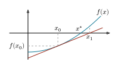
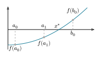
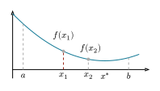

# 1  非線形最適化

Code

- [Show All Code](javascript:void(0))

- [Hide All Code](javascript:void(0))

- 

  ------------------------------------------------------------------------

- [View Source](javascript:void(0))

Nonlinear Optimization

``` julia
using Roots
using NonlinearSolve
using Optim
using Optimization
import OptimizationNLopt
import NLopt
using JuMP
using Ipopt
using Plots
using LaTeXStrings
```

経済モデルを数値的に解く作業は, 多くの場合「非線形方程式 \\f(\mathbf{x}) = \mathbf{0}\\ を解く」か「非線形関数を最大化・最小化する」のどちらかに帰着します. 両者は表裏一体です. 最大化問題は一階条件を導出すれば方程式として解けますし, 最適化アルゴリズムの多くは方程式の解法の analogy として理解できます. 本章では, 前半で非線形方程式の解法である**求根法** (root finding) を, 後半で目的関数を直接扱う**非線形最適化** (nonlinear optimization) を解説します.

## 1.1 求根法

モデルを解く際に, \\f(\mathbf{x}) = \mathbf{0}\\ となるような \\\mathbf{x}\\ を求める必要があることが多いです. 例えば, 家計の最大化問題を解く際の一階条件は, 一般に非線形方程式の形をとります. ごく特殊なケースを除いて, 解析的に解くことができないため, 数値的に解を求める必要があります. この様な非線形方程式の数値解法は, 一変数の場合と多変数の場合に分けられます. 以下では, それぞれの方法について解説します.

### 1.1.1 一変数の非線形方程式

ここでは例として, 次のようなCRRA効用関数を用いた家計の最大化問題を考えてみましょう.

\\ \max\_{c, l} \frac{c^{1-\gamma_c}}{1-\gamma_c} + \alpha_l \frac{l^{1-\gamma_l}}{1-\gamma_l} \quad \text{s.t.} \quad c = w (1-l) \tag{1.1}\\ この問題は以下の一階条件の解を求めることで解くことができます.

\\ w^{1-\gamma_c} (1-l)^{-\gamma_c} - \alpha_l l^{-\gamma_l} = 0. \\

``` julia
foc(l; w=1.0, γ_c=1.5, α_l=1.2, γ_l=1.5) =
    w^(1 - γ_c) * (1 - l)^(-γ_c) - α_l * l^(-γ_l)
```

これを図で表すと [図 fig-foc-crra](#fig-foc-crra) のようになります. 求めたいのは, この関数と \\y = 0\\ の交点の値です.

Code

``` julia
plot(0.1:0.01:0.9, foc, label=false, lw=2)
hline!([0.0], ls=:dash, lw=2, label=false, color=:black)
```

![](data:image/svg+xml;base64,PHN2ZyB4bWxucz0iaHR0cDovL3d3dy53My5vcmcvMjAwMC9zdmciIHhsaW5rPSJodHRwOi8vd3d3LnczLm9yZy8xOTk5L3hsaW5rIiB3aWR0aD0iNTAwIiBoZWlnaHQ9IjMwOCIgdmlld2JveD0iMCAwIDIwMDAgMTIzMiI+CjxkZWZzPgogIDxjbGlwcGF0aCBpZD0iY2xpcDEzMCI+CiAgICA8cmVjdCB4PSIwIiB5PSIwIiB3aWR0aD0iMjAwMCIgaGVpZ2h0PSIxMjMyIiAvPgogIDwvY2xpcHBhdGg+CjwvZGVmcz4KPHBhdGggY2xpcC1wYXRoPSJ1cmwoI2NsaXAxMzApIiBkPSJNMCAxMjMyIEwyMDAwIDEyMzIgTDIwMDAgMS41OTg3MmUtMTQgTDAgMS41OTg3MmUtMTQgIFoiIGZpbGw9IiNmZmZmZmYiIGZpbGwtcnVsZT0iZXZlbm9kZCIgZmlsbC1vcGFjaXR5PSIxIiAvPgo8ZGVmcz4KICA8Y2xpcHBhdGggaWQ9ImNsaXAxMzEiPgogICAgPHJlY3QgeD0iNDAwIiB5PSIwIiB3aWR0aD0iMTQwMSIgaGVpZ2h0PSIxMjMyIiAvPgogIDwvY2xpcHBhdGg+CjwvZGVmcz4KPHBhdGggY2xpcC1wYXRoPSJ1cmwoI2NsaXAxMzApIiBkPSJNMTc0Ljg2NyAxMTI0Ljc1IEwxOTUyLjc2IDExMjQuNzUgTDE5NTIuNzYgNDcuMjQ0MSBMMTc0Ljg2NyA0Ny4yNDQxICBaIiBmaWxsPSIjZmZmZmZmIiBmaWxsLXJ1bGU9ImV2ZW5vZGQiIGZpbGwtb3BhY2l0eT0iMSIgLz4KPGRlZnM+CiAgPGNsaXBwYXRoIGlkPSJjbGlwMTMyIj4KICAgIDxyZWN0IHg9IjE3NCIgeT0iNDciIHdpZHRoPSIxNzc5IiBoZWlnaHQ9IjEwNzkiIC8+CiAgPC9jbGlwcGF0aD4KPC9kZWZzPgo8cG9seWxpbmUgY2xpcC1wYXRoPSJ1cmwoI2NsaXAxMzApIiBzdHlsZT0ic3Ryb2tlOiMwMDAwMDA7IHN0cm9rZS1saW5lY2FwOnJvdW5kOyBzdHJva2UtbGluZWpvaW46cm91bmQ7IHN0cm9rZS13aWR0aDo0OyBzdHJva2Utb3BhY2l0eToxOyBmaWxsOm5vbmUiIHBvaW50cz0iMTc0Ljg2NywxMTI0Ljc1IDE5NTIuNzYsMTEyNC43NSAiPjwvcG9seWxpbmU+Cjxwb2x5bGluZSBjbGlwLXBhdGg9InVybCgjY2xpcDEzMCkiIHN0eWxlPSJzdHJva2U6IzAwMDAwMDsgc3Ryb2tlLWxpbmVjYXA6cm91bmQ7IHN0cm9rZS1saW5lam9pbjpyb3VuZDsgc3Ryb2tlLXdpZHRoOjQ7IHN0cm9rZS1vcGFjaXR5OjE7IGZpbGw6bm9uZSIgcG9pbnRzPSI0MzQuODQxLDExMjQuNzUgNDM0Ljg0MSwxMTA1Ljg2ICI+PC9wb2x5bGluZT4KPHBvbHlsaW5lIGNsaXAtcGF0aD0idXJsKCNjbGlwMTMwKSIgc3R5bGU9InN0cm9rZTojMDAwMDAwOyBzdHJva2UtbGluZWNhcDpyb3VuZDsgc3Ryb2tlLWxpbmVqb2luOnJvdW5kOyBzdHJva2Utd2lkdGg6NDsgc3Ryb2tlLW9wYWNpdHk6MTsgZmlsbDpub25lIiBwb2ludHM9Ijg1NC4xNTUsMTEyNC43NSA4NTQuMTU1LDExMDUuODYgIj48L3BvbHlsaW5lPgo8cG9seWxpbmUgY2xpcC1wYXRoPSJ1cmwoI2NsaXAxMzApIiBzdHlsZT0ic3Ryb2tlOiMwMDAwMDA7IHN0cm9rZS1saW5lY2FwOnJvdW5kOyBzdHJva2UtbGluZWpvaW46cm91bmQ7IHN0cm9rZS13aWR0aDo0OyBzdHJva2Utb3BhY2l0eToxOyBmaWxsOm5vbmUiIHBvaW50cz0iMTI3My40NywxMTI0Ljc1IDEyNzMuNDcsMTEwNS44NiAiPjwvcG9seWxpbmU+Cjxwb2x5bGluZSBjbGlwLXBhdGg9InVybCgjY2xpcDEzMCkiIHN0eWxlPSJzdHJva2U6IzAwMDAwMDsgc3Ryb2tlLWxpbmVjYXA6cm91bmQ7IHN0cm9rZS1saW5lam9pbjpyb3VuZDsgc3Ryb2tlLXdpZHRoOjQ7IHN0cm9rZS1vcGFjaXR5OjE7IGZpbGw6bm9uZSIgcG9pbnRzPSIxNjkyLjc4LDExMjQuNzUgMTY5Mi43OCwxMTA1Ljg2ICI+PC9wb2x5bGluZT4KPHBhdGggY2xpcC1wYXRoPSJ1cmwoI2NsaXAxMzApIiBkPSJNNDEzLjAyNCAxMTUyLjQ3IFE0MDkuNDEzIDExNTIuNDcgNDA3LjU4NCAxMTU2LjA0IFE0MDUuNzc5IDExNTkuNTggNDA1Ljc3OSAxMTY2LjcxIFE0MDUuNzc5IDExNzMuODIgNDA3LjU4NCAxMTc3LjM4IFE0MDkuNDEzIDExODAuOTIgNDEzLjAyNCAxMTgwLjkyIFE0MTYuNjU4IDExODAuOTIgNDE4LjQ2NCAxMTc3LjM4IFE0MjAuMjkyIDExNzMuODIgNDIwLjI5MiAxMTY2LjcxIFE0MjAuMjkyIDExNTkuNTggNDE4LjQ2NCAxMTU2LjA0IFE0MTYuNjU4IDExNTIuNDcgNDEzLjAyNCAxMTUyLjQ3IE00MTMuMDI0IDExNDguNzcgUTQxOC44MzQgMTE0OC43NyA0MjEuODkgMTE1My4zOCBRNDI0Ljk2OCAxMTU3Ljk2IDQyNC45NjggMTE2Ni43MSBRNDI0Ljk2OCAxMTc1LjQ0IDQyMS44OSAxMTgwLjA0IFE0MTguODM0IDExODQuNjMgNDEzLjAyNCAxMTg0LjYzIFE0MDcuMjE0IDExODQuNjMgNDA0LjEzNSAxMTgwLjA0IFE0MDEuMDggMTE3NS40NCA0MDEuMDggMTE2Ni43MSBRNDAxLjA4IDExNTcuOTYgNDA0LjEzNSAxMTUzLjM4IFE0MDcuMjE0IDExNDguNzcgNDEzLjAyNCAxMTQ4Ljc3IFoiIGZpbGw9IiMwMDAwMDAiIGZpbGwtcnVsZT0ibm9uemVybyIgZmlsbC1vcGFjaXR5PSIxIiAvPjxwYXRoIGNsaXAtcGF0aD0idXJsKCNjbGlwMTMwKSIgZD0iTTQzMy4xODYgMTE3OC4wNyBMNDM4LjA3IDExNzguMDcgTDQzOC4wNyAxMTgzLjk1IEw0MzMuMTg2IDExODMuOTUgTDQzMy4xODYgMTE3OC4wNyBaIiBmaWxsPSIjMDAwMDAwIiBmaWxsLXJ1bGU9Im5vbnplcm8iIGZpbGwtb3BhY2l0eT0iMSIgLz48cGF0aCBjbGlwLXBhdGg9InVybCgjY2xpcDEzMCkiIGQ9Ik00NTIuMjgzIDExODAuMDIgTDQ2OC42MDIgMTE4MC4wMiBMNDY4LjYwMiAxMTgzLjk1IEw0NDYuNjU4IDExODMuOTUgTDQ0Ni42NTggMTE4MC4wMiBRNDQ5LjMyIDExNzcuMjYgNDUzLjkwMyAxMTcyLjY0IFE0NTguNTEgMTE2Ny45OCA0NTkuNjkgMTE2Ni42NCBRNDYxLjkzNiAxMTY0LjEyIDQ2Mi44MTUgMTE2Mi4zOCBRNDYzLjcxOCAxMTYwLjYyIDQ2My43MTggMTE1OC45MyBRNDYzLjcxOCAxMTU2LjE4IDQ2MS43NzQgMTE1NC40NCBRNDU5Ljg1MiAxMTUyLjcgNDU2Ljc1MSAxMTUyLjcgUTQ1NC41NTIgMTE1Mi43IDQ1Mi4wOTggMTE1My40NyBRNDQ5LjY2NyAxMTU0LjIzIDQ0Ni44OSAxMTU1Ljc4IEw0NDYuODkgMTE1MS4wNiBRNDQ5LjcxNCAxMTQ5LjkzIDQ1Mi4xNjcgMTE0OS4zNSBRNDU0LjYyMSAxMTQ4Ljc3IDQ1Ni42NTggMTE0OC43NyBRNDYyLjAyOCAxMTQ4Ljc3IDQ2NS4yMjMgMTE1MS40NSBRNDY4LjQxNyAxMTU0LjE0IDQ2OC40MTcgMTE1OC42MyBRNDY4LjQxNyAxMTYwLjc2IDQ2Ny42MDcgMTE2Mi42OCBRNDY2LjgyIDExNjQuNTggNDY0LjcxNCAxMTY3LjE3IFE0NjQuMTM1IDExNjcuODQgNDYxLjAzMyAxMTcxLjA2IFE0NTcuOTMxIDExNzQuMjYgNDUyLjI4MyAxMTgwLjAyIFoiIGZpbGw9IiMwMDAwMDAiIGZpbGwtcnVsZT0ibm9uemVybyIgZmlsbC1vcGFjaXR5PSIxIiAvPjxwYXRoIGNsaXAtcGF0aD0idXJsKCNjbGlwMTMwKSIgZD0iTTgzMS4yOTYgMTE1Mi40NyBRODI3LjY4NSAxMTUyLjQ3IDgyNS44NTYgMTE1Ni4wNCBRODI0LjA1MSAxMTU5LjU4IDgyNC4wNTEgMTE2Ni43MSBRODI0LjA1MSAxMTczLjgyIDgyNS44NTYgMTE3Ny4zOCBRODI3LjY4NSAxMTgwLjkyIDgzMS4yOTYgMTE4MC45MiBRODM0LjkzIDExODAuOTIgODM2LjczNiAxMTc3LjM4IFE4MzguNTY0IDExNzMuODIgODM4LjU2NCAxMTY2LjcxIFE4MzguNTY0IDExNTkuNTggODM2LjczNiAxMTU2LjA0IFE4MzQuOTMgMTE1Mi40NyA4MzEuMjk2IDExNTIuNDcgTTgzMS4yOTYgMTE0OC43NyBRODM3LjEwNiAxMTQ4Ljc3IDg0MC4xNjIgMTE1My4zOCBRODQzLjI0IDExNTcuOTYgODQzLjI0IDExNjYuNzEgUTg0My4yNCAxMTc1LjQ0IDg0MC4xNjIgMTE4MC4wNCBRODM3LjEwNiAxMTg0LjYzIDgzMS4yOTYgMTE4NC42MyBRODI1LjQ4NiAxMTg0LjYzIDgyMi40MDcgMTE4MC4wNCBRODE5LjM1MSAxMTc1LjQ0IDgxOS4zNTEgMTE2Ni43MSBRODE5LjM1MSAxMTU3Ljk2IDgyMi40MDcgMTE1My4zOCBRODI1LjQ4NiAxMTQ4Ljc3IDgzMS4yOTYgMTE0OC43NyBaIiBmaWxsPSIjMDAwMDAwIiBmaWxsLXJ1bGU9Im5vbnplcm8iIGZpbGwtb3BhY2l0eT0iMSIgLz48cGF0aCBjbGlwLXBhdGg9InVybCgjY2xpcDEzMCkiIGQ9Ik04NTEuNDU4IDExNzguMDcgTDg1Ni4zNDIgMTE3OC4wNyBMODU2LjM0MiAxMTgzLjk1IEw4NTEuNDU4IDExODMuOTUgTDg1MS40NTggMTE3OC4wNyBaIiBmaWxsPSIjMDAwMDAwIiBmaWxsLXJ1bGU9Im5vbnplcm8iIGZpbGwtb3BhY2l0eT0iMSIgLz48cGF0aCBjbGlwLXBhdGg9InVybCgjY2xpcDEzMCkiIGQ9Ik04NzkuMzc0IDExNTMuNDcgTDg2Ny41NjkgMTE3MS45MiBMODc5LjM3NCAxMTcxLjkyIEw4NzkuMzc0IDExNTMuNDcgTTg3OC4xNDcgMTE0OS4zOSBMODg0LjAyNyAxMTQ5LjM5IEw4ODQuMDI3IDExNzEuOTIgTDg4OC45NTggMTE3MS45MiBMODg4Ljk1OCAxMTc1LjgxIEw4ODQuMDI3IDExNzUuODEgTDg4NC4wMjcgMTE4My45NSBMODc5LjM3NCAxMTgzLjk1IEw4NzkuMzc0IDExNzUuODEgTDg2My43NzMgMTE3NS44MSBMODYzLjc3MyAxMTcxLjI5IEw4NzguMTQ3IDExNDkuMzkgWiIgZmlsbD0iIzAwMDAwMCIgZmlsbC1ydWxlPSJub256ZXJvIiBmaWxsLW9wYWNpdHk9IjEiIC8+PHBhdGggY2xpcC1wYXRoPSJ1cmwoI2NsaXAxMzApIiBkPSJNMTI1MC43NyAxMTUyLjQ3IFExMjQ3LjE2IDExNTIuNDcgMTI0NS4zMyAxMTU2LjA0IFExMjQzLjUzIDExNTkuNTggMTI0My41MyAxMTY2LjcxIFExMjQzLjUzIDExNzMuODIgMTI0NS4zMyAxMTc3LjM4IFExMjQ3LjE2IDExODAuOTIgMTI1MC43NyAxMTgwLjkyIFExMjU0LjQxIDExODAuOTIgMTI1Ni4yMSAxMTc3LjM4IFExMjU4LjA0IDExNzMuODIgMTI1OC4wNCAxMTY2LjcxIFExMjU4LjA0IDExNTkuNTggMTI1Ni4yMSAxMTU2LjA0IFExMjU0LjQxIDExNTIuNDcgMTI1MC43NyAxMTUyLjQ3IE0xMjUwLjc3IDExNDguNzcgUTEyNTYuNTggMTE0OC43NyAxMjU5LjY0IDExNTMuMzggUTEyNjIuNzIgMTE1Ny45NiAxMjYyLjcyIDExNjYuNzEgUTEyNjIuNzIgMTE3NS40NCAxMjU5LjY0IDExODAuMDQgUTEyNTYuNTggMTE4NC42MyAxMjUwLjc3IDExODQuNjMgUTEyNDQuOTYgMTE4NC42MyAxMjQxLjg4IDExODAuMDQgUTEyMzguODMgMTE3NS40NCAxMjM4LjgzIDExNjYuNzEgUTEyMzguODMgMTE1Ny45NiAxMjQxLjg4IDExNTMuMzggUTEyNDQuOTYgMTE0OC43NyAxMjUwLjc3IDExNDguNzcgWiIgZmlsbD0iIzAwMDAwMCIgZmlsbC1ydWxlPSJub256ZXJvIiBmaWxsLW9wYWNpdHk9IjEiIC8+PHBhdGggY2xpcC1wYXRoPSJ1cmwoI2NsaXAxMzApIiBkPSJNMTI3MC45MyAxMTc4LjA3IEwxMjc1LjgyIDExNzguMDcgTDEyNzUuODIgMTE4My45NSBMMTI3MC45MyAxMTgzLjk1IEwxMjcwLjkzIDExNzguMDcgWiIgZmlsbD0iIzAwMDAwMCIgZmlsbC1ydWxlPSJub256ZXJvIiBmaWxsLW9wYWNpdHk9IjEiIC8+PHBhdGggY2xpcC1wYXRoPSJ1cmwoI2NsaXAxMzApIiBkPSJNMTI5Ni41OCAxMTY0LjgxIFExMjkzLjQzIDExNjQuODEgMTI5MS41OCAxMTY2Ljk2IFExMjg5Ljc1IDExNjkuMTIgMTI4OS43NSAxMTcyLjg3IFExMjg5Ljc1IDExNzYuNTkgMTI5MS41OCAxMTc4Ljc3IFExMjkzLjQzIDExODAuOTIgMTI5Ni41OCAxMTgwLjkyIFExMjk5LjczIDExODAuOTIgMTMwMS41NiAxMTc4Ljc3IFExMzAzLjQxIDExNzYuNTkgMTMwMy40MSAxMTcyLjg3IFExMzAzLjQxIDExNjkuMTIgMTMwMS41NiAxMTY2Ljk2IFExMjk5LjczIDExNjQuODEgMTI5Ni41OCAxMTY0LjgxIE0xMzA1Ljg2IDExNTAuMTYgTDEzMDUuODYgMTE1NC40MiBRMTMwNC4xIDExNTMuNTggMTMwMi4zIDExNTMuMTQgUTEzMDAuNTIgMTE1Mi43IDEyOTguNzYgMTE1Mi43IFExMjk0LjEzIDExNTIuNyAxMjkxLjY3IDExNTUuODMgUTEyODkuMjQgMTE1OC45NSAxMjg4LjkgMTE2NS4yNyBRMTI5MC4yNiAxMTYzLjI2IDEyOTIuMzIgMTE2Mi4yIFExMjk0LjM4IDExNjEuMTEgMTI5Ni44NiAxMTYxLjExIFExMzAyLjA3IDExNjEuMTEgMTMwNS4wOCAxMTY0LjI4IFExMzA4LjExIDExNjcuNDMgMTMwOC4xMSAxMTcyLjg3IFExMzA4LjExIDExNzguMTkgMTMwNC45NiAxMTgxLjQxIFExMzAxLjgxIDExODQuNjMgMTI5Ni41OCAxMTg0LjYzIFExMjkwLjU5IDExODQuNjMgMTI4Ny40MSAxMTgwLjA0IFExMjg0LjI0IDExNzUuNDQgMTI4NC4yNCAxMTY2LjcxIFExMjg0LjI0IDExNTguNTEgMTI4OC4xMyAxMTUzLjY1IFExMjkyLjAyIDExNDguNzcgMTI5OC41NyAxMTQ4Ljc3IFExMzAwLjMzIDExNDguNzcgMTMwMi4xMSAxMTQ5LjEyIFExMzAzLjkyIDExNDkuNDYgMTMwNS44NiAxMTUwLjE2IFoiIGZpbGw9IiMwMDAwMDAiIGZpbGwtcnVsZT0ibm9uemVybyIgZmlsbC1vcGFjaXR5PSIxIiAvPjxwYXRoIGNsaXAtcGF0aD0idXJsKCNjbGlwMTMwKSIgZD0iTTE2NzAuMjEgMTE1Mi40NyBRMTY2Ni42IDExNTIuNDcgMTY2NC43NyAxMTU2LjA0IFExNjYyLjk3IDExNTkuNTggMTY2Mi45NyAxMTY2LjcxIFExNjYyLjk3IDExNzMuODIgMTY2NC43NyAxMTc3LjM4IFExNjY2LjYgMTE4MC45MiAxNjcwLjIxIDExODAuOTIgUTE2NzMuODUgMTE4MC45MiAxNjc1LjY1IDExNzcuMzggUTE2NzcuNDggMTE3My44MiAxNjc3LjQ4IDExNjYuNzEgUTE2NzcuNDggMTE1OS41OCAxNjc1LjY1IDExNTYuMDQgUTE2NzMuODUgMTE1Mi40NyAxNjcwLjIxIDExNTIuNDcgTTE2NzAuMjEgMTE0OC43NyBRMTY3Ni4wMiAxMTQ4Ljc3IDE2NzkuMDggMTE1My4zOCBRMTY4Mi4xNiAxMTU3Ljk2IDE2ODIuMTYgMTE2Ni43MSBRMTY4Mi4xNiAxMTc1LjQ0IDE2NzkuMDggMTE4MC4wNCBRMTY3Ni4wMiAxMTg0LjYzIDE2NzAuMjEgMTE4NC42MyBRMTY2NC40IDExODQuNjMgMTY2MS4zMiAxMTgwLjA0IFExNjU4LjI3IDExNzUuNDQgMTY1OC4yNyAxMTY2LjcxIFExNjU4LjI3IDExNTcuOTYgMTY2MS4zMiAxMTUzLjM4IFExNjY0LjQgMTE0OC43NyAxNjcwLjIxIDExNDguNzcgWiIgZmlsbD0iIzAwMDAwMCIgZmlsbC1ydWxlPSJub256ZXJvIiBmaWxsLW9wYWNpdHk9IjEiIC8+PHBhdGggY2xpcC1wYXRoPSJ1cmwoI2NsaXAxMzApIiBkPSJNMTY5MC4zNyAxMTc4LjA3IEwxNjk1LjI2IDExNzguMDcgTDE2OTUuMjYgMTE4My45NSBMMTY5MC4zNyAxMTgzLjk1IEwxNjkwLjM3IDExNzguMDcgWiIgZmlsbD0iIzAwMDAwMCIgZmlsbC1ydWxlPSJub256ZXJvIiBmaWxsLW9wYWNpdHk9IjEiIC8+PHBhdGggY2xpcC1wYXRoPSJ1cmwoI2NsaXAxMzApIiBkPSJNMTcxNS40NCAxMTY3LjU0IFExNzEyLjExIDExNjcuNTQgMTcxMC4xOSAxMTY5LjMyIFExNzA4LjI5IDExNzEuMTEgMTcwOC4yOSAxMTc0LjIzIFExNzA4LjI5IDExNzcuMzYgMTcxMC4xOSAxMTc5LjE0IFExNzEyLjExIDExODAuOTIgMTcxNS40NCAxMTgwLjkyIFExNzE4Ljc4IDExODAuOTIgMTcyMC43IDExNzkuMTQgUTE3MjIuNjIgMTE3Ny4zMyAxNzIyLjYyIDExNzQuMjMgUTE3MjIuNjIgMTE3MS4xMSAxNzIwLjcgMTE2OS4zMiBRMTcxOC44IDExNjcuNTQgMTcxNS40NCAxMTY3LjU0IE0xNzEwLjc3IDExNjUuNTUgUTE3MDcuNzYgMTE2NC44MSAxNzA2LjA3IDExNjIuNzUgUTE3MDQuNCAxMTYwLjY5IDE3MDQuNCAxMTU3LjczIFExNzA0LjQgMTE1My41OCAxNzA3LjM0IDExNTEuMTggUTE3MTAuMyAxMTQ4Ljc3IDE3MTUuNDQgMTE0OC43NyBRMTcyMC42MSAxMTQ4Ljc3IDE3MjMuNTUgMTE1MS4xOCBRMTcyNi40OSAxMTUzLjU4IDE3MjYuNDkgMTE1Ny43MyBRMTcyNi40OSAxMTYwLjY5IDE3MjQuOCAxMTYyLjc1IFExNzIzLjEzIDExNjQuODEgMTcyMC4xNCAxMTY1LjU1IFExNzIzLjUyIDExNjYuMzQgMTcyNS40IDExNjguNjMgUTE3MjcuMyAxMTcwLjkyIDE3MjcuMyAxMTc0LjIzIFExNzI3LjMgMTE3OS4yNiAxNzI0LjIyIDExODEuOTQgUTE3MjEuMTYgMTE4NC42MyAxNzE1LjQ0IDExODQuNjMgUTE3MDkuNzMgMTE4NC42MyAxNzA2LjY1IDExODEuOTQgUTE3MDMuNTkgMTE3OS4yNiAxNzAzLjU5IDExNzQuMjMgUTE3MDMuNTkgMTE3MC45MiAxNzA1LjQ5IDExNjguNjMgUTE3MDcuMzkgMTE2Ni4zNCAxNzEwLjc3IDExNjUuNTUgTTE3MDkuMDUgMTE1OC4xNyBRMTcwOS4wNSAxMTYwLjg1IDE3MTAuNzIgMTE2Mi4zNiBRMTcxMi40MSAxMTYzLjg2IDE3MTUuNDQgMTE2My44NiBRMTcxOC40NSAxMTYzLjg2IDE3MjAuMTQgMTE2Mi4zNiBRMTcyMS44NiAxMTYwLjg1IDE3MjEuODYgMTE1OC4xNyBRMTcyMS44NiAxMTU1LjQ4IDE3MjAuMTQgMTE1My45OCBRMTcxOC40NSAxMTUyLjQ3IDE3MTUuNDQgMTE1Mi40NyBRMTcxMi40MSAxMTUyLjQ3IDE3MTAuNzIgMTE1My45OCBRMTcwOS4wNSAxMTU1LjQ4IDE3MDkuMDUgMTE1OC4xNyBaIiBmaWxsPSIjMDAwMDAwIiBmaWxsLXJ1bGU9Im5vbnplcm8iIGZpbGwtb3BhY2l0eT0iMSIgLz48cG9seWxpbmUgY2xpcC1wYXRoPSJ1cmwoI2NsaXAxMzApIiBzdHlsZT0ic3Ryb2tlOiMwMDAwMDA7IHN0cm9rZS1saW5lY2FwOnJvdW5kOyBzdHJva2UtbGluZWpvaW46cm91bmQ7IHN0cm9rZS13aWR0aDo0OyBzdHJva2Utb3BhY2l0eToxOyBmaWxsOm5vbmUiIHBvaW50cz0iMTc0Ljg2NywxMTI0Ljc1IDE3NC44NjcsNDcuMjQ0MSAiPjwvcG9seWxpbmU+Cjxwb2x5bGluZSBjbGlwLXBhdGg9InVybCgjY2xpcDEzMCkiIHN0eWxlPSJzdHJva2U6IzAwMDAwMDsgc3Ryb2tlLWxpbmVjYXA6cm91bmQ7IHN0cm9rZS1saW5lam9pbjpyb3VuZDsgc3Ryb2tlLXdpZHRoOjQ7IHN0cm9rZS1vcGFjaXR5OjE7IGZpbGw6bm9uZSIgcG9pbnRzPSIxNzQuODY3LDk5MS40NDIgMTkzLjc2NCw5OTEuNDQyICI+PC9wb2x5bGluZT4KPHBvbHlsaW5lIGNsaXAtcGF0aD0idXJsKCNjbGlwMTMwKSIgc3R5bGU9InN0cm9rZTojMDAwMDAwOyBzdHJva2UtbGluZWNhcDpyb3VuZDsgc3Ryb2tlLWxpbmVqb2luOnJvdW5kOyBzdHJva2Utd2lkdGg6NDsgc3Ryb2tlLW9wYWNpdHk6MTsgZmlsbDpub25lIiBwb2ludHM9IjE3NC44NjcsODM5LjcwOCAxOTMuNzY0LDgzOS43MDggIj48L3BvbHlsaW5lPgo8cG9seWxpbmUgY2xpcC1wYXRoPSJ1cmwoI2NsaXAxMzApIiBzdHlsZT0ic3Ryb2tlOiMwMDAwMDA7IHN0cm9rZS1saW5lY2FwOnJvdW5kOyBzdHJva2UtbGluZWpvaW46cm91bmQ7IHN0cm9rZS13aWR0aDo0OyBzdHJva2Utb3BhY2l0eToxOyBmaWxsOm5vbmUiIHBvaW50cz0iMTc0Ljg2Nyw2ODcuOTc0IDE5My43NjQsNjg3Ljk3NCAiPjwvcG9seWxpbmU+Cjxwb2x5bGluZSBjbGlwLXBhdGg9InVybCgjY2xpcDEzMCkiIHN0eWxlPSJzdHJva2U6IzAwMDAwMDsgc3Ryb2tlLWxpbmVjYXA6cm91bmQ7IHN0cm9rZS1saW5lam9pbjpyb3VuZDsgc3Ryb2tlLXdpZHRoOjQ7IHN0cm9rZS1vcGFjaXR5OjE7IGZpbGw6bm9uZSIgcG9pbnRzPSIxNzQuODY3LDUzNi4yNCAxOTMuNzY0LDUzNi4yNCAiPjwvcG9seWxpbmU+Cjxwb2x5bGluZSBjbGlwLXBhdGg9InVybCgjY2xpcDEzMCkiIHN0eWxlPSJzdHJva2U6IzAwMDAwMDsgc3Ryb2tlLWxpbmVjYXA6cm91bmQ7IHN0cm9rZS1saW5lam9pbjpyb3VuZDsgc3Ryb2tlLXdpZHRoOjQ7IHN0cm9rZS1vcGFjaXR5OjE7IGZpbGw6bm9uZSIgcG9pbnRzPSIxNzQuODY3LDM4NC41MDUgMTkzLjc2NCwzODQuNTA1ICI+PC9wb2x5bGluZT4KPHBvbHlsaW5lIGNsaXAtcGF0aD0idXJsKCNjbGlwMTMwKSIgc3R5bGU9InN0cm9rZTojMDAwMDAwOyBzdHJva2UtbGluZWNhcDpyb3VuZDsgc3Ryb2tlLWxpbmVqb2luOnJvdW5kOyBzdHJva2Utd2lkdGg6NDsgc3Ryb2tlLW9wYWNpdHk6MTsgZmlsbDpub25lIiBwb2ludHM9IjE3NC44NjcsMjMyLjc3MSAxOTMuNzY0LDIzMi43NzEgIj48L3BvbHlsaW5lPgo8cG9seWxpbmUgY2xpcC1wYXRoPSJ1cmwoI2NsaXAxMzApIiBzdHlsZT0ic3Ryb2tlOiMwMDAwMDA7IHN0cm9rZS1saW5lY2FwOnJvdW5kOyBzdHJva2UtbGluZWpvaW46cm91bmQ7IHN0cm9rZS13aWR0aDo0OyBzdHJva2Utb3BhY2l0eToxOyBmaWxsOm5vbmUiIHBvaW50cz0iMTc0Ljg2Nyw4MS4wMzcyIDE5My43NjQsODEuMDM3MiAiPjwvcG9seWxpbmU+CjxwYXRoIGNsaXAtcGF0aD0idXJsKCNjbGlwMTMwKSIgZD0iTTUyLjk5MjEgOTkxLjg5MyBMODIuNjY3OSA5OTEuODkzIEw4Mi42Njc5IDk5NS44MjkgTDUyLjk5MjEgOTk1LjgyOSBMNTIuOTkyMSA5OTEuODkzIFoiIGZpbGw9IiMwMDAwMDAiIGZpbGwtcnVsZT0ibm9uemVybyIgZmlsbC1vcGFjaXR5PSIxIiAvPjxwYXRoIGNsaXAtcGF0aD0idXJsKCNjbGlwMTMwKSIgZD0iTTEwNi45MjcgOTkwLjA4OCBRMTEwLjI4MyA5OTAuODA1IDExMi4xNTggOTkzLjA3NCBRMTE0LjA1NyA5OTUuMzQyIDExNC4wNTcgOTk4LjY3NiBRMTE0LjA1NyAxMDAzLjc5IDExMC41MzggMTAwNi41OSBRMTA3LjAyIDEwMDkuMzkgMTAwLjUzOCAxMDA5LjM5IFE5OC4zNjIzIDEwMDkuMzkgOTYuMDQ3NSAxMDA4Ljk1IFE5My43NTU4IDEwMDguNTQgOTEuMzAyMSAxMDA3LjY4IEw5MS4zMDIxIDEwMDMuMTcgUTkzLjI0NjUgMTAwNC4zIDk1LjU2MTMgMTAwNC44OCBROTcuODc2MSAxMDA1LjQ2IDEwMC4zOTkgMTAwNS40NiBRMTA0Ljc5NyAxMDA1LjQ2IDEwNy4wODkgMTAwMy43MiBRMTA5LjQwNCAxMDAxLjk5IDEwOS40MDQgOTk4LjY3NiBRMTA5LjQwNCA5OTUuNjIgMTA3LjI1MSA5OTMuOTA3IFExMDUuMTIxIDk5Mi4xNzEgMTAxLjMwMiA5OTIuMTcxIEw5Ny4yNzQzIDk5Mi4xNzEgTDk3LjI3NDMgOTg4LjMyOSBMMTAxLjQ4NyA5ODguMzI5IFExMDQuOTM2IDk4OC4zMjkgMTA2Ljc2NSA5ODYuOTYzIFExMDguNTk0IDk4NS41NzQgMTA4LjU5NCA5ODIuOTgxIFExMDguNTk0IDk4MC4zMTkgMTA2LjY5NiA5NzguOTA3IFExMDQuODIxIDk3Ny40NzIgMTAxLjMwMiA5NzcuNDcyIFE5OS4zODA4IDk3Ny40NzIgOTcuMTgxNyA5NzcuODg5IFE5NC45ODI2IDk3OC4zMDYgOTIuMzQzOCA5NzkuMTg1IEw5Mi4zNDM4IDk3NS4wMTggUTk1LjAwNTggOTc0LjI3OCA5Ny4zMjA2IDk3My45MDcgUTk5LjY1ODUgOTczLjUzNyAxMDEuNzE5IDk3My41MzcgUTEwNy4wNDMgOTczLjUzNyAxMTAuMTQ1IDk3NS45NjggUTExMy4yNDYgOTc4LjM3NSAxMTMuMjQ2IDk4Mi40OTUgUTExMy4yNDYgOTg1LjM2NiAxMTEuNjAzIDk4Ny4zNTYgUTEwOS45NTkgOTg5LjMyNCAxMDYuOTI3IDk5MC4wODggWiIgZmlsbD0iIzAwMDAwMCIgZmlsbC1ydWxlPSJub256ZXJvIiBmaWxsLW9wYWNpdHk9IjEiIC8+PHBhdGggY2xpcC1wYXRoPSJ1cmwoI2NsaXAxMzApIiBkPSJNMTMyLjkyMiA5NzcuMjQxIFExMjkuMzExIDk3Ny4yNDEgMTI3LjQ4MiA5ODAuODA1IFExMjUuNjc3IDk4NC4zNDcgMTI1LjY3NyA5OTEuNDc3IFExMjUuNjc3IDk5OC41ODMgMTI3LjQ4MiAxMDAyLjE1IFExMjkuMzExIDEwMDUuNjkgMTMyLjkyMiAxMDA1LjY5IFExMzYuNTU2IDEwMDUuNjkgMTM4LjM2MiAxMDAyLjE1IFExNDAuMTkxIDk5OC41ODMgMTQwLjE5MSA5OTEuNDc3IFExNDAuMTkxIDk4NC4zNDcgMTM4LjM2MiA5ODAuODA1IFExMzYuNTU2IDk3Ny4yNDEgMTMyLjkyMiA5NzcuMjQxIE0xMzIuOTIyIDk3My41MzcgUTEzOC43MzIgOTczLjUzNyAxNDEuNzg4IDk3OC4xNDMgUTE0NC44NjcgOTgyLjcyNyAxNDQuODY3IDk5MS40NzcgUTE0NC44NjcgMTAwMC4yIDE0MS43ODggMTAwNC44MSBRMTM4LjczMiAxMDA5LjM5IDEzMi45MjIgMTAwOS4zOSBRMTI3LjExMiAxMDA5LjM5IDEyNC4wMzMgMTAwNC44MSBRMTIwLjk3OCAxMDAwLjIgMTIwLjk3OCA5OTEuNDc3IFExMjAuOTc4IDk4Mi43MjcgMTI0LjAzMyA5NzguMTQzIFExMjcuMTEyIDk3My41MzcgMTMyLjkyMiA5NzMuNTM3IFoiIGZpbGw9IiMwMDAwMDAiIGZpbGwtcnVsZT0ibm9uemVybyIgZmlsbC1vcGFjaXR5PSIxIiAvPjxwYXRoIGNsaXAtcGF0aD0idXJsKCNjbGlwMTMwKSIgZD0iTTUyLjk5MjEgODQwLjE1OSBMODIuNjY3OSA4NDAuMTU5IEw4Mi42Njc5IDg0NC4wOTQgTDUyLjk5MjEgODQ0LjA5NCBMNTIuOTkyMSA4NDAuMTU5IFoiIGZpbGw9IiMwMDAwMDAiIGZpbGwtcnVsZT0ibm9uemVybyIgZmlsbC1vcGFjaXR5PSIxIiAvPjxwYXRoIGNsaXAtcGF0aD0idXJsKCNjbGlwMTMwKSIgZD0iTTk2Ljc4ODIgODUzLjA1MyBMMTEzLjEwOCA4NTMuMDUzIEwxMTMuMTA4IDg1Ni45ODggTDkxLjE2MzIgODU2Ljk4OCBMOTEuMTYzMiA4NTMuMDUzIFE5My44MjUyIDg1MC4yOTggOTguNDA4NSA4NDUuNjY4IFExMDMuMDE1IDg0MS4wMTYgMTA0LjE5NiA4MzkuNjczIFExMDYuNDQxIDgzNy4xNSAxMDcuMzIxIDgzNS40MTQgUTEwOC4yMjMgODMzLjY1NSAxMDguMjIzIDgzMS45NjUgUTEwOC4yMjMgODI5LjIxIDEwNi4yNzkgODI3LjQ3NCBRMTA0LjM1OCA4MjUuNzM4IDEwMS4yNTYgODI1LjczOCBROTkuMDU2NyA4MjUuNzM4IDk2LjYwMyA4MjYuNTAyIFE5NC4xNzI1IDgyNy4yNjYgOTEuMzk0NyA4MjguODE3IEw5MS4zOTQ3IDgyNC4wOTUgUTk0LjIxODggODIyLjk2IDk2LjY3MjQgODIyLjM4MiBROTkuMTI2MSA4MjEuODAzIDEwMS4xNjMgODIxLjgwMyBRMTA2LjUzNCA4MjEuODAzIDEwOS43MjggODI0LjQ4OCBRMTEyLjkyMiA4MjcuMTczIDExMi45MjIgODMxLjY2NCBRMTEyLjkyMiA4MzMuNzk0IDExMi4xMTIgODM1LjcxNSBRMTExLjMyNSA4MzcuNjEzIDEwOS4yMTkgODQwLjIwNiBRMTA4LjY0IDg0MC44NzcgMTA1LjUzOCA4NDQuMDk0IFExMDIuNDM2IDg0Ny4yODkgOTYuNzg4MiA4NTMuMDUzIFoiIGZpbGw9IiMwMDAwMDAiIGZpbGwtcnVsZT0ibm9uemVybyIgZmlsbC1vcGFjaXR5PSIxIiAvPjxwYXRoIGNsaXAtcGF0aD0idXJsKCNjbGlwMTMwKSIgZD0iTTEzMi45MjIgODI1LjUwNyBRMTI5LjMxMSA4MjUuNTA3IDEyNy40ODIgODI5LjA3MSBRMTI1LjY3NyA4MzIuNjEzIDEyNS42NzcgODM5Ljc0MyBRMTI1LjY3NyA4NDYuODQ5IDEyNy40ODIgODUwLjQxNCBRMTI5LjMxMSA4NTMuOTU1IDEzMi45MjIgODUzLjk1NSBRMTM2LjU1NiA4NTMuOTU1IDEzOC4zNjIgODUwLjQxNCBRMTQwLjE5MSA4NDYuODQ5IDE0MC4xOTEgODM5Ljc0MyBRMTQwLjE5MSA4MzIuNjEzIDEzOC4zNjIgODI5LjA3MSBRMTM2LjU1NiA4MjUuNTA3IDEzMi45MjIgODI1LjUwNyBNMTMyLjkyMiA4MjEuODAzIFExMzguNzMyIDgyMS44MDMgMTQxLjc4OCA4MjYuNDA5IFExNDQuODY3IDgzMC45OTMgMTQ0Ljg2NyA4MzkuNzQzIFExNDQuODY3IDg0OC40NjkgMTQxLjc4OCA4NTMuMDc2IFExMzguNzMyIDg1Ny42NTkgMTMyLjkyMiA4NTcuNjU5IFExMjcuMTEyIDg1Ny42NTkgMTI0LjAzMyA4NTMuMDc2IFExMjAuOTc4IDg0OC40NjkgMTIwLjk3OCA4MzkuNzQzIFExMjAuOTc4IDgzMC45OTMgMTI0LjAzMyA4MjYuNDA5IFExMjcuMTEyIDgyMS44MDMgMTMyLjkyMiA4MjEuODAzIFoiIGZpbGw9IiMwMDAwMDAiIGZpbGwtcnVsZT0ibm9uemVybyIgZmlsbC1vcGFjaXR5PSIxIiAvPjxwYXRoIGNsaXAtcGF0aD0idXJsKCNjbGlwMTMwKSIgZD0iTTUyLjk5MjEgNjg4LjQyNSBMODIuNjY3OSA2ODguNDI1IEw4Mi42Njc5IDY5Mi4zNiBMNTIuOTkyMSA2OTIuMzYgTDUyLjk5MjEgNjg4LjQyNSBaIiBmaWxsPSIjMDAwMDAwIiBmaWxsLXJ1bGU9Im5vbnplcm8iIGZpbGwtb3BhY2l0eT0iMSIgLz48cGF0aCBjbGlwLXBhdGg9InVybCgjY2xpcDEzMCkiIGQ9Ik05My41NzA2IDcwMS4zMTkgTDEwMS4yMDkgNzAxLjMxOSBMMTAxLjIwOSA2NzQuOTUzIEw5Mi44OTkzIDY3Ni42MiBMOTIuODk5MyA2NzIuMzYgTDEwMS4xNjMgNjcwLjY5NCBMMTA1LjgzOSA2NzAuNjk0IEwxMDUuODM5IDcwMS4zMTkgTDExMy40NzggNzAxLjMxOSBMMTEzLjQ3OCA3MDUuMjU0IEw5My41NzA2IDcwNS4yNTQgTDkzLjU3MDYgNzAxLjMxOSBaIiBmaWxsPSIjMDAwMDAwIiBmaWxsLXJ1bGU9Im5vbnplcm8iIGZpbGwtb3BhY2l0eT0iMSIgLz48cGF0aCBjbGlwLXBhdGg9InVybCgjY2xpcDEzMCkiIGQ9Ik0xMzIuOTIyIDY3My43NzIgUTEyOS4zMTEgNjczLjc3MiAxMjcuNDgyIDY3Ny4zMzcgUTEyNS42NzcgNjgwLjg3OSAxMjUuNjc3IDY4OC4wMDggUTEyNS42NzcgNjk1LjExNSAxMjcuNDgyIDY5OC42OCBRMTI5LjMxMSA3MDIuMjIxIDEzMi45MjIgNzAyLjIyMSBRMTM2LjU1NiA3MDIuMjIxIDEzOC4zNjIgNjk4LjY4IFExNDAuMTkxIDY5NS4xMTUgMTQwLjE5MSA2ODguMDA4IFExNDAuMTkxIDY4MC44NzkgMTM4LjM2MiA2NzcuMzM3IFExMzYuNTU2IDY3My43NzIgMTMyLjkyMiA2NzMuNzcyIE0xMzIuOTIyIDY3MC4wNjkgUTEzOC43MzIgNjcwLjA2OSAxNDEuNzg4IDY3NC42NzUgUTE0NC44NjcgNjc5LjI1OCAxNDQuODY3IDY4OC4wMDggUTE0NC44NjcgNjk2LjczNSAxNDEuNzg4IDcwMS4zNDIgUTEzOC43MzIgNzA1LjkyNSAxMzIuOTIyIDcwNS45MjUgUTEyNy4xMTIgNzA1LjkyNSAxMjQuMDMzIDcwMS4zNDIgUTEyMC45NzggNjk2LjczNSAxMjAuOTc4IDY4OC4wMDggUTEyMC45NzggNjc5LjI1OCAxMjQuMDMzIDY3NC42NzUgUTEyNy4xMTIgNjcwLjA2OSAxMzIuOTIyIDY3MC4wNjkgWiIgZmlsbD0iIzAwMDAwMCIgZmlsbC1ydWxlPSJub256ZXJvIiBmaWxsLW9wYWNpdHk9IjEiIC8+PHBhdGggY2xpcC1wYXRoPSJ1cmwoI2NsaXAxMzApIiBkPSJNMTMyLjkyMiA1MjIuMDM4IFExMjkuMzExIDUyMi4wMzggMTI3LjQ4MiA1MjUuNjAzIFExMjUuNjc3IDUyOS4xNDUgMTI1LjY3NyA1MzYuMjc0IFExMjUuNjc3IDU0My4zODEgMTI3LjQ4MiA1NDYuOTQ2IFExMjkuMzExIDU1MC40ODcgMTMyLjkyMiA1NTAuNDg3IFExMzYuNTU2IDU1MC40ODcgMTM4LjM2MiA1NDYuOTQ2IFExNDAuMTkxIDU0My4zODEgMTQwLjE5MSA1MzYuMjc0IFExNDAuMTkxIDUyOS4xNDUgMTM4LjM2MiA1MjUuNjAzIFExMzYuNTU2IDUyMi4wMzggMTMyLjkyMiA1MjIuMDM4IE0xMzIuOTIyIDUxOC4zMzUgUTEzOC43MzIgNTE4LjMzNSAxNDEuNzg4IDUyMi45NDEgUTE0NC44NjcgNTI3LjUyNCAxNDQuODY3IDUzNi4yNzQgUTE0NC44NjcgNTQ1LjAwMSAxNDEuNzg4IDU0OS42MDggUTEzOC43MzIgNTU0LjE5MSAxMzIuOTIyIDU1NC4xOTEgUTEyNy4xMTIgNTU0LjE5MSAxMjQuMDMzIDU0OS42MDggUTEyMC45NzggNTQ1LjAwMSAxMjAuOTc4IDUzNi4yNzQgUTEyMC45NzggNTI3LjUyNCAxMjQuMDMzIDUyMi45NDEgUTEyNy4xMTIgNTE4LjMzNSAxMzIuOTIyIDUxOC4zMzUgWiIgZmlsbD0iIzAwMDAwMCIgZmlsbC1ydWxlPSJub256ZXJvIiBmaWxsLW9wYWNpdHk9IjEiIC8+PHBhdGggY2xpcC1wYXRoPSJ1cmwoI2NsaXAxMzApIiBkPSJNOTMuNTcwNiAzOTcuODUgTDEwMS4yMDkgMzk3Ljg1IEwxMDEuMjA5IDM3MS40ODUgTDkyLjg5OTMgMzczLjE1MSBMOTIuODk5MyAzNjguODkyIEwxMDEuMTYzIDM2Ny4yMjUgTDEwNS44MzkgMzY3LjIyNSBMMTA1LjgzOSAzOTcuODUgTDExMy40NzggMzk3Ljg1IEwxMTMuNDc4IDQwMS43ODUgTDkzLjU3MDYgNDAxLjc4NSBMOTMuNTcwNiAzOTcuODUgWiIgZmlsbD0iIzAwMDAwMCIgZmlsbC1ydWxlPSJub256ZXJvIiBmaWxsLW9wYWNpdHk9IjEiIC8+PHBhdGggY2xpcC1wYXRoPSJ1cmwoI2NsaXAxMzApIiBkPSJNMTMyLjkyMiAzNzAuMzA0IFExMjkuMzExIDM3MC4zMDQgMTI3LjQ4MiAzNzMuODY5IFExMjUuNjc3IDM3Ny40MTEgMTI1LjY3NyAzODQuNTQgUTEyNS42NzcgMzkxLjY0NyAxMjcuNDgyIDM5NS4yMTEgUTEyOS4zMTEgMzk4Ljc1MyAxMzIuOTIyIDM5OC43NTMgUTEzNi41NTYgMzk4Ljc1MyAxMzguMzYyIDM5NS4yMTEgUTE0MC4xOTEgMzkxLjY0NyAxNDAuMTkxIDM4NC41NCBRMTQwLjE5MSAzNzcuNDExIDEzOC4zNjIgMzczLjg2OSBRMTM2LjU1NiAzNzAuMzA0IDEzMi45MjIgMzcwLjMwNCBNMTMyLjkyMiAzNjYuNiBRMTM4LjczMiAzNjYuNiAxNDEuNzg4IDM3MS4yMDcgUTE0NC44NjcgMzc1Ljc5IDE0NC44NjcgMzg0LjU0IFExNDQuODY3IDM5My4yNjcgMTQxLjc4OCAzOTcuODczIFExMzguNzMyIDQwMi40NTcgMTMyLjkyMiA0MDIuNDU3IFExMjcuMTEyIDQwMi40NTcgMTI0LjAzMyAzOTcuODczIFExMjAuOTc4IDM5My4yNjcgMTIwLjk3OCAzODQuNTQgUTEyMC45NzggMzc1Ljc5IDEyNC4wMzMgMzcxLjIwNyBRMTI3LjExMiAzNjYuNiAxMzIuOTIyIDM2Ni42IFoiIGZpbGw9IiMwMDAwMDAiIGZpbGwtcnVsZT0ibm9uemVybyIgZmlsbC1vcGFjaXR5PSIxIiAvPjxwYXRoIGNsaXAtcGF0aD0idXJsKCNjbGlwMTMwKSIgZD0iTTk2Ljc4ODIgMjQ2LjExNiBMMTEzLjEwOCAyNDYuMTE2IEwxMTMuMTA4IDI1MC4wNTEgTDkxLjE2MzIgMjUwLjA1MSBMOTEuMTYzMiAyNDYuMTE2IFE5My44MjUyIDI0My4zNjIgOTguNDA4NSAyMzguNzMyIFExMDMuMDE1IDIzNC4wNzkgMTA0LjE5NiAyMzIuNzM3IFExMDYuNDQxIDIzMC4yMTMgMTA3LjMyMSAyMjguNDc3IFExMDguMjIzIDIyNi43MTggMTA4LjIyMyAyMjUuMDI4IFExMDguMjIzIDIyMi4yNzQgMTA2LjI3OSAyMjAuNTM4IFExMDQuMzU4IDIxOC44MDEgMTAxLjI1NiAyMTguODAxIFE5OS4wNTY3IDIxOC44MDEgOTYuNjAzIDIxOS41NjUgUTk0LjE3MjUgMjIwLjMyOSA5MS4zOTQ3IDIyMS44OCBMOTEuMzk0NyAyMTcuMTU4IFE5NC4yMTg4IDIxNi4wMjQgOTYuNjcyNCAyMTUuNDQ1IFE5OS4xMjYxIDIxNC44NjYgMTAxLjE2MyAyMTQuODY2IFExMDYuNTM0IDIxNC44NjYgMTA5LjcyOCAyMTcuNTUxIFExMTIuOTIyIDIyMC4yMzcgMTEyLjkyMiAyMjQuNzI3IFExMTIuOTIyIDIyNi44NTcgMTEyLjExMiAyMjguNzc4IFExMTEuMzI1IDIzMC42NzYgMTA5LjIxOSAyMzMuMjY5IFExMDguNjQgMjMzLjk0IDEwNS41MzggMjM3LjE1OCBRMTAyLjQzNiAyNDAuMzUyIDk2Ljc4ODIgMjQ2LjExNiBaIiBmaWxsPSIjMDAwMDAwIiBmaWxsLXJ1bGU9Im5vbnplcm8iIGZpbGwtb3BhY2l0eT0iMSIgLz48cGF0aCBjbGlwLXBhdGg9InVybCgjY2xpcDEzMCkiIGQ9Ik0xMzIuOTIyIDIxOC41NyBRMTI5LjMxMSAyMTguNTcgMTI3LjQ4MiAyMjIuMTM1IFExMjUuNjc3IDIyNS42NzYgMTI1LjY3NyAyMzIuODA2IFExMjUuNjc3IDIzOS45MTIgMTI3LjQ4MiAyNDMuNDc3IFExMjkuMzExIDI0Ny4wMTkgMTMyLjkyMiAyNDcuMDE5IFExMzYuNTU2IDI0Ny4wMTkgMTM4LjM2MiAyNDMuNDc3IFExNDAuMTkxIDIzOS45MTIgMTQwLjE5MSAyMzIuODA2IFExNDAuMTkxIDIyNS42NzYgMTM4LjM2MiAyMjIuMTM1IFExMzYuNTU2IDIxOC41NyAxMzIuOTIyIDIxOC41NyBNMTMyLjkyMiAyMTQuODY2IFExMzguNzMyIDIxNC44NjYgMTQxLjc4OCAyMTkuNDczIFExNDQuODY3IDIyNC4wNTYgMTQ0Ljg2NyAyMzIuODA2IFExNDQuODY3IDI0MS41MzMgMTQxLjc4OCAyNDYuMTM5IFExMzguNzMyIDI1MC43MjMgMTMyLjkyMiAyNTAuNzIzIFExMjcuMTEyIDI1MC43MjMgMTI0LjAzMyAyNDYuMTM5IFExMjAuOTc4IDI0MS41MzMgMTIwLjk3OCAyMzIuODA2IFExMjAuOTc4IDIyNC4wNTYgMTI0LjAzMyAyMTkuNDczIFExMjcuMTEyIDIxNC44NjYgMTMyLjkyMiAyMTQuODY2IFoiIGZpbGw9IiMwMDAwMDAiIGZpbGwtcnVsZT0ibm9uemVybyIgZmlsbC1vcGFjaXR5PSIxIiAvPjxwYXRoIGNsaXAtcGF0aD0idXJsKCNjbGlwMTMwKSIgZD0iTTEwNi45MjcgNzkuNjgzIFExMTAuMjgzIDgwLjQwMDYgMTEyLjE1OCA4Mi42NjkxIFExMTQuMDU3IDg0LjkzNzYgMTE0LjA1NyA4OC4yNzA5IFExMTQuMDU3IDkzLjM4NjYgMTEwLjUzOCA5Ni4xODc1IFExMDcuMDIgOTguOTg4NCAxMDAuNTM4IDk4Ljk4ODQgUTk4LjM2MjMgOTguOTg4NCA5Ni4wNDc1IDk4LjU0ODYgUTkzLjc1NTggOTguMTMyIDkxLjMwMjEgOTcuMjc1NSBMOTEuMzAyMSA5Mi43NjE2IFE5My4yNDY1IDkzLjg5NTkgOTUuNTYxMyA5NC40NzQ2IFE5Ny44NzYxIDk1LjA1MzMgMTAwLjM5OSA5NS4wNTMzIFExMDQuNzk3IDk1LjA1MzMgMTA3LjA4OSA5My4zMTcyIFExMDkuNDA0IDkxLjU4MTEgMTA5LjQwNCA4OC4yNzA5IFExMDkuNDA0IDg1LjIxNTQgMTA3LjI1MSA4My41MDI0IFExMDUuMTIxIDgxLjc2NjMgMTAxLjMwMiA4MS43NjYzIEw5Ny4yNzQzIDgxLjc2NjMgTDk3LjI3NDMgNzcuOTIzNyBMMTAxLjQ4NyA3Ny45MjM3IFExMDQuOTM2IDc3LjkyMzcgMTA2Ljc2NSA3Ni41NTggUTEwOC41OTQgNzUuMTY5MSAxMDguNTk0IDcyLjU3NjYgUTEwOC41OTQgNjkuOTE0NSAxMDYuNjk2IDY4LjUwMjUgUTEwNC44MjEgNjcuMDY3MyAxMDEuMzAyIDY3LjA2NzMgUTk5LjM4MDggNjcuMDY3MyA5Ny4xODE3IDY3LjQ4NCBROTQuOTgyNiA2Ny45MDA3IDkyLjM0MzggNjguNzgwMyBMOTIuMzQzOCA2NC42MTM2IFE5NS4wMDU4IDYzLjg3MjkgOTcuMzIwNiA2My41MDI1IFE5OS42NTg1IDYzLjEzMjIgMTAxLjcxOSA2My4xMzIyIFExMDcuMDQzIDYzLjEzMjIgMTEwLjE0NSA2NS41NjI3IFExMTMuMjQ2IDY3Ljk3MDEgMTEzLjI0NiA3Mi4wOTA0IFExMTMuMjQ2IDc0Ljk2MDggMTExLjYwMyA3Ni45NTE1IFExMDkuOTU5IDc4LjkxOTEgMTA2LjkyNyA3OS42ODMgWiIgZmlsbD0iIzAwMDAwMCIgZmlsbC1ydWxlPSJub256ZXJvIiBmaWxsLW9wYWNpdHk9IjEiIC8+PHBhdGggY2xpcC1wYXRoPSJ1cmwoI2NsaXAxMzApIiBkPSJNMTMyLjkyMiA2Ni44MzU4IFExMjkuMzExIDY2LjgzNTggMTI3LjQ4MiA3MC40MDA2IFExMjUuNjc3IDczLjk0MjMgMTI1LjY3NyA4MS4wNzE5IFExMjUuNjc3IDg4LjE3ODMgMTI3LjQ4MiA5MS43NDMxIFExMjkuMzExIDk1LjI4NDggMTMyLjkyMiA5NS4yODQ4IFExMzYuNTU2IDk1LjI4NDggMTM4LjM2MiA5MS43NDMxIFExNDAuMTkxIDg4LjE3ODMgMTQwLjE5MSA4MS4wNzE5IFExNDAuMTkxIDczLjk0MjMgMTM4LjM2MiA3MC40MDA2IFExMzYuNTU2IDY2LjgzNTggMTMyLjkyMiA2Ni44MzU4IE0xMzIuOTIyIDYzLjEzMjIgUTEzOC43MzIgNjMuMTMyMiAxNDEuNzg4IDY3LjczODYgUTE0NC44NjcgNzIuMzIxOSAxNDQuODY3IDgxLjA3MTkgUTE0NC44NjcgODkuNzk4NyAxNDEuNzg4IDk0LjQwNTEgUTEzOC43MzIgOTguOTg4NCAxMzIuOTIyIDk4Ljk4ODQgUTEyNy4xMTIgOTguOTg4NCAxMjQuMDMzIDk0LjQwNTEgUTEyMC45NzggODkuNzk4NyAxMjAuOTc4IDgxLjA3MTkgUTEyMC45NzggNzIuMzIxOSAxMjQuMDMzIDY3LjczODYgUTEyNy4xMTIgNjMuMTMyMiAxMzIuOTIyIDYzLjEzMjIgWiIgZmlsbD0iIzAwMDAwMCIgZmlsbC1ydWxlPSJub256ZXJvIiBmaWxsLW9wYWNpdHk9IjEiIC8+PHBvbHlsaW5lIGNsaXAtcGF0aD0idXJsKCNjbGlwMTMyKSIgc3R5bGU9InN0cm9rZTojMGY2YTgxOyBzdHJva2UtbGluZWNhcDpyb3VuZDsgc3Ryb2tlLWxpbmVqb2luOnJvdW5kOyBzdHJva2Utd2lkdGg6ODsgc3Ryb2tlLW9wYWNpdHk6MTsgZmlsbDpub25lIiBwb2ludHM9IjIyNS4xODQsMTA5NC4yNiAyNDYuMTUsMTAxNy4yNSAyNjcuMTE2LDk1NS44NzggMjg4LjA4MSw5MDYuMDA0IDMwOS4wNDcsODY0LjgwOCAzMzAuMDEzLDgzMC4yOTggMzUwLjk3OCw4MDEuMDMyIDM3MS45NDQsNzc1Ljk0NSAzOTIuOTEsNzU0LjIzMiA0MTMuODc1LDczNS4yNzkgNDM0Ljg0MSw3MTguNjA3IDQ1NS44MDcsNzAzLjgzNiA0NzYuNzcyLDY5MC42NjcgNDk3LjczOCw2NzguODU1IDUxOC43MDQsNjY4LjIwMSA1MzkuNjY5LDY1OC41NDMgNTYwLjYzNSw2NDkuNzQ2IDU4MS42MDEsNjQxLjY5NSA2MDIuNTY2LDYzNC4yOTcgNjIzLjUzMiw2MjcuNDY5IDY0NC40OTgsNjIxLjE0MiA2NjUuNDYzLDYxNS4yNTkgNjg2LjQyOSw2MDkuNzY3IDcwNy4zOTUsNjA0LjYyMSA3MjguMzYsNTk5Ljc4NCA3NDkuMzI2LDU5NS4yMiA3NzAuMjkyLDU5MC45MDEgNzkxLjI1Nyw1ODYuNzk4IDgxMi4yMjMsNTgyLjg4OSA4MzMuMTg5LDU3OS4xNTEgODU0LjE1NSw1NzUuNTY1IDg3NS4xMiw1NzIuMTE1IDg5Ni4wODYsNTY4Ljc4MyA5MTcuMDUyLDU2NS41NTUgOTM4LjAxNyw1NjIuNDE4IDk1OC45ODMsNTU5LjM1OCA5NzkuOTQ5LDU1Ni4zNjMgMTAwMC45MSw1NTMuNDI0IDEwMjEuODgsNTUwLjUyNyAxMDQyLjg1LDU0Ny42NjQgMTA2My44MSw1NDQuODIzIDEwODQuNzgsNTQxLjk5NSAxMTA1Ljc0LDUzOS4xNyAxMTI2LjcxLDUzNi4zMzkgMTE0Ny42Nyw1MzMuNDkgMTE2OC42NCw1MzAuNjE0IDExODkuNjEsNTI3LjcwMSAxMjEwLjU3LDUyNC43MzggMTIzMS41NCw1MjEuNzE2IDEyNTIuNSw1MTguNjIgMTI3My40Nyw1MTUuNDM5IDEyOTQuNDMsNTEyLjE1OCAxMzE1LjQsNTA4Ljc2MiAxMzM2LjM3LDUwNS4yMzQgMTM1Ny4zMyw1MDEuNTU1IDEzNzguMyw0OTcuNzA1IDEzOTkuMjYsNDkzLjY2MiAxNDIwLjIzLDQ4OS40IDE0NDEuMTksNDg0Ljg4OSAxNDYyLjE2LDQ4MC4wOTcgMTQ4My4xMiw0NzQuOTg3IDE1MDQuMDksNDY5LjUxNSAxNTI1LjA2LDQ2My42MzIgMTU0Ni4wMiw0NTcuMjggMTU2Ni45OSw0NTAuMzkxIDE1ODcuOTUsNDQyLjg4NSAxNjA4LjkyLDQzNC42NjkgMTYyOS44OCw0MjUuNjI4IDE2NTAuODUsNDE1LjYyNiAxNjcxLjgyLDQwNC40OTkgMTY5Mi43OCwzOTIuMDQyIDE3MTMuNzUsMzc4LjAwNSAxNzM0LjcxLDM2Mi4wNzIgMTc1NS42OCwzNDMuODQzIDE3NzYuNjQsMzIyLjgwNiAxNzk3LjYxLDI5OC4yOSAxODE4LjU4LDI2OS40MDggMTgzOS41NCwyMzQuOTU5IDE4NjAuNTEsMTkzLjI4MSAxODgxLjQ3LDE0Mi4wMiAxOTAyLjQ0LDc3LjczOTcgIj48L3BvbHlsaW5lPgo8cG9seWxpbmUgY2xpcC1wYXRoPSJ1cmwoI2NsaXAxMzIpIiBzdHlsZT0ic3Ryb2tlOiMwMDAwMDA7IHN0cm9rZS1saW5lY2FwOnJvdW5kOyBzdHJva2UtbGluZWpvaW46cm91bmQ7IHN0cm9rZS13aWR0aDo4OyBzdHJva2Utb3BhY2l0eToxOyBmaWxsOm5vbmUiIHN0cm9rZS1kYXNoYXJyYXk9IjMyLCAyMCIgcG9pbnRzPSItMTYwMy4wMiw1MzYuMjQgMzczMC42NSw1MzYuMjQgIj48L3BvbHlsaW5lPgo8L3N2Zz4=)

図 1.1: FOC for CRRA utility. \\f(l) = w^{1-\gamma_c} (1-l)^{-\gamma_c} - \alpha_l l^{-\gamma_l}\\.

この様な一変数の非線形方程式 \\f(x) = 0\\ の解法として, 以下の2つの選択肢があります.

1.  **Non-bracketing method**: 初期値 \\x_0\\ からスタートして, \\f(x_n)\\ が十分0に近づくまで反復的に計算. (ニュートン法など)
2.  **Bracketing method**: 区間 \\\[a, b\]\\ を選び, 区間を狭めていくことで解を求める. (二分法など)

一般に, Non-bracketing method は収束が速い代わりにその収束は保証されません. 一方で, Bracketing method は収束がわずかに遅い代わりに, 解が存在する区間を保証することができます. 以下では, その理由とそれぞれの適した利用場面を解説します.

#### Non-bracketing method

Non-bracketing method は基本的には一階微分を利用し, 初期値 \\x_0\\ からスタートして反復的に解を求めます. ここでは, 最も古典的で簡単なニュートン法を紹介します.

> **TIP:**
>
> 1.  初期値 \\x_0\\ を選ぶ. また停止条件として十分小さい \\\epsilon \> 0\\ を選ぶ.
> 2.  \\x\_{n+1} = x_n - \frac{f(x_n)}{f'(x_n)}\\ を計算する.
> 3.  \\\|f(x\_{n+1})\| \< \epsilon\\ ならば停止し, \\x\_{n+1}\\ を解として返す. そうでなければ, \\n \leftarrow n+1\\ として2に戻る.

[](../../static/cetz/newton_method.svg "図 1.2: Visualization of Newton Method")

図 1.2: Visualization of Newton Method

``` julia
dfoc(l; w=1.0, γ_c=1.5, α_l=1.2, γ_l=1.5) =
    w^(1 - γ_c) * γ_c * (1 - l)^(-γ_c - 1) + α_l * γ_l * l^(-γ_l - 1)

find_zero((foc, dfoc), 0.5, Roots.Newton())
```

    0.530349570343484

実際に `foc` の上でニュートン法が収束していく様子を見てみましょう. 初期値を \\x_0 = 0.15\\ とし, スライダー (Iteration \\N\\) を動かすと, 各反復での接線 (赤) が引かれ, その \\x\\ 切片が次の点 \\x\_{N+1}\\ になります. 接線が急な最初の一歩で大きく動き, 数回の反復で根 (灰色の破線) に急速に近づく様子が確認できます.

``` js
newton_iters = FileAttachment("static/data/newton_iterations.csv")
  .csv({typed: true})
newton_curve = FileAttachment("static/data/newton_curve.csv").csv({typed: true})
n_newton = d3.max(newton_iters, d => d.iter)
sub = (n) => n.toString().split("").map(c => "₀₁₂₃₄₅₆₇₈₉"[+c]).join("")
```

``` js
viewof nstep = {
  const input = Inputs.range([0, n_newton],
    {step: 1, value: 0, label: "Iteration N", width: 420});
  input.style.fontSize = "17px";
  return input;
}
```

``` js
{
  const cur = newton_iters.find(d => d.iter === nstep);
  const root = newton_iters[newton_iters.length - 1].xnext;
  const [xL, xR] = [0.12, 0.60];
  const ydom = [d3.min(newton_iters, d => d.f) * 1.06, 2.5];
  // tangent line y = f(x_N) + f'(x_N)(x - x_N), across the whole range
  const tangent = [{x: xL, y: cur.f + cur.d * (xL - cur.x)},
                   {x: xR, y: cur.f + cur.d * (xR - cur.x)}];
  return Plot.plot({
    width: 620,
    height: 420,
    marginLeft: 55,
    marginBottom: 48,
    style: {fontSize: "16px"},
    x: {label: "Leisure l", domain: [xL, xR]},
    y: {label: "f(l)", domain: ydom},
    marks: [
      Plot.ruleY([0], {stroke: "#999999", strokeDasharray: "3 3"}),
      Plot.ruleX([root], {stroke: "#cccccc", strokeDasharray: "4 3"}),
      Plot.line(newton_curve,
        {x: "x", y: "f", stroke: "#5c363a", strokeWidth: 2}),
      Plot.line(tangent, {x: "x", y: "y", stroke: "#c2676d", strokeWidth: 2.5}),
      // dotted drop from x_N on the axis up to the point (x_N, f(x_N))
      Plot.line([{x: cur.x, y: 0}, {x: cur.x, y: cur.f}],
        {x: "x", y: "y", stroke: "#0f6a81",
         strokeDasharray: "3 3", strokeWidth: 1.5}),
      Plot.dot([cur], {x: "x", y: "f", r: 5, fill: "#0f6a81"}),
      Plot.dot([cur], {x: "x", y: 0, r: 5, fill: "#0f6a81"}),
      Plot.dot([cur], {x: "xnext", y: 0, r: 5, fill: "#c2676d"}),
      Plot.text([cur], {x: "x", y: 0, text: () => `x${sub(nstep)}`,
        fill: "#0f6a81", dx: -14, dy: 16, fontSize: 16}),
      Plot.text([cur], {x: "xnext", y: 0, text: () => `x${sub(nstep + 1)}`,
        fill: "#c2676d", dx: 8, dy: 16, fontSize: 16}),
      Plot.text([`N = ${nstep}`],
        {frameAnchor: "top-left", dx: 10, dy: 10,
         fontSize: 20, fontWeight: 600})
    ]
  })
}
```

ニュートン法は解の近くでは反復ごとに有効数字が倍増する2次収束を示し, わずか数回で高精度の解に達します. 一方で, 導関数 \\f'\\ がゼロに近い点や初期値が悪い場合には反復が定義域の外に飛び出して発散することもあり, 収束は保証されません.

**Hybrid method**

Juliaの`Roots.jl`のデフォルトのNon-bracketing method (`Order0()`)は, 厳密にはBracketing methodも一部利用します. また一階微分も必要としないため, より汎用的に利用することができます. ただし, 収束が速く収束が保証されない性質はNon-bracketing methodと同じです.

``` julia
l = find_zero(foc, 0.5)
```

    0.530349570343484

**定義域の変換**

Non-bracketing method では, \\x\_{n+1}\\ の値を更新する際に, 必ずしも \\x\_{n+1}\\ が定義域内にあることが保証されません. 例えば, 今回の例では 余暇時間ですので, \\l \in (0, 1)\\ ですが, 初期値や関数形によっては, \\l \< 0\\ や \\l \> 1\\ となる可能性があります.

この場合, 端点解が存在するかどうかを確認する必要があります. 端点解が想定される場合は, 次節で説明するように Bracketing method を利用することが適しています. 今回の例では, 端点解が存在しないため (\\l = 0, 1\\ のどちらにおいても効用が負の無限大に発散するため), Non-bracketing method での解の収束が保証されています. 以下の様な定義域の変換を用いることで, 解の収束を保証することができます.

> **NOTE:**
>
> \\x\\ が区間 \\(a, b)\\ で定義されるとき, 以下の変換を用いて定義域を \\(-\infty, \infty)\\ にすることができる.
>
> \\ x = \frac{a + b \exp y}{1 + \exp y} \\
>
> 明らかに, \\y \rightarrow -\infty\\ のとき \\x \rightarrow a\\, \\y \rightarrow \infty\\ のとき \\x \rightarrow b\\ となる.

今回の例では, \\l = \frac{1}{1 + \exp(-y)}\\ (つまり[シグモイド関数](https://ja.wikipedia.org/wiki/%E3%82%B7%E3%82%B0%E3%83%A2%E3%82%A4%E3%83%89%E9%96%A2%E6%95%B0)) という変換を用いることができます.

``` julia
y = find_zero(y -> foc(1 / (1 + exp(-y))), 0.0)
l = 1 / (1 + exp(-y))
```

    0.530349570343484

#### Bracketing method

Bracketing method は, 解が存在する区間 \\\[a, b\]\\ を選び, その区間を狭めていくことで解を求めます. ここでは最も基本的な二分法を用いることで解を求めることができます.

> **TIP:**
>
> 1.  区間 \\\[a, b\]\\ を選ぶ. また停止条件として十分小さい \\\epsilon \> 0\\ を選ぶ.
> 2.  \\f(a) \cdot f(b) \< 0\\ ならば, \\c = \frac{a + b}{2}\\ を計算する.
> 3.  \\\|f(c)\| \< \epsilon\\ ならば, \\c\\ を解として返す. そうでなければ, \\f(a) \cdot f(c) \< 0\\ ならば, \\b \leftarrow c\\ として2に戻る. そうでなければ, \\a \leftarrow c\\ として2に戻る.

[](../../static/cetz/bisection_method.svg "図 1.3: Visualization of Bisection Method")

図 1.3: Visualization of Bisection Method

例えば, 今回の例では \\l \in (0, 1)\\ ですので, \\l = 0\\ と \\l = 1\\ で効用が発散することから, 解が存在する区間は \\(0, 1)\\ です. なお, 端点でFOCが定義されてない場合も多いので, 端点より微小に内側の区間を選ぶことが多いです.

``` julia
ϵ = 1e-9
l = find_zero(foc, (ϵ, 1 - ϵ))
```

    0.530349570343484

二分法が区間を狭めていく様子も見てみましょう. 開始区間を \\\[a_0, b_0\] = \[0.4, 0.8\]\\ とし, スライダー (Iteration \\N\\) を動かすと, 中点 \\c_N\\ での符号に応じて区間 (水色の帯) が半分ずつに狭まっていきます. ニュートン法と違い解は常に区間内に保証されますが, 区間幅は毎回半分になるだけなので, 同じ精度に達するにはより多くの反復が必要です.

``` js
bisect_iters = FileAttachment("static/data/bisection_iterations.csv")
  .csv({typed: true})
bisect_curve = FileAttachment("static/data/bisection_curve.csv")
  .csv({typed: true})
n_bisect = d3.max(bisect_iters, d => d.iter)
```

``` js
viewof mstep = {
  const input = Inputs.range([0, n_bisect],
    {step: 1, value: 0, label: "Iteration N", width: 420});
  input.style.fontSize = "17px";
  return input;
}
```

``` js
{
  const cur = bisect_iters.find(d => d.iter === mstep);
  const root = bisect_iters[bisect_iters.length - 1].c;
  const [xL, xR] = [0.37, 0.82];
  const ydom = [-4, 6];
  const band = [{x1: cur.a, x2: cur.b, y1: ydom[0], y2: ydom[1]}];
  return Plot.plot({
    width: 620,
    height: 420,
    marginLeft: 55,
    marginBottom: 48,
    style: {fontSize: "16px"},
    x: {label: "Leisure l", domain: [xL, xR]},
    y: {label: "f(l)", domain: ydom},
    marks: [
      Plot.rect(band, {x1: "x1", x2: "x2", y1: "y1", y2: "y2",
        fill: "#45939c", fillOpacity: 0.12}),
      Plot.ruleY([0], {stroke: "#999999", strokeDasharray: "3 3"}),
      Plot.ruleX([root], {stroke: "#cccccc", strokeDasharray: "4 3"}),
      Plot.line(bisect_curve,
        {x: "x", y: "f", stroke: "#5c363a", strokeWidth: 2}),
      Plot.ruleX([cur], {x: "a", stroke: "#45939c", strokeWidth: 1.5}),
      Plot.ruleX([cur], {x: "b", stroke: "#45939c", strokeWidth: 1.5}),
      // midpoint c_N: evaluated on the curve, with a dotted drop to the axis
      Plot.line([{x: cur.c, y: 0}, {x: cur.c, y: cur.fc}],
        {x: "x", y: "y", stroke: "#c2676d",
         strokeDasharray: "3 3", strokeWidth: 1.5}),
      Plot.dot([cur], {x: "c", y: "fc", r: 5, fill: "#c2676d"}),
      Plot.dot([cur], {x: "c", y: 0, r: 5, fill: "#c2676d"}),
      Plot.text([cur], {x: "a", y: 0, text: () => `a${sub(mstep)}`,
        fill: "#45939c", dx: -12, dy: 16, fontSize: 16}),
      Plot.text([cur], {x: "b", y: 0, text: () => `b${sub(mstep)}`,
        fill: "#45939c", dx: 12, dy: 16, fontSize: 16}),
      Plot.text([cur], {x: "c", y: 0, text: () => `c${sub(mstep)}`,
        fill: "#c2676d", dx: 0, dy: cur.fc > 0 ? 18 : -16, fontSize: 16}),
      Plot.text([`N = ${mstep}`],
        {frameAnchor: "top-left", dx: 10, dy: 10,
         fontSize: 20, fontWeight: 600})
    ]
  })
}
```

二分法は各反復で区間幅がちょうど半分になる線形収束です. 収束は遅いものの, 初期区間の両端が異符号でありさえすれば必ず解に収束する頑健さが利点です.

**端点解の存在**

以下の様なカップルの意思決定問題を考えてみましょう.

\\ \max\_{c_m, c_f, l_m, l_f} u(c_m, l_m) + u(c_f, l_f) \tag{1.2}\\

subject to

\\ c_m + c_f = w_m (1 - l_m) + w_f (1 - l_f). \\

一階条件から以下の関係が導けます:

\\ \frac{l_m}{l_f} = \left(\frac{w_f}{w_m}\right)^{\frac{1}{\gamma_l}}. \\

この関係から一方の相対賃金が十分に大きい場合, 例えば \\w_m \gg w_f\\ の場合, \\l_f \> 1\\ となる可能性があります (\\l_m\\ は余暇時間のため, 0よりある程度大きい値をとるということが想像できます.) 内点解が存在する場合の \\l_f\\ に関する一階条件は以下のようになります.

\\ w_m\left(1-\left(\frac{w_f}{w_m}\right)^{\frac{1}{\gamma_l}}l_f\right) + w_f(1-l_f) - 2\left(\frac{w_f}{\alpha_l}\right)^{\frac{1}{\gamma_c}}l_f^{\frac{\gamma_l}{\gamma_c}} = 0. \\

Code

``` julia
function foc_bargaining(l_f; w_m=1.0, w_f=0.5, γ_c=1.5, α_l=1.2, γ_l=1.5)
    return w_m * (1 - (w_f / w_m)^(1 / γ_l) * l_f) + w_f * (1 - l_f) -
           2 * (w_f / α_l)^(1 / γ_c) * l_f^(γ_l / γ_c)
end

lf_grid = 0.01:0.01:0.99
cols = [mypalette[6], mypalette[2], mypalette[4]]
p = plot(xlabel=L"l_f", legend=false, xlims=(0.0, 1.13))
for (i, wf) in enumerate([1.0, 0.5, 0.1])
    ys = foc_bargaining.(lf_grid; w_f=wf)
    plot!(p, lf_grid, ys, lw=2, color=cols[i])
    # direct label at the right end of each line
    annotate!(p, 1.0, ys[end], text(L"w_f = %$wf", 9, :black, :left))
end
hline!(p, [0.0], ls=:dash, lw=2, label=false, color=:black)
p
```

![](data:image/svg+xml;base64,PHN2ZyB4bWxucz0iaHR0cDovL3d3dy53My5vcmcvMjAwMC9zdmciIHhsaW5rPSJodHRwOi8vd3d3LnczLm9yZy8xOTk5L3hsaW5rIiB3aWR0aD0iNTAwIiBoZWlnaHQ9IjMwOCIgdmlld2JveD0iMCAwIDIwMDAgMTIzMiI+CjxkZWZzPgogIDxjbGlwcGF0aCBpZD0iY2xpcDE5MCI+CiAgICA8cmVjdCB4PSIwIiB5PSIwIiB3aWR0aD0iMjAwMCIgaGVpZ2h0PSIxMjMyIiAvPgogIDwvY2xpcHBhdGg+CjwvZGVmcz4KPHBhdGggY2xpcC1wYXRoPSJ1cmwoI2NsaXAxOTApIiBkPSJNMCAxMjMyIEwyMDAwIDEyMzIgTDIwMDAgMS41OTg3MmUtMTQgTDAgMS41OTg3MmUtMTQgIFoiIGZpbGw9IiNmZmZmZmYiIGZpbGwtcnVsZT0iZXZlbm9kZCIgZmlsbC1vcGFjaXR5PSIxIiAvPgo8ZGVmcz4KICA8Y2xpcHBhdGggaWQ9ImNsaXAxOTEiPgogICAgPHJlY3QgeD0iMTc0IiB5PSI0NyIgd2lkdGg9IjE3NzkiIGhlaWdodD0iMTA3OSIgLz4KICA8L2NsaXBwYXRoPgo8L2RlZnM+CjxwYXRoIGNsaXAtcGF0aD0idXJsKCNjbGlwMTkwKSIgZD0iTTE0My40NzggMTA2Mi45NCBMMTk1Mi43NiAxMDYyLjk0IEwxOTUyLjc2IDQ3LjI0NDEgTDE0My40NzggNDcuMjQ0MSAgWiIgZmlsbD0iI2ZmZmZmZiIgZmlsbC1ydWxlPSJldmVub2RkIiBmaWxsLW9wYWNpdHk9IjEiIC8+CjxkZWZzPgogIDxjbGlwcGF0aCBpZD0iY2xpcDE5MiI+CiAgICA8cmVjdCB4PSIxNDMiIHk9IjQ3IiB3aWR0aD0iMTgxMCIgaGVpZ2h0PSIxMDE3IiAvPgogIDwvY2xpcHBhdGg+CjwvZGVmcz4KPHBvbHlsaW5lIGNsaXAtcGF0aD0idXJsKCNjbGlwMTkwKSIgc3R5bGU9InN0cm9rZTojMDAwMDAwOyBzdHJva2UtbGluZWNhcDpyb3VuZDsgc3Ryb2tlLWxpbmVqb2luOnJvdW5kOyBzdHJva2Utd2lkdGg6NDsgc3Ryb2tlLW9wYWNpdHk6MTsgZmlsbDpub25lIiBwb2ludHM9IjE0My40NzgsMTA2Mi45NCAxOTUyLjc2LDEwNjIuOTQgIj48L3BvbHlsaW5lPgo8cG9seWxpbmUgY2xpcC1wYXRoPSJ1cmwoI2NsaXAxOTApIiBzdHlsZT0ic3Ryb2tlOiMwMDAwMDA7IHN0cm9rZS1saW5lY2FwOnJvdW5kOyBzdHJva2UtbGluZWpvaW46cm91bmQ7IHN0cm9rZS13aWR0aDo0OyBzdHJva2Utb3BhY2l0eToxOyBmaWxsOm5vbmUiIHBvaW50cz0iMTQzLjQ3OCwxMDYyLjk0IDE0My40NzgsMTA0NC4wNSAiPjwvcG9seWxpbmU+Cjxwb2x5bGluZSBjbGlwLXBhdGg9InVybCgjY2xpcDE5MCkiIHN0eWxlPSJzdHJva2U6IzAwMDAwMDsgc3Ryb2tlLWxpbmVjYXA6cm91bmQ7IHN0cm9rZS1saW5lam9pbjpyb3VuZDsgc3Ryb2tlLXdpZHRoOjQ7IHN0cm9rZS1vcGFjaXR5OjE7IGZpbGw6bm9uZSIgcG9pbnRzPSI1NDMuNzYxLDEwNjIuOTQgNTQzLjc2MSwxMDQ0LjA1ICI+PC9wb2x5bGluZT4KPHBvbHlsaW5lIGNsaXAtcGF0aD0idXJsKCNjbGlwMTkwKSIgc3R5bGU9InN0cm9rZTojMDAwMDAwOyBzdHJva2UtbGluZWNhcDpyb3VuZDsgc3Ryb2tlLWxpbmVqb2luOnJvdW5kOyBzdHJva2Utd2lkdGg6NDsgc3Ryb2tlLW9wYWNpdHk6MTsgZmlsbDpub25lIiBwb2ludHM9Ijk0NC4wNDMsMTA2Mi45NCA5NDQuMDQzLDEwNDQuMDUgIj48L3BvbHlsaW5lPgo8cG9seWxpbmUgY2xpcC1wYXRoPSJ1cmwoI2NsaXAxOTApIiBzdHlsZT0ic3Ryb2tlOiMwMDAwMDA7IHN0cm9rZS1saW5lY2FwOnJvdW5kOyBzdHJva2UtbGluZWpvaW46cm91bmQ7IHN0cm9rZS13aWR0aDo0OyBzdHJva2Utb3BhY2l0eToxOyBmaWxsOm5vbmUiIHBvaW50cz0iMTM0NC4zMywxMDYyLjk0IDEzNDQuMzMsMTA0NC4wNSAiPjwvcG9seWxpbmU+Cjxwb2x5bGluZSBjbGlwLXBhdGg9InVybCgjY2xpcDE5MCkiIHN0eWxlPSJzdHJva2U6IzAwMDAwMDsgc3Ryb2tlLWxpbmVjYXA6cm91bmQ7IHN0cm9rZS1saW5lam9pbjpyb3VuZDsgc3Ryb2tlLXdpZHRoOjQ7IHN0cm9rZS1vcGFjaXR5OjE7IGZpbGw6bm9uZSIgcG9pbnRzPSIxNzQ0LjYxLDEwNjIuOTQgMTc0NC42MSwxMDQ0LjA1ICI+PC9wb2x5bGluZT4KPHBhdGggY2xpcC1wYXRoPSJ1cmwoI2NsaXAxOTApIiBkPSJNMTA1Ljc4MSAxMDkwLjY2IFExMDIuMTcgMTA5MC42NiAxMDAuMzQyIDEwOTQuMjMgUTk4LjUzNiAxMDk3Ljc3IDk4LjUzNiAxMTA0LjkgUTk4LjUzNiAxMTEyLjAxIDEwMC4zNDIgMTExNS41NyBRMTAyLjE3IDExMTkuMTEgMTA1Ljc4MSAxMTE5LjExIFExMDkuNDE2IDExMTkuMTEgMTExLjIyMSAxMTE1LjU3IFExMTMuMDUgMTExMi4wMSAxMTMuMDUgMTEwNC45IFExMTMuMDUgMTA5Ny43NyAxMTEuMjIxIDEwOTQuMjMgUTEwOS40MTYgMTA5MC42NiAxMDUuNzgxIDEwOTAuNjYgTTEwNS43ODEgMTA4Ni45NiBRMTExLjU5MiAxMDg2Ljk2IDExNC42NDcgMTA5MS41NyBRMTE3LjcyNiAxMDk2LjE1IDExNy43MjYgMTEwNC45IFExMTcuNzI2IDExMTMuNjMgMTE0LjY0NyAxMTE4LjIzIFExMTEuNTkyIDExMjIuODIgMTA1Ljc4MSAxMTIyLjgyIFE5OS45NzEyIDExMjIuODIgOTYuODkyNSAxMTE4LjIzIFE5My44MzcgMTExMy42MyA5My44MzcgMTEwNC45IFE5My44MzcgMTA5Ni4xNSA5Ni44OTI1IDEwOTEuNTcgUTk5Ljk3MTIgMTA4Ni45NiAxMDUuNzgxIDEwODYuOTYgWiIgZmlsbD0iIzAwMDAwMCIgZmlsbC1ydWxlPSJub256ZXJvIiBmaWxsLW9wYWNpdHk9IjEiIC8+PHBhdGggY2xpcC1wYXRoPSJ1cmwoI2NsaXAxOTApIiBkPSJNMTI1Ljk0MyAxMTE2LjI2IEwxMzAuODI4IDExMTYuMjYgTDEzMC44MjggMTEyMi4xNCBMMTI1Ljk0MyAxMTIyLjE0IEwxMjUuOTQzIDExMTYuMjYgWiIgZmlsbD0iIzAwMDAwMCIgZmlsbC1ydWxlPSJub256ZXJvIiBmaWxsLW9wYWNpdHk9IjEiIC8+PHBhdGggY2xpcC1wYXRoPSJ1cmwoI2NsaXAxOTApIiBkPSJNMTUxLjAxMyAxMDkwLjY2IFExNDcuNDAyIDEwOTAuNjYgMTQ1LjU3MyAxMDk0LjIzIFExNDMuNzY3IDEwOTcuNzcgMTQzLjc2NyAxMTA0LjkgUTE0My43NjcgMTExMi4wMSAxNDUuNTczIDExMTUuNTcgUTE0Ny40MDIgMTExOS4xMSAxNTEuMDEzIDExMTkuMTEgUTE1NC42NDcgMTExOS4xMSAxNTYuNDUyIDExMTUuNTcgUTE1OC4yODEgMTExMi4wMSAxNTguMjgxIDExMDQuOSBRMTU4LjI4MSAxMDk3Ljc3IDE1Ni40NTIgMTA5NC4yMyBRMTU0LjY0NyAxMDkwLjY2IDE1MS4wMTMgMTA5MC42NiBNMTUxLjAxMyAxMDg2Ljk2IFExNTYuODIzIDEwODYuOTYgMTU5Ljg3OCAxMDkxLjU3IFExNjIuOTU3IDEwOTYuMTUgMTYyLjk1NyAxMTA0LjkgUTE2Mi45NTcgMTExMy42MyAxNTkuODc4IDExMTguMjMgUTE1Ni44MjMgMTEyMi44MiAxNTEuMDEzIDExMjIuODIgUTE0NS4yMDIgMTEyMi44MiAxNDIuMTI0IDExMTguMjMgUTEzOS4wNjggMTExMy42MyAxMzkuMDY4IDExMDQuOSBRMTM5LjA2OCAxMDk2LjE1IDE0Mi4xMjQgMTA5MS41NyBRMTQ1LjIwMiAxMDg2Ljk2IDE1MS4wMTMgMTA4Ni45NiBaIiBmaWxsPSIjMDAwMDAwIiBmaWxsLXJ1bGU9Im5vbnplcm8iIGZpbGwtb3BhY2l0eT0iMSIgLz48cGF0aCBjbGlwLXBhdGg9InVybCgjY2xpcDE5MCkiIGQ9Ik0xODEuMTc0IDEwOTAuNjYgUTE3Ny41NjMgMTA5MC42NiAxNzUuNzM1IDEwOTQuMjMgUTE3My45MjkgMTA5Ny43NyAxNzMuOTI5IDExMDQuOSBRMTczLjkyOSAxMTEyLjAxIDE3NS43MzUgMTExNS41NyBRMTc3LjU2MyAxMTE5LjExIDE4MS4xNzQgMTExOS4xMSBRMTg0LjgwOSAxMTE5LjExIDE4Ni42MTQgMTExNS41NyBRMTg4LjQ0MyAxMTEyLjAxIDE4OC40NDMgMTEwNC45IFExODguNDQzIDEwOTcuNzcgMTg2LjYxNCAxMDk0LjIzIFExODQuODA5IDEwOTAuNjYgMTgxLjE3NCAxMDkwLjY2IE0xODEuMTc0IDEwODYuOTYgUTE4Ni45ODUgMTA4Ni45NiAxOTAuMDQgMTA5MS41NyBRMTkzLjExOSAxMDk2LjE1IDE5My4xMTkgMTEwNC45IFExOTMuMTE5IDExMTMuNjMgMTkwLjA0IDExMTguMjMgUTE4Ni45ODUgMTEyMi44MiAxODEuMTc0IDExMjIuODIgUTE3NS4zNjQgMTEyMi44MiAxNzIuMjg2IDExMTguMjMgUTE2OS4yMyAxMTEzLjYzIDE2OS4yMyAxMTA0LjkgUTE2OS4yMyAxMDk2LjE1IDE3Mi4yODYgMTA5MS41NyBRMTc1LjM2NCAxMDg2Ljk2IDE4MS4xNzQgMTA4Ni45NiBaIiBmaWxsPSIjMDAwMDAwIiBmaWxsLXJ1bGU9Im5vbnplcm8iIGZpbGwtb3BhY2l0eT0iMSIgLz48cGF0aCBjbGlwLXBhdGg9InVybCgjY2xpcDE5MCkiIGQ9Ik01MDYuNTYyIDEwOTAuNjYgUTUwMi45NTEgMTA5MC42NiA1MDEuMTIyIDEwOTQuMjMgUTQ5OS4zMTYgMTA5Ny43NyA0OTkuMzE2IDExMDQuOSBRNDk5LjMxNiAxMTEyLjAxIDUwMS4xMjIgMTExNS41NyBRNTAyLjk1MSAxMTE5LjExIDUwNi41NjIgMTExOS4xMSBRNTEwLjE5NiAxMTE5LjExIDUxMi4wMDIgMTExNS41NyBRNTEzLjgzIDExMTIuMDEgNTEzLjgzIDExMDQuOSBRNTEzLjgzIDEwOTcuNzcgNTEyLjAwMiAxMDk0LjIzIFE1MTAuMTk2IDEwOTAuNjYgNTA2LjU2MiAxMDkwLjY2IE01MDYuNTYyIDEwODYuOTYgUTUxMi4zNzIgMTA4Ni45NiA1MTUuNDI3IDEwOTEuNTcgUTUxOC41MDYgMTA5Ni4xNSA1MTguNTA2IDExMDQuOSBRNTE4LjUwNiAxMTEzLjYzIDUxNS40MjcgMTExOC4yMyBRNTEyLjM3MiAxMTIyLjgyIDUwNi41NjIgMTEyMi44MiBRNTAwLjc1MiAxMTIyLjgyIDQ5Ny42NzMgMTExOC4yMyBRNDk0LjYxNyAxMTEzLjYzIDQ5NC42MTcgMTEwNC45IFE0OTQuNjE3IDEwOTYuMTUgNDk3LjY3MyAxMDkxLjU3IFE1MDAuNzUyIDEwODYuOTYgNTA2LjU2MiAxMDg2Ljk2IFoiIGZpbGw9IiMwMDAwMDAiIGZpbGwtcnVsZT0ibm9uemVybyIgZmlsbC1vcGFjaXR5PSIxIiAvPjxwYXRoIGNsaXAtcGF0aD0idXJsKCNjbGlwMTkwKSIgZD0iTTUyNi43MjQgMTExNi4yNiBMNTMxLjYwOCAxMTE2LjI2IEw1MzEuNjA4IDExMjIuMTQgTDUyNi43MjQgMTEyMi4xNCBMNTI2LjcyNCAxMTE2LjI2IFoiIGZpbGw9IiMwMDAwMDAiIGZpbGwtcnVsZT0ibm9uemVybyIgZmlsbC1vcGFjaXR5PSIxIiAvPjxwYXRoIGNsaXAtcGF0aD0idXJsKCNjbGlwMTkwKSIgZD0iTTU0NS44MjEgMTExOC4yMSBMNTYyLjE0IDExMTguMjEgTDU2Mi4xNCAxMTIyLjE0IEw1NDAuMTk2IDExMjIuMTQgTDU0MC4xOTYgMTExOC4yMSBRNTQyLjg1OCAxMTE1LjQ1IDU0Ny40NDEgMTExMC44MiBRNTUyLjA0OCAxMTA2LjE3IDU1My4yMjggMTEwNC44MyBRNTU1LjQ3NCAxMTAyLjMxIDU1Ni4zNTMgMTEwMC41NyBRNTU3LjI1NiAxMDk4LjgxIDU1Ny4yNTYgMTA5Ny4xMiBRNTU3LjI1NiAxMDk0LjM3IDU1NS4zMTIgMTA5Mi42MyBRNTUzLjM5IDEwOTAuODkgNTUwLjI4OCAxMDkwLjg5IFE1NDguMDg5IDEwOTAuODkgNTQ1LjYzNiAxMDkxLjY2IFE1NDMuMjA1IDEwOTIuNDIgNTQwLjQyNyAxMDkzLjk3IEw1NDAuNDI3IDEwODkuMjUgUTU0My4yNTEgMTA4OC4xMiA1NDUuNzA1IDEwODcuNTQgUTU0OC4xNTkgMTA4Ni45NiA1NTAuMTk2IDEwODYuOTYgUTU1NS41NjYgMTA4Ni45NiA1NTguNzYxIDEwODkuNjQgUTU2MS45NTUgMTA5Mi4zMyA1NjEuOTU1IDEwOTYuODIgUTU2MS45NTUgMTA5OC45NSA1NjEuMTQ1IDExMDAuODcgUTU2MC4zNTggMTEwMi43NyA1NTguMjUxIDExMDUuMzYgUTU1Ny42NzMgMTEwNi4wMyA1NTQuNTcxIDExMDkuMjUgUTU1MS40NjkgMTExMi40NSA1NDUuODIxIDExMTguMjEgWiIgZmlsbD0iIzAwMDAwMCIgZmlsbC1ydWxlPSJub256ZXJvIiBmaWxsLW9wYWNpdHk9IjEiIC8+PHBhdGggY2xpcC1wYXRoPSJ1cmwoI2NsaXAxOTApIiBkPSJNNTcyLjAwMSAxMDg3LjU4IEw1OTAuMzU4IDEwODcuNTggTDU5MC4zNTggMTA5MS41MiBMNTc2LjI4NCAxMDkxLjUyIEw1NzYuMjg0IDEwOTkuOTkgUTU3Ny4zMDIgMTA5OS42NCA1NzguMzIxIDEwOTkuNDggUTU3OS4zMzkgMTA5OS4zIDU4MC4zNTggMTA5OS4zIFE1ODYuMTQ1IDEwOTkuMyA1ODkuNTI0IDExMDIuNDcgUTU5Mi45MDQgMTEwNS42NCA1OTIuOTA0IDExMTEuMDYgUTU5Mi45MDQgMTExNi42MyA1ODkuNDMyIDExMTkuNzQgUTU4NS45NiAxMTIyLjgyIDU3OS42NCAxMTIyLjgyIFE1NzcuNDY0IDExMjIuODIgNTc1LjE5NiAxMTIyLjQ0IFE1NzIuOTUgMTEyMi4wNyA1NzAuNTQzIDExMjEuMzMgTDU3MC41NDMgMTExNi42MyBRNTcyLjYyNiAxMTE3Ljc3IDU3NC44NDggMTExOC4zMiBRNTc3LjA3MSAxMTE4Ljg4IDU3OS41NDcgMTExOC44OCBRNTgzLjU1MiAxMTE4Ljg4IDU4NS44OSAxMTE2Ljc3IFE1ODguMjI4IDExMTQuNjcgNTg4LjIyOCAxMTExLjA2IFE1ODguMjI4IDExMDcuNDUgNTg1Ljg5IDExMDUuMzQgUTU4My41NTIgMTEwMy4yMyA1NzkuNTQ3IDExMDMuMjMgUTU3Ny42NzMgMTEwMy4yMyA1NzUuNzk4IDExMDMuNjUgUTU3My45NDYgMTEwNC4wNyA1NzIuMDAxIDExMDQuOTUgTDU3Mi4wMDEgMTA4Ny41OCBaIiBmaWxsPSIjMDAwMDAwIiBmaWxsLXJ1bGU9Im5vbnplcm8iIGZpbGwtb3BhY2l0eT0iMSIgLz48cGF0aCBjbGlwLXBhdGg9InVybCgjY2xpcDE5MCkiIGQ9Ik05MDYuMzQ3IDEwOTAuNjYgUTkwMi43MzYgMTA5MC42NiA5MDAuOTA3IDEwOTQuMjMgUTg5OS4xMDIgMTA5Ny43NyA4OTkuMTAyIDExMDQuOSBRODk5LjEwMiAxMTEyLjAxIDkwMC45MDcgMTExNS41NyBROTAyLjczNiAxMTE5LjExIDkwNi4zNDcgMTExOS4xMSBROTA5Ljk4MSAxMTE5LjExIDkxMS43ODcgMTExNS41NyBROTEzLjYxNSAxMTEyLjAxIDkxMy42MTUgMTEwNC45IFE5MTMuNjE1IDEwOTcuNzcgOTExLjc4NyAxMDk0LjIzIFE5MDkuOTgxIDEwOTAuNjYgOTA2LjM0NyAxMDkwLjY2IE05MDYuMzQ3IDEwODYuOTYgUTkxMi4xNTcgMTA4Ni45NiA5MTUuMjEzIDEwOTEuNTcgUTkxOC4yOTEgMTA5Ni4xNSA5MTguMjkxIDExMDQuOSBROTE4LjI5MSAxMTEzLjYzIDkxNS4yMTMgMTExOC4yMyBROTEyLjE1NyAxMTIyLjgyIDkwNi4zNDcgMTEyMi44MiBROTAwLjUzNyAxMTIyLjgyIDg5Ny40NTggMTExOC4yMyBRODk0LjQwMiAxMTEzLjYzIDg5NC40MDIgMTEwNC45IFE4OTQuNDAyIDEwOTYuMTUgODk3LjQ1OCAxMDkxLjU3IFE5MDAuNTM3IDEwODYuOTYgOTA2LjM0NyAxMDg2Ljk2IFoiIGZpbGw9IiMwMDAwMDAiIGZpbGwtcnVsZT0ibm9uemVybyIgZmlsbC1vcGFjaXR5PSIxIiAvPjxwYXRoIGNsaXAtcGF0aD0idXJsKCNjbGlwMTkwKSIgZD0iTTkyNi41MDkgMTExNi4yNiBMOTMxLjM5MyAxMTE2LjI2IEw5MzEuMzkzIDExMjIuMTQgTDkyNi41MDkgMTEyMi4xNCBMOTI2LjUwOSAxMTE2LjI2IFoiIGZpbGw9IiMwMDAwMDAiIGZpbGwtcnVsZT0ibm9uemVybyIgZmlsbC1vcGFjaXR5PSIxIiAvPjxwYXRoIGNsaXAtcGF0aD0idXJsKCNjbGlwMTkwKSIgZD0iTTk0MS42MjQgMTA4Ny41OCBMOTU5Ljk4MSAxMDg3LjU4IEw5NTkuOTgxIDEwOTEuNTIgTDk0NS45MDcgMTA5MS41MiBMOTQ1LjkwNyAxMDk5Ljk5IFE5NDYuOTI1IDEwOTkuNjQgOTQ3Ljk0NCAxMDk5LjQ4IFE5NDguOTYyIDEwOTkuMyA5NDkuOTgxIDEwOTkuMyBROTU1Ljc2OCAxMDk5LjMgOTU5LjE0NyAxMTAyLjQ3IFE5NjIuNTI3IDExMDUuNjQgOTYyLjUyNyAxMTExLjA2IFE5NjIuNTI3IDExMTYuNjMgOTU5LjA1NSAxMTE5Ljc0IFE5NTUuNTgzIDExMjIuODIgOTQ5LjI2MyAxMTIyLjgyIFE5NDcuMDg3IDExMjIuODIgOTQ0LjgxOSAxMTIyLjQ0IFE5NDIuNTczIDExMjIuMDcgOTQwLjE2NiAxMTIxLjMzIEw5NDAuMTY2IDExMTYuNjMgUTk0Mi4yNDkgMTExNy43NyA5NDQuNDcyIDExMTguMzIgUTk0Ni42OTQgMTExOC44OCA5NDkuMTcxIDExMTguODggUTk1My4xNzUgMTExOC44OCA5NTUuNTEzIDExMTYuNzcgUTk1Ny44NTEgMTExNC42NyA5NTcuODUxIDExMTEuMDYgUTk1Ny44NTEgMTEwNy40NSA5NTUuNTEzIDExMDUuMzQgUTk1My4xNzUgMTEwMy4yMyA5NDkuMTcxIDExMDMuMjMgUTk0Ny4yOTYgMTEwMy4yMyA5NDUuNDIxIDExMDMuNjUgUTk0My41NjkgMTEwNC4wNyA5NDEuNjI0IDExMDQuOTUgTDk0MS42MjQgMTA4Ny41OCBaIiBmaWxsPSIjMDAwMDAwIiBmaWxsLXJ1bGU9Im5vbnplcm8iIGZpbGwtb3BhY2l0eT0iMSIgLz48cGF0aCBjbGlwLXBhdGg9InVybCgjY2xpcDE5MCkiIGQ9Ik05ODEuNzQgMTA5MC42NiBROTc4LjEyOSAxMDkwLjY2IDk3Ni4zIDEwOTQuMjMgUTk3NC40OTUgMTA5Ny43NyA5NzQuNDk1IDExMDQuOSBROTc0LjQ5NSAxMTEyLjAxIDk3Ni4zIDExMTUuNTcgUTk3OC4xMjkgMTExOS4xMSA5ODEuNzQgMTExOS4xMSBROTg1LjM3NCAxMTE5LjExIDk4Ny4xOCAxMTE1LjU3IFE5ODkuMDA4IDExMTIuMDEgOTg5LjAwOCAxMTA0LjkgUTk4OS4wMDggMTA5Ny43NyA5ODcuMTggMTA5NC4yMyBROTg1LjM3NCAxMDkwLjY2IDk4MS43NCAxMDkwLjY2IE05ODEuNzQgMTA4Ni45NiBROTg3LjU1IDEwODYuOTYgOTkwLjYwNiAxMDkxLjU3IFE5OTMuNjg0IDEwOTYuMTUgOTkzLjY4NCAxMTA0LjkgUTk5My42ODQgMTExMy42MyA5OTAuNjA2IDExMTguMjMgUTk4Ny41NSAxMTIyLjgyIDk4MS43NCAxMTIyLjgyIFE5NzUuOTMgMTEyMi44MiA5NzIuODUxIDExMTguMjMgUTk2OS43OTYgMTExMy42MyA5NjkuNzk2IDExMDQuOSBROTY5Ljc5NiAxMDk2LjE1IDk3Mi44NTEgMTA5MS41NyBROTc1LjkzIDEwODYuOTYgOTgxLjc0IDEwODYuOTYgWiIgZmlsbD0iIzAwMDAwMCIgZmlsbC1ydWxlPSJub256ZXJvIiBmaWxsLW9wYWNpdHk9IjEiIC8+PHBhdGggY2xpcC1wYXRoPSJ1cmwoI2NsaXAxOTApIiBkPSJNMTMwNy4xMyAxMDkwLjY2IFExMzAzLjUyIDEwOTAuNjYgMTMwMS42OSAxMDk0LjIzIFExMjk5Ljg4IDEwOTcuNzcgMTI5OS44OCAxMTA0LjkgUTEyOTkuODggMTExMi4wMSAxMzAxLjY5IDExMTUuNTcgUTEzMDMuNTIgMTExOS4xMSAxMzA3LjEzIDExMTkuMTEgUTEzMTAuNzYgMTExOS4xMSAxMzEyLjU3IDExMTUuNTcgUTEzMTQuNCAxMTEyLjAxIDEzMTQuNCAxMTA0LjkgUTEzMTQuNCAxMDk3Ljc3IDEzMTIuNTcgMTA5NC4yMyBRMTMxMC43NiAxMDkwLjY2IDEzMDcuMTMgMTA5MC42NiBNMTMwNy4xMyAxMDg2Ljk2IFExMzEyLjk0IDEwODYuOTYgMTMxNS45OSAxMDkxLjU3IFExMzE5LjA3IDEwOTYuMTUgMTMxOS4wNyAxMTA0LjkgUTEzMTkuMDcgMTExMy42MyAxMzE1Ljk5IDExMTguMjMgUTEzMTIuOTQgMTEyMi44MiAxMzA3LjEzIDExMjIuODIgUTEzMDEuMzIgMTEyMi44MiAxMjk4LjI0IDExMTguMjMgUTEyOTUuMTggMTExMy42MyAxMjk1LjE4IDExMDQuOSBRMTI5NS4xOCAxMDk2LjE1IDEyOTguMjQgMTA5MS41NyBRMTMwMS4zMiAxMDg2Ljk2IDEzMDcuMTMgMTA4Ni45NiBaIiBmaWxsPSIjMDAwMDAwIiBmaWxsLXJ1bGU9Im5vbnplcm8iIGZpbGwtb3BhY2l0eT0iMSIgLz48cGF0aCBjbGlwLXBhdGg9InVybCgjY2xpcDE5MCkiIGQ9Ik0xMzI3LjI5IDExMTYuMjYgTDEzMzIuMTcgMTExNi4yNiBMMTMzMi4xNyAxMTIyLjE0IEwxMzI3LjI5IDExMjIuMTQgTDEzMjcuMjkgMTExNi4yNiBaIiBmaWxsPSIjMDAwMDAwIiBmaWxsLXJ1bGU9Im5vbnplcm8iIGZpbGwtb3BhY2l0eT0iMSIgLz48cGF0aCBjbGlwLXBhdGg9InVybCgjY2xpcDE5MCkiIGQ9Ik0xMzQxLjE4IDEwODcuNTggTDEzNjMuNCAxMDg3LjU4IEwxMzYzLjQgMTA4OS41NyBMMTM1MC44NSAxMTIyLjE0IEwxMzQ1Ljk3IDExMjIuMTQgTDEzNTcuNzggMTA5MS41MiBMMTM0MS4xOCAxMDkxLjUyIEwxMzQxLjE4IDEwODcuNTggWiIgZmlsbD0iIzAwMDAwMCIgZmlsbC1ydWxlPSJub256ZXJvIiBmaWxsLW9wYWNpdHk9IjEiIC8+PHBhdGggY2xpcC1wYXRoPSJ1cmwoI2NsaXAxOTApIiBkPSJNMTM3Mi41NyAxMDg3LjU4IEwxMzkwLjkyIDEwODcuNTggTDEzOTAuOTIgMTA5MS41MiBMMTM3Ni44NSAxMDkxLjUyIEwxMzc2Ljg1IDEwOTkuOTkgUTEzNzcuODcgMTA5OS42NCAxMzc4Ljg5IDEwOTkuNDggUTEzNzkuOSAxMDk5LjMgMTM4MC45MiAxMDk5LjMgUTEzODYuNzEgMTA5OS4zIDEzOTAuMDkgMTEwMi40NyBRMTM5My40NyAxMTA1LjY0IDEzOTMuNDcgMTExMS4wNiBRMTM5My40NyAxMTE2LjYzIDEzOTAgMTExOS43NCBRMTM4Ni41MiAxMTIyLjgyIDEzODAuMjEgMTEyMi44MiBRMTM3OC4wMyAxMTIyLjgyIDEzNzUuNzYgMTEyMi40NCBRMTM3My41MiAxMTIyLjA3IDEzNzEuMTEgMTEyMS4zMyBMMTM3MS4xMSAxMTE2LjYzIFExMzczLjE5IDExMTcuNzcgMTM3NS40MSAxMTE4LjMyIFExMzc3LjY0IDExMTguODggMTM4MC4xMSAxMTE4Ljg4IFExMzg0LjEyIDExMTguODggMTM4Ni40NiAxMTE2Ljc3IFExMzg4Ljc5IDExMTQuNjcgMTM4OC43OSAxMTExLjA2IFExMzg4Ljc5IDExMDcuNDUgMTM4Ni40NiAxMTA1LjM0IFExMzg0LjEyIDExMDMuMjMgMTM4MC4xMSAxMTAzLjIzIFExMzc4LjI0IDExMDMuMjMgMTM3Ni4zNiAxMTAzLjY1IFExMzc0LjUxIDExMDQuMDcgMTM3Mi41NyAxMTA0Ljk1IEwxMzcyLjU3IDEwODcuNTggWiIgZmlsbD0iIzAwMDAwMCIgZmlsbC1ydWxlPSJub256ZXJvIiBmaWxsLW9wYWNpdHk9IjEiIC8+PHBhdGggY2xpcC1wYXRoPSJ1cmwoI2NsaXAxOTApIiBkPSJNMTY5Ni42OCAxMTE4LjIxIEwxNzA0LjMyIDExMTguMjEgTDE3MDQuMzIgMTA5MS44NCBMMTY5Ni4wMSAxMDkzLjUxIEwxNjk2LjAxIDEwODkuMjUgTDE3MDQuMjcgMTA4Ny41OCBMMTcwOC45NSAxMDg3LjU4IEwxNzA4Ljk1IDExMTguMjEgTDE3MTYuNTkgMTExOC4yMSBMMTcxNi41OSAxMTIyLjE0IEwxNjk2LjY4IDExMjIuMTQgTDE2OTYuNjggMTExOC4yMSBaIiBmaWxsPSIjMDAwMDAwIiBmaWxsLXJ1bGU9Im5vbnplcm8iIGZpbGwtb3BhY2l0eT0iMSIgLz48cGF0aCBjbGlwLXBhdGg9InVybCgjY2xpcDE5MCkiIGQ9Ik0xNzI2LjAzIDExMTYuMjYgTDE3MzAuOTIgMTExNi4yNiBMMTczMC45MiAxMTIyLjE0IEwxNzI2LjAzIDExMjIuMTQgTDE3MjYuMDMgMTExNi4yNiBaIiBmaWxsPSIjMDAwMDAwIiBmaWxsLXJ1bGU9Im5vbnplcm8iIGZpbGwtb3BhY2l0eT0iMSIgLz48cGF0aCBjbGlwLXBhdGg9InVybCgjY2xpcDE5MCkiIGQ9Ik0xNzUxLjEgMTA5MC42NiBRMTc0Ny40OSAxMDkwLjY2IDE3NDUuNjYgMTA5NC4yMyBRMTc0My44NiAxMDk3Ljc3IDE3NDMuODYgMTEwNC45IFExNzQzLjg2IDExMTIuMDEgMTc0NS42NiAxMTE1LjU3IFExNzQ3LjQ5IDExMTkuMTEgMTc1MS4xIDExMTkuMTEgUTE3NTQuNzQgMTExOS4xMSAxNzU2LjU0IDExMTUuNTcgUTE3NTguMzcgMTExMi4wMSAxNzU4LjM3IDExMDQuOSBRMTc1OC4zNyAxMDk3Ljc3IDE3NTYuNTQgMTA5NC4yMyBRMTc1NC43NCAxMDkwLjY2IDE3NTEuMSAxMDkwLjY2IE0xNzUxLjEgMTA4Ni45NiBRMTc1Ni45MSAxMDg2Ljk2IDE3NTkuOTcgMTA5MS41NyBRMTc2My4wNSAxMDk2LjE1IDE3NjMuMDUgMTEwNC45IFExNzYzLjA1IDExMTMuNjMgMTc1OS45NyAxMTE4LjIzIFExNzU2LjkxIDExMjIuODIgMTc1MS4xIDExMjIuODIgUTE3NDUuMjkgMTEyMi44MiAxNzQyLjIxIDExMTguMjMgUTE3MzkuMTYgMTExMy42MyAxNzM5LjE2IDExMDQuOSBRMTczOS4xNiAxMDk2LjE1IDE3NDIuMjEgMTA5MS41NyBRMTc0NS4yOSAxMDg2Ljk2IDE3NTEuMSAxMDg2Ljk2IFoiIGZpbGw9IiMwMDAwMDAiIGZpbGwtcnVsZT0ibm9uemVybyIgZmlsbC1vcGFjaXR5PSIxIiAvPjxwYXRoIGNsaXAtcGF0aD0idXJsKCNjbGlwMTkwKSIgZD0iTTE3ODEuMjYgMTA5MC42NiBRMTc3Ny42NSAxMDkwLjY2IDE3NzUuODIgMTA5NC4yMyBRMTc3NC4wMiAxMDk3Ljc3IDE3NzQuMDIgMTEwNC45IFExNzc0LjAyIDExMTIuMDEgMTc3NS44MiAxMTE1LjU3IFExNzc3LjY1IDExMTkuMTEgMTc4MS4yNiAxMTE5LjExIFExNzg0LjkgMTExOS4xMSAxNzg2LjcgMTExNS41NyBRMTc4OC41MyAxMTEyLjAxIDE3ODguNTMgMTEwNC45IFExNzg4LjUzIDEwOTcuNzcgMTc4Ni43IDEwOTQuMjMgUTE3ODQuOSAxMDkwLjY2IDE3ODEuMjYgMTA5MC42NiBNMTc4MS4yNiAxMDg2Ljk2IFExNzg3LjA3IDEwODYuOTYgMTc5MC4xMyAxMDkxLjU3IFExNzkzLjIxIDEwOTYuMTUgMTc5My4yMSAxMTA0LjkgUTE3OTMuMjEgMTExMy42MyAxNzkwLjEzIDExMTguMjMgUTE3ODcuMDcgMTEyMi44MiAxNzgxLjI2IDExMjIuODIgUTE3NzUuNDUgMTEyMi44MiAxNzcyLjM3IDExMTguMjMgUTE3NjkuMzIgMTExMy42MyAxNzY5LjMyIDExMDQuOSBRMTc2OS4zMiAxMDk2LjE1IDE3NzIuMzcgMTA5MS41NyBRMTc3NS40NSAxMDg2Ljk2IDE3ODEuMjYgMTA4Ni45NiBaIiBmaWxsPSIjMDAwMDAwIiBmaWxsLXJ1bGU9Im5vbnplcm8iIGZpbGwtb3BhY2l0eT0iMSIgLz48cGF0aCBjbGlwLXBhdGg9InVybCgjY2xpcDE5MCkiIGQ9Ik0xMDM2LjggMTEzNy41OCBMMTAyNy4zIDExNzUuNzEgUTEwMjYuOTEgMTE3Ny4yMiAxMDI2LjkxIDExNzguODYgUTEwMjYuOTEgMTE4MS44OSAxMDI4LjkxIDExODEuODkgUTEwMjkuODQgMTE4MS44OSAxMDMwLjYyIDExODEuMjggUTEwMzEuMzkgMTE4MC42NCAxMDMxLjk3IDExNzkuMzggUTEwMzIuNTggMTE3OC4wOSAxMDMyLjk3IDExNzYuODcgUTEwMzMuMzkgMTE3NS42NCAxMDMzLjkgMTE3My43NCBRMTAzNC4wNiAxMTczIDEwMzQuMjIgMTE3Mi43OCBRMTAzNC4zOCAxMTcyLjU1IDEwMzQuODQgMTE3Mi41NSBRMTAzNS42NCAxMTcyLjU1IDEwMzUuNjQgMTE3My4yIFExMDM0Ljg0IDExNzcuMTYgMTAzMy42NCAxMTc5LjY3IFExMDMxLjkgMTE4My4zNyAxMDI4LjY4IDExODMuMzcgUTEwMjYuMjcgMTE4My4zNyAxMDI0LjQ2IDExODEuNyBRMTAyMi42OSAxMTc5Ljk5IDEwMjIuNjkgMTE3Ny4yOSBRMTAyMi42OSAxMTc2LjI2IDEwMjMuMDIgMTE3NS4wMyBMMTAzMS4zMiAxMTQyLjA1IEwxMDMxLjU1IDExNDAuNzYgUTEwMzEuNTUgMTE0MC40MSAxMDMxLjQyIDExNDAuMjIgUTEwMzEuMjkgMTE0MC4wMiAxMDMwLjUyIDExMzkuODMgUTEwMjkuNzggMTEzOS42NCAxMDI4LjMgMTEzOS42NCBRMTAyNy42OSAxMTM5LjY0IDEwMjcuNCAxMTM5LjYgUTEwMjcuMTQgMTEzOS41NyAxMDI2Ljg4IDExMzkuNDEgUTEwMjYuNjUgMTEzOS4yNSAxMDI2LjY1IDExMzguOSBRMTAyNi42NSAxMTM4LjMyIDEwMjYuODggMTEzNy45OSBRMTAyNy4xNCAxMTM3LjY3IDEwMjcuMzMgMTEzNy42MSBRMTAyNy41MiAxMTM3LjU0IDEwMjcuOTEgMTEzNy41MSBRMTAyOC40NiAxMTM3LjQ4IDEwMzAuMjkgMTEzNy4zMiBRMTAzMi4xMyAxMTM3LjEzIDEwMzMuNzEgMTEzNyBRMTAzNS4yOSAxMTM2Ljg3IDEwMzUuOTYgMTEzNi44NyBRMTAzNi4zNSAxMTM2Ljg3IDEwMzYuNTQgMTEzNy4wNiBRMTAzNi43NyAxMTM3LjIyIDEwMzYuOCAxMTM3LjQxIEwxMDM2LjggMTEzNy41OCBaIiBmaWxsPSIjMDAwMDAwIiBmaWxsLXJ1bGU9Im5vbnplcm8iIGZpbGwtb3BhY2l0eT0iMSIgLz48cGF0aCBjbGlwLXBhdGg9InVybCgjY2xpcDE5MCkiIGQ9Ik0xMDY2LjcyIDExNzMuMzMgUTEwNjYuNzIgMTE3NC41NyAxMDY1LjkzIDExNzUuMzQgUTEwNjUuMTcgMTE3Ni4xIDEwNjQuMiAxMTc2LjEgUTEwNjMuNSAxMTc2LjEgMTA2Mi45OCAxMTc1LjY3IFExMDYyLjQ4IDExNzUuMjUgMTA2Mi40OCAxMTc0LjUgUTEwNjIuNDggMTE3My43MyAxMDYzLjA3IDExNzIuOTIgUTEwNjMuNjYgMTE3Mi4xMSAxMDY0Ljk5IDExNzIgUTEwNjQuMTEgMTE3MS4xNiAxMDYyLjcxIDExNzEuMTYgUTEwNjIuMDEgMTE3MS4xNiAxMDYxLjQyIDExNzEuNjIgUTEwNjAuODYgMTE3Mi4wNCAxMDYwLjU1IDExNzIuNzQgUTEwNjAuMjEgMTE3My40NiAxMDU5LjQ0IDExNzcuNTQgUTEwNTkuMTkgMTE3OC44NyAxMDU4Ljk3IDExODAuMTYgUTEwNTguNzQgMTE4MS40NCAxMDU4LjQ3IDExODIuOCBMMTA2Mi4zIDExODIuOCBRMTA2Mi44IDExODIuOCAxMDYzIDExODIuODIgUTEwNjMuMjEgMTE4Mi44NCAxMDYzLjM2IDExODIuOTYgUTEwNjMuNTQgMTE4My4wNyAxMDYzLjU0IDExODMuMzIgUTEwNjMuNTQgMTE4My45NSAxMDYzLjI1IDExODQuMTEgUTEwNjIuOTggMTE4NC4yNCAxMDYyLjE3IDExODQuMjQgTDEwNTguMiAxMTg0LjI0IEwxMDU1LjQzIDExOTguODcgUTEwNTUuMzYgMTE5OS4zIDEwNTUuMDcgMTIwMC42NSBRMTA1NC44IDEyMDEuOTggMTA1NC4xNCAxMjA0LjE3IFExMDUzLjQ5IDEyMDYuMzggMTA1Mi44NCAxMjA3LjY5IFExMDUyLjQ3IDEyMDguNDMgMTA1MiAxMjA5LjEzIFExMDUxLjU1IDEyMDkuODUgMTA1MC45IDEyMTAuNTcgUTEwNTAuMjQgMTIxMS4yOSAxMDQ5LjM5IDEyMTEuNzIgUTEwNDguNTMgMTIxMi4xNyAxMDQ3LjYzIDEyMTIuMTcgUTEwNDYuMDkgMTIxMi4xNyAxMDQ0LjkgMTIxMS4zMiBRMTA0My43IDEyMTAuNDYgMTA0My43IDEyMDguOTkgUTEwNDMuNyAxMjA3Ljc1IDEwNDQuNDcgMTIwNi45OSBRMTA0NS4yNiAxMjA2LjIyIDEwNDYuMjMgMTIwNi4yMiBRMTA0Ni45MyAxMjA2LjIyIDEwNDcuNDIgMTIwNi42NSBRMTA0Ny45NCAxMjA3LjA4IDEwNDcuOTQgMTIwNy44MiBRMTA0Ny45NCAxMjA4LjE0IDEwNDcuODMgMTIwOC41IFExMDQ3LjcyIDEyMDguODYgMTA0Ny40NyAxMjA5LjI2IFExMDQ3LjIyIDEyMDkuNjkgMTA0Ni42OCAxMjA5Ljk5IFExMDQ2LjE0IDEyMTAuMjggMTA0NS40IDEyMTAuMzIgUTEwNDYuMjcgMTIxMS4xNiAxMDQ3LjYzIDEyMTEuMTYgUTEwNDguMDYgMTIxMS4xNiAxMDQ4LjQ0IDEyMTAuOTggUTEwNDguODIgMTIxMC44MiAxMDQ5LjE0IDEyMTAuNDEgUTEwNDkuNDggMTIxMC4wMSAxMDQ5LjcyIDEyMDkuNiBRMTA0OS45NyAxMjA5LjIyIDEwNTAuMjIgMTIwOC40OCBRMTA1MC40NyAxMjA3Ljc1IDEwNTAuNjMgMTIwNy4yMSBRMTA1MC43OCAxMjA2LjY3IDEwNTAuOTkgMTIwNS43IFExMDUxLjIxIDEyMDQuNzMgMTA1MS4zMiAxMjA0LjE1IFExMDUxLjQ0IDEyMDMuNTggMTA1MS42NCAxMjAyLjQ4IEwxMDU1LjA5IDExODQuMjQgTDEwNTIuMDUgMTE4NC4yNCBRMTA1MS41MSAxMTg0LjI0IDEwNTEuMjggMTE4NC4yMiBRMTA1MS4wOCAxMTg0LjIgMTA1MC45MiAxMTg0LjA4IFExMDUwLjc2IDExODMuOTUgMTA1MC43NiAxMTgzLjY4IFExMDUwLjc2IDExODMuMjUgMTA1MC45NCAxMTgzLjA3IFExMDUxLjE0IDExODIuODcgMTA1MS4zNyAxMTgyLjg0IFExMDUxLjYgMTE4Mi44IDEwNTIuMTQgMTE4Mi44IEwxMDU1LjM0IDExODIuOCBRMTA1Ni40MiAxMTc3LjA5IDEwNTYuODUgMTE3NS41NiBRMTA1Ny4zNCAxMTczLjk0IDEwNTguMTEgMTE3Mi44MSBRMTA1OC44OCAxMTcxLjY2IDEwNTkuNzMgMTE3MS4xMiBRMTA2MC41OSAxMTcwLjU4IDEwNjEuMjkgMTE3MC4zOCBRMTA2Mi4wMSAxMTcwLjE1IDEwNjIuNzEgMTE3MC4xNSBRMTA2NC4yOSAxMTcwLjE1IDEwNjUuNSAxMTcxLjAxIFExMDY2LjcyIDExNzEuODQgMTA2Ni43MiAxMTczLjMzIFoiIGZpbGw9IiMwMDAwMDAiIGZpbGwtcnVsZT0ibm9uemVybyIgZmlsbC1vcGFjaXR5PSIxIiAvPjxwb2x5bGluZSBjbGlwLXBhdGg9InVybCgjY2xpcDE5MCkiIHN0eWxlPSJzdHJva2U6IzAwMDAwMDsgc3Ryb2tlLWxpbmVjYXA6cm91bmQ7IHN0cm9rZS1saW5lam9pbjpyb3VuZDsgc3Ryb2tlLXdpZHRoOjQ7IHN0cm9rZS1vcGFjaXR5OjE7IGZpbGw6bm9uZSIgcG9pbnRzPSIxNDMuNDc4LDEwNjIuOTQgMTQzLjQ3OCw0Ny4yNDQxICI+PC9wb2x5bGluZT4KPHBvbHlsaW5lIGNsaXAtcGF0aD0idXJsKCNjbGlwMTkwKSIgc3R5bGU9InN0cm9rZTojMDAwMDAwOyBzdHJva2UtbGluZWNhcDpyb3VuZDsgc3Ryb2tlLWxpbmVqb2luOnJvdW5kOyBzdHJva2Utd2lkdGg6NDsgc3Ryb2tlLW9wYWNpdHk6MTsgZmlsbDpub25lIiBwb2ludHM9IjE0My40NzgsODQ0LjA0NyAxNjIuMzc2LDg0NC4wNDcgIj48L3BvbHlsaW5lPgo8cG9seWxpbmUgY2xpcC1wYXRoPSJ1cmwoI2NsaXAxOTApIiBzdHlsZT0ic3Ryb2tlOiMwMDAwMDA7IHN0cm9rZS1saW5lY2FwOnJvdW5kOyBzdHJva2UtbGluZWpvaW46cm91bmQ7IHN0cm9rZS13aWR0aDo0OyBzdHJva2Utb3BhY2l0eToxOyBmaWxsOm5vbmUiIHBvaW50cz0iMTQzLjQ3OCw1ODQuNzY5IDE2Mi4zNzYsNTg0Ljc2OSAiPjwvcG9seWxpbmU+Cjxwb2x5bGluZSBjbGlwLXBhdGg9InVybCgjY2xpcDE5MCkiIHN0eWxlPSJzdHJva2U6IzAwMDAwMDsgc3Ryb2tlLWxpbmVjYXA6cm91bmQ7IHN0cm9rZS1saW5lam9pbjpyb3VuZDsgc3Ryb2tlLXdpZHRoOjQ7IHN0cm9rZS1vcGFjaXR5OjE7IGZpbGw6bm9uZSIgcG9pbnRzPSIxNDMuNDc4LDMyNS40OTEgMTYyLjM3NiwzMjUuNDkxICI+PC9wb2x5bGluZT4KPHBvbHlsaW5lIGNsaXAtcGF0aD0idXJsKCNjbGlwMTkwKSIgc3R5bGU9InN0cm9rZTojMDAwMDAwOyBzdHJva2UtbGluZWNhcDpyb3VuZDsgc3Ryb2tlLWxpbmVqb2luOnJvdW5kOyBzdHJva2Utd2lkdGg6NDsgc3Ryb2tlLW9wYWNpdHk6MTsgZmlsbDpub25lIiBwb2ludHM9IjE0My40NzgsNjYuMjEyNyAxNjIuMzc2LDY2LjIxMjcgIj48L3BvbHlsaW5lPgo8cGF0aCBjbGlwLXBhdGg9InVybCgjY2xpcDE5MCkiIGQ9Ik01Mi45OTIxIDg0NC40OTggTDgyLjY2NzkgODQ0LjQ5OCBMODIuNjY3OSA4NDguNDMzIEw1Mi45OTIxIDg0OC40MzMgTDUyLjk5MjEgODQ0LjQ5OCBaIiBmaWxsPSIjMDAwMDAwIiBmaWxsLXJ1bGU9Im5vbnplcm8iIGZpbGwtb3BhY2l0eT0iMSIgLz48cGF0aCBjbGlwLXBhdGg9InVybCgjY2xpcDE5MCkiIGQ9Ik05My41NzA2IDg1Ny4zOTIgTDEwMS4yMDkgODU3LjM5MiBMMTAxLjIwOSA4MzEuMDI2IEw5Mi44OTkzIDgzMi42OTMgTDkyLjg5OTMgODI4LjQzMyBMMTAxLjE2MyA4MjYuNzY3IEwxMDUuODM5IDgyNi43NjcgTDEwNS44MzkgODU3LjM5MiBMMTEzLjQ3OCA4NTcuMzkyIEwxMTMuNDc4IDg2MS4zMjcgTDkzLjU3MDYgODYxLjMyNyBMOTMuNTcwNiA4NTcuMzkyIFoiIGZpbGw9IiMwMDAwMDAiIGZpbGwtcnVsZT0ibm9uemVybyIgZmlsbC1vcGFjaXR5PSIxIiAvPjxwYXRoIGNsaXAtcGF0aD0idXJsKCNjbGlwMTkwKSIgZD0iTTEwMS41MzQgNTcwLjU2NyBROTcuOTIyNCA1NzAuNTY3IDk2LjA5MzcgNTc0LjEzMiBROTQuMjg4MiA1NzcuNjc0IDk0LjI4ODIgNTg0LjgwMyBROTQuMjg4MiA1OTEuOTEgOTYuMDkzNyA1OTUuNDc1IFE5Ny45MjI0IDU5OS4wMTYgMTAxLjUzNCA1OTkuMDE2IFExMDUuMTY4IDU5OS4wMTYgMTA2Ljk3MyA1OTUuNDc1IFExMDguODAyIDU5MS45MSAxMDguODAyIDU4NC44MDMgUTEwOC44MDIgNTc3LjY3NCAxMDYuOTczIDU3NC4xMzIgUTEwNS4xNjggNTcwLjU2NyAxMDEuNTM0IDU3MC41NjcgTTEwMS41MzQgNTY2Ljg2NCBRMTA3LjM0NCA1NjYuODY0IDExMC4zOTkgNTcxLjQ3IFExMTMuNDc4IDU3Ni4wNTQgMTEzLjQ3OCA1ODQuODAzIFExMTMuNDc4IDU5My41MyAxMTAuMzk5IDU5OC4xMzcgUTEwNy4zNDQgNjAyLjcyIDEwMS41MzQgNjAyLjcyIFE5NS43MjM0IDYwMi43MiA5Mi42NDQ3IDU5OC4xMzcgUTg5LjU4OTIgNTkzLjUzIDg5LjU4OTIgNTg0LjgwMyBRODkuNTg5MiA1NzYuMDU0IDkyLjY0NDcgNTcxLjQ3IFE5NS43MjM0IDU2Ni44NjQgMTAxLjUzNCA1NjYuODY0IFoiIGZpbGw9IiMwMDAwMDAiIGZpbGwtcnVsZT0ibm9uemVybyIgZmlsbC1vcGFjaXR5PSIxIiAvPjxwYXRoIGNsaXAtcGF0aD0idXJsKCNjbGlwMTkwKSIgZD0iTTkzLjU3MDYgMzM4LjgzNiBMMTAxLjIwOSAzMzguODM2IEwxMDEuMjA5IDMxMi40NyBMOTIuODk5MyAzMTQuMTM3IEw5Mi44OTkzIDMwOS44NzcgTDEwMS4xNjMgMzA4LjIxMSBMMTA1LjgzOSAzMDguMjExIEwxMDUuODM5IDMzOC44MzYgTDExMy40NzggMzM4LjgzNiBMMTEzLjQ3OCAzNDIuNzcxIEw5My41NzA2IDM0Mi43NzEgTDkzLjU3MDYgMzM4LjgzNiBaIiBmaWxsPSIjMDAwMDAwIiBmaWxsLXJ1bGU9Im5vbnplcm8iIGZpbGwtb3BhY2l0eT0iMSIgLz48cGF0aCBjbGlwLXBhdGg9InVybCgjY2xpcDE5MCkiIGQ9Ik05Ny4xNTg2IDc5LjU1NzUgTDExMy40NzggNzkuNTU3NSBMMTEzLjQ3OCA4My40OTI3IEw5MS41MzM2IDgzLjQ5MjcgTDkxLjUzMzYgNzkuNTU3NSBROTQuMTk1NiA3Ni44MDI5IDk4Ljc3ODkgNzIuMTczMyBRMTAzLjM4NSA2Ny41MjA2IDEwNC41NjYgNjYuMTc4IFExMDYuODExIDYzLjY1NDggMTA3LjY5MSA2MS45MTg3IFExMDguNTk0IDYwLjE1OTUgMTA4LjU5NCA1OC40Njk3IFExMDguNTk0IDU1LjcxNTEgMTA2LjY0OSA1My45NzkgUTEwNC43MjggNTIuMjQyOSAxMDEuNjI2IDUyLjI0MjkgUTk5LjQyNzEgNTIuMjQyOSA5Ni45NzM0IDUzLjAwNjcgUTk0LjU0MjggNTMuNzcwNiA5MS43NjUxIDU1LjMyMTUgTDkxLjc2NTEgNTAuNTk5MyBROTQuNTg5MSA0OS40NjUxIDk3LjA0MjggNDguODg2NCBROTkuNDk2NSA0OC4zMDc3IDEwMS41MzQgNDguMzA3NyBRMTA2LjkwNCA0OC4zMDc3IDExMC4wOTggNTAuOTkyOSBRMTEzLjI5MyA1My42NzggMTEzLjI5MyA1OC4xNjg4IFExMTMuMjkzIDYwLjI5ODQgMTEyLjQ4MyA2Mi4yMTk3IFExMTEuNjk2IDY0LjExNzggMTA5LjU4OSA2Ni43MTA0IFExMDkuMDEgNjcuMzgxNyAxMDUuOTA5IDcwLjU5OTIgUTEwMi44MDcgNzMuNzkzNyA5Ny4xNTg2IDc5LjU1NzUgWiIgZmlsbD0iIzAwMDAwMCIgZmlsbC1ydWxlPSJub256ZXJvIiBmaWxsLW9wYWNpdHk9IjEiIC8+PHBvbHlsaW5lIGNsaXAtcGF0aD0idXJsKCNjbGlwMTkyKSIgc3R5bGU9InN0cm9rZTojMGY2YTgxOyBzdHJva2UtbGluZWNhcDpyb3VuZDsgc3Ryb2tlLWxpbmVqb2luOnJvdW5kOyBzdHJva2Utd2lkdGg6ODsgc3Ryb2tlLW9wYWNpdHk6MTsgZmlsbDpub25lIiBwb2ludHM9IjE1OS40ODksNzUuOTkwMyAxNzUuNTAxLDg1Ljc2NzkgMTkxLjUxMiw5NS41NDU2IDIwNy41MjMsMTA1LjMyMyAyMjMuNTM0LDExNS4xMDEgMjM5LjU0NiwxMjQuODc4IDI1NS41NTcsMTM0LjY1NiAyNzEuNTY4LDE0NC40MzQgMjg3LjU4LDE1NC4yMTEgMzAzLjU5MSwxNjMuOTg5IDMxOS42MDIsMTczLjc2NyAzMzUuNjE0LDE4My41NDQgMzUxLjYyNSwxOTMuMzIyIDM2Ny42MzYsMjAzLjA5OSAzODMuNjQ4LDIxMi44NzcgMzk5LjY1OSwyMjIuNjU1IDQxNS42NywyMzIuNDMyIDQzMS42ODEsMjQyLjIxIDQ0Ny42OTMsMjUxLjk4OCA0NjMuNzA0LDI2MS43NjUgNDc5LjcxNSwyNzEuNTQzIDQ5NS43MjcsMjgxLjMyIDUxMS43MzgsMjkxLjA5OCA1MjcuNzQ5LDMwMC44NzYgNTQzLjc2MSwzMTAuNjUzIDU1OS43NzIsMzIwLjQzMSA1NzUuNzgzLDMzMC4yMDkgNTkxLjc5NSwzMzkuOTg2IDYwNy44MDYsMzQ5Ljc2NCA2MjMuODE3LDM1OS41NDIgNjM5LjgyOSwzNjkuMzE5IDY1NS44NCwzNzkuMDk3IDY3MS44NTEsMzg4Ljg3NCA2ODcuODYyLDM5OC42NTIgNzAzLjg3NCw0MDguNDMgNzE5Ljg4NSw0MTguMjA3IDczNS44OTYsNDI3Ljk4NSA3NTEuOTA4LDQzNy43NjMgNzY3LjkxOSw0NDcuNTQgNzgzLjkzLDQ1Ny4zMTggNzk5Ljk0Miw0NjcuMDk1IDgxNS45NTMsNDc2Ljg3MyA4MzEuOTY0LDQ4Ni42NTEgODQ3Ljk3Niw0OTYuNDI4IDg2My45ODcsNTA2LjIwNiA4NzkuOTk4LDUxNS45ODQgODk2LjAwOSw1MjUuNzYxIDkxMi4wMjEsNTM1LjUzOSA5MjguMDMyLDU0NS4zMTYgOTQ0LjA0Myw1NTUuMDk0IDk2MC4wNTUsNTY0Ljg3MiA5NzYuMDY2LDU3NC42NDkgOTkyLjA3Nyw1ODQuNDI3IDEwMDguMDksNTk0LjIwNSAxMDI0LjEsNjAzLjk4MiAxMDQwLjExLDYxMy43NiAxMDU2LjEyLDYyMy41MzcgMTA3Mi4xMyw2MzMuMzE1IDEwODguMTUsNjQzLjA5MyAxMTA0LjE2LDY1Mi44NyAxMTIwLjE3LDY2Mi42NDggMTEzNi4xOCw2NzIuNDI2IDExNTIuMTksNjgyLjIwMyAxMTY4LjIsNjkxLjk4MSAxMTg0LjIxLDcwMS43NTggMTIwMC4yMiw3MTEuNTM2IDEyMTYuMjQsNzIxLjMxNCAxMjMyLjI1LDczMS4wOTEgMTI0OC4yNiw3NDAuODY5IDEyNjQuMjcsNzUwLjY0NyAxMjgwLjI4LDc2MC40MjQgMTI5Ni4yOSw3NzAuMjAyIDEzMTIuMyw3NzkuOTc5IDEzMjguMzEsNzg5Ljc1NyAxMzQ0LjMzLDc5OS41MzUgMTM2MC4zNCw4MDkuMzEyIDEzNzYuMzUsODE5LjA5IDEzOTIuMzYsODI4Ljg2OCAxNDA4LjM3LDgzOC42NDUgMTQyNC4zOCw4NDguNDIzIDE0NDAuMzksODU4LjIwMSAxNDU2LjQxLDg2Ny45NzggMTQ3Mi40Miw4NzcuNzU2IDE0ODguNDMsODg3LjUzMyAxNTA0LjQ0LDg5Ny4zMTEgMTUyMC40NSw5MDcuMDg5IDE1MzYuNDYsOTE2Ljg2NiAxNTUyLjQ3LDkyNi42NDQgMTU2OC40OCw5MzYuNDIyIDE1ODQuNSw5NDYuMTk5IDE2MDAuNTEsOTU1Ljk3NyAxNjE2LjUyLDk2NS43NTQgMTYzMi41Myw5NzUuNTMyIDE2NDguNTQsOTg1LjMxIDE2NjQuNTUsOTk1LjA4NyAxNjgwLjU2LDEwMDQuODYgMTY5Ni41NywxMDE0LjY0IDE3MTIuNTksMTAyNC40MiAxNzI4LjYsMTAzNC4yICI+PC9wb2x5bGluZT4KPHBvbHlsaW5lIGNsaXAtcGF0aD0idXJsKCNjbGlwMTkyKSIgc3R5bGU9InN0cm9rZTojYzI2NzZkOyBzdHJva2UtbGluZWNhcDpyb3VuZDsgc3Ryb2tlLWxpbmVqb2luOnJvdW5kOyBzdHJva2Utd2lkdGg6ODsgc3Ryb2tlLW9wYWNpdHk6MTsgZmlsbDpub25lIiBwb2ludHM9IjE1OS40ODksMjAxLjY3NCAxNzUuNTAxLDIwNy40OTcgMTkxLjUxMiwyMTMuMzE5IDIwNy41MjMsMjE5LjE0MiAyMjMuNTM0LDIyNC45NjUgMjM5LjU0NiwyMzAuNzg3IDI1NS41NTcsMjM2LjYxIDI3MS41NjgsMjQyLjQzMiAyODcuNTgsMjQ4LjI1NSAzMDMuNTkxLDI1NC4wNzcgMzE5LjYwMiwyNTkuOSAzMzUuNjE0LDI2NS43MjIgMzUxLjYyNSwyNzEuNTQ1IDM2Ny42MzYsMjc3LjM2OCAzODMuNjQ4LDI4My4xOSAzOTkuNjU5LDI4OS4wMTMgNDE1LjY3LDI5NC44MzUgNDMxLjY4MSwzMDAuNjU4IDQ0Ny42OTMsMzA2LjQ4IDQ2My43MDQsMzEyLjMwMyA0NzkuNzE1LDMxOC4xMjUgNDk1LjcyNywzMjMuOTQ4IDUxMS43MzgsMzI5Ljc3MSA1MjcuNzQ5LDMzNS41OTMgNTQzLjc2MSwzNDEuNDE2IDU1OS43NzIsMzQ3LjIzOCA1NzUuNzgzLDM1My4wNjEgNTkxLjc5NSwzNTguODgzIDYwNy44MDYsMzY0LjcwNiA2MjMuODE3LDM3MC41MjkgNjM5LjgyOSwzNzYuMzUxIDY1NS44NCwzODIuMTc0IDY3MS44NTEsMzg3Ljk5NiA2ODcuODYyLDM5My44MTkgNzAzLjg3NCwzOTkuNjQxIDcxOS44ODUsNDA1LjQ2NCA3MzUuODk2LDQxMS4yODYgNzUxLjkwOCw0MTcuMTA5IDc2Ny45MTksNDIyLjkzMiA3ODMuOTMsNDI4Ljc1NCA3OTkuOTQyLDQzNC41NzcgODE1Ljk1Myw0NDAuMzk5IDgzMS45NjQsNDQ2LjIyMiA4NDcuOTc2LDQ1Mi4wNDQgODYzLjk4Nyw0NTcuODY3IDg3OS45OTgsNDYzLjY4OSA4OTYuMDA5LDQ2OS41MTIgOTEyLjAyMSw0NzUuMzM1IDkyOC4wMzIsNDgxLjE1NyA5NDQuMDQzLDQ4Ni45OCA5NjAuMDU1LDQ5Mi44MDIgOTc2LjA2Niw0OTguNjI1IDk5Mi4wNzcsNTA0LjQ0NyAxMDA4LjA5LDUxMC4yNyAxMDI0LjEsNTE2LjA5MyAxMDQwLjExLDUyMS45MTUgMTA1Ni4xMiw1MjcuNzM4IDEwNzIuMTMsNTMzLjU2IDEwODguMTUsNTM5LjM4MyAxMTA0LjE2LDU0NS4yMDUgMTEyMC4xNyw1NTEuMDI4IDExMzYuMTgsNTU2Ljg1IDExNTIuMTksNTYyLjY3MyAxMTY4LjIsNTY4LjQ5NiAxMTg0LjIxLDU3NC4zMTggMTIwMC4yMiw1ODAuMTQxIDEyMTYuMjQsNTg1Ljk2MyAxMjMyLjI1LDU5MS43ODYgMTI0OC4yNiw1OTcuNjA4IDEyNjQuMjcsNjAzLjQzMSAxMjgwLjI4LDYwOS4yNTMgMTI5Ni4yOSw2MTUuMDc2IDEzMTIuMyw2MjAuODk5IDEzMjguMzEsNjI2LjcyMSAxMzQ0LjMzLDYzMi41NDQgMTM2MC4zNCw2MzguMzY2IDEzNzYuMzUsNjQ0LjE4OSAxMzkyLjM2LDY1MC4wMTEgMTQwOC4zNyw2NTUuODM0IDE0MjQuMzgsNjYxLjY1NyAxNDQwLjM5LDY2Ny40NzkgMTQ1Ni40MSw2NzMuMzAyIDE0NzIuNDIsNjc5LjEyNCAxNDg4LjQzLDY4NC45NDcgMTUwNC40NCw2OTAuNzY5IDE1MjAuNDUsNjk2LjU5MiAxNTM2LjQ2LDcwMi40MTQgMTU1Mi40Nyw3MDguMjM3IDE1NjguNDgsNzE0LjA2IDE1ODQuNSw3MTkuODgyIDE2MDAuNTEsNzI1LjcwNSAxNjE2LjUyLDczMS41MjcgMTYzMi41Myw3MzcuMzUgMTY0OC41NCw3NDMuMTcyIDE2NjQuNTUsNzQ4Ljk5NSAxNjgwLjU2LDc1NC44MTcgMTY5Ni41Nyw3NjAuNjQgMTcxMi41OSw3NjYuNDYzIDE3MjguNiw3NzIuMjg1ICI+PC9wb2x5bGluZT4KPHBvbHlsaW5lIGNsaXAtcGF0aD0idXJsKCNjbGlwMTkyKSIgc3R5bGU9InN0cm9rZTojOTk1MDQxOyBzdHJva2UtbGluZWNhcDpyb3VuZDsgc3Ryb2tlLWxpbmVqb2luOnJvdW5kOyBzdHJva2Utd2lkdGg6ODsgc3Ryb2tlLW9wYWNpdHk6MTsgZmlsbDpub25lIiBwb2ludHM9IjE1OS40ODksMzAxLjM3IDE3NS41MDEsMzAzLjE3NyAxOTEuNTEyLDMwNC45ODUgMjA3LjUyMywzMDYuNzkyIDIyMy41MzQsMzA4LjU5OSAyMzkuNTQ2LDMxMC40MDYgMjU1LjU1NywzMTIuMjEzIDI3MS41NjgsMzE0LjAyMSAyODcuNTgsMzE1LjgyOCAzMDMuNTkxLDMxNy42MzUgMzE5LjYwMiwzMTkuNDQyIDMzNS42MTQsMzIxLjI0OSAzNTEuNjI1LDMyMy4wNTcgMzY3LjYzNiwzMjQuODY0IDM4My42NDgsMzI2LjY3MSAzOTkuNjU5LDMyOC40NzggNDE1LjY3LDMzMC4yODUgNDMxLjY4MSwzMzIuMDkzIDQ0Ny42OTMsMzMzLjkgNDYzLjcwNCwzMzUuNzA3IDQ3OS43MTUsMzM3LjUxNCA0OTUuNzI3LDMzOS4zMjEgNTExLjczOCwzNDEuMTI5IDUyNy43NDksMzQyLjkzNiA1NDMuNzYxLDM0NC43NDMgNTU5Ljc3MiwzNDYuNTUgNTc1Ljc4MywzNDguMzU3IDU5MS43OTUsMzUwLjE2NSA2MDcuODA2LDM1MS45NzIgNjIzLjgxNywzNTMuNzc5IDYzOS44MjksMzU1LjU4NiA2NTUuODQsMzU3LjM5NCA2NzEuODUxLDM1OS4yMDEgNjg3Ljg2MiwzNjEuMDA4IDcwMy44NzQsMzYyLjgxNSA3MTkuODg1LDM2NC42MjIgNzM1Ljg5NiwzNjYuNDMgNzUxLjkwOCwzNjguMjM3IDc2Ny45MTksMzcwLjA0NCA3ODMuOTMsMzcxLjg1MSA3OTkuOTQyLDM3My42NTggODE1Ljk1MywzNzUuNDY2IDgzMS45NjQsMzc3LjI3MyA4NDcuOTc2LDM3OS4wOCA4NjMuOTg3LDM4MC44ODcgODc5Ljk5OCwzODIuNjk0IDg5Ni4wMDksMzg0LjUwMiA5MTIuMDIxLDM4Ni4zMDkgOTI4LjAzMiwzODguMTE2IDk0NC4wNDMsMzg5LjkyMyA5NjAuMDU1LDM5MS43MyA5NzYuMDY2LDM5My41MzggOTkyLjA3NywzOTUuMzQ1IDEwMDguMDksMzk3LjE1MiAxMDI0LjEsMzk4Ljk1OSAxMDQwLjExLDQwMC43NjYgMTA1Ni4xMiw0MDIuNTc0IDEwNzIuMTMsNDA0LjM4MSAxMDg4LjE1LDQwNi4xODggMTEwNC4xNiw0MDcuOTk1IDExMjAuMTcsNDA5LjgwMyAxMTM2LjE4LDQxMS42MSAxMTUyLjE5LDQxMy40MTcgMTE2OC4yLDQxNS4yMjQgMTE4NC4yMSw0MTcuMDMxIDEyMDAuMjIsNDE4LjgzOSAxMjE2LjI0LDQyMC42NDYgMTIzMi4yNSw0MjIuNDUzIDEyNDguMjYsNDI0LjI2IDEyNjQuMjcsNDI2LjA2NyAxMjgwLjI4LDQyNy44NzUgMTI5Ni4yOSw0MjkuNjgyIDEzMTIuMyw0MzEuNDg5IDEzMjguMzEsNDMzLjI5NiAxMzQ0LjMzLDQzNS4xMDMgMTM2MC4zNCw0MzYuOTExIDEzNzYuMzUsNDM4LjcxOCAxMzkyLjM2LDQ0MC41MjUgMTQwOC4zNyw0NDIuMzMyIDE0MjQuMzgsNDQ0LjEzOSAxNDQwLjM5LDQ0NS45NDcgMTQ1Ni40MSw0NDcuNzU0IDE0NzIuNDIsNDQ5LjU2MSAxNDg4LjQzLDQ1MS4zNjggMTUwNC40NCw0NTMuMTc1IDE1MjAuNDUsNDU0Ljk4MyAxNTM2LjQ2LDQ1Ni43OSAxNTUyLjQ3LDQ1OC41OTcgMTU2OC40OCw0NjAuNDA0IDE1ODQuNSw0NjIuMjExIDE2MDAuNTEsNDY0LjAxOSAxNjE2LjUyLDQ2NS44MjYgMTYzMi41Myw0NjcuNjMzIDE2NDguNTQsNDY5LjQ0IDE2NjQuNTUsNDcxLjI0OCAxNjgwLjU2LDQ3My4wNTUgMTY5Ni41Nyw0NzQuODYyIDE3MTIuNTksNDc2LjY2OSAxNzI4LjYsNDc4LjQ3NiAiPjwvcG9seWxpbmU+Cjxwb2x5bGluZSBjbGlwLXBhdGg9InVybCgjY2xpcDE5MikiIHN0eWxlPSJzdHJva2U6IzAwMDAwMDsgc3Ryb2tlLWxpbmVjYXA6cm91bmQ7IHN0cm9rZS1saW5lam9pbjpyb3VuZDsgc3Ryb2tlLXdpZHRoOjg7IHN0cm9rZS1vcGFjaXR5OjE7IGZpbGw6bm9uZSIgc3Ryb2tlLWRhc2hhcnJheT0iMzIsIDIwIiBwb2ludHM9Ii0xNjY1LjgsNTg0Ljc2OSAzNzYyLjAzLDU4NC43NjkgIj48L3BvbHlsaW5lPgo8cGF0aCBjbGlwLXBhdGg9InVybCgjY2xpcDE5MCkiIGQ9Ik0xNzgwLjM0IDEwMTkuODcgUTE3ODAuMzQgMTAyMS45IDE3NzkuMjMgMTAyNi4zOCBRMTc3OC4xMyAxMDMwLjg2IDE3NzYuNzggMTAzMy45MSBRMTc3My45MSAxMDQwLjU1IDE3NjguOTYgMTA0MC41NSBRMTc2OC4zNSAxMDQwLjU1IDE3NjcuNzQgMTA0MC41IFExNzY3LjE2IDEwNDAuNDUgMTc2Ni4zIDEwNDAuMjEgUTE3NjUuNDMgMTAzOS45NyAxNzY0LjcxIDEwMzkuNiBRMTc2NCAxMDM5LjIxIDE3NjMuMjkgMTAzOC40NyBRMTc2Mi42MSAxMDM3LjczIDE3NjIuMjEgMTAzNi43NiBRMTc2MC4wMiAxMDQwLjU1IDE3NTYuNiAxMDQwLjU1IFExNzUzLjI4IDEwNDAuNTUgMTc1MS4wOSAxMDM4Ljg3IFExNzQ4LjkzIDEwMzcuMTggMTc0OC45MyAxMDMzLjczIFExNzQ4LjkzIDEwMzIuMTcgMTc0OS41NiAxMDI5Ljg4IFExNzUwLjIgMTAyNy41OSAxNzUxLjk2IDEwMjIuODUgUTE3NTIuOTQgMTAyMC40IDE3NTIuOTQgMTAxOS4wNSBRMTc1Mi45NCAxMDE4LjQ1IDE3NTIuOCAxMDE4LjA1IFExNzUyLjY3IDEwMTcuNjUgMTc1Mi40MSAxMDE3LjUyIFExNzUyLjE3IDEwMTcuMzcgMTc1Mi4wMSAxMDE3LjM0IFExNzUxLjg2IDEwMTcuMjkgMTc1MS41OSAxMDE3LjI5IFExNzUwLjAxIDEwMTcuMjkgMTc0OC41OSAxMDE4Ljg5IFExNzQ3LjE2IDEwMjAuNDcgMTc0Ni4xNCAxMDIzLjk4IFExNzQ1LjkzIDEwMjQuNjQgMTc0NS43OSAxMDI0LjggUTE3NDUuNjYgMTAyNC45NSAxNzQ1LjI3IDEwMjQuOTUgUTE3NDQuNjEgMTAyNC45MyAxNzQ0LjYxIDEwMjQuNCBRMTc0NC42MSAxMDI0LjE5IDE3NDQuODUgMTAyMy4zNyBRMTc0NS4wOCAxMDIyLjUzIDE3NDUuNjQgMTAyMS4yOSBRMTc0Ni4yMiAxMDIwLjAzIDE3NDcuMDEgMTAxOC44OSBRMTc0Ny44IDEwMTcuNzMgMTc0OS4wNCAxMDE2LjkyIFExNzUwLjMgMTAxNi4xIDE3NTEuNzUgMTAxNi4xIFExNzUzLjcgMTAxNi4xIDE3NTQuOTQgMTAxNy4zOSBRMTc1Ni4xOCAxMDE4LjY4IDE3NTYuMTggMTAyMC41MyBRMTc1Ni4xOCAxMDIxLjA1IDE3NTYuMDQgMTAyMS42MyBRMTc1NS45MSAxMDIyLjE5IDE3NTUuNzggMTAyMi41NiBRMTc1NS42OCAxMDIyLjkgMTc1NS4yNSAxMDIzLjk4IFExNzUzLjUyIDEwMjguNTQgMTc1Mi45NiAxMDMwLjcyIFExNzUyLjQzIDEwMzIuOTEgMTc1Mi40MyAxMDM0LjQ0IFExNzUyLjQzIDEwMzQuOTQgMTc1Mi40NiAxMDM1LjM0IFExNzUyLjQ5IDEwMzUuNzMgMTc1Mi43IDEwMzYuNTUgUTE3NTIuOTQgMTAzNy4zNiAxNzUzLjM2IDEwMzcuOTIgUTE3NTMuNzggMTAzOC40NSAxNzU0LjY1IDEwMzguODkgUTE3NTUuNTQgMTAzOS4zNCAxNzU2Ljc2IDEwMzkuMzQgUTE3NTkuNzkgMTAzOS4zNCAxNzYxLjc0IDEwMzQuODEgUTE3NjEuNjggMTAzNC41NSAxNzYxLjY4IDEwMzMuODYgUTE3NjEuNjggMTAzMi4zMyAxNzYyLjE2IDEwMzAuMjggUTE3NjIuMjkgMTAyOS44IDE3NjMuMDUgMTAyNi43NyBRMTc2My44MiAxMDIzLjcyIDE3NjQuNDggMTAyMS4wNSBRMTc2NS4xNiAxMDE4LjM3IDE3NjUuMjQgMTAxOC4yMSBRMTc2NS41IDEwMTcuNDcgMTc2Ni4wOCAxMDE3LjA4IFExNzY2LjY2IDEwMTYuNjggMTc2Ny4yNCAxMDE2LjY4IFExNzY3LjkgMTAxNi42OCAxNzY4LjM1IDEwMTcuMDggUTE3NjguOCAxMDE3LjQ3IDE3NjguOCAxMDE4LjE2IFExNzY4LjggMTAxOC4yOSAxNzY4LjY0IDEwMTguODkgUTE3NjguNTEgMTAxOS40NyAxNzY4LjMgMTAyMC4zNCBRMTc2OC4wOSAxMDIxLjIxIDE3NjcuOTggMTAyMS42NiBMMTc2NS43MiAxMDMwLjcyIFExNzY1LjE0IDEwMzIuODMgMTc2NS4xNCAxMDM0LjY1IFExNzY1LjE0IDEwMzYuOTQgMTc2Ni4xNiAxMDM4LjE2IFExNzY3LjE5IDEwMzkuMzQgMTc2OS4xMSAxMDM5LjM0IFExNzcyLjcyIDEwMzkuMzQgMTc3NS4wNCAxMDM0LjYgUTE3NzYuMSAxMDMyLjU0IDE3NzcuMDUgMTAyOS4zMyBRMTc3OC4wMiAxMDI2LjExIDE3NzguMDIgMTAyNC43MiBRMTc3OC4wMiAxMDIyLjA4IDE3NzYuMDcgMTAyMC4xMyBRMTc3NS42NSAxMDE5Ljc2IDE3NzUuNDcgMTAxOS40NyBRMTc3NS4yOCAxMDE5LjE2IDE3NzUuMjggMTAxOC42OCBRMTc3NS4yOCAxMDE3Ljc5IDE3NzYuMTIgMTAxNi45NCBRMTc3Ni45NyAxMDE2LjEgMTc3Ny45NyAxMDE2LjEgUTE3NzguODYgMTAxNi4xIDE3NzkuNiAxMDE3IFExNzgwLjM0IDEwMTcuODcgMTc4MC4zNCAxMDE5Ljg3IFoiIGZpbGw9IiMwMDAwMDAiIGZpbGwtcnVsZT0ibm9uemVybyIgZmlsbC1vcGFjaXR5PSIxIiAvPjxwYXRoIGNsaXAtcGF0aD0idXJsKCNjbGlwMTkwKSIgZD0iTTE4MDQuNTkgMTAzMi4zNCBRMTgwNC41OSAxMDMzLjM1IDE4MDMuOTUgMTAzMy45OCBRMTgwMy4zMiAxMDM0LjYxIDE4MDIuNTMgMTAzNC42MSBRMTgwMS45NSAxMDM0LjYxIDE4MDEuNTMgMTAzNC4yNiBRMTgwMS4xMiAxMDMzLjkxIDE4MDEuMTIgMTAzMy4zIFExODAxLjEyIDEwMzIuNjcgMTgwMS42IDEwMzIuMDEgUTE4MDIuMDggMTAzMS4zNCAxODAzLjE3IDEwMzEuMjUgUTE4MDIuNDUgMTAzMC41NyAxODAxLjMxIDEwMzAuNTcgUTE4MDAuNzQgMTAzMC41NyAxODAwLjI2IDEwMzAuOTQgUTE3OTkuOCAxMDMxLjI5IDE3OTkuNTQgMTAzMS44NiBRMTc5OS4yNiAxMDMyLjQ1IDE3OTguNjMgMTAzNS43OSBRMTc5OC40MyAxMDM2Ljg4IDE3OTguMjUgMTAzNy45MyBRMTc5OC4wNiAxMDM4Ljk4IDE3OTcuODQgMTA0MC4wOSBMMTgwMC45OCAxMDQwLjA5IFExODAxLjM4IDEwNDAuMDkgMTgwMS41NSAxMDQwLjEgUTE4MDEuNzEgMTA0MC4xMiAxODAxLjg0IDEwNDAuMjEgUTE4MDEuOTkgMTA0MC4zMSAxODAxLjk5IDEwNDAuNTEgUTE4MDEuOTkgMTA0MS4wMyAxODAxLjc1IDEwNDEuMTYgUTE4MDEuNTMgMTA0MS4yNyAxODAwLjg3IDEwNDEuMjcgTDE3OTcuNjIgMTA0MS4yNyBMMTc5NS4zNSAxMDUzLjI0IFExNzk1LjMgMTA1My41OSAxNzk1LjA2IDEwNTQuNjkgUTE3OTQuODMgMTA1NS43OCAxNzk0LjMgMTA1Ny41NyBRMTc5My43NiAxMDU5LjM4IDE3OTMuMjMgMTA2MC40NSBRMTc5Mi45MyAxMDYxLjA2IDE3OTIuNTUgMTA2MS42MyBRMTc5Mi4xOCAxMDYyLjIyIDE3OTEuNjQgMTA2Mi44MSBRMTc5MS4xMSAxMDYzLjQgMTc5MC40MSAxMDYzLjc1IFExNzg5LjcxIDEwNjQuMTIgMTc4OC45NyAxMDY0LjEyIFExNzg3LjcxIDEwNjQuMTIgMTc4Ni43NCAxMDYzLjQyIFExNzg1Ljc2IDEwNjIuNzIgMTc4NS43NiAxMDYxLjUyIFExNzg1Ljc2IDEwNjAuNSAxNzg2LjM5IDEwNTkuODggUTE3ODcuMDMgMTA1OS4yNSAxNzg3LjgzIDEwNTkuMjUgUTE3ODguNCAxMDU5LjI1IDE3ODguOCAxMDU5LjYgUTE3ODkuMjMgMTA1OS45NSAxNzg5LjIzIDEwNjAuNTYgUTE3ODkuMjMgMTA2MC44MiAxNzg5LjEzIDEwNjEuMTEgUTE3ODkuMDQgMTA2MS40MSAxNzg4Ljg0IDEwNjEuNzQgUTE3ODguNjQgMTA2Mi4wOSAxNzg4LjE5IDEwNjIuMzMgUTE3ODcuNzUgMTA2Mi41NyAxNzg3LjE0IDEwNjIuNjEgUTE3ODcuODYgMTA2My4yOSAxNzg4Ljk3IDEwNjMuMjkgUTE3ODkuMzIgMTA2My4yOSAxNzg5LjYzIDEwNjMuMTQgUTE3ODkuOTUgMTA2My4wMSAxNzkwLjIgMTA2Mi42OCBRMTc5MC40OCAxMDYyLjM1IDE3OTAuNjggMTA2Mi4wMiBRMTc5MC44OSAxMDYxLjcgMTc5MS4wOSAxMDYxLjA5IFExNzkxLjI5IDEwNjAuNSAxNzkxLjQyIDEwNjAuMDYgUTE3OTEuNTUgMTA1OS42MiAxNzkxLjcyIDEwNTguODMgUTE3OTEuOSAxMDU4LjAzIDE3OTEuOTkgMTA1Ny41NSBRMTc5Mi4wOSAxMDU3LjA5IDE3OTIuMjUgMTA1Ni4xOSBMMTc5NS4wNyAxMDQxLjI3IEwxNzkyLjU4IDEwNDEuMjcgUTE3OTIuMTQgMTA0MS4yNyAxNzkxLjk2IDEwNDEuMjUgUTE3OTEuNzkgMTA0MS4yMyAxNzkxLjY2IDEwNDEuMTQgUTE3OTEuNTMgMTA0MS4wMyAxNzkxLjUzIDEwNDAuODEgUTE3OTEuNTMgMTA0MC40NSAxNzkxLjY4IDEwNDAuMzEgUTE3OTEuODUgMTA0MC4xNCAxNzkyLjAzIDEwNDAuMTIgUTE3OTIuMjIgMTA0MC4wOSAxNzkyLjY2IDEwNDAuMDkgTDE3OTUuMjggMTA0MC4wOSBRMTc5Ni4xNiAxMDM1LjQyIDE3OTYuNTEgMTAzNC4xNiBRMTc5Ni45MiAxMDMyLjg0IDE3OTcuNTUgMTAzMS45MSBRMTc5OC4xNyAxMDMwLjk3IDE3OTguODcgMTAzMC41MyBRMTc5OS41NyAxMDMwLjA5IDE4MDAuMTUgMTAyOS45MiBRMTgwMC43NCAxMDI5Ljc0IDE4MDEuMzEgMTAyOS43NCBRMTgwMi42IDEwMjkuNzQgMTgwMy42IDEwMzAuNDQgUTE4MDQuNTkgMTAzMS4xMiAxODA0LjU5IDEwMzIuMzQgWiIgZmlsbD0iIzAwMDAwMCIgZmlsbC1ydWxlPSJub256ZXJvIiBmaWxsLW9wYWNpdHk9IjEiIC8+PHBhdGggY2xpcC1wYXRoPSJ1cmwoI2NsaXAxOTApIiBkPSJNMTgyNS4xNCAxMDMxLjc1IFExODI1LjE5IDEwMzEuMDkgMTgyNi4yMiAxMDMxLjA5IEwxODU5LjI5IDEwMzEuMDkgUTE4NjAuODUgMTAzMS4wOSAxODYwLjg3IDEwMzEuNyBRMTg2MC44NyAxMDMyLjM2IDE4NTkuNCAxMDMyLjMzIEwxODI2LjU5IDEwMzIuMzMgUTE4MjUuMTQgMTAzMi4zNiAxODI1LjE0IDEwMzEuNzUgTTE4MjUuMTQgMTAyMS4yMSBRMTgyNS4xNCAxMDIwLjU1IDE4MjYuMjcgMTAyMC41OCBMMTg1OS4yNCAxMDIwLjU4IFExODYwLjg1IDEwMjAuNTggMTg2MC44NyAxMDIxLjIxIFExODYwLjg3IDEwMjEuODIgMTg1OS41IDEwMjEuODIgTDE4MjYuMjIgMTAyMS44MiBRMTgyNS4xNCAxMDIxLjgyIDE4MjUuMTQgMTAyMS4yMSBaIiBmaWxsPSIjMDAwMDAwIiBmaWxsLXJ1bGU9Im5vbnplcm8iIGZpbGwtb3BhY2l0eT0iMSIgLz48cGF0aCBjbGlwLXBhdGg9InVybCgjY2xpcDE5MCkiIGQ9Ik0xODgxLjY5IDEwMDkuMTQgTDE4ODEuNjkgMTAwNy40NiBRMTg4OC4xNyAxMDA3LjQ2IDE4OTEuNTIgMTAwNC4wMSBRMTg5Mi40NCAxMDA0LjAxIDE4OTIuNiAxMDA0LjIyIFExODkyLjc2IDEwMDQuNDMgMTg5Mi43NiAxMDA1LjQgTDE4OTIuNzYgMTAzNS42OCBRMTg5Mi43NiAxMDM3LjI5IDE4OTMuNTUgMTAzNy43OSBRMTg5NC4zNCAxMDM4LjI5IDE4OTcuNzkgMTAzOC4yOSBMMTg5OS41IDEwMzguMjkgTDE4OTkuNSAxMDM5Ljk1IFExODk3LjYgMTAzOS43OSAxODkwLjc1IDEwMzkuNzkgUTE4ODMuOSAxMDM5Ljc5IDE4ODIuMDMgMTAzOS45NSBMMTg4Mi4wMyAxMDM4LjI5IEwxODgzLjc0IDEwMzguMjkgUTE4ODcuMTQgMTAzOC4yOSAxODg3Ljk2IDEwMzcuODEgUTE4ODguNzggMTAzNy4zMSAxODg4Ljc4IDEwMzUuNjggTDE4ODguNzggMTAwNy43MiBRMTg4NS45NiAxMDA5LjE0IDE4ODEuNjkgMTAwOS4xNCBaIiBmaWxsPSIjMDAwMDAwIiBmaWxsLXJ1bGU9Im5vbnplcm8iIGZpbGwtb3BhY2l0eT0iMSIgLz48cGF0aCBjbGlwLXBhdGg9InVybCgjY2xpcDE5MCkiIGQ9Ik0xOTAzLjcxIDEwMzkuMDggUTE5MDIuODkgMTAzOC4yMSAxOTAyLjg5IDEwMzcuMDggUTE5MDIuODkgMTAzNS45NCAxOTAzLjcxIDEwMzUuMTMgUTE5MDQuNTMgMTAzNC4yOCAxOTA1Ljc3IDEwMzQuMjggUTE5MDYuOTUgMTAzNC4yOCAxOTA3Ljc0IDEwMzUuMDcgUTE5MDguNTYgMTAzNS44NCAxOTA4LjU2IDEwMzcuMSBRMTkwOC41NiAxMDM4LjM0IDE5MDcuNjkgMTAzOS4xNiBRMTkwNi44NSAxMDM5Ljk1IDE5MDUuNzcgMTAzOS45NSBRMTkwNC41MyAxMDM5Ljk1IDE5MDMuNzEgMTAzOS4wOCBaIiBmaWxsPSIjMDAwMDAwIiBmaWxsLXJ1bGU9Im5vbnplcm8iIGZpbGwtb3BhY2l0eT0iMSIgLz48cGF0aCBjbGlwLXBhdGg9InVybCgjY2xpcDE5MCkiIGQ9Ik0xOTE3Ljc0IDEwMjIuNjkgUTE5MTcuNzQgMTAxNC43NiAxOTE5Ljc1IDEwMTAuNDQgUTE5MjIuNTQgMTAwNC4wMSAxOTI5LjEzIDEwMDQuMDEgUTE5MzAuNTIgMTAwNC4wMSAxOTMxLjk3IDEwMDQuNCBRMTkzMy40NSAxMDA0Ljc3IDE5MzUuMjkgMTAwNi4yMiBRMTkzNy4xNiAxMDA3LjY3IDE5MzguMyAxMDEwLjA0IFExOTQwLjQ2IDEwMTQuNjIgMTk0MC40NiAxMDIyLjY5IFExOTQwLjQ2IDEwMzAuNTcgMTkzOC40NiAxMDM0Ljg2IFExOTM1LjUzIDEwNDEuMTMgMTkyOS4wNyAxMDQxLjEzIFExOTI2LjY1IDEwNDEuMTMgMTkyNC4xNyAxMDM5Ljg5IFExOTIxLjcyIDEwMzguNjYgMTkyMC4xNyAxMDM1LjY4IFExOTE3Ljc0IDEwMzEuMjMgMTkxNy43NCAxMDIyLjY5IE0xOTIyLjIyIDEwMjIuMDMgUTE5MjIuMjIgMTAzMC4xNyAxOTIyLjggMTAzMy40MSBRMTkyMy40NiAxMDM2LjkyIDE5MjUuMjUgMTAzOC40NSBRMTkyNy4wNyAxMDM5Ljk1IDE5MjkuMDcgMTAzOS45NSBRMTkzMS4yNCAxMDM5Ljk1IDE5MzMuMDMgMTAzOC4zNCBRMTkzNC44NSAxMDM2LjcxIDE5MzUuNCAxMDMzLjIgUTE5MzYgMTAyOS43NSAxOTM1Ljk4IDEwMjIuMDMgUTE5MzUuOTggMTAxNC41MiAxOTM1LjQ1IDEwMTEuNTIgUTE5MzQuNzQgMTAwOC4wMSAxOTMyLjg0IDEwMDYuNjEgUTE5MzAuOTcgMTAwNS4xOSAxOTI5LjA3IDEwMDUuMTkgUTE5MjguMzYgMTAwNS4xOSAxOTI3LjYgMTAwNS40IFExOTI2Ljg2IDEwMDUuNjEgMTkyNS43OCAxMDA2LjIyIFExOTI0LjcgMTAwNi44MyAxOTIzLjg2IDEwMDguMzMgUTE5MjMuMDQgMTAwOS44MyAxOTIyLjY1IDEwMTIuMSBRMTkyMi4yMiAxMDE1LjAyIDE5MjIuMjIgMTAyMi4wMyBaIiBmaWxsPSIjMDAwMDAwIiBmaWxsLXJ1bGU9Im5vbnplcm8iIGZpbGwtb3BhY2l0eT0iMSIgLz48cGF0aCBjbGlwLXBhdGg9InVybCgjY2xpcDE5MCkiIGQ9Ik0xNzgwLjM0IDc1Ny45NTYgUTE3ODAuMzQgNzU5Ljk4NSAxNzc5LjIzIDc2NC40NjQgUTE3NzguMTMgNzY4Ljk0NCAxNzc2Ljc4IDc3MiBRMTc3My45MSA3NzguNjQxIDE3NjguOTYgNzc4LjY0MSBRMTc2OC4zNSA3NzguNjQxIDE3NjcuNzQgNzc4LjU4OCBRMTc2Ny4xNiA3NzguNTM1IDE3NjYuMyA3NzguMjk4IFExNzY1LjQzIDc3OC4wNjEgMTc2NC43MSA3NzcuNjkyIFExNzY0IDc3Ny4yOTcgMTc2My4yOSA3NzYuNTU5IFExNzYyLjYxIDc3NS44MjEgMTc2Mi4yMSA3NzQuODQ2IFExNzYwLjAyIDc3OC42NDEgMTc1Ni42IDc3OC42NDEgUTE3NTMuMjggNzc4LjY0MSAxNzUxLjA5IDc3Ni45NTQgUTE3NDguOTMgNzc1LjI2OCAxNzQ4LjkzIDc3MS44MTYgUTE3NDguOTMgNzcwLjI2MSAxNzQ5LjU2IDc2Ny45NjkgUTE3NTAuMiA3NjUuNjc2IDE3NTEuOTYgNzYwLjkzMyBRMTc1Mi45NCA3NTguNDgzIDE3NTIuOTQgNzU3LjEzOSBRMTc1Mi45NCA3NTYuNTMzIDE3NTIuOCA3NTYuMTM4IFExNzUyLjY3IDc1NS43NDIgMTc1Mi40MSA3NTUuNjExIFExNzUyLjE3IDc1NS40NTIgMTc1Mi4wMSA3NTUuNDI2IFExNzUxLjg2IDc1NS4zNzMgMTc1MS41OSA3NTUuMzczIFExNzUwLjAxIDc1NS4zNzMgMTc0OC41OSA3NTYuOTgxIFExNzQ3LjE2IDc1OC41NjIgMTc0Ni4xNCA3NjIuMDY2IFExNzQ1LjkzIDc2Mi43MjUgMTc0NS43OSA3NjIuODgzIFExNzQ1LjY2IDc2My4wNDEgMTc0NS4yNyA3NjMuMDQxIFExNzQ0LjYxIDc2My4wMTUgMTc0NC42MSA3NjIuNDg4IFExNzQ0LjYxIDc2Mi4yNzcgMTc0NC44NSA3NjEuNDYgUTE3NDUuMDggNzYwLjYxNyAxNzQ1LjY0IDc1OS4zNzkgUTE3NDYuMjIgNzU4LjExNCAxNzQ3LjAxIDc1Ni45ODEgUTE3NDcuOCA3NTUuODIxIDE3NDkuMDQgNzU1LjAwNSBRMTc1MC4zIDc1NC4xODggMTc1MS43NSA3NTQuMTg4IFExNzUzLjcgNzU0LjE4OCAxNzU0Ljk0IDc1NS40NzkgUTE3NTYuMTggNzU2Ljc3IDE3NTYuMTggNzU4LjYxNSBRMTc1Ni4xOCA3NTkuMTQyIDE3NTYuMDQgNzU5LjcyMSBRMTc1NS45MSA3NjAuMjc1IDE3NTUuNzggNzYwLjY0MyBRMTc1NS42OCA3NjAuOTg2IDE3NTUuMjUgNzYyLjA2NiBRMTc1My41MiA3NjYuNjI1IDE3NTIuOTYgNzY4LjgxMiBRMTc1Mi40MyA3NzAuOTk5IDE3NTIuNDMgNzcyLjUyNyBRMTc1Mi40MyA3NzMuMDI4IDE3NTIuNDYgNzczLjQyMyBRMTc1Mi40OSA3NzMuODE5IDE3NTIuNyA3NzQuNjM1IFExNzUyLjk0IDc3NS40NTIgMTc1My4zNiA3NzYuMDA2IFExNzUzLjc4IDc3Ni41MzMgMTc1NC42NSA3NzYuOTgxIFExNzU1LjU0IDc3Ny40MjkgMTc1Ni43NiA3NzcuNDI5IFExNzU5Ljc5IDc3Ny40MjkgMTc2MS43NCA3NzIuODk2IFExNzYxLjY4IDc3Mi42MzMgMTc2MS42OCA3NzEuOTQ4IFExNzYxLjY4IDc3MC40MTkgMTc2Mi4xNiA3NjguMzY0IFExNzYyLjI5IDc2Ny44OSAxNzYzLjA1IDc2NC44NiBRMTc2My44MiA3NjEuODAzIDE3NjQuNDggNzU5LjE0MiBRMTc2NS4xNiA3NTYuNDU0IDE3NjUuMjQgNzU2LjI5NiBRMTc2NS41IDc1NS41NTggMTc2Ni4wOCA3NTUuMTYzIFExNzY2LjY2IDc1NC43NjcgMTc2Ny4yNCA3NTQuNzY3IFExNzY3LjkgNzU0Ljc2NyAxNzY4LjM1IDc1NS4xNjMgUTE3NjguOCA3NTUuNTU4IDE3NjguOCA3NTYuMjQzIFExNzY4LjggNzU2LjM3NSAxNzY4LjY0IDc1Ni45ODEgUTE3NjguNTEgNzU3LjU2MSAxNzY4LjMgNzU4LjQzIFExNzY4LjA5IDc1OS4zIDE3NjcuOTggNzU5Ljc0OCBMMTc2NS43MiA3NjguODEyIFExNzY1LjE0IDc3MC45MiAxNzY1LjE0IDc3Mi43MzggUTE3NjUuMTQgNzc1LjAzMSAxNzY2LjE2IDc3Ni4yNDMgUTE3NjcuMTkgNzc3LjQyOSAxNzY5LjExIDc3Ny40MjkgUTE3NzIuNzIgNzc3LjQyOSAxNzc1LjA0IDc3Mi42ODYgUTE3NzYuMSA3NzAuNjMgMTc3Ny4wNSA3NjcuNDE2IFExNzc4LjAyIDc2NC4yMDEgMTc3OC4wMiA3NjIuODA0IFExNzc4LjAyIDc2MC4xNjkgMTc3Ni4wNyA3NTguMjE5IFExNzc1LjY1IDc1Ny44NSAxNzc1LjQ3IDc1Ny41NjEgUTE3NzUuMjggNzU3LjI0NCAxNzc1LjI4IDc1Ni43NyBRMTc3NS4yOCA3NTUuODc0IDE3NzYuMTIgNzU1LjAzMSBRMTc3Ni45NyA3NTQuMTg4IDE3NzcuOTcgNzU0LjE4OCBRMTc3OC44NiA3NTQuMTg4IDE3NzkuNiA3NTUuMDg0IFExNzgwLjM0IDc1NS45NTMgMTc4MC4zNCA3NTcuOTU2IFoiIGZpbGw9IiMwMDAwMDAiIGZpbGwtcnVsZT0ibm9uemVybyIgZmlsbC1vcGFjaXR5PSIxIiAvPjxwYXRoIGNsaXAtcGF0aD0idXJsKCNjbGlwMTkwKSIgZD0iTTE4MDQuNTkgNzcwLjQyNiBRMTgwNC41OSA3NzEuNDQxIDE4MDMuOTUgNzcyLjA2OCBRMTgwMy4zMiA3NzIuNjk1IDE4MDIuNTMgNzcyLjY5NSBRMTgwMS45NSA3NzIuNjk1IDE4MDEuNTMgNzcyLjM0NCBRMTgwMS4xMiA3NzEuOTk0IDE4MDEuMTIgNzcxLjM4NSBRMTgwMS4xMiA3NzAuNzU4IDE4MDEuNiA3NzAuMDk0IFExODAyLjA4IDc2OS40MyAxODAzLjE3IDc2OS4zMzggUTE4MDIuNDUgNzY4LjY1NSAxODAxLjMxIDc2OC42NTUgUTE4MDAuNzQgNzY4LjY1NSAxODAwLjI2IDc2OS4wMjQgUTE3OTkuOCA3NjkuMzc1IDE3OTkuNTQgNzY5Ljk0NyBRMTc5OS4yNiA3NzAuNTM3IDE3OTguNjMgNzczLjg3NSBRMTc5OC40MyA3NzQuOTY0IDE3OTguMjUgNzc2LjAxNSBRMTc5OC4wNiA3NzcuMDY2IDE3OTcuODQgNzc4LjE3MyBMMTgwMC45OCA3NzguMTczIFExODAxLjM4IDc3OC4xNzMgMTgwMS41NSA3NzguMTkyIFExODAxLjcxIDc3OC4yMSAxODAxLjg0IDc3OC4zMDIgUTE4MDEuOTkgNzc4LjM5NCAxODAxLjk5IDc3OC41OTcgUTE4MDEuOTkgNzc5LjExNCAxODAxLjc1IDc3OS4yNDMgUTE4MDEuNTMgNzc5LjM1NCAxODAwLjg3IDc3OS4zNTQgTDE3OTcuNjIgNzc5LjM1NCBMMTc5NS4zNSA3OTEuMzI0IFExNzk1LjMgNzkxLjY3NSAxNzk1LjA2IDc5Mi43ODIgUTE3OTQuODMgNzkzLjg3IDE3OTQuMyA3OTUuNjU5IFExNzkzLjc2IDc5Ny40NjcgMTc5My4yMyA3OTguNTM3IFExNzkyLjkzIDc5OS4xNDUgMTc5Mi41NSA3OTkuNzE3IFExNzkyLjE4IDgwMC4zMDcgMTc5MS42NCA4MDAuODk4IFExNzkxLjExIDgwMS40ODggMTc5MC40MSA4MDEuODM4IFExNzg5LjcxIDgwMi4yMDcgMTc4OC45NyA4MDIuMjA3IFExNzg3LjcxIDgwMi4yMDcgMTc4Ni43NCA4MDEuNTA2IFExNzg1Ljc2IDgwMC44MDUgMTc4NS43NiA3OTkuNjA2IFExNzg1Ljc2IDc5OC41OTIgMTc4Ni4zOSA3OTcuOTY1IFExNzg3LjAzIDc5Ny4zMzggMTc4Ny44MyA3OTcuMzM4IFExNzg4LjQgNzk3LjMzOCAxNzg4LjggNzk3LjY4OCBRMTc4OS4yMyA3OTguMDM5IDE3ODkuMjMgNzk4LjY0NyBRMTc4OS4yMyA3OTguOTA1IDE3ODkuMTMgNzk5LjIwMSBRMTc4OS4wNCA3OTkuNDk2IDE3ODguODQgNzk5LjgyOCBRMTc4OC42NCA4MDAuMTc4IDE3ODguMTkgODAwLjQxOCBRMTc4Ny43NSA4MDAuNjU4IDE3ODcuMTQgODAwLjY5NSBRMTc4Ny44NiA4MDEuMzc3IDE3ODguOTcgODAxLjM3NyBRMTc4OS4zMiA4MDEuMzc3IDE3ODkuNjMgODAxLjIzIFExNzg5Ljk1IDgwMS4xIDE3OTAuMiA4MDAuNzY4IFExNzkwLjQ4IDgwMC40MzYgMTc5MC42OCA4MDAuMTA0IFExNzkwLjg5IDc5OS43OTEgMTc5MS4wOSA3OTkuMTgyIFExNzkxLjI5IDc5OC41OTIgMTc5MS40MiA3OTguMTQ5IFExNzkxLjU1IDc5Ny43MDcgMTc5MS43MiA3OTYuOTEzIFExNzkxLjkgNzk2LjEyIDE3OTEuOTkgNzk1LjY0MSBRMTc5Mi4wOSA3OTUuMTggMTc5Mi4yNSA3OTQuMjc2IEwxNzk1LjA3IDc3OS4zNTQgTDE3OTIuNTggNzc5LjM1NCBRMTc5Mi4xNCA3NzkuMzU0IDE3OTEuOTYgNzc5LjMzNSBRMTc5MS43OSA3NzkuMzE3IDE3OTEuNjYgNzc5LjIyNCBRMTc5MS41MyA3NzkuMTE0IDE3OTEuNTMgNzc4Ljg5MiBRMTc5MS41MyA3NzguNTQyIDE3OTEuNjggNzc4LjM5NCBRMTc5MS44NSA3NzguMjI4IDE3OTIuMDMgNzc4LjIxIFExNzkyLjIyIDc3OC4xNzMgMTc5Mi42NiA3NzguMTczIEwxNzk1LjI4IDc3OC4xNzMgUTE3OTYuMTYgNzczLjUwNiAxNzk2LjUxIDc3Mi4yNTIgUTE3OTYuOTIgNzcwLjkyNCAxNzk3LjU1IDc3MC4wMDIgUTE3OTguMTcgNzY5LjA2MSAxNzk4Ljg3IDc2OC42MTggUTE3OTkuNTcgNzY4LjE3NiAxODAwLjE1IDc2OC4wMSBRMTgwMC43NCA3NjcuODI1IDE4MDEuMzEgNzY3LjgyNSBRMTgwMi42IDc2Ny44MjUgMTgwMy42IDc2OC41MjYgUTE4MDQuNTkgNzY5LjIwOSAxODA0LjU5IDc3MC40MjYgWiIgZmlsbD0iIzAwMDAwMCIgZmlsbC1ydWxlPSJub256ZXJvIiBmaWxsLW9wYWNpdHk9IjEiIC8+PHBhdGggY2xpcC1wYXRoPSJ1cmwoI2NsaXAxOTApIiBkPSJNMTgyNS4xNCA3NjkuODQgUTE4MjUuMTkgNzY5LjE4MSAxODI2LjIyIDc2OS4xODEgTDE4NTkuMjkgNzY5LjE4MSBRMTg2MC44NSA3NjkuMTgxIDE4NjAuODcgNzY5Ljc4NyBRMTg2MC44NyA3NzAuNDQ2IDE4NTkuNCA3NzAuNDE5IEwxODI2LjU5IDc3MC40MTkgUTE4MjUuMTQgNzcwLjQ0NiAxODI1LjE0IDc2OS44NCBNMTgyNS4xNCA3NTkuMyBRMTgyNS4xNCA3NTguNjQxIDE4MjYuMjcgNzU4LjY2NyBMMTg1OS4yNCA3NTguNjY3IFExODYwLjg1IDc1OC42NjcgMTg2MC44NyA3NTkuMyBRMTg2MC44NyA3NTkuOTA2IDE4NTkuNSA3NTkuOTA2IEwxODI2LjIyIDc1OS45MDYgUTE4MjUuMTQgNzU5LjkwNiAxODI1LjE0IDc1OS4zIFoiIGZpbGw9IiMwMDAwMDAiIGZpbGwtcnVsZT0ibm9uemVybyIgZmlsbC1vcGFjaXR5PSIxIiAvPjxwYXRoIGNsaXAtcGF0aD0idXJsKCNjbGlwMTkwKSIgZD0iTTE4ODEuNjkgNzYwLjc3NSBRMTg4MS42OSA3NTIuODQ0IDE4ODMuNjkgNzQ4LjUyMiBRMTg4Ni40OSA3NDIuMDkzIDE4OTMuMDcgNzQyLjA5MyBRMTg5NC40NyA3NDIuMDkzIDE4OTUuOTIgNzQyLjQ4OCBRMTg5Ny4zOSA3NDIuODU3IDE4OTkuMjQgNzQ0LjMwNiBRMTkwMS4xMSA3NDUuNzU2IDE5MDIuMjQgNzQ4LjEyNyBRMTkwNC40IDc1Mi43MTIgMTkwNC40IDc2MC43NzUgUTE5MDQuNCA3NjguNjU0IDE5MDIuNCA3NzIuOTQ5IFExODk5LjQ4IDc3OS4yMiAxODkzLjAyIDc3OS4yMiBRMTg5MC42IDc3OS4yMiAxODg4LjEyIDc3Ny45ODIgUTE4ODUuNjcgNzc2Ljc0MyAxODg0LjExIDc3My43NjYgUTE4ODEuNjkgNzY5LjMxMyAxODgxLjY5IDc2MC43NzUgTTE4ODYuMTcgNzYwLjExNiBRMTg4Ni4xNyA3NjguMjU5IDE4ODYuNzUgNzcxLjUgUTE4ODcuNDEgNzc1LjAwNCAxODg5LjIgNzc2LjUzMyBRMTg5MS4wMiA3NzguMDM1IDE4OTMuMDIgNzc4LjAzNSBRMTg5NS4xOCA3NzguMDM1IDE4OTYuOTcgNzc2LjQyNyBRMTg5OC43OSA3NzQuNzk0IDE4OTkuMzQgNzcxLjI4OSBRMTg5OS45NSA3NjcuODM3IDE4OTkuOTIgNzYwLjExNiBRMTg5OS45MiA3NTIuNjA3IDE4OTkuNCA3NDkuNjAzIFExODk4LjY5IDc0Ni4wOTggMTg5Ni43OSA3NDQuNzAyIFExODk0LjkyIDc0My4yNzkgMTg5My4wMiA3NDMuMjc5IFExODkyLjMxIDc0My4yNzkgMTg5MS41NCA3NDMuNDg5IFExODkwLjgxIDc0My43IDE4ODkuNzMgNzQ0LjMwNiBRMTg4OC42NSA3NDQuOTEyIDE4ODcuOCA3NDYuNDE0IFExODg2Ljk5IDc0Ny45MTYgMTg4Ni41OSA3NTAuMTgyIFExODg2LjE3IDc1My4xMDcgMTg4Ni4xNyA3NjAuMTE2IFoiIGZpbGw9IiMwMDAwMDAiIGZpbGwtcnVsZT0ibm9uemVybyIgZmlsbC1vcGFjaXR5PSIxIiAvPjxwYXRoIGNsaXAtcGF0aD0idXJsKCNjbGlwMTkwKSIgZD0iTTE5MDkuMjMgNzc3LjE2NSBRMTkwOC40MSA3NzYuMjk2IDE5MDguNDEgNzc1LjE2MiBRMTkwOC40MSA3NzQuMDI5IDE5MDkuMjMgNzczLjIxMyBRMTkxMC4wNSA3NzIuMzY5IDE5MTEuMjkgNzcyLjM2OSBRMTkxMi40NyA3NzIuMzY5IDE5MTMuMjYgNzczLjE2IFExOTE0LjA4IDc3My45MjQgMTkxNC4wOCA3NzUuMTg5IFExOTE0LjA4IDc3Ni40MjcgMTkxMy4yMSA3NzcuMjQ0IFExOTEyLjM3IDc3OC4wMzUgMTkxMS4yOSA3NzguMDM1IFExOTEwLjA1IDc3OC4wMzUgMTkwOS4yMyA3NzcuMTY1IFoiIGZpbGw9IiMwMDAwMDAiIGZpbGwtcnVsZT0ibm9uemVybyIgZmlsbC1vcGFjaXR5PSIxIiAvPjxwYXRoIGNsaXAtcGF0aD0idXJsKCNjbGlwMTkwKSIgZD0iTTE5MjMuMjYgNzY5LjMzOSBRMTkyMy4yNiA3NjcuNzMyIDE5MjQuMTMgNzY3LjEyNiBRMTkyNSA3NjYuNDkzIDE5MjUuOTMgNzY2LjQ5MyBRMTkyNy4xNiA3NjYuNDkzIDE5MjcuODggNzY3LjI4NCBRMTkyOC42MSA3NjguMDQ4IDE5MjguNjEgNzY5LjEyOCBRMTkyOC42MSA3NzAuMjA5IDE5MjcuODggNzcwLjk5OSBRMTkyNy4xNiA3NzEuNzYzIDE5MjUuOTMgNzcxLjc2MyBRMTkyNS4zMiA3NzEuNzYzIDE5MjUgNzcxLjY1OCBRMTkyNS43MiA3NzQuMTM1IDE5MjcuODggNzc1LjkyNyBRMTkzMC4wNiA3NzcuNzE4IDE5MzIuOTQgNzc3LjcxOCBRMTkzNi41NSA3NzcuNzE4IDE5MzguNzEgNzc0LjIxNCBRMTk0MCA3NzEuOTQ4IDE5NDAgNzY2LjgwOSBRMTk0MCA3NjIuMjc3IDE5MzkuMDIgNzYwLjAxMSBRMTkzNy41MiA3NTYuNTU5IDE5MzQuNDQgNzU2LjU1OSBRMTkzMC4wNiA3NTYuNTU5IDE5MjcuNDggNzYwLjMyNyBRMTkyNy4xNiA3NjAuODAyIDE5MjYuOCA3NjAuODI4IFExOTI2LjI3IDc2MC44MjggMTkyNi4xNCA3NjAuNTM4IFExOTI2LjAzIDc2MC4yMjIgMTkyNi4wMyA3NTkuNDA1IEwxOTI2LjAzIDc0My40MzcgUTE5MjYuMDMgNzQyLjE0NiAxOTI2LjU2IDc0Mi4xNDYgUTE5MjYuNzcgNzQyLjE0NiAxOTI3LjIyIDc0Mi4zMDQgUTE5MzAuNjIgNzQzLjgwNiAxOTM0LjM4IDc0My44MzIgUTE5MzguMjYgNzQzLjgzMiAxOTQxLjc0IDc0Mi4yNTEgUTE5NDIgNzQyLjA5MyAxOTQyLjE2IDc0Mi4wOTMgUTE5NDIuNjkgNzQyLjA5MyAxOTQyLjcxIDc0Mi42OTkgUTE5NDIuNzEgNzQyLjkxIDE5NDIuMjYgNzQzLjU0MiBRMTk0MS44NCA3NDQuMTQ4IDE5NDAuOTIgNzQ0Ljk2NSBRMTk0MCA3NDUuNzU2IDE5MzguODEgNzQ2LjUyIFExOTM3LjYzIDc0Ny4yODQgMTkzNS44OSA3NDcuODExIFExOTM0LjE3IDc0OC4zMTIgMTkzMi4yOCA3NDguMzEyIFExOTMwLjAxIDc0OC4zMTIgMTkyNy42OSA3NDcuNiBMMTkyNy42OSA3NTguMTE0IFExOTMwLjQ4IDc1NS4zNzMgMTkzNC41NCA3NTUuMzczIFExOTM4Ljg2IDc1NS4zNzMgMTk0MS44NCA3NTguODUyIFExOTQ0LjgyIDc2Mi4zMyAxOTQ0LjgyIDc2Ny4xNzggUTE5NDQuODIgNzcyLjI2NCAxOTQxLjI5IDc3NS43NDIgUTE5MzcuNzggNzc5LjIyIDE5MzMuMDQgNzc5LjIyIFExOTI4LjcyIDc3OS4yMiAxOTI1Ljk4IDc3Ni4xMzcgUTE5MjMuMjYgNzczLjA1NCAxOTIzLjI2IDc2OS4zMzkgWiIgZmlsbD0iIzAwMDAwMCIgZmlsbC1ydWxlPSJub256ZXJvIiBmaWxsLW9wYWNpdHk9IjEiIC8+PHBhdGggY2xpcC1wYXRoPSJ1cmwoI2NsaXAxOTApIiBkPSJNMTc4MC4zNCA0NjQuMTQ3IFExNzgwLjM0IDQ2Ni4xNzYgMTc3OS4yMyA0NzAuNjU1IFExNzc4LjEzIDQ3NS4xMzUgMTc3Ni43OCA0NzguMTkyIFExNzczLjkxIDQ4NC44MzIgMTc2OC45NiA0ODQuODMyIFExNzY4LjM1IDQ4NC44MzIgMTc2Ny43NCA0ODQuNzc5IFExNzY3LjE2IDQ4NC43MjYgMTc2Ni4zIDQ4NC40ODkgUTE3NjUuNDMgNDg0LjI1MiAxNzY0LjcxIDQ4My44ODMgUTE3NjQgNDgzLjQ4OCAxNzYzLjI5IDQ4Mi43NSBRMTc2Mi42MSA0ODIuMDEyIDE3NjIuMjEgNDgxLjAzNyBRMTc2MC4wMiA0ODQuODMyIDE3NTYuNiA0ODQuODMyIFExNzUzLjI4IDQ4NC44MzIgMTc1MS4wOSA0ODMuMTQ1IFExNzQ4LjkzIDQ4MS40NTkgMTc0OC45MyA0NzguMDA3IFExNzQ4LjkzIDQ3Ni40NTMgMTc0OS41NiA0NzQuMTYgUTE3NTAuMiA0NzEuODY4IDE3NTEuOTYgNDY3LjEyNSBRMTc1Mi45NCA0NjQuNjc0IDE3NTIuOTQgNDYzLjMzIFExNzUyLjk0IDQ2Mi43MjQgMTc1Mi44IDQ2Mi4zMjkgUTE3NTIuNjcgNDYxLjkzNCAxNzUyLjQxIDQ2MS44MDIgUTE3NTIuMTcgNDYxLjY0NCAxNzUyLjAxIDQ2MS42MTcgUTE3NTEuODYgNDYxLjU2NSAxNzUxLjU5IDQ2MS41NjUgUTE3NTAuMDEgNDYxLjU2NSAxNzQ4LjU5IDQ2My4xNzIgUTE3NDcuMTYgNDY0Ljc1MyAxNzQ2LjE0IDQ2OC4yNTggUTE3NDUuOTMgNDY4LjkxNiAxNzQ1Ljc5IDQ2OS4wNzQgUTE3NDUuNjYgNDY5LjIzMyAxNzQ1LjI3IDQ2OS4yMzMgUTE3NDQuNjEgNDY5LjIwNiAxNzQ0LjYxIDQ2OC42NzkgUTE3NDQuNjEgNDY4LjQ2OCAxNzQ0Ljg1IDQ2Ny42NTIgUTE3NDUuMDggNDY2LjgwOCAxNzQ1LjY0IDQ2NS41NyBRMTc0Ni4yMiA0NjQuMzA1IDE3NDcuMDEgNDYzLjE3MiBRMTc0Ny44IDQ2Mi4wMTMgMTc0OS4wNCA0NjEuMTk2IFExNzUwLjMgNDYwLjM3OSAxNzUxLjc1IDQ2MC4zNzkgUTE3NTMuNyA0NjAuMzc5IDE3NTQuOTQgNDYxLjY3IFExNzU2LjE4IDQ2Mi45NjEgMTc1Ni4xOCA0NjQuODA2IFExNzU2LjE4IDQ2NS4zMzMgMTc1Ni4wNCA0NjUuOTEyIFExNzU1LjkxIDQ2Ni40NjYgMTc1NS43OCA0NjYuODM1IFExNzU1LjY4IDQ2Ny4xNzcgMTc1NS4yNSA0NjguMjU4IFExNzUzLjUyIDQ3Mi44MTYgMTc1Mi45NiA0NzUuMDAzIFExNzUyLjQzIDQ3Ny4xOSAxNzUyLjQzIDQ3OC43MTkgUTE3NTIuNDMgNDc5LjIxOSAxNzUyLjQ2IDQ3OS42MTUgUTE3NTIuNDkgNDgwLjAxIDE3NTIuNyA0ODAuODI3IFExNzUyLjk0IDQ4MS42NDQgMTc1My4zNiA0ODIuMTk3IFExNzUzLjc4IDQ4Mi43MjQgMTc1NC42NSA0ODMuMTcyIFExNzU1LjU0IDQ4My42MiAxNzU2Ljc2IDQ4My42MiBRMTc1OS43OSA0ODMuNjIgMTc2MS43NCA0NzkuMDg4IFExNzYxLjY4IDQ3OC44MjQgMTc2MS42OCA0NzguMTM5IFExNzYxLjY4IDQ3Ni42MTEgMTc2Mi4xNiA0NzQuNTU1IFExNzYyLjI5IDQ3NC4wODEgMTc2My4wNSA0NzEuMDUxIFExNzYzLjgyIDQ2Ny45OTQgMTc2NC40OCA0NjUuMzMzIFExNzY1LjE2IDQ2Mi42NDUgMTc2NS4yNCA0NjIuNDg3IFExNzY1LjUgNDYxLjc0OSAxNzY2LjA4IDQ2MS4zNTQgUTE3NjYuNjYgNDYwLjk1OSAxNzY3LjI0IDQ2MC45NTkgUTE3NjcuOSA0NjAuOTU5IDE3NjguMzUgNDYxLjM1NCBRMTc2OC44IDQ2MS43NDkgMTc2OC44IDQ2Mi40MzQgUTE3NjguOCA0NjIuNTY2IDE3NjguNjQgNDYzLjE3MiBRMTc2OC41MSA0NjMuNzUyIDE3NjguMyA0NjQuNjIxIFExNzY4LjA5IDQ2NS40OTEgMTc2Ny45OCA0NjUuOTM5IEwxNzY1LjcyIDQ3NS4wMDMgUTE3NjUuMTQgNDc3LjExMSAxNzY1LjE0IDQ3OC45MjkgUTE3NjUuMTQgNDgxLjIyMiAxNzY2LjE2IDQ4Mi40MzQgUTE3NjcuMTkgNDgzLjYyIDE3NjkuMTEgNDgzLjYyIFExNzcyLjcyIDQ4My42MiAxNzc1LjA0IDQ3OC44NzcgUTE3NzYuMSA0NzYuODIxIDE3NzcuMDUgNDczLjYwNyBRMTc3OC4wMiA0NzAuMzkyIDE3NzguMDIgNDY4Ljk5NSBRMTc3OC4wMiA0NjYuMzYgMTc3Ni4wNyA0NjQuNDEgUTE3NzUuNjUgNDY0LjA0MiAxNzc1LjQ3IDQ2My43NTIgUTE3NzUuMjggNDYzLjQzNSAxNzc1LjI4IDQ2Mi45NjEgUTE3NzUuMjggNDYyLjA2NSAxNzc2LjEyIDQ2MS4yMjIgUTE3NzYuOTcgNDYwLjM3OSAxNzc3Ljk3IDQ2MC4zNzkgUTE3NzguODYgNDYwLjM3OSAxNzc5LjYgNDYxLjI3NSBRMTc4MC4zNCA0NjIuMTQ0IDE3ODAuMzQgNDY0LjE0NyBaIiBmaWxsPSIjMDAwMDAwIiBmaWxsLXJ1bGU9Im5vbnplcm8iIGZpbGwtb3BhY2l0eT0iMSIgLz48cGF0aCBjbGlwLXBhdGg9InVybCgjY2xpcDE5MCkiIGQ9Ik0xODA0LjU5IDQ3Ni42MTcgUTE4MDQuNTkgNDc3LjYzMiAxODAzLjk1IDQ3OC4yNTkgUTE4MDMuMzIgNDc4Ljg4NiAxODAyLjUzIDQ3OC44ODYgUTE4MDEuOTUgNDc4Ljg4NiAxODAxLjUzIDQ3OC41MzYgUTE4MDEuMTIgNDc4LjE4NSAxODAxLjEyIDQ3Ny41NzYgUTE4MDEuMTIgNDc2Ljk0OSAxODAxLjYgNDc2LjI4NSBRMTgwMi4wOCA0NzUuNjIxIDE4MDMuMTcgNDc1LjUyOSBRMTgwMi40NSA0NzQuODQ3IDE4MDEuMzEgNDc0Ljg0NyBRMTgwMC43NCA0NzQuODQ3IDE4MDAuMjYgNDc1LjIxNSBRMTc5OS44IDQ3NS41NjYgMTc5OS41NCA0NzYuMTM4IFExNzk5LjI2IDQ3Ni43MjggMTc5OC42MyA0ODAuMDY3IFExNzk4LjQzIDQ4MS4xNTUgMTc5OC4yNSA0ODIuMjA2IFExNzk4LjA2IDQ4My4yNTggMTc5Ny44NCA0ODQuMzY0IEwxODAwLjk4IDQ4NC4zNjQgUTE4MDEuMzggNDg0LjM2NCAxODAxLjU1IDQ4NC4zODMgUTE4MDEuNzEgNDg0LjQwMSAxODAxLjg0IDQ4NC40OTMgUTE4MDEuOTkgNDg0LjU4NiAxODAxLjk5IDQ4NC43ODkgUTE4MDEuOTkgNDg1LjMwNSAxODAxLjc1IDQ4NS40MzQgUTE4MDEuNTMgNDg1LjU0NSAxODAwLjg3IDQ4NS41NDUgTDE3OTcuNjIgNDg1LjU0NSBMMTc5NS4zNSA0OTcuNTE2IFExNzk1LjMgNDk3Ljg2NiAxNzk1LjA2IDQ5OC45NzMgUTE3OTQuODMgNTAwLjA2MSAxNzk0LjMgNTAxLjg1IFExNzkzLjc2IDUwMy42NTggMTc5My4yMyA1MDQuNzI4IFExNzkyLjkzIDUwNS4zMzYgMTc5Mi41NSA1MDUuOTA4IFExNzkyLjE4IDUwNi40OTggMTc5MS42NCA1MDcuMDg5IFExNzkxLjExIDUwNy42NzkgMTc5MC40MSA1MDguMDI5IFExNzg5LjcxIDUwOC4zOTggMTc4OC45NyA1MDguMzk4IFExNzg3LjcxIDUwOC4zOTggMTc4Ni43NCA1MDcuNjk3IFExNzg1Ljc2IDUwNi45OTYgMTc4NS43NiA1MDUuNzk4IFExNzg1Ljc2IDUwNC43ODMgMTc4Ni4zOSA1MDQuMTU2IFExNzg3LjAzIDUwMy41MjkgMTc4Ny44MyA1MDMuNTI5IFExNzg4LjQgNTAzLjUyOSAxNzg4LjggNTAzLjg3OSBRMTc4OS4yMyA1MDQuMjMgMTc4OS4yMyA1MDQuODM4IFExNzg5LjIzIDUwNS4wOTcgMTc4OS4xMyA1MDUuMzkyIFExNzg5LjA0IDUwNS42ODcgMTc4OC44NCA1MDYuMDE5IFExNzg4LjY0IDUwNi4zNjkgMTc4OC4xOSA1MDYuNjA5IFExNzg3Ljc1IDUwNi44NDkgMTc4Ny4xNCA1MDYuODg2IFExNzg3Ljg2IDUwNy41NjggMTc4OC45NyA1MDcuNTY4IFExNzg5LjMyIDUwNy41NjggMTc4OS42MyA1MDcuNDIxIFExNzg5Ljk1IDUwNy4yOTIgMTc5MC4yIDUwNi45NiBRMTc5MC40OCA1MDYuNjI4IDE3OTAuNjggNTA2LjI5NiBRMTc5MC44OSA1MDUuOTgyIDE3OTEuMDkgNTA1LjM3MyBRMTc5MS4yOSA1MDQuNzgzIDE3OTEuNDIgNTA0LjM0IFExNzkxLjU1IDUwMy44OTggMTc5MS43MiA1MDMuMTA1IFExNzkxLjkgNTAyLjMxMSAxNzkxLjk5IDUwMS44MzIgUTE3OTIuMDkgNTAxLjM3MSAxNzkyLjI1IDUwMC40NjcgTDE3OTUuMDcgNDg1LjU0NSBMMTc5Mi41OCA0ODUuNTQ1IFExNzkyLjE0IDQ4NS41NDUgMTc5MS45NiA0ODUuNTI2IFExNzkxLjc5IDQ4NS41MDggMTc5MS42NiA0ODUuNDE2IFExNzkxLjUzIDQ4NS4zMDUgMTc5MS41MyA0ODUuMDg0IFExNzkxLjUzIDQ4NC43MzMgMTc5MS42OCA0ODQuNTg2IFExNzkxLjg1IDQ4NC40MiAxNzkyLjAzIDQ4NC40MDEgUTE3OTIuMjIgNDg0LjM2NCAxNzkyLjY2IDQ4NC4zNjQgTDE3OTUuMjggNDg0LjM2NCBRMTc5Ni4xNiA0NzkuNjk4IDE3OTYuNTEgNDc4LjQ0MyBRMTc5Ni45MiA0NzcuMTE1IDE3OTcuNTUgNDc2LjE5MyBRMTc5OC4xNyA0NzUuMjUyIDE3OTguODcgNDc0LjgxIFExNzk5LjU3IDQ3NC4zNjcgMTgwMC4xNSA0NzQuMjAxIFExODAwLjc0IDQ3NC4wMTcgMTgwMS4zMSA0NzQuMDE3IFExODAyLjYgNDc0LjAxNyAxODAzLjYgNDc0LjcxNyBRMTgwNC41OSA0NzUuNCAxODA0LjU5IDQ3Ni42MTcgWiIgZmlsbD0iIzAwMDAwMCIgZmlsbC1ydWxlPSJub256ZXJvIiBmaWxsLW9wYWNpdHk9IjEiIC8+PHBhdGggY2xpcC1wYXRoPSJ1cmwoI2NsaXAxOTApIiBkPSJNMTgyNS4xNCA0NzYuMDMxIFExODI1LjE5IDQ3NS4zNzIgMTgyNi4yMiA0NzUuMzcyIEwxODU5LjI5IDQ3NS4zNzIgUTE4NjAuODUgNDc1LjM3MiAxODYwLjg3IDQ3NS45NzggUTE4NjAuODcgNDc2LjYzNyAxODU5LjQgNDc2LjYxMSBMMTgyNi41OSA0NzYuNjExIFExODI1LjE0IDQ3Ni42MzcgMTgyNS4xNCA0NzYuMDMxIE0xODI1LjE0IDQ2NS40OTEgUTE4MjUuMTQgNDY0LjgzMiAxODI2LjI3IDQ2NC44NTggTDE4NTkuMjQgNDY0Ljg1OCBRMTg2MC44NSA0NjQuODU4IDE4NjAuODcgNDY1LjQ5MSBRMTg2MC44NyA0NjYuMDk3IDE4NTkuNSA0NjYuMDk3IEwxODI2LjIyIDQ2Ni4wOTcgUTE4MjUuMTQgNDY2LjA5NyAxODI1LjE0IDQ2NS40OTEgWiIgZmlsbD0iIzAwMDAwMCIgZmlsbC1ydWxlPSJub256ZXJvIiBmaWxsLW9wYWNpdHk9IjEiIC8+PHBhdGggY2xpcC1wYXRoPSJ1cmwoI2NsaXAxOTApIiBkPSJNMTg4MS42OSA0NjYuOTY2IFExODgxLjY5IDQ1OS4wMzUgMTg4My42OSA0NTQuNzE0IFExODg2LjQ5IDQ0OC4yODQgMTg5My4wNyA0NDguMjg0IFExODk0LjQ3IDQ0OC4yODQgMTg5NS45MiA0NDguNjc5IFExODk3LjM5IDQ0OS4wNDggMTg5OS4yNCA0NTAuNDk4IFExOTAxLjExIDQ1MS45NDcgMTkwMi4yNCA0NTQuMzE4IFExOTA0LjQgNDU4LjkwMyAxOTA0LjQgNDY2Ljk2NiBRMTkwNC40IDQ3NC44NDUgMTkwMi40IDQ3OS4xNCBRMTg5OS40OCA0ODUuNDEyIDE4OTMuMDIgNDg1LjQxMiBRMTg5MC42IDQ4NS40MTIgMTg4OC4xMiA0ODQuMTczIFExODg1LjY3IDQ4Mi45MzUgMTg4NC4xMSA0NzkuOTU3IFExODgxLjY5IDQ3NS41MDQgMTg4MS42OSA0NjYuOTY2IE0xODg2LjE3IDQ2Ni4zMDggUTE4ODYuMTcgNDc0LjQ1IDE4ODYuNzUgNDc3LjY5MSBRMTg4Ny40MSA0ODEuMTk2IDE4ODkuMiA0ODIuNzI0IFExODkxLjAyIDQ4NC4yMjYgMTg5My4wMiA0ODQuMjI2IFExODk1LjE4IDQ4NC4yMjYgMTg5Ni45NyA0ODIuNjE4IFExODk4Ljc5IDQ4MC45ODUgMTg5OS4zNCA0NzcuNDggUTE4OTkuOTUgNDc0LjAyOCAxODk5LjkyIDQ2Ni4zMDggUTE4OTkuOTIgNDU4Ljc5OCAxODk5LjQgNDU1Ljc5NCBRMTg5OC42OSA0NTIuMjg5IDE4OTYuNzkgNDUwLjg5MyBRMTg5NC45MiA0NDkuNDcgMTg5My4wMiA0NDkuNDcgUTE4OTIuMzEgNDQ5LjQ3IDE4OTEuNTQgNDQ5LjY4MSBRMTg5MC44MSA0NDkuODkxIDE4ODkuNzMgNDUwLjQ5OCBRMTg4OC42NSA0NTEuMTA0IDE4ODcuOCA0NTIuNjA2IFExODg2Ljk5IDQ1NC4xMDcgMTg4Ni41OSA0NTYuMzc0IFExODg2LjE3IDQ1OS4yOTggMTg4Ni4xNyA0NjYuMzA4IFoiIGZpbGw9IiMwMDAwMDAiIGZpbGwtcnVsZT0ibm9uemVybyIgZmlsbC1vcGFjaXR5PSIxIiAvPjxwYXRoIGNsaXAtcGF0aD0idXJsKCNjbGlwMTkwKSIgZD0iTTE5MDkuMjMgNDgzLjM1NiBRMTkwOC40MSA0ODIuNDg3IDE5MDguNDEgNDgxLjM1NCBRMTkwOC40MSA0ODAuMjIxIDE5MDkuMjMgNDc5LjQwNCBRMTkxMC4wNSA0NzguNTYxIDE5MTEuMjkgNDc4LjU2MSBRMTkxMi40NyA0NzguNTYxIDE5MTMuMjYgNDc5LjM1MSBRMTkxNC4wOCA0ODAuMTE1IDE5MTQuMDggNDgxLjM4IFExOTE0LjA4IDQ4Mi42MTggMTkxMy4yMSA0ODMuNDM1IFExOTEyLjM3IDQ4NC4yMjYgMTkxMS4yOSA0ODQuMjI2IFExOTEwLjA1IDQ4NC4yMjYgMTkwOS4yMyA0ODMuMzU2IFoiIGZpbGw9IiMwMDAwMDAiIGZpbGwtcnVsZT0ibm9uemVybyIgZmlsbC1vcGFjaXR5PSIxIiAvPjxwYXRoIGNsaXAtcGF0aD0idXJsKCNjbGlwMTkwKSIgZD0iTTE5MTcuNzQgNDUzLjQyMiBMMTkxNy43NCA0NTEuNzM2IFExOTI0LjIzIDQ1MS43MzYgMTkyNy41NyA0NDguMjg0IFExOTI4LjQ5IDQ0OC4yODQgMTkyOC42NSA0NDguNDk1IFExOTI4LjgxIDQ0OC43MDYgMTkyOC44MSA0NDkuNjgxIEwxOTI4LjgxIDQ3OS45NTcgUTE5MjguODEgNDgxLjU2NCAxOTI5LjYgNDgyLjA2NSBRMTkzMC4zOSA0ODIuNTY2IDE5MzMuODQgNDgyLjU2NiBMMTkzNS41NiA0ODIuNTY2IEwxOTM1LjU2IDQ4NC4yMjYgUTE5MzMuNjYgNDg0LjA2OCAxOTI2LjgxIDQ4NC4wNjggUTE5MTkuOTYgNDg0LjA2OCAxOTE4LjA5IDQ4NC4yMjYgTDE5MTguMDkgNDgyLjU2NiBMMTkxOS44IDQ4Mi41NjYgUTE5MjMuMiA0ODIuNTY2IDE5MjQuMDIgNDgyLjA5MSBRMTkyNC44MyA0ODEuNTkxIDE5MjQuODMgNDc5Ljk1NyBMMTkyNC44MyA0NTEuOTk5IFExOTIyLjAxIDQ1My40MjIgMTkxNy43NCA0NTMuNDIyIFoiIGZpbGw9IiMwMDAwMDAiIGZpbGwtcnVsZT0ibm9uemVybyIgZmlsbC1vcGFjaXR5PSIxIiAvPjwvc3ZnPg==)

図 1.4: **FOC for bargaining problem.** \\w_m = 1.0\\, \\\alpha_l = 1.2\\, \\\gamma_c = \gamma_l = 1.5\\.

また, \\l_f = 1\\ における一階条件は以下のようになります.

\\ w_m(1-l_m) - 2\left(\frac{w_m}{\alpha_l}\right)^{\frac{1}{\gamma_c}} l_m^{\frac{\gamma_l}{\gamma_c}} = 0. \\

この様な場合, Bracketing method の考えが有効です.

1.  端点 \\l_f = 0, 1\\ (実用上は \\\epsilon, 1-\epsilon\\) において, 一階条件の値を計算.
2.  一階条件の値が異符号であれば, 二分法を用いて解を求める.
3.  一階条件の値が同符号であれば, 端点解 (この場合, \\l_f = 1\\) 上の解を求める.

``` julia
function solve_bargaining(; w_m=1.0, w_f=0.5, γ_c=1.5, α_l=1.2, γ_l=1.5)

    ϵ = 1e-9
    left = w_m * (1 - (w_f / w_m)^(1 / γ_l) * ϵ) + w_f * (1 - ϵ) -
           2 * (w_f / α_l)^(1 / γ_c) * ϵ^(γ_l / γ_c)
    right = w_m * (1 - (w_f / w_m)^(1 / γ_l) * (1 - ϵ)) + w_f * ϵ -
            2 * (w_f / α_l)^(1 / γ_c) * (1 - ϵ)^(γ_l / γ_c)

    if left * right < 0
        l_f = find_zero(
            l_f -> w_m * (1 - (w_f / w_m)^(1 / γ_l) * l_f) + w_f * (1 - l_f) -
                   2 * (w_f / α_l)^(1 / γ_c) * l_f^(γ_l / γ_c),
            (ϵ, 1 - ϵ))
        l_m = (w_f / w_m)^(1 / γ_l) * l_f
    else
        l_f = 1.0
        x = find_zero(
            x -> w_m * (1 - 1 / (1 + exp(x))) -
                 2 * (w_m / α_l)^(1 / γ_c) * (1 / (1 + exp(x)))^(γ_l / γ_c),
            0.0)
        l_m = 1 / (1 + exp(x))
    end

    c = w_m * (1 - l_m) + w_f * (1 - l_f)
    c_m = 0.5 * c
    c_f = 0.5 * c
    U = (c_m^(1 - γ_c) / (1 - γ_c)) + α_l * (l_m^(1 - γ_l) / (1 - γ_l)) +
        (c_f^(1 - γ_c) / (1 - γ_c)) + α_l * (l_f^(1 - γ_l) / (1 - γ_l))
    return (c_m=c_m, c_f=c_f, l_m=l_m, l_f=l_f, U=U)
end
```

Code

``` julia
wf_grid = 0.1:0.01:0.9
lm = [solve_bargaining(w_f=w).l_m for w in wf_grid]
lf = [solve_bargaining(w_f=w).l_f for w in wf_grid]
p = plot(xlabel=L"w_f", legend=false, xlims=(0.1, 1.0))
plot!(p, wf_grid, lm, lw=2, color=mypalette[6])
plot!(p, wf_grid, lf, lw=2, color=mypalette[2])
# direct labels at the right end (nudged apart since the lines converge there)
annotate!(p, 0.915, lm[end] - 0.02, text(L"l_m", 9, :black, :left))
annotate!(p, 0.915, lf[end] + 0.02, text(L"l_f", 9, :black, :left))
p
```

![](data:image/svg+xml;base64,PHN2ZyB4bWxucz0iaHR0cDovL3d3dy53My5vcmcvMjAwMC9zdmciIHhsaW5rPSJodHRwOi8vd3d3LnczLm9yZy8xOTk5L3hsaW5rIiB3aWR0aD0iNTAwIiBoZWlnaHQ9IjMwOCIgdmlld2JveD0iMCAwIDIwMDAgMTIzMiI+CjxkZWZzPgogIDxjbGlwcGF0aCBpZD0iY2xpcDI1MCI+CiAgICA8cmVjdCB4PSIwIiB5PSIwIiB3aWR0aD0iMjAwMCIgaGVpZ2h0PSIxMjMyIiAvPgogIDwvY2xpcHBhdGg+CjwvZGVmcz4KPHBhdGggY2xpcC1wYXRoPSJ1cmwoI2NsaXAyNTApIiBkPSJNMCAxMjMyIEwyMDAwIDEyMzIgTDIwMDAgMS41OTg3MmUtMTQgTDAgMS41OTg3MmUtMTQgIFoiIGZpbGw9IiNmZmZmZmYiIGZpbGwtcnVsZT0iZXZlbm9kZCIgZmlsbC1vcGFjaXR5PSIxIiAvPgo8ZGVmcz4KICA8Y2xpcHBhdGggaWQ9ImNsaXAyNTEiPgogICAgPHJlY3QgeD0iMTQzIiB5PSI0NyIgd2lkdGg9IjE4MTAiIGhlaWdodD0iMTAxNyIgLz4KICA8L2NsaXBwYXRoPgo8L2RlZnM+CjxwYXRoIGNsaXAtcGF0aD0idXJsKCNjbGlwMjUwKSIgZD0iTTE1Mi41OTggMTA2NS4xIEwxOTUyLjc2IDEwNjUuMSBMMTk1Mi43NiA0Ny4yNDQxIEwxNTIuNTk4IDQ3LjI0NDEgIFoiIGZpbGw9IiNmZmZmZmYiIGZpbGwtcnVsZT0iZXZlbm9kZCIgZmlsbC1vcGFjaXR5PSIxIiAvPgo8ZGVmcz4KICA8Y2xpcHBhdGggaWQ9ImNsaXAyNTIiPgogICAgPHJlY3QgeD0iMTUyIiB5PSI0NyIgd2lkdGg9IjE4MDEiIGhlaWdodD0iMTAxOSIgLz4KICA8L2NsaXBwYXRoPgo8L2RlZnM+Cjxwb2x5bGluZSBjbGlwLXBhdGg9InVybCgjY2xpcDI1MCkiIHN0eWxlPSJzdHJva2U6IzAwMDAwMDsgc3Ryb2tlLWxpbmVjYXA6cm91bmQ7IHN0cm9rZS1saW5lam9pbjpyb3VuZDsgc3Ryb2tlLXdpZHRoOjQ7IHN0cm9rZS1vcGFjaXR5OjE7IGZpbGw6bm9uZSIgcG9pbnRzPSIxNTIuNTk4LDEwNjUuMSAxOTUyLjc2LDEwNjUuMSAiPjwvcG9seWxpbmU+Cjxwb2x5bGluZSBjbGlwLXBhdGg9InVybCgjY2xpcDI1MCkiIHN0eWxlPSJzdHJva2U6IzAwMDAwMDsgc3Ryb2tlLWxpbmVjYXA6cm91bmQ7IHN0cm9rZS1saW5lam9pbjpyb3VuZDsgc3Ryb2tlLXdpZHRoOjQ7IHN0cm9rZS1vcGFjaXR5OjE7IGZpbGw6bm9uZSIgcG9pbnRzPSIzNTIuNjE2LDEwNjUuMSAzNTIuNjE2LDEwNDYuMiAiPjwvcG9seWxpbmU+Cjxwb2x5bGluZSBjbGlwLXBhdGg9InVybCgjY2xpcDI1MCkiIHN0eWxlPSJzdHJva2U6IzAwMDAwMDsgc3Ryb2tlLWxpbmVjYXA6cm91bmQ7IHN0cm9rZS1saW5lam9pbjpyb3VuZDsgc3Ryb2tlLXdpZHRoOjQ7IHN0cm9rZS1vcGFjaXR5OjE7IGZpbGw6bm9uZSIgcG9pbnRzPSI3NTIuNjUxLDEwNjUuMSA3NTIuNjUxLDEwNDYuMiAiPjwvcG9seWxpbmU+Cjxwb2x5bGluZSBjbGlwLXBhdGg9InVybCgjY2xpcDI1MCkiIHN0eWxlPSJzdHJva2U6IzAwMDAwMDsgc3Ryb2tlLWxpbmVjYXA6cm91bmQ7IHN0cm9rZS1saW5lam9pbjpyb3VuZDsgc3Ryb2tlLXdpZHRoOjQ7IHN0cm9rZS1vcGFjaXR5OjE7IGZpbGw6bm9uZSIgcG9pbnRzPSIxMTUyLjY5LDEwNjUuMSAxMTUyLjY5LDEwNDYuMiAiPjwvcG9seWxpbmU+Cjxwb2x5bGluZSBjbGlwLXBhdGg9InVybCgjY2xpcDI1MCkiIHN0eWxlPSJzdHJva2U6IzAwMDAwMDsgc3Ryb2tlLWxpbmVjYXA6cm91bmQ7IHN0cm9rZS1saW5lam9pbjpyb3VuZDsgc3Ryb2tlLXdpZHRoOjQ7IHN0cm9rZS1vcGFjaXR5OjE7IGZpbGw6bm9uZSIgcG9pbnRzPSIxNTUyLjcyLDEwNjUuMSAxNTUyLjcyLDEwNDYuMiAiPjwvcG9seWxpbmU+Cjxwb2x5bGluZSBjbGlwLXBhdGg9InVybCgjY2xpcDI1MCkiIHN0eWxlPSJzdHJva2U6IzAwMDAwMDsgc3Ryb2tlLWxpbmVjYXA6cm91bmQ7IHN0cm9rZS1saW5lam9pbjpyb3VuZDsgc3Ryb2tlLXdpZHRoOjQ7IHN0cm9rZS1vcGFjaXR5OjE7IGZpbGw6bm9uZSIgcG9pbnRzPSIxOTUyLjc2LDEwNjUuMSAxOTUyLjc2LDEwNDYuMiAiPjwvcG9seWxpbmU+CjxwYXRoIGNsaXAtcGF0aD0idXJsKCNjbGlwMjUwKSIgZD0iTTMzMC43OTkgMTA5Mi44MiBRMzI3LjE4OCAxMDkyLjgyIDMyNS4zNTkgMTA5Ni4zOCBRMzIzLjU1MyAxMDk5LjkyIDMyMy41NTMgMTEwNy4wNSBRMzIzLjU1MyAxMTE0LjE2IDMyNS4zNTkgMTExNy43MiBRMzI3LjE4OCAxMTIxLjI3IDMzMC43OTkgMTEyMS4yNyBRMzM0LjQzMyAxMTIxLjI3IDMzNi4yMzkgMTExNy43MiBRMzM4LjA2NyAxMTE0LjE2IDMzOC4wNjcgMTEwNy4wNSBRMzM4LjA2NyAxMDk5LjkyIDMzNi4yMzkgMTA5Ni4zOCBRMzM0LjQzMyAxMDkyLjgyIDMzMC43OTkgMTA5Mi44MiBNMzMwLjc5OSAxMDg5LjExIFEzMzYuNjA5IDEwODkuMTEgMzM5LjY2NCAxMDkzLjcyIFEzNDIuNzQzIDEwOTguMyAzNDIuNzQzIDExMDcuMDUgUTM0Mi43NDMgMTExNS43OCAzMzkuNjY0IDExMjAuMzkgUTMzNi42MDkgMTEyNC45NyAzMzAuNzk5IDExMjQuOTcgUTMyNC45ODkgMTEyNC45NyAzMjEuOTEgMTEyMC4zOSBRMzE4Ljg1NCAxMTE1Ljc4IDMxOC44NTQgMTEwNy4wNSBRMzE4Ljg1NCAxMDk4LjMgMzIxLjkxIDEwOTMuNzIgUTMyNC45ODkgMTA4OS4xMSAzMzAuNzk5IDEwODkuMTEgWiIgZmlsbD0iIzAwMDAwMCIgZmlsbC1ydWxlPSJub256ZXJvIiBmaWxsLW9wYWNpdHk9IjEiIC8+PHBhdGggY2xpcC1wYXRoPSJ1cmwoI2NsaXAyNTApIiBkPSJNMzUwLjk2MSAxMTE4LjQyIEwzNTUuODQ1IDExMTguNDIgTDM1NS44NDUgMTEyNC4zIEwzNTAuOTYxIDExMjQuMyBMMzUwLjk2MSAxMTE4LjQyIFoiIGZpbGw9IiMwMDAwMDAiIGZpbGwtcnVsZT0ibm9uemVybyIgZmlsbC1vcGFjaXR5PSIxIiAvPjxwYXRoIGNsaXAtcGF0aD0idXJsKCNjbGlwMjUwKSIgZD0iTTM3MC4wNTggMTEyMC4zNiBMMzg2LjM3NyAxMTIwLjM2IEwzODYuMzc3IDExMjQuMyBMMzY0LjQzMyAxMTI0LjMgTDM2NC40MzMgMTEyMC4zNiBRMzY3LjA5NSAxMTE3LjYxIDM3MS42NzggMTExMi45OCBRMzc2LjI4NSAxMTA4LjMzIDM3Ny40NjUgMTEwNi45OCBRMzc5LjcxMSAxMTA0LjQ2IDM4MC41OSAxMTAyLjcyIFEzODEuNDkzIDExMDAuOTYgMzgxLjQ5MyAxMDk5LjI3IFEzODEuNDkzIDEwOTYuNTIgMzc5LjU0OCAxMDk0Ljc4IFEzNzcuNjI3IDEwOTMuMDUgMzc0LjUyNSAxMDkzLjA1IFEzNzIuMzI2IDEwOTMuMDUgMzY5Ljg3MyAxMDkzLjgxIFEzNjcuNDQyIDEwOTQuNTggMzY0LjY2NCAxMDk2LjEzIEwzNjQuNjY0IDEwOTEuNCBRMzY3LjQ4OCAxMDkwLjI3IDM2OS45NDIgMTA4OS42OSBRMzcyLjM5NiAxMDg5LjExIDM3NC40MzMgMTA4OS4xMSBRMzc5LjgwMyAxMDg5LjExIDM4Mi45OTggMTA5MS44IFEzODYuMTkyIDEwOTQuNDggMzg2LjE5MiAxMDk4Ljk3IFEzODYuMTkyIDExMDEuMSAzODUuMzgyIDExMDMuMDIgUTM4NC41OTUgMTEwNC45MiAzODIuNDg4IDExMDcuNTIgUTM4MS45MSAxMTA4LjE5IDM3OC44MDggMTExMS40IFEzNzUuNzA2IDExMTQuNiAzNzAuMDU4IDExMjAuMzYgWiIgZmlsbD0iIzAwMDAwMCIgZmlsbC1ydWxlPSJub256ZXJvIiBmaWxsLW9wYWNpdHk9IjEiIC8+PHBhdGggY2xpcC1wYXRoPSJ1cmwoI2NsaXAyNTApIiBkPSJNNzI5Ljc5MiAxMDkyLjgyIFE3MjYuMTgxIDEwOTIuODIgNzI0LjM1MiAxMDk2LjM4IFE3MjIuNTQ3IDEwOTkuOTIgNzIyLjU0NyAxMTA3LjA1IFE3MjIuNTQ3IDExMTQuMTYgNzI0LjM1MiAxMTE3LjcyIFE3MjYuMTgxIDExMjEuMjcgNzI5Ljc5MiAxMTIxLjI3IFE3MzMuNDI2IDExMjEuMjcgNzM1LjIzMiAxMTE3LjcyIFE3MzcuMDYxIDExMTQuMTYgNzM3LjA2MSAxMTA3LjA1IFE3MzcuMDYxIDEwOTkuOTIgNzM1LjIzMiAxMDk2LjM4IFE3MzMuNDI2IDEwOTIuODIgNzI5Ljc5MiAxMDkyLjgyIE03MjkuNzkyIDEwODkuMTEgUTczNS42MDIgMTA4OS4xMSA3MzguNjU4IDEwOTMuNzIgUTc0MS43MzYgMTA5OC4zIDc0MS43MzYgMTEwNy4wNSBRNzQxLjczNiAxMTE1Ljc4IDczOC42NTggMTEyMC4zOSBRNzM1LjYwMiAxMTI0Ljk3IDcyOS43OTIgMTEyNC45NyBRNzIzLjk4MiAxMTI0Ljk3IDcyMC45MDMgMTEyMC4zOSBRNzE3Ljg0OCAxMTE1Ljc4IDcxNy44NDggMTEwNy4wNSBRNzE3Ljg0OCAxMDk4LjMgNzIwLjkwMyAxMDkzLjcyIFE3MjMuOTgyIDEwODkuMTEgNzI5Ljc5MiAxMDg5LjExIFoiIGZpbGw9IiMwMDAwMDAiIGZpbGwtcnVsZT0ibm9uemVybyIgZmlsbC1vcGFjaXR5PSIxIiAvPjxwYXRoIGNsaXAtcGF0aD0idXJsKCNjbGlwMjUwKSIgZD0iTTc0OS45NTQgMTExOC40MiBMNzU0LjgzOCAxMTE4LjQyIEw3NTQuODM4IDExMjQuMyBMNzQ5Ljk1NCAxMTI0LjMgTDc0OS45NTQgMTExOC40MiBaIiBmaWxsPSIjMDAwMDAwIiBmaWxsLXJ1bGU9Im5vbnplcm8iIGZpbGwtb3BhY2l0eT0iMSIgLz48cGF0aCBjbGlwLXBhdGg9InVybCgjY2xpcDI1MCkiIGQ9Ik03NzcuODcxIDEwOTMuODEgTDc2Ni4wNjUgMTExMi4yNiBMNzc3Ljg3MSAxMTEyLjI2IEw3NzcuODcxIDEwOTMuODEgTTc3Ni42NDQgMTA4OS43NCBMNzgyLjUyMyAxMDg5Ljc0IEw3ODIuNTIzIDExMTIuMjYgTDc4Ny40NTQgMTExMi4yNiBMNzg3LjQ1NCAxMTE2LjE1IEw3ODIuNTIzIDExMTYuMTUgTDc4Mi41MjMgMTEyNC4zIEw3NzcuODcxIDExMjQuMyBMNzc3Ljg3MSAxMTE2LjE1IEw3NjIuMjY5IDExMTYuMTUgTDc2Mi4yNjkgMTExMS42NCBMNzc2LjY0NCAxMDg5Ljc0IFoiIGZpbGw9IiMwMDAwMDAiIGZpbGwtcnVsZT0ibm9uemVybyIgZmlsbC1vcGFjaXR5PSIxIiAvPjxwYXRoIGNsaXAtcGF0aD0idXJsKCNjbGlwMjUwKSIgZD0iTTExMjkuOTkgMTA5Mi44MiBRMTEyNi4zOCAxMDkyLjgyIDExMjQuNTUgMTA5Ni4zOCBRMTEyMi43NCAxMDk5LjkyIDExMjIuNzQgMTEwNy4wNSBRMTEyMi43NCAxMTE0LjE2IDExMjQuNTUgMTExNy43MiBRMTEyNi4zOCAxMTIxLjI3IDExMjkuOTkgMTEyMS4yNyBRMTEzMy42MiAxMTIxLjI3IDExMzUuNDMgMTExNy43MiBRMTEzNy4yNiAxMTE0LjE2IDExMzcuMjYgMTEwNy4wNSBRMTEzNy4yNiAxMDk5LjkyIDExMzUuNDMgMTA5Ni4zOCBRMTEzMy42MiAxMDkyLjgyIDExMjkuOTkgMTA5Mi44MiBNMTEyOS45OSAxMDg5LjExIFExMTM1LjggMTA4OS4xMSAxMTM4Ljg1IDEwOTMuNzIgUTExNDEuOTMgMTA5OC4zIDExNDEuOTMgMTEwNy4wNSBRMTE0MS45MyAxMTE1Ljc4IDExMzguODUgMTEyMC4zOSBRMTEzNS44IDExMjQuOTcgMTEyOS45OSAxMTI0Ljk3IFExMTI0LjE4IDExMjQuOTcgMTEyMS4xIDExMjAuMzkgUTExMTguMDQgMTExNS43OCAxMTE4LjA0IDExMDcuMDUgUTExMTguMDQgMTA5OC4zIDExMjEuMSAxMDkzLjcyIFExMTI0LjE4IDEwODkuMTEgMTEyOS45OSAxMDg5LjExIFoiIGZpbGw9IiMwMDAwMDAiIGZpbGwtcnVsZT0ibm9uemVybyIgZmlsbC1vcGFjaXR5PSIxIiAvPjxwYXRoIGNsaXAtcGF0aD0idXJsKCNjbGlwMjUwKSIgZD0iTTExNTAuMTUgMTExOC40MiBMMTE1NS4wNCAxMTE4LjQyIEwxMTU1LjA0IDExMjQuMyBMMTE1MC4xNSAxMTI0LjMgTDExNTAuMTUgMTExOC40MiBaIiBmaWxsPSIjMDAwMDAwIiBmaWxsLXJ1bGU9Im5vbnplcm8iIGZpbGwtb3BhY2l0eT0iMSIgLz48cGF0aCBjbGlwLXBhdGg9InVybCgjY2xpcDI1MCkiIGQ9Ik0xMTc1LjggMTEwNS4xNSBRMTE3Mi42NSAxMTA1LjE1IDExNzAuOCAxMTA3LjMxIFExMTY4Ljk3IDExMDkuNDYgMTE2OC45NyAxMTEzLjIxIFExMTY4Ljk3IDExMTYuOTQgMTE3MC44IDExMTkuMTEgUTExNzIuNjUgMTEyMS4yNyAxMTc1LjggMTEyMS4yNyBRMTE3OC45NSAxMTIxLjI3IDExODAuNzggMTExOS4xMSBRMTE4Mi42MyAxMTE2Ljk0IDExODIuNjMgMTExMy4yMSBRMTE4Mi42MyAxMTA5LjQ2IDExODAuNzggMTEwNy4zMSBRMTE3OC45NSAxMTA1LjE1IDExNzUuOCAxMTA1LjE1IE0xMTg1LjA4IDEwOTAuNSBMMTE4NS4wOCAxMDk0Ljc2IFExMTgzLjMyIDEwOTMuOTMgMTE4MS41MiAxMDkzLjQ5IFExMTc5LjczIDEwOTMuMDUgMTE3Ny45OCAxMDkzLjA1IFExMTczLjM1IDEwOTMuMDUgMTE3MC44OSAxMDk2LjE3IFExMTY4LjQ2IDEwOTkuMyAxMTY4LjExIDExMDUuNjIgUTExNjkuNDggMTEwMy42IDExNzEuNTQgMTEwMi41NCBRMTE3My42IDExMDEuNDUgMTE3Ni4wOCAxMTAxLjQ1IFExMTgxLjI5IDExMDEuNDUgMTE4NC4yOSAxMTA0LjYyIFExMTg3LjMzIDExMDcuNzcgMTE4Ny4zMyAxMTEzLjIxIFExMTg3LjMzIDExMTguNTMgMTE4NC4xOCAxMTIxLjc1IFExMTgxLjAzIDExMjQuOTcgMTE3NS44IDExMjQuOTcgUTExNjkuOCAxMTI0Ljk3IDExNjYuNjMgMTEyMC4zOSBRMTE2My40NiAxMTE1Ljc4IDExNjMuNDYgMTEwNy4wNSBRMTE2My40NiAxMDk4Ljg2IDExNjcuMzUgMTA5NCBRMTE3MS4yNCAxMDg5LjExIDExNzcuNzkgMTA4OS4xMSBRMTE3OS41NSAxMDg5LjExIDExODEuMzMgMTA4OS40NiBRMTE4My4xNCAxMDg5LjgxIDExODUuMDggMTA5MC41IFoiIGZpbGw9IiMwMDAwMDAiIGZpbGwtcnVsZT0ibm9uemVybyIgZmlsbC1vcGFjaXR5PSIxIiAvPjxwYXRoIGNsaXAtcGF0aD0idXJsKCNjbGlwMjUwKSIgZD0iTTE1MzAuMTUgMTA5Mi44MiBRMTUyNi41NCAxMDkyLjgyIDE1MjQuNzEgMTA5Ni4zOCBRMTUyMi45MSAxMDk5LjkyIDE1MjIuOTEgMTEwNy4wNSBRMTUyMi45MSAxMTE0LjE2IDE1MjQuNzEgMTExNy43MiBRMTUyNi41NCAxMTIxLjI3IDE1MzAuMTUgMTEyMS4yNyBRMTUzMy43OSAxMTIxLjI3IDE1MzUuNTkgMTExNy43MiBRMTUzNy40MiAxMTE0LjE2IDE1MzcuNDIgMTEwNy4wNSBRMTUzNy40MiAxMDk5LjkyIDE1MzUuNTkgMTA5Ni4zOCBRMTUzMy43OSAxMDkyLjgyIDE1MzAuMTUgMTA5Mi44MiBNMTUzMC4xNSAxMDg5LjExIFExNTM1Ljk2IDEwODkuMTEgMTUzOS4wMiAxMDkzLjcyIFExNTQyLjEgMTA5OC4zIDE1NDIuMSAxMTA3LjA1IFExNTQyLjEgMTExNS43OCAxNTM5LjAyIDExMjAuMzkgUTE1MzUuOTYgMTEyNC45NyAxNTMwLjE1IDExMjQuOTcgUTE1MjQuMzQgMTEyNC45NyAxNTIxLjI2IDExMjAuMzkgUTE1MTguMjEgMTExNS43OCAxNTE4LjIxIDExMDcuMDUgUTE1MTguMjEgMTA5OC4zIDE1MjEuMjYgMTA5My43MiBRMTUyNC4zNCAxMDg5LjExIDE1MzAuMTUgMTA4OS4xMSBaIiBmaWxsPSIjMDAwMDAwIiBmaWxsLXJ1bGU9Im5vbnplcm8iIGZpbGwtb3BhY2l0eT0iMSIgLz48cGF0aCBjbGlwLXBhdGg9InVybCgjY2xpcDI1MCkiIGQ9Ik0xNTUwLjMxIDExMTguNDIgTDE1NTUuMiAxMTE4LjQyIEwxNTU1LjIgMTEyNC4zIEwxNTUwLjMxIDExMjQuMyBMMTU1MC4zMSAxMTE4LjQyIFoiIGZpbGw9IiMwMDAwMDAiIGZpbGwtcnVsZT0ibm9uemVybyIgZmlsbC1vcGFjaXR5PSIxIiAvPjxwYXRoIGNsaXAtcGF0aD0idXJsKCNjbGlwMjUwKSIgZD0iTTE1NzUuMzggMTEwNy44OSBRMTU3Mi4wNSAxMTA3Ljg5IDE1NzAuMTMgMTEwOS42NyBRMTU2OC4yMyAxMTExLjQ1IDE1NjguMjMgMTExNC41OCBRMTU2OC4yMyAxMTE3LjcgMTU3MC4xMyAxMTE5LjQ4IFExNTcyLjA1IDExMjEuMjcgMTU3NS4zOCAxMTIxLjI3IFExNTc4LjcyIDExMjEuMjcgMTU4MC42NCAxMTE5LjQ4IFExNTgyLjU2IDExMTcuNjggMTU4Mi41NiAxMTE0LjU4IFExNTgyLjU2IDExMTEuNDUgMTU4MC42NCAxMTA5LjY3IFExNTc4Ljc0IDExMDcuODkgMTU3NS4zOCAxMTA3Ljg5IE0xNTcwLjcxIDExMDUuOSBRMTU2Ny43IDExMDUuMTUgMTU2Ni4wMSAxMTAzLjA5IFExNTY0LjM0IDExMDEuMDMgMTU2NC4zNCAxMDk4LjA3IFExNTY0LjM0IDEwOTMuOTMgMTU2Ny4yOCAxMDkxLjUyIFExNTcwLjI0IDEwODkuMTEgMTU3NS4zOCAxMDg5LjExIFExNTgwLjU0IDEwODkuMTEgMTU4My40OCAxMDkxLjUyIFExNTg2LjQyIDEwOTMuOTMgMTU4Ni40MiAxMDk4LjA3IFExNTg2LjQyIDExMDEuMDMgMTU4NC43MyAxMTAzLjA5IFExNTgzLjA3IDExMDUuMTUgMTU4MC4wOCAxMTA1LjkgUTE1ODMuNDYgMTEwNi42OCAxNTg1LjM0IDExMDguOTcgUTE1ODcuMjMgMTExMS4yNyAxNTg3LjIzIDExMTQuNTggUTE1ODcuMjMgMTExOS42IDE1ODQuMTYgMTEyMi4yOCBRMTU4MS4xIDExMjQuOTcgMTU3NS4zOCAxMTI0Ljk3IFExNTY5LjY3IDExMjQuOTcgMTU2Ni41OSAxMTIyLjI4IFExNTYzLjUzIDExMTkuNiAxNTYzLjUzIDExMTQuNTggUTE1NjMuNTMgMTExMS4yNyAxNTY1LjQzIDExMDguOTcgUTE1NjcuMzMgMTEwNi42OCAxNTcwLjcxIDExMDUuOSBNMTU2OC45OSAxMDk4LjUxIFExNTY4Ljk5IDExMDEuMiAxNTcwLjY2IDExMDIuNyBRMTU3Mi4zNSAxMTA0LjIxIDE1NzUuMzggMTEwNC4yMSBRMTU3OC4zOSAxMTA0LjIxIDE1ODAuMDggMTEwMi43IFExNTgxLjc5IDExMDEuMiAxNTgxLjc5IDEwOTguNTEgUTE1ODEuNzkgMTA5NS44MyAxNTgwLjA4IDEwOTQuMzIgUTE1NzguMzkgMTA5Mi44MiAxNTc1LjM4IDEwOTIuODIgUTE1NzIuMzUgMTA5Mi44MiAxNTcwLjY2IDEwOTQuMzIgUTE1NjguOTkgMTA5NS44MyAxNTY4Ljk5IDEwOTguNTEgWiIgZmlsbD0iIzAwMDAwMCIgZmlsbC1ydWxlPSJub256ZXJvIiBmaWxsLW9wYWNpdHk9IjEiIC8+PHBhdGggY2xpcC1wYXRoPSJ1cmwoI2NsaXAyNTApIiBkPSJNMTkxOS45MSAxMTIwLjM2IEwxOTI3LjU1IDExMjAuMzYgTDE5MjcuNTUgMTA5NCBMMTkxOS4yNCAxMDk1LjY2IEwxOTE5LjI0IDEwOTEuNCBMMTkyNy41IDEwODkuNzQgTDE5MzIuMTggMTA4OS43NCBMMTkzMi4xOCAxMTIwLjM2IEwxOTM5LjgyIDExMjAuMzYgTDE5MzkuODIgMTEyNC4zIEwxOTE5LjkxIDExMjQuMyBMMTkxOS45MSAxMTIwLjM2IFoiIGZpbGw9IiMwMDAwMDAiIGZpbGwtcnVsZT0ibm9uemVybyIgZmlsbC1vcGFjaXR5PSIxIiAvPjxwYXRoIGNsaXAtcGF0aD0idXJsKCNjbGlwMjUwKSIgZD0iTTE5NDkuMjYgMTExOC40MiBMMTk1NC4xNCAxMTE4LjQyIEwxOTU0LjE0IDExMjQuMyBMMTk0OS4yNiAxMTI0LjMgTDE5NDkuMjYgMTExOC40MiBaIiBmaWxsPSIjMDAwMDAwIiBmaWxsLXJ1bGU9Im5vbnplcm8iIGZpbGwtb3BhY2l0eT0iMSIgLz48cGF0aCBjbGlwLXBhdGg9InVybCgjY2xpcDI1MCkiIGQ9Ik0xOTc0LjMzIDEwOTIuODIgUTE5NzAuNzIgMTA5Mi44MiAxOTY4Ljg5IDEwOTYuMzggUTE5NjcuMDggMTA5OS45MiAxOTY3LjA4IDExMDcuMDUgUTE5NjcuMDggMTExNC4xNiAxOTY4Ljg5IDExMTcuNzIgUTE5NzAuNzIgMTEyMS4yNyAxOTc0LjMzIDExMjEuMjcgUTE5NzcuOTYgMTEyMS4yNyAxOTc5Ljc3IDExMTcuNzIgUTE5ODEuNiAxMTE0LjE2IDE5ODEuNiAxMTA3LjA1IFExOTgxLjYgMTA5OS45MiAxOTc5Ljc3IDEwOTYuMzggUTE5NzcuOTYgMTA5Mi44MiAxOTc0LjMzIDEwOTIuODIgTTE5NzQuMzMgMTA4OS4xMSBRMTk4MC4xNCAxMDg5LjExIDE5ODMuMiAxMDkzLjcyIFExOTg2LjI3IDEwOTguMyAxOTg2LjI3IDExMDcuMDUgUTE5ODYuMjcgMTExNS43OCAxOTgzLjIgMTEyMC4zOSBRMTk4MC4xNCAxMTI0Ljk3IDE5NzQuMzMgMTEyNC45NyBRMTk2OC41MiAxMTI0Ljk3IDE5NjUuNDQgMTEyMC4zOSBRMTk2Mi4zOSAxMTE1Ljc4IDE5NjIuMzkgMTEwNy4wNSBRMTk2Mi4zOSAxMDk4LjMgMTk2NS40NCAxMDkzLjcyIFExOTY4LjUyIDEwODkuMTEgMTk3NC4zMyAxMDg5LjExIFoiIGZpbGw9IiMwMDAwMDAiIGZpbGwtcnVsZT0ibm9uemVybyIgZmlsbC1vcGFjaXR5PSIxIiAvPjxwYXRoIGNsaXAtcGF0aD0idXJsKCNjbGlwMjUwKSIgZD0iTTEwNTYuMjkgMTE1MC42MiBRMTA1Ni4yOSAxMTUzLjEgMTA1NC45NCAxMTU4LjU3IFExMDUzLjU4IDExNjQuMDUgMTA1MS45NCAxMTY3Ljc4IFExMDQ4LjQzIDExNzUuOSAxMDQyLjM4IDExNzUuOSBRMTA0MS42NCAxMTc1LjkgMTA0MC44OSAxMTc1LjgzIFExMDQwLjE5IDExNzUuNzcgMTAzOS4xMiAxMTc1LjQ4IFExMDM4LjA2IDExNzUuMTkgMTAzNy4xOSAxMTc0Ljc0IFExMDM2LjMyIDExNzQuMjYgMTAzNS40NSAxMTczLjM1IFExMDM0LjYxIDExNzIuNDUgMTAzNC4xMyAxMTcxLjI2IFExMDMxLjQ2IDExNzUuOSAxMDI3LjI3IDExNzUuOSBRMTAyMy4yMSAxMTc1LjkgMTAyMC41NCAxMTczLjg0IFExMDE3LjkgMTE3MS43OCAxMDE3LjkgMTE2Ny41NiBRMTAxNy45IDExNjUuNjYgMTAxOC42NyAxMTYyLjg2IFExMDE5LjQ1IDExNjAuMDUgMTAyMS42IDExNTQuMjYgUTEwMjIuOCAxMTUxLjI2IDEwMjIuOCAxMTQ5LjYyIFExMDIyLjggMTE0OC44OCAxMDIyLjYzIDExNDguMzkgUTEwMjIuNDcgMTE0Ny45MSAxMDIyLjE1IDExNDcuNzUgUTEwMjEuODYgMTE0Ny41NiAxMDIxLjY3IDExNDcuNTMgUTEwMjEuNDcgMTE0Ny40NiAxMDIxLjE1IDExNDcuNDYgUTEwMTkuMjIgMTE0Ny40NiAxMDE3LjQ4IDExNDkuNDMgUTEwMTUuNzQgMTE1MS4zNiAxMDE0LjQ5IDExNTUuNjQgUTEwMTQuMjMgMTE1Ni40NSAxMDE0LjA3IDExNTYuNjQgUTEwMTMuOTEgMTE1Ni44MyAxMDEzLjQyIDExNTYuODMgUTEwMTIuNjIgMTE1Ni44IDEwMTIuNjIgMTE1Ni4xNiBRMTAxMi42MiAxMTU1LjkgMTAxMi45MSAxMTU0LjkgUTEwMTMuMiAxMTUzLjg3IDEwMTMuODcgMTE1Mi4zNiBRMTAxNC41OCAxMTUwLjgxIDEwMTUuNTUgMTE0OS40MyBRMTAxNi41MiAxMTQ4LjAxIDEwMTguMDMgMTE0Ny4wMSBRMTAxOS41NyAxMTQ2LjAxIDEwMjEuMzUgMTE0Ni4wMSBRMTAyMy43MyAxMTQ2LjAxIDEwMjUuMjQgMTE0Ny41OSBRMTAyNi43NiAxMTQ5LjE3IDEwMjYuNzYgMTE1MS40MiBRMTAyNi43NiAxMTUyLjA3IDEwMjYuNiAxMTUyLjc3IFExMDI2LjQzIDExNTMuNDUgMTAyNi4yNyAxMTUzLjkgUTEwMjYuMTQgMTE1NC4zMiAxMDI1LjYzIDExNTUuNjQgUTEwMjMuNSAxMTYxLjIxIDEwMjIuODMgMTE2My44OSBRMTAyMi4xOCAxMTY2LjU2IDEwMjIuMTggMTE2OC40MyBRMTAyMi4xOCAxMTY5LjA0IDEwMjIuMjIgMTE2OS41MiBRMTAyMi4yNSAxMTcwLjAxIDEwMjIuNTEgMTE3MSBRMTAyMi44IDExNzIgMTAyMy4zMSAxMTcyLjY4IFExMDIzLjgzIDExNzMuMzIgMTAyNC44OSAxMTczLjg3IFExMDI1Ljk4IDExNzQuNDIgMTAyNy40NyAxMTc0LjQyIFExMDMxLjE3IDExNzQuNDIgMTAzMy41NSAxMTY4Ljg4IFExMDMzLjQ5IDExNjguNTYgMTAzMy40OSAxMTY3LjcyIFExMDMzLjQ5IDExNjUuODUgMTAzNC4wNyAxMTYzLjM0IFExMDM0LjIzIDExNjIuNzYgMTAzNS4xNiAxMTU5LjA2IFExMDM2LjEgMTE1NS4zMiAxMDM2LjkgMTE1Mi4wNyBRMTAzNy43NCAxMTQ4Ljc4IDEwMzcuODQgMTE0OC41OSBRMTAzOC4xNiAxMTQ3LjY5IDEwMzguODcgMTE0Ny4yIFExMDM5LjU3IDExNDYuNzIgMTA0MC4yOCAxMTQ2LjcyIFExMDQxLjA5IDExNDYuNzIgMTA0MS42NCAxMTQ3LjIgUTEwNDIuMTggMTE0Ny42OSAxMDQyLjE4IDExNDguNTIgUTEwNDIuMTggMTE0OC42OCAxMDQxLjk5IDExNDkuNDMgUTEwNDEuODMgMTE1MC4xMyAxMDQxLjU3IDExNTEuMiBRMTA0MS4zMSAxMTUyLjI2IDEwNDEuMTggMTE1Mi44MSBMMTAzOC40MiAxMTYzLjg5IFExMDM3LjcxIDExNjYuNDYgMTAzNy43MSAxMTY4LjY4IFExMDM3LjcxIDExNzEuNDkgMTAzOC45NiAxMTcyLjk3IFExMDQwLjIyIDExNzQuNDIgMTA0Mi41NyAxMTc0LjQyIFExMDQ2Ljk4IDExNzQuNDIgMTA0OS44MiAxMTY4LjYyIFExMDUxLjEgMTE2Ni4xMSAxMDUyLjI2IDExNjIuMTggUTEwNTMuNDYgMTE1OC4yNSAxMDUzLjQ2IDExNTYuNTQgUTEwNTMuNDYgMTE1My4zMiAxMDUxLjA3IDExNTAuOTQgUTEwNTAuNTYgMTE1MC40OSAxMDUwLjMzIDExNTAuMTMgUTEwNTAuMTEgMTE0OS43NSAxMDUwLjExIDExNDkuMTcgUTEwNTAuMTEgMTE0OC4wNyAxMDUxLjE0IDExNDcuMDQgUTEwNTIuMTcgMTE0Ni4wMSAxMDUzLjM5IDExNDYuMDEgUTEwNTQuNDkgMTE0Ni4wMSAxMDU1LjM5IDExNDcuMTEgUTEwNTYuMjkgMTE0OC4xNyAxMDU2LjI5IDExNTAuNjIgWiIgZmlsbD0iIzAwMDAwMCIgZmlsbC1ydWxlPSJub256ZXJvIiBmaWxsLW9wYWNpdHk9IjEiIC8+PHBhdGggY2xpcC1wYXRoPSJ1cmwoI2NsaXAyNTApIiBkPSJNMTA4NS45MiAxMTY1Ljg2IFExMDg1LjkyIDExNjcuMSAxMDg1LjEzIDExNjcuODYgUTEwODQuMzYgMTE2OC42MyAxMDgzLjM5IDExNjguNjMgUTEwODIuNjkgMTE2OC42MyAxMDgyLjE4IDExNjguMiBRMTA4MS42OCAxMTY3Ljc3IDEwODEuNjggMTE2Ny4wMyBRMTA4MS42OCAxMTY2LjI2IDEwODIuMjcgMTE2NS40NSBRMTA4Mi44NSAxMTY0LjY0IDEwODQuMTggMTE2NC41MyBRMTA4My4zIDExNjMuNjkgMTA4MS45MSAxMTYzLjY5IFExMDgxLjIxIDExNjMuNjkgMTA4MC42MiAxMTY0LjE0IFExMDgwLjA2IDExNjQuNTcgMTA3OS43NCAxMTY1LjI3IFExMDc5LjQgMTE2NS45OSAxMDc4LjY0IDExNzAuMDcgUTEwNzguMzkgMTE3MS40IDEwNzguMTYgMTE3Mi42OSBRMTA3Ny45NCAxMTczLjk3IDEwNzcuNjcgMTE3NS4zMiBMMTA4MS41IDExNzUuMzIgUTEwODIgMTE3NS4zMiAxMDgyLjIgMTE3NS4zNSBRMTA4Mi40IDExNzUuMzcgMTA4Mi41NiAxMTc1LjQ4IFExMDgyLjc0IDExNzUuNTkgMTA4Mi43NCAxMTc1Ljg0IFExMDgyLjc0IDExNzYuNDcgMTA4Mi40NSAxMTc2LjYzIFExMDgyLjE4IDExNzYuNzcgMTA4MS4zNiAxMTc2Ljc3IEwxMDc3LjQgMTE3Ni43NyBMMTA3NC42MiAxMTkxLjQgUTEwNzQuNTYgMTE5MS44MyAxMDc0LjI2IDExOTMuMTggUTEwNzMuOTkgMTE5NC41MSAxMDczLjM0IDExOTYuNyBRMTA3Mi42OCAxMTk4LjkgMTA3Mi4wMyAxMjAwLjIxIFExMDcxLjY3IDEyMDAuOTYgMTA3MS4yIDEyMDEuNjYgUTEwNzAuNzUgMTIwMi4zOCAxMDcwLjA5IDEyMDMuMSBRMTA2OS40NCAxMjAzLjgyIDEwNjguNTggMTIwNC4yNSBRMTA2Ny43MiAxMjA0LjcgMTA2Ni44MiAxMjA0LjcgUTEwNjUuMjkgMTIwNC43IDEwNjQuMSAxMjAzLjg0IFExMDYyLjkgMTIwMi45OSAxMDYyLjkgMTIwMS41MiBRMTA2Mi45IDEyMDAuMjggMTA2My42NyAxMTk5LjUxIFExMDY0LjQ2IDExOTguNzUgMTA2NS40MyAxMTk4Ljc1IFExMDY2LjEyIDExOTguNzUgMTA2Ni42MiAxMTk5LjE4IFExMDY3LjE0IDExOTkuNiAxMDY3LjE0IDEyMDAuMzUgUTEwNjcuMTQgMTIwMC42NiAxMDY3LjAzIDEyMDEuMDIgUTEwNjYuOTEgMTIwMS4zOCAxMDY2LjY3IDEyMDEuNzkgUTEwNjYuNDIgMTIwMi4yMiAxMDY1Ljg4IDEyMDIuNTEgUTEwNjUuMzQgMTIwMi44IDEwNjQuNTkgMTIwMi44NSBRMTA2NS40NyAxMjAzLjY4IDEwNjYuODIgMTIwMy42OCBRMTA2Ny4yNSAxMjAzLjY4IDEwNjcuNjMgMTIwMy41IFExMDY4LjAyIDEyMDMuMzUgMTA2OC4zMyAxMjAyLjk0IFExMDY4LjY3IDEyMDIuNTMgMTA2OC45MiAxMjAyLjEzIFExMDY5LjE3IDEyMDEuNzUgMTA2OS40MiAxMjAxIFExMDY5LjY2IDEyMDAuMjggMTA2OS44MiAxMTk5Ljc0IFExMDY5Ljk4IDExOTkuMiAxMDcwLjE4IDExOTguMjMgUTEwNzAuNDEgMTE5Ny4yNiAxMDcwLjUyIDExOTYuNjcgUTEwNzAuNjMgMTE5Ni4xMSAxMDcwLjg0IDExOTUgTDEwNzQuMjkgMTE3Ni43NyBMMTA3MS4yNCAxMTc2Ljc3IFExMDcwLjcgMTE3Ni43NyAxMDcwLjQ4IDExNzYuNzQgUTEwNzAuMjcgMTE3Ni43MiAxMDcwLjExIDExNzYuNjEgUTEwNjkuOTYgMTE3Ni40NyAxMDY5Ljk2IDExNzYuMiBRMTA2OS45NiAxMTc1Ljc3IDEwNzAuMTQgMTE3NS41OSBRMTA3MC4zNCAxMTc1LjM5IDEwNzAuNTcgMTE3NS4zNyBRMTA3MC43OSAxMTc1LjMyIDEwNzEuMzMgMTE3NS4zMiBMMTA3NC41MyAxMTc1LjMyIFExMDc1LjYyIDExNjkuNjIgMTA3Ni4wNCAxMTY4LjA5IFExMDc2LjU0IDExNjYuNDYgMTA3Ny4zMSAxMTY1LjM0IFExMDc4LjA3IDExNjQuMTkgMTA3OC45MyAxMTYzLjY1IFExMDc5Ljc5IDExNjMuMSAxMDgwLjQ4IDExNjIuOSBRMTA4MS4yMSAxMTYyLjY4IDEwODEuOTEgMTE2Mi42OCBRMTA4My40OCAxMTYyLjY4IDEwODQuNyAxMTYzLjUzIFExMDg1LjkyIDExNjQuMzcgMTA4NS45MiAxMTY1Ljg2IFoiIGZpbGw9IiMwMDAwMDAiIGZpbGwtcnVsZT0ibm9uemVybyIgZmlsbC1vcGFjaXR5PSIxIiAvPjxwb2x5bGluZSBjbGlwLXBhdGg9InVybCgjY2xpcDI1MCkiIHN0eWxlPSJzdHJva2U6IzAwMDAwMDsgc3Ryb2tlLWxpbmVjYXA6cm91bmQ7IHN0cm9rZS1saW5lam9pbjpyb3VuZDsgc3Ryb2tlLXdpZHRoOjQ7IHN0cm9rZS1vcGFjaXR5OjE7IGZpbGw6bm9uZSIgcG9pbnRzPSIxNTIuNTk4LDEwNjUuMSAxNTIuNTk4LDQ3LjI0NDEgIj48L3BvbHlsaW5lPgo8cG9seWxpbmUgY2xpcC1wYXRoPSJ1cmwoI2NsaXAyNTApIiBzdHlsZT0ic3Ryb2tlOiMwMDAwMDA7IHN0cm9rZS1saW5lY2FwOnJvdW5kOyBzdHJva2UtbGluZWpvaW46cm91bmQ7IHN0cm9rZS13aWR0aDo0OyBzdHJva2Utb3BhY2l0eToxOyBmaWxsOm5vbmUiIHBvaW50cz0iMTUyLjU5OCw5NzcuNDk4IDE3MS40OTYsOTc3LjQ5OCAiPjwvcG9seWxpbmU+Cjxwb2x5bGluZSBjbGlwLXBhdGg9InVybCgjY2xpcDI1MCkiIHN0eWxlPSJzdHJva2U6IzAwMDAwMDsgc3Ryb2tlLWxpbmVjYXA6cm91bmQ7IHN0cm9rZS1saW5lam9pbjpyb3VuZDsgc3Ryb2tlLXdpZHRoOjQ7IHN0cm9rZS1vcGFjaXR5OjE7IGZpbGw6bm9uZSIgcG9pbnRzPSIxNTIuNTk4LDgyNy4yNTcgMTcxLjQ5Niw4MjcuMjU3ICI+PC9wb2x5bGluZT4KPHBvbHlsaW5lIGNsaXAtcGF0aD0idXJsKCNjbGlwMjUwKSIgc3R5bGU9InN0cm9rZTojMDAwMDAwOyBzdHJva2UtbGluZWNhcDpyb3VuZDsgc3Ryb2tlLWxpbmVqb2luOnJvdW5kOyBzdHJva2Utd2lkdGg6NDsgc3Ryb2tlLW9wYWNpdHk6MTsgZmlsbDpub25lIiBwb2ludHM9IjE1Mi41OTgsNjc3LjAxNiAxNzEuNDk2LDY3Ny4wMTYgIj48L3BvbHlsaW5lPgo8cG9seWxpbmUgY2xpcC1wYXRoPSJ1cmwoI2NsaXAyNTApIiBzdHlsZT0ic3Ryb2tlOiMwMDAwMDA7IHN0cm9rZS1saW5lY2FwOnJvdW5kOyBzdHJva2UtbGluZWpvaW46cm91bmQ7IHN0cm9rZS13aWR0aDo0OyBzdHJva2Utb3BhY2l0eToxOyBmaWxsOm5vbmUiIHBvaW50cz0iMTUyLjU5OCw1MjYuNzc1IDE3MS40OTYsNTI2Ljc3NSAiPjwvcG9seWxpbmU+Cjxwb2x5bGluZSBjbGlwLXBhdGg9InVybCgjY2xpcDI1MCkiIHN0eWxlPSJzdHJva2U6IzAwMDAwMDsgc3Ryb2tlLWxpbmVjYXA6cm91bmQ7IHN0cm9rZS1saW5lam9pbjpyb3VuZDsgc3Ryb2tlLXdpZHRoOjQ7IHN0cm9rZS1vcGFjaXR5OjE7IGZpbGw6bm9uZSIgcG9pbnRzPSIxNTIuNTk4LDM3Ni41MzQgMTcxLjQ5NiwzNzYuNTM0ICI+PC9wb2x5bGluZT4KPHBvbHlsaW5lIGNsaXAtcGF0aD0idXJsKCNjbGlwMjUwKSIgc3R5bGU9InN0cm9rZTojMDAwMDAwOyBzdHJva2UtbGluZWNhcDpyb3VuZDsgc3Ryb2tlLWxpbmVqb2luOnJvdW5kOyBzdHJva2Utd2lkdGg6NDsgc3Ryb2tlLW9wYWNpdHk6MTsgZmlsbDpub25lIiBwb2ludHM9IjE1Mi41OTgsMjI2LjI5MiAxNzEuNDk2LDIyNi4yOTIgIj48L3BvbHlsaW5lPgo8cG9seWxpbmUgY2xpcC1wYXRoPSJ1cmwoI2NsaXAyNTApIiBzdHlsZT0ic3Ryb2tlOiMwMDAwMDA7IHN0cm9rZS1saW5lY2FwOnJvdW5kOyBzdHJva2UtbGluZWpvaW46cm91bmQ7IHN0cm9rZS13aWR0aDo0OyBzdHJva2Utb3BhY2l0eToxOyBmaWxsOm5vbmUiIHBvaW50cz0iMTUyLjU5OCw3Ni4wNTEzIDE3MS40OTYsNzYuMDUxMyAiPjwvcG9seWxpbmU+CjxwYXRoIGNsaXAtcGF0aD0idXJsKCNjbGlwMjUwKSIgZD0iTTY0LjkzNjUgOTYzLjI5NyBRNjEuMzI1NCA5NjMuMjk3IDU5LjQ5NjcgOTY2Ljg2MiBRNTcuNjkxMiA5NzAuNDAzIDU3LjY5MTIgOTc3LjUzMyBRNTcuNjkxMiA5ODQuNjM5IDU5LjQ5NjcgOTg4LjIwNCBRNjEuMzI1NCA5OTEuNzQ2IDY0LjkzNjUgOTkxLjc0NiBRNjguNTcwNyA5OTEuNzQ2IDcwLjM3NjMgOTg4LjIwNCBRNzIuMjA1IDk4NC42MzkgNzIuMjA1IDk3Ny41MzMgUTcyLjIwNSA5NzAuNDAzIDcwLjM3NjMgOTY2Ljg2MiBRNjguNTcwNyA5NjMuMjk3IDY0LjkzNjUgOTYzLjI5NyBNNjQuOTM2NSA5NTkuNTkzIFE3MC43NDY3IDk1OS41OTMgNzMuODAyMiA5NjQuMiBRNzYuODgwOSA5NjguNzgzIDc2Ljg4MDkgOTc3LjUzMyBRNzYuODgwOSA5ODYuMjYgNzMuODAyMiA5OTAuODY2IFE3MC43NDY3IDk5NS40NDkgNjQuOTM2NSA5OTUuNDQ5IFE1OS4xMjY0IDk5NS40NDkgNTYuMDQ3NyA5OTAuODY2IFE1Mi45OTIxIDk4Ni4yNiA1Mi45OTIxIDk3Ny41MzMgUTUyLjk5MjEgOTY4Ljc4MyA1Ni4wNDc3IDk2NC4yIFE1OS4xMjY0IDk1OS41OTMgNjQuOTM2NSA5NTkuNTkzIFoiIGZpbGw9IiMwMDAwMDAiIGZpbGwtcnVsZT0ibm9uemVybyIgZmlsbC1vcGFjaXR5PSIxIiAvPjxwYXRoIGNsaXAtcGF0aD0idXJsKCNjbGlwMjUwKSIgZD0iTTg1LjA5ODQgOTg4Ljg5OSBMODkuOTgyNyA5ODguODk5IEw4OS45ODI3IDk5NC43NzggTDg1LjA5ODQgOTk0Ljc3OCBMODUuMDk4NCA5ODguODk5IFoiIGZpbGw9IiMwMDAwMDAiIGZpbGwtcnVsZT0ibm9uemVybyIgZmlsbC1vcGFjaXR5PSIxIiAvPjxwYXRoIGNsaXAtcGF0aD0idXJsKCNjbGlwMjUwKSIgZD0iTTExMy4wMTUgOTY0LjI5MiBMMTAxLjIwOSA5ODIuNzQxIEwxMTMuMDE1IDk4Mi43NDEgTDExMy4wMTUgOTY0LjI5MiBNMTExLjc4OCA5NjAuMjE4IEwxMTcuNjY4IDk2MC4yMTggTDExNy42NjggOTgyLjc0MSBMMTIyLjU5OCA5ODIuNzQxIEwxMjIuNTk4IDk4Ni42MyBMMTE3LjY2OCA5ODYuNjMgTDExNy42NjggOTk0Ljc3OCBMMTEzLjAxNSA5OTQuNzc4IEwxMTMuMDE1IDk4Ni42MyBMOTcuNDEzMiA5ODYuNjMgTDk3LjQxMzIgOTgyLjExNiBMMTExLjc4OCA5NjAuMjE4IFoiIGZpbGw9IiMwMDAwMDAiIGZpbGwtcnVsZT0ibm9uemVybyIgZmlsbC1vcGFjaXR5PSIxIiAvPjxwYXRoIGNsaXAtcGF0aD0idXJsKCNjbGlwMjUwKSIgZD0iTTY2LjQxOCA4MTMuMDU2IFE2Mi44MDY5IDgxMy4wNTYgNjAuOTc4MiA4MTYuNjIgUTU5LjE3MjYgODIwLjE2MiA1OS4xNzI2IDgyNy4yOTIgUTU5LjE3MjYgODM0LjM5OCA2MC45NzgyIDgzNy45NjMgUTYyLjgwNjkgODQxLjUwNSA2Ni40MTggODQxLjUwNSBRNzAuMDUyMiA4NDEuNTA1IDcxLjg1NzggODM3Ljk2MyBRNzMuNjg2NSA4MzQuMzk4IDczLjY4NjUgODI3LjI5MiBRNzMuNjg2NSA4MjAuMTYyIDcxLjg1NzggODE2LjYyIFE3MC4wNTIyIDgxMy4wNTYgNjYuNDE4IDgxMy4wNTYgTTY2LjQxOCA4MDkuMzUyIFE3Mi4yMjgxIDgwOS4zNTIgNzUuMjgzNyA4MTMuOTU4IFE3OC4zNjI0IDgxOC41NDIgNzguMzYyNCA4MjcuMjkyIFE3OC4zNjI0IDgzNi4wMTkgNzUuMjgzNyA4NDAuNjI1IFE3Mi4yMjgxIDg0NS4yMDggNjYuNDE4IDg0NS4yMDggUTYwLjYwNzggODQ1LjIwOCA1Ny41MjkxIDg0MC42MjUgUTU0LjQ3MzYgODM2LjAxOSA1NC40NzM2IDgyNy4yOTIgUTU0LjQ3MzYgODE4LjU0MiA1Ny41MjkxIDgxMy45NTggUTYwLjYwNzggODA5LjM1MiA2Ni40MTggODA5LjM1MiBaIiBmaWxsPSIjMDAwMDAwIiBmaWxsLXJ1bGU9Im5vbnplcm8iIGZpbGwtb3BhY2l0eT0iMSIgLz48cGF0aCBjbGlwLXBhdGg9InVybCgjY2xpcDI1MCkiIGQ9Ik04Ni41Nzk5IDgzOC42NTcgTDkxLjQ2NDEgODM4LjY1NyBMOTEuNDY0MSA4NDQuNTM3IEw4Ni41Nzk5IDg0NC41MzcgTDg2LjU3OTkgODM4LjY1NyBaIiBmaWxsPSIjMDAwMDAwIiBmaWxsLXJ1bGU9Im5vbnplcm8iIGZpbGwtb3BhY2l0eT0iMSIgLz48cGF0aCBjbGlwLXBhdGg9InVybCgjY2xpcDI1MCkiIGQ9Ik0xMDEuNjk2IDgwOS45NzcgTDEyMC4wNTIgODA5Ljk3NyBMMTIwLjA1MiA4MTMuOTEyIEwxMDUuOTc4IDgxMy45MTIgTDEwNS45NzggODIyLjM4NCBRMTA2Ljk5NiA4MjIuMDM3IDEwOC4wMTUgODIxLjg3NSBRMTA5LjAzMyA4MjEuNjkgMTEwLjA1MiA4MjEuNjkgUTExNS44MzkgODIxLjY5IDExOS4yMTkgODI0Ljg2MSBRMTIyLjU5OCA4MjguMDMyIDEyMi41OTggODMzLjQ0OSBRMTIyLjU5OCA4MzkuMDI4IDExOS4xMjYgODQyLjEzIFExMTUuNjU0IDg0NS4yMDggMTA5LjMzNCA4NDUuMjA4IFExMDcuMTU5IDg0NS4yMDggMTA0Ljg5IDg0NC44MzggUTEwMi42NDUgODQ0LjQ2OCAxMDAuMjM3IDg0My43MjcgTDEwMC4yMzcgODM5LjAyOCBRMTAyLjMyMSA4NDAuMTYyIDEwNC41NDMgODQwLjcxOCBRMTA2Ljc2NSA4NDEuMjczIDEwOS4yNDIgODQxLjI3MyBRMTEzLjI0NiA4NDEuMjczIDExNS41ODQgODM5LjE2NyBRMTE3LjkyMiA4MzcuMDYgMTE3LjkyMiA4MzMuNDQ5IFExMTcuOTIyIDgyOS44MzggMTE1LjU4NCA4MjcuNzMyIFExMTMuMjQ2IDgyNS42MjUgMTA5LjI0MiA4MjUuNjI1IFExMDcuMzY3IDgyNS42MjUgMTA1LjQ5MiA4MjYuMDQyIFExMDMuNjQgODI2LjQ1OCAxMDEuNjk2IDgyNy4zMzggTDEwMS42OTYgODA5Ljk3NyBaIiBmaWxsPSIjMDAwMDAwIiBmaWxsLXJ1bGU9Im5vbnplcm8iIGZpbGwtb3BhY2l0eT0iMSIgLz48cGF0aCBjbGlwLXBhdGg9InVybCgjY2xpcDI1MCkiIGQ9Ik02NS4yNjA2IDY2Mi44MTUgUTYxLjY0OTUgNjYyLjgxNSA1OS44MjA4IDY2Ni4zNzkgUTU4LjAxNTIgNjY5LjkyMSA1OC4wMTUyIDY3Ny4wNTEgUTU4LjAxNTIgNjg0LjE1NyA1OS44MjA4IDY4Ny43MjIgUTYxLjY0OTUgNjkxLjI2MyA2NS4yNjA2IDY5MS4yNjMgUTY4Ljg5NDggNjkxLjI2MyA3MC43MDA0IDY4Ny43MjIgUTcyLjUyOTEgNjg0LjE1NyA3Mi41MjkxIDY3Ny4wNTEgUTcyLjUyOTEgNjY5LjkyMSA3MC43MDA0IDY2Ni4zNzkgUTY4Ljg5NDggNjYyLjgxNSA2NS4yNjA2IDY2Mi44MTUgTTY1LjI2MDYgNjU5LjExMSBRNzEuMDcwNyA2NTkuMTExIDc0LjEyNjMgNjYzLjcxNyBRNzcuMjA1IDY2OC4zMDEgNzcuMjA1IDY3Ny4wNTEgUTc3LjIwNSA2ODUuNzc3IDc0LjEyNjMgNjkwLjM4NCBRNzEuMDcwNyA2OTQuOTY3IDY1LjI2MDYgNjk0Ljk2NyBRNTkuNDUwNCA2OTQuOTY3IDU2LjM3MTcgNjkwLjM4NCBRNTMuMzE2MiA2ODUuNzc3IDUzLjMxNjIgNjc3LjA1MSBRNTMuMzE2MiA2NjguMzAxIDU2LjM3MTcgNjYzLjcxNyBRNTkuNDUwNCA2NTkuMTExIDY1LjI2MDYgNjU5LjExMSBaIiBmaWxsPSIjMDAwMDAwIiBmaWxsLXJ1bGU9Im5vbnplcm8iIGZpbGwtb3BhY2l0eT0iMSIgLz48cGF0aCBjbGlwLXBhdGg9InVybCgjY2xpcDI1MCkiIGQ9Ik04NS40MjI1IDY4OC40MTYgTDkwLjMwNjcgNjg4LjQxNiBMOTAuMzA2NyA2OTQuMjk2IEw4NS40MjI1IDY5NC4yOTYgTDg1LjQyMjUgNjg4LjQxNiBaIiBmaWxsPSIjMDAwMDAwIiBmaWxsLXJ1bGU9Im5vbnplcm8iIGZpbGwtb3BhY2l0eT0iMSIgLz48cGF0aCBjbGlwLXBhdGg9InVybCgjY2xpcDI1MCkiIGQ9Ik0xMTEuMDcxIDY3NS4xNTIgUTEwNy45MjIgNjc1LjE1MiAxMDYuMDcxIDY3Ny4zMDUgUTEwNC4yNDIgNjc5LjQ1OCAxMDQuMjQyIDY4My4yMDggUTEwNC4yNDIgNjg2LjkzNSAxMDYuMDcxIDY4OS4xMTEgUTEwNy45MjIgNjkxLjI2MyAxMTEuMDcxIDY5MS4yNjMgUTExNC4yMTkgNjkxLjI2MyAxMTYuMDQ3IDY4OS4xMTEgUTExNy44OTkgNjg2LjkzNSAxMTcuODk5IDY4My4yMDggUTExNy44OTkgNjc5LjQ1OCAxMTYuMDQ3IDY3Ny4zMDUgUTExNC4yMTkgNjc1LjE1MiAxMTEuMDcxIDY3NS4xNTIgTTEyMC4zNTMgNjYwLjUgTDEyMC4zNTMgNjY0Ljc1OSBRMTE4LjU5NCA2NjMuOTI2IDExNi43ODggNjYzLjQ4NiBRMTE1LjAwNiA2NjMuMDQ2IDExMy4yNDYgNjYzLjA0NiBRMTA4LjYxNyA2NjMuMDQ2IDEwNi4xNjMgNjY2LjE3MSBRMTAzLjczMyA2NjkuMjk2IDEwMy4zODUgNjc1LjYxNSBRMTA0Ljc1MSA2NzMuNjAyIDEwNi44MTEgNjcyLjUzNyBRMTA4Ljg3MSA2NzEuNDQ5IDExMS4zNDggNjcxLjQ0OSBRMTE2LjU1NyA2NzEuNDQ5IDExOS41NjYgNjc0LjYyIFExMjIuNTk4IDY3Ny43NjggMTIyLjU5OCA2ODMuMjA4IFExMjIuNTk4IDY4OC41MzIgMTE5LjQ1IDY5MS43NSBRMTE2LjMwMiA2OTQuOTY3IDExMS4wNzEgNjk0Ljk2NyBRMTA1LjA3NSA2OTQuOTY3IDEwMS45MDQgNjkwLjM4NCBROTguNzMyNiA2ODUuNzc3IDk4LjczMjYgNjc3LjA1MSBROTguNzMyNiA2NjguODU2IDEwMi42MjEgNjYzLjk5NSBRMTA2LjUxIDY1OS4xMTEgMTEzLjA2MSA2NTkuMTExIFExMTQuODIgNjU5LjExMSAxMTYuNjAzIDY1OS40NTggUTExOC40MDggNjU5LjgwNSAxMjAuMzUzIDY2MC41IFoiIGZpbGw9IiMwMDAwMDAiIGZpbGwtcnVsZT0ibm9uemVybyIgZmlsbC1vcGFjaXR5PSIxIiAvPjxwYXRoIGNsaXAtcGF0aD0idXJsKCNjbGlwMjUwKSIgZD0iTTY2LjMyNTQgNTEyLjU3MyBRNjIuNzE0MyA1MTIuNTczIDYwLjg4NTYgNTE2LjEzOCBRNTkuMDgwMSA1MTkuNjggNTkuMDgwMSA1MjYuODA5IFE1OS4wODAxIDUzMy45MTYgNjAuODg1NiA1MzcuNDgxIFE2Mi43MTQzIDU0MS4wMjIgNjYuMzI1NCA1NDEuMDIyIFE2OS45NTk2IDU0MS4wMjIgNzEuNzY1MiA1MzcuNDgxIFE3My41OTM5IDUzMy45MTYgNzMuNTkzOSA1MjYuODA5IFE3My41OTM5IDUxOS42OCA3MS43NjUyIDUxNi4xMzggUTY5Ljk1OTYgNTEyLjU3MyA2Ni4zMjU0IDUxMi41NzMgTTY2LjMyNTQgNTA4Ljg3IFE3Mi4xMzU1IDUwOC44NyA3NS4xOTExIDUxMy40NzYgUTc4LjI2OTggNTE4LjA1OSA3OC4yNjk4IDUyNi44MDkgUTc4LjI2OTggNTM1LjUzNiA3NS4xOTExIDU0MC4xNDMgUTcyLjEzNTUgNTQ0LjcyNiA2Ni4zMjU0IDU0NC43MjYgUTYwLjUxNTIgNTQ0LjcyNiA1Ny40MzY1IDU0MC4xNDMgUTU0LjM4MSA1MzUuNTM2IDU0LjM4MSA1MjYuODA5IFE1NC4zODEgNTE4LjA1OSA1Ny40MzY1IDUxMy40NzYgUTYwLjUxNTIgNTA4Ljg3IDY2LjMyNTQgNTA4Ljg3IFoiIGZpbGw9IiMwMDAwMDAiIGZpbGwtcnVsZT0ibm9uemVybyIgZmlsbC1vcGFjaXR5PSIxIiAvPjxwYXRoIGNsaXAtcGF0aD0idXJsKCNjbGlwMjUwKSIgZD0iTTg2LjQ4NzMgNTM4LjE3NSBMOTEuMzcxNSA1MzguMTc1IEw5MS4zNzE1IDU0NC4wNTUgTDg2LjQ4NzMgNTQ0LjA1NSBMODYuNDg3MyA1MzguMTc1IFoiIGZpbGw9IiMwMDAwMDAiIGZpbGwtcnVsZT0ibm9uemVybyIgZmlsbC1vcGFjaXR5PSIxIiAvPjxwYXRoIGNsaXAtcGF0aD0idXJsKCNjbGlwMjUwKSIgZD0iTTEwMC4zNzYgNTA5LjQ5NSBMMTIyLjU5OCA1MDkuNDk1IEwxMjIuNTk4IDUxMS40ODUgTDExMC4wNTIgNTQ0LjA1NSBMMTA1LjE2OCA1NDQuMDU1IEwxMTYuOTczIDUxMy40MyBMMTAwLjM3NiA1MTMuNDMgTDEwMC4zNzYgNTA5LjQ5NSBaIiBmaWxsPSIjMDAwMDAwIiBmaWxsLXJ1bGU9Im5vbnplcm8iIGZpbGwtb3BhY2l0eT0iMSIgLz48cGF0aCBjbGlwLXBhdGg9InVybCgjY2xpcDI1MCkiIGQ9Ik02NS41MTUyIDM2Mi4zMzIgUTYxLjkwNDEgMzYyLjMzMiA2MC4wNzU0IDM2NS44OTcgUTU4LjI2OTkgMzY5LjQzOSA1OC4yNjk5IDM3Ni41NjggUTU4LjI2OTkgMzgzLjY3NSA2MC4wNzU0IDM4Ny4yNCBRNjEuOTA0MSAzOTAuNzgxIDY1LjUxNTIgMzkwLjc4MSBRNjkuMTQ5NCAzOTAuNzgxIDcwLjk1NSAzODcuMjQgUTcyLjc4MzcgMzgzLjY3NSA3Mi43ODM3IDM3Ni41NjggUTcyLjc4MzcgMzY5LjQzOSA3MC45NTUgMzY1Ljg5NyBRNjkuMTQ5NCAzNjIuMzMyIDY1LjUxNTIgMzYyLjMzMiBNNjUuNTE1MiAzNTguNjI5IFE3MS4zMjU0IDM1OC42MjkgNzQuMzgwOSAzNjMuMjM1IFE3Ny40NTk2IDM2Ny44MTggNzcuNDU5NiAzNzYuNTY4IFE3Ny40NTk2IDM4NS4yOTUgNzQuMzgwOSAzODkuOTAyIFE3MS4zMjU0IDM5NC40ODUgNjUuNTE1MiAzOTQuNDg1IFE1OS43MDUxIDM5NC40ODUgNTYuNjI2NCAzODkuOTAyIFE1My41NzA4IDM4NS4yOTUgNTMuNTcwOCAzNzYuNTY4IFE1My41NzA4IDM2Ny44MTggNTYuNjI2NCAzNjMuMjM1IFE1OS43MDUxIDM1OC42MjkgNjUuNTE1MiAzNTguNjI5IFoiIGZpbGw9IiMwMDAwMDAiIGZpbGwtcnVsZT0ibm9uemVybyIgZmlsbC1vcGFjaXR5PSIxIiAvPjxwYXRoIGNsaXAtcGF0aD0idXJsKCNjbGlwMjUwKSIgZD0iTTg1LjY3NzEgMzg3LjkzNCBMOTAuNTYxNCAzODcuOTM0IEw5MC41NjE0IDM5My44MTQgTDg1LjY3NzEgMzkzLjgxNCBMODUuNjc3MSAzODcuOTM0IFoiIGZpbGw9IiMwMDAwMDAiIGZpbGwtcnVsZT0ibm9uemVybyIgZmlsbC1vcGFjaXR5PSIxIiAvPjxwYXRoIGNsaXAtcGF0aD0idXJsKCNjbGlwMjUwKSIgZD0iTTExMC43NDYgMzc3LjQwMiBRMTA3LjQxMyAzNzcuNDAyIDEwNS40OTIgMzc5LjE4NCBRMTAzLjU5NCAzODAuOTY2IDEwMy41OTQgMzg0LjA5MSBRMTAzLjU5NCAzODcuMjE2IDEwNS40OTIgMzg4Ljk5OSBRMTA3LjQxMyAzOTAuNzgxIDExMC43NDYgMzkwLjc4MSBRMTE0LjA4IDM5MC43ODEgMTE2LjAwMSAzODguOTk5IFExMTcuOTIyIDM4Ny4xOTMgMTE3LjkyMiAzODQuMDkxIFExMTcuOTIyIDM4MC45NjYgMTE2LjAwMSAzNzkuMTg0IFExMTQuMTAzIDM3Ny40MDIgMTEwLjc0NiAzNzcuNDAyIE0xMDYuMDcxIDM3NS40MTEgUTEwMy4wNjEgMzc0LjY3IDEwMS4zNzEgMzcyLjYxIFE5OS43MDQ4IDM3MC41NSA5OS43MDQ4IDM2Ny41ODcgUTk5LjcwNDggMzYzLjQ0MyAxMDIuNjQ1IDM2MS4wMzYgUTEwNS42MDggMzU4LjYyOSAxMTAuNzQ2IDM1OC42MjkgUTExNS45MDggMzU4LjYyOSAxMTguODQ4IDM2MS4wMzYgUTEyMS43ODggMzYzLjQ0MyAxMjEuNzg4IDM2Ny41ODcgUTEyMS43ODggMzcwLjU1IDEyMC4wOTggMzcyLjYxIFExMTguNDMyIDM3NC42NyAxMTUuNDQ1IDM3NS40MTEgUTExOC44MjUgMzc2LjE5OCAxMjAuNyAzNzguNDkgUTEyMi41OTggMzgwLjc4MSAxMjIuNTk4IDM4NC4wOTEgUTEyMi41OTggMzg5LjExNSAxMTkuNTIgMzkxLjggUTExNi40NjQgMzk0LjQ4NSAxMTAuNzQ2IDM5NC40ODUgUTEwNS4wMjkgMzk0LjQ4NSAxMDEuOTUgMzkxLjggUTk4Ljg5NDcgMzg5LjExNSA5OC44OTQ3IDM4NC4wOTEgUTk4Ljg5NDcgMzgwLjc4MSAxMDAuNzkzIDM3OC40OSBRMTAyLjY5MSAzNzYuMTk4IDEwNi4wNzEgMzc1LjQxMSBNMTA0LjM1OCAzNjguMDI3IFExMDQuMzU4IDM3MC43MTIgMTA2LjAyNCAzNzIuMjE2IFExMDcuNzE0IDM3My43MjEgMTEwLjc0NiAzNzMuNzIxIFExMTMuNzU2IDM3My43MjEgMTE1LjQ0NSAzNzIuMjE2IFExMTcuMTU4IDM3MC43MTIgMTE3LjE1OCAzNjguMDI3IFExMTcuMTU4IDM2NS4zNDEgMTE1LjQ0NSAzNjMuODM3IFExMTMuNzU2IDM2Mi4zMzIgMTEwLjc0NiAzNjIuMzMyIFExMDcuNzE0IDM2Mi4zMzIgMTA2LjAyNCAzNjMuODM3IFExMDQuMzU4IDM2NS4zNDEgMTA0LjM1OCAzNjguMDI3IFoiIGZpbGw9IiMwMDAwMDAiIGZpbGwtcnVsZT0ibm9uemVybyIgZmlsbC1vcGFjaXR5PSIxIiAvPjxwYXRoIGNsaXAtcGF0aD0idXJsKCNjbGlwMjUwKSIgZD0iTTY1LjYwNzggMjEyLjA5MSBRNjEuOTk2NyAyMTIuMDkxIDYwLjE2OCAyMTUuNjU2IFE1OC4zNjI1IDIxOS4xOTggNTguMzYyNSAyMjYuMzI3IFE1OC4zNjI1IDIzMy40MzQgNjAuMTY4IDIzNi45OTggUTYxLjk5NjcgMjQwLjU0IDY1LjYwNzggMjQwLjU0IFE2OS4yNDIgMjQwLjU0IDcxLjA0NzYgMjM2Ljk5OCBRNzIuODc2MyAyMzMuNDM0IDcyLjg3NjMgMjI2LjMyNyBRNzIuODc2MyAyMTkuMTk4IDcxLjA0NzYgMjE1LjY1NiBRNjkuMjQyIDIxMi4wOTEgNjUuNjA3OCAyMTIuMDkxIE02NS42MDc4IDIwOC4zODcgUTcxLjQxOCAyMDguMzg3IDc0LjQ3MzUgMjEyLjk5NCBRNzcuNTUyMiAyMTcuNTc3IDc3LjU1MjIgMjI2LjMyNyBRNzcuNTUyMiAyMzUuMDU0IDc0LjQ3MzUgMjM5LjY2IFE3MS40MTggMjQ0LjI0NCA2NS42MDc4IDI0NC4yNDQgUTU5Ljc5NzYgMjQ0LjI0NCA1Ni43MTkgMjM5LjY2IFE1My42NjM0IDIzNS4wNTQgNTMuNjYzNCAyMjYuMzI3IFE1My42NjM0IDIxNy41NzcgNTYuNzE5IDIxMi45OTQgUTU5Ljc5NzYgMjA4LjM4NyA2NS42MDc4IDIwOC4zODcgWiIgZmlsbD0iIzAwMDAwMCIgZmlsbC1ydWxlPSJub256ZXJvIiBmaWxsLW9wYWNpdHk9IjEiIC8+PHBhdGggY2xpcC1wYXRoPSJ1cmwoI2NsaXAyNTApIiBkPSJNODUuNzY5NyAyMzcuNjkzIEw5MC42NTQgMjM3LjY5MyBMOTAuNjU0IDI0My41NzIgTDg1Ljc2OTcgMjQzLjU3MiBMODUuNzY5NyAyMzcuNjkzIFoiIGZpbGw9IiMwMDAwMDAiIGZpbGwtcnVsZT0ibm9uemVybyIgZmlsbC1vcGFjaXR5PSIxIiAvPjxwYXRoIGNsaXAtcGF0aD0idXJsKCNjbGlwMjUwKSIgZD0iTTEwMC45NzggMjQyLjg1NSBMMTAwLjk3OCAyMzguNTk2IFExMDIuNzM3IDIzOS40MjkgMTA0LjU0MyAyMzkuODY5IFExMDYuMzQ4IDI0MC4zMDkgMTA4LjA4NCAyNDAuMzA5IFExMTIuNzE0IDI0MC4zMDkgMTE1LjE0NSAyMzcuMjA3IFExMTcuNTk4IDIzNC4wODIgMTE3Ljk0NSAyMjcuNzM5IFExMTYuNjAzIDIyOS43MyAxMTQuNTQzIDIzMC43OTUgUTExMi40ODMgMjMxLjg2IDEwOS45ODMgMjMxLjg2IFExMDQuNzk3IDIzMS44NiAxMDEuNzY1IDIyOC43MzUgUTk4Ljc1NTggMjI1LjU4NiA5OC43NTU4IDIyMC4xNDcgUTk4Ljc1NTggMjE0LjgyMyAxMDEuOTA0IDIxMS42MDUgUTEwNS4wNTIgMjA4LjM4NyAxMTAuMjgzIDIwOC4zODcgUTExNi4yNzkgMjA4LjM4NyAxMTkuNDI3IDIxMi45OTQgUTEyMi41OTggMjE3LjU3NyAxMjIuNTk4IDIyNi4zMjcgUTEyMi41OTggMjM0LjQ5OCAxMTguNzA5IDIzOS4zODMgUTExNC44NDQgMjQ0LjI0NCAxMDguMjkzIDI0NC4yNDQgUTEwNi41MzQgMjQ0LjI0NCAxMDQuNzI4IDI0My44OTYgUTEwMi45MjIgMjQzLjU0OSAxMDAuOTc4IDI0Mi44NTUgTTExMC4yODMgMjI4LjIwMiBRMTEzLjQzMiAyMjguMjAyIDExNS4yNiAyMjYuMDQ5IFExMTcuMTEyIDIyMy44OTcgMTE3LjExMiAyMjAuMTQ3IFExMTcuMTEyIDIxNi40MiAxMTUuMjYgMjE0LjI2NyBRMTEzLjQzMiAyMTIuMDkxIDExMC4yODMgMjEyLjA5MSBRMTA3LjEzNSAyMTIuMDkxIDEwNS4yODQgMjE0LjI2NyBRMTAzLjQ1NSAyMTYuNDIgMTAzLjQ1NSAyMjAuMTQ3IFExMDMuNDU1IDIyMy44OTcgMTA1LjI4NCAyMjYuMDQ5IFExMDcuMTM1IDIyOC4yMDIgMTEwLjI4MyAyMjguMjAyIFoiIGZpbGw9IiMwMDAwMDAiIGZpbGwtcnVsZT0ibm9uemVybyIgZmlsbC1vcGFjaXR5PSIxIiAvPjxwYXRoIGNsaXAtcGF0aD0idXJsKCNjbGlwMjUwKSIgZD0iTTU2LjIzMjggODkuMzk2MSBMNjMuODcxNyA4OS4zOTYxIEw2My44NzE3IDYzLjAzMDUgTDU1LjU2MTYgNjQuNjk3MiBMNTUuNTYxNiA2MC40Mzc5IEw2My44MjU0IDU4Ljc3MTMgTDY4LjUwMTMgNTguNzcxMyBMNjguNTAxMyA4OS4zOTYxIEw3Ni4xNDAyIDg5LjM5NjEgTDc2LjE0MDIgOTMuMzMxMyBMNTYuMjMyOCA5My4zMzEzIEw1Ni4yMzI4IDg5LjM5NjEgWiIgZmlsbD0iIzAwMDAwMCIgZmlsbC1ydWxlPSJub256ZXJvIiBmaWxsLW9wYWNpdHk9IjEiIC8+PHBhdGggY2xpcC1wYXRoPSJ1cmwoI2NsaXAyNTApIiBkPSJNODUuNTg0NSA4Ny40NTE3IEw5MC40Njg4IDg3LjQ1MTcgTDkwLjQ2ODggOTMuMzMxMyBMODUuNTg0NSA5My4zMzEzIEw4NS41ODQ1IDg3LjQ1MTcgWiIgZmlsbD0iIzAwMDAwMCIgZmlsbC1ydWxlPSJub256ZXJvIiBmaWxsLW9wYWNpdHk9IjEiIC8+PHBhdGggY2xpcC1wYXRoPSJ1cmwoI2NsaXAyNTApIiBkPSJNMTEwLjY1NCA2MS44NSBRMTA3LjA0MyA2MS44NSAxMDUuMjE0IDY1LjQxNDggUTEwMy40MDkgNjguOTU2NCAxMDMuNDA5IDc2LjA4NiBRMTAzLjQwOSA4My4xOTI0IDEwNS4yMTQgODYuNzU3MiBRMTA3LjA0MyA5MC4yOTg5IDExMC42NTQgOTAuMjk4OSBRMTE0LjI4OCA5MC4yOTg5IDExNi4wOTQgODYuNzU3MiBRMTE3LjkyMiA4My4xOTI0IDExNy45MjIgNzYuMDg2IFExMTcuOTIyIDY4Ljk1NjQgMTE2LjA5NCA2NS40MTQ4IFExMTQuMjg4IDYxLjg1IDExMC42NTQgNjEuODUgTTExMC42NTQgNTguMTQ2MyBRMTE2LjQ2NCA1OC4xNDYzIDExOS41MiA2Mi43NTI3IFExMjIuNTk4IDY3LjMzNiAxMjIuNTk4IDc2LjA4NiBRMTIyLjU5OCA4NC44MTI4IDExOS41MiA4OS40MTkzIFExMTYuNDY0IDk0LjAwMjYgMTEwLjY1NCA5NC4wMDI2IFExMDQuODQ0IDk0LjAwMjYgMTAxLjc2NSA4OS40MTkzIFE5OC43MDk1IDg0LjgxMjggOTguNzA5NSA3Ni4wODYgUTk4LjcwOTUgNjcuMzM2IDEwMS43NjUgNjIuNzUyNyBRMTA0Ljg0NCA1OC4xNDYzIDExMC42NTQgNTguMTQ2MyBaIiBmaWxsPSIjMDAwMDAwIiBmaWxsLXJ1bGU9Im5vbnplcm8iIGZpbGwtb3BhY2l0eT0iMSIgLz48cG9seWxpbmUgY2xpcC1wYXRoPSJ1cmwoI2NsaXAyNTIpIiBzdHlsZT0ic3Ryb2tlOiMwZjZhODE7IHN0cm9rZS1saW5lY2FwOnJvdW5kOyBzdHJva2UtbGluZWpvaW46cm91bmQ7IHN0cm9rZS13aWR0aDo4OyBzdHJva2Utb3BhY2l0eToxOyBmaWxsOm5vbmUiIHBvaW50cz0iMTUyLjU5OCwxMDM2LjI5IDE3Mi42LDEwMzYuMjkgMTkyLjYwMiwxMDM2LjI5IDIxMi42MDMsMTAzNi4yOSAyMzIuNjA1LDEwMzYuMjkgMjUyLjYwNywxMDM2LjI5IDI3Mi42MDksMTAzNi4yOSAyOTIuNjEsMTAzNi4yOSAzMTIuNjEyLDEwMzYuMjkgMzMyLjYxNCwxMDM2LjI5IDM1Mi42MTYsMTAzNi4yOSAzNzIuNjE4LDEwMzYuMjkgMzkyLjYxOSwxMDM1LjMzIDQxMi42MjEsMTAzMi4zNCA0MzIuNjIzLDEwMjkuMzIgNDUyLjYyNSwxMDI2LjI4IDQ3Mi42MjYsMTAyMy4yMSA0OTIuNjI4LDEwMjAuMTMgNTEyLjYzLDEwMTcuMDMgNTMyLjYzMiwxMDEzLjkxIDU1Mi42MzMsMTAxMC43OCA1NzIuNjM1LDEwMDcuNjMgNTkyLjYzNywxMDA0LjQ3IDYxMi42MzksMTAwMS4zIDYzMi42NCw5OTguMTIyIDY1Mi42NDIsOTk0LjkzMSA2NzIuNjQ0LDk5MS43MzEgNjkyLjY0Niw5ODguNTIyIDcxMi42NDcsOTg1LjMwNiA3MzIuNjQ5LDk4Mi4wODIgNzUyLjY1MSw5NzguODUyIDc3Mi42NTMsOTc1LjYxNiA3OTIuNjU0LDk3Mi4zNzQgODEyLjY1Niw5NjkuMTI2IDgzMi42NTgsOTY1Ljg3NCA4NTIuNjYsOTYyLjYxNyA4NzIuNjYxLDk1OS4zNTYgODkyLjY2Myw5NTYuMDkxIDkxMi42NjUsOTUyLjgyMyA5MzIuNjY3LDk0OS41NTEgOTUyLjY2OCw5NDYuMjc2IDk3Mi42Nyw5NDIuOTk5IDk5Mi42NzIsOTM5LjcxOSAxMDEyLjY3LDkzNi40MzYgMTAzMi42OCw5MzMuMTUxIDEwNTIuNjgsOTI5Ljg2NSAxMDcyLjY4LDkyNi41NzcgMTA5Mi42OCw5MjMuMjg3IDExMTIuNjgsOTE5Ljk5NSAxMTMyLjY4LDkxNi43MDIgMTE1Mi42OSw5MTMuNDA5IDExNzIuNjksOTEwLjExNCAxMTkyLjY5LDkwNi44MTggMTIxMi42OSw5MDMuNTIxIDEyMzIuNjksOTAwLjIyNCAxMjUyLjY5LDg5Ni45MjYgMTI3Mi43LDg5My42MjcgMTI5Mi43LDg5MC4zMjkgMTMxMi43LDg4Ny4wMyAxMzMyLjcsODgzLjczIDEzNTIuNyw4ODAuNDMxIDEzNzIuNzEsODc3LjEzMSAxMzkyLjcxLDg3My44MzIgMTQxMi43MSw4NzAuNTMzIDE0MzIuNzEsODY3LjIzMyAxNDUyLjcxLDg2My45MzQgMTQ3Mi43MSw4NjAuNjM2IDE0OTIuNzIsODU3LjMzNyAxNTEyLjcyLDg1NC4wMzkgMTUzMi43Miw4NTAuNzQxIDE1NTIuNzIsODQ3LjQ0NCAxNTcyLjcyLDg0NC4xNDggMTU5Mi43Miw4NDAuODUyIDE2MTIuNzMsODM3LjU1NiAxNjMyLjczLDgzNC4yNjEgMTY1Mi43Myw4MzAuOTY3IDE2NzIuNzMsODI3LjY3NCAxNjkyLjczLDgyNC4zODEgMTcxMi43Myw4MjEuMDkgMTczMi43NCw4MTcuNzk5IDE3NTIuNzQsODE0LjUwOCAiPjwvcG9seWxpbmU+Cjxwb2x5bGluZSBjbGlwLXBhdGg9InVybCgjY2xpcDI1MikiIHN0eWxlPSJzdHJva2U6I2MyNjc2ZDsgc3Ryb2tlLWxpbmVjYXA6cm91bmQ7IHN0cm9rZS1saW5lam9pbjpyb3VuZDsgc3Ryb2tlLXdpZHRoOjg7IHN0cm9rZS1vcGFjaXR5OjE7IGZpbGw6bm9uZSIgcG9pbnRzPSIxNTIuNTk4LDc2LjA1MTMgMTcyLjYsNzYuMDUxMyAxOTIuNjAyLDc2LjA1MTMgMjEyLjYwMyw3Ni4wNTEzIDIzMi42MDUsNzYuMDUxMyAyNTIuNjA3LDc2LjA1MTMgMjcyLjYwOSw3Ni4wNTEzIDI5Mi42MSw3Ni4wNTEzIDMxMi42MTIsNzYuMDUxMyAzMzIuNjE0LDc2LjA1MTMgMzUyLjYxNiw3Ni4wNTEzIDM3Mi42MTgsNzYuMDUxMyAzOTIuNjE5LDg4LjExMjYgNDEyLjYyMSwxMjMuNjU2IDQzMi42MjMsMTU2LjUzNSA0NTIuNjI1LDE4Ny4wNDMgNDcyLjYyNiwyMTUuNDMxIDQ5Mi42MjgsMjQxLjkxNiA1MTIuNjMsMjY2LjY4NSA1MzIuNjMyLDI4OS45MDEgNTUyLjYzMywzMTEuNzA4IDU3Mi42MzUsMzMyLjIzIDU5Mi42MzcsMzUxLjU3OCA2MTIuNjM5LDM2OS44NTIgNjMyLjY0LDM4Ny4xMzcgNjUyLjY0Miw0MDMuNTE0IDY3Mi42NDQsNDE5LjA1IDY5Mi42NDYsNDMzLjgxIDcxMi42NDcsNDQ3Ljg1IDczMi42NDksNDYxLjIyMiA3NTIuNjUxLDQ3My45NzEgNzcyLjY1Myw0ODYuMTQgNzkyLjY1NCw0OTcuNzY3IDgxMi42NTYsNTA4Ljg4NyA4MzIuNjU4LDUxOS41MzMgODUyLjY2LDUyOS43MzMgODcyLjY2MSw1MzkuNTE1IDg5Mi42NjMsNTQ4LjkwNCA5MTIuNjY1LDU1Ny45MjIgOTMyLjY2Nyw1NjYuNTkxIDk1Mi42NjgsNTc0LjkyOSA5NzIuNjcsNTgyLjk1NiA5OTIuNjcyLDU5MC42ODggMTAxMi42Nyw1OTguMTQgMTAzMi42OCw2MDUuMzI3IDEwNTIuNjgsNjEyLjI2MyAxMDcyLjY4LDYxOC45NiAxMDkyLjY4LDYyNS40MjkgMTExMi42OCw2MzEuNjgzIDExMzIuNjgsNjM3LjczMSAxMTUyLjY5LDY0My41ODIgMTE3Mi42OSw2NDkuMjQ2IDExOTIuNjksNjU0LjczMiAxMjEyLjY5LDY2MC4wNDcgMTIzMi42OSw2NjUuMTk5IDEyNTIuNjksNjcwLjE5NSAxMjcyLjcsNjc1LjA0MiAxMjkyLjcsNjc5Ljc0NSAxMzEyLjcsNjg0LjMxMiAxMzMyLjcsNjg4Ljc0NyAxMzUyLjcsNjkzLjA1NSAxMzcyLjcxLDY5Ny4yNDMgMTM5Mi43MSw3MDEuMzE0IDE0MTIuNzEsNzA1LjI3MyAxNDMyLjcxLDcwOS4xMjUgMTQ1Mi43MSw3MTIuODczIDE0NzIuNzEsNzE2LjUyMiAxNDkyLjcyLDcyMC4wNzUgMTUxMi43Miw3MjMuNTM1IDE1MzIuNzIsNzI2LjkwNiAxNTUyLjcyLDczMC4xOTEgMTU3Mi43Miw3MzMuMzkzIDE1OTIuNzIsNzM2LjUxNiAxNjEyLjczLDczOS41NjEgMTYzMi43Myw3NDIuNTMxIDE2NTIuNzMsNzQ1LjQyOSAxNjcyLjczLDc0OC4yNTggMTY5Mi43Myw3NTEuMDE5IDE3MTIuNzMsNzUzLjcxNCAxNzMyLjc0LDc1Ni4zNDcgMTc1Mi43NCw3NTguOTE5ICI+PC9wb2x5bGluZT4KPHBhdGggY2xpcC1wYXRoPSJ1cmwoI2NsaXAyNTApIiBkPSJNMTc5NC4yOCA4MjAuNzY1IEwxNzg2LjUxIDg1MS45NjQgUTE3ODYuMTkgODUzLjIwMiAxNzg2LjE5IDg1NC41NDYgUTE3ODYuMTkgODU3LjAyMyAxNzg3LjgzIDg1Ny4wMjMgUTE3ODguNTkgODU3LjAyMyAxNzg5LjIyIDg1Ni41MjIgUTE3ODkuODYgODU1Ljk5NSAxNzkwLjMzIDg1NC45NjggUTE3OTAuODMgODUzLjkxNCAxNzkxLjE1IDg1Mi45MTIgUTE3OTEuNDkgODUxLjkxMSAxNzkxLjkxIDg1MC4zNTYgUTE3OTIuMDQgODQ5Ljc1IDE3OTIuMTcgODQ5LjU2NiBRMTc5Mi4zMSA4NDkuMzgxIDE3OTIuNjggODQ5LjM4MSBRMTc5My4zMyA4NDkuMzgxIDE3OTMuMzMgODQ5LjkwOCBRMTc5Mi42OCA4NTMuMTQ5IDE3OTEuNyA4NTUuMjA1IFExNzkwLjI4IDg1OC4yMzUgMTc4Ny42NCA4NTguMjM1IFExNzg1LjY3IDg1OC4yMzUgMTc4NC4xOSA4NTYuODY1IFExNzgyLjc0IDg1NS40NjggMTc4Mi43NCA4NTMuMjU1IFExNzgyLjc0IDg1Mi40MTIgMTc4MyA4NTEuNDEgTDE3ODkuOCA4MjQuNDI4IEwxNzg5Ljk5IDgyMy4zNzQgUTE3ODkuOTkgODIzLjA4NCAxNzg5Ljg4IDgyMi45MjYgUTE3ODkuNzggODIyLjc2OCAxNzg5LjE0IDgyMi42MSBRMTc4OC41NCA4MjIuNDUxIDE3ODcuMzMgODIyLjQ1MSBRMTc4Ni44MyA4MjIuNDUxIDE3ODYuNTkgODIyLjQyNSBRMTc4Ni4zOCA4MjIuMzk5IDE3ODYuMTcgODIyLjI2NyBRMTc4NS45OCA4MjIuMTM1IDE3ODUuOTggODIxLjg0NSBRMTc4NS45OCA4MjEuMzcxIDE3ODYuMTcgODIxLjEwOCBRMTc4Ni4zOCA4MjAuODQ0IDE3ODYuNTQgODIwLjc5MSBRMTc4Ni42OSA4MjAuNzM5IDE3ODcuMDEgODIwLjcxMiBRMTc4Ny40NiA4MjAuNjg2IDE3ODguOTYgODIwLjU1NCBRMTc5MC40NiA4MjAuMzk2IDE3OTEuNzUgODIwLjI5MSBRMTc5My4wNCA4MjAuMTg1IDE3OTMuNiA4MjAuMTg1IFExNzkzLjkxIDgyMC4xODUgMTc5NC4wNyA4MjAuMzQzIFExNzk0LjI2IDgyMC40NzUgMTc5NC4yOCA4MjAuNjMzIEwxNzk0LjI4IDgyMC43NjUgWiIgZmlsbD0iIzAwMDAwMCIgZmlsbC1ydWxlPSJub256ZXJvIiBmaWxsLW9wYWNpdHk9IjEiIC8+PHBhdGggY2xpcC1wYXRoPSJ1cmwoI2NsaXAyNTApIiBkPSJNMTgzMC44OCA4NjIuNzQ0IFExODMwLjg4IDg2Mi44OTEgMTgzMC43MiA4NjMuNDYzIFExODMwLjU1IDg2NC4wMzUgMTgzMC4xNSA4NjQuOTIgUTE4MjkuNzYgODY1LjgwNiAxODI5LjIxIDg2Ni42MTcgUTE4MjguNjcgODY3LjQxIDE4MjcuNzkgODY4LjAwMSBRMTgyNi45MiA4NjguNTczIDE4MjUuOTIgODY4LjU3MyBRMTgyNC41OSA4NjguNTczIDE4MjMuNzEgODY3LjY4NyBRMTgyMi44MiA4NjYuODAyIDE4MjIuODIgODY1LjQ3NCBRMTgyMi44MiA4NjQuNzU0IDE4MjMuMzIgODYzLjM4OSBRMTgyNS42NiA4NTcuMTU1IDE4MjUuNjYgODU0LjkyMyBRMTgyNS42NiA4NTIuMjg1IDE4MjMuNjIgODUyLjI4NSBRMTgyMi40NSA4NTIuMjg1IDE4MjEuNCA4NTIuNzY1IFExODIwLjM1IDg1My4yNDUgMTgxOS42NyA4NTMuOTA5IFExODE4Ljk5IDg1NC41NzMgMTgxOC40NSA4NTUuMzI5IFExODE3LjkyIDg1Ni4wODUgMTgxNy42OCA4NTYuNTgzIFExODE3LjQ2IDg1Ny4wODEgMTgxNy40IDg1Ny4zMDMgTDE4MTUuMTMgODY2LjQxNCBRMTgxNC45NSA4NjcuMTg5IDE4MTQuODIgODY3LjU1OCBRMTgxNC42OSA4NjcuOTI3IDE4MTQuMzQgODY4LjI0MSBRMTgxMy45OSA4NjguNTczIDE4MTMuNDQgODY4LjU3MyBRMTgxMi45NyA4NjguNTczIDE4MTIuNjQgODY4LjI5NiBRMTgxMi4zMyA4NjguMDE5IDE4MTIuMzMgODY3LjU0IFExODEyLjMzIDg2Ny40NjYgMTgxMi40MiA4NjcuMDc4IFExODEyLjUxIDg2Ni42OTEgMTgxMi42NCA4NjYuMTU2IFExODEyLjc3IDg2NS42MjEgMTgxMi44MyA4NjUuMzA4IFExODEzLjQ5IDg2Mi43OTkgMTgxMy41OCA4NjIuNDQ5IEwxODE0LjYzIDg1OC4wNTkgUTE4MTUuMjEgODU1Ljg4MiAxODE1LjIxIDg1NC45MjMgUTE4MTUuMjEgODUyLjI4NSAxODEzLjE2IDg1Mi4yODUgUTE4MTIuMTQgODUyLjI4NSAxODExLjE4IDg1Mi42NzMgUTE4MTAuMjQgODUzLjA0MiAxODA5LjYgODUzLjU1OCBRMTgwOC45NSA4NTQuMDc1IDE4MDguMzYgODU0Ljc5NCBRMTgwNy43OSA4NTUuNDk1IDE4MDcuNSA4NTUuOTc0IFExODA3LjIyIDg1Ni40MzYgMTgwNyA4NTYuODk3IEwxODA2LjUyIDg1OC43NzggUTE4MDYuNDEgODU5LjI5NSAxODA1Ljg3IDg2MS4zMDUgTDE4MDUuMDQgODY0LjcxNyBRMTgwNC40NSA4NjcuMjYzIDE4MDQuMzIgODY3LjUwMyBRMTgwNC4xNCA4NjguMDE5IDE4MDMuNzMgODY4LjI5NiBRMTgwMy4zMyA4NjguNTczIDE4MDIuOTIgODY4LjU3MyBRMTgwMi40NiA4NjguNTczIDE4MDIuMTUgODY4LjI5NiBRMTgwMS44MyA4NjguMDE5IDE4MDEuODMgODY3LjU0IFExODAxLjgzIDg2Ny40NjYgMTgwMS44OSA4NjcuMTg5IFExODAxLjk0IDg2Ni45MTIgMTgwMi4wNCA4NjYuNTI1IFExODAyLjEzIDg2Ni4xMzggMTgwMi4xNyA4NjUuOTE2IEwxODA0LjM2IDg1Ny4xOTIgUTE4MDQuNzcgODU1LjYwNiAxODA0Ljg2IDg1NS4xMDggUTE4MDQuOTcgODU0LjU5MSAxODA0Ljk3IDg1NC4wMTkgUTE4MDQuOTcgODUyLjI4NSAxODAzLjc5IDg1Mi4yODUgUTE4MDIuODMgODUyLjI4NSAxODAyLjIgODUzLjQyOSBRMTgwMS41NyA4NTQuNTczIDE4MDEuMDQgODU2Ljc4NiBRMTgwMC44NyA4NTcuMzk1IDE4MDAuNzYgODU3LjUyNCBRMTgwMC42NyA4NTcuNjUzIDE4MDAuMzkgODU3LjY1MyBRMTc5OS45MyA4NTcuNjM1IDE3OTkuOTMgODU3LjI2NiBRMTc5OS45MyA4NTcuMTczIDE4MDAuMDggODU2LjU4MyBRMTgwMC4yMyA4NTUuOTkzIDE4MDAuNTEgODU1LjEwOCBRMTgwMC44IDg1NC4yMDQgMTgwMS4xMSA4NTMuNjEzIFExODAxLjMgODUzLjIyNiAxODAxLjQ2IDg1Mi45NjggUTE4MDEuNjMgODUyLjcxIDE4MDEuOTYgODUyLjMwNCBRMTgwMi4yOSA4NTEuODk4IDE4MDIuNzkgODUxLjY3NyBRMTgwMy4yOSA4NTEuNDU1IDE4MDMuOSA4NTEuNDU1IFExODA1LjI1IDg1MS40NTUgMTgwNi4yNCA4NTIuMzIyIFExODA3LjI2IDg1My4xODkgMTgwNy4zOSA4NTQuNzM5IFExODA5Ljg0IDg1MS40NTUgMTgxMy4yNyA4NTEuNDU1IFExODE1LjIxIDg1MS40NTUgMTgxNi4zNyA4NTIuNDMzIFExODE3LjQ2IDg1My4zNzQgMTgxNy41OSA4NTUuMTA4IFExODIwLjEzIDg1MS40NTUgMTgyMy43NSA4NTEuNDU1IFExODI1LjgzIDg1MS40NTUgMTgyNi45NiA4NTIuNTQ0IFExODI4LjA4IDg1My42MTMgMTgyOC4wOCA4NTUuNDk1IFExODI4LjA4IDg1Ni40NzIgMTgyNy41OCA4NTguMzM1IFExODI3LjA4IDg2MC4xOCAxODI2Ljc1IDg2MS4xMDIgUTE4MjYuNDIgODYyLjAyNCAxODI1Ljc3IDg2My43OTUgUTE4MjUuMDkgODY1LjQ5MiAxODI1LjA5IDg2Ni40ODggUTE4MjUuMDkgODY3LjEzNCAxODI1LjMxIDg2Ny40MjkgUTE4MjUuNTQgODY3LjcyNCAxODI2LjAxIDg2Ny43MjQgUTE4MjYuNzUgODY3LjcyNCAxODI3LjQgODY3LjMgUTE4MjguMDQgODY2Ljg1NyAxODI4LjUgODY2LjEzOCBRMTgyOC45OCA4NjUuNCAxODI5LjMgODY0LjY2MiBRMTgyOS42MSA4NjMuOTA2IDE4MjkuODUgODYzLjA1NyBRMTgzMCA4NjIuNTk2IDE4MzAuMDcgODYyLjQ4NiBRMTgzMC4xNiA4NjIuMzc1IDE4MzAuNDIgODYyLjM3NSBRMTgzMC44OCA4NjIuMzc1IDE4MzAuODggODYyLjc0NCBaIiBmaWxsPSIjMDAwMDAwIiBmaWxsLXJ1bGU9Im5vbnplcm8iIGZpbGwtb3BhY2l0eT0iMSIgLz48cGF0aCBjbGlwLXBhdGg9InVybCgjY2xpcDI1MCkiIGQ9Ik0xNzk0LjI4IDY5OC40OTggTDE3ODYuNTEgNzI5LjY5NyBRMTc4Ni4xOSA3MzAuOTM1IDE3ODYuMTkgNzMyLjI3OSBRMTc4Ni4xOSA3MzQuNzU2IDE3ODcuODMgNzM0Ljc1NiBRMTc4OC41OSA3MzQuNzU2IDE3ODkuMjIgNzM0LjI1NSBRMTc4OS44NiA3MzMuNzI4IDE3OTAuMzMgNzMyLjcwMSBRMTc5MC44MyA3MzEuNjQ3IDE3OTEuMTUgNzMwLjY0NSBRMTc5MS40OSA3MjkuNjQ0IDE3OTEuOTEgNzI4LjA4OSBRMTc5Mi4wNCA3MjcuNDgzIDE3OTIuMTcgNzI3LjI5OSBRMTc5Mi4zMSA3MjcuMTE0IDE3OTIuNjggNzI3LjExNCBRMTc5My4zMyA3MjcuMTE0IDE3OTMuMzMgNzI3LjY0MSBRMTc5Mi42OCA3MzAuODgyIDE3OTEuNyA3MzIuOTM4IFExNzkwLjI4IDczNS45NjggMTc4Ny42NCA3MzUuOTY4IFExNzg1LjY3IDczNS45NjggMTc4NC4xOSA3MzQuNTk4IFExNzgyLjc0IDczMy4yMDEgMTc4Mi43NCA3MzAuOTg4IFExNzgyLjc0IDczMC4xNDUgMTc4MyA3MjkuMTQzIEwxNzg5LjggNzAyLjE2MSBMMTc4OS45OSA3MDEuMTA3IFExNzg5Ljk5IDcwMC44MTcgMTc4OS44OCA3MDAuNjU5IFExNzg5Ljc4IDcwMC41MDEgMTc4OS4xNCA3MDAuMzQyIFExNzg4LjU0IDcwMC4xODQgMTc4Ny4zMyA3MDAuMTg0IFExNzg2LjgzIDcwMC4xODQgMTc4Ni41OSA3MDAuMTU4IFExNzg2LjM4IDcwMC4xMzIgMTc4Ni4xNyA3MDAgUTE3ODUuOTggNjk5Ljg2OCAxNzg1Ljk4IDY5OS41NzggUTE3ODUuOTggNjk5LjEwNCAxNzg2LjE3IDY5OC44NDEgUTE3ODYuMzggNjk4LjU3NyAxNzg2LjU0IDY5OC41MjQgUTE3ODYuNjkgNjk4LjQ3MiAxNzg3LjAxIDY5OC40NDUgUTE3ODcuNDYgNjk4LjQxOSAxNzg4Ljk2IDY5OC4yODcgUTE3OTAuNDYgNjk4LjEyOSAxNzkxLjc1IDY5OC4wMjQgUTE3OTMuMDQgNjk3LjkxOCAxNzkzLjYgNjk3LjkxOCBRMTc5My45MSA2OTcuOTE4IDE3OTQuMDcgNjk4LjA3NiBRMTc5NC4yNiA2OTguMjA4IDE3OTQuMjggNjk4LjM2NiBMMTc5NC4yOCA2OTguNDk4IFoiIGZpbGw9IiMwMDAwMDAiIGZpbGwtcnVsZT0ibm9uemVybyIgZmlsbC1vcGFjaXR5PSIxIiAvPjxwYXRoIGNsaXAtcGF0aD0idXJsKCNjbGlwMjUwKSIgZD0iTTE4MTguNzcgNzI3Ljc1MyBRMTgxOC43NyA3MjguNzY4IDE4MTguMTIgNzI5LjM5NSBRMTgxNy40OSA3MzAuMDIyIDE4MTYuNyA3MzAuMDIyIFExODE2LjEzIDczMC4wMjIgMTgxNS43IDcyOS42NzIgUTE4MTUuMyA3MjkuMzIxIDE4MTUuMyA3MjguNzEzIFExODE1LjMgNzI4LjA4NSAxODE1Ljc4IDcyNy40MjEgUTE4MTYuMjYgNzI2Ljc1NyAxODE3LjM1IDcyNi42NjUgUTE4MTYuNjMgNzI1Ljk4MyAxODE1LjQ4IDcyNS45ODMgUTE4MTQuOTEgNzI1Ljk4MyAxODE0LjQzIDcyNi4zNTIgUTE4MTMuOTcgNzI2LjcwMiAxODEzLjcxIDcyNy4yNzQgUTE4MTMuNDQgNzI3Ljg2NCAxODEyLjgxIDczMS4yMDMgUTE4MTIuNjEgNzMyLjI5MSAxODEyLjQyIDczMy4zNDIgUTE4MTIuMjQgNzM0LjM5NCAxODEyLjAxIDczNS41IEwxODE1LjE1IDczNS41IFExODE1LjU2IDczNS41IDE4MTUuNzIgNzM1LjUxOSBRMTgxNS44OSA3MzUuNTM3IDE4MTYuMDIgNzM1LjYyOSBRMTgxNi4xNyA3MzUuNzIyIDE4MTYuMTcgNzM1LjkyNSBRMTgxNi4xNyA3MzYuNDQxIDE4MTUuOTMgNzM2LjU3IFExODE1LjcgNzM2LjY4MSAxODE1LjA0IDczNi42ODEgTDE4MTEuNzkgNzM2LjY4MSBMMTgwOS41MiA3NDguNjUyIFExODA5LjQ3IDc0OS4wMDIgMTgwOS4yMyA3NTAuMTA5IFExODA5LjAxIDc1MS4xOTcgMTgwOC40NyA3NTIuOTg2IFExODA3Ljk0IDc1NC43OTQgMTgwNy40IDc1NS44NjQgUTE4MDcuMTEgNzU2LjQ3MyAxODA2LjcyIDc1Ny4wNDQgUTE4MDYuMzUgNzU3LjYzNSAxODA1LjgyIDc1OC4yMjUgUTE4MDUuMjggNzU4LjgxNSAxODA0LjU4IDc1OS4xNjYgUTE4MDMuODggNzU5LjUzNCAxODAzLjE0IDc1OS41MzQgUTE4MDEuODkgNzU5LjUzNCAxODAwLjkxIDc1OC44MzQgUTE3OTkuOTMgNzU4LjEzMyAxNzk5LjkzIDc1Ni45MzQgUTE3OTkuOTMgNzU1LjkxOSAxODAwLjU2IDc1NS4yOTIgUTE4MDEuMjEgNzU0LjY2NSAxODAyIDc1NC42NjUgUTE4MDIuNTcgNzU0LjY2NSAxODAyLjk4IDc1NS4wMTUgUTE4MDMuNCA3NTUuMzY2IDE4MDMuNCA3NTUuOTc1IFExODAzLjQgNzU2LjIzMyAxODAzLjMxIDc1Ni41MjggUTE4MDMuMjIgNzU2LjgyMyAxODAzLjAxIDc1Ny4xNTUgUTE4MDIuODEgNzU3LjUwNSAxODAyLjM3IDc1Ny43NDUgUTE4MDEuOTMgNzU3Ljk4NSAxODAxLjMyIDc1OC4wMjIgUTE4MDIuMDQgNzU4LjcwNCAxODAzLjE0IDc1OC43MDQgUTE4MDMuNDkgNzU4LjcwNCAxODAzLjgxIDc1OC41NTcgUTE4MDQuMTIgNzU4LjQyOCAxODA0LjM4IDc1OC4wOTYgUTE4MDQuNjYgNzU3Ljc2NCAxODA0Ljg2IDc1Ny40MzIgUTE4MDUuMDYgNzU3LjExOCAxODA1LjI2IDc1Ni41MDkgUTE4MDUuNDcgNzU1LjkxOSAxODA1LjYgNzU1LjQ3NyBRMTgwNS43MyA3NTUuMDM0IDE4MDUuODkgNzU0LjI0MSBRMTgwNi4wOCA3NTMuNDQ4IDE4MDYuMTcgNzUyLjk2OCBRMTgwNi4yNiA3NTIuNTA3IDE4MDYuNDMgNzUxLjYwMyBMMTgwOS4yNSA3MzYuNjgxIEwxODA2Ljc2IDczNi42ODEgUTE4MDYuMzIgNzM2LjY4MSAxODA2LjEzIDczNi42NjIgUTE4MDUuOTYgNzM2LjY0NCAxODA1Ljg0IDczNi41NTIgUTE4MDUuNzEgNzM2LjQ0MSAxODA1LjcxIDczNi4yMiBRMTgwNS43MSA3MzUuODY5IDE4MDUuODUgNzM1LjcyMiBRMTgwNi4wMiA3MzUuNTU2IDE4MDYuMiA3MzUuNTM3IFExODA2LjM5IDczNS41IDE4MDYuODMgNzM1LjUgTDE4MDkuNDUgNzM1LjUgUTE4MTAuMzQgNzMwLjgzNCAxODEwLjY5IDcyOS41NzkgUTE4MTEuMDkgNzI4LjI1MSAxODExLjcyIDcyNy4zMjkgUTE4MTIuMzUgNzI2LjM4OCAxODEzLjA1IDcyNS45NDYgUTE4MTMuNzUgNzI1LjUwMyAxODE0LjMyIDcyNS4zMzcgUTE4MTQuOTEgNzI1LjE1MyAxODE1LjQ4IDcyNS4xNTMgUTE4MTYuNzcgNzI1LjE1MyAxODE3Ljc3IDcyNS44NTQgUTE4MTguNzcgNzI2LjUzNiAxODE4Ljc3IDcyNy43NTMgWiIgZmlsbD0iIzAwMDAwMCIgZmlsbC1ydWxlPSJub256ZXJvIiBmaWxsLW9wYWNpdHk9IjEiIC8+PC9zdmc+)

図 1.5: **Solution of bargaining problem.** \\w_m = 1.0, \alpha_l = 1.2, \gamma_c = \gamma_l = 1.5\\.

### 1.1.2 多変数の非線形方程式

多変数の非線形方程式では Bracketing method は使えず, ニュートン法のような Non-bracketing method を用いる必要があります. そのため内点解と微分可能な関数を仮定しており, 端点解やスムースでない関数が想定される場合は使えません. そのような場合は, 原始的なグリッドサーチを用いるか, 後述するように非線形最適化問題として解く必要があります.

なお, 多くの標準的な効用関数 (CRRA, CESなど) の場合, 一階条件は一変数の非線形方程式に帰着できます. 基本的には, 一変数の非線形方程式の方が収束が速く, 端点解の存在を確認しやすいので, 可能な場合は一変数の非線形方程式に帰着させることが望ましいです. 今回は学習のために, [式 eq-max-utility](#eq-max-utility) を3変数 (\\c\\, \\l\\, \\\lambda\\) の非線形方程式 [eq-foc-nonlinear-system](#eq-foc-nonlinear-system) として解いてみましょう. [NonlinearSolve.jl](https://docs.sciml.ai/NonlinearSolve/) を用いると便利です.

\\ \begin{aligned} c^{-\gamma_c} &= \lambda \\ \alpha_l l^{-\gamma_l} &= \lambda w \\ c &= w(1-l) \end{aligned} \tag{1.3}\\

``` julia
function solve_nonlinear_system(; w=1.0, γ_c=1.5, α_l=1.2, γ_l=1.5)
    f((c, l, λ), par) = [
        λ * c^γ_c - 1,
        α_l - λ * w * l^γ_l,
        c - w * (1 - l)
    ]
    prob = NonlinearProblem(f, [0.5, 0.5, 0.35], 0.)
    sol = solve(prob, NewtonRaphson())

    return (c=sol.u[1], l=sol.u[2], λ=sol.u[3])
end

solve_nonlinear_system()
```

    (c = 0.469650429656516, l = 0.530349570343484, λ = 3.1069761107915044)

工夫として負の指数を避けるように式変形しています. これは最適化の際に, 負の数の負の数乗によってエラーが起きることを避けるためです.

## 1.2 一変数の非線形最適化

ここからは, 非線形最適化の方法について解説します. 基本的には, 次の非線形関数 \\f(\cdot)\\ の最小化問題を考えます.

\\ \min\_{\mathbf{x} \in \mathcal{X}} f(\mathbf{x}). \\

制約条件として, \\g(\mathbf{x}) = \mathbf{0}\\ や \\h(\mathbf{x}) \leq \mathbf{0}\\ を課すこともできますが, まずは制約なしの最適化問題を考えます. 制約付きの最適化問題については [sec-constrained-opt](#sec-constrained-opt) 節 で解説します.

一変数の非線形最適化は, [sec-root-finding](#sec-root-finding) 節 で解説した, ニュートン法と二分法の analogy である, **準ニュートン法** (Quasi-Newton method) と **黄金分割法** (Golden-section search) で解くことができます. これらの方法は, それぞれニュートン法と二分法のように, 収束の速さと保証のトレードオフがあります. 準ニュートン法は, 収束が速い代わりに, 解が存在する保証がありません. 一方で, 黄金分割法は, 収束が遅い代わりに, 解が存在する区間を保証することができます.

### 1.2.1 準ニュートン法

求根法のニュートン法では, \\f(x) = 0\\ を解くために \\x\_{n+1} = x_n - f(x_n) / f'(x_n)\\ という更新式を用いました. 最適化問題 \\\min_x f(x)\\ では, 一階条件 \\f'(x) = 0\\ を解くことが目標ですので, ニュートン法を \\f'(x) = 0\\ に適用すると, 以下のアルゴリズムが得られます.

> **TIP:**
>
> 1.  初期値 \\x_0\\ を選ぶ. 停止条件として十分小さい \\\epsilon \> 0\\ を選ぶ.
> 2.  \\x\_{n+1} = x_n - \frac{f'(x_n)}{f''(x_n)}\\ を計算する.
> 3.  \\\|f'(x\_{n+1})\| \< \epsilon\\ ならば停止し, \\x\_{n+1}\\ を解として返す. そうでなければ, \\n \leftarrow n+1\\ として2に戻る.

二階微分 \\f''(x_n)\\ の計算が困難な場合, これを近似する方法が**準ニュートン法** (Quasi-Newton method) です. 代表的な方法として [BFGS法](https://ja.wikipedia.org/wiki/BFGS%E6%B3%95) があり, 一階微分の情報のみを用いて二階微分 (ヘッセ行列) を逐次的に近似します.

[sec-root-finding](#sec-root-finding) 節 で用いた CRRA 効用関数の最大化問題 ([式 eq-max-utility](#eq-max-utility)) を例にとりましょう. 制約を代入すると, 以下の一変数最大化問題になります.

\\ \max_l v(l) = \frac{(w(1-l))^{1-\gamma_c}}{1-\gamma_c} + \alpha_l \frac{l^{1-\gamma_l}}{1-\gamma_l}. \\

``` julia
v(l; w=1.0, γ_c=1.5, α_l=1.2, γ_l=1.5) =
    (w * (1 - l))^(1 - γ_c) / (1 - γ_c) + α_l * l^(1 - γ_l) / (1 - γ_l)
```

`Optim.jl` の `BFGS()` を用いて解くことができます. `BFGS()` は多変数関数に対応する手法であるため, 一変数であってもベクトルの形で表現する必要があります. また, `Optim.jl` は最小化を行うため, 目的関数の符号を反転させます. なお, \\l \in (0, 1)\\ の制約を考慮するために `Fminbox` を用います.[^1]

``` julia
ϵ = 1e-9
result = optimize(l -> -v(l[1]), [ϵ], [1.0 - ϵ], [0.5], Fminbox(BFGS()))
result.minimizer[1]
```

    0.530349570336863

求根法のニュートン法と同様に, 初期値の選び方によっては収束しない場合があり, 大域的な最適解への収束は保証されません.

**数値微分**

ニュートン法系のアルゴリズムは, 一階微分や二階微分を必要とします. 解析的に導関数が分かっている場合は, それを勾配として `optimize()` に渡すことでより高速に解くことができます. 解析的に分からない場合は導関数を数値的に求めますが, その方法 (有限差分・複素ステップ・自動微分) は [sec-differentiation](#sec-differentiation) 節 で扱います. `Optim.jl` は勾配を指定しなければ自動微分などで勾配を計算します.

**デフォルトの設定**

`Optim.optimize()` では, メソッドを指定せず区間も指定しない場合は, デフォルトでは [Nelder-Mead法](https://ja.wikipedia.org/wiki/%E3%83%8D%E3%83%AB%E3%83%80%E3%83%BC%E2%80%93%E3%83%9F%E3%83%BC%E3%83%89%E6%B3%95) が用いられます (`NelderMead()`). これは導関数を必要としない最適化アルゴリズムです. また, 勾配を指定した場合でも, BFGS法のメモリ使用量を改善した [L-BFGS法](https://ja.wikipedia.org/wiki/L-BFGS%E6%B3%95) (`LBFGS()`) が用いられます.

### 1.2.2 黄金分割法

二分法が区間 \\\[a, b\]\\ において \\f(a) \cdot f(b) \< 0\\ (中間値の定理) を利用して区間を半分に分割していくのに対し, 黄金分割法は関数が区間内で**単峰** (unimodal) であること, すなわち極値が一つだけ存在することを仮定し, 黄金比を用いて区間を縮小していきます.

> **TIP:**
>
> 最小化問題 \\\min\_{x \in \[a, b\]} f(x)\\ を解く. 黄金比を \\\varphi = \frac{\sqrt{5}-1}{2} \approx 0.618\\ とする.
>
> 1.  区間 \\\[a, b\]\\ を選ぶ. 停止条件として十分小さい \\\epsilon \> 0\\ を選ぶ.
> 2.  内分点 \\x_1 = a + (1-\varphi)(b-a)\\, \\x_2 = a + \varphi(b-a)\\ を計算する.
> 3.  \\f(x_1) \leq f(x_2)\\ ならば \\b \leftarrow x_2\\ とし, そうでなければ \\a \leftarrow x_1\\ とする.
> 4.  \\\|b - a\| \< \epsilon\\ ならば停止し, \\\frac{a+b}{2}\\ を解として返す. そうでなければ, 2に戻る.

[](../../static/cetz/golden_section.svg "図 1.6: Visualization of Golden Section Search")

図 1.6: Visualization of Golden Section Search

[図 fig-golden-section](#fig-golden-section) は単峰関数 \\f\\ に対する黄金分割法の一ステップを表しています. 内分点 \\x_1, x_2\\ で関数値を比較し, \\f(x_1) \> f(x_2)\\ であるため極小値は \\x_1\\ より右側にあると判断でき, 区間の左端を \\a \leftarrow x_1\\ (赤い破線) に更新して探索区間を縮小します.

各ステップで区間が \\\varphi \approx 0.618\\ 倍に縮小されるため, 単峰関数であれば収束が保証されます. なぜ内分比に黄金比を取るのかについては, [sec-apdx-golden](#sec-apdx-golden) 節 で証明します. ただし, 準ニュートン法と比較すると収束速度は遅くなります (線形収束). `Optim.jl` の `GoldenSection()` を用いて解くことができます (`NonlinearSolve.jl` も同名の関数をエクスポートしているため, `Optim.GoldenSection()` と修飾して呼びます).

``` julia
ϵ = 1e-9
result = optimize(l -> -v(l), ϵ, 1 - ϵ, Optim.GoldenSection())
result.minimizer
```

    0.5303495600624788

二分法と同様に, 適切な区間を指定すれば収束が保証されるため, 準ニュートン法よりも堅牢な方法です.

**デフォルトの設定**

`Optim.optimize()` では, メソッドを指定せずに区間を指定した場合は, デフォルトでは黄金分割法を改良した [Brent法](https://ja.wikipedia.org/wiki/%E3%83%96%E3%83%AC%E3%83%B3%E3%83%88%E6%B3%95) が用いられます (`Brent()`).

## 1.3 多変数の非線形最適化

### 1.3.1 単純なケース

一変数の場合と同様に, 多変数関数 \\f: \mathbb{R}^n \to \mathbb{R}\\ の最小化も, 一階条件 \\\nabla f(\mathbf{x}) = \mathbf{0}\\ を解く問題として捉えられます. これは [sec-root-finding](#sec-root-finding) 節 の多変数求根法を最適化に応用したものです. ニュートン法は, ヤコビアンの代わりにヘッセ行列 \\\nabla^2 f\\ を用いて更新します.

> **TIP:**
>
> 1.  初期値 \\\mathbf{x}\_0\\ を選ぶ. 停止条件として十分小さい \\\epsilon \> 0\\ を選ぶ.
> 2.  \\\mathbf{x}\_{n+1} = \mathbf{x}\_n - \left\[\nabla^2 f(\mathbf{x}\_n)\right\]^{-1} \nabla f(\mathbf{x}\_n)\\ を計算する.
> 3.  \\\\\nabla f(\mathbf{x}\_{n+1})\\ \< \epsilon\\ ならば停止する. そうでなければ \\n \leftarrow n+1\\ として2に戻る.

目的関数が滑らかで局所最適点が1つしかない場合は, 初期値の近傍を下っていく**局所的手法** (local method) だけで大域的最適点に到達できます. 一変数の場合と同様, ヘッセ行列とその逆行列の計算は高コストなため, 実際には**準ニュートン法** (BFGS) が広く使われます. BFGS はヘッセ行列 (今度は \\n \times n\\ 行列) を一階微分の履歴から逐次的に近似します. 勾配すら利用できない場合は, 導関数を必要としない **Nelder-Mead 法** (単体法) が使えます.

例として, 資本 \\k\\ と労働 \\l\\ を投入する企業の利潤最大化を考えます.

\\ \max\_{k, l} \pi(k, l) = k^\alpha l^\nu - r k - w l, \qquad \alpha + \nu \< 1. \\

一階条件は「限界生産物 = 要素価格」, すなわち \\\alpha k^{\alpha-1} l^\nu = r\\ と \\\nu k^\alpha l^{\nu-1} = w\\ です.

``` julia
profit(k, l; α=0.3, ν=0.5, r=0.1, w=1.0) = k^α * l^ν - r * k - w * l
```

\\k, l \> 0\\ の正値制約を満たすため, 対数をとった変数 \\(\log k, \log l)\\ について最適化します.[^2] `Optim.jl` の `BFGS()` と, 導関数を使わない `NelderMead()` の両方で解いてみましょう.

``` julia
obj(a) = -profit(exp(a[1]), exp(a[2]))
res_bfgs = optimize(obj, [0.0, 0.0], BFGS())
res_nm = optimize(obj, [0.0, 0.0], NelderMead())
println("BFGS:        ", round.(exp.(Optim.minimizer(res_bfgs)), digits=4))
println("Nelder-Mead: ", round.(exp.(Optim.minimizer(res_nm)), digits=4))
```

    BFGS:        [2.7557, 0.4593]
    Nelder-Mead: [2.7553, 0.4592]

どちらも同じ最適点 \\(k, l) \approx (2.76, 0.46)\\ に収束します.

### 1.3.2 複雑なケース

単純なケースでは, どの初期値から出発しても同じ最適点に収束しました. これは目的関数が (対数変換の後に) 凸で, 局所最適点がただ1つだったからです. しかし, 構造推定の目的関数 (SMM や GMM の目的関数など) をはじめ, 多くの経済モデルの目的関数は多峰性 (multimodal, 非凸) をもつ可能性があり, 局所最適点が複数存在する場合があります. このとき最適化法は2種類に大別されます.

- **局所的手法** (local method): 初期値の近くの谷を下っていく. BFGS や Nelder-Mead はこれにあたり, 収束は速いが, たどり着く最適点は初期値に依存する. 悪い初期値では, 大域的最適点でない局所最適点に捕まる.
- **大域的手法** (global method): 定義域全体を系統的 (あるいは確率的) に探索し, 大域的最適点を探す. 探索範囲 (box 制約) を指定する必要があり, 一般に局所的手法より多くの関数評価を要する.

大域的手法を数多く備えた代表的なライブラリが [NLopt](https://nlopt.readthedocs.io/) です. Julia では [Optimization.jl](https://docs.sciml.ai/Optimization/stable/) が, NLopt を含む多くのソルバーを共通のインターフェースで扱えます. 問題を `OptimizationProblem` として組み立て, ソルバー (例えば NLopt の `NLopt.GN_DIRECT_L()`) を指定して `solve` するだけです. 以下ではこの Optimization.jl 経由で NLopt を呼びます.[^3]

多峰性の例として, 多数の局所最適点をもつ Rastrigin 関数を最小化します.

\\ f(\mathbf{x}) = 10 n + \sum\_{i=1}^{n} \left\[ x_i^2 - 10 \cos\left(2\pi x_i\right) \right\], \qquad \mathbf{x} \in \[-5.12, 5.12\]^n. \\

放物線 \\\sum_i x_i^2\\ に余弦波の細かい起伏を重ねた関数で, 定義域の至る所に局所最適点をもちます. 大域的最適点は原点 \\\mathbf{x} = \mathbf{0}\\ で, そこで \\f = 0\\ です. 以下では \\n = 2\\ とします.

``` julia
rastrigin(x) = 10 * length(x) + sum(x .^ 2 .- 10 .* cos.(2π .* x))
```

[図 fig-rastrigin](#fig-rastrigin) にこの関数の形状を示します. 放物線状のなだらかな椀の上に細かい起伏が重なり, 至る所に局所最適点 (谷) があるのが分かります.

Code

``` julia
xs = range(-5.12, 5.12, length=150)
Z = [rastrigin([x, y]) for y in xs, x in xs]
surface(xs, xs, Z, c=:inferno, xlabel=L"x_1", ylabel=L"x_2",
    zlabel=L"f(\mathbf{x})", colorbar=false, camera=(35, 40), size=(560, 440))
```

![](data:image/svg+xml;base64,PHN2ZyB4bWxucz0iaHR0cDovL3d3dy53My5vcmcvMjAwMC9zdmciIHhsaW5rPSJodHRwOi8vd3d3LnczLm9yZy8xOTk5L3hsaW5rIiB3aWR0aD0iNTYwIiBoZWlnaHQ9IjQ0MCIgdmlld2JveD0iMCAwIDIyNDAgMTc2MCI+CjxkZWZzPgogIDxjbGlwcGF0aCBpZD0iY2xpcDMxMCI+CiAgICA8cmVjdCB4PSIwIiB5PSIwIiB3aWR0aD0iMjI0MCIgaGVpZ2h0PSIxNzYwIiAvPgogIDwvY2xpcHBhdGg+CjwvZGVmcz4KPHBhdGggY2xpcC1wYXRoPSJ1cmwoI2NsaXAzMTApIiBkPSJNMCAxNzYwIEwyMjQwIDE3NjAgTDIyNDAgMy41NTI3MWUtMTQgTDAgMy41NTI3MWUtMTQgIFoiIGZpbGw9IiNmZmZmZmYiIGZpbGwtcnVsZT0iZXZlbm9kZCIgZmlsbC1vcGFjaXR5PSIxIiAvPgo8ZGVmcz4KICA8Y2xpcHBhdGggaWQ9ImNsaXAzMTEiPgogICAgPHJlY3QgeD0iMTcwIiB5PSI0MzMiIHdpZHRoPSIyMDE3IiBoZWlnaHQ9IjExNDEiIC8+CiAgPC9jbGlwcGF0aD4KPC9kZWZzPgo8ZGVmcz4KICA8Y2xpcHBhdGggaWQ9ImNsaXAzMTIiPgogICAgPHJlY3QgeD0iMjEyIiB5PSI0NyIgd2lkdGg9IjE5ODIiIGhlaWdodD0iMTUyMSIgLz4KICA8L2NsaXBwYXRoPgo8L2RlZnM+CjxwYXRoIGNsaXAtcGF0aD0idXJsKCNjbGlwMzEyKSIgZD0iTTEwODMuMDUgODg2LjI0NSBMMTA4My4wNSA3NTQuOTcyIEwxMTgxLjM0IDY2NC43NDIgTDEzMjEuNzEgNzI3LjkyMiBMMTMyMS43MSA4NTkuMTk1IEwxMjIzLjQyIDk0OS40MjUgTDEwODMuMDUgODg2LjI0NSAgWiIgZmlsbD0iI2ZmZmZmZiIgZmlsbC1ydWxlPSJldmVub2RkIiBmaWxsLW9wYWNpdHk9IjEiIC8+Cjxwb2x5bGluZSBjbGlwLXBhdGg9InVybCgjY2xpcDMxMCkiIHN0eWxlPSJzdHJva2U6IzAwMDAwMDsgc3Ryb2tlLWxpbmVjYXA6cm91bmQ7IHN0cm9rZS1saW5lam9pbjpyb3VuZDsgc3Ryb2tlLXdpZHRoOjQ7IHN0cm9rZS1vcGFjaXR5OjE7IGZpbGw6bm9uZSIgcG9pbnRzPSI1OTEuNCwxMjEyLjM5IDEzMTAuMTEsMTUzNS44NyAiPjwvcG9seWxpbmU+Cjxwb2x5bGluZSBjbGlwLXBhdGg9InVybCgjY2xpcDMxMCkiIHN0eWxlPSJzdHJva2U6IzAwMDAwMDsgc3Ryb2tlLWxpbmVjYXA6cm91bmQ7IHN0cm9rZS1saW5lam9pbjpyb3VuZDsgc3Ryb2tlLXdpZHRoOjQ7IHN0cm9rZS1vcGFjaXR5OjE7IGZpbGw6bm9uZSIgcG9pbnRzPSI2NzAuMDEsMTI0Ny43NyA2NzYuMDQ5LDEyNDIuMjMgIj48L3BvbHlsaW5lPgo8cG9seWxpbmUgY2xpcC1wYXRoPSJ1cmwoI2NsaXAzMTApIiBzdHlsZT0ic3Ryb2tlOiMwMDAwMDA7IHN0cm9rZS1saW5lY2FwOnJvdW5kOyBzdHJva2UtbGluZWpvaW46cm91bmQ7IHN0cm9rZS13aWR0aDo0OyBzdHJva2Utb3BhY2l0eToxOyBmaWxsOm5vbmUiIHBvaW50cz0iODEwLjM4MywxMzEwLjk1IDgxNi40MjIsMTMwNS40MSAiPjwvcG9seWxpbmU+Cjxwb2x5bGluZSBjbGlwLXBhdGg9InVybCgjY2xpcDMxMCkiIHN0eWxlPSJzdHJva2U6IzAwMDAwMDsgc3Ryb2tlLWxpbmVjYXA6cm91bmQ7IHN0cm9rZS1saW5lam9pbjpyb3VuZDsgc3Ryb2tlLXdpZHRoOjQ7IHN0cm9rZS1vcGFjaXR5OjE7IGZpbGw6bm9uZSIgcG9pbnRzPSI5NTAuNzU3LDEzNzQuMTMgOTU2Ljc5NiwxMzY4LjU5ICI+PC9wb2x5bGluZT4KPHBvbHlsaW5lIGNsaXAtcGF0aD0idXJsKCNjbGlwMzEwKSIgc3R5bGU9InN0cm9rZTojMDAwMDAwOyBzdHJva2UtbGluZWNhcDpyb3VuZDsgc3Ryb2tlLWxpbmVqb2luOnJvdW5kOyBzdHJva2Utd2lkdGg6NDsgc3Ryb2tlLW9wYWNpdHk6MTsgZmlsbDpub25lIiBwb2ludHM9IjEwOTEuMTMsMTQzNy4zMSAxMDk3LjE3LDE0MzEuNzcgIj48L3BvbHlsaW5lPgo8cG9seWxpbmUgY2xpcC1wYXRoPSJ1cmwoI2NsaXAzMTApIiBzdHlsZT0ic3Ryb2tlOiMwMDAwMDA7IHN0cm9rZS1saW5lY2FwOnJvdW5kOyBzdHJva2UtbGluZWpvaW46cm91bmQ7IHN0cm9rZS13aWR0aDo0OyBzdHJva2Utb3BhY2l0eToxOyBmaWxsOm5vbmUiIHBvaW50cz0iMTIzMS41LDE1MDAuNDkgMTIzNy41NCwxNDk0Ljk1ICI+PC9wb2x5bGluZT4KPHBhdGggY2xpcC1wYXRoPSJ1cmwoI2NsaXAzMTApIiBkPSJNNTk2Ljc3OSAxMjcyLjczIEw2MjYuNDU0IDEyNzIuNzMgTDYyNi40NTQgMTI3Ni42NyBMNTk2Ljc3OSAxMjc2LjY3IEw1OTYuNzc5IDEyNzIuNzMgWiIgZmlsbD0iIzAwMDAwMCIgZmlsbC1ydWxlPSJub256ZXJvIiBmaWxsLW9wYWNpdHk9IjEiIC8+PHBhdGggY2xpcC1wYXRoPSJ1cmwoI2NsaXAzMTApIiBkPSJNNjQ5LjM5NCAxMjU5LjA4IEw2MzcuNTg5IDEyNzcuNTMgTDY0OS4zOTQgMTI3Ny41MyBMNjQ5LjM5NCAxMjU5LjA4IE02NDguMTY3IDEyNTUgTDY1NC4wNDcgMTI1NSBMNjU0LjA0NyAxMjc3LjUzIEw2NTguOTc3IDEyNzcuNTMgTDY1OC45NzcgMTI4MS40MiBMNjU0LjA0NyAxMjgxLjQyIEw2NTQuMDQ3IDEyODkuNTYgTDY0OS4zOTQgMTI4OS41NiBMNjQ5LjM5NCAxMjgxLjQyIEw2MzMuNzkyIDEyODEuNDIgTDYzMy43OTIgMTI3Ni45IEw2NDguMTY3IDEyNTUgWiIgZmlsbD0iIzAwMDAwMCIgZmlsbC1ydWxlPSJub256ZXJvIiBmaWxsLW9wYWNpdHk9IjEiIC8+PHBhdGggY2xpcC1wYXRoPSJ1cmwoI2NsaXAzMTApIiBkPSJNNzM5LjIzNiAxMzM1LjkyIEw3NjguOTExIDEzMzUuOTIgTDc2OC45MTEgMTMzOS44NSBMNzM5LjIzNiAxMzM5Ljg1IEw3MzkuMjM2IDEzMzUuOTIgWiIgZmlsbD0iIzAwMDAwMCIgZmlsbC1ydWxlPSJub256ZXJvIiBmaWxsLW9wYWNpdHk9IjEiIC8+PHBhdGggY2xpcC1wYXRoPSJ1cmwoI2NsaXAzMTApIiBkPSJNNzgzLjAzMiAxMzQ4LjgxIEw3OTkuMzUxIDEzNDguODEgTDc5OS4zNTEgMTM1Mi43NCBMNzc3LjQwNyAxMzUyLjc0IEw3NzcuNDA3IDEzNDguODEgUTc4MC4wNjkgMTM0Ni4wNSA3ODQuNjUyIDEzNDEuNDIgUTc4OS4yNTkgMTMzNi43NyA3OTAuNDM5IDEzMzUuNDMgUTc5Mi42ODQgMTMzMi45MSA3OTMuNTY0IDEzMzEuMTcgUTc5NC40NjcgMTMyOS40MSA3OTQuNDY3IDEzMjcuNzIgUTc5NC40NjcgMTMyNC45NyA3OTIuNTIyIDEzMjMuMjMgUTc5MC42MDEgMTMyMS40OSA3ODcuNDk5IDEzMjEuNDkgUTc4NS4zIDEzMjEuNDkgNzgyLjg0NyAxMzIyLjI2IFE3ODAuNDE2IDEzMjMuMDIgNzc3LjYzOCAxMzI0LjU3IEw3NzcuNjM4IDEzMTkuODUgUTc4MC40NjIgMTMxOC43MiA3ODIuOTE2IDEzMTguMTQgUTc4NS4zNyAxMzE3LjU2IDc4Ny40MDcgMTMxNy41NiBRNzkyLjc3NyAxMzE3LjU2IDc5NS45NzEgMTMyMC4yNCBRNzk5LjE2NiAxMzIyLjkzIDc5OS4xNjYgMTMyNy40MiBRNzk5LjE2NiAxMzI5LjU1IDc5OC4zNTYgMTMzMS40NyBRNzk3LjU2OSAxMzMzLjM3IDc5NS40NjIgMTMzNS45NiBRNzk0Ljg4NCAxMzM2LjYzIDc5MS43ODIgMTMzOS44NSBRNzg4LjY4IDEzNDMuMDQgNzgzLjAzMiAxMzQ4LjgxIFoiIGZpbGw9IiMwMDAwMDAiIGZpbGwtcnVsZT0ibm9uemVybyIgZmlsbC1vcGFjaXR5PSIxIiAvPjxwYXRoIGNsaXAtcGF0aD0idXJsKCNjbGlwMzEwKSIgZD0iTTkyNy43OCAxMzg0LjQ0IFE5MjQuMTY5IDEzODQuNDQgOTIyLjM0MSAxMzg4LjAxIFE5MjAuNTM1IDEzOTEuNTUgOTIwLjUzNSAxMzk4LjY4IFE5MjAuNTM1IDE0MDUuNzggOTIyLjM0MSAxNDA5LjM1IFE5MjQuMTY5IDE0MTIuODkgOTI3Ljc4IDE0MTIuODkgUTkzMS40MTUgMTQxMi44OSA5MzMuMjIgMTQwOS4zNSBROTM1LjA0OSAxNDA1Ljc4IDkzNS4wNDkgMTM5OC42OCBROTM1LjA0OSAxMzkxLjU1IDkzMy4yMiAxMzg4LjAxIFE5MzEuNDE1IDEzODQuNDQgOTI3Ljc4IDEzODQuNDQgTTkyNy43OCAxMzgwLjc0IFE5MzMuNTkxIDEzODAuNzQgOTM2LjY0NiAxMzg1LjM1IFE5MzkuNzI1IDEzODkuOTMgOTM5LjcyNSAxMzk4LjY4IFE5MzkuNzI1IDE0MDcuNDEgOTM2LjY0NiAxNDEyLjAxIFE5MzMuNTkxIDE0MTYuNiA5MjcuNzggMTQxNi42IFE5MjEuOTcgMTQxNi42IDkxOC44OTIgMTQxMi4wMSBROTE1LjgzNiAxNDA3LjQxIDkxNS44MzYgMTM5OC42OCBROTE1LjgzNiAxMzg5LjkzIDkxOC44OTIgMTM4NS4zNSBROTIxLjk3IDEzODAuNzQgOTI3Ljc4IDEzODAuNzQgWiIgZmlsbD0iIzAwMDAwMCIgZmlsbC1ydWxlPSJub256ZXJvIiBmaWxsLW9wYWNpdHk9IjEiIC8+PHBhdGggY2xpcC1wYXRoPSJ1cmwoI2NsaXAzMTApIiBkPSJNMTA2My43OCAxNDc1LjE3IEwxMDgwLjEgMTQ3NS4xNyBMMTA4MC4xIDE0NzkuMSBMMTA1OC4xNSAxNDc5LjEgTDEwNTguMTUgMTQ3NS4xNyBRMTA2MC44MiAxNDcyLjQxIDEwNjUuNCAxNDY3Ljc4IFExMDcwLjAxIDE0NjMuMTMgMTA3MS4xOSAxNDYxLjc5IFExMDczLjQzIDE0NTkuMjcgMTA3NC4zMSAxNDU3LjUzIFExMDc1LjIxIDE0NTUuNzcgMTA3NS4yMSAxNDU0LjA4IFExMDc1LjIxIDE0NTEuMzMgMTA3My4yNyAxNDQ5LjU5IFExMDcxLjM1IDE0NDcuODUgMTA2OC4yNSAxNDQ3Ljg1IFExMDY2LjA1IDE0NDcuODUgMTA2My41OSAxNDQ4LjYyIFExMDYxLjE2IDE0NDkuMzggMTA1OC4zOSAxNDUwLjkzIEwxMDU4LjM5IDE0NDYuMjEgUTEwNjEuMjEgMTQ0NS4wOCAxMDYzLjY2IDE0NDQuNSBRMTA2Ni4xMiAxNDQzLjkyIDEwNjguMTUgMTQ0My45MiBRMTA3My41MiAxNDQzLjkyIDEwNzYuNzIgMTQ0Ni42IFExMDc5LjkxIDE0NDkuMjkgMTA3OS45MSAxNDUzLjc4IFExMDc5LjkxIDE0NTUuOTEgMTA3OS4xIDE0NTcuODMgUTEwNzguMzIgMTQ1OS43MyAxMDc2LjIxIDE0NjIuMzIgUTEwNzUuNjMgMTQ2Mi45OSAxMDcyLjUzIDE0NjYuMjEgUTEwNjkuNDMgMTQ2OS40IDEwNjMuNzggMTQ3NS4xNyBaIiBmaWxsPSIjMDAwMDAwIiBmaWxsLXJ1bGU9Im5vbnplcm8iIGZpbGwtb3BhY2l0eT0iMSIgLz48cGF0aCBjbGlwLXBhdGg9InVybCgjY2xpcDMxMCkiIGQ9Ik0xMjEwLjg5IDE1MTEuOCBMMTE5OS4wOCAxNTMwLjI1IEwxMjEwLjg5IDE1MzAuMjUgTDEyMTAuODkgMTUxMS44IE0xMjA5LjY2IDE1MDcuNzIgTDEyMTUuNTQgMTUwNy43MiBMMTIxNS41NCAxNTMwLjI1IEwxMjIwLjQ3IDE1MzAuMjUgTDEyMjAuNDcgMTUzNC4xNCBMMTIxNS41NCAxNTM0LjE0IEwxMjE1LjU0IDE1NDIuMjggTDEyMTAuODkgMTU0Mi4yOCBMMTIxMC44OSAxNTM0LjE0IEwxMTk1LjI5IDE1MzQuMTQgTDExOTUuMjkgMTUyOS42MiBMMTIwOS42NiAxNTA3LjcyIFoiIGZpbGw9IiMwMDAwMDAiIGZpbGwtcnVsZT0ibm9uemVybyIgZmlsbC1vcGFjaXR5PSIxIiAvPjxwYXRoIGNsaXAtcGF0aD0idXJsKCNjbGlwMzEwKSIgZD0iTTgyOS42NDMgMTUyMC4xNSBRODI5LjY0MyAxNTIxLjk2IDgyOC41MTUgMTUyMi45OSBRODI3LjM4OCAxNTIzLjk4IDgyNi4xIDE1MjMuOTggUTgyNC44NzYgMTUyMy45OCA4MjQuMjMyIDE1MjMuMjggUTgyMy41ODggMTUyMi41NyA4MjMuNTg4IDE1MjEuNjcgUTgyMy41ODggMTUyMC40NCA4MjQuNDkgMTUxOS4zOCBRODI1LjM5MiAxNTE4LjMyIDgyNi43NDQgMTUxOC4wOSBRODI1LjQyNCAxNTE3LjI1IDgyMy40NTkgMTUxNy4yNSBRODIyLjE3MSAxNTE3LjI1IDgyMS4wNDQgMTUxNy45MyBRODE5Ljk0OSAxNTE4LjYxIDgxOS4yNzIgMTUxOS40OCBRODE4LjYyOCAxNTIwLjM0IDgxOC4wNDkgMTUyMS42IFE4MTcuNTAxIDE1MjIuODIgODE3LjI3NiAxNTIzLjU3IFE4MTcuMDgyIDE1MjQuMjcgODE2LjkyMSAxNTI1LjA1IEw4MTQuNjY3IDE1MzQuMDYgUTgxMy41NzIgMTUzOC4zNSA4MTMuNTcyIDE1MzkuODYgUTgxMy41NzIgMTU0MS43MyA4MTQuNDc0IDE1NDIuOTkgUTgxNS4zNzUgMTU0NC4yMSA4MTcuMTc5IDE1NDQuMjEgUTgxNy44ODggMTU0NC4yMSA4MTguNjkzIDE1NDQuMDIgUTgxOS40OTggMTU0My43OSA4MjAuNTI4IDE1NDMuMjEgUTgyMS41OTEgMTU0Mi42IDgyMi41MjUgMTU0MS43IFE4MjMuNDkxIDE1NDAuNzYgODI0LjQyNSAxNTM5LjE5IFE4MjUuMzU5IDE1MzcuNjEgODI1Ljk3MSAxNTM1LjU4IFE4MjYuMTY0IDE1MzQuODcgODI2LjgwOSAxNTM0Ljg3IFE4MjcuNjE0IDE1MzQuODcgODI3LjYxNCAxNTM1LjUxIFE4MjcuNjE0IDE1MzYuMDYgODI3LjE2MyAxNTM3LjIyIFE4MjYuNzQ0IDE1MzguMzUgODI1LjgxIDE1MzkuODMgUTgyNC45MDggMTU0MS4yOCA4MjMuNzE3IDE1NDIuNiBRODIyLjUyNSAxNTQzLjg5IDgyMC43NTQgMTU0NC43OSBRODE4Ljk4MyAxNTQ1LjY5IDgxNy4wNSAxNTQ1LjY5IFE4MTQuMjggMTU0NS42OSA4MTIuNDQ1IDE1NDQuMjEgUTgxMC42MDkgMTU0Mi43MyA4MDkuOTMzIDE1NDAuNjcgUTgwOS43NzIgMTU0MC45NiA4MDkuNTQ2IDE1NDEuMzQgUTgwOS4zMjEgMTU0MS43MyA4MDguNjQ0IDE1NDIuNiBRODA4IDE1NDMuNDQgODA3LjI2IDE1NDQuMDggUTgwNi41MTkgMTU0NC42OSA4MDUuMzU5IDE1NDUuMTggUTgwNC4yMzIgMTU0NS42OSA4MDMuMDA4IDE1NDUuNjkgUTgwMS40NjMgMTU0NS42OSA4MDAuMDc4IDE1NDUuMjQgUTc5OC43MjUgMTU0NC43OSA3OTcuNzU5IDE1NDMuNzYgUTc5Ni43OTMgMTU0Mi43MyA3OTYuNzkzIDE1NDEuMzEgUTc5Ni43OTMgMTUzOS43MyA3OTcuODU2IDE1MzguNjQgUTc5OC45NTEgMTUzNy41MSA4MDAuNDMyIDE1MzcuNTEgUTgwMS4zNjYgMTUzNy41MSA4MDIuMTA3IDE1MzguMDYgUTgwMi44OCAxNTM4LjYxIDgwMi44OCAxNTM5LjggUTgwMi44OCAxNTQxLjEyIDgwMS45NzggMTU0Mi4xMiBRODAxLjA3NiAxNTQzLjExIDc5OS43ODggMTU0My4zNyBRODAxLjEwOCAxNTQ0LjIxIDgwMy4wNzMgMTU0NC4yMSBRODA1LjE5OCAxNTQ0LjIxIDgwNi44NzMgMTU0Mi4zNCBRODA4LjU0OCAxNTQwLjQ3IDgwOS4zNTMgMTUzNy4zNSBRODExLjM1IDE1MjkuODUgODEyLjEyMyAxNTI2LjUgUTgxMi44OTYgMTUyMy4xMSA4MTIuODk2IDE1MjEuNjcgUTgxMi44OTYgMTUyMC4zMSA4MTIuNTQxIDE1MTkuMzggUTgxMi4xODcgMTUxOC40NCA4MTEuNTc1IDE1MTguMDMgUTgxMC45OTUgMTUxNy41OCA4MTAuNDQ4IDE1MTcuNDEgUTgwOS45MzMgMTUxNy4yNSA4MDkuMzUzIDE1MTcuMjUgUTgwOC4zODcgMTUxNy4yNSA4MDcuMjkyIDE1MTcuNjQgUTgwNi4yMjkgMTUxOC4wMyA4MDQuOTQxIDE1MTguOTMgUTgwMy42ODUgMTUxOS44IDgwMi40OTMgMTUyMS42IFE4MDEuMzAyIDE1MjMuNCA4MDAuNDk2IDE1MjUuODggUTgwMC4zMzUgMTUyNi42MyA3OTkuNjI3IDE1MjYuNjMgUTc5OC44NTQgMTUyNi41OSA3OTguODU0IDE1MjUuOTUgUTc5OC44NTQgMTUyNS40IDc5OS4yNzMgMTUyNC4yNyBRNzk5LjcyMyAxNTIzLjExIDgwMC42MjUgMTUyMS42NyBRODAxLjU1OSAxNTIwLjIyIDgwMi43NTEgMTUxOC45MyBRODAzLjk3NSAxNTE3LjYxIDgwNS43NDYgMTUxNi43MSBRODA3LjU0OSAxNTE1LjggODA5LjQ4MiAxNTE1LjggUTgxMC4zNTEgMTUxNS44IDgxMS4xODkgMTUxNiBRODEyLjA1OCAxNTE2LjE2IDgxMy4wODkgMTUxNi42NCBRODE0LjE1MiAxNTE3LjEyIDgxNS4wODYgMTUxOC4xOSBRODE2LjAyIDE1MTkuMjUgODE2LjU5OSAxNTIwLjggUTgxNi45ODYgMTUyMC4wNiA4MTcuNTAxIDE1MTkuMzUgUTgxOC4wNDkgMTUxOC42NCA4MTguODg2IDE1MTcuNzcgUTgxOS43NTUgMTUxNi44NyA4MjAuOTQ3IDE1MTYuMzUgUTgyMi4xNzEgMTUxNS44IDgyMy41MjQgMTUxNS44IFE4MjQuODQ0IDE1MTUuOCA4MjYuMTMyIDE1MTYuMTYgUTgyNy40MiAxNTE2LjQ4IDgyOC41MTUgMTUxNy41NCBRODI5LjY0MyAxNTE4LjU3IDgyOS42NDMgMTUyMC4xNSBaIiBmaWxsPSIjMDAwMDAwIiBmaWxsLXJ1bGU9Im5vbnplcm8iIGZpbGwtb3BhY2l0eT0iMSIgLz48cGF0aCBjbGlwLXBhdGg9InVybCgjY2xpcDMxMCkiIGQ9Ik04MzYuMzU0IDE1MzcuNiBMODM2LjM1NCAxNTM2LjE1IFE4NDEuODk5IDE1MzYuMTUgODQ0Ljc2MiAxNTMzLjIgUTg0NS41NTIgMTUzMy4yIDg0NS42ODcgMTUzMy4zOCBRODQ1LjgyMiAxNTMzLjU2IDg0NS44MjIgMTUzNC4zOSBMODQ1LjgyMiAxNTYwLjMgUTg0NS44MjIgMTU2MS42NyA4NDYuNDk4IDE1NjIuMSBRODQ3LjE3NSAxNTYyLjUzIDg1MC4xMjggMTU2Mi41MyBMODUxLjU5MyAxNTYyLjUzIEw4NTEuNTkzIDE1NjMuOTUgUTg0OS45NyAxNTYzLjgyIDg0NC4xMDkgMTU2My44MiBRODM4LjI0NyAxNTYzLjgyIDgzNi42NDcgMTU2My45NSBMODM2LjY0NyAxNTYyLjUzIEw4MzguMTEyIDE1NjIuNTMgUTg0MS4wMiAxNTYyLjUzIDg0MS43MTkgMTU2Mi4xMiBRODQyLjQxOCAxNTYxLjcgODQyLjQxOCAxNTYwLjMgTDg0Mi40MTggMTUzNi4zOCBRODQwLjAwNiAxNTM3LjYgODM2LjM1NCAxNTM3LjYgWiIgZmlsbD0iIzAwMDAwMCIgZmlsbC1ydWxlPSJub256ZXJvIiBmaWxsLW9wYWNpdHk9IjEiIC8+PHBvbHlsaW5lIGNsaXAtcGF0aD0idXJsKCNjbGlwMzEwKSIgc3R5bGU9InN0cm9rZTojMDAwMDAwOyBzdHJva2UtbGluZWNhcDpyb3VuZDsgc3Ryb2tlLWxpbmVqb2luOnJvdW5kOyBzdHJva2Utd2lkdGg6NDsgc3Ryb2tlLW9wYWNpdHk6MTsgZmlsbDpub25lIiBwb2ludHM9IjEzMTAuMTEsMTUzNS44NyAxODEzLjM2LDEwNzMuODkgIj48L3BvbHlsaW5lPgo8cG9seWxpbmUgY2xpcC1wYXRoPSJ1cmwoI2NsaXAzMTApIiBzdHlsZT0ic3Ryb2tlOiMwMDAwMDA7IHN0cm9rZS1saW5lY2FwOnJvdW5kOyBzdHJva2UtbGluZWpvaW46cm91bmQ7IHN0cm9rZS13aWR0aDo0OyBzdHJva2Utb3BhY2l0eToxOyBmaWxsOm5vbmUiIHBvaW50cz0iMTM2NS4xNiwxNDg1LjM0IDEzNTYuNTMsMTQ4MS40NiAiPjwvcG9seWxpbmU+Cjxwb2x5bGluZSBjbGlwLXBhdGg9InVybCgjY2xpcDMxMCkiIHN0eWxlPSJzdHJva2U6IzAwMDAwMDsgc3Ryb2tlLWxpbmVjYXA6cm91bmQ7IHN0cm9rZS1saW5lam9pbjpyb3VuZDsgc3Ryb2tlLXdpZHRoOjQ7IHN0cm9rZS1vcGFjaXR5OjE7IGZpbGw6bm9uZSIgcG9pbnRzPSIxNDYzLjQ1LDEzOTUuMTEgMTQ1NC44MiwxMzkxLjIzICI+PC9wb2x5bGluZT4KPHBvbHlsaW5lIGNsaXAtcGF0aD0idXJsKCNjbGlwMzEwKSIgc3R5bGU9InN0cm9rZTojMDAwMDAwOyBzdHJva2UtbGluZWNhcDpyb3VuZDsgc3Ryb2tlLWxpbmVqb2luOnJvdW5kOyBzdHJva2Utd2lkdGg6NDsgc3Ryb2tlLW9wYWNpdHk6MTsgZmlsbDpub25lIiBwb2ludHM9IjE1NjEuNzQsMTMwNC44OCAxNTUzLjExLDEzMDEgIj48L3BvbHlsaW5lPgo8cG9seWxpbmUgY2xpcC1wYXRoPSJ1cmwoI2NsaXAzMTApIiBzdHlsZT0ic3Ryb2tlOiMwMDAwMDA7IHN0cm9rZS1saW5lY2FwOnJvdW5kOyBzdHJva2UtbGluZWpvaW46cm91bmQ7IHN0cm9rZS13aWR0aDo0OyBzdHJva2Utb3BhY2l0eToxOyBmaWxsOm5vbmUiIHBvaW50cz0iMTY2MC4wMywxMjE0LjY1IDE2NTEuNCwxMjEwLjc3ICI+PC9wb2x5bGluZT4KPHBvbHlsaW5lIGNsaXAtcGF0aD0idXJsKCNjbGlwMzEwKSIgc3R5bGU9InN0cm9rZTojMDAwMDAwOyBzdHJva2UtbGluZWNhcDpyb3VuZDsgc3Ryb2tlLWxpbmVqb2luOnJvdW5kOyBzdHJva2Utd2lkdGg6NDsgc3Ryb2tlLW9wYWNpdHk6MTsgZmlsbDpub25lIiBwb2ludHM9IjE3NTguMzIsMTEyNC40MiAxNzQ5LjY5LDExMjAuNTQgIj48L3BvbHlsaW5lPgo8cGF0aCBjbGlwLXBhdGg9InVybCgjY2xpcDMxMCkiIGQ9Ik0xMzgzLjMzIDE1MDUuNiBMMTQxMy4wMSAxNTA1LjYgTDE0MTMuMDEgMTUwOS41MyBMMTM4My4zMyAxNTA5LjUzIEwxMzgzLjMzIDE1MDUuNiBaIiBmaWxsPSIjMDAwMDAwIiBmaWxsLXJ1bGU9Im5vbnplcm8iIGZpbGwtb3BhY2l0eT0iMSIgLz48cGF0aCBjbGlwLXBhdGg9InVybCgjY2xpcDMxMCkiIGQ9Ik0xNDM1Ljk1IDE0OTEuOTQgTDE0MjQuMTQgMTUxMC4zOSBMMTQzNS45NSAxNTEwLjM5IEwxNDM1Ljk1IDE0OTEuOTQgTTE0MzQuNzIgMTQ4Ny44NyBMMTQ0MC42IDE0ODcuODcgTDE0NDAuNiAxNTEwLjM5IEwxNDQ1LjUzIDE1MTAuMzkgTDE0NDUuNTMgMTUxNC4yOCBMMTQ0MC42IDE1MTQuMjggTDE0NDAuNiAxNTIyLjQzIEwxNDM1Ljk1IDE1MjIuNDMgTDE0MzUuOTUgMTUxNC4yOCBMMTQyMC4zNSAxNTE0LjI4IEwxNDIwLjM1IDE1MDkuNzYgTDE0MzQuNzIgMTQ4Ny44NyBaIiBmaWxsPSIjMDAwMDAwIiBmaWxsLXJ1bGU9Im5vbnplcm8iIGZpbGwtb3BhY2l0eT0iMSIgLz48cGF0aCBjbGlwLXBhdGg9InVybCgjY2xpcDMxMCkiIGQ9Ik0xNDgxLjYyIDE0MTUuMzcgTDE1MTEuMyAxNDE1LjM3IEwxNTExLjMgMTQxOS4zIEwxNDgxLjYyIDE0MTkuMyBMMTQ4MS42MiAxNDE1LjM3IFoiIGZpbGw9IiMwMDAwMDAiIGZpbGwtcnVsZT0ibm9uemVybyIgZmlsbC1vcGFjaXR5PSIxIiAvPjxwYXRoIGNsaXAtcGF0aD0idXJsKCNjbGlwMzEwKSIgZD0iTTE1MjUuNDIgMTQyOC4yNiBMMTU0MS43NCAxNDI4LjI2IEwxNTQxLjc0IDE0MzIuMiBMMTUxOS44IDE0MzIuMiBMMTUxOS44IDE0MjguMjYgUTE1MjIuNDYgMTQyNS41MSAxNTI3LjA0IDE0MjAuODggUTE1MzEuNjUgMTQxNi4yMiAxNTMyLjgzIDE0MTQuODggUTE1MzUuMDcgMTQxMi4zNiAxNTM1Ljk1IDE0MTAuNjIgUTE1MzYuODYgMTQwOC44NiAxNTM2Ljg2IDE0MDcuMTcgUTE1MzYuODYgMTQwNC40MiAxNTM0LjkxIDE0MDIuNjggUTE1MzIuOTkgMTQwMC45NSAxNTI5Ljg5IDE0MDAuOTUgUTE1MjcuNjkgMTQwMC45NSAxNTI1LjI0IDE0MDEuNzEgUTE1MjIuODEgMTQwMi40NyAxNTIwLjAzIDE0MDQuMDIgTDE1MjAuMDMgMTM5OS4zIFExNTIyLjg1IDEzOTguMTcgMTUyNS4zMSAxMzk3LjU5IFExNTI3Ljc2IDEzOTcuMDEgMTUyOS44IDEzOTcuMDEgUTE1MzUuMTcgMTM5Ny4wMSAxNTM4LjM2IDEzOTkuNyBRMTU0MS41NiAxNDAyLjM4IDE1NDEuNTYgMTQwNi44NyBRMTU0MS41NiAxNDA5IDE1NDAuNzUgMTQxMC45MiBRMTUzOS45NiAxNDEyLjgyIDE1MzcuODUgMTQxNS40MSBRMTUzNy4yNyAxNDE2LjA4IDE1MzQuMTcgMTQxOS4zIFExNTMxLjA3IDE0MjIuNSAxNTI1LjQyIDE0MjguMjYgWiIgZmlsbD0iIzAwMDAwMCIgZmlsbC1ydWxlPSJub256ZXJvIiBmaWxsLW9wYWNpdHk9IjEiIC8+PHBhdGggY2xpcC1wYXRoPSJ1cmwoI2NsaXAzMTApIiBkPSJNMTU5MS44NiAxMzEwLjQ4IFExNTg4LjI1IDEzMTAuNDggMTU4Ni40MiAxMzE0LjA1IFExNTg0LjYxIDEzMTcuNTkgMTU4NC42MSAxMzI0LjcyIFExNTg0LjYxIDEzMzEuODMgMTU4Ni40MiAxMzM1LjM5IFExNTg4LjI1IDEzMzguOTMgMTU5MS44NiAxMzM4LjkzIFExNTk1LjQ5IDEzMzguOTMgMTU5Ny4zIDEzMzUuMzkgUTE1OTkuMTMgMTMzMS44MyAxNTk5LjEzIDEzMjQuNzIgUTE1OTkuMTMgMTMxNy41OSAxNTk3LjMgMTMxNC4wNSBRMTU5NS40OSAxMzEwLjQ4IDE1OTEuODYgMTMxMC40OCBNMTU5MS44NiAxMzA2Ljc4IFExNTk3LjY3IDEzMDYuNzggMTYwMC43MyAxMzExLjM5IFExNjAzLjggMTMxNS45NyAxNjAzLjggMTMyNC43MiBRMTYwMy44IDEzMzMuNDUgMTYwMC43MyAxMzM4LjA1IFExNTk3LjY3IDEzNDIuNjQgMTU5MS44NiAxMzQyLjY0IFExNTg2LjA1IDEzNDIuNjQgMTU4Mi45NyAxMzM4LjA1IFExNTc5LjkyIDEzMzMuNDUgMTU3OS45MiAxMzI0LjcyIFExNTc5LjkyIDEzMTUuOTcgMTU4Mi45NyAxMzExLjM5IFExNTg2LjA1IDEzMDYuNzggMTU5MS44NiAxMzA2Ljc4IFoiIGZpbGw9IiMwMDAwMDAiIGZpbGwtcnVsZT0ibm9uemVybyIgZmlsbC1vcGFjaXR5PSIxIiAvPjxwYXRoIGNsaXAtcGF0aD0idXJsKCNjbGlwMzEwKSIgZD0iTTE2ODMuODMgMTI0Ny44IEwxNzAwLjE1IDEyNDcuOCBMMTcwMC4xNSAxMjUxLjczIEwxNjc4LjIxIDEyNTEuNzMgTDE2NzguMjEgMTI0Ny44IFExNjgwLjg3IDEyNDUuMDQgMTY4NS40NSAxMjQwLjQxIFExNjkwLjA2IDEyMzUuNzYgMTY5MS4yNCAxMjM0LjQyIFExNjkzLjQ4IDEyMzEuOSAxNjk0LjM2IDEyMzAuMTYgUTE2OTUuMjcgMTIyOC40IDE2OTUuMjcgMTIyNi43MSBRMTY5NS4yNyAxMjIzLjk2IDE2OTMuMzIgMTIyMi4yMiBRMTY5MS40IDEyMjAuNDggMTY4OC4zIDEyMjAuNDggUTE2ODYuMSAxMjIwLjQ4IDE2ODMuNjUgMTIyMS4yNSBRMTY4MS4yMiAxMjIyLjAxIDE2NzguNDQgMTIyMy41NiBMMTY3OC40NCAxMjE4Ljg0IFExNjgxLjI2IDEyMTcuNzEgMTY4My43MiAxMjE3LjEzIFExNjg2LjE3IDEyMTYuNTUgMTY4OC4yMSAxMjE2LjU1IFExNjkzLjU4IDEyMTYuNTUgMTY5Ni43NyAxMjE5LjIzIFExNjk5Ljk3IDEyMjEuOTIgMTY5OS45NyAxMjI2LjQxIFExNjk5Ljk3IDEyMjguNTQgMTY5OS4xNiAxMjMwLjQ2IFExNjk4LjM3IDEyMzIuMzYgMTY5Ni4yNiAxMjM0Ljk1IFExNjk1LjY4IDEyMzUuNjIgMTY5Mi41OCAxMjM4Ljg0IFExNjg5LjQ4IDEyNDIuMDQgMTY4My44MyAxMjQ3LjggWiIgZmlsbD0iIzAwMDAwMCIgZmlsbC1ydWxlPSJub256ZXJvIiBmaWxsLW9wYWNpdHk9IjEiIC8+PHBhdGggY2xpcC1wYXRoPSJ1cmwoI2NsaXAzMTApIiBkPSJNMTc5Mi4xIDExMzEuMDIgTDE3ODAuMjkgMTE0OS40NyBMMTc5Mi4xIDExNDkuNDcgTDE3OTIuMSAxMTMxLjAyIE0xNzkwLjg3IDExMjYuOTQgTDE3OTYuNzUgMTEyNi45NCBMMTc5Ni43NSAxMTQ5LjQ3IEwxODAxLjY4IDExNDkuNDcgTDE4MDEuNjggMTE1My4zNiBMMTc5Ni43NSAxMTUzLjM2IEwxNzk2Ljc1IDExNjEuNSBMMTc5Mi4xIDExNjEuNSBMMTc5Mi4xIDExNTMuMzYgTDE3NzYuNSAxMTUzLjM2IEwxNzc2LjUgMTE0OC44NCBMMTc5MC44NyAxMTI2Ljk0IFoiIGZpbGw9IiMwMDAwMDAiIGZpbGwtcnVsZT0ibm9uemVybyIgZmlsbC1vcGFjaXR5PSIxIiAvPjxwYXRoIGNsaXAtcGF0aD0idXJsKCNjbGlwMzEwKSIgZD0iTTE2ODUuMjggMTQ1MC45IFExNjg1LjI4IDE0NTIuNzEgMTY4NC4xNSAxNDUzLjc0IFExNjgzLjAzIDE0NTQuNzQgMTY4MS43NCAxNDU0Ljc0IFExNjgwLjUxIDE0NTQuNzQgMTY3OS44NyAxNDU0LjAzIFExNjc5LjIzIDE0NTMuMzIgMTY3OS4yMyAxNDUyLjQyIFExNjc5LjIzIDE0NTEuMTkgMTY4MC4xMyAxNDUwLjEzIFExNjgxLjAzIDE0NDkuMDcgMTY4Mi4zOCAxNDQ4Ljg0IFExNjgxLjA2IDE0NDggMTY3OS4xIDE0NDggUTE2NzcuODEgMTQ0OCAxNjc2LjY4IDE0NDguNjggUTE2NzUuNTkgMTQ0OS4zNiAxNjc0LjkxIDE0NTAuMjMgUTE2NzQuMjcgMTQ1MS4xIDE2NzMuNjkgMTQ1Mi4zNSBRMTY3My4xNCAxNDUzLjU4IDE2NzIuOTEgMTQ1NC4zMiBRMTY3Mi43MiAxNDU1LjAzIDE2NzIuNTYgMTQ1NS44IEwxNjcwLjMxIDE0NjQuODIgUTE2NjkuMjEgMTQ2OS4xIDE2NjkuMjEgMTQ3MC42MSBRMTY2OS4yMSAxNDcyLjQ4IDE2NzAuMTEgMTQ3My43NCBRMTY3MS4wMSAxNDc0Ljk2IDE2NzIuODIgMTQ3NC45NiBRMTY3My41MyAxNDc0Ljk2IDE2NzQuMzMgMTQ3NC43NyBRMTY3NS4xNCAxNDc0LjU0IDE2NzYuMTcgMTQ3My45NiBRMTY3Ny4yMyAxNDczLjM1IDE2NzguMTYgMTQ3Mi40NSBRMTY3OS4xMyAxNDcxLjUxIDE2ODAuMDYgMTQ2OS45NCBRMTY4MSAxNDY4LjM2IDE2ODEuNjEgMTQ2Ni4zMyBRMTY4MS44IDE0NjUuNjIgMTY4Mi40NSAxNDY1LjYyIFExNjgzLjI1IDE0NjUuNjIgMTY4My4yNSAxNDY2LjI2IFExNjgzLjI1IDE0NjYuODEgMTY4Mi44IDE0NjcuOTcgUTE2ODIuMzggMTQ2OS4xIDE2ODEuNDUgMTQ3MC41OCBRMTY4MC41NSAxNDcyLjAzIDE2NzkuMzYgMTQ3My4zNSBRMTY3OC4xNiAxNDc0LjY0IDE2NzYuMzkgMTQ3NS41NCBRMTY3NC42MiAxNDc2LjQ0IDE2NzIuNjkgMTQ3Ni40NCBRMTY2OS45MiAxNDc2LjQ0IDE2NjguMDggMTQ3NC45NiBRMTY2Ni4yNSAxNDczLjQ4IDE2NjUuNTcgMTQ3MS40MiBRMTY2NS40MSAxNDcxLjcxIDE2NjUuMTggMTQ3Mi4wOSBRMTY2NC45NiAxNDcyLjQ4IDE2NjQuMjggMTQ3My4zNSBRMTY2My42NCAxNDc0LjE5IDE2NjIuOSAxNDc0LjgzIFExNjYyLjE2IDE0NzUuNDQgMTY2MSAxNDc1LjkzIFExNjU5Ljg3IDE0NzYuNDQgMTY1OC42NSAxNDc2LjQ0IFExNjU3LjEgMTQ3Ni40NCAxNjU1LjcyIDE0NzUuOTkgUTE2NTQuMzYgMTQ3NS41NCAxNjUzLjQgMTQ3NC41MSBRMTY1Mi40MyAxNDczLjQ4IDE2NTIuNDMgMTQ3Mi4wNiBRMTY1Mi40MyAxNDcwLjQ4IDE2NTMuNDkgMTQ2OS4zOSBRMTY1NC41OSAxNDY4LjI2IDE2NTYuMDcgMTQ2OC4yNiBRMTY1NyAxNDY4LjI2IDE2NTcuNzUgMTQ2OC44MSBRMTY1OC41MiAxNDY5LjM2IDE2NTguNTIgMTQ3MC41NSBRMTY1OC41MiAxNDcxLjg3IDE2NTcuNjIgMTQ3Mi44NyBRMTY1Ni43MSAxNDczLjg3IDE2NTUuNDMgMTQ3NC4xMiBRMTY1Ni43NSAxNDc0Ljk2IDE2NTguNzEgMTQ3NC45NiBRMTY2MC44NCAxNDc0Ljk2IDE2NjIuNTEgMTQ3My4wOSBRMTY2NC4xOSAxNDcxLjIyIDE2NjQuOTkgMTQ2OC4xIFExNjY2Ljk5IDE0NjAuNiAxNjY3Ljc2IDE0NTcuMjUgUTE2NjguNTMgMTQ1My44NyAxNjY4LjUzIDE0NTIuNDIgUTE2NjguNTMgMTQ1MS4wNiAxNjY4LjE4IDE0NTAuMTMgUTE2NjcuODMgMTQ0OS4yIDE2NjcuMjEgMTQ0OC43OCBRMTY2Ni42MyAxNDQ4LjMzIDE2NjYuMDkgMTQ0OC4xNyBRMTY2NS41NyAxNDQ4IDE2NjQuOTkgMTQ0OCBRMTY2NC4wMyAxNDQ4IDE2NjIuOTMgMTQ0OC4zOSBRMTY2MS44NyAxNDQ4Ljc4IDE2NjAuNTggMTQ0OS42OCBRMTY1OS4zMiAxNDUwLjU1IDE2NTguMTMgMTQ1Mi4zNSBRMTY1Ni45NCAxNDU0LjE2IDE2NTYuMTMgMTQ1Ni42NCBRMTY1NS45NyAxNDU3LjM4IDE2NTUuMjcgMTQ1Ny4zOCBRMTY1NC40OSAxNDU3LjM0IDE2NTQuNDkgMTQ1Ni43IFExNjU0LjQ5IDE0NTYuMTUgMTY1NC45MSAxNDU1LjAzIFExNjU1LjM2IDE0NTMuODcgMTY1Ni4yNiAxNDUyLjQyIFExNjU3LjIgMTQ1MC45NyAxNjU4LjM5IDE0NDkuNjggUTE2NTkuNjEgMTQ0OC4zNiAxNjYxLjM4IDE0NDcuNDYgUTE2NjMuMTkgMTQ0Ni41NSAxNjY1LjEyIDE0NDYuNTUgUTE2NjUuOTkgMTQ0Ni41NSAxNjY2LjgzIDE0NDYuNzUgUTE2NjcuNyAxNDQ2LjkxIDE2NjguNzMgMTQ0Ny4zOSBRMTY2OS43OSAxNDQ3Ljg4IDE2NzAuNzIgMTQ0OC45NCBRMTY3MS42NiAxNDUwIDE2NzIuMjQgMTQ1MS41NSBRMTY3Mi42MiAxNDUwLjgxIDE2NzMuMTQgMTQ1MC4xIFExNjczLjY5IDE0NDkuMzkgMTY3NC41MiAxNDQ4LjUyIFExNjc1LjM5IDE0NDcuNjIgMTY3Ni41OSAxNDQ3LjEgUTE2NzcuODEgMTQ0Ni41NSAxNjc5LjE2IDE0NDYuNTUgUTE2ODAuNDggMTQ0Ni41NSAxNjgxLjc3IDE0NDYuOTEgUTE2ODMuMDYgMTQ0Ny4yMyAxNjg0LjE1IDE0NDguMjkgUTE2ODUuMjggMTQ0OS4zMiAxNjg1LjI4IDE0NTAuOSBaIiBmaWxsPSIjMDAwMDAwIiBmaWxsLXJ1bGU9Im5vbnplcm8iIGZpbGwtb3BhY2l0eT0iMSIgLz48cGF0aCBjbGlwLXBhdGg9InVybCgjY2xpcDMxMCkiIGQ9Ik0xNjkxLjk5IDE0OTQuNyBRMTY5MS45OSAxNDkzLjg3IDE2OTIuMDYgMTQ5My42MiBRMTY5Mi4xNSAxNDkzLjM3IDE2OTIuNTEgMTQ5Mi45OSBMMTcwMS4zNyAxNDgzLjExIFExNzA2LjIyIDE0NzcuNjYgMTcwNi4yMiAxNDcyLjkgUTE3MDYuMjIgMTQ2OS44MSAxNzA0LjU5IDE0NjcuNiBRMTcwMi45OSAxNDY1LjM5IDE3MDAuMDQgMTQ2NS4zOSBRMTY5OC4wMSAxNDY1LjM5IDE2OTYuMyAxNDY2LjYzIFExNjk0LjU4IDE0NjcuODcgMTY5My44IDE0NzAuMDggUTE2OTMuOTMgMTQ3MC4wNCAxNjk0LjQgMTQ3MC4wNCBRMTY5NS41NSAxNDcwLjA0IDE2OTYuMTkgMTQ3MC43NiBRMTY5Ni44NCAxNDcxLjQ4IDE2OTYuODQgMTQ3Mi40NSBRMTY5Ni44NCAxNDczLjY5IDE2OTYuMDMgMTQ3NC4zIFExNjk1LjI0IDE0NzQuODggMTY5NC40NSAxNDc0Ljg4IFExNjk0LjEzIDE0NzQuODggMTY5My43MSAxNDc0LjgyIFExNjkzLjMgMTQ3NC43NSAxNjkyLjY1IDE0NzQuMTIgUTE2OTEuOTkgMTQ3My40NiAxNjkxLjk5IDE0NzIuMzEgUTE2OTEuOTkgMTQ2OS4wOSAxNjk0LjQzIDE0NjYuNTIgUTE2OTYuODggMTQ2My45NSAxNzAwLjYzIDE0NjMuOTUgUTE3MDQuODYgMTQ2My45NSAxNzA3LjY0IDE0NjYuNDggUTE3MTAuNDMgMTQ2OC45OCAxNzEwLjQzIDE0NzIuOSBRMTcxMC40MyAxNDc0LjI4IDE3MTAgMTQ3NS41NCBRMTcwOS42IDE0NzYuNzggMTcwOS4wNCAxNDc3Ljc1IFExNzA4LjQ5IDE0NzguNzIgMTcwNy4wMSAxNDgwLjI3IFExNzA1LjUyIDE0ODEuODMgMTcwNC4zMiAxNDgyLjkzIFExNzAzLjEzIDE0ODQuMDQgMTcwMC40NSAxNDg2LjM4IEwxNjk1LjU1IDE0OTEuMTQgTDE3MDMuODcgMTQ5MS4xNCBRMTcwNy45MyAxNDkxLjE0IDE3MDguMjUgMTQ5MC43OCBRMTcwOC43IDE0OTAuMTIgMTcwOS4yNiAxNDg2LjY4IEwxNzEwLjQzIDE0ODYuNjggTDE3MDkuMTMgMTQ5NC43IEwxNjkxLjk5IDE0OTQuNyBaIiBmaWxsPSIjMDAwMDAwIiBmaWxsLXJ1bGU9Im5vbnplcm8iIGZpbGwtb3BhY2l0eT0iMSIgLz48cG9seWxpbmUgY2xpcC1wYXRoPSJ1cmwoI2NsaXAzMTApIiBzdHlsZT0ic3Ryb2tlOiMwMDAwMDA7IHN0cm9rZS1saW5lY2FwOnJvdW5kOyBzdHJva2UtbGluZWpvaW46cm91bmQ7IHN0cm9rZS13aWR0aDo0OyBzdHJva2Utb3BhY2l0eToxOyBmaWxsOm5vbmUiIHBvaW50cz0iNTkxLjQsMTIxMi4zOSA1OTEuNCw1NDAuMjc0ICI+PC9wb2x5bGluZT4KPHBvbHlsaW5lIGNsaXAtcGF0aD0idXJsKCNjbGlwMzEwKSIgc3R5bGU9InN0cm9rZTojMDAwMDAwOyBzdHJva2UtbGluZWNhcDpyb3VuZDsgc3Ryb2tlLWxpbmVqb2luOnJvdW5kOyBzdHJva2Utd2lkdGg6NDsgc3Ryb2tlLW9wYWNpdHk6MTsgZmlsbDpub25lIiBwb2ludHM9IjU5MS40LDEwNDguNCA1OTcuNDM5LDEwNDIuODYgIj48L3BvbHlsaW5lPgo8cG9seWxpbmUgY2xpcC1wYXRoPSJ1cmwoI2NsaXAzMTApIiBzdHlsZT0ic3Ryb2tlOiMwMDAwMDA7IHN0cm9rZS1saW5lY2FwOnJvdW5kOyBzdHJva2UtbGluZWpvaW46cm91bmQ7IHN0cm9rZS13aWR0aDo0OyBzdHJva2Utb3BhY2l0eToxOyBmaWxsOm5vbmUiIHBvaW50cz0iNTkxLjQsODgwLjQ5OCA1OTcuNDM5LDg3NC45NTUgIj48L3BvbHlsaW5lPgo8cG9seWxpbmUgY2xpcC1wYXRoPSJ1cmwoI2NsaXAzMTApIiBzdHlsZT0ic3Ryb2tlOiMwMDAwMDA7IHN0cm9rZS1saW5lY2FwOnJvdW5kOyBzdHJva2UtbGluZWpvaW46cm91bmQ7IHN0cm9rZS13aWR0aDo0OyBzdHJva2Utb3BhY2l0eToxOyBmaWxsOm5vbmUiIHBvaW50cz0iNTkxLjQsNzEyLjU5MyA1OTcuNDM5LDcwNy4wNDkgIj48L3BvbHlsaW5lPgo8cG9seWxpbmUgY2xpcC1wYXRoPSJ1cmwoI2NsaXAzMTApIiBzdHlsZT0ic3Ryb2tlOiMwMDAwMDA7IHN0cm9rZS1saW5lY2FwOnJvdW5kOyBzdHJva2UtbGluZWpvaW46cm91bmQ7IHN0cm9rZS13aWR0aDo0OyBzdHJva2Utb3BhY2l0eToxOyBmaWxsOm5vbmUiIHBvaW50cz0iNTkxLjQsNTQ0LjY4NyA1OTcuNDM5LDUzOS4xNDQgIj48L3BvbHlsaW5lPgo8cGF0aCBjbGlwLXBhdGg9InVybCgjY2xpcDMxMCkiIGQ9Ik01MTYuNDQyIDEwNjEuNzUgTDUzMi43NjEgMTA2MS43NSBMNTMyLjc2MSAxMDY1LjY4IEw1MTAuODE3IDEwNjUuNjggTDUxMC44MTcgMTA2MS43NSBRNTEzLjQ3OSAxMDU4Ljk5IDUxOC4wNjIgMTA1NC4zNiBRNTIyLjY2OSAxMDQ5LjcxIDUyMy44NDkgMTA0OC4zNyBRNTI2LjA5NSAxMDQ1Ljg1IDUyNi45NzQgMTA0NC4xMSBRNTI3Ljg3NyAxMDQyLjM1IDUyNy44NzcgMTA0MC42NiBRNTI3Ljg3NyAxMDM3LjkxIDUyNS45MzMgMTAzNi4xNyBRNTI0LjAxMSAxMDM0LjQzIDUyMC45MSAxMDM0LjQzIFE1MTguNzExIDEwMzQuNDMgNTE2LjI1NyAxMDM1LjIgUTUxMy44MjYgMTAzNS45NiA1MTEuMDQ5IDEwMzcuNTEgTDUxMS4wNDkgMTAzMi43OSBRNTEzLjg3MyAxMDMxLjY2IDUxNi4zMjYgMTAzMS4wOCBRNTE4Ljc4IDEwMzAuNSA1MjAuODE3IDEwMzAuNSBRNTI2LjE4NyAxMDMwLjUgNTI5LjM4MiAxMDMzLjE4IFE1MzIuNTc2IDEwMzUuODcgNTMyLjU3NiAxMDQwLjM2IFE1MzIuNTc2IDEwNDIuNDkgNTMxLjc2NiAxMDQ0LjQxIFE1MzAuOTc5IDEwNDYuMzEgNTI4Ljg3MyAxMDQ4LjkgUTUyOC4yOTQgMTA0OS41NyA1MjUuMTkyIDEwNTIuNzkgUTUyMi4wOSAxMDU1Ljk4IDUxNi40NDIgMTA2MS43NSBaIiBmaWxsPSIjMDAwMDAwIiBmaWxsLXJ1bGU9Im5vbnplcm8iIGZpbGwtb3BhY2l0eT0iMSIgLz48cGF0aCBjbGlwLXBhdGg9InVybCgjY2xpcDMxMCkiIGQ9Ik01NTIuNTc2IDEwMzQuMiBRNTQ4Ljk2NSAxMDM0LjIgNTQ3LjEzNiAxMDM3Ljc3IFE1NDUuMzMxIDEwNDEuMzEgNTQ1LjMzMSAxMDQ4LjQ0IFE1NDUuMzMxIDEwNTUuNTQgNTQ3LjEzNiAxMDU5LjExIFE1NDguOTY1IDEwNjIuNjUgNTUyLjU3NiAxMDYyLjY1IFE1NTYuMjEgMTA2Mi42NSA1NTguMDE2IDEwNTkuMTEgUTU1OS44NDUgMTA1NS41NCA1NTkuODQ1IDEwNDguNDQgUTU1OS44NDUgMTA0MS4zMSA1NTguMDE2IDEwMzcuNzcgUTU1Ni4yMSAxMDM0LjIgNTUyLjU3NiAxMDM0LjIgTTU1Mi41NzYgMTAzMC41IFE1NTguMzg2IDEwMzAuNSA1NjEuNDQyIDEwMzUuMTEgUTU2NC41MiAxMDM5LjY5IDU2NC41MiAxMDQ4LjQ0IFE1NjQuNTIgMTA1Ny4xNyA1NjEuNDQyIDEwNjEuNzcgUTU1OC4zODYgMTA2Ni4zNiA1NTIuNTc2IDEwNjYuMzYgUTU0Ni43NjYgMTA2Ni4zNiA1NDMuNjg3IDEwNjEuNzcgUTU0MC42MzIgMTA1Ny4xNyA1NDAuNjMyIDEwNDguNDQgUTU0MC42MzIgMTAzOS42OSA1NDMuNjg3IDEwMzUuMTEgUTU0Ni43NjYgMTAzMC41IDU1Mi41NzYgMTAzMC41IFoiIGZpbGw9IiMwMDAwMDAiIGZpbGwtcnVsZT0ibm9uemVybyIgZmlsbC1vcGFjaXR5PSIxIiAvPjxwYXRoIGNsaXAtcGF0aD0idXJsKCNjbGlwMzEwKSIgZD0iTTUyNS4yNjEgODY3LjI5MiBMNTEzLjQ1NiA4ODUuNzQxIEw1MjUuMjYxIDg4NS43NDEgTDUyNS4yNjEgODY3LjI5MiBNNTI0LjAzNSA4NjMuMjE4IEw1MjkuOTE0IDg2My4yMTggTDUyOS45MTQgODg1Ljc0MSBMNTM0Ljg0NSA4ODUuNzQxIEw1MzQuODQ1IDg4OS42MyBMNTI5LjkxNCA4ODkuNjMgTDUyOS45MTQgODk3Ljc3OCBMNTI1LjI2MSA4OTcuNzc4IEw1MjUuMjYxIDg4OS42MyBMNTA5LjY2IDg4OS42MyBMNTA5LjY2IDg4NS4xMTYgTDUyNC4wMzUgODYzLjIxOCBaIiBmaWxsPSIjMDAwMDAwIiBmaWxsLXJ1bGU9Im5vbnplcm8iIGZpbGwtb3BhY2l0eT0iMSIgLz48cGF0aCBjbGlwLXBhdGg9InVybCgjY2xpcDMxMCkiIGQ9Ik01NTIuNTc2IDg2Ni4yOTcgUTU0OC45NjUgODY2LjI5NyA1NDcuMTM2IDg2OS44NjIgUTU0NS4zMzEgODczLjQwMyA1NDUuMzMxIDg4MC41MzMgUTU0NS4zMzEgODg3LjYzOSA1NDcuMTM2IDg5MS4yMDQgUTU0OC45NjUgODk0Ljc0NiA1NTIuNTc2IDg5NC43NDYgUTU1Ni4yMSA4OTQuNzQ2IDU1OC4wMTYgODkxLjIwNCBRNTU5Ljg0NSA4ODcuNjM5IDU1OS44NDUgODgwLjUzMyBRNTU5Ljg0NSA4NzMuNDAzIDU1OC4wMTYgODY5Ljg2MiBRNTU2LjIxIDg2Ni4yOTcgNTUyLjU3NiA4NjYuMjk3IE01NTIuNTc2IDg2Mi41OTMgUTU1OC4zODYgODYyLjU5MyA1NjEuNDQyIDg2Ny4yIFE1NjQuNTIgODcxLjc4MyA1NjQuNTIgODgwLjUzMyBRNTY0LjUyIDg4OS4yNiA1NjEuNDQyIDg5My44NjYgUTU1OC4zODYgODk4LjQ1IDU1Mi41NzYgODk4LjQ1IFE1NDYuNzY2IDg5OC40NSA1NDMuNjg3IDg5My44NjYgUTU0MC42MzIgODg5LjI2IDU0MC42MzIgODgwLjUzMyBRNTQwLjYzMiA4NzEuNzgzIDU0My42ODcgODY3LjIgUTU0Ni43NjYgODYyLjU5MyA1NTIuNTc2IDg2Mi41OTMgWiIgZmlsbD0iIzAwMDAwMCIgZmlsbC1ydWxlPSJub256ZXJvIiBmaWxsLW9wYWNpdHk9IjEiIC8+PHBhdGggY2xpcC1wYXRoPSJ1cmwoI2NsaXAzMTApIiBkPSJNNTIyLjk5MyA3MTAuNzI5IFE1MTkuODQ1IDcxMC43MjkgNTE3Ljk5MyA3MTIuODgyIFE1MTYuMTY0IDcxNS4wMzUgNTE2LjE2NCA3MTguNzg1IFE1MTYuMTY0IDcyMi41MTIgNTE3Ljk5MyA3MjQuNjg4IFE1MTkuODQ1IDcyNi44NCA1MjIuOTkzIDcyNi44NCBRNTI2LjE0MSA3MjYuODQgNTI3Ljk3IDcyNC42ODggUTUyOS44MjIgNzIyLjUxMiA1MjkuODIyIDcxOC43ODUgUTUyOS44MjIgNzE1LjAzNSA1MjcuOTcgNzEyLjg4MiBRNTI2LjE0MSA3MTAuNzI5IDUyMi45OTMgNzEwLjcyOSBNNTMyLjI3NSA2OTYuMDc3IEw1MzIuMjc1IDcwMC4zMzYgUTUzMC41MTYgNjk5LjUwMyA1MjguNzEgNjk5LjA2MyBRNTI2LjkyOCA2OTguNjIzIDUyNS4xNjkgNjk4LjYyMyBRNTIwLjUzOSA2OTguNjIzIDUxOC4wODYgNzAxLjc0OCBRNTE1LjY1NSA3MDQuODczIDUxNS4zMDggNzExLjE5MiBRNTE2LjY3NCA3MDkuMTc4IDUxOC43MzQgNzA4LjExNCBRNTIwLjc5NCA3MDcuMDI2IDUyMy4yNzEgNzA3LjAyNiBRNTI4LjQ3OSA3MDcuMDI2IDUzMS40ODggNzEwLjE5NyBRNTM0LjUyMSA3MTMuMzQ1IDUzNC41MjEgNzE4Ljc4NSBRNTM0LjUyMSA3MjQuMTA5IDUzMS4zNzIgNzI3LjMyNyBRNTI4LjIyNCA3MzAuNTQ0IDUyMi45OTMgNzMwLjU0NCBRNTE2Ljk5OCA3MzAuNTQ0IDUxMy44MjYgNzI1Ljk2MSBRNTEwLjY1NSA3MjEuMzU0IDUxMC42NTUgNzEyLjYyOCBRNTEwLjY1NSA3MDQuNDMzIDUxNC41NDQgNjk5LjU3MiBRNTE4LjQzMyA2OTQuNjg4IDUyNC45ODQgNjk0LjY4OCBRNTI2Ljc0MyA2OTQuNjg4IDUyOC41MjUgNjk1LjAzNSBRNTMwLjMzMSA2OTUuMzgyIDUzMi4yNzUgNjk2LjA3NyBaIiBmaWxsPSIjMDAwMDAwIiBmaWxsLXJ1bGU9Im5vbnplcm8iIGZpbGwtb3BhY2l0eT0iMSIgLz48cGF0aCBjbGlwLXBhdGg9InVybCgjY2xpcDMxMCkiIGQ9Ik01NTIuNTc2IDY5OC4zOTIgUTU0OC45NjUgNjk4LjM5MiA1NDcuMTM2IDcwMS45NTYgUTU0NS4zMzEgNzA1LjQ5OCA1NDUuMzMxIDcxMi42MjggUTU0NS4zMzEgNzE5LjczNCA1NDcuMTM2IDcyMy4yOTkgUTU0OC45NjUgNzI2Ljg0IDU1Mi41NzYgNzI2Ljg0IFE1NTYuMjEgNzI2Ljg0IDU1OC4wMTYgNzIzLjI5OSBRNTU5Ljg0NSA3MTkuNzM0IDU1OS44NDUgNzEyLjYyOCBRNTU5Ljg0NSA3MDUuNDk4IDU1OC4wMTYgNzAxLjk1NiBRNTU2LjIxIDY5OC4zOTIgNTUyLjU3NiA2OTguMzkyIE01NTIuNTc2IDY5NC42ODggUTU1OC4zODYgNjk0LjY4OCA1NjEuNDQyIDY5OS4yOTQgUTU2NC41MiA3MDMuODc4IDU2NC41MiA3MTIuNjI4IFE1NjQuNTIgNzIxLjM1NCA1NjEuNDQyIDcyNS45NjEgUTU1OC4zODYgNzMwLjU0NCA1NTIuNTc2IDczMC41NDQgUTU0Ni43NjYgNzMwLjU0NCA1NDMuNjg3IDcyNS45NjEgUTU0MC42MzIgNzIxLjM1NCA1NDAuNjMyIDcxMi42MjggUTU0MC42MzIgNzAzLjg3OCA1NDMuNjg3IDY5OS4yOTQgUTU0Ni43NjYgNjk0LjY4OCA1NTIuNTc2IDY5NC42ODggWiIgZmlsbD0iIzAwMDAwMCIgZmlsbC1ydWxlPSJub256ZXJvIiBmaWxsLW9wYWNpdHk9IjEiIC8+PHBhdGggY2xpcC1wYXRoPSJ1cmwoI2NsaXAzMTApIiBkPSJNNTIyLjQxNCA1NDUuNTU1IFE1MTkuMDgxIDU0NS41NTUgNTE3LjE2IDU0Ny4zMzggUTUxNS4yNjEgNTQ5LjEyIDUxNS4yNjEgNTUyLjI0NSBRNTE1LjI2MSA1NTUuMzcgNTE3LjE2IDU1Ny4xNTMgUTUxOS4wODEgNTU4LjkzNSA1MjIuNDE0IDU1OC45MzUgUTUyNS43NDggNTU4LjkzNSA1MjcuNjY5IDU1Ny4xNTMgUTUyOS41OSA1NTUuMzQ3IDUyOS41OSA1NTIuMjQ1IFE1MjkuNTkgNTQ5LjEyIDUyNy42NjkgNTQ3LjMzOCBRNTI1Ljc3MSA1NDUuNTU1IDUyMi40MTQgNTQ1LjU1NSBNNTE3LjczOCA1NDMuNTY1IFE1MTQuNzI5IDU0Mi44MjQgNTEzLjAzOSA1NDAuNzY0IFE1MTEuMzczIDUzOC43MDQgNTExLjM3MyA1MzUuNzQxIFE1MTEuMzczIDUzMS41OTcgNTE0LjMxMiA1MjkuMTkgUTUxNy4yNzUgNTI2Ljc4MiA1MjIuNDE0IDUyNi43ODIgUTUyNy41NzYgNTI2Ljc4MiA1MzAuNTE2IDUyOS4xOSBRNTMzLjQ1NiA1MzEuNTk3IDUzMy40NTYgNTM1Ljc0MSBRNTMzLjQ1NiA1MzguNzA0IDUzMS43NjYgNTQwLjc2NCBRNTMwLjA5OSA1NDIuODI0IDUyNy4xMTMgNTQzLjU2NSBRNTMwLjQ5MyA1NDQuMzUyIDUzMi4zNjggNTQ2LjY0MyBRNTM0LjI2NiA1NDguOTM1IDUzNC4yNjYgNTUyLjI0NSBRNTM0LjI2NiA1NTcuMjY4IDUzMS4xODcgNTU5Ljk1MyBRNTI4LjEzMiA1NjIuNjM5IDUyMi40MTQgNTYyLjYzOSBRNTE2LjY5NyA1NjIuNjM5IDUxMy42MTggNTU5Ljk1MyBRNTEwLjU2MiA1NTcuMjY4IDUxMC41NjIgNTUyLjI0NSBRNTEwLjU2MiA1NDguOTM1IDUxMi40NjEgNTQ2LjY0MyBRNTE0LjM1OSA1NDQuMzUyIDUxNy43MzggNTQzLjU2NSBNNTE2LjAyNSA1MzYuMTggUTUxNi4wMjUgNTM4Ljg2NiA1MTcuNjkyIDU0MC4zNyBRNTE5LjM4MiA1NDEuODc1IDUyMi40MTQgNTQxLjg3NSBRNTI1LjQyMyA1NDEuODc1IDUyNy4xMTMgNTQwLjM3IFE1MjguODI2IDUzOC44NjYgNTI4LjgyNiA1MzYuMTggUTUyOC44MjYgNTMzLjQ5NSA1MjcuMTEzIDUzMS45OTEgUTUyNS40MjMgNTMwLjQ4NiA1MjIuNDE0IDUzMC40ODYgUTUxOS4zODIgNTMwLjQ4NiA1MTcuNjkyIDUzMS45OTEgUTUxNi4wMjUgNTMzLjQ5NSA1MTYuMDI1IDUzNi4xOCBaIiBmaWxsPSIjMDAwMDAwIiBmaWxsLXJ1bGU9Im5vbnplcm8iIGZpbGwtb3BhY2l0eT0iMSIgLz48cGF0aCBjbGlwLXBhdGg9InVybCgjY2xpcDMxMCkiIGQ9Ik01NTIuNTc2IDUzMC40ODYgUTU0OC45NjUgNTMwLjQ4NiA1NDcuMTM2IDUzNC4wNTEgUTU0NS4zMzEgNTM3LjU5MiA1NDUuMzMxIDU0NC43MjIgUTU0NS4zMzEgNTUxLjgyOSA1NDcuMTM2IDU1NS4zOTMgUTU0OC45NjUgNTU4LjkzNSA1NTIuNTc2IDU1OC45MzUgUTU1Ni4yMSA1NTguOTM1IDU1OC4wMTYgNTU1LjM5MyBRNTU5Ljg0NSA1NTEuODI5IDU1OS44NDUgNTQ0LjcyMiBRNTU5Ljg0NSA1MzcuNTkyIDU1OC4wMTYgNTM0LjA1MSBRNTU2LjIxIDUzMC40ODYgNTUyLjU3NiA1MzAuNDg2IE01NTIuNTc2IDUyNi43ODIgUTU1OC4zODYgNTI2Ljc4MiA1NjEuNDQyIDUzMS4zODkgUTU2NC41MiA1MzUuOTcyIDU2NC41MiA1NDQuNzIyIFE1NjQuNTIgNTUzLjQ0OSA1NjEuNDQyIDU1OC4wNTUgUTU1OC4zODYgNTYyLjYzOSA1NTIuNTc2IDU2Mi42MzkgUTU0Ni43NjYgNTYyLjYzOSA1NDMuNjg3IDU1OC4wNTUgUTU0MC42MzIgNTUzLjQ0OSA1NDAuNjMyIDU0NC43MjIgUTU0MC42MzIgNTM1Ljk3MiA1NDMuNjg3IDUzMS4zODkgUTU0Ni43NjYgNTI2Ljc4MiA1NTIuNTc2IDUyNi43ODIgWiIgZmlsbD0iIzAwMDAwMCIgZmlsbC1ydWxlPSJub256ZXJvIiBmaWxsLW9wYWNpdHk9IjEiIC8+PHBhdGggY2xpcC1wYXRoPSJ1cmwoI2NsaXAzMTApIiBkPSJNNDE1LjE4OSA5MDkuNDc1IFE0MTYuOTYxIDkwOS40NzUgNDE4LjA1NiA5MTAuNjAyIFE0MTkuMTUxIDkxMS42OTcgNDE5LjE1MSA5MTMuMDgyIFE0MTkuMTUxIDkxNC4wOCA0MTguNTM5IDkxNC44MjEgUTQxNy45MjcgOTE1LjUzIDQxNi44NjQgOTE1LjUzIFE0MTUuNzY5IDkxNS41MyA0MTQuNjEgOTE0LjY5MiBRNDEzLjQ1IDkxMy44NTUgNDEzLjI4OSA5MTEuOTU1IFE0MTIuMDk4IDkxMy4yMTEgNDEyLjA5OCA5MTUuMjA4IFE0MTIuMDk4IDkxNi4yMDYgNDEyLjc0MiA5MTcuMDQzIFE0MTMuMzU0IDkxNy44NDggNDE0LjM1MiA5MTguMjk5IFE0MTUuMzgzIDkxOC43ODIgNDIxLjIxMiA5MTkuODc3IFE0MjMuMTEyIDkyMC4yMzIgNDI0Ljk0OCA5MjAuNTU0IFE0MjYuNzg0IDkyMC44NzYgNDI4LjcxNiA5MjEuMjYyIEw0MjguNzE2IDkxNS43ODcgUTQyOC43MTYgOTE1LjA3OSA0MjguNzQ4IDkxNC43ODkgUTQyOC43OCA5MTQuNDk5IDQyOC45NDEgOTE0LjI3NCBRNDI5LjEwMiA5MTQuMDE2IDQyOS40NTcgOTE0LjAxNiBRNDMwLjM1OCA5MTQuMDE2IDQzMC41ODQgOTE0LjQzNSBRNDMwLjc3NyA5MTQuODIxIDQzMC43NzcgOTE1Ljk4IEw0MzAuNzc3IDkyMS42NDkgTDQ1MS42NzkgOTI1LjYxIFE0NTIuMjkxIDkyNS43MDcgNDU0LjIyMyA5MjYuMTI1IFE0NTYuMTIzIDkyNi41MTIgNDU5LjI0NyA5MjcuNDQ2IFE0NjIuNDAzIDkyOC4zOCA0NjQuMjcxIDkyOS4zMTQgUTQ2NS4zMzQgOTI5LjgyOSA0NjYuMzMyIDkzMC41MDUgUTQ2Ny4zNjMgOTMxLjE0OSA0NjguMzk0IDkzMi4wODMgUTQ2OS40MjQgOTMzLjAxNyA0NzAuMDM2IDkzNC4yNDEgUTQ3MC42OCA5MzUuNDY1IDQ3MC42OCA5MzYuNzUzIFE0NzAuNjggOTM4Ljk0MyA0NjkuNDU2IDk0MC42NSBRNDY4LjIzMyA5NDIuMzU3IDQ2Ni4xMzkgOTQyLjM1NyBRNDY0LjM2OCA5NDIuMzU3IDQ2My4yNzMgOTQxLjI2MiBRNDYyLjE3OCA5NDAuMTM1IDQ2Mi4xNzggOTM4Ljc1IFE0NjIuMTc4IDkzNy43NTIgNDYyLjc5IDkzNy4wNDMgUTQ2My40MDIgOTM2LjMwMiA0NjQuNDY0IDkzNi4zMDIgUTQ2NC45MTUgOTM2LjMwMiA0NjUuNDMxIDkzNi40NjMgUTQ2NS45NDYgOTM2LjYyNCA0NjYuNTI2IDkzNi45NzkgUTQ2Ny4xMzggOTM3LjMzMyA0NjcuNTU2IDkzOC4xMDYgUTQ2Ny45NzUgOTM4Ljg3OSA0NjguMDM5IDkzOS45NDIgUTQ2OS4yMzEgOTM4LjY4NiA0NjkuMjMxIDkzNi43NTMgUTQ2OS4yMzEgOTM2LjE0MSA0NjguOTczIDkzNS41OTQgUTQ2OC43NDggOTM1LjA0NiA0NjguMTY4IDkzNC41OTUgUTQ2Ny41ODggOTM0LjExMiA0NjcuMDA5IDkzMy43NTggUTQ2Ni40NjEgOTMzLjQwNCA0NjUuMzk4IDkzMy4wNSBRNDY0LjM2OCA5MzIuNjk1IDQ2My41OTUgOTMyLjQ3IFE0NjIuODIyIDkzMi4yNDQgNDYxLjQzNyA5MzEuOTU1IFE0NjAuMDUyIDkzMS42MzMgNDU5LjIxNSA5MzEuNDcyIFE0NTguNDEgOTMxLjMxIDQ1Ni44MzIgOTMxLjAyMSBMNDMwLjc3NyA5MjYuMDkzIEw0MzAuNzc3IDkzMC40NDEgUTQzMC43NzcgOTMxLjIxNCA0MzAuNzQ1IDkzMS41MzYgUTQzMC43MTMgOTMxLjgyNiA0MzAuNTUyIDkzMi4wNTEgUTQzMC4zNTggOTMyLjI3NyA0MjkuOTcyIDkzMi4yNzcgUTQyOS4zNiA5MzIuMjc3IDQyOS4xMDIgOTMyLjAxOSBRNDI4LjgxMyA5MzEuNzI5IDQyOC43OCA5MzEuNDA3IFE0MjguNzE2IDkzMS4wODUgNDI4LjcxNiA5MzAuMzEyIEw0MjguNzE2IDkyNS43MzkgUTQyMC41NjggOTI0LjE5MyA0MTguMzc4IDkyMy41ODEgUTQxNi4wNTkgOTIyLjg3MyA0MTQuNDQ5IDkyMS43NzggUTQxMi44MDYgOTIwLjY4MyA0MTIuMDMzIDkxOS40NTkgUTQxMS4yNiA5MTguMjM1IDQxMC45NyA5MTcuMjM3IFE0MTAuNjQ4IDkxNi4yMDYgNDEwLjY0OCA5MTUuMjA4IFE0MTAuNjQ4IDkxMi45NTMgNDExLjg3MiA5MTEuMjE0IFE0MTMuMDY0IDkwOS40NzUgNDE1LjE4OSA5MDkuNDc1IFoiIGZpbGw9IiMwMDAwMDAiIGZpbGwtcnVsZT0ibm9uemVybyIgZmlsbC1vcGFjaXR5PSIxIiAvPjxwYXRoIGNsaXAtcGF0aD0idXJsKCNjbGlwMzEwKSIgZD0iTTQ0MC42NjQgOTAwLjU5OSBRNDI5LjUyMSA5MDAuNTk5IDQyMC41MzYgODk2LjQ0NSBRNDE2Ljc2OCA4OTQuNjc0IDQxMy42MTEgODkyLjE5NCBRNDEwLjQ1NSA4ODkuNzE0IDQwOS4wNyA4ODguMDcxIFE0MDcuNjg1IDg4Ni40MjkgNDA3LjY4NSA4ODUuOTc4IFE0MDcuNjg1IDg4NS4zMzQgNDA4LjMzIDg4NS4zMDIgUTQwOC42NTIgODg1LjMwMiA0MDkuNDU3IDg4Ni4xNzEgUTQyMC4yNzggODk2Ljc5OSA0NDAuNjY0IDg5Ni43NjcgUTQ2MS4xMTUgODk2Ljc2NyA0NzEuNTE4IDg4Ni40MjkgUTQ3Mi42NDUgODg1LjMwMiA0NzIuOTk5IDg4NS4zMDIgUTQ3My42NDMgODg1LjMwMiA0NzMuNjQzIDg4NS45NzggUTQ3My42NDMgODg2LjQyOSA0NzIuMzIzIDg4OC4wMDcgUTQ3MS4wMDIgODg5LjU4NSA0NjcuOTc1IDg5Mi4wMzMgUTQ2NC45NDggODk0LjQ4IDQ2MS4yNDQgODk2LjI1MiBRNDUyLjI1OCA5MDAuNTk5IDQ0MC42NjQgOTAwLjU5OSBaIiBmaWxsPSIjMDAwMDAwIiBmaWxsLXJ1bGU9Im5vbnplcm8iIGZpbGwtb3BhY2l0eT0iMSIgLz48cGF0aCBjbGlwLXBhdGg9InVybCgjY2xpcDMxMCkiIGQ9Ik00NTcuMTU0IDgzOC4xNDIgTDQ1Ni45NiA4NDUuMzg5IEw0NTcuMTU0IDg1My4zMTEgTDQ1NC4wNjIgODUzLjMxMSBMNDU0LjA2MiA4NTAuNzM1IEw0NDUuNDk1IDg1Ny45ODEgTDQ1Mi42NzcgODY0LjM5IEw0NTMuMzIxIDg2NC44NDEgUTQ1My42MTEgODY0Ljg0MSA0NTMuODM2IDg2NC4xIFE0NTQuMDYyIDg2My4zMjcgNDU0LjA2MiA4NjIuNDI2IEw0NTcuMTU0IDg2Mi40MjYgTDQ1Ni45NiA4NjkuMjIxIEw0NTcuMTU0IDg3NS4yNzYgTDQ1NC4wNjIgODc1LjI3NiBRNDU0LjA2MiA4NzMuMjQ3IDQ1NC4wMyA4NzIuMzEzIFE0NTMuOTY1IDg3MS4zNDcgNDUzLjY3NSA4NzAuMjUyIFE0NTMuMzg2IDg2OS4xNTcgNDUyLjgwNiA4NjguNjA5IEw0NDMuMTEyIDg1OS45NzggTDQzMC45NyA4NzAuMjUyIEw0MzAuOTcgODc0Ljk1NCBMNDI3Ljg3OSA4NzQuOTU0IEw0MjguMDcyIDg2Ny42NzUgTDQyNy44NzkgODU5LjcyIEw0MzAuOTcgODU5LjcyIEw0MzAuOTcgODYyLjM2MSBMNDM4LjUzOSA4NTUuODg4IEw0MzIuMzU1IDg1MC4zNDggUTQzMi4zMjMgODUwLjMxNiA0MzEuNTUgODQ5LjgwMSBRNDMwLjk3IDg1MC44MzEgNDMwLjk3IDg1Mi4zMTMgTDQyNy44NzkgODUyLjMxMyBMNDI4LjA3MiA4NDUuNTE4IEw0MjcuODc5IDgzOS40NjMgTDQzMC45NyA4MzkuNDYzIFE0MzAuOTcgODQyLjEwNCA0MzEuMTY0IDg0My40ODkgUTQzMS4zMjUgODQ0Ljg0MSA0MzEuNTUgODQ1LjI2IFE0MzEuNzc1IDg0NS42NDYgNDMyLjM1NSA4NDYuMTk0IEw0NDAuOTIyIDg1My44OTEgTDQ1NC4wNjIgODQyLjgxMiBMNDU0LjA2MiA4MzguMTQyIEw0NTcuMTU0IDgzOC4xNDIgWiIgZmlsbD0iIzAwMDAwMCIgZmlsbC1ydWxlPSJub256ZXJvIiBmaWxsLW9wYWNpdHk9IjEiIC8+PHBhdGggY2xpcC1wYXRoPSJ1cmwoI2NsaXAzMTApIiBkPSJNNDcyLjk5OSA4MzUuNjMyIFE0NzIuNjc3IDgzNS42MzIgNDcxLjg3MiA4MzQuNzk0IFE0NjEuMDUxIDgyNC4xNjYgNDQwLjY2NCA4MjQuMTY2IFE0MjAuMjE0IDgyNC4xNjYgNDA5Ljg3NSA4MzQuMzc2IFE0MDguNjg0IDgzNS42MzIgNDA4LjMzIDgzNS42MzIgUTQwNy42ODUgODM1LjYzMiA0MDcuNjg1IDgzNC45ODcgUTQwNy42ODUgODM0LjUzNyA0MDkuMDA2IDgzMi45NTggUTQxMC4zMjYgODMxLjM0OCA0MTMuMzU0IDgyOC45MzMgUTQxNi4zODEgODI2LjQ4NSA0MjAuMDg1IDgyNC42ODIgUTQyOS4wNyA4MjAuMzM0IDQ0MC42NjQgODIwLjMzNCBRNDUxLjgwOCA4MjAuMzM0IDQ2MC43OTMgODI0LjQ4OCBRNDY0LjU2MSA4MjYuMjYgNDY3LjcxNyA4MjguNzQgUTQ3MC44NzMgODMxLjIxOSA0NzIuMjU4IDgzMi44NjIgUTQ3My42NDMgODM0LjUwNCA0NzMuNjQzIDgzNC45ODcgUTQ3My42NDMgODM1LjYzMiA0NzIuOTk5IDgzNS42MzIgWiIgZmlsbD0iIzAwMDAwMCIgZmlsbC1ydWxlPSJub256ZXJvIiBmaWxsLW9wYWNpdHk9IjEiIC8+PGcgY2xpcC1wYXRoPSJ1cmwoI2NsaXAzMTIpIj4KPGltYWdlIHdpZHRoPSIxOTgxIiBoZWlnaHQ9IjE1MjAiIGhyZWY9ImRhdGE6aW1hZ2UvcG5nO2Jhc2U2NCwKaVZCT1J3MEtHZ29BQUFBTlNVaEVVZ0FBQjcwQUFBWHdDQVlBQUFBdUVsK21BQUFnQUVsRVFWUjRuT3pkVzZ6MStWM1g4Zlgvci8zcwovWnpuYWVmUUk3U2xhVm9zRFNRR0RPcUZrWGhIdkNLYWlLZWdtQ2hDVk9UQ1dpS0VnaGVJR2hHTmdMMVNEQWtreHFpSlVjSmRDYlJZCkdwamFRMmdwdHJhZHR0Tk9aNTdPUEh2dnRmN2U5dnY1bGYrdnEvczUvV1plcjd2Zi9wOFArNW5zK2EyVjk3UXN5d1lBQUFBQUFBQUEKUmpRLzZCTUFBQUFBQUFBQWdLK1hTVzhBQUFBQUFBQUFobVhTR3dBQUFBQUFBSUJobWZRR0FBQUFBQUFBWUZnbXZRRUFBQUFBQUFBWQpsa2x2QUFBQUFBQUFBSVpsMGhzQUFBQUFBQUNBWVpuMEJnQUFBQUFBQUdCWUpyMEJBQUFBQUFBQUdKWkpid0FBQUFBQUFBQ0daZEliCkFBQUFBQUFBZ0dHWjlBWUFBQUFBQUFCZ1dDYTlBUUFBQUFBQUFCaVdTVzhBQUFBQUFBQUFobVhTR3dBQUFBQUFBSUJobWZRR0FBQUEKQUFBQVlGZ212UUVBQUFBQUFBQVlsa2x2QUFBQUFBQUFBSVpsMGhzQUFBQUFBQUNBWVpuMEJnQUFBQUFBQUdCWUpyMEJBQUFBQUFBQQpHSlpKYndBQUFBQUFBQUNHWmRJYkFBQUFBQUFBZ0dHWjlBWUFBQUFBQUFCZ1dDYTlBUUFBQUFBQUFCaVdTVzhBQUFBQUFBQUFobVhTCkd3QUFBQUFBQUlCaG1mUUdBQUFBQUFBQVlGZ212UUVBQUFBQUFBQVlsa2x2QUFBQUFBQUFBSVpsMGhzQUFBQUFBQUNBWVpuMEJnQUEKQUFBQUFHQllKcjBCQUFBQUFBQUFHSlpKYndBQUFBQUFBQUNHWmRJYkFBQUFBQUFBZ0dHWjlBWUFBQUFBQUFCZ1dDYTlBUUFBQUFBQQpBQmlXU1c4QUFBQUFBQUFBaG1YU0d3QUFBQUFBQUlCaG1mUUdBQUFBQUFBQVlGZ212UUVBQUFBQUFBQVlsa2x2QUFBQUFBQUFBSVpsCjBoc0FBQUFBQUFDQVlabjBCZ0FBQUFBQUFHQllKcjBCQUFBQUFBQUFHSlpKYndBQUFBQUFBQUNHWmRJYkFBQUFBQUFBZ0dHWjlBWUEKQUFBQUFBQmdXQ2E5QVFBQUFBQUFBQmlXU1c4QUFBQUFBQUFBaG1YU0d3QUFBQUFBQUlCaG1mUUdBQUFBQUFBQVlGZ212UUVBQUFBQQpBQUFZbGtsdkFBQUFBQUFBQUlabDBoc0FBQUFBQUFDQVlabjBCZ0FBQUFBQUFHQllKcjBCQUFBQUFBQUFHSlpKYndBQUFBQUFBQUNHClpkSWJBQUFBQUFBQWdHR1o5QVlBQUFBQUFBQmdXQ2E5QVFBQUFBQUFBQmlXU1c4QUFBQUFBQUFBaG1YU0d3QUFBQUFBQUlCaG1mUUcKQUFBQUFBQUFZRmdtdlFFQUFBQUFBQUFZbGtsdkFBQUFBQUFBQUlabDBoc0FBQUFBQUFDQVlabjBCZ0FBQUFBQUFHQllKcjBCQUFBQQpBQUFBR0paSmJ3QUFBQUFBQUFDR1pkSWJBQUFBQUFBQWdHR1o5QVlBQUFBQUFBQmdXQ2E5QVFBQUFBQUFBQmlXU1c4QUFBQUFBQUFBCmhtWFNHd0FBQUFBQUFJQmhtZlFHQUFBQUFBQUFZRmdtdlFFQUFBQUFBQUFZbGtsdkFBQUFBQUFBQUlabDBoc0FBQUFBQUFDQVlabjAKQmdBQUFBQUFBR0JZUncvNkJBQUFBTGg3bnZ6Z1R5NWZPWDdyVzk1Y2xuLytpMCtWOGFPMy9zNTA3ODhLQUFBQTRON3hUVzhBQUFBQQpBQUFBaG1YU0d3QUFBQUFBQUlCaG1mUUdBQUFBQUFBQVlGaWEzZ0FBQUM4aXg4YzEwWDIrM0s3TFQvd1pDQUFBQUx5NCtLWTNBQUFBCkFBQUFBTU15NlEwQUFBQUFBQURBc0V4NkF3QUFBQUFBQURBc01UY0FBSUFYa1V1WGF0UDc5UFQ1TXQ2ZG41WHhreC84Sjh0WGp0LzYKbGgrdk93QUFBQUI0eVBtbU53QUFBQUFBQUFERE11a05BQUFBQUFBQXdMQk1lZ01BQUFBQUFBQXdMRTF2QUFDQWdiMzdOMzZvTkxsZgorN3BYbHVXbmQxNG80OTN1dkl5UGp5VzhBUUFBZ0xINXBqY0FBQUFBQUFBQXd6THBEUUFBQUFBQUFNQ3dUSG9EQUFBQUFBQUFNQ3hOCmJ3QUFnSUhkdkhsU2Y3RFVadmZwYVcxNkw4dStqT2RwZDAvT0N3QUFBT0IrOFUxdkFBQUFBQUFBQUlabDBoc0FBQUFBQUFDQVlabjAKQmdBQUFBQUFBR0JZbXQ0QUFBQUQyODYxMFQzdHo4cDR2MXZxZUI5TjcwMXRldi9HdTcrL2JQQ2RmL0lYcGd1ZkpBQUFBTUE5NUp2ZQpBQUFBQUFBQUFBekxwRGNBQUFBQUFBQUF3ekxwRFFBQUFBQUFBTUN3TkwwQkFBQUdObTFxbzN1em5OZGhwK205V1dvRC9QS0pQeE1CCkFBQ0FzZmltTndBQUFBQUFBQURETXVrTkFBQUFBQUFBd0xCTWVnTUFBQUFBQUFBd0xMRTJBQUNBZ1UzUjhON3N6Mks4WHgxUCs3cjkKZG83MUFRQUFBQjV5dnVrTkFBQUFBQUFBd0xCTWVnTUFBQUFBQUFBd0xKUGVBQUFBQUFBQUFBeEwweHNBQUdBZ3YvM3U3MTIrY256agoxbzJ5Zk5uWHp6WXZ1MTBkTDJYenpTYWEzdk9tcmc4QUFBRHdzUE5OYndBQUFBQUFBQUNHWmRJYkFBQUFBQUFBZ0dHWjlBWUFBQUFBCkFBQmdXSnJlQUFBQUE1bW5mUmxQUzIxeWI2THB2Wm5xZU1xbWQydy9UN0UvQUFBQWdJZWNiM29EQUFBQUFBQUFNQ3lUM2dBQUFBQUEKQUFBTXk2UTNBQUFBQUFBQUFNUFM5QVlBQUJqSWRyT3JQMmlhM2xOc0VaOTFqcVQzWmg5Tjc5dy9BQUFBd0VQT043MEJBQUFBQUFBQQpHSlpKYndBQUFBQUFBQUNHWmRJYkFBQUFBQUFBZ0dGcGVnTUFBQXdrbTl0VE5MbVhmVjEveWM4NngvTGNmbDdxL3QvemE5OWRLdURmCi9sMy9OYVBoQUFBQUFBK1ViM29EQUFBQUFBQUFNQ3lUM2dBQUFBQUFBQUFNeTZRM0FBQUFBQUFBQU1QUzlBWUFBQmpJUE5Vb2R6YTUKcDMxSmNHODJTeVM0bDJ4OG45WHRvK2w5dEQzOEhBRUFBQUR1SjkvMEJnQUFBQUFBQUdCWUpyMEJBQUFBQUFBQUdKWkpid0FBQUFBQQpBQUNHcGVrTkFBRHdFSHZ2Zi84ekpkSjk3ZGFOc256YVIzUjdWNXZlbWZDZTlwMm05NzQydzdlYmFJUURBQUFBUEdSODB4c0FBQUFBCkFBQ0FZWm4wQmdBQUFBQUFBR0JZSnIwQkFBQUFBQUFBR0phbU53QUF3RU5zTzlXbTlyVHM2bmgvSHVOc2NNYzRHK0NkN2VlbExnY0EKQUFCNDJQaW1Od0FBQUFBQUFBRERNdWtOQUFBQUFBQUF3TEJNZWdNQUFBQUFBQUF3TEUxdkFBQ0FoOWc4N2V0NDMybDY3NkxodldUVAp1KzV2V25wTjczbzhBQUFBZ0llTmIzb0RBQUFBQUFBQU1DeVQzZ0FBQUFBQUFBQU15NlEzQUFBQUFBQUFBTVBTOUFZQUFIaUl6VXMwCnVKdW05MVEzaUNiM0ZFbnZUZXh2MCt3dkd1SUhOcjMvOEZmZVVJNTQrWEw5cy9PSjcvNUluREFBQUFEQXhmaW1Od0FBQUFBQUFBREQKTXVrTkFBQUFBQUFBd0xCTWVnTUFBQUFBQUFBd0xFMXZBQUNBaDlnVVRlMXBPYS9qU0hSUDBmVGVUTGs4OTUvTjhHeUMxK1A5MWk5LwpXMW5oTy83aTc1UWp0QTN5T0NBQUFBREFYZWFiM2dBQUFBQUFBQUFNeTZRM0FBQUFBQUFBQU1NeTZRMEFBQUFBQUFEQXNEUzlBUUFBCkx1Q2p2L3lHMHJqK3ByLzRzZW1QV3ZmcjBUYXkxNXZlbTEwMHVhYzRuU1dhMzlud2pnYjNIRTN4byszNjVXbDZBd0FBQVBlYmIzb0QKQUFBQUFBQUFNQ3lUM2dBQUFBQUFBQUFNeTZRM0FBQUFBQUFBQU1QUzlBWUFBTGlBb3lhcWZUSHYrMDkvckVTMkwxKy9VcFpuMDNzVApoNSttYUhadnN1a2R6ZTFZdmRmMDNzYjFmdVJkcnloN3VIRzkvcGs1N2V2MkFBQUFBSGViYjNvREFBQUFBQUFBTUN5VDNnQUFBQUFBCkFBQU15NlEzQUFBQUFBQUFBTVBTOUFZQUFMaUE3U1liMmhjemI3SzVYWnZZMDc1K2RubHFrdGtaNlk3UE9zZitOdnZhL000R2R6YkUKdDgzNVpRTThsc2YrUC9jcnJ5MG4rTmozZkNLaTR3QUFBQUNIOFUxdkFBQUFBQUFBQUlabDBoc0FBQUFBQUFDQVlabjBCZ0FBQUFBQQpBR0JZbXQ0QUFBQUgrTXl2Zm1OcFVtZkQrc21mZjBWWi90YS85Wm1EbXRWTjA3dHBiR2VEdXphOHB5a2I0L1d6emtzMndwZFlIZzN2CmFSL043bWlHejB1TzYvcWJKUzcvN2liUUFRQUFBSHpUR3dBQUFBQUFBSUJ4bWZRR0FBQUFBQUFBWUZnbXZRRUFBQUFBQUFBWWxxWTMKQUFEQUFiSnhQVVhEK25pK1dMUzZhV2huZ3p1YTNwc2NaelI3MnRiaFVwdmR5NzUrRm5yS3B2ZVMxNXROOER6ZmFJN1gxZHZHTndBQQpBTUFGK2FZM0FBQUFBQUFBQU1NeTZRMEFBQUFBQUFEQXNFeDZBd0FBQUFBQUFEQXNUVzhBQUlBRHRBM3JPajZhNnZpaSs4L0c5NllaClIyTTc5cmRrNDd0cGNzZnkyTjltWDVmUGNmeExjYjBuMi9wbjV1bDVuSyttTndBQUFIQ1grYVkzQUFBQUFBQUFBTU15NlEwQUFBQUEKQUFEQXNFeDZBd0FBQUFBQUFEQXNUVzhBQUlCRDdOYWIyOW00N25uL3o3K3FSTE12WFRtcEsyU3plMStiMkZNa3VEZlI2RzRiMzUxRworSElleDZ1THAyaUNQMzd6VWhuUFIvV3oxYWVucDNYMysrM21RZnJZci8rcGNvTmUrNnJyWmZtbHQvd1AwWEVBQUFBWWpHOTZBd0FBCkFBQUFBREFzazk0QUFBQUFBQUFBRE11a053QUFBQUFBQUFERDB2UUdBQUE0eEQ2YTJVdU5YbCsvZkZnU2Vzb0c5ejZiNGV0TjcweDAKdHczdjgvaEJubjlzMEJ5dkxwN2ovSjU4cHY1WitXMVB4UDUzMlJDdlovalV1MjZWRFo3NHZpL2UwNmIyOGJhZTM2WGoybEQvL2YvNQpKOG9LYi94enY2bnhEUUFBQUE4NTMvUUdBQUFBQUFBQVlGZ212UUVBQUFBQUFBQVlsa2x2QUFBQUFBQUFBSWFsNlEwQUFIQ0lUdFA3CitOSzJqRC85aXpmTEJxLzhtMThxamVnNW90eTV2NmJ4dll2bTloeko2V3gwWi9SN3lmVnplUjQvcjdjZWZ4dTcyNTNWaHZnUzU3L1oKdGRYeCsya2I5K1A1WjU4cjR4Ti9KUU1BQU1Cd2ZOTWJBQUFBQUFBQWdHR1o5QVlBQUFBQUFBQmdXQ2E5QVFBQUFBQUFBQmlXV2hrQQpBTUNLai83Nm55N1I2UnU3YUZ4dmF1TjZYdXBuaTEvNXBsZVY4UWQvOXBHeWcrblNjZDFmTnJ6M2RmK1o2RzRhMmRING5xS1p2Y1Q1ClphTjdXYUt4SFUzdk9jNG5tK1JucDdYcHZUK1A4NC9qTDlrVXY4dWUvTlczbFF0NC9MSExaZm5wOHkrVThkRjBiODhIQUFBQXVQdDgKMHhzQUFBQUFBQUNBWVpuMEJnQUFBQUFBQUdCWUpyMEJBQUFBQUFBQUdKYW1Od0FBd0ZmNDZQLzZ6dEtBL3FZM1BsR1dmK1RzaldYOAo2Q2VlTE9NbEd0aWJaMi9YNVUwek94clMyYmhlb3RFZGk2ZDlOTDFqL1l5QVQ4czIxaitQY1I0dnQ2L2pPY1puZDdMcEhVM3hqSkxuCi9iakxyaHpIRDNiUk1EL1A2NjNMbi95VnQ1WVRmT3YzUEprM0dBQUFBSGpBZk5NYkFBQUFBQUFBZ0dHWjlBWUFBQUFBQUFCZ1dDYTkKQVFBQUFBQUFBQmlXcGpjQUFNQlh1SEpTeDdlZmViYU1qK2RvVWtmRGUzZFdtOVozbnFsTjcxdy9tOW5aK0c0YjN0SEEza1ZpZXE2ZgpiWjZXYUZodnNnRmVsMDlMYkI4TjdHeGVaOVA3NmVmcTlWODlpdjNkNTZiM05vKzN6NmIzWm5WNTg3d0JBQUNBaDQ1dmVnTUFBQUFBCkFBQXdMSlBlQUFBQUFBQUFBQXpMcERjQUFBQUFBQUFBdzlMMEJnQUErQXJacU42ZjEranowUndONmtnKzc4NXFFL3I1Rjg3S2VObkgKWjQ4N2plOXBGOGZieG5pS1JuZUtadmRteWFaM3AxbmROTWJyZUk0YmNIcGFONzg4MWZQTjllOXQwWHV6bWZMNjR2ejNlWDkzZGZsUgpSdFVCQUFDQWg0NXZlZ01BQUFBQUFBQXdMSlBlQUFBQUFBQUFBQXpMcERjQUFBQUFBQUFBdzlMMEJnQUFYdEkrOUovZlZxTE9MN3QxClVwWXYwZlRlUnBQNnFjZGZYOGFQZi9yM3kvakxkK0tBdllaM002NmJaK043eXFaM3Q5bTlYMStleWZCOU5NRmpQQzExZzlPYU1OL3MKNDYvT09ScmZTNTd2QlgzZ1AzNVRPY0NOYS9VRXBsM25ma1hUT3h2dkFBQUF3TVBITjcwQkFBQUFBQUFBR0paSmJ3QUFBQUFBQUFDRwpaZEliQUFBQUFBQUFnR0ZwZWdNQUFDOXBSM00ydG11emVqblBTSFZkZmhRUjdFNENlN09KQm5ZN3pzWjJOS2VqQ2I3WnhRSG0rR3h6CnM3L2QrdkxVTk1icjhlZHNlcDlIc3pzYTJ2dE1lTWYxZmVxZlhTczdlTlUvdkgxUTlEc2IzRk5lWHo3ZjV2N1c1Ym0vOS8vN2J5am4KOTYxLzQvL2UzU2c1QUFBQWNERGY5QVlBQUFBQUFBQmdXQ2E5QVFBQUFBQUFBQmlXU1c4QUFBQUFBQUFBaHFYcERRQUF2S1J0TnhuaApycDhOWHM3cjRpa2Eydk9tTnA4em1kMXRla2R5T3B2aTAzNGI0OWgreW1aM2I1d0o2c09hM25uK2VUN0w5bElaNzg3ckRaem5QUDdkClRXTG44OGo3MlZ6dUZNZVA1enZGOVY2S0Jqd0FBQUR3NFBtbU53QUFBQUFBQUFERE11a05BQUFBQUFBQXdMQk1lZ01BQUFBQUFBQXcKTEUxdkFBRGdKZVY5NzNwZGlUSS8rdWpsc256WjFRYjFNbVdETzV2UHU3WEZteVViM05uVTNxODNzck14M2pUQW8wbSt6TFVCM2phOQpZL3VNa0tkOU5ySnorN3JEN1ZUM0Y0bnN6VGFQSDRlYnNyRjlvRzBUVlk4VjhuTGplRk0yekdPODdUWFFBUUFBZ1B2T043MEJBQUFBCkFBQUFHSlpKYndBQUFBQUFBQUNHWmRJYkFBQUFBQUFBZ0dGcGVnTUFBQzhwSi9GWDBKUVI3bDF0UEVlQ2VyUFoxYWJ6SE0zc1R6M3kKZUJsZi8vUlRzWU5zZHVjNHo2K3pmdTR2bXRhNWRqYXJsMmFOYkZwM3ppK2Ezdm5KNmtpa2I1WklqbWZEZTJrcTM0ZVpsdlVHZWEvcAozVGJNNC9xeWtRNEFBQUE4Y0w3cERRQUFBQUFBQU1Dd1RIb0RBQUFBQUFBQU1DeVQzZ0FBQUFBQUFBQU1TOU1iQUFCNFNUbWFhNk81CmFYcnY2MmVEbDJ3NFIrTjVpb2IycFRuWHp6UEk3WE1jcXgvYTlNNklkYk42TnNEei9ITDdiRnpYQm5iYjlLN2o4Mmg2NzZQWm5VbnQKellGTjc5LzkxeTh2Qjd4eDQxSWVjSDJjeDJ2dWZ6YmNNd29PQUFBQVBHaSs2UTBBQUFBQUFBREFzRXg2QXdBQUFBQUFBREFzazk0QQpBQUFBQUFBQURFdlRHd0FBZUVtWk80M3F6YTQybTVjcEcrRHIrN3NVemZBbDk1OVI2YWJabmMzc1hMLzMyZVdNVnNmNjJURGZiR01jCnk1dmoxL1d6UWQ1YzdhNytaTW1JZDIvY3NjMUcrbjc5K1M3eGZLY3A3aytUU00rbWR4TUZCd0FBQUI0dzMvUUdBQUFBQUFBQVlGZ20KdlFFQUFBQUFBQUFZbGtsdkFBQUFBQUFBQUlhbDZRMEFBTHlrWktNNUU5aE40enNqejgzNnRSR2RqZWxkczc4WUwrdjd6OFozRTgzTwpCblZFeDVkbHZWbmRpZ00wNTVNTjdUcWVsN3I5V1RTOTkzT244ZDFjNExxNWVUNHgzdVVGNVAzTWh2bDZBejJiM3Ivek16ZkxBYi90Cmg3OTAyQVVBQUFBQUYrYWIzZ0FBQUFBQUFBQU15NlEzQUFBQUFBQUFBTU15NlEwQUFBQUFBQURBc0RTOUFRQ0FGN1gzL3ZOYnBibjgKOHBkZkxzdXpTYjNaeFdlRHA4T2Ezcm0vSlpyV3k1ek43UFdHZG5OKzBiRE9CUFVVTzFnNlRmSm1lY3BtZUo1UG5tODB5dmY3ZW9KTAozTjlzZkU4WGJIcjNtdTJiS2M2bnVWOXhQdEVFeit1N2xPOEhBQUFBY04vNXBqY0FBQUFBQUFBQXd6THBEUUFBQUFBQUFNQ3dUSG9ECkFBQUFBQUFBTUN4TmJ3QUE0RVh0eWtuOXJPL2NOTGpqczhDN3VueVpzcm1kemVqMTV2T1N6ZTVzVnNmeWFlazBxWnNHZHpURGU0M3UKNW53NmxzT2E0M05jLzY3VDhGNGlTbjVvMDd0dGpNZnphSnJlc2Y5bEZ5dkUrOUJwaFBza09RQUFBRHg0L2o0SEFBQUFBQUFBWUZnbQp2UUVBQUFBQUFBQVlsa2x2QUFBQUFBQUFBSWFsNlEwQUFMeW9aV083YVdidm9nazlaMU02UGl1Y0Rlallmb29HOU5rVDljK3U3VlBaCmlGNXZabSt5V1ozTjdpVS95N3pleEY0NnUyczJ6K1dkODUyaUFkNGt0M2ZSOU03R2R4enU0ei95V1BuUjUyOCtWNWJmdUhsY2o5OXAKZkxlZi9jN2wrVHpqZWNmMUgvcEo4ay8reE5WeWdOZjg2SmNQakt3REFBQUF5VGU5QVFBQUFBQUFBQmlXU1c4QUFBQUFBQUFBaG1YUwpHd0FBQUFBQUFJQmhhWG9EQUFBdmFuTTJ2YVBSUE8zanM4QzdqRlRIRGp1TjUyeUl6OUdJWHBvbWRxZVJuY25wRUFudHpiVEpSblkyCnJwczlySXkreXZFNnpmRTViMWhjd0g1M3FlNXZ5Zk50THFqWU5zM3RUaU45bDUvMXppWjZqUE9HeC82bi9iYU9tMGg2OVpHM1h5OHIKWEx0Y3orK3BuNnJMbjNqN2N4cmZBQUFBY0NEZjlBWUFBQUFBQUFCZ1dDYTlBUUFBQUFBQUFCaVdTVzhBQUFBQUFBQUFocVhwRFFBQQp2S2hOR2FGdUd0clp2STVtZCtvMHBMTXhQY2Z4OTcyR2QwYTZtK1QwZW9NN04yOVhXRi9jUkxTYjg4bnJyZU01bG0rbk90N3ZZaHlmCnhjNG1lZFAwenNWTnMzMjlZZDQwenB0b2UyN2ZhNjZ2TjczemVUYlBOL2NQQUFBQUhNdzN2UUVBQUFBQUFBQVlsa2x2QUFBQUFBQUEKQUlabDBoc0FBQUFBQUFDQVlXbDZBd0FBTDJwek5ycjM4V2RRTkpvM3UxaC9pczhLNzdNaEhhdG4wenNhMFczVE8vZlhhejVuNUR1WApyemVpbDA3anU1ZTRiczVuaVNaM05Ldm56WHJUZTRuMWw3eWVxZGZFemdiM2V0TzdmOEYxZzJYWGFYcXZKNzJieG5sNy91dmJQMmkvCis2OXVsU3Q4Mnc5OVVZUWNBQUNBaDQ1dmVnTUFBQUFBQUFBd0xKUGVBQUFBQUFBQUFBekxwRGNBQUFBQUFBQUF3OUwwQmdBQVhsVGUKLzg0cnBVRjg3Vm8wbFhzTjZHdzZaN1I3aWZFdW05YlI5STZJOXJLUHp4NW5aRHVYNStFMzJjRGVoRmllaXpzTjZWN3hPcHZlMmFqTwpKdmsybXR5N1dMNlBJOHpaVU84bHphT2gzanpQU0xUbi9XNlQzT3ROOEh4L3B0amYrOTVSMzc5Ym01TllQNTdQdzliMC9tL2ZVTTcvCnphODVmbEJuQWdBQUFGOHozL1FHQUFBQUFBQUFZRmdtdlFFQUFBQUFBQUFZbGtsdkFBQUFBQUFBQUlhbDZRMEFBTHlvdEEzcUhQZWEKM3JuRGFIeDN0cy9tYzlQMGJoclkyUVRQL1hlaTFubkZ6ZXJyeC85cVZldlZIZWI5WFBMOG8ra2RxNS90b21rZDJ5K2RwbmNtMXR0RwplMjRReXp1M2I4a0xiQnJyNjAzdnVUbjgrdlBPeC9IcGQ3eTg3UENWNzN5NmVhWHZwZy84eXh2bGVOLzhoaHRsK2ZGeGJYci8zcitvCjYzL0wzMy8ybnA0ZkFBQUFmQzE4MHhzQUFBQUFBQUNBWVpuMEJnQUFBQUFBQUdCWUpyMEJBQUFBQUFBQUdKYW1Od0FBY0Y5OThpZXUKbGlid2wrL1U1Vzk2NTVjdjFBaWVvOW5jTnJKanZLdkR0bkFkamVjbG04L1p2TTdHZDY4UjNkdGZucy82N1ZrNnk1c0xYTEtoblEzdwpXSjRSNmh6SCtlZnoyTWZ5Zlp6dmZxcmpaMjgrWGNaWG0rTnRZcnplOUY1aVBEV2ZCWStHZTE1L3IrRWUxNU5ONzd6ZlN6YlhtNGI3CnZYWGxxQjcvL1BTOGpQTjF1WDV5ajA4SUFBQUF2ZzYrNlEwQUFBQUFBQURBc0V4NkF3QUFBQUFBQURBc2s5NEFBQUFBQUFBQURFdlQKR3dBQXVLK3ljYnp0TmFnUDNuLzhZSi9MTzQzdnJCam42VFVONld5RXh6aU9kMzdqK1RJK2VmNXlQVnllYjlONFhsWkdtMDErdG5uSgo5WnZHZExPRHNON3d6aVoyUHQrbW1MMnJ5N05Cdmt6cjJ6ZlB0OU1Vei8xTjJleWUxcHZlemZQdU5PT3pZWDZ5M2RiMXMrbWV6NmQ1CkgrK3Q0MjA5M2xrMHZmZHhQa2Y5RndZQUFBRHVPOS8wQmdBQUFBQUFBR0JZSnIwQkFBQUFBQUFBR0paSmJ3QUFBQUFBQUFDR3Bla04KQUFEY1gwdjk3RzAya0M4cUc4dlp5RzRhM04ya2VPeWdhWVpuQXpxUFh3OXd0TTMxbzRtZGgrczB2VHZEcHBuZHJwL042MnlHeC9JOAp2eW1iMm5WNEtSYnY0bnIyMGRUT3huYnplSnI3djk3MGJtUVV2TG05NnczejV2Mko1NWVmTEgvazZ0VXkvdklMWjJWOGZyNnJoK3VkCi8xMld2MzluZDZMcG5jM3llMzFDQUFBQThIWHc5eW9BQUFBQUFBQUF3ekxwRFFBQUFBQUFBTUN3VEhvREFBQUFBQUFBTUN4TmJ3QUEKNFA3cU5KRGY4d09QbElqd3QvL2NNd2RGanFlbXlad041bWFEdW5vVGVZN204cktOL1dXamUvMTg1aGpuOHViOE8wbnh2THc4LzZXSgplT2Z5bm5oQ25TWjZuditsT1ZZNGltYjA3cmlPcDd3ZnNmOWV3N3ZieEk3bm5VM3lYRHVQdjRzVm11UFg0WldidDhyNDl1M1AxZjNICjc4T1M5L2N1Ky9CUFh5NEh1SG0xdnMvNzgzb0IrVHBPY1VOKzl5ZnIvdDcyajErNHYxRnlBQUFBMlBpbU53QUFBQUFBQUFBRE0ra04KQUFBQUFBQUF3TEJNZWdNQUFBQUFBQUF3TEUxdkFBRGdydnI0TDc2c05INWYvZmpsdXNKK3ZYRjl2RDJzYWZ5K0g3bFNOcmg4SlJ2TAoyZlJlYjFLM2tldHNoTWZpcHVtY3g2dWZOZTQxdkkrbWFDdzNqZWNtNHQwUkRlL085ZlVhNEcza09ZYXgrVHpWNjc5eFhKdlJaN2ZyCkR2YXgvdFJyWG1lamZaL1hFL2M3R3UzTjg4OGY1UDZhNCtYempmTjc0YXdNZDNINEpmYS83emJKTDJadXJpOGE1NTNqVDNIOXg5dXYKdmg0QUFBRGNUNzdwRFFBQUFBQUFBTUN3VEhvREFBQUFBQUFBTUN5VDNnQUFBQUFBQUFBTVM5TWJBQUM0cTY2ZjFIRTJuamRML2V4dAowL1NlRDJ0NlQ3Ry9URkpQMFN6T0puR3p3YnplaEc2UzEwM1RlNzNabmVkN0ZBM3JiVGE5SXdMZDNNNDhueVhQZjEydVA4VVdlZjN6CjY1NHA0MTJjd1BZUGI4WCs2dlZkamI5Q3Z4RDM2L2JWTDVieGxhWXBYb2R0VXoyV044M3lHRGNKNjNpZk9zM3dYSjdQK3dNZi8zd1oKM3pxNVZJK2Z6eXZ1NXgvODRHdkxEMTcvczUrNFVQUTdmeCthWm5rMHg1c2JIdHR2KzFGNUFBQUF1T2Q4MHhzQUFBQUFBQUNBWVpuMApCZ0FBQUFBQUFHQllKcjBCQUFBQUFBQUFHSmFtTndBQWNGY2RUZG13cnMzZlp4NDlMZU5ibjdsU3hsZVBtaWp6cWltYjI1MW1jZE13CnpoMW01SG5LNW5LbklkMDVYaWJMcyttZERleU1kbWZ6dVcxNngzaXpycm1lUmoyZm0xZnErUGlvamorL2ordVphNlA4U3E2L3E4ZS8KVkZkdm4wZXY0UjNqdHNrZTl6ZWZiemEvZThmUEpucThmN2VuTzJWOGZWZWIzcmw5Yy96RGZoMjY4djNyMzcvOGZhcERUVzhBQUFBZQpCcjdwRFFBQUFBQUFBTUN3VEhvREFBQUFBQUFBTUN5VDNnQUFBQUFBQUFBTVM5TWJBQUM0a0kvL214c2w2dnZJOWZwbnhyS3JFZUNYClhjdG1jdjBzN3ZXVEEvOU15YVp5Sm9aai8yMGpPVGJJWkhQK0lMZk9CbkkwcmJPQlBNWDVIRTNiV0Y3SFN6YktzK25kTkpqWHgvbUQKOXZycUN2dlhmcjR1M3RmbmMzNWVUK0RPcTU4dTQ2dWZla1VaUC9ySXRUSis5b1V2MW5IVDdNNzdXYzl2NmpTcG00WjM1M2szbnczUAorM3RnNDN1T1p2anVQTjdYYkhqSDJmU2I2K3ZlLzQ2VCt2dDViYjJKdnV6eURHTDlXSjd2TXdBQUFEd0kvam9GQUFBQUFBQUFZRmdtCnZRRUFBQUFBQUFBWWxrbHZBQUFBQUFBQUFJYWw2UTBBQUZ6SUZJM3BiQzZmbiszcTRtaDhUOUZzdm5KOFVzWWYvc0VueWc1djc4L0wKOHUxeE5vcnpmRG9ONXFnb0wxTm5lU2FQTzAzbnRqRmRsejl4NjVFeWZ1YjI4M1gxMkgvVDhHNGkwTlBhc0hsZXZXWjUvdEdZeDgvYgpYWXZrbTZiSmZYWldkM0NlemZNbXF0NjduK3ZudDJtZTUvcG52NXZuM3p6ZmJINW5VejZiMTNYNWFYMTlOMGR4dkNuR3pmTTkwTGJUCnZNOW1mUHYrNS8zSTM5KzYvUDF2djF4MitLMC85Y0xGb3VRQUFBRHdOZkJOYndBQUFBQUFBQUNHWmRJYkFBQUFBQUFBZ0dHWjlBWUEKQUFBQUFBQmdXSnJlQUFEQWhVelpCTjdWOGRtZEdqSE9wdkRUajMyeGpLOSs2WWt5ZnVSeXJVVGZ2bDBiNFVzMm41c0dkSy9SSENlVQppenZONis3K3Mva2N6ZW4vL1psUGx2RWJyejVXTjk5bDQ3blRmTzQwb1BmTjljVCtZZ2R6MDNUT3c5WGwrY25xZlZ6L2w1OC9LK05zCmVqY043bjAydE5jYjh1M2w1ZlhWL1dWRFBKZTN6ZkREM3JjNXRyOXpGc3VQWXB6bjJ6VG9ENVBQTDM5Zk4vWFg2YXU4UHV0TitXeVcKYjN1L0x3QUFBSEFQK0tZM0FBQUFBQUFBQU1NeTZRMEFBQUFBQUFEQXNFeDZBd0FBQUFBQUFEQXNUVzhBQU9BZ0gvaW5KeVg3KzhpMQoydHplUk5QN2ZGOGp3Tm0wanFUeDVyd213RGZQdnBCUjVXd3FaL041RStOc1FFZWpPQnZTT1c1RXc3dzVYcThoWG9mWlhENC9yeXRrCjA3czVtNmJwblkzcVBQejYvWHoyMGFmSytQRzhmZkY4czRtZERldFBYYXZOOHNlZWVWWGRYL004NnZOY211ZTNpZVYxM0c5NjkzUWEKNXAyR2ZMN2ZlVHBuMGRBK3lmZHR6dXYvSTA3emE5UTIyWStRamJnQUFDQUFTVVJCVk5ldnIwMXlIOWFzOThsNkFBQUFIZ1IvandJQQpBQUFBQUFBd0xKUGVBQUFBQUFBQUFBekxwRGNBQUFBQUFBQUF3OUwwQmdBQURoSUY3ODIwWk9PNnJVaXZEWE4vdTJoNm41K3ZONFNuClhrTTdtOUc1ZkZxdlBDOXQ1RGhXeVAzSDh1Wjg0L0N4LytmdjFPanpFczN5NXU3bTdlMUVxNXZyaWZNL3pvOUdaOU02bXRUWmZNN2IKZWYya0xyOXpGczN5ZkI1elByODRvYnpBZU44eXViM0pSbmpjd2ViOXpjWjJQcy9PNjUzcjUvM1lSYU45SHczdktkK241b0lPTStmMgpuU1o2Kzc3M2ZyL3ErYys5RnhBQUFBRHVBZC8wQmdBQUFBQUFBR0JZSnIwQkFBQUFBQUFBR0paSmJ3QUFBQUFBQUFDR3Bla05BQUFjCnBHbDZaMU41MTJuNnh2cTV2L05vZXA5bDB6dWJ5MDJ6dU5Oa3pzWjM3cStqYVI0M3plZk8rVVR6T0p2TFh6NnR5MC9tOWM4cXQ0M3YKUE43NjZlVVBqanBONi8xNW5QKzgzaXpQNjl2dG9ySGRiY0Jud3pzV040MzIyRjJueVo3UHM5ZjBYcklCM3JuZjJmUStqLzFsNDN2Swo1MzNCcHZlaHZ4OTVmZm43MXR6djJIODJ5UUVBQU9CKzhFMXZBQUFBQUFBQUFJWmwwaHNBQUFBQUFBQ0FZWm4wQmdBQUFBQUFBR0JZCm10NEFBTUJCNW16KzVyQnBlcTgzbWVkWWZIWVdXMGNqdUdscU4wM2wrR3h2TnJlam9keCtGRGlhemRsOHp0V3phWjduMnpURjYzQ0sKODgyRythV2p3ejZybkk4bjc4OFNrZWxzTU0vTi9ZMWgwNERPNWZWOHMybTliNXJTdmFaMk5xNXpoM0gvTzAzdjV2M3BhSzZ2ZWQveQplZWY5cmF2dnNwRWUxNy9QUm5hYzcvLzV5MjhwZS96bS8vREJzc0p2LzkxYlpmbU5hNTNmaDZhSm5pOVE1M25zcyttOUFRQUFnUHZPCk43MEJBQUFBQUFBQUdKWkpid0FBQUFBQUFBQ0daZEliQUFBQUFBQUFnR0ZwZWdNQUFBZkp4bkRUQkc2YTN0SDgzYTgzbVorKzlla3kKbmovOWVCa3ZVemFGbTJoMGpPc3dtOUZOZ3JocGlLOHVicHZVdVVFMmxEdk41dk5kN2o3WEQ1bVlicHJUc2I4NUd0NXgvbk51bi9jdgpyemZQcDlONHpvWjEyMEJmSC9lYTFIbjZlYi9hcHZkNnc3MTlBV0xZUE85ODMyUDV0djVnRjQzNWVWNS9QNzdLRzFDM3p5WjY5LzZ1CnJ0NGNMNXZ0VGFNK3hyLzF0MTlXN3RCMy9Oc3ZIQlpWZjhBKzlPTW41ZnpmL0piSHl2S1BmUGl6WmZ5bUh6MGQ2dm9BQUFCZUxIelQKR3dBQUFBQUFBSUJobWZRR0FBQUFBQUFBWUZnbXZRRUFBQUFBQUFBWWxxWTNBQUN3NnYzLzZFcHAyajV5YmIzcDNUU2VNekdjRGVEWQo0R1JiTnpqTnB2UGNhejdQc1R6UHA5UGc3aldlbTlVejh0eHJVTWZweE9abjBYamVaWU03RytsTjB6dlBMNTlQWGVGTGozeXFqRi9lCjNNL1lQcHZqVGVPOTN2Kzh2dE9YUDFWWGY2bzJrcWZtZ3ZKNXh2TnBubTlzdmxrZk44M3FYSnpONjl4ZnA2R2U0L3prK1M3dTd6YlcKeU9mZGV4MmI5VHZQczIyaTF4UE81OWRjYjlOd3J4c2M1Zk1NSC9qcmJ5Z2JYRG1weTkvdzd6NzJRQnZaeDl2NHdYTXZsT0gxUzc1TApBQUFBOEREdzF4a0FBQUFBQUFBQXd6THBEUUFBQUFBQUFNQ3dUSG9EQUFBQUFBQUFNQ3hOYndBQVlOVlJGbldqMmR3MnZUTnEzR2tlClJ6TjV6Z1oxanJOSkhNM25KdktjNjJkanVEbTl0dnBjbDY5SHRKdW1kcWZwbmMzdDAyaG03L0tqeWxPdjZaMk41Zlhua3czMWJwTzgKMDBUUDV6UEY5bm00czN5Zm1vaDBSclhYMzZlbThkM1JuSCt6UW0vNSt2M0t4blVrMnB1bTl6NmZYemJzODNoaDZqVHVlNDMyNW9VSwpiZE03Tm8vbHZVL2FUNzBHK1FOMktlN0g2WjE2d1NkYjN5VUFBQUI0R1BqckRBQUFBQUFBQUlCaG1mUUdBQUFBQUFBQVlGZ212UUVBCkFBQUFBQUFZbHFZM0FBQ3dhdTQxZDdzTjNteHl4K0pvRG1mU2VaLzd6OFp4Tm9xellkd2t2M3RONzA0ek9pKzNhWkRIOHFiaEhZZlAKN2FjYVdkN3RqdXY2VTcyZ09hOHZqOTgwdmRlYjMyMkRQTTh2bDY4Zkw1dlcyMXc5RytEWkRHL2V0OXcreHB0MWJSTjd2VUhmM005bQpmK3ZqcG5FZHkzZTdhSHJIK3owZCtsbjFwbkdmdjFDeGZ0N3ZwcW1lQjhqbkUwMzcySC96NzBmdXJUbmZ1djRmZlArYnlnRmUvd3NmCnVhZlI3L2YrOE5WeXZOZSt2SjdmK1ZuZW43cjh5YmRmS1N1ODlhZWVmN2dpNVFBQUFDOVN2dWtOQUFBQUFBQUF3TEJNZWdNQUFBQUEKQUFBd0xKUGVBQUFBQUFBQUFBeEwweHNBQUZpWFRlV21BWjNONk5CcFRPZjJUZU02RzkxTjlEdkhuVVoxTm9tYmhQZDZ4RHZYejJiMQp3WTN2R0cranNieUw2NW1uVGlLNE9YNCtuL1VtY2Q3ZXBxSGROTStYdFdHemZUYWVteWI3blB1UDU5KzVmLzJtZC81ay9YNzJtOTdyCkRmZzh2eWxXMk1meWZaeFAyOFErN1BuM0c5N3J5NXZYcGZsOWpuSHo3MFVkL3RaZnFJM3VSeTZ2UCsvZS9iL2JiaHl2bjM4MnZmZlIKWkQvSjl4Y0FBSUQ3d2plOUFRQUFBQUFBQUJpV1NXOEFBQUFBQUFBQWhtWFNHd0FBQUFBQUFJQmhhWG9EQUFDcnBtdytaME41bHczYwpUaU81YVRKblUzcTkrZHcwaWJQNW5CSGdwam1lKzR2Tm00ang2ckRaUVhOOW9Wa2UxNXRKNVYzYzM2Tm9CbWNET3B2Y3pmVm1JN3pYCmdPNDJ2ZGNieU5rOG41dEdkRFNjbzlHK1JQUTY3MS96Zm5TMGplajhRYWZKM3V6dnNBYjJIRC9JWnZzK1BwdWU0L1R1di9McXNzUHIKVi9QM05lNW5wK0hkTEcrYTdldE45K1o5YmhyZ3NiejUvWW4zb1Z0cHY3dU84aGN3M3JmenMxaThxK001L3owQ0FBRGd2dkRYR0FBQQpBQUFBQUFERE11a05BQUFBQUFBQXdMQk1lZ01BQUFBQUFBQXdMRTF2QUFDZ2VNOFAzQ29SM1p0WDE1dlFiVE83RThIdWpMUHBQVDM2CmREM2NGMjRkZEQ2YitiRG1kdE4wanFYZDhZRk43MnlrNXllVGU4M25KdEhjUnB2cjhXUHhOaHJLbTZhcHZiNi90bUdkMjhmbW5XYjcKTXZlYTRaMEdlZlA4ZW8zMjllZmRhOVQzOXBmM001OVArM3c3emZZNC9EWWIxTTM5emNXZGhuZG83ay96UExLNWZtRFRPeHZZMlhqdgpSZFh2c3ZaODZuQjNYc2Y3dUY3ZkxBQUFBSGd3L0QwR0FBQUFBQUFBd0xCTWVnTUFBQUFBQUFBd0xKUGVBQUFBQUFBQUFBeEwweHNBCkFDaU9ta1p3TnA5amc2YjVISnRuODdqVGVNNzlaZUk1RzhqTitYV09OK1gxNWVuRUR0cWk4SG96dW0xZ2grYjZZKzh4UG8vMXMvRTgKOXhyYnNmenNaWjhxNCtOT1k3dmJ6TzRzejZaMTdpOGIwZTN4OC9rZTFtaHZHdHVkNVB4WDJjSHErdG5vN2pYQjIyWjdIZmVhM25POAp2MU0ydjV2Zmg3ei9uZmUvV1p3M0lCdmYrZS9EK3ZzenhSM1lUdHU2djJ5ODl4N3czZFpweGk5eC9zc3VtKzExL05zLytFajV3Ui8vCjJXYzYvMEFBQUFEdzlmQk5id0FBQUFBQUFBQ0daZEliQUFBQUFBQUFnR0daOUFZQUFBQUFBQUJnV0pyZUFBQkFrWTNndHVGZGgwMkQKTjFiUFpuUFRlTTROWW4vYldPRTBHOC83Sm9wY1JRTjV1WERUTzlmdk5ZQmozR2tHWnhNNEcrYTdQRjZuOFozbmx3M3FRNXZvYmRNNQpOOC9HK2ZyMko0OStvWXhQdi9ESTZ2cnREVjF2ZkxlTjdSdzJsZTdPK3IzOXJUL2Z1VW1jeC9QT0JuZzJzdlA5emQrLzN1OW5YbDZlCmZ4UDFYbGFYTCswTFVHU2ovdXprdVRLK2V2eUtNbjd1emxrWjU2LzNCLy9TdDVROXZ1V1hmdTlDamV6My85Q3RzcitibDZQWjNXblEKdC84KzF1WEgrY0FCQUFDNEozelRHd0FBQUFBQUFJQmhtZlFHQUFBQUFBQUFZRmdtdlFFQUFBQUFBQUFZbHFZM0FBQlFUTkY0enNaMAp0L0hkYXo1M2xyZE40SXdRNS9iWitNN1ZZL3Y4Nkcrbnlkd2t3blA5L0VHbmNkNDJxZlAwb3VHOXovT0pSbmVuOGQxcmVqZk41K2IrCnJlNisvM3l6NGI3UDg0bjlONDN4M3YzdE5OcWJCNWJEenZiTkRWaVgrOHZUejlmdmFMc3I0LzE1UE84NWZ4L3ovdVg3bi9jcm10eloKdUkvemFYNGZjLzNPKzVIdlUvdCtWOWV1WEN2alo1OS9ablYvK3dPZlI4K2NaOVJwMmk5VE5yL1g3M2YrUGdNQUFIQnYrS1kzQUFBQQpBQUFBQU1NeTZRMEFBQUFBQUFEQXNFeDZBd0FBQUFBQUFEQXNUVzhBQUhqSWZPNW5Ua29VOXJrN2RmbnA3NytxakwvNGZGMytIYi8wCkJ4ZUx5R2FUdDJsMnh6alg3emFmb3pIY05NTFhtOC9OOFhMN3B2bDkyUFZrMUxkZEhQdnZOYjJudk43MTVuRSt2RjJjYjl2MGp1WnoKMHlTdjQ3bmJnSTdUNnphOTgzNnYzNDllczcyOVArdlBzMzErNitmWE5yMTcyM2VXOTVyTlRZTzc3dkJTTkxzUGJiaHZlL2VqZVIvWAptL1hORFRudy9XNStmK1A5eXVlOW5TL1Z6WGZaSE84MHRDK28vWDJvdzJVWDQyeWNOMUgwL0gyN3dNa0J3Qi9oMDUvOXVmSmZtQ2NlCnYxV1d6NXZ2dmRqZkF3QXdJTi8wQmdBQUFBQUFBR0JZSnIwQkFBQUFBQUFBR0paSmJ3QUFBQUFBQUFDR3Bla05BQUFQMklkL3ZEYTgKMy9TYTYyWDUvTXp0TXY1Y2ZIWjFtMDNkQzVxaWNkczJtbk9EOVhIYlZPN3NMOFpOMHpzYnZFMGpQQnZqMlNDT3padkljemFGUTVNdwp6b1p4N2k2YjRyM0dkZjFCcitrOWR4cmVlZng4dnRuMHpzYjZSWnZlYmJNOWR0ZHBJcmZONUU2RE9WZnZOdHJYdDI4dnVGbGhkZjNlCjlSM0Y3ay9qZXJheHY5MjF6NWZ4bGQ3enpPdkxKbmZ2Qm5UZTM3YnBIYnZMcG5ucy92Uk9qV2J2bTZaNTdMNkprRjlNL2o3azcxLzcKKzlENzk2ZU9OYjBCdUJmbXVmNEg2cm5iejVYeEp6L3h6dkpmb0c5Kzh6czB2Z0Y0MGZOTmJ3QUFBQUFBQUFDR1pkSWJBQUFBQUFBQQpnR0daOUFZQUFBQUFBQUJnV0pyZUFBRHdnRjJLWnU1WlJIMlBqeTZWY1Rab2p5N1k5UDZOdi9ycXNvTnJWN0xoR3hzMFRkOVludU5lClV6aFB2OWYwenUyYjllZlY1VzJpZWIzWjNHMStOMDNqenYxcHJyOXVQMlVET1pxTnUxZys3K096ekUxek94dkVuZXZ0blg5SHIvR2QKTzJ4ZWx6eGdOdER6L09iMTkrbmlUZS8xOWZNSzN2Wm42L1A2OElmK1h4bWZmdUlieXpqL0tOL0g5V2ZqZXNvN2R1RHZVNTV2dnYvTgo3MXZ6L3E0dmI1OWZIRDFPOEROUFAxUEcyYkRQeitwbk0vdWlwbjFuLzgzMTV2M082NDNmNXd1ZDNjUHZzKys4WGk3NDlMeGUvMnQrCjdQYUwvUllBM0JlLzk4RWZLLy9BdnVJVkx5dkw5L3ZUTWo2NTdKOWZBRjU2Zk5NYkFBQUFBQUFBZ0dHWjlBWUFBQUFBQUFCZ1dDYTkKQVFBQUFBQUFBQmlXcGpjQUFEeGdSOUdJUFQrclRkVGRlV3p3bWsrVzRmWmpyNzNROGJkVE5tbmpzN0hScU0xR2RxLzUzR3M4TnczaQpUaU8zalFobmt6Z2IxbmsrcTR1Yjg5dEhsWGR1VHFmVFdPNDB2NzlLWkx3NGlxYjMvaXgzRjl2SGVIZmpNMlY4M0RUUkR6ei9SaE4xCmp1SDYvcWZtL2VvMXlOZWI3azNTdW5sQk8rOWZwOEtjNjk5NlhmMTlmTzR6bDh2NDhyWmV6Mm04bjVlalNiNkwrN09mNnZwSDJlVHUKM04vMi9xemZqOE9iOVowR2Rpek9adjNubnEvL3dGMC91bFRYai9mNW9rbnYzL3hycnk1N3VIbDF2VUhlL0g0MFRmUjhmOWYvL1hyUAo5NzJxL09EYjMvV3BvYU9yYzd6UHIzbnNlaGsvK1NNM3l2Vys5YWVmSGZwNkFSNlV5NWZydjdmTFV2Lzd1ZXpxUDYrWC9GOS9BRjZDCmZOTWJBQUFBQUFBQWdHR1o5QVlBQUFBQUFBQmdXQ2E5QVFBQUFBQUFBQmlXU1c4QUFBQUFBQUFBaG5YMG9FOEFBQUJlYXQ3N0Q2NHQKWHpsKzlhMnBMRDgvSzRzMyszM2QvbWlxNjU5dDZ2aGcrL2dzN0JJSHJLZXoyZXpyOFpiTzRaY2x4N0ZCcy84Nm5HTDkrZnF6ZFlVWApic2IrNnZWMEx5ZC9Fc2Zybk41bWFTNHd0OC9yamVXeCtSVGovS1R5THU3L050Nkh6Yngrdkx3L2VVSE4vY3I5Ti9KNjhuNnM3Nys5Ckg3Mzd0ZjdaN1gzenZ1VVRYTC8vcVYwOHhhaWV6KzY4cm4xcDNzWU82L292dTNhNWpELzMvSmZLZVAvQ2NXemZ1Ujk1ZitPR0xNMGIKRmN1YjJ4WEg2NzBmemZGWEQ3YzVqZnUxaTlPYlkvLzczajg0SFhQeit4akR2TDk1L3ZuKzVQNmFGekQrL2ZvYXp2Rmg5anQvNzJhNQp3Rzk4dEY3UjdkdG5aWHhsZThIL1BnR3cyV3cybXpuK2c3bzdyLy9lenZGLythZk43bDZmRWdBOGRFYi9ld3NBQUFBQUFBQ0FsekNUCjNnQUFBQUFBQUFBTXk2UTNBQUFBQUFBQUFNUFM5QVlBZ1B2czJxWDFabkUyZ2JQaFBNZG5WNmRvK3Y3YW4zOXphYTUrMTMvNTBHcFUKdFczWVppTTRtci9aOE8wa3V0dW1kemFFTzgzZ2JIekgvdlA2czdIY1BYNXpBYmw4WFc3ZlhFOUV1aDkvL2FmSytMTWZmZlgvWisvTwpnelhMNy9xK1ArYzh6MTI3NyszdW1kSDBMSm9aelFqQmlCRmFFSWhGWUdRb0k4cEFaSU5KQ2p1QkJKTTRZSXJJSWNSTGhRTGlWTUJKCjRUZ1VjUkppeHlGVmhpcXpsREVFb3hDRHNCQ0kwVElhYlFndFNET2o2VmsxSTgxMFQvZGR6blB6Si9tK3Y4M3ZPeWYzOXN3OTNlL1gKZjc5N3R0LzViZWM4L2ZSVG4xQm1wdmNjOTdPSDhiQk1tZHZ0OFpJYU5HVXd0elBOcXdqNWRQL3NnR1dSQWIxeFBoVDc0WFFzNDM2VwpISjlGLytidDFMN0I0ZnJQeEwweC9nWkVhQzQ1Zjg4K0ZIZDQ5dTVRZk8ydE40WHlmZWZPNFlSRjVqbm5UOXJlSGkrcFFUQWdlWHlLCjJFN1g1K25pSDNiN21FazZETWd3WjZZNEx2ZWViM2xEK05PWC9mcTl6UTVNODRIakoyV1c4d3pGZUNyR2QxOHRLTWZjNXFMOXZOaloKaVRlODZNMzBscVNqMEIzRTUrVnNPWTlGdkg4Y1lQOFBmZmlId2hQb1ZmZjhsQXUwSk9tcTR5KzlKVW1TSkVtU0pFbVNKRW1UNVpmZQpraVJKa2lSSmtpUkprcVRKOGt0dlNaSWtTWklrU1pJa1NkSmttZWt0U1pJa3ZjQVd6R0JHNXV2QXlMNlVpUnVQdjNqRHc2RzhlZkdsCjR5ckUwRnBtWUJjWnZqbnpGdHVMakdkbS9xYU1aOTQvTmpOVGVaYktPSDNLZEM0eXh0dlZTZmZmTVRMN3hwakp2TDZJR1l3dnVUTm0KZkQvK2lWdERlWUVRWUdhOEw1R1ptekxPaTB6bmc3N1lQZ09HanVQOHk2bzlVeVoxM0QrMnp1VXl5Wkhadm93Tm52dHZYUDhTdDYvMgo3Zm9zQjg1djlrZXNMelBBbjMzdVV0eS95b3pIK2FzSTk0T1VBYy8reEdabWFuUDNrZk9YNDJXQisrUDQ1dlZUQkhtMUFBSG5RNnBmCmxlbWR4Zy83dTFqZkpwN3B2WUx4UCt3anN4N3J5ZHpmV2tqUy95L3Z2Ky83d3hQajFLbXRzUDFndVJ2S2VKMllIU3pqQjRwNXh6MGsKU2JyNitPbERraVJKa2lSSmtpUkpralJaZnVrdFNaSWtTWklrU1pJa1Nab3N2L1NXSkVtU0pFbVNKRW1TSkUyV21kNlNKRW5TQ3l4bgp5aUlUbVpuTkI4eHNqcUd6cThoUXZldnM2ZWIxMy9IdFh4QXlBdGZXOEg5aEdTTE9jc3FBYmw2dXpoVG05aUpqbDVIU09jTWJHY3RGCmh2Z3lod1MzTHA4eXhYUEdjZHpqekhxc3o4YmFlaWhmMm8wWnpxei9DcTQzNEhyTVFLNHlvRk43RmYyVEk1bmJHY281dzUzYjB3bEQKc2NNVjV4MCt0aGJETS9kM2tmR042dVNROWxoa1J2RUJNcnlIZ2ZPam5ibSt1eGM3WUgrSUdaeTUvOXFaMUNtVG5SblRIZi92ZXp2VApPMmRhTjR2MWZNWWZPb3ludlgzc3o4ejZJbU84VkdYY0Y1bmVWWWI0UVY1Z2dyUitGZTc3dGxlSEkxNzNLeDhZRjJKK3hQajhZb1k5CnR6Tnovb00vY0gyNG55LzVtYysrcVBjalNjZFZ6d3p1QTd3ZlZNLzdaWHlncHZOSmtuUVY4cGZla2lSSmtpUkpraVJKa3FUSjhrdHYKU1pJa1NaSWtTWklrU2RKaythVzNKRW1TSkVtU0pFbVNKR215elBTV0pFbVNYbURNOUoweGs2L0ltR1pHNmh6N3I2MXVodktUMy9zVgo0UVFwODNuWnpnak9HYmpjdlIzNm16SUhFV3JMVE9TVXVad3l6ZVAyMVQ1K3JFblhZMFkzMjdPNFhtcU9XU0ZsTE1mK2V1NFNNeHFSClFYN2p3Nkc4ZVBUMlVHYUc5eEtaeDN0clQ0WHlDak9JMlQ2TVJDLzZPM1UzNUF6djluaGdlN0YvRitqZllSa3J4QXhMWm54WG1kMVYKZi9KK2VtWWFzejlTcG5kc1lON2ZEaks5bjl1TDR5Tm5wQmVaMUZWL1ZwblV4Ui9xVE90Mm1YL2cvOFJIYzZUMWpabmU5WVRrOVZNRAp4WEphajBlZVB2VVBNc3hIbnBEUGl3Ly9sUzhOWjdqbmw5NTNSVE94Ny8vK0c4TDFUbTN5K1lYMWl3c0U3bjloZ3Jja1BTLzlETytMCnlPam04NHBQckc0Wmo1L1BjTHdrU1ZjaGYra3RTWklrU1pJa1NaSWtTWm9zdi9TV0pFbVNKRW1TSkVtU0pFMldYM3BMa2lSSmtpUkoKa2lSSmtpYkxURzlKa2lUcENudi9EMXdYUXZhMjFvdU1aV1p1cDB4bVpQYmhlcXNyYTZGODdzSm40dzQ4SHpKam1VRmJaVHFuREY5bQo3bGFaM2xWR09LK1ArdDkrNDQyaC9QQ1RNZFA2WU1tTTVQYjF5b3p2cnAzUjI3OGtabkx6L3ZmMmNIMWs0cTdqdnlidmQvTlFYbDNkCmphZmZYUTNsbFpUWmp2NnRNclk3M3U4TTI5dWh4RG5UdVJnUHVVTUNqdWNMbHk3RjAxWDN4L3F4ZjJmY2dlM0I3Wnd2Y1llQmtlMHAKMHpzTzZJdGJENGJ5emhObm0vVTVxREtwMC82ODMvWjhyOVNaMysweSs1OFo1L3ZJUkIvUUFmTytXQi9oN2QvMjhuQ0I3WTJSR2ZkcAovV3RuaXFmeFhHVFkvdzdxdDdLekZiYWZYT1g0Zm1GL3U5RHp0eEpjcjVkc3NQWjJmM2toNmZuNjZMLytpckNpM0gzM3pXSDdSejV5CkxwUy8rSnZ2YlQ4UUppWmxlaC9nQlJLYjB3S005OThPQjd6bm5kOFpEdml5Ti83Q1ZkVitrcVJyazU4M0pFbVNKRW1TSkVtU0pFbVQKNVpmZWtpUkpraVJKa2lSSmtxVEo4a3R2U1pJa1NaSWtTWklrU2RKa21la3RTWklrWFdIOUFUTjkyNW5LT2RPYkdYMDhQemJqZkk4OQpGek1BRDVpSnk4elpsS0dOWXNxQXhuWW1BaklEbHZ1bisrZDJYQTQ3WEhndVpqenpBc3g4WHFiTWJtWWVGNW05UmFidm5QKzNtQm5MClE3dTlGemovc29zZjI3Wlc0Z0dmMzBtaDI4M3JseG5HcVlQWTMrTXl2ZE53NGg5UzVuRTh3ZFBubnd2bFJSOHp6am5lMC9WU2RkdmoKTFRtTmpQYVVtWTNybzM5VFpEWWFISkhOc3d2cGZtSzVUNW5vT0QyM0YrdExNZHh6cEhrMVA3Qi9sWG5OOHc4Y1AyamZMbVc0ODRMUgp2SmdQdWYyYXUxOG0wNXZyU2Z2OG5ENkxJak8rWTRaOGtXRisxRHJlVDhyMHJ0YnY5dlB2cXZkUGJnODMvTkZQZkRac3Z2c25MNWloCksvMFoxaFp4dlZqdTdvVHltYTJyKzdkY0tkTjdpZmY1WmZ0NW1qSzlsL3VodkRLL3h0WmpTZEkxNGVwK081QWtTWklrU1pJa1NaSWsKWGRYODBsdVNKRW1TSkVtU0pFbVNORmwrNlMxSmtpUkpraVJKa2lSSm1pd3p2U1ZKa3FRcmpKbW9LVk81eXVobEJqRXovTEQvUng4NApoL01WR2Q0cE01YVo0NndQbEpuZXVIN0hETnppL0NselBPN3gzTVhkVUI2WWlWeGx6aktUT1lkNHh5SkMxRHVjbnhtOHJIL0tHR2ZvCmN3cWxqdnUvOHRaYlEvbitoeDZJaHhlWjNDbFNOL1ZQRVRHYklwMnJqT2QyNWpIM1orYnZjM3V4UVU2c3hJK3h1WCtyL2tReFJaYkgKUDZ4MDdFOGNYMlJ3cDB4bjlqZDJTUGZUOFh6Rit0RVhHY3hWSnZXc2pjT3pPaUJuWEhQOWl1VUJGeGhRMzQ3dGtWTk00Lzc4di81Rgo2SHhxN3pMaW52V3A1bk1zOHBjSWVYN01zVDF1dnY4dGJ3aC9lYzJ2M251a0dkRjVQWXZGZ3dIYjAvcS94T2E0dzd1Kys1WlEvNi84CnVYT1R6cmorOEErZkRQZHp6NTJudy9helcvNHpuUFI4cmVKOWEzOG52dSt0eHVWeDh0N3pPLzlPdU9HdE15ZmpEbHlQaC9SR0cwb2QKMTkrRG1QRTk3NUFaTGtuU1ZjQmZla3VTSkVtU0pFbVNKRW1TSnNzdnZTVkpraVJKa2lSSmtpUkprK1dYM3BJa1NaSWtTWklrU1pLawp5VEpNU0pJa1NickNVcWIzeUV6bGxIbGRaQUx2bm5ra252N1JsOFQ5ZTJSNEw0dlE3clNab2JiWTNvNE16cG0xeGVWVEpqSXUrS21MClQ0YnlEZDJaNXZXSzVzdVp4MVdtT2Zxdlo0TWd3L3RncU9vVHQxL2MvbFFvZi9xUi9YZzhNOCtaNmN6TWR0NFA5dWY1VXNSM0NnVnYKYjg2WjlMTjJHY2Z2SUxOeW5SSERWV1o3a2ZuTTl1OVN1WnEvZlhOenl0dytZTVlteHdQdkIrZlBFNnA5UGJZWHpzLzVkSUFHcVBvegphVWVvcC9uQ1BSaFJ5djVkOXNXQ2srcFRqYjl4R2Q0NUU1MUY5Z2UycC9VTTJHSFYvT1VmamxnYS8reVBsTGtlZHo5WXBnRVlpb3UwCndFemIranplNzdBYisyZlIrODl3MHAvbEEvL2lpOE1DY2VNTkcySDcvdTVPS0Ivc3gvZWhqLzNMVjRYanYvQXZmV2hTQzh5OGkrdEYKdjR5WjI5MHkzdThNKzFmdkJ6eCtQalBUVzVKMDlmR1gzcElrU1pJa1NaSWtTWktreWZKTGIwbVNKRW1TSkVtU0pFblNaUG1sdHlSSgpraVJKa2lSSmtpUnBzZ3dUa2lSSmtxNndMb1hxeGlJem52bGZVMU9FTWlOY2tibktUT21VK1p4Q1Y1a1p6SXhBWmhJWG1iWXBFNWdaCnhVWG03UXhZZjJZVVl2ZmRmV3p2NHYzbHpHU2VucUhDUmYxUG5ZdlhTeG04N0k5MmV6TWp1c2YxOWhEQnlBemtudlZObWQrejV2WXEKcy9neUtjUng5eXJqT0kybjlnbjIrb3V4UEt3MXo1Y3k1bE1GMjl2ei9zWDhUZU9qeXBCdVQvQ1VZYzMrU0pudDdSRHFGUG1jK2hmWApaMFl6RGgvZG5rVi9kL2pEd0RMcXp3eHlsbi83VFY4ZlRyQjZ1bWlmS3ZPN2loQlArek1ERy90ei9hclcxeUxUbmV2SlliM3JQM2hwCnVNQ3BqU0pUSE90cm1uOUxycWV4UEI5ZnhXTnRwWS90c2JzVEcyeC9MKzcvc1I4K0ZUT0kvL3ZQVHlxRFdFZHI1MWR1Q3VQaG93L0cKNTk5cjNucDFqNDhUYTFqZmtXbTl2N01ieXN2OXVIM1JwU2ZVcEREVG14bmMzZEIrMytpcUJ6TE8xNXZwTFVtNkN2bExiMG1TSkVtUwpKRW1TSkVuU1pQbWx0eVJKa2lSSmtpUkpraVJwc3Z6U1c1SWtTWklrU1pJa1NaSTBXV1o2UzVJa1NVZnNYZDkxYTBqUjI5NWd4aXN6CmxIbUdkZ1p1bFpIS1RPOERaQkozek94bTVpd3pwenRtQ0xaeGYxYTN2TDkwdjh6Y1pTWnUzSDhmOXpObmZWaWRsRW5PN2UzNnNyMjcKSWxPYkdlN3NIMTZBbWQ3N2pHQXNNOWVMVEY1bVJETURuRkptZTN0MzFpZGxxaGVaeHpuVEhOdVpLWndpTGR1cDFIazdkMmVtTWpZegpnNXVIcy8rTEFiOXgzWk9oL094VDEySDNhbjNBOXBRQkh2ZG5KamJybHpQUHE5QjBiQzVDMDVscFBlOWpDdzY0SDJiV2R5bUR2QmovCnFiMVlQYTdQUmVaNTZrNjBIOCtmNW1jc2JpeFdRcmxINnZYK01wNXdtU2JRNGZScFBVS3h5akNIUE56Ym1mRlQ4NGZmZHliYzRhMm4KeDJWNno2K3gzNkk4OEJOcm9iM3V1SFU3YlAvd0o1OEo1WHQrZkdmcVEyU1VEaFBtMVhlZWVKRnE4dUxvbHN5MHh2elpqWm5lTTJ5Zgo1emU4U1dIR05qUE4rZmtodjk3dy9aanZwM0VCNHZYdS9mVTNoUk84NFZ2ZWZrM05QMG5TMWVIYWVydVdKRW1TSkVtU0pFbVNKRjFWCi9OSmJraVJKa2lSSmtpUkpralJaZnVrdFNaSWtTWklrU1pJa1Nab3NNNzBsU1pKMDFYbm94MDZFVExyYmZ1ekNDNXBKeDR6bnNabkEKT1pNWWlveHJaand6UTVtWnJRZk0rRTRadk8zTTZMUjdrZEdkTXBYVCtkcmJVeVl3enI2TENNUlZaaHF6T3F4ZGNUMzIxMHJIOW15MwpGeUlvVS85d0IyWXk3ak5ER3YzWkYvMlp4eC9xUDhOMlJraFdtZEk0bmp0VW1kU001RXo5aSsycnpCUm1PVTJQOXZiaDVMbDR1dFEvCnhmbVlDYzM5VStnM2p5N21XOHBvUi90eVBQSjY2ZjU1L01qMXFGRDJOODQ0eC9XWjZjM3RIZTQzUjV3Vy9ZSHpwZW5QNDlzUjhUa1QKdk1qODVnblBub2taN2s4L2V6NlVseWt6L0dnZmJ6MS9HOEhuQzl1TExaN2FEOGZqZk14RW41cnQxWFlHK3U1dS9FUEtxR2VHK2xWdQpCUU5rNTN6TWFONWNYRnNSd24vODAxdGhnTng1ODBiWXZyTVRNNWdmK3VtVFlmOVgvT0Q1cTZyQitnTm1XT041Tm1EOXVOb3l2WmZNCjlONUhHZmVQK2RTbDkrZDQvdTRnbm8vdml5dCtTeUJKdWdwY1cyL1hraVJKa2lSSmtpUkprcVNyaWw5NlM1SWtTWklrU1pJa1NaSW0KeXkrOUpVbVNKRW1TSkVtU0pFbVRaVnFISkVtU1JHLzdtZ0FBSUFCSlJFRlVKdTlEUHh3enZGLzE4dE5oKzBmK3k1aUIrTVgvM1pYTgpRRXlaeDh4Y3JUS0Jpd3pkbk9ITkhkclhUeG0yUGV2WDNuOVpaUWl5T2pQK2dlZHJiMC8xUDJobnd1N2poUHpRa3pOb2k0empuQkljClNpa0ROMlZVdHpOd2VUL01iTzZ3ZlVnWndVV0dQREl2MDNnYm05RmJwRHJuak84aW96cGxYS2ZROFZEY1IrVG5ndU0zWld5elB2d0QKTXRxcitjRDVtL2JIOW5SOE8yUzlMekxRbVFGZlozN0h5K1grYkkvSHJNcm9uaFhiMi9OdGpzMDdhTDhCN2QxelBkcDhET2R2ejg4VQpPWTNycGRuZnJuNVNqVyt1WDZ1TFZlek8vdVI0T05yZk1yQTkwL2hsYzZibkJiYW4rWDUxWlhwM2JCRDA5M0pvejFkbTZyN3JlMThTCld1UXIvOGtUazg1c2Z1OFBiNFQ3ZWVuMW1NOHhZbmkyemdYZ0tyZXhpQk5nT2NRSDNNNXVMRE5DZnVvKytNOXVEdzJ3dlIzWHZ4bmEKSXkwWWVML3BNSjgrL0hOM2hBUHUrZTRIanZVQTZ3N0daWHFuQlhmV1hsOTUvaDd0dCtpbW5Za3VTZEpzNWkrOUpVbVNKRW1TSkVtUwpKRWtUNXBmZWtpUkpraVJKa2lSSmtxVEo4a3R2U1pJa1NaSWtTWklrU2RKa21la3RTWktreWJ0K2N4N0t3MDdNcE50ZWUyRWovTHFVCjhZeU0zaUlEbFhLbWQ1V1JXbVgrRmhuUVZXYjB5RXp5RkNsY1JKS245a3IxNWY2eHVJY0l5SldVUVk3N1RlMWZaQmJ6ZmxOL0ZKbm8KUmVZMU15cFp3ZjdVNDNIejA5ZWp2a1hHY3pFZW1Cbk5UUEhVUHRpYSt4UEZzc3pyeCszTU5CKzRmMHBoTGpMYjAvV3ErWUJ5MGQ5cAp2aFNaN3owT3lKbklPSDlhYnRyamwrT04vWnN6N0hsODlZZjIrTWdEaGhuSGNUUDdtNW5iTTJSOHJ6Q2p2aDBSbi9xcjZKNjhIczA0Cm5yaC9jVHkydi9mY3gwUDVwcFViWW4yV3NjT1h1S0hmL3d0L0xwenhxMy9yMzQ1N0FDN0hQcjl3K3RSZTdNRDIvUDdkYjc4ci9PWHIKZnZsUGpua0dMK2RuM0g3UWNUM2hnSWpiTjFlT3JHckh3a2xFTlBlNFgwUVd6eGJkdGZYYm5CVk1nSDFrZUI5Z0FWeHdnWnk0K1l5WgozSGlCNHdMTUJ3TG1VN2VNeHgvMzlucjNMNzQrVkhEcnpJbTRBeWNJN3IvcnVUeTIzeDlUWmpqYWovMUJmL0lMTVNOOWN5TisvcnJwCkx4M3Y5VnFTZEcyNHR0NG1KVW1TSkVtU0pFbVNKRWxYRmIvMGxpUkpraVJKa2lSSmtpUk5sbDk2UzVJa1NaSWtTWklrU1pJbXkweHYKU1pJa1RSNHpOUzljMkF2bC9vWCt2NTRwQTd1ZDRab3llbm02SWlNMmhVUWprbS9sMUZPaHZQL3M2ZUo4dUI0elc1a2htRU9EVzhYbgpzYjNJSk0raDJNRSs2aitnL2owemh6azhxZ2pJSXBPNHpsQkhobmJLQkc1bjZxNXdlREVUbVptNzZmNksrdkY0aHZRV29leFZmek14Ck1vMy9OQ0RqRGFUK1JmMTZqdGRVL3lJalBtV3NWNW05UmFZeGowK1o0c2pvWktaNDZzOXF2UEY0MWhmbFdidWM4SHJGN3ZQclB4UEsKdDU2TS93eng2VCs1T1pUWmV3UHVmOG4xSi9VUDUwK1JrVjVsb0Jmak84MlBNdE9iZjJobnV1L3R4LzBIOU9lUzY5a2hJMnlyREhtTwpkMDdmbkhqZW5qK3M4Q0xOMzJPT0MyeVZHVjg4ei9wNkJrN0s2cnk5bmcySWNPYjJqLzdkRTZGQjd2NkpDeE1iSU5HOVA3b2U3dWUyCnN6RVRlUStaM2gzR1Q5eDcrcmplZFVzKzRKRnhYaXl3SFJhWVJaRlIvV0piekRIL21ibU5UTzh1dmY4aXMzdldmdDV4Z2VMNStoa20KSlBSbzN4N24vK3l2M2hsT2VQMWJQalhwK1NwSm1pWi82UzFKa2lSSmtpUkpraVJKbWl5LzlKWWtTWklrU1pJa1NaSWtUWlpmZWt1UwpKRW1TSkVtU0pFbVNKc3RNYjBtU0pFM09SLzdXbVpBWmQ5M0orSDg1bHdNeTdwQzUrWUgvN0hRNC90WC80K2VPTm5PT0lhZFZKbkJ4CnVwdzVpMHpnbEpFYTkxL2d2N3J1cGN4YlpneGpjOG9jWjZZdk14WGozank4WnlZdE0yRzV2Y2pRWmdQdTRZQ0J0NXN5bTNGOXRqZnIKdDNVT0oyU21Lek52bWJuWXJrL0svRTJaaXpoK1pLWjRsZG1iTXEvTERPOGk0N25LUkM0eXI1blJtVFBiZWNFaTB6dlZyNzFlNUV6bQpJcU9ZR2I3VmZFL2ptWm1jYVFBWFpXYkdjL2NxUTcxOStyRnVPckVTeXB2cjY2Rzhjc1BEb2J4NDdOWlE1dndmVWtZcDc2ZWQ4VjFsCnNqTWptK00vWjZRVzdUZHkvZW93dy9lR3VFTmFEMUhmdkwzdGQ5N3loZUdJN1kzMmVFdnR4NHoxTk4rNW5tRjd5cVFkZHdQdi9kWXYKRHdlOC90ZmVmVVV6Wk4velBUZkg5bHB2cjZjcGM3MW9EMmJrVGgyZnB6UE14eUZHRnFmMnU5ciswZkwwaVZqbSt3NHozaE1zS0IvOQp5WmdSZnZmZnVUU3BBVFNmTVNNYW1kTHArZHJPOUo0dDQvSE1ERDl1ZVA4NXd4dmRpZWRCeC9XM2VCOVBHZWpJVUdkOWlKbmZhYjFLCm54Y2tTWHJoK1V0dlNaSWtTWklrU1pJa1NkSmsrYVczSkVtU0pFbVNKRW1TSkdteS9OSmJraVJKa2lSSmtpUkpralJaVjFzOGppUkoKa3E0Qjh5TERsWm5lekhSZG14OXR4dC92L3VWWGhKQzhFK3RGSm5DUmVaZHFseUtlaXd6b0lpTzF6Q1F1TXFCVEptczdramh0WjJSbAp5cnhOR2NoVjVuUGNmOEQ5RGtVbStReVppRlZrNUdwWFphS1B5OHhPR2UxVit4VGppUm5GVlFadnlvem01VktvZVpYeHpSUEVZaHB1CjFYaUQvWU4yLzNZcGs3ekltR1QvbEJub09EeGxRT04wWEovWTMybEN4UDdJODZYS2JNZjZFdyt2SXJ6ejluWmtjNTdnYVRzeXF2ZmoKR1U0czR2YmRMdjR6eGNEeHcvNU80NW5sV1h0N21qL0YvcWw5MmcyVSs2L0lDTWYyUzJpdk9kWWZqdmVxZjJuTzMwSXNPVDVSdlpSUgpQZU1PN2YyNUFPQjZLUU1hM3ZIbW1PRzl1ZkxDL3BhajUzcFpaWjZuNXhmYm84amduVHJPTDd5ZnBlY0J0dmRjZ0NhdUw5NTM4dnRQCit3RzZtUGlBNmRQOTRRWVI4VjI5Y0RDanVrOEx6dkhTSWNNOGxmbThTdytVZHFaM1hxQjUvU0pUSGRpZVBMNThINUFrNlFYZ0w3MGwKU1pJa1NaSWtTWklrU1pQbGw5NlNKRW1TSkVtU0pFbVNwTW55UzI5SmtpUkpraVJKa2lSSjBtU1o2UzFKa3FUSjZmRi9OMVBHTGpJaAptU25aSVpQemJkLzQ2cEI2OStiLyt3T2pRdWs2L2wvU0txUDYwQm1wekVCc1oyNHpFek5ueVBKNlZVWXVNM0RibWFTTUlHU21aWG0vClJTWXY5MTlkeEFiWTM0L2JVK1p6R2gvdERHdHVUNW5BUmNaMnZyOGlvNzNJZkdYR084dFZmM0wvNnY3TGpQRXlZcklhWCsyTTYxa1gKKzVlWjNuM2Z2djhVRVZ0bFl1UDhTMVFuWmJTV21kSXN0KzkvOCtRem9ieC9jUnNuUUgxNVBsWXY5VmMxUG1kTjNMeDE0OE54K3pMKwpzd1BuWXorYngzSVh5eWRXZDBKNWQzY3RsT2VyVDhYcnBmWmdSblY3ZnFiblNacHc0OWEvM1A3dDlackQ4K0orM0dGanp2WTZYS1ozClYyWk94LzNIUHE5U1puT1JjZDRWTjhEbk44Zi9mZC82MWVFRXIvdTEzei9Ta0ZtMlY4NzBMdHB6MWg2UHZQOTMvTlhid2grKzl1Y2YKT3RhaHVSOTg2K2xRMzYwTlpzYkhjaG9mUzJZR0gxblZqb1YwUDNpK0Y1SEthZitwLzVLSm1kRE1zRTR2a05VTHh6STJJRE9vUC9EVApaOElKWHYyRFQ3K284NG4xNjVmTTlJNzdkd1BXU3o2L2t5SURIZXZOSERQeXZwOS9aZGpoTERQVFVlYnpRWktrRjhQVTM0OGtTWklrClNaSWtTWklrU2Rjd3YvU1dKRW1TSkVtU0pFbVNKRTJXWDNwTGtpUkpraVJKa2lSSmtpYkxURzlKa2lSTlRzK01UR1FnTHBrNWlneEoKWnRpdDlvZjd2NkFwQTduSTlFd1ozMFdFY2RvLzNWK1JjY2hNMnlxanU4cWtobFQvWWpzelBGbG1obUhPZ0c1ZmdQM0J6T2M1TXA5egpSaXN6V0l1TTZDcWptZTFaWmNLaVJYS0dlZFdmekRURzRhbC8yK00vWGI4SUxlWndMRE9PaS9aaDV1K2lpeE4rWUlZOU0zS0wrMXRzClB0S3VUOS91enpSK1VVN1RzNXkvc2RpbjlpZ3l2QStLek53aVU1bktTRjFjZno1akpqcnFNekRER09zemp0K1l4MysydUZSbXFCZVoKMUVWLzV0TzM1MnVaNGM3ZGkvbkw1eE1pdldjRE0rdXI5YkZTUEovUzg0eWJjZjJPbWRWcC9VRzVXTjh5anYrWWNiNWsvWTlZendjMAo3eWV0cjlqT0ZhSjRmcTlPN0tjcWZQNnl6UGFoL0w0V3Q3L3ZiOFpNNWkvOW4xN2NUT2F4K2p5Qm11VTBIWkRwelBmaDQrNzkvL0JVCnVJRlQyeXR4QjA1Z2pJZTBnRUNYTXVIeC9uRE01bFBPTkU4ZmFIZ0F5c1VOcGZiaS9HUjd4ZklLQm15L3ovcTJNNzJmL0lVYnd3bHUKK003SHB6VmdKVW1UZE13ZTk1SWtTWklrU1pJa1NaSWtQWDkrNlMxSmtpUkpraVJKa2lSSm1peS85SllrU1pJa1NaSWtTWklrVFphWgozcElrU1RyMjN2dTlaME1tM09rVHpJeU4rK2ZNWEdad3hnTTJiejEzdUFvV21ib3BvNUVSaFNsREd0TDljWHM3UTdYS3ZNMmhzMnpmCmRnVGZzZ2h0VHFkUG1hOVZ4alV2eU8zTWxJMzJpNHp2dmlzeVNQbGZoWXYrWlFadXpyekY2VkxtT1ROcjJRSkZodkZoeXlsekhQMlYKYm1EVzNKNHpqcXNNOWZZQTZEcjJaOXhlWnJZRE02VFQvV0w5eVBNWEp5em1jK3J2bFBHTWpIcWNZVmxtdUtjQmkrTmJXeS96aHpKeQp1WjNSdmNSOEdGSkdkdHgvY2ViQlVEN3orWmVIOHBNWDJobWxlVDBaTi80WktkdWw5WTJaemVpdk5KK0JtYzlGZSs3emZLbCt4Zk9qCmtNWkxsY0ZkektmMC9FMFo4amlneUxUK2phLzd5ckREOW1yTThFN1BxOUV0TUZKNlBzN2E1YUovMHZyTzlXeGs5VjVzZmNvc2o4WDAKUGxZdWtMSElqT0hqN3Y2L3R4NHpyRTlpQjc2L0RaeGY3ZmJrOCsxOWZ5ZGU3MHQvOHRLeHlsQmVkTzBNNlk3dm0zakE1d2h6dGs5Nwp3Wnh6Z1g2UjlRZk04RWFtZlg2QXhHTEs5T2I3RDg2ZjNuZmkrWHFVRjJpdlBrL29adlh5QTFDU3BDdlBYM3BMa2lSSmtpUkpraVJKCmtpYkxMNzBsU1pJa1NaSWtTWklrU1pQbGw5NlNKRW1TSkVtU0pFbVNwTWt5MDF1U0pFbkgzb0taZGN4QVpLUWNNMWNaZ2NjTTJVTW0KSHFZTTJTS3p0Y3dnWjhobG1lbmR2dDkwT21ZVXA4elZZanRQUDNJN015aXI0OW1mbHdrSkQzcjhnWm5QakJUTm1jVHQ5bVRHZWU3Zgpka1oybVltTEM2Wk1kZFRueE5iblF2blNoVk00WHpzRG1wbkxHYmVqZnVuODdhUHplQnVYS2Q2aFBEQ1QrWUNabHUxTTlUcnpudU9CCm1lMVJhcTBpMDdqS0JFOFo0MldtZDVWaHpjdngvS3pQckdsKzZtSHNqL0UxdFB1RDk4dE00Qk1udGtKNSs4S2pvVHlNemJoUEVhUzQKZnMveFdDMXc0OVl6WmppemZoemZleGhBS1JPOWI4L2YzM3pqbThNSnZ1bWRiMk1vZVN4eS9hb3k3TlA2MFI1UGVUN3cvdVAyZnYxQwovTU53R3NkZjJVenYzLzMydThJSlQ1OW9QNC9TK3BBeXZmbitVcTEzejdlbXh3UGZyOUw3eTREdC9iajFKMldHSDNNcGNUbk5uMWhrCnhIT0M4Y0lNN0pWai90T21lWG9oUlprdmJIei9ad09tOVlNWjRlM002aGNiNjVmS0dBOGRSbFRYOFgyTUE0QURDdXNMdG5mb2p6bk8KdjdVK0QrWGR2ZllIbExTK1NaTDBBamptcjBPU0pFbVNKRW1TSkVtU0pQM1ovTkpia2lSSmtpUkpraVJKa2pSWmZ1a3RTWklrU1pJawpTWklrU1pvc003MGxTWkowN0tVTXh5TERtaG10T1JNNWhzNHRSb1ptL3RZM3ZUb2NzTFl5THVPWjFjbUp5ZTBNNTV6cDNjNklUWm5BClBEN3QzODcwVHBIaFJRaG55dFJOR2NMdGpOUWJibmtrbEwvZzVqT2gvSHYzcm9jeU13OFpHWmt6d3BHUkdMZk8rczJZSVZ5MVQ1VXAKVEtNejFmR0hmbFpsT28vTGZNNFZSTEZqaG02MVA4cEZKdkxyWHZsc0tOLzdvWmpwM0RHem5aR2dSUVlzTTl0VGp4ZjlzU3dpUVZObQpQYlpYbWM0SEdMQ3B2cWpQdklzWm02bDlVWU1xWTd4OWRMYkd6RlVzY0FNemFMbThMZHVoMGM4K2R5bVU5OHRNYll4UDloY3p1NHZNCjd4eEszMTdQVXVRc0R5OHl3SG4reFR4bXJ2TCttZW5MQ3BkUHQycTlTYytmOWdQc0lIVXdqK2Y1MncwV1IvZnNNdlZsT1Y3dzkvL0MKbThJWnYvcTMzajRxWkhhZTdxYzlYbmovK2VuSS9tOW5mRTh0MDd0OFgyTjdwZ0hVZnVIb3F3WHJtSmxYNzNOcHZlSDRhYmRuV2krTworVStiT21iVzg0SEs5bUFrZGNxd0x0WTdyQzk5dXNBTDY3NmZ2U1ZVNk1RVzNsK1h1R0d1ajJsQllFWTNWMHhraEtjV1lxWTRNcjJ4CmZXTnRKWlIzZDNkaWJmZ0N4dWU3SkVrdkFKOCtraVJKa2lSSmtpUkprcVRKOGt0dlNaSWtTWklrU1pJa1NkSmsrYVczSkVtU0pFbVMKSkVtU0pHbXl6UFNXSkVuUzhYZkF6RmNVR1lISHlFTkcrR0dIdms0OWplY3JNbll2RStLSjQxR2RsRUhlempoTmtaYk16Q3kyTDlaagpadkxCM21rY3o0eGVWb2VaeE5qT3pNNGk4N3BxL2g3bnUzQXBkdmdOdDhiTTc0Y2V1RG1VQjF5UEdjUE0wR1RpNklLWnhTbVRPVzVtClpqZ3pkNnZSeGt6WEtnT2FHWTExaGpjeno2dE03eUlUUHUxZWhYakg3WGZkOWtRb3I2NXNOL2VmNC85dXB3akpJck03Wlc2WG1jYnQKVE5vaTBqNGxpTEo5bGtYLzhvVE1jR2VHWnhvdnFFRmVYdHJYU3huVzJKdVp0VGxURytPTlYwdnRGL2UvY0drM0hwOGlUdHY5a2N0cwovM1pHN3F4UG9jM05jcnJlRFBLQzJkek9UT2tCejdzK0xXZnRUT0RmK0liWGhRdWNYQ3N5emptZTBSd2RLNUF5cXJGNWhuTHhQT0Q2CnR1ampQMk5WejFQV2Q2eVVVVjA5MzlONnozSjd2blArcHZGeHpQemg5OXdVS254NnMxcFBpL2U1WWdGbEp2UnhselBPWjgxeXZydDIKcGpmZkw0NTdCbnlYN3IvSTlFNFo4TVFHeFBNUkMxQ2ZQaEMwZmVhLzNnd3R1cnFJOWJueDcxMFlOVUdaU2M5TWMyWjZNMk83WElDUwp0S0JpTTk0djBEN005TjY5R0RPOFp3UDdqL1AzZUs5ZmtxU3JrNy8wbGlSSmtpUkpraVJKa2lSTmxsOTZTNUlrU1pJa1NaSWtTWkltCnl5KzlKVW1TSkVtU0pFbVNKRW1UWmFhM0pFbVNaby8rK01rUXduYjIraE5oZS9jRGo3Mm9vV3dwczVVUmZpbWlyOHJjYllldTN2dE4KYnd4L2VjTnZ2cE9odmpoZFZiL200VG1ocjhnTXpoRi9WVVpvM0wxSDZHTlhaVURqY2xWR2NaVkplc0RybzMyV3B6NkQrc1hNNG9zNworNkhNekczZVQ0b2M3Sm1CaVhLS3FDMHllNHZNNXh4cDJHNWZ0aDh6aDNQNzh2Z3FjNTZaeTZ3ZlQxOWs5bFlaMEVYRyt4d1p2WXY1CmFpaGZkMlBNYkgva1hKSFpuc1l2cnIveWVOeGVaa0t6dmRDL3VLR2NHWTd6bFptK2NmK1V1Y2xNNzQ2WjNqRVRkSmt5M051WjlEbjAKRTlWSmZ5amFCLzJmSWtVNVFiREE3Wjk0S0c3ZXVTR1UrMkpCcmVjdjZzOEtjdnNoTTNQTC9rNFo5TkVlMnF2SGVzWU1ZWTcvQmJkegovZUo2eWN4d1puaW5UT0wyOXJUY0ZCbnN6T1E5c2JZUnloZDJZc1pzeXF3L1pJZDFzL1o2bVRQTGkvVzl5UGhPbWMwanEvK3V2L2psCjRZaDFaQkMvOWwvZGU2VHZjL01xODV6aml4T3NIZkdkMnBmUDYrTXV2VitrOVM0V3k0VG1kRHptL3pIUFBHY21Pek90ODRLVFFyNWoKTWIzQXNIMlk2UjAzMy9kclh4WCtzdkhPRDRidDJ4c1lvSWZNcU83VGdqaWdqQU1HdmwvTVVJNEhwUFVrUFUvNC9vYTlVUi9XOTBOUApyNFR5WFdzWDR3bXEvcFFrNlFYZ0w3MGxTWklrU1pJa1NaSWtTWlBsbDk2U0pFbVNKRW1TSkVtU3BNbnlTMjlKa2lSSmtpUkpraVJKCjBtU1o2UzFKa3FUWjZoeVpsVVBNWUh2ZlcyUG05K3YvMGZrckd0TDIrOTk1UjdqZTlqb3ovTm9acERuenI1Mlp5UkRRTDd6dDlsQisKMjlmSGpNeHVVZFNuTENPenVjakU1UDQ1czduSTZHVkdLall2K2puK3dnelRkb1p6cWg4em5KbFpXV1JtcjgzYkdkUjdlOHc0YnRkLwpZUGN6WS9NeUtZbngrbFYvWW5kbUtNL2FjbjhWR2Q0Y3YwVUdlTTRRcnpLSzI1bVBlZStpdlpoNWplM1A3Y1lNeWNVaVpucXZZWHgyCjZHOW1WQzlUSmlqR1Y4LzdSeVpta1VtZE1xU1pXUnUzWGlhenZkMi9LU01ZSjdqWVBSUEsyOTNaVU41ZnNqMXdmMFgvakU2RVphWjMKTVY4R1JwaW1Cb3JuVzVRWjZOVjhSSDhXODcvTW5DNHl0eTl6UUt0WWpnZldyMXJQRHI5K3RiY3pzclh2MnVNcHpZK08vY25yeHpJegp0VTlzbkFqbFp5L3RvbjdzNzluaFZKbnh4ZnpuK3BISHc3am45Kys4NVl2Q1gvNzhyLzR4S3RDZWowZXQ1MjlwK0w2UStuOWNlNlFKCmlRYTY5eis4SmZ6aERmL0h1ZU1WSW56QTl4bSt2MWJyQmR1TDdSMkwvV1ZXcE9Na1ozcGpoNkdkMFozZkx4bjZqdmNGdEMrV245bkwKYmxrTDVRdmYvTnE0LzcvNVFEemdrUE9wd3dPZW1lWnNEOVkvNC9PQ3ozT01GMXdnM1UyUjZiM0M0YmZQRnhhK2I4VDYzUCsveDg5MwpyL21lQjQ3M2dKVWtUWksvOUpZa1NaSWtTWklrU1pJa1RaWmZla3VTSkVtU0pFbVNKRW1TSnNzdnZTVkpraVJKa2lSSmtpUkprMldtCnR5UkowalhvL3JkdWgweTEyNjZQR1hqTVhOMWFlMkgvcitTOFl3WmlsUkhhUGwvS0tDMHlJai84ekIvRXpiTWJRNW1aeE14d1RobWwKVmFabGdabmZZek5ZcTB6TVJiK0N6Y3lJamlkSXB5c3lXNnVNWi9Zbk01ZVpZVGtNN1l6TE0yY2ZDZVhQWG95Wng4TVFNeHlaK1p3eQp2bFAvanN3c1RkM2R6b0ROR2UxRi81YVo3KzMyekpteTdmNWs5ekpDTzgxUFhQNjY2OC9GM1pmeFkrbk9Mak1oNHdrMnJuczRsRmQyCml2NU44NmZxWDJ4ZU1xTWQ0NFdSbVZWbUwyckhUT2FxZjN0bWNuYXgvWmJJNU15WjFxd2ZPN0JkMzRPTmMvZ0QxMWUwVjVwZk9MekkKTUo2UHpQUm1lNmIyeFFLMjdGRS9qZzkyS0tUNkY1bTZhWHh4KzVMMWlkdVo2VDBVR2ZaMXhuZjcrbHpQMG5LUzFvTWlzN2tjN3l6SApQK3lqQVhLR044b3BwSDBrcmcvdENOczhuOXJUSzYvLzZRRWJpL05pZkRFRC9VcG5ldWYzb2ZaOHE1NlBxZjNZSGxqQTVyUGo1ZDd2ClB4MHFlT29rNzZkOWYvbjljTno3WFZxL1htVHYrNUgxVU9PdEUrMU03cFR4bmRxREMxQXh3WEgrL1MvK2tsQ2VZLzFmdzcrU0R5bEQKL1hEdDJ6UFQreUErcjFPR2Q4cjBycTVmTFhqN3JGR3pQajBHM1BwS0xBK1gwZ1NOeFFQTzEzaitqLy9jcldHSFYzejN3OGRyQUV1UwpKc2xmZWt1U0pFbVNKRW1TSkVtU0pzc3Z2U1ZKa2lSSmtpUkpraVJKaytXWDNwSWtTWklrU1pJa1NaS2t5VExUVzVKMHpmcjBRLzh3ClpFak41L0d4ZU5zdFAyaW1sSzVhVzJ2SXZFUkc4ckFYOTk5Y3ZMRC9WekpsRW83TkhPVUowL0hNekl2RnZzZ0FUdGRQa1haRi9SRFMKbWhQNzJobllPUk9WMjJjb015TTJWbmhsSGpPOWQvZGo1bC9Ld0dYb1lyczV5NHhuOW5lUC81dWJNbHVIZG4vd2VHYkU3N0U5VU4zNQo2aFB4RDh4d0hKa3BuQjRtVmFack9sKzdmM01HYmpzRDh5Qmx2aUt6dlRnL00xZVhhWWQyZStVTTdWaCs2TEhQTm8rZm8vNEw5Tzl1CmF2OXhHYWxWWm5TVldac2pmSXY1aXYxVDVuYWFIendDOHlXTkgyNXZYeitOYjl6UStyeWRHVnl0bHluRHR4cS9SY1JwemhUbStROVgKdjNLK2pvVVQzSExybzZIODRJTTNoektmdmtPVlNWNk05NXlKaTJMUm5qa2p1LzE4NHdNaFJlS201M043KzZlZWlPdnorbncxbnI5WQpqMGRMNnorS2ZMNmw5b2o3NStiQmZDd2ljbmszdi9YMVh4bE9zTDBhVTY3Wm4rLzk1amVHL1YvL2Y3M3pjQTJVTW84NVFmbjhMOW96CnZlL3dldTNNK3hmYkF2ZmJMWXRNZUw3UHBONW9yMTlzYjE3dnZoODRFM1o0M2M4ODNlenZULzJObDRYOTcveGZQMzJvOGJGSTQ3OVkKMFBNQzM3NUF5a1JIZXd5eHZPRDU5bVBHOUJ3bmZPSjFMd3ZsRys1N01KUWYvWkhyd2dsdit2dFB0ZHNyOVJkdUFQVk5rZWJJM0w3TQpFNko1K2E2TDJ6bmZjcVozUEg1dGprenYvVmgvVG05TzhQa3lmcjVJOXlkSjBoSHdsOTZTSkVtU0pFbVNKRW1TcE1ueVMyOUpraVJKCmtpUkpraVJKMG1UNXBiY2tTWklrU1pJa1NaSWthYkxNOUpZa1hUUCsrQk0vRVVLbGJyL3RiTmorekxNWFh0RDZTQzhxWnVvaVUzQnYKTDJhd01VUDV2aCs0RGhtQlJZYmRXQ216c0YxT2lYOVZabWpLakVXbUhROVBHYWZ0VE9SOC9pS1RNVjB2bHBjcEJMZTlQV1ZHcG94VQpaRjczTWRQN0FKbCtWVVl3SzF4bHdxYitxOW9MR1pVRE02V1o2WTM2cmZYeFk4OU8wWDRyWGRHL0tVT3luZUdlUTcxeGZCRlpXV1ZJCjh3VERITSt6ZzlQTjg3RS9jK1owZTBLeC9WTEdjZ3FwWnNacDNKLzl5L20yd1BVMzBMOFhpMHp2T3JNN1ZwZnR3L3RqUkdqS05LN20KYTVscDNNN3cza1VtS1RPZlV3WjdtU25mM3M3N1QvTVo4MmZKakZ2Y1QxcGZpdnZuL2wwMWZvditUdU4zUnNYekpqY1F0cmNYZ0ZNYgptNkY4eDIyUGhmSW5Ib2p2cTRoOFRlV2M2VjFsc005UWJtY1FGNUhnT1VNN25YOWNtWCs0aEJ0ZVNZOXo5dTg0di9ubVY4V003UFVpCms1bnJQMDlZWk5pbkRQQmkvSEwrNU9jbis1dlhQK0lRM1hJOXFPWlBPeE0rWjV3emcvajVWUEpQM2YvdHJ3bEh2T2FYN3ovU0J1bFQKaDdOOWNBRHZsK3NsTDVBbUhMZmpmYWdJVGY3SWYzUm5PT1BHeXRIK05vcjkwNlVNYjlTUEN4cHVzRngvQ2UzVDQvMzJZTmpEL3ZHQQo5Zmg2bk41SDAvZ3NjUDUyeXdIbDluZ3BCeXN6djFQLzQzcnBCTWpveHRaVmhIenY3Y1g5VitkelZpaWVEKzNialozQWtpUTlELzdTClc1SWtTWklrU1pJa1NaSTBXWDdwTFVtU0pFbVNKRW1TSkVtYUxMLzBsaVJKa2lSSmtpUkpraVJObHBuZWtxUnJ4cnlQR1ZMRHNCdksKcTZ0SG5IRW5IV1BNakdORzNlNHVNL2VRQVgxRmF2V25tTkZhWm9JeUE2L0s5QzR5QlJreHg4em9qaGw1S1VPVDdWdGtWcUs2S1JNNQpaVnd5STdQSytNUUZrTm0zbU1lUEJUbkR1NTNKbWU0M05YaDcrOGJwYzlpLzNaN3NENDVmaGl5dWRYSEVNakl5WlhDbUROOXhHYWxwCnZQQy9Hby9NVkY2bURGZGVQNVpUSkNmYkUvZXpUSm4wSSt2SDZZZjJXTnR1OSsrUy9aZXVGODgzUjMrZVhGa1A1U2N1eGdxdXJ6NGQKVDFkbUdvL01BQy9xeXoycTlpMHplTEg5bVVzN29iem9ZL3RVR2Q1ak03M0xqR2htbnFhSTIzWkdmWFcvWXpQWlUwWjE2cDkyZjZZTQo4alRlY1VDUm1YekRqWStFOHM3ZUttb1QrKy9FOVhILzVmbGJZaG5YRzNBLy9kcmpzWHBWKzZYbjFRemJaMUE4SDRyUTNUTFRHK2NmCitvdWh2TCtNN1pmR0o3YSs3WTNmRlA3MDVuZitacmpBUElXV0Z4bnhITDk4bmxUdkkrbUZvejJldWI1eVBVM3JQZXEzTEVPUTI5NysKN1hlRkU1emFMRExQMCtPNW1OOXB2TEc5eDJWNi8vNjN4QXp2azZ1eFFoLytqaThOMisvNXhmY2Q2Z05oZW45Tjc1dXh5UFV3WlRCWAo2M0U2UHpLVWl4VG9jandkVnJFK2R1bDV3WXp6NHZ6RisvL2pONzhzbEsvSEFGM3U3K044OGZyekRoblphVHdXOWFObG1wRE44M2ZGCmVzdjFybU9tTjllemRNTDJBcy9odUlKTTd3dUlST2VYREEvUDQvcTh6UXp6bVNSSlI4OWZla3VTSkVtU0pFbVNKRW1TSnNzdnZTVkoKa2lSSmtpUkpraVJKaytXWDNwSWtTWklrU1pJa1NaS2t5VExUVzVKMHplaVJRY1ZNN3dPRTVuMzhULzUrK01Ncjd2b1JZNmMwV2ZkLwovMHZDZU43ZVlBWmpITjc3akh3N1lLYjM0VEloNlczZi9FWGhoTmVkS0RJelUrWm9PMlMxekFBdk1pS1owVmxsb3VaTTVpTGprWWVuCjQ2dU14M1o3OFhMc3o4K2RmeTZVaHlLak9nMlBsTWxaWmZMR2Nzb3daOFlqeXN1dVhUL2UzOXFaaDBONXVIQkhLTS9ML3AwVjVTTHoKdThoOHpCbTIzRjdWQitPWG1lMzlTaWpualBBaU16MU5DSTRIemg5a0NxZk15ZmI2azhiWGtzZkg2NTNjM0lySGYvNlplSHpxWC9ZWApNcHVMK1oweTIxSGZOSi9UOWJtOXVuNUttUTZsWFdTRWR2aVlYMlY0ajg3MHJ2b1A4N05qZTZYMWVkejRQclgxdVZCKzl2eXA0dmlSCjYzY3F0dnRqN05PUTgyRTV0RE5hTitaWXp4YXh2d2RFdUxLKzVmcVc1anZxeHdsWi9IU2l5cmd2eDJQeEI3YmZVTXpIbExGZFlQdWwKK2hlWnpLbTlpc3ZuOFZpRVhLZjFsaGxqUWt3dEFBQWdBRWxFUVZUbTdlZlJjblFJY2JRb251OXAvYWd5NG92N3krTUIvVjFNd0M1bAp0TGZYcjBOTG1jeDgzOFQrNlFhcStkSitmODN2czNIL1AvejNYaDR6MmRmNWZockxuL3JyWHhqMnYvT2ZmbXhVZytYN0w4b2NYL21OCklKYlMraDIzcjh5eGZpQlQrbUMvL2Z5Wlk3N2s5OU5aMC92LzI1UGhqT3NuOEQ3RDV6Zk9ueGI0TkY4NHZwRlIzczJ4UHlxY21pOXUKNzN1dXI3R0I5amJYNHVVdnhlc3Y1c2p3UHR6eUkwblM4K0l2dlNWSmtpUkpraVJKa2lSSmsrV1gzcElrU1pJa1NaSWtTWktreWZKTApiMG1TSkVtU0pFbVNKRW5TWkpucExVbTZhdjNodTk4YVFxZk9uajBUdGkrUjZiMC9JQU90UTRhVzFQRGtUNjJGQVhRaERxL1pIWDkzCjUwWE5oTytaZ2NnTVZtYklwVkJxbkc5a1JtWmxiZDdPdks0eXJuUGtjSlVwM2M0RVRBbVRWU1lzTXo3TC9kdVp5U25qbWhtNFBMN0kKT0t3eWNqKy9Fd2ZzNW1JMWxKbnhYV1d3VmhuVnVZV1pRVnBrS0hmdDltVG00UnliNS9OTG9id3l2OWk4Zmg0Lzdlc3ZjWDlkK3EvRwpSWDh4NDduSWFFOFo2YmorK3VwNktKL2YyY0g1bUNuZHFtMVdqVGV1UDh6VVR2T1o0enZOMTlnZ2wzYjJRdmtsRzdGOGNXU21jOVdmCnM1UnhDVVhtYzU0LzR6TGttVW03aC9HeEtDSjMwM3dyUXJ6TGpPYXhHZWdwa3JhOVB6R2psLzJUNTI5N2ZibGNDdlNmWGJwTXBtNDcKa3ZjeTJ2ZWIyZ3YxWCtsalJ1dHp5S1RsZkVzWndVVjdWQm5NZkI5STNWV3NaOVg0cWpMWmViazlMRmh6L3JZalpRUVhxdWQ3WDgxWApyaGM4UDR2Rjh5QTkzK0wrcTMzOFo3MStGc2RIdGI2UGxUTFBPVjZLVFBQcS9hek10RTRQcUxqLzI3OHRabGF2SFp6R0dkcVo1NGQyCndJeGx2cjloY3hxZjQ4WnJhdThsMTROMi9maSttZGZMVWRWSjB2bkxUTy8yK2ZKNjBmNHQxMHJQQmg5YXhUU2VldXp3OUt1M1FubjcKdmVlYjEyZEdOdDl2VXNZMXgzZkg5Uy9XWjRsLzF1OVNoK0VHVS91Mk05Tlo3dEhjZDcvdWxsRCt6Tzg5R01xck0yWjZ0OS9YSlVrNgpDdjdTVzVJa1NaSWtTWklrU1pJMFdYN3BMVW1TSkVtU0pFbVNKRW1hTEwvMGxpUkpraVJKa2lSSmtpUk5scG5la3FTcjFtcU1wSjExCkNNMGFrT205UktaM3p3d3M2Zi9qWXo4ZU03enZ2R2tqN3ZCc3pBeCtzYVVNYm1aR0RrV200Skx6NDRoREVJdE0yeW96a2htcktTS3UKeVBCT2tYWXBVN3pJc09YbFVpWnFPME0zMWIvS2tFNlpvRVg3RkpGOWw3b0xvVHpmeDhjRVptZ3o4N0VZRHprVEdLZm4rYXIyUTMyWQplYzNNVDU3L1pTZGlKdU9qbDU3QkNjYjF4ekpsWkxJK015akdPNHpOYUtlZFBXUkFwdnF6alBPUHpEeE8vY3YvYTUweW5PUDJudE16CmpkKzQvLzdxSjBKNTc4S05xRTZWY1l6VGo4MEFuOUhoTW8zcjlvOE53a3pqMVJTUldkei82RXptZHVZcis3TmpCbkxLTU1icDAva3gKbjZzTTVPSjhPZE80ZVA3eCtkR2VEcW04ZWZyaHVIa1pNNWNIdkc3bURPdFlmMlpXYzM2a3gvbkk5U3kxZjhxMGptV3VkMm00TUxLWAo4NStIcHo5d1BZL0g3K0w5ZlpYMXF6TFkwK1hhNDd2S1BDK2E0ekxYSzk0bjBoL2kvaGY2ejRYeTl2eW1VTDYwdDllODNqdSsvcytICkszenRiLzlPTzJTM3lLeE83MnRsWkhVeDM5TDEyNW5JS2RQOUNtZFdVNTFoamVxTWpaeFA4N1g5UU9IOFpQM1MreGZYeS9UK01sS1YKNFZ6TnA3S0IydHZuYVBBT0MrN0JmdnRzek9SZW9FRVA4THg3NkcvZEhIZTRybmdoNUh3cU1yMTVmSmNHVkN5bUNWSzlvS2FJOWJoOQozc2ZuMS9LeHo0Ynl6bmJjM2wxcW4zL1d4ZjAvOWRNbjQrZnJIenh2Nkxja2FUUi82UzFKa2lSSmtpUkpraVJKbWl5LzlKWWtTWklrClNaSWtTWklrVFpaZmVrdVNKRW1TSkVtU0pFbVNKc3RNYjBuU1ZXdGx3VXpFR05vMTdETlRsSm1SY2YvM3ZQdjd3ZzVmOXVYLzg0dWEKTWZYNEgzeHRxTThOTHprZHR2ZGY4R3RtWUYxQkM0U1NEWHR4L0t6Tmo5ZHJWcDh5NDJLUm1YUXBjM1hKRE1DNC9kLyt0WmhoOStmKworU09qeGwvTzNDd3lTRkdmSWpLNXpueE5JYnB4Ly9XdHAwTjU5L3lwNXY2NS91ME01WU9Vc2Rjc1hpWURkRnpHYmNwSVRSbkJjZmM1Ck03MVRaakhQWDJRQ0YvM05qTWNscnQrbGpQRjJtWm1GRi9iaStwNHoxY2RsQktmK1pZWmxDdFZzVmk5bnFHTjdFWG1iMnZQaUxrTXIKeDJWNlZ4bTlaU1pxa1JtYTVqT0hReGxCaVl6dklyTjVmQWIwdUV6Z3JMaGVzZDdtK1IzcnQ3dU1HYVZyUmFZeHkxVm02dHI2bzgzOQpxM0tlRDdHWTE4ZDI2QzB6VnRQNEdGay9xakxxcS9IT3M4Kzc5bmdmQnZZM3pvZjZuandUKytPcGM3ZUhjbC8xNzhqeG50YUR0RjZoClhHUU9wL0ZmckNjNTR6emlmRitrL1VmTzM1RVo2R1ZHZklyY1BkenpQaisvWS8vMWZYei9YQzdqK3I4Y09mK1Q4bjBIbTZ2NWo5TnoKdktmbVRRL0FXT3hUZ3pMam0rKzcwWDNmK2hYaFQ2Lzd0VDlzTnRBNy91cEx3LzZuVG5DKzQvSjV3TVR0ekhEbTltcTlLOXJuaGpjKwpGTXI3NzdrejdzRFBBeU5Eei8vZyswNkhBN2EzbU1GZVpKNVQzLzZ0Vmw0ZllnUDBEQ1hIODNJMk1FT2U5WTM3OXpOa2d2TjVuWjVYCm1LLzg5d2FXMmR5bzdxem5IOXJyYTVvd2FYd1ZDenJyUDQvbFN4ZDNRM2wzRDZkRCszWTkzNGZadjRjTmtaY2t5Vjk2UzVJa1NaSWsKU1pJa1NaSW16Qys5SlVtU0pFbVNKRW1TSkVtVDVaZmVraVJKa2lSSmtpUkprcVRKT2w1aGs1SWtIYUY1enhBMVpOb2hZNHFaM3R4LwpkZVY0UldRdmtJbTEzSXNoV2gvNTFkZUhIVjcxbHZjZXJ4dWd0OTBSYitqTkR4enIraTZRaVRZZ01uZUpqTTVQL3VoR3VMK1gvL2pGCkszcC9mL0R2M3hxdWQrWkVrY0ZZWk5LbGlEWE1seE9yNCtzWUw4Z014Q0xqbGhHTlJVaGttU2xhWkZJdWNNS2RsRkhNOHlFakZmWHYKTzlablhNWnNsU0dhTWlTTFROb085ZDFuZi9lc1h6dmp1OG9vWGR0NkpQNkJHWko5ZXp5bURPNGlnNUwzdDRPTXhyRVp3R1U1cGM0VwpHZWRqTTlxTDdUejlIZ1pNUHpiVEc2ck0yWlhOYzgzdDZYcVlIeDM3bit0QjZ0OVluL1E0VHhuaDdmbk83WDJWVVEwZCt3ZmJjL08yCjJ6OW56c2NKdWpxUDQ1bnpsLzNOLy9tZXh5dHIxMTd2OHZncE1wV3IrMDNySzF1c3lJaFA4NjFZcjFQN01qTzVuVEdjTW9sUm5oZjEKSFZMbWNUdFRkV01lTjU5YWl4MitQL3NjRGovcTlRM1Y1Vi80dkU2WjN5aW1CbTNQejVUcGpmRStwUEUrTXRNNzlSZmZSN0M5aUNqbQorbFE5TDNsOHptaHVaOXdQYkk4MFB3K1gyWnpmMTJidE1vOVB0ei91L1NFL0QrSjJybTk4L3JQK3kvUitPTzYzUWZ3OGtEUFBVZVQ4ClNHZXNCbEI3dmVJQTJuN2xrNkg4a3RQeGhmMmhMaTRvK2ZOQTdOQS8vbXV2Q2hmOG9uLytvWERBeXB3VEF1MlpQazlVNzBzRjlOZGoKTjY2SDhuV29mOG9VWjBRMklSTzh4L200SG5BOE1kTTczUzhmZ0N5bjlaTVZyakt3VVY5a2FIYzhIOGNEZW1EWWl4OTRCMmFtcDB4eQp2cEJnZXdveEg3a2VTWkowR2Y3U1c1SWtTWklrU1pJa1NaSTBXWDdwTFVtU0pFbVNKRW1TSkVtYUxMLzBsaVJKa2lSSmtpUkpraVJOCmxwbmVrcVNyVm9kTTdtNFpNNitYQXpLc0VEbkZqS3VVRWY0Qys4aS9mRzBJdWJyNTdHYll2dHlQOTNkaTdjclg2VEFlK3RsVDRYNXUKdS8xTTJQN2t6NTBPMjIvNDdzKzlxQm5mNy8yaEU2RStONTFDSm1mSzlJN2xlWkhaZk5UNnJzcWtMREtTbVVtYk12aHd2Y05Hc0tVTQp4Q3FESEp0NXV1TDhWVVprV2c5UzVtczdjN1RLUkUwUm5iTzJLcE83eWxqT21ha3BKVHlVOXBtUldXVXVWcG10MkQ5bmJCYnRWV1RlCk1uT1M0NXYzeXd6ZE1qTThSUzR5dzdHWTN5a0V0eGcvUEI3MVhhYmoyNW1rTzNqZXJmUXBWREdlUDQyUFl2N2cvdWRkMGIvTXdFU0cKZDRjSmtpSWppNURZM0I5ajUydTdmNnZWUEdkQXR6dTRhczlsT2dDWm5NakVaTVp4L3RCZlpkQVgrNC9NZ0U3OTBYRzh6dHJsWWo3bgpUUHR4OWFreWRkUHpNTzAvYTI5UEdjclYrc2JqMit2bm1iV05VSDdzMGlYVTU3RGpuL1ZoOVlvTTQyTCtWSStuMTk3OWRDamYrNkhUCm9UeGdmMGJJcG94MCtPV3YrWXB3aHEyMWRrZzM3N2ZNSkUrYmtmbkw5UzBOOS9aNjMrTzNMTHQ3Y2Izbitya3N4a09wZXYvaDh3cUgKOTJtNEZNK3psSEZlWkxUaitCT3I4UVBSa3U4TDJIL0pCcXVrVVBkMjVubU9NRzgvYjlQNExlWVhHL3prV3F6UDZtSWxsT2V2L1Znbwo3OTkzZHp3Lzc2Y1lNRjFhcjlyMXF6NlBzRDFTeERtMnIrR0IxL0VER1NPeFU2WTBqMmVtZHp6QndSSVoySGtDeHpJL1g2VFBWMFdtCmQxclBpZ1ZraGcrb2ZEOERyazhjY0h0WVlDL3RNY01jL1luOUQvcllYbmw1TnROYmtuUjQvdEpia2lSSmtpUkpraVJKa2pSWmZ1a3QKU1pJa1NaSWtTWklrU1pvc3YvU1dKRW1TSkVtU0pFbVNKRTJXbWQ2U3BLdkd2ZS80emhBQ2RmcTY3YmpEUWN5UVlrWmZ5dEJLR1Y3SQp4SHFCYmF3Z2MyNHYxbWZZMnczbDFmbnh6c1JhWCtCK250c0o1VzUweU9DVnRUNXZaOHFseUxpaHlEQyt3dVlNZ1V2anZaMjVtREpOClV3aDFGVUxjOWh2ZjhMcHd4T1phKzNvcDh3OGhjQ2x5T2tYY1ZSbXk0ekt3NjB6YmRvWnJPbCtWR1Z0a2dxZmRxNHpjZEgreHZzd0UKbmpPRU00ZFNqbEpscERQamx2dDNLVk9WR2JRcGREWVVON2VlQ09WTG40OFpzWWZQYks4eWt0dmpzY3drVHNlbjBOTlF2SWdGcXV0aQpwbWZ1RDlaM1hLWjNQekpUT2U4Zno1OGV6K2wrMi9VWm4rbmRMbGZ5OEt2bWYxR2ZJbU82UTM4UGFMQyttTDg1UTdVOWY4cnhuektxCjIrMlh4d2ZIZC90NWt6SzYrYnpsZXB5dTN6eDlVcjJlOUNjZWJ0WW5aZHFuOVkzWDQvM0VDbHpDKzJET1NHNW44bGJQcTVUcFhZMlgKMVAvRmVFZjVwYmM4R3NwYkoxOFN5amZmR3JjLytyRmJjUG4yODROV3hxNFBmSDhxaG52S0lDNHl3YXZyNXdFWTUvK0ZuVDFzTDhiLwpyTzAzdnZGTHdpNm5OdHJ0VVF6WHkwUWNGNW5OcWIwd252aStnTzJudDA2RjhsUFBQQk92aitkamVyNFUrSDUvd0JmWTlENWFyT2NjCmo5WDdMVFlQdHorS0hlSS8rMTY4R01mSEF2MjF4L1VKbjRmejh3SlNobmM3MHp1L3dMZlhyNjdJUU8vWm5pblVIdGZENTdlVXNjNS8KRDBENTgvZkV6OStiSDlqa0NYRStsS3NYSGs3LzlJQmcvN0M5R0NKZVB1R2ExV041Mkc4L1FBL3dlWmcvdmVQbnMycTlsaVRwK2ZDWAozcElrU1pJa1NaSWtTWktreWZKTGIwbVNKRW1TSkVtU0pFblNaUG1sdHlSSmtpUkpraVJKa2lScHNzejBsaVJkTlZid1ZPdVl3VDJrCkVLbFlUSmxhTVFPcm03MjRtZDQ5TTdrR1pIcnZJc01MR1hVZi9oZXZERGQ0ejcvN1J5OXFhQllqeFo1RHBqY3p6VDd3RHpiREgxNzkKdDU5N1FldS95a3pVZG5la2pHOW0vdDMzMXUxd1A2LzdSODhjNmYya0RQRWlBN0hLNkR0WUZobUtJK3ZYcDB5NmRqbG5hdUtFVlNSdApsZEhNak1TREltT3h5dnl0NnArcTI5NmVJZ2FMN1NsQ0VBZmNna3pVajMvNmJDanZvNzhYekNqbDlkTmYyaDNTSFRJVHZjcmdUZU1iCkIvUkZwbkdWMFYzV2R6Wk9sUkZjWjA3ekJKai9mVnhmOTVmcm9UeFBrYkhzUDJZUTQvbVl4bi9WZjBVR05KVDNpK3VkUFBGVUtEOTcKSVdhNjV2N2s5WmdSSDdlWG1aUEZBSzNXVzE2dldnL1lQd08ycDh6MGFyNm15SFQySjdZakE1YVBuNXpaeS9tRjh4VVJwOXkrdm5ZKwpidCtML1YxbHl1ZU1hMVNvaWxTR3pYNk9BOXJYNy9nODVldEdNVDh1RHZHRm84cnc1dlZ6R2UrVFZRaDBlcDYzZDg5LzRQdEV2UDZUClR6OGJ5aXRkM0w2MmlQYy9GQm5CZWY1VzYrc001WGI3VnZlM1RKbkRjVzlXUHovUGNIYlU1L3grYkkrTmVmSDVwMWlQRmlsVHUxb1AKcXZjZGx0c1oxNm1ZR2lnV09WNTNkNUY1WDJXMGovMXRVTXF3Wm51am1ESzVpL2ZIdm5vQmpQaStkb0RQSTBzMEVGYXJ0TjV3ZmVmNApwZXA5SUMvdzdmblg5ZHplemhqdmlrejFEdTJSRlpuZWFOQVZUT0NuTnA0TTVmVWljNTRQdUk2ZnQxQzdqdXR0OWNhWkZvejIwUjBuClVIcCt4TTM4dkp2bTE4RHh6UDdsL1pycExVazZQSC9wTFVtU0pFbVNKRW1TSkVtYUxMLzBsaVJKa2lSSmtpUkpraVJObGw5NlM1SWsKU1pJa1NaSWtTWklteTB4dlNkSlZvNS9GVUtudVlDK1dpNHkvbktuRlRPOTQvbnQvK3kzaGdEZDgvYTllMFJBcVpvZ3hNMjdZM2NYMgpXUDk1RlFKM2hYM3lmNGlaM0tkUHhoUzVnNEVaYkxGOGN1M0sxT3Q1S3pLYmwvdFY1bUlzcnpKRTc2aWxVTlVxMDdzNFhjcjRZMGJ6CnFOcmx6TUlpRXpadHJ6SldVeVJrT3lNdkgxOWtsSllaeHNoQTVQcFRaZVlWa1gzTTFFdFF2enR2ZXl5VU45ZGlwalBydjQvek15TTEKWmJJWG1aUTVFL2VRbWM4cFl4UVpqMFYvcGVZdE03UGJtYVlwb3hmblQrT255dERHK01nWjR6eStmVDVtU0RLemZkYTNNMGdwWlRSegpmbFladWN3SVpjWWpyMWRrTHJPODZKaEJXbVgwdGpQY2N3YjlySzJZdjFYR2NUVSttQ0hjNFFTY3YzTU9tRFJBeDJhcUZ4blZLUE4vCjJxZEkwL0o2WEwrTFROcDB4YmhIUFo3U0NHenVuOXR2NVBxUnhodnJoL21GK2J0Mk1xN3ZGNTg1VTF4L1ZteG4vOGI5MHdDdEJuamEKUDlvNDh4bnN2eEtLdzhEeEZOdWp4M3pmWTRZdmhnTXp2ZlA2aE9yd2VjUGp1YjE2M0tmbjE2d290K2NERzN3UEhiYUs2ekV6UFdWbwpKMFVJTU44UCtmcFp2UCtVejg5eS9ZN2wyMS81VUNpLzk5M3grSnRYcjhmMStUNHk4dk5TeXZSdXZ5L1hHZVpGNW5yS0JJLzRqN3dIClEvdjlrcEhod3lzL0hQZi80RDNONjFISzlPWUYwM2pnQ1lyUEoyazl3ZnFBa0dsbVpLZjJLNTZINmQ4RE1EN21HTTk5ei9uUzdyOWMKditJRFRYci81ZzIxUDJBZW9MNTVOY2Z6anBucXFCOHp2Wjk5TE82L3VkN085T2FDZStCdjh5UkpSOENuaVNSSmtpUkpraVJKa2lScApzdnpTVzVJa1NaSWtTWklrU1pJMFdYN3BMVW1TSkVtU0pFbVNKRW1hTERPOUpVbFhqWnpwdlI5M1lJWllGUXJNREs5bFBOL0tmR3lJCjhUaC85UE12RHhmWU9oa3pEbWREdk4vOUEyYU94ZTB2ZHFiM1BJY2l4eUl6NTFDKzBoSFlGV2JXcHN5K0txTVh6ZCtYcVhpSGt6Sm8KVThaZzNEOWxCaGFaaVRsVU1SYmYvbTF4L0w3cFZ6NFpMbEJtakthTXlIYjl5d3pkbEpFWUxka2V6TlFyTTVOWkFXWkU4bmpzbmpJcgppOHpabEFrNTR3NDRlNnpQRHBiSFcyK0ptYkNmL2NSTFEza29NZy9MVEc5V2IyU0dOak52OC9tWmVjdnJzWVdLNjVlWnZPMk0zdHdmCjdldHp1SEU4RmNNeFphTG16T2U0SGN0cnl2U3NNalBMcHdsRFhZc01hSzZuUldKbFhoL1MvV0wvWXIzSm1kL0YrQnRyYktZM050OTUKOW9sUVhrRUcrL3NmakJuTzdOK2htcThvcjYwK0h1c3pPdk8rNkcvY1laNXY3ZlV2TjJCc0Q2NTNYY2RNNzJXem5ETzlxL2tkaXpuVApGc2VuRE9qaStWVGMveHoxeSt0QmxZbk01OVhZVE85Mi9TcUxqdGVQWmJ6dXB2WGxqbHZpZVAzalQ3OHNsSHVzRjMzSzFPYjFPZjdZCkhoaGYrWUdPN2JFOGR2NXp2YnY1OW5PaHZEcVAyOS81L3ZqOFJxUnVYczNRSHIvK1ZYOHhWR0YxcTUwcFg3MmY1ZVcrZXY1VzZ6bksKdU43TnQ1NE41WHYyWW5zOS9rRm1lcmZYKzkvN2hqZUZLMzdOdjNsNzh3TkErVDZiTXVINVFLb3kzSEYrWEovUGMyWXVMNHNNOFZVOAp2aTh1MisyVDZwTStiL1B6RThZUE0rZUx6UHQwUFdadzgvTXc2NU5lYU52clBRY1lNN2o3L0VLQjQ1a1JYbVI0cHdXWHArUDljb0drCmtlOHZIZGUvdURsOVhzTGxoMTJzRnl2OHZOLyt2T2x2OHlSSlI4R25pU1JKa2lSSmtpUkpraVJwc3Z6U1c1SWtTWklrU1pJa1NaSTAKV1g3cExVbVNKRW1TSkVtU0pFbWFMRE85SlVsWGpUclRHd2QwREpsakNHWTdJL3RLWnpJemd6dGxkakVqa3BtU3krT1Y2WjNhaTVsdQpEQ0hGZGtiZVhXbnYvNXZYeFV6MWpYWUdiY3JrVEJsdHlOd3JNdHZHZXZ0ZmZrVTQ0Zlk2TStsUVRKbmVLQmNaMURtekR4bDNPTisvCit0cXZDanVzTEZpL2RvWm1LaGVaM2tYaytHWHVyMzM5S3RNN1ozaTNNMXFyM3M4WnQ4WHgrTU1OTno2QzQrTnJQL3VQbWFwZHZ4ZksKdzNJdFhnQVpuc3pRWlgzV05tSm1lSmtoeS9uU0YvMHhRN25NcEIrYmdjdjkyOGVYaWdqSEtzTTBaMUMzTTVJN1hIQ2ZtZDZjeituNApkcWIzNnVxanFFOHhING9NOU55ZnpOUnRaMDdtVFBSeG1jWXBzN2VvWDZrWXI2bSsyR056SmM2L1hieWZIR0QrWWZOc1NQL1Z2WjJoCm1oZFVGS3Y1Z2V0WDV4L2YzeW4xT3BSNlpIalBPdFl2SHMvK0x0ZVhXZldIYXZ4WEdibnQ5d25lUDkrdjB2T2plcDRVbWRWOThiNVEKWm53bnJELzdKNTV2U0JuSGVEN2crSDNzUCtmekk0M3Z3MlhXcC9laEtySzJHRkRWZk5oY1dRbGwzdDdxZ3MvdjliaC9sY2s4TmhPKwplaC9tK2xPOWIrWFE4VkRpOC9LR3V4NEs1V2VlV0EzbHRUNVdZSytJUU9aNldtWktwOHpxV2J2TTQ5UG5CN1pIdXdJWHo4YjczMkIvCnBVeHZuSjd2V3luREdmT3plZ0ttOXNBVnEvbkM1MFdhVC9IOFQ3M2tmQ2h2SDJEOVg3TGNIZ0RwK3FuKy9IemF6a2hQOTh2amw4WDQKU1M4TXMrWU8xWGhObWQxNWgyYVJuNytXK1B6K1ZUL3piRGppL3YvaUpGNUFjYjQ1cnhmTG4veXY0dkV2LzIvT2ozM2dTSkt1UWY3UwpXNUlrU1pJa1NaSWtTWkkwV1g3cExVbVNKRW1TSkVtU0pFbWFMTC8wbGlSSmtpUkpraVJKa2lSTmxwbmVrcVNyUm84TTd5NWxpclZECnNWSmtHaks4ZXBTdmRFWjJ6NHhLWm9vTnlDVGpEZUIrWCtoTTcvdC9iQzFVNExydHVKMFozaWtqcnNoQXU5TDZsT25jenR6TG1abkkKVEdQRzZSSGZ6cHloYTBXbTRFSFArOEgyS2hNNW5iK2Q2VDAySTdKcWIwYmdqYzdJWkRsbGhyWXo4dnExbUNFNFc1N0JDYXZNNG5aRwpheHArSXpPOVV3WnprWW5LVE9FNU12V1lFY3dNeUJUWnkvT1B6Z2h1MXo5bkFzY0s1Z3puZHFnOTV5OHpiVWRudkZZWmpDbWplOVR1Cnp5T0R2RjJCQWZPVm1jL3NyeXJUZTk0eEU3bktmTVlkRnY4Vk8yV2FGK01uWjZhUHk1Q3VNcGZ6OGwxbG5QSjRaSHJpL0RlZWZpeVUKOTVjeDA1dnJ5M1duWTZiNjR4ZHZDdVdoV0IrU1ZOK2lmWXI1WGozdXF2V3RlaDd4ZlM5bGVqTXorb0RyQlM5WTFHZlcva09kZVY1bApxak56bkp1WmFkM2V2MTR2MnV2ZDJJalpNc01hOTh2K1d3NVlyMUttYk55L2VQMU40MysrOG1ROFg1VlpYYlpYa1pFNzhuMlB1NTgrCit6Q3VGLzhaanhuRXI3Z3JyaCtmK05oV0tLY0kzWlRKZnRqTTgzZzRQNzZrOFo0eXdhdjNTZGEyUFg2NFhwNTQrWWREK1ptUHYybzIKeHYvekxYZUhHcHhZcXpMUFVlYjZpUHZsK3hYbkM4ZkhLa1BkVStZeVRwZnFoL25FOXluV0g4LzdkM3puYmJFOU5sa2Z6SmQwUHRSdgpodTI4UDM0K3h0WXVMNEN4bkNLOWl4VXVoYUl6QXoxOXdNTCtjWHY2L0ZkOXZrcWZEOXJ6TXl0VzZQVDg0ZWVYWWp3VS83ekErY2ptCllVWjcxN1hYVjBtU25nOS82UzFKa2lSSmtpUkpraVJKbWl5LzlKWWtTWklrU1pJa1NaSWtUWlpmZWt1U0pFbVNKRW1TSkVtU0pzdE0KYjBuU1pMM3ZYNzhwWm9odGI0VHRQVVBNaWt6dm5GRWNqMmRHV0o5RHdZNFVNNzI3SWxPTU9tYVNJM1RyL2YvTFRlR0dYdnVmUGxxRgpnbzJ5U0ptQnNYeXdaQVppTzlPN1E2YlhoMzU4UGZ6aFZUOTY2VWpyejR6QUxvMlBJck9VR1dzcDB6c2U4YTYvZm1QNHcxZiswOGRICjNVL0tzSzh5QlpuNVYyUXlMNHVNY21aaU0yTTBaVENQem9oc1o1Q25DTXFVeWQzdXIzeC83WXpnUEQrWmdkZk9wRXVaeEVVbVBGWDMKaytwVHRDZEQ5bTY2OGZGUS9zeTV1MEs1THpLZmM0WmcxWi9NdUt3eWdZc013aktqbmhtL1ZhWnJ1Mytyek9ncUpEaG52TGN6UDNOOQo0dll6MXowU3loY2ZQeHZLKzdqK29zaGt6b21hVlFaa08vT1o0eWRsZkkrY3oybitwa3pwa2YzTDhURnI0L25URWRWOFRlMGRyNytICkRtUG01ZVk4ZnF4Zm04ZnJEM3g5bUZIUm4yTXpxOVA1MjZyTTdpcURuVmVjejFkd2ZERy94bWFLWS92R3hpUFlvVnBmMnVPVGNuMkwKOWVTd3o5ZTB2cVFhWVg5c0xkNy9GaWMvZ3dOaUJ2dkE5NG1odlo3d2dzendIb3IycnRiL1pkR2ZPWU81ZUg0M3Q4N1MvZlFkMTh2MgovSnhqL3U2bjk2WDIrZlB6ZWx3bWM4b2NUcWR2ejBkSy9YMzJRZXlBL2s4WjFySCs2M0c0elQ3SHp4dnArUlBMZkg3bERPZjI1dlIrCm1UNGd0U3ZBOFpQcjA4NU01L015alRjK1g3L2dJM0YzWktDbjhaUHFQMnVYaTg5VGFYeWdtRDV2NUJkOEhNL3h4cy96R0NCODMyY0cKT3RwejVTYWM3N1BjbitlclFzMVJMdCszZWZqSXpPOWkvT2RNNzJMKzdtUDl4SHpvMDNvNTd2NGtTYm9jZitrdFNaSWtTWklrU1pJawpTWm9zdi9TV0pFbVNKRW1TSkVtU0pFMldYM3BMa2lSSmtpUkpraVJKa2liTFRHOUowbVNsVE4yVXdiMGZ5MFB4ZjcxU1JsODhuaGx0ClBUTzJEK2tEL3pobU9tK2ZpcG1VS2ZNTG9YVXBFbTlnNkZiY2Z6MmUvc2lsVE85VS8zWkdKVFBDbUtsK3BWOWl1aUtUN2lEVkh4bDQKekx4TUdkSElnRHZzZjBVY21ZRmRaV0xYR2FIY3Y1MFJXR2VJdHErWE1oMHAxYWZLQ09UaHhYaGtKR0NaZ2NzTTBDWEtSVVlyTTYyTAp5TUxOMHcrM3I1OHk5OXFabEp1SU5HUWs0b0RqVTZaa2tURlpqUWZXdHlzenZpUFdsMldlWUd2am1WQyt0TE9OM2F2NVhtVXFSb3d3ClROT3hPRC9YazlmYytXd283KzF0aFBJNWpNOEJBNG9adUdrNUtzYmo2UDdGRlZMckZlZFA2MnZhZjF4bU83ZW56RjdXajVkTGYyR0cKSjY1WFpLYW4reTNtdzd4amU3Sy9pd3pmb2ozR1poeVhpb3pTdFA0VzI5bmVKemRPaFBJenoxMEk1ZHpmN2VwVjZ3MmZCL1g2aHY1Swp5eWYzcnpLUXE4eHlycC9WODZvOVBsTkdiR28vWk5Caiswckg2N2ZyeTR6dkE0YkM0dngzM2ZKUUtELzR5RjJ4UGxWbTljaU05SnhoClArNTlKWTB2dmc3Z2ZwY0Qxd1Bzai92WnJ6S3BPUjdXSG8zbDZuMDRqVytjbmMrUG5nc0t0bVBBY1BlVjlEekVlcmZmM3A0K0xyRjkKaWd4NHR1OEJYNmc1SU5MOVlYdjZlTUQ1MTM3L1lYMVNwbmlSdVp6dkw1Wlg1N0Y4TWMyL1luNm1GN0xtNFhsOHBRRWV6OC94VWI0QQpwdXVoUWlsam5mM0w5b3I3ejNGOGV2OU83WVA2OEg2TDdmbjVpTjJyRDNoY2o3bDM4WGt5djJCak0vNzk1UUFUTHZWdnNUNUprdlI4CitQU1FKRW1TSkVtU0pFbVNKRTJXWDNwTGtpUkpraVJKa2lSSmtpYkxMNzBsU1pJa1NaSWtTWklrU1pObHByY2thYkw2R1RLOEQ1anAKemN6RUlxVXhaVzRoRXp4bFRDUHorNUNZQWRZeEZDOWxHdklNckQ4enoxSE9KemhTS1RNd1pZSVZHWjNNcU1ObXR0ZFJLelB5aW96aApsTEZXWlB6MVpXcG9vV2l2bEpISDhZNzJyT3BmWnJDblRPeDJKbVpxM3g0WmNCd3Z4WC9kckRLNXE0ellsR2xiUlA1MXN4aUNuVEp3ClVYOE9oeFJSVzJ6bjduUCtYMVptdEE3czcvYjg3Rk1tOEF6YldaOGlnekpsWUk3TWZDK3V4eGF0TXROWjdvdE16Vnd1TWhDTGNwZVcKZDg0ZmJNZnhwMDZkQytWaHVSWEtLNHUxVUw3bCtzZEQrWW1IYjRySFZ4bW1SYVpvem1SdXQxZVZhWjBTS0t2TTVSUUtHbHRzYSsxOApLTy9zeGZaS21iYVhHZUZqNmxQVlAvWG4xaVBZUDY0bktUTTdyY2V4dmx3UGNtWnRMT2YrSFRrL2kvRlRyVytVejhmMW1mdkg4cU9mCmV6cVUxMWZpZkdCN1ZNK0R2TjdBeUF6dmc3N2RYcnloZEw3aStjYjVsZGZEa2YwZFQxOW1VT2RNMllqUGwvUzhZcVp4ZkwzUDh3SEgKcjJCenRiN2w5WVRsYXYxdkwrS0laWXNBQUNBQVNVUkJWQWhsWmpFMnI1eitESFpBKy9COWhNOFB0Ty9MN3ZoMEtELzB3Q3R3eFhqOAp2SmkvMWZ0WWxYbk81MStWZWMzeHpQV05HZEo4MzhudnArM00rQ3JqbU8zREJzampoK1gyKzNjMVlOTHpzM28rRFB3OG5GNjQ0M1lzCnNBdCszbUY3cGZrNGN2d1V5MnNhSHowK3oySjMxcC9sMVB4Y1lQSWJPamJqL1BpQU1DL2VSOVBuQjk0ZnJwNkhSOUgvVUwzUDhQTkEKZm45aEpuZTh2NVRoRHNNKzV1ZTg2by8yL0J2clBmL3gyWENLTC92ZkhxdEduQ1RwS3VBdnZTVkpraVJKa2lSSmtpUkprK1dYM3BJawpTWklrU1pJa1NaS2t5ZkpMYjBtU0pFbVNKRW1TSkVuU1pKbnBMVW1hckI0WldqMHp1Rk1tY3dyQnhIWm1aTFV6dlh0a2lML25sMTRmCk02UCt5bnRIWlViMXN5SnpteGxxREtVc01yMVo3c2VHYkk1VVpjeWxqRGJzd013N1J0RDFWYWp6U08vNnJsdERnMnh0c3Y3TW9Lc3kKSVl2TWVHWUtWNW1oOEp2ZitPcHdncE5yUlFZM00wUlR5R0p4UHh4T3FYL2JtWVJsSm1hWitjZU0xRmxUbFVtYUl2cFNobmsxUDJMOQp6MnlmRHVXbm5ua21uajlGQWpJenRsMi9Lc09ZODRIdHg4em8xTi9NNUVPSGM3bGhwaVhuZTRvTUg1a0puTVlYcE16cGxBbkw2N2ZMCkhLODVBNWNaZzFWR2UzdDlxeks3VTRZanRxOTBNZk41UUNUbGdET3VJQ09SSWJucGNjTDZvRnhuUGhjWnZTa1RsZk85eUN3dU00NlIKVVpveXVkc3A0bFY5MC9vT1pVWXd0alBqbVBWajVteTZQTGJmY3ViSlVQNmp4MjZKdStQOEc2dFBOYStmMjV2bHd6MlB5OHoyVkc3Mwp4M01IY2YxZExHOEk1VFMvUjlZbmEvZGZ1YjZsVU5OWXpLK3ZQRDd1Y0diejJWQStmL0ZrM0wyWXYwdXVGNms5aWd4cnJzOHpLdHFMCkdjMThYdVVYQnB3OUhuOWk5VUw3ZXVYem9yMmVYVzZGYkoydjZ1OUZhbi8wRHpLcm1lbk5qT1lGMXROcWZjdVoxU2ltL2lyZXQ5aC8KNlFISXpHYThIMlAzdEY3aWVENFB1VDd4ZkZ0M2ZEU1V6My82bm5qK3VQdHNudTQvYnMvdGcrM3NyL1RDZ2d1aVA1NDUvVkFvMzVqZQp4NHYzUFdZbUYrc1JQNThzaTR6MDlENlpYb0RiNDc5OEgwNFo1TmcvbGFzWEhHWk1NN083eVBSR2VZN2o5M2kvNmZQZ3JMazl2Mjl3CnZsWFAzK3J6WlR0alBYMmVTUDNiL2tDMnZ4ZmZWNWNMWko2bjRUcjIvdHJNOEpha2E1Ty85SllrU1pJa1NaSWtTWklrVFpaZmVrdVMKSkVtU0pFbVNKRW1TSnNzdnZTVkpraVJKa2lSSmtpUkprMldtdHlUcGl2bjBMOTRaUXFoZTloMmZPdEpNcFE2WjJxbk1qTzhxa3pObApnQ0dERlJseHpQeGVNQ1J1cFBtTUdXRzRmcEdCeGd5L1ZIK1dVNmp6NGJ6blA5OE1OM0JtZTJ5bWQ1RnhXV1VpSGxMS21GMHlNNUFICkZKbTJ6SFJNbVc1VnlIQmJ1dnNpa3k5bENuSStZUHptakQ4VWwrUDJ6eG5KVmFabU8wT1QvM096ekJnZG14bGIxSThOdXJmZnpxVFAKR2JqdDYxTlZ2eW9qdGNvZ3pSbXo4WHdEeHMrQURtRG00OGJhRTZqUHVQcWw1VFJsUG1QeklUTzgwM0thNW5PVjhWMWNQMldReCsxagpNNzNueU9UY1J5ajNrcG1UR0I4cldMK1lnY3BNUmE2UGk1WFl2eWtUc3VoZjFxZGF6OUo2V21UTUxqRS9lYjE4ZnZZbngydVIwVnVvCjltY21mVnIvbUtsWnJKYzkyb3VaN1p4ZjlYbzhMck45ckRwRHU4cDA1dDZ4ZnJ0WW42dTNuenovcXdPcThUKzJ2ZHI5a1RMczAzeHEKYjgvOWgrT3I4ZENPc0U1eVJ1L0k4VlE5UC9uK2kvblA4Wjh5bWN2eDNzNndac1J0OWJ4SzZ6dkt6UFRtOVFka2V2ZDl1MzVjWDRiaQpmVzBsclVkajE5LzI4NXpkbFJvSUUvVGlkc3l3M21MOTJCOEQ1Mis3QXV2enVQM3pSYVoyZXArdjNyYzVQSXY1bjk4WFlvVTJWdHFmClY5aCtLVU04YVorUDYwSEtkQzdtYXdwdFR2VXJxcGZtVTN0QnlobmM3UVVyWHgvdjg2bDkycG5lZmRFZU9ZTzgrbnhmUFkrS3o4dGQKbW5EcERDM3BmWGRvZjk2aHIvbG5qNGNkN3ZzYk40WUtWTU9uSHIrU0pHWCswbHVTSkVtU0pFbVNKRW1TTkZsKzZTMUpraVJKa2lSSgpraVJKbWl5LzlKWWtTWklrU1pJa1NaSWtUWmFaM3BLa0syWit4Sm5SNy91Rkx3NFpVQnNuTjhMMmZvbE03NEdoVU13b1N5R0o0N1lqCk0zeWVRcnJHWWNZMk05UnlKaG14dnFnUGl2M1lVTkxDYXQ5dTN4VEJ4djVKR1lhNEFQY3YyMk1jWmhKWG1lSXAweS90WG1UOG9aejYKdThENmpzOWt4UW1ac1Y1bUpMZnZqd2VjM0g0NmxDK2RQMTNVcjUycG5ydi9jQm5BcVRsU1pqbDJRUDB1N3V5Rk1qTXo2MHp2SW5NUQoyK2NiRHpmcms2Nlh4bXU3dmRuZ2Q5MFVyL2ZnWTNmTjJvcnhORElEbXFxTTdpWGFMMlVpcHdrOUxzT2JHYmlwdjZwTWJ4ek44Y0QxCnNsK1A3ZDhmcklieVBqSzVoeUxUbTVuZ3U2aFB1ajR6dll2MW12MTNnQXpRWmQ5dUQ2b3kwOHVNM3lMam1QTW45WDlSbnpMVHVNcjAKTHA0L2VUN3ovTzNNZEF5UDJieVlQN205MnhuRGFmN094aW1mVHhpUTFmckpUT3NkaE5iUCt6bU9aNFdheGFSYUw4cU0reUt6dG40ZQpzMGJ0NitmblpidCtaZWI2Mk5mSmFqeHh2ZUQwU1Bzelk3YTlQcFh2UzZrOW1KbmV6aEJPNzdzemxNdjJyTnFqZWo1eWZZdkY5THdwCnhzUG96UFBpZVZCT01PeS92aWd5cTZ2M25iUyt4aFB3K2NiNkRtdFBoUEpLdFY0Vjc4ZnNQMlpDVitNaFowWmpmNzdQcC9IU3ZoN0gKR3ovZTdxekg5bGdyTXNVNTRQajVxZnI0dy9uMDlIV1BoUEwyTXE3bmFZQ3puQzVRak0rVTZZM042ZDhQMnBubjVlZjd0TjYxNjhQMwptYnordEJ1NGlzeE84My9KOVhYY0EyQTU0UGoyUDllazN2aWo3NzhwL09tVi8vaFJRNzhsU1ltLzlKWWtTWklrU1pJa1NaSWtUWlpmCmVrdVNKRW1TSkVtU0pFbVNKc3N2dlNWSmtpUkpraVJKa2lSSmsyV210eVRwaXVtUnd2VEJuNzA1L09GTC9wTkhSbVV3OFh3cEF4c1oKMngweXNyb1pNLytLekM5bUxxZE1iMlJFSGpMRFBOL1B5QXpybEJIRzg3V3Y5LzUvY0NMYzRHdi85b1ZSL1pNeVNWUG1XVDZpV1U2WgplTzNRci90L2FDdlUvelUvOWV5NCtxZjJ3dzdNb0VzbktES2xlZnpZekRuSW1ZM0Y5WkNoeTB4WVpyclZHYUxqTXJPWmVWbG5RaGJsCkdSWG5iKytldXJ2Ty9JeEhYTnFONjg4K0RxZ3p2YWxkLy9XVXFjd01kRnlQR1pLOC81U1J5UXpvdUgxSWtkakYvQzNHUjVWeG15TzQKMndOMm1USkoyK09ENnZGWDNSL0tLUU0yYnVmNDQvYnRlZnpZeHZQdEliUTVaVXFpQVcrNzdzbFEvdWhqTDQzMVNlMkxZaldlaTR6NQpsSEU1YTZ2YWUxbXNSeWtrc3NpdzVmWnF2bks5VHhuTjJMNis5aWpPRUROSm1TR2NNdW5UL1ROek9EcTdGczkvYWZrYzZqZDJ2akpECkZKbXp1UDdZOVRydFhXWUs4d3JJck1mMjFmd0FiMVd2enZRK1pJWjNIaTg0ZjVGaHpQdXZNbDN6OFJodnM3YjB1bEkwME9iSmM5aC8KWEdaMXVwOWkvTFBCcXZ2UDYxZjcvWlB2VTlYN0llZC9Mdko4UmVZNTY0LzFuK09GejRNaFBYREdaWFRYNHp2dXp3enFLZ09iRGJSYQp2VjlVNytjcDg3cWRnVHlVbWVEdFRPTThYbGdmWmpnWDQ0ZnR5ZmNKcmcrcFBZcnJwZlpwcnlkYnQ4VDNoNTBueitCODdmRlVabGlqCk92d0QzMGQ1LzJrQnd3dHJqc2l1TXIyNU9iMlFobUtQelRzYkYwUDU5TUhKZVBtVStjN0xGZTJKNTEzMWVTSTlmNHNNOHpTK2gvYjYKV2huMm1lbGRmSDRyUHAvUys3N3JqckRIbC82ZkQ1ajVMVW5YSUgvcExVbVNKRW1TSkVtU0pFbWFMTC8wbGlSSmtpUkpraVJKa2lSTgpsbDk2UzVJa1NaSWtTWklrU1pJbXkweHZTZEtSZWZ5WGJnc1pTbk5tc3MwUG1YbU5rSzcrWUVDNXlBd3JNbUp6cUMweTA1QmgxZkg2ClpRcGlkUDlQYklZYW5OeUttWnNkNjFQZUQvZG42Q0V6NE9MMk9VUGJSc29abGRoaHlReXhJcE9zeXVEai9SeXUramwwcjhySVkvVlQKaGg0ei9uZzlsdVB4di9zZGQ0WTl2dTRYUDlXc1FNcDRZK1Jja1VsWlpuU2p1c3lZelJtTnlBUk1tOXY5enpLdjF6RURidFpXM1U4eApYR2QzMy9sNEtEOTFNYzcvajM5eU81UjdaRzUzSFRPTzI5ZW5sRmpiTWNPMHlHaGx4aWZQWHpSSW56S2FMMS9QUHoyOHlxZ3M2b3NECnVMNVVHZGhwTlM0eWNITm1Oek9TNC9xY01rMTV1U1BPOU83VCt0ak9jTStad0hIN0hPY2JxdmxhWkdEWG1jdEZSbTB4QTZxTTAvcjYKM000TXpQYnpwODcwanFxRTBIbGFENnJNNFNxRG1CZU0rOTk2L2RsUS92Z1RENFJ5bGJsYlp5SVhtZHpOclpkN0hyU1BMK2NYamhqUQpZQ216UGwyd1BUNDMxaDVEZmRxWjUyVkdOQzgvTXNNK04zQzdmL0w0cnpKajBYNHBoTGQ2SUl4Y0QxTG1MN2Z6OHZ4RFBQOE4yMCtICjhsUFBub3E3czdyTTFPN2I3VmtGeGxianV6L3hHUnpRWHQ5VDVqbk9sOGRITE45Mnk2ZEQrYkVucjhQdUl6TysyVjZzVDhvc2I3OXYKZHVsNXlmZWRjZGZQemNITWFxd1h1TitWYW41VTc5ZEZoam9ybUhabk9YMWVhWC9lU3huTmZNRkk3WW5EY2IvYlg3SWJ5bDkwVjh5cwpmdmZQYmFBK09CMjdrOXQ1ZVdabVYrdFBlb0djdGFYK1FHWTEzN2VYL1BjQWp0ZFlYcDNqOC9ZKzN5L0h6WS9VWDdOSzJRRE5DNlRtClRmTnQzQWZ3WWNEN3o1enprZXQvKzMzOW85LzlCV0dISVkxL1NkSzF5Rjk2UzVJa1NaSWtTWklrU1pJbXl5KzlKVW1TSkVtU0pFbVMKSkVtVDVaZmVraVJKa2lSSmtpUkprcVRKTXROYmtuUjBsc3pjamhsTUsvM2hRcGQ3Wkd4MXk1aXB5NHl6dEwzSUJLek9kOER0YWY5eAptZDd6RkZsVmhKb05PS0J2WjREbDBFOW1qaUZqN00rbzUvT1ZNcmhTSmpZT1lFYmcvOHZlbS8xYW1wMzNlWHM0YzUyYWUyQ3pTVGJKCjdpYWJwQ2dPTWlWYXNtd2xpdVZBRmhCTDlvVnRJSUYwa2VrbXlGV1FQeUJBZ053bGdJSEVRR0JmT2JFTlE0cVRLSlprSVpZbE9aSW8Ka2lhYlUzZUxaSS9WVTFYWDNGWG5uTDMzeVoyQTkvY3J2cjllUEJXbU4vazhkMnQvMzdmVys2MTVuWDAySHBNUzZ2TzljL3VFM2NzRApTTTYrb0lpUGp0bVZPc3pxL1J1Uy82Ly83RStWTy9hMlI1MjY0b1FjZER6SDl6UEhadTlZemM3STRDVFVlQWFkZE80VXJseDQ2SldTCjNweFhSK0grMWxGSjM1bmNMT21kNCtvTTFmODBOY2ZxcE1ldVczOEtEbEoxb3F1ajFSenQ2bml1RFd6T3k4MXI4dnhZKzQ0NlJKT3kKTWZWWGR5S3JaTEttWjdNNlE5cDBLL1hqaXR0Ulo3STY2L3YyTkVleHZhODZKTlZoV3UrMy80elc5ZFA2YjNLMGgvazE0UDIvSnQxNQpuU3pieWVtdGp0WGtnTzlMMCt1elVKL2FYanBmKy9qbzU3c2JkNzRpMTgvVnRNU2p5N1hGbzg3NzRLajMrYTBmRDhxbzAxM3pYK2o2Ckd1NTN3bm8wNkdRM2g2c1M1eXN0VDJ1OGQyYjc5ZjYzRU1saG54emdVNTFSUW4vWC9xVDdTNS9QKy9Hcis5MjQzdGgrSXpqSXd3cWUKNXEvZGVjaC8xQWx2ODIzdEgzT2IvMUo1a3AwNnE1UHoyeHpNYmRKSFI5eVA5L1BYcUxQYTltZkRqbk4xZk10MWRWVGJlaUQzUzdnMgpIclE4TzA3Mjg1ZFBPREpmU1g3blRzbnpwL1pLOG9PLytFWkp2L0hiRDBsOGFUL2ZmK0RuL2VBMDF3bEYxL1BnOUxiNnN1eGt2eWpYCjUxTCt4clQrR1g0VnorKzZIOVJ3OUh3djEvWDlZbzMzNTlYalphMmZIL3NmcmcxdDZCWkh3ZWs5MC9IUno5L3E4RjdxMzBzQUFPQkgKRW43cERRQUFBQUFBQUFBQUFBQUFBQUFBYXd0ZmVnTUFBQUFBQUFBQUFBQUFBQUFBd05yQ2w5NEFBQUFBQUFBQUFBQUFBQUFBQUxDMgo0UFFHQUlEN3h0U2xreVc1NFphMXNmelY2WDJzam0xMWZHa0dralFIMnFMZWtCemg0cmlheWZXRU9nWTFYcTFQYzVJSGg2RTZ3Y3lSCnFBNTJjWHA5NFRjK1h6NzQzTi80bzFhU3BZNDFrNUFHQjU4Ny84WWtvZVlVRC96ZXJ6eFpjamkxM1R2RExWNHJic3l4cWs0N2JTLzkKejBSMXdFZkhZWEQrcWhMK09FaFpyZnFEVTFVZGNPWlVEQTVsdTI3ZEl6bThnek03ZEsvdHVWanVwelY5TFBQUFk0KytYdEtYWHE3TwpYSDJCVUQwUmQ0eXFBMWdjZjhFcGFmT0hPYk5yQnVxQTNvanpVMSsrT2xuVGN1SE8xZnBBVUNKbUIrMjhPdHBuMDRkTGVpSHQ3dzVRCnN6aTNBYmx6VThQcm5hL2EzdmE0T29XUCsvYWNEVHFPTFI3cjc4bnBIWnp6V254U1lBWm45UHN2UGxMU2wyOWNMZWxsYk44Mm5PajAKMXZyMzhkSzNyK2FYbk0relVZZHZja2lyUTlmbUMzbCswalBxOU5iKzg3R0gzeXJwTDEwNlc5SkwyVDh1ZGI4VjFuTm4wTUZzVG5SQgp4NE01VE90bFY4QnFQTFVFbTErbTJoLzYvV1IyZWs5NnduenZqdDkrdjJYTzRsQytybDl4UEd0N2hmbnFIaHVVbW94S1hYMityeCtkClh6VkRudy9FT1N3OVVCM3p3L09CMVZlOTM1VEt0di9YL1BVRHJRKzViUDFabjVkazJDQTg5UDduU3ZycTVmTnkrNkR6Mjg2ak9oN0MKZnNBYUlPd25kRHlGK284YlltdlArc0h5OG8xNjNlcFg0MDBPY3BOUzkrbm85SjRFZ25QZXB1ZitmajNQYjhqOE01L1Y4OFJxVWZjYgpQcjhGcDNqb0xvYU52MzQ4V0hPdTlJUTZ4cy8rcnkrV0FQNzBQM3lzbEtCT2ROOXYxUFRSOFZGSmYvNS9lUjZwTndBQThFdHZBQUFBCkFBQUFBQUFBQUFBQUFBQllYL2pTR3dBQUFBQUFBQUFBQUFBQUFBQUExaGErOUFZQUFBQUFBQUFBQUFBQUFBQUFnTFVGcHpjQUFOdzMKMUhtdHpBZWQzbC84ZXc4WHE5UE9tYjF5ZlNiU0swMmIwMXR3cDdMRWI4N3QzdW10anZHRU9iYUQ0OXVsMzczVHpKMTRLbW5XK0d2NgpzVWUyU3ZxNTMvbUw1WWFyLzZRNjcwNmZTazVDaVNjNXNaUFRUSzdQQnAzZTdtUUxqdXpvOUpic2doUFJKV25xdEZWTzVreE9qbXZ2Ckx6VnB3eWs0TmQxQjF6c0xjN3pKbWR5VEhLcnF0TlA1NGVCdzFWN2ZFcWVrT21OSEhaYm1FSlQ3TGY2UWR1ZXpPdnVTazc2bUg5eXAKRHIyRHdmNFY0NTMwdUFPN2Q0cjYrL1R4elhSK0ZhZjc2bGdkNG1NT2VlKys5ZmxUdTYvSkEvcCt3VGxyemwrTnJ6Ni9PYXZ0dVZyVgorWDkzODFwOVB2Vy80SGpYOWttTTFxYzd0MnM4Mzc3eVRFbWYyM3FQeEJmYTk0Uk83OWovYlQwWUhWLzZ2KzM5ZUY5WmUvWHhKc2V4Ck90bkhuZDU5RFQ1Ni9vMlMzdG1zKzhPbkhxeU85dDkvcVRwNWw3cmZrdkdnOVowa3IxNC8wdDkxL3AwRlIydFk3NEtTMk9hTGpmbHQKeWYxaVc5NUtadUE4dnBKa05qanJ0YitIK1N6R3M5TCtxUGVuOFJ6Mlc1cmZwUDhnWFU4TzcrUFo0UHhnVG1idDczcDUxT25kcno5Ngp2a243eXpSL1duOUkrM010TGpuZ0pmKzV6bCtoZnZ6OElPM1pUOGYzV0MvcjljV0ZsMHA2UjkvZjZxUFBQem11TmIvRkIrdjZQMTNWClB5Ty8vZmFCWEpjWCtNeUxOZjkvKzZGNnYzUVkzOTlWcGpxZmh2T2h2WDl3bkZ0L0MrY1ZpMC8zazFMZ1hQNE1mNlRuZHp2UGgvWEgKQnB4Rk5PbHU4UHJSZUdRL05QYm5qc2h5SWM3enVkd2c0MGZDbVN3Vzl6Y2VBQUQ0NFlCZmVnTUFBQUFBQUFBQUFBQUFBQUFBd05yQwpsOTRBQUFBQUFBQUFBQUFBQUFBQUFMQzI4S1UzQUFBQUFBQUFBQUFBQUFBQUFBQ3NMVGk5QVFEZy9pR1NKVFZJYmMycUkrcUwvOTErCitlQW4vcXRiNVpHTnVUcTJWaUV0a3FtbFNyTTFYbldBYVg3cXRCSnBsRG9ENWZrdi8wL3ZMUmw4NWorOVZCNXdoM2Z2SkxNUHhDRnMKRGkrVFB1cjFtdCtwejMrMnBCKzZlS2FrMzc1OXVhVE5lYXZTT2kxZmxlbkpPV2ZPdG9sY1Z5ZjVvTk5iTzRRNitJSlQwWnlKZ2pyWgpWc0hScWZtcG9pMDZ4ODBaMkwrUEtaNjFRSFhpYWZibUROYnJRVkp0N2FYT3o3NS9tM016V0RhVHMvUE1oVmZrL2lxVk8xeG9mdXBFCnJ2Y3Z6S21uakRsNnQ3WmZsUnY2K25LSGJCK045ci9rak5YMzAvcjA1M3NucVR0S2U1SlRNVG5jVitiNHRnVkMwbVB4UjRkeGlFOGQKdythVTFmRnNEYXp6aTQ2bituNGZQbCtkbmM5Y1BpWHg5TzJiNmtPZDBUYS9CWklUVjFzcjliK1oxTmRDNTJ0N256NC9uWCtpZzlzYwo5SDA2T2NMVmNaa2N6OG1KYk85djd4TWN3RnI4cENjN3ZTczYzNTdhMnkvcHQ4UXh1em1yRmFUYlF4MDlYdC9wL1lPeldrc1lyS0RrCldQYjVyTDd2WE1xZnplcWZnVmJxYkIxMDJIdjc2ZlZCcDdmdWg0THpXTi9mbkxRNnZ1TDYyenVqM1drZjFwUGtRQS8xWS92UnNQOUoKNDF2TGN3VjRHTjhXaithWExOMVNudHkvZGU3bGVvTTVzdnQ0ZlAyWFpPalE2bUQyK2dqbkJlMnZ3VEZ0NTgyd1h2a0FxRW10Ymp0ZgpLV0gvdjZrVHBLNlhPcUhLOWQzTm1qNkk2MHNsT2RpMWYzaDk2TjhETk4yUFB5TmRsL0puZHA0SjQ4blc4M3I5NW40OWorL2ZmS0FOCko2MW5XaCsyMzdIemNUZ0FEN0pjU3Y3YXZHRStPN3JQam5FQUFQamhnRjk2QXdBQUFBQUFBQUFBQUFBQUFBREEyc0tYM2dBQUFBQUEKQUFBQUFBQUFBQUFBc0xid3BUY0FBQUFBQUFBQUFBQUFBQUFBQUt3dE9MMEJBT0QrRVJ4UGUxdlZ3ZmkraTcyRVNaM2Q3dHlXdERuRgp4WkdtK2Fzenk2UjJvVHdKZjdxcUg4ekZPZmZGLzNxbmhIQnFYeVZWd1dsdDc5TTcvTnhocC9IV0QyYmlSTDk1L1daSmIweTBQdFNoCnB1MGw4YWpqenBTSCtrSHZ2RGFudW1UNGg3LzZjTW5nWi83aDZ5R0E1QkFmZEphbSs2TnpVYklMamtWenhLWDdRenpKbVp1ZDM4RUoKbXVJMXAzRS9uaTMrNEFCMTQyUndqbXA3cWdQeVdCM0JjbjJtOVQvV24rYlQ0QVFNYVp1ZXpWRXEyYTkwZnFucGMvdHZsdlNiTjgvSgovWkpmY2dDckkzT2lKQWQzZC9jN2lhZDNyTHJ6ZVNMcFVhZjNtUFBlSGREOS9PY084dG9CdEw1MXZmenc2ZTJTdm54NFMrS1JjSVBqCldPT2RCU2V0TXVyMDl2WTJLV2xKSFN4MFB4S2M3ZFo4L2ZxeHMvMkdQRC9vT0pib2JIa3lSMnB3MHFmM0MrUFZuTWJoL1UvcXVGZVcKTWgvZkZhbW54dnZCQzFkSytqdmlyTmYzOWY0cDRTV0hmZWp2VVlrNjZORE8vVjJjODFOeGVrK09ham80N1JXOXZMUDltc1EzdUY1TgpRditQVHZvK3dMUS9jY2UyMUdlL1hZM3psZTkzMC9yZHorK2ExUHRYdHA3cmVwRG1PeTAvT01qRGVtZ0thWFZjQjRkMWNvcjdma0d6CjY2WEJ1cDVHcDdrNnhuWDlpODV0dVI3T045RUJIYnFMOTUvK3ZLV09jNjJ2NCtEMDNxekgvOG1CT3FLMWZJbld6Ni9hZnBNMmJRNzEKZFA2TURSVDJYeEx3aGx5K2NmdXdwT2ZUV2tIbXpOYjlnRG5NKzkreStYU29GZHJ2aHpVZWRYeWZsSU9qV3Y2bXhLUEhKNTNmRjR1MAp3d0FBZ0I5RitLVTNBQUFBQUFBQUFBQUFBQUFBQUFDc0xYenBEUUFBQUFBQUFBQUFBQUFBQUFBQWF3dGZlZ01BQUFBQUFBQUFBQUFBCkFBQUF3TnFDMHhzQUFPNGY2a1FUWjlSTS90ZnE0WXU3SmYzdHYzZW1QRENkVnFlb09yVm40dEEyeDFkeWRKbVVWUjFkNnJEcW5kVlQKY1dLckkxdWRqdXJVVnNlNHBpTXUrWlFQYXZrM1B2aEVTVitVZUplSDFmRTRsNENXUDN1KzV2NG5WOXZ5azFOTmNlZWUzS0Q1Uy90dAptRU5abncvTzZPRFFVOXpwclk2NjVFeVQvS0tEVXVQWCs1TnpVZTRQRXRIa0lGNnBRMUhlWit2QmwrcjFHeDh2NmVsRW5IYlIrUm1jCmpaTkorNEU3Sm50SG5qa1VRL3Q4K05Idmx2UUxsNTZzNVEwNnZjMEJQdXdFN3AyRG8wNVVjM3BhZkZxY3RsOXdWSWZpemJFcUUwUWEKYis2QTdrczhVR2V3T1pINzhXNk8wZUNNVEk1NWQ0YjJqbGZ2SDNwN3plL3F3ZHNTYjUrZnhhTk94dURzamM1bmMwaXJZNzEzaEpzVApWTjczU05iM21UbzJyYjNiY0kyNXRXZEthMzFONUhwTmF6eDV2WkRyNXZRY2RIeTdORmFlNzBsTzc0Zk9xQ082L2huajZzM2JiWHliCjBwNnFvQTNGMzJQOVNQTmZHZzl0OWg2UHBwUFRPOHpYczVrNHZSZUxtajZoMDl2V3ErQ1FYMGw5alR1OHcvNUtJdHpkdmxYU3k2UFQKZmJ6bThOVjRkRHoxRGJ5MWQwbXVqem15M1JFZEhNL0JXWDdoOUkyU3ZuRmI2aU02dTNVOTd4M05vWHBzQU1ieTAvNDg5QThiOE9rOApvUHVQR0s5R05GYmVodjVXeWM2dmJUaldQL0wrcXQ0eEQrZExPVDVhQjlYenVkZGYzMTl1bkhtbHBFL2IrVENjRjgzaDNUdXRveFE5CnJJOTZmUzdsWFo3ZExPbUx5M3FlUGw3VytubDE2ODJTUGhQT0o0ci9OYUNmcjJ4K3RmUHk2QjhvZWc0WE5mK0ZPT0RuMGo3YS9YL3UKMTU4SkIzNEFBUGhSaEY5NkF3QUFBQUFBQUFBQUFBQUFBQURBMnNLWDNnQUFBQUFBQUFBQUFBQUFBQUFBc0xid3BUY0FBQUFBQUFBQQpBQUFBQUFBQUFLd3RPTDBCQU9EK29VNHZjVUFmTDJ0NmNWQ2xUSWRWS1RpWmJJZ1Q3RGlrMWZFZG5ITW14Vk1ubGtueGFuSnF6akp4CmdxcURYSjFxNWtqcjA4azVhOWVEazNkVHBKTHFJRDllTHVSNkRlajgyYnFOV0pwVFRaMWhFbzQ2Q0RWY2MxNnJ3NjkzOG0xSWViLzUKVjMrOFBMQy9rNXh3ZmZ6Sm9SZWRmc25CR1IydDZibzYzelI3ZGVUMi9kMmNyWVB4ZmZhUi9aTCs5dFl6SmYzbWR6NVZ5MU1IODZDVAoyWnlOZXI5OTBqdDIxWm5zRGwxeGtzcDFkY2pxZjU2YUV6YkcxenRSMWFFY2xPenZ3Q2xmMHphL210TzAzdS9PMWVCTXJZOUhwM0J5CnlDYm51eGtLcFQ0UFpYMVI1L015U1lCVCt3Ym5aM0syMzBOYTJkN3Y2NFU0ekZjeS84LzYvai9ldmlkMGVndFdINkc5dFg4czVQM1YKWVpxVzEvZ0NjZnlHOXJYOVRNVWN1dWE4cjlmUDcxU242UFdET2o5SEI3UHRaOUo0SEpPZ0p5ZTF4cVA3RDkzdmJkaDQ3ZVBSMnR2YgpmRXZpRyt6dko2eWYxTitTODEzSDI4SFJVVWt2ZFRzY25kN3E0QTNqZTlSWnJjVnA2ZEh4M1YvZm1JcEROcXovN3JBTzhVejBCdjFnCnpGRnRUdmhnWmRiOWl2VXZQVCtOdm45dzFxdkQyUlhXdlVQWTloZGhQNzZhOWVYSC9YSTRUOFQ5ZCt6dlduNU5XM1BhZVNlc0I5SHAKUFdrLzBQNXg4ejJ2bGZURjRQVFdEZTZ4cExVOWxwLzRaa25QbnY1NEc4L2M2cWQzZ3Fmem1UdXRKWDl6anN2MU1OL3AvVE9aYjNibgpOY0RWWWIxZng2ODczV1YvdW4rdHBEZHZYT2pDTWN6cHJjNTI2V0RKSVQ3S1gvdmZueTBaL3NFdlB5VWRTTmY3KzFvOEFBRDhrTUl2CnZRRUFBQUFBQUFBQUFBQUFBQUFBWUczaFMyOEFBQUFBQUFBQUFBQUFBQUFBQUZoYitOSWJBQUFBQUFBQUFBQUFBQUFBQUFEV0ZwemUKQUFEd2ZmUG0zejlkbkV0VGNTWk8xUkVsRXFhYmQwWGlmYXhPdHQ3aFBaL29kUWt3T0V0TmdxYU9zSlZKeXVWNjd4U2ZxVlFzT05uTQpnV2RPUEhVbzloSkJjOVJKL0p0emRhN0oreTQxdm5wZDYzK1pIR2pSZ2EzcDRNUTJCM3E5LzBNL2RiV2tyN3o4VUFpZ0wxOGRhN08rCk9hMysxWkU1VlNkbWNMcWZPbE9kYlVlM3pyWHhKc2Vva2h5dzBhRXBUNy92c1VzbHZaenNsZlRPVEp5cjg4MlNWdWVvT1lRMTJ1RFUKVkVma3pwbVg1WUU2ZjdsVFU1MnlXais5NDA4ZGRPcTBWOHk1SGgyVHZZTTNPN0xyOWVSVVY2TGpPVG1OelJGYzgzT0g2a21kM25xOQpkOVFleW55L09hdjl4WjIzSjNOV3V4TzBkeHJmUTlvWjh1c2QwTkVwYmRObjZIL0JBWDFTcDNkMHJnWkg5RUliTURsUXh4VFYvbnh3CjZPcDZFNVNoOFgwMXJZN1JOSitrL2pHYnB2RTJoanVSeDhhRHhqK1QrbDZtNXJaUGVzZjFLc1JqenRjd1g5bjZxK0dsK1V4dmtPeHYKSFI2VTlPYXNyci9xUEUvenFUUG84TmIrcm83bXVQNzMreFhiYjRmMU96cWEwLzVJaXZmbUNPdGhXRS92SVNudTg5Tnc1SDMwZk9Ycgo5OWo4a1BhUGVYM3NuZGcydnVKNXFYZDQyL29pNVowK2M3T2tEMjZmbHZ2VC9CU2M0YmJoQ2UyZDFvZTBQYkRpNUh4b0R1M2c4TmJzCmRZS1ZnRFlrb0VWNFg5MHZwUHF3ODVRMWIzOCsxdlhaL3I0UTVuTmxKdGMzNVBZaitYT0lyaGNiY2o2eDlyZitQYnErNlB6VG4wL0gKOXo5akhCelZlTFpGcW5QOS93QUFJQUJKUkVGVTZuN3JFS2szQUFCaytLVTNBQUFBQUFBQUFBQUFBQUFBQUFDc0xYenBEUUFBQUFBQQpBQUFBQUFBQUFBQUFhd3RmZWdNQUFBQUFBQUFBQUFBQUFBQUF3TnFDMHhzQUFMNS96SUhacDVlTDZtQjZhL2Q4dlgxTG5GTlhiNVRrClRKeXFHMU4xYXF0anJuYytUVmZxRk45b3J4L3I5ZVBxdURhbnQxdzNwNTg1dkNkOVdoM0FKdGxLVXJmS1hBT1MrSStYR2w5NHYvQSsKN2hUVDY1SzJEeVNwL1UvZWQyK3J0dGZuZnVXNWt2N3FQMzg4bEJlY2k5RjVQZWFZVFU3Qm1Ub0s3ZjdlS1JnZHNCT2xkeTVtaDNZdAovL0NvZG9pNU9HVW4wOXBlSytsZkszTk85dVVucDdjNlh0MlozVHQyclgybHYydHZYNDQ2bUpQVE96cEJneE5SK3BNN1JLWDRORDZTClE5dkdqOWEvaEJjY3RlNTREdjE5b2gvVTUzL3lzYmRMK3ZlL3MxUFM2dlEyZzZuTno1cnNIWko3MjIvSS9XUE80bFYwZXRlME84aWwKUExscUR1N2tjRGZIYzVoUHJFWnJCTU5PYjgzTjRxOTNMR1FBVHlVSDY0L1I4Um1jd1dtOERxK1htcC9XbitiUTl4OXpmRXA2RnZwZgpYTStqVTFYcDYyKzU2dXZUN2ovVzl1MFpuZC95K0V6dkcrSUo2NS9QMzdVOG04OTArMmJqcVhmQTJud1grN3M0YzBOKzJla2RuTFRXCkFmdjFjektwRGwwN1RhVDFNdHp2ODJuYVg0VCtORk1IYjk5KzJvRnM5a3I3eStSczEvd21QV2srcy9jeHBiUE1UMU90TDhIcXMyL0EKWC9pRjJ5Vjk0MFpkcjcvd2V4K3BqOGYyMVlDa2VEMVBhZjJIK2pDbnVUV3dQbC92RjRQMFBjNm5tcjhPQ0ZuUDVIbFJORStPVnRxZgp0RDFrZnhEaXNmT25UZkNEKy9Hdy8vRGNkWHpXdERyVGJ5M2sra3pmVitaTDNWK1owN3ZmRC92NjA1OW4wL25uZnZQei84YzNTd0cvCitlOS92RVQwaS8vaVcvL2ZCZ0FBQUQ4VThFdHZBQUFBQUFBQUFBQUFBQUFBQUFCWVcvalNHd0FBQUFBQUFBQUFBQUFBQUFBQTFoYSsKOUFZQUFBQUFBQUFBQUFBQUFBQUFnTFVGcHpjQUFIei91QlMwY0N3U3I1VTZ1RGJWeVYwdkwwN3RsL1RPOGQyU1ZpZjFWS1c2V3FBNQo2dFRKclE0dGNWYnIvNHF0Tkg1MVh0ZmJ6YWxyemwwcHJsZVMzOE9wcDA2dWV2M3lJOVdoZmw2ZDNNc2dtVnVLQTFMcSsrM1AxZksyCnZxUVpKT2RmY0dTYlU2emVzUHZSNnRpYlQ2dVRkMnFTdDk0cDdFNUVkU0luaDJseWNQZnYrOTZQdkZ6U0Q1M2VMdW5mL3EzYW50R0IKcU4zWEpYK1NDdTBoVCs4OThMTGNVSzJBaTZQNnhFeWRtZWYrdEtaZisvRTIzdXowN3NlWE8zcDdaNkk1YTRQRFZKM203a2p1NDkzZQo2aDNQN29nTXpzZEpqMDJYOXI3YVA5U3gzanNtUGIvZ0pKVDRrdk5UU2M4L2ZQYjFrcjU0NFlNbC9mSGJ0VC8vL2t1blMvcm9lTE9rCnpSR2ZuTDNXSDhmYTF4M1FQZGxCWE52ejR0NzFrcjU2cDc1L2Rrb0hSN1ZOaDJGK0hYUjZQM3ltanA4bkgzcXdwUC9zamJkSytvdXYKMWV1cTFEU0hlM0o2QjRkb2RMNmFVMXZLRC9Ib2ZHVU80TEQrUklmOFZCeWp3V0Z2NzZmVkpSK2MzWHRWTXF4L3RyRCtwZkhaZnFIRworL0dMbDB2NlcxZmVXOHRMODMyb1gzZFdWNUlEUFRyaTlhcDg4SW4zMVBGN1ptKzNwSC85YTdWSGJhZ0QySlRyWS9OWlhKK1M4MXc2CmZGOGI5M0tZNi8wNkg4bCtaRHFYNnhxdjVsOC9NSWY0SkRFMkgyaC9uNFg2Y2lkN1JkOG5yejloUFpMOGRiNDNaN1l3UC9WSy9VQ2QKeExwZFQvc0hhNC9rb0s4Zm5QckFDeVc5T0RnakQyaEFXbi9oZkdiSDB4cmZZci91UDNic2ZLclA5L241QU9xZDN2YkxLRzBQT1Q1YQovMUludWFUVkdiN1M5N01HNmgzbnllbHRoQTFUNmk4cFE5dnZTSHAvdTY1bkIyZHUxZUp1bksxUG02TTc3SmVpMDNzaTEzWCtELzAxClNlbnZNNy80TDc2Qnd4c0FBSWJobDk0QUFBQUFBQUFBQUFBQUFBQUFBTEMyOEtVM0FBQUFBQUFBQUFBQUFBQUFBQUNzTFh6cERRQUEKQUFBQUFBQUFBQUFBQUFBQWF3dE9id0FBK1A0UkI3UTZ3ZFF4dFRTSHREcTE1ZkZGVGM5bTRpQVVCOVZLcExUSFM1V09xYU5MSlZVcQp4Vk9udHpqL1ZpRitjVjZwYzNLNjByVFUzN0ozWUJvbVZhc1BiTW1xbitJM3g1ZTA5MVRxZTBzbGJlcTBXNnFEckhmdXVkTmI4Ni9KCkxWWHNhZk5KK3VHZitWWkpYLytqajlYblo4R1JiQkwyaWp0UkpUNjVYL1BmMjZ3VmVpVHhQLzdwYjVUMEsxLzlwSlFuemtYdDNsSisKVXVqWmRibThPZTBkaCtwWVZlZjF1ZTJhNDYzZ3RJejFPOVh4VjY4bmg2VTZXZFZKNk03MjNrbjQzb3ZmTGVsTGw1K1UrOFhaR1p6Rwp5Zm1aTGM5OS9hbUQweFIrd2RHYUhOSld2NEdUTzczci9UdXpPaUcrK05xYkpUMFh4K3RjMXpPZEwrVjFmUGowOGVyNkVCMjQwZW5kCk83dmRnYXVPNXQ0aGJncE51MS95Uy9OSjZML1p5YXJPMjFyK25ZT2prdDZXOWorZTF1dkw0NTJ1T0l2UFNPUFZITkM5RXpRNWpYMzgKOWs1Wi9kOTNXMzlEMnVJMUovU2dVemkwbjlYZlN2dFhXaCswQnV2enVsM1lubCtyejRmM0h4MmYycjdERG1pOXJFN2luYjM2dE14bgpzOWxCU1M5VzIyMThYdjZZY3pldDMrNkE3a3AvQi8zZjJxZnYvek8xREV0OTJmbENjclB0YVdqUU5MK245ZFFjNlBGK0xiOC9ENDA2CjJWUC9zSGpsK2tiYy8vZm5vWlV0TUgxLzh2MXN2WDkzbzc3dmpWdDF2R3pNNi9YM2ZPTHJKZjNtTno1VnkxLzEreW10TDUzL2N2dTAKdDlzQTh2bEQ1dC9nNURhbmVKb1A1SDQ3TG1yN21yTyt6eStsM1lIZEQxQWZIL0s0M3EvN2RiMHU3VG1mMXYzSHhkMzZ4UE9MSy9YKwo1V2FidjYwblZwODl2cjdKZm5HbDEvbnRIQUFBdlB0aHRRSUFBQUFBQUFBQUFBQUFBQUFBZ0xXRkw3MEJBQUFBQUFBQUFBQUFBQUFBCkFHQnQ0VXR2QUFBQUFBQUFBQUFBQUFBQUFBQllXM0I2QXdEQTk0ODV3OVRSWEZtYVZMaW1wMHROMTl2VjZUMVg1WlpLVmsxYXFrNDAKbGQ1SmdScXZPY3YwL3BvMFI3YzV3dFJ4SEp4bDV2aWRoTFE0QytYOTFjbHREalNOUjUzZTh2NGJLZ1ZmVld1Yk85V0NJN25lZlE5SApXUytaUGhRSnRqcnVOazNCSEJ6T3MrQk1EbzYrRlArWkQ3eFVpNWY2T3p5czk2dHpNRG1XbGVURVRFNDd2YndoVG05OTM2VTQzZFVSCnB3NURjeWFiYzA3amJjTjFoWi9WVjNCc0RwYXZBV3lxSTlTbGZJTEdvK1VGNTIxMERtdCtOWjBjb09xSVByMTlzNlR2SHAycCtjVjQKZTA3dTlGYlVPVnV2TGlTZ2p6OVlIYjlQdjNaYUNraE85ZFRnWXc3b1dYQW1tK00xT1ZPajgxN3VIM1pBYTRCYWZxb1BmYUl2VHgyOQpod3R4eUlyVGU4T2M3YjBEMktuUDcyOWRidU96OFJTYzFLTk80M1RkbkxmSktSd2MyOFB4YURUMnZ2MzhiUFZqenRFK2ZxM1BaZXJmCjRYcDBmRXY3Nm5xVW5kNzkvUmRQdjFyU3R3K3EwL3ZNcWYyUy9zUkQxUm43TlpuUFpyS2VlN3oxZlhZMjMyaXZKMGUwem04K0d3Um4KZk5nL2V2dEkvbE8xRE92K1ZSelY1aEN2NmVqUUhYWENoL25BODAvbGFYMzI3ZUh0S2VNenhSUFNjYjBKN2VjT2IrMFBZMDdxcWJ6ZgpZbEh2bjJuL240L05qK0g0WXZsUFZycS9sdWVUczlzNlROK0QvRHlxem1pOXZ4K2ZlaDdXL0E4KzlMV1MzdnoySjJzQmRqN3JOekRtCk5GZlVBUjg3Y04rZXBwUVArenZ0VHpmdnl2bGNuMS9xZVUvRDAvYnB4NmUvYmo4ZkhLdVRQczVBQUFBQS8vL0RMNzBCQUFBQUFBQUEKQUFBQUFBQUFBR0J0NFV0dkFBQUFBQUFBQUFBQUFBQUFBQUJZVy9qU0d3QUFBQUFBQUFBQUFBQUFBQUFBMWhhYzNnQUE4SDJqemw1egpUb3BqNnJZNEJTZExjV0tyMDF1Y1hGdXo2cFNhcVpWS0hOWEhKbW1VOGx3YUxmbVpGYkRHWi9lcmc2OCt2N3hZSlY3VG05VVphTTVoCmMwQW5wM1R2VkhPbnQ5YS9TUTRsSG5HeVNYMXZxTk45cFE1TmRaalc3TFBUVzhMNXdDV0pwMlo0ZEtqdFhlUFo4QTRyOFFUSDkxUWQKZFhLN3ZtOXc4TTNNb2RZN1FkMGhuSnlDNnFRTWpzZjBmdFpBd2RtNTFQclE4ZEk3dmJVL3VrT3o3LzlidTVmYTY2UDFiWTVMZGQ1SgpnOC9Ga2JvMFIyY29MNmJIbk1OZVgxSzhPVVo3NTU4NlY5MnAyenVxelJBWUhjVmpUdThMcDErVDV6ZExlaG1jd09hY0Q5SmlqeTQ1CmtNY2M4OW5abmh6YmVsMEhYSEM4ampwcE5ieVE5djZ2TjFUMmQ2clRlRGJaTHVtRjdRZnErejExNFVaSlAvMW1kU0lyTmw3dmNVY3AKTGppcE5hM3pYWEpBanpxOW81TTdPZHB0dnBySTlUNmdaTGhYQjNkeVp1dDg2dVBIRmhUSlg2K204VHJtWk5mK2JPOGJwZDY5VTNWcgpWdmVUZDQvcSs1NlM3ZENtT0t3WEVvRC9rU2c0Z05QOEVOclQ2a2VXTTNVQXgvWVlYTjltVTNuamFScXZremF0OFcxdjFma3ByK2RTCm5wMjNOQzNycjdWSFh4OGE4Qzk5N3BXUy9yMHZmVWdlMFBFVjl1OGhuZVo3M1o5NTk5SDFXdWVyUGdCM2Z1ditWUnpmbGwvYWoybjkKcC9OYTN4OHNmcXN2S1Q0c1Y3Y2ZmTEdrejBXbnQ3WkhPT0RZZ0tuWFQ5WGxlbkpYNnk5Snl5VS8rMmxYQ0c5WVNxK29VenVzbjB2cApRQXM5cm1yL2s3VHY5c2VjM3I2aDBQNVdLMHpMLzl3L2ZnNnBOd0FBdk92aGw5NEFBQUFBQUFBQUFBQUFBQUFBQUxDMjhLVTNBQUFBCkFBQUFBQUFBQUFBQUFBQ3NMWHpwRFFBQUFBQUFBQUFBQUFBQUFBQUFhd3RPYndBQStQNFJSNjg2b3N6aFprNU5rV3pKOVpVNENWOCsKcWc3V2g4N1YvOTA2WEI3Vi9OVHh0ZXFkcFZIS1oxSm1sVXlMbzF2eW01dWpVNXk0d1pHY25iRDk4OUhwYlZKTHFSOXBIMzFlSGQvcQpUSFVIWnUrME15ZWp0S2M1dWRVeHAvMVRYbTl1VHRMZzFKWGkzSm1yeGZYeDYvdXJnOUNjYnBLLzlaL2c5TllPa2h5SDVseVdCM1l1CnZDd1BxSU91ZDFDcUkyNHEvVk1kclVwMDJFcGF4MTl5Sm52OUR6cER3L3RsaCt5WU05a2R5c2w1UGViOFRBNVQ2MzloZksyQ0Uxd0QKOEhnblFqOGUxY2x0VG1DZHZzSjhvTXVaenQ5SmVEanFUUGI2U2dYMHp1SFVuOXhKblp6Z3lTRXU0V200a3g3dG4rclEzSjdwc1ZZYwpyTExjYWZ2TnpkbmVGdWZyZGFxdlFjZTM1amZxUkUvem96dDV0UVFkejczRDF4elpXbHl2RUhWbjg2Q1QzcCtYOHNMNGVXQ3JSbndZCjVodDNqT3Q2b1U3YW1oeDJldHR5UHRhZjdoekkvbGpIaHdRUWZ4bGhFMURmbitKNlpmT1RGSGVmbmZaLzRVTTNTdnJXNFpXU2Z1YlMKeDB0NnFmczN5VC9OYjFham9YL2FmdEVlRC91ck1EK3RwRUkrOGZqckpiMDFyNUxscVo0SEp2VzhzNUw5emZGRTAzMDg3b0FPNjVjZAo1L3IzOC8xSVRXNjk5NFVhWFdpUEk5c1ExZnYzUC9SMFNkLzQ3aWRyZnVHOGt4eldkaHdOMWVtdlh6L1kxUE9wblo4bHJRN3E1TFNXCit0RU9xcjNyN2IxWFMzbzN4V01UdE1ZM2FZbUtiOXRmOS9lbitsaklBd3M1cjk2OXVWUFNPN0s5U2VOcHNWdm50OW50czNKN3YvL1gKL2ViS0p4UUFBSUIzUGZ6U0d3QUFBQUFBQUFBQUFBQUFBQUFBMWhhKzlBWUFBQUFBQUFBQUFBQUFBQUFBZ0xXRkw3MEJBQUFBQUFBQQpBQUFBQUFBQUFHQnR3ZWtOQUFEZk4rbzRjNHRqNzRSV0tkbEtKRmVIZDBVYUpoTG4xVUtjYXlKbGRhZXpPbXRWa3FlTzdva1FwR3JxCkxGTkhvcVNUTXkwNTdKSmg2NjJIYS9xTU9iM2xBYWx1bFNqYS9lTHduaDNYREpaV0g1SU1UakYzd3RYblo4RUJhUFZwOGRmcnB6OWIKSFh4My91Mm5OV0JKU3YzMFNqbDN3ajNZTzdHMS81cVRVQnhyRDN5a3huL2x1VS9WNTJOOGJkS2VWeWU2T3luVk1TcmxCNGZ5SSsvOQpaa20vOHNySEpMN2tWQmVudlRrMXg1eW83dHl1bU5QVDZsT2N3Zkw4N3Z3dGVUN1ViM0xjUnFlM3BGUDg1cUEweTN5NFB6bkx2MmVvCjk0N0hicENrT1lQNzlsVm5xenVXdGYxMGZ0ZUFOSUNhUExWNXVhU1RZMTdqMGY5Y1RnN0sxRis4di9XTzVsSG52RTFmRm05d3NOcjkKOWZyR05MWHZSTktoZlczOTF2TDc4S0xqZTVyNlc1aC9aTUZKNHpmTlQ2YzI3OVQ3VjJmay9qQ2ZxQk0wT0hTMStrNXZWNmZ3OFhIOQpNNFU1b2JWK1JwM0xNdDcyZCtwNHZISm52eTAvamFlWnRXOHRmOWpwYmZmM0V0K1YxTWZOdXdmdDgwODljS21rbjd2OFdFbXIwejdOCkwzRStHVnl2VW4ybCtlODlGK3Y3N2U4OVVOSnZIMTZyOFFWSHRyZC9INCtOMzlINU56bUYwLzR0M0QrYjF2RzJ1M09xcEQvMnhETWwKL2R4M1BpSDU2ZmpVL1VyZndkUDZaOGN0TzM2RytUS01yMWx3ZU90NHN2emsrUTJkbjIwLzdEMms1cS94dE1YRjYybit0ZkVYemt1KwpYR21CZlg1NlhwcHIvN2I1clQ5ZnAvaDAva3JUYlpwUEZKOGUwL3hRUDFDbjkyb3A3Wi9pdC9CQ2Y3SUpROGViL0QwbFNkRUJBQURlCmhmQkxid0FBQUFBQUFBQUFBQUFBQUFBQVdGdjQwaHNBQUFBQUFBQUFBQUFBQUFBQUFOWVd2dlFHQUFBQUFBQUFBQUFBQUFBQUFJQzEKQmFjM0FBQjgvNWhVcldMS01uTjZWNnZ0NnFoZTNuNnpMbE5ibS9YNm5RY1BKVHVWZHM3YjhpYkhlcjEzV0UxVlNtYU83bnA1cWs1UQpzWENwWXpaS3UweUNxczZ1ZXNOY0hwaksrN3VqVzdPWCtGUkt0dFQ4cGY2c2Z5Ukh1VHBkNWJyV2IzS0dxaVBOcE5MaTRBek9UODFmCm5hemEzdTRrcitrdGkxL2pyZVhiYUFzT3daVTUzR29GSnVlNE85LzY4cE9EMnB4Mkp2V3V5ZGxVSGJ1aFAybDQwYUdaNGc5TzlWQmYKNW15MDYrRjlva04wekptdFpLZTNscWNPWVhWMktyMHoyZXUzSnpwY3cvM1RTZTk4MXU2WW5OZFBYWHl0cEorOThuNHBMOUU3MnFQagpkZHIzRjNkNEJpZHhjTEJtNTNkOWZoYWN0NnNnWWMrS1k3Mi83MStMWlJoL3h6cmYxTXU2UGlRSDhXaDdlbnNFaDIrYUx3WWR2N0UrCnJYNWx2WmZjc3JPMlhwM0Y4U0RqMTliZnNCNVkvZGY0TjZkMVArampSZk5UNStxWWc5bmJNeUEzbkQvMXFsenVIZWpxME5YNHRmNnQKLzhmNjZQdHZtazkxL3JCNGs4TmU0dEVQdEgxdnZxMk84MXIrNmROZkxlbmJsNStTN0ZNOGFYM1grdW4zUzdNMFA2YjVYZ0k4KytBcgpKZjMyWWEyZjdlMWR5YkNmRDNTODYvNHlyOWVEODZXZFYxVGlITll2aVVqN3Q2MUg2bGkyQTBGTmI4aDEyMi9FQ2hrN0Q5cjhZK2VsClBucy9qL2JsZVgzMzUyZGJEdlQ4cGRscmdIcWVWSWUzMVlkbUtOY25ZeVFudkJVZ1NmbnJnN1cvT3IyMXY2MUM4L2gwMDU4L2ZYM3IKejQ5MmZnWUFBRmdEK0tVM0FBQUFBQUFBQUFBQUFBQUFBQUNzTFh6cERRQUFBQUFBQUFBQUFBQUFBQUFBYXd0ZmVnTUFBQUFBQUFBQQpBQUFBQUFBQXdOcUMweHNBQU40eHIvMDNwNHZVYVRydG5hNldYcXJ6dVZxdUZrZnF0S29TNzJPUmF0NjlXeVhnK3A5YzVxQlV5WmxpCnptOVpKbDFDWFZHSG1xUm42Z0FYWjliVW5GdGFmSExVaWFOUkhkNHFKZFA2VU9tWVNoWHQvVlp0K3U2bnFuTnk1OHVQMW5ndCs5NXkKZWZEd3l5VzlHNXh2NnJqVCt0UDcxZEY2ckJJMWpTNDR2Sk96ZHE0OVZ1SlppZU5ORlhvYW56cmozUm5acDdXKzNXRWRuUFFhdjlhdgpOcGM1Qk1XeGFBN3NTVXR5NkE0N3lNMUozMlBPOHBEVys2My9qVHFlMVlrcThjWDVPVGdrMC91NFJGSEhUKy9zWFpta001VGYzajJaCjdPK0k4MWJtYzIzZnBZMWZMYi9HdnpHcERsUno0QWFKcHJWM21NL2QwWHRTeDJ0eWdrdjVsbjF5MVBaT1kyL3RmdjV5eGh5NVM3bSsKdEFtbFh2L1loY3NsL2V6VlI1cTduVkhIY1hKVTIvdy9PRDdkdVMwZnBQR1puUEJwZmhEOGNqOC9wLzd2ODJmRjQvTWRZMSsrNWhmaQpzL2FzejAvVGVtdHZvTzg3VmwrSzNxOU83NU91dDNGOURRN2xQTDQwSGd1d2plZk80YUtOYjNkVzUzZnJQOGx4cnVsQlo3VzFYM0lxCngvcW85Mi9vK1UzMms2OWZ1ZFkrZis2aHAwdjZqVmMvVWRKZVg0RzRQNXYwYVIwZm9mMXRQQTN1WjFQOXppVUFkOXJMNHlHL1dCL0IKYVoyMmEzTWRmOXJmZ2tNOC9wWXE1R2Y3bWJCL3p3dWNYQTRUeXZEK1NXNjMxVVRuZjNsQzl4L0hjdDVicVVOZXU2ZVVaNHAxdWI3Uwo4NnoxejNwWis5UG9lUWdBQU9EZEFMLzBCZ0FBQUFBQUFBQUFBQUFBQUFDQXRZVXZ2UUVBQUFBQUFBQUFBQUFBQUFBQVlHM2hTMjhBCkFBQUFBQUFBQUFBQUFBQUFBRmhiY0hvREFNQTd4NXpKNnBDdDZUdDcxYms5VVVlM09LUVhoL0tCT3EzbVZUcDE0M2FWVHAzWjZSMWEKN3ZoVFIzRndkaWZucUVpeHBwSlc1N0k1bmMxcEp1VnAvUWVsbVphbjhhaURXeDFmNnBSMVoxcnZETjlRWjloS25YMmFmZSs0bkptRApMemk5emRIZDM2OE9hWFU4YW56dXBPemoxKzZsNzJQdGJ3NDFqVitsYTNxNWQvSm1aMmY0SURnNzFSRnBpajZKMzV4eFVwL3E1RTBPCjExSEhxTmIzYWhiS1UrZDRLRjhqZk96OFN5WDkxdTJ6TmIvZ3BGUm5jWElDKy9qUy9OdHdvOU0yelkrakRtaGwxT2s5VjJkcGNJYXEKa3pzNjRtVisxT2VkNVBEdTYwTWRrWFk5bE83dlg2K24vbloyNjA1SjMxMmNsdkxUKzRYNTArTHQrOWZGM1Rma2ZuRzJSd2Q2WHgvcQp2RFZudTBTM3Qxa2R1TGsrVHVhRTl2SGJXMFpYc2dCNWY2bmw3Vzd0bHZUUnNqcVFmVDdRK1ByNU1vNkhNRjdkR1QvbTlQYjFUeDNtCmxkSDV6TytYMG9LajNhMnN1bC9WL1ptMHQ2Nm5WbDY5WC9lTFBoLzI0YVgrbkp6MjdpenZTZXZCaFRPWDVINXhkTnQrdXFhM3hPbXQKK3c5Yjc2ei85ZnZwMGY3ais4M0pFRnBmMm4rMFBXN2NQcFRuNi8yYndWbWQ1b1BOYlcyZnNmMkJqVjh0endhWTVIL2hoWHBkOTZ2YQpQOFM1Zkt3VHNwNnY5SEk2bit4cWZmUVNaMzIvNVBCV3ZELzBHVmg5YUg4MENiaGcrM3N0WHdNTTU2SGd2QS9ETlRPNDMvVDZrT3U2CjM5UjRwYjJYOHZjUFZYSmJQT21uYkhZZTAvMjZudGZsZkphazZBQUFBTzlDK0tVM0FBQUFBQUFBQUFBQUFBQUFBQUNzTFh6cERRQUEKQUFBQUFBQUFBQUFBQUFBQWF3dGZlZ01BQUFBQUFBQUFBQUFBQUFBQXdOcUMweHNBQU40eDZ0UlM1NlE1eWtUUmJjNm9SYjMvOEVDYwpiK3IwRnNuZ29TakRWMVVaYm81Q2Qwb201M2RObS9QYkhNdWF2VHEwNitXZGpib01MOFdoRlIzZXdZbXRqbTJMWHlWaFFiS21qbVoxClNwdkRQRHJoSkx2Z3lKNWJmZDl2cDNkdzVrWkhjcmh1anRuZ2xGN3FlQ3ZKZXpoUGEzbTdqMzYxcEcrKy9FbTVYL0tiVE5ycnU2Y3YKeVEyOXcxc2QwOWE4NW5qdkExS25wanJSTmY2dHJkZjZlSU1qMnh5NndkSHFUa3B0LzNyL3pKekNZYndQT3JHajgxelR5ZWtkbisrZApwZnEvdHNueDdJNWJMYSsvd2VyWG5MSzlKTkhuMjM2K2RFZHd4UldUZlR6WmVaN2FOem1VNjFWdjM5Qit5Y0dxNDE5STlXVk9iOHN2CnRXL3Y5STZPZW5QZWZ1OVlKeE1mYjJuOTBQclIrRFMvcENoTjR5V1ByL3ErZXp1blN2cnFyUnMxditqdzdkYy9WeFFQOXY4VE9yM3QKOVdON1RjTDF2ajF6QTJwQWliSDFUQnM4emQreWZiZjYyZHU0MnBZL3VsN2RiNmYzTk5WUDJGL3IrRmZIZVdyUTBmZlg5dEwrbXZZNwpGczFvZjlmOXB3M1FHdCtHT2VEVC9xVmk0eldkRjZaYVg1SmhPRC9vKzI1T3cvcXY5UkgzczNxK3FCbnV2Ky9ySlgzOXBSOHI2ZmY5CjlOTWxmZlVMOVhyY0grcnhibkQ2OGYyOFhMY0JxZTB6YTY3ZUk3L2c5TjU3OEZwSkw2K2RyVGVvRTl2Nmk1UVhSMHgvZDVxZnZUdjIKNXdHYmYrejhOeS9wNVZ6T3d4SytucmZ0OVVMOWFQT3M3SHdXbk8wQUFBRHZRdmlsTndBQUFBQUFBQUFBQUFBQUFBQUFyQzE4NlEwQQpBQUFBQUFBQUFBQUFBQUFBQUdzTFgzb0RBQUFBQUFBQUFBQUFBQUFBQU1EYWd0TWJBQURlT2NHWlBCR24xL0d5ZDZ5dEZ2WHlULzIzClZlcjl4Zi80b2ZLQU9iMGxucVhrTnhYSlZWSlNKU2VtMzVDa1dISzNTTFIydDNaSyt2YmRBM2xlSE44dXdhN1gxWWxvVG5HVG1FcUcKSmdHVEF1VDZVaVZ5SVRkMWhNbDFjOUJLZWU3MFZzZTRQRzdPd3Q1WnAwNjUrUk5mS2Vtalp6OWRpd3ZWWnc3VGN5L0xEZXBNazhzcQo1VE5IZWQ4KzIrS0F1eDRkckpJMktaNDZFSU96VXVwN0toVnM1YnMwdGI5LzBqTXpwNTZteDV5ZmlqczdRN3ptb0UzNTZmUHEvQnh6CkFpZm5mSEphdXhPNDN2RExuOXN2NlgvNGI2b0QrSGp5WU0xUEJxRFhWOS9DdHY3WTZ3dzZnc044cWs1RHpTODVYOTI1R3NaUGNFUXIKM3I0OXlRbnRqdmJlV2VzTzJONGk2dmYzK1h0KzJyNWo3ZTN6U1ovL1V1T3o3dGVQTng4Ly9YVWR2NmxGODNpb3VITzgzbkhyenAwMgpmKzN2S1g4UHFHOWZxNi9rbExmU3RMM1ZNYTczaC8xSmlpODZ2bFAvbnZUWWNOSDFvRjhmbExRK1BYWGgxWkorNXNyNzJvQzgvZnQ0ClpySC85NlQ5dWp1OSszaHNPeVhYUDNEeDJ5WDkvT1hIcmNUeXZGd2Qzbi9FK2I0cjNmUGJPL2VTM0NEMW9mczF5NittNTFOOVh1TkwKNjFIYW4vWDdJZDJmV2J6cTROYjRnOFBhenc5U1FEai82WHk2TGVmUnovK3QzeTdwQnkrY0t1bHZ6TVVCL29WUFN2R2hmbnRsK2VUdwp3b3MxUG5PUzl3N281TERXTzVMVFc4dmJrT3dXNGJ6a2pub05NRTJ3NGU3QjhXamRJL1JmUFo4dTVPOG5xNlU4cjM5K0NmMWhadlduCjY1R2VYMlIvSHM1REFBQUE3MGI0cFRjQUFBQUFBQUFBQUFBQUFBQUFBS3d0Zk9rTkFBQUFBQUFBQUFBQUFBQUFBQUJyQzE5NkF3QUEKQUFBQUFBQUFBQUFBQUFEQTJvTFRHd0FBM2pIcW5Fck8yTWxTbld6aWlCSkhsYkphcWlPOE9xZDJMNTJ1OXo5MnN5M1BuRi9pc0ZLbgpzenN4ZzJQVUpiZ0ZkUmgrNDlickpmMkIyZm1hblRxb3pZRmMwOWNlZkt1azk4MTVYUitZbW1OTjd0Y0tFU25aVlBPVDUyY1M4RkZ3CjlDV25zZVp2RGxoOUgzV2NtWE85bDlSdFNYRUh5Ym5vTHlUNUpRZDhjakRMN2RhKzlRNzl6MFoxc3BuVE16akoxUmtkSFpYbUJPd2QKc3Vad1ZxZm1ROVdwK2NMclQ5YjcxWEdYSExEV25pZjdYOURrU0hWSDlaaGoyQjJ5bzQ3YlBwMmMzbnIveHg2K0tqZFVKK1VITDE0dQo2Y3MzSGlucHhlS29wTTI1Tytnb05rTDdqanF5azJQNHlmT3ZsZlNmWFgyMHBQZTNybzNsSHh6QmFYMktUbTl6MElmbnpSay9seHZDCmVtWHZxL1R6dnpQbXlQYitNSkYwY2t3TGNid1B0cWM2alVQL0RPSEU4ZUxWVzl2djhHaFIwa3R6ZnZiNXBmRzF1L2xtZmY1NFE5TEoKY1R6bVdQWDVXWi9veS9QMUt6bTh4K1pqYjdENi9ObWR1bDg4UHE3akx6bXFKK3BnbGcyUnptZTZZVXJyVzE3Lyt2cFZKNjIxYm15LwppdTRYclh6Wm55emxCWFI5blVvQTZyVFhpSzEvSjRkMW5NLzY4dHpSVzYvUGJUNGNxNTlqcTUrYVhWby9zdU04dkw4NnZNMVpIWnpTCmFmNnc4MVZZVDhKOHFQbnBlVm5UYjc5ZDkwTjZYdkQ5bmhSblRtczVyMGw0dHI3by90Zm1EMG5yODlPKy82WHhxOGZOV1ZpL0xYNGYKSUgwOGRqMFFiakRIZGppdjIzaVJEQmJ5OTQrVnRLZisvV1E2MC83Vmw2ZnZZOGRST3kvaTlBWUFnUFdEWDNvREFBQUFBQUFBQUFBQQpBQUFBQU1EYXdwZmVBQUFBQUFBQUFBQUFBQUFBQUFDd3R2Q2xOd0FBQUFBQUFBQUFBQUFBQUFBQXJDMDR2UUVBNEowVG5NUG05RFNuCnR6anhGc0d4SmM3aWxVajBqa1dhdGFvS3lzbXhLa2NISFdObTRJMk9iM1ZlOXc2eURWTnU5NDZ2NU5TYm1hTThPTXMxUDc5QmtyMUQKV20rZmF2N0JVYTVPc2JzWFhpcnBiWldtcWJKZHJ5dkpBU2ZwdWQ1dThXdjk5ZjFMSFg3bW1EZUhvRDR2ajV1VHZkNmhUblZ6ZnBxRApzVzl2ajc5M2VLL1VZWjRjc05yZkpmN1pSSjJra3NHZ005UGVQem8waGVpMDdkTTJYNmI0QngyeXl2MTJlcXZUZVNFVmRuRnJxNlJmCkU4bXNPaktqRXpSS0YrWCs2SFNYL3FRTzBNSCtvZzU1VVM3ZW8veHdQVHErdFlDeC91dE8xajZ0L1hVMnJlMC9OV2R3NzFRZGpjL1gKYjIzZjVHeFQxNjdBQUFBZ0FFbEVRVlJQRG1JZGo1WEh6MVJIL2JldlB5ejM5KytYbmIyOTh6VW9aZCtCdzcybVAzcittdHhSQy9pOQoxNnBqZG5kMlFjcnIrN1AzbjhyR3RKLy8wbnAxWXFlMzNpLzVuOXUrVTlLM0RrKzE5L3Q4SXBnVHZKOXY3RzJINjZ2L2JZUHZaelRpCk1KL0ZkQitQcmxlNWRmdjYyOXU3SlBmWCtjbmF4NXkxOVdsdFg5OS9KTWZ0Mkh4djlkUG1kbzlQd3ZxcDY1TTdzNlcvcURQYkdyZysKLzc3M1BGUFNMN3o2bE1TakZaQWMxZUc4RU5lSGZ2L3A1WWZ6aWhhbjdXdm5pZnJFdVkrOFVOSXpyWDg1TDd2VHV4L3ZVenN3alBXSAppZXpQN1B3WnFsZkxVN3ovU0ZyaXQ5bEwrMmZvajlvZTF2OUNPSDVER08vOW53TnNQN1N5K09vSGYvMjN2bDV5L0ZkLy9jZEtCdFllCit2NjZmZGk4VlQ4NE9DM3g5ZTJQMHhzQUFOWVJmdWtOQUFBQUFBQUFBQUFBQUFBQUFBQnJDMTk2QXdBQUFBQUFBQUFBQUFBQUFBREEKMnNLWDNnQUFBQUFBQUFBQUFBQUFBQUFBc0xiZzlBWUFnSGVNT3M2bTRrUzdzL04ydlYrZDN1S0lXaDcyanFqVlVweHFjM0ZpaWVONwpLV2wzWkU0a3JSSzVRU2QwY0lTck0wNlYyYm9JcTlQTm5GL21QSzdYMWVHc1RtOTNXSnQwV2xESFhaTEF0by9md3hIVzNqNlptN000Ck9NVlZPaG1jWjZrK3RMM1VhZmFCdi9QbGtuNytIMzFHQ3RUOGs4TXdPTjN0L3VCVWx3Q1d3VW5zanZyazBPMmRwaFovemMwY2RxUE8KWm4wZmRlQm1SM2J2Nkp3Rko2ZU5EM09ZOWs1amxRNG1aK09vRTdpUDloN1hRMys4ZUtZNlV3K1cxZGw5Y0xpUUhHdjlMbXgrcnZoOAowRHRjbFhNN2I4ajk0blFOVGxaWEppZW50enBZNWYyQ2N6UTVuejIrUHQ2VE9yMlRRMTNqbTgwMjVIcGxkYnlVZEYrZXgxZkxPN3RUCm5kckg0dXdkZDhTUE9YM240bFRlMjd3OW1QK1l3OXNVcWJiLzBQbEZMdHQ4cU5UM09YT3FPcXMvODhEVmtuNzY4am1KcjkvLzJIeGsKQVk3TmQ4bnBQVHEvYVh6cWZEVUhzbzNmc2ZrM09kZzF2alMrM1VFZm5OTmgrMmJyaytTM002OU9XRzhmelY4ZHMybCttN1JwUmV2UApIUEZoZmRmOWd6cStyVDEwdTZuWHphR2NuTXpCc1YyenQvbkJDQU5BOTgvbXJOYjJrZWRqL2VqOWFUMFAreXRmYi92K2RnOXBkWHRkCm5mSVRjMWlIL2JGbXIrYzFlU0YxZE50K1dzNS9tK2IwMXZhcjJhMDBmNXZQS3ZyKzJoL1MrUzBkaDlPRTUvdmhtclJmWnVsOEVTVGoKdG4rWnB2V3lEY2ZHdjYwL2NvT2ZIeVd0NStIUXY1WjZ2NTczWlA2YnpEUWVxVDg3bjhsOEtRSGo5QVlBZ0hXRVgzb0RBQUFBQUFBQQpBQUFBQUFBQUFNRGF3cGZlQUFBQUFBQUFBQUFBQUFBQUFBQ3d0dkNsTndBQUFBQUFBQUFBQUFBQUFBQUFyQzA0dlFFQTRCM2p6aTl4ClFxbkRXNTEvaTVvK09ncU9OSEY2cjViaXdCWG4ya0tVc3B1UzM4d2NsRUVDRngya3dSR3RqazY1UHBmcnkwVndrb1cwT3J5bjZxZzIKcVZod2hNclY1T3cycDdTVXQvekV0K29OVDMrc1poZWN5cHIvcUdQT25Ic21MZXpMKzl4Ly9wV1N2bk0zT00vTU9kZzdCTTBwcVArYQpxUEZyOWxyLzBaR28rU1ZIWG5Jc0J1ZXFEYmZlVWFoT1JITW1hM2JERHZMZytKYjhvd013T1dQTjhkMDdZNk1qZVBCL1Y1TUNNemtYCk42Zno5dnF0dCsrMjE5OTMvdG1TZnY2dEowdmFuYjY5TTkzbjV6R25hM0lxSjhlNVllVnBmR01PMCt6MDdwM3gwWEVzYVZzZTlINTEKWE0vck1YSzVWSWQzWDkvYXZqYmZTUG5lUG1QemthMTJ5YkU4VVdkN21rLzArUkN2U2J2RGZCbWt0V2wrdXJBbnp2dkpia25mUGF3YgpxSms0MHhkU2dPNWZVbjE2dkdNTzcrVFU5dkw2K1dNbEFhdGplU29qd09vMzliL0JlTnlSckFVR0IzU1lMeFFmNzhIcEc5dG43SDV6CllDZW51ZVZmMGYyaTczZlVXZHM3b3JWK2RmenIvVDYvak5aUHY1NG5aWElrOWRkVjMzL1U4V3YxRTliYnRKOFpuYzlub2Iyc1E1MSsKU2E2SCtXdlY3d2NWTzA5SWZqWmZ5bmw1SmVOaEp2M3Q0bWUvV3RMWHYvenB2bnh6a2tzODJ0OTBmNXJPRzdwK21mUTZuWWNrTGVWcAorMnIvc3ZPVXRlZHhkL2tlNjJWWVQ4TDZsdWF6bFZTb2pqZmRieWhML1h1STNLN2wyMzVKOHB0YS81YjRwTDcvdmQvNUVsSnZBQUJZCk8vaWxOd0FBQUFBQUFBQUFBQUFBQUFBQXJDMTg2UTBBQUFBQUFBQUFBQUFBQUFBQUFHc0xYM29EQUFBQUFBQUFBQUFBQUFBQUFNRGEKZ3RNYkFBRGVPZW9nVm9kV3VMNFNKOVZQL3ZjM1cwZlVTcDFUUzdrdVQ2dlRXNTFqeWFHcDhicERMem0vOUFseFJNb0RNNDFmM2k4NQpCSk5qMHFWaWNuM1pPOC9jV2E3T3Q5NkJyWTV4ZGRvZHJkUnBYSmtGWjVzNXJwTnkxNXg5bXE0M2JIMzBiU2x2cHlUUDcyK1Y5T04vCiswOUsrcmwvOUhrcG9IZlNtWk12T29aN3laeGVkNGRjKy9oa1orOVZ5Vy9Na2UyT2I0M3ZaT21sNUwrN2VXVXd2dDVCcWVNMU8yclYKMlNyUDIveWhEcjNrdk8wZDREby9LTkhwYmRmNytWTDcwL1hiZCtyelVyOXpkUVJMZjdmdUh4emZQa1AzRHVEa1JIZEh0c1JuL1VVagpydGYzTnFRK0JwM3RGcTg2RzVPVE92YUh2djlvK3RNUDNDN3A1KzQ4VnRMWGI5Mm96MHQ1N2poWCt2SGt6dlRnREI1MGVxZjNULzNMCm4rL2JiOVRCN1BTT1hXVmpXby85T2o0UFpVQ3FVM2JwRzQ2UnBERzhubGovMS8xZENHOTR2S2p6ZEd3K3p1T3ZYeS9zL1d6K3VyOU8KNytTNFZhTFRQampzMC80Z1JlUFZPK1k4ei9zcjNhL1Y4YUg3RC8wbFNab2ZZdiszL05JSGxhMVRMN2ZsNlhwbTVldjZiQUgxNjZjYwpaeVpibTIvMDVRVUh1enZJSjRGNi85YXNkOWJyZ21XT2JUM3ZDSDYrNk5ldjVQVFc2L3BIVys4djRmeG5BNmcvVC9tR0xNeTNkcjdXCjh2cndVb2MvM0tuN2krbnF2T1FYOXVPVy9wNlIzanVjTkYrRkRabjlQVU1DK1B3L2U3WXRZQkgrSGpLVlB5aUV2M1pZQStwOHNFd0gKQ2dBQWdEV0FYM29EQUFBQUFBQUFBQUFBQUFBQUFNRGF3cGZlQUFBQUFBQUFBQUFBQUFBQUFBQ3d0dkNsTndBQUFBQUFBQUFBQUFBQQpBQUFBckMwNHZRRUE0QjF6dk9xZGFPb2dNd2ViU3Q0Q0s4MXZMazQwY1k0dHhSbStFc2ZWVENYYTBUbWNyRmlhWDV1ZE9kTFVXYTN2Ck8xWEhXM0NpbWNNMFhMK0hwSzlKM2VOK3pVOGRZM0wvekp4M3ZaTnVxczVBazdCS2ZGcGZ3ZEZyU2w1NW43bFU0UEd5UG5EM3JqckwKYTNyanpDc1NiOTkvelVFdjRVVkhxVG5XYXdIdmVmU2JKZjNLeXg5dnk3UCtrcHlkT2oray9pdjFxNDdHVlpDMmEzZDBaKytnNHprNApnSlhrL0Z2SkhUN2M2djFudHFzeitlN1I2VGErV1hCRUsrNlFIWFd1OTA3bG8yWHZHRTZPNE5qZlk3eGpUbGQxM280Nm44MzVxdjAxCktEYk40YTdPVzVzUGsvTjFzRCtFNmZTSmMxZExlbS83VkVtZnZ2dWxrcjU2L0VSSkw5TjhFZU5MenZiZXVaeWQzam8reHh5L2FUbU0KODgyZ296MDdtblgvSU92UlpDNzNTd1kybjliN1AzQzZybWN2M1h5L1JWaXlHM1RLbXdOWjJ6ZTFaOWlQUmFlM3BwTnpPTVEvN0l5Vgp0RHFTdlg1VC9Zek83NXF1enorMFc5ZW5LM2YzYXZuQk1aNmMycG14K2tqMW93UFdGTStoUHA2ODhHSkpmL2Q2WGErajR6dzYyd2VSCjhqYW13ZG1kMmlmR1gyL1EvWG5xajZsKzNlRXQrYVdmN3FUelQ5eFBTLytSeDdYMzZ2dk0zdmVDM0tEN1pYbS9oZTdmdzM1UCsvZEUKQ2VkVE93OXFmUHA0cUFDam53QnRmYmYycXVtdHVYeXdyT3VUeFNzZjZQems4YlNYNy9HQUpNMXBIczQzeVJFdTZOODNsbktnOXYycwpwblc4NnZ3ZzlUVThBUUVBQUx6NzRKZmVBQUFBQUFBQUFBQUFBQUFBQUFDd3R2Q2xOd0FBQUFBQUFBQUFBQUFBQUFBQXJDMTg2UTBBCkFBQUFBQUFBQUFBQUFBQUFBR3NMVG04QUFQaWV2UGhmUGxva1VOT0pPcURxL2NmTC9ybzV5d0kvKzArL1d4NzQ0Ny85NFpLak90YlUKS2ExTzcrem9scXZtK05ML0ZVdE9iM1dtU1c2U1hvalRlOE1jenpWOTgveXJKYjJyVGpSelBQZk9hMzhCZFZEM3psNlR5cGtqVkIxbgprcjg4bnB4enBuelc1OVd4RnB6ZW10N1V4NWZxTEt3UFZNUGM1QjZTMXpHbm83MmZPUWlEczF5ZDZPYVk3cDJXNm9RYmRWSkd4MmwwCml1cDgwc2Z2enQva3NGUm5mTy9BVTl3Qlc5UHFFTFQya3ZIMWtVZGVMK212dkhCR25sY25zTXhIR2tCd1N2dmIxVS9PN2IwbWw4V2gKS1BXM3RQN2E5NytGekNkVGRaQmFlRW02T09Zc1ZVZW1LUXlEOHpvNVc5WHhxUTduRko4N1hudW5wcmR2Y0ZpRytXQmpYbytKV3Y3KwpmS3VrajVaMUFZNzFaUkdsOFRMcXhPMGQwT2EwMXV2NlFYUUFoL2pVMlc0T2JpbE84aytPWjNlYWEzNDZYdnY0dEw3MzU1djErWDY2CmlldDU2ditXMXZjTC9kL0w2K1B6NmFYZjcyVW4rY25XanpOYmwrVjY3MmkyOWF3dC9WN3JsVjZ2K2MybS9YeVIrcnZYVDlvL2F3Y2IKY3hSSFo3VzFuMlFYeHJ0K01yUDMxYnY3OTAvTytvaU5SOTBmQktlMGxkaWZGM1Mvck9VL2ZQN1BTdnJHcmJOeSs5aitiSmJHZTFvUQowL25WemdlNjNxYitvcVdGL2IvT3YrRTg3YzUwcVo4d2ZxejdyOEwrMGM2TFFuQll4eDZjOWl0NlhsWW5kV3BQT3gvcWZrTGpTZU85ClluOGZrQWJ3L1lrNHN3ZWQzb2Z5OTRHZG1jNFhOYTNuVWEzZm1ZNS9pV2M1R0I4QUFNQzdFWDdwRFFBQUFBQUFBQUFBQUFBQUFBQUEKYXd0ZmVnTUFBQUFBQUFBQUFBQUFBQUFBd05yQ2w5NEFBQUFBQUFBQUFBQUFBQUFBQUxDMjRQUUdBSUR2emFCeldSMWs1alFWNS9adwpPT29NbDMvZDB2S09MZjdrOU80ZGJDNGg2eDJEMCtBZzNKRExCK0xzbXBuRVRwMmR2ZlBhSE1VbVFVL09TODFmSlg3YUFKSzdPdG1DCmMvSGc3TXNsdloyYzJNbnBMU1NudEhhZ0RaRzJIWXUwZUNuMW9jNjljMy94dVpJKytzSlROVDkxcXZVS1FYZlE2dmpTREk0MXZ0NDUKSEIybTBabXBqa0JKQnVXZmpkL3d2aCs4OEh4Slg3a3R6c2hSQjNsd2twc2pVYThHUjZvNjgzN2lnMWRMK3VCb3V5MWZuYnpST1dyTwo5ekZuNFV3ZDI4YzZ2NDg2azhVcGJBN01TblkreS8zQkFXeE8xY0g2eUE3Y210OERPMitYOUxXRDNYci9xUE0yT0hCSG5lMWEzaVA3CjZoQ3UvZkhncUM3ZzZ0UTgwdlhCK285T2NIM0F5YkdiSE5CYVg2Tk9iNi9QTVA1TVNacWN2WDE4NmlEVis3V0dOUDhIZHQrVSs2dVQKMi9wWGNIeHFlNDg2dlU5dFhKWHIxVHA2VWtkN0hML0Q2YlFlOVBOaGRJaHJPdXdmazlQYjY2c3ZUL0g1c04vdnBma3ZqVmQxSHFmNAo5SVpUMjY5S2ViVS82WDRrN2JjODNuNzlOS2R3WEovUy9OSFgzenVvSWJrOTdYZjY4NXJPTjdtOWF3YmI0amgrOG1QZkxPbm5uLzE0CnlDL1VSemlPK2Zrc25CKzAvaTFkNzdmam5lNW5mRUdROHZ2NjFRSm5XcjlQZkxXa0Q1NzdsR1FnanVZekw3WDVtMk5jdC9OMlFKSGkKUmkzMG9UdnI5bUF1K1cvTjYzcDJzRmlVdE0vSE5iMDRWZmM3ODFzUDlPSFpCcUltYlgxUUI3czUzTWQrZS9ZMy8vV2ZsZ3oreGIvegprNldBbVhUSTJCcHBQMlYvTHdBQUFGZy8rS1UzQUFBQUFBQUFBQUFBQUFBQUFBQ3NMWHpwRFFBQUFBQUFBQUFBQUFBQUFBQUFhd3RmCmVnTUFBQUFBQUFBQUFBQUFBQUFBd05xQzB4c0E0RWVJUC9pMUI0c0Q2aS85Z3pkYmFaTTZ2TlR4ZG1malZudS9wbytPM21HZzN3TjEKVEtramZPUFNvL1g2bzIvVWVLTHpNemtjMVprdGwwMzZwdGRyY2tNY1hIZDNicGIwL003NXZ2emtJRGVwY08vRVM4NVhsZjZsNis0WQpGNGVnT05mVjJhWlNPWFh3VFdiYTMrUzZ2bzg1MzJ2Njd2dXJBM1ZmSFpiaTlOYm4xYm0zdTFuak96eXBzM0FpYUhzRWg2VHlhLy9aCjEwdjZmLzRmUDlrL254eUFLamtVa2dQU3VvODVOZFZ4bS9MdngzTnlQQ2VqcGpzNSsvYTRlUDZTbEZjZHozdmJOZjJaRDN5M3BML3gKeWtmcTg4RWhxaVNIcktMTzB1U3c5ZmJRZEwzam94ZGVMdWxuM25xczNoK2tqMmUycnNqOXZUTTF0Mi9mZjcxL1NucWk4MWsvWHlibgpwRHVxRmUzUHZZTlcwZHJWOXRieWx5WjFyZmN2cE1ITjBSNGxtWlg5emJmcTgzSnNUZldwMGxWZHI4TnlZZTJyOVhsKyswNUozendTClozdHc5cHBUTzQ3SC9uWnpRay9VY1J6Nm4rVG4vVStkM3RyZWZYN3o0Q3crdVFPOVI5Y1A3ei82d0FuWGs3VC8wT0tDTTl6ejEvNDkKNk1qVzhxMy9CeWR5YXI4MFBzUDhsVnA0UGgxMG5NZjFxdThQdmgvcXBkTGp6dlBSMzZMMDlaTWM0bFlmMFVtdnovZjkrOE1mcnM3MQpEejkwb2FUUGJqMVQwczk4bzNkOHAvVXdIR2Z5ZUE3enZaMDM3UDZhMXZPT09hQ1gvWG54V0RxZ3RzOVduZDRuZDhQNDErZGQyaTBQCkJPZjVPNUJHaDhzaEF5bC95NHJYL3QyZkYyL3N2RjdTZTZ0K2ZiVCtvdVg3Z2lueHFDTmJzaCtlb1N0TE9YL3ArbXAvSDVEeWxwTzcKOWVwcXU2VHovaE1BQU9EZEQ3LzBCZ0FBQUFBQUFBQUFBQUFBQUFDQXRZVXZ2UUVBQUFBQUFBQUFBQUFBQUFBQVlHM2hTMjhBQUFBQQpBQUFBQUFBQUFBQUFBRmhiY0hvREFQd0lrUnpleXZGSy96ZEtuYjY5UTBzZFZpZDJlaStsdktRa1c2cmpySGNLNnYrQ21RTk5jSWZjCm1OTjdMbzY0L1UxeGJ0MU9EbThwemh4OS9YVjMyb2trM2RvN09CZE5ndGc3b1pPejA2V0l3ZUZ0VHVreHAvZTJPUEswL280WFZtQk4KeWZ0dm1kUTJPQ2pOK1ZZeEI2M2ViL25WSEQ3MjQ5V2hQRms4VUpLZi95di9zcVMvK1FWeGZDZUhxVHJqemVFNmFYR0hwdHdnNlovNQorTldTL28wL09kdkdseDJhMmgvRk9TNTNXMy9VeXpyZTFZa3I4OU55V2NlZjNxL093bkdudHpwdGxlQmNqVTdRaVZ5WDhnY2R3VWthCk9kcStkbDM3cHcxdmRjNG41NnRHR0J6S3dmR2NuYys5bzlqcTI1enp2ZU5UcnkrRDAvZ1RGNm96ODJ0dnZiY0wxMGhPNCtTazF2YlUKOGVualdlL3ZyMnQ4czJrZlgzTEVXbnZaZ2xPVHVqN3EvVDYreHNhdk84MVRlMHhha3JQYTU2KytQYzNwSFJ6WkZrOXlhc3NIUC9laAorcjdmdVZJZHhkKzYrdUdTWHNrRW91TkZDd3pMMi9maHFPNmQxUW12SDl2QU5La2NyODkzL2ZNUm02L0c1b3RScDdmMzk5NjVIcDNZCmFiNVh3dnJpVXVpMDM1ZjZzZzJPemxkaFB5MzU2LzVsc2FnUG5ONm9mNGIwK1RITk4zMTgza0g3ODZyMVQ1MS9ySDc2NHV6OEtQdGoKMzI5SVd2ZlRVZ0ViZHJsM3pzL0MrY3JyUThMVC9WSWNydjMrMkp6WVlmNlM0OW5rNEtnR2ZDejFwZWVScWY2OVF1YzN2WjYybzlyZAo3THlUOW84bmMyWXZKVjVmTHhYdGYzMTlMZElDRHdBQXNBYndTMjhBQUFBQUFBQUFBQUFBQUFBQUFGaGIrTkliQUFBQUFBQUFBQUFBCkFBQUFBQURXRnI3MEJnQUFBQUFBQUFBQUFBQUFBQUNBdFFXbk53QUFmRS9jNlYweHg3WTY4QlkxL1RQLzRQVVRTYXhXNnJBU0JiVTcKdmRXQlc5TXpjMEQzVGp5bmQweHFkdXA0VXlmbzlxdzZ5bTZKODFlZGF1cDhNNmUzT3VQVUVaY2NnT2FBNngyRzdvalQrTlNwRitJMwpKMTVObXNQYkZKckpzVnJUTSt0QTRqeGJKcWU1NW1mU3Q1clUvTlhKbHB5bDVvelQ2eEtQV3ZFT2E4Q250K3IxNklCTVR2YVRPbGNsCnZmZkFLeVY5WnU5OFNmL1NUenhmMHIvMXBlcGNWWWVmT1RhRDh6TTV2UlhOYnk3amZhbU9SM2xoR3k5eHZNcmxRWWVza1J5cE9uN04KTWRrN1VqV0NVVWV3T2JOVCswYm5hVjkrY25nbmgzSHEzejdlcEh4elZtdXlkNjVxZlozWmZrT3ViNVdVT2J4MWZyZnhvdjJsZHdDbgorVTN6aTg1ZzdXOFRwUjh2VnArV3J2SDQrTlRzeHB5OXlXbnM5Ulg2cjlWSEdvLzlmS2psUFhuMnpaSis5dHJEbXFIRUY5b3ZPYjdOCitkcjNMeXMvdFA5Nzl1djdIQzB2bFBTWnpaMlMzdGpZTE9uRG84T1Mxdjd2OFVoNjBBR2Q2MmVNT0QvcCtBN3g1UDFDWDU3VlVOaXYKZXp5OUUxcjNsN2I5cyt2aUVEYW4rR0Irbzg1eFM2ZjdkYjFRaDdkY3QrTmVhbDlkYjJwYTl6dEhjaDdjbU5YOXBqcXBjMzJNcmQ5NQovUWozVy8rckxCOTZ2cVIxZmZBT01iWi9NMGUzN2cvQytXNFduTjk1L2V2UFc0azB2SlBUVzlOdnJLNlU5Tm5WeFpyOVN0ZnJlWHZkCjNpK01aenRmeXdKdHgyOXI3NU01dlJmeTk0RU5jM3FIL2hYMmMzL2pELy93WkFFQ0FBQzhDK0NYM2dBQUFBQUFBQUFBQUFBQUFBQUEKc0xid3BUY0FBQUFBQUFBQUFBQUFBQUFBQUt3dGZPa05BQUFBQUFBQUFBQUFBQUFBQUFCckMwNXZBQUQ0bnBnVFM2OVAxZEZjcnkvRgp1WDFTbHVLd1dzM1VpZHpmcjA0MlRTZUhxSklkZW5wLzc5amJrdmVabnJsZTBuZG4xUms1TjRmM3laemUwV2xtOVJHYzIrcUVsL0szClB2SjBTUzh1VjRmbVBhUzJFcDZtcGZ6Z3VIV25kM0tJNi9NYW45eHV6c1BlT2VtT3RUNmM1T0RiZmZTbGtsNks0Lzdvb0E1UWMxd20KWjJWeXNscTRWb0VsYWQxSHJqK3dYYmV0cDArZkxlbHJ0KzYyNVNXblpuSmtudFRwUFJPbm9NNlBwb3lYK2VqaDg4K1U5R3RYUDFiRApDZjNOSGNlVjB6dXZ5ZlBxZUI5MW1OYTB6eS9pT0U5U1hwdGV4L3FudHNlbzR6azZ2VVA3SlVldk9kQzFQd1lIWm5JQzYvdk1wOXErCmc4NW5xLy82UUdyUDZLd2RkQnduQjJ5WWZneHJiN3Rqckw4bEI3UG5YejlKRG1TZmI3VjlkTHoxRGxBYkw1S2VCNGU3T3BqVCtxRDEKblJ6bzduZ1drdk5lYnRmeGNDUWRlRDZ2Njg4SFRqMVgwczllZTZ5azAvangvcTRCaC82ajc1LzZmOEQyRzhFUm41ekh5ZEh1L2RXcwp1VzJBY1Q5MVVtZDJjanpML1JkMmI1ZjB6WU5UY244Ly9uWC9tZlpQZXYzVTdpdnlRTy9JdHZKc3ZMZEo2eCtuSHF6N3pabk1ENHVGCjdQZmtmUGJVUjc5VjB0OSs3aFAxZmlrLzFjL08vc3R5UStnZnVuLzNBKytrWTJiOXRUOVBoT25CNjEvUGQzYSswZjFHR2krYXY4WVQKSE5UV1hkSUdUa2puYXlsZmY2bTFNNWY5eGxGeWNFdjlUUFY4cXYxRE01QjAySi9ZZmx3R1RGemZBbko4bTJ6TlpIMFB6OXY2Ym44ZgpBQUFBV0gvNHBUY0FBQUFBQUFBQUFBQUFBQUFBQUt3dGZPa05BQUFBQUFBQUFBQUFBQUFBQUFCckMxOTZBd0FBQUFBQUFBQUFBQUFBCkFBREEyb0xUR3dBQS9weG5mKzN4SXAzYW1OZi9qYm85cjg2NlkzVm1peE5xZGIrZDN1TGNXbWw1cXFpeWVNUlJucHhsd2ZIckR1RGcKNkRRSFk0M24zUDVPU1I4YzNTcnB1OHZlR1RlVi9Pdy8yN1M5Z3BQVkhXV2FZOS8rMmlEcXBKMUxmYWhqVlBNekoxMXcwR2tMSkNldgpPWE9UZzA5TE02ZDNyYS9kVDFlSCtkRlhQdE1WWi9HNGM3aDNsSnJqYlZIcjUrN2RPa0MxZlQveTZhK1g5SXRQZjdLOVB6bWprMVBUCm5JM2FQdEpmbjMvbGpYcS81UGlwSjZwejlWdmZlVXJpMGZtZ0wzL1U2WDEyLzFYNVJKemVPaitacEZMNno3dytidzVjaTBmN2YzOWQKSFp6Smlab2MyYXVWOWsrZFAzcW5leHB3eWJtYW5LblpxVnlKVHRIa3dFNk8yR2xmdjhtNG1PT3BlSHZMZktIejcyeXMvWmNTZ0s2UAp5Y2xzRHR6VUg4TjZuY1pEbW8vVVdlMk9YaTB0OUVmTFh6Nnc5K25MUDdkOVJaNnZ4L3hVZi9iK29YNzFEZEw0VFk3elZKOXB2aldpCjg3eWlqdklqY1JBdkpDQzlYeDMyM3A0cG5yNis0L3dyNDhuMk00RlVQeHJmSng1OHNhVC83TXFINVluUWY5TCtKaksyWGlYbmVYWjYKOS92bG4zdmlXa2xmdWwzM0oxOTc4WWsyditUNFRlMmoreU4zT0d2OXFOTzRMZDdyUXgzYXNqL1IrbGFudDY0dnRqNkg4Ujc3UzNSWQo2L3BicjZmMVRaTWIrb0dlSCt3OEVSelpRYUkrSGF3dmY4RlFQMkcvNHQxMWJINzIvWDIvSDlMYzl6ZnFKN2VsZmcvMjNpenBqZU82Ckh1cjd6UGV1bC9UaTVubUpSK01Wam5WL01aRjBQeDVIK1R0Ly9HOUtCci94MDMrNUhSTDY5NDZsMU5mUjhkR0o0Z0VBQUhnM3dpKzkKQVFBQUFBQUFBQUFBQUFBQUFBQmdiZUZMYndBQUFBQUFBQUFBQUFBQUFBQUFXRnY0MGhzQUFBQUFBQUFBQUFBQUFBQUFBTllXbk40QQpBRC9DL01IZmZYOXhRRDJ3dVYydUgwL0ZFYWZPT01sdkpjN29vOFVKQTdUOHhZR25TanBWbHNuOTZnaXp0THhmZEhRSGg1azd5aWFTCnJ1WGR1Vk1yN09oc2RRUnVpeVJzY2J1MmwvNG4yOHdjYzhGUnA0NC9jL2pwOWQ2WjZBMmlEajhKWnpDL29FQzFEOVRCZVBESVN5VzkKRlp6ZUtUK1ZlazRsM2czcGI0ZkpPUmlkMHYzOTZoUlhoK0hkZytyMDFnRTFseExkYVRubTdFek9jcjErK3NJcmtwODRyZVY5RGhmMQpmVGJpL05YWGY0by9PV2F0ZkhNbWEzRWFqN1RIVkoyQndSa3Q4VmgvTldlaU9rWjc1MmgwZWdmSHJiYkhCODljS3VudlhIOVVIdWdkCndGNS93Zm1zOC8rZ0F6aU56K3dzRG81bGM5Q3EwN25IbmI5NlJ6OGV6RUVwTDVnY2xVK2VmYjJrbjczMm51OGQ3RDJ3L0pQaldGODMKakUvdGo2Tk82elIveFBhUDg0dGJlMnRTbmVuOWZCT2QwRUp5a3JyRHZWN2QzN3haNHhtY1Q4d0JQMnkxNzl2bjNPNXJjdjlPU1IzSgpCTDNROVYzZlI4ZEhDRStqUGIzMVZyMnU2OTFnZlkwNnNvTkNlUEw0aFJyZmU4L1Y4WHhxbys2bnZ2WG00NkU4bWMveWhrN3VIM1NlCm45anBIZExTSDk1LytuUkpmM1Z3UFZDOHZOVGYrL0Z2RHUyMjlIczV3alVnWFMvVTZWMXYxLzFiY3BMci9PNzlSZW5qT1o3MTY1dFAKai8xOE1rdm5KOXZ2OVpqejJaemU5ZkxwRHoxZDB0ZS8vZU9TWWRqdkJzZTVueGYxK2duUitLUzQyYXpXNzJNUFZ1ZjJWNjhldHZucAorY2JIbjl5ZW5QTEJTYjZTQmwvcGVMelBGYmpRODdYdGQrdjlldjQ0V0tRWkFBQUFZUDNnbDk0QUFBQUFBQUFBQUFBQUFBQUFBTEMyCjhLVTNBQUFBQUFBQUFBQUFBQUFBQUFDc0xYenBEUUFBQUFBQUFBQUFBQUFBQUFBQWF3dE9id0NBSDJFT2o4UXhLNDR6ZGRLcWswcFoKaXRQNzRQRCtPcXVPSlArdHVUaXNSRW1sOGF4RWFxV09NSFY4bVJOTXBWaEd1QjZjNG9jaWhUemVWR2w1NzlCenA3YzRJVVZDWm82Nwo0TVIxeVZ2dkVOVDhWV0dtemxWOTNpVnJmZjI1TTFPZGtiM3p6QnpqV3A3bHIwN0FzZlk1TnNlYzV0L0hyMDVGZDJacmZMVzh3OE8rClA2aWowQjJhOWJyMS9rR250NzcvM05wWEhMTFdQc0dwT09pMHRmaEhIWWVwL2p6RE5qNXRUM2U4OXM1bkc4OTJSeCt2T3paMXZHdDUKS1MzOWJkcTN6K210NjMwOElhME9iK3QvYVh4UDVIcDBPS3VEWFRQbzU3UGtlTlVBb3FQZUhnLzFwMDdJY0w4NmJYWDlVZWR6TmpTSAorVGYwRjIxdkc4OGhudFQvVCt4c2wvTGM4WmtrdG1FOUR1bm85SmEwdjYvdUQ5VjVIZHJQMW9kK2ZiYnhFT3REYnBmMDdteFRzcXZQCkh5M3IvYnJlcUlONEdkWmpaN0Q5VHVpRVRxVDVUZC8zemtHVk5HOU82NStWNHZnTjVTbjdXMi9LL2YzK1hmdG5MRC9FbzljZmVlQlMKdmI3YUsra2p5ZUJUNy85dVNYL2psU2NseCtRUTd1ZDdkemFIOVRzNDRiMTgvVURUL2Y1Zm5kN2Fmcm9lWDN6djEwdjY4cXMvVnRKLwo1VC80elpLZXkvYnZUMzduVTIyOEdwK2VENDAwM2RoK1crL3Y5eE5XWEloM0tqZkljZGpuOTFYYUgvZmxPWG8rN3ZlZjJyNkcxdDlNCis3ZWVvT3IrNHNMNVd5WDk2cTJ0a3A3cDN3dUMwOXZtRjVzUDlYeFdyNXZEMjlhSGs4M1hpaXE1OWZ3MHMvTlRqZWN3dGpjQUFNRDYKd1MrOUFRQUFBQUFBQUFBQUFBQUFBQUJnYmVGTGJ3QUFBQUFBQUFBQUFBQUFBQUFBV0Z2NDBoc0FBQUFBQUFBQUFBQUFBQUFBQU5ZVwpuTjRBQUQvQy9Mdi85SVVpY1hyNjczNjBTSjV1cmU2Vys2ZlQzZ20yRWdmaXovMlRGKzZySk9xWGZ2Y3JKYi9mL1d1ZktSR3MxT0d0CjhabER1WGNBdXROYms4bkoyR2VuVHRKYnUxZnE5V1h2OUQ3YU9DenAyZkcycE1VcEpzK2JnMWZmMzV6ZityOXlZMDd1cVRreGhlQVEKTjRua3JGb0FBQ0FBU1VSQlZFZWhPY2pHSExmcXFGVkgza1Q2c3p2bXBIaDlQMG5QZzZNek9YOU5HUzYzYnozOG90elFPeGF0T0l0WApuY1RCK1N6NXVXTmQzNzkyRUhlNmFubmFuL3Y2dFBvTGp1S0V0NC9la1J5NjZ2Z3p5M3ROMmZ2bzh4TGZvRU0xT2MrdHZzM0JPZWpzCkRmZlB6WkdyQVV2K3FiNjFQNFgrZWxMbnF6blZwYno5ellPU1BscFc1NlQySDNjdTkxTFI3SHlWeCtOOEZKelBZWDVXQjdBcFRpV2UKTStwc0YyZG5kbVNQT1dyTm9SMzZwenZNeDV6TG5nN085MFJ5eE1mMlRJNXhTYWY1TmMzM1lYeGF2Q0crNUpTMStwQ25VM3NkNlg3SgpJcWo5KzBOblhpN3A1NjQvT2hsaDFNRnNEdUs0bnVrR3FPL3ZaL2RlcmJkUDZueTFsQTZ5TWEzajFkdGZvb25ya3pqaXpZa2M2bWR3CmZWZlNlTnlRK1dtcHpseVI3T3I2TmpyZnAvMnM3ZmRDZmVqNUlFeUhWdDdPK2JEZjFQTDEvS1h0SzgvdjF1cTEvY2ZGL2QyU3ZubW4Kbm9mU2VQTHpSQzNQM2ordHArSDhvK2U5VWFlM2IvaDB2eTdQNzRwelByMnZPczRsditoOEQwNTBleDlCOTJlMi9rajViMTJ2RHU4NwpSL1dKWSsxdllmNVE5SHloK1BQOWVwNzJEeWZsVVA3K3NTSHZhL09UeFBlclgvelhTTDBCQU9DSERuN3BEUUFBQUFBQUFBQUFBQUFBCkFBQUFhd3RmZWdNQUFBQUFBQUFBQUFBQUFBQUF3TnJDbDk0QUFBQUFBQUFBQUFBQUFBQUFBTEMyNFBRR0FJQS81OWJpcUtTM3hRbWwKVGoxbHVXd3YzM2VXNHJ5ZVMzaUhsOTVYMG51UHZsN1M2cWgyWjVzNkk0UFRUZXRMSFh5cWZGdXFZNjEzN0trVWJiV29sMmVidlFQNAoyQ1ZqWGZiUlNXZnZwL1dsVGpUSlR4MXVrMVh2RExiMk1DZDVja2pXVDJiYTN1YTRxMmx6R0V2Ky9yNjlRem81ME5YNWFrN3VhZTlFClZNV3AxcTg3dlRXL1d0N0ZEMzJ0cEsrLzhLbEpTM1FNSitkdjcvQk9hYzMvc2ZjK1U5SXZYZnE0eE5jN2t6VytMR1ZVSjNZZnJ5c2MKOVhyTjc5R3p6NVgwQzFlZmFQTkxUc1ZSQjJaeWRPZDA3OGhOanV4aEIyNXlVbXA2MFBHdC9lT3pEOTB0NmJrc1VMLzEvSmpqMGV0cgp6UGw2ZnVjdHVUODVzN1c0Zmp4bytlYjBWcVh3Uk9tZHNOYSt1anhMYmpiL0NhUDlRUjNnSHoxYm5hSzNGanYxK2VQdCtueHdxaWZICitEMDJIQ0cvKyt6MHR2VzF0dGVUWjYrVzlCdDN0RDdTZU5Yb2RQODVhZEgrYm9wdnZkLzZaNy8vU1BPek9xMnpvejIwWDVqL3JUMWoKQmZVZmFIdHN5ZnZvZXJiUS9keEVuZDRhcnpoM2s5TmJzZjR5NXJBZXhaM3ZOZjZaMUkrZWY4eWhiZWVOL3Jjbm8rdVB6LzlqOVdPegpUU2pmSE9WaHYrWU9lVTNyL3J6eWwzN3gveXJwZzRQTmV2OXhiWThQLytUVEpmM3FGK3QrMWZmVFliOG5MTTY5VUQvUS9DeC91VjN5CjgvcnY2OGZQSnhwaE9HOE1udmVpMDl5R1craEFXaDhTMzB6aTBmWG4xcDM2OTRxM2orUjh2Skw1S0x5UHorL3B0Mkg5akxVSzhmL0MKLy8zSDk5V2gvUjk5OFYrVi9QN3g1MzYrQktnT2I5OWZBQUFBL1BEQkw3MEJBQUFBQUFBQUFBQUFBQUFBQUdCdDRVdHZBQUFBQUFBQQpBQUFBQUFBQUFBQllXL2pTR3dBQUFBQUFBQUFBQUFBQUFBQUExaGFjM2dBQThPY2NpU043US80MWFoWVVVRDlvcC9kcXBRNDV1YTdPCnNLVTZoSHNINlVtZDNvcmV2bERsMlZLZGY0STZsK1Y5OTdlMnV0c254MHR4S3BwVFdKM2Y4cnk5Zisva1ZlZWNadStPNjVDL09RcnIKWlhmdzljN0srYUNEM0oxd2NqMDQyclc5M05rbjF6WC9jTDg2STkxUnJ2MHJPTU1sLzFNYjlZTnJ3UW1YSGM2VnJkTXZsZlJVSGFFUwovOUtjM3RvL2FnVnNxR00wT3VBbjdYWDk0TnlwVitXNnhpL3h6a0w1SzUyUDVIMm12ZU0xdmMvcDdUZmwvbm9zaUU3Z1FhZTN6a2NyCmN6aUxrM0hReVJ5ZHdTcVIxTmNKRHZwMC9lTGVHeVc5TVQ5YjBrdHB2eWZQdjFqUzM3MytlQ2l2NzVDcHZjMHBtNXp6d1FGdDdhbnoKODBUYlU5YXY2SGlWL0VOL05BZjBSQWtPN2RUZVV0Nlo3ZDJTL3VtSEZpWDkvN3hSeDVQTnQ5cmZOZHpnYVBYYnh4em9ua0dhUDhiVwpINDBuT2NKOVAxWkpqblp2elRRL2hmNFUxK2QrLzZnTzFWajl0aDZOOWZkTS96NmFtenJLZGI1WTZuNWI0dnZvK2UrVzlOZXZmTERtCkYvWm5TdXpmMFdFL2h1YS91LytLM0ZDZDBnczcvL1Q5NDhGeno1VDA2MWVmcXRsYlBHbDk2dDgvOWU5VVd6cmZUOVY1SEozVy9YeWcKNXdXZFQyYjZQa3Q5bjNxLzdsZDkvdXJQaitFNFovdXZ0R0hVK2pEaWZyTS9mMDYxL09EZzF2bysxdjFvWERBMFBrbEtCZXI1eHlYbQp1aitXMnlXZWhVeEFTMzFlL3o2UUdqVHVKK1Z1Mjc5b2Y2dnhuWFErR3VYT29yLytxMS8rWGFUZUFBRHdRdysvOUFZQUFBQUFBQUFBCkFBQUFBQUFBZ0xXRkw3MEJBQUFBQUFBQUFBQUFBQUFBQUdCdDRVdHZBQUFBQUFBQUFBQUFBQUFBQUFCWVczQjZBd0RBbjNPMHFJcW4KTFhGOHFjSnNJWkszMndkQnVuaWZXWWpqYThPYzN1cjRVbWRpNy94U2g1dzd2WHRIckR0RUJYV0FtWk80M3I0U1NlVFJZYzMvL01VTApKWDNseld1U3Z4UnYwbHgxdXJXWDcrR2c2NTNZTHZIcm5kMSt2WGNVbWlOUzRybDFvVHAwejB0NTVzUlRwMTF5dXF1RVRwOFBEbHl2CjN0NXhiRTVScXo5SldqeTlrMDdiUytQVCtOMmhMbGVEMDI2dUUweHdZRStYMmg4MG5KcmYzT296T1d6Ny9xU29zOU9keWRyZmtzTzEKTm9EbU41V0kxU0dyNkdWM1BBZm5aWmova2dQZGhuOXdGdTl0M3Bibms3TzRuMit0OVFiamQ0ZHF2YjQzcjQ3WEk1V0VTbm5iTTNVKwo5ODVwR3o4eDNqQy9EenBoMC91bitWZjc1OHp1cjdpalY4clQ5bFpIYlRCV0ptZTgxc2RqcCt0NnVqaXVUbS9kVDh5a2ZSZXJLdG5VCjl2VjR0TDNyRFdlMnI4cmw2bURXL015Sm01eXZFazJhTC9WLzZkUDhIeDNiNWtSTy9ibTdPcGxjM0xraTk5ZjJjZWR4aU0vV001M3YKSlo2d2ZmRDY2Y3ViaGY2dnBOMjVQeTN2bytOWkhOYXhQalNlc1ArSS9jdm1vN1JlV1laQzN6OTNkYjRPam5OM3l0Zjd6MnpXOGZwcQoybzlJZW0vcnRUWi9uWSs4UDJtOFBiNS82L2Z2ZXQ3U0FaQ2M3bHNmcUU1NHkzL1pqeGZkejF2OWhQRm0rMWw1MzdtOWYzOStzdjFqCmNIRDcvQ0JwYVVEYlQ0YjUxdmMvNGZ3M09OOGUyd1RhajNmZFA4L3NQRi9UU3ozUG0vTzluNy95L21Ec3ZKVFd5eCswMDF1ZDNYLy8KeDMvK0Ivc0hHZ0FBZ0hjQi9OSWJBQUFBQUFBQUFBQUFBQUFBQUFEV0ZyNzBCZ0FBQUFBQUFBQUFBQUFBQUFDQXRZVXZ2UUVBQUFBQQpBQUFBQUFBQUFBQUFZRzNCNlEwQUFIL096Lzl2enhVSDFCLyt5a2VMQTBxZGtPcjAvcXYvL0prZnFMUnFvVTVmY2Y2cUEwd2RjKzc0CjZwMkI1cGhXQnAxZGgzdlg2K05MZGM2SncvdW81cjl4dFRxOFgzKzFPaXVuaytvTVZLZXpwZFZoWjA2NkhydHU1ZFhMcW54YlNIMU0KanVyN2pUcnoxQ20zcVJJMzZ5RDYvSmdqMHh4NEszVTQxeWYybnZweVNkLys1bWZiL00yUk9FbE9QMzFlNGpIRllPL2sxZy9VVWZjMwovNHZmTCtublg3cFowbC80Wjc4NDZaZ0hKN1k1KzhKNFBsYW5jbkFhbXpNNE9HNWRndHM3NlZQODBhRnJBZlFPV1gvZjNsR1pITS9KCnVac2M2QnFmMTNkeW1nN0dwNDdQNEtTMDlyTHllNGVqT2lrUEY3WC96V2QxUHQ2Y0JxZDM2SStLOTlleCtsRUhyanZudGJ5UW42US8KY3ZhdGtuN20rc1doZUwxKzFCa3J5VlFmTm43NzY3by9VSWV2eHZQUk15K1c5TmV1UGRyZUg1MmY1dUR0bmFXcHZuUThXSEU2WHVWNgptbS9NeWE3UGgvdnplSlZrYUg5M2pvL1ZsOVdIemZlNlBxcXpkbXgrTXdlMnBJZmJzNzE2RHlkdm1GOFhvZjlQMWNFYzVqTlRDQTg2CjFiMzhmbjd3Q2duelEzSmt5M28rVlllMXZQQXNPczhsYlM4d3RuNG5SL0UwV0pvMUhtMWZkMEwzNjR2Rkt4MWtROWNqelcrcDcxT1QKZWw3MS90ejNUeHRQOXY1NmZwaElPc3hmVmg5U1hIQ01hLzYyM2cwN3ZyVTlKeTNKT2UvenNYN1E5MGM3N2toYW5kNzJmQnFmczc3OQpacHUzU25weDkwd2JqNS9YZEh6YkRQY0Q1VC81NnU5cWpRSUFBUHpRd3krOUFRQUFBQUFBQUFBQUFBQUFBQUJnYmVGTGJ3QUFBQUFBCkFBQUFBQUFBQUFBQVdGdjQwaHNBQUFBQUFBQUFBQUFBQUFBQUFOWVduTjRBQVBBOVdZcGpXcDFxUitiTS9jR3lVTWViT3JUVUFiWlUKaDVvNHpNeXhsdjQzckhmVVZZUHJQWnhuR284NHlKYnl3T0dST3QxcWZNOWRQU3pwRDUvZXJmbHJmVVVIbkZ5ZjlMZ2pUdEltTGF6bApiYXBqelJ5QnZYTk9IWnJhbnVyb1V5ZWh4UmVjYmVaWWxBclYralpubkRvOHpRSFl0OGY4d2tzU2tOU1BPcy8xK3F5UFZ4Mkw2Z3o4CkM3LzhteVY5Y0d1cnBMZG1HcitVTHhXaWpscTdYL3V2NWE5Tzh1UmNEZU5oSXVrMEFNekpxczdJNU9UVThwTFROamhUZ3hKeTFOa2QKSGRtaC9ySXpYZWZidm4xOWVOVVAxT25wem1NdHYzOEJkMExMOWVSUU5VbGw3MlJPVG1GM3ptbzhlditZOHpVNmlHMys3ZlBYOGIyLwplYnQvM3FiWHZqMUhzZmw3ZUx6MTg3VTV0NFBUUGpsOWZmWklqdHJlTWV6TzYvNzlVL3cyWDQvT045WmZ4akFIcmszWWZYdkYrVG4xCmQ3bi9pYk52bHZTejF4OHE2VE5iMS92OEJzZW5PWWlsZ1gzOXF2Yy9kT3AxdWIvdVlLUGpQT3hmM3IvL2ZFbC85OFpqN2YxS2N0Ym4KOVV3WTdQL1JHV3o3alVtNDN1OUhmTDdWQVJXYzJxUHA1SVNQRHVoK1B6dnJxOGVlMzBqenM1M24rdmplKzhtdmxmUWJYL3RVU2R0OAptTTQvb2IxdC8yM2pVek9VKzIzNjZzZWZPdG5Qbkx0UjBvZTN6a29CdXQvdm5kdnBlR2RPOFZtb3dMQS9VUWY0c1JTd2xQclYvcmFVCjgrTFNIUEVTanpyR2hYU2UwUE9NcjVjb3RRRUFBSDdROEV0dkFBQUFBQUFBQUFBQUFBQUFBQUJZVy9qU0d3QUFBQUFBQUFBQUFBQUEKQUFBQTFoYSs5QVlBQUFBQUFBQUFBQUFBQUFBQWdMVUZwemNBQUh4UGJoL3FKMVZTdGFHU3RoOHdmK3NQLzZoSXN2N1B2L3d6SlVCVgpkS256YXlVM3pLYTlZOVdjaWNsQmFBNHhkU2dISjk2eTVuZDRLUFV2ejI5ZWVhU2tqM2F2MWZMTndhZE9zb2xjbDNTVTBQVnBjOUNwCjgwOGU5M2pWOGF6T3l0NEJwNDQ0a3p3R3g1czcvU1JwRWxSdC8vNTkxZm1vemw3TmYxTTdlSEFJSDZzelBUaThMWDRKUUozSnkwVWYKWDNLZ21tTXdPVTAxZm50K0plbGEzQ01YdmxYU0wxMStTdUxyKzVmaVR0dmczTlhuUTM3bXJKZjNTMDVnajEvNzI1amorNlJPYjM5LwpjY3p1M0NucHE0ZTdiWHdXYjNJMGFqcTFyNlFmM250VHJ0ZGoxZEw2YjkrZkhqLzlmRWwvNjlyNzIvS1RZOTRkckgxN21uTlNxOFBxClc1eTB3YmxyenZzd0gwVEhjWWp2SHRaUnVkcFg0SU83VitUK3JaSmVKcWR4YUg5TFMvbnViQjF6OHRwNE5jZTNGcWhKalYrdjYvNWgKekFIcjl5Zkh0dEx2WDd5OSsvMUVLcy9uczM0K1RVNzN0TDlLNDBuejgvYnM1MmVyUDVzZmdpUGU0dFhzNi9ONlh2RCtWRG0xS2VOUApIT05wdnJmK3J2RXBhYjhiOXFQV0g4TDhvUDBsT3IwblNyKy9pUEhaZnRjS0tHenZ2eVFCOVU3bzNKOGxIT21nRzNhQTAvTlJmLzVVClovT0dPZTdEL2xMeXMvcTMrVjd1ajg1c20rRGIrL1U4bysybi9WM2Y5OUQ2Wjc5ZlZkTCtUbG1GK0JRL1gwdCtVdUl5ckxkNlhlY0gKMngvcS9LSGx4L1ZCeDV1ZVAzQjZBd0FBL0tEaGw5NEFBQUFBQUFBQUFBQUFBQUFBQUxDMjhLVTNBQUFBQUFBQUFBQUFBQUFBQUFDcwpMWHpwRFFBQThQK3k5NlpSdDU1bGdlYTczNzIvNGN4amNqSkJnRENUa0NBZ0lJVkdCQ1VCR1VyS3NkUzJxbHBacnVyV1drMlhaYm1xCnU2ckw3bHBXZFZmVjZtbFZ0OTJXYlZ0b2w3U0NNZ1FWYlVCRUVSQVNrakFrWko1UGtuTk96dlI5M3g3NkR6KzhyL3Z3M0huOUVtREQKZGYyN3YrZDVuK2Q1bjNtZmZmYTZSRVJFUkVSRVJFUkVSRVJrYWRIcExTSWlYNUZyM245emtGQzk3M3RlRUtSYXIzMy9qVjlYa3FvcApIY1J3R0dlbk41eG1vMlNWTG1wc08wdVRRbzJPNkJtZGFqSC9ERTd2clVjUGhyaVBpc1BrV0p0T1kzMWoxbDg1QkN0bmJKVy9jQnd5CnBpTjYxTUhoQ0VkY2NrSXluYzUyT096b3FPYnpIQysrWU9rRXBzTVB6OU54bHgzRktHN1JmcC9rQUV6OWcva041MTkyMHFLQXA5NFoKNjZlekVmT3R4Lyt0Zk1rYjNodmlQLys5YTJQNS9MK1lsU01iVCtmK2FqdnN4eHl1d3VuSit2YXNQWWdIMnUydG5LaVZ3NTN0WTMvUgpNWnlkbjIwSEw5dVgybHM0VSt2eHFOTFpQNFh6bFB2WlFDZnc4UDJPNjNmWWVGZk96OG9CbkoyNTdmZmJ2L1pvekk3OU5JMTMydTlZCkg4SnkvTnNPMjZyL09iNlZvN284cml0bmIzTFd0OGQzeHZNaVZSaWZ2M1QzM1NHKzVmaEZJYTZkM3F5dk9qK0sva041dVgvYTUxM3AKWEU4eHlxL091M0k4Mi9NdnYxQzdQd1k3dlpsZU9hK3I4MlZnZnlZSGJkbit0dU0rcmMrQjUxZjFmbVB1UDJ3Zjc0UEYvbCtlVjlWOApKNmgvNzY1N2tJSDMwZlo4U3NYbkR3UWhmT3FCTDRiNHRrZWVpZWExejd2Ni9HRjdoOEh4eU9kWjRZQXY5a3YyWnpwZnEvNU9HMlI4CnZrZU52QjlTbVozMms5UmczRmVMenc5cGVWYnBoZE03ZlY1SjY0Y3ZWRGk4MC9pMXkyZDcwbjJRN1kyUG4rUCtpL1IwL3ltYzNaemYKK0h5ZG5ONDk1MXU3L2ZsOFlQdmpnS1IvYjlEcExTSWk4bFhIWDNxTGlJaUlpSWlJaUlpSWlJaUlpTWpTNHBmZUlpSWlJaUlpSWlJaQpJaUlpSWlLeXRQaWx0NGlJaUlpSWlJaUlpSWlJaUlpSUxDMDZ2VVZFNUhGejdRZSt2aHplWkRxalE3RHRBRXRPdkw3dDdLcmpTSEpDCko0Y3lIY1l4bkUxam5CMWxYVFBld3ZOSmdaZWN1R2pPUUFkWmRucFg2WFJBUnlaOXZLWk01OUdadHBqVHVjYjYyazdQM0lGb1FGSnkKRDNNWTA3bkgrdW1RUzA3dHdwbDVEbWs4NmkrY3ZjbnhUbWRnVEYvRit1anAzSU9EbnMvVENibTI0ejdVWHpnb09WNVYrNHY1bDV5awp5WkdKNXp0Q1J6R2ZMeHlYbGFNYUU2aDZuOHYyUldmd0Y0ODlKY1E3VitCNEh1b2dMNTNra2RyaEhlT243VDhhNHVkZGZFbUliNzQzCnZ0L0g3b25wbGZNMk80c1p0ek5rQnpUN3IzRFFZaitZcHgxdm9OT2JGRTczMnNIY2ZyN3F2emtHT0R0dTJ6SGZyM0pBNS82b3ppdk8KMS9ZTFZVN2hXZEZmYk8vcUtKNW4yQzdML1NZN1p3YzZxdHZYa1ZSaDZTaE9jY3kvZjNVanhLZW1PNXJQbDg3MjFBRHM5Mm05MHlrNwp6SEdjMTNza3I4LzIvbEROMXpUL2kvRk41OGM1ck8vdGRESnNQMHY3ZitGNFpudXlBNXh4Y1YrdnhqTTV6N3RCakxnL0R6elBDUjNTCmJBNmQ1NisrOHFNaHZtVHZXb2pmL2ZGTFkvbEYvK1R4R3diN0k0OTNlendJMzMvejRPM0kwSFo2Vi9NNU84SjVQMnlmejhWeXl2ZnQKZFA5bTl2WUdYRHU5aTg4cmFHQmZySS9zK09iOHJPN1Q3ZnRmcHIxZnRIT2Y2ejdWbmc4emZMNmVvYis0ZjdHLzh1ZUw5bjJvT245MQplb3VJaUh6MThaZmVJaUlpSWlJaUlpSWlJaUlpSWlLeXRQaWx0NGlJaUlpSWlJaUlpSWlJaUlpSUxDMSs2UzBpSWlJaUlpSWlJaUlpCklpSWlJa3VMVG04UkVmbUdZUXJIMTJUVWRuclJxWnFjaVNtTytaTUNuQTZ2dHRLd1c4emFqcndacEorVjA0eks0ek5iTWU0bmNKaU4KMms3eHBGeExqdEMySTYrVXZDWG5Ya3p1UjlGeG1CemVITStrOE1aOGdMT09qci9rMEVOejgrdTBuWGVwUERybGt1TjRtRE44UkdkbQpjZ3p5ZWVRdnhvK083TFcrUFY3ektaNmZ0Zk9QMC96ai9PWjZHK1p3bkhkMFlyZWRscTk1MllkQ2ZOM0h2cjFaWDNZbXQvZVR2bkN3ClpxZHY0VnhPNzBPbmNtUmNPQW9yWjJybEJLM2FXenFMc2I4K2N1S3hFTk9KUExTOXllRU1raU8wZE02Mm5lNHpydi9DS2NyM3J4elgKcE5xdnkvRk16c2xpdlZYN1YrcXd0ck04emNjUjF6TmJWemt6aDQ1MzVXUWU1b0JsK1dsOEI2OFA1bS8zTjUzR2ViOW9VODIzNUxSRworYTg2RWp2b2ZYZTM4K2Y5c1UyZTd6RTh1UFpvVEY3RS9TUE4vK1NBM3ViOFQvT3pjRnFYNXpmcWE3YXU2MHFIZlRILzYvMi92ZDlYCjU5V3NXSy9sK1ZnNHZOTjg1d1VrVGFEMitPZnh3WHJtQlJ4VTdlZDkvUENPMVJDdnI2NkgrS1hQdlNYRTEzL2hPYkU5cGVOODJINVoKM1M5NS94bnhmbDk4UE5peFVqaXIwLzI4K08wT0p1QW9mVjVBZTFNQmVINVAzTURTNTUzQ3daM3Y4L3c4aFF3c3IwOGZjRkFlMnBzbQpYT0h3THZiZjVOREdlcXJPSjVMbUgrZEhtbC94RDl3L3JyL3JzaEJmdlAvZStIejZmTkIyZUxNSE9GL1l3TXJwbmZjN0VSRVJlYkx4Cmw5NGlJaUlpSWlJaUlpSWlJaUlpSXJLMCtLVzNpSWlJaUlpSWlJaUlpSWlJaUlnc0xYN3BMU0lpSWlJaUlpSWlJaUlpSWlJaVM0dE8KYnhFUitZYmg3RFRHSzNCMEhiLy9LU0hlY2NHRElVNk91TUlSU0dkYmtwTEJJVGRkUHg2Zmg3T1lEdTh0T0xsbmNJQlRJVWhsMkpRTwpPencvb3BTOGNBcG5KZVJBQjI3aC9FNk9hRHJZNktDRFZKWDFiZTIvSzhTcmhZTXZ0WC9lVEs0ZDJzbEp5TGg0djhvWm52cVQvY1BzCmJVY2xuWGwwWk5NSm5kby9hOGQwK0YzeTR1dEQvT2oxVjdYYngvSGk2NmZ4b3JPUXpzT1lmc0h1Nk16OGllLzVSSWoveit0ZWlnb0sKSnlMYm42eUhoZk14T1UxWkhwMktoVE9ZenNIS1NWNDRYQ3ZuL1hhZDN0Tlp6REVlalZGZTJ5bmJzNzJGd3JSeWZ1OWZld2dQcktCKwp6dmV1bVo0YzFPai9XZEYvcEpvL3d4MnY3Zkw1aHpTZml2YmsrWWo4NVhxS1pDWG5zUGZaczhyN3dGcXovbGx5ZGtlR09wN3plUm5qCi9Xc25rRCt1aDd5ZVVTRGJPMnFmTDlrNTIzYVlQbjF2dk44YzNIZEJpRisrZVgrSVAzWDBDTnJicm85VTY2RnlzdGZPNmpaRDEvT08KeWVsbS9mWCtYRGxvMjdDL0R1N2dmRzg3enlzSGNqNXZTUHQ4SXRsaDN1NGZPdUhUL2xEZFo5TWJ0UjNJUTgvSDNKOHgvZUlMNzBINwo0dm5DendjN0o4UHVIMnovRC8zZEQ0YjRIYi95NnE1TjhYbUk5MEY4dmlpV2N6NS9xdktMOGN5Zk4yS0d3OCtNOTgrSGI3bXlXZjhrCjFWZjBQOXRiS0x4THhUb0w0QVJQNXhFWFVMdjl5ZGxkZlA2b0hPRDhDOStQNjdYYXorbkVabnVabm1MazUvMHc3YWVJOC83ZU5kUFQKeDczeXZCSVJFWkVuR24vcExTSWlJaUlpSWlJaUlpSWlJaUlpUzR0ZmVvdUlpSWlJaUlpSWlJaUlpSWlJeU5MaWw5NGlJaUlpSWlJaQpJaUlpSWlJaUlySzArS1czaUlpSWlJaUlpSWlJaUlpSWlJZ3NMWk92ZFFORVJFU2VLSDc4a3g4ZS9kWDRuZC82NnNWZmpXZGRTTzdtCmM4UklINDFpM0MvaS94WEQ0OTJvUzM4SUxPWjRmdDQxNDgxcGFINDNxNTVIZmRNWjNnL3ZNMW9nWnYvRTRsTCtCVjgzTnJkRG1QNncKUUlQNVAvR21zeGluOGVKNG9QejBmdWkvMUVDOE1OOHZ2ODhDSVI1Z2VleFFGTGpyMHV0RGZPSzJGNFo0dk9kdVBCL2ZoLzI1R0hIOAp1eVpzLzRJZHlnTFkveGd2enZjUittdTFiNWUzU0RHeWQxMHpuZDNOOWg5NXlwM0lzRE5tbjhVQ3YrUEZId254RFRjOUgrM2hmTVQ3CnAvNUhmNmNKeHZrZVU1bi9tUmMrR09Lcm4zczZ4TC8reVVONG52V3pQamFZKzJPN1BYT00wQUxQNzk5NUgwcGZEVEhYLzZnYmgvZ2wKUis0SjhXY2V1aFQxZy9RK3hmb0YvWWp6Y1ZqL3BmSGorQ04rMnA1N1EzenI4UXZSSWo3Zjd1K3l2V2xBbTJINlE5cmVtSTc2RHF4dApoUGl4emZYNGZOcE9pL21ZR3NnR0ljVDdUa1p4ZnRYcmdhMXAzeWM0SHJPaXZRdDBZRmsreDdjNno0djlaK2grdEdPTTlZc0MxdnI0Cnp3NnB2Y1Yra3ZmTHFnT3I5ZGt1djcxYm5DdHU5ejlKeCt2ZzlWa2M2S2w5Wkh2N1dTby92US9yajg5ZnRqZnViMS9FL3JiZC9TdnQKRnRVQUV0NC8wdnh2MzU5ei92WjVNeDYxMysvMEJpOVl1RzhVKzhNcjMvQytFUGM3NDMzZzFXKzZMc1IvK0s1cjBKN2lQcGJ1b3pFOQpmUjVpTXA3UDkvRmlmUlg3RisrZkUweUljbjlQOHcvMTRiNWI3MmRJVHhzTzk4ZDBnTVVRSGNEMnp0ZFBoTGlmSFViN2VIK0k1UFZjClVleC94Zml5dy9KOXFoM3o4L0lNbnpmRzFmNlo1dE93ODJTR0JaRHZMeUlpSXZKazR5KzlSVVJFUkVSRVJFUkVSRVJFUkVSa2FmRkwKYnhFUkVSRVJFUkVSRVJFUkVSRVJXVnI4MGx0RVJFUkVSRVJFUkVSRVJFUkVSSllXbmQ0aUl2SU5DeFY0RXpxMzZJZ3VITjdaMGRoMgpMQ2FuMjZ6dEJKdEI4dm1GTDF3UjRvc09SNGR0NWZUZWZPaUNXUDc1ajRTNDcvbCthRy9sektzY2RCM1QyL2xaM0t4eWV2UDk4ZnlJCi83ZVBrc0hDTVo0VmM4bENPS2k4eXVtOUVwV3l5UW05V2poM3N4T2I2ZTN4U1U3Z0MrOW9sNThjNiszM0hTSC9TdXJmd3BsWk9SV1QKYzNEZVRGL3JZNGRQcDNBaW9yL1hlODZuWWM3UjdOeEZjZHQwZXUrZXJDQi9iTzlybnhXZDhCKys5V2xvejBCbmF0R2U3SGptK05PaApEQWNqQ3FBRG1ldWJ6a1RPbDNOWVJKSGFsbFpXOVpXTzVjTGh5M2gxRkQrbXpaS2tOSWFsZzNMVW5rOGNUNDUzWG05dGgzamw5QjNUCktSeXpQdzVuTmNzbmJVY284L2VWMDN1Z1V6eVBmM3pmWit4NUtNUmZQSEZlMTJLbzB6aXRCNVNYOTlQMmVLYitLL2FyWXlkUElYM1kKZWszckVmRDlVM3JsV0M0Y3E5blJ6UG9MSnpEaUMzWnNodmpoamJWbStXbC9HZWp3Sm5uM0crYnd6dnRwdS96SytkeGpQdnpROHo4WAo0Zy9jZWhIS2I3ZXZML2FIOGpRbzlxdnNYTWQ4cnA1bi9YaWVUbXM2b3ROOFJmN25QZjBMSWI3bDl1ZUhlSTMzbDQzWW9rblA5eWsrCjN4U2ZuOUwraU5UcTgwQjJnbS9QNmMwUFNPT082NWUvQlNvKzhGVDNPOTcvaSt0N2NmMTRIQVcwenlNNnpIdmNmMmR6T3Foai9vMjEKQjJKNVo0NmdlanJGMFZ3MFArMG54ZnR6Zk9abzd4VHpaUk9mdDFmaDlKNXgvbkQrSXN6cm9aMmVZcDNlSWlJaVgzWDhwYmVJaUlpSQppSWlJaUlpSWlJaUlpQ3d0ZnVrdElpSWlJaUlpSWlJaUlpSWlJaUpMaTE5Nmk0aUlpSWlJaUlpSWlJaUlpSWpJMHFMVFcwUkV2bUU1CkRRbnNEam9sazVNT2pyM2tkTVQvRlN1YzFzdytwNk1QOWRQcFBhWHptL2tMcDNkeWt2RjlrM092Y25LM0hYV1ZrNDNsVTNKSXg5dWoKbzZNaDNqRS9GTXRQN3hNWkp3Y2J4cmR5QmtKS045VEpuSjJDcUM2OVA1OGY2QkJNVHNqbTQ5bEpSK2N1SGM2Y1lNbFpTS2RodTBPUwpRVEU1eVN1SFpMUDR0RjdaSERwRk43ZGloc21ZVGtBNmlMZm5SSzJkM20xSCt4d1RpczVwT3NyNXZxV0RNRG04dVYrMEhiL1p5UnpUCkp5UE9nSmlmamtidWY3bC8yazdHN0FCdU81NkhPdHZUZUJmdlg1V1huTzZwZlRIY3ZYSWN5ZkZqM3ZEeFJYWEYvT1ZmT1A1UDJ4UGIKZDlHZXZTSCtmMjVwMTVlR3YzUWNWNDdxb3I1aXZaekRVdHZNei9MSEk1WmZPS3pMK1lUNks2ZDNXWDc3aVl0MlBZTG5vNk02M1U5UQozaFVIN2cveFo0KzFIYzZWa3ozSDhmazN2Zi9GSVg3dnRaOXU1cS9LUy8xZE9KMHZQM2dpeEhzbXF5SCt3TjBIVVg2N1BkbWgzSmJvCjV0blZka1pYem5XU0hieXNIK2NWNXYrKzFmVVFmODh6N2d2eEg5MStTU3kvY3RnWDkxSEdlOVppZmZrK1V1MEhMTDhZUC95QjV6ZnYKNjdtQ21IOEZMNXpQbzVqLzVHTm4wYUNZL3NMditFQ0k3L3ZMRjhicTAvME03ZWZIcGZiMmxwem1QUEI0djZ6Mi83U2Q0ZytEejdmcQpmczM3TU5kVHVwNWdQeXZQdDhwUzMyYU40ekdQVHU5OG5zUVg3UEgrNHgwUGgzaDY1bkI4bnYxVHpZZlM2ZDIrYjUyZXowSjh4N0hvCkhIL3VvWWZpOCtuemZ0RysvbFI4ZnJwN1VQdCs1Rk4vb05SYlJFVGtxNHkvOUJZUkVSRVJFUkVSRVJFUkVSRVJrYVhGTDcxRlVGWFgKZUFBQUlBQkpSRUZVUkVSRVJFUkVSRVJFUkVSRVJHUnA4VXR2RVJFUkVSRVJFUkVSRVJFUkVSRlpXblI2aTRqSU55ei82YWYvT0RpMApmdVdxMXdSTEZ4Mnh5WEdhSE41dFoydHlIa0xhTjU4Vmp0NVoyOWs5Wlh2cCtHNHJiOVA3amd1bmQ1YmlJcVREdVhEMkVUcjBXUDhLCnUzUFdkdTdSb1phZDN1MzZzME83N1N4ZUpLZHg0VnlsbEplTzZlUUliVHZKMC9zVWp1M0ttYmVnOHpEVmgvZmxmSzRVaEhPdUZ4WlAKSjE3YnVWYzdWU01yQisvQUE5RnBtTlpUV3QrRmM1enBkRG9PZG5wSCtINlhISG9BejYrRWVCTlM3TktaWHJRMzdYZG9YK1Vzelk1TgpPbEpqWERtQitmelQ5OTBXNGk4ZGZ3YmExNTRneVNIY3RkT0g5bGU1WHhUN0wvdVRaR2Q3VEUvT1hyWTNPYjdqODNuL3E1elc4WUcxClBuN3NYRm1KRHQvWFh2Um9pUCsvK3c2Zy9zTHhUVkwvVmdmVU1HZDdSWEo4cHZYVEhxOVVYdUZjenVNWm4rZDQxdk1URFVoTzJuYjcKWjhYODdrZDB5dkw5Q3NkNXNkLy81SisvTXNSSERwOGZ5MTk4Qms4TWMxWlhEblcrejc3VkhiRTIzcDhxQjNUaHJDN2JQL0QrazhlagpYVjl1TDJLVTk4SWpjYjN2M1J2SDUrVFJveWkvV3A5b1hhVThSekxuYytYd3p2dEI1WVNQN054M1ozeDYwYjZQcFAyTTZ4M3RmZVYzClJ5YzNOOHpORGF4M3BLL0Y1cFQzQi9aSG4rNmoxUVcwY0dhbkRhMXJrdmF2MUo5dEIzbzYzNnJQRS9OaDkrR2g5L08wWDVmelBmNWgKa3ZxTDgzdU9tTzNEZnMzenA3cmY1dzBrcGc5MWVuTStZd01ZWXdlYVlYeG1hVDd4ZkJyWUhzUTgvMFJFUk9Tcmo3LzBGaEVSRVJFUgpFUkVSRVJFUkVSR1JwY1V2dlVWRVJFUkVSRVJFUkVSRVJFUkVaR254UzI4UkVSRVJFUkVSRVJFUkVSRVJFVmxhZEhxTGlNZzNEWC9uCjAzOFlKRnNmZk4yVlFkTkZwM2Vmbk5WdHgzZVdzT0Y1T01YbWRIYlBZZ0ZUT2pMaFVFYVlsSFYwd00xbWJRY1ozNWYvTjY1eWZDYUoKWFZ1aGx4em9iQzhkZEZ0MEJLTDZzenZ2RC9GS2NoNVNFbDYwTnpuMEZrVjYxNDVaSHh4MGRPQ1Z6c2pLS1Uwbll0Y21PeUxiL1ZVNQp4Rk4vRmU4NzFDbWFuY3J0Tjl3eHBxU1M2N0Z3cHFNOVZ6enI4eUgrL0swdlFIc0dPajhIT3IzcDhFeE93Vm03UDEvOGxOdERmTU05Cmw4WHlDc2R6ZGdLenZlME5vM0swVHVuMFRoTG5HSS9oQ0s0YzczazljWDNqK2NyeFdqaDNTMmR2c1o0cjUzTzVQNlQxV1RscWs0UVUKcWNYNHB2YlNlZG9leitRMFQvMWJka2pSSHFZUGMyWlgwRW5OOHJOVGRWaC9ac2Q1ZS85T3Zadk81MnI4aXZIaC9zUHpwOWdQc3dPYQo5Yk84R085ZE80WWNzeENkT0JYVDMvU0I1NFg0M2Q4VDkvTlVYeEd6dlUvZDl3anlyNFY0Tklyai80cnpId3J4Sng2Nk1KYWZuUEJWCkM1bGFyZi8yL2xhTmYzV2VWZlAvb1dNbm12Vy84SUk3UW56ekEvRzhxdVk3U2ZkUjdrOWxmMjNQNlQwWjhiN0I5VlBzMzhWOVpjTDIKb0R6ZUR6cVV0NVlPc09MekErZFBCK2lZUG5SN2lFZVZ3NXdGc2o5WVhYRWZIeVdITlg4TDFONi95N2o0ZkZFZFNIbitGRE02UFlEKwp4dk5UdEkvM0svWkhkcGEzNTBPbGNPZjlrUk5tVGlkMzBkLy82bzUzTmp2b1YxLzAydmg1di9qOG1VYW4rSHlXNDFaclJFUkU1S3VCCnYvUVdFUkVSRVJFUkVSRVJFUkVSRVpHbHhTKzlSVVJFUkVSRVJFUkVSRVJFUkVSa2FmRkxieEVSRVJFUkVSRVJFUkVSRVJFUldWcDAKZW91SXlEY3RkT2JSaVRtbmM0L083OExwTjF1Qm94Qk9ORG92dC9DSFRhVGYrK2pGSWI3czhIMnhmRGFYem5DODd3ci83eHVkb0VseQpYVG5xdW5aNmxtWWpOYmFIL3pPUDQ4WDJUc1p0QjJGMjNyVWQyTW5KbWh5TEtLNXdDR1lwZGR0Qm1aeVJkQTZ5UGYwd0IyMXVMNXpiCnlhRmJPTDRMUjJ5UzNLRS9Eai92K2hBLzhybHY2VnFrOWljblg4elFKMGM5eHgvcmwvVmhnWTBLNXlQNy85VnZmbCtJUC9pdTErUDUKcmtseVpCYk9UdTVuYkgrUDltZG5jdUU0NVBzekZjK2Z0L05CcE5QQjNaNWZ5ZEdOOFV0Tzc5U2VyZ21UOTYzU3lUdEJQTXp4bXVvcgo1bTkySmplTFMvbHorMkp1em8rOGYxZnQ1MzRjQ3ppODR5anFYdy94cWJPYlNJL2xYWDd3Z1JEZmhQT3ZtbzhwdFRpZkZtbC9hSytuClN2cVpITzJwUmJnUElNTyt0Wk40dmoyL0swZnBDT09Ubkt1RmczWC82a1BJRUIzVitieEMrNUlqdWUyc1QrdTlJN0c4bi9qOTV5RjkKR3N1YnhmbldqK0gwVGVXai9tSTgyVjZlTjdsL09ENkZVenExaHkxc1g4ajJyR0U5Ym5zL0c5YSt3M3Z2UTRiVkVDYUg5WUtPNlRIUwpDK2Qxc1Q0cngzeWVuemcvdVQ4MGE4djlTNmQzcXErNDc1YnppVGRvOWkrYzNydy9qUEVCSWp1czIvT2Ird3UzenhIdlgxenY2TkIwClBoWWZUOUo5UFcwd3NmN3puM3BEaU8rLzR3cTByM0IyOXh3L05MZGFUbWsrSS92QTg1LzdQejRlcE0rZm5HOG5KL0g4M1RYSGZwSFcKV3pHZTZmTWVHT3JNcmh6bmdKOS9aMWgvSTM3K0xZcXZITjdWNXk4UkVSRjU4dkdYM2lJaUlpSWlJaUlpSWlJaUlpSWlzclQ0cGJlSQppSWlJaUlpSWlJaUlpSWlJaUN3dGZ1a3RJaUlpSWlJaUlpSWlJaUlpSWlKTGkwNXZFUkg1cHVXN2YvL1RRYnIxNGRkOWE3QnlWYzVBCk9yK1RrM2xlT0NzaERkNmF4dnkvY010dmh5TC82VFBlSEVxWW9YMTB0STBnY1p1aHZ1VHc3ZHVPdGtSeXRGWE9VOEllaS9XdG9MK24KZUwrZURyYmtIRVE2SFh4MC9oVk9hRG9CUzRkZ2gvVGtMR3hMUy91MTZNRE1Uc1cyczducWZqb29OdzdjRWVKZHlTRWVRNjZIN1BocwpPOUhad0dqc1BJZFRONlUzaTB0VVRuSTZEZWs0WjN2bzlHVDZOVzk5ZjRqUHYrQlFpTC90MnZlRytDUHZlUU1hSE1POXUrNkpmNkFUCnUzQzhwL1ZRT1l3TGh5YXB4NlBkbnNvaFd6cXdpL0pLeHl0U3N3TitlKzFQdGFOQjJRRWQ0OHYyUGh6aUx4eVA4NG52bDhwTFRsaTIKcU8wRVRzN1JJbjIxang4ek9aOU9iV3cwMHlkMCtMSzVZS2l6L2REcWNUeVA5aGFPMnNySldqayswL2hucVRyeW83ckNNWjNPcDRHTwpVYlp2bk1ZRDk0dkN5VnZPN3ozeHZQdjg4U1BJMzJZeVpnUGloV2N4ajA3dmNRK25kOUUvNVhtZThyTi9lTjdFL0hRY0Q5MVBzck9hClR4ZjdmZUd3eitjSGEyL3ZELzJvL1g2OHY2YnpsbzUwM2w4ckNYSjFmeG9ZUCs5NzQvbDkwKy9pL0FiSkdaOGN5SWg1UHlrY3l1bisKV0RpbzAzMlJDempkSjR2NWcvS1RJeGtOVE9PVjlnKytmMHhQNzVmdTQ0anpoaGpMNDN4ZHZ4ZjUyZDlGLzFLaURiaS9GdE8xeS9mcgpTUDYwRnY4eTV2ay9maVRFczYzOThXbmNMeXVIZTNMUUZ4VFhzVzZlNnVOOWJidE83L2JuMytxWFlhVnpmR0IvaUlpSXlCT1B2L1FXCkVSRVJFUkVSRVJFUkVSRVJFWkdseFMrOVJVUkVSRVJFUkVSRVJFUkVSRVJrYWZGTGJ4RVJFUkVSRVJFUkVSRVJFUkVSV1ZwMGVvdUkKaUh3Wk9yaVMwN2FQLzFlTVRqazYxK2owcG1OeEJ1bm42Ly9nK3FZRUxEc2g0VHlqc3JoNGZrWUhILzR2WEhMdVZZN2FsTHVkUDZYRApzYlpyZFRYRVozZWZDUEhxd2Vpa08zRjhIUTNDZUJVT3lPUUFwRU1QNDVXVWJlbDV4SVV6T2prWjZjeE9qc0xDQ1prY3NLd3UvbUdWCkRzTENpVnc3ek52OWw5NFh6OVBwUnlka2NnRGkrZXljYi9kWFhxK3hSRG93Mlo2WHYrNjZtRDZQVHNRVFIwK0dlSndjcFFEOU54N1IKS1JsanJ1OCt6VGUrSDUzQ3hYcFAwdVRDZ1o2ZUgrZ0lMUnlXMlhsTEJ5U3FMNTNQYmVjdzQvbDI5OHZTV1Y4NGJZditUdTJsazVmNwpTeG92dGdmWkM0ZHY2UUJOK3d2MzY3YkROMjhIN2YyaGNzeXpmSTVIT2k5U2FlMzFWSTFYNVZqUDY2R2RudWRqZXdGa3gycDcvdFZPCis2Nlp6dWU1dnhYSFJZckhZODYvYVN3UHp1TFJLSTd3TmU4NkhPTDN2dWxvVVg5cy82SDErNUVoM2wreTg3aGQzdk1PM0JQaW00OWQKd2dlYVpPZnRNR2QxMmk4NHY0cmpJVHVIMi9PSFR1L3NnQjkyWHBCMDMySjZzWjYrNjBmZUgrTHpEdTBOOGZpTjBmSDltWGRIeDNkMQp2bGNPYjY1bmxyZHk4UjBvSC9jRmxqOHJITVJZZ0UrNS9MTWh2di9HSzJOMUE4KzdkQi9nL1piWG5lcSttWnplQSsvYjVYckI0OFg1CmxhWmI0ZXhtZTd1ZSsxbXh2MksrNVBlSjdidjgwcWVHK09NM1B4YmlFWjNldkIrbjZWSTVySXZ6S0RtOTIrVlg2NTFzMGVsTmgzZloKL3FJOWlLZkYvaXdpSWlKUFB2N1NXMFJFUkVSRVJFUkVSRVJFUkVSRWxoYS85QllSRVJFUkVSRVJFUkVSRVJFUmthWEZMNzFGUkVSRQpSRVJFUkVSRVJFUkVSR1JwMGVrdElpTHlaWkxUZTlSMnRpYkhJTXBManI3a01Cd20vZnJudC8xT0tPQTNYbnAxS0dCT2hSL3JMNXpsCnlRbGJPR29yWjNmRklqbUs0VmdieFd2Syt2N2pJWjdoaFZkM25ZbmxiVWJITjUyUy9MOS9kRTRuUnkyZGcwbFJWemhhSzhkZzVSUXYKSFlJY2I1YUhtRTVWT29xVFZLODlYMGgrdjdham5LTlRPUXc1SG5SY3J1Ky9Ddzl3dk9rb2JEdWIrVDRqeEJPK0FlcWJSc1ZzZG5vWAo3MXM2ZGF2M0tSeXVseDI2TmNTM1B2d3N0S0FZRDhhVkF6cXRGenJUMitVemYrV0VySnpGODNOWW1rUDJ5b0hMRnBjS3k4SVptc3FMCjhlc3V2U1hFbjN6ZzR0aWVZdm4xN2UwbmtkZGo0WEF2K284T2VyWjNsT1k3MjlOcVRTYU5YemtmQzZjeHlrKzlVem5YMGVEbjdJdE8KMVFmUHJqVHpaOGRwdXozcEw2UEtHWnV0ekxHKzl2NVZ6Mit1ZDVhUC9NVjRqem80dk9kYktHK0dKMkk4Z1JNODNZOEtoM3cvZ2dNWAoreFBuZSs1dE9zNWplZi82SXcrRStHZGZlUVFsc1A4NXZyeXZ0c2VQOTkxUmNrekgyc3Z4V2JUcm02WDdVWkk2aC9DeWcxOEs4YTJQClhoYml2LythNjBOODZ1eEdpSC9sdzkrSytvcjYwYjZUajhYeUpzVjVtK2N6OXpmMER4M3d4Zml5L25SZlk0ejhpeG5uU3l3dXpzWnoKM1ZmYTh5TnZTSlJhczcxSVp2M3NqK3E4VFJKdHJOOUN1cDNQbitvK1ZxeDNkRkJhVHp5d1FmcjhWZXl2M1NTTzRMMFBIZzF4djNZeQp4Tk1aNXlQS1EvV3JxeWRDZkhaamY4eWU1a083ZitlWUFOdy9xODhmNUQrNzhicnd3QzlmOGZwUVkzS2c5KzMrVGZ0WGNub3I5UllSCkVmbGE0eSs5UlVSRVJFUkVSRVJFUkVSRVJFUmthZkZMYnhFUkVSRVJFUkVSRVJFUkVSRVJXVnI4MGx0RVJFUkVSRVJFUkVSRVJFUkUKUkpZV25kNGlJaUpmaGs3Qk1aeGpkSDdSS1VmbklSMW95UUUycXl5cWJlZ1FZL3Q3T01tUzQ1WHRvMk9URGp3NjJOQ2U1S1NqQXhMNQoyUjg5SE4vc251UXNUcEkxVk5CeC9HQWxUQTVCT0QyVGs3WHRQQ3dkZ29XamtIL1lkK0JZaUxkT0hFQit0aC85UXlVbUdzenVXaWtjCmk5bnAzU1k1TWd2Sk1PZFBjaUwyaFFNUUxhSXpPemt0MC9vb0hJNUp5aG5EQ2ZzdnpWZk1SMVJ3MWF1dUMvR25QbnhOaUxQVHMzS3kKZHMxMFRwQnh4L25mZGdCbmh5VGk1R0FzSEthbDg1YmxNeDJPOG4xM2gvanp4Nkx6bW1SblozdS81M1RtL2xndGtPeXdaQnpMZThsNQpaMURBVGxRMzBGbGRPS3F6SXhod2ZPbUlUbzdtYW40aVJ2N243TDB2eERjZHY2RDVmS0p5cXFmc2hUTzdkTmJIMU95WVovOFhEdlBLCk1jMzdSOXJQMngxVUtVaTM2MEN2MWxkeWhoZjd5ejk0UHhzWW5kNkxPUnpiYk04ODV1L3BCRS9uUWR2UjNuUDhrTTc3RE8rTDNBKy8KNjkvRytkN056dy9oei8zbURTSCtGejl3QmVydkVCZk82ZVRzYm84bmE4ampHYm5xNzMweXhEZi8rNWZIK3RQOXFOMC9xejBkNmpILwo2dXBhaU5uL08xWWVSQXRqK2E5NFk1eGc3SS9GTE1ZcjZEL2V6L2Z1dlF2dGJUdWh5N2lMOU1sQkhzTjAvMG5yZ2ZjWE9xOVJYbm1lClZKTHQ5dnVWOTgxcWV5dldiNzUvdGlYa2RmbkRma3RVM1pmTzhRbXIyUjd1SnlrLzNuY0RDMklyelJkK251QjV6dHFLODZENnZJVGsKdEQ5dDArbE4wdWZuWXY2UmVYYzJ4b3VWRVAvMGplL1pYZ05GUkVSazIvaExieEVSRVJFUkVSRVJFUkVSRVJFUldWcjgwbHRFUkVSRQpSRVJFUkVSRVJFUkVSSllXdi9RV0VSRVJFUkVSRVJFUkVSRVJFWkdsUmFlM2lJaklsNWxDVWpaSnp0LzRmOFhvY0p6MkowTk1KeHFkCmd0UENHVlpCaHplZGpETTR6eDQ3R3AyMjY0ZU94dWNySjEvbDdFVDdLdWRwZG9TalAyZW92bTg3dlJmSVR3Yzd4eXM3RHhFUGRjQVcKanJyc2lHcy8wUFA5MlA3Q0NWazdNdG1jb24rUzQ3cnRNRTdGeitrQVJZWlVINTNjN2Vmei9HVi90UjJNZElnbmgydXF2M0NJenlySApZY3kvWnkxMlFIYkt0aDNZMmRuZElSM0piTStvN1dEK2liL3g1eUgrOXg5K1dhdTZidjhhbkttTCtMR2pjc3hXaHN2cWZmb3VPbDhyCjUzUGx3RTNycTNSNEQzUGdKbVY4R3M4WUg5aXpMOFRmZmxIY3p6OTIzNUZZUHAyOXFiVlZlN3NtNTY4L2dzZWo0ektOTDgrdmJUcWYKMC94UCsyZTcvT3hzYnp0UzgrbmRkajdQMFlFcy8rcUxZbnh3MzU0US8vS25UOGZuNmZDdW5PYWtkSWEzNTJ0Mm5yY2RybFYvSndkMgpNZUVtNDVnK2dxTzdtN2YzeXk0NXZlTUZZbFk0YVBOOGFOZEhaMnh5SktPOGxWSGNFYWFuNC9oUDJzZDE3U0JPK1ljNm10djE3ZDk1CkwrTDQvTXQrT3A0bkgvOWZYMUdVSDE5NGhEZTQ5a1VmRGZIcHMzSDk4SHgvK1hPL0dPS2Jibmx1aUZkeC8rZjlhSTd6ZlpMV1kzdi8KU09QQitWcWNMNVZUUHVVdm5ON3p0QUd6Zk81Zi9EeFVPTGpUZWNZSmpPZmJpdkd1TCtjekc5Q1dnS2ZQTTZWanZYMy9KdW41L0FFSgpEN1RMbzJNK3ZSNC9UMkUrVFdmdDk1OXpQcUs4MFdoNy9WZmRMOUw5RnVWLy8xOThjRnNmb0tjb2Z6enc4eTNuNDNUbytTc2lJaUpQCk92N1NXMFJFUkVSRVJFUkVSRVJFUkVSRWxoYS85QllSRVJFUkVSRVJFUkVSRVJFUmthWEZMNzFGUkVSRVJFUkVSRVJFUkVSRVJHUnAKMGVrdElpTHlaZWpjcnB5VEN6cjg1blJPcy96NGw4M3A5djd2R1ozZ016Z0llN1NIempjNndjZVZJN0J5ZUNObS95UkRhM0xjd1RsSApSZWU0Y01aaC9Oais3UGlGb3hBUzdPeTRiRXZiS2dkNGNsWVBkQXhXVHVyc1hHWHhiY2R0Y281VEVwcWNpNFZ6c25EQ1pna3BrNnZ5CjI4WFJlWmpuUzdHKzJUejhZWFRoSGFpUGpuRE12K0w5cVhqY3VSNmRxTjBpenQvc2NHOHJEck1qUEtiM2lOLzBrdWhJM2JOemI0amYKOE9JL0RmRzdQMEVuSy9mRHd1SE4vYUp3eENjRjZUa3MxWCtWdi9tY0cwUDh6cys5SU1TN1Y0L0Y4dUFnVCtkQjRaek1jSDdSa1JwegpYN0E3T3JvWDNYcUlUMjlzaHBqN1hXNXYxMHpQclM4Y3o0WFR1QnJ2WEQ3YVYrUlAremR5WndjdTQybzgyNlQ5dWIyZG4yTzdRLy8xCmNiNU5NU0ZlZkRqT2grc2Z2aURFLytBM2JnN3h2L25oT0wvUE5jS3hQWkVEYTQ4Z2ZUWEVhZjF5Znl6bVQrVnd6K3M3L3FIdjRnVmgKdE5pS0Q5QVp6OWVmUjRmM2FCSExlOTMvRlIzYTcvMnhuVEUvaXFORGwrZHoybi94L0xQZmZsT0krOFdPRUo4NWRTYldqL2EvN1grSworL0gvOHZmamZseXR4M3g4Y0h3cmgzRGsxVC8xOFJDdlRlTCtkWFlqOXZkRjMvZWhFTi85enF0UmZucy9XQm5GOC9IMDJWait5amltCjcxN0JlWXJ5eHJ6ZjhMNFF1Ny9yTWQ0dnZlYTlJZjdpUjYrS3p4Zno0eHdERWtrSFluRy9TWTdzd3JtTUJWZzVtNnZ6YjNYdm5jM24KYzN1TCt3ei9rUGJmOW9iTStwaStZOWVKbUg1Mlg3UDhkQjluK3lxRmQ5by91K1lmV0g5NWZrTTZ2UUduZDk1LzIvT1REdmQwUHFmNQpXNTMvUEIrcSs4UDI0T2Y5V1RxUDIvV2grN290bmo4aUlpTHlOY2RmZW91SWlJaUlpSWlJaUlpSWlJaUl5TkxpbDk0aUlpSWlJaUlpCklpSWlJaUlpSXJLMCtLVzNpSWlJaUlpSWlJaUlpSWlJaUlnc0xUcTlSVVJFdnN5WldaVDByWTBLaHlVZHFvVXpsdzd0TFVyRkJySTEKbzlNN3RtZGNPTW5taGNPOGNyQjFoYk9ianMva2ZFdE9hTHpQT3B5MmMvWTNIc2Y3SEp0SDUrM0ZLM3RDZkhwakl6NVBKMTl5Y0xlbApmS1ZUTmprOW1ZRU9UYVlYanZYa01HVDcydk9UVHVwVVBSMTlXV3JhYkU5eUFoZk84RU9YZmliRUQ5MStaYnQ5S0k3OVZUa0xzM01kCnlXamYrcVJ3cm1OOXpyRWUyWi9zZnpwS1MyY3MveTlyNGNSTjh3WFByL2FjYjdFOXV5WnQ1M1dlbiszOWtzN1lwT0F0WXBiUENiSm4Kc2hMaW43cnkxaEQvNXMySDQrTURIYWFWNHprNVJaTmpOMllmZDIzbjdOYU16dFhDK1Y3czExeFBKTzlmek5BZTM4ckptZGR6ZTM3UwpxVmswdjl1L0doMnRpMFc3ZjJzSFBTcEkrMStNT2I1UDJmMW9pRGVtdTBPOE5vMHpmUGM0M2tkKzlsYy9HK0tMemo4WTAzOHQ3cC8vCitrZmovbGs1eU1mY2Y0cnhUTTVuVWppRTJkL1AzUmVkNGpjZU94RGl2b05VR1U3dUR2dHZhaDR1UUNNNHdsZmpkcEhHYjgvcWc3SDgKQmU2TGxSTWI1ZTNlZ2Z4bzMyd3ozbWZZb0xWSmpIZXVIRVA3aG8wbnFZeTZMRytNQnpZMzZHREgvaHlWMzdWekd2c056OCt0S2ZmSApHSStMKzN2SCt5YlBjL1lJenZQMHk1SjBIK0Y5czloZmkvV2E3b2VGMDVzYldMNmZ0UjNmNTEwVzk1OEhiOFgrMHJIL0MwZDZjVDlLCkROeC9LNGMwTzJodEhOUFBWdU5YN244RDIxYzh6LzBrVjk5KzN5Mk1aOW9QT1Arcit3MUk5K3VDZkY2MjcwZmI1U3d1RUNzanZuKzcKZjltZTZmWSt6b3VJaU1pVGdMLzBGaEVSRVJFUkVSRVJFUkVSRVJHUnBjVXZ2VVZFUkVSRVJFUkVSRVJFUkVSRVpHbnhTMjhSRVJFUgpFUkVSRVJFUkVSRVJFVmxhZEhxTGlJaDhtYi8xMFk4SGE5ZDFyN282V0xzbWRPckNlVHVidC84djJRd1NNTlkzbExmZDhJZmgrVjk3CjBmZUVDdWdRNTM5MW14VU9OMHJiUnFPMk16aVJwS2NwUTZ5ZkRqbzY1ZWdnUi8xbnQ5QzhIczYyY1pSMHp1SDhUdVVYanVmc2dHMDcKQXJNam5KSzRHR2FuZDl0cG1SM0VkQWlEQTNlMHk2ZlRicURUT3puWDZaUk9VdVlZanVuWUs1ekNxYnNLNXlMZmg4N2o3TUNHbzdKeQpnbk05SlVjNm5LU1ljRSsvSWpvekg3aVpUdlBDTVZvNGozUC8wSEhiZHFTbTlac21XTnNKK1ovODFJZENmTnY5SjBQOGtkOTlJNTZQCkpBY2swcy9mZDMrSWQ2M3REL0YwRnAzQWxjT1o3MWM1c25PSHQrY3YyNStkeWp4dlluNk8xL01QM2hQaXp6MTZLZklYQzdqWTM2cjkKa09PZGxKZFYveGJPK1dwL3FkK25xRCtkZnlodG9LT2M1VTlHOFdQNHh0YXNHZlA5MS9BcGZycXhFZUpWT0dsemYzSi9ZM0xSWDVXegptaFQ5VzQzMzI1NGZIZHFqYmxlTTU3Z0FjRC9tK0dHLzdSZXh2MWZqOGt2dFcrM2pBT1R6dDlpZndVclBDMGhzenh6S2NnN1lDdTQ3CmZUWGZpNWdkbHZlTFpuTzZFWjNCNkcvbW40emE4NVdPNEFPSDcwSjV2Qy9HNTZlcC8yTCtxNi85QTZRWDk2RjBYNlhUdTkyZnBWTzkKY01DUER0K0c5dEVSenVLSzhTdnVEMm0rSmNkeHRmNkwvdGl1MDV6VnBmMkp6N2N2U09PTzg3VVlQOTczeXUydy9RS3B2Y1g1dytyeQovb3IxVmN4bmZuN3NoMzZlcStZRHFKM2UyL3E0blBpNUw3d25GUGcvUHU4dFhHRXhST29NRGFZalhFUkVSTDcyK0V0dkVSRVJFUkVSCkVSRVJFUkVSRVJGWld2elNXMFJFUkVSRVJFUkVSRVJFUkVSRWxoYS85QllSRVJFUkVSRVJFUkVSRVJFUmthVkZwN2VJaU1oWG9IS0sKYmMxUGg3aHk1dEhCK2tTVEhHeDkyNkZIcDl1OHB5T3U3VVRPem0ra0prTWE4N2VkZEhRZTAxRklSL3JHTk9ZZm56MGM0cE43enNUbgpvVXhOenVqa2ZHNUxoTlA0SndkZ1Y4U1ZrNVBqUWFjM3k2T3pNK2FZSktkNDRaUXMzN2Z0aUUzdFkzMG92NmVETUwxdlRGL2ZGUjJmCmRIYnkvZVp3MVBOL2dpYm5NcDVQRHR2a1FHK1B6NXdiQXRvN1NkMUxwekdjNEpYVHUzQU1IejRTSGREemVaVGFudDJJVWxTKzM3VXYKL0xNUS84VVhuaFBpVjMvdmRTRStmV1kxeE9zVHZsL2JDVjI5ejZHMVdQNlpyZGorS2ZyLzZxZmVHK0tQM2YzVVdGL2hnSzZjdDVWRApPUnVvMnc3cnZML0UvRHZISzgzeVUzbVY4N1ZhejRYVHVISWNjM3pUZmx6c1owTWRyMlg3QmpwVWMzMFJ2bS9sOU4zWXhIckQrSTQ3Ck9wOWpmanFlczFPOTNkN1NVVjNlQitpQWJ6K2ZuTUtZLzN2KzJSU3BPTUFYa0RaWDk2MGtoWTlPOEZFWHk2dlcrM0FITGU1cnVPQ00KNFBUbTYzTEMwMEg4MnFmZEYrS1AzUG1VWnZ1cTljbjdHdXQvL2QvN1RhVEg4Mk14NDNxTjhhaHlEcVAvVjN1YzJJWFRlNHVPY2J6dgp1TGdQcGZ0Z3VpL2lQcEUyelBaOU9qdko0K05zM2xwMTNyUDlLWHZib2IzZ2hFLzNIK1JQNjVrRjh2Mkw1MVAvc3NCSSt2eVE2bS9YCmwrNmZmSnozeWZMejBjRDJJTGs4WDNnZUZlZlRET21NSHpxMUZ1SWQrRmZpTWNjL2ZlQ0w0ZGU3MDV0c3BmVkdwem55bzhFLy84WGYKZTNJYktDSWlJb1B4bDk0aUlpSWlJaUlpSWlJaUlpSWlJckswK0tXM2lJaUlpSWlJaUlpSWlJaUlpSWdzTFg3cExTSWlJaUlpSWlJaQpJaUlpSWlJaVM0dE9ieEVSa2E5QWNsNURXalpMVHJPMjAyNDJLNlNqMjRTT3RqR2R2OG1KSGVQUzRjajA1QlJzTzk0U2hRTXdPUWtSClQ5R2YwNVA3WXZXUXNKM2NpRkpNdGo4NVI1UERtZzFzTzJaSHlRSFpOVW1PNnlROUxKemh5VEZLSnphZnB4TVREYW9jM3FtNWhjTzgKY3ZBbUoyRzcvWHk4NS8vbHJCeWF5ZkhOOWpJL0hhUjB6cmZMVDh6cEhJZWp0ZXpmOXZxc25KbHpTRExYZXZaWGpNOXV4dnpjSHljagpPc3pwVElXemRCYlRkMHppeDVKWFh2T2VFSC9vZlc5QSs3cG1YRGxlRjJqUEN0dGZPQ1hUZmxsdWVHZ2U0b1ByRDZMKzZDVG4vbDQ1Clpyc09UdDNrckM3Mm02NmRmR2o5VWFUSDhVdk83bXErSWpVNXNCRS9aKzhqSWI3cDJNRm1lYm0rWWp3SE9yeDVYdWI1MlhaY2MzelAKYkVYSDlKVy9jR09JKzI0OWxnZW5OeDNSYi8vZlBocmlYL3JKVjNRdHF2NUpEdGJDZ1o2ZHJhZ1ArVjl3OEhpSXVSLzJjSGlQdUovUwpnYzBad2YxODNuYUdVL202WGVjNTZWa0RMaUNMd3VrOXduaGY5SGZ2aU5uLzY2Zkd1RmlmMy9mdEh3cng3M3prNmxnLzV2c2tqVC9tCmUzSjZJei9HNDFsdnVTN0VOLzIvcjR2NWsxT1o1ekgyZjdZbjNZOTVIc2N3N2JlRkE1enovNElycncveG81OTlFZG9IaDNBcy9SejcKV2J1OTZYNlluTmpjRDlFL3hYMlU3WnV6L3l0TGRlV1VSM3ZUNmlrazNsbUp6dnJhVW0zT3IveDVCK2RyYWs2Ny9NcXBudDYzdWk4WApINyt5STd1ZFBrdjM0K0k4VE9XM2YxdVY3L2N4bmVmaGsrMzAzdUI1Z09hUDhjYlR3akV2SWlJaVgzdjhwYmVJaUlpSWlJaUlpSWlJCmlJaUlpQ3d0ZnVrdElpSWlJaUlpSWlJaUlpSWlJaUpMaTE5Nmk0aUlpSWlJaUlpSWlJaUlpSWpJMHFMVFcwUkU1Q3R3ZXI0WjRnVWsKWDlraEhNTVovbkNXRXUwbm1Da2NiSFNRMFZHV0hHOTBFaWFIVzl2Wm01eHlkT1NsOHRwT3dXNUdaMk5NbnNKeE9hZkRFZVUvdWhHZApuZnRXVm1JQnBkTTdTWi9iNmNraERMSUVFREVyS0J5V2VEdzcrMWgrKzMyeUU3SndldE1KQ1dmemdoTWlPVE5SZk9IMHF4eVhsUU83CjZqLzIvK3hRZEtTeWZibS8ydiszbEk1dzFqZE9EblE2U292MW1SeW1ySzd0ZU9kNHo1aDkwZDRQV1g1UForUVU4WXo1MisrYm5OaDcKN3NGZjR2cE9qa2pPdjJJK1ZFNXNUdS9zSEczdmR5dDlkSVJlOVpiM2h2aXp2L3VtWmdYSmVaa2M1SGk2cmZCT3BQMitPQS9TK1ZJNApXS3YrL2x2LzhQMUlqL25mL25QZlg1UVg0Mkw1cGYyODdLNWl2VjJ3OHhHa3gvbVorZ3NPNVBVSm5McllNQmZUTGNSMFZNZjhsU00xCnJZZkthVjg0MEZQL0YwN2JIazc2Y1JmZmIwVEpOUnpmYWNJRE9xUTdPcjFSZnRwL1VuKzA3eDljank5NyswZGlmZk5vTmN5NkFBQWcKQUVsRVFWVDR6ektqTEVsSGUrTUxqaEJQK3JZemwvRWIvMFowZUIvWnR6dkUxNzRpcHIvblk5OFI2NHZGcGY2dG5kNHhudlR0L2FRNgpmM21mVGV1M2NIQ24reHNQUUpBYzRYakIxYjZZUDVXem1QMVYzaitLL1Q4VnorZmJqdS9LR1YzdDUyV2NuT2tvcjNCWVYvZnQ5TDZwCmYvT08xSXBMSi9xT0IyTDY2Zk5qWEoyUGFUdG90NS93L2tObjk1U2ZuL0M2ek0vUGN4eUFsY25KRUc5czdXbGxMeDNqVDdiVCt4OS8KOFYyaGduLzU3TGVHRm5HK2JPbjBGaEVSK2JySFgzcUxpSWlJaUlpSWlJaUlpSWlJaU1qUzRwZmVJaUlpSWlJaUlpSWlJaUlpSWlLeQp0UGlsdDRpSWlJaUlpSWlJaUlpSWlJaUlMQzA2dlVWRVJMNENVRUIzSzNDWWplbDBoWEtNQ3UrdDJaUDdmODNvWEpzbDV5eWRibmllCitYczYvTnB4a3VnVkR1eGtkVnMvSHNMazZFWjdwN08ybzVST3g1T1FzTzNDKy9WMHVCYk8xK1JRSE5GWldUajNDc2N2KzNlMjltaDgKZmdZbklDcEl6bUpVVDRkejZmUXVIT1NWSXpFNWRPazhMQ1NNcGRPN2NsUVg4eU5KQnNHa1dFOThuK1NrQktrL0J6ck5LOGRwN1RUbQo4MjFuZkY2UG5LOHgvVHUrNjRNaHB2TjdEa2NxbmQ2Yy8ybitJSjBPNEhscWYxRWUrdU1GNTBlSCsrY2V1aXpXVnppZzh3YkNNT2EvCjVtOS9JTVNYUFB2aUVLK1BmemZFZi9FNzBmR2QxMGZodU8rR2tmTVBjN1JXenZHMEhQQ0hBN3ZpK0k2d1lIN21xbU1odnU5RVBFLysKK043elVGL2xxTzRHVXUzbmhRT2R4YUYvSmowZHpuQk9UM2tCaWVsak9yMVRmUXpiN2N1T2VLN2Z0c09aL2YzenYvaDdJZDdZakJldwpMNHhlRnVJZTc1OGMyQXYyUDVPUlhqaTlmK2lYYndueGgzNEc4Nm1hLytuK2lQR0VvNzNEKzNHQUZndk9oNWpPOFg3eGhYZUYrRE1QClBEM0UzSjh4ZmJyMUh1a1l6ekVuRU84ZnllbmRQdjhuVkRxWDV6djIrK0wra2gzY3ZBL3hmTy9hcFBiRkNxdjM2UXVuY2xrZjd4K1YKMHp6dDM4UEdoODdyMU45cHdSWG5FYzludkgrNlRSWDdjM0ZkTGUvblBmZnY5RUtjYit5L0dQZHBmcmFkNFBuOEdlYndKcFV6TzMxKwo1SFkwd3ZwUHJXdlBsK3Ira2R2WGpwOXMrUDZuRjFzaC9xZTN2aXROU1JFUkVmbjZ3bDk2aTRpSWlJaUlpSWlJaUlpSWlJakkwdUtYCjNpSWlJaUlpSWlJaUlpSWlJaUlpc3JUNHBiZUlpSWlJaUlpSWlJaUlpSWlJaUN3dE9yMUZSRVMrQWovNmlUOEp6cTdmZXRuVmtLNjEKbmRCVFNKVi83Qk1mZVZJZFlGdHducTBVVHRXSEg0M08yQXNQSEkzNUlkV3JuTjZqNUR6dTJ1a2RvTk1Rejgvd2g0MHBISE40dm9legp1M3ZzZ3BoL0pUcGZPWjVESGJqTW41ek15TS8rU1E3bzVNd2tkQmEzSGVkMERHWUhKVUk2Qnd1bjVUdzVQZHVPVzVhWEhkZnQrVnM1CnlyT3prUTdGTm54K3d2OHJtaVMzYmFkM2RrcXlQOXBPUnpxYWs1TzdxQzhOVDlVLzdIK1duOFl2UHI4K3hucGsvWEFRMC9GTngrb0wKWDNsZGlQL3lUMTRYeXk4YzFuUTBaZ2Q5Zkg1MU5FWjZ1ei9lL3ZyUGh2aS9mKy9sc2NMQ2NUeEdlYWZ2ZVRpbWovZyt3eHpsejkxLwpiNGh2T25aUjE2U3RKQy83Z3pIM20reFlqbjk1ODgvOGRzd3dYd25oeWtvY24wdSs3MzBoUHY1cjM0bnlVVnc2SDJONmNwUW0yanZJClVBZDZjaGFEUGptY1k3eVlSU2MxbmRCOC9qLy9wZWlRLzcvL3ljdlJ2Z25pd29HZVd0eCtuOWYvK0R2aUh4YTdRN2d5anZYVHNUMWEKeFBjZFVUTGJweE1YOWFVTkNZL0hlS1huK28zbHZmenEySi9QUHJJYTRuZjgxbXRDUEs0YzNteCtsbEtIc0hKNmo3R2ZKYWMwOXI4cApwdE5xSDhmam1wZDhKTlpmM1NlUzB6dW1RM0dleXR1MTkyNFV5UHRQMjZITzhaOGYrUkxxYTUvdmkxUWUwdE44YXQrSGs0T2M2Nm1ZCnZrTWQyWlhqT2puTTg0WWZtNFA4NTE5eVE0anZ2L3VLWWUwcjd0OXBQaUU1MzVlUTNyWFQwLzJkT2RaT3hIaDJIc3FMK1RkWDc0bVAKeitQNnlmZXZZajhkNnJUbTU2Zml2THYvMUpFUVg3cjN3ZWJ6NmZOZjBiN3FmRXVmOTRyejVzbm01Mjk1WjZqd3YzckdXNzdLVm5FUgpFUkhaTHY3U1cwUkVSRVJFUkVSRVJFUkVSRVJFbGhhLzlCWVJFUkVSRVJFUkVSRVJFUkVSa2FYRkw3MUZSRVJFUkVSRVJFUkVSRVJFClJHUnAwZWt0SWlMeU9KbkNRZGYzYlFjMTh6L1piTUlCdUFhbmRWODQ5SklUc1M4Y2JoMmQzeDNpdHFNdU9lQ1MwenRtb01QMmtlTjcKUXJ3K2llbGpPdWpRUDFNNlFBc0hKRW1DTnlvSUs2ZGlLU1hFKzZRV3RQdUw4N0hiSFoyWTJabUltTzNIZkVpSzBlVHM1bnlidDlPVAo4NUx2TTZ3L2s2TzZjZ1FXRXV6U1dUcHZPOE1MUldicWJ3NWdmcjloRG5IK1lmL0JlNURlZGxnbnh6ZkhEKzFkNFhxaVkzdkc1N0dmCm9JUFdzUUN5MDV6akhXUHVINFQ5UjBjNDU4dmJydjVraU1lVHVCK2w5WmVjMSszNVJjWHZoTThYams2K3oyalVQcS9lZHVVdElmNTMKbjNubW9QS3pvN3Bya2gzMDhZSEppUHRKak0rZTJRcHhqL3lUY1hTQXYrckNveUgrc3djdWlPV3ovWlVFbGlRbkxSN25mcFQyNy9iOApIQ1huYzR3WFV6cWk0UUNIRTN0OTByYmVWbzcyMHVtYTFuL01zSHN0Sm05dXdOSE45WmljNW5CODA0R2M5dmYyL2pLQ3c1djlOZVo4ClJQbUhkOGJ5VnpEL1h2cXE2Mko1K0dlWUVTZGNjcFFYMG1LTU41M2hZOHkzYTE3ODBWZy8wbWVjYnBpZms4dnVSSHNLSjNiUi9PekEKcHFPOGNGaHpmYkYrVk5kemZxVHpGODlYMS9sMGY0bzE4cGNtMVgya3ZDOFg5N1Z1MUw2UEpIamZTc25zYjU3M01mL0tlcnhmREwyZgpjZnhJY1IzTCtZc0NrbU1lSTdhT0FWek11SC9IQnM5bXVFK05ZLzdWOVVkRGZPYk1RZFJmMFQ2Z3l2c3puZks4bnpIbStoeTFZNUxQCk45NFhab2k1UHI2Mi9EZGYrcDJ2N2dkNkVSRVIyVGIrMGx0RVJFUkVSRVJFUkVSRVJFUkVSSllXdi9RV0VSRVJFUkVSRVJFUkVSRVIKRVpHbHhTKzlSVVJFUkVSRVJFUkVSRVJFUkVSa2FkSHBMU0lpOGppaG8zc01KOWtXbklxbFErOEo1aDkrL3IyaFFmL3o4OTRjbXREVAo4ZDIxSFc0OTQvUi81ZG9PWVphZmxKK1ZRem81NWVpb2c1T096bUhXaC9mbmVGYU91dXlnQllWemNXaCtwaWZuSnQ4M09mcmd4S3djCjNvWHpyM0owSmtjMkZiTWpTaEZaWHRzQmUvRkZONGI0L3FNSFl2N0MrWmtjME1tcDNqWHAyUi9WZUpkTzk3YURrZVZkZk5rTkliN3YKUzFlaXhHSHpMVGxOMlYrRkk1VHppL05sVk15ZitaVHQ1ZlB4Z1RVNnZRdG5iM1plRjA1dnRqYzVNcEdNL3RqY2l1MTl3N2Y4YVlqZgovY2x2Qy9HUC9zaHZ4T0s0bnRFL2RObysvelcvRytMUC9QNGIwVjcwSjU2LzlyTHJRN3gzMStFUVg0UDU5bnUzWElIeUs2ZDhzZjY2CkNQT1BPV0ZuYmNjMzgxTnhQZXJpQkVyekl6bW8wY0JxZzBEKy9Xc1BJME4wUE5ONXp2YTg0ci80NHhEM0MzeHNoM1E1elUrOFA1M1kKSzRXak9qdDRpLzJzNmo4OHY0cjF2TFVKaDNZZjUydS9vTU1iRHU0a0llWjQ0WDVHcHpmNmsvV05VUUhIYTMwU1g2Z2Z4ZkU2RDg3dgpMVHJLSzBkeklhbW00N3pIKzE3MC9aK0tqMy9zZk5RZjJ6ZU4zZHZOWmh5L3d1bk84Nit0SUU3emkrTjUwU3ZpZm5YOEV5K0sxYVg3CkgrZHJySENTem5QdUwyanZpT3VoK1hqYW42cjM1Zm5IOXE3dXZ5TVdNRWYrdnIxZUt5bHlYdjhwUTlmSzBDTkRPditMKzAxeVRLTzYKUEgwVzdmVGl2Sy95OXhodm5pOWJ5VW5POTRmVGU0N3pKMTEzMitOZmZ2NUk0d2ZIT085ZjZmTWYwakcvZUQ0bUIzMXhuODczcjdaegpQSjJQajhOeUxpSWlJdkpYOFpmZUlpSWlJaUlpSWlJaUlpSWlJaUt5dFBpbHQ0aUlpSWlJaUlpSWlJaUlpSWlJTEMxKzZTMGlJaUlpCklpSWlJaUlpSWlJaUlrdUxUbThSRVpISHlZOSs4bytDVk93M1gvemFZQjNiaUVyRjd1OTgrbysvcGhLeUtaeG9kRHBuNTJyTW41eSsKZExqUndac1VnblJreC9Ua3BLT2prRXJYR1IxMWNOTFJPVWNuTjV4MlczVENidGZwbmFnY2lVWC8wTm1KUDJUSE9aM004WGs2Nk9sQQp6bzV2T2dhUm5CU2piUWR5NVppcytvZU8wa25oc015T3lzcEozM1pPVnM3MVJlRkFyQnpSZElBekF4UzQ1M0FrRG5ONjA3bko5ck05Cjg3NDl2N0tUdmUwNFovOWtKekdkdmpGNXovcDllQ0IrckVsTzk4SXhtOXNmNjMvVHQveFppS2V6MVJCdmJjWU8yVEZ1TzZSWHVMK3cKditEUTVmNnpadzNONWZzVzYvM0FhbXovK3RyT0VCOVpYdy94dnBWanNiamtxQzRjM3VsOVkvTmUrMlB2Q0hGUHh5MmxwSFRVWXdKZAo4cjN2RGZGTjcvenUrSGh5YW5kTmt0SzluVDIxbi8zeC9XLzVneEQvMXJ0ZUYrSnhSK2N6bmRidC9Td2Y2RzNuYzk0L0JqcGNFKzM5CmpPdDVFK3ZudGd1ZUZlTGRlUDhlNzlNaDdQcjJmc1QyMElrOXdnWkh4L2NiWHZ0SEtDNk94OFpHZlA2aGl6ZENmR0FSMTArUy9NN2EKKzFXNlA2QzlqSGVzeFBjOW01ekV1RStoUDdsL2x3NXl4a2xSemdNUTkwbWtyeFQ3ZFhKQ0YwN3VQcTBYbmxlb3IydVR6Ni8yL2ZPOApaMGRIK1VOZmlJN3lkTjlPOXpXRXhmbWFsa05IcXZzYnNzL1puOFYra3NwcjN6ZUsxODMzaTVUZWJFN2EzM0lCc1FGUTJIZGJhWDl2CnorYzBQNnZQV3lsczc3ZFp1ZDQrajdtZk0zMktlTUw5QnUrZjFsUGg3Q1pNbnlIKzZadmVyZFJiUkVSRUJ1RXZ2VVZFUkVSRVJFUkUKUkVSRVJFUkVaR254UzI4UkVSRVJFUkVSRVJFUkVSRVJFVmxhL05KYlJFUkVSRVJFUkVSRVJFUkVSRVNXRnAzZUlpSWlmMDJPYjhHaApXRm8rdjdyUWlVWkhHLy9uR3gzWlkwb0FrOU9iY1lTT3Q5SzVSeWNobmQ3ejl2c2tKeHlkaW5pZktaM2dTTy9wbUVSenFhaExUdDZPCmxGTEZtRXluSGlTNEc0VVRPem4wQ2lkMWNxb3pIaFhPUjQ3M05wM2ZkSDdTSVZnN3R3dG5aSktvVjQ1dmxzZkhxL0xvdUVSL0pNbGoKMjRHOFhhZDNkazRXVG1hdVR6cmpMN2dUK1l2K1Q4MHJ4cCtPODFIVmZxN2Z0bU9VK1RuK0szMU0zOXhpT2ljRUhKNHh0UnR6dnJCLwo2ZFNsNDd1WUQ1WGp2aDlGNS9oalo2SnptUDNSczc4TEIvVGJydjN6RU4vNHdLa1FmL2dUcndueHpsV09kd2k3ZVhKNnQ4K3pYYXY0ClErR296ZzcwOW55dGpkYXhSVC93NWcrRytPQ1J3eUcrNnBYdkMzRVA1elBYWDVZdXQ1M2V5Zm1NRGF4eXNuTjcrcEZ2KzlNUXYrTmoKcit4YXZQVnYvenJxcDhNKzVxY2p1Ri9RV1QxRnpQMjZHS0YwL3JGOE9NVHBGRTlPNkRqZVozRkFUekJCKzFRZkx4UnRSMjZhOFRNNgp5YmxmdHZ1SDUvMXN5djBlKzJseFBtUW5PZmVuT2VMMi9zYjlNanVTMi9mUjZyNlROdWprekdhQlNFLzV1Wi9oZm8wWExOdGZPcktMCi9aOXhOUjlRZTY2dmZUL0x6MWYzc2JhVGZWVGNQOHNMZW5IZlR2Y0R2QS9QLytuazRSQnZuRDBRQzV6SDgzVk9CM2JhcnF2UFc4T2cKSTd4eWVzL1FQK256RWNhbkx6NGZwdlpRMHQ1VjUwK3pPQkVSRVpFU2Yra3RJaUlpSWlJaUlpSWlJaUlpSWlKTGkxOTZpNGlJaUlpSQppSWlJaUlpSWlJakkwdUtYM2lJaUlpSWlJaUlpSWlJaUlpSWlzclRvOUJZUkVmbHI4bFBYZi9EclMrSU50dWpjcFJNUitlbDBxNXpRCm94R2RjN1hsTkpiWGRpYlBJSFhibXNHcFZ6aTU2WkNqSTNDS21JNDd2aCtkdFNRNUJndUhkM0xzRnVYUllad1V0eWp2NEpGYlFuenkKOUJvZVlQMXRSM0oySnNPeEdFdlAvWkhLRzVhZkdTcW5jTzE0UnZHSXgvdnZSSWJDK1V1bmFXcGY0YVNrNHhMcG82N3RBTTMxRmYyWAp4bU9Zc3p3NTV5dG5mWEo2Rnc1Ukx0amtQS1ZEdEhCOEYvVWxKVEFkbEdrL2llVnRiclVkdGRkZUhoM1hkT0J5L3N6cHhJV0R0bCswCjV3UGpweDU0TU1RZG5ORW5UcDBKTWZlWFZ6M2wzaEIvL0o1TFEvejZsMzg0eEpQeDNoQmZ1aTg2bUtuSVRSOUtPZnhwdzR2T1ZBNWcKWHppUVgzam9nUkRmK01oRklmN2VGM3d5eEVkMlJFbjQvLzZKeTJQeDZYakErb0JEdmR1SzRaSGRPTi9vdE9iK011ZDhRL1g4dzZ6dAp5UDZKZi9UK0VQK0hmL205S0M3V3Y5ckRXVnVjZjZ0Sll0dDJRTlBwUFZyUVdZM3FlSUVacFJPMUdYTERHN0cvNkJEbmZvRDIwK0U4CmdaTjR4UEhoZnNjYndZZ09keVNuL1JMcm9iaHZjZitaRlE3cG52c2ptNStjemUzek16dnBxL3RSZTMra3N6b2RsM3gvbm8rcC9WMlQKY3YwTmRKVHp2bERlUDRyN1NGS1NwL3JiRXVYcWZwYm1jOVcrNHJ6TzlRKzlmN2VwUHEvd2ZySmpOZDZmNS9PeklUNHhpZWRKanhPdAoranlWbmRkMHBoY1VuOThHTzcxNWZQRHpBdmZ2NHZNbDUxKytuN2RqRVJFUmthSDRTMjhSRVJFUkVSRVJFUkVSRVJFUkVWbGEvTkpiClJFUkVSRVJFUkVSRVJFUkVSRVNXRnIvMEZoRVJFUkVSRVJFUkVSRVJFUkdScFVXbnQ0aUl5RGNvLytpTHZ4T2thUC9Eczk4S3lTTWMKYXNrQjJIYm9abWMxbms4T1J6eTk4bGhNcGxNUzhSWWNtL2VmUEJMaXArMTlLTlpQWngyYVQwVXNqSm1sczV6S3VaU084aW9wWk9WRQpuY0JST2xrN0h1TDkreDhOOFRRNWllbGdaRzF0eDJkeVpDWkhNNnBMRG1ta3AveDBVcUo5cWJ6Mit5VkhabkpLc3Y0WXJ4VHptKzFMClR1M0NnVjA3dnVtQXJjcHJ6Ni9kZSs2S2Z5ajZwM1pRc24wY0Q0VGxmTUVmNW0xbjdITXV2ekhFZDkxOEpkclgvcis5VmYwNzk3Ty8KNERCT1R1KzJNL2ZBczI1dnBwZk84MWw3UDMzUmQ3NG54Qi8vNE90RDNDZUhhb3k1MzNMOHg4bWhIbG1INDNrYUZjamRpUDJYOWgvRQp5ZW1OREVsaUdzTysyQTlXc0oveWZmZE9vdk44QkNjM25jZmNuNzc3Ty84NDFqOUgvMnpFRGhxbjlzQmh6ZjdpZkVqbmJkc1pUUWMwCm5kUHNqemUrNUdNaDNyVzJNOFEvK2UyZkNQRy8rL0JMUXp4Ty9WVTU2K2tnYnp1OStmck13UDJXL2NuK1dzeGpmV3pQeG5jZUNQSHUKajhiN0RQdVA4Mk5FaDNnNlQ1SWtteG1RM0M2UGpudjJkOXJ2dVIrbDkySCs5djBnM1kvU2ZhaHdlaGZuWCtwdmxEZmRmM3NzdjNwZgo3ajhEbmQ3cC9kSjlCc2wwSkNmRk0rOW5iRjl4SHlpMmg1eWhHYWJuUitrKzA5NS9xL3RIY3BxVFFubWUxbmZobk83eC9uTU13T1lVCjZ3dnBuRzl6ckM5K251QndWdzdybEZwMEQ4dWprN3R5ZW0vaWZGbkQ4UEUra1NqV1p6cWVDb2U0aUlpSXlGRDhwYmVJaUlpSWlJaUkKaUlpSWlJaUlpQ3d0ZnVrdElpSWlJaUlpSWlJaUlpSWlJaUpMaTE5Nmk0aUlpSWlJaUlpSWlJaUlpSWpJMHFMVFcwUkU1SnVFYWVIbwpuVUt5TmlrY2lWVk1SeDZoVTVLT3R4a2tiNSs4N3hrb1AwS0hMNTF3ZFB5ZE9CR2Q0RHYySFl2bEZlOUhaMkp5Q0lMa1dFVDdlam9KCldUNmN1U3VRZHRJaG1KM2FiWWRtUDJvN2QrbHdacHdWdThNY2tYTXFTd3ZuYjNaNEQzTitwdWVUODdYZC9zckJYRGswMCt2UzBWblUKei9sZVRMOXpPSjByQjNxN1BkbkpESWRsY25ySHVKd2ZyQUFOU3NyVFJlR29UZm5SSGpxOUoyTmthRHV4cHh3L3pJOUo2WWh2OTI5eQo1T0w1bGRTZGZQOTIvOHlLK2NmNXcrZVpmbll6T3BIcHJMMzJwUitPejZmMWhiaFlUNHNaMXkrS1Mrc0o3NFBxMXVEMFp2OTkzL00rCkUrTGZ1aWs2NVhkTWNMN0NrWHJtTktUbmFFKy8ySXJwU2ZFTXlmbUl6bHowQjUzUFdKQmpkQmpuenk2c2g1MDdkNGY0a1ljZUNmRnIKci9pVFdGOXlOcU81TTg2bmRudVQwNXRPWVRoMHVScDRQcWJ6SmptOVkwd0hPdHMvNzdsZTIrT1JsZDNGZ1pnMlZNWjBZcmNsMWR4ZgoySDluTHZoU2lQZHU4M3pNNTAxN2ZlYlh4L04wSnFNNWRNcFhEdTgwUHdjN3Zkc3g1ME4xUDZudU81VkRPZDlQcXhzRGNpZXBkM3RECjNyZjNSSWczVHgxQTltSHZ3eGZJK2R2N1YvbTZhYi9nL2gwTE9MVVY5Mi9XbC91Zmp1OVlmZTMwTHFYc2dlVHdSdnluRDV3WDRqR0sKditmVXdSQS9hKy94bUovN1c3TTFYZGVQVG9kNGE3NnoyVDdlZjBSRVJFU0c0aSs5UlVSRVJFUkVSRVJFUkVSRVJFUmthZkZMYnhFUgpFUkVSRVJFUkVSRVJFUkVSV1ZyODBsdEVSRVJFUkVSRVJFUkVSRVJFUkpZV25kNGlJaUxmSk15U3N6STYxTzQ2ZGtHSUx6c3d6SEZOCnAyK21jaFRHWkRwbWsvTU9Vanc2N0JqVEdjdjJ6K2pBTEJ4L3JEOHI2Q3FuWU50QlNTYzZIWmc3ZDJGOENxZDN2N0laYTErc296WFIKMlpxZDRIUEU3ZkdqSXpzN3Y1RmNsRmM3RzRjNVErdnhHdWJVVEE3QzBpbU45MGxPYVBaL1RPZDZTTlVWN2FrYzJIUXdrK1I4WmdPUwpFM1dZNHowN1Z1bjhSWEkxUGl5L2NIcFg2eS8xVDNLNDBuR09tT05iT2VLUm4wN1lGVHB0azBNMjFzLzlicFQycy9iN1gvTXRmeHFmCng4Zkt6YTIyZzNWbDFIYkFwL2xUT1UzcGVFWjlWN3poUFNIK2kzZGZHK0lmZk1IMXNiajVhaXdQOWEvMWNiOWtmMC93Zm5RK256a2IKSGRISExqa1Y0cjN6V0Q3blN6ZWowN3RZVU1YOG9hTzZtajhQUHZJWTZvdnA2K2dmamtkMk5OT0JHd2VVVG0yMlB6bXQwMzdEL1l6TwpjSzQzT3Ixai9na3VGRHgvT1J4OXNlSFFVYzROTUoybmRKZ1g1ZldwdzR2OWJOVGUzM2wvckJ6ZW84STVuMStQKzJWTVB2REN2d3p4CjhSdGVFak5nQUZiWW5uWjNuc054anY3bDQwVjVhWCthYzc4dXpzL2tPQytjN0YzRndQekZjTEU5NDVSajJQMGpWemp3L2xiQS9UenQKZDMwN2ZZcitQcld4RXVLMW5nN3Y5dWVKOWRYb1FEK3p1Uy9FUThlbnVzOU5zYitrK3orS3o1K3YySUJoam0vMnAwNXZFUkVSZWFMeApsOTRpSWlJaUlpSWlJaUlpSWlJaUlySzArS1czaUlpSWlJaUlpSWlJaUlpSWlJZ3NMWDdwTFNJaUlpSWlJaUlpSWlJaUlpSWlTNHRPCmJ4RVJrVzhTTnBLMHR1M1Fvd051bnB4MGNOYVZGamM2QytsY2pza3pPT2Zva0t1Y2MzVEVWWTd2bkU3SGQvRi9CWk56dkVnSHlTRmMKT2hBWmQ0Z3hudWpBZmhJZGZoMmRmbkNhMHVsT2hTcGgvdXg0THB6R2xTTTdPUjc3Wmx3NUFuTXlIWnBJcmh6TVJmbEphWnJpZHY5ZApkUEZuUTN6WFBaZWpBUFlYMzRmcnIraXZ3c21leTBOeWNzWTJpMCtPV21hZ0l6ZVBkOXN4V1NpaDAvNlczaTg1cDd0bU90ZDM1V1ROCml0L0M4WTM4KzNmZWh3TGl4NzYwUDZKQ09vcjVoanNuM0M5UUhwVFRiR0gvakR0amFwcnZ4ZnBpQjlPcGpPUkpVb0xUOFZzNFpwUEQKUGNZSDFvNDF5K1A2bWs1amNUMmR3ZW45dUg0b29ZM2hPUTdJbUgxT1ozYU0zM0xWWDhUaUZuRzg2WVRuKzYwOTR3NlV6L2EwKzVQdApZWHM1dmxSNFoyZHgyeG1lNXNNOERoQWQ0bU00eHF2OWpmWGwrWjZrOUYyTFJiVUJwZkdGNC9xbE44WEhQeEhQajN6Zkt4enBmSCtRCjdqTk01MzZZM28vTzZQYno2ZjVSM1IvYTFaMXJncUgrSWk2R045LzNXRjdoOEI3eCtXbzhCbCtJa056dXY4b2hueDNmcWNOUlgvcysKVUNuQk9YK1RjWnp6UGUxditEeUM5NTNoL0NrL0w3V1Y1K2R3bkxkSjk1bmk4ODhVOXdjb3lMc3Q3RzlUbEQ5Tzk2dml2b1dZNjVQWApoWFI5RUJFUkVSbUl2L1FXRVJFUkVSRVJFUkVSRVJFUkVaR2x4Uys5UlVSRVJFUkVSRVJFUkVSRVJFUmthZkZMYnhFUkVSRVJFUkVSCkVSRVJFUkVSV1ZwMGVvdUlpSHlUOE0rKzlNNGdVZnZubC8xZzA5cEhoemFkdEhTNDljbXAzRFZqU3ZpbzhLVXpkRXFuSnAxd2RNckMKcVVkSGQxS013dEUzVGc3SHRoTXlHZmpTQzdmTFN3N2xVZHN4UytkdVVpRFRlWXo0d0k2ZElhWkRmWjZjcDVYem1ZNWxwc2V3Y3VibQo0dU5mZHU4Nkh1TFoyWU40b3UyTXBDT3ltcC9KQVZvNFFla0FUWTVPMUVpbGF5b3ZyVWVPVjF1U25aMmhWZHcxMDBjSGIwT0dvdjdCClR1KzIwNXdOVE91RERrMk85MUJIT1ozYnhYeWRvd0k2bmxPRkhQODBIbWcvNnFjamREeUNjN3R3bm5QOTVmMkVUdExLZVU2bk5SeWkKeWFGY0RRaXFZLzhuWjI0c2I4TDFXRGpiT2I1NStzWDhyN2prcmxnLzM1OHh1bi9NR3RMOHo5WjVWSWdHSW52cTM3WkRQSjNuUEcrUwo4NWJPWmJhL3ZaN3VQRzlIaVBja3AvY01jU0VkNXZtZEhMbUZ4RG5WRjVQVC9rdW5mT0gwN3VaeGZlYjM0WGp6dHdxVjA3NDkzaXVRCnJHOGs1M0lrTzhqYit4blBtOXJoRExqZjhINkc3SnlQdWY4NS8xZ0FIZGxJTDg2cmRMOWhjbkdlWC9pMEcwSjg5S0VEeU0vOXRIQjgKdDZ2cnNqTjdJT204NS8wYzUwODZ6N0NmRkJib2xaMUhRN3g1Nm5DemZKSlRoOTNmdVp6b3VKN2pmZmg1aEJPeVQ2L2J2bCtjNHdYaQo0MFY3ZWQ1UE1TSEh5TCtKL2EvNmZGVTV2VW14UGVYUEZ5SWlJaUlEOFpmZUlpSWlJaUlpSWlJaUlpSWlJaUt5dFBpbHQ0aUlpSWlJCmlJaUlpSWlJaUlpSUxDMSs2UzBpSWlJaUlpSWlJaUlpSWlJaUlrdUxUbThSRVpGdlVqYmdDQjNqLzhKVlRtL0dsY1V0S2Ryb2lFT0cKTFRxOUtYbkRmOTNqOHpNNDdPaVE1Zi84bzdOdW5xU1FkRVpXVHNUS2F0ZDI0aVhuZCtFVVRrNTB4R2VuTWYra2o4N0ZLU1NGMlJsTwp4M2NzUHptamt4U1J6a3dXUUNkOGtweUhxRWY2akE3YVZCN2JHeG52dWdzWjZLeWtBN2dZLzlKUldEaWJpd2FQS2tkemFrL1JQNFZUCmtzMVpTVTVrWkVoSzJzcHhqamc1enVFZ0xwekNkSVFtaFNZcTNMbW5QZjUwZGliRk1wZ2Vqczd6N01SRmRiTnEvTm9PMWV3Y0xzYTMKY05abmh6VWQ0Z1BuVDVxL2lLditLWnp6bFNNZEN1UHUvUDMzeHZMZ29FMU8xYlJlNC90ZmN0bmRNWHZoM09YNVFnZDVpa3ZKYWJXZwpZampDQk80WlYrTTdhNitQZEQ5SWp2SVlqcEhjMHpHK2FEdTlzME02a3M3WHRNRVU2YWlQN1puTjR6K3JITDh3em9jOWRNNm4vWTM3CkZjN2IxSDZPZCtGc1ovdGo3bk00c2VGb1QrZGZXMkxOOW5KOXAvTzl1RTlVNjdrNjcvUDRjbjB5T1VuQldTSWVhSWFwUHE1dnpuL08KMTJyL3EvYmZwTGd2TE43VmZwM3VlNmgva3ZxcmZmOGdXMnYzaDNpTTljWDlwdG9kaHpxOWVSOUxueS9takl2OWZlQnZqY3I3SEdCNworVHlQeDE5LzZEZWFGZnpnNFI4S0JXNmlnQWxlaC9PVit6L25HOXZIL3YzSHQvekhZUjBnSWlJaUF2eWx0NGlJaUlpSWlJaUlpSWlJCmlJaUlMQzErNlMwaUlpSWlJaUlpSWlJaUlpSWlJa3VMWDNxTGlJaUlpSWlJaUlpSWlJaUlpTWpTb3ROYlJFVGttNVJmdkMwNjAvN0wKUzk4YXJHcDAxSTBMaHhzZHVvbitaQWpwOUp2Qk9ia0ZaK2cwT1U4N3BMZWR0ZG1SMTNiS3pRckhkdVhnem83QTR2bmtYRVQ3Nk1oTgp6dTM0L0JiK01EdDlJTVEzSEgwb3hNL1lzeitXUjBkaGNveWp2ZW1GQ3dkdlNxY0RzSEFZSjZkMDVmUnVPMkFuZExUemVmWi9ud2FzCldYNnFQeWxZMjQ1UlNobnBCT1h6TzlmdlFYMUZmM00rRlFyWDdPeGwvcmJUbUZSTzgvUjgwWDljWDlsSkdra095bUw4MlQ5a25DU3EKeFh3WjJqOUZmenpqaWh0Q2ZOOU5MMEo1MkYvU2ZHWHhoZE03T1UzcFFLZWp1ZWlmcUV4T1R2Z3NIVWRNcHkzNmo4NXo3aC9WZWNIKwo0L3NraHpFbkRMZi81R0NtVTdxWUg4WCtraFM3ckEvcHU3L3Q1bGpleDY5b05vZjlNVTc5aTVEN1djZjIwT0hkSHYvVU8xd3YyV0tOCmtQc0ZKbUJ5U3NjL0hQL1dlTDhaM2NYM0tlWXY0N1NoanBrQjZVVjVkS2luOGNCNlJuUEhaZnZiKzBjNjd5dEhlZkY4WHppQ005VisKWEp5LzNNOVQrNXBoTGkrdEZ4WXdzTDNGKytmdUxjYUx6NmUvdE90THgrUEErOTRJODUzbmNScnZvdnZ5ZlIzcGhjT2NEdS9zcEdiTQpIbWozZC9sNXFsb2UvUHhTZnY1cDg1dEhvL1A3RjU3Mk41dWZEL3UrbWs5dHh6Zy92NGlJaUloc0YzL3BMU0lpSWlJaUlpSWlJaUlpCklpSWlTNHRmZW91SWlJaUlpSWlJaUlpSWlJaUl5TkxpbDk0aUlpSWlJaUlpSWlJaUlpSWlJckswNlBRV0VjUitzWXNBQUNBQVNVUkIKVkJHUnJ1dTY3bC9kOGM0Z1hmdVZLNjhKbHJYS21adWN1Q2cvTzRWak9oMXhkRkwvSC9mL2g1RGhKeS80OGFaamJnYkhYRS9uSkJ5Tgp5ZG5YdDk4M09Ub0xoM0IyK2hYNTZlUkRqL1lUT3JiUmYzZ2hPdjY2MDBkQ3VMbmpUTE04T2diemVOS2hDZ3JuWlhLQ0ZzNVlPaGpwCmJNM3RMZW9mNnRBczJwdWMwNFdqc1hMeUprY3ZxdVA2N0pOVHV1MDhUK3U3cUovbEpZZHVzZDZHN2crY1h5emcwcWRIaC9XZHQxMFYKNHRycHpmZXBITi90OHBMVG1OTEt5b0VMa3JNMU9abTVIN045ZEh5Mi8rOHo4KzgrZUFjeUZQT0ord2Vjd1JQa3A5T2E4eVdQUjJwdwpoTTdud3VsZHRaOHdmMTg0enJQVG0rUFhqam5lMmRIYlhyQjUvc1FPNG5vZjR3K2JQSS9tM0Q5aS9rbmg0T2I4N3pzNjM5ayt4TVg2Cnl4dElrbWFqL1BhRTR2enM0UnhmUVlPMnVKOG1aM3RNdjNmbm9SQmYvTmhEemZhVzUxbWEvKzM5SWQvdm1LRzluM0crcC8yMmNrb1gKOXdmMkY4ZXJPci9TZnNYMVNTZHhjbm9QdmQrMHk4dm5lWHU5MWpIUEw0U3BRMEF4bi9MNTJiNGZrL0hhOFpoL2VsNkl1WDl3dnVYegpxN3F2dFpPcit3RGgvWm45ei8xd2h2TnJ4UE9NNmFodnFJTTdIeGZiYzNxVC8vYjIzdzRGL09KbFB4QnE3TXY3QjlmclJvaG5jTGlMCmlJaUliQmQvNlMwaUlpSWlJaUlpSWlJaUlpSWlJa3VMWDNxTGlJaUlpSWlJaUlpSWlJaUlpTWpTNHBmZUlpSWlJaUlpSWlJaUlpSWkKSWlLeXRPajBGaEVSa1hOeWRqNE44Y3BvTmNUSmFVMW5YWEkyMHFFYUhXOHpPT25lZHYwZk5pVjBVenoveGNkMmgvanlmZEZSUGU3Ygo3VXZLWFRva0M4ZDNkbnBYRHIxaDVZMVhIMEg3NEJDRU0zSnpWamg4TVg0YjA3WWplREhpK0RXTEt4MlhXVUZiT0Q2UlB6dVkyNDdlCjdBd3RySldwZlN5dm5aOS9xQnpFeVVGZU9FRDVoK3k0YkxjM084L3BiRzAyOTYvaFBLK2MzbTFuS3N0amhwN09TSzZ2d3FFK1NvN24KdGhOenp2NUI4MWJTZkNyR3QzUytJMDRiVmd6SGFYeUhPVDZUOHp5dC84S1JtK3FQNWFYemcrUEwrY0s0VURibittSjdML3FXVDRmNAoyUFV2aWMxSjdSbFdmbG8vMkk4ZlBuSlBpUGNsS1NzS1NFN3dyazJhTUlVVHZwdy9kSGhYanQyaVA1Snptczd1Nk16dTAzZ1VCMUNXClNJTzI0N3lTVWsvUXdldXI4WUhZK3E1MHprL3d4TEdEQjBPODkraGo3ZktLbUU3c1BrMjNPRjdUUTdlRmVLMXlLS2YxM3g2ZmNualMKK0NDMWNGcVA5dDdlYkY5OVhyRTU3Zk9yMnEvTDlWZmNoOHJ6dkhLeUZ4ZTBQSDBxUjNOMS80MnM5ZEhaUE1ONU1zZjZHOEh4elBkYgpneVA4ekprRDNSRHErM2xzVDdYZjBmbWQwZ2QrWHRpKzA3c2RieGQrL3VyVGZhamRmbjdlZTZMYkp5SWlJdUl2dlVWRVJFUkVSRVJFClJFUkVSRVJFWkdueFMyOFJFUkVSRVJFUkVSRVJFUkVSRVZsYS9OSmJSRVJFUkVSRVJFUkVSRVJFUkVTV0ZwM2VJaUlpY2s1KytvWS8KQ0ZLMlg3M3l6Y0c2bHAxNDdmOUxSMGNxbllDemdWSzNYM25nMTBJQlAzemVENFVDNkl5amM0OU92YU1uajRUNHd0M1JHVGlDODNKVQpPT3NxUnpmcDZRUkUrWFRHMHVFM1JmOXQwZWxkT0hNMzBXR1QxTnpDU1Z6MFIrbndwR096Y2dMRFF0bVBvZ095Y2h3T2RWUm5CeWpHCm8zRE1vcnZPNFFCdE84Q3owN3R5UUxJLzIwN201TUJtZFN4OWFIK3h2TXJwenZ5bHM3bnQ0S3plSnp2bEt5ZDJWV0RockM2ZDZVWHgKaGVPYzd6dW44N1p5ZWxmTzZtSTljTDZmUGZLbEVLOG1KM2l6K0x5ZnB2bld0V01NMkRncG9Odk82bW8veWM1ZDVFZi9qQ0ZWcGxPYgpjWEpPY3oxWDBuRXdTazdoK0h4eWVzKzVuOFg0N09GYlE3d0Q1VzIrYUdlSUg5dUs3ZWxQbjBUOTJOODc5bGZzajd3L3huQ0VETndQCnV3VXQzTncvMmh2UXlvaE9janlmeGpPR1BSem1LVCtiVjV5bnFUL285RWJ5K1BKUHh1ejNIVUtCYlVkN2NsNm5CbFJPNytMOFMvdGQKekhEZWMvNHl4SStpL1d4UHViKzNtNWYvVUR4Zk9idlQvQ3djM2xWNjVleXV4eVBDN3M4Yk5ONEg4VFBQai9mcno5Mk45cTNlaS9KWApZLzNjSDdmcHdFN25YL0YrL1B6QTdwcWhnMmJzang3bmIyNVJpTXIzU1lyNDJLTEtNYjVkcGhpUE1iZFRQakJpZjhZY1p4ZWJUMHpEClJFUkVSTDZNdi9RV0VSRVJFUkVSRVJFUkVSRVJFWkdseFMrOVJVUkVSRVJFUkVSRVJFUkVSRVJrYWZGTGJ4RVJFUkVSRVJFUkVSRVIKRVJFUldWcDBlb3VJaU1qamdnN1Q1QUFlMFNIWHpwK2MxTU9VM29sM1BQUWJvWUwvN3BsdkRTVld6bVArVDhEeWZRdG5kMDV0NTJmNQpoSTdReWlsNDZzemVFSy8yN2YvcmVBYVN2cDNqZUUzaytDYm5Kc3Fqd3pJN0x0dnZRN0xUT3o2L01va095TTNaTk5ZUGFYRGxkSzRkCjNtMG5LQnRjT1Q3VCtCY082NnI4b1k3cTVGQm5lUjMvVVBWWDIxSFA5aWNITXFzcm5MaWpydTFrcnB6ZTJYRmFPTkNyQlpBYzJBaVQKSkxYZHdOUmViRkFzcjNMSVZvN1B5dW5OK2hZOXlrZjZtSTdUTko1dHgycnRoR2NHRkllNEx4eXFsZE43Y3VoMjFOZWUvMXhmM1Avbwo5R1Y3dTFraGJRZDEvM0RCNFR4TUR2TzJvMzdTTXgwTzIxbmJXVTFIOXhnZE1NYUNUNDdmdEY5eUFxVU5BOC9IOWkxR2RQQW15M05nCmtoWmNNYjZWMDNzMjhEd2d4ZjdDK3RjZ3VaOXl2eTcyWDU2SGRQaVN5a0dkd3FJL3g2bUdZZ05KK3czV2E3Vyt1SjlWKzNXeG4vQjkKOXV3OUh1TFo2UU40dnRodnF2TjJXUGRuQjNhNlA3ZlR4K040UDl1ei9tQ0lIMG56dlgyK0REM1AwdXVtL1lGaDhYa0d6MDhMQjNqYQo3NHNOUEwxUE1WN1YrZFhldllhenhmT3d1RSt5K1R6Ty9zWHR2L1hFU3NkRlJFVGtteDUvNlMwaUlpSWlJaUlpSWlJaUlpSWlJa3VMClgzcUxpSWlJaUlpSWlJaUlpSWlJaU1qUzRwZmVJaUlpSWlJaUlpSWlJaUlpSWlLeXRPajBGaEVSa2NjRkhhMTA5Q1pIOCtoVWh6K0UKa0U2M0xmNWhtOUNweDVqUVFjZjgvSitDZFBJeFRrN0UwZ0hlZGd6T2syTTRwazhoSFdUN0s4ZnhGcVIvVkN6MmxjTWFFdGlzUEc0NwpMV3RKYlR2NXhQVGVFSzkxUjBKODVQeGJRM3pQQTVlaGZQWS9uYTV3T2lkbmJ4N3htSTdpNmRqc21JSDVtUjdMZi9yNW53L3hpY2YyCkkzL2hxQzZra1N0NzcyaVhWemxGMC9RZTVvZ2Y3RGd2NXRmNmpydnhmUHQ5MG42WHhoKzF3V2xjT25CSjZvKzJ3enM3YXhFV0R2WlUKZlRIZjB2eWhVNXpEWHpoTzYvN2gvbExzSjBuQzJ0N1BreU8yR04vVk5LR0wrY3o5aEU1ZmptZmhaSzZjdlBtQm9vRGtoR2QvdC9jTApqdWZxdCtJOGhkTzc1L2lndmg0TzdwNzE4NzVRdmQ5aWhnenQ5RkdhZjBqSDh5c1kwT2w1c0V5ZmlPbDNyYStIZUMrYzN0ME0reEdiClgwcnZtYnVkUHpteHQ3dGVrNVMrY2lpMzY2K2MzR3gvYW05YW44VjlKcldIeFJYN0VSK3Z4Z2ZQVDlDY1dUcWZzQjdndko2dTN4ZkwKTzNOQnMwRThqL1A3b3IxMFhpZkhkMnpmbWMydFZ2SGQ1bVowZnEvMjdmT0ZaS2QzKzc1YjdaZnA4d0R2QTBpZkluMkc4ZWlaenZzRQpHcmd5anArZk5tYTdtKzFsZTlMeFY5MnZCL0pMZC96SFVPQS9lZG9QTjNzMGZWNTVZai91aVlpSWlDVDhwYmVJaUlpSWlJaUlpSWlJCmlJaUlpQ3d0ZnVrdElpSWlJaUlpSWlJaUlpSWlJaUpMaTE5Nmk0aUlpSWlJaUlpSWlJaUlpSWpJMHFMVFcwUkVSQjRYVkdnbXgzVnkKR3JZZGV6Tkk1emJoaU53dWRNWk5Dc2R2WHppOXg0WERORHRBQzZkZzVmUUd5YW1POStINDBFRkloeUE1ZHZKd2lIZnNmUXc1Q2dkbQo0UmpPRHRwMmUxTDJ3a21lSEpDUWtzL2h3RHg4T0RxK056ZldRa3duSmEyaGxaTzdVZ3p6RFZKNjRmUm1QS0x6dUJpdjVEQXVuZlBvCmo5U2d0dk81ZEZSWGl0NVVmdnVCN1BpTWpFZHNYN3Y5eWZITnh3L2MzaXd2clErc3grU0VUK05kT0tPeGYxS3BPMC9qMXpYSkRsbzYKNFl2OWdPZEZtZzl0NTNaYTRYVG8waW5NK1o2YzBjM2l1am1kMnl3UEJhVDlJWTFIK3p4TXl1T0JEbVdTbmJ5bHRCYmx0K3RQNzRQNQpPK0g0enFZb1AxWTR3b0hWbzBQR2VPRVJCbncwNS83QkFlWDRjSUZRZXQ5T0g3RTkyRC9HZmF6Ly9IMnhmN2FPdzNuZXhmN3BXVDNQCjYvUyt4VzhYaXVHblF6NDd2WXY5b3BnL1p3N2RIK0wxUjQ0MDg5T1J6ZlZSN3k5dGgzaEtMdVp6dVp6Uy9nMks4ejQ3MXlPcjZQNnoKQTUza28wVWMwZkhPb3lIZU9uVmVxemxsKzFKOWNGanpQdkhZcVRNaFByVVZKZlU4cjdrZnAvYU1tUCtKZFhwenUwM3RRNGxiU09mOQp1Ky9abnVyelFiditLcDJmWDU3Z2oxZUo3T2h1cjQ5cHZoQ0xpSWlJUEtINFMyOFJFUkVSRVJFUkVSRVJFUkVSRVZsYS9OSmJSRVJFClJFUkVSRVJFUkVSRVJFU1dGci8wRmhFUkVSRVJFUkVSRVJFUkVSR1JwVVdudDRpSWlEd3V6c3czUXp6dVYwTGMweWxYT0V5bmtDVCsKN00zdnE3UjJnNkRUam5GbDBadEJnamVEazQ4TzhPemtIdWJzcnRKbmNCek80Y1RiZ2lPVlRrUytmK1VVNVB2VFlWbjFYM2JtRG5NWQpaa2R0cWlGRWsxRjBXQjQ4OUtWWS81eE80blo5ZEZpUDJQOGQrNXRPN1lIT2FzU1VNR2JIY2d6WnZ1ejhSUHNySjJ5aWNqaTNIY0FjCnp1U29UQTVxSktmK2FFdFhzd01UenRqMFB1eS9kbjl5L1kySE9zK1RaTFBkSDlucDNuWmNzNzZMbi82WkVOOTcyMVd0NnJxZGUrNUEKZWUzK21kTUpqZkxHWFArY0g4bUJUWXI5b0hCazUvWEM5ZGwydG1ibjdUQ25PZmNmN28vWjRkMTJ3RmRVRHZpMC8zUDhNSi9XWHZpcApFSis5L2lVeFA5cy9vNE43aHZRWW5wekgrOFQ1ZEdqVHVVMG5iT0Z3end1RUcwcmgvRTRUS0tiVFNYN2h4UWRDZk5jZEQ0ZDRYRGpLCitkdUV0SjhXanQ5eXZKRmhoY2RCV3Arc0lLWS9zUE8rRU8vbGVVdkhPcnMvYmRlRnN4clorVDdKNmM3NjZLQkcrWnU3NC91c1BuWWgKMnRPMUthWmp1dThod3lTOUlRZUk1em5yYjg4Zjd0ZlZmcHY3dXowZmVkODhkWFlyeEJ1OHI4NTV2MnJ2ZjJ4UGRaOHA3NXVGUTU3dgo4Nm1qMFZIUDhkeXgrOUVROC9QUmNLZDNPMzNHNlkvMHQzL2huVS9vNXl1eWlmMlo2NHZ2dTVrdlFDSWlJaUpQS1A3U1cwUkVSRVJFClJFUkVSRVJFUkVSRWxoYS85QllSRVJFUkVSRVJFUkVSRVJFUmthWEZMNzFGUkVSRVJFUkVSRVJFUkVSRVJHUnAwZWt0SWlJaWo0dXQKNUxpTzhYeHhPc1NWczNCR1orUVR6QllrZUN2SkNWZzV0R05NQjJKMkRMYWQxM1NBSjBjeVVpY3J4NXYxczMxYnM3YURNRDJmbkh1UgpLUjJ2ZE1veVRnNVJKcmNkcy84L2UzY2VhMGw2SHViOW5EcDM2ZTdiM2RPemNIWnlPS1JJVVJJTkl3dGlCd0hpT0lGZ09BRWNMM0lvClNsd1FJQUVTeFRFQ3cwNkFLRTRNeEFoa0kwWmdRVklnSlVKa2tjTlpUTnV5QWNGTEZEdW1aWWNFRThteHljUVVseUZuNVV6M2RFOTMKMy8xVTFjbGZBZncrYi90N1hlenBtYW1aNS9mZjEzVk9MVjh0NTh6Y2UvRlU2NnZtbXcxdUhpK2JuYm1CMlY3ZkpxMC8zaEM1QU5zKwozdHo4THByQVJlTTV6emYzdjkxSXpjdmJUZXJjbks2YTRuejd4T1o1V2w5Ny94NTcrS3RoL094TFA5UjhmVjUvKy9yaDliZFZ6RTlxClZ2TjZUeGRRTlQvVisrT1F6eDhlVHk0S0Y0M3o0bmh5QTV2TmN5d3ZHN1BGZkJUWFI3cGYwdk9oL2J2ZzZYbVZHdHljSDd5ZXo2K2kKY1o2YTU1eGZIdCtDMnMzZC9MekI1eFZXdU9MaHBzWTBqbjlnZ3p0R3ZQdFRmaUdJNzcvNzB2a3d2bm5qQ091dm92ZHhtQjZnYkhhbgp6NXYyRGJWRXc3dkQ1K242K3Mwd1BuNVBYTnZXYWRIMHh2R2MzQjNuYitkS2JLQW54ZjNOKzIyYmwxdTZYOXZON0MzK0xjWGtwbmZ4CmVRTzhmcnVKbjZlNWVSMFhMemVyTUU3WE8xZVgvb0VUMm40REY2L1M4NExQcDdoL0cxdy9mSDMxK2MrR2RuVTYwdmV2OUx5S3d4NzMKYS81K2plOVgvSHhNKzFkOVBrZGxnajE5MzJwL1grVCtjM3Y4L3IycTVqdnRVZnYxK2Z0aGV6N3V0QlBlUURpZjNKdi80Zm1uM3R3ZApsQ1JKN3pyK3BiY2tTWklrU1pJa1NaSWthYmI4b2Jja1NaSWtTWklrU1pJa2FiYjhvYmNrU1pJa1NaSWtTWklrYWJac2VrdVNwSDh1CmYrSnJ2eG9hYkQvekE3OC9WT1ZXYkVRWEViMytEamZuK2syN0lWZzE5RklUdTJoeTU4YjB0UGNURzRlY3poNlJ3ZCs4L040d2Z1ejgKNjJITTQwbE4yWFQ4Y1h0c0FsZkhtNXJOUldPVzh2WEQxOGY1T2JlMUc4WkRNWDlNRVBiTEUyeHRCMjlnNHhpTDhROWppbDVqeUVZdgpFN0tRbThKeG1Cdk1WZE1YRGMzMjZtL1I5QzZhdm1sNSszcW9tOTRZc3lIS3Bpa2I3T2w2SzVyVmFYbDcvNnI1U2MzcElVVjBzZjZpCm9WNDFiSEZDTzE2ZlZmT1h2eHRkWFQvRjlac2IyRmpNejQvVStLNmEzc1gyaXZ2bjNnLzlSaGkvOXZWL0NldHZYKzlwZm5oOTR1VnMKN3FiblhkSDByaUsxdkg2cnBuRnFET040dG5GKzJFQy8rM2RlajhzSE5welo5TVppWEVESCs0ZDRRUkhWTFI4WUM3Nmd2WnhONy9UeAozVzdZSGh6RUErejcrUElPODhHbWVib2dHRm5uNTF0eGZPbnpHbS9nWDBJTUY2L0ZmemkrQjl0anN6ZzJwaGREY1Qra3BuZjF2R3QvClgrRDNrL04zeCs4L201dnQvYy9QVDM1K3RPL1g5UEdTanErOXZ4eXVjRVpPdDYrRzhjNTRmeGdmYkw4VXhudGpiTDV6Zm5rOCtmWnAKVjdHcjczOWM0Y0Q1d1ByVDkyMDI0Tms0VHgvL1ZTTzdyV3A2cC8wcnZ6KzN4M3g5L2t1a290RmQ3bTlhNFIzMU15ODhFM2Jnano3NgpvMkVQOHZOSmtpVHB6dkl2dlNWSmtpUkpraVJKa2lSSnMrVVB2U1ZKa2lSSmtpUkpraVJKcytVUHZTVkpraVJKa2lSSmtpUkpzMlhUClc1SWtmVS9XUllPMFM4MjkrSVoxMVlDOVRYL3V1YytIUGZqSjkvOVkySUdxVWMzOW5kNzBSZ015N1dIUjlFN055YmljemI2cTZjZW0KWURlMjk3OW5FNWhOeXRSd2J6ZG9xMFp4S2tnV0RjVEZNczd2MmQyellYeVVHdE00bjJoR3NnRyt1NHBON3g3UmJjNDNtOFlwd2NoRwpjUkVGclpyTnVXR2NvclJZSHh1ZTA1cmFaY083YUtqblJpVWIxbGg5MFdET1RXZGMzMFhET2tkWTI0M1hkUCtYamVTaXdaczIzejcvClZlTTJOZUhUL1RPeDZWMDB2RlBUbTRkNzM3TngrMFZEbXA4Zk9XRmFYSy9sOVlJbUxiYUhJbkY2UGl6UHgrT3A1eWUrL09EZWI0ZngKQlo0Zm5yK2k2VjFkLzVTYnF1MzdnZWVMODNONjRUdnhIeGp0NWZNUXkvdDFYSDd4TUc3LzlSc25ZWHgySi81dmk4M0E1d2V2citLQgpuSFlRaTlNSjRmbUl5N242UG4zQndmVlJSWGM3ckovWDI5QSszL241ejcxcGYzNWZPb2Y1UFdvM3I3dWl3Y3pQaCtyK3pKK0gxRzQ0CjcrTDd5Vkc2UHVMeTY3dXhpWDFoRTYrMzFZVXJZZHkvL3A3VzZ0SjhWcDl2Uzh4WGgrODM5NStKMzBjT0R1UHlyUTBhM253KzgvTzMKZU43bXo0LzI4VlRMK2YwelBmNzVmWXpSN3VMNzlwbnRtMkY4dEw0WTMxNDB5bm45VlExdjNyNzhmQzIvZnhmelJmbS9CL2g1enRjWApLN3pEZnZxRnA2Wm0xU1ZKa3Q1US9xVzNKRW1TSkVtU0pFbVNKR20yL0tHM0pFbVNKRW1TSkVtU0pHbTIvS0czSkVtU0pFbVNKRW1TCkpHbTJiSHBMa3FUdkNaT1ZTelFVMlFCbEkvcVBmKzJ2dnFuTk56YjIyTlJqTS9EbC9mdkMrSDNuWXpPd2JucGpYRFFUdVR0RDBhUm0KUXJWcWZLY21ZYkcvYVgzY3dhSUpUbFZ6bGczTXVvRWV4MnZzTVBlWDIxOFBiSFRIK2I2d2R5R01YN3R4STc1KzVQekd2YXNhM0tseApuaEswN1laMGJ2UlcyMjgzbVZORFBLMlA3Mi9QYng2M0crVXM0QlpKNjdMaHZGencvUExsN2ZsSkRmRGkrazdYZjlFUXI1dnE3UWxJCkNlLzBEOWkvb2pHYVZQdlBKaXplbnVhRGplcXFXYzNkS2E3UFBMK2NzUGJ4ZEVzMlV0R01YUlZONHRUSWJUZVQyUlR2eXNaNSszcXAKbXUvNURWVmpIYzFtTE4vaTI5TUhScndnaHg3bjd4U045U0grYjRtamsvaitIVGF1VXhPNzNmVGViRksxUFM3SCsvbjhXQ3piN3g4dwpnZjI2SGRuZEROaGRySDJabzgveDlieWUwK2Q1dmlQYncvZ1B1NWp2NDlUa3hueFZUZSs3WG92anE3R0puUnJMQ3k1dUh5KytmaTUyCmNNRWVGWitIVy96R09zWnhlaHltejA4c3I1THl4ZmN2Zm9QKzhLTVBoL0Z2Zk8wSUc4RDg0M3lreDIreC8vbnp0RDNPMys5d1AyQSsKY2lPNy9YMTF5ZnV6K1A0ejlmT2J0MXZWeU9hWWErZnhydGhzNS9YYjNMdGI3Ri82dnQ3K1BpcEprdlJ1NDE5NlM1SWtTWklrU1pJawpTWkpteXg5NlM1SWtTWklrU1pJa1NaSm15eDk2UzVJa1NaSWtTWklrU1pKbXk2YTNKRW42bnF3UmpWdWxaRjc4M2JvMUk1WnZNaVJGCkY2dWlxY2dtYkc0TVRoMFRtNjl4S1p2UmJMUU9tM2F6bU1sVE52L1lGRnlpT1ppYTRZeG1sazFLU00zZGlQdVRrdWRvVUhhNHZrNDMKTDRjeG01V2NuMk1jWUg4U0crNVhiOFNHZTlWSUg2dUdKNXVXN1FUbUxjYnRwaThic011dDYzaDlQTDdjUEkvcjI5bDdvYmw5TmtSVApFenRkdiswb2VkMG9iNDl6Z3pUdXorNzJkL0g2cWxITzVtbjdlRkxUbE1mUCs2ZG9VT2NtTTRkNFBiZVg1cVA5UEtPNjRkNit2MVo4ClhySTVXelRneStQbERxZjdqdzNrdUp6UFczNGVwUGtwOXUvOFI3OFd4bXM4Z0pldm44WDcrVHdETnRxWHhmWEQreWsxY05td2JuLysKcE9ZNWQ0Zi9ndWNwcjhjUkg4RG5EbmJpKzdHNkt6Zmk5NFh6V3p6QlBONFVKY2ZyMjAzdWZJUTRuaVdmQjNGN0EyNkFuZzF6ZkVBcworK3J6a3R0bmM3cjl0d3ZwK1VGc3ptUDh3WWZ2Q2VPdmZqY3UzNzhZUDIrM1J2eHZKZDUvZkg0V1RYSmFwaThFSFBKNjVRT2szU1RQCkRXK2NiejdlK2J5dFBzL1Q1d2RmemdPSzIzL2hsU3R4K2M1K2ZQOFE5NS83MStGd2Q4KzhIc2FIUjNjdld2aDg0UFZDL1B6aDkwOCsKN3dlY2o0SFhSOWQrSHRIVXBuZHVkcmMvRC9qOU9qVzlzWnlQcnk1OW4yNUwrNU0rei9INlNXdVhKRWw2NS9FdnZTVkpraVJKa2lSSgpraVJKcytVUHZTVkpraVJKa2lSSmtpUkpzK1VQdlNWSmtpUkpraVJKa2lSSnMyWFRXNUlrZlU5KzhodC9OVVRtL3V5SGZ5UlU1ZGljCjd0L2l5RnlQNk4xVythdC9WY1B2OXByZXVTRU9xU2tZRjYvWmlDNGFpbWw1c1g5c0VtNVBQUDZrYUN4V2wwZTF2WEZrWXhqTlZjN2YKMEc0VVh6cytEZU85cmRpZ3JacVBiT3p5Qktkazc4UkdhSjZ2K0lheks4eEgzMjV3UDNCL2JCSmZPempUZkQyYjZseWVtOHdZVi9OUgpMTStONmZZR1ZoMWZYeldxMnczbDdzSnoyTitpQVQyMkc3RnBmemdCYVZnMHNJdEdNNXZ1K1FSVlRXOGVYM3Q3ZVQ3WXNDM3VINjZlCi8xRGRQM3dBc2psZU5zODVIMWc4c0JIYzNsNkgrVitsWmpkV3gwUTFObC9QWjY1eTR3VnhLZmNYR3p4Ny8ydng3ZnpBd1ByR0hsdm4KL1lDOXUvUjZmUDZzTHh5SDhWYVI3TjB3NGs3Rjh1VnkyaGVXOUgySDg4SHpOMkNjN25lTXUvaS9iZW9tTnM0bnYyK3c2YzNHTUQ0ZgpIMzdzZWhoLzgrcDJHRyt2MnZ1VG05NjhIdHYzZXo3QjdlYnpLczFuKy9OcXllWEY4enAvM3JlL1QrWEhXYnVwenZPekh1SUZ4TzkvCmFYOHhIM3grcE85UDFmNFgzeGVKeisrQjMxZjUvUnJYODhEcnMzaStVWDUrRTQrLy9meWYydlIrZnYrdU1QN0FoY013WHBYN0YzRysKcW9aM2ZmeVNKRW52YlA2bHR5UkpraVJKa2lSSmtpUnB0dnlodHlSSmtpUkpraVJKa2lScHR2eWh0eVJKa2lSSmtpUkpraVJwdG14NgpTNUtrTjhSaHoyaG5IUDZwYi83S1d4cVpZMktUVGI1SzFmQmpvM1ZxMDN1MXVobkdJeHFUQTVxRFBSdUlSZE9iNDd5LzBkV0Q5NFR4ClErZHY0UFZUbTk3dDM3Vk1pY2JVbUt3aXJ1MEdJNXZ1cHlmM2hIR0hIYmplbjRUeGJoY2JwbXhjcG9UdnhPWnlrVEF1bTg1c2FMSzUKUFdEK0gzcmdtMkhjczdHYW1zeHgyQzFXemRlbnhEUCtoUTFVemwrUk5FOUozdHl3eGpqTlY5V3NSdU1iYThzTjV2YjgxYzN6b2lsZAp2RDQxcll2RytYc2Yva29ZWDcxMk4xN2ZidGJtQm16VjhPYitzUEZiTk1OeHZIWFRHNjluRTViN3o2WnJlVDhValdJOGtKZG40L09rClcreGdITzhuTm1aVEU3bzR2eHYrYmp0dm1QVEFiWit2RHNlNzA2VkliOXdjanA5TjcxVnhQdGcwN2hFeDdsWm9NclBobko0M2NXbkgKNVhnM3gxeC9ibFJqNjJoaUgxK081M2QzRjFIdjRvR1huay9wK3NUN2krWnhYaDdYZDN3Y1Q5aitDZVpyaU1mRDg1VS96b3JuUjlFZwpUazNwMUt5UDQ3UGI4WDl6M1g5Zi9QN3l5bkZzeEhjam11bmNmdHBldTBtZmpqOWQzM3g5dTNHOXhoZlkxT1FlK1huRitTcmV6OFo1CjFZUXZ2cS9rQm5ZY1A3ZC9Kb3pQNC85Szh2c3N2ODlVWDVlbU5xMnJabmR1WnNkeHRUVytQdi8zUjNzTnk4VVIxcmRickgvaWYrQkkKa2lTOXcvaVgzcElrU1pJa1NaSWtTWktrMmZLSDNwSWtTWklrU1pJa1NaS2syZktIM3BJa1NaSWtTWklrU1pLazJiTHBMVW1TM2hCLwo2bHV4MmYwbkgvOERiNnVvM00rOCtHVFl2ei8yNkNlYis4ZUdZVzRNdHB1b1U1dmV5OVJralBxeFBXYlRqOHNITkNuNW00K3AyVmcwCkpwZmR4S1p2MlN5Y3RqOU1GaTVITmlxNS8yTnpPV2ZrNE9DQk1GNnZEdUtyTVorNVlkMytoMnA1d2lab0VZRmRvZUc1TGhxZ25NOHoKdTdGNXVoaGpnM09abXNIdHh2aVlYdDl1TktmbStZSXZhRGZCK1k3eloyUFRkVHlKRGV2VThFN042dmIyMHc1eWZydjI5WnV1NytLQwpxZTZIbFBRY2VmOHp3bHpkYjd4ZTJ0Y1BuMmM1dVZ4c0x4MXdzVHcxdmR1TjZwUkFUazM2OXZQcy9vOStQWXlIQWRjM0wwaU1WeDNuCnAvMytEZGRYTkovVEZjdjFwNll6dGxjMGwvZTI4VzQwck5uMEh0Yng5U3ZlSDh2Mi9YYUs5MlB6NlExVlk1ZlBwM3lCY3YyY243aDQKNU9jUGpuK0Q2NFB6a3hyMFBGK3A2ZDArUDd3YzB0bE9EZTY0dmNQRE9PR0hwMWdCbStMcGZtNUxUZko4UnhhTGk4OUROdDg1bjZuSgozbTVHai95OEw1NWZSYUk5dllLWEg2L1BOWjhINmZPdlBlYjMxZng4YjUrLzFGd3ZiakEydkxrLzE0N3VEZU56NTYvRzEyTitoNDdICjA4YnZZL243S0Y1ZnpXZngzd1BGNDNUUlkzMnJxam5PNlM2Kzc2VHYvemE5SlVuU3U1eC82UzFKa2lSSmtpUkpraVJKbWkxLzZDMUoKa2lSSmtpUkpraVJKbWkxLzZDMUpraVJKa2lSSmtpUkptaTJiM3BJazZZNzRiNS85SzFWVzh5M1ZwK1JkdThuSWh0OHFyUkh2WjZNMApOUURielZnbStiajlMMTIrdjdrL2ZIM1ZKSzhhNWVuOVBKN2kvYmZiOUs2YTZTT2J6S21CenVPcDFzLzN4L0VxSlVmYng1ZWExVld6CnRFd3l0cHVjdkI2V3kvaTFQelZvTnlzc2orL2Z3dngyUzd3K05TYlpJSTByNVBIei9XVVR0V2cwODM3YVhjVlhITEpKWFRXc3VmNnEKWWMvM0Y4MWJObHh6NDVxdjV6OVU0L2dQWGRXNFRjM3V1UHpTNC84a2pLOTk2d2V3dlhaek9EZUtzVGpOYjN0K3FxWjhuby8yOC9taAo5Ly9ETUQ1Ni9aNzRkamFhVXdTWVRXYzB2YmZZSEk3MzAyWWNNSzRhN3R3Qk5xRXh3U2xDMjU3UGp1ZnZ2djM0Y2pTOXh6Nit2RWNUCmVyZG9ldk5vMWxqZmlNYnZxaXV1ajdJUkgvSHpPUmVuMlRESC9tRzhTTTF6SEgreC82blp6WVk4RmZ2UDA4bUc4UkUrOEk3UlZGOE0KdUY3YnQydVNuNGZGOTRQVWxHNi8vL1EwN3YvK21wWG5kdE9icis3WTlDNitQMVNmUjJNNkhEYkQ0eHBPY1QzeGVUeGcvMWNUSS9mOApQcENiMGxXREhlc3JtdFA4L2xXTjAvbXZ2bStsKzd2OWZZdTNhOXAvTEIvNGVabytQK055dnA3SGx5N3Y0b2F0R3VNLzlaMm4zdGIvCi9TVkprblNuK1pmZWtpUkpraVJKa2lSSmtxVFo4b2Zla2lSSmtpUkpraVJKa3FUWjhvZmVraVJKOUExRTZ3QUFJQUJKUkVGVWtpUkoKa2lSSmtxVFpzdWt0U1pMZWxkallZd0NQRFVjMndGTXpzV2hPVDIxV1YwMXZOcE1aS1h6KzRHSVlmL0RDWVJoei8zUGl2TjFZN05DQQo1SHhOYjNxMzU0OTJ0cS9IL1V2Tjd2aDZKajNaNUt6T0Y1dmUrZkNxeGljYjE5TWE1MVExS2xkb2JpK1hiSjVqek9zTC85QXQrYnV5CmJIcVBHR1AzaW9idTVLWjNzYjdVc0Y0VURXOHNmK0NoYjRUeEdzZDNkTFRiM01FbHQxYzB5Tm5vekkxbXZMOUlWbGNSMzlXUzF5TWIKMEVYakcwM2gvdnp6emZkei9sTVR1V2hVNSt1bmFqUzM3NDkwLzJGNzhlcSt4ZnFMcGpLYjFnTWVJTy83OElOaGZPM1ZxM0g5YklKegpYQjFQT3Y1aS9sTlR0bmllb1ZITkczanM0L0t0bS9IektFMHduNTk4Zm1OOUk5N2ZwYzl6M3UvVVBuK2JKZWVybUg4MnUxUFRIYzliCk5wclo5TTRSOGZqK2k2K0hjWWZtZkpLUzdXeE1vNG05eHZsa2c1dkhNeTBoblQ1L09MLzFHdGpZYmo5dkI4ejMwV0Y4ZnUvaS80cXgKMGN6ajQvYktLSE42SG5KOS9QNkNCalMvdi9EOS9QNlR2bzlRZS81NHgrVG5RZXZWdC9nK2huRnFaQmY3MzVXTjc0anptVDhQY0gyegprWjNtcDMxK3FzOXYvdmZEVnZIOFRrZFhOTkk1bjVJa1NlOTIvcVczSkVtU0pFbVNKRW1TSkdtMi9LRzNKRW1TSkVtU0pFbVNKR20yCi9LRzNKRW1TSkVtU0pFbVNKR20yYkhwTGtxUjNKVGIycW9id3Q5RWsvZENGWTd5L2FIZ3ZxeVloRzRKeGFXbzh0cE8vYWZ0cGZWak8KaGlWeGUxWFRmT3A0YXZPY0RVZzJHd2NjOE9uQUptTjcvZnpOMEpNeFZoT1hIWnJaT1pxS1lkRVlidTdOcmY2bGFuckhJN2p2NHJmQwptQTNQa2MxcHpOL0ZzMmV3ZFRSVTJiamsrdGhjTFJybm05UkU1ZnJhVFc4dTc5TDl3Z1lubTd3OFBtNmdhc0xINnlQTlQycUN0dGRmCk5idUx4MEd5TEtMQm5JOEhINCtOOHg1UjVRdDNIY1hWcldNek56VzlOKzNuWFc1NlkxenNiOWErM3JnL1cwV1RsMDFpN3QrQTU4MTYKSFZmMzk3OGFHK2cvZU8rRnVENUVmSFBEbTJNZUQ1YVh6K04yRXpzMXQxUERPaTRlc1h6SitjTFd1WDR1MzM3bDNyaitSNjdGMTZmTAplVnJUdUY3ZWJtN241eWZHYUdCdjhJR2FFdEU4bngyZmoyeFlGMy9MMFA1NHlrMWpScXlyNjUvSDI5NmJmTCtXeldnOHo5UDEwdjc4ClQwM3BzZmo4SzVyM08yZGpVLzFrSDAzMWRQMjFuM2VwMmM3OXhRNWNQWXlmeDd1cnVIeUY0K0gzejdTOVl2Nm5OcjJycG5adVpDOHcKYmplOXErK1BlZnZBNjdrNFAzLzh0ejRmWHZEdlh2cFVlRVdIRzREZmIwNnh3dTNpUHpqeTk4azRyT1pQa2lUcDNjNi85SllrU1pJawpTWklrU1pJa3paWS85SllrU1pJa1NaSWtTWklrelpZLzlKWWtTWklrU1pJa1NaSWt6WlpOYjBtUzlLNTBNc2FxZFlkR2MyNFVZc3ltCllObjR4WmhOeXFKeDI0OXMrTFVqZmtzY1FXb2tzbGxaTnJUajBwR04wZUo0Yjd2cFhUUW9PUnRzSEY0OWpzM2NNMTE3ZjdtK0hzYy8KNFB4VnpjbDB0dGdrWDdLcE82MDV5OWQzWGZ5YXowWW9kNWZuOTdpUDQyY1BZc1AwK3kvZEg5ZS9qdmRUYXQ0V3pjblVGSzBhelZXegpHTXM3cmk0MXh0bDRiVGU5VTJNVzYyTVRtUTN2M0t6bS9tRTVENjlxd2hjTjZIUzlwdzFNbXc5R3lmUHprTkZpTnFIWlBNZjYwLzNlCmJuVG5KSFA3K3VKOHNlbWRtdlJzTkdOQ2V0dy9PemRqay9yMDRwVXdYcTl4L0x4ZlUyTzVPYXliOEpDZmY5aGV4K052TjcwNVA0dXkKNlkyWEY1OFhiSVp6L3JtLy9EemsrVnp5ZkJmUDMvUjg0LzZrK2FtYTN1M0ljNzYrT2IvRitTdU9MOTNPYVg0NS8zZys4SEpadEhWNwo4Zk5rdUJtYjJHbjJPZDlMUGwvYVRlLzArVjAwdmRQM3UvYnRWemF4MC9PbWVEbS9yL0h6bWZzL0ZQY1BMNWZVdEU3UGE3eTgrSHpsCi9jZjFWUTNxSHN1MytYMjMrUDVNUFA3aTYzTCtmbCtjejVOeEhjWTd5KzB3SHZDQitPZGZlQ2FzOEQ5LzM0ODNQK0RUNlNxK1QxWC8KUFNCSmt2UnU0MTk2UzVJa1NaSWtTWklrU1pKbXl4OTZTNUlrU1pJa1NaSWtTWkpteXg5NlM1SWtTWklrU1pJa1NaSm15NmEzSkVsNgpWL3FsVjU0TUViMy80TUZQaGlqZUtqVi9JellKV1FEc1VyTTdybSsxMkE5ak5naTUvaldham10R1ZQRzdqR3gyYzMycmxDeHNOOHI1CmZvNzVtNVJsMDV0TnpxSTVUQ09idzJnYXBnWTVHNUdwQ1ltbUloYjNiQ3F5WVZ1c0wxMUFSWE0zTjllNTlvNy9rTmJ3VDZ2bks0NVAKaDlpNDUzODByQkZKSFRDL3ZEclpKR2JEbk9lSEYwUnFWSmVOMFRqdUZyeWY0L3NmZWVCWjdFL1JzRjZkeFAxYjdHRi80L3h0TnJGNQpuaHV5VU16WDFHWnphbnFuS0hpN0NaeWF4SHc3RG9EWGI1Zm1nKzh2bXVmcEJCY040NktSWGpXVFY5WDJlTDN6K1lLbU41dld1OWNmCkNPT1R2UnR4NzlMbng2SVlGdzFxakt0bWIvWDhycHJlYkVKWFRlL2NURzUvSG8zeGRyckYrVy9QUi9YNXdnanlCbmZveU9zMXpVZTcKZ1YwMXZkUHg4L0RZV0MrYjZlM25SZnArVXpUbGViMm5NZGFYL3RLQ3g1T2E1SHg1KzNvY2NEMXcvOVBuMDhUOXI1dlk2UVhOMXhlUAo4N3kvUlNNN041N2I5dytsQm5pK2dKcmpFUThBYnIvYS83NzRmdGJ4KzJqeHZOcGFIb2J4eVJnL24zbCs4djR1bXY3R2pmamZENy8zCjRpZkNPLzc2amM4Mkp6ejk5MFB4L1NZMTB4ZW5ZWHc4eHJFa1NkSzduWC9wTFVtU0pFbVNKRW1TSkVtYUxYL29MVW1TSkVtU0pFbVMKSkVtYUxYL29MVW1TSkVtU0pFbVNKRW1hTFp2ZWtpUkppOFZpamNqdXVHVGprYzNDK1A2VWRHWlRFWXZaVU16TjhQZ3ZhNHg3N0crMwpiRGRCYzVPN2FKcW0vWWxqTmhsVEV6eEZTSXZYYzJreG43bkJ5ZU50TnlaVDg3Sm92RjQ3dkRlTXorekZKanNieHJlSWJFZkZmS1RHCmM3cGUwTHhNeStQdnR2SjQyUURtOVRTZTNoM0dhNXlRb3pQSDhmVzhQbEtUY2xHTWk2WnIxU3hPeDRmM3AzZWdjVjQyeWZuNk9GNnUKMk5SbGMzZlRISStwQWNzaHJsYzJsSEdBWGRFazVmVyt0M2M5YnU4NFh1OVY0M3pFQStMR0pqWkc3MXVld2ZyaUFiQUpuY2JwZWNMNQp3L2xZVUJIUlRmZFRmUDE3UHhLYjd4czBtZ2ZzNzhsSlhOOHU1dy9IYzdLTzc5OUoxMU5VM1QrNTJkMGVVN3AreTZaM3UybStaTk82ClBCM3RSbnVQOVc5ai8xWmQxVGd2R3N6WS9uTEQreG5QU3piR1UrTjgydk1nbmEveTg3RDRXNFlpZVQveWZ1TDU1Zkh6ZUlvbWUvbzgKWS9JZDY4K05ZN3lkNXdmTGU4NS9hbmp6ZVk3WGMvMVl6djNqOTZIeTh5bzF0REgvUlFON3dQNFB5L2J6RUpkbm1yL2RyWnRoZkx5Kwp3SGNzV3FyR2VEVisrZkJTR0wvLy9JMHdadE03UDYramZQMjF2eC9rSnZwaWtxcmhUVncvank5dkh0L1g4SUQ1MlJlZm52YUZYcElrCjZSM092L1NXSkVtU0pFbVNKRW1TSk0yV1AvU1dKRW1TSkVtU0pFbVNKTTJXUC9TV0pFbVNKRW1TSkVtU0pNMldUVzlKa3FURll2RVgKWG4waU5QRStkZjhuUWxidmwxK056YjcvN3ZzK0ZwYnpOd25aekYwdTJUU3RtdDV4L0NlLzhTdmhEVDk4NFVmREszbzBIVmRzZ0dOOQpxeFFOYkNjQlh6bUtqZWRIengwMDM1OGIyZTNHZC9XYm1KeXZnYzExTmwvWm1MM05wamVYcHVZam01TXBTbDY4dnRqZUxhcm5HRTFyCm5yTnBtZWNybmhFMm9vOFJUVjExcTdoKzdHMXVOSFA1dFBsanM3TnNZT1A5cSsxcllad2FyM2o5d0FiM0dJLzN3VXYzaFBIcisvSCsKR0RFQnZGNTVmZWNFTlpxL1JjTzhha0R6QlZ0WS80T1BmVHUrbkUxcVRORGhhZnlIWlJkZmYyNzNiQmpmUERyRS9yRVJqZm5HL3JHWgptNjZIcFAzODRmMFR6MjV1R1BQNkdObXdQcmlJemVFSmgrdjdHRTN2VlhrODNNSDI1MGxxY2xlcks1cTRpNkg5dkdIVGU4WHJoOXNyClBpNFlyZS9abkY1T3V4NnE1ejNQVDdxL1VoTWFqWHJPRDY4ZmZJQ01IZTl2Yks5SWtLZm5KNDh2Tlo4ak5xM1pxTC82MnZrdzN0MXUKTjgxNXZhVEVPcDluWS92NlRPZUxUV2E4ZnVEOEZ3MzBzdW5ONmNUMnF1OXorZk1hMitPWSs1T2EwKzN2UCtuN0RaUDF4UTNIK1pyYQo5TTc3eCtWY1EvdjliRjd6ZXFpZVovbnp0cjJjNHpmYUtVNXd0NHlmT1BuNWhPL3pkM29ISlVtU1pzNi85SllrU1pJa1NaSWtTWklrCnpaWS85SllrU1pJa1NaSWtTWklrelpZLzlKWWtTWklrU1pJa1NaSWt6WlpOYjBtU3BGdGd3NXVRTkY2c3VuYXpzU3VhbzJ3TXNpRk0KLyt2TnA4SUtmcy9GVHphcnZteDBwb1J5MmtMUm9HUmprUTNNb3RtWWs2M3Q5M04xVlNPU0RYTXVUdzFIckw5cXZ0Wk44S0pCV1NRWgp5K1pzV24vOFhkWmhlVG1NeHcwYnBuRUgxbXl5RmszUGd6NitZVytMRmVTcU9jM2w3WVpsdWg3SzY2VTkvenRvYUtiNTRmV0VHK2dVCk45RE5nNk80L2RTUTVUaXVuOWRmYXZZV0RmaXk4Rm04bi85UnlPYnRac09tS0Y2UFp2SHFJRGJPankvR3lITnU2cUk1WEJ4L2FyTGkKZW1DRG5rMTBObUo1dlhSc3pLYjVpT3NmY1A4czBIeFB6V21jamxNMHNNL3k4eVFsamR1TjhyclpIZVZHYmh3Zm5yc2Fsdy90eHZ2UQpZLy94K25SK3FsL0Y1L01lNngvUmtPL3dQTXhQbHlLU25XNFhOdWZiRGUrci8vZ0g0OXZ2ZmptK2ZndE5hemE5dVhmOGg5UUF4L0h5CmVrZ2Z5UHgrd09jVDdrYzJ5VEY5L0Q2UlBxOVQwcDdONStKODhmU2s1anFmSDBYVEc5dmo5eU0yeUZmRi9aYy9MNm45L1NjOVQ0cjkKN3pIaFExY2Q3KzAxdXF2WFY0M3hxYzFzZmw5YjhmNVB6MnZBN3ZKNDB1Y0h6MmY1L2V2Mi9OeExUNFlOL05GSFB4WDJpTWZENTNOZgpmWUdVSkVsNmwvTXZ2U1ZKa2lSSmtpUkpraVJKcytVUHZTVkpraVJKa2lSSmtpUkpzK1VQdlNWSmtpUkpraVJKa2lSSnMyWFRXNUlrCjZYdHd1bG1IOGRabUo0eHo0N3JkREdTaXJ5OGJrZEZRTlA3V1dMNWRKUUhiaWVYVVhPUnlObkdycGlXYmhWeSsxZTJIY2RuMFp2T1MKcjhmeVpXcXlGdzFMTkVEVCtiN2pUVzgyVU52SHk4MnhlWDR5dE4vUE0zS0tLT2R1TVIrNVVZM1ZGNDNsM0lqbitvcnJEZnR6MzBWYwpUMnphWW4xclhHRGo4WDFoZkhYbklJelBiY2ZuUVY3L0F1UGlocU9xa2Q1K2Q1cnZIVnovbTJJKzJMQWVEKzRLNHlVYXl6ZU84THpjCmFqZlB1ZjFOY1VTcG9aNmkxVVZEbnRmckVzMXFOcXl4K2hIenNXR3puTThYck9EbWFmeUg4NGdJcjNoK3NQMDZpajBWdHBjYTNwaHYKSEgrUDVuYkgrZURtY21ROHZqL2RqM0g1T0xTZkgxTWI1cndjdUFiT0J4TGZxYkU5cnRGNHh3ZndpRVkzNTJlWkV1VFlIMGF6aS9sTQpUV284MzRhQjkyZjdlTk1ZbTArN3ovMUo5M3RVZlg3eTlmeDg1LzJlR3Vac1FQUHp2UGc0cnBya2xKNGZaUU9iVGVmMjg0NmYzMHQrCjMrRWVGZzNzNmd0aHRiK3BtVjJkditMN1hmWDlLTTl2Ky9Oa2FuUDhqZFpqZzJ6STU2YjNuZDRqU1pLa2VmTXZ2U1ZKa2lSSmtpUkoKa2lSSnMrVVB2U1ZKa2lSSmtpUkpraVJKcytVUHZTVkpraVJKa2lSSmtpUkpzMlhUVzVJazZYdndwNS85eXlHeTk2Yy84TWxRMmNzTgp3UU9NMlp5TWtiNnB6YjVmdS9uWnNNTGZ0ZmV4c0liZnVobTM5OXRpZ3ZjV2pjUjJZenMxRnNzRzVPMDF2YXRHTlJ2YmF6WkdpK1lsCm03RkRzVDg4UDF6T3BubHV5QUlibkZ4ZU5LcFRrN0pvcEhLK2prNHVoZkZXMXo1LzF3L3ZEZU56NTJNanU2c2lxTURtYW1xNkZnMXcKNHZ4czhMdStxZm5LSmpxdkp6WnVzZjFYam8vRCtMM2RkdlAxMWZHbXB2SzB4UGN0MXRiZS9qYXZKelI4dWYwQkR3QTJqTmtZUHNRTgp1YmVNL3huSzlhZEdjbXJFWS92VjczTGo5V3pNZHVuOTdlTkp6eE0wcHRuWVpyT1l0cTQvR01iOXpyVXdUcy9YTkIvRi9aYmVYMFNmCmViM3crSXVtOW5BdFBrODIrTDhPcWNuTTZTOGF3NnZMRDhmbEQxNk82K1ArcCtjUkc4eTRudG9KNDl5d1RnMXNQSzlmZnlndTMzMHgKcm43VjNuNjYvOWtBeC9iNGVYYUxCMmdjcFVZM0dzSm9tRy9qZk9VbWVmRjV4dk9MNjZ1NDNkUHk2dk12TmFaVE14clhGK2FEbnlmVgo5VG50MDYvK2ZzTG45V3VIOTRYeG1mT3Z4Zlh4ZVo2dTkvWUZuaitmMmtlVTV6TXUvL0pyZDJQN3pjMm45NmRHZVhyN3RQMUxUZnZVCjlINXpvOWxyUGxDNkZWNFI5K2NYWHY3YzFFdE1raVRwWGNXLzlKWWtTWklrU1pJa1NaSWt6WlkvOUpZa1NaSWtTWklrU1pJa3paWS8KOUpZa1NaSWtTWklrU1pJa3paWk5iMG1TcERmQXlIRktBclliaW13SUgvTWZKaHJRSlB6MWc2ZkREdnpFdzdGQlhnY0MyODNHMUJDdAptdDRwT1Zvc0x4ckgzSi9mdUhKL0dEK3lGNXZUVzNqOWFtS1RrOXRibFEzemFRM25xbmxlTnl6UjRNWHlBUTNKcW5GZXpRamZYODVnCjBiUk9EZGUwZ3VwOG9hbThZSk9aeStNR2UwellTUjlmMy9IOWh3K0U4ZW5PUVh4OWFxeEcrWG5SVmpYaFV4TVlMMTlpLzdkVzhUOEwKcTZaM3p4MU8xMXZjZ2FNK3Z2NU1TcGJ5L1Z3L1hwK2FyTVg5VXpTdzJYemVkR3hZdDV2ZVBZNHZOYkNMNXhtSEF4clI2Zm1DL2VYNQpUTklGTU8xKzNReHNsSE41SFBQNllRT2N1OFA3SWUwZW03czgvN3hlZVQ0NVg4WHpkSWtHZG1vYzQvbTVTVTF2TnBRanp1ZUlEeFErCmp6WmRFYmxPemZscFRlK1J4OE9tZHg5djJISEY5L1A1eHZtT3I4L043dmJuZS9YNVAyN2FuMmVwT1YzY24wTzZYdHJlNktaM05aOGMKODNoNWZFdGNQMTMxL1NITmQvdnp1bTZteDllbnB4V2ZwK243V1J6bjUyZjdBNi82dkUzN3kvMjd3LzZuN3o0UmR1QS9mREIrUDE5dgoxbS91RGttU0pNMmNmK2t0U1pJa1NaSWtTWklrU1pvdGYrZ3RTWklrU1pJa1NaSWtTWm90ZitndFNaSWtTWklrU1pJa1Nab3RtOTZTCkpFbHZnTlB4Tkl3M1hhd0k1dDgwUkRNVGtjcWYrczducDJZaGcxOC9mS2I1ZmpZV3E0MXhlVzU2eDNGdXBHSjlxZUhOUm0zNzlXeE0KOW1oNnB1WnUwWVRsOFZRTmNyNCtOeURiRFZsSzg1WFdOcTNCbXh1YmNYbHFnTExwblJxNTdhMnpnWjJUeGUzOXJ4cm5iTnhXODF1TgoyVXpsL0ErWXNNMzZVbngvc2Y1VFhCRGJlQUJ3ZTJXRE56WFR1YjYyUFA5eGgxYkwyT3p0MlpURitlMkxoalB2NTRQcjk0WHhoWHR2CllHL2E1eU1mSHh2SVZkTzZmZjJ3OGQ2ZnZSTGZqdVBqOWRHajZieE04eEczbm81MzJWN2ZWbm9lOFhqYjg4WG5aNXF1NHZuTnhuTnEKV0tmckFjdXgrUkVUMG5FSHl1WXptdEpEY2YxZ3ZuaTk1T1E3bTk0WXM4bk54bm54L0dSem1ZMXd6ay9acU9jRXB3bHNEbk9ESForbgpwd2NQaHZHWjdaZndmcXdQNjgvWGUzdjdxYWxlSEU5dXZNZngxMTUrZnhqZmUvNlZNR2JEZTFVMXZyRjhaL3RtR0orY1hseE1NZko2CjV1ZDMxZkF1UDgrTEJuYnhlWlR1cCtMN1JOWFFyajZ2VHJHQ3JmUzh1TjN2USszdmYyTzVoM2ZXOGRpSDhXZGVmZXEyL250QWtpVHAKM2NhLzlKWWtTWklrU1pJa1NaSWt6WlkvOUpZa1NaSWtTWklrU1pJa3paWS85SllrU1pJa1NaSWtTWklrelpaTmIwbVNwRGZBR3BGRApOcTZyS0RLYmlIZmF3UDNGOHFyQnpBYmlxamkrMVBDZTJyQk9UZGU0T0RVbHNmekYvZk5oL0lHTFIyR2NHNUh0L1JuWU1PMm1OYVdwCmJIcm42R3h6ZmRWOHNObWNHcURsZkVScnpNZXlxOVkzcmVrOXRRbWVHN0pzMXFLcGl3dUtqWEkyZUx2VTNJM2pFMXdnSGYremE4bnIKdWQxUVRaRlVUZ2ZQZDhmblVidnBlcktLalZzMmRubTluK0NFTHpHZjFmMjhadk9jODdFb2xQTVhWYzF3bnMvVWJHYnpGUTNwdm84dgpXR0UrK0htUUVzelkvOVJNWDdhdlB6N0IwL3lsNThXMFp2ekkrY0R4RDlqZk5IOUYwNXY3a3hlM20vY0RHK1BMZG1NKzNWL2NJSnZTCnVBQkdSS3paUEdkVE90M09hVDdqY2g1dWthUmZMSFpqVTNweGRBa3ZZS01jRGZIVUpHODNrRk1EblBQRFJqVDJKaVhKK2YxZzR2ZWgKMUxRdTlyL0gvbS9qQ3hEUEh5Nm5zaWpOejVjbDV6Kzl2djE1L0ErdlBMUm9TY2VMQ1I2SzV4L1ZUVzgyeVBIKzlIMFI5M2Z4ZmVmRgpBM3hmTzM4Y3h0M0VQOTNwbHZIN1hqL3VoakgzLzZlZWUyc2IycDk1OVVrYjNwSWtTYmZCdi9TV0pFbVNKRW1TSkVtU0pNMldQL1NXCkpFbVNKRW1TSkVtU0pNMldQL1NXSkVtU0pFbVNKRW1TSk0yV1RXOUprcVEzd0ovNXpqT2h3ZmRmUHZaalJhUVVqY2t5WXZ2RzZvdW0KTjNIMzJXaGs0N3RxTXRkTmIwaU42cUxCalAzSit4L0hWZE9jKy9QcTRUMWgvUERlUWZQMWs1dmVSUk05TjYxeHVXM1laSTdMVDFQegpOSzZkRFZadWovUFZZd1hwUHpLSzY3OXVlazliUG1JUFUxTythTDRPaU54eWVYVjlzM0crdytaN2F0UzNHOENwYVY4MG1Uc2VYenAvCmJQSmlqTTBQdUdGNk5JTlhpS3p5K3VEMTNhUEIzSFh0NDAvenRlVHh0Nk83VlJLZERWN09CNXZLYkZpdjl5L0c5YS9heldqdVBuZW8KTHh2UmJBWVhUOURpK1Z4RjFEZXA0ZHh1ZWs5dFBsZlBsN3o3N2V1SlRlT3VZL084aWpSei90SHc1dlp3Z2VXbWN6U3c2YzMzWXo1VAp3N2c0Zlh5KzFkZDcrM25IODVrYTBwd1Biby83bDVybFBEL0ZEWkthMHNYenZCcnord1B2Vjg1bjhiaE9qZktpaWMzOXlmdlA3Zkg3ClkvdjFYZjBOcTduOTNQUXU5aGZycTc1dkVjOCszNzhxUG8rck5hYlBOejdnSlVtU05HditwYmNrU1pJa1NaSWtTWklrYWJiOG9iY2sKU1pJa1NaSWtTWklrYWJiOG9iY2tTWklrU1pJa1NaSWthYlpzZWt1U0pOMEJiSFN6d1RodVlsV1FUZVE3TFRXWVYzRjVhczdDaXdleApZZnZZK2RQNGZyeSthbHpuaG5VYzU0WmtYTTc1WnZPYjJOQmNjVG5HYVgrTC9SbXFabm1LbXJZYjExV3pkMmZyUnR3Zk5uYzVYMms1Cm03clRHdHljZjY0dk4xbmJVVlEyWHBkRkJMbHNxQ1BpeWNZdm0rZHJObW9uTnIxN05sdTVmWnovMVBTbXF1bWVsc2Z0ODN5eXFWeGUKenlPMzEyNDg1NFo3ZElvTGt2OVJ5dnVEeDdjcDdoK2UvcW94enZQQjQwblBIemFxMmJBdW9yOXBlbmgvNGdHVUdzTnNvRmVOYXM0UAo5cis2L2pac1VPUCt1TjJtZHpxZDNINDFYejBXWTM1U3c3dWFMMjZPbnk5c2NMT0pQYmFmWDMyUC9kdEMwN3A5dWhicDlLZjV3ZkdsCkJqYjNkMW9UdXp5L3ZKKzR1OWpmMVU3OC9PcVA3OEliNGpDZGo2SXh6ZXVOejdPaGE5Ly9ZL0duSWx5Y205NVJ0ZitwbVY3Y24rbnoKSE1mRDV6K2ZmL3g0NVh4eGYvbisxSEJQeDRQblRkRkV6MDN2OXZlWmVnM1Y5elZKa2lTOWsvaVgzcElrU1pJa1NaSWtTWktrMmZLSAozcElrU1pJa1NaSWtTWktrMmZLSDNwSWtTWklrU1pJa1NaS2syYkxwTFVtU2RBZXdPY2ltNGhyTndULzMvRk5GVmZTTjlkbkxud3ZiCisvY2YrSFRjb2RUWVRsSEhnSTNFMU1CT0RkZDJVM0sxUE1ENjJZaU1yMDlOeTdnNHJaL25odzF1VGdEUEg0K0h6Y255K0t2cWVUR2YKbEJxa1dNN2pmZVZ3TDR4M1YyeWNWL09COVdPRGJCQ25CbmJWRUM2YW8xVlRtK1BWMXJVd1RzMXo3UDg2TmM5NXhPMzlmMzMvdmpBKwplK0VtM282R2IzTnRpeHhCTGFMSFl4SDk1Znd2RWEzbDdjNG02OVQ1b0o3WEN4dTBhZjJGNHZXcEtjemxiSVpYODhHbWRXcDZjNFB0CmhqVmZmbnoxd1REZXUrKzF1RC9wRGl5aTRTbHhXelNDZDJOam1mUEJwblZ1ZWhlTjVIUy9jdi9pc0dvQW43NzZTRnovUTYvRzl4ZE4KNHlxeW5wdnUweHJNZkI2TjF4Nk40d2RlakdQTVo4ZEVkekUvWFdyUzQvVkZRem8xbS9INkh0Y0RudytyaVUzdjZuN2s5Y3ZMT1Y5dgo3ZlZkUFh3Z2pCODZmem1NK2ZuRno1LzBlVnpNYjNwY2wwMXlMbDgwcmRQM20vYjNsL3o1R2EyV1IyRjhPcDZMKzRQWFYvdWZHOXp0CkE5cGdlWThKV3hYZkg2cmptenEva2lSSm1oZi8wbHVTSkVtU0pFbVNKRW1TTkZ2KzBGdVNKRW1TSkVtU0pFbVNORnYrMEZ1U0pFbVMKSkVtU0pFbVNORnMydlNWSmt1NkFZMFE1bDRoeW5tNVlSWHhyc2NuSlg0MU1SY2lpMlppVHRrVlRHQTFITmpPWlhCelFlUHppNWRpbwpYdVVJZEh4L2FnckhjYnZ3bXBkWHgxODF3Yk4yQTVnUlZ6YVcyY1JNeDFzMFJhdkdPVjA5dWplTUg5emJ4N3VuTmIyNXZkVGc1YXVMCjZ5dk5ENjRmenNmMTQ3dkMrRXczOWZ4RmZSWGg1YkJvd2lac3VMSnB5L25oK1VoTjR2aCtYajlzNkM3WkVDK09yeStheUxsSlhVU0EKaStYOFRlOU5NUjlqMWJER0JLV21jSW9XYzc2d3VIakFwUDFKenhPdXNHZ1NWMDNsb21uTzVuUy9icitmODVjYXh4enorTEhEUEovagpvbjArTmtzK0grT1l6NC9Eclp0aHZMTkcweGdQakpmK254L0NIdkg1emVnenJ2K2gzWVRuOFZXUFo4NC9QMTlUODVyWGMycDZvK0dOCnB2M1k4ZnJIK3JHN3FWRmVOTVRUNXdHK1A3RmhuVDdQMHZlTlJYTjUyYUF2R3ZCNS8vSHFzdW5kM244ZXdLdUhkNGZ4MlF2WHczaFYKTnIzYis1dXZoL2JuSjg4M3Y2OWw3ZVZydkgrcldGMzE2WnliNUVhOUpVbVMza244UzI5SmtpUkpraVJKa2lSSjBtejVRMjlKa2lSSgpraVJKa2lSSjBtejVRMjlKa2lSSmtpUkpraVJKMG16WjlKWWtTYm9EZnZiRnAwTlc4Q2NlK1ZpSUJ2NGNsci9WVXBPNlRJaXlPUm5mCndOK3NyQXJScVpISkJDcGV6OFpsYmthMkcrRTgzdHprWmtPMmFvTEdNVjgvdGFGWk5jMjVQalpBMlVqdGl3WnEzdisycXJHZG1xaHMKWWs5c2VsZkxxK3N6Tlg1NVBTQnl5OWNQcWVIYTNqNy9oVTFzSnJDcjY0UDdtNHF5NlFLWk5qOUxOSUI1UGZRREc2NW9CaGNOY201LwovOGI5WVh6MjB1dng5VVZ6TzltMHIxZzJrZlArWXN6cmw5ZkQwRzc0cGtZNXIzOWNEK25vVWxNOXZvS04zdlM4U2RkcmUvMDhYenhlClJuQzUvS1ZuZnpDTUwxNTZDYTl2TjZQVDNyTDVYRFNEVTNPNHVOOVQ0eHZ6dFdGam13M3JkSDJ3cWM1aCsvTXRyVCs5dkwyY09sN2YKRXh2U3YvWGNoOE9ZbTd1NS8zQVluN24wY2x4ZmF0eGpCVHlCc05td3dkNWV6aVp6ZFh4Y1kvNDh4UDJWbXVERjU5L0VwbmRxaXFmUAo5K2Jxa25ROHQ5djBMdWFUKzFjMXZZdXZlK2tmdm41akZjWS9kTmMvWTBmLy8vWG5UMGpzMzJrWS8va1hQL08yK2o0dVNaS2syK05mCmVrdVNKRW1TSkVtU0pFbVNac3NmZWt1U0pFbVNKRW1TSkVtU1pzc2Zla3VTSkVtU0pFbVNKRW1TWnN1bXR5UkowcHZnN2Rid3BwN04KeFpFTnhxcHBqYVkzazdac1pCWlJSell0YzlPYnIyZXpOeTVmTHRudzVQcW1OWnBUSTVMclMrOXZyeTAxTnN2b1paUWFtNmxaR2wvZgpGOGZQWm5CdVpGYU5WTHdhVWRmY1BLYzN1T25OUml5dTEzN1RibHJuNjZOb2JCY04rZFNJWmZPNW1PK3E0YzJtS3VlYjEyczN0aHU1CmE2d3d6UWZQYjlVczUvMmJHc0JvaHFjSkxxN0gxS2h2TjU1cHc4WTVqeitOTVg5OFhvNDgzOWcvTnJheGV3TWVLSHcrY29LV1JlTTgKNGZUaGVEWnNlck5CellZd2xnOWQrL3FzbXNKVkk1N3I2N0g5YmZ5dWYvcjh3ZjdsNCtmMUVMZFlQaC9TRGNzR1BLNGZ6bmQ3ZDVPMAovL3k4d2dPQXpYaWV6K3BwelAwZnVMLzVoRGYvSVRmWkY4MXhlbjRVemVrOC8rM25UOVg0M2l6NWZhQnFaRThicCs4VHhmSDBPSjVWCmVoeFVuOGZ0N3pkVnc1dkwrdzJPQU0rbmREL2pmdmxiTjU4SUwvbFBIL2xFZUVIK1BPYjFnK3Q5SVVtU3BIY3kvOUpia2lSSmtpUkoKa2lSSmtqUmIvdEJia2lSSmtpUkpraVJKa2pSYi90QmJraVJKa2lSSmtpUkpralJiTnIwbFNaSzBHQkJ0N1JZcmpLbmRjRjRWRFdvcQpHOFpZeWdZNTk1L1IzQ1VhbTJ1OGY0dU55cUtwblp2bWNjejVTazEwTmorcjVRVTJSMVBqRm8zUDd4NmVEK1BIemgvRzlaVU43L2IrClZmUEJwbkxkRENjMlNkdnJUODFYdko2TjV0eUVSUU8yYUhybnhtcGN5cVp3eCtZemo2aE1KU1RtQUFBZ0FFbEVRVlJzV3JkZnp0ZDMKTzYrSE1hOGZObTU3VEJDWGQxM3h1OVRwL3VIMjRuS3VMaldxaS9uZzdjdnpuUnJqdTlmajZvckdjaiswRzc2NWljekdOM2FIaldCRQp2bm4vYnFmbU9Sdk83ZTEzaktxbnhqcm1HL3ZMUkcrNlA5TDg0WG1kbXVlTHBudzhjWDI4SGZiWGNRZDNsOXZ4QmJqQTloY0hjWDBECm05NDR2MWcrc2xITTY3MzRQR0VEUFUwLzM5OGVwdWNkcGVkaDBjU3U1Q1kycm9kaWRaeXZFYzgvSnRFMytMd3ZtOWhGbzd3dm5uK3AKZWMzckYrdmo5WkFiMmRYemcrdGJUTkxqOVZ2Rjh5aXZucCtYN1RFLzcvK2JiejBkWHZDNzlqNFdHOXliK1AweWZSN3dBUVA4L3BlKwpiMkZjZlgrVUpFblNPNHQvNlMxSmtpUkpraVJKa2lSSm1pMS82QzFKa2lSSmtpUkpraVJKbWkxLzZDMUpraVJKa2lSSmtpUkptaTJiCjNwSWtTVnA4L3VvVElZUDQ3OTN6NlJBOVpGT1ZUc2MrakZmTEhieWkzY1RzTmtkaG5Kck1Delp1MmZTT1l6WmZ1ZmZmMlkrTjF3OWQKeE91WmZDd2F3bjFxb2hkTjM5UjRuZGFJcHRUVXhmNnpLWjJhMWxXVHZOaCtibkp5Zld3S1QyMllvNW1McFN5QTV1WjZ1MW5ib3lISwpabmR1d2s0N1g2a1ozclViNXVWOHN3R041VHgvYkxBdWlvYnZnUHZybE0zaFlqNnpvcW1ML1ZrVjkwdTZQNHNHY0pGRVRzMW12bi9BCkJYWWFIM2VwaVp5YTFSenovTE5aektaNjBVeE82eSthOE5YNUtwdm1HQTlvR0xQcHpldUp5ZWwwUHhTTmI1NVFOby9YUGE2SEZlOFgKanRsRXgrNmt4bjE3ZWJyZWl2bnUwUWdmWXZKNHNlTDYycGZQb3R2d2ZtQURtMDN5dUx4cVlGTTYzM2dEVDIrK0gzbi90ZS9IL0hrMwo4Zm1FQjBqVkpPZjdlZjJrNTIxeHZxc21kdlY1WHArUDRubFU3RC9sUm5wN09mM2RnOWo0L3QxN1B4N2UwUzNqQmI4dW10N2NmcnJlClVpTStPdVVEVFpJa1NlOG8vcVczSkVtU0pFbVNKRW1TSkdtMi9LRzNKRW1TSkVtU0pFbVNKR20yL0tHM0pFbVNKRW1TSkVtU0pHbTIKYkhwTGtpUXBZVE54ZzJvb0c1dmYyajhieGo5d01TN1BUVjQydXhmTk1RdVBhK3dBbTlxcDZWMUVNS3VtTmJFcC9OM0RTMkg4NkxuagpNT2J4bEFYa29zRzUxZTNIOVZkTjcySjVhcUJpZjlxRnpVVTZJRGFzdTdKaFhhd3dOWjZ4dUdpZUxsUERsbzM0b25HZDFsODFVZGtNCmowdTNVZ1AxalcxNmwvT2I1aU11NXZtN2NYUlhHTytpT2R3VisxTTEwTGs5TnRWVEF6NWRBTlh4Y3Nnb01ockliTEJqZlBWR2ZNQ2QKd1FuTjl4UDJEK3Nya3JpNW9aM21BODE3TE9mNVNROHdQZy9ZY09mMjJiVEcrdGRvVk8rdTBKUm1NM2tCNlFTMjcvLzArWEhsZlhIOAowS3RodkZteTRkMXV3aCtNNnpEZWo4UFVsTzZLNjVIbm13M3ljY1VHZXRFTTUvcjVQRnV3MFY1Y3I1T2IzbmcvSG9obDh4enJTdzN0CjR2bkE5Zi9tNVVmaitvdm45eW5ldjl1MTd4K2VYMTR2cSs0Z2pOZkRYdHhmN24vNStieVloSjgzOWZlYjlnbkoxMGQ3L1JWK1g4UEgKeWVJTEIwODFMN2xmZVBtSnNQdy9mdmhUWVE4R25oRGc5MGRKa2lTOXMvaVgzcElrU1pJa1NaSWtTWktrMmZLSDNwSWtTWklrU1pJawpTWktrMmZLSDNwSWtTWklrU1pJa1NaS2syYkxwTFVtU3BPUjAwNGZ4RnI4MklvbkkxNCtiN1RCT0JkNmkyY3JpSWh1Ti8vMXp6NFEzCi9NdG4vMUI0UVlkS0pCdkkzRjVxYW5MM0NoMGJsOXhhYXFTMm04V2JvcW5LaGl3VGxXeDYvbCt2eGVaNFhsOGM1eVp0dS9uSlppcVAKZjVXYXFoeTN6dzlWemV2dDFjMHdadk0xTmMrTDVWV2p1V3BxOTV0MlF6YzNyOW1jNXRyYng1OGEwbndCajRmTjNOUnNiVGRkT2IvcAorc2czZk1EcmRidTRYOVA5ek9ZeDU3ZUtFbVAvVTBNNHpVL1J1RTBONDZwUjN0NjkvV3NQaGZHNWUxNEw0MDNINndYN1Z6UytlZjJPCmlETHorUHVoZlQzdkh6NFl4bWUzdmh2WGg5M2w4eWIvYWo2djU3aDlQdjk0UERmNkdPRStzNGlmVngyYjduai9nQXYwdWEvL1lCaHYKY2Y2aGFub2YzbmdralBmdWZTbU1KemV4VjdFcHZWaWpLWjN1Lzl0cmVxZm5KOGFyWW4vNVBFdE43K3A1WERiSjJ4ZklsYVA3d3ZqYworV3Rodk9MenJlUDYyL09WRzk2TDV2ai91SHhYR0c5Vkp3QmVPRGdmeGgrNGNCVEdxVW5PQzRyN2gvVlhqZS9LM3p0OE1xemdkNTc5Cnc3Y1YyYzZmMTNHUGVieS85TXFURTJkVWtpUkpjK0pmZWt1U0pFbVNKRW1TSkVtU1pzc2Zla3VTSkVtU0pFbVNKRW1TWnNzZmVrdVMKSkVtU0pFbVNKRW1TWnN1bXR5UkprcEwxR0t2TXl5NDJzdGw4L05Ycm53dU54RC94M2srSFY3Q3BtUnZiWEQwYnkrM1gvNTlIZnltOAo0SGVjL1Zoc2ZDL1IrTWI3YzlPNkxlOU4wZXhNcjY0YTF1MUdLT2VQelZNMjBLdm1KbytmRGRiVU9DOGEwejAydU1LRWxnM3JGRGt1Cm1zNVFOVWQ1dktlcDRZenJqdzFtTnRtNUEzajl0Y1AzaFBIdTNuNXpmZFgxVVYxL1pTR2R6ZWJVcEc0M205bDQ3bExUdUdwd3gvV24KSm5CMS9xdjVtZGdrNW55a2hqQ09kejNFMSs5MDhRVnNhSS9GRXlVMzE1c3Z6dzNtTkQ5eGUyeUlqNWovWWV0bTNEem1nOGVmbTk1eApPWi9mYklSam1KOVBiRmhqTVJ2RVZkTjczY2NOYnFmTHNkMDRyeHJtcVVGZDNxL2NRcnVKblp2ZVJiT2FhK2Y5aGYzdGkyYjkxS1kzCjl6YzlQNHNIMU1qR2V2bzhheDhQcjZmOHZHampmS3c2WG0vVG5yZlYvdWI5eC8zSjcwOXNjaS9hdVA3SmYvbXlPUTdEY2JFVDF6OTEKZmZERm83OTRXNDN0dzJFZHhsdUwrSDF2bFM0NFNaSWt2WlA1bDk2U0pFbVNKRW1TSkVtU3BObnloOTZTSkVtU0pFbVNKRW1TcE5ueQpoOTZTSkVtU0pFbVNKRW1TcE5teTZTMUprcVRrYjl4NEtrUVFmKy9GVDRSczVMRG9tKzgvMlp5RWNiZkUxODdORWQ3QlJpV2Fsb3hpCkYzcFVKbGRGODNmWXhBWmtWelJYOC81R1ZTTzhhakxucFZoZU5yMTVmTzBtYU0rbWQycWk1ajM2cC9INExoL2RFOFlQbnp1TSs1UGUKMzI0MjUwWXVvN3h4eU9QUDh4UEhYM250d1RCK0JNM3R1b25hdmg1NGZMbjVQclhwWFYwdjdUR2J0S25abkJxL0hNZjNyMUpqdlgxKwpxZCtnaVowYXh1MUdkYm9mdURkRkE1NE5hWjRmenNmMWsvdkMrTXpXbGZoK3JxOXFucGZQR3p3UE9mL1lYbXA0ODN5azg0L21kbXE0CngrMS82L252Yis0dXI2L2NxSTZ2NS9NZ0QvRVBYZHlmRGRhL1lUTytMNXJpQzR4NXZRL3RCak9iMlp6L25CVG1oR0g3cWFuZVhsLzUKUEVqbkc4Y3p0Sy8vYXYxWEQrTHo4K3pGVjhPWXp3ZGVqL255UDhEKzdHSGMzbDgrcjZyUEw5NS9WWE03TmVmYmwyL1pnQy8zdjBwUwpGMDE3Zm45YXBRK3dkcU04ZlY2bC9hMnE0bmZXWjE5OU11enlKOTd6NDJHSGZ1blZYemJxTFVtUzlDN2lYM3BMa2lSSmtpUkpraVJKCmttYkxIM3BMa2lSSmtpUkpraVJKa21iTEgzcExraVJKa2lSSmtpUkprbWJMcHJja1NaSktmLzNHWnljMUVYdEVIL3ZsYVJpbnhqYmUKejhZcUc1ZVZBVTN2WmZwZHp6am0vbmJGcjRibXlXQVRGT3REbEpOTjNieUI5dnlrQml3Ym0yTjdlVzZZTHByanF1bks1alpWNitQNwpjd082L1hwaU16VTF2VEVoYkFwemYxT0RHSTNtVFdwTU40ZXBjZHgxUE4vVEd1ZFVOYjJYYUFiemVzMWp2cjVvM3BaTjl1ajZQcHJBCkY2N2o5ZTJHZDc1ZnBpVmNOencrUHIvaTQ2UnM5S1lHL0Zqc2J4VUZoblIvbCt0REk1cUpZbHdQdkY5U0E1cE5hK3dmenpldjkzVDkKNC8zYy85UTBac09iOXh2MmIvL1Y5NGJ4MllkZmJHNmY5Ly9SYWZ5SGRQNkx2eVVvazh6WTNocU43VzJjUHd6TDliTTV6dlAzbFpjZQpqNi9uNTFYNS9JOVN3eDA3UExSdmgyVHEvWlkvNzZhWituekw4MU5jTDFPYjNoT1BoOWRUanpFYjZ4bjNyLzE5NFhSY0YrdDdjMzMyCjhoTTJ2Q1ZKa3Q3Ri9FdHZTWklrU1pJa1NaSWtTZEpzK1VOdlNaSWtTWklrU1pJa1NkSnMrVU52U1pJa1NaSWtTWklrU2RKczJmU1cKSkVuU0crN25Ybm82TkJYL3MwYy8wYXhTTXNDWW1xcGpQMm43UFpyZWk4V0tXd2lqTlJxWFcwVkRzMTN3elB2UHJhYzFwQ1owMGZRdQpHdFRycWhHS0ZiTDV1WjJhdGUzdFYwMVRiajgxZk9zS2RUR082bWJxdE9Wc2ZpK0x4aXRWMXplYnp4MHZqK0w0cSt0eGErdG1HS2NtCkxrNXdueHJNY1RtYnZGeGYxU1FuTm11NVBUYlBxK3NoYngrdjVud1V6ZW1lRGZpMHYzaC8wVVN1R3VlY0Q3NkE1MmM3TmVIakhWWTEKbWRQOXd1TVoybzNpc3VsZHJEODF5YkcrZEw5aGd0anczbUI1dW41N25KOVYrM3IvNmpjK0ZNWm5WdFBtbCtlVHA1Zlk5QjdTK1dYegp2TDFHemwrYUR6Ym9pK3MxSHhEdkYzeWVwdjF2N3g5VnovT3lpVDN4ZWJURy9HeWw2M1BxNTFGN3pHOHJBeHJhdWVuZGZrQnc2Y2tZCkQyaHJ5VzhrUmJNOXpYL2N3aysvOEl3TmJVbVNKTDF0K0pmZWtpUkpraVJKa2lSSmtxVFo4b2Zla2lSSmtpUkpraVJKa3FUWjhvZmUKa2lSSmtpUkpraVJKa3FUWnN1a3RTWktrTzQ3TmFHSkR0Ti9FQnVYUG94RmUrY3JSWHd1di8ralozeC8yWUlOSzlWKysrcGZDNjMvMAozazgzOXpnVlBWUGpHRTNaYWdWcGEvRUZxK1ZCWEI4YnJkZ2VHOFRjSDI3K2hZT2RNUDdBK1RnL1U0T2RUTFRtaGlrYjF1Mm1lWnBnCjdoSG51MmpBOG5yay9LVm1jMnFTVDV1UmRIMmpHYnNxbXRYTHF2bGVYRStwb1Z3MFduUER1djErTHErYjczaDEwVlJmamUzcmdRM3IKWEx4dE45bXJaaTBieU5YeHAvbnUycjlybm1lUCs4ZnpFMStmN2lkY1R5T1hjMytYY2YvR2djZlRibnBudk43ait0bW9YdUY0ZUg3VAo3WkhtWjRGeCsvN2ZQNG43cyt6YXo3dnkraStheWxWRG1xNWVmeVNNejl6ejNlYjYwdk9UMjA5TjcvYjF5NFozZmo1aldOeS8zQjR1CnQ4bk4rZXI1bnA3WEV6L0EyUFRlS1pycXFYa09WWk04Zjk3Z2V0emdlazJOY2pUdU1mNzIvbTRZZitRaWI3aUlSNU0rUHhlbnpmZEwKa2lSSmJ5WC8wbHVTSkVtU0pFbVNKRW1TTkZ2KzBGdVNKRW1TSkVtU0pFbVNORnYrMEZ1U0pFbVNKRW1TSkVtU05GczJ2U1ZKa25USApyUkdGWk5PVERkU3FBVDdWVjQ1K0pXUXFQM0wyMzJsdWdZM25vaWlkeHMvdG53dmp4OC9IcW5kdXZMSlp6R0c3WWNzbWFHcFdZNGJaClVLYmNSQzJheUtrcHpRWXIxdGZlL0MyYTU5TWF3cWxoVzh4UDNmeG1vN3E5L1VyVkRFL0hVMXd2OWZrc21zUkl2UDZqMTJKVCtKN2QKMThONHUyczNkblB6ZHRGY25wdmVHRmZIWDg1WHRCblpBR2ZETzc3L3E1ZmYxMXhmejBZeTdwZFZjZjFXODhHM1gzbjl3VEIrOU5MVgpNRTROYnpURlQ3djkrSG8ydDNFOTlQSHhkWXZ6amYzRmVJMUdPSnZlNmZ5bXp3Zk9EeHJHbkM5c245ZlRsVmZqOVgzdi9TK0c4YTk5CjVYZUU4ZjFucjhYMThmbGNSS1BMNi9FVzd3amJ3L1cxU2g4UTdmVVBteE9zYnhYR2ZQNWx4Zjd6K2NuN0FmUFRqZHgvckEvcnI1clkKYk56WHg5UDI4dUhkWWZ6NCtYaS9kT2w4VjAzdk9PYjFPR0lDZTM3L3dMajYvT0h6ckVjanZQcCt4ZXQxNVBwdWQ0SWxTWktrTzhpLwo5SllrU1pJa1NaSWtTWklrelpZLzlKWWtTWklrU1pJa1NaSWt6WlkvOUpZa1NaSWtTWklrU1pJa3paWk5iMG1TSk4xeFAvL3lFeUVTCitSTVBmeXBFSVhQVCs4NDJJLy9KMGE4Mkk1eGwwNXRKVXU1dTBZeE9HeThiMWxYVE8vN0RsNjVzaDNHSEhTd1N0R2w5WFhFNnF0K2sKWlZPOEs0NnZiR1RqQkd3dEQ4SjQzS0JSakticEdnM1lxckU5dVVuTzg0WEQ0ZjZ3V1ZzM3F0dE41YlEzVmRPN3VGNnZITWZHN1ptOQo2ODNYczlHY3JyZmlmbUJUZW1SVEhvM3FhcjdTL0xCSm54cm5jUWVyaE8yUXJqY3ViemZPdTZycHpRMm04NGY3QWZ1elFVTjV4QlhNClppOGIwcWM0SVRnOXQzaGVSZGVPSGdqanMxdVg0L3A0L2FkeFhOOXl5Zk9IM2NIMng1SEhGNWYvelgvOHJ5eGEyRURtZk9mbldjVHoKUzlXbkhSdlpLejZCaWlZMnI4ZWpvWS9MMCtkTCszcE44UG9UTk9CMzJQVHUydHZqQ2M5Tjd6aitCNi9lRzhaYmFUNnE1MmU3RVorZQovMmwrMnMrYmNYR005Y1gvRGZkZmZmT1o4SlovOC96SHd4WTdOdXlML2VmOXlhWTNQLy95OHpUaStrN0c5QVNRSkVtUzNqYjhTMjlKCmtpUkpraVJKa2lSSjBtejVRMjlKa2lSSmtpUkpraVJKMG16NVEyOUpraVJKa2lSSmtpUkowbXpaOUpZa1NkS2I3bVNNVGRFUnpjci8KNVpVbnEwenhIY1dtT0p1Wi9NMVJOb1NySm1pU21xYnRTR3UxL2lGVk9MbC83WVluMTdkS1RkMzIvaEFiNGF1MGQwWFRPMjJRaldLTwp1ZjI0dkUrTjJMaC9MeC91aGZGajUyT1RkVlUyWXR1WDd5dUg5NFR4bzN1SHhmc25OcXY1N3RTY3h2R2owVnBkcjdrSjN0NC9ycTRxCnVPZnJHYStmMkVCUDh6TzI3MWNtYTNtOHhFWXVHOGI1L2NYOHBQbXY5cmQ5L1RPcW5sL1Bwbmw4KzFkZSttQVlyOWhZTDYvQWlNM3cKZ2ZjM2xyTUpYelhQeStmanB0Mk01bnp6L0E1c1ZCZlhSOVY4VHZ1UDhUQzB6MWRxbkxQUmp2Mzc4c3Z2RGVPZDlLY1E1Uk1GMjR2agpLNGZ2Q2VOekY2K0ZjWjZ2b2ltZW5qZUw1bmo2bDRmMi9jV21lMWRjZjd3ZlJ0NnZ4ZDc4N2YzNC9lZUhMM3d5cklIbk56OXZlZjdSCjlNWjhydEwzSGM1M1hQNExMei8xbG40L2t5UkprbHI4UzI5SmtpUkpraVJKa2lSSjBtejVRMjlKa2lSSmtpUkpraVJKMG16NVEyOUoKa2lSSmtpUkpraVJKMG16WjlKWWtTZEtiN2hlLys3blFoUHpVL1IrdnF0ZHZLallzT3pReWM2T1Z5OXZyV3lKS3kwWnRhbXFXelhDKwpudFhRRHFOMmxKU042NnJ4WFAwbTdZc0hGOFA0c2IzVE1NNE5ZMm8zY2RQOGNEa2F3Yjl4NWE2NHZpS3ltK2UzclZvZkc3V3BrVjAyCnFvdG1kZHArdTluTVppMGJ0SlRtSXpXMm82N1lYOTQvcit6Zkc4YVBudC9IL21GOWFKWjNxWEVjc1dtL3dmWGVzK0ZjTkxaZk80cU4KOXJQblg4ZjdpMFo3MFNST204Yy9ISTd4ZnRwYW5zUDY0L0dPSEdQMXc4ajdmOXIxV04zTzZYckgvYmxreEx1NGZrWStmNHRHZTgrbQplQkdkdjV6Tzc0MHdadU9aSytEMVgrSHEwdjR1OGNURmtNK1hOU2FBeHp1NU9ZOXhicEszeis4S08xdzF5Y2ZGY1Z6ZlpvVXhQNjhyCmJGaGphZEgwM3FydVp5emwvbFdmcDhUMzV4Mk81NWZ6OTNmMjJ3M3UvK1RoMkF6bmkzdHVYNUlrU1hvYjh5KzlKVW1TSkVtU0pFbVMKSkVtejVRKzlKVW1TSkVtU0pFbVNKRW16NVErOUpVbVNKRW1TSkVtU0pFbXpaZE5ia2lSSmI3bGZmdlhKYWRIVE8reFhyejhSOXVmMwozZlhwRUxWa001UE5WalptMTR2WTNPMDI4V3M0bTZhcnpTSFdGN0c1M0tjR0x4dWNiSDVHYlBLeVlkcWw5VlhOMTZLeHpVUnBpbUN6CmVZejFWYzNzWW50c2NsZE41ZXI5dWVuYWJ0UlNtbyswOXFLcHZPUjhvWW1iR3VKeC9ldlVPSzRhdGUxeGJoZ1hEWExJNXcrTlpJN1QKL1ZjMG9Ea2ZPUDRlRGVUVVBDNmI2VVdqdlN2T0p4dlYyQnovNFhUQThXRDl4Mk44bmpBNno5dWJ6WGRlTHp3ZS9pWjlWUURtK2N6WApKeVk0M2ZEY1huRTgrSWZUa2ZkSGMvVUpyL2RWMFR5dnJ2amN4STVldXY1UUdMLy83c3Z4OWZ5QUFGNGYxZjE3dTNnK2Vzd1A1NHZuCmw0dHpreDNqeVUzdk5qNnYxN2hBdHJuN2VEL1BQK2QzUGNidkE1WDhlZDRlYnlZMnVQbDV2eDVQd25qSmhyd2tTWkwwTnVhM1YwbVMKSkVtU0pFbVNKRW5TYlBsRGIwbVNKRW1TSkVtU0pFblNiUGxEYjBtU0pFbVNKRW1TSkVuU2JObjBsaVJKa2dwc2FySWhYQlUzVXhNVQp2M3JLcGpTeFVUd2k0bnFLOFpBcTRFVmpsazNQMUt4dHJ5MDFUYm42b2lHYmk3ZHNWbk9EN2VQaDBlZUdjTnlCYXZ0VjA1aHkwenFxCm11TjhmOTN3UmpPM080anJUODN1dUQwMlhUay9uSThlNjl2Qy9uQitxdVp0ZFQxeC90bmc1Z1dTMXQvdDQvM3hCdVQ5blJ2bjJOeWkKalEzakxUYS9peVo1TlNFOFBUd2ZSMmp5Ym5kNDRLVHpIY2NESXNxNThkNXVNQ2RGUTU3WHp4TG5wMHlxWTV5T0IrUC8rMHBzWlBQNQp3dnVKVzBqM1UzcmdjWDZxWmp2dkYyd1A2enNkNHVaV1dQOEt1M09DMTVkTjcrTDVuYzQvM3A2YjJISDVkbnFnOC8zdCsrOElUZXhoCmN6YU95NnA4VkYxUDN6bllDK01QWFlqMzExYnh2SzZhOHBXL2UvQkVXT0cvdnZmallRWGMvL1ZtUFduOVAvL3laOElxUG4zL3g4UDYKLzhJcm42dnVjRW1TSk9sdHc3LzBsaVJKa2lSSmtpUkpraVRObGovMGxpUkpraVJKa2lSSmtpVE5sai8wbGlSSmtpUkpraVJKa2lUTgpsazF2U1pJa3FkQ2p5YmxDOVRNM1FlUHlyOStJdjJ2NjBVdng5V3pJNWtacXUzSDZzeTgrRlY3dzBUTy9MelkvbC94ZFYwWmE0L2piCmgzSDg0YjN0dUgyc0xUZW9tMXU3UlNNZHU1UEc3YWd2NTRkTmFqYXJxMGJ6Y3NtR2Ixek9SSExhUDZnS3J0Vjg1REd2bDNiamUweE4KNlhaemwwMzAxRFMrN1VaN3V5blAxMWZ6ejlkM21ERTJ3TG01SHV0UDgxSHMzK1Q1U2ZkNysvNUpqV2hzNytyTmg4UDR6RjJ2aEhGMQpmM0wvVG9acFRmUHlOK21MSnZVT1RtaHFuQmY3UDdLUm5ScmxlSDNScUs3d2ViSWFpK3U3WEQvdVZ5emwvWHFJSFRpTGlEY2I0cC8vCjF1TmgvTkRaNHpEZUtwcnArZjZOU3puZnZKNVBjQUh0ZEx4ZnNUVTI2N0dCenp5L0c4YVA3K0wrNC9yU0hUL3RlVjE5bmxSbm0vZlAKbjMzdUw5NVdJL3NVemU0dC9HKzlmM0Q0ekcydFB6WGVKVW1TcEJueEw3MGxTWklrU1pJa1NaSWtTYlBsRDcwbFNaSWtTWklrU1pJawpTYlBsRDcwbFNaSWtTWklrU1pJa1NiTmwwMXVTSkVrcTlKdFlDVjN5ZDBlWGJNckc4YS90UHhrYW0zL2trVS9FNXZhQzZ5OGF4RVZ6Cjh5dkhmeTJzNExlZiswUGhIWnNORzYzWWZ4UkIyWlNsYWNYVWY1Nm1kN3VSMjIwT3d6ZzNjT040allndkc2MTFreFZOZHphRDhYck8KUnk2cXh5MmtSbkM1UjhVNE5iM2pZaDdQYjc1MmIxeGJjUUp6STUyTlhqYVlxMlkxaDV3ZnpuK3gvaVdQdjMwLzhYcjVSMWRpSTV2cgpZM09ZT0I4Y3MrbWRHOWJBR3hKNGZuczBwcmQ1UWpIdXNZSXZ2ZlJvR0xQQnpPdWRaN1JLQWw4K2ZFOFluN3R3TGE2L2ExL1A2WEpuCkV4dkh3K3VkNXp2L0pVRDdDSGo5YjZmblFkRnNuOWpFNXZuOXp2VTRmeCs4ZERXTUQ4YjRST1R6N29XRG5maitDL0gxN1dKOXZsNjUKZnU3L2k0ZDNZM3Y3WWJ6Rit3dmI0L1U1NG9uL2plUDRlZkNSTTNlRmNXNTh0K1hQMi9ndi9EenBlTDBDNy8vYk5XeHd2cGI4Qkx3OQpuNzM4NUJ1N3c1SWtTZEtieUwvMGxpUkpraVJKa2lSSmtpVE5sai8wbGlSSmtpUkpraVJKa2lUTmxqLzBsaVJKa2lSSmtpUkpraVROCmxrMXZTWklrcWJBdW10NGR4bXljVXRXMHJoclFiTkpXMkFDdEd0eFY4N2dLZnViMXhSV2NidFpodkZyR3h1eklCbTdSdk0zN0cvK0YKVFZZdXo4MW12ait1bjAzdlBCL1l2elFoYU40ZW5BL2p4ODZmTmwrZk41Y2l4d0diMXNQWWJnWlg1L2VsdzdpLzd6OS9GTWI1TjZ2Ygp6ZDU4ZnFPak1WNHZXN2hldXFMaG5SckxxYms5WXN6bWRodWI0bFhUdXl1dTU5dzhiMS92Zk55dzZkMHY4YnpDQnRhSUh2TituM3IvClorMG5UTS81d2Y3eitrNXJLL2FYODhIR2MvRzR6bzNwb21uUDZ5R3ZqOWRqWE01Q2MvVTg0L0Y5L3B2dnd3YlIzQzdtcTdyZTgvTzMKdlg0K3o5YzR3R1hYdnQvU2ZDLzZ1RDFNTitlTDB0bEpqZlgyNThVSm11bmRvdjE1d2diNDdmcnkwZWR0Ymt1U0pFbi9EUDZsdHlSSgpraVJKa2lSSmtpUnB0dnlodHlSSmtpUkpraVJKa2lScHR2eWh0eVJKa2lSSmtpUkpraVJwdG14NlM1SWtTWVV2SER3ZEdwci94dDZQCmhVZ25mNU4wMkxBYUc3SHgyV0VGcWRtN2FEZEdLLzBTRFczOFowRFZvRTBOYkRaY2wxV3pPSHBoUHphaFAzQ2gzVGpuL3VWQ2NMdWgKL01VcjhYaFhhTnl5NGMxRTluT0hxN2kvZTlpL0lvcWVHODBZRmszcXRQN1VQSi9hc09hWTgxOGxZM2s5eHFWOGYycDRwL1V4cXNzRwplYndpeHE0OVgrUG1FS3VMNzA5Tll6YWZpK3UzbXAxVDNOL2JlRU5YTk1QVC9jaW1ONjVmSHY5enI5OGZ4dDkzOTJ0aHpLY1Q5N2R1CjJOZG50SVgzYTQvRzg0clI4V0w5WmRNN05lNkxIVXppOWw4NnVCREdqNk5wWHoyZnFpWjVibnEzNSt0ejMzd0k2OCtmSUhGNzdldWQKMTJPNS94eW5CbmZFejc4VmxwOXM0Z0htcG5kY0k3ZGZmVDZteTJ2RCs2bTl2cDkrNFptd2hqLzIzdmg5QUxmbjRtUnNmeCtRSkVtUwo5TWJ4TDcwbFNaSWtTWklrU1pJa1NiUGxENzBsU1pJa1NaSWtTWklrU2JQbEQ3MGxTWklrU1pJa1NaSWtTYk5sMDF1U0pFbWFxRWV6Cm03OUorb1dESjVzUjJ2LzV1NThMeS8ramh6NFZLcUFickxGSHcvUVhYbjVpVWtTM1g2eWJ5NWVvcW00V2JLckdNVjlQN2FKc0hyT2gKT3JJaHk2ajFwbjM0Yk5UbXhpc2Exa3RFY3JsK0RGTUR1NGcrcDhaNTJ2OTJJN3RxS0Zmemt4dmU4ZVZzQ0cvU2ZFMmI3MVdhTDY1dApXdVA0OHRGOVlieDNQamE3dDlqMFRrM3o5dnA3TkwzSDR2aXJtKytWdzB0aC9QN3orMWcvOXE5YWYwb1V0ODluai9Ydkl3SzkwOFhuCnk5UGZlRjhZUDN6dUpPNHZ0czc3dFdyYUV4ZXZVME84dU42TDVqcm40M2hvMzEvcGJCY25PRjAvMWYzS0ljOC9tOUxZSHZmM2kxZTIKdzNpRkNjbTd2Mm1NYnZFOEsvZWZhNTkyUEQvNWpiOFMzdkJuUHZRajRRM0hZM3pITDM4M1hvOExQSzlIZkI3ejg2bzZmdUw5djA3cgppNnBtOTgrKytQUzA2TDBrU1pLazc1bC82UzFKa2lSSmtpUkpraVJKbWkxLzZDMUpraVJKa2lSSmtpUkptaTEvNkMxSmtpUkpraVJKCmtpUkptaTJiM3BJa1NkSkV2Mzc0eGpZNmUwUnkyVVN1bXFLVllkR0g4UksvKzhyZmhCM1JFR2Z6ZFZWVXVxdkpHZkg2MVBSbVEzWTgKYXE2dmF2b09xU29iajdnc1dLZEdlSHhGYW5xbmhpeWIyODNoTFJxN2hPMHZZdU9hMnh0dytLY2o1NS9uYjlybG5SdnFjVncxdkN0cwpvSitNcDJHOHRkeUpyMmRqR092ai9wMWdQc3JtY3hwUDJ4NnZGemFVcS9saFU1cEZZVjQvNnlGZVFYemVETmhqTnFyVCtTd2IzdTNyCm5aQWNYd3hMemtkN3ZGbTB6OStYcjhURytoYWoxTW0wNW53NnYra052RjhqTnVqNVBKejZQTXZQcjAxcnVPalQ4NzJ0Zkw1ei9jWHIKLzR1dmZ6NnM4ci8rd0I4SWF4Z1c2K2I3aDBWOEhxelIrRjdpZjN0TmJYci96UnVmYXg2eXpXNUpraVRwN2NPLzlKWWtTWklrU1pJawpTWklrelpZLzlKWWtTWklrU1pJa1NaSWt6WlkvOUpZa1NaSWtTWklrU1pJa3paWk5iMG1TSk9rdGRqekc2dWtPb3JEOWJUYTluejM4CjM4SUtQN0Qzd3lGYXlzYjJCazNVZm96YlgrV0lkVkEzdmFQVHpVa1lkNXY0bnlsNWZlMm1iMm9FWTR0TDdnR2F1NHNsR3JsRjAzdFYKUkdMNW04WkZBbnh4aW1aMTEyMDMxNThMNjJoNm8xRjd5dmtwbXMyNWFkeHVLSmZyMnhUTjVFWGJHdHMvUWZOOWxhTFRFUnZHWDN6MQo3akRlTGk3Z3RMaUlQdWNHZkxzQlhqWFErWG8yaURuL24zLzJrYmkrNHZoZVBOZ040OGN2eE9kQjFaalBUZWxxZTNIK0g3OXdFOXZMCkZmWFc2bE96UERYcnNYdnArbXp2Y05wZTBXelA1Ni85L0txYjNvek94eHU2SzA1d05WOWI2ZmsrN1E3TlRlOXBuMSsvK01ybE1PNVMKc3p4V3g1OC8vRUx6Z0gvUGhVK0dQZHJnL1h3enJ4ZEpraVJKOCtGZmVrdVNKRW1TSkVtU0pFbVNac3NmZWt1U0pFbVNKRW1TSkVtUwpac3NmZWt1U0pFbVNKRW1TSkVtU1pzdW10eVJKa3ZRVysremxKME5XOU9QditYaUlpajZKNWJkcldNU0crR1lURzlKTE5LMy8xczJuCnd2Yi83WXVmWkZRMnZyK29lck1oenFic2Voa2IzNnVpR1R4Z2ZEd09XQjdIU3hzckZyOEFBQjZlU1VSQlZQenU3NGJOMktLaHprWXoKbTd1VUYyK2F5MC9SbE4xSmpXek1BS1BFd0VidGwxNDdHOGJiNmZ4TmE5cnkrTm4wNVd6bVFuTzdjVXhyckhDbmpHeEhxZm1PK1NsLwpNencxb05zdno4MW5yZ0RYZHpxZjdjWXk1NS9iUzAzcll2VmNQUEo2TCthWDB2bkYvdkQ2Nk5sQVQvZC9IUFA5NitMNHUrTDZxcDVmCnZENnJwbjNlLzJqazhXQi9lYjBQZkQ0dE9iKzhnbmwveGZjL2V4aTM5K0c5UlZOMTluT1RmTnJ6NU1XRFh3K2JlR2p2WHcwcldLWW4KZmx1UCtkb3E3bkMrWHBJa1NkSjgrSmZla2lSSmtpUkpraVJKa3FUWjhvZmVraVJKa2lSSmtpUkprcVRaOG9mZWtpUkpraVJKa2lSSgprcVRac3VrdFNaSWt2YzI4MFExditzN0Izd25yZitUY3Z4YWFxUzhlL1AzbTlsTWpHTXZaaEdiUmxVM3YvL2RHWFA3YkxyVzJucHU3ClBScTEvK05MVHpmMy8xODQ5eU5GWkphL0c0d0dPWnE1cTlTc1paTzR0YmI4K3VmM0w0VHg5MTA0eGdyV3pmZFRiZzYzRzliVithVFQKRWMzYzVRcnZiemVacTR1ZFczOSsvKzR3L3RERi9mWWJlTDFzMkdTTzQxWFpmSzcyTUZwai9WdkYvckVCbmJmV2JrcjNpQ29QYkxhbgorNWVOZUY3dmNYSDFtL05USDE0c0tBOXNXSGZWZkVTNTJSN0hiSHB2YnZONnpOZC8vTjhzYktEbnBuZjdmSzZ4L2dFemxwcnBXUDhTCloyeE1NOTYrSHlqTkQ1cmlQQjdlYjFNTml6Nk1YejM0OHFSTGpBMzAvUG5FL1ozV0RKY2tTWkwwOXVGZmVrdVNKRW1TSkVtU0pFbVMKWnNzZmVrdVNKRW1TSkVtU0pFbVNac3NmZWt1U0pFbVNKRW1TSkVtU1pzdW10eVJKa3ZRdTkrSmh1K0ZOdWVtTjhaS040RGhrVWZadgo3ejhWM3ZCSEh2a0Uzb0VtTGxaZk5XZ3BOMjNaM0kzTFUvTVZqZDF0N0E4bnM5cTcxRHhubzVsTjRrMjdFY3hHTWQvUHhtMkgzNFZtCjg3ZzZvQmNPZHNQNGd4ZmF6ZmVxSWM3NTRQR01PUDUxT3AzdHh2RXhvdEZzRHEvU0RoVU43TUlhSjNTSEYzRFJaS1k4SDNINUtmYVgKMTN2YStvYmJiemVtcStMeDFDWTJUOThhTDFnVkU3TEIvcC9nL2x5bjZ6MDI1eWszcTlHQXh2NDhmM0FtakwvdkFyWlhYT0E4bjN5ZQovZUtWdnhmR0gxejlpOWpmZVArbEpqeU9mN1BFT0QxdjhoMFl0OGZuVDdzSi9zeHJUMHpOdkFkVEc5NzB2eDg4R2Q3L3UvZmk1OHVBCksvb0xCMC9kMXZZa1NaSWt2WFg4UzI5SmtpUkpraVJKa2lSSjBtejVRMjlKa2lSSmtpUkpraVJKMG16NVEyOUpraVJKa2lSSmtpUkoKMG16WjlKWWtTWkkweWVtbUQrTWxHcm44elZvV1l0bVVwdHlValJoY1piTzZrcmFmR3VRNEFqUnduejA5Q2VQdlA3UFQzTCswK21KLwoyVXptOGJGeHpNWXVtOHhzWHZQNFYyd1dzK0U3ZVg3ak9GMFBxWUhlVHVoeXZ0Z01UczF6TnE5eFBFKzhGTWZ2MjRyanJlSjRwd1ovClh6allDK01QWGpodHZqNDFtU0UxNXJHL1g3b2F4NnNsbTk1b01uT0M4ZnBoUkhPNitOWDVkckc4Ym5wLzQ4YTVNUDd3eGVNd1hpM2IKVGZQUHZub0RhN3dlUmg5WlBZSWRxcHJ0akhDM3I2OTAvYmNUMmJkNFBzWi9PVDU5c1hsQi9QYXpmekM4WWJOa2M1djdpNlkzMXNmbgpMemZPUmprZnB4TWZGMis2NDAxOGZsZlBIMG1TSkVuejRWOTZTNUlrU1pJa1NaSWtTWkpteXg5NlM1SWtTWklrU1pJa1NaSm15eDk2ClM1SWtTWklrU1pJa1NaSm15NmEzSkVtU3BFbStjUEIwaUtEK1czdWZqRTFadkQ0M2lOdE43Lyt2dmJ2OXRleXN5d0M4MWptZEtYTW0KcllvYUpoaXJxTFVWa1NZbUpFaFVqTUUzakI4UU1TblNHdU1uL3dML0NyOGFZaERmNXExdEtoVTF0dUFiVklxRUdBaEJsT0tBTWdJTwpIYUNaY2ZhWk9mdGwrVW5EODF2aldtN1BsRGwzZTEzZm5yMzNldFphejFwN0orZmNlK2QrNXhmUE5QUC94aXNmYmljb0piN3YvTktaCnJVcFoxNk1XNFZveVBWM0NPNVR0NXpwd1J3YzM2dlF0cDFkZXZpcm51MXVlcngyN3RSUDQzVjk1dGhsLzcvQjk3ZXZMSG11bjlOYWQKNURPZDNxUDV5L09qMVIrbU81UGY5Y1ZyemZpaFV5Y21KMXgzYlNmOVo5ZlBOK1A3KzIrZlBMNStkSVJ6SGR4bC83VlN2aXpRYUhuTApCUmgzbkpjTzd0RUZhc2YxZXRUekdkL2Y3UjIzTzVxL1BiNzVUdkpXdmQvcjhkL1l0Szg0dnRQK0cyTi92V3kzNzlhVGV4eXZUNnV2CjcvKzU5MnVaYjFtdVI3OXBWM3pVY1YvV3E5N2ZjK3I3ZHhqcSs3ZmNQK1gxdGVQNzhhK2Vialo0Mjh0L3RYeSsxL3V4Zm40ZDdWYnYKRHk4ZVUrSU5BQUF2VW43cERRQUFBQUFBQUVBc29UY0FBQUFBQUFBQXNZVGVBQUFBQUFBQUFNVFM2UTBBQUJ6S3NuUWs3dzd0bnhtMQpBM2M1dEsrZnM3OCsrUDhkMlA5aTFkZjU3bXhHNDQ3cDZjN2oycW04MDlVTzM5cXBXK1l2RDlSTzNOKzYySGFvLytZOXZ6TFpzYnNjCmRXQzM2LzFzOTAvTitBZTZIeXJIVnpxSmg3bVc4dHJaM2o0NzdqQ2VucTBxbGVhakR2WGE0YndweDN2bXk5Zkwva29IY3RsZm5iOTIKdkkvV1krNEVSc2MvT1gwM21yN2VIelB6elhYVzEvdWxucy9RdDl0L2J0SE9kdS9KOXYwOXVodG1sbWZVU1Y2ZVg1WDMwN0tjenU2bwp3NzU5WUxOMXAzZTV2cU5PKy9MK3Ivc3I4eDJVRHZLZG5mYjUzYTRlNzNSbi9aeFYzM2FhNzVibjYvblV6N04xUC8xNVhJOW45SGxZCnozL0x6M2NBQUlCYnhTKzlBUUFBQUFBQUFJZ2w5QVlBQUFBQUFBQWdsdEFiQUFBQUFBQUFnRmc2dlFFQWdFTVpkM1MzMzYydEZiWFAKTEI2ZGEwRnUvUDZsODF1OWZzNnlhenU5KzlLQ085ZUJPNVRPNE5vUnZETjYvWFJKYiszRVhjMjhmdHdKWFRxUXkzaFRyODlNQjNUdApaSzRkNVhYN1VVZHc2V0Jlajc1cVBkMmhYRnVnNi9xT3hsM2JhZnlIbDY2VTJVckxjVC9kNlYzbjc3dDZmYmRUMTZkMmh1K09MdmQwClovcW8wM3RUNzUvMmVvL3Y1NTN5L0hRSDlyakR2cTVQYTI1OXhwM2U1ZmhMSi9idlBuZWhHZC9SSDUvYzQvVHFkZDI2dkQvNnZyei8KaDlxSlh1YXJIZXZsK2M5Y2FSOTU5VGZWR2RvalhKWDEvNTB2bmQ3cTgyNVo3djg2ZnovNlBLN3ZuK2tPN3RyUmZXdzROam5mbno1Lwo5cForWGdNQUFQeGYrYVUzQUFBQUFBQUFBTEdFM2dBQUFBQUFBQURFRW5vREFBQUFBQUFBRUV1bk53QUFjQ2dmWGp6V2RMaStZZS9CCnB1UjFOZFRPMmR2clh4ZC8zUnp2OSt6OWRITzh0Y042NkdzbjhseW5kMnU2b2ZzbUhjZjFnV0ovVXpwMlN5Znh1eTkvYktzakdIVjYKRDlPZDVqY3A5VzdVenZIZDBmblV6dUdxZG5qWCtlYzZpZXY4MHgzZGM1M1A0L3VoN0czTDlhcm5VOGR6OTB2dDlQNjl5MDgzNCsvZQpmVzB6M2lsLzl1L1VUdTVSeDNrdGphLzdyK3RmMTNQNitvNDd2VnQvL0xWenpTWXYzM3ROczhXNmRMVDN0VlY3K25iclZyWFR1NnNkCjMrWDR5L1hkak40djdRNmZYanpTYlBEcnB4NmF2S1RMbVE3eE9SY1c3MnYyZCsvZXp6WDdHOS92N2Y0K3MzaHlzb043dFNsWHFQZmIKQ1FBQTRHankxd29BQUFBQUFBQUFzWVRlQUFBQUFBQUFBTVFTZWdNQUFBQUFBQUFRUytnTkFBQUFBQUFBUUt3N2J2Y0JBQUFBTHk3UApMTTcxdC9zWXRySHVWczE0NkhmYmNUZVU4Ym9aUDNubGJITytiNzc3NGFGOWZidDlYWnhOZVg0NXJMc3B2LzJGUnliWDkxMTN2bXFZCmVyNGUvN3JmbEZmVTZkdHhQWi9xd240Ny8zMTc3WitkMDdOM285blhRL3ZJK2N0bm1rMWVzZmU2NWdWOTM4N1lqNzdyWGE5bisvcTYKdjUydWptZU91RHhkcHV2KzVXcDdQUGZmUFRuYnlHYW80L2IrdmJEOFNETys5L2lQbGZucitteks4L1VJMnZGNituUnZvcTUzcTY1Mwo5ZFhGSjV0ZGZPdmVBKzMxN3RyMzYyanZaZjdWMEo1dnZiNmorN004c0NuYjEvbXJHNXYyK3ZSOWUvMlhRMzMvSGM2Nkwvc3I5Ly9RCmJiZS9KNitjYjFiZ1orNStlM1BDZFQwQUFBQnVGNy8wQmdBQUFBQUFBQ0NXMEJzQUFBQUFBQUNBV0VKdkFBQUFBQUFBQUdMcDlBWUEKQUY3U2FnZnV1Tkc0ZmY3aXRROU8xaGpQZFJSWHRkUDcvVmZQSHFvVGZUTXN5eVB0ZFBzSEY1c0hYbnZpTGVXQVN3ZHc3ZXp0cDg5dgpYVHFENXpxZzV6dTlKM2ZYWFZwOHRKbmkxTW5YTjF2c3pIelh1MDQvNm53dTUxczduUHVaTTZpdjN3elRIZG4xZnFpejF3N29vWFI2Ckg2d3VONXZjdi9jTE14M3owd3RjTzZEcit0Uk83Ym5POTIydmI3VXU1MXV2ejNoLzdmRitaUCt4Wm4xK1pPL0J5ZnRsWnlpZDcxMjkKbm0ySGZYWDZ5K2VhQ1I3OHRuWi81eTZmTzlUN3ZmcnN0ZmMzODkyejk4Yko2Nyt0cDY0Yzd2TUpBQURnaGVLWDNnQUFBQUFBQUFERQpFbm9EQUFBQUFBQUFFRXZvRFFBQUFBQUFBRUFzbmQ0QUFNQkwycitYanU3dk9QbmpUZW50dUNON1d1MDhIa29yYysyQXJoM09oelUrCjN1bnZPbjlpL3oxdHgvZmVXMHNIY0szd0xSM2ZvLzNYVHUvcGp1cWQycEZjbnEvck9XY3oxSTcydG5PNkx3ZFFPN2MvM1Y5b3hxOGUKN2l0N3FDWGxaVnptcXgzS3EzS0crNXQyZkx3LzFveDMrL2I2TGN2ck44TkJOMlhkVFhmV2p6dTlTNmQ3MTNaV2YrcmdLODM0TmNkUAp6Y3pmcXZmN1lhL3YzQjZIcnI2K3RSN3R2MjVmN3MrK2RKelB6Ri9kNmc3dk9mWDZmMkh4SVozY0FBREFpNUpmZWdNQUFBQUFBQUFRClMrZ05BQUFBQUFBQVFDeWhOd0FBQUFBQUFBQ3hkSG9EQUFCOG5ZUHVXalB1YXduMDNQYWxjL2hZNlFqZUtkODlYbzA2aWcvbnh2TFMKb1RwNzE2VnplcWlkMVYzdDZHNTN0eW9kME5jMzdmbnQ3YlFkMjdWUnVlNXROV3pYZVY0N2pHdG4rTTFhcHB2UnNDN1AxZzd2c25ucApoSzYzUyswNFg1WDUvK0RTbzgwV3YvYUtkN1NkNmtNNzRSODk5OTVtdk43ODUrVDFydXRSalRyT3V6b3VIZTFsdnRySnZWdnU3M3AvCjFQdnJZTDNkL1gvbCtxZWJDZTk2MmZkUDNpQlhyejg3c3o3bERpenJ2Vk8ycmgzZzlYNC9hblI0QXdBQUx4Vis2UTBBQUFBQUFBQkEKTEtFM0FBQUFBQUFBQUxHRTNnQUFBQUFBQUFERTB1a05BQUR3ZFo2NzlnK0g2c0I5K3RvanpmWnZQUGxnMjlGY1hsODdubSszZGJkcwp4c05NUjNQdC9GNlY3Zi9zK1hQTkJtLzVsb2ViRFdySCtWQlc2SW12bmQ3cWVxeUhnL2FCL2xnN0xwM05RK2xvM3BUTzZ2Vk5XcTRuCnB1djY4c0JjcDNlMTNMVHozK2phODVucjhLNVd0ZE83bEhqWDZ6ayt2L1o0VjhPeWpFc0hmSm12YlhBZmQ3Uy83K3I1dzNYUUR6ZWEKY2IvbGQvdVhaWDI3N21YTmFOTk5kN3gvZlA4Sm5ka0FBQUJIZ0Y5NkF3QUFBQUFBQUJCTDZBMEFBQUFBQUFCQUxLRTNBQUFBQUFBQQpBTEYwZWdNQUFMeUF4cDNIYmNmeU00dkhqbFFuY08zazNpMS9OdGJPNUtGcnorL1p4VjlNbnM5eTAzWWszMUU2cHRkbHZtMDl2LytwClpzSnYzdnZCcG9SNTFFbGVPcHJyOXE4NzhiYkpUdlk2WHorMDYxTTd3VCs2Ly9qaytweCs3c3d0dlI4K3YvaWJacjd2T3ZtVFpUMm0Kdnd0ZnIrL0Z4UWVhK2Q1MDE5dkxrdFQ1eXZVZERuZDlxOFdOZnp2VWVuMWkvMCthN1I4NDhkWjJmY3JaMVU1dkFBQUFqZ2EvOUFZQQpBQUFBQUFBZ2x0QWJBQUFBQUFBQWdGaENid0FBQUFBQUFBQmk2ZlFHQUFCNEFYMW84Y2lSNnV5ZXN5NmQ0N1dUdVMrZHhrUFhkblRQCldRNzE5YnZsK1dWM0syMUc4NVhMTVZQUnZDcnJVVHV3UjUzZWRmdGIzR0Y5V090eXZlcjFyQXRTTzgrcnY3eDZ0am5sbjdycm9XYUQKZytGNjJlSm9mL2UrZHRyWDYvM0ovU2VpM3M4QUFBQXZGVWY3cjAwQUFBQUFBQUFBbUNEMEJnQUFBQUFBQUNDVzBCc0FBQUFBQUFDQQpXRHE5QVFBQStCK2ZXL3hWMDFuOHFwTnZhanFhaDlKUjNmZmJWUncvZGVWOHM4SFAzdldPWnY2bnJwNi9wWjNKNjgxQk0rNzd0a044CkdIV010ejYyLzU3bWVINzR4QzgxeDd0VE9zbTcwcG05N281YXAzZTdIanZsM3dLMXczdmNpVDV0T2JRZDZNUFF6dmVCYTJlUGRDZjIKUCs2L3R6bSsrMDY4ZWFiMUhRQUFnS1BBTDcwQkFBQUFBQUFBaUNYMEJnQUFBQUFBQUNDVzBCc0FBQUFBQUFDQVdIM3Qxd0lBQUlELwpkcy9KbjVqczlMNjQrT0NSN21pdTl1Nzh6dVo4RmpjdWJuWDhENXo0eGJiVGU5UVIzcTdQeC9jZlA5THJjK3JrNnlmL0tmQWYxLzcrClVNZi9vM3UvM016L2Q0dEhqL1I2QUFBQWtNa3Z2UUVBQUFBQUFBQ0lKZlFHQUFBQUFBQUFJSmJRR3dBQUFBQUFBSUJZZDl6dUF3QUEKQU9Ebyt2eTF2MjA2bUY5NThnMlRIZEJIM2JZZDN0VzZXNWRIK3ZMODhqRFRmOE90aG9ObWZLc0x0M1Y0QXdBQThJM2dsOTRBQUFBQQpBQUFBeEJKNkF3QUFBQUFBQUJCTDZBMEFBQUFBQUFCQXJINFlvdXZZQUFBQTRMYTUvOFRQVC81Ui9jLzdmNjdUR2dBQUFGNWdmdWtOCkFBQUFBQUFBUUN5aE53QUFBQUFBQUFDeGhONEFBQUFBQUFBQXhOTHBEUUFBQUFBQUFFQXN2L1FHQUFBQUFBQUFJSmJRR3dBQUFBQUEKQUlCWVFtOEFBQUFBQUFBQVlnbTlBUUFBQUFBQUFJZ2w5QVlBQUFBQUFBQWdsdEFiQUFBQUFBQUFnRmhDYndBQUFBQUFBQUJpQ2IwQgpBQUFBQUFBQWlDWDBCZ0FBQUFBQUFDQ1cwQnNBQUFBQUFBQ0FXRUp2QUFBQUFBQUFBR0lKdlFFQUFBQUFBQUNJSmZRR0FBQUFBQUFBCklKYlFHd0FBQUFBQUFJQllRbThBQUFBQUFBQUFZZ205QVFBQUFBQUFBSWdsOUFZQUFBQUFBQUFnbHRBYkFBQUFBQUFBZ0ZoQ2J3QUEKQUFBQUFBQmlDYjBCQUFBQUFBQUFpQ1gwQmdBQUFBQUFBQ0NXMEJzQUFBQUFBQUNBV0VKdkFBQUFBQUFBQUdJSnZRRUFBQUFBQUFDSQpKZlFHQUFBQUFBQUFJSmJRR3dBQUFBQUFBSUJZUW04QUFBQUFBQUFBWWdtOUFRQUFBQUFBQUlnbDlBWUFBQUFBQUFBZ2x0QWJBQUFBCkFBQUFnRmhDYndBQUFBQUFBQUJpQ2IwQkFBQUFBQUFBaUNYMEJnQUFBQUFBQUNDVzBCc0FBQUFBQUFDQVdFSnZBQUFBQUFBQUFHSUoKdlFFQUFBQUFBQUNJSmZRR0FBQUFBQUFBSUpiUUd3QUFBQUFBQUlCWVFtOEFBQUFBQUFBQVlnbTlBUUFBQUFBQUFJZ2w5QVlBQUFBQQpBQUFnbHRBYkFBQUFBQUFBZ0ZoQ2J3QUFBQUFBQUFCaUNiMEJBQUFBQUFBQWlDWDBCZ0FBQUFBQUFDQ1cwQnNBQUFBQUFBQ0FXRUp2CkFBQUFBQUFBQUdJSnZRRUFBQUFBQUFDSUpmUUdBQUFBQUFBQUlKYlFHd0FBQUFBQUFJQllRbThBQUFBQUFBQUFZZ205QVFBQUFBQUEKQUlnbDlBWUFBQUFBQUFBZ2x0QWJBQUFBQUFBQWdGaENid0FBQUFBQUFBQmlDYjBCQUFBQUFBQUFpQ1gwQmdBQUFBQUFBQ0NXMEJzQQpBQUFBQUFDQVdFSnZBQUFBQUFBQUFHSUp2UUVBQUFBQUFBQ0lKZlFHQUFBQUFBQUFJSmJRR3dBQUFBQUFBSUJZUW04QUFBQUFBQUFBCllnbTlBUUFBQUFBQUFJZ2w5QVlBQUFBQUFBQWdsdEFiQUFBQUFBQUFnRmhDYndBQUFBQUFBQUJpQ2IwQkFBQUFBQUFBaUNYMEJnQUEKQUFBQUFDQ1cwQnNBQUFBQUFBQ0FXRUp2QUFBQUFBQUFBR0lKdlFFQUFBQUFBQUNJSmZRR0FBQUFBQUFBSUpiUUd3QUFBQUFBQUlCWQpRbThBQUFBQUFBQUFZZ205QVFBQUFBQUFBSWdsOUFZQUFBQUFBQUFnbHRBYkFBQUFBQUFBZ0ZoQ2J3QUFBQUFBQUFCaUNiMEJBQUFBCkFBQUFpQ1gwQmdBQUFBQUFBQ0NXMEJzQUFBQUFBQUNBV0VKdkFBQUFBQUFBQUdJSnZRRUFBQUFBQUFDSUpmUUdBQUFBQUFBQUlKYlEKR3dBQUFBQUFBSUJZUW04QUFBQUFBQUFBWWdtOUFRQUFBQUFBQUlnbDlBWUFBQUFBQUFBZ2x0QWJBQUFBQUFBQWdGaENid0FBQUFBQQpBQUJpQ2IwQkFBQUFBQUFBaUNYMEJnQUFBQUFBQUNDVzBCc0FBQUFBQUFDQVdFSnZBQUFBQUFBQUFHSUp2UUVBQUFBQUFBQ0lKZlFHCkFBQUFBQUFBSUpiUUd3QUFBQUFBQUlCWVFtOEFBQUFBQUFBQVlnbTlBUUFBQUFBQUFJZ2w5QVlBQUFBQUFBQWdsdEFiQUFBQUFBQUEKZ0ZoQ2J3QUFBQUFBQUFCaUNiMEJBQUFBQUFBQWlDWDBCZ0FBQUFBQUFDQ1cwQnNBQUFBQUFBQ0FXRUp2QUFBQUFBQUFBR0lKdlFFQQpBQUFBQUFDSUpmUUdBQUFBQUFBQUlKYlFHd0FBQUFBQUFJQllRbThBQUFBQUFBQUFZZ205QVFBQUFBQUFBSWdsOUFZQUFBQUFBQUFnCmx0QWJBQUFBQUFBQWdGaENid0FBQUFBQUFBQmlDYjBCQUFBQUFBQUFpQ1gwQmdBQUFBQUFBQ0NXMEJzQUFBQUFBQUNBV0VKdkFBQUEKQUFBQUFHSUp2UUVBQUFBQUFBQ0lKZlFHQUFBQUFBQUFJSmJRR3dBQUFBQUFBSUJZUW04QUFBQUFBQUFBWWdtOUFRQUFBQUFBQUlnbAo5QVlBQUFBQUFBQWdsdEFiQUFBQUFBQUFnRmhDYndBQUFBQUFBQUJpQ2IwQkFBQUFBQUFBaUNYMEJnQUFBQUFBQUNDVzBCc0FBQUFBCkFBQ0FXRUp2QUFBQUFBQUFBR0lKdlFFQUFBQUFBQUNJSmZRR0FBQUFBQUFBSUpiUUd3QUFBQUFBQUlCWVFtOEFBQUFBQUFBQVlnbTkKQVFBQUFBQUFBSWdsOUFZQUFBQUFBQUFnbHRBYkFBQUFBQUFBZ0ZoQ2J3QUFBQUFBQUFCaUNiMEJBQUFBQUFBQWlDWDBCZ0FBQUFBQQpBQ0NXMEJzQUFBQUFBQUNBV0VKdkFBQUFBQUFBQUdJSnZRRUFBQUFBQUFDSUpmUUdBQUFBQUFBQUlKYlFHd0FBQUFBQUFJQllRbThBCkFBQUFBQUFBWWdtOUFRQUFBQUFBQUlnbDlBWUFBQUFBQUFBZ2x0QWJBQUFBQUFBQWdGaENid0FBQUFBQUFBQmlDYjBCQUFBQUFBQUEKaUNYMEJnQUFBQUFBQUNDVzBCc0FBQUFBQUFDQVdFSnZBQUFBQUFBQUFHSUp2UUVBQUFBQUFBQ0lKZlFHQUFBQUFBQUFJSmJRR3dBQQpBQUFBQUlCWVFtOEFBQUFBQUFBQVlnbTlBUUFBQUFBQUFJZ2w5QVlBQUFBQUFBQWdsdEFiQUFBQUFBQUFnRmhDYndBQUFBQUFBQUJpCkNiMEJBQUFBQUFBQWlDWDBCZ0FBQUFBQUFDQ1cwQnNBQUFBQUFBQ0FXRUp2QUFBQUFBQUFBR0lKdlFFQUFBQUFBQUNJSmZRR0FBQUEKQUFBQUlKYlFHd0FBQUFBQUFJQllRbThBQUFBQUFBQUFZZ205QVFBQUFBQUFBSWdsOUFZQUFBQUFBQUFnbHRBYkFBQUFBQUFBZ0ZoQwpid0FBQUFBQUFBQmlDYjBCQUFBQUFBQUFpQ1gwQmdBQUFBQUFBQ0NXMEJzQUFBQUFBQUNBV0VKdkFBQUFBQUFBQUdJSnZRRUFBQUFBCkFBQ0lKZlFHQUFBQUFBQUFJSmJRR3dBQUFBQUFBSUJZUW04QUFBQUFBQUFBWWdtOUFRQUFBQUFBQUlnbDlBWUFBQUFBQUFBZ2x0QWIKQUFBQUFBQUFnRmhDYndBQUFBQUFBQUJpQ2IwQkFBQUFBQUFBaUNYMEJnQUFBQUFBQUNDVzBCc0FBQUFBQUFDQVdFSnZBQUFBQUFBQQpBR0lKdlFFQUFBQUFBQUNJSmZRR0FBQUFBQUFBSUpiUUd3QUFBQUFBQUlCWVFtOEFBQUFBQUFBQVlnbTlBUUFBQUFBQUFJZ2w5QVlBCkFBQUFBQUFnbHRBYkFBQUFBQUFBZ0ZoQ2J3QUFBQUFBQUFCaUNiMEJBQUFBQUFBQWlDWDBCZ0FBQUFBQUFDQ1cwQnNBQUFBQUFBQ0EKV0VKdkFBQUFBQUFBQUdJSnZRRUFBQUFBQUFDSUpmUUdBQUFBQUFBQUlKYlFHd0FBQUFBQUFJQllRbThBQUFBQUFBQUFZZ205QVFBQQpBQUFBQUlnbDlBWUFBQUFBQUFBZ2x0QWJBQUFBQUFBQWdGaENid0FBQUFBQUFBQmlDYjBCQUFBQUFBQUFpQ1gwQmdBQUFBQUFBQ0NXCjBCc0FBQUFBQUFDQVdFSnZBQUFBQUFBQUFHSUp2UUVBQUFBQUFBQ0lKZlFHQUFBQUFBQUFJSmJRR3dBQUFBQUFBSUJZUW04QUFBQUEKQUFBQVlnbTlBUUFBQUFBQUFJZ2w5QVlBQUFBQUFBQWdsdEFiQUFBQUFBQUFnRmhDYndBQUFBQUFBQUJpQ2IwQkFBQUFBQUFBaUNYMApCZ0FBQUFBQUFDQ1cwQnNBQUFBQUFBQ0FXRUp2QUFBQUFBQUFBR0lKdlFFQUFBQUFBQUNJSmZRR0FBQUFBQUFBSUpiUUd3QUFBQUFBCkFJQllRbThBQUFBQUFBQUFZZ205QVFBQUFBQUFBSWdsOUFZQUFBQUFBQUFnbHRBYkFBQUFBQUFBZ0ZoQ2J3QUFBQUFBQUFCaUNiMEIKQUFBQUFBQUFpQ1gwQmdBQUFBQUFBQ0NXMEJzQUFBQUFBQUNBV0VKdkFBQUFBQUFBQUdJSnZRRUFBQUFBQUFDSUpmUUdBQUFBQUFBQQpJSmJRR3dBQUFBQUFBSUJZUW04QUFBQUFBQUFBWWdtOUFRQUFBQUFBQUlnbDlBWUFBQUFBQUFBZ2x0QWJBQUFBQUFBQWdGaENid0FBCkFBQUFBQUJpQ2IwQkFBQUFBQUFBaUNYMEJnQUFBQUFBQUNDVzBCc0FBQUFBQUFDQVdFSnZBQUFBQUFBQUFHSUp2UUVBQUFBQUFBQ0kKSmZRR0FBQUFBQUFBSUpiUUd3QUFBQUFBQUlCWVFtOEFBQUFBQUFBQVlnbTlBUUFBQUFBQUFJZ2w5QVlBQUFBQUFBQWdsdEFiQUFBQQpBQUFBZ0ZoQ2J3QUFBQUFBQUFCaUNiMEJBQUFBQUFBQWlDWDBCZ0FBQUFBQUFDQ1cwQnNBQUFBQUFBQ0FXRUp2QUFBQUFBQUFBR0lKCnZRRUFBQUFBQUFDSUpmUUdBQUFBQUFBQUlKYlFHd0FBQUFBQUFJQllRbThBQUFBQUFBQUFZZ205QVFBQUFBQUFBSWdsOUFZQUFBQUEKQUFBZ2x0QWJBQUFBQUFBQWdGaENid0FBQUFBQUFBQmlDYjBCQUFBQUFBQUFpQ1gwQmdBQUFBQUFBQ0NXMEJzQUFBQUFBQUNBV0VKdgpBQUFBQUFBQUFHSUp2UUVBQUFBQUFBQ0lKZlFHQUFBQUFBQUFJSmJRR3dBQUFBQUFBSUJZUW04QUFBQUFBQUFBWWdtOUFRQUFBQUFBCkFJZ2w5QVlBQUFBQUFBQWdsdEFiQUFBQUFBQUFnRmhDYndBQUFBQUFBQUJpQ2IwQkFBQUFBQUFBaUNYMEJnQUFBQUFBQUNDVzBCc0EKQUFBQUFBQ0FXRUp2QUFBQUFBQUFBR0lKdlFFQUFBQUFBQUNJSmZRR0FBQUFBQUFBSUpiUUd3QUFBQUFBQUlCWVFtOEFBQUFBQUFBQQpZZ205QVFBQUFBQUFBSWdsOUFZQUFBQUFBQUFnbHRBYkFBQUFBQUFBZ0ZoQ2J3QUFBQUFBQUFCaUNiMEJBQUFBQUFBQWlDWDBCZ0FBCkFBQUFBQ0NXMEJzQUFBQUFBQUNBV0VKdkFBQUFBQUFBQUdJSnZRRUFBQUFBQUFDSUpmUUdBQUFBQUFBQUlKYlFHd0FBQUFBQUFJQlkKUW04QUFBQUFBQUFBWWdtOUFRQUFBQUFBQUlnbDlBWUFBQUFBQUFBZ2x0QWJBQUFBQUFBQWdGaENid0FBQUFBQUFBQmlDYjBCQUFBQQpBQUFBaUNYMEJnQUFBQUFBQUNDVzBCc0FBQUFBQUFDQVdFSnZBQUFBQUFBQUFHSUp2UUVBQUFBQUFBQ0lKZlFHQUFBQUFBQUFJSmJRCkd3QUFBQUFBQUlCWVFtOEFBQUFBQUFBQVlnbTlBUUFBQUFBQUFJZ2w5QVlBQUFBQUFBQWdsdEFiQUFBQUFBQUFnRmhDYndBQUFBQUEKQUFCaUNiMEJBQUFBQUFBQWlDWDBCZ0FBQUFBQUFDQ1cwQnNBQUFBQUFBQ0FXRUp2QUFBQUFBQUFBR0lKdlFFQUFBQUFBQUNJSmZRRwpBQUFBQUFBQUlKYlFHd0FBQUFBQUFJQllRbThBQUFBQUFBQUFZZ205QVFBQUFBQUFBSWdsOUFZQUFBQUFBQUFnbHRBYkFBQUFBQUFBCmdGaENid0FBQUFBQUFBQmkvUmRFT09kQloxOEo0Z0FBQUFCSlJVNUVya0pnZ2c9PQoiIHRyYW5zZm9ybT0idHJhbnNsYXRlKDIxMiwgNDcpIj48L2ltYWdlPgo8L2c+Cjwvc3ZnPg==)

図 1.7: **Rastrigin function (\\n = 2\\).** Local minima appear throughout the domain.

まず, 単純なケースでも使った局所的手法 (Nelder-Mead) を, 原点から離れた初期値 \\\[3, 3\]\\ から走らせます.

``` julia
res_local = optimize(rastrigin, [3.0, 3.0], NelderMead())
(x=round.(Optim.minimizer(res_local), digits=3),
    f=round(Optim.minimum(res_local), digits=3))
```

    (x = [2.985, 2.985], f = 17.909)

局所最適点 \\(2.98, 2.98)\\ に捕まり, \\f \approx 17.9\\ と大域的最適値 \\0\\ から大きく外れています. 初期値を原点の近くにとれば \\f = 0\\ に収束しますが, どの谷に落ちるかは初期値次第です.

次に, NLopt の大域的手法 DIRECT-L で探索範囲 \\\[-5.12, 5.12\]^2\\ 全体を探索します. Optimization.jl では目的関数を `f(u, p)` の形 (`u` が変数, `p` がパラメータ) で与え, 探索範囲を `lb` / `ub` で指定します.

``` julia
optf = OptimizationFunction((u, p) -> rastrigin(u))
prob = OptimizationProblem(optf, [3.0, 3.0]; lb=[-5.12, -5.12], ub=[5.12, 5.12])
sol = solve(prob, NLopt.GN_DIRECT_L(), maxiters=5000)
(x=round.(sol.u, digits=3), f=round(sol.objective, digits=3))
```

    (x = [0.0, 0.0], f = 0.0)

初期値によらず大域的最適点 \\\mathbf{x} = \mathbf{0}\\ (\\f = 0\\) にたどり着きます. DIRECT (DIviding RECTangles) は探索範囲を系統的に分割していく決定論的な手法で, 初期値の値には依存しません.

実務では, 大域的手法で有望な領域を絞り込んでから局所的手法で精密化する, という組み合わせがよく使われます. NLopt の **MLSL** (Multi-Level Single-Linkage, `:G_MLSL_LDS`) は, 定義域全体から多数の初期値をサンプルして局所的手法を繰り返し適用する **multistart** 法で, この考えを体系化したものです.

## 1.4 制約付き非線形最適化

経済モデルでは, 予算制約などの制約付き最適化が中心的です. 一般に, 等式制約 \\g(\mathbf{x}) = \mathbf{0}\\ と不等式制約 \\h(\mathbf{x}) \leq \mathbf{0}\\ のもとで \\f(\mathbf{x})\\ を最小化する問題を考えます. ラグランジュ関数

\\ \mathcal{L}(\mathbf{x}, \lambda, \mu) = f(\mathbf{x}) - \lambda^\top g(\mathbf{x}) - \mu^\top h(\mathbf{x}) \\

の停留点を KKT 条件のもとで求める, というのが基本的な考え方です. 数値的には主に3つのアプローチがあります.

**変数消去.** 等式制約を代入して未知数を減らし, 制約なし問題に帰着させる方法です. 一変数の例で予算制約 \\c = w(1-l)\\ を代入したのがこれにあたります. 2財の消費者問題を例にとりましょう.

\\ \max\_{c_1, c_2} c_1^a c_2^b \quad \text{s.t.} \quad p_1 c_1 + p_2 c_2 = m. \\

予算制約から \\c_2 = (m - p_1 c_1)/p_2\\ を代入すれば, \\c_1\\ のみの一変数問題になります.

``` julia
p1, p2, m = 1.0, 2.0, 10.0
u2(c1; a=0.4, b=0.6) = c1^a * ((m - p1 * c1) / p2)^b
res = optimize(c1 -> -u2(c1), 1e-6, m / p1 - 1e-6, Optim.GoldenSection())
c1 = Optim.minimizer(res)
(c1=c1, c2=(m - p1 * c1) / p2)
```

    (c1 = 3.9999999973978277, c2 = 3.0000000013010863)

コブ・ダグラス型の需要 \\c_1 = a m / p_1 = 4\\, \\c_2 = b m / p_2 = 3\\ と一致します.

**箱制約.** \\0 \leq c \leq \bar{c}\\ のような単純な上下限 (box constraint) は, ソルバーに下限 `lb` と上限 `ub` を渡すだけで直接扱えます. 変数消去した消費者問題を, 導関数を使わない NLopt の BOBYQA 法で解いてみましょう.

``` julia
negu(c1, p) = -(c1[1]^0.4 * ((m - p1 * c1[1]) / p2)^0.6)
prob = OptimizationProblem(OptimizationFunction(negu), [2.0];
    lb=[1e-6], ub=[m / p1 - 1e-6])
sol = solve(prob, NLopt.LN_BOBYQA(), maxiters=10_000)
(c1=sol.u[1], c2=(m - p1 * sol.u[1]) / p2)
```

    (c1 = 4.0000000167979515, c2 = 2.9999999916010243)

変数消去と同じ解 \\(c_1, c_2) = (4, 3)\\ が得られます.

**一般の制約.** 変数消去が難しい一般の等式・不等式制約は, 制約関数を直接ソルバーに渡して扱います. 制約 \\g(\mathbf{x})\\ を `cons` で, その下限・上限を `lcons` / `ucons` で与えます (等式制約は下限 = 上限). 予算制約 \\p_1 c_1 + p_2 c_2 = m\\ を消去せずに, 制約を扱える NLopt の COBYLA 法で解いてみましょう.

``` julia
negu2(c, p) = -(c[1]^0.4 * c[2]^0.6)
budget(res, c, p) = (res[1] = p1 * c[1] + p2 * c[2] - m)
optf = OptimizationFunction(negu2; cons=budget)
prob = OptimizationProblem(optf, [2.0, 4.0]; lcons=[0.0], ucons=[0.0],
    lb=[0.0, 0.0], ub=[50.0, 50.0])
sol = solve(prob, NLopt.LN_COBYLA(), maxiters=10_000)
sol.u
```

    2-element Vector{Float64}:
     4.0000000528577555
     2.9999999735711227

予算制約 \\p_1 c_1 + p_2 c_2 - m\\ の下限・上限をともに \\0\\ とすることで等式を表しています. 同じ解 \\(c_1, c_2) = (4, 3)\\ が得られます. NLopt には勾配を使う SLSQP など制約付き問題向けの手法も揃っており, 真の内点法が必要であれば次節の Ipopt を使います.

より複雑な制約付き問題では, 次に述べるように, 問題を宣言的に記述してソルバーに渡す方法が便利です.

## 1.5 Mathematical Programming

より強力な方法として, 解きたい最適化問題を直接ソルバーにかける方法があります. Juliaの場合は [JuMP.jl](https://jump.dev/JuMP.jl/stable/) が有名です. ここでは, [式 eq-couple-problem](#eq-couple-problem) を JuMP を用いて解いてみましょう.

``` julia
function solve_jump(; w_m=1.0, w_f=0.5, γ_c=1.5, α_l=1.2, γ_l=1.5)

    model = Model(Ipopt.Optimizer)
    set_silent(model)
    set_attribute(model, "print_level", 0)
    set_attribute(model, "sb", "yes")   # suppress the Ipopt banner
    @variables(model, begin
        0 <= c_m
        0 <= c_f
        0 <= l_m <= 1
        0 <= l_f <= 1
    end)

    @objective(
        model,
        Max,
        (c_m^(1 - γ_c) / (1 - γ_c)) + α_l * (l_m^(1 - γ_l) / (1 - γ_l)) +
        (c_f^(1 - γ_c) / (1 - γ_c)) + α_l * (l_f^(1 - γ_l) / (1 - γ_l))
    )

    @constraint(model, c_m + c_f == w_m * (1 - l_m) + w_f * (1 - l_f))

    optimize!(model)

    return (
        c_m=value(c_m),
        c_f=value(c_f),
        l_m=value(l_m),
        l_f=value(l_f),
        U=objective_value(model)
    )
end
```

[図 fig-sol-bargaining](#fig-sol-bargaining) と同じ結果が得られました.

Code

``` julia
wf_grid = 0.1:0.01:0.9
lm = [solve_jump(w_f=w).l_m for w in wf_grid]
lf = [solve_jump(w_f=w).l_f for w in wf_grid]
p = plot(xlabel=L"w_f", legend=false, xlims=(0.1, 1.0))
plot!(p, wf_grid, lm, lw=2, color=mypalette[6])
plot!(p, wf_grid, lf, lw=2, color=mypalette[2])
annotate!(p, 0.915, lm[end] - 0.02, text(L"l_m", 9, :black, :left))
annotate!(p, 0.915, lf[end] + 0.02, text(L"l_f", 9, :black, :left))
p
```

![](data:image/svg+xml;base64,PHN2ZyB4bWxucz0iaHR0cDovL3d3dy53My5vcmcvMjAwMC9zdmciIHhsaW5rPSJodHRwOi8vd3d3LnczLm9yZy8xOTk5L3hsaW5rIiB3aWR0aD0iNTAwIiBoZWlnaHQ9IjMwOCIgdmlld2JveD0iMCAwIDIwMDAgMTIzMiI+CjxkZWZzPgogIDxjbGlwcGF0aCBpZD0iY2xpcDM3MCI+CiAgICA8cmVjdCB4PSIwIiB5PSIwIiB3aWR0aD0iMjAwMCIgaGVpZ2h0PSIxMjMyIiAvPgogIDwvY2xpcHBhdGg+CjwvZGVmcz4KPHBhdGggY2xpcC1wYXRoPSJ1cmwoI2NsaXAzNzApIiBkPSJNMCAxMjMyIEwyMDAwIDEyMzIgTDIwMDAgMS41OTg3MmUtMTQgTDAgMS41OTg3MmUtMTQgIFoiIGZpbGw9IiNmZmZmZmYiIGZpbGwtcnVsZT0iZXZlbm9kZCIgZmlsbC1vcGFjaXR5PSIxIiAvPgo8ZGVmcz4KICA8Y2xpcHBhdGggaWQ9ImNsaXAzNzEiPgogICAgPHJlY3QgeD0iMTg5IiB5PSIwIiB3aWR0aD0iMTc3MCIgaGVpZ2h0PSIxMjMyIiAvPgogIDwvY2xpcHBhdGg+CjwvZGVmcz4KPHBhdGggY2xpcC1wYXRoPSJ1cmwoI2NsaXAzNzApIiBkPSJNMTUyLjU5OCAxMDY1LjEgTDE5NTIuNzYgMTA2NS4xIEwxOTUyLjc2IDQ3LjI0NDEgTDE1Mi41OTggNDcuMjQ0MSAgWiIgZmlsbD0iI2ZmZmZmZiIgZmlsbC1ydWxlPSJldmVub2RkIiBmaWxsLW9wYWNpdHk9IjEiIC8+CjxkZWZzPgogIDxjbGlwcGF0aCBpZD0iY2xpcDM3MiI+CiAgICA8cmVjdCB4PSIxNTIiIHk9IjQ3IiB3aWR0aD0iMTgwMSIgaGVpZ2h0PSIxMDE5IiAvPgogIDwvY2xpcHBhdGg+CjwvZGVmcz4KPHBvbHlsaW5lIGNsaXAtcGF0aD0idXJsKCNjbGlwMzcwKSIgc3R5bGU9InN0cm9rZTojMDAwMDAwOyBzdHJva2UtbGluZWNhcDpyb3VuZDsgc3Ryb2tlLWxpbmVqb2luOnJvdW5kOyBzdHJva2Utd2lkdGg6NDsgc3Ryb2tlLW9wYWNpdHk6MTsgZmlsbDpub25lIiBwb2ludHM9IjE1Mi41OTgsMTA2NS4xIDE5NTIuNzYsMTA2NS4xICI+PC9wb2x5bGluZT4KPHBvbHlsaW5lIGNsaXAtcGF0aD0idXJsKCNjbGlwMzcwKSIgc3R5bGU9InN0cm9rZTojMDAwMDAwOyBzdHJva2UtbGluZWNhcDpyb3VuZDsgc3Ryb2tlLWxpbmVqb2luOnJvdW5kOyBzdHJva2Utd2lkdGg6NDsgc3Ryb2tlLW9wYWNpdHk6MTsgZmlsbDpub25lIiBwb2ludHM9IjM1Mi42MTYsMTA2NS4xIDM1Mi42MTYsMTA0Ni4yICI+PC9wb2x5bGluZT4KPHBvbHlsaW5lIGNsaXAtcGF0aD0idXJsKCNjbGlwMzcwKSIgc3R5bGU9InN0cm9rZTojMDAwMDAwOyBzdHJva2UtbGluZWNhcDpyb3VuZDsgc3Ryb2tlLWxpbmVqb2luOnJvdW5kOyBzdHJva2Utd2lkdGg6NDsgc3Ryb2tlLW9wYWNpdHk6MTsgZmlsbDpub25lIiBwb2ludHM9Ijc1Mi42NTEsMTA2NS4xIDc1Mi42NTEsMTA0Ni4yICI+PC9wb2x5bGluZT4KPHBvbHlsaW5lIGNsaXAtcGF0aD0idXJsKCNjbGlwMzcwKSIgc3R5bGU9InN0cm9rZTojMDAwMDAwOyBzdHJva2UtbGluZWNhcDpyb3VuZDsgc3Ryb2tlLWxpbmVqb2luOnJvdW5kOyBzdHJva2Utd2lkdGg6NDsgc3Ryb2tlLW9wYWNpdHk6MTsgZmlsbDpub25lIiBwb2ludHM9IjExNTIuNjksMTA2NS4xIDExNTIuNjksMTA0Ni4yICI+PC9wb2x5bGluZT4KPHBvbHlsaW5lIGNsaXAtcGF0aD0idXJsKCNjbGlwMzcwKSIgc3R5bGU9InN0cm9rZTojMDAwMDAwOyBzdHJva2UtbGluZWNhcDpyb3VuZDsgc3Ryb2tlLWxpbmVqb2luOnJvdW5kOyBzdHJva2Utd2lkdGg6NDsgc3Ryb2tlLW9wYWNpdHk6MTsgZmlsbDpub25lIiBwb2ludHM9IjE1NTIuNzIsMTA2NS4xIDE1NTIuNzIsMTA0Ni4yICI+PC9wb2x5bGluZT4KPHBvbHlsaW5lIGNsaXAtcGF0aD0idXJsKCNjbGlwMzcwKSIgc3R5bGU9InN0cm9rZTojMDAwMDAwOyBzdHJva2UtbGluZWNhcDpyb3VuZDsgc3Ryb2tlLWxpbmVqb2luOnJvdW5kOyBzdHJva2Utd2lkdGg6NDsgc3Ryb2tlLW9wYWNpdHk6MTsgZmlsbDpub25lIiBwb2ludHM9IjE5NTIuNzYsMTA2NS4xIDE5NTIuNzYsMTA0Ni4yICI+PC9wb2x5bGluZT4KPHBhdGggY2xpcC1wYXRoPSJ1cmwoI2NsaXAzNzApIiBkPSJNMzMwLjc5OSAxMDkyLjgyIFEzMjcuMTg4IDEwOTIuODIgMzI1LjM1OSAxMDk2LjM4IFEzMjMuNTUzIDEwOTkuOTIgMzIzLjU1MyAxMTA3LjA1IFEzMjMuNTUzIDExMTQuMTYgMzI1LjM1OSAxMTE3LjcyIFEzMjcuMTg4IDExMjEuMjcgMzMwLjc5OSAxMTIxLjI3IFEzMzQuNDMzIDExMjEuMjcgMzM2LjIzOSAxMTE3LjcyIFEzMzguMDY3IDExMTQuMTYgMzM4LjA2NyAxMTA3LjA1IFEzMzguMDY3IDEwOTkuOTIgMzM2LjIzOSAxMDk2LjM4IFEzMzQuNDMzIDEwOTIuODIgMzMwLjc5OSAxMDkyLjgyIE0zMzAuNzk5IDEwODkuMTEgUTMzNi42MDkgMTA4OS4xMSAzMzkuNjY0IDEwOTMuNzIgUTM0Mi43NDMgMTA5OC4zIDM0Mi43NDMgMTEwNy4wNSBRMzQyLjc0MyAxMTE1Ljc4IDMzOS42NjQgMTEyMC4zOSBRMzM2LjYwOSAxMTI0Ljk3IDMzMC43OTkgMTEyNC45NyBRMzI0Ljk4OSAxMTI0Ljk3IDMyMS45MSAxMTIwLjM5IFEzMTguODU0IDExMTUuNzggMzE4Ljg1NCAxMTA3LjA1IFEzMTguODU0IDEwOTguMyAzMjEuOTEgMTA5My43MiBRMzI0Ljk4OSAxMDg5LjExIDMzMC43OTkgMTA4OS4xMSBaIiBmaWxsPSIjMDAwMDAwIiBmaWxsLXJ1bGU9Im5vbnplcm8iIGZpbGwtb3BhY2l0eT0iMSIgLz48cGF0aCBjbGlwLXBhdGg9InVybCgjY2xpcDM3MCkiIGQ9Ik0zNTAuOTYxIDExMTguNDIgTDM1NS44NDUgMTExOC40MiBMMzU1Ljg0NSAxMTI0LjMgTDM1MC45NjEgMTEyNC4zIEwzNTAuOTYxIDExMTguNDIgWiIgZmlsbD0iIzAwMDAwMCIgZmlsbC1ydWxlPSJub256ZXJvIiBmaWxsLW9wYWNpdHk9IjEiIC8+PHBhdGggY2xpcC1wYXRoPSJ1cmwoI2NsaXAzNzApIiBkPSJNMzcwLjA1OCAxMTIwLjM2IEwzODYuMzc3IDExMjAuMzYgTDM4Ni4zNzcgMTEyNC4zIEwzNjQuNDMzIDExMjQuMyBMMzY0LjQzMyAxMTIwLjM2IFEzNjcuMDk1IDExMTcuNjEgMzcxLjY3OCAxMTEyLjk4IFEzNzYuMjg1IDExMDguMzMgMzc3LjQ2NSAxMTA2Ljk4IFEzNzkuNzExIDExMDQuNDYgMzgwLjU5IDExMDIuNzIgUTM4MS40OTMgMTEwMC45NiAzODEuNDkzIDEwOTkuMjcgUTM4MS40OTMgMTA5Ni41MiAzNzkuNTQ4IDEwOTQuNzggUTM3Ny42MjcgMTA5My4wNSAzNzQuNTI1IDEwOTMuMDUgUTM3Mi4zMjYgMTA5My4wNSAzNjkuODczIDEwOTMuODEgUTM2Ny40NDIgMTA5NC41OCAzNjQuNjY0IDEwOTYuMTMgTDM2NC42NjQgMTA5MS40IFEzNjcuNDg4IDEwOTAuMjcgMzY5Ljk0MiAxMDg5LjY5IFEzNzIuMzk2IDEwODkuMTEgMzc0LjQzMyAxMDg5LjExIFEzNzkuODAzIDEwODkuMTEgMzgyLjk5OCAxMDkxLjggUTM4Ni4xOTIgMTA5NC40OCAzODYuMTkyIDEwOTguOTcgUTM4Ni4xOTIgMTEwMS4xIDM4NS4zODIgMTEwMy4wMiBRMzg0LjU5NSAxMTA0LjkyIDM4Mi40ODggMTEwNy41MiBRMzgxLjkxIDExMDguMTkgMzc4LjgwOCAxMTExLjQgUTM3NS43MDYgMTExNC42IDM3MC4wNTggMTEyMC4zNiBaIiBmaWxsPSIjMDAwMDAwIiBmaWxsLXJ1bGU9Im5vbnplcm8iIGZpbGwtb3BhY2l0eT0iMSIgLz48cGF0aCBjbGlwLXBhdGg9InVybCgjY2xpcDM3MCkiIGQ9Ik03MjkuNzkyIDEwOTIuODIgUTcyNi4xODEgMTA5Mi44MiA3MjQuMzUyIDEwOTYuMzggUTcyMi41NDcgMTA5OS45MiA3MjIuNTQ3IDExMDcuMDUgUTcyMi41NDcgMTExNC4xNiA3MjQuMzUyIDExMTcuNzIgUTcyNi4xODEgMTEyMS4yNyA3MjkuNzkyIDExMjEuMjcgUTczMy40MjYgMTEyMS4yNyA3MzUuMjMyIDExMTcuNzIgUTczNy4wNjEgMTExNC4xNiA3MzcuMDYxIDExMDcuMDUgUTczNy4wNjEgMTA5OS45MiA3MzUuMjMyIDEwOTYuMzggUTczMy40MjYgMTA5Mi44MiA3MjkuNzkyIDEwOTIuODIgTTcyOS43OTIgMTA4OS4xMSBRNzM1LjYwMiAxMDg5LjExIDczOC42NTggMTA5My43MiBRNzQxLjczNiAxMDk4LjMgNzQxLjczNiAxMTA3LjA1IFE3NDEuNzM2IDExMTUuNzggNzM4LjY1OCAxMTIwLjM5IFE3MzUuNjAyIDExMjQuOTcgNzI5Ljc5MiAxMTI0Ljk3IFE3MjMuOTgyIDExMjQuOTcgNzIwLjkwMyAxMTIwLjM5IFE3MTcuODQ4IDExMTUuNzggNzE3Ljg0OCAxMTA3LjA1IFE3MTcuODQ4IDEwOTguMyA3MjAuOTAzIDEwOTMuNzIgUTcyMy45ODIgMTA4OS4xMSA3MjkuNzkyIDEwODkuMTEgWiIgZmlsbD0iIzAwMDAwMCIgZmlsbC1ydWxlPSJub256ZXJvIiBmaWxsLW9wYWNpdHk9IjEiIC8+PHBhdGggY2xpcC1wYXRoPSJ1cmwoI2NsaXAzNzApIiBkPSJNNzQ5Ljk1NCAxMTE4LjQyIEw3NTQuODM4IDExMTguNDIgTDc1NC44MzggMTEyNC4zIEw3NDkuOTU0IDExMjQuMyBMNzQ5Ljk1NCAxMTE4LjQyIFoiIGZpbGw9IiMwMDAwMDAiIGZpbGwtcnVsZT0ibm9uemVybyIgZmlsbC1vcGFjaXR5PSIxIiAvPjxwYXRoIGNsaXAtcGF0aD0idXJsKCNjbGlwMzcwKSIgZD0iTTc3Ny44NzEgMTA5My44MSBMNzY2LjA2NSAxMTEyLjI2IEw3NzcuODcxIDExMTIuMjYgTDc3Ny44NzEgMTA5My44MSBNNzc2LjY0NCAxMDg5Ljc0IEw3ODIuNTIzIDEwODkuNzQgTDc4Mi41MjMgMTExMi4yNiBMNzg3LjQ1NCAxMTEyLjI2IEw3ODcuNDU0IDExMTYuMTUgTDc4Mi41MjMgMTExNi4xNSBMNzgyLjUyMyAxMTI0LjMgTDc3Ny44NzEgMTEyNC4zIEw3NzcuODcxIDExMTYuMTUgTDc2Mi4yNjkgMTExNi4xNSBMNzYyLjI2OSAxMTExLjY0IEw3NzYuNjQ0IDEwODkuNzQgWiIgZmlsbD0iIzAwMDAwMCIgZmlsbC1ydWxlPSJub256ZXJvIiBmaWxsLW9wYWNpdHk9IjEiIC8+PHBhdGggY2xpcC1wYXRoPSJ1cmwoI2NsaXAzNzApIiBkPSJNMTEyOS45OSAxMDkyLjgyIFExMTI2LjM4IDEwOTIuODIgMTEyNC41NSAxMDk2LjM4IFExMTIyLjc0IDEwOTkuOTIgMTEyMi43NCAxMTA3LjA1IFExMTIyLjc0IDExMTQuMTYgMTEyNC41NSAxMTE3LjcyIFExMTI2LjM4IDExMjEuMjcgMTEyOS45OSAxMTIxLjI3IFExMTMzLjYyIDExMjEuMjcgMTEzNS40MyAxMTE3LjcyIFExMTM3LjI2IDExMTQuMTYgMTEzNy4yNiAxMTA3LjA1IFExMTM3LjI2IDEwOTkuOTIgMTEzNS40MyAxMDk2LjM4IFExMTMzLjYyIDEwOTIuODIgMTEyOS45OSAxMDkyLjgyIE0xMTI5Ljk5IDEwODkuMTEgUTExMzUuOCAxMDg5LjExIDExMzguODUgMTA5My43MiBRMTE0MS45MyAxMDk4LjMgMTE0MS45MyAxMTA3LjA1IFExMTQxLjkzIDExMTUuNzggMTEzOC44NSAxMTIwLjM5IFExMTM1LjggMTEyNC45NyAxMTI5Ljk5IDExMjQuOTcgUTExMjQuMTggMTEyNC45NyAxMTIxLjEgMTEyMC4zOSBRMTExOC4wNCAxMTE1Ljc4IDExMTguMDQgMTEwNy4wNSBRMTExOC4wNCAxMDk4LjMgMTEyMS4xIDEwOTMuNzIgUTExMjQuMTggMTA4OS4xMSAxMTI5Ljk5IDEwODkuMTEgWiIgZmlsbD0iIzAwMDAwMCIgZmlsbC1ydWxlPSJub256ZXJvIiBmaWxsLW9wYWNpdHk9IjEiIC8+PHBhdGggY2xpcC1wYXRoPSJ1cmwoI2NsaXAzNzApIiBkPSJNMTE1MC4xNSAxMTE4LjQyIEwxMTU1LjA0IDExMTguNDIgTDExNTUuMDQgMTEyNC4zIEwxMTUwLjE1IDExMjQuMyBMMTE1MC4xNSAxMTE4LjQyIFoiIGZpbGw9IiMwMDAwMDAiIGZpbGwtcnVsZT0ibm9uemVybyIgZmlsbC1vcGFjaXR5PSIxIiAvPjxwYXRoIGNsaXAtcGF0aD0idXJsKCNjbGlwMzcwKSIgZD0iTTExNzUuOCAxMTA1LjE1IFExMTcyLjY1IDExMDUuMTUgMTE3MC44IDExMDcuMzEgUTExNjguOTcgMTEwOS40NiAxMTY4Ljk3IDExMTMuMjEgUTExNjguOTcgMTExNi45NCAxMTcwLjggMTExOS4xMSBRMTE3Mi42NSAxMTIxLjI3IDExNzUuOCAxMTIxLjI3IFExMTc4Ljk1IDExMjEuMjcgMTE4MC43OCAxMTE5LjExIFExMTgyLjYzIDExMTYuOTQgMTE4Mi42MyAxMTEzLjIxIFExMTgyLjYzIDExMDkuNDYgMTE4MC43OCAxMTA3LjMxIFExMTc4Ljk1IDExMDUuMTUgMTE3NS44IDExMDUuMTUgTTExODUuMDggMTA5MC41IEwxMTg1LjA4IDEwOTQuNzYgUTExODMuMzIgMTA5My45MyAxMTgxLjUyIDEwOTMuNDkgUTExNzkuNzMgMTA5My4wNSAxMTc3Ljk4IDEwOTMuMDUgUTExNzMuMzUgMTA5My4wNSAxMTcwLjg5IDEwOTYuMTcgUTExNjguNDYgMTA5OS4zIDExNjguMTEgMTEwNS42MiBRMTE2OS40OCAxMTAzLjYgMTE3MS41NCAxMTAyLjU0IFExMTczLjYgMTEwMS40NSAxMTc2LjA4IDExMDEuNDUgUTExODEuMjkgMTEwMS40NSAxMTg0LjI5IDExMDQuNjIgUTExODcuMzMgMTEwNy43NyAxMTg3LjMzIDExMTMuMjEgUTExODcuMzMgMTExOC41MyAxMTg0LjE4IDExMjEuNzUgUTExODEuMDMgMTEyNC45NyAxMTc1LjggMTEyNC45NyBRMTE2OS44IDExMjQuOTcgMTE2Ni42MyAxMTIwLjM5IFExMTYzLjQ2IDExMTUuNzggMTE2My40NiAxMTA3LjA1IFExMTYzLjQ2IDEwOTguODYgMTE2Ny4zNSAxMDk0IFExMTcxLjI0IDEwODkuMTEgMTE3Ny43OSAxMDg5LjExIFExMTc5LjU1IDEwODkuMTEgMTE4MS4zMyAxMDg5LjQ2IFExMTgzLjE0IDEwODkuODEgMTE4NS4wOCAxMDkwLjUgWiIgZmlsbD0iIzAwMDAwMCIgZmlsbC1ydWxlPSJub256ZXJvIiBmaWxsLW9wYWNpdHk9IjEiIC8+PHBhdGggY2xpcC1wYXRoPSJ1cmwoI2NsaXAzNzApIiBkPSJNMTUzMC4xNSAxMDkyLjgyIFExNTI2LjU0IDEwOTIuODIgMTUyNC43MSAxMDk2LjM4IFExNTIyLjkxIDEwOTkuOTIgMTUyMi45MSAxMTA3LjA1IFExNTIyLjkxIDExMTQuMTYgMTUyNC43MSAxMTE3LjcyIFExNTI2LjU0IDExMjEuMjcgMTUzMC4xNSAxMTIxLjI3IFExNTMzLjc5IDExMjEuMjcgMTUzNS41OSAxMTE3LjcyIFExNTM3LjQyIDExMTQuMTYgMTUzNy40MiAxMTA3LjA1IFExNTM3LjQyIDEwOTkuOTIgMTUzNS41OSAxMDk2LjM4IFExNTMzLjc5IDEwOTIuODIgMTUzMC4xNSAxMDkyLjgyIE0xNTMwLjE1IDEwODkuMTEgUTE1MzUuOTYgMTA4OS4xMSAxNTM5LjAyIDEwOTMuNzIgUTE1NDIuMSAxMDk4LjMgMTU0Mi4xIDExMDcuMDUgUTE1NDIuMSAxMTE1Ljc4IDE1MzkuMDIgMTEyMC4zOSBRMTUzNS45NiAxMTI0Ljk3IDE1MzAuMTUgMTEyNC45NyBRMTUyNC4zNCAxMTI0Ljk3IDE1MjEuMjYgMTEyMC4zOSBRMTUxOC4yMSAxMTE1Ljc4IDE1MTguMjEgMTEwNy4wNSBRMTUxOC4yMSAxMDk4LjMgMTUyMS4yNiAxMDkzLjcyIFExNTI0LjM0IDEwODkuMTEgMTUzMC4xNSAxMDg5LjExIFoiIGZpbGw9IiMwMDAwMDAiIGZpbGwtcnVsZT0ibm9uemVybyIgZmlsbC1vcGFjaXR5PSIxIiAvPjxwYXRoIGNsaXAtcGF0aD0idXJsKCNjbGlwMzcwKSIgZD0iTTE1NTAuMzEgMTExOC40MiBMMTU1NS4yIDExMTguNDIgTDE1NTUuMiAxMTI0LjMgTDE1NTAuMzEgMTEyNC4zIEwxNTUwLjMxIDExMTguNDIgWiIgZmlsbD0iIzAwMDAwMCIgZmlsbC1ydWxlPSJub256ZXJvIiBmaWxsLW9wYWNpdHk9IjEiIC8+PHBhdGggY2xpcC1wYXRoPSJ1cmwoI2NsaXAzNzApIiBkPSJNMTU3NS4zOCAxMTA3Ljg5IFExNTcyLjA1IDExMDcuODkgMTU3MC4xMyAxMTA5LjY3IFExNTY4LjIzIDExMTEuNDUgMTU2OC4yMyAxMTE0LjU4IFExNTY4LjIzIDExMTcuNyAxNTcwLjEzIDExMTkuNDggUTE1NzIuMDUgMTEyMS4yNyAxNTc1LjM4IDExMjEuMjcgUTE1NzguNzIgMTEyMS4yNyAxNTgwLjY0IDExMTkuNDggUTE1ODIuNTYgMTExNy42OCAxNTgyLjU2IDExMTQuNTggUTE1ODIuNTYgMTExMS40NSAxNTgwLjY0IDExMDkuNjcgUTE1NzguNzQgMTEwNy44OSAxNTc1LjM4IDExMDcuODkgTTE1NzAuNzEgMTEwNS45IFExNTY3LjcgMTEwNS4xNSAxNTY2LjAxIDExMDMuMDkgUTE1NjQuMzQgMTEwMS4wMyAxNTY0LjM0IDEwOTguMDcgUTE1NjQuMzQgMTA5My45MyAxNTY3LjI4IDEwOTEuNTIgUTE1NzAuMjQgMTA4OS4xMSAxNTc1LjM4IDEwODkuMTEgUTE1ODAuNTQgMTA4OS4xMSAxNTgzLjQ4IDEwOTEuNTIgUTE1ODYuNDIgMTA5My45MyAxNTg2LjQyIDEwOTguMDcgUTE1ODYuNDIgMTEwMS4wMyAxNTg0LjczIDExMDMuMDkgUTE1ODMuMDcgMTEwNS4xNSAxNTgwLjA4IDExMDUuOSBRMTU4My40NiAxMTA2LjY4IDE1ODUuMzQgMTEwOC45NyBRMTU4Ny4yMyAxMTExLjI3IDE1ODcuMjMgMTExNC41OCBRMTU4Ny4yMyAxMTE5LjYgMTU4NC4xNiAxMTIyLjI4IFExNTgxLjEgMTEyNC45NyAxNTc1LjM4IDExMjQuOTcgUTE1NjkuNjcgMTEyNC45NyAxNTY2LjU5IDExMjIuMjggUTE1NjMuNTMgMTExOS42IDE1NjMuNTMgMTExNC41OCBRMTU2My41MyAxMTExLjI3IDE1NjUuNDMgMTEwOC45NyBRMTU2Ny4zMyAxMTA2LjY4IDE1NzAuNzEgMTEwNS45IE0xNTY4Ljk5IDEwOTguNTEgUTE1NjguOTkgMTEwMS4yIDE1NzAuNjYgMTEwMi43IFExNTcyLjM1IDExMDQuMjEgMTU3NS4zOCAxMTA0LjIxIFExNTc4LjM5IDExMDQuMjEgMTU4MC4wOCAxMTAyLjcgUTE1ODEuNzkgMTEwMS4yIDE1ODEuNzkgMTA5OC41MSBRMTU4MS43OSAxMDk1LjgzIDE1ODAuMDggMTA5NC4zMiBRMTU3OC4zOSAxMDkyLjgyIDE1NzUuMzggMTA5Mi44MiBRMTU3Mi4zNSAxMDkyLjgyIDE1NzAuNjYgMTA5NC4zMiBRMTU2OC45OSAxMDk1LjgzIDE1NjguOTkgMTA5OC41MSBaIiBmaWxsPSIjMDAwMDAwIiBmaWxsLXJ1bGU9Im5vbnplcm8iIGZpbGwtb3BhY2l0eT0iMSIgLz48cGF0aCBjbGlwLXBhdGg9InVybCgjY2xpcDM3MCkiIGQ9Ik0xOTE5LjkxIDExMjAuMzYgTDE5MjcuNTUgMTEyMC4zNiBMMTkyNy41NSAxMDk0IEwxOTE5LjI0IDEwOTUuNjYgTDE5MTkuMjQgMTA5MS40IEwxOTI3LjUgMTA4OS43NCBMMTkzMi4xOCAxMDg5Ljc0IEwxOTMyLjE4IDExMjAuMzYgTDE5MzkuODIgMTEyMC4zNiBMMTkzOS44MiAxMTI0LjMgTDE5MTkuOTEgMTEyNC4zIEwxOTE5LjkxIDExMjAuMzYgWiIgZmlsbD0iIzAwMDAwMCIgZmlsbC1ydWxlPSJub256ZXJvIiBmaWxsLW9wYWNpdHk9IjEiIC8+PHBhdGggY2xpcC1wYXRoPSJ1cmwoI2NsaXAzNzApIiBkPSJNMTk0OS4yNiAxMTE4LjQyIEwxOTU0LjE0IDExMTguNDIgTDE5NTQuMTQgMTEyNC4zIEwxOTQ5LjI2IDExMjQuMyBMMTk0OS4yNiAxMTE4LjQyIFoiIGZpbGw9IiMwMDAwMDAiIGZpbGwtcnVsZT0ibm9uemVybyIgZmlsbC1vcGFjaXR5PSIxIiAvPjxwYXRoIGNsaXAtcGF0aD0idXJsKCNjbGlwMzcwKSIgZD0iTTE5NzQuMzMgMTA5Mi44MiBRMTk3MC43MiAxMDkyLjgyIDE5NjguODkgMTA5Ni4zOCBRMTk2Ny4wOCAxMDk5LjkyIDE5NjcuMDggMTEwNy4wNSBRMTk2Ny4wOCAxMTE0LjE2IDE5NjguODkgMTExNy43MiBRMTk3MC43MiAxMTIxLjI3IDE5NzQuMzMgMTEyMS4yNyBRMTk3Ny45NiAxMTIxLjI3IDE5NzkuNzcgMTExNy43MiBRMTk4MS42IDExMTQuMTYgMTk4MS42IDExMDcuMDUgUTE5ODEuNiAxMDk5LjkyIDE5NzkuNzcgMTA5Ni4zOCBRMTk3Ny45NiAxMDkyLjgyIDE5NzQuMzMgMTA5Mi44MiBNMTk3NC4zMyAxMDg5LjExIFExOTgwLjE0IDEwODkuMTEgMTk4My4yIDEwOTMuNzIgUTE5ODYuMjcgMTA5OC4zIDE5ODYuMjcgMTEwNy4wNSBRMTk4Ni4yNyAxMTE1Ljc4IDE5ODMuMiAxMTIwLjM5IFExOTgwLjE0IDExMjQuOTcgMTk3NC4zMyAxMTI0Ljk3IFExOTY4LjUyIDExMjQuOTcgMTk2NS40NCAxMTIwLjM5IFExOTYyLjM5IDExMTUuNzggMTk2Mi4zOSAxMTA3LjA1IFExOTYyLjM5IDEwOTguMyAxOTY1LjQ0IDEwOTMuNzIgUTE5NjguNTIgMTA4OS4xMSAxOTc0LjMzIDEwODkuMTEgWiIgZmlsbD0iIzAwMDAwMCIgZmlsbC1ydWxlPSJub256ZXJvIiBmaWxsLW9wYWNpdHk9IjEiIC8+PHBhdGggY2xpcC1wYXRoPSJ1cmwoI2NsaXAzNzApIiBkPSJNMTA1Ni4yOSAxMTUwLjYyIFExMDU2LjI5IDExNTMuMSAxMDU0Ljk0IDExNTguNTcgUTEwNTMuNTggMTE2NC4wNSAxMDUxLjk0IDExNjcuNzggUTEwNDguNDMgMTE3NS45IDEwNDIuMzggMTE3NS45IFExMDQxLjY0IDExNzUuOSAxMDQwLjg5IDExNzUuODMgUTEwNDAuMTkgMTE3NS43NyAxMDM5LjEyIDExNzUuNDggUTEwMzguMDYgMTE3NS4xOSAxMDM3LjE5IDExNzQuNzQgUTEwMzYuMzIgMTE3NC4yNiAxMDM1LjQ1IDExNzMuMzUgUTEwMzQuNjEgMTE3Mi40NSAxMDM0LjEzIDExNzEuMjYgUTEwMzEuNDYgMTE3NS45IDEwMjcuMjcgMTE3NS45IFExMDIzLjIxIDExNzUuOSAxMDIwLjU0IDExNzMuODQgUTEwMTcuOSAxMTcxLjc4IDEwMTcuOSAxMTY3LjU2IFExMDE3LjkgMTE2NS42NiAxMDE4LjY3IDExNjIuODYgUTEwMTkuNDUgMTE2MC4wNSAxMDIxLjYgMTE1NC4yNiBRMTAyMi44IDExNTEuMjYgMTAyMi44IDExNDkuNjIgUTEwMjIuOCAxMTQ4Ljg4IDEwMjIuNjMgMTE0OC4zOSBRMTAyMi40NyAxMTQ3LjkxIDEwMjIuMTUgMTE0Ny43NSBRMTAyMS44NiAxMTQ3LjU2IDEwMjEuNjcgMTE0Ny41MyBRMTAyMS40NyAxMTQ3LjQ2IDEwMjEuMTUgMTE0Ny40NiBRMTAxOS4yMiAxMTQ3LjQ2IDEwMTcuNDggMTE0OS40MyBRMTAxNS43NCAxMTUxLjM2IDEwMTQuNDkgMTE1NS42NCBRMTAxNC4yMyAxMTU2LjQ1IDEwMTQuMDcgMTE1Ni42NCBRMTAxMy45MSAxMTU2LjgzIDEwMTMuNDIgMTE1Ni44MyBRMTAxMi42MiAxMTU2LjggMTAxMi42MiAxMTU2LjE2IFExMDEyLjYyIDExNTUuOSAxMDEyLjkxIDExNTQuOSBRMTAxMy4yIDExNTMuODcgMTAxMy44NyAxMTUyLjM2IFExMDE0LjU4IDExNTAuODEgMTAxNS41NSAxMTQ5LjQzIFExMDE2LjUyIDExNDguMDEgMTAxOC4wMyAxMTQ3LjAxIFExMDE5LjU3IDExNDYuMDEgMTAyMS4zNSAxMTQ2LjAxIFExMDIzLjczIDExNDYuMDEgMTAyNS4yNCAxMTQ3LjU5IFExMDI2Ljc2IDExNDkuMTcgMTAyNi43NiAxMTUxLjQyIFExMDI2Ljc2IDExNTIuMDcgMTAyNi42IDExNTIuNzcgUTEwMjYuNDMgMTE1My40NSAxMDI2LjI3IDExNTMuOSBRMTAyNi4xNCAxMTU0LjMyIDEwMjUuNjMgMTE1NS42NCBRMTAyMy41IDExNjEuMjEgMTAyMi44MyAxMTYzLjg5IFExMDIyLjE4IDExNjYuNTYgMTAyMi4xOCAxMTY4LjQzIFExMDIyLjE4IDExNjkuMDQgMTAyMi4yMiAxMTY5LjUyIFExMDIyLjI1IDExNzAuMDEgMTAyMi41MSAxMTcxIFExMDIyLjggMTE3MiAxMDIzLjMxIDExNzIuNjggUTEwMjMuODMgMTE3My4zMiAxMDI0Ljg5IDExNzMuODcgUTEwMjUuOTggMTE3NC40MiAxMDI3LjQ3IDExNzQuNDIgUTEwMzEuMTcgMTE3NC40MiAxMDMzLjU1IDExNjguODggUTEwMzMuNDkgMTE2OC41NiAxMDMzLjQ5IDExNjcuNzIgUTEwMzMuNDkgMTE2NS44NSAxMDM0LjA3IDExNjMuMzQgUTEwMzQuMjMgMTE2Mi43NiAxMDM1LjE2IDExNTkuMDYgUTEwMzYuMSAxMTU1LjMyIDEwMzYuOSAxMTUyLjA3IFExMDM3Ljc0IDExNDguNzggMTAzNy44NCAxMTQ4LjU5IFExMDM4LjE2IDExNDcuNjkgMTAzOC44NyAxMTQ3LjIgUTEwMzkuNTcgMTE0Ni43MiAxMDQwLjI4IDExNDYuNzIgUTEwNDEuMDkgMTE0Ni43MiAxMDQxLjY0IDExNDcuMiBRMTA0Mi4xOCAxMTQ3LjY5IDEwNDIuMTggMTE0OC41MiBRMTA0Mi4xOCAxMTQ4LjY4IDEwNDEuOTkgMTE0OS40MyBRMTA0MS44MyAxMTUwLjEzIDEwNDEuNTcgMTE1MS4yIFExMDQxLjMxIDExNTIuMjYgMTA0MS4xOCAxMTUyLjgxIEwxMDM4LjQyIDExNjMuODkgUTEwMzcuNzEgMTE2Ni40NiAxMDM3LjcxIDExNjguNjggUTEwMzcuNzEgMTE3MS40OSAxMDM4Ljk2IDExNzIuOTcgUTEwNDAuMjIgMTE3NC40MiAxMDQyLjU3IDExNzQuNDIgUTEwNDYuOTggMTE3NC40MiAxMDQ5LjgyIDExNjguNjIgUTEwNTEuMSAxMTY2LjExIDEwNTIuMjYgMTE2Mi4xOCBRMTA1My40NiAxMTU4LjI1IDEwNTMuNDYgMTE1Ni41NCBRMTA1My40NiAxMTUzLjMyIDEwNTEuMDcgMTE1MC45NCBRMTA1MC41NiAxMTUwLjQ5IDEwNTAuMzMgMTE1MC4xMyBRMTA1MC4xMSAxMTQ5Ljc1IDEwNTAuMTEgMTE0OS4xNyBRMTA1MC4xMSAxMTQ4LjA3IDEwNTEuMTQgMTE0Ny4wNCBRMTA1Mi4xNyAxMTQ2LjAxIDEwNTMuMzkgMTE0Ni4wMSBRMTA1NC40OSAxMTQ2LjAxIDEwNTUuMzkgMTE0Ny4xMSBRMTA1Ni4yOSAxMTQ4LjE3IDEwNTYuMjkgMTE1MC42MiBaIiBmaWxsPSIjMDAwMDAwIiBmaWxsLXJ1bGU9Im5vbnplcm8iIGZpbGwtb3BhY2l0eT0iMSIgLz48cGF0aCBjbGlwLXBhdGg9InVybCgjY2xpcDM3MCkiIGQ9Ik0xMDg1LjkyIDExNjUuODYgUTEwODUuOTIgMTE2Ny4xIDEwODUuMTMgMTE2Ny44NiBRMTA4NC4zNiAxMTY4LjYzIDEwODMuMzkgMTE2OC42MyBRMTA4Mi42OSAxMTY4LjYzIDEwODIuMTggMTE2OC4yIFExMDgxLjY4IDExNjcuNzcgMTA4MS42OCAxMTY3LjAzIFExMDgxLjY4IDExNjYuMjYgMTA4Mi4yNyAxMTY1LjQ1IFExMDgyLjg1IDExNjQuNjQgMTA4NC4xOCAxMTY0LjUzIFExMDgzLjMgMTE2My42OSAxMDgxLjkxIDExNjMuNjkgUTEwODEuMjEgMTE2My42OSAxMDgwLjYyIDExNjQuMTQgUTEwODAuMDYgMTE2NC41NyAxMDc5Ljc0IDExNjUuMjcgUTEwNzkuNCAxMTY1Ljk5IDEwNzguNjQgMTE3MC4wNyBRMTA3OC4zOSAxMTcxLjQgMTA3OC4xNiAxMTcyLjY5IFExMDc3Ljk0IDExNzMuOTcgMTA3Ny42NyAxMTc1LjMyIEwxMDgxLjUgMTE3NS4zMiBRMTA4MiAxMTc1LjMyIDEwODIuMiAxMTc1LjM1IFExMDgyLjQgMTE3NS4zNyAxMDgyLjU2IDExNzUuNDggUTEwODIuNzQgMTE3NS41OSAxMDgyLjc0IDExNzUuODQgUTEwODIuNzQgMTE3Ni40NyAxMDgyLjQ1IDExNzYuNjMgUTEwODIuMTggMTE3Ni43NyAxMDgxLjM2IDExNzYuNzcgTDEwNzcuNCAxMTc2Ljc3IEwxMDc0LjYyIDExOTEuNCBRMTA3NC41NiAxMTkxLjgzIDEwNzQuMjYgMTE5My4xOCBRMTA3My45OSAxMTk0LjUxIDEwNzMuMzQgMTE5Ni43IFExMDcyLjY4IDExOTguOSAxMDcyLjAzIDEyMDAuMjEgUTEwNzEuNjcgMTIwMC45NiAxMDcxLjIgMTIwMS42NiBRMTA3MC43NSAxMjAyLjM4IDEwNzAuMDkgMTIwMy4xIFExMDY5LjQ0IDEyMDMuODIgMTA2OC41OCAxMjA0LjI1IFExMDY3LjcyIDEyMDQuNyAxMDY2LjgyIDEyMDQuNyBRMTA2NS4yOSAxMjA0LjcgMTA2NC4xIDEyMDMuODQgUTEwNjIuOSAxMjAyLjk5IDEwNjIuOSAxMjAxLjUyIFExMDYyLjkgMTIwMC4yOCAxMDYzLjY3IDExOTkuNTEgUTEwNjQuNDYgMTE5OC43NSAxMDY1LjQzIDExOTguNzUgUTEwNjYuMTIgMTE5OC43NSAxMDY2LjYyIDExOTkuMTggUTEwNjcuMTQgMTE5OS42IDEwNjcuMTQgMTIwMC4zNSBRMTA2Ny4xNCAxMjAwLjY2IDEwNjcuMDMgMTIwMS4wMiBRMTA2Ni45MSAxMjAxLjM4IDEwNjYuNjcgMTIwMS43OSBRMTA2Ni40MiAxMjAyLjIyIDEwNjUuODggMTIwMi41MSBRMTA2NS4zNCAxMjAyLjggMTA2NC41OSAxMjAyLjg1IFExMDY1LjQ3IDEyMDMuNjggMTA2Ni44MiAxMjAzLjY4IFExMDY3LjI1IDEyMDMuNjggMTA2Ny42MyAxMjAzLjUgUTEwNjguMDIgMTIwMy4zNSAxMDY4LjMzIDEyMDIuOTQgUTEwNjguNjcgMTIwMi41MyAxMDY4LjkyIDEyMDIuMTMgUTEwNjkuMTcgMTIwMS43NSAxMDY5LjQyIDEyMDEgUTEwNjkuNjYgMTIwMC4yOCAxMDY5LjgyIDExOTkuNzQgUTEwNjkuOTggMTE5OS4yIDEwNzAuMTggMTE5OC4yMyBRMTA3MC40MSAxMTk3LjI2IDEwNzAuNTIgMTE5Ni42NyBRMTA3MC42MyAxMTk2LjExIDEwNzAuODQgMTE5NSBMMTA3NC4yOSAxMTc2Ljc3IEwxMDcxLjI0IDExNzYuNzcgUTEwNzAuNyAxMTc2Ljc3IDEwNzAuNDggMTE3Ni43NCBRMTA3MC4yNyAxMTc2LjcyIDEwNzAuMTEgMTE3Ni42MSBRMTA2OS45NiAxMTc2LjQ3IDEwNjkuOTYgMTE3Ni4yIFExMDY5Ljk2IDExNzUuNzcgMTA3MC4xNCAxMTc1LjU5IFExMDcwLjM0IDExNzUuMzkgMTA3MC41NyAxMTc1LjM3IFExMDcwLjc5IDExNzUuMzIgMTA3MS4zMyAxMTc1LjMyIEwxMDc0LjUzIDExNzUuMzIgUTEwNzUuNjIgMTE2OS42MiAxMDc2LjA0IDExNjguMDkgUTEwNzYuNTQgMTE2Ni40NiAxMDc3LjMxIDExNjUuMzQgUTEwNzguMDcgMTE2NC4xOSAxMDc4LjkzIDExNjMuNjUgUTEwNzkuNzkgMTE2My4xIDEwODAuNDggMTE2Mi45IFExMDgxLjIxIDExNjIuNjggMTA4MS45MSAxMTYyLjY4IFExMDgzLjQ4IDExNjIuNjggMTA4NC43IDExNjMuNTMgUTEwODUuOTIgMTE2NC4zNyAxMDg1LjkyIDExNjUuODYgWiIgZmlsbD0iIzAwMDAwMCIgZmlsbC1ydWxlPSJub256ZXJvIiBmaWxsLW9wYWNpdHk9IjEiIC8+PHBvbHlsaW5lIGNsaXAtcGF0aD0idXJsKCNjbGlwMzcwKSIgc3R5bGU9InN0cm9rZTojMDAwMDAwOyBzdHJva2UtbGluZWNhcDpyb3VuZDsgc3Ryb2tlLWxpbmVqb2luOnJvdW5kOyBzdHJva2Utd2lkdGg6NDsgc3Ryb2tlLW9wYWNpdHk6MTsgZmlsbDpub25lIiBwb2ludHM9IjE1Mi41OTgsMTA2NS4xIDE1Mi41OTgsNDcuMjQ0MSAiPjwvcG9seWxpbmU+Cjxwb2x5bGluZSBjbGlwLXBhdGg9InVybCgjY2xpcDM3MCkiIHN0eWxlPSJzdHJva2U6IzAwMDAwMDsgc3Ryb2tlLWxpbmVjYXA6cm91bmQ7IHN0cm9rZS1saW5lam9pbjpyb3VuZDsgc3Ryb2tlLXdpZHRoOjQ7IHN0cm9rZS1vcGFjaXR5OjE7IGZpbGw6bm9uZSIgcG9pbnRzPSIxNTIuNTk4LDk3Ny40OTcgMTcxLjQ5Niw5NzcuNDk3ICI+PC9wb2x5bGluZT4KPHBvbHlsaW5lIGNsaXAtcGF0aD0idXJsKCNjbGlwMzcwKSIgc3R5bGU9InN0cm9rZTojMDAwMDAwOyBzdHJva2UtbGluZWNhcDpyb3VuZDsgc3Ryb2tlLWxpbmVqb2luOnJvdW5kOyBzdHJva2Utd2lkdGg6NDsgc3Ryb2tlLW9wYWNpdHk6MTsgZmlsbDpub25lIiBwb2ludHM9IjE1Mi41OTgsODI3LjI1NiAxNzEuNDk2LDgyNy4yNTYgIj48L3BvbHlsaW5lPgo8cG9seWxpbmUgY2xpcC1wYXRoPSJ1cmwoI2NsaXAzNzApIiBzdHlsZT0ic3Ryb2tlOiMwMDAwMDA7IHN0cm9rZS1saW5lY2FwOnJvdW5kOyBzdHJva2UtbGluZWpvaW46cm91bmQ7IHN0cm9rZS13aWR0aDo0OyBzdHJva2Utb3BhY2l0eToxOyBmaWxsOm5vbmUiIHBvaW50cz0iMTUyLjU5OCw2NzcuMDE1IDE3MS40OTYsNjc3LjAxNSAiPjwvcG9seWxpbmU+Cjxwb2x5bGluZSBjbGlwLXBhdGg9InVybCgjY2xpcDM3MCkiIHN0eWxlPSJzdHJva2U6IzAwMDAwMDsgc3Ryb2tlLWxpbmVjYXA6cm91bmQ7IHN0cm9rZS1saW5lam9pbjpyb3VuZDsgc3Ryb2tlLXdpZHRoOjQ7IHN0cm9rZS1vcGFjaXR5OjE7IGZpbGw6bm9uZSIgcG9pbnRzPSIxNTIuNTk4LDUyNi43NzQgMTcxLjQ5Niw1MjYuNzc0ICI+PC9wb2x5bGluZT4KPHBvbHlsaW5lIGNsaXAtcGF0aD0idXJsKCNjbGlwMzcwKSIgc3R5bGU9InN0cm9rZTojMDAwMDAwOyBzdHJva2UtbGluZWNhcDpyb3VuZDsgc3Ryb2tlLWxpbmVqb2luOnJvdW5kOyBzdHJva2Utd2lkdGg6NDsgc3Ryb2tlLW9wYWNpdHk6MTsgZmlsbDpub25lIiBwb2ludHM9IjE1Mi41OTgsMzc2LjUzMyAxNzEuNDk2LDM3Ni41MzMgIj48L3BvbHlsaW5lPgo8cG9seWxpbmUgY2xpcC1wYXRoPSJ1cmwoI2NsaXAzNzApIiBzdHlsZT0ic3Ryb2tlOiMwMDAwMDA7IHN0cm9rZS1saW5lY2FwOnJvdW5kOyBzdHJva2UtbGluZWpvaW46cm91bmQ7IHN0cm9rZS13aWR0aDo0OyBzdHJva2Utb3BhY2l0eToxOyBmaWxsOm5vbmUiIHBvaW50cz0iMTUyLjU5OCwyMjYuMjkyIDE3MS40OTYsMjI2LjI5MiAiPjwvcG9seWxpbmU+Cjxwb2x5bGluZSBjbGlwLXBhdGg9InVybCgjY2xpcDM3MCkiIHN0eWxlPSJzdHJva2U6IzAwMDAwMDsgc3Ryb2tlLWxpbmVjYXA6cm91bmQ7IHN0cm9rZS1saW5lam9pbjpyb3VuZDsgc3Ryb2tlLXdpZHRoOjQ7IHN0cm9rZS1vcGFjaXR5OjE7IGZpbGw6bm9uZSIgcG9pbnRzPSIxNTIuNTk4LDc2LjA1MTMgMTcxLjQ5Niw3Ni4wNTEzICI+PC9wb2x5bGluZT4KPHBhdGggY2xpcC1wYXRoPSJ1cmwoI2NsaXAzNzApIiBkPSJNNjQuOTM2NSA5NjMuMjk2IFE2MS4zMjU0IDk2My4yOTYgNTkuNDk2NyA5NjYuODYxIFE1Ny42OTEyIDk3MC40MDIgNTcuNjkxMiA5NzcuNTMyIFE1Ny42OTEyIDk4NC42MzggNTkuNDk2NyA5ODguMjAzIFE2MS4zMjU0IDk5MS43NDUgNjQuOTM2NSA5OTEuNzQ1IFE2OC41NzA3IDk5MS43NDUgNzAuMzc2MyA5ODguMjAzIFE3Mi4yMDUgOTg0LjYzOCA3Mi4yMDUgOTc3LjUzMiBRNzIuMjA1IDk3MC40MDIgNzAuMzc2MyA5NjYuODYxIFE2OC41NzA3IDk2My4yOTYgNjQuOTM2NSA5NjMuMjk2IE02NC45MzY1IDk1OS41OTIgUTcwLjc0NjcgOTU5LjU5MiA3My44MDIyIDk2NC4xOTkgUTc2Ljg4MDkgOTY4Ljc4MiA3Ni44ODA5IDk3Ny41MzIgUTc2Ljg4MDkgOTg2LjI1OSA3My44MDIyIDk5MC44NjUgUTcwLjc0NjcgOTk1LjQ0OSA2NC45MzY1IDk5NS40NDkgUTU5LjEyNjQgOTk1LjQ0OSA1Ni4wNDc3IDk5MC44NjUgUTUyLjk5MjEgOTg2LjI1OSA1Mi45OTIxIDk3Ny41MzIgUTUyLjk5MjEgOTY4Ljc4MiA1Ni4wNDc3IDk2NC4xOTkgUTU5LjEyNjQgOTU5LjU5MiA2NC45MzY1IDk1OS41OTIgWiIgZmlsbD0iIzAwMDAwMCIgZmlsbC1ydWxlPSJub256ZXJvIiBmaWxsLW9wYWNpdHk9IjEiIC8+PHBhdGggY2xpcC1wYXRoPSJ1cmwoI2NsaXAzNzApIiBkPSJNODUuMDk4NCA5ODguODk4IEw4OS45ODI3IDk4OC44OTggTDg5Ljk4MjcgOTk0Ljc3NyBMODUuMDk4NCA5OTQuNzc3IEw4NS4wOTg0IDk4OC44OTggWiIgZmlsbD0iIzAwMDAwMCIgZmlsbC1ydWxlPSJub256ZXJvIiBmaWxsLW9wYWNpdHk9IjEiIC8+PHBhdGggY2xpcC1wYXRoPSJ1cmwoI2NsaXAzNzApIiBkPSJNMTEzLjAxNSA5NjQuMjkxIEwxMDEuMjA5IDk4Mi43NCBMMTEzLjAxNSA5ODIuNzQgTDExMy4wMTUgOTY0LjI5MSBNMTExLjc4OCA5NjAuMjE3IEwxMTcuNjY4IDk2MC4yMTcgTDExNy42NjggOTgyLjc0IEwxMjIuNTk4IDk4Mi43NCBMMTIyLjU5OCA5ODYuNjI5IEwxMTcuNjY4IDk4Ni42MjkgTDExNy42NjggOTk0Ljc3NyBMMTEzLjAxNSA5OTQuNzc3IEwxMTMuMDE1IDk4Ni42MjkgTDk3LjQxMzIgOTg2LjYyOSBMOTcuNDEzMiA5ODIuMTE1IEwxMTEuNzg4IDk2MC4yMTcgWiIgZmlsbD0iIzAwMDAwMCIgZmlsbC1ydWxlPSJub256ZXJvIiBmaWxsLW9wYWNpdHk9IjEiIC8+PHBhdGggY2xpcC1wYXRoPSJ1cmwoI2NsaXAzNzApIiBkPSJNNjYuNDE4IDgxMy4wNTUgUTYyLjgwNjkgODEzLjA1NSA2MC45NzgyIDgxNi42MiBRNTkuMTcyNiA4MjAuMTYxIDU5LjE3MjYgODI3LjI5MSBRNTkuMTcyNiA4MzQuMzk3IDYwLjk3ODIgODM3Ljk2MiBRNjIuODA2OSA4NDEuNTA0IDY2LjQxOCA4NDEuNTA0IFE3MC4wNTIyIDg0MS41MDQgNzEuODU3OCA4MzcuOTYyIFE3My42ODY1IDgzNC4zOTcgNzMuNjg2NSA4MjcuMjkxIFE3My42ODY1IDgyMC4xNjEgNzEuODU3OCA4MTYuNjIgUTcwLjA1MjIgODEzLjA1NSA2Ni40MTggODEzLjA1NSBNNjYuNDE4IDgwOS4zNTEgUTcyLjIyODEgODA5LjM1MSA3NS4yODM3IDgxMy45NTggUTc4LjM2MjQgODE4LjU0MSA3OC4zNjI0IDgyNy4yOTEgUTc4LjM2MjQgODM2LjAxOCA3NS4yODM3IDg0MC42MjQgUTcyLjIyODEgODQ1LjIwOCA2Ni40MTggODQ1LjIwOCBRNjAuNjA3OCA4NDUuMjA4IDU3LjUyOTEgODQwLjYyNCBRNTQuNDczNiA4MzYuMDE4IDU0LjQ3MzYgODI3LjI5MSBRNTQuNDczNiA4MTguNTQxIDU3LjUyOTEgODEzLjk1OCBRNjAuNjA3OCA4MDkuMzUxIDY2LjQxOCA4MDkuMzUxIFoiIGZpbGw9IiMwMDAwMDAiIGZpbGwtcnVsZT0ibm9uemVybyIgZmlsbC1vcGFjaXR5PSIxIiAvPjxwYXRoIGNsaXAtcGF0aD0idXJsKCNjbGlwMzcwKSIgZD0iTTg2LjU3OTkgODM4LjY1NyBMOTEuNDY0MSA4MzguNjU3IEw5MS40NjQxIDg0NC41MzYgTDg2LjU3OTkgODQ0LjUzNiBMODYuNTc5OSA4MzguNjU3IFoiIGZpbGw9IiMwMDAwMDAiIGZpbGwtcnVsZT0ibm9uemVybyIgZmlsbC1vcGFjaXR5PSIxIiAvPjxwYXRoIGNsaXAtcGF0aD0idXJsKCNjbGlwMzcwKSIgZD0iTTEwMS42OTYgODA5Ljk3NiBMMTIwLjA1MiA4MDkuOTc2IEwxMjAuMDUyIDgxMy45MTEgTDEwNS45NzggODEzLjkxMSBMMTA1Ljk3OCA4MjIuMzg0IFExMDYuOTk2IDgyMi4wMzYgMTA4LjAxNSA4MjEuODc0IFExMDkuMDMzIDgyMS42ODkgMTEwLjA1MiA4MjEuNjg5IFExMTUuODM5IDgyMS42ODkgMTE5LjIxOSA4MjQuODYgUTEyMi41OTggODI4LjAzMiAxMjIuNTk4IDgzMy40NDggUTEyMi41OTggODM5LjAyNyAxMTkuMTI2IDg0Mi4xMjkgUTExNS42NTQgODQ1LjIwOCAxMDkuMzM0IDg0NS4yMDggUTEwNy4xNTkgODQ1LjIwOCAxMDQuODkgODQ0LjgzNyBRMTAyLjY0NSA4NDQuNDY3IDEwMC4yMzcgODQzLjcyNiBMMTAwLjIzNyA4MzkuMDI3IFExMDIuMzIxIDg0MC4xNjEgMTA0LjU0MyA4NDAuNzE3IFExMDYuNzY1IDg0MS4yNzIgMTA5LjI0MiA4NDEuMjcyIFExMTMuMjQ2IDg0MS4yNzIgMTE1LjU4NCA4MzkuMTY2IFExMTcuOTIyIDgzNy4wNTkgMTE3LjkyMiA4MzMuNDQ4IFExMTcuOTIyIDgyOS44MzcgMTE1LjU4NCA4MjcuNzMxIFExMTMuMjQ2IDgyNS42MjQgMTA5LjI0MiA4MjUuNjI0IFExMDcuMzY3IDgyNS42MjQgMTA1LjQ5MiA4MjYuMDQxIFExMDMuNjQgODI2LjQ1OCAxMDEuNjk2IDgyNy4zMzcgTDEwMS42OTYgODA5Ljk3NiBaIiBmaWxsPSIjMDAwMDAwIiBmaWxsLXJ1bGU9Im5vbnplcm8iIGZpbGwtb3BhY2l0eT0iMSIgLz48cGF0aCBjbGlwLXBhdGg9InVybCgjY2xpcDM3MCkiIGQ9Ik02NS4yNjA2IDY2Mi44MTQgUTYxLjY0OTUgNjYyLjgxNCA1OS44MjA4IDY2Ni4zNzkgUTU4LjAxNTIgNjY5LjkyIDU4LjAxNTIgNjc3LjA1IFE1OC4wMTUyIDY4NC4xNTYgNTkuODIwOCA2ODcuNzIxIFE2MS42NDk1IDY5MS4yNjMgNjUuMjYwNiA2OTEuMjYzIFE2OC44OTQ4IDY5MS4yNjMgNzAuNzAwNCA2ODcuNzIxIFE3Mi41MjkxIDY4NC4xNTYgNzIuNTI5MSA2NzcuMDUgUTcyLjUyOTEgNjY5LjkyIDcwLjcwMDQgNjY2LjM3OSBRNjguODk0OCA2NjIuODE0IDY1LjI2MDYgNjYyLjgxNCBNNjUuMjYwNiA2NTkuMTEgUTcxLjA3MDcgNjU5LjExIDc0LjEyNjMgNjYzLjcxNyBRNzcuMjA1IDY2OC4zIDc3LjIwNSA2NzcuMDUgUTc3LjIwNSA2ODUuNzc3IDc0LjEyNjMgNjkwLjM4MyBRNzEuMDcwNyA2OTQuOTY3IDY1LjI2MDYgNjk0Ljk2NyBRNTkuNDUwNCA2OTQuOTY3IDU2LjM3MTcgNjkwLjM4MyBRNTMuMzE2MiA2ODUuNzc3IDUzLjMxNjIgNjc3LjA1IFE1My4zMTYyIDY2OC4zIDU2LjM3MTcgNjYzLjcxNyBRNTkuNDUwNCA2NTkuMTEgNjUuMjYwNiA2NTkuMTEgWiIgZmlsbD0iIzAwMDAwMCIgZmlsbC1ydWxlPSJub256ZXJvIiBmaWxsLW9wYWNpdHk9IjEiIC8+PHBhdGggY2xpcC1wYXRoPSJ1cmwoI2NsaXAzNzApIiBkPSJNODUuNDIyNSA2ODguNDE2IEw5MC4zMDY3IDY4OC40MTYgTDkwLjMwNjcgNjk0LjI5NSBMODUuNDIyNSA2OTQuMjk1IEw4NS40MjI1IDY4OC40MTYgWiIgZmlsbD0iIzAwMDAwMCIgZmlsbC1ydWxlPSJub256ZXJvIiBmaWxsLW9wYWNpdHk9IjEiIC8+PHBhdGggY2xpcC1wYXRoPSJ1cmwoI2NsaXAzNzApIiBkPSJNMTExLjA3MSA2NzUuMTUyIFExMDcuOTIyIDY3NS4xNTIgMTA2LjA3MSA2NzcuMzA1IFExMDQuMjQyIDY3OS40NTcgMTA0LjI0MiA2ODMuMjA3IFExMDQuMjQyIDY4Ni45MzQgMTA2LjA3MSA2ODkuMTEgUTEwNy45MjIgNjkxLjI2MyAxMTEuMDcxIDY5MS4yNjMgUTExNC4yMTkgNjkxLjI2MyAxMTYuMDQ3IDY4OS4xMSBRMTE3Ljg5OSA2ODYuOTM0IDExNy44OTkgNjgzLjIwNyBRMTE3Ljg5OSA2NzkuNDU3IDExNi4wNDcgNjc3LjMwNSBRMTE0LjIxOSA2NzUuMTUyIDExMS4wNzEgNjc1LjE1MiBNMTIwLjM1MyA2NjAuNDk5IEwxMjAuMzUzIDY2NC43NTggUTExOC41OTQgNjYzLjkyNSAxMTYuNzg4IDY2My40ODUgUTExNS4wMDYgNjYzLjA0NSAxMTMuMjQ2IDY2My4wNDUgUTEwOC42MTcgNjYzLjA0NSAxMDYuMTYzIDY2Ni4xNyBRMTAzLjczMyA2NjkuMjk1IDEwMy4zODUgNjc1LjYxNSBRMTA0Ljc1MSA2NzMuNjAxIDEwNi44MTEgNjcyLjUzNiBRMTA4Ljg3MSA2NzEuNDQ4IDExMS4zNDggNjcxLjQ0OCBRMTE2LjU1NyA2NzEuNDQ4IDExOS41NjYgNjc0LjYxOSBRMTIyLjU5OCA2NzcuNzY4IDEyMi41OTggNjgzLjIwNyBRMTIyLjU5OCA2ODguNTMxIDExOS40NSA2OTEuNzQ5IFExMTYuMzAyIDY5NC45NjcgMTExLjA3MSA2OTQuOTY3IFExMDUuMDc1IDY5NC45NjcgMTAxLjkwNCA2OTAuMzgzIFE5OC43MzI2IDY4NS43NzcgOTguNzMyNiA2NzcuMDUgUTk4LjczMjYgNjY4Ljg1NiAxMDIuNjIxIDY2My45OTQgUTEwNi41MSA2NTkuMTEgMTEzLjA2MSA2NTkuMTEgUTExNC44MiA2NTkuMTEgMTE2LjYwMyA2NTkuNDU3IFExMTguNDA4IDY1OS44MDUgMTIwLjM1MyA2NjAuNDk5IFoiIGZpbGw9IiMwMDAwMDAiIGZpbGwtcnVsZT0ibm9uemVybyIgZmlsbC1vcGFjaXR5PSIxIiAvPjxwYXRoIGNsaXAtcGF0aD0idXJsKCNjbGlwMzcwKSIgZD0iTTY2LjMyNTQgNTEyLjU3MyBRNjIuNzE0MyA1MTIuNTczIDYwLjg4NTYgNTE2LjEzOCBRNTkuMDgwMSA1MTkuNjc5IDU5LjA4MDEgNTI2LjgwOSBRNTkuMDgwMSA1MzMuOTE1IDYwLjg4NTYgNTM3LjQ4IFE2Mi43MTQzIDU0MS4wMjIgNjYuMzI1NCA1NDEuMDIyIFE2OS45NTk2IDU0MS4wMjIgNzEuNzY1MiA1MzcuNDggUTczLjU5MzkgNTMzLjkxNSA3My41OTM5IDUyNi44MDkgUTczLjU5MzkgNTE5LjY3OSA3MS43NjUyIDUxNi4xMzggUTY5Ljk1OTYgNTEyLjU3MyA2Ni4zMjU0IDUxMi41NzMgTTY2LjMyNTQgNTA4Ljg2OSBRNzIuMTM1NSA1MDguODY5IDc1LjE5MTEgNTEzLjQ3NiBRNzguMjY5OCA1MTguMDU5IDc4LjI2OTggNTI2LjgwOSBRNzguMjY5OCA1MzUuNTM2IDc1LjE5MTEgNTQwLjE0MiBRNzIuMTM1NSA1NDQuNzI2IDY2LjMyNTQgNTQ0LjcyNiBRNjAuNTE1MiA1NDQuNzI2IDU3LjQzNjUgNTQwLjE0MiBRNTQuMzgxIDUzNS41MzYgNTQuMzgxIDUyNi44MDkgUTU0LjM4MSA1MTguMDU5IDU3LjQzNjUgNTEzLjQ3NiBRNjAuNTE1MiA1MDguODY5IDY2LjMyNTQgNTA4Ljg2OSBaIiBmaWxsPSIjMDAwMDAwIiBmaWxsLXJ1bGU9Im5vbnplcm8iIGZpbGwtb3BhY2l0eT0iMSIgLz48cGF0aCBjbGlwLXBhdGg9InVybCgjY2xpcDM3MCkiIGQ9Ik04Ni40ODczIDUzOC4xNzUgTDkxLjM3MTUgNTM4LjE3NSBMOTEuMzcxNSA1NDQuMDU0IEw4Ni40ODczIDU0NC4wNTQgTDg2LjQ4NzMgNTM4LjE3NSBaIiBmaWxsPSIjMDAwMDAwIiBmaWxsLXJ1bGU9Im5vbnplcm8iIGZpbGwtb3BhY2l0eT0iMSIgLz48cGF0aCBjbGlwLXBhdGg9InVybCgjY2xpcDM3MCkiIGQ9Ik0xMDAuMzc2IDUwOS40OTQgTDEyMi41OTggNTA5LjQ5NCBMMTIyLjU5OCA1MTEuNDg1IEwxMTAuMDUyIDU0NC4wNTQgTDEwNS4xNjggNTQ0LjA1NCBMMTE2Ljk3MyA1MTMuNDI5IEwxMDAuMzc2IDUxMy40MjkgTDEwMC4zNzYgNTA5LjQ5NCBaIiBmaWxsPSIjMDAwMDAwIiBmaWxsLXJ1bGU9Im5vbnplcm8iIGZpbGwtb3BhY2l0eT0iMSIgLz48cGF0aCBjbGlwLXBhdGg9InVybCgjY2xpcDM3MCkiIGQ9Ik02NS41MTUyIDM2Mi4zMzIgUTYxLjkwNDEgMzYyLjMzMiA2MC4wNzU0IDM2NS44OTcgUTU4LjI2OTkgMzY5LjQzOCA1OC4yNjk5IDM3Ni41NjggUTU4LjI2OTkgMzgzLjY3NCA2MC4wNzU0IDM4Ny4yMzkgUTYxLjkwNDEgMzkwLjc4MSA2NS41MTUyIDM5MC43ODEgUTY5LjE0OTQgMzkwLjc4MSA3MC45NTUgMzg3LjIzOSBRNzIuNzgzNyAzODMuNjc0IDcyLjc4MzcgMzc2LjU2OCBRNzIuNzgzNyAzNjkuNDM4IDcwLjk1NSAzNjUuODk3IFE2OS4xNDk0IDM2Mi4zMzIgNjUuNTE1MiAzNjIuMzMyIE02NS41MTUyIDM1OC42MjggUTcxLjMyNTQgMzU4LjYyOCA3NC4zODA5IDM2My4yMzUgUTc3LjQ1OTYgMzY3LjgxOCA3Ny40NTk2IDM3Ni41NjggUTc3LjQ1OTYgMzg1LjI5NSA3NC4zODA5IDM4OS45MDEgUTcxLjMyNTQgMzk0LjQ4NSA2NS41MTUyIDM5NC40ODUgUTU5LjcwNTEgMzk0LjQ4NSA1Ni42MjY0IDM4OS45MDEgUTUzLjU3MDggMzg1LjI5NSA1My41NzA4IDM3Ni41NjggUTUzLjU3MDggMzY3LjgxOCA1Ni42MjY0IDM2My4yMzUgUTU5LjcwNTEgMzU4LjYyOCA2NS41MTUyIDM1OC42MjggWiIgZmlsbD0iIzAwMDAwMCIgZmlsbC1ydWxlPSJub256ZXJvIiBmaWxsLW9wYWNpdHk9IjEiIC8+PHBhdGggY2xpcC1wYXRoPSJ1cmwoI2NsaXAzNzApIiBkPSJNODUuNjc3MSAzODcuOTM0IEw5MC41NjE0IDM4Ny45MzQgTDkwLjU2MTQgMzkzLjgxMyBMODUuNjc3MSAzOTMuODEzIEw4NS42NzcxIDM4Ny45MzQgWiIgZmlsbD0iIzAwMDAwMCIgZmlsbC1ydWxlPSJub256ZXJvIiBmaWxsLW9wYWNpdHk9IjEiIC8+PHBhdGggY2xpcC1wYXRoPSJ1cmwoI2NsaXAzNzApIiBkPSJNMTEwLjc0NiAzNzcuNDAxIFExMDcuNDEzIDM3Ny40MDEgMTA1LjQ5MiAzNzkuMTg0IFExMDMuNTk0IDM4MC45NjYgMTAzLjU5NCAzODQuMDkxIFExMDMuNTk0IDM4Ny4yMTYgMTA1LjQ5MiAzODguOTk4IFExMDcuNDEzIDM5MC43ODEgMTEwLjc0NiAzOTAuNzgxIFExMTQuMDggMzkwLjc4MSAxMTYuMDAxIDM4OC45OTggUTExNy45MjIgMzg3LjE5MyAxMTcuOTIyIDM4NC4wOTEgUTExNy45MjIgMzgwLjk2NiAxMTYuMDAxIDM3OS4xODQgUTExNC4xMDMgMzc3LjQwMSAxMTAuNzQ2IDM3Ny40MDEgTTEwNi4wNzEgMzc1LjQxMSBRMTAzLjA2MSAzNzQuNjcgMTAxLjM3MSAzNzIuNjEgUTk5LjcwNDggMzcwLjU1IDk5LjcwNDggMzY3LjU4NyBROTkuNzA0OCAzNjMuNDQzIDEwMi42NDUgMzYxLjAzNiBRMTA1LjYwOCAzNTguNjI4IDExMC43NDYgMzU4LjYyOCBRMTE1LjkwOCAzNTguNjI4IDExOC44NDggMzYxLjAzNiBRMTIxLjc4OCAzNjMuNDQzIDEyMS43ODggMzY3LjU4NyBRMTIxLjc4OCAzNzAuNTUgMTIwLjA5OCAzNzIuNjEgUTExOC40MzIgMzc0LjY3IDExNS40NDUgMzc1LjQxMSBRMTE4LjgyNSAzNzYuMTk4IDEyMC43IDM3OC40ODkgUTEyMi41OTggMzgwLjc4MSAxMjIuNTk4IDM4NC4wOTEgUTEyMi41OTggMzg5LjExNCAxMTkuNTIgMzkxLjc5OSBRMTE2LjQ2NCAzOTQuNDg1IDExMC43NDYgMzk0LjQ4NSBRMTA1LjAyOSAzOTQuNDg1IDEwMS45NSAzOTEuNzk5IFE5OC44OTQ3IDM4OS4xMTQgOTguODk0NyAzODQuMDkxIFE5OC44OTQ3IDM4MC43ODEgMTAwLjc5MyAzNzguNDg5IFExMDIuNjkxIDM3Ni4xOTggMTA2LjA3MSAzNzUuNDExIE0xMDQuMzU4IDM2OC4wMjYgUTEwNC4zNTggMzcwLjcxMiAxMDYuMDI0IDM3Mi4yMTYgUTEwNy43MTQgMzczLjcyMSAxMTAuNzQ2IDM3My43MjEgUTExMy43NTYgMzczLjcyMSAxMTUuNDQ1IDM3Mi4yMTYgUTExNy4xNTggMzcwLjcxMiAxMTcuMTU4IDM2OC4wMjYgUTExNy4xNTggMzY1LjM0MSAxMTUuNDQ1IDM2My44MzcgUTExMy43NTYgMzYyLjMzMiAxMTAuNzQ2IDM2Mi4zMzIgUTEwNy43MTQgMzYyLjMzMiAxMDYuMDI0IDM2My44MzcgUTEwNC4zNTggMzY1LjM0MSAxMDQuMzU4IDM2OC4wMjYgWiIgZmlsbD0iIzAwMDAwMCIgZmlsbC1ydWxlPSJub256ZXJvIiBmaWxsLW9wYWNpdHk9IjEiIC8+PHBhdGggY2xpcC1wYXRoPSJ1cmwoI2NsaXAzNzApIiBkPSJNNjUuNjA3OCAyMTIuMDkxIFE2MS45OTY3IDIxMi4wOTEgNjAuMTY4IDIxNS42NTYgUTU4LjM2MjUgMjE5LjE5NyA1OC4zNjI1IDIyNi4zMjcgUTU4LjM2MjUgMjMzLjQzMyA2MC4xNjggMjM2Ljk5OCBRNjEuOTk2NyAyNDAuNTQgNjUuNjA3OCAyNDAuNTQgUTY5LjI0MiAyNDAuNTQgNzEuMDQ3NiAyMzYuOTk4IFE3Mi44NzYzIDIzMy40MzMgNzIuODc2MyAyMjYuMzI3IFE3Mi44NzYzIDIxOS4xOTcgNzEuMDQ3NiAyMTUuNjU2IFE2OS4yNDIgMjEyLjA5MSA2NS42MDc4IDIxMi4wOTEgTTY1LjYwNzggMjA4LjM4NyBRNzEuNDE4IDIwOC4zODcgNzQuNDczNSAyMTIuOTk0IFE3Ny41NTIyIDIxNy41NzcgNzcuNTUyMiAyMjYuMzI3IFE3Ny41NTIyIDIzNS4wNTQgNzQuNDczNSAyMzkuNjYgUTcxLjQxOCAyNDQuMjQ0IDY1LjYwNzggMjQ0LjI0NCBRNTkuNzk3NiAyNDQuMjQ0IDU2LjcxOSAyMzkuNjYgUTUzLjY2MzQgMjM1LjA1NCA1My42NjM0IDIyNi4zMjcgUTUzLjY2MzQgMjE3LjU3NyA1Ni43MTkgMjEyLjk5NCBRNTkuNzk3NiAyMDguMzg3IDY1LjYwNzggMjA4LjM4NyBaIiBmaWxsPSIjMDAwMDAwIiBmaWxsLXJ1bGU9Im5vbnplcm8iIGZpbGwtb3BhY2l0eT0iMSIgLz48cGF0aCBjbGlwLXBhdGg9InVybCgjY2xpcDM3MCkiIGQ9Ik04NS43Njk3IDIzNy42OTMgTDkwLjY1NCAyMzcuNjkzIEw5MC42NTQgMjQzLjU3MiBMODUuNzY5NyAyNDMuNTcyIEw4NS43Njk3IDIzNy42OTMgWiIgZmlsbD0iIzAwMDAwMCIgZmlsbC1ydWxlPSJub256ZXJvIiBmaWxsLW9wYWNpdHk9IjEiIC8+PHBhdGggY2xpcC1wYXRoPSJ1cmwoI2NsaXAzNzApIiBkPSJNMTAwLjk3OCAyNDIuODU1IEwxMDAuOTc4IDIzOC41OTUgUTEwMi43MzcgMjM5LjQyOSAxMDQuNTQzIDIzOS44NjkgUTEwNi4zNDggMjQwLjMwOCAxMDguMDg0IDI0MC4zMDggUTExMi43MTQgMjQwLjMwOCAxMTUuMTQ1IDIzNy4yMDcgUTExNy41OTggMjM0LjA4MiAxMTcuOTQ1IDIyNy43MzkgUTExNi42MDMgMjI5LjczIDExNC41NDMgMjMwLjc5NSBRMTEyLjQ4MyAyMzEuODU5IDEwOS45ODMgMjMxLjg1OSBRMTA0Ljc5NyAyMzEuODU5IDEwMS43NjUgMjI4LjczNCBROTguNzU1OCAyMjUuNTg2IDk4Ljc1NTggMjIwLjE0NiBROTguNzU1OCAyMTQuODIyIDEwMS45MDQgMjExLjYwNSBRMTA1LjA1MiAyMDguMzg3IDExMC4yODMgMjA4LjM4NyBRMTE2LjI3OSAyMDguMzg3IDExOS40MjcgMjEyLjk5NCBRMTIyLjU5OCAyMTcuNTc3IDEyMi41OTggMjI2LjMyNyBRMTIyLjU5OCAyMzQuNDk4IDExOC43MDkgMjM5LjM4MiBRMTE0Ljg0NCAyNDQuMjQ0IDEwOC4yOTMgMjQ0LjI0NCBRMTA2LjUzNCAyNDQuMjQ0IDEwNC43MjggMjQzLjg5NiBRMTAyLjkyMiAyNDMuNTQ5IDEwMC45NzggMjQyLjg1NSBNMTEwLjI4MyAyMjguMjAyIFExMTMuNDMyIDIyOC4yMDIgMTE1LjI2IDIyNi4wNDkgUTExNy4xMTIgMjIzLjg5NiAxMTcuMTEyIDIyMC4xNDYgUTExNy4xMTIgMjE2LjQyIDExNS4yNiAyMTQuMjY3IFExMTMuNDMyIDIxMi4wOTEgMTEwLjI4MyAyMTIuMDkxIFExMDcuMTM1IDIxMi4wOTEgMTA1LjI4NCAyMTQuMjY3IFExMDMuNDU1IDIxNi40MiAxMDMuNDU1IDIyMC4xNDYgUTEwMy40NTUgMjIzLjg5NiAxMDUuMjg0IDIyNi4wNDkgUTEwNy4xMzUgMjI4LjIwMiAxMTAuMjgzIDIyOC4yMDIgWiIgZmlsbD0iIzAwMDAwMCIgZmlsbC1ydWxlPSJub256ZXJvIiBmaWxsLW9wYWNpdHk9IjEiIC8+PHBhdGggY2xpcC1wYXRoPSJ1cmwoI2NsaXAzNzApIiBkPSJNNTYuMjMyOCA4OS4zOTYxIEw2My44NzE3IDg5LjM5NjEgTDYzLjg3MTcgNjMuMDMwNSBMNTUuNTYxNiA2NC42OTcyIEw1NS41NjE2IDYwLjQzOCBMNjMuODI1NCA1OC43NzEzIEw2OC41MDEzIDU4Ljc3MTMgTDY4LjUwMTMgODkuMzk2MSBMNzYuMTQwMiA4OS4zOTYxIEw3Ni4xNDAyIDkzLjMzMTMgTDU2LjIzMjggOTMuMzMxMyBMNTYuMjMyOCA4OS4zOTYxIFoiIGZpbGw9IiMwMDAwMDAiIGZpbGwtcnVsZT0ibm9uemVybyIgZmlsbC1vcGFjaXR5PSIxIiAvPjxwYXRoIGNsaXAtcGF0aD0idXJsKCNjbGlwMzcwKSIgZD0iTTg1LjU4NDUgODcuNDUxNyBMOTAuNDY4OCA4Ny40NTE3IEw5MC40Njg4IDkzLjMzMTMgTDg1LjU4NDUgOTMuMzMxMyBMODUuNTg0NSA4Ny40NTE3IFoiIGZpbGw9IiMwMDAwMDAiIGZpbGwtcnVsZT0ibm9uemVybyIgZmlsbC1vcGFjaXR5PSIxIiAvPjxwYXRoIGNsaXAtcGF0aD0idXJsKCNjbGlwMzcwKSIgZD0iTTExMC42NTQgNjEuODUgUTEwNy4wNDMgNjEuODUgMTA1LjIxNCA2NS40MTQ4IFExMDMuNDA5IDY4Ljk1NjQgMTAzLjQwOSA3Ni4wODYgUTEwMy40MDkgODMuMTkyNSAxMDUuMjE0IDg2Ljc1NzMgUTEwNy4wNDMgOTAuMjk4OSAxMTAuNjU0IDkwLjI5ODkgUTExNC4yODggOTAuMjk4OSAxMTYuMDk0IDg2Ljc1NzMgUTExNy45MjIgODMuMTkyNSAxMTcuOTIyIDc2LjA4NiBRMTE3LjkyMiA2OC45NTY0IDExNi4wOTQgNjUuNDE0OCBRMTE0LjI4OCA2MS44NSAxMTAuNjU0IDYxLjg1IE0xMTAuNjU0IDU4LjE0NjMgUTExNi40NjQgNTguMTQ2MyAxMTkuNTIgNjIuNzUyOCBRMTIyLjU5OCA2Ny4zMzYxIDEyMi41OTggNzYuMDg2IFExMjIuNTk4IDg0LjgxMjggMTE5LjUyIDg5LjQxOTMgUTExNi40NjQgOTQuMDAyNiAxMTAuNjU0IDk0LjAwMjYgUTEwNC44NDQgOTQuMDAyNiAxMDEuNzY1IDg5LjQxOTMgUTk4LjcwOTUgODQuODEyOCA5OC43MDk1IDc2LjA4NiBROTguNzA5NSA2Ny4zMzYxIDEwMS43NjUgNjIuNzUyOCBRMTA0Ljg0NCA1OC4xNDYzIDExMC42NTQgNTguMTQ2MyBaIiBmaWxsPSIjMDAwMDAwIiBmaWxsLXJ1bGU9Im5vbnplcm8iIGZpbGwtb3BhY2l0eT0iMSIgLz48cG9seWxpbmUgY2xpcC1wYXRoPSJ1cmwoI2NsaXAzNzIpIiBzdHlsZT0ic3Ryb2tlOiMwZjZhODE7IHN0cm9rZS1saW5lY2FwOnJvdW5kOyBzdHJva2UtbGluZWpvaW46cm91bmQ7IHN0cm9rZS13aWR0aDo4OyBzdHJva2Utb3BhY2l0eToxOyBmaWxsOm5vbmUiIHBvaW50cz0iMTUyLjU5OCwxMDM2LjI5IDE3Mi42LDEwMzYuMjkgMTkyLjYwMiwxMDM2LjI5IDIxMi42MDMsMTAzNi4yOSAyMzIuNjA1LDEwMzYuMjkgMjUyLjYwNywxMDM2LjI4IDI3Mi42MDksMTAzNi4yOSAyOTIuNjEsMTAzNi4yOSAzMTIuNjEyLDEwMzYuMjggMzMyLjYxNCwxMDM2LjIyIDM1Mi42MTYsMTAzNi4yNiAzNzIuNjE4LDEwMzYuMDUgMzkyLjYxOSwxMDM1LjE3IDQxMi42MjEsMTAzMi4yNyA0MzIuNjIzLDEwMjkuMyA0NTIuNjI1LDEwMjYuMjIgNDcyLjYyNiwxMDIzLjE5IDQ5Mi42MjgsMTAyMC4xMiA1MTIuNjMsMTAxNy4wMiA1MzIuNjMyLDEwMTMuODcgNTUyLjYzMywxMDEwLjc2IDU3Mi42MzUsMTAwNy42MiA1OTIuNjM3LDEwMDQuNDcgNjEyLjYzOSwxMDAxLjMgNjMyLjY0LDk5OC4xMTkgNjUyLjY0Miw5OTQuOTI4IDY3Mi42NDQsOTkxLjcyOSA2OTIuNjQ2LDk4OC41MjEgNzEyLjY0Nyw5ODUuMzA0IDczMi42NDksOTgyLjA4MSA3NTIuNjUxLDk3OC44NTEgNzcyLjY1Myw5NzUuNjE1IDc5Mi42NTQsOTcyLjM1NSA4MTIuNjU2LDk2OS4xMTIgODMyLjY1OCw5NjUuODY0IDg1Mi42Niw5NjIuNjA5IDg3Mi42NjEsOTU5LjM1IDg5Mi42NjMsOTU2LjA4OSA5MTIuNjY1LDk1Mi44MjEgOTMyLjY2Nyw5NDkuNTUgOTUyLjY2OCw5NDYuMjc1IDk3Mi42Nyw5NDIuOTk4IDk5Mi42NzIsOTM5LjcxOCAxMDEyLjY3LDkzNi40MzYgMTAzMi42OCw5MzMuMTUxIDEwNTIuNjgsOTI5Ljg2NCAxMDcyLjY4LDkyNi41NzYgMTA5Mi42OCw5MjMuMjg2IDExMTIuNjgsOTE5Ljk5NSAxMTMyLjY4LDkxNi43MDIgMTE1Mi42OSw5MTMuNDA4IDExNzIuNjksOTEwLjExNCAxMTkyLjY5LDkwNi44IDEyMTIuNjksOTAzLjUwNiAxMjMyLjY5LDkwMC4yMTIgMTI1Mi42OSw4OTYuOTE2IDEyNzIuNyw4OTMuNjE5IDEyOTIuNyw4OTAuMzIyIDEzMTIuNyw4ODcuMDI0IDEzMzIuNyw4ODMuNzI2IDEzNTIuNyw4ODAuNDI4IDEzNzIuNzEsODc3LjEyOSAxMzkyLjcxLDg3My44MyAxNDEyLjcxLDg3MC41MzEgMTQzMi43MSw4NjcuMjMyIDE0NTIuNzEsODYzLjkzNCAxNDcyLjcxLDg2MC42MzUgMTQ5Mi43Miw4NTcuMzM3IDE1MTIuNzIsODU0LjAzOSAxNTMyLjcyLDg1MC43NDIgMTU1Mi43Miw4NDcuNDQ1IDE1NzIuNzIsODQ0LjE0OCAxNTkyLjcyLDg0MC44NTIgMTYxMi43Myw4MzcuNTU3IDE2MzIuNzMsODM0LjI2MiAxNjUyLjczLDgzMC45NjggMTY3Mi43Myw4MjcuNjc1IDE2OTIuNzMsODI0LjM4MiAxNzEyLjczLDgyMS4wOTEgMTczMi43NCw4MTcuOCAxNzUyLjc0LDgxNC41MSAiPjwvcG9seWxpbmU+Cjxwb2x5bGluZSBjbGlwLXBhdGg9InVybCgjY2xpcDM3MikiIHN0eWxlPSJzdHJva2U6I2MyNjc2ZDsgc3Ryb2tlLWxpbmVjYXA6cm91bmQ7IHN0cm9rZS1saW5lam9pbjpyb3VuZDsgc3Ryb2tlLXdpZHRoOjg7IHN0cm9rZS1vcGFjaXR5OjE7IGZpbGw6bm9uZSIgcG9pbnRzPSIxNTIuNTk4LDc2LjA1MTMgMTcyLjYsNzYuMDUxMyAxOTIuNjAyLDc2LjA1MTMgMjEyLjYwMyw3Ni4wODMgMjMyLjYwNSw3Ni4wNTIxIDI1Mi42MDcsNzYuMTY5NiAyNzIuNjA5LDc2LjExMjIgMjkyLjYxLDc2LjE0MTIgMzEyLjYxMiw3Ni4yOTE1IDMzMi42MTQsNzcuMDM5NCAzNTIuNjE2LDc2LjQzMjMgMzcyLjYxOCw3OS4yNTMxIDM5Mi42MTksOTAuMTk3OSA0MTIuNjIxLDEyNC41MTggNDMyLjYyMywxNTYuNzE2IDQ1Mi42MjUsMTg3LjcyNSA0NzIuNjI2LDIxNS42NyA0OTIuNjI4LDI0Mi4wMTkgNTEyLjYzLDI2Ni43MzIgNTMyLjYzMiwyOTAuMjUxIDU1Mi42MzMsMzExLjg5MiA1NzIuNjM1LDMzMi4zMzMgNTkyLjYzNywzNTEuNjQgNjEyLjYzOSwzNjkuODkyIDYzMi42NCwzODcuMTY2IDY1Mi42NDIsNDAzLjUzNiA2NzIuNjQ0LDQxOS4wNjkgNjkyLjY0Niw0MzMuODI3IDcxMi42NDcsNDQ3Ljg2NSA3MzIuNjQ5LDQ2MS4yMzUgNzUyLjY1MSw0NzMuOTgzIDc3Mi42NTMsNDg2LjE1MSA3OTIuNjU0LDQ5Ny44OTQgODEyLjY1Niw1MDguOTc5IDgzMi42NTgsNTE5LjYgODUyLjY2LDUyOS43ODMgODcyLjY2MSw1MzkuNTUzIDg5Mi42NjMsNTQ4LjkxOCA5MTIuNjY1LDU1Ny45MzQgOTMyLjY2Nyw1NjYuNiA5NTIuNjY4LDU3NC45MzggOTcyLjY3LDU4Mi45NjQgOTkyLjY3Miw1OTAuNjk1IDEwMTIuNjcsNTk4LjE0NiAxMDMyLjY4LDYwNS4zMzMgMTA1Mi42OCw2MTIuMjY5IDEwNzIuNjgsNjE4Ljk2NSAxMDkyLjY4LDYyNS40MzUgMTExMi42OCw2MzEuNjg4IDExMzIuNjgsNjM3LjczNSAxMTUyLjY5LDY0My41ODcgMTE3Mi42OSw2NDkuMjUxIDExOTIuNjksNjU0LjgyMiAxMjEyLjY5LDY2MC4xMiAxMjMyLjY5LDY2NS4yNTkgMTI1Mi42OSw2NzAuMjQ0IDEyNzIuNyw2NzUuMDgyIDEyOTIuNyw2NzkuNzc4IDEzMTIuNyw2ODQuMzM5IDEzMzIuNyw2ODguNzY5IDEzNTIuNyw2OTMuMDc0IDEzNzIuNzEsNjk3LjI1OCAxMzkyLjcxLDcwMS4zMjcgMTQxMi43MSw3MDUuMjg0IDE0MzIuNzEsNzA5LjEzNCAxNDUyLjcxLDcxMi44ODEgMTQ3Mi43MSw3MTYuNTI5IDE0OTIuNzIsNzIwLjA4MSAxNTEyLjcyLDcyMy41NCAxNTMyLjcyLDcyNi45MTEgMTU1Mi43Miw3MzAuMTk1IDE1NzIuNzIsNzMzLjM5NyAxNTkyLjcyLDczNi41MTkgMTYxMi43Myw3MzkuNTY0IDE2MzIuNzMsNzQyLjUzNCAxNjUyLjczLDc0NS40MzIgMTY3Mi43Myw3NDguMjYgMTY5Mi43Myw3NTEuMDIxIDE3MTIuNzMsNzUzLjcxNyAxNzMyLjc0LDc1Ni4zNDkgMTc1Mi43NCw3NTguOTIxICI+PC9wb2x5bGluZT4KPHBhdGggY2xpcC1wYXRoPSJ1cmwoI2NsaXAzNzApIiBkPSJNMTc5NC4yOCA4MjAuNzY2IEwxNzg2LjUxIDg1MS45NjUgUTE3ODYuMTkgODUzLjIwMyAxNzg2LjE5IDg1NC41NDcgUTE3ODYuMTkgODU3LjAyNCAxNzg3LjgzIDg1Ny4wMjQgUTE3ODguNTkgODU3LjAyNCAxNzg5LjIyIDg1Ni41MjMgUTE3ODkuODYgODU1Ljk5NiAxNzkwLjMzIDg1NC45NjkgUTE3OTAuODMgODUzLjkxNSAxNzkxLjE1IDg1Mi45MTMgUTE3OTEuNDkgODUxLjkxMiAxNzkxLjkxIDg1MC4zNTcgUTE3OTIuMDQgODQ5Ljc1MSAxNzkyLjE3IDg0OS41NjcgUTE3OTIuMzEgODQ5LjM4MyAxNzkyLjY4IDg0OS4zODMgUTE3OTMuMzMgODQ5LjM4MyAxNzkzLjMzIDg0OS45MSBRMTc5Mi42OCA4NTMuMTUxIDE3OTEuNyA4NTUuMjA2IFExNzkwLjI4IDg1OC4yMzYgMTc4Ny42NCA4NTguMjM2IFExNzg1LjY3IDg1OC4yMzYgMTc4NC4xOSA4NTYuODY2IFExNzgyLjc0IDg1NS40NjkgMTc4Mi43NCA4NTMuMjU2IFExNzgyLjc0IDg1Mi40MTMgMTc4MyA4NTEuNDExIEwxNzg5LjggODI0LjQyOSBMMTc4OS45OSA4MjMuMzc1IFExNzg5Ljk5IDgyMy4wODUgMTc4OS44OCA4MjIuOTI3IFExNzg5Ljc4IDgyMi43NjkgMTc4OS4xNCA4MjIuNjExIFExNzg4LjU0IDgyMi40NTMgMTc4Ny4zMyA4MjIuNDUzIFExNzg2LjgzIDgyMi40NTMgMTc4Ni41OSA4MjIuNDI2IFExNzg2LjM4IDgyMi40IDE3ODYuMTcgODIyLjI2OCBRMTc4NS45OCA4MjIuMTM2IDE3ODUuOTggODIxLjg0NyBRMTc4NS45OCA4MjEuMzcyIDE3ODYuMTcgODIxLjEwOSBRMTc4Ni4zOCA4MjAuODQ1IDE3ODYuNTQgODIwLjc5MiBRMTc4Ni42OSA4MjAuNzQgMTc4Ny4wMSA4MjAuNzEzIFExNzg3LjQ2IDgyMC42ODcgMTc4OC45NiA4MjAuNTU1IFExNzkwLjQ2IDgyMC4zOTcgMTc5MS43NSA4MjAuMjkyIFExNzkzLjA0IDgyMC4xODYgMTc5My42IDgyMC4xODYgUTE3OTMuOTEgODIwLjE4NiAxNzk0LjA3IDgyMC4zNDUgUTE3OTQuMjYgODIwLjQ3NiAxNzk0LjI4IDgyMC42MzQgTDE3OTQuMjggODIwLjc2NiBaIiBmaWxsPSIjMDAwMDAwIiBmaWxsLXJ1bGU9Im5vbnplcm8iIGZpbGwtb3BhY2l0eT0iMSIgLz48cGF0aCBjbGlwLXBhdGg9InVybCgjY2xpcDM3MCkiIGQ9Ik0xODMwLjg4IDg2Mi43NDUgUTE4MzAuODggODYyLjg5MyAxODMwLjcyIDg2My40NjQgUTE4MzAuNTUgODY0LjAzNiAxODMwLjE1IDg2NC45MjIgUTE4MjkuNzYgODY1LjgwNyAxODI5LjIxIDg2Ni42MTggUTE4MjguNjcgODY3LjQxMiAxODI3Ljc5IDg2OC4wMDIgUTE4MjYuOTIgODY4LjU3NCAxODI1LjkyIDg2OC41NzQgUTE4MjQuNTkgODY4LjU3NCAxODIzLjcxIDg2Ny42ODggUTE4MjIuODIgODY2LjgwMyAxODIyLjgyIDg2NS40NzUgUTE4MjIuODIgODY0Ljc1NiAxODIzLjMyIDg2My4zOTEgUTE4MjUuNjYgODU3LjE1NiAxODI1LjY2IDg1NC45MjQgUTE4MjUuNjYgODUyLjI4NyAxODIzLjYyIDg1Mi4yODcgUTE4MjIuNDUgODUyLjI4NyAxODIxLjQgODUyLjc2NiBRMTgyMC4zNSA4NTMuMjQ2IDE4MTkuNjcgODUzLjkxIFExODE4Ljk5IDg1NC41NzQgMTgxOC40NSA4NTUuMzMgUTE4MTcuOTIgODU2LjA4NiAxODE3LjY4IDg1Ni41ODQgUTE4MTcuNDYgODU3LjA4MiAxODE3LjQgODU3LjMwNCBMMTgxNS4xMyA4NjYuNDE2IFExODE0Ljk1IDg2Ny4xOSAxODE0LjgyIDg2Ny41NTkgUTE4MTQuNjkgODY3LjkyOCAxODE0LjM0IDg2OC4yNDIgUTE4MTMuOTkgODY4LjU3NCAxODEzLjQ0IDg2OC41NzQgUTE4MTIuOTcgODY4LjU3NCAxODEyLjY0IDg2OC4yOTcgUTE4MTIuMzMgODY4LjAyIDE4MTIuMzMgODY3LjU0MSBRMTgxMi4zMyA4NjcuNDY3IDE4MTIuNDIgODY3LjA4IFExODEyLjUxIDg2Ni42OTIgMTgxMi42NCA4NjYuMTU3IFExODEyLjc3IDg2NS42MjIgMTgxMi44MyA4NjUuMzA5IFExODEzLjQ5IDg2Mi44IDE4MTMuNTggODYyLjQ1IEwxODE0LjYzIDg1OC4wNiBRMTgxNS4yMSA4NTUuODgzIDE4MTUuMjEgODU0LjkyNCBRMTgxNS4yMSA4NTIuMjg3IDE4MTMuMTYgODUyLjI4NyBRMTgxMi4xNCA4NTIuMjg3IDE4MTEuMTggODUyLjY3NCBRMTgxMC4yNCA4NTMuMDQzIDE4MDkuNiA4NTMuNTU5IFExODA4Ljk1IDg1NC4wNzYgMTgwOC4zNiA4NTQuNzk1IFExODA3Ljc5IDg1NS40OTYgMTgwNy41IDg1NS45NzYgUTE4MDcuMjIgODU2LjQzNyAxODA3IDg1Ni44OTggTDE4MDYuNTIgODU4Ljc3OSBRMTgwNi40MSA4NTkuMjk2IDE4MDUuODcgODYxLjMwNiBMMTgwNS4wNCA4NjQuNzE5IFExODA0LjQ1IDg2Ny4yNjQgMTgwNC4zMiA4NjcuNTA0IFExODA0LjE0IDg2OC4wMiAxODAzLjczIDg2OC4yOTcgUTE4MDMuMzMgODY4LjU3NCAxODAyLjkyIDg2OC41NzQgUTE4MDIuNDYgODY4LjU3NCAxODAyLjE1IDg2OC4yOTcgUTE4MDEuODMgODY4LjAyIDE4MDEuODMgODY3LjU0MSBRMTgwMS44MyA4NjcuNDY3IDE4MDEuODkgODY3LjE5IFExODAxLjk0IDg2Ni45MTQgMTgwMi4wNCA4NjYuNTI2IFExODAyLjEzIDg2Ni4xMzkgMTgwMi4xNyA4NjUuOTE4IEwxODA0LjM2IDg1Ny4xOTMgUTE4MDQuNzcgODU1LjYwNyAxODA0Ljg2IDg1NS4xMDkgUTE4MDQuOTcgODU0LjU5MiAxODA0Ljk3IDg1NC4wMiBRMTgwNC45NyA4NTIuMjg3IDE4MDMuNzkgODUyLjI4NyBRMTgwMi44MyA4NTIuMjg3IDE4MDIuMiA4NTMuNDMgUTE4MDEuNTcgODU0LjU3NCAxODAxLjA0IDg1Ni43ODcgUTE4MDAuODcgODU3LjM5NiAxODAwLjc2IDg1Ny41MjUgUTE4MDAuNjcgODU3LjY1NCAxODAwLjM5IDg1Ny42NTQgUTE3OTkuOTMgODU3LjYzNiAxNzk5LjkzIDg1Ny4yNjcgUTE3OTkuOTMgODU3LjE3NSAxODAwLjA4IDg1Ni41ODQgUTE4MDAuMjMgODU1Ljk5NCAxODAwLjUxIDg1NS4xMDkgUTE4MDAuOCA4NTQuMjA1IDE4MDEuMTEgODUzLjYxNSBRMTgwMS4zIDg1My4yMjcgMTgwMS40NiA4NTIuOTY5IFExODAxLjYzIDg1Mi43MTEgMTgwMS45NiA4NTIuMzA1IFExODAyLjI5IDg1MS44OTkgMTgwMi43OSA4NTEuNjc4IFExODAzLjI5IDg1MS40NTcgMTgwMy45IDg1MS40NTcgUTE4MDUuMjUgODUxLjQ1NyAxODA2LjI0IDg1Mi4zMjMgUTE4MDcuMjYgODUzLjE5IDE4MDcuMzkgODU0Ljc0IFExODA5Ljg0IDg1MS40NTcgMTgxMy4yNyA4NTEuNDU3IFExODE1LjIxIDg1MS40NTcgMTgxNi4zNyA4NTIuNDM0IFExODE3LjQ2IDg1My4zNzUgMTgxNy41OSA4NTUuMTA5IFExODIwLjEzIDg1MS40NTcgMTgyMy43NSA4NTEuNDU3IFExODI1LjgzIDg1MS40NTcgMTgyNi45NiA4NTIuNTQ1IFExODI4LjA4IDg1My42MTUgMTgyOC4wOCA4NTUuNDk2IFExODI4LjA4IDg1Ni40NzQgMTgyNy41OCA4NTguMzM3IFExODI3LjA4IDg2MC4xODEgMTgyNi43NSA4NjEuMTAzIFExODI2LjQyIDg2Mi4wMjYgMTgyNS43NyA4NjMuNzk2IFExODI1LjA5IDg2NS40OTMgMTgyNS4wOSA4NjYuNDg5IFExODI1LjA5IDg2Ny4xMzUgMTgyNS4zMSA4NjcuNDMgUTE4MjUuNTQgODY3LjcyNSAxODI2LjAxIDg2Ny43MjUgUTE4MjYuNzUgODY3LjcyNSAxODI3LjQgODY3LjMwMSBRMTgyOC4wNCA4NjYuODU4IDE4MjguNSA4NjYuMTM5IFExODI4Ljk4IDg2NS40MDEgMTgyOS4zIDg2NC42NjMgUTE4MjkuNjEgODYzLjkwNyAxODI5Ljg1IDg2My4wNTkgUTE4MzAgODYyLjU5NyAxODMwLjA3IDg2Mi40ODcgUTE4MzAuMTYgODYyLjM3NiAxODMwLjQyIDg2Mi4zNzYgUTE4MzAuODggODYyLjM3NiAxODMwLjg4IDg2Mi43NDUgWiIgZmlsbD0iIzAwMDAwMCIgZmlsbC1ydWxlPSJub256ZXJvIiBmaWxsLW9wYWNpdHk9IjEiIC8+PHBhdGggY2xpcC1wYXRoPSJ1cmwoI2NsaXAzNzApIiBkPSJNMTc5NC4yOCA2OTguNSBMMTc4Ni41MSA3MjkuNjk5IFExNzg2LjE5IDczMC45MzcgMTc4Ni4xOSA3MzIuMjgxIFExNzg2LjE5IDczNC43NTggMTc4Ny44MyA3MzQuNzU4IFExNzg4LjU5IDczNC43NTggMTc4OS4yMiA3MzQuMjU3IFExNzg5Ljg2IDczMy43MyAxNzkwLjMzIDczMi43MDMgUTE3OTAuODMgNzMxLjY0OSAxNzkxLjE1IDczMC42NDggUTE3OTEuNDkgNzI5LjY0NiAxNzkxLjkxIDcyOC4wOTIgUTE3OTIuMDQgNzI3LjQ4NSAxNzkyLjE3IDcyNy4zMDEgUTE3OTIuMzEgNzI3LjExNyAxNzkyLjY4IDcyNy4xMTcgUTE3OTMuMzMgNzI3LjExNyAxNzkzLjMzIDcyNy42NDQgUTE3OTIuNjggNzMwLjg4NSAxNzkxLjcgNzMyLjk0IFExNzkwLjI4IDczNS45NyAxNzg3LjY0IDczNS45NyBRMTc4NS42NyA3MzUuOTcgMTc4NC4xOSA3MzQuNiBRMTc4Mi43NCA3MzMuMjAzIDE3ODIuNzQgNzMwLjk5IFExNzgyLjc0IDczMC4xNDcgMTc4MyA3MjkuMTQ2IEwxNzg5LjggNzAyLjE2MyBMMTc4OS45OSA3MDEuMTA5IFExNzg5Ljk5IDcwMC44MTkgMTc4OS44OCA3MDAuNjYxIFExNzg5Ljc4IDcwMC41MDMgMTc4OS4xNCA3MDAuMzQ1IFExNzg4LjU0IDcwMC4xODcgMTc4Ny4zMyA3MDAuMTg3IFExNzg2LjgzIDcwMC4xODcgMTc4Ni41OSA3MDAuMTYgUTE3ODYuMzggNzAwLjEzNCAxNzg2LjE3IDcwMC4wMDIgUTE3ODUuOTggNjk5Ljg3IDE3ODUuOTggNjk5LjU4MSBRMTc4NS45OCA2OTkuMTA2IDE3ODYuMTcgNjk4Ljg0MyBRMTc4Ni4zOCA2OTguNTc5IDE3ODYuNTQgNjk4LjUyNyBRMTc4Ni42OSA2OTguNDc0IDE3ODcuMDEgNjk4LjQ0NyBRMTc4Ny40NiA2OTguNDIxIDE3ODguOTYgNjk4LjI4OSBRMTc5MC40NiA2OTguMTMxIDE3OTEuNzUgNjk4LjAyNiBRMTc5My4wNCA2OTcuOTIgMTc5My42IDY5Ny45MiBRMTc5My45MSA2OTcuOTIgMTc5NC4wNyA2OTguMDc5IFExNzk0LjI2IDY5OC4yMSAxNzk0LjI4IDY5OC4zNjggTDE3OTQuMjggNjk4LjUgWiIgZmlsbD0iIzAwMDAwMCIgZmlsbC1ydWxlPSJub256ZXJvIiBmaWxsLW9wYWNpdHk9IjEiIC8+PHBhdGggY2xpcC1wYXRoPSJ1cmwoI2NsaXAzNzApIiBkPSJNMTgxOC43NyA3MjcuNzU2IFExODE4Ljc3IDcyOC43NyAxODE4LjEyIDcyOS4zOTcgUTE4MTcuNDkgNzMwLjAyNCAxODE2LjcgNzMwLjAyNCBRMTgxNi4xMyA3MzAuMDI0IDE4MTUuNyA3MjkuNjc0IFExODE1LjMgNzI5LjMyMyAxODE1LjMgNzI4LjcxNSBRMTgxNS4zIDcyOC4wODggMTgxNS43OCA3MjcuNDI0IFExODE2LjI2IDcyNi43NiAxODE3LjM1IDcyNi42NjcgUTE4MTYuNjMgNzI1Ljk4NSAxODE1LjQ4IDcyNS45ODUgUTE4MTQuOTEgNzI1Ljk4NSAxODE0LjQzIDcyNi4zNTQgUTE4MTMuOTcgNzI2LjcwNCAxODEzLjcxIDcyNy4yNzYgUTE4MTMuNDQgNzI3Ljg2NiAxODEyLjgxIDczMS4yMDUgUTE4MTIuNjEgNzMyLjI5MyAxODEyLjQyIDczMy4zNDUgUTE4MTIuMjQgNzM0LjM5NiAxODEyLjAxIDczNS41MDMgTDE4MTUuMTUgNzM1LjUwMyBRMTgxNS41NiA3MzUuNTAzIDE4MTUuNzIgNzM1LjUyMSBRMTgxNS44OSA3MzUuNTQgMTgxNi4wMiA3MzUuNjMyIFExODE2LjE3IDczNS43MjQgMTgxNi4xNyA3MzUuOTI3IFExODE2LjE3IDczNi40NDMgMTgxNS45MyA3MzYuNTcyIFExODE1LjcgNzM2LjY4MyAxODE1LjA0IDczNi42ODMgTDE4MTEuNzkgNzM2LjY4MyBMMTgwOS41MiA3NDguNjU0IFExODA5LjQ3IDc0OS4wMDQgMTgwOS4yMyA3NTAuMTExIFExODA5LjAxIDc1MS4xOTkgMTgwOC40NyA3NTIuOTg5IFExODA3Ljk0IDc1NC43OTYgMTgwNy40IDc1NS44NjYgUTE4MDcuMTEgNzU2LjQ3NSAxODA2LjcyIDc1Ny4wNDcgUTE4MDYuMzUgNzU3LjYzNyAxODA1LjgyIDc1OC4yMjcgUTE4MDUuMjggNzU4LjgxNyAxODA0LjU4IDc1OS4xNjggUTE4MDMuODggNzU5LjUzNyAxODAzLjE0IDc1OS41MzcgUTE4MDEuODkgNzU5LjUzNyAxODAwLjkxIDc1OC44MzYgUTE3OTkuOTMgNzU4LjEzNSAxNzk5LjkzIDc1Ni45MzYgUTE3OTkuOTMgNzU1LjkyMSAxODAwLjU2IDc1NS4yOTQgUTE4MDEuMjEgNzU0LjY2NyAxODAyIDc1NC42NjcgUTE4MDIuNTcgNzU0LjY2NyAxODAyLjk4IDc1NS4wMTggUTE4MDMuNCA3NTUuMzY4IDE4MDMuNCA3NTUuOTc3IFExODAzLjQgNzU2LjIzNSAxODAzLjMxIDc1Ni41MyBRMTgwMy4yMiA3NTYuODI1IDE4MDMuMDEgNzU3LjE1NyBRMTgwMi44MSA3NTcuNTA4IDE4MDIuMzcgNzU3Ljc0OCBRMTgwMS45MyA3NTcuOTg3IDE4MDEuMzIgNzU4LjAyNCBRMTgwMi4wNCA3NTguNzA3IDE4MDMuMTQgNzU4LjcwNyBRMTgwMy40OSA3NTguNzA3IDE4MDMuODEgNzU4LjU1OSBRMTgwNC4xMiA3NTguNDMgMTgwNC4zOCA3NTguMDk4IFExODA0LjY2IDc1Ny43NjYgMTgwNC44NiA3NTcuNDM0IFExODA1LjA2IDc1Ny4xMiAxODA1LjI2IDc1Ni41MTIgUTE4MDUuNDcgNzU1LjkyMSAxODA1LjYgNzU1LjQ3OSBRMTgwNS43MyA3NTUuMDM2IDE4MDUuODkgNzU0LjI0MyBRMTgwNi4wOCA3NTMuNDUgMTgwNi4xNyA3NTIuOTcgUTE4MDYuMjYgNzUyLjUwOSAxODA2LjQzIDc1MS42MDUgTDE4MDkuMjUgNzM2LjY4MyBMMTgwNi43NiA3MzYuNjgzIFExODA2LjMyIDczNi42ODMgMTgwNi4xMyA3MzYuNjY1IFExODA1Ljk2IDczNi42NDYgMTgwNS44NCA3MzYuNTU0IFExODA1LjcxIDczNi40NDMgMTgwNS43MSA3MzYuMjIyIFExODA1LjcxIDczNS44NzIgMTgwNS44NSA3MzUuNzI0IFExODA2LjAyIDczNS41NTggMTgwNi4yIDczNS41NCBRMTgwNi4zOSA3MzUuNTAzIDE4MDYuODMgNzM1LjUwMyBMMTgwOS40NSA3MzUuNTAzIFExODEwLjM0IDczMC44MzYgMTgxMC42OSA3MjkuNTgyIFExODExLjA5IDcyOC4yNTQgMTgxMS43MiA3MjcuMzMxIFExODEyLjM1IDcyNi4zOTEgMTgxMy4wNSA3MjUuOTQ4IFExODEzLjc1IDcyNS41MDUgMTgxNC4zMiA3MjUuMzM5IFExODE0LjkxIDcyNS4xNTUgMTgxNS40OCA3MjUuMTU1IFExODE2Ljc3IDcyNS4xNTUgMTgxNy43NyA3MjUuODU2IFExODE4Ljc3IDcyNi41MzggMTgxOC43NyA3MjcuNzU2IFoiIGZpbGw9IiMwMDAwMDAiIGZpbGwtcnVsZT0ibm9uemVybyIgZmlsbC1vcGFjaXR5PSIxIiAvPjwvc3ZnPg==)

図 1.8: **Solution of bargaining problem by JuMP.** \\w_m = 1.0, \alpha_l = 1.2, \gamma_c = \gamma_l = 1.5\\.

とても便利に思えますが, いくつか注意点があります.

1.  計算の正しさが保証されない. アルゴリズムの中身がブラックボックスであり, 研究者自身が解の正しさを保証できない. 端点解を見逃す可能性や収束しない可能性がある.
2.  計算が遅い. 一階条件を直接解く場合と比べると, 問題の複雑さが増すため, 計算が遅くなる. より大規模なモデルを解きたい場合には, 致命的な問題となる可能性がある.

検算目的で使うぐらいに留めておくのが良いでしょう.

[^1]: [sec-non-bracketing](#sec-non-bracketing) 節 で説明したように, 定義域の変換で対処することも可能です.

[^2]: [sec-non-bracketing](#sec-non-bracketing) 節 で述べた定義域の変換です. 指数関数を通すことで, 任意の実数が正の \\k, l\\ に対応します.

[^3]: NLopt も `optimize` を輸出し `Optim.jl` と衝突するため, `OptimizationNLopt` と `NLopt` は `using` ではなく `import` で読み込んでいます.
